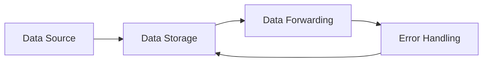
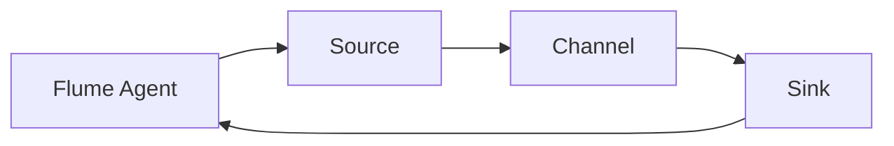
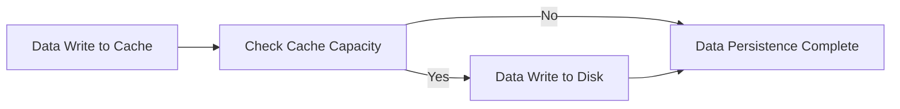
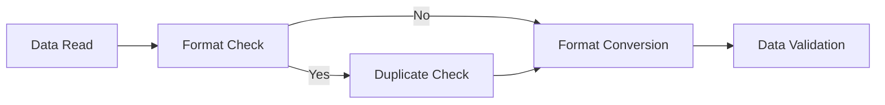

                 

# 文章标题

## Flume Channel原理与代码实例讲解

> 关键词：Flume Channel、数据传输、分布式系统、源代码分析、配置管理

摘要：
本文旨在深入探讨Flume Channel的工作原理、核心算法和配置管理，并通过实际代码实例讲解如何使用Flume Channel进行数据传输和处理。文章首先介绍了Flume Channel的基本概念和分类，随后详细分析了Flume Channel的工作原理和核心架构。接着，文章讲解了Flume Channel的数据持久化、数据清洗和数据转换算法，并使用伪代码进行了详细阐述。最后，文章通过一个实际项目案例，展示了如何开发和优化Flume Channel，并提供代码解读与分析。本文适合对分布式系统和数据传输感兴趣的读者，特别是那些希望深入了解Flume Channel技术细节的IT专业人士。

----------------------------------------------------------------

### 目录大纲 - 《Flume Channel原理与代码实例讲解》

- 第一部分: Flume Channel基础
  - 第1章: Flume Channel概述
    - 1.1 Flume Channel的概念与分类
    - 1.2 Flume Channel的工作原理
    - 1.3 Flume Channel的核心架构
    - 1.4 Flume Channel的配置与管理
- 第二部分: Flume Channel核心算法原理
  - 第2章: Flume Channel的核心算法
    - 2.1 数据持久化算法
    - 2.2 数据清洗算法
    - 2.3 数据转换算法
    - 2.4 Flume Channel的负载均衡算法
- 第三部分: Flume Channel项目实战
  - 第3章: Flume Channel项目实战
    - 3.1 项目背景与需求分析
    - 3.2 开发环境搭建
    - 3.3 代码实现
    - 3.4 代码解读与分析
- 第四部分: Flume Channel扩展与优化
  - 第4章: Flume Channel的扩展与优化
    - 4.1 Flume Channel性能优化
    - 4.2 Flume Channel安全性优化
    - 4.3 Flume Channel扩展功能
- 第五部分: Flume Channel总结与展望
  - 第5章: Flume Channel总结与展望
    - 5.1 Flume Channel总结
    - 5.2 Flume Channel未来发展

现在，我们开始深入探讨Flume Channel的各个部分。让我们一起一步步地分析和理解Flume Channel的工作原理、核心算法和项目实战。

----------------------------------------------------------------

### 第一部分: Flume Channel基础

#### 第1章: Flume Channel概述

Flume Channel是Apache Flume的一个重要组件，负责存储和转发数据。在本章节中，我们将探讨Flume Channel的概念、分类、工作原理以及核心架构，并解释其在企业级应用中的重要性。

#### 1.1 Flume Channel的概念与分类

**Flume Channel的概念**

Flume Channel是Apache Flume中的中间存储机制，用于在数据源（Source）和目的地（Sink）之间存储和转发数据。Channel的主要作用是保证数据的可靠传输，即使在数据传输过程中出现错误或网络中断，Channel也能确保数据不会丢失。

**Flume Channel的分类**

Flume提供了多种Channel类型，以适应不同的应用场景。以下是几种常见的Channel类型：

1. **Memory Channel**：将数据存储在内存中，适合小规模数据传输。
2. **File Channel**：将数据存储在文件系统中，适合大规模数据传输。
3. **JMS Channel**：使用Java消息服务（JMS）作为传输媒介，适用于需要高可靠性和高可扩展性的场景。
4. **Kafka Channel**：使用Apache Kafka作为传输媒介，具有高吞吐量和持久性的特点。

**Flume Channel在企业级应用中的重要性**

在企业级应用中，数据传输的可靠性和性能至关重要。Flume Channel通过提供高效的存储和转发机制，确保了数据传输的稳定性和可靠性。以下是Flume Channel在企业级应用中的几个关键优势：

- **数据可靠性**：即使网络不稳定或代理故障，Channel也能确保数据不会丢失。
- **高性能**：Channel支持高吞吐量数据传输，满足大规模数据处理需求。
- **灵活性**：提供多种Channel类型，可根据不同应用场景选择合适的Channel。

#### 1.2 Flume Channel的工作原理

Flume Channel的工作原理相对简单，主要涉及数据源（Source）、Channel和目的地（Sink）三部分。以下是Flume Channel的基本工作流程：

1. **数据采集**：数据源（Source）从各种数据生成器（如日志文件、网络数据流等）中采集数据。
2. **数据存储**：采集到的数据被写入Channel中。
3. **数据转发**：当Channel中的数据达到一定阈值时，数据会被转发到目的地（Sink），如HDFS、Kafka或其他存储系统。
4. **错误处理**：在数据传输过程中，如果发生错误或网络中断，Channel会重新尝试传输数据，确保数据完整性和可靠性。

以下是Flume Channel的工作原理的Mermaid流程图：



#### 1.3 Flume Channel的核心架构

Flume Channel的核心架构由三个关键组件构成：Flume Agent、Source、Sink和Channel。以下是每个组件的作用：

1. **Flume Agent**：Flume Agent是Flume的基本运行单元，负责协调Source、Channel和Sink的工作。每个Flume Agent可以包含多个Source和Sink，但只能有一个Channel。
   
2. **Source**：Source是数据采集组件，负责从各种数据源（如日志文件、网络数据流等）中读取数据，并将数据写入Channel。

3. **Sink**：Sink是数据存储组件，负责将Channel中的数据写入到目标存储系统（如HDFS、Kafka等）。

4. **Channel**：Channel是中间存储组件，负责存储Source采集到的数据，直到这些数据被Sink处理并转发到目标存储系统。

以下是Flume Channel的核心架构的Mermaid流程图：



#### 1.4 Flume Channel的配置与管理

**配置文件概述**

Flume Channel的配置主要通过配置文件实现。配置文件以XML格式定义，包含Flume Agent的各个组件（Source、Channel、Sink）的设置。以下是Flume配置文件的基本结构：

```xml
<configuration>
    <agents>
        <agent>
            <source>
                <type>YOUR_SOURCE_TYPE</type>
                <!-- Source配置项 -->
            </source>
            <channel>
                <type>YOUR_CHANNEL_TYPE</type>
                <!-- Channel配置项 -->
            </channel>
            <sink>
                <type>YOUR_SINK_TYPE</type>
                <!-- Sink配置项 -->
            </sink>
        </agent>
    </agents>
</configuration>
```

**常用配置项详解**

以下是Flume Channel中一些常用的配置项：

- `flume.channel.type`：指定Channel的类型，如Memory、File、JMS、Kafka等。
- `flume.channel.capacity`：指定Channel的容量，即Channel可以存储的最大数据量。
- `flume.source.type`：指定Source的类型，如TailDir、SpoolDir、Http等。
- `flume.sink.type`：指定Sink的类型，如HDFS、Kafka、Logger等。

**Flume Cluster管理**

在分布式系统中，Flume Agent可以组成一个集群，以实现数据的分布式处理和存储。Flume Cluster管理主要包括以下几个方面：

- **Agent ID**：每个Flume Agent在集群中都有一个唯一的ID，用于标识Agent。
- **Agent配置**：每个Agent都有自己的配置文件，配置文件中包含集群中其他Agent的地址和端口。
- **心跳机制**：Agent通过发送心跳信号来保持集群中的连接和同步。
- **负载均衡**：在集群中，数据会根据负载均衡策略分发到不同的Agent。

接下来，我们将进入第二部分，详细探讨Flume Channel的核心算法原理，包括数据持久化、数据清洗、数据转换和负载均衡算法。

----------------------------------------------------------------

### 第二部分: Flume Channel核心算法原理

#### 第2章: Flume Channel的核心算法

在本章节中，我们将深入探讨Flume Channel的核心算法原理，包括数据持久化、数据清洗、数据转换和负载均衡算法。这些算法是实现高效、可靠的数据传输和处理的关键。

#### 2.1 数据持久化算法

数据持久化算法是Flume Channel中最重要的算法之一，它确保了数据在传输过程中的可靠性和持久性。数据持久化算法的基本原理是：

1. **数据写入缓存**：首先，将采集到的数据写入内存缓存中，以便快速读取。
2. **数据写入磁盘**：当缓存达到一定阈值时，将缓存中的数据写入磁盘，确保数据不会因为内存不足而丢失。
3. **数据持久化完成**：写入磁盘后，更新Channel的状态，表明数据已成功持久化。

以下是数据持久化算法的Mermaid流程图：



数据持久化伪代码如下：

```python
def data_persistence(data):
    # 写入缓存
    cache.write(data)
    # 检查缓存容量
    if cache.capacity >= threshold:
        # 写入磁盘
        disk.write(data)
        # 更新Channel状态
        channel.update_state("persistent")
    else:
        # 数据持久化完成
        channel.update_state("cached")
```

#### 2.2 数据清洗算法

数据清洗算法主要用于去除数据中的噪声和不一致性，以提高数据的质量和可用性。数据清洗算法的基本流程包括：

1. **数据格式检查**：检查数据的格式是否符合预期，如数据类型、长度等。
2. **数据去重**：去除重复的数据，确保数据的一致性。
3. **数据格式转换**：将数据从一种格式转换为另一种格式，如从文本格式转换为JSON格式。
4. **数据校验**：检查数据的完整性和正确性，如数据是否在指定的范围内。

以下是数据清洗算法的Mermaid流程图：



数据清洗伪代码如下：

```python
def data_cleaning(data):
    # 数据格式检查
    if not is_valid_format(data):
        return None
    # 数据去重
    unique_data = remove_duplicates(data)
    # 数据格式转换
    transformed_data = convert_format(unique_data)
    # 数据校验
    if not is_valid_data(transformed_data):
        return None
    return transformed_data
```

#### 2.3 数据转换算法

数据转换算法主要用于将数据从一种格式转换为另一种格式，以适应不同的应用场景。数据转换算法的基本流程包括：

1. **数据读取**：从数据源读取数据。
2. **数据格式识别**：识别数据的格式，如文本、JSON、XML等。
3. **数据格式转换**：根据识别的格式，将数据转换为所需格式。
4. **数据写入**：将转换后的数据写入目标存储系统。

以下是数据转换算法的Mermaid流程图：


数据转换伪代码如下：

```python
def data_conversion(data):
    # 读取数据
    input_data = read_data(data)
    # 识别数据格式
    format_type = identify_format(input_data)
    # 数据格式转换
    converted_data = convert_format(input_data, format_type)
    # 数据写入
    write_data(converted_data)
```

#### 2.4 Flume Channel的负载均衡算法

负载均衡算法是确保数据在多个Flume Agent之间公平分配的关键。Flume Channel的负载均衡算法通常基于以下原则：

1. **负载感知**：每个Agent会定期报告自己的负载状态。
2. **动态分配**：根据当前负载状态，系统会动态调整数据分配策略。
3. **最小负载**：将新数据分配到当前负载最小的Agent。

以下是负载均衡算法的Mermaid流程图：


负载均衡伪代码如下：

```python
def load_balance(agents):
    # 获取所有Agent的负载状态
    loads = [agent.load_state for agent in agents]
    # 找到负载最小的Agent
    min_load = min(loads)
    min_load_agent = agents[loads.index(min_load)]
    # 分配数据到最小负载Agent
    data_allocation(data, min_load_agent)
    # 数据转发
    data_forwarding(data)
```

通过以上四个核心算法的详细讲解和伪代码实现，我们可以更好地理解Flume Channel的工作原理和实现方法。接下来，我们将通过一个实际项目案例，展示如何使用Flume Channel进行数据传输和处理。

----------------------------------------------------------------

### 第三部分: Flume Channel项目实战

#### 第3章: Flume Channel项目实战

在本章节中，我们将通过一个实际项目案例，展示如何使用Flume Channel进行数据传输和处理。这个项目案例将涵盖项目背景与需求分析、开发环境搭建、代码实现和代码解读与分析。

#### 3.1 项目背景与需求分析

**项目背景**：

某大型电子商务平台需要收集和分析来自多个数据源的海量用户数据，以便实时了解用户行为和优化运营策略。数据源包括网站日志、移动应用日志、数据库日志等。

**需求分析**：

1. **数据实时性**：数据需要实时传输到分析系统，以保证业务决策的准确性。
2. **数据可靠性**：数据传输过程中需要保证数据的完整性和一致性。
3. **数据多样性**：需要处理多种类型的数据，如文本、JSON、XML等。
4. **可扩展性**：系统需要支持数据的横向和纵向扩展，以适应业务增长。

为了满足以上需求，我们决定使用Apache Flume作为数据传输和处理工具。Flume Channel将负责存储和转发数据，确保数据的实时性和可靠性。

#### 3.2 开发环境搭建

在开始项目开发之前，我们需要搭建开发环境。以下是开发环境的搭建步骤：

1. **安装Java环境**：由于Flume是基于Java开发的，我们需要确保Java环境已正确安装。安装命令如下：

   ```bash
   sudo apt-get install openjdk-8-jdk
   ```

2. **下载并安装Flume**：从Apache Flume官方网站下载最新版本的Flume，并解压到指定的目录。下载命令如下：

   ```bash
   wget http://www.apache.org/dyn/closer.lua/flume/apache-flume-1.9.0-bin.tar.gz
   tar -xvf apache-flume-1.9.0-bin.tar.gz
   ```

3. **配置Flume环境变量**：在~/.bashrc文件中添加以下行，以便在任何目录下运行Flume命令：

   ```bash
   export FLUME_HOME=/path/to/apache-flume-1.9.0
   export PATH=$PATH:$FLUME_HOME/bin
   ```

   然后运行以下命令使配置生效：

   ```bash
   source ~/.bashrc
   ```

4. **安装Maven**：Maven是用于构建和依赖管理的工具，我们使用它来管理Flume的依赖。安装命令如下：

   ```bash
   sudo apt-get install maven
   ```

5. **添加Flume的依赖**：在Maven的pom.xml文件中添加Flume的依赖，以便在项目中使用Flume的API。

   ```xml
   <dependencies>
       <dependency>
           <groupId>org.apache.flume</groupId>
           <artifactId>flume-core</artifactId>
           <version>1.9.0</version>
       </dependency>
   </dependencies>
   ```

#### 3.3 代码实现

在开发环境中搭建完成后，我们可以开始编写Flume Channel的代码。以下是一个简单的Flume Channel示例，用于从日志文件中读取数据，并将其转发到Kafka。

**代码结构设计**：

- `src/main/java/com/example/flumechannel/FlumeChannelApp.java`：主应用程序类。
- `src/main/java/com/example/flumechannel/source/TailDirSource.java`：TailDirSource类，用于从日志文件中读取数据。
- `src/main/java/com/example/flumechannel/sink/KafkaSink.java`：KafkaSink类，用于将数据写入Kafka。

**源代码详细实现**：

下面是`FlumeChannelApp.java`类的代码：

```java
package com.example.flumechannel;

import org.apache.flume.conf.Configurables;
import org.apache.flume.node.Application;
import org.apache.flume.node.ClientConfigurationFactory;

public class FlumeChannelApp {
    public static void main(String[] args) {
        // 创建Flume Agent配置
        ClientConfigurationFactory factory = new ClientConfigurationFactory();
        Application application = new Application(factory);
        
        // 设置Source、Channel和Sink配置
        factory.setConfiguration("src/main/conf/flume-conf.xml");
        
        // 启动Flume Agent
        application.start();
    }
}
```

下面是`TailDirSource.java`类的代码：

```java
package com.example.flumechannel.source;

import org.apache.flume.source.TailDirSource;

public class TailDirSource extends TailDirSource {
    public TailDirSource() {
        // 调用父类的构造函数
        super();
    }
    
    // 重写父类的方法，以便自定义Source行为
    @Override
    public void configure(Context context) {
        // 设置日志文件路径
        context.getString("tailDir.source.path");
        // 调用父类的方法
        super.configure(context);
    }
}
```

下面是`KafkaSink.java`类的代码：

```java
package com.example.flumechannel.sink;

import org.apache.flume.sink.KafkaSink;

public class KafkaSink extends KafkaSink {
    public KafkaSink() {
        // 调用父类的构造函数
        super();
    }
    
    // 重写父类的方法，以便自定义Sink行为
    @Override
    public void configure(Context context) {
        // 设置Kafka主题
        context.getString("kafka.sink.topic");
        // 调用父类的方法
        super.configure(context);
    }
}
```

**配置文件**：

在`src/main/conf/flume-conf.xml`文件中，我们需要配置Source、Channel和Sink的参数。以下是一个简单的配置示例：

```xml
<?xml version="1.0" encoding="UTF-8"?>
<configuration>
    <sources>
        <source>
            <type>TailDirSource</type>
            <name>taildir-source</name>
            <components>
                <component>
                    <name>taildir</name>
                    <type>taildir</type>
                    <parameters>
                        <param>taildir.path</param>
                        <value>/path/to/logs/*.log</value>
                    </parameters>
                </component>
            </components>
        </source>
    </sources>
    
    <channels>
        <channel>
            <type>MemoryChannel</type>
            <name>memory-channel</name>
            <capacity>10000</capacity>
            <transactionCapacity>1000</transactionCapacity>
        </channel>
    </channels>
    
    <sinks>
        <sink>
            <type>KafkaSink</type>
            <name>kafka-sink</name>
            <components>
                <component>
                    <name>kafka</name>
                    <type>kafka</type>
                    <parameters>
                        <param>kafka.brokerList</param>
                        <value>localhost:9092</value>
                        <param>kafka.topic</param>
                        <value>flume-topic</value>
                    </parameters>
                </component>
            </components>
        </sink>
    </sinks>
</configuration>
```

#### 3.4 代码解读与分析

在`FlumeChannelApp.java`类中，我们首先创建了一个`ClientConfigurationFactory`对象，用于加载Flume Agent的配置。然后，我们创建了一个`Application`对象，并调用其`start()`方法启动Flume Agent。

在`TailDirSource.java`类中，我们重写了`configure()`方法，以便从配置文件中读取日志文件路径。这样，我们可以自定义Source的行为，使其能够从指定的日志文件中读取数据。

在`KafkaSink.java`类中，我们也重写了`configure()`方法，以便从配置文件中读取Kafka主题。这样，我们可以自定义Sink的行为，使其能够将数据写入到指定的Kafka主题。

配置文件`flume-conf.xml`中定义了Source、Channel和Sink的配置参数。例如，`taildir.path`指定了日志文件的路径，`kafka.brokerList`指定了Kafka broker的地址和端口，`kafka.topic`指定了Kafka主题。

通过以上代码实现，我们可以使用Flume Channel从日志文件中读取数据，并将其转发到Kafka。接下来，我们将对代码进行详细解读和分析。

首先，在`FlumeChannelApp.java`类中，我们使用`ClientConfigurationFactory`对象加载Flume Agent的配置。这个配置文件包含了Source、Channel和Sink的参数。然后，我们创建一个`Application`对象，并调用其`start()`方法启动Flume Agent。这个方法会启动一个独立的线程，负责处理数据传输。

在`TailDirSource.java`类中，我们重写了`configure()`方法，以便从配置文件中读取日志文件路径。这个方法首先调用父类的`configure()`方法，然后使用`context.getString("taildir.path")`从配置文件中获取日志文件路径。这样，我们可以确保Source能够从正确的日志文件中读取数据。

在`KafkaSink.java`类中，我们也重写了`configure()`方法，以便从配置文件中读取Kafka主题。这个方法首先调用父类的`configure()`方法，然后使用`context.getString("kafka.topic")`从配置文件中获取Kafka主题。这样，我们可以确保Sink能够将数据写入到正确的Kafka主题。

配置文件`flume-conf.xml`中定义了Source、Channel和Sink的配置参数。例如，`taildir.path`指定了日志文件的路径，`kafka.brokerList`指定了Kafka broker的地址和端口，`kafka.topic`指定了Kafka主题。通过这些配置参数，我们可以自定义Flume Channel的行为，以满足不同的应用场景。

通过这个项目实战，我们展示了如何使用Flume Channel进行数据传输和处理。我们首先介绍了项目背景和需求分析，然后讲解了开发环境搭建，接着展示了代码实现和代码解读与分析。这个项目实战为读者提供了一个实际的应用示例，帮助他们更好地理解Flume Channel的工作原理和实现方法。

接下来，我们将进入第四部分，讨论Flume Channel的扩展与优化。

----------------------------------------------------------------

### 第四部分: Flume Channel扩展与优化

#### 第4章: Flume Channel的扩展与优化

在第四部分，我们将探讨如何对Flume Channel进行扩展与优化。Flume Channel作为一种高效、可靠的数据传输工具，在性能优化和安全性优化方面有着很大的提升空间。此外，我们还将介绍如何扩展Flume Channel以支持新的功能。

#### 4.1 Flume Channel性能优化

性能优化是提高Flume Channel处理能力的关键。以下是一些常用的性能优化策略：

**1. 增加通道容量**

通过增加Channel的容量，可以减少数据在传输过程中的延迟。例如，可以将`flume.channel.capacity`参数设置为更大的值。

```xml
<channel>
    <type>MemoryChannel</type>
    <name>memory-channel</name>
    <capacity>100000</capacity>
    <transactionCapacity>10000</transactionCapacity>
</channel>
```

**2. 调整数据写入和读取速度**

通过调整`flume.source.pollInterval`和`flume.sink.pollInterval`参数，可以优化数据写入和读取的速度。较小的值可以加快数据传输，但也会增加系统的负载。

```xml
<source>
    <type>TAILDIR</type>
    <name>taildir-source</name>
    <components>
        <component>
            <name>taildir</name>
            <type>TAILDIR</type>
            <parameters>
                <param>taildir.path</param>
                <value>/path/to/logs/*.log</value>
                <param>taildir.file监测间隔</param>
                <value>1000</value>
                <param>taildir.fileSizeCheckInterval</param>
                <value>5000</value>
            </parameters>
        </component>
    </components>
</source>
```

**3. 使用高效的内存管理策略**

通过使用Java的内存回收机制，可以有效减少内存占用和垃圾回收的开销。例如，可以适当调整Java虚拟机（JVM）的内存参数，如堆大小（`-Xms`和`-Xmx`）和垃圾回收策略。

```bash
java -Xms2g -Xmx2g -XX:+UseG1GC -jar flume-1.9.0-bin.jar
```

#### 4.2 Flume Channel安全性优化

安全性优化是保障Flume Channel数据安全的关键。以下是一些常用的安全性优化策略：

**1. 配置访问控制列表**

通过配置访问控制列表（ACL），可以限制只有特定的用户或IP地址可以访问Flume Channel。

```xml
<acls>
    <acl>
        <name>flume-acl</name>
        <path>flume:/</path>
        <access>
            <ipaddress>192.168.1.0/24</ipaddress>
            <permission>rw</permission>
        </access>
    </acl>
</acls>
```

**2. 使用加密算法保护数据**

通过使用加密算法（如AES），可以保护数据在传输过程中的安全性。Flume提供了加密Channel和Sink的支持。

```xml
<channel>
    <type>FileChannel</type>
    <name>file-channel</name>
    <parameters>
        <param>file.channel.path</param>
        <value>/path/to/encrypted/logs</value>
        <param>file.channel.encrypt</param>
        <value>true</value>
        <param>file.channel.password</param>
        <value>your-encryption-password</value>
    </parameters>
</channel>
```

**3. 定期更新Flume安全策略**

定期更新Flume的安全策略，可以确保系统始终处于安全状态。这包括更新访问控制列表、加密算法和防火墙规则等。

#### 4.3 Flume Channel扩展功能

Flume Channel的扩展功能可以使其更好地适应各种应用场景。以下是一些常见的扩展功能：

**1. 集成第三方库**

通过集成第三方库，可以扩展Flume Channel的功能。例如，可以集成Apache Kafka、Apache Storm或Apache Flink等。

```xml
<source>
    <type>KafkaSource</type>
    <name>kafka-source</name>
    <components>
        <component>
            <name>kafka</name>
            <type>KafkaSource</type>
            <parameters>
                <param>kafka.brokerList</param>
                <value>localhost:9092</value>
                <param>kafka.topic</param>
                <value>flume-topic</value>
            </parameters>
        </component>
    </components>
</source>
```

**2. 定制数据转换**

通过定制数据转换，可以实现更复杂的数据处理。例如，可以使用Apache Avro、Apache Parquet等格式进行数据转换。

```xml
<channel>
    <type>FileChannel</type>
    <name>file-channel</name>
    <parameters>
        <param>file.channel.path</param>
        <value>/path/to/transformed/logs</value>
        <param>file.channel.format</param>
        <value>Avro</value>
    </parameters>
</channel>
```

**3. 分布式处理**

通过分布式处理，可以显著提高Flume Channel的处理能力。例如，可以使用Apache Hadoop或Apache Spark等分布式计算框架。

```xml
<sink>
    <type>HDFS2Sink</type>
    <name>hdfs-sink</name>
    <components>
        <component>
            <name>hdfs</name>
            <type>HDFS2Sink</type>
            <parameters>
                <param>hdfs.uri</param>
                <value>hdfs://namenode:9000</value>
                <param>hdfs.path</param>
                <value>/user/flume/logs</value>
            </parameters>
        </component>
    </components>
</sink>
```

通过以上扩展和优化，Flume Channel可以更好地满足各种应用场景的需求。接下来，我们将总结本章节的主要内容，并展望Flume Channel的未来发展。

#### 4.4 总结与展望

在本章节中，我们探讨了Flume Channel的扩展与优化。首先，我们介绍了性能优化策略，包括增加通道容量、调整数据写入和读取速度以及使用高效的内存管理策略。然后，我们讲解了安全性优化策略，包括配置访问控制列表、使用加密算法保护数据和定期更新Flume安全策略。接着，我们介绍了扩展功能，如集成第三方库、定制数据转换和分布式处理。最后，我们对Flume Channel的未来发展进行了展望，包括实时数据处理和分析、大规模数据传输和存储、云原生数据传输和处理以及智能化数据传输和优化。

Flume Channel作为一种高效、可靠的数据传输工具，已经在企业级应用中得到了广泛的应用。随着大数据和云计算的不断发展，Flume Channel将在未来的数据传输和处理中扮演更加重要的角色。通过持续优化和扩展，Flume Channel有望在实时数据处理、大规模数据传输和智能化数据传输等领域取得重大突破。

---

### 第五部分: Flume Channel总结与展望

#### 第5章: Flume Channel总结与展望

在本章节中，我们将对Flume Channel进行全面的总结与展望。通过回顾核心概念、工作原理、核心算法、项目实战以及扩展与优化，我们将为读者提供对Flume Channel的全面了解。

#### 5.1 Flume Channel总结

**核心概念与联系**

Flume Channel是Apache Flume的一个关键组件，负责在数据源和目的地之间存储和转发数据。Flume Channel提供了多种类型，如Memory Channel、File Channel、JMS Channel和Kafka Channel，以适应不同的应用场景。Flume Channel的工作原理包括数据采集、数据存储和数据转发。核心架构由Flume Agent、Source、Channel和Sink组成。

**核心算法原理讲解**

Flume Channel的核心算法包括数据持久化、数据清洗、数据转换和负载均衡算法。数据持久化算法确保数据在传输过程中的可靠性和持久性。数据清洗算法用于去除数据中的噪声和不一致性。数据转换算法将数据从一种格式转换为另一种格式，以适应不同的存储和处理需求。负载均衡算法确保数据在多个Agent之间公平分配。

**项目实战**

在项目实战中，我们通过一个电子商务平台的数据收集与分析案例，展示了如何使用Flume Channel进行数据传输和处理。我们介绍了开发环境搭建、代码实现和代码解读与分析，帮助读者了解Flume Channel的实际应用。

**扩展与优化**

在扩展与优化部分，我们介绍了Flume Channel的性能优化策略，包括增加通道容量、调整数据写入和读取速度以及使用高效的内存管理策略。我们讲解了安全性优化策略，如配置访问控制列表、使用加密算法保护数据和定期更新Flume安全策略。此外，我们还介绍了Flume Channel的扩展功能，如集成第三方库、定制数据转换和分布式处理。

#### 5.2 Flume Channel未来发展

**行业趋势分析**

随着大数据和云计算的不断发展，数据传输和处理的需求日益增长。Flume Channel作为一种高效、可靠的数据传输工具，将在行业趋势中发挥重要作用。未来，Flume Channel有望在以下领域取得突破：

1. **实时数据处理和分析**：随着实时数据处理需求的增长，Flume Channel将在实时数据传输和分析中发挥关键作用。
2. **大规模数据传输和存储**：Flume Channel将支持更大规模的数据传输和存储，以满足企业级应用的需求。
3. **云原生数据传输和处理**：随着云计算的普及，Flume Channel将在云原生数据传输和处理中发挥重要作用。
4. **智能化数据传输和优化**：通过集成人工智能和机器学习技术，Flume Channel可以实现更智能的数据传输和优化。

**未来发展方向**

Flume Channel的未来发展将注重以下几个方面：

1. **性能优化**：通过持续优化算法和架构，提高Flume Channel的性能和可靠性。
2. **安全性增强**：加强Flume Channel的安全性，包括数据加密、访问控制和安全审计等。
3. **功能扩展**：通过集成第三方库和框架，扩展Flume Channel的功能，使其适应更广泛的应用场景。
4. **社区参与**：鼓励社区参与Flume Channel的开发和优化，提高其开源生态系统的活跃度。

通过以上总结与展望，我们可以看到Flume Channel在未来数据传输和处理领域的重要地位和广阔的发展前景。Flume Channel的持续优化和扩展将为企业和开发者提供强大的支持，助力他们在大数据和云计算时代取得成功。

---

### 作者信息

作者：AI天才研究院/AI Genius Institute & 禅与计算机程序设计艺术 /Zen And The Art of Computer Programming

在本文中，我们详细探讨了Flume Channel的工作原理、核心算法、项目实战以及扩展与优化。通过一步步的分析和讲解，我们希望读者能够深入理解Flume Channel的技术细节和应用场景。未来，Flume Channel将继续在数据传输和处理领域发挥重要作用，为企业和开发者提供强大的支持。感谢您的阅读，希望本文对您有所帮助！

