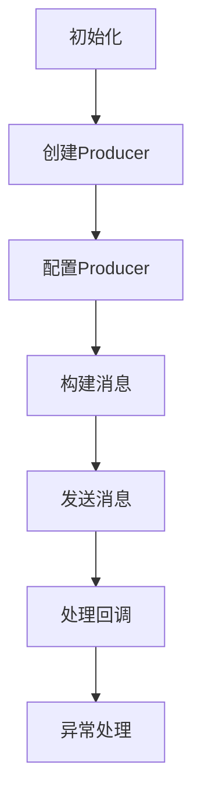

                 

# 《Kafka Producer原理与代码实例讲解》

> **关键词：** Kafka, Producer, 消息队列, 分布式系统, 高并发, 性能优化

> **摘要：** 本文将深入讲解Kafka Producer的工作原理，包括其架构、API、配置、性能优化和故障处理。同时，我们将通过具体的代码实例，详细解读Kafka Producer的核心实现，帮助读者全面理解Kafka Producer的实际应用。

### 第一部分: Kafka Producer基础

#### 1.1 Kafka Producer概述

##### 1.1.1 Kafka架构介绍

Apache Kafka是一个分布式流处理平台，旨在处理实时数据流。Kafka的核心组件包括Producer、Broker和Consumer。

- **Producer**：生产者，负责将数据推送到Kafka集群。
- **Broker**：代理，是Kafka集群中的服务器，负责存储和转发消息。
- **Consumer**：消费者，负责从Kafka集群中拉取并处理消息。


##### 1.1.2 Producer在Kafka中的角色

Producer在Kafka中的作用至关重要，其主要职责包括：

- **发送消息**：将数据发送到Kafka集群的特定Topic中。
- **分区和负载均衡**：根据分区策略，将消息发送到不同的Partition，实现负载均衡。
- **可靠性保证**：确保消息的可靠传输，提供重试和故障恢复机制。

#### 1.2 Kafka Producer API介绍

##### 1.2.1 Producer API功能

Kafka提供了丰富的Producer API，主要功能包括：

- **发送单条消息**：使用`send()`方法发送单条消息。
- **发送批量消息**：使用`send()`方法发送批量消息，提高发送效率。
- **异步发送**：使用回调函数处理发送结果，提高发送效率。
- **事务消息**：支持事务消息，确保消息的原子性。

##### 1.2.2 Producer API基本用法

以下是一个简单的Kafka Producer API使用示例：

```java
Properties props = new Properties();
props.put("bootstrap.servers", "localhost:9092");
props.put("key.serializer", "org.apache.kafka.common.serialization.StringSerializer");
props.put("value.serializer", "org.apache.kafka.common.serialization.StringSerializer");

KafkaProducer<String, String> producer = new KafkaProducer<>(props);

for (int i = 0; i < 100; i++) {
    producer.send(new ProducerRecord<>("test", Integer.toString(i), "value" + Integer.toString(i)), new Callback() {
        public void onCompletion(RecordMetadata metadata, Exception exception) {
            if (exception != null) {
                // 处理发送异常
            } else {
                // 处理发送成功
            }
        }
    });
}

producer.close();
```

#### 1.3 Kafka消息格式

##### 1.3.1 消息结构

Kafka消息由以下几部分组成：

- **Header**：消息头，包含消息的元数据，如CRC校验值、消息长度等。
- **Key**：消息键，用于消息的分区和查找。
- **Value**：消息值，实际的消息数据。
- **Timestamp**：消息时间戳，表示消息的产生时间。


##### 1.3.2 消息序列化

消息序列化是将Java对象转换为字节数组的过程，Kafka支持自定义序列化器。常见的序列化器包括：

- **StringSerializer**：将字符串转换为字节数组。
- **IntegerSerializer**：将整数转换为字节数组。
- **ByteArraySerializer**：将字节数组转换为字节数组。

#### 1.4 Kafka Producer配置

##### 1.4.1 Producer重要配置项

Kafka Producer的配置项主要包括：

- **bootstrap.servers**：Kafka集群的地址列表，用于初始化连接。
- **key.serializer**：消息键的序列化器。
- **value.serializer**：消息值的序列化器。
- **batch.size**：批量发送的消息大小，默认为16KB。
- **linger.ms**：发送消息的等待时间，默认为0。
- **buffer.memory**：Producer缓冲区的内存大小，默认为32MB。

##### 1.4.2 配置最佳实践

以下是一些配置最佳实践：

- **合理设置batch.size和linger.ms**：根据网络带宽和消息大小，合理设置batch.size和linger.ms，提高发送效率。
- **增加buffer.memory**：根据消息量和发送频率，适当增加buffer.memory，避免缓冲区溢出。
- **优化序列化器**：选择高效的序列化器，减少序列化时间。

#### 1.5 Kafka核心概念

##### 1.5.1 Topic与Partition

- **Topic**：主题，是Kafka中消息分类的命名空间。
- **Partition**：分区，是Topic的一个分区，用于存储消息。

每个Topic都可以有多个Partition，Partition之间的消息顺序是严格保证的。

##### 1.5.2 Offset与序列号

- **Offset**：偏移量，是Kafka消息的唯一标识。
- **序列号**：是消息在Partition中的顺序编号。

Offset和序列号共同确定了消息的位置和顺序。

#### 1.6 Kafka Producer性能优化

##### 1.6.1 线程模型与负载均衡

Kafka Producer提供了多种线程模型，如单线程模型、多线程模型等。合理选择线程模型，可以实现负载均衡。

##### 1.6.2 消息批量发送

批量发送消息可以提高发送效率，减少网络延迟。

#### 1.7 Kafka Producer故障处理

##### 1.7.1 异常处理与重试策略

Producer发送消息时可能会遇到各种异常，如网络异常、超时异常等。合理处理异常和设置重试策略，可以提高消息的可靠性。

##### 1.7.2 Producer集群部署与容错

Producer可以部署在多个节点上，实现故障转移和容错。

### 第二部分: Kafka Producer原理与代码实例

#### 2.1 Kafka Producer原理

##### 2.1.1 消息发送流程

Kafka Producer的消息发送流程主要包括以下几个步骤：

1. **初始化**：加载配置，创建Producer对象。
2. **构建消息**：构建消息对象，包括Key、Value、Topic、Partition等。
3. **发送消息**：调用`send()`方法，将消息发送到Kafka集群。
4. **处理回调**：根据发送结果，处理回调函数。
5. **异常处理**：处理发送异常，设置重试策略。


##### 2.1.2 分区策略

Kafka Producer提供了多种分区策略，如：

- **随机分区**：随机选择Partition。
- **轮询分区**：按照一定的顺序轮询Partition。
- **自定义分区**：根据Key进行分区。

##### 2.1.3 剖析Producer配置

Kafka Producer的配置对性能和可靠性有重要影响，包括：

- **bootstrap.servers**：Kafka集群的地址列表。
- **key.serializer**、**value.serializer**：消息序列化器。
- **batch.size**、**linger.ms**：批量发送消息的配置。
- **buffer.memory**：Producer缓冲区的内存大小。
- **acks**、**retries**：消息可靠性配置。

#### 2.2 Kafka Producer代码实例讲解

##### 2.2.1 环境搭建

1. **Kafka环境配置**：安装并配置Kafka集群。
2. **Maven依赖配置**：在项目中添加Kafka依赖。

```xml
<dependencies>
    <dependency>
        <groupId>org.apache.kafka</groupId>
        <artifactId>kafka-clients</artifactId>
        <version>2.8.0</version>
    </dependency>
</dependencies>
```

##### 2.2.2 简单示例

以下是一个简单的Kafka Producer代码示例，用于发送单条消息：

```java
Properties props = new Properties();
props.put("bootstrap.servers", "localhost:9092");
props.put("key.serializer", "org.apache.kafka.common.serialization.StringSerializer");
props.put("value.serializer", "org.apache.kafka.common.serialization.StringSerializer");

KafkaProducer<String, String> producer = new KafkaProducer<>(props);

producer.send(new ProducerRecord<>("test", "key", "value"));

producer.close();
```

##### 2.2.3 复杂示例

以下是一个复杂的Kafka Producer代码示例，用于发送批量消息和异步处理：

```java
Properties props = new Properties();
props.put("bootstrap.servers", "localhost:9092");
props.put("key.serializer", "org.apache.kafka.common.serialization.StringSerializer");
props.put("value.serializer", "org.apache.kafka.common.serialization.StringSerializer");
props.put("batch.size", "16384");
props.put("linger.ms", "1");
props.put("buffer.memory", "33554432");

KafkaProducer<String, String> producer = new KafkaProducer<>(props);

List<ProducerRecord<String, String>> records = new ArrayList<>();
for (int i = 0; i < 100; i++) {
    records.add(new ProducerRecord<>("test", Integer.toString(i), "value" + Integer.toString(i)));
}

producer.send(records, new Callback() {
    public void onCompletion(RecordMetadata metadata, Exception exception) {
        if (exception != null) {
            // 处理发送异常
        } else {
            // 处理发送成功
        }
    }
});

producer.close();
```

#### 2.3 代码解读与分析

##### 2.3.1 Producer源码结构

Kafka Producer的源码结构主要包括以下几个部分：

- **初始化**：加载配置，创建Producer对象。
- **发送消息**：构建消息对象，调用`send()`方法发送消息。
- **处理回调**：根据发送结果，处理回调函数。
- **异常处理**：处理发送异常，设置重试策略。

##### 2.3.2 消息发送流程详细解读

1. **初始化**：加载配置，创建Producer对象。
2. **构建消息**：构建消息对象，包括Key、Value、Topic、Partition等。
3. **发送消息**：调用`send()`方法，将消息发送到Kafka集群。
4. **处理回调**：根据发送结果，处理回调函数。
5. **异常处理**：处理发送异常，设置重试策略。

##### 2.3.3 源码中关键类和方法

- **KafkaProducer**：Producer的核心类，负责发送消息和处理回调。
- **ProducerRecord**：消息对象，用于构建消息。
- **Callback**：回调接口，处理发送结果。

#### 2.4 数学模型和数学公式

##### 2.4.1 Kafka负载均衡算法

Kafka的负载均衡算法使用Hash函数和RicochetHash函数，确保消息均匀分布在Partition上。

$$
\text{Partition} = (\text{Hash}(Key) + \text{ RicochetHash}(Key)) \mod N
$$

其中，N为Partition的数量。

##### 2.4.2 消息序列化与反序列化

消息序列化与反序列化是将Java对象转换为字节数组和将字节数组转换为Java对象的过程。

- **序列化**：将Java对象转换为字节数组。

$$
\text{序列化} : \text{Object} \rightarrow \text{byte}[]
$$

- **反序列化**：将字节数组转换为Java对象。

$$
\text{反序列化} : \text{byte}[] \rightarrow \text{Object}
$$

#### 2.5 项目实战

##### 2.5.1 实际生产环境中Producer使用案例

在实际生产环境中，Kafka Producer的使用需要考虑以下几个方面：

1. **高并发场景下Producer优化**：合理设置batch.size和linger.ms，提高发送效率。
2. **复合消息类型序列化与反序列化**：根据实际需求，选择合适的序列化器，确保消息的序列化和反序列化性能。

##### 2.5.2 源代码实现

1. **Producer配置**：根据实际需求，设置合适的配置项。
2. **消息发送与接收**：发送和接收消息，处理回调和异常。
3. **异常处理与日志记录**：处理发送异常，记录日志，便于问题排查。

#### 2.6 Kafka Producer常见问题与解决方案

##### 2.6.1 Producer消息丢失

解决Producer消息丢失的方法包括：

1. **设置合适的acks**：根据业务需求，设置合适的acks参数，确保消息的可靠性。
2. **重试策略**：设置重试次数和重试间隔，提高消息的发送成功率。

##### 2.6.2 Producer延迟与性能问题

解决Producer延迟与性能问题的方法包括：

1. **优化序列化器**：选择高效的序列化器，减少序列化时间。
2. **增加buffer.memory**：根据消息量和发送频率，适当增加buffer.memory，避免缓冲区溢出。
3. **优化网络配置**：调整网络配置，提高发送效率。

##### 2.6.3 Producer故障处理与恢复策略

解决Producer故障处理与恢复策略的方法包括：

1. **Producer集群部署**：将Producer部署在多个节点上，实现故障转移和容错。
2. **监控与告警**：对Producer进行监控和告警，及时发现和处理故障。

### 第三部分: Kafka Producer高级特性

#### 3.1 Kafka Streams简介

Kafka Streams是一个基于Kafka的实时流处理框架，具有如下特点：

- **高吞吐量**：支持高并发的实时流处理。
- **低延迟**：提供低延迟的流处理能力。
- **易用性**：提供简单的API和丰富的内置函数。

##### 3.1.1 Kafka Streams架构

Kafka Streams的架构主要包括以下几个部分：

- **Streams App**：实时流处理应用程序。
- **Streams Config**：流处理配置。
- **Streams Processor**：流处理处理器，负责处理输入流和输出流。
- **Streams State**：流处理状态存储。


##### 3.1.2 Kafka Streams使用场景

Kafka Streams适用于以下使用场景：

- **实时数据处理**：对实时数据流进行实时处理和分析。
- **实时推荐系统**：基于实时数据流进行实时推荐。
- **实时监控**：对实时数据进行实时监控和告警。

#### 3.2 Kafka Connect简介

Kafka Connect是一个用于数据集成的工具，可以将各种数据源和数据目的地连接到Kafka。Kafka Connect具有如下特点：

- **高扩展性**：支持多种数据源和数据目的地，支持水平扩展。
- **高可靠性**：提供故障恢复和消息可靠性保障。
- **易用性**：提供简单的API和配置。

##### 3.2.1 Kafka Connect架构

Kafka Connect的架构主要包括以下几个部分：

- **Source Connector**：数据源连接器，负责从数据源读取数据。
- **Sink Connector**：数据目的地连接器，负责将数据写入数据目的地。
- **Connector Config**：连接器配置。
- **Connector Manager**：连接器管理器，负责连接器的启动、停止和监控。


##### 3.2.2 Kafka Connect插件开发

Kafka Connect支持自定义插件开发，用于连接自定义数据源和数据目的地。开发Kafka Connect插件的主要步骤包括：

1. **定义插件**：创建插件类，实现连接器接口。
2. **配置插件**：配置插件所需的参数。
3. **部署插件**：将插件部署到Kafka Connect集群。

#### 3.3 Kafka生产者优化实践

##### 3.3.1 JVM调优

JVM调优是提高Kafka Producer性能的关键，主要包括以下几个方面：

1. **垃圾回收优化**：选择合适的垃圾回收器，减少垃圾回收时间。
2. **堆大小调整**：根据消息量和发送频率，调整堆大小，避免内存溢出。
3. **JVM参数优化**：调整JVM参数，提高性能。

##### 3.3.2 网络调优

网络调优是提高Kafka Producer性能的重要方面，主要包括以下几个方面：

1. **TCP参数优化**：调整TCP参数，提高网络传输效率。
2. **DNS优化**：优化DNS查询，减少延迟。
3. **防火墙和网络安全**：确保Kafka Producer和Kafka集群之间的网络畅通和安全。

##### 3.3.3 并发与性能优化

并发与性能优化主要包括以下几个方面：

1. **多线程模型**：根据消息量和发送频率，设置合适的多线程模型。
2. **批量发送**：使用批量发送消息，提高发送效率。
3. **异步发送**：使用异步发送消息，提高并发能力。

#### 3.4 Kafka生产者最佳实践

##### 3.4.1 生产者负载均衡

生产者负载均衡是确保消息均匀分布到Partition上的关键。最佳实践包括：

1. **合理设置分区数**：根据消息量和系统容量，设置合适的分区数。
2. **使用自定义分区策略**：根据实际需求，使用自定义分区策略，实现更精细的负载均衡。

##### 3.4.2 异步发送与批量发送

异步发送与批量发送是提高Kafka Producer性能的有效方法。最佳实践包括：

1. **异步发送**：使用异步发送消息，提高并发能力。
2. **批量发送**：设置合适的批量大小，提高发送效率。

##### 3.4.3 事务消息

事务消息是确保消息顺序和可靠性的重要手段。最佳实践包括：

1. **事务消息配置**：根据实际需求，配置事务消息参数。
2. **事务消息使用**：合理使用事务消息，确保消息的顺序和可靠性。

#### 3.5 Kafka生产者故障处理

##### 3.5.1 Kafka生产者监控与告警

监控与告警是确保Kafka Producer正常运行的重要手段。最佳实践包括：

1. **监控指标**：选择合适的监控指标，如发送延迟、发送成功率等。
2. **告警策略**：设置合适的告警策略，及时发现和处理故障。

##### 3.5.2 Kafka生产者故障转移与恢复策略

故障转移与恢复策略是确保Kafka Producer高可用性的关键。最佳实践包括：

1. **故障转移**：将Producer从故障节点转移到健康节点。
2. **恢复策略**：设置重试策略和异常处理，确保消息的可靠传输。

### 附录

#### 附录 A: Kafka生产者工具与资源

##### A.1 Kafka生产者工具

Kafka生产者工具主要包括：

1. **Kafka-producer-test**：用于测试Kafka Producer的性能和可靠性。
2. **Kafka-producer-perf**：用于测试Kafka Producer的性能。

##### A.2 Kafka生产者资源

Kafka生产者资源主要包括：

1. **Kafka官方文档**：[https://kafka.apache.org/documentation/](https://kafka.apache.org/documentation/)
2. **Kafka社区资源链接**：[https://www.kafka.apache.org/community.html](https://www.kafka.apache.org/community.html)
3. **Kafka生产者相关论文与书籍推荐**：

   - 《Kafka：The Definitive Guide》
   - 《Kafka for Architects》

### Mermaid 流程图



### 作者

**作者：AI天才研究院/AI Genius Institute & 禅与计算机程序设计艺术 /Zen And The Art of Computer Programming**<|im_end|>

