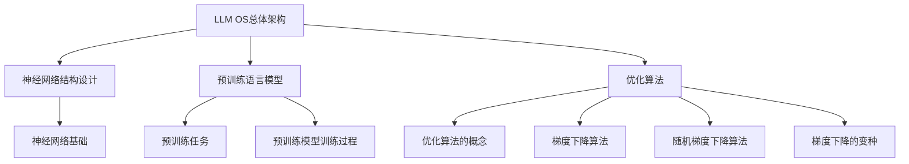

                 

### 《LLM OS:操作系统新贵的崛起》

> **关键词**：LLM OS、神经网络、操作系统、预训练语言模型、优化算法、云计算、边缘计算、AI应用

> **摘要**：本文旨在探讨LLM OS这一新兴操作系统领域，分析其概念、背景、架构设计、核心算法原理及其在各领域的应用，展望其未来发展趋势和社会影响。

### 第一部分：LLM OS概述

#### 第1章：LLM OS的概念与崛起

#### 1.1 什么是LLM OS

**定义LLM OS**：LLM OS，即基于预训练语言模型的操作系统，是一种结合了人工智能技术的新型操作系统。

**比较传统操作系统和LLM OS**：传统操作系统注重硬件资源管理和任务调度，而LLM OS则在此基础上，引入了预训练语言模型，实现了智能化的操作管理。

**LLM OS的优势和特点**：
1. 智能化：利用预训练语言模型，实现自动化任务调度和智能操作。
2. 高效性：通过优化算法，提升系统资源利用率和性能。
3. 可扩展性：能够轻松集成新功能，适应不同应用场景。

#### 1.2 LLM OS的崛起背景

**人工智能与操作系统的结合**：随着人工智能技术的飞速发展，操作系统的智能化需求日益凸显。

**云计算与边缘计算的发展**：云计算和边缘计算对操作系统的性能和智能化提出了更高要求。

**机器学习技术的发展与普及**：预训练语言模型的成熟为LLM OS的实现提供了技术基础。

#### 1.3 LLM OS的核心组件

**神经网络结构**：神经网络是LLM OS的核心组件，用于实现智能操作管理。

**预训练语言模型**：预训练语言模型基于大规模数据集进行训练，能够实现自然语言理解和生成。

**优化算法**：优化算法用于提升系统性能和资源利用率。

### 第二部分：LLM OS的架构设计

#### 第2章：LLM OS的架构设计

#### 2.1 LLMOSS系统的总体架构

**描述LLM OS的总体架构**：LLM OS由多个模块组成，包括神经网络结构、预训练语言模型和优化算法等。

**主要模块及功能**：
1. **神经网络模块**：实现智能操作管理和决策。
2. **预训练语言模型模块**：用于自然语言理解和生成。
3. **优化算法模块**：提升系统性能和资源利用率。

#### 2.2 神经网络结构设计

**神经网络的基础知识**：神经网络由多个神经元组成，通过激活函数实现非线性变换。

**LLMOSS中使用的神经网络结构**：LLM OS采用深度神经网络，包括卷积神经网络（CNN）和循环神经网络（RNN）等。

#### 2.3 预训练语言模型

**预训练语言模型的基本原理**：预训练语言模型通过在大量文本数据上进行预训练，获得丰富的语言知识和语义理解能力。

**LLMOSS中的预训练语言模型**：LLM OS采用预训练语言模型，如BERT、GPT等，实现智能化的操作管理。

#### 2.4 优化算法

**常见优化算法介绍**：优化算法用于最小化损失函数，提升模型性能。

**LLMOSS中使用的优化算法**：LLM OS采用梯度下降算法及其变种，如Adam、RMSprop等。

### 第三部分：LLM OS的核心算法原理

#### 第3章：神经网络基础

#### 3.1 神经网络的概念

**神经网络的基本构成**：神经网络由输入层、隐藏层和输出层组成。

**神经元的激活函数**：神经元通过激活函数实现非线性变换。

#### 3.2 前向传播和反向传播算法

**前向传播算法的伪代码**：
```python
# 前向传播算法伪代码
def forward_propagation(input_data):
    # 初始化权重和偏置
    weights, biases = initialize_weights_and_biases()

    # 计算隐藏层输出
    hidden_layer_output = activate(hidden_layer_input)

    # 计算输出层输出
    output_layer_output = activate(output_layer_input)

    # 返回输出层输出
    return output_layer_output
```

**反向传播算法的伪代码**：
```python
# 反向传播算法伪代码
def backward_propagation(output_layer_output, target_output):
    # 计算损失函数
    loss = compute_loss(output_layer_output, target_output)

    # 计算梯度
    gradients = compute_gradients(loss)

    # 更新权重和偏置
    update_weights_and_biases(gradients)

    # 返回损失值
    return loss
```

#### 3.3 损失函数与优化算法

**损失函数的选择**：常用的损失函数包括均方误差（MSE）、交叉熵（CE）等。

**常见优化算法的伪代码**：
```python
# 梯度下降算法伪代码
def gradient_descent(model, learning_rate, epochs):
    for epoch in range(epochs):
        # 前向传播
        output = forward_propagation(input_data, model)

        # 反向传播
        loss = backward_propagation(output, target_output)

        # 更新模型参数
        update_model(model, learning_rate, loss)

    return model
```

### 第四部分：LLM OS的应用

#### 第6章：LLM OS在企业中的应用

#### 6.1 LLM OS在云计算中的应用

**LLM OS在云计算的优势**：智能化的操作管理，提高云计算资源利用率和性能。

**LLM OS在云计算中的应用场景**：如虚拟机管理、容器编排、云存储等。

#### 6.2 LLM OS在边缘计算中的应用

**LLM OS在边缘计算的优势**：低延迟、高实时性，满足边缘计算场景的需求。

**LLM OS在边缘计算中的应用场景**：如智能安防、智能交通、智能制造等。

#### 6.3 LLM OS在AI领域中的应用

**LLM OS在自然语言处理中的应用**：智能客服、智能语音助手等。

**LLM OS在计算机视觉中的应用**：智能监控、自动驾驶等。

### 第五部分：LLM OS的未来发展趋势

#### 第7章：LLM OS的未来发展趋势

#### 7.1 LLM OS的技术挑战与未来发展方向

**算法优化**：提高神经网络和优化算法的性能。

**资源利用效率提升**：优化系统资源分配，提高系统性能。

**系统稳定性与安全性**：确保系统稳定运行，提高安全性。

#### 7.2 LLM OS在社会中的影响

**LLM OS对社会经济的影响**：推动产业升级，提高生产效率。

**LLM OS对教育、医疗等行业的影响**：智能教育、智能医疗等新兴领域的发展。

#### 7.3 LLM OS的未来展望

**未来LLM OS的发展趋势**：智能化、高效化、安全性提升。

**LLM OS可能带来的新机遇与新挑战**：如数据隐私保护、算法公平性等。

### 附录

#### 附录A：LLM OS开发资源

**开发工具和框架**：
- TensorFlow
- PyTorch
- 其他常用工具和框架

**开发环境搭建**：
- 硬件配置
- 软件安装
- 环境配置

**LLM OS开源项目介绍**：
- OpenAI Gym
- Hugging Face Transformers
- 其他开源项目

#### Mermaid 流程图



### 作者

**作者**：AI天才研究院/AI Genius Institute & 禅与计算机程序设计艺术 /Zen And The Art of Computer Programming

