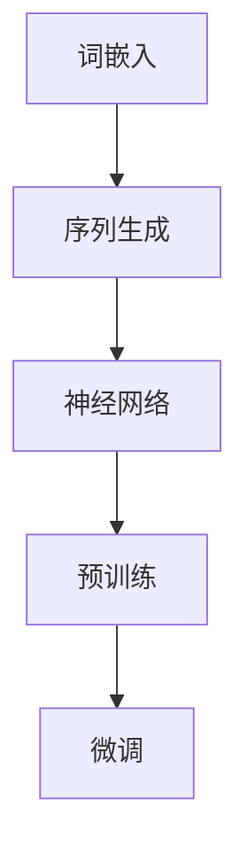

                 

# 《LLM 在 Agent 中的作用》

## 关键词
- 大规模语言模型（LLM）
- 智能代理（Agent）
- 自然语言处理（NLP）
- 对话系统
- 实际应用案例

> 摘要：本文详细探讨了大规模语言模型（LLM）在智能代理（Agent）中的应用。首先介绍了LLM的基础概念和原理，随后讨论了LLM在智能客服、智能助手、多模态代理等应用场景中的具体实现。文章还分析了LLM在Agent中的挑战与优化策略，并给出了多个实际应用案例，展示了LLM在各个领域的实际效果。最后，文章展望了LLM在Agent中的未来发展趋势，探讨了其伦理与社会影响，并提供了相关研究资源与工具。

## 《LLM 在 Agent 中的作用》目录大纲

### 第一部分：LLM 基础与概述

#### 第1章：LLM 介绍与背景

##### 1.1 什么是LLM？

- **核心概念与联系**：大规模语言模型（LLM）与传统的语言模型相比，其核心特点在于参数规模大、预测能力强、理解深度深。以下是一个Mermaid流程图，展示了LLM的基本组成：



- **核心算法原理讲解**：LLM的训练通常包括预训练和微调两个阶段。预训练阶段使用大量无标签数据对模型进行训练，使其具备对自然语言的深度理解能力；微调阶段则使用特定领域的有标签数据对模型进行微调，以适应具体任务。

```python
# 预训练阶段伪代码
model = LanguageModel()
model.train(pre_training_data)

# 微调阶段伪代码
model = LanguageModel()
model.fine_tune(domain_specific_data)
```

- **数学模型和公式**：LLM的训练过程中涉及多个数学模型，如词嵌入（Word Embedding）、神经网络（Neural Networks）、注意力机制（Attention Mechanism）等。以下是一个简化的数学模型公式：

$$
\text{Output} = \text{Activation}(\text{NeuralNetwork}(\text{Embedding}(X)))
$$

其中，$X$为输入序列，$\text{Embedding}(X)$为词嵌入层，$\text{NeuralNetwork}(\text{Embedding}(X))$为神经网络层，$\text{Activation}$为激活函数。

##### 1.2 LLM的发展历程

- **传统语言模型**：早期的语言模型主要基于规则和统计方法，如n-gram模型和隐马尔可夫模型（HMM）。
- **神经网络语言模型**：随着深度学习技术的发展，神经网络语言模型（如RNN、LSTM、GRU等）开始崭露头角。
- **大规模语言模型**：近年来，大规模语言模型（如GPT、BERT）成为研究的热点，具有数百万个参数，可以处理海量的文本数据。

##### 1.3 LLM的重要性

- **提高自然语言处理能力**：LLM可以显著提高自然语言处理（NLP）系统的能力，包括文本分类、情感分析、机器翻译等任务。
- **促进人工智能发展**：LLM在人工智能领域具有重要应用价值，可以用于构建智能客服、智能助手等应用。
- **开拓新的研究领域**：LLM的研究和应用推动了人工智能、认知科学等领域的发展，为人类探索智能领域的边界提供了新的思路。

### 第二部分：LLM在Agent中的技术实现

#### 第2章：LLM的基本原理

##### 2.1 语言模型的组成

- **词嵌入层**：将单词映射为向量，实现单词之间的关联性。
- **序列生成层**：根据输入的序列生成下一个单词或字符。

##### 2.2 语言模型的训练方法

- **统计方法**：如n-gram模型、隐马尔可夫模型（HMM）等。
- **神经网络方法**：如循环神经网络（RNN）、长短时记忆网络（LSTM）、门控循环单元（GRU）等。

##### 2.3 语言模型的评估方法

- **准确率**：预测正确的单词或字符数量与总预测数量之比。
- **召回率**：预测正确的单词或字符数量与实际正确的单词或字符数量之比。
- **F1值**：准确率和召回率的调和平均数。

### 第三部分：LLM在Agent中的应用场景

#### 第3章：LLM在Agent中的应用场景

##### 3.1 Agent的概念与分类

- **感知型Agent**：能够感知环境变化的智能体。
- **决策型Agent**：能够根据环境信息做出决策的智能体。
- **执行型Agent**：能够执行特定任务的智能体。

##### 3.2 LLM在智能客服中的应用

- **自然语言理解**：LLM可以理解和处理客户的自然语言输入。
- **对话管理**：LLM可以生成适当的响应，维持对话的流畅性和连贯性。
- **知识查询**：LLM可以查询知识库，提供准确的解决方案。

##### 3.3 LLM在智能助手中的应用

- **语音识别**：LLM可以将用户的语音输入转换为文本。
- **自然语言理解**：LLM可以理解用户的文本输入，提取关键信息并生成适当的响应。
- **任务管理**：LLM可以协助用户管理日常任务。

##### 3.4 LLM在多模态Agent中的应用

- **语音识别**：LLM可以将用户的语音输入转换为文本。
- **自然语言理解**：LLM可以理解用户的文本输入，提取关键信息并生成适当的响应。
- **图像识别**：LLM可以处理图像输入，识别图像中的关键特征。
- **多模态融合**：LLM可以将不同模态的信息进行融合，生成更准确的响应。

### 第四部分：LLM在Agent中的挑战与优化

#### 第4章：LLM在Agent中的挑战与优化

##### 4.1 LLM在Agent中的挑战

- **计算资源限制**：大规模的LLM模型需要大量的计算资源。
- **数据量不足**：训练数据量不足可能导致模型无法充分学习到语言的特征。
- **模型复杂度**：过于复杂的模型可能导致过拟合。
- **延迟响应**：在实时应用场景中，LLM的响应延迟可能会影响用户体验。

##### 4.2 LLM的优化策略

- **模型压缩**：通过模型压缩技术，减少模型的参数数量。
- **数据增强**：通过数据增强技术，增加训练数据的多样性。
- **模型迁移**：利用迁移学习技术，将预训练的LLM模型应用于新的任务。
- **实时性优化**：通过优化算法和模型结构，提高LLM的响应速度。

### 第五部分：LLM在Agent中的技术实现

#### 第5章：LLM的部署与集成

##### 5.1 LLM的部署方法

- **本地部署**：将LLM模型部署在本地服务器或个人计算机上。
- **云部署**：将LLM模型部署在云服务器上。
- **边缘部署**：将LLM模型部署在边缘设备上。

##### 5.2 LLM的集成策略

- **API集成**：通过API（Application Programming Interface）将LLM与现有系统进行集成。
- **微服务架构**：将LLM作为一个微服务部署。
- **容器化部署**：使用容器技术（如Docker）对LLM进行部署。

##### 5.3 LLM与Agent的协同工作

- **任务分工**：LLM负责处理自然语言理解和生成。
- **实时交互**：LLM与Agent保持实时通信。
- **知识共享**：LLM与Agent共享知识库。

### 第六部分：LLM在Agent中的具体应用案例

#### 第6章：LLM在Agent中的具体应用案例

##### 6.1 智能客服系统

- **背景**：一家大型电商平台希望引入智能客服系统，以提高客户服务质量和效率。
- **实现过程**：需求分析、模型训练、接口集成、部署与上线。
- **效果评估**：响应速度、准确率。

##### 6.2 智能医疗诊断系统

- **背景**：一家医疗公司希望开发智能医疗诊断系统，辅助医生进行诊断和治疗。
- **实现过程**：需求分析、模型训练、多模态集成、部署与上线。
- **效果评估**：诊断准确率、用户体验。

##### 6.3 智能教育系统

- **背景**：一家在线教育平台希望引入智能教育系统，为用户提供个性化学习服务。
- **实现过程**：需求分析、模型训练、接口集成、部署与上线。
- **效果评估**：学习效果、用户满意度。

### 第七部分：LLM在Agent中的未来发展趋势

#### 第7章：LLM在Agent中的未来发展趋势

##### 7.1 技术发展

- **模型优化**：通过模型压缩、数据增强等提高模型性能。
- **多模态融合**：实现文本、语音、图像等多模态数据的融合处理。
- **自适应学习**：使模型能够根据不同场景自适应调整参数。

##### 7.2 应用扩展

- **垂直行业应用**：在医疗、金融、教育等垂直行业得到广泛应用。
- **智能家居**：在智能家居领域发挥重要作用。
- **智能制造**：在智能制造领域应用于生产调度、设备维护等。

##### 7.3 社会影响

- **改变商业模式**：为企业提供更智能、高效的服务，降低运营成本。
- **提升生活质量**：为用户提供个性化、便捷的服务。
- **伦理与隐私**：建立相应的法律法规和伦理准则。

### 第八部分：LLM的伦理与社会影响

#### 第8章：LLM的伦理与社会影响

##### 8.1 伦理问题

- **隐私保护**：确保用户隐私不被泄露。
- **偏见与歧视**：避免模型受到训练数据的偏见影响。
- **责任归属**：明确模型产生错误决策时的责任归属。

##### 8.2 社会影响

- **就业影响**：LLM的应用可能会取代某些工作岗位。
- **教育影响**：LLM在教育领域的应用，可能会改变教育方式和师生关系。
- **经济影响**：LLM的应用将推动新经济形态的发展。

##### 8.3 法律法规

- **隐私法律**：各国需要制定相应的隐私法律。
- **人工智能伦理**：需要建立人工智能伦理准则。
- **人工智能监管**：需要建立监管机构，对AI技术进行监管。

### 第九部分：附录

#### 第9章：LLM研究资源与工具

##### 9.1 开源语言模型

- **GPT系列**
- **BERT**
- **T5**
- **XLNet**

##### 9.2 语言模型相关论文与书籍

- **《Attention Is All You Need》**
- **《BERT: Pre-training of Deep Bidirectional Transformers for Language Understanding》**
- **《Language Models are Unsupervised Multitask Learners》**
- **《Deep Learning for Natural Language Processing》**

##### 9.3 语言模型研究社区与论坛

- **ACL**
- **NAACL**
- **ACL Wiki**
- **Reddit**

##### 9.4 LLM研究工具

- **TensorFlow**
- **PyTorch**
- **Transformers**
- **spaCy**<|im_end|>

