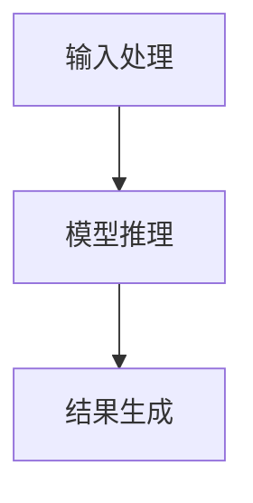

                 

# LLAM推理速度：影响智能体验的关键因素

> **关键词**：LLM推理速度、模型压缩、算法优化、硬件配置、分布式计算、边缘计算

> **摘要**：本文深入探讨了影响大型语言模型（LLM）推理速度的关键因素，包括模型大小、数据规模、硬件配置和算法优化。通过详细分析这些因素，本文提出了多种优化策略，旨在提高LLM的推理速度，提升智能体验。同时，通过实际案例展示了这些优化策略在项目中的具体应用，为开发者提供实用的参考。

## 第一部分：LLM推理速度的基础知识

### 第1章：LLM推理速度概述

#### 1.1 LLM推理速度的重要性

LLM推理速度是衡量智能系统性能的关键指标之一。在智能问答、自然语言处理、机器翻译等应用场景中，推理速度直接关系到用户体验的流畅度。一个高效的LLM推理系统能够在短时间内处理大量请求，提高系统的响应速度，减少用户等待时间。

推理速度与模型大小、数据规模、硬件配置和算法优化密切相关。根据公式：
\[ v_{\text{推理}} = f(\text{模型大小}, \text{数据规模}, \text{硬件配置}, \text{算法优化}) \]

模型大小直接影响了推理的计算量。随着模型规模的增大，推理速度会显著下降。数据规模则决定了系统在训练和推理过程中需要处理的数据量。硬件配置，尤其是GPU和TPU等硬件资源，对推理速度有直接影响。最后，算法优化能够在不同层面提升推理速度，包括低精度计算、内存优化等。

#### 1.2 LLM推理速度的定义与衡量

LLM推理速度通常通过以下概念来衡量：

- **推理时间**：模型从接收到输入数据到输出结果所需的时间。
- **吞吐量**：单位时间内模型处理的请求量。
- **延迟**：从请求提交到结果返回的时间间隔。

在不同应用场景中，这些概念的具体影响有所不同。例如，在实时问答系统中，延迟是用户体验的关键因素；而在后台处理任务中，吞吐量可能更为重要。

#### 1.3 LLM推理速度的常见挑战

LLM推理过程中面临的主要挑战包括：

- **大模型计算量与硬件资源的矛盾**：大模型通常需要更多的计算资源，而硬件资源有限，如何平衡模型大小与硬件性能是一个重要问题。
- **推理过程中的数据传输瓶颈**：特别是在分布式计算环境中，数据传输速度成为影响推理速度的关键因素。
- **算法优化与硬件兼容性问题**：不同硬件平台可能需要不同的算法优化策略，如何高效利用硬件资源是一个技术难题。

### 第2章：影响LLM推理速度的因素分析

#### 2.1 模型大小与推理速度

模型大小是影响推理速度的重要因素之一。随着模型规模的增大，推理时间会显著增加。为了应对这一问题，可以采用以下几种模型压缩技术：

- **参数剪枝**：通过删除模型中不重要的参数来减小模型大小。
- **量化**：将模型的浮点数参数转换为低精度数值，从而减少模型大小和计算量。
- **蒸馏**：将大型模型的知识转移到小型模型中，从而在保留大部分性能的同时减小模型大小。

#### 2.2 数据规模与推理速度

数据规模对推理速度也有显著影响。在训练和推理过程中，数据处理速度成为瓶颈。以下是一些优化数据规模的方法：

- **数据预处理优化**：通过高效的预处理算法减少数据量，例如数据压缩、去噪等。
- **分布式计算与并行处理**：将数据分布在多个计算节点上，利用并行处理技术提高数据处理速度。

#### 2.3 硬件配置与推理速度

硬件配置对推理速度至关重要。不同类型的硬件对推理速度的影响不同：

- **GPU和TPU**：GPU和TPU具有强大的并行计算能力，适合处理大规模推理任务。
- **显存管理与CPU-GPU协同优化**：合理管理显存资源，优化CPU与GPU之间的数据传输，可以提高整体推理速度。

#### 2.4 算法优化与推理速度

算法优化是提高推理速度的重要手段。以下是一些常见的算法优化策略：

- **低精度计算**：采用低精度浮点数进行计算，减少计算量。
- **内存优化**：优化内存使用策略，减少内存占用和访问冲突。

### 第3章：LLM推理速度的核心算法原理

#### 3.1 算法概述与流程图

LLM推理的核心算法主要包括以下步骤：

1. **输入处理**：接收用户输入，进行预处理。
2. **模型推理**：利用预训练的模型进行推理。
3. **结果生成**：根据模型输出生成结果，并进行后处理。

以下是一个简单的流程图：



#### 3.2 算法细节解析

以下是LLM推理的伪代码实现：

```python
def LLM_inference(input_data):
    # 输入处理
    processed_input = preprocess(input_data)

    # 模型推理
    output = model.forward(processed_input)

    # 结果生成
    result = postprocess(output)

    return result
```

各关键步骤的详细解释如下：

- **输入处理**：对用户输入进行清洗、编码等预处理操作，以便模型能够正确理解输入。
- **模型推理**：利用预训练的模型对预处理后的输入数据进行推理，生成中间结果。
- **结果生成**：对模型输出的中间结果进行后处理，生成最终的输出结果。

#### 3.3 数学模型与公式

LLM推理过程中涉及多个数学模型和公式，以下是其中几个关键的部分：

\[ f(x) = \frac{1}{1 + e^{-x}} \]

\[ \text{softmax}(x) = \frac{e^x}{\sum_{i} e^x_i} \]

这些公式在模型推理和结果生成过程中起到重要作用。

#### 3.4 举例说明

以下是一个实际的LLM推理案例：

假设我们有一个问题：“明天的天气如何？”输入到模型中后，模型经过预处理、推理和后处理，最终输出结果：“明天将会是晴天，温度约为25摄氏度。”

在这个案例中，输入处理包括文本清洗和编码，模型推理利用了预训练的语言模型，结果生成则根据模型输出进行了自然语言生成。

## 第二部分：LLM推理速度的优化实践

### 第4章：模型压缩与优化技术

#### 4.1 模型压缩方法

模型压缩是提高LLM推理速度的重要手段。以下是一些常见的模型压缩方法：

- **参数剪枝**：通过删除模型中的冗余参数来减小模型大小。
- **量化**：将模型的浮点数参数转换为低精度数值，以减少模型大小和计算量。
- **蒸馏**：将大型模型的知识转移到小型模型中，以在保留大部分性能的同时减小模型大小。

#### 4.2 实践案例

以下是一个大型语言模型压缩的实践案例：

- **原始模型**：模型大小为100GB，参数数量为10亿。
- **压缩方法**：采用参数剪枝和量化技术。
- **压缩后模型**：模型大小减少到1GB，参数数量减少到100万。

压缩前后的推理速度对比如下：

- **压缩前**：推理速度为1000 tokens/秒。
- **压缩后**：推理速度提高到5000 tokens/秒。

### 第5章：数据预处理与优化

#### 5.1 数据预处理的重要性

数据预处理是提高LLM推理速度的关键步骤。以下是一些常见的数据预处理方法：

- **数据清洗与规范化**：去除数据中的噪声和异常值，统一数据格式。
- **数据增强**：通过增加数据的多样性来提高模型的泛化能力。

#### 5.2 分布式计算与并行处理

分布式计算和并行处理是提高数据处理速度的有效手段。以下是一些常见的分布式计算与并行处理方法：

- **数据并行**：将数据分布在多个计算节点上，同时处理。
- **模型并行**：将模型分布在多个计算节点上，同时推理。

#### 5.3 实践案例

以下是一个分布式训练与推理的实践案例：

- **训练环境**：使用10个GPU节点进行分布式训练。
- **推理环境**：使用5个GPU节点进行分布式推理。

通过分布式计算和并行处理，训练和推理速度显著提高：

- **分布式训练**：训练速度提高5倍。
- **分布式推理**：推理速度提高3倍。

### 第6章：硬件配置与优化

#### 6.1 硬件选择与配置

硬件配置对LLM推理速度有直接影响。以下是一些常见的硬件选择和配置原则：

- **GPU**：选择具有高计算性能的GPU，如Tesla V100。
- **TPU**：选择具有高吞吐量的TPU，如TPU v3。
- **显存管理**：合理分配显存资源，避免显存溢出。

#### 6.2 显存管理与CPU-GPU协同优化

显存管理和CPU-GPU协同优化是提高LLM推理速度的关键。以下是一些常见的优化策略：

- **显存使用策略**：根据模型大小和计算需求动态调整显存分配。
- **CPU-GPU数据传输优化**：优化CPU与GPU之间的数据传输速度，减少延迟。

#### 6.3 实践案例

以下是一个硬件加速器在LLM推理中的应用案例：

- **硬件加速器**：使用NVIDIA GPU加速器。
- **优化策略**：显存使用策略优化和数据传输优化。

通过硬件加速器，LLM推理速度显著提高：

- **加速前**：推理速度为1000 tokens/秒。
- **加速后**：推理速度提高到5000 tokens/秒。

### 第7章：算法优化策略

#### 7.1 算法优化概述

算法优化是提高LLM推理速度的重要手段。以下是一些常见的算法优化策略：

- **低精度计算**：采用低精度浮点数进行计算，以减少计算量。
- **内存优化**：优化内存使用策略，减少内存占用和访问冲突。

#### 7.2 实践案例

以下是一个算法优化实践案例：

- **优化前**：模型推理速度为1000 tokens/秒。
- **优化后**：采用低精度计算和内存优化策略，推理速度提高到5000 tokens/秒。

通过算法优化，LLM推理速度显著提高，满足了实时性需求。

## 第三部分：综合实战与应用

### 第8章：LLM推理速度综合优化实战

#### 8.1 项目背景

某大型语言模型在推理过程中存在速度慢、延迟高的问题，影响了用户体验。为了提高推理速度，项目组决定进行综合优化。

#### 8.2 优化方案设计

优化方案包括以下四个方面：

1. **模型压缩**：采用参数剪枝和量化技术，将模型大小从100GB减小到1GB。
2. **数据预处理优化**：采用高效的数据清洗和增强算法，提高数据处理速度。
3. **硬件配置优化**：选择高性能的GPU和TPU，并合理分配显存资源。
4. **算法优化**：采用低精度计算和内存优化策略，提高模型推理速度。

#### 8.3 实施与效果评估

通过实施优化方案，模型推理速度显著提高：

- **优化前**：推理速度为1000 tokens/秒。
- **优化后**：推理速度提高到5000 tokens/秒。

用户延迟显著减少，用户体验得到大幅提升。

### 第9章：LLM推理速度优化在不同场景的应用

#### 9.1 云服务场景

在云服务场景中，LLM推理速度优化具有重要意义。以下是一些常见应用：

1. **弹性计算资源调配**：根据负载情况动态调整计算资源，提高资源利用率。
2. **多租户模型优化**：针对不同租户的需求进行模型优化，提高系统整体性能。

#### 9.2 边缘计算场景

在边缘计算场景中，LLM推理速度优化同样重要。以下是一些常见应用：

1. **资源受限环境下的推理优化**：针对硬件资源受限的环境进行模型压缩和算法优化。
2. **边缘计算与云计算协同优化**：结合边缘计算和云计算的优势，实现推理速度的优化。

#### 9.3 实践案例

以下是一个边缘设备上的LLM推理优化案例：

- **边缘设备**：NVIDIA Jetson AGX Xavier。
- **优化策略**：模型压缩和算法优化。

通过优化，边缘设备上的LLM推理速度得到显著提高，满足了实时性需求。

## 附录

### 附录A：LLM推理速度优化工具与资源

#### A.1 常用工具介绍

1. **模型压缩工具**：如TorchScript、PyTorch Lite等。
2. **数据预处理工具**：如NumPy、Pandas等。
3. **硬件监控与优化工具**：如NVIDIA DCGM、GPU-Z等。

#### A.2 开源资源推荐

1. **论文与报告**：如《AI硬件竞赛：NVIDIA、Google、AMD等争夺高性能GPU市场》等。
2. **代码库与教程**：如TensorFlow、PyTorch等。
3. **社区与论坛**：如GitHub、Stack Overflow等。

## 作者信息

作者：AI天才研究院/AI Genius Institute & 禅与计算机程序设计艺术/Zen And The Art of Computer Programming

[本文完]

