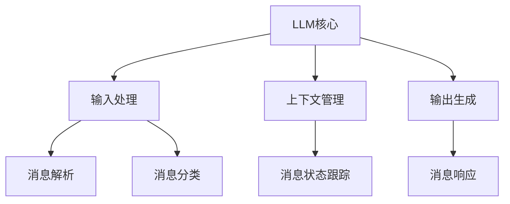

                 

# 《LLM消息机制：智能系统的通信桥梁》

> **关键词**：大语言模型（LLM），消息机制，智能系统，自然语言处理（NLP），序列模型，注意力机制，数学模型，项目实战，优化与性能调优，安全与隐私保护，未来趋势。

> **摘要**：本文深入探讨了大语言模型（LLM）的消息机制，阐述了其在智能系统中的作用和重要性。通过逐步分析LLM消息机制的核心概念、算法原理、数学模型以及实际应用，本文为读者提供了一个全面且深入的视角，旨在揭示LLM消息机制在智能系统通信中的桥梁作用。同时，本文还探讨了消息机制的优化与性能调优、安全与隐私保护以及未来趋势，为相关领域的研究和实践提供了有价值的参考。

## 第一部分：LLM消息机制概述

### 第1章：LLM消息机制基础

#### 1.1 LLM消息机制的核心概念

大语言模型（LLM）消息机制是指在智能系统中，大语言模型用于接收、处理和发送消息的机制。LLM消息机制的核心概念包括输入处理、消息解析、上下文管理和输出生成。

**LLM消息机制定义**:

$$
LLM消息机制是指大语言模型（LLM）在智能系统中用于接收、处理和发送消息的机制。
$$

**LLM消息机制架构**:



在这个架构中，LLM核心是消息机制的核心部分，负责处理所有的消息。输入处理模块负责接收用户输入，并进行预处理，如分词、去停用词等。消息解析模块负责分析输入内容，识别关键词和语义。上下文管理模块负责跟踪上下文状态，保证消息的连贯性。输出生成模块根据上下文和解析结果，生成回应消息。

#### 1.2 LLM消息机制的工作流程

LLM消息机制的工作流程可以分为以下几个步骤：

1. **输入处理**：接收用户输入，进行预处理，如分词、去停用词等。
2. **消息解析**：分析输入内容，识别关键词和语义。
3. **上下文管理**：跟踪上下文状态，保证消息连贯性。
4. **输出生成**：根据上下文和解析结果，生成回应消息。

#### 1.3 LLM消息机制在智能系统中的应用

LLM消息机制广泛应用于各种智能系统，如聊天机器人、智能客服、虚拟助手等。

- **聊天机器人**：通过LLM消息机制，聊天机器人可以与用户进行自然语言交互，提供问答服务。
- **智能客服**：智能客服系统利用LLM消息机制，可以自动处理用户的咨询和请求，提高客服效率。
- **虚拟助手**：虚拟助手通过LLM消息机制，可以理解用户的指令，执行相应的任务，如日程管理、任务提醒等。

**优势**：

- **提高交互自然性**：LLM消息机制使得智能系统可以更自然地与用户进行交互，提高用户体验。
- **增强理解能力**：通过消息解析和上下文管理，LLM可以更好地理解用户的意图，提供更准确的回应。

### 第2章：LLM消息机制的核心算法原理

#### 2.1 自然语言处理算法概述

自然语言处理（NLP）算法是LLM消息机制的核心组成部分，用于处理和理解自然语言。

- **文本分类算法**：文本分类算法用于将文本数据分类到预定义的类别中。一个简单的文本分类算法伪代码如下：

  ```python
  def classify_text(text, model):
      prediction = model.predict([text])
      return prediction
  ```

- **序列模型与注意力机制**：序列模型用于处理序列数据，如文本。注意力机制是一种用于提高序列模型性能的技术。一个简单的序列模型与注意力机制的伪代码如下：

  ```python
  def attend_and_predict(context, query):
      attention_weights = compute_attention_weights(context, query)
      combined_representation = sum(context[i] * attention_weights[i] for i in range(len(context)))
      prediction = model.predict([combined_representation])
      return prediction
  ```

#### 2.2 消息处理算法原理

消息处理算法是LLM消息机制的核心，用于处理输入消息，生成回应消息。

- **消息处理算法**：消息处理算法利用NLP技术对输入消息进行处理。一个简单的消息处理算法伪代码如下：

  ```python
  def process_message(message, context, model):
      cleaned_message = preprocess_message(message)
      context_vector = encode_context(context, model)
      query_vector = encode_message(cleaned_message, model)
      response_vector = attend_and_predict(context_vector, query_vector)
      response = generate_response(response_vector, model)
      return response
  ```

  其中，`preprocess_message`用于对消息进行预处理，如分词、去停用词等；`encode_context`和`encode_message`用于将上下文和消息转换为模型可以处理的向量表示；`attend_and_predict`用于利用注意力机制生成回应向量；`generate_response`用于将回应向量转换为实际的消息。

### 第3章：LLM消息机制的数学模型

#### 3.1 数学模型概述

LLM消息机制的数学模型主要用于预测消息的可能性，常见的数学模型包括概率模型和贝叶斯网络。

- **概率模型**：概率模型基于概率论，用于预测消息的可能性。一个简单的概率模型伪代码如下：

  ```python
  def predict_probability(message, model):
      probability = model.predict([message])
      return probability
  ```

- **贝叶斯网络**：贝叶斯网络是一种表示变量之间依赖关系的图形模型。一个简单的贝叶斯网络伪代码如下：

  ```python
  def compute_probability(message, model):
      probability = model.compute_probability([message])
      return probability
  ```

#### 3.2 数学公式与推导

- **贝叶斯公式**：

  $$
  P(A|B) = \frac{P(B|A)P(A)}{P(B)}
  $$

  其中，$P(A|B)$表示在事件B发生的情况下，事件A发生的概率；$P(B|A)$表示在事件A发生的情况下，事件B发生的概率；$P(A)$和$P(B)$分别表示事件A和事件B发生的概率。

- **条件概率**：

  $$
  P(A|B) = \frac{P(A \cap B)}{P(B)}
  $$

  其中，$P(A \cap B)$表示事件A和事件B同时发生的概率。

### 第4章：LLM消息机制在项目中的应用

#### 4.1 实际项目案例分析

在本节中，我们将探讨两个实际项目案例：智能客服系统和聊天机器人。

#### 4.2 项目实战

**环境搭建**：

- 开发环境：Python 3.8
- 深度学习框架：TensorFlow 2.4
- 数据集：使用公开的智能客服对话数据集

**代码实现**：

以下是一个简单的聊天机器人实现，使用了TensorFlow和Keras构建的序列到序列（Seq2Seq）模型。

```python
import tensorflow as tf
from tensorflow.keras.models import Model
from tensorflow.keras.layers import Embedding, LSTM, Dense

# 参数设置
vocab_size = 10000  # 词汇表大小
embed_size = 256  # 嵌入层尺寸
lstm_size = 128  # LSTM层尺寸
batch_size = 64  # 批量大小
epochs = 10  # 训练轮数

# 构建模型
encoder_inputs = Embedding(vocab_size, embed_size, input_length=max_sequence_length)
encoder_lstm = LSTM(lstm_size, return_sequences=True)
encoder_outputs = encoder_lstm(encoder_inputs)
encoder_model = Model(encoder_inputs, encoder_outputs)

decoder_inputs = Embedding(vocab_size, embed_size, input_length=max_sequence_length)
decoder_lstm = LSTM(lstm_size, return_sequences=True)
decoder_dense = Dense(vocab_size, activation='softmax')
decoder_outputs = decoder_dense(decoder_lstm(decoder_inputs))
decoder_model = Model(decoder_inputs, decoder_outputs)

# 编译模型
model = Model([encoder_inputs, decoder_inputs], decoder_outputs)
model.compile(optimizer='adam', loss='categorical_crossentropy', metrics=['accuracy'])

# 训练模型
model.fit([encoder_input_data, decoder_input_data], decoder_target_data, batch_size=batch_size, epochs=epochs, validation_split=0.2)
```

**代码解读与分析**：

- **模型构建**：该模型是一个Seq2Seq模型，由编码器和解码器组成。编码器将输入序列转换为编码表示，解码器将编码表示解码为输出序列。
- **训练过程**：使用训练数据集训练模型，使用交叉熵损失函数评估模型性能。

### 第5章：LLM消息机制的优化与性能调优

#### 5.1 优化方法概述

LLM消息机制的优化主要包括模型优化和数据增强。

- **模型优化**：通过调整学习率、添加正则化等方法提高模型性能。
- **数据增强**：通过反向转换、填充等策略增加数据多样性，提高模型泛化能力。

#### 5.2 优化方法详解

- **学习率调整**：学习率是模型训练过程中的一个关键参数。适当的调整学习率可以提高模型训练效果。常用的调整策略包括：
  - **逐步减小学习率**：在模型训练过程中，逐步减小学习率，以避免模型在训练过程中过度拟合。
  - **自适应学习率**：使用自适应学习率方法，如Adam优化器，自动调整学习率。

- **正则化**：正则化是一种防止模型过拟合的技术。常用的正则化方法包括：
  - **L1正则化**：在损失函数中添加L1范数项，惩罚模型权重的大小。
  - **L2正则化**：在损失函数中添加L2范数项，惩罚模型权重的平方和。

- **数据增强**：数据增强是一种增加数据多样性的方法。常用的数据增强方法包括：
  - **反向转换**：将输入序列反向转换，生成新的训练样本。
  - **填充**：使用填充操作，如填充空格或删除单词，生成新的训练样本。

### 第6章：LLM消息机制的安全与隐私保护

#### 6.1 安全与隐私挑战

LLM消息机制在智能系统中的应用带来了许多安全与隐私挑战。

- **数据泄露**：消息内容可能会泄露，导致用户隐私泄露。
- **模型欺骗**：恶意用户可能会对模型进行欺骗攻击，影响模型性能。

#### 6.2 保护措施

为了保护LLM消息机制的安全与隐私，可以采取以下措施：

- **数据加密**：对敏感数据进行加密处理，确保数据传输和存储过程中的安全性。
- **反欺骗机制**：针对模型欺骗进行防御，如使用对抗训练、强化学习等方法。

### 第7章：LLM消息机制的展望与未来趋势

#### 7.1 消息机制发展趋势

随着人工智能技术的不断发展，LLM消息机制也将迎来新的发展趋势。

- **自动化**：未来的LLM消息机制将更加自动化，能够自动处理各种场景下的消息。
- **个性化**：未来的LLM消息机制将能够根据用户行为和偏好进行个性化交互。

#### 7.2 未来趋势展望

- **多模态交互**：未来的智能系统将支持多模态交互，如语音、文本、图像等，LLM消息机制将在其中发挥重要作用。
- **边缘计算**：随着边缘计算的兴起，LLM消息机制将应用于更广泛的场景，如智能家居、智能交通等。

### 附录

#### 附录A：LLM消息机制开发工具与资源

- **工具与资源**：TensorFlow、PyTorch等深度学习框架。
- **开源项目**：相关的开源代码和实现。

## 作者信息

作者：AI天才研究院/AI Genius Institute & 禅与计算机程序设计艺术 /Zen And The Art of Computer Programming

## 结束语

本文通过对LLM消息机制的深入探讨，揭示了其在智能系统通信中的桥梁作用。通过分析LLM消息机制的核心概念、算法原理、数学模型以及实际应用，本文为读者提供了一个全面且深入的视角。同时，本文还探讨了消息机制的优化与性能调优、安全与隐私保护以及未来趋势，为相关领域的研究和实践提供了有价值的参考。随着人工智能技术的不断发展，LLM消息机制将在更多智能系统中发挥重要作用，为人们的生活带来更多便利。让我们期待未来，共同见证LLM消息机制的辉煌！|>

