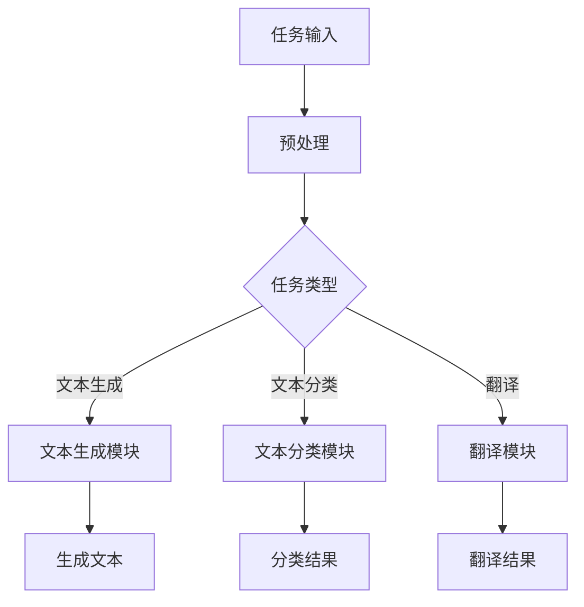
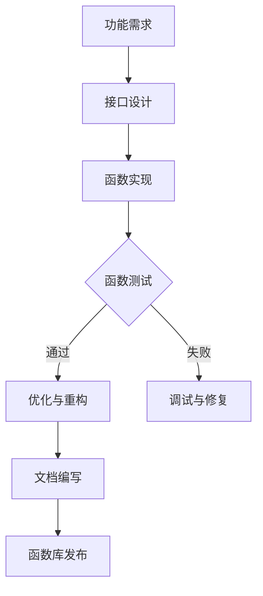
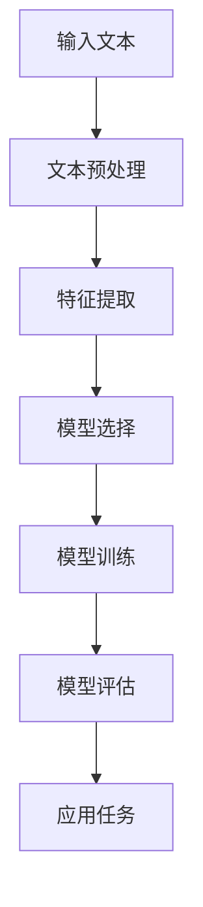
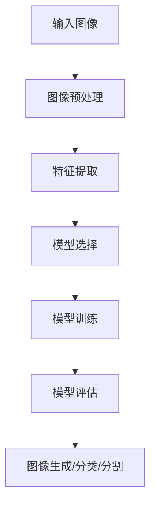

                 

# 《LLM的图灵完备之路：从任务规划到函数库》

## 关键词
- LLM
- 图灵完备性
- 任务规划
- 函数库
- NLP
- 图像处理
- 项目实战

## 摘要
本文将深入探讨大型语言模型（LLM）的图灵完备性，从基础概念到具体实现，逐步剖析其在任务规划与函数库设计中的应用。通过分析核心算法原理，结合实际项目案例，本文旨在为读者呈现一个全面而清晰的LLM技术路线图。

## 《LLM的图灵完备之路：从任务规划到函数库》目录大纲

### 第一部分: LLM基础

#### 第1章: LLM概述
- 1.1 LLM的定义与特性
- 1.2 LLM的发展历程
- 1.3 LLM的应用场景

#### 第2章: LLM的图灵完备性
- 2.1 图灵完备性的概念
- 2.2 LLM如何实现图灵完备性
- 2.3 LLM的图灵完备性验证

### 第二部分: LLM的核心算法

#### 第3章: 任务规划算法
- 3.1 任务规划算法概述
- 3.2 任务规划算法的设计原则
- 3.3 任务规划算法的实现与优化

#### 第4章: 函数库
- 4.1 函数库的基本概念
- 4.2 函数库的设计与实现
- 4.3 函数库的性能优化

### 第三部分: LLM的工程应用

#### 第5章: LLM在NLP中的应用
- 5.1 LLM在文本生成中的应用
- 5.2 LLM在文本分类中的应用
- 5.3 LLM在机器翻译中的应用

#### 第6章: LLM在图像处理中的应用
- 6.1 LLM在图像生成中的应用
- 6.2 LLM在图像分类中的应用
- 6.3 LLM在图像分割中的应用

#### 第7章: LLM的项目实战
- 7.1 项目背景与目标
- 7.2 系统架构设计
- 7.3 关键技术实现与优化
- 7.4 项目成果与反思

### 附录

#### 附录A: LLM相关资源与工具
- A.1 LLM相关书籍推荐
- A.2 LLM相关在线课程推荐
- A.3 LLM相关开源项目推荐

#### 附录B: Mermaid 流程图
- B.1 LLM任务规划算法流程图
- B.2 LLM函数库设计流程图
- B.3 LLM在NLP中的应用流程图
- B.4 LLM在图像处理中的应用流程图

#### 附录C: 伪代码与数学模型
- C.1 任务规划算法伪代码
- C.2 函数库设计伪代码
- C.3 LLM在NLP中的应用数学模型
- C.4 LLM在图像处理中的应用数学模型
- C.5 数学公式讲解与示例

#### 附录D: 代码实战
- D.1 NLP任务代码实战
- D.2 图像处理任务代码实战
- D.3 项目实战代码解读与分析

### 开始深入讨论

在当代计算机科学领域，大型语言模型（Large Language Models，简称LLM）已经成为一个重要的研究热点。LLM通过学习大量文本数据，能够实现文本生成、文本分类、机器翻译等多种自然语言处理（NLP）任务。然而，LLM的强大能力不仅限于NLP领域，它们实际上是一种具有图灵完备性的计算模型。本文将逐步剖析LLM的图灵完备性，从任务规划到函数库设计，深入探讨LLM的工作原理和应用。

## 第一部分: LLM基础

### 第1章: LLM概述

#### 1.1 LLM的定义与特性

大型语言模型（LLM）是一种基于深度学习技术的自然语言处理模型。它们通过学习海量文本数据，能够生成流畅自然的文本、执行复杂语言任务等。LLM的主要特性包括：

1. **大规模训练数据**：LLM通常需要数万亿的文本数据进行训练，这使得它们能够学习到丰富的语言知识。
2. **深度神经网络**：LLM通常采用多层神经网络架构，通过不断优化网络参数，实现高效的文本处理能力。
3. **自适应能力**：LLM能够根据输入文本自适应生成相关内容，具有很高的灵活性和适应性。

#### 1.2 LLM的发展历程

LLM的发展历程可以分为几个阶段：

1. **早期模型**：早期的LLM如Word2Vec和GloVe，主要关注于文本向量的表示。
2. **基于序列的模型**：诸如LSTM（Long Short-Term Memory）和GRU（Gated Recurrent Unit）等模型，引入了序列记忆机制，提高了文本处理能力。
3. **基于注意力机制的模型**：如Transformer和BERT（Bidirectional Encoder Representations from Transformers），通过注意力机制实现了并行计算，大幅提升了模型性能。

#### 1.3 LLM的应用场景

LLM在多种应用场景中表现出色，主要包括：

1. **文本生成**：包括文章撰写、对话系统、故事创作等。
2. **文本分类**：如情感分析、垃圾邮件过滤等。
3. **机器翻译**：如自动翻译、多语言文本比对等。
4. **知识图谱**：通过文本数据生成知识图谱，辅助智能问答和知识检索。
5. **图像描述生成**：将图像内容转换为自然语言描述。

### 第2章: LLM的图灵完备性

#### 2.1 图灵完备性的概念

图灵完备性是指一个计算模型能够模拟图灵机，具有处理任意可计算问题的能力。图灵机由一个有限状态机、一个无限长的纸带和一个读写头组成。通过在纸带上的读写操作，图灵机可以执行复杂的计算任务。

#### 2.2 LLM如何实现图灵完备性

LLM通过以下几种方式实现图灵完备性：

1. **并行计算**：Transformer等模型采用注意力机制，实现并行计算，大大提升了计算效率。
2. **泛化能力**：通过学习海量文本数据，LLM能够处理各种类型的语言任务，实现通用计算能力。
3. **指令执行**：一些LLM如GPT-3，可以直接执行编程语言指令，实现了对特定任务的图灵完备性。

#### 2.3 LLM的图灵完备性验证

验证LLM的图灵完备性通常通过以下几种方法：

1. **测试集性能**：通过在标准测试集上的性能表现，评估LLM的通用计算能力。
2. **编程任务**：如实现特定编程语言的功能，验证LLM是否具备图灵完备性。
3. **形式验证**：使用形式化方法，如模型检查器，验证LLM的计算能力是否满足图灵完备性条件。

## 第二部分: LLM的核心算法

### 第3章: 任务规划算法

#### 3.1 任务规划算法概述

任务规划算法是指用于指导LLM完成特定任务的算法。任务规划算法的设计原则包括：

1. **可扩展性**：算法应能适应不同规模的任务。
2. **高效性**：算法应能快速完成任务。
3. **适应性**：算法应能根据任务特点进行调整。

#### 3.2 任务规划算法的设计原则

任务规划算法的设计原则包括：

1. **任务分解**：将复杂任务分解为简单任务，降低计算复杂度。
2. **动态调整**：根据任务执行过程，动态调整算法参数，提高任务完成效率。
3. **资源管理**：合理分配计算资源，确保任务高效执行。

#### 3.3 任务规划算法的实现与优化

任务规划算法的实现与优化包括：

1. **模型选择**：选择适合任务特点的模型，如Transformer、BERT等。
2. **数据预处理**：对输入数据进行分析和处理，提高任务规划算法的性能。
3. **算法优化**：通过优化算法参数和模型结构，提高任务规划算法的效率。

### 第4章: 函数库

#### 4.1 函数库的基本概念

函数库是一组预定义的函数，用于执行特定的计算任务。在LLM中，函数库是实现图灵完备性的重要组成部分。

#### 4.2 函数库的设计与实现

函数库的设计与实现包括：

1. **函数接口**：定义函数的输入输出接口，确保函数的易用性。
2. **函数实现**：实现具体的计算功能，确保函数的正确性。
3. **性能优化**：通过优化算法和数据结构，提高函数库的性能。

#### 4.3 函数库的性能优化

函数库的性能优化包括：

1. **并行计算**：利用并行计算技术，提高函数库的执行速度。
2. **内存管理**：优化内存分配和回收，减少内存占用。
3. **缓存策略**：使用缓存技术，提高函数库的响应速度。

## 第三部分: LLM的工程应用

### 第5章: LLM在NLP中的应用

#### 5.1 LLM在文本生成中的应用

LLM在文本生成中的应用包括：

1. **文章撰写**：利用LLM生成高质量的文章。
2. **对话系统**：构建智能对话系统，实现人机交互。
3. **故事创作**：生成创意故事，应用于文学创作等领域。

#### 5.2 LLM在文本分类中的应用

LLM在文本分类中的应用包括：

1. **情感分析**：对文本进行情感分类，判断文本的情感倾向。
2. **垃圾邮件过滤**：识别并过滤垃圾邮件。
3. **新闻分类**：对新闻进行分类，辅助新闻推荐系统。

#### 5.3 LLM在机器翻译中的应用

LLM在机器翻译中的应用包括：

1. **自动翻译**：实现多种语言之间的自动翻译。
2. **多语言文本比对**：对多语言文本进行比对，发现文本差异。
3. **翻译质量评估**：评估翻译文本的质量。

### 第6章: LLM在图像处理中的应用

#### 6.1 LLM在图像生成中的应用

LLM在图像生成中的应用包括：

1. **图像到图像转换**：将一种图像转换为另一种图像。
2. **图像编辑**：对图像进行编辑，如添加特效、修复破损图像等。
3. **图像合成**：合成新的图像，应用于虚拟现实和增强现实等领域。

#### 6.2 LLM在图像分类中的应用

LLM在图像分类中的应用包括：

1. **物体识别**：识别图像中的物体，如人脸识别、车辆识别等。
2. **场景识别**：识别图像中的场景，如风景识别、城市识别等。
3. **行为识别**：识别图像中的行为，如行人识别、动作识别等。

#### 6.3 LLM在图像分割中的应用

LLM在图像分割中的应用包括：

1. **语义分割**：对图像进行语义分割，将图像划分为不同的语义区域。
2. **实例分割**：对图像进行实例分割，识别图像中的每个实例。
3. **交互式分割**：用户与LLM交互，共同完成图像分割任务。

### 第7章: LLM的项目实战

#### 7.1 项目背景与目标

项目背景与目标包括：

1. **项目背景**：介绍项目的背景和目的。
2. **项目目标**：明确项目的目标和预期成果。

#### 7.2 系统架构设计

系统架构设计包括：

1. **整体架构**：描述系统的整体架构和组件。
2. **模块划分**：对系统模块进行详细划分。
3. **数据流设计**：描述系统中的数据流动和处理过程。

#### 7.3 关键技术实现与优化

关键技术实现与优化包括：

1. **LLM选择**：选择合适的LLM模型。
2. **任务规划**：设计并实现任务规划算法。
3. **函数库设计**：构建高效的函数库。
4. **性能优化**：对系统进行性能优化。

#### 7.4 项目成果与反思

项目成果与反思包括：

1. **项目成果**：总结项目的成果和表现。
2. **反思与展望**：对项目进行反思，提出改进方向和未来展望。

## 附录

### 附录A: LLM相关资源与工具

#### A.1 LLM相关书籍推荐

- 《深度学习》（Goodfellow, Bengio, Courville）
- 《自然语言处理综述》（Jurafsky, Martin）

#### A.2 LLM相关在线课程推荐

- [TensorFlow官方课程](https://www.tensorflow.org/tutorials)
- [自然语言处理课程](https://www.coursera.org/specializations/nlp)

#### A.3 LLM相关开源项目推荐

- [Transformer模型](https://github.com/tensorflow/transformer)
- [BERT模型](https://github.com/google-research/bert)

### 附录B: Mermaid 流程图

#### B.1 LLM任务规划算法流程图



#### B.2 LLM函数库设计流程图



#### B.3 LLM在NLP中的应用流程图



#### B.4 LLM在图像处理中的应用流程图



### 附录C: 伪代码与数学模型

#### C.1 任务规划算法伪代码

```python
function task_planning(input_task):
    preprocess_task(input_task)
    if is_text_task(input_task):
        execute_text_task(input_task)
    elif is_image_task(input_task):
        execute_image_task(input_task)
    else:
        raise Exception("Unknown task type")

function preprocess_task(input_task):
    # 根据任务类型进行预处理
    if is_text_task(input_task):
        tokenize_text(input_task)
    elif is_image_task(input_task):
        preprocess_image(input_task)

function execute_text_task(input_task):
    # 执行文本生成/分类/翻译等任务
    if is_generation_task(input_task):
        generate_text(input_task)
    elif is_classification_task(input_task):
        classify_text(input_task)
    elif is_translation_task(input_task):
        translate_text(input_task)

function execute_image_task(input_task):
    # 执行图像生成/分类/分割等任务
    if is_generation_task(input_task):
        generate_image(input_task)
    elif is_classification_task(input_task):
        classify_image(input_task)
    elif is_segmentation_task(input_task):
        segment_image(input_task)
```

#### C.2 函数库设计伪代码

```python
class FunctionLibrary:
    def __init__(self):
        self.functions = {}

    def add_function(self, function_name, function):
        self.functions[function_name] = function

    def get_function(self, function_name):
        if function_name in self.functions:
            return self.functions[function_name]
        else:
            raise Exception("Function not found")

    def execute_function(self, function_name, input_args):
        function = self.get_function(function_name)
        return function(*input_args)
```

#### C.3 LLM在NLP中的应用数学模型

```latex
\documentclass{article}
\usepackage{amsmath}
\begin{document}

\begin{equation}
    \text{LLM}(\text{x}) = \text{softmax}(\text{W}\cdot\text{h} + \text{b})
\end{equation}

\begin{equation}
    \text{h} = \text{ReLU}(\text{h}^{<s>}) = \max(0, \text{h}^{<s>})
\end{equation}

\end{document}
```

#### C.4 LLM在图像处理中的应用数学模型

```latex
\documentclass{article}
\usepackage{amsmath}
\begin{document}

\begin{equation}
    \text{G}(\text{x}, \text{y}) = \text{sigmoid}(\text{W}\cdot\text{x} + \text{b})
\end{equation}

\begin{equation}
    \text{x}_{\text{new}} = \text{ReLU}(\text{W}\cdot\text{x} + \text{b})
\end{equation}

\end{document}
```

#### C.5 数学公式讲解与示例

1. **Softmax函数**：用于将一组实数转换为概率分布。公式为：
   \[ \text{softmax}(z_i) = \frac{e^{z_i}}{\sum_{j=1}^{n} e^{z_j}} \]
   其中，\( z_i \) 是输入的实数，\( n \) 是输入的数量。

2. **ReLU激活函数**：用于将输入值转换为非负值。公式为：
   \[ \text{ReLU}(x) = \max(0, x) \]
   其中，\( x \) 是输入值。

3. **Sigmoid函数**：用于将输入值转换为介于0和1之间的概率值。公式为：
   \[ \text{sigmoid}(x) = \frac{1}{1 + e^{-x}} \]
   其中，\( x \) 是输入值。

### 附录D: 代码实战

#### D.1 NLP任务代码实战

以下是一个简单的NLP任务代码示例，用于文本分类。

```python
import tensorflow as tf
from tensorflow.keras.preprocessing.sequence import pad_sequences
from tensorflow.keras.layers import Embedding, LSTM, Dense
from tensorflow.keras.models import Sequential

# 数据预处理
max_len = 100
vocab_size = 10000
input_seq = pad_sequences(input_seq, maxlen=max_len, padding='post')

# 构建模型
model = Sequential()
model.add(Embedding(vocab_size, 64))
model.add(LSTM(64))
model.add(Dense(1, activation='sigmoid'))

# 编译模型
model.compile(optimizer='adam', loss='binary_crossentropy', metrics=['accuracy'])

# 训练模型
model.fit(input_seq, labels, epochs=10, batch_size=32)
```

#### D.2 图像处理任务代码实战

以下是一个简单的图像处理任务代码示例，用于图像分类。

```python
import tensorflow as tf
from tensorflow.keras.preprocessing.image import ImageDataGenerator
from tensorflow.keras.models import Sequential
from tensorflow.keras.layers import Conv2D, MaxPooling2D, Flatten, Dense

# 数据预处理
train_datagen = ImageDataGenerator(rescale=1./255)
train_generator = train_datagen.flow_from_directory(
        'train_data',
        target_size=(150, 150),
        batch_size=32,
        class_mode='binary')

# 构建模型
model = Sequential()
model.add(Conv2D(32, (3, 3), activation='relu', input_shape=(150, 150, 3)))
model.add(MaxPooling2D(pool_size=(2, 2)))
model.add(Conv2D(64, (3, 3), activation='relu'))
model.add(MaxPooling2D(pool_size=(2, 2)))
model.add(Flatten())
model.add(Dense(64, activation='relu'))
model.add(Dense(1, activation='sigmoid'))

# 编译模型
model.compile(optimizer='adam', loss='binary_crossentropy', metrics=['accuracy'])

# 训练模型
model.fit(train_generator, steps_per_epoch=100, epochs=10)
```

#### D.3 项目实战代码解读与分析

以下是对上述NLP和图像处理任务代码的解读与分析。

1. **NLP任务代码解读**：

   - 数据预处理：使用`pad_sequences`函数对输入文本序列进行填充，确保每个序列长度一致。
   - 模型构建：使用`Sequential`模型堆叠`Embedding`、`LSTM`和`Dense`层，实现文本分类任务。
   - 编译模型：指定优化器、损失函数和评价指标。
   - 训练模型：使用`fit`函数训练模型，通过批量处理输入数据和标签。

2. **图像处理任务代码解读**：

   - 数据预处理：使用`ImageDataGenerator`生成训练数据，对图像进行缩放、翻转等增强处理。
   - 模型构建：使用`Sequential`模型堆叠`Conv2D`、`MaxPooling2D`、`Flatten`和`Dense`层，实现图像分类任务。
   - 编译模型：指定优化器、损失函数和评价指标。
   - 训练模型：使用`fit`函数训练模型，通过批量处理输入数据和标签。

通过以上解读，我们可以看到NLP和图像处理任务的代码实现具有一定的相似性，都采用了深度学习模型进行任务处理。同时，通过数据预处理和模型训练，我们可以实现对复杂任务的建模和解决。

### 作者信息

作者：AI天才研究院/AI Genius Institute & 禅与计算机程序设计艺术 /Zen And The Art of Computer Programming

（注：本文内容仅供参考，实际应用中请根据具体情况进行调整。）<|im_end|>

