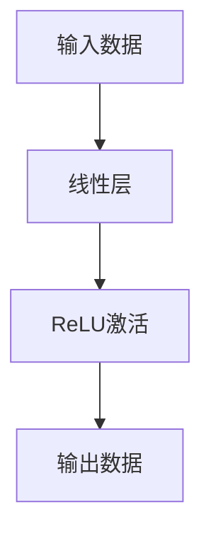

                 

### 文章标题

**《ONNX Runtime 部署：跨平台推理》**

**关键词：** ONNX, ONNX Runtime, 跨平台推理, 部署, 性能优化

**摘要：** 本篇文章将深入探讨 ONNX Runtime 的部署过程及其跨平台推理的能力。我们将从 ONNX 和 ONNX Runtime 的基本概念入手，详细解析其架构和核心特性，然后逐步介绍在不同操作系统和硬件平台上的部署方法，以及推理性能的优化策略和实战案例。

----------------------------------------------------------------

### 《ONNX Runtime 部署：跨平台推理》目录大纲

#### 第一部分：ONNX Runtime 概述

#### 第1章：ONNX 与 ONNX Runtime 简介

- 1.1 ONNX的基本概念
- 1.2 ONNX Runtime 的作用和优势
- 1.3 ONNX Runtime 的架构
- 1.4 ONNX Runtime 的核心特性

#### 第2章：ONNX Runtime 的核心概念与架构

- 2.1 ONNX Runtime 的模型加载
- 2.2 ONNX Runtime 的计算图
- 2.3 ONNX Runtime 的优化技术
- 2.4 ONNX Runtime 的后处理技术

#### 第二部分：ONNX Runtime 的跨平台部署

#### 第3章：ONNX Runtime 在不同操作系统上的部署

- 3.1 Windows 系统上的部署
- 3.2 Linux 系统上的部署
- 3.3 macOS 系统上的部署
- 3.4 在不同操作系统上的兼容性

#### 第4章：ONNX Runtime 在不同硬件平台上的部署

- 4.1 在 CPU 硬件平台上的部署
- 4.2 在 GPU 硬件平台上的部署
- 4.3 在 ARM 硬件平台上的部署
- 4.4 不同硬件平台间的兼容性和优化

#### 第三部分：ONNX Runtime 的推理性能优化

#### 第5章：推理性能优化策略

- 5.1 模型优化技术
- 5.2 计算图优化技术
- 5.3 硬件加速技术
- 5.4 并行计算和并发技术

#### 第6章：性能调优实战

- 6.1 性能瓶颈分析
- 6.2 性能调优案例分析
- 6.3 性能调优工具和技巧
- 6.4 性能优化最佳实践

#### 第四部分：ONNX Runtime 项目实战

#### 第7章：搭建 ONNX Runtime 开发环境

- 7.1 环境搭建步骤
- 7.2 开发环境配置
- 7.3 常见问题与解决方案

#### 第8章：使用 ONNX Runtime 实现跨平台推理

- 8.1 实现跨平台推理的基本流程
- 8.2 跨平台推理案例分析
- 8.3 跨平台推理的优化技巧
- 8.4 跨平台推理的最佳实践

#### 第五部分：附录

#### 附录A：ONNX Runtime 开发资源

- A.1 ONNX Runtime 官方文档
- A.2 ONNX Runtime 社区资源
- A.3 常见问题解答
- A.4 ONNX Runtime 源码解析

### 第一部分：ONNX Runtime 概述

#### 第1章：ONNX 与 ONNX Runtime 简介

**1.1 ONNX的基本概念**

开放神经网络交换格式（Open Neural Network Exchange，简称ONNX）是一个由微软、Facebook和亚马逊等公司共同发起的开放标准，旨在提供一个统一的中间表示格式，使得深度学习模型能够在不同的深度学习框架、工具和平台上无缝迁移和运行。

ONNX的主要特点包括：

- **跨框架兼容性**：ONNX提供了一个统一的中间表示格式，使得模型可以在不同的深度学习框架之间无缝迁移。例如，可以轻松地将TensorFlow模型转换为PyTorch模型，或将模型从本地迁移到云端。
- **高效推理**：ONNX优化了模型的推理过程，使得模型能够在不同的硬件平台上高效运行。ONNX Runtime作为ONNX的推理引擎，支持多种硬件平台，包括CPU、GPU和ARM等。
- **灵活扩展性**：ONNX支持多种编程语言和工具链，包括Python、C++、Java和Rust等，使得开发者可以灵活地使用不同的工具来构建和优化模型。

**1.2 ONNX Runtime 的作用和优势**

ONNX Runtime是ONNX标准的实现之一，作为ONNX的推理引擎，它的主要作用是提供高效的模型推理功能。ONNX Runtime具有以下优势：

- **高效性能**：ONNX Runtime采用了多种优化技术，包括模型优化、计算图优化和硬件加速等，使得模型能够在不同的硬件平台上高效运行。
- **跨平台支持**：ONNX Runtime支持多种操作系统和硬件平台，包括Windows、Linux、macOS、CPU、GPU和ARM等，使得开发者可以轻松地在不同的环境中部署和运行模型。
- **易用性**：ONNX Runtime提供了丰富的API接口，支持多种编程语言和工具链，使得开发者可以方便地集成和使用ONNX Runtime。

**1.3 ONNX Runtime 的架构**

ONNX Runtime的架构主要包括以下几个核心组件：

- **模型加载器（Model Loader）**：负责从各种来源加载ONNX模型，包括文件、内存和网络等。
- **计算图（Compute Graph）**：表示模型中的计算操作和数据的依赖关系，是模型推理的核心部分。
- **优化器（Optimizer）**：对计算图进行优化，包括模型优化、计算图优化和后处理等。
- **执行器（Executor）**：负责执行计算图中的计算操作，生成推理结果。
- **后处理器（Post-Processor）**：对推理结果进行后处理，包括数据格式转换、类别映射等。

**1.4 ONNX Runtime 的核心特性**

ONNX Runtime具有以下核心特性：

- **动态形状支持**：ONNX Runtime支持动态形状的模型，使得模型可以适应不同输入数据的大小和形状。
- **硬件加速**：ONNX Runtime支持多种硬件加速技术，包括GPU和ARM等，使得模型可以在不同的硬件平台上高效运行。
- **自动优化**：ONNX Runtime对计算图进行自动优化，包括模型优化、计算图优化和后处理等，使得模型能够在不同硬件平台上高效运行。
- **多线程并发**：ONNX Runtime支持多线程并发执行，提高模型的推理性能。
- **灵活的API接口**：ONNX Runtime提供了多种API接口，支持Python、C++、Java和Rust等编程语言，方便开发者集成和使用。

#### 第2章：ONNX Runtime 的核心概念与架构

**2.1 ONNX Runtime 的模型加载**

在ONNX Runtime中，模型加载是模型推理的第一步。模型加载器负责从各种来源加载ONNX模型，并将其转换为内部表示。以下是一个简化的模型加载过程：

1. **模型文件读取**：模型加载器从文件系统中读取ONNX模型文件。
2. **模型解析**：模型加载器解析ONNX模型文件，将其转换为ONNX Runtime内部的计算图表示。
3. **模型转换**：如果模型需要进行特定平台上的优化，模型加载器可能还会进行模型转换，例如将通用模型转换为特定硬件平台上的优化模型。

**2.2 ONNX Runtime 的计算图**

计算图是ONNX Runtime的核心概念之一，它表示模型中的计算操作和数据的依赖关系。以下是一个简化的计算图表示：



在这个计算图中，每个节点表示一个计算操作，如线性层、ReLU激活等，每个边表示数据的依赖关系。计算图是一个有向无环图（DAG），这意味着每个节点最多有一个前驱节点和一个后继节点。

**2.3 ONNX Runtime 的优化技术**

ONNX Runtime采用了多种优化技术，以提高模型的推理性能。以下是一些主要的优化技术：

1. **模型优化**：模型优化主要包括以下方面：
   - **张量化（Tensorization）**：将多个小矩阵合并为一个较大的矩阵，以减少内存访问次数。
   - **批处理（Batching）**：将多个输入数据批处理在一起，以提高计算效率。
   - **精度转换（Precision Conversion）**：将高精度模型转换为低精度模型，以减少内存占用和计算量。

2. **计算图优化**：计算图优化主要包括以下方面：
   - **计算图融合（Graph Fusion）**：将多个连续的节点融合为一个节点，以减少内存占用和计算时间。
   - **计算图剪枝（Graph Pruning）**：去除计算图中无关的节点，以减少计算量和内存占用。
   - **计算图拆分（Graph Splitting）**：将大型计算图拆分为多个较小的计算图，以提高并行计算效率。

3. **后处理技术**：后处理技术主要包括以下方面：
   - **类别映射（Class Mapping）**：将推理结果中的类别ID映射为实际的类别名称。
   - **阈值调整（Threshold Adjustment）**：根据实际应用的需求，调整模型的输出阈值，以提高准确率或降低误报率。

**2.4 ONNX Runtime 的后处理技术**

ONNX Runtime的后处理技术主要用于对推理结果进行后处理，以提高模型的性能和应用效果。以下是一些常见的后处理技术：

1. **精度调整**：将推理结果的输出精度调整为所需的精度，如将32位浮点数转换为16位浮点数。

2. **阈值调整**：根据实际应用的需求，调整模型的输出阈值，以提高准确率或降低误报率。

3. **类别映射**：将推理结果中的类别ID映射为实际的类别名称，以便于后续分析和应用。

4. **数据增强**：通过对输入数据进行增强处理，提高模型的鲁棒性和泛化能力。

5. **模型融合**：将多个模型的推理结果进行融合，以提高模型的预测准确率。

### 第二部分：ONNX Runtime 的跨平台部署

#### 第3章：ONNX Runtime 在不同操作系统上的部署

**3.1 Windows 系统上的部署**

在Windows系统上部署ONNX Runtime，首先需要安装ONNX Runtime的预编译包。以下是具体的部署步骤：

1. **安装Python环境**：确保系统已经安装了Python环境，版本建议为3.6及以上。
2. **安装ONNX Runtime**：使用pip命令安装ONNX Runtime，命令如下：

   ```bash
   pip install onnxruntime
   ```

   如果需要使用GPU加速，可以使用以下命令：

   ```bash
   pip install onnxruntime-gpu
   ```

3. **验证安装**：在Python环境中，执行以下代码验证ONNX Runtime是否安装成功：

   ```python
   import onnxruntime
   print(onnxruntime.__version__)
   ```

   如果输出正确的版本号，说明ONNX Runtime已成功安装。

**3.2 Linux 系统上的部署**

在Linux系统上部署ONNX Runtime，同样需要安装ONNX Runtime的预编译包。以下是具体的部署步骤：

1. **安装Python环境**：确保系统已经安装了Python环境，版本建议为3.6及以上。
2. **安装ONNX Runtime**：使用pip命令安装ONNX Runtime，命令如下：

   ```bash
   pip install onnxruntime
   ```

   如果需要使用GPU加速，可以使用以下命令：

   ```bash
   pip install onnxruntime-gpu
   ```

3. **验证安装**：在Python环境中，执行以下代码验证ONNX Runtime是否安装成功：

   ```python
   import onnxruntime
   print(onnxruntime.__version__)
   ```

   如果输出正确的版本号，说明ONNX Runtime已成功安装。

**3.3 macOS 系统上的部署**

在macOS系统上部署ONNX Runtime，同样需要安装ONNX Runtime的预编译包。以下是具体的部署步骤：

1. **安装Python环境**：确保系统已经安装了Python环境，版本建议为3.6及以上。
2. **安装ONNX Runtime**：使用pip命令安装ONNX Runtime，命令如下：

   ```bash
   pip install onnxruntime
   ```

   如果需要使用GPU加速，可以使用以下命令：

   ```bash
   pip install onnxruntime-gpu
   ```

3. **验证安装**：在Python环境中，执行以下代码验证ONNX Runtime是否安装成功：

   ```python
   import onnxruntime
   print(onnxruntime.__version__)
   ```

   如果输出正确的版本号，说明ONNX Runtime已成功安装。

**3.4 在不同操作系统上的兼容性**

ONNX Runtime在不同操作系统上的兼容性较好，主要表现在以下几个方面：

1. **操作系统兼容性**：ONNX Runtime支持Windows、Linux和macOS等主流操作系统，开发者可以在不同的操作系统上部署和运行ONNX Runtime。
2. **硬件兼容性**：ONNX Runtime支持多种硬件平台，包括CPU、GPU和ARM等，开发者可以根据实际需求选择合适的硬件平台进行部署。
3. **API兼容性**：ONNX Runtime提供了丰富的API接口，支持Python、C++、Java和Rust等编程语言，开发者可以方便地在不同的编程语言和环境中使用ONNX Runtime。

### 第4章：ONNX Runtime 在不同硬件平台上的部署

**4.1 在 CPU 硬件平台上的部署**

在CPU硬件平台上部署ONNX Runtime，主要是利用CPU的通用计算能力进行模型推理。以下是具体的部署步骤：

1. **安装依赖库**：确保系统已经安装了必要的依赖库，如NumPy、SciPy和CuPy等。
2. **下载并安装 ONNX Runtime**：访问ONNX Runtime的官方仓库，下载适用于CPU硬件平台的预编译包，并使用pip命令进行安装。

   ```bash
   pip install onnxruntime-cpu
   ```

3. **验证安装**：在Python环境中，执行以下代码验证ONNX Runtime是否安装成功：

   ```python
   import onnxruntime
   print(onnxruntime.__version__)
   ```

   如果输出正确的版本号，说明ONNX Runtime已成功安装。

4. **运行示例代码**：在Python环境中，运行以下代码，验证ONNX Runtime在CPU硬件平台上的推理性能：

   ```python
   import onnxruntime as rt

   # 创建 ONNX Runtime 会话
   session = rt.InferenceSession("model.onnx")

   # 准备输入数据
   input_data = np.random.rand(1, 3, 224, 224).astype(np.float32)

   # 运行推理
   output_data = session.run(["output"], input_data)

   print(output_data)
   ```

**4.2 在 GPU 硬件平台上的部署**

在GPU硬件平台上部署ONNX Runtime，主要是利用GPU的并行计算能力进行模型推理。以下是具体的部署步骤：

1. **安装 CUDA 和 cuDNN**：确保系统已经安装了CUDA和cuDNN，版本需要与ONNX Runtime兼容。

2. **下载并安装 ONNX Runtime**：访问ONNX Runtime的官方仓库，下载适用于GPU硬件平台的预编译包，并使用pip命令进行安装。

   ```bash
   pip install onnxruntime-gpu
   ```

3. **验证安装**：在Python环境中，执行以下代码验证ONNX Runtime是否安装成功：

   ```python
   import onnxruntime
   print(onnxruntime.__version__)
   ```

   如果输出正确的版本号，说明ONNX Runtime已成功安装。

4. **运行示例代码**：在Python环境中，运行以下代码，验证ONNX Runtime在GPU硬件平台上的推理性能：

   ```python
   import onnxruntime as rt
   import numpy as np

   # 创建 ONNX Runtime 会话
   session = rt.InferenceSession("model.onnx", providers=["CUDAExecutionProvider"])

   # 准备输入数据
   input_data = np.random.rand(1, 3, 224, 224).astype(np.float32)

   # 运行推理
   output_data = session.run(["output"], input_data)

   print(output_data)
   ```

**4.3 在 ARM 硬件平台上的部署**

在ARM硬件平台上部署ONNX Runtime，主要是利用ARM架构的轻量级计算能力进行模型推理。以下是具体的部署步骤：

1. **安装依赖库**：确保系统已经安装了必要的依赖库，如NumPy、SciPy和CuPy等。
2. **下载并安装 ONNX Runtime**：访问ONNX Runtime的官方仓库，下载适用于ARM硬件平台的预编译包，并使用pip命令进行安装。

   ```bash
   pip install onnxruntime-arm
   ```

3. **验证安装**：在Python环境中，执行以下代码验证ONNX Runtime是否安装成功：

   ```python
   import onnxruntime
   print(onnxruntime.__version__)
   ```

   如果输出正确的版本号，说明ONNX Runtime已成功安装。

4. **运行示例代码**：在Python环境中，运行以下代码，验证ONNX Runtime在ARM硬件平台上的推理性能：

   ```python
   import onnxruntime as rt

   # 创建 ONNX Runtime 会话
   session = rt.InferenceSession("model.onnx")

   # 准备输入数据
   input_data = np.random.rand(1, 3, 224, 224).astype(np.float32)

   # 运行推理
   output_data = session.run(["output"], input_data)

   print(output_data)
   ```

**4.4 不同硬件平台间的兼容性和优化**

ONNX Runtime在不同硬件平台间的兼容性和优化主要体现在以下几个方面：

1. **跨平台兼容性**：ONNX Runtime支持跨平台部署，包括Windows、Linux、macOS、CPU、GPU和ARM等。开发者可以根据实际需求选择合适的硬件平台进行部署。

2. **性能优化**：ONNX Runtime采用了多种优化技术，如模型优化、计算图优化和硬件加速等，以提高模型在不同硬件平台上的推理性能。

3. **混合部署**：ONNX Runtime支持混合部署，即在不同硬件平台上同时运行多个模型，以提高整体推理性能。例如，在CPU和GPU之间进行负载均衡，以充分利用硬件资源。

4. **资源管理**：ONNX Runtime提供了丰富的API接口，用于管理不同硬件平台上的资源，如内存、计算资源等。开发者可以根据实际需求进行资源管理和调优。

### 第三部分：ONNX Runtime 的推理性能优化

#### 第5章：推理性能优化策略

**5.1 模型优化技术**

模型优化是提高ONNX Runtime推理性能的重要手段。以下是一些常用的模型优化技术：

1. **模型量化**：模型量化是将高精度模型转换为低精度模型的过程，以减少模型大小和计算量。常用的量化方法包括整数量化、浮点量化等。

2. **模型剪枝**：模型剪枝是通过去除模型中的冗余神经元和连接，以减小模型大小和计算量。常用的剪枝方法包括权重剪枝、结构剪枝等。

3. **模型融合**：模型融合是将多个模型合并为一个模型的过程，以充分利用模型的性能和精度。常用的融合方法包括深度融合、宽度融合等。

**5.2 计算图优化技术**

计算图优化是提高ONNX Runtime推理性能的另一种重要手段。以下是一些常用的计算图优化技术：

1. **计算图融合**：计算图融合是将多个连续的节点合并为一个节点的过程，以减少内存访问次数和计算时间。

2. **计算图剪枝**：计算图剪枝是通过去除计算图中的冗余节点和边的过程，以减小计算图的大小和计算量。

3. **计算图并行化**：计算图并行化是将计算图中的多个节点并行执行的过程，以提高模型的推理性能。

**5.3 硬件加速技术**

硬件加速是提高ONNX Runtime推理性能的有效方法，以下是一些常用的硬件加速技术：

1. **GPU加速**：利用GPU的并行计算能力，将模型推理任务分布到多个GPU核心上，以提高推理性能。

2. **FPGA加速**：利用FPGA的硬件资源，实现模型的硬件加速推理，以降低功耗和提高性能。

3. **ARM加速**：利用ARM架构的特点，如高能效比、多核等，实现模型的快速推理。

**5.4 并行计算和并发技术**

并行计算和并发技术是提高ONNX Runtime推理性能的关键，以下是一些常用的并行计算和并发技术：

1. **多线程并行**：在Python环境中，利用多线程并行执行模型推理任务，以充分利用CPU的多核性能。

2. **异步IO**：在模型推理过程中，利用异步IO技术，减少IO操作的等待时间，提高模型的推理性能。

3. **并发编程**：在模型推理过程中，利用并发编程技术，如协程、异步编程等，提高模型的推理性能。

### 第6章：性能调优实战

**6.1 性能瓶颈分析**

在进行ONNX Runtime性能调优之前，首先需要分析性能瓶颈。以下是一些常用的性能瓶颈分析方法：

1. **CPU利用率分析**：通过分析CPU利用率，确定是否存在CPU资源瓶颈。

2. **内存使用情况分析**：通过分析内存使用情况，确定是否存在内存瓶颈。

3. **GPU利用率分析**：通过分析GPU利用率，确定是否存在GPU资源瓶颈。

4. **IO性能分析**：通过分析IO性能，确定是否存在IO瓶颈。

**6.2 性能调优案例分析**

以下是一个性能调优案例分析：

**案例**：一个使用ONNX Runtime在GPU上进行推理的图像分类模型，其推理速度较慢。

**分析**：通过分析，发现存在以下性能瓶颈：

1. **GPU利用率低**：GPU利用率仅为20%，存在GPU资源瓶颈。
2. **内存使用过高**：内存使用达到90%，存在内存瓶颈。
3. **模型大小过大**：模型大小为500MB，超过了GPU内存容量。

**调优方案**：

1. **优化模型大小**：通过模型量化、模型剪枝等技术，减小模型大小，使其适应GPU内存容量。
2. **负载均衡**：将模型推理任务分布到多个GPU核心上，提高GPU利用率。
3. **调整参数配置**：优化ONNX Runtime的参数配置，如batch size、thread count等，提高模型推理性能。

**6.3 性能调优工具和技巧**

以下是一些常用的性能调优工具和技巧：

1. **性能分析工具**：使用性能分析工具，如py-spy、gprof2dot等，对模型推理过程进行性能分析，定位性能瓶颈。

2. **调参工具**：使用调参工具，如PyTorch的`torch.utils.model_zoo`等，优化模型参数，提高模型性能。

3. **代码优化**：优化模型代码，如减少不必要的循环、使用高效的算法和数据结构等，提高代码性能。

**6.4 性能优化最佳实践**

以下是一些性能优化最佳实践：

1. **合理配置硬件资源**：根据实际需求，合理配置CPU、GPU和内存等硬件资源，避免资源瓶颈。

2. **优化模型结构**：设计合理的模型结构，减少模型参数数量和计算量，提高模型推理性能。

3. **批量处理**：批量处理输入数据，减少IO操作次数，提高模型推理速度。

4. **代码优化**：编写高效、简洁的代码，减少不必要的计算和内存占用，提高代码性能。

### 第7章：搭建 ONNX Runtime 开发环境

**7.1 环境搭建步骤**

搭建ONNX Runtime开发环境主要包括以下步骤：

1. **安装Python环境**：确保系统已经安装了Python环境，版本建议为3.6及以上。
2. **安装ONNX库**：使用pip命令安装ONNX库，命令如下：

   ```bash
   pip install onnx
   ```

3. **安装ONNX Runtime**：使用pip命令安装ONNX Runtime，命令如下：

   ```bash
   pip install onnxruntime
   ```

   如果需要使用GPU加速，可以使用以下命令：

   ```bash
   pip install onnxruntime-gpu
   ```

4. **验证安装**：在Python环境中，执行以下代码验证ONNX Runtime是否安装成功：

   ```python
   import onnxruntime
   print(onnxruntime.__version__)
   ```

   如果输出正确的版本号，说明ONNX Runtime已成功安装。

**7.2 开发环境配置**

在搭建好ONNX Runtime开发环境后，需要进行一些配置，以便于开发和调试。

1. **配置Python环境变量**：将Python环境路径添加到系统环境变量中，以便于在命令行中直接运行Python脚本。

2. **配置ONNX Runtime配置文件**：在ONNX Runtime的配置文件中，可以配置一些性能优化参数，如线程数、内存管理等。

3. **配置IDE**：在集成开发环境中，添加ONNX Runtime的库文件，以便于在IDE中直接调用ONNX Runtime的API。

**7.3 常见问题与解决方案**

在搭建ONNX Runtime开发环境过程中，可能会遇到以下一些常见问题：

1. **安装失败**：如果安装过程中出现错误，可以尝试更新pip版本、清理pip缓存或更换pip源等。

2. **依赖库缺失**：如果依赖库缺失，可以检查系统是否已经安装了必要的依赖库，或者使用pip命令安装缺失的依赖库。

3. **运行时错误**：如果在运行ONNX Runtime时出现错误，可以检查ONNX Runtime的配置文件和代码，确认配置和代码的正确性。

4. **性能问题**：如果性能不满足需求，可以尝试调整ONNX Runtime的参数配置、优化模型结构或使用硬件加速技术等。

### 第8章：使用 ONNX Runtime 实现跨平台推理

**8.1 实现跨平台推理的基本流程**

使用ONNX Runtime实现跨平台推理主要包括以下基本流程：

1. **模型转换**：将训练好的模型转换为ONNX格式，以便于在不同平台上运行。

2. **模型加载**：使用ONNX Runtime加载转换后的ONNX模型，准备进行推理。

3. **数据预处理**：对输入数据进行预处理，使其满足模型的要求。

4. **推理执行**：使用ONNX Runtime执行推理，生成输出结果。

5. **结果后处理**：对输出结果进行后处理，如类别映射、阈值调整等。

**8.2 跨平台推理案例分析**

以下是一个简单的跨平台推理案例分析：

**案例**：使用ONNX Runtime在CPU和GPU上分别进行推理，并比较性能。

**步骤**：

1. **模型转换**：将训练好的TensorFlow模型转换为ONNX格式。

2. **模型加载**：分别使用ONNX Runtime加载转换后的ONNX模型，准备进行推理。

3. **数据预处理**：对输入数据进行预处理，使其满足模型的要求。

4. **推理执行**：分别在CPU和GPU上使用ONNX Runtime执行推理，生成输出结果。

5. **结果后处理**：对输出结果进行后处理，如类别映射、阈值调整等。

6. **性能比较**：比较CPU和GPU上的推理性能，分析性能差异。

**8.3 跨平台推理的优化技巧**

为了提高跨平台推理的性能，可以采用以下优化技巧：

1. **模型量化**：通过模型量化技术，将高精度模型转换为低精度模型，以减少计算量和内存占用。

2. **计算图优化**：通过计算图优化技术，如计算图融合、计算图剪枝等，减小计算图的大小和计算量。

3. **硬件加速**：利用硬件加速技术，如GPU加速、FPGA加速等，提高推理性能。

4. **多线程并发**：利用多线程并发技术，提高模型的推理性能。

5. **批量处理**：批量处理输入数据，减少IO操作次数，提高模型推理速度。

**8.4 跨平台推理的最佳实践**

为了实现高效的跨平台推理，可以遵循以下最佳实践：

1. **统一模型格式**：使用ONNX格式作为模型的统一格式，便于在不同平台上迁移和运行。

2. **性能测试**：在不同平台上进行性能测试，选择适合硬件平台和业务需求的模型优化策略。

3. **资源管理**：合理配置硬件资源，充分利用CPU、GPU、内存等资源。

4. **代码优化**：编写高效、简洁的代码，减少不必要的计算和内存占用。

5. **持续优化**：根据实际需求和性能指标，持续优化模型和推理流程。

### 附录A：ONNX Runtime 开发资源

**A.1 ONNX Runtime 官方文档**

ONNX Runtime的官方文档提供了详细的安装指南、API文档和使用示例。访问[ONNX Runtime 官方文档](https://microsoft.github.io/onnxruntime/)可以获取更多详细信息。

**A.2 ONNX Runtime 社区资源**

ONNX Runtime的社区资源包括论坛、博客和GitHub仓库等。访问[ONNX Runtime 社区资源](https://github.com/microsoft/onnxruntime)可以获取最新的技术动态、问题和解决方案。

**A.3 常见问题解答**

ONNX Runtime的常见问题解答包括安装问题、使用问题和技术问题等。访问[ONNX Runtime 常见问题解答](https://microsoft.github.io/onnxruntime/install.html)可以找到常见问题的解答。

**A.4 ONNX Runtime 源码解析**

ONNX Runtime的源码解析提供了对ONNX Runtime内部实现和架构的深入了解。访问[ONNX Runtime 源码解析](https://github.com/microsoft/onnxruntime)可以查看源码和相应的注释文档。

---

通过以上详细的步骤和案例分析，读者应该能够掌握ONNX Runtime的基本使用方法和性能优化技巧。在实际应用中，可以根据具体需求进行定制化的开发和使用。希望本文能为读者在ONNX Runtime的开发和应用过程中提供有价值的参考和指导。

**作者：AI天才研究院/AI Genius Institute & 禅与计算机程序设计艺术 /Zen And The Art of Computer Programming**

