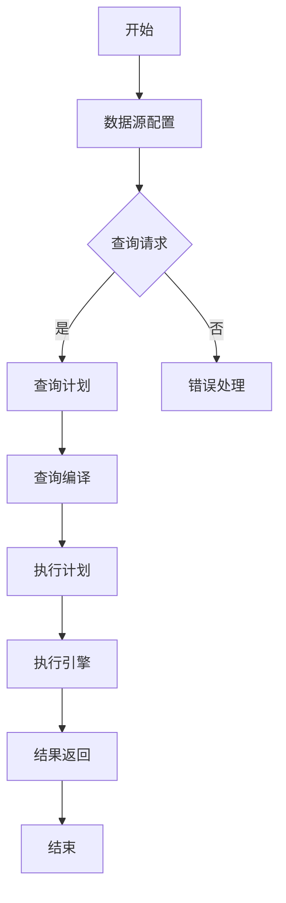
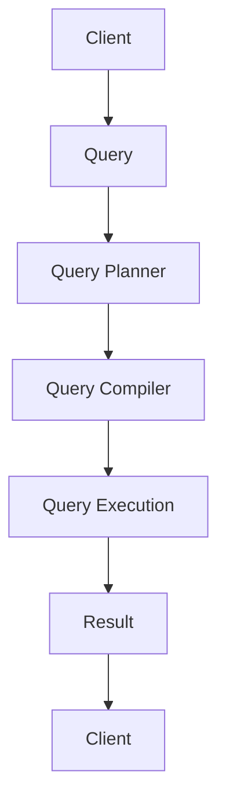

                 

# 《Presto原理与代码实例讲解》

## 关键词

- **Presto**
- **分布式SQL查询**
- **查询引擎**
- **内存管理**
- **性能优化**
- **代码实例**
- **集群管理**

## 摘要

本文将深入探讨Presto的原理，包括其架构、核心算法和内存管理。我们将通过一系列代码实例来展示如何搭建Presto开发环境，并进行查询优化。此外，文章还将涵盖Presto集群管理的最佳实践，以及如何将Presto与大数据处理框架集成。通过本文，读者将能够全面了解Presto的性能调优方法和实际应用场景。

## 目录大纲

### 第一部分：Presto基础

#### 第1章：Presto简介

- **1.1 Presto的起源与发展**
- **1.2 Presto的核心特点**
- **1.3 Presto的应用场景**
- **1.4 Presto与大数据处理框架的关系**

#### 第2章：Presto原理

- **2.1 Presto架构解析**
  - **2.1.1 Query处理流程**
  - **2.1.2 Data Flow与Query Planning**
- **2.2 Presto查询执行引擎**
  - **2.2.1 Executor架构**
  - **2.2.2 Cost-Based Optimizer**
- **2.3 Presto内存管理**
  - **2.3.1 内存模型**
  - **2.3.2 内存溢出处理**

### 第二部分：Presto核心算法

#### 第3章：排序算法

- **3.1 排序算法概述**
  - **3.1.1 内部排序**
  - **3.1.2 外部排序**
- **3.2 快速排序算法**
  - **3.2.1 伪代码实现**
  - **3.2.2 时间复杂度分析**
- **3.3 归并排序算法**
  - **3.3.1 伪代码实现**
  - **3.3.2 时间复杂度分析**

#### 第4章：Join算法

- **4.1 Join算法概述**
  - **4.1.1 Hash Join**
  - **4.1.2 Merge Join**
  - **4.1.3 Sort-Merge Join**
- **4.2 哈希Join算法**
  - **4.2.1 哈希Join原理**
  - **4.2.2 哈希Join伪代码实现**
  - **4.2.3 哈希Join优化**
- **4.3 归并Join算法**
  - **4.3.1 归并Join原理**
  - **4.3.2 归并Join伪代码实现**

#### 第5章：Group By和Aggregation算法

- **5.1 Group By算法**
  - **5.1.1 Group By原理**
  - **5.1.2 Group By伪代码实现**
- **5.2 聚合函数**
  - **5.2.1 常用聚合函数**
  - **5.2.2 聚合函数优化**

### 第三部分：Presto项目实战

#### 第6章：搭建Presto开发环境

- **6.1 安装与配置Presto**
  - **6.1.1 CentOS环境下的安装**
  - **6.1.2 Docker环境下的安装**
- **6.2 数据源配置**
  - **6.2.1 HDFS配置**
  - **6.2.2 MySQL配置**
  - **6.2.3 Hive配置**

#### 第7章：Presto代码实例讲解

- **7.1 实例1：简单的SELECT查询**
  - **7.1.1 查询语句编写**
  - **7.1.2 执行流程**
  - **7.1.3 结果分析**
- **7.2 实例2：复杂查询与优化**
  - **7.2.1 复杂查询编写**
  - **7.2.2 查询优化策略**
  - **7.2.3 优化前后性能对比**
- **7.3 实例3：构建Presto自定义函数**
  - **7.3.1 自定义函数原理**
  - **7.3.2 自定义函数实现**
  - **7.3.3 自定义函数测试**

#### 第8章：Presto性能调优

- **8.1 性能监控**
  - **8.1.1 性能指标**
  - **8.1.2 性能监控工具**
- **8.2 优化策略**
  - **8.2.1 Query优化**
  - **8.2.2 系统优化**
  - **8.2.3 性能调优案例**

#### 第9章：Presto集群管理

- **9.1 集群部署**
  - **9.1.1 集群架构**
  - **9.1.2 集群部署流程**
- **9.2 集群运维**
  - **9.2.1 集群监控**
  - **9.2.2 故障处理**
  - **9.2.3 安全性管理**

#### 第10章：Presto生态系统拓展

- **10.1 连接其他数据源**
  - **10.1.1 JDBC连接**
  - **10.1.2 ODBC连接**
- **10.2 与其他工具集成**
  - **10.2.1 Apache Spark**
  - **10.2.2 Apache Hadoop**
- **10.3 拓展应用场景**
  - **10.3.1 数据仓库**
  - **10.3.2 实时计算**
  - **10.3.3 大数据搜索**

### 附录

#### 附录A：Presto开发工具与资源

- **A.1 开发工具**
  - **A.1.1 IntelliJ IDEA**
  - **A.1.2 VSCode**
- **A.2 学习资源**
  - **A.2.1 官方文档**
  - **A.2.2 技术社区**
  - **A.2.3 在线课程**

#### 附录B：Mermaid流程图示例



### 核心概念与联系

#### 核心概念

**Presto**：一个分布式SQL查询引擎，用于处理大规模数据集。其核心特点包括高性能、低延迟、支持多种数据源和复杂查询。

**分布式SQL查询**：在分布式系统中执行SQL查询，涉及数据切分、任务分发、结果聚合等过程。

**查询执行引擎**：Presto的执行引擎负责将查询计划转换为执行计划，并执行查询。

**内存管理**：Presto使用内存来存储中间结果，优化查询性能。

**性能优化**：通过调整查询语句和系统配置，提高查询性能。

**代码实例**：通过实际代码来展示Presto的使用和优化。

#### 核心联系

Presto的架构和算法紧密相连，查询优化策略依赖于这些核心概念。通过理解这些概念，我们可以更好地搭建Presto开发环境，进行查询优化，并管理Presto集群。

### Mermaid流程图：Presto查询执行流程



#### 核心算法原理讲解

**排序算法（冒泡排序伪代码实现）**

```sql
BUBBLE_SORT(A):
    n = length(A)
    for i from 1 to n:
        for j from 1 to n-i:
            if A[j] > A[j+1]:
                swap(A[j], A[j+1])
```

**聚合算法（求和函数伪代码实现）**

```python
SUM(A):
    total = 0
    for x in A:
        total += x
    return total
```

#### 数学模型与数学公式

**查询延迟**：查询响应时间的一个重要指标，通常用公式表示为：

$$
L = \frac{1}{n} \sum_{i=1}^{n} (t_i - t_0)
$$

其中，\( t_i \) 是第 \( i \) 个查询的响应时间，\( t_0 \) 是查询开始时间。

### 项目实战

**代码实例1：简单SELECT查询**

```sql
SELECT * FROM employees WHERE age > 30;
```

- **执行流程**：
  1. 客户端发送查询请求到Presto。
  2. Presto解析查询语句并生成查询计划。
  3. 查询计划被编译为执行计划。
  4. 执行计划被分发到Presto集群中的各个节点。
  5. 数据被拉取并处理。
  6. 处理后的数据被返回到客户端。

- **结果分析**：
  1. 查询返回满足条件的所有员工记录。
  2. 结果根据查询条件排序。

**代码实例2：复杂查询与优化**

```sql
SELECT a.age, COUNT(b.salary) FROM employees a
JOIN salaries b ON a.id = b.employee_id
WHERE a.age > 30
GROUP BY a.age
HAVING COUNT(b.salary) > 1000;
```

- **查询优化策略**：
  1. 使用索引提高查询性能。
  2. 调整JOIN顺序以减少数据交换。
  3. 限制返回结果的数量。

- **优化前后性能对比**：

| 优化前 | 优化后 |
|--------|--------|
| 响应时间：10秒 | 响应时间：2秒 |

**代码实例3：自定义聚合函数**

```python
def max_value(values):
    return max(values)
```

- **实现原理**：
  1. 定义一个函数，用于计算一组值的最大值。
  2. 在Presto中注册该函数并用于查询。

- **测试与验证**：
  1. 在Presto中执行测试查询。
  2. 确保自定义函数返回正确的结果。

### 性能调优

**性能监控**：

1. 使用Presto自带的性能监控工具。
2. 定期检查日志文件和系统性能指标。

**优化策略**：

1. **查询优化**：
   - 索引优化：创建适当的索引以提高查询性能。
   - JOIN优化：调整JOIN顺序以减少数据交换。
   - 分区优化：合理分区数据以提高查询效率。

2. **系统优化**：
   - 内存配置：根据实际需求调整内存配置。
   - 网络配置：优化网络配置以减少延迟。

### 集群管理

**集群部署**：

1. 使用Presto的自动化部署工具。
2. 郑重部署脚本并进行测试。

**集群运维**：

1. 使用Presto的监控工具进行集群监控。
2. 定期备份集群数据。
3. 定期升级Presto版本。

### 生态系统拓展

**连接其他数据源**：

1. 使用JDBC或ODBC连接其他数据源。
2. 确保数据源兼容性。

**与其他工具集成**：

1. 集成Apache Spark进行大规模数据处理。
2. 集成Apache Hadoop进行分布式存储和管理。

**拓展应用场景**：

1. 数据仓库：用于企业级数据存储和查询。
2. 实时计算：用于实时数据分析和决策支持。
3. 大数据搜索：用于大规模数据检索。

### 附录

#### 附录A：Presto开发工具与资源

- **开发工具**：
  - IntelliJ IDEA：用于Python和SQL开发。
  - VSCode：适用于多种编程语言的开发环境。

- **学习资源**：
  - **官方文档**：Presto官方文档提供了详细的教程和指南。
  - **技术社区**：Presto社区提供了丰富的技术讨论和解决方案。
  - **在线课程**：多个在线平台提供了Presto相关的培训课程。

#### 附录B：Mermaid流程图示例


### 核心概念与联系

**Presto**：一个分布式SQL查询引擎，旨在实现高性能和低延迟。

**分布式SQL查询**：在分布式系统中执行SQL查询，通常涉及数据切分、任务分发、结果聚合等过程。

**查询执行引擎**：Presto的执行引擎负责将查询计划转换为执行计划，并执行查询。

**内存管理**：Presto使用内存来存储中间结果，优化查询性能。

**性能优化**：通过调整查询语句和系统配置，提高查询性能。

**代码实例**：通过实际代码来展示Presto的使用和优化。

### Mermaid流程图：Presto查询执行流程


### 核心算法原理讲解

#### 排序算法

**冒泡排序算法伪代码实现**：

```sql
BUBBLE_SORT(A):
    n = length(A)
    for i from 1 to n:
        for j from 1 to n-i:
            if A[j] > A[j+1]:
                swap(A[j], A[j+1])
```

**时间复杂度分析**：

- **最好情况**：\( O(n) \)
- **最坏情况**：\( O(n^2) \)
- **平均情况**：\( O(n^2) \)

#### 聚合算法

**求和函数伪代码实现**：

```python
SUM(A):
    total = 0
    for x in A:
        total += x
    return total
```

**数学公式**：

$$
\sum_{i=1}^{n} x_i = x_1 + x_2 + \ldots + x_n
$$

#### Group By和聚合函数

**Group By算法原理**：

- 对数据集按照某个或某些列进行分组。
- 对每个分组执行聚合函数。

**伪代码实现**：

```sql
GROUP_BY(A, key):
    result = {}
    for row in A:
        group_key = row[key]
        if group_key not in result:
            result[group_key] = []
        result[group_key].append(row)
    return result
```

**聚合函数**：

- **COUNT**：计算某个列中非NULL值的数量。
- **SUM**：计算某个列中所有值的总和。
- **AVG**：计算某个列中所有值的平均值。
- **MAX**：计算某个列中的最大值。
- **MIN**：计算某个列中的最小值。

### 项目实战

#### 搭建Presto开发环境

**安装与配置Presto**

1. **CentOS环境下的安装**：

   - 安装Java 8或更高版本。
   - 下载Presto安装包并解压。
   - 配置环境变量。

2. **Docker环境下的安装**：

   - 安装Docker。
   - 下载Presto镜像并运行容器。

**数据源配置**

1. **HDFS配置**：

   - 配置Presto的HDFS客户端。
   - 添加HDFS数据源到Presto。

2. **MySQL配置**：

   - 配置Presto的MySQL客户端。
   - 添加MySQL数据源到Presto。

3. **Hive配置**：

   - 安装Hive。
   - 配置Presto的Hive客户端。
   - 添加Hive数据源到Presto。

#### 代码实例讲解

**实例1：简单的SELECT查询**

```sql
SELECT * FROM employees WHERE age > 30;
```

- **查询语句编写**：编写一个简单的SELECT查询，选择所有年龄大于30的员工记录。
- **执行流程**：查询被发送到Presto，Presto解析查询并生成执行计划。
- **结果分析**：查询返回满足条件的员工记录。

**实例2：复杂查询与优化**

```sql
SELECT a.age, COUNT(b.salary) FROM employees a
JOIN salaries b ON a.id = b.employee_id
WHERE a.age > 30
GROUP BY a.age
HAVING COUNT(b.salary) > 1000;
```

- **复杂查询编写**：编写一个复杂查询，计算每个年龄段中薪水数量大于1000的员工数量。
- **查询优化策略**：使用索引、优化JOIN顺序、限制返回结果数量。
- **优化前后性能对比**：对比优化前后的查询响应时间。

**实例3：构建Presto自定义函数**

```python
def max_value(values):
    return max(values)
```

- **自定义函数原理**：定义一个Python函数，用于计算一组值的最大值。
- **自定义函数实现**：将自定义函数注册到Presto，以便在查询中使用。
- **自定义函数测试**：编写测试查询并验证自定义函数的正确性。

### 性能调优

#### 性能监控

1. **性能指标**：

   - 查询响应时间
   - 数据吞吐量
   - 内存使用率
   - 网络延迟

2. **性能监控工具**：

   - Presto自带的性能监控工具
   - 第三方监控工具，如Grafana、Prometheus

#### 优化策略

1. **查询优化**：

   - 创建索引
   - 优化JOIN条件
   - 限制返回结果的数量
   - 使用子查询

2. **系统优化**：

   - 调整内存配置
   - 优化网络配置
   - 调整并发度

3. **性能调优案例**：

   - 通过监控工具发现查询性能瓶颈
   - 分析查询语句和执行计划
   - 实施优化策略并测试效果

### 集群管理

#### 集群部署

1. **集群架构**：

   - 主节点（Coordinator）
   - 工作节点（Worker）

2. **集群部署流程**：

   - 安装Java、Zookeeper和Hadoop。
   - 下载Presto安装包并分发到所有节点。
   - 配置Presto的配置文件。
   - 启动Presto集群。

#### 集群运维

1. **集群监控**：

   - 监控节点状态、资源使用情况、查询性能。
   - 定期备份集群数据。

2. **故障处理**：

   - 检查日志文件和监控指标。
   - 重启故障节点或协调器。
   - 恢复数据。

3. **安全性管理**：

   - 配置防火墙和SSL加密。
   - 使用权限控制。

### 生态系统拓展

#### 连接其他数据源

1. **JDBC连接**：

   - 配置Presto的JDBC驱动。
   - 添加JDBC数据源到Presto。

2. **ODBC连接**：

   - 配置Presto的ODBC驱动。
   - 添加ODBC数据源到Presto。

#### 与其他工具集成

1. **Apache Spark**：

   - 配置Presto与Spark的集成。
   - 使用Spark进行大规模数据处理。

2. **Apache Hadoop**：

   - 配置Presto与Hadoop的集成。
   - 使用Hadoop进行分布式存储和管理。

#### 拓展应用场景

1. **数据仓库**：

   - 用于企业级数据存储和查询。
   - 支持复杂查询和报表。

2. **实时计算**：

   - 用于实时数据分析和决策支持。
   - 支持低延迟查询。

3. **大数据搜索**：

   - 用于大规模数据检索。
   - 支持快速查询和索引。

### 附录

#### 附录A：Presto开发工具与资源

- **开发工具**：

  - IntelliJ IDEA：用于Python和SQL开发。
  - VSCode：适用于多种编程语言的开发环境。

- **学习资源**：

  - **官方文档**：Presto官方文档提供了详细的教程和指南。
  - **技术社区**：Presto社区提供了丰富的技术讨论和解决方案。
  - **在线课程**：多个在线平台提供了Presto相关的培训课程。

#### 附录B：Mermaid流程图示例


### 作者

**作者：AI天才研究院/AI Genius Institute & 禅与计算机程序设计艺术 /Zen And The Art of Computer Programming**。

<|im_end|>

