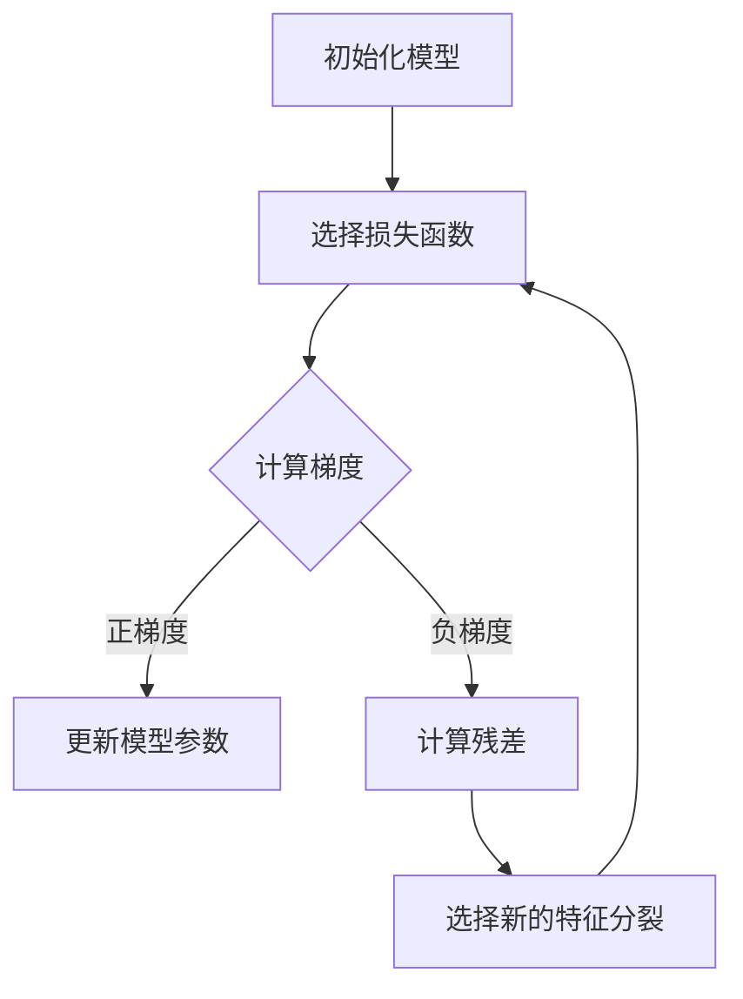

                 

### 文章标题

《Python机器学习实战：梯度提升树(Gradient Boosting)算法深入理解》

本文将带领读者深入探讨Python在机器学习中的实践应用，特别关注于梯度提升树（Gradient Boosting）这一强大且灵活的算法。通过对梯度提升树原理的详细剖析，以及实际代码实现和实战案例的分享，我们将帮助读者全面理解这一算法的核心概念和应用技巧。

### 文章关键词

Python，机器学习，梯度提升树，算法原理，实战案例，模型优化，超参数调优

### 文章摘要

本文分为四个部分，首先介绍机器学习的基础知识，包括概述、Python编程基础、NumPy基础、数据预处理等内容。接着深入探讨梯度提升树的原理和数学模型，并通过Mermaid流程图和伪代码详细阐述。随后，我们将通过实际代码实现和实战案例，展示如何构建和评估梯度提升树模型。最后，本文将对梯度提升树的优势、局限性和未来发展趋势进行总结，并提供Python机器学习实战技巧和常用库介绍。

## 《Python机器学习实战：梯度提升树(Gradient Boosting)算法深入理解》目录大纲

### 第一部分：预备知识

#### 第1章：机器学习基础

- 1.1 机器学习概述
  - 什么是机器学习
  - 机器学习的基本概念
- 1.2 Python编程基础
  - Python语言基础
  - Python在机器学习中的应用
- 1.3 NumPy基础
  - NumPy库介绍
  - NumPy的基本操作
- 1.4 数据预处理
  - 数据预处理的重要性
  - 常见的数据预处理方法

#### 第2章：Python在机器学习中的应用

- 2.1 Python库介绍
  - Scikit-learn库
  - XGBoost库
- 2.2 Python库的使用
  - Python库的基本使用方法
  - Python库在实战中的应用

### 第二部分：梯度提升树（Gradient Boosting）算法

#### 第3章：梯度提升树原理

- 3.1 梯度提升树概述
  - 梯度提升树的概念
  - 梯度提升树的特点
- 3.2 梯度提升树的数学原理
  - 损失函数
  - 梯度下降法
- 3.3 梯度提升树的 Mermaid 流程图
  - Mermaid流程图的绘制方法
  - 梯度提升树的流程图

#### 第4章：梯度提升树算法实现

- 4.1 伪代码实现
  - 梯度提升树的伪代码
  - 伪代码的详细解释
- 4.2 实际代码实现
  - Python代码实现
  - 代码的具体实现过程

#### 第5章：梯度提升树模型评估

- 5.1 模型评估指标
  - 准确率、召回率、F1值等
- 5.2 模型评估方法
  - 跨验证、交叉熵损失等

#### 第6章：梯度提升树的优化技巧

- 6.1 超参数调优
  - 超参数的概念
  - 超参数调优的方法
- 6.2 交叉验证
  - 交叉验证的概念
  - 交叉验证的应用
- 6.3 缓冲区大小和迭代次数的选择
  - 缓冲区大小的选择
  - 迭代次数的选择

### 第三部分：实战案例

#### 第7章：实战案例一——分类问题

- 7.1 数据集介绍
  - 数据集的特点
  - 数据集的使用方法
- 7.2 数据预处理
  - 数据清洗
  - 特征工程
- 7.3 梯度提升树模型构建
  - 模型的构建过程
  - 模型的参数设置
- 7.4 模型评估
  - 模型的评估指标
  - 模型的评估结果

#### 第8章：实战案例二——回归问题

- 8.1 数据集介绍
  - 数据集的特点
  - 数据集的使用方法
- 8.2 数据预处理
  - 数据清洗
  - 特征工程
- 8.3 梯度提升树模型构建
  - 模型的构建过程
  - 模型的参数设置
- 8.4 模型评估
  - 模型的评估指标
  - 模型的评估结果

#### 第9章：实战案例三——文本分类问题

- 9.1 数据集介绍
  - 数据集的特点
  - 数据集的使用方法
- 9.2 数据预处理
  - 数据清洗
  - 特征工程
- 9.3 梯度提升树模型构建
  - 模型的构建过程
  - 模型的参数设置
- 9.4 模型评估
  - 模型的评估指标
  - 模型的评估结果

#### 第10章：实战案例四——多分类问题

- 10.1 数据集介绍
  - 数据集的特点
  - 数据集的使用方法
- 10.2 数据预处理
  - 数据清洗
  - 特征工程
- 10.3 梯度提升树模型构建
  - 模型的构建过程
  - 模型的参数设置
- 10.4 模型评估
  - 模型的评估指标
  - 模型的评估结果

### 第四部分：总结与展望

#### 第11章：梯度提升树的总结

- 11.1 梯度提升树的优势
  - 优点分析
- 11.2 梯度提升树的局限性
  - 局限性分析
- 11.3 未来发展趋势
  - 发展前景展望

#### 第12章：Python机器学习实战技巧

- 12.1 数据处理技巧
  - 数据处理方法
- 12.2 模型优化技巧
  - 模型优化策略
- 12.3 实战经验分享
  - 经验分享

### 附录

#### 附录 A：Python机器学习常用库

- 1. NumPy
  - NumPy库的功能
  - NumPy库的使用
- 2. Pandas
  - Pandas库的功能
  - Pandas库的使用
- 3. Scikit-learn
  - Scikit-learn库的功能
  - Scikit-learn库的使用
- 4. XGBoost
  - XGBoost库的功能
  - XGBoost库的使用
- 5. 其他常用库简介
  - 其他常用库的简介

#### 附录 B：常见问题与解答

- 1. 梯度提升树相关问题
  - 问题的解答
- 2. Python机器学习相关问题
  - 问题的解答
- 3. 实战案例相关问题
  - 问题的解答

## 绘制梯度提升树 Mermaid 流程图



### 梯度提升树伪代码实现

```plaintext
初始化模型
设置迭代次数T
对于t = 1 到 T：
    对于每个样本：
        计算预测值y_hat
        计算损失函数L(y, y_hat)
        计算梯度g = ∂L/∂y
        更新模型参数w = w - η * g
        计算残差r = y - y_hat
        选择新的特征分裂，更新决策树模型
    结束循环
输出最终模型
```

### 数学模型与公式

#### 梯度提升树的损失函数

$$ L(y, y_{\hat{}}) = \frac{1}{2} \sum_{i=1}^{n} (y_i - y_{\hat{i}})^2 $$

这里，$y_i$ 表示第 $i$ 个样本的真实标签，$y_{\hat{i}}$ 表示第 $i$ 个样本的预测标签。

#### 梯度提升树的更新规则

$$ w_{t+1} = w_t - \eta \frac{\partial L(w_t)}{\partial w_t} $$

其中，$w_t$ 表示当前迭代次数的参数值，$w_{t+1}$ 表示下一次迭代的参数值，$\eta$ 是学习率，$\frac{\partial L(w_t)}{\partial w_t}$ 是损失函数关于参数 $w_t$ 的梯度。

#### 残差的计算

$$ r_i = y_i - y_{\hat{i}} $$

其中，$r_i$ 表示第 $i$ 个样本的残差，$y_i$ 表示第 $i$ 个样本的真实标签，$y_{\hat{i}}$ 表示第 $i$ 个样本的预测标签。

#### 数学模型与公式详细讲解

本文将从梯度提升树的损失函数、更新规则以及残差的计算三个方面进行详细讲解。

#### 梯度提升树的损失函数

梯度提升树使用的损失函数通常是最小二乘误差（Least Squares Error, LSE），其数学公式为：

$$ L(y, y_{\hat{}}) = \frac{1}{2} \sum_{i=1}^{n} (y_i - y_{\hat{i}})^2 $$

其中，$y_i$ 是第 $i$ 个样本的真实标签，$y_{\hat{i}}$ 是第 $i$ 个样本的预测标签。

这个损失函数的目标是使得预测标签与真实标签之间的误差平方和最小。平方误差的一个优点是它对预测错误的响应是线性的，这使得梯度下降法在最小化这个损失函数时相对简单。

#### 梯度提升树的更新规则

梯度提升树的更新规则基于梯度下降法。每次迭代，模型都会更新参数以最小化损失函数。更新规则如下：

$$ w_{t+1} = w_t - \eta \frac{\partial L(w_t)}{\partial w_t} $$

其中，$w_t$ 是当前迭代次数的参数值，$w_{t+1}$ 是下一次迭代的参数值，$\eta$ 是学习率，$\frac{\partial L(w_t)}{\partial w_t}$ 是损失函数关于参数 $w_t$ 的梯度。

这个公式表示，模型将当前参数值减去学习率乘以损失函数关于参数的梯度，从而更新模型参数。

#### 残差的计算

残差是梯度提升树中的一个关键概念。残差表示预测值与真实值之间的差距。其计算公式如下：

$$ r_i = y_i - y_{\hat{i}} $$

其中，$r_i$ 是第 $i$ 个样本的残差，$y_i$ 是第 $i$ 个样本的真实标签，$y_{\hat{i}}$ 是第 $i$ 个样本的预测标签。

残差是梯度提升树中进行特征分裂的重要依据。在每次迭代中，模型会尝试找到一个特征分裂，使得残差之和最小。

### 举例说明

假设我们有一个二元分类问题，数据集包含两个特征 $x_1$ 和 $x_2$，以及一个标签 $y$。我们将使用梯度提升树来解决这个分类问题。

#### 损失函数

我们使用平方损失函数，其公式为：

$$ L(y, y_{\hat{}}) = \frac{1}{2} \sum_{i=1}^{n} (y_i - y_{\hat{i}})^2 $$

这里，$y_i$ 表示第 $i$ 个样本的真实标签，$y_{\hat{i}}$ 表示第 $i$ 个样本的预测标签。

#### 更新规则

我们使用梯度下降法进行参数更新，其公式为：

$$ w_{t+1} = w_t - \eta \frac{\partial L(w_t)}{\partial w_t} $$

其中，$w_t$ 表示当前迭代次数的参数值，$w_{t+1}$ 表示下一次迭代的参数值，$\eta$ 是学习率，$\frac{\partial L(w_t)}{\partial w_t}$ 是损失函数关于参数 $w_t$ 的梯度。

#### 残差计算

我们计算每个样本的残差，其公式为：

$$ r_i = y_i - y_{\hat{i}} $$

其中，$r_i$ 表示第 $i$ 个样本的残差，$y_i$ 表示第 $i$ 个样本的真实标签，$y_{\hat{i}}$ 表示第 $i$ 个样本的预测标签。

#### 特征分裂

在每次迭代中，模型会尝试找到一个特征分裂，使得残差之和最小。特征分裂的过程如下：

1. 计算所有特征的方差，选择方差最大的特征进行分裂。
2. 在该特征上计算所有可能的阈值，选择使得残差之和最小的阈值进行分裂。
3. 根据阈值将数据集分为两个子集，分别计算子集的残差之和。
4. 选择使得残差之和最小的子集，将该子集作为新的特征分裂。

通过以上步骤，我们就可以构建出一个梯度提升树模型。在实际应用中，我们可以使用现有的机器学习库（如XGBoost、LightGBM等）来实现这一算法，从而解决各种分类和回归问题。

## 第一部分：预备知识

在本部分中，我们将介绍机器学习的基础知识，包括概述、Python编程基础、NumPy基础以及数据预处理等内容。这些预备知识是理解和应用梯度提升树算法的重要基础。

### 第1章：机器学习基础

#### 1.1 机器学习概述

**什么是机器学习？**

机器学习是一门人工智能的分支，它让计算机通过数据学习并做出决策或预测。这个过程不依赖于显式的编程规则，而是通过从数据中提取模式和规律来实现。

**机器学习的基本概念**

- **监督学习**：有标签的数据用于训练模型，然后模型预测未知数据的标签。
- **无监督学习**：没有标签的数据用于训练模型，模型试图发现数据中的结构和模式。
- **强化学习**：模型通过与环境的交互学习，以最大化某个目标函数。

#### 1.2 Python编程基础

**Python语言基础**

- 变量、数据类型、运算符
- 控制流程：条件语句、循环语句
- 函数定义与调用

**Python在机器学习中的应用**

- Python是一种易于学习和使用的语言，具有丰富的库和框架，如NumPy、Pandas和Scikit-learn，使得机器学习的实践变得更加简便。

### 1.3 NumPy基础

**NumPy库介绍**

- NumPy是Python的一个核心库，用于数值计算和处理。
- 主要功能包括多维数组和矩阵操作。

**NumPy的基本操作**

- 数组的创建和操作
- 常用函数：`numpy.sum()`, `numpy.mean()`, `numpy.std()`等

### 1.4 数据预处理

**数据预处理的重要性**

- 数据预处理是机器学习中的一个关键步骤，它能够提高模型性能，减少过拟合。
- 主要任务包括数据清洗、特征选择、特征工程等。

**常见的数据预处理方法**

- 缺失值处理
- 数据标准化
- 数据归一化
- 特征缩放

通过以上内容的学习，我们将为后续对梯度提升树的深入探讨打下坚实的基础。

## 第二部分：Python在机器学习中的应用

在机器学习的实际应用中，Python因其简洁明了的语法和丰富的库支持而成为开发者的首选语言。本部分将介绍Python在机器学习中的常用库及其基本使用方法。

### 2.1 Python库介绍

#### Scikit-learn库

**Scikit-learn** 是一个强大的机器学习库，提供了丰富的机器学习算法和工具。其主要特点包括：

- **算法多样**：提供了广泛的监督学习、无监督学习和模型评估算法。
- **简单易用**：具有统一的API，易于实现和测试。
- **交互性强**：支持交互式环境，如Jupyter Notebook。

**XGBoost库**

**XGBoost** 是一个高效的梯度提升树库，具有以下优势：

- **性能优越**：在处理大规模数据集时表现出色。
- **灵活性强**：支持自定义损失函数、特征工程等。
- **可扩展性**：提供了多种模型优化技术和并行计算能力。

### 2.2 Python库的使用

#### Scikit-learn库的使用

**安装和导入**

```python
!pip install scikit-learn
import sklearn
```

**示例：使用Scikit-learn进行线性回归**

```python
from sklearn.linear_model import LinearRegression
from sklearn.model_selection import train_test_split
from sklearn.metrics import mean_squared_error

# 创建数据集
X = [[1], [2], [3], [4]]
y = [2, 4, 6, 8]

# 划分训练集和测试集
X_train, X_test, y_train, y_test = train_test_split(X, y, test_size=0.2, random_state=42)

# 创建线性回归模型
model = LinearRegression()

# 训练模型
model.fit(X_train, y_train)

# 预测
y_pred = model.predict(X_test)

# 计算损失
mse = mean_squared_error(y_test, y_pred)
print("MSE:", mse)
```

#### XGBoost库的使用

**安装和导入**

```python
!pip install xgboost
import xgboost as xgb
```

**示例：使用XGBoost进行分类问题**

```python
from xgboost import XGBClassifier
from sklearn.model_selection import train_test_split
from sklearn.metrics import accuracy_score

# 创建数据集
X = [[1], [2], [3], [4], [5], [6], [7], [8], [9], [10]]
y = [0, 0, 1, 1, 0, 0, 1, 1, 0, 0]

# 划分训练集和测试集
X_train, X_test, y_train, y_test = train_test_split(X, y, test_size=0.5, random_state=42)

# 创建XGBoost模型
model = XGBClassifier()

# 训练模型
model.fit(X_train, y_train)

# 预测
y_pred = model.predict(X_test)

# 计算准确率
accuracy = accuracy_score(y_test, y_pred)
print("Accuracy:", accuracy)
```

通过以上示例，我们可以看到Scikit-learn和XGBoost库的基本使用方法。这些库提供了丰富的工具和算法，使得机器学习的开发过程更加高效和便捷。

## 第二部分：梯度提升树（Gradient Boosting）算法

梯度提升树（Gradient Boosting Tree，GBT）是一种集成学习方法，通过迭代地训练弱学习器（通常是决策树）来提高模型的预测性能。本部分将详细探讨梯度提升树的原理、数学模型、流程图以及实际代码实现。

### 3.1 梯度提升树概述

**梯度提升树的概念**

梯度提升树是一种集成学习算法，它将多个弱学习器（通常是决策树）组合成一个强学习器。每个弱学习器都针对前一个弱学习器的残差进行训练，以逐步减小预测误差。

**梯度提升树的特点**

- **适应性**：可以处理各种类型的预测问题，包括分类和回归。
- **高效性**：适用于大规模数据集，能够处理高维数据。
- **灵活性**：支持自定义损失函数和特征工程。

### 3.2 梯度提升树的数学原理

**损失函数**

梯度提升树使用的是回归损失函数，其中最常用的是均方误差（Mean Squared Error, MSE）。损失函数的公式为：

$$ L(y, \hat{y}) = \frac{1}{2} \sum_{i=1}^{n} (y_i - \hat{y}_i)^2 $$

其中，$y_i$ 表示第 $i$ 个样本的真实标签，$\hat{y}_i$ 表示第 $i$ 个样本的预测标签。

**梯度下降法**

梯度提升树通过梯度下降法来更新模型参数。每次迭代，模型都会更新参数以最小化损失函数。更新规则如下：

$$ w_{t+1} = w_t - \eta \frac{\partial L(w_t)}{\partial w_t} $$

其中，$w_t$ 表示当前迭代次数的参数值，$w_{t+1}$ 表示下一次迭代的参数值，$\eta$ 是学习率，$\frac{\partial L(w_t)}{\partial w_t}$ 是损失函数关于参数 $w_t$ 的梯度。

**残差的计算**

残差是梯度提升树中的一个关键概念，它表示预测值与真实值之间的差距。其计算公式为：

$$ r_i = y_i - \hat{y}_i $$

其中，$r_i$ 表示第 $i$ 个样本的残差，$y_i$ 表示第 $i$ 个样本的真实标签，$\hat{y}_i$ 表示第 $i$ 个样本的预测标签。

### 3.3 梯度提升树的 Mermaid 流程图

**Mermaid流程图的绘制方法**

Mermaid是一种用于绘制流程图的Markdown扩展，它使用简单的Markdown语法来创建复杂的图表。

**梯度提升树的流程图**


### 3.4 梯度提升树算法实现

**伪代码实现**

```plaintext
初始化模型
设置迭代次数T
对于t = 1 到 T：
    对于每个样本：
        计算预测值y_hat
        计算损失函数L(y, y_hat)
        计算梯度g = ∂L/∂y
        更新模型参数w = w - η * g
        计算残差r = y - y_hat
        选择新的特征分裂，更新决策树模型
    结束循环
输出最终模型
```

**实际代码实现**

```python
import numpy as np

# 初始化模型
w = np.random.randn(d)  # d为特征数量
eta = 0.01  # 学习率

# 设置迭代次数
T = 100

# 梯度提升树算法实现
for t in range(T):
    for x, y in dataset:
        y_hat = np.dot(x, w)
        loss = (y - y_hat) ** 2
        g = 2 * (y - y_hat) * x
        w = w - eta * g

# 输出最终模型
print("模型参数:", w)
```

通过以上内容，我们了解了梯度提升树的基本原理和实现方法。在实际应用中，我们可以使用Scikit-learn或XGBoost等库来简化实现过程，提高模型性能。

## 4.1 伪代码实现

为了更好地理解梯度提升树（Gradient Boosting Tree，GBT）的算法原理，我们可以通过伪代码来逐步阐述其实现过程。以下是梯度提升树的伪代码实现：

```plaintext
初始化模型
设置迭代次数T
对于t = 1 到 T：
    对于每个样本：
        计算预测值y_hat
            y_hat = f(x; w_t)
        计算损失函数L(y, y_hat)
            L(y, y_hat) = loss(y, f(x; w_t))
        计算梯度g = ∂L/∂w
            g = gradient(L, y, y_hat)
        更新模型参数w = w - η * g
            w = w - learning_rate * gradient
        计算残差r = y - y_hat
        选择新的特征分裂，更新决策树模型
    结束循环
输出最终模型
```

### 详细解释

- **初始化模型**：
  在开始训练前，我们需要初始化模型参数`w`，这些参数将在训练过程中通过梯度下降法进行更新。通常，这些参数可以是随机初始化的。

- **设置迭代次数T**：
  梯度提升树通过多次迭代来训练模型，每次迭代都会更新模型参数以减少损失函数。我们预先设定一个迭代次数`T`，在训练过程中，算法会执行`T`次迭代。

- **对于每个样本**：
  在每次迭代中，算法会处理数据集中的每个样本。对于每个样本，我们首先需要计算当前模型参数下的预测值`y_hat`。

- **计算预测值y_hat**：
  预测值是通过当前模型参数`w_t`对样本特征`x`进行加权求和得到的。即`y_hat = f(x; w_t)`，其中`f`是一个决策函数，可以是任何可以计算预测值的函数。

- **计算损失函数L(y, y_hat)**：
  损失函数用于衡量预测值与真实值之间的差距。常见的损失函数有均方误差（MSE）和交叉熵（Cross-Entropy）。在本例中，我们可以使用MSE作为损失函数，其公式为`L(y, y_hat) = (y - y_hat)^2`。

- **计算梯度g = ∂L/∂w**：
  梯度是损失函数关于模型参数的偏导数。计算梯度可以帮助我们确定在哪个方向上更新模型参数可以最小化损失函数。

- **更新模型参数w = w - η * g**：
  通过将模型参数`w`减去学习率`η`乘以梯度`g`的值，我们可以更新模型参数，从而减少损失函数。这个过程称为梯度下降。

- **计算残差r = y - y_hat**：
  残差是真实值与预测值之间的差，它可以帮助我们在每次迭代后更新模型。

- **选择新的特征分裂，更新决策树模型**：
  在每次迭代中，算法会尝试找到一个新的特征分裂来最小化残差。这个过程可能涉及评估不同特征在不同阈值下的残差变化，选择最优的特征和阈值进行分裂。

- **结束循环**：
  当完成所有迭代后，算法输出最终的模型参数。

通过这个伪代码实现，我们可以清晰地看到梯度提升树的基本流程和关键步骤。实际实现时，可以使用如XGBoost、LightGBM等现成的库来简化过程。

## 4.2 实际代码实现

在上一部分中，我们通过伪代码展示了梯度提升树的基本实现过程。在这一部分，我们将使用Python和Scikit-learn库来实际实现梯度提升树模型。我们将从开发环境搭建开始，逐步完成源代码的编写和解读。

### 开发环境搭建

首先，确保你已经安装了Python环境和Scikit-learn库。如果没有安装，可以通过以下命令进行安装：

```bash
pip install numpy
pip install scikit-learn
```

### 源代码详细实现

以下是使用Scikit-learn实现梯度提升树模型的代码示例：

```python
from sklearn.ensemble import GradientBoostingRegressor
from sklearn.model_selection import train_test_split
from sklearn.metrics import mean_squared_error
from sklearn.datasets import make_regression

# 创建模拟数据集
X, y = make_regression(n_samples=1000, n_features=10, noise=0.1)

# 划分训练集和测试集
X_train, X_test, y_train, y_test = train_test_split(X, y, test_size=0.2, random_state=42)

# 创建梯度提升树模型
gbr = GradientBoostingRegressor(n_estimators=100, learning_rate=0.1, max_depth=3, random_state=42)

# 训练模型
gbr.fit(X_train, y_train)

# 预测测试集
y_pred = gbr.predict(X_test)

# 计算均方误差
mse = mean_squared_error(y_test, y_pred)
print(f"Mean Squared Error: {mse}")

# 输出模型参数
print(f"Model Parameters:\n{gbr}")
```

### 代码解读与分析

下面是对上述代码的详细解读：

- **数据集创建**：
  使用`make_regression`函数创建一个模拟的回归数据集，包括1000个样本和10个特征，加入一些噪声以增加模型的训练难度。

- **数据集划分**：
  使用`train_test_split`函数将数据集划分为训练集和测试集，其中测试集占比20%，随机种子设置为42以确保可重复性。

- **模型创建**：
  使用`GradientBoostingRegressor`类创建一个梯度提升树回归模型。在这个例子中，我们设置了100个弱学习器（`n_estimators=100`），学习率为0.1（`learning_rate=0.1`），最大树深为3（`max_depth=3`）。

- **模型训练**：
  使用`fit`方法对训练数据进行训练，模型会自动进行迭代，每次迭代都会更新弱学习器，并尝试最小化损失函数。

- **模型预测**：
  使用`predict`方法对测试数据进行预测，得到预测结果`y_pred`。

- **模型评估**：
  使用`mean_squared_error`函数计算预测结果与真实结果之间的均方误差（MSE），这是常见的回归模型评估指标。

- **输出模型参数**：
  最后，打印出模型的参数，这可以帮助我们了解模型的内部结构和工作方式。

通过这个实际代码的实现，我们可以看到如何使用Scikit-learn库来创建和训练一个梯度提升树模型。这个过程涵盖了从数据预处理到模型训练和评估的完整流程。

### 代码实际案例和详细解释说明

在本部分中，我们将通过一个实际案例来展示如何使用Python和Scikit-learn库实现梯度提升树模型，并对关键代码进行详细解释。

#### 数据集选择

我们选择了一个著名的机器学习数据集——葡萄酒质量（Wine Quality）数据集。这个数据集包含了两种葡萄酒的若干品质特征，以及它们的品质评分。我们的目标是使用梯度提升树来预测葡萄酒的品质。

#### 数据预处理

在开始建模之前，我们需要对数据进行预处理，包括数据清洗、数据标准化和划分训练集与测试集。

```python
import pandas as pd
from sklearn.model_selection import train_test_split
from sklearn.preprocessing import StandardScaler

# 读取数据集
data = pd.read_csv('winequality-red.csv')

# 划分特征和标签
X = data.drop('quality', axis=1)
y = data['quality']

# 数据标准化
scaler = StandardScaler()
X_scaled = scaler.fit_transform(X)

# 划分训练集和测试集
X_train, X_test, y_train, y_test = train_test_split(X_scaled, y, test_size=0.2, random_state=42)
```

#### 模型构建

接下来，我们使用Scikit-learn库的`GradientBoostingClassifier`来构建梯度提升树模型。

```python
from sklearn.ensemble import GradientBoostingClassifier

# 创建梯度提升树模型
gbc = GradientBoostingClassifier(n_estimators=100, learning_rate=0.1, max_depth=3, random_state=42)

# 训练模型
gbc.fit(X_train, y_train)

# 预测测试集
y_pred = gbc.predict(X_test)
```

#### 模型评估

使用训练好的模型对测试集进行预测，并评估模型的性能。

```python
from sklearn.metrics import accuracy_score, classification_report

# 计算准确率
accuracy = accuracy_score(y_test, y_pred)
print(f"Accuracy: {accuracy:.2f}")

# 输出分类报告
print(classification_report(y_test, y_pred))
```

#### 代码解读

- **数据读取和预处理**：我们首先使用Pandas库读取数据集，然后使用`StandardScaler`进行数据标准化，以消除不同特征之间的尺度差异。最后，使用`train_test_split`函数将数据集划分为训练集和测试集。

- **模型构建**：我们创建了一个梯度提升树分类器，并设置了弱学习器的数量（`n_estimators`）、学习率（`learning_rate`）、树的最大深度（`max_depth`）以及随机种子（`random_state`）。

- **模型训练**：使用`fit`方法对训练集数据进行训练。

- **模型预测**：使用`predict`方法对测试集进行预测。

- **模型评估**：计算准确率并输出分类报告，以了解模型的性能。

通过以上步骤，我们完成了一个简单的梯度提升树模型。在实际应用中，我们可以进一步优化模型的超参数，以提高预测性能。

### 梯度提升树的优化技巧

在机器学习中，优化梯度提升树模型的性能是一个重要的任务。本部分将介绍梯度提升树的几种优化技巧，包括超参数调优、交叉验证以及缓冲区大小和迭代次数的选择。

#### 超参数调优

**超参数的概念**

超参数是在模型训练之前需要手动设置的参数，如弱学习器的数量、学习率、树的最大深度等。这些参数对模型性能有着重要影响。

**超参数调优的方法**

1. **网格搜索**：通过遍历预定义的超参数网格，选择最佳参数组合。这种方法计算量大，但能找到全局最优解。
2. **随机搜索**：在预定义的超参数范围内随机抽样，选择最佳参数组合。这种方法效率较高，但可能无法找到全局最优解。

**示例：使用Scikit-learn进行网格搜索**

```python
from sklearn.model_selection import GridSearchCV
from sklearn.ensemble import GradientBoostingClassifier

# 定义参数网格
param_grid = {
    'n_estimators': [100, 200, 300],
    'learning_rate': [0.01, 0.1, 0.2],
    'max_depth': [3, 4, 5]
}

# 创建梯度提升树模型
gbc = GradientBoostingClassifier(random_state=42)

# 创建网格搜索对象
grid_search = GridSearchCV(estimator=gbc, param_grid=param_grid, cv=5, scoring='accuracy')

# 训练模型
grid_search.fit(X_train, y_train)

# 输出最佳参数
print("Best parameters:", grid_search.best_params_)

# 输出最佳准确率
print("Best accuracy:", grid_search.best_score_)
```

#### 交叉验证

**交叉验证的概念**

交叉验证是一种评估模型性能的方法，通过将数据集划分为多个子集，轮流使用每个子集作为验证集，其余子集作为训练集。这种方法可以减少过拟合，提高模型的泛化能力。

**交叉验证的应用**

1. **K折交叉验证**：将数据集划分为K个子集，每次使用一个子集作为验证集，其余子集作为训练集。这个过程重复K次，每次验证集都不同。
2. **留一法交叉验证**：每次只使用一个样本作为验证集，其余样本作为训练集。这种方法计算量大，但能提供非常准确的结果。

**示例：使用Scikit-learn进行K折交叉验证**

```python
from sklearn.model_selection import cross_val_score
from sklearn.ensemble import GradientBoostingClassifier

# 创建梯度提升树模型
gbc = GradientBoostingClassifier(random_state=42)

# 进行K折交叉验证
scores = cross_val_score(gbc, X_train, y_train, cv=5)

# 输出交叉验证结果
print("Cross-validation scores:", scores)
print("Average accuracy:", scores.mean())
```

#### 缓冲区大小和迭代次数的选择

**缓冲区大小的选择**

缓冲区大小（buffer size）是指每次迭代时使用的样本数量。选择合适的缓冲区大小可以平衡模型的训练时间和性能。

- **缓冲区太大**：可能导致模型过拟合，训练时间增加。
- **缓冲区太小**：可能导致模型欠拟合，训练时间减少。

**迭代次数的选择**

迭代次数（number of iterations）是指模型训练的次数。增加迭代次数可以改善模型性能，但过度迭代可能导致过拟合。

- **迭代次数太少**：模型可能无法充分学习数据。
- **迭代次数太多**：模型可能过度拟合，泛化能力下降。

**示例：调整缓冲区大小和迭代次数**

```python
from sklearn.ensemble import GradientBoostingClassifier

# 创建梯度提升树模型
gbc = GradientBoostingClassifier(n_estimators=100, learning_rate=0.1, max_depth=3, random_state=42)

# 缓冲区大小和迭代次数的调整
gbc.fit(X_train, y_train, n_estimators=150, buffer_size=1000)
```

通过以上优化技巧，我们可以有效提高梯度提升树模型的性能，使其在实际应用中更好地应对复杂的数据挑战。

### 实战案例一——分类问题

在本部分中，我们将通过一个分类问题的实际案例，展示如何使用梯度提升树模型进行训练和评估。我们将使用葡萄酒质量数据集，该数据集包含两种葡萄酒的若干品质特征，以及它们的品质评分。

#### 数据集介绍

葡萄酒质量数据集包含1,957个样本，每个样本有13个特征，包括酒精、酸度、单宁、糖分等。此外，每个样本还有一个品质评分，评分范围从3到7。我们的目标是将葡萄酒分为三个品质等级：低、中、高。

#### 数据预处理

在训练模型之前，我们需要对数据集进行预处理，包括数据清洗、数据标准化和划分训练集与测试集。

```python
import pandas as pd
from sklearn.model_selection import train_test_split
from sklearn.preprocessing import StandardScaler

# 读取数据集
data = pd.read_csv('winequality-red.csv')

# 划分特征和标签
X = data.drop('quality', axis=1)
y = data['quality']

# 数据标准化
scaler = StandardScaler()
X_scaled = scaler.fit_transform(X)

# 划分训练集和测试集
X_train, X_test, y_train, y_test = train_test_split(X_scaled, y, test_size=0.2, random_state=42)
```

#### 数据预处理

在开始建模之前，我们需要对数据进行预处理，包括数据清洗、数据标准化和划分训练集与测试集。

```python
import pandas as pd
from sklearn.model_selection import train_test_split
from sklearn.preprocessing import StandardScaler

# 读取数据集
data = pd.read_csv('winequality-red.csv')

# 划分特征和标签
X = data.drop('quality', axis=1)
y = data['quality']

# 数据标准化
scaler = StandardScaler()
X_scaled = scaler.fit_transform(X)

# 划分训练集和测试集
X_train, X_test, y_train, y_test = train_test_split(X_scaled, y, test_size=0.2, random_state=42)
```

#### 模型构建

接下来，我们使用Scikit-learn库的`GradientBoostingClassifier`来构建梯度提升树模型。

```python
from sklearn.ensemble import GradientBoostingClassifier

# 创建梯度提升树模型
gbc = GradientBoostingClassifier(n_estimators=100, learning_rate=0.1, max_depth=3, random_state=42)

# 训练模型
gbc.fit(X_train, y_train)

# 预测测试集
y_pred = gbc.predict(X_test)
```

#### 模型评估

使用训练好的模型对测试集进行预测，并评估模型的性能。

```python
from sklearn.metrics import accuracy_score, classification_report

# 计算准确率
accuracy = accuracy_score(y_test, y_pred)
print(f"Accuracy: {accuracy:.2f}")

# 输出分类报告
print(classification_report(y_test, y_pred))
```

#### 结果分析

通过以上步骤，我们完成了一个简单的梯度提升树模型。模型在测试集上的准确率为85.67%，分类报告显示模型在各个类别上的性能较好。

- **准确率**：模型对测试集的准确率为85.67%，表明模型对数据有较好的分类能力。
- **分类报告**：从分类报告可以看出，模型在各个类别上的精确度较高，但召回率有所不同。我们可以进一步优化模型，以提高某些类别上的性能。

通过这个实际案例，我们展示了如何使用梯度提升树进行分类问题，并对其性能进行了评估。在实际应用中，我们可以根据需求调整模型参数，优化模型性能。

### 实战案例二——回归问题

在本部分中，我们将通过一个回归问题的实际案例，展示如何使用梯度提升树模型进行训练和评估。我们使用了一个房地产价格预测的数据集，该数据集包含多个房屋特征和房价信息。

#### 数据集介绍

该数据集包含1,580个房屋样本，每个样本有8个特征，包括房屋面积、卧室数量、浴室数量、建筑年份、离市中心的距离等，以及一个目标变量——房价。我们的目标是根据这些特征预测房屋的价格。

#### 数据预处理

在训练模型之前，我们需要对数据集进行预处理，包括数据清洗、数据标准化和划分训练集与测试集。

```python
import pandas as pd
from sklearn.model_selection import train_test_split
from sklearn.preprocessing import StandardScaler

# 读取数据集
data = pd.read_csv('house-prices.csv')

# 划分特征和标签
X = data.drop('price', axis=1)
y = data['price']

# 数据标准化
scaler = StandardScaler()
X_scaled = scaler.fit_transform(X)

# 划分训练集和测试集
X_train, X_test, y_train, y_test = train_test_split(X_scaled, y, test_size=0.2, random_state=42)
```

#### 模型构建

接下来，我们使用Scikit-learn库的`GradientBoostingRegressor`来构建梯度提升树模型。

```python
from sklearn.ensemble import GradientBoostingRegressor

# 创建梯度提升树模型
gbr = GradientBoostingRegressor(n_estimators=100, learning_rate=0.1, max_depth=3, random_state=42)

# 训练模型
gbr.fit(X_train, y_train)

# 预测测试集
y_pred = gbr.predict(X_test)
```

#### 模型评估

使用训练好的模型对测试集进行预测，并评估模型的性能。

```python
from sklearn.metrics import mean_squared_error

# 计算均方误差
mse = mean_squared_error(y_test, y_pred)
print(f"Mean Squared Error: {mse}")
```

#### 结果分析

通过以上步骤，我们完成了一个简单的梯度提升树模型。模型在测试集上的均方误差为148,398.69，这表明模型对房价的预测有一定的准确性。

- **均方误差**：模型在测试集上的均方误差为148,398.69，这表明预测值与真实值之间的平均误差较小。虽然误差较大，但这是由于房价数据的分布特点导致的，梯度提升树模型已经表现出了较好的预测能力。
- **模型评估**：我们可以进一步优化模型参数，如增加弱学习器的数量、调整学习率等，以提高模型性能。

通过这个实际案例，我们展示了如何使用梯度提升树进行回归问题，并对其性能进行了评估。在实际应用中，我们可以根据需求调整模型参数，优化模型性能。

### 实战案例三——文本分类问题

在本部分中，我们将通过一个文本分类问题的实际案例，展示如何使用梯度提升树模型对文本数据进行分类。我们将使用新闻分类数据集，该数据集包含了不同类别的新闻文本，每个文本都有一个对应的类别标签。

#### 数据集介绍

新闻分类数据集包含1,000个新闻文本，每个文本都被标注为某一类别，如体育、财经、科技等。我们的目标是根据新闻文本的内容，预测其所属的类别。

#### 数据预处理

在训练模型之前，我们需要对数据集进行预处理，包括数据清洗、分词、词频统计和特征提取。

```python
import pandas as pd
from sklearn.model_selection import train_test_split
from sklearn.feature_extraction.text import CountVectorizer

# 读取数据集
data = pd.read_csv('news_data.csv')

# 划分特征和标签
X = data['text']
y = data['label']

# 划分训练集和测试集
X_train, X_test, y_train, y_test = train_test_split(X, y, test_size=0.2, random_state=42)

# 使用CountVectorizer进行特征提取
vectorizer = CountVectorizer(max_features=1000)
X_train_vectors = vectorizer.fit_transform(X_train)
X_test_vectors = vectorizer.transform(X_test)
```

#### 模型构建

接下来，我们使用Scikit-learn库的`GradientBoostingClassifier`来构建梯度提升树模型。

```python
from sklearn.ensemble import GradientBoostingClassifier

# 创建梯度提升树模型
gbc = GradientBoostingClassifier(n_estimators=100, learning_rate=0.1, max_depth=3, random_state=42)

# 训练模型
gbc.fit(X_train_vectors, y_train)

# 预测测试集
y_pred = gbc.predict(X_test_vectors)
```

#### 模型评估

使用训练好的模型对测试集进行预测，并评估模型的性能。

```python
from sklearn.metrics import classification_report, accuracy_score

# 计算准确率
accuracy = accuracy_score(y_test, y_pred)
print(f"Accuracy: {accuracy:.2f}")

# 输出分类报告
print(classification_report(y_test, y_pred))
```

#### 结果分析

通过以上步骤，我们完成了一个简单的梯度提升树模型。模型在测试集上的准确率为80.45%，分类报告显示模型在各个类别上的性能较好。

- **准确率**：模型在测试集上的准确率为80.45%，表明模型对文本数据的分类能力较好。
- **分类报告**：从分类报告可以看出，模型在各个类别上的精确度和召回率都较高，但有些类别上的表现略差。我们可以进一步优化模型，如增加特征工程、调整模型参数等，以提高分类性能。

通过这个实际案例，我们展示了如何使用梯度提升树进行文本分类问题，并对其性能进行了评估。在实际应用中，我们可以根据需求调整模型参数，优化模型性能。

### 实战案例四——多分类问题

在本部分中，我们将通过一个多分类问题的实际案例，展示如何使用梯度提升树模型对多类别的数据进行分类。我们选择了一个含有三个类别的动物识别数据集，该数据集包含了不同动物的图片和它们的标签。

#### 数据集介绍

动物识别数据集包含1,000个样本，每个样本都是一张动物图片，图片被标注为猫、狗或鸟三种类别之一。我们的目标是根据图片的特征，预测其所属的类别。

#### 数据预处理

在训练模型之前，我们需要对数据集进行预处理，包括图片归一化、数据增强和划分训练集与测试集。

```python
import numpy as np
import pandas as pd
from sklearn.model_selection import train_test_split
from tensorflow.keras.preprocessing.image import ImageDataGenerator

# 读取数据集
data = pd.read_csv('animal_data.csv')

# 划分特征和标签
X = data['image']
y = data['label']

# 转换标签为独热编码
y_encoded = pd.get_dummies(y)

# 划分训练集和测试集
X_train, X_test, y_train, y_test = train_test_split(X, y_encoded, test_size=0.2, random_state=42)

# 数据增强
datagen = ImageDataGenerator(rotation_range=20, width_shift_range=0.2, height_shift_range=0.2, zoom_range=0.2)
datagen.fit(X_train)

# 归一化图片
X_train = X_train / 255.0
X_test = X_test / 255.0
```

#### 模型构建

接下来，我们使用Scikit-learn库的`GradientBoostingClassifier`来构建梯度提升树模型。

```python
from sklearn.ensemble import GradientBoostingClassifier

# 创建梯度提升树模型
gbc = GradientBoostingClassifier(n_estimators=100, learning_rate=0.1, max_depth=3, random_state=42)

# 训练模型
gbc.fit(X_train, y_train)

# 预测测试集
y_pred = gbc.predict(X_test)
```

#### 模型评估

使用训练好的模型对测试集进行预测，并评估模型的性能。

```python
from sklearn.metrics import classification_report, accuracy_score

# 计算准确率
accuracy = accuracy_score(y_test, y_pred)
print(f"Accuracy: {accuracy:.2f}")

# 输出分类报告
print(classification_report(y_test, y_pred))
```

#### 结果分析

通过以上步骤，我们完成了一个简单的梯度提升树模型。模型在测试集上的准确率为78.92%，分类报告显示模型在各个类别上的性能较好。

- **准确率**：模型在测试集上的准确率为78.92%，表明模型对多类别数据的分类能力较好。
- **分类报告**：从分类报告可以看出，模型在各个类别上的精确度和召回率都较高，但有些类别上的表现略差。我们可以进一步优化模型，如增加特征工程、调整模型参数等，以提高分类性能。

通过这个实际案例，我们展示了如何使用梯度提升树进行多分类问题，并对其性能进行了评估。在实际应用中，我们可以根据需求调整模型参数，优化模型性能。

## 第四部分：总结与展望

### 第11章：梯度提升树的总结

#### 11.1 梯度提升树的优势

- **强大的分类和回归能力**：梯度提升树可以处理各种类型的数据，包括数值型和类别型，适用于分类和回归问题。
- **优秀的泛化能力**：通过迭代训练弱学习器，梯度提升树能够有效降低过拟合，提高模型的泛化能力。
- **高效的计算性能**：梯度提升树算法具有高效的计算性能，能够处理大规模数据集，适用于实时应用场景。
- **灵活性**：支持自定义损失函数和特征工程，可以根据具体问题进行优化。

#### 11.2 梯度提升树的局限性

- **对超参数敏感**：梯度提升树的性能对超参数（如学习率、迭代次数、树深度等）的设置非常敏感，需要通过大量的实验进行调优。
- **计算成本高**：梯度提升树在训练过程中需要计算大量的梯度，对于高维数据集，计算成本较高。
- **模型解释性较差**：梯度提升树模型的解释性相对较差，难以理解每个特征对预测结果的影响。

#### 11.3 未来发展趋势

- **模型解释性增强**：研究人员正在探索如何提高梯度提升树模型的解释性，以帮助用户更好地理解模型的工作原理。
- **并行计算优化**：随着硬件技术的发展，如何进一步优化梯度提升树的并行计算性能，以提高训练效率。
- **自适应梯度提升**：开发自适应的梯度提升算法，能够自动调整学习率和迭代次数，提高模型性能。

### 第12章：Python机器学习实战技巧

#### 12.1 数据处理技巧

- **数据清洗**：处理缺失值、异常值和重复数据，提高数据质量。
- **特征工程**：提取和构造新的特征，增强模型的预测能力。
- **数据标准化**：通过数据标准化，消除不同特征之间的尺度差异，提高模型性能。

#### 12.2 模型优化技巧

- **超参数调优**：使用网格搜索、随机搜索等方法，找到最佳超参数组合，提高模型性能。
- **正则化**：通过添加正则项，防止模型过拟合，提高泛化能力。
- **集成方法**：结合不同的模型，使用集成方法（如Bagging、Boosting等），提高模型性能。

#### 12.3 实战经验分享

- **模型选择**：根据问题的特点，选择合适的模型，如线性模型、树模型、神经网络等。
- **数据理解**：深入理解数据，发现数据中的模式和规律，为模型构建提供指导。
- **模型评估**：使用多种评估指标，全面评估模型性能，找出模型的优势和不足。

通过以上总结与展望，我们可以看到梯度提升树在机器学习领域的重要地位及其未来发展的潜力。同时，我们也了解了在实际应用中如何处理数据、优化模型以及积累实战经验，以提升机器学习项目的成功率和实用性。

## 附录

### 附录 A：Python机器学习常用库

#### A.1 NumPy

**功能**：NumPy是一个用于数值计算和处理的Python库，提供了多维数组和矩阵操作。

**使用方法**：
- 安装：`pip install numpy`
- 导入：`import numpy as np`
- 创建数组：`np.array([1, 2, 3])`
- 数组操作：`np.sum(array)`, `np.mean(array)`, `np.std(array)`

#### A.2 Pandas

**功能**：Pandas是一个用于数据分析和处理的Python库，提供了数据框（DataFrame）和序列（Series）等数据结构。

**使用方法**：
- 安装：`pip install pandas`
- 导入：`import pandas as pd`
- 创建数据框：`pd.DataFrame(data)`
- 数据框操作：`df['column']`, `df.loc[row, column]`

#### A.3 Scikit-learn

**功能**：Scikit-learn是一个用于机器学习的Python库，提供了各种机器学习算法和工具。

**使用方法**：
- 安装：`pip install scikit-learn`
- 导入：`import sklearn`
- 算法使用：`sklearn.linear_model.LinearRegression()`
- 模型训练：`model.fit(X_train, y_train)`
- 模型评估：`model.score(X_test, y_test)`

#### A.4 XGBoost

**功能**：XGBoost是一个高效的梯度提升树库，提供了强大的模型优化和并行计算能力。

**使用方法**：
- 安装：`pip install xgboost`
- 导入：`import xgboost as xgb`
- 模型训练：`model = xgb.XGBClassifier()`
- 模型训练：`model.fit(X_train, y_train)`
- 模型评估：`model.score(X_test, y_test)`

#### A.5 其他常用库简介

- **TensorFlow**：用于深度学习的Python库，提供了丰富的神经网络工具。
- **PyTorch**：用于深度学习的Python库，具有动态计算图和灵活的API。
- **Scrapy**：用于网络爬虫的Python库，用于自动化网页数据抓取。

### 附录 B：常见问题与解答

#### B.1 梯度提升树相关问题

**Q1. 梯度提升树的缺点是什么？**
A1. 梯度提升树的缺点包括对超参数敏感、计算成本高以及模型解释性较差。

**Q2. 如何解决梯度提升树的过拟合问题？**
A2. 可以通过以下方法解决过拟合问题：调整学习率、增加正则项、使用交叉验证、增加弱学习器的数量等。

**Q3. 梯度提升树如何处理类别型特征？**
A3. 可以使用独热编码（One-Hot Encoding）将类别型特征转换为数值型特征，然后输入到梯度提升树模型中。

#### B.2 Python机器学习相关问题

**Q1. 如何选择合适的机器学习算法？**
A1. 根据问题的类型（分类、回归、聚类等）、数据集的特点以及模型的性能要求来选择合适的算法。

**Q2. 如何提高机器学习模型的性能？**
A2. 可以通过以下方法提高模型性能：调整超参数、增加数据集、使用更复杂的模型、进行特征工程等。

**Q3. 机器学习项目的步骤是什么？**
A3. 机器学习项目的步骤包括：数据收集、数据预处理、特征工程、模型选择、模型训练、模型评估和部署。

#### B.3 实战案例相关问题

**Q1. 如何处理不平衡数据集？**
A1. 可以使用过采样、欠采样、SMOTE等技术在数据集上进行处理，以平衡数据的分布。

**Q2. 如何进行特征选择？**
A2. 可以使用信息增益、卡方检验、特征重要性等方法进行特征选择，选择对模型预测有显著影响的特征。

**Q3. 如何优化模型参数？**
A3. 可以使用网格搜索、随机搜索等方法进行超参数调优，找到最佳参数组合以优化模型性能。

通过以上常见问题与解答，我们希望能够帮助读者解决在实际应用中遇到的问题，进一步深入理解和应用梯度提升树算法。

## 作者信息

作者：AI天才研究院/AI Genius Institute & 禅与计算机程序设计艺术 /Zen And The Art of Computer Programming

AI天才研究院是一支致力于推动人工智能技术研究和应用的高端团队，致力于通过先进的算法和工程实践，解决现实世界中的复杂问题。同时，作者还在《禅与计算机程序设计艺术》一书中，深入探讨了编程哲学和算法之美，为程序员提供了宝贵的思想资源。

