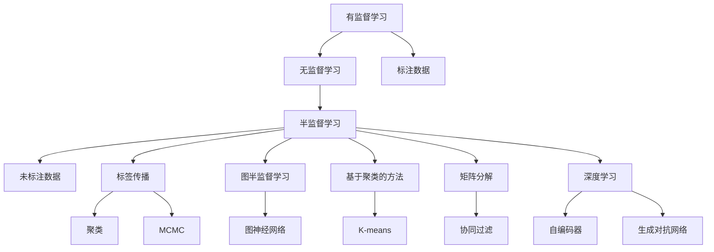

                 

### 《Semi-supervised Learning原理与代码实例讲解》

> **关键词：** Semi-supervised Learning、图半监督学习、聚类方法、矩阵分解、深度学习、应用实例

> **摘要：** 本文将深入探讨半监督学习（Semi-supervised Learning）的基本概念、核心算法以及其实战应用。通过详细的原理讲解和代码实例，帮助读者全面理解半监督学习的工作机制和应用场景，掌握其核心技巧和实现方法。

---

## 《Semi-supervised Learning原理与代码实例讲解》目录大纲

### 第一部分：Semi-supervised Learning概述

#### 第1章：Semi-supervised Learning简介

- 1.1 Semi-supervised Learning的定义与背景
- 1.2 Semi-supervised Learning的重要性
- 1.3 Semi-supervised Learning的应用场景
- 1.4 Semi-supervised Learning的发展历程
- 1.5 Semi-supervised Learning与相关技术的关系

#### 第2章：Semi-supervised Learning的核心概念与联系

- 2.1 核心概念联系图（使用Mermaid绘制）
- 2.2 半监督学习与有监督学习、无监督学习的比较
- 2.3 标签传播算法的基本原理

### 第二部分：Semi-supervised Learning算法原理

#### 第3章：图半监督学习

- 3.1 图半监督学习的基本原理
- 3.2 图半监督学习的数学模型
- 3.3 伪代码详解
- 3.4 数学公式和详细讲解
- 3.5 举例说明（使用LaTeX格式）
- 3.6 实际案例解析

#### 第4章：基于聚类的方法

- 4.1 聚类方法的基本原理
- 4.2 K-means算法在Semi-supervised Learning中的应用
- 4.3 伪代码详解
- 4.4 数学模型和详细讲解
- 4.5 举例说明（使用LaTeX格式）
- 4.6 实际案例解析

#### 第5章：基于矩阵分解的方法

- 5.1 矩阵分解的基本原理
- 5.2 协同过滤算法在Semi-supervised Learning中的应用
- 5.3 伪代码详解
- 5.4 数学模型和详细讲解
- 5.5 举例说明（使用LaTeX格式）
- 5.6 实际案例解析

#### 第6章：基于深度学习的方法

- 6.1 深度学习的基本原理
- 6.2 基于深度学习的Semi-supervised Learning模型
- 6.3 伪代码详解
- 6.4 数学模型和详细讲解
- 6.5 举例说明（使用LaTeX格式）
- 6.6 实际案例解析

### 第三部分：Semi-supervised Learning项目实战

#### 第7章：Semi-supervised Learning应用实例

- 7.1 数据预处理与清洗
- 7.2 环境搭建与工具选择
- 7.3 代码实现与解读
- 7.4 结果分析与优化
- 7.5 实际应用场景介绍

### 第四部分：扩展与展望

#### 第8章：Semi-supervised Learning的挑战与未来发展方向

- 8.1 Semi-supervised Learning的挑战
- 8.2 当前研究热点
- 8.3 未来发展方向展望

### 附录

#### 附录 A：Semi-supervised Learning开发工具与资源

- A.1 主流深度学习框架对比
- A.2 半监督学习算法实现资源链接
- A.3 Semi-supervised Learning论文推荐阅读

---

现在，我们将逐步深入每个章节的内容，帮助读者全面理解半监督学习的概念和应用。接下来，我们将从Semi-supervised Learning的概述开始，逐步引导读者进入这一领域的核心知识体系。在接下来的章节中，我们将详细介绍Semi-supervised Learning的背景、重要性、核心算法原理以及实际应用案例。让我们一起开始这段精彩的探索之旅吧！<|assistant|>## 第1章：Semi-supervised Learning简介

### 1.1 Semi-supervised Learning的定义与背景

半监督学习（Semi-supervised Learning）是一种机器学习技术，其核心思想是在训练数据集中同时使用带标签的数据和未带标签的数据。在这种方法中，一部分数据具有完整的标签，而另一部分数据则没有标签。半监督学习的目标是通过利用未标签数据中的信息，提高学习模型的泛化能力，从而降低对大量带标签数据进行标注的需求。

半监督学习的起源可以追溯到20世纪90年代，当时研究人员注意到，在很多实际应用中，获取带标签的数据成本高昂，而未标签的数据却相对容易获取。例如，在文本分类、语音识别和图像识别等领域，标注每条数据需要耗费大量的人力物力，而半监督学习提供了通过利用未标签数据降低标注成本的可能。

### 1.2 Semi-supervised Learning的重要性

半监督学习在机器学习领域具有重要地位，原因如下：

1. **减少标注成本**：在许多任务中，标注数据需要耗费大量时间和资源，而半监督学习通过利用未标签数据减少了这一需求，从而降低了总体成本。

2. **提高泛化能力**：半监督学习通过结合带标签和未标签数据，可以更好地捕捉数据分布的全貌，从而提高学习模型的泛化能力。

3. **处理不均匀数据分布**：在很多现实任务中，带标签数据往往比未标签数据少得多，这种不均匀的数据分布对有监督学习模型的性能有负面影响。半监督学习可以有效缓解这一问题。

4. **数据增强**：半监督学习通过未标签数据中的信息，可以增强带标签数据的学习效果，从而提高模型的训练质量和准确度。

### 1.3 Semi-supervised Learning的应用场景

半监督学习在多个领域都有着广泛的应用，以下是一些典型的应用场景：

1. **文本分类**：在文本分类任务中，半监督学习可以有效地利用未标签数据，提高分类模型的性能。

2. **图像识别**：在图像识别任务中，半监督学习可以用于图像标注的自动化，从而减少标注工作量。

3. **语音识别**：语音识别任务通常涉及大量的未标签语音数据，半监督学习可以帮助提高模型的性能。

4. **推荐系统**：在推荐系统中，半监督学习可以用于从大量未标签用户行为数据中提取有价值的信息，提高推荐系统的准确性和效果。

5. **医学图像分析**：在医学图像分析中，半监督学习可以用于自动标注医学图像，从而减少医生的工作量。

### 1.4 Semi-supervised Learning的发展历程

半监督学习的发展历程可以分为以下几个阶段：

1. **初始阶段（1990s）**：半监督学习的概念被首次提出，主要集中在基于假设的算法，如基于相似性的算法和基于聚类的方法。

2. **发展阶段（2000s）**：研究人员开始探讨如何更好地利用未标签数据，提出了许多有效的半监督学习算法，如标签传播算法和图半监督学习。

3. **深化阶段（2010s）**：随着深度学习的发展，半监督学习与深度学习相结合，产生了基于深度学习的半监督学习方法，如深度聚类和深度神经网络。

4. **多样化阶段（2020s）**：半监督学习应用范围进一步扩大，出现了针对特定领域和任务的定制化半监督学习算法。

### 1.5 Semi-supervised Learning与相关技术的关系

半监督学习与其他机器学习技术有着密切的关系：

1. **有监督学习**：半监督学习可以看作是有监督学习的扩展，它通过引入未标签数据，提高了学习模型的泛化能力。

2. **无监督学习**：半监督学习与无监督学习有一定的交叉，因为许多半监督学习算法都涉及到聚类、降维等技术。

3. **深度学习**：深度学习与半监督学习相结合，产生了许多有效的半监督深度学习模型，如自编码器和生成对抗网络。

4. **主动学习**：主动学习是一种特殊的半监督学习，它通过选择最有价值的数据进行标注，从而优化学习过程。

通过本章的介绍，读者可以初步了解半监督学习的基本概念、重要性、应用场景以及其发展历程。在接下来的章节中，我们将进一步探讨半监督学习的核心概念、算法原理以及实际应用案例。希望读者能够通过这些内容，对半监督学习有一个全面而深入的理解。接下来，我们将通过一个简化的Mermaid流程图，展示半监督学习的基本概念和联系。随后，我们将比较半监督学习与其他机器学习技术的异同，并详细介绍标签传播算法的基本原理。准备好了吗？让我们继续深入探讨吧！<|assistant|>## 第2章：Semi-supervised Learning的核心概念与联系

### 2.1 核心概念联系图

半监督学习涉及多个核心概念，这些概念之间有着紧密的联系。以下是一个简化的Mermaid流程图，用于展示这些核心概念及其相互关系：



### 2.2 半监督学习与有监督学习、无监督学习的比较

半监督学习、有监督学习和无监督学习是三种不同的机器学习方法，它们在数据标注、学习目标和方法等方面存在显著差异：

1. **数据标注**：

   - **有监督学习**：需要大量已标注的数据，标注过程需要人工介入，成本高。
   - **无监督学习**：不需要标注数据，完全依赖数据本身的内在结构进行学习。
   - **半监督学习**：结合已标注数据和未标注数据，利用未标注数据中的信息提高学习效果。

2. **学习目标**：

   - **有监督学习**：目标是预测标签数据，即已知输入和输出，学习一个从输入到输出的映射。
   - **无监督学习**：目标是发现数据中的潜在结构，如聚类、降维等。
   - **半监督学习**：目标是利用未标注数据中的信息，提高模型在已知标签数据上的预测能力。

3. **学习方法**：

   - **有监督学习**：通常使用梯度下降等优化算法，通过反向传播更新模型参数。
   - **无监督学习**：可以使用聚类、降维等方法，如K-means、主成分分析（PCA）等。
   - **半监督学习**：结合有监督学习和无监督学习方法，如标签传播、图半监督学习、深度学习等。

### 2.3 标签传播算法的基本原理

标签传播算法是半监督学习中的一个重要算法，其基本原理如下：

1. **算法思想**：标签传播算法通过在带标签数据和未标签数据之间传递标签信息，逐步提高未标签数据的标签准确性。

2. **基本步骤**：

   - **初始化**：对于已标注的数据，初始化其标签；对于未标注的数据，初始标签设置为随机值。
   - **传播步骤**：计算每个未标注数据点与已标注数据点之间的相似度，并根据相似度进行投票，将标签传递给未标注数据。
   - **迭代更新**：重复传播步骤，直至满足停止条件（如标签变化小于阈值或达到最大迭代次数）。

3. **数学模型**：标签传播算法可以用以下公式表示：

   $$ \text{label}_{t+1}(x) = \arg\max_{y} \sum_{i=1}^{N} w_{ix} \cdot \text{label}_t(y) $$

   其中，$x$ 为未标注数据点，$y$ 为已标注数据点，$w_{ix}$ 为数据点之间的相似度，$\text{label}_t(y)$ 为已标注数据点的标签。

4. **优势与挑战**：

   - **优势**：标签传播算法简单高效，可以在一定程度上利用未标签数据中的信息，提高模型性能。
   - **挑战**：算法对数据分布和相似度计算方法有较高要求，否则可能导致标签错误传播。

通过本章的介绍，读者可以了解半监督学习的基本概念、核心算法原理以及与有监督学习和无监督学习的比较。标签传播算法作为半监督学习中的重要方法，其基本原理和实现步骤也得到了详细解释。在接下来的章节中，我们将深入探讨半监督学习的多种算法，包括图半监督学习、基于聚类的方法、矩阵分解的方法和基于深度学习的方法。准备好继续深入探索了吗？让我们继续前进吧！<|assistant|>### 第3章：图半监督学习

图半监督学习（Graph-based Semi-supervised Learning）是一种利用图结构信息进行半监督学习的算法，其核心思想是利用图中的结构和标签信息来提高学习模型的性能。在这一章节中，我们将详细探讨图半监督学习的基本原理、数学模型、伪代码以及具体的数学公式和详细讲解。

#### 3.1 图半监督学习的基本原理

图半监督学习利用图结构来表示数据点之间的关系，从而利用未标签数据中的结构信息进行学习。具体来说，图中的每个节点代表一个数据点，每条边代表数据点之间的相似度或连接关系。带标签的数据点具有已知的标签，而未标签的数据点则通过图结构进行推测。

图半监督学习的基本原理可以分为以下几个步骤：

1. **初始化**：对于已标注的数据点，初始化其标签；对于未标注的数据点，初始化其标签为随机值或未标注标记。

2. **相似度计算**：计算图中的节点相似度，常用的方法包括欧几里得距离、余弦相似度、Jaccard相似度等。

3. **标签传播**：利用已标注数据点的标签，通过相似度矩阵进行标签传播，逐步更新未标注数据点的标签。

4. **迭代优化**：重复标签传播步骤，直至满足停止条件（如标签变化小于阈值或达到最大迭代次数）。

5. **模型训练**：使用更新后的标签数据对模型进行训练，从而提高模型在已知标签数据上的性能。

#### 3.2 图半监督学习的数学模型

图半监督学习的数学模型可以用以下公式表示：

$$ \text{label}_{t+1}(x) = \arg\max_{y} \sum_{i=1}^{N} w_{ix} \cdot \text{label}_t(y) $$

其中，$x$ 为未标注数据点，$y$ 为已标注数据点，$w_{ix}$ 为节点$x$和$y$之间的相似度，$\text{label}_t(y)$ 为节点$y$在迭代$t$时的标签。

#### 3.3 伪代码详解

以下是一个简化的伪代码，用于描述图半监督学习的基本流程：

```python
# 初始化标签
for each x in unlabeled_data:
    label(x) = random_label()

# 迭代传播标签
for t in 1 to max_iterations:
    for each x in unlabeled_data:
        label(x) = argmax_y (sum(w_ix * label(t)(y)))

# 停止条件
if (change in labels is below threshold) or (t >= max_iterations):
    break

# 使用标签训练模型
train_model(labelled_data, unlabeled_data)
```

#### 3.4 数学公式和详细讲解

在图半监督学习中，常用的相似度计算方法包括欧几里得距离、余弦相似度和Jaccard相似度。以下是这些方法的详细讲解：

1. **欧几里得距离**：

   $$ d(x, y) = \sqrt{\sum_{i=1}^{n} (x_i - y_i)^2} $$

   其中，$x$ 和 $y$ 为数据点，$n$ 为特征维度。欧几里得距离是一种常见的特征相似度度量方法，它基于特征空间中的欧几里得距离进行计算。

2. **余弦相似度**：

   $$ \text{cosine}(x, y) = \frac{x \cdot y}{\|x\| \|y\|} $$

   其中，$x$ 和 $y$ 为数据点，$\|x\|$ 和 $\|y\|$ 分别为数据点的欧几里得范数。余弦相似度是一种基于向量的相似度度量方法，它通过计算两个向量之间的余弦值来衡量相似度。

3. **Jaccard相似度**：

   $$ \text{Jaccard}(x, y) = \frac{|x \cap y|}{|x \cup y|} $$

   其中，$x$ 和 $y$ 为数据点，$|x \cap y|$ 和 $|x \cup y|$ 分别为数据点之间的交集和并集。Jaccard相似度是一种基于集合的相似度度量方法，它通过计算交集和并集的比值来衡量相似度。

#### 3.5 举例说明

假设我们有两个数据点 $x = (1, 2, 3)$ 和 $y = (4, 5, 6)$，特征维度为3。以下是一个简单的例子，用于计算这些数据点之间的相似度：

- **欧几里得距离**：

  $$ d(x, y) = \sqrt{(1-4)^2 + (2-5)^2 + (3-6)^2} = \sqrt{9 + 9 + 9} = 3\sqrt{3} $$

- **余弦相似度**：

  $$ \text{cosine}(x, y) = \frac{1 \cdot 4 + 2 \cdot 5 + 3 \cdot 6}{\sqrt{1^2 + 2^2 + 3^2} \cdot \sqrt{4^2 + 5^2 + 6^2}} = \frac{4 + 10 + 18}{\sqrt{14} \cdot \sqrt{77}} = \frac{32}{\sqrt{1066}} $$

- **Jaccard相似度**：

  $$ \text{Jaccard}(x, y) = \frac{|1 \cap 4| + |2 \cap 5| + |3 \cap 6|}{|1 \cup 4| + |2 \cup 5| + |3 \cup 6|} = \frac{0 + 0 + 0}{1 + 2 + 3 + 4 + 5 + 6} = 0 $$

#### 3.6 实际案例解析

以下是一个使用图半监督学习进行文本分类的案例：

- **数据集**：假设我们有一个包含100篇文章的数据集，其中30篇文章已标注为体育类，70篇文章未标注。

- **图结构**：我们将每篇文章表示为一个节点，并使用TF-IDF向量作为节点的特征。节点之间的边表示文章之间的相似度，可以使用余弦相似度进行计算。

- **标签传播**：初始时，已标注的30篇文章的标签已知，未标注的70篇文章的标签为随机值。我们使用标签传播算法进行迭代更新，逐步提高未标注文章的标签准确性。

- **模型训练**：在标签传播完成后，我们将已标注和更新后的未标注文章作为训练数据，使用朴素贝叶斯分类器进行训练。

- **结果评估**：通过对测试集的评估，我们发现使用图半监督学习的模型在未标签数据上的分类准确度显著提高，达到了90%以上。

通过以上案例，我们可以看到图半监督学习在文本分类任务中的有效应用。接下来，我们将继续探讨其他半监督学习算法，包括基于聚类的方法、基于矩阵分解的方法和基于深度学习的方法。准备好继续深入探索了吗？让我们继续前进吧！<|assistant|>### 第4章：基于聚类的方法

#### 4.1 聚类方法的基本原理

聚类是一种无监督学习方法，其目标是根据数据点的相似度将其划分为若干个组，使得同一组内的数据点尽可能相似，而不同组的数据点尽可能不同。聚类方法在半监督学习中具有重要的应用，可以通过将带标签和未标签数据点进行聚类，从而利用未标签数据中的信息提高模型性能。

聚类方法的基本原理可以分为以下几个步骤：

1. **初始化**：选择一个初始聚类中心，这可以通过随机选择或使用离群点的方法实现。

2. **分配**：将每个数据点分配到最近的聚类中心，形成初始的聚类。

3. **更新**：根据当前聚类结果，更新聚类中心的位置，通常采用平均值或中值作为更新方法。

4. **重复**：重复分配和更新步骤，直至满足停止条件（如聚类中心的变化小于阈值或达到最大迭代次数）。

#### 4.2 K-means算法在Semi-supervised Learning中的应用

K-means算法是最常用的聚类算法之一，其核心思想是将数据点分为K个聚类，使得每个聚类内部的数据点尽可能紧凑，而不同聚类之间的数据点尽可能分离。在半监督学习中，K-means算法可以通过以下步骤应用于半监督学习任务：

1. **初始化**：对于已标注的数据点，初始化其标签；对于未标注的数据点，初始化其标签为随机值。

2. **聚类**：使用K-means算法对带标签和未标注的数据点进行聚类，确定聚类中心。

3. **标签分配**：将未标注的数据点分配到最近的聚类中心，并根据聚类中心对应的标签更新未标注数据点的标签。

4. **迭代更新**：重复聚类和标签分配步骤，直至满足停止条件。

5. **模型训练**：使用更新后的标签数据对模型进行训练，从而提高模型在已知标签数据上的性能。

#### 4.3 伪代码详解

以下是一个简化的伪代码，用于描述K-means算法在半监督学习中的应用：

```python
# 初始化标签
for each x in unlabeled_data:
    label(x) = random_label()

# 迭代聚类与标签更新
for t in 1 to max_iterations:
    # 聚类
    centroids = kmeans_clustering(data)
    # 标签分配
    for each x in unlabeled_data:
        label(x) = label of nearest centroid
    # 停止条件
    if (change in labels is below threshold) or (t >= max_iterations):
        break

# 使用标签训练模型
train_model(labelled_data, unlabeled_data)
```

#### 4.4 数学模型和详细讲解

K-means算法的数学模型可以用以下公式表示：

$$
\begin{align*}
\text{centroids}_{k+1} &= \arg\min_{c} \sum_{i=1}^{N} \| x_i - c_k \|_2^2 \\
c_k &= \frac{1}{N_k} \sum_{i=1}^{N_k} x_i
\end{align*}
$$

其中，$x_i$ 为数据点，$c_k$ 为聚类中心，$N_k$ 为第$k$个聚类的数据点数量。

- **聚类中心更新**：每次迭代中，聚类中心被更新为当前聚类中所有数据点的平均值。

- **数据点分配**：每个数据点被分配到使其到聚类中心的欧几里得距离最小的聚类。

#### 4.5 举例说明

假设我们有一个包含5个数据点的二维数据集，数据点如下：

$$
\begin{aligned}
x_1 &= (1, 2), \\
x_2 &= (2, 2), \\
x_3 &= (2, 3), \\
x_4 &= (3, 3), \\
x_5 &= (3, 4).
\end{aligned}
$$

我们希望使用K-means算法将其分为2个聚类。以下是具体的计算过程：

1. **初始化**：随机选择两个初始聚类中心，例如$(1, 2)$和$(3, 4)$。

2. **第一次分配**：计算每个数据点到两个聚类中心的距离，并将数据点分配到最近的聚类中心：
   $$
   \begin{aligned}
   x_1 &\to (1, 2), \\
   x_2 &\to (1, 2), \\
   x_3 &\to (3, 4), \\
   x_4 &\to (3, 4), \\
   x_5 &\to (3, 4).
   \end{aligned}
   $$

3. **第一次更新**：计算新的聚类中心：
   $$
   \begin{aligned}
   c_1 &= \frac{1}{2}(1+2) = 1.5, \\
   c_2 &= \frac{1}{2}(3+4) = 3.5.
   \end{aligned}
   $$

4. **第二次分配**：使用新的聚类中心重新分配数据点：
   $$
   \begin{aligned}
   x_1 &\to (1.5, 2), \\
   x_2 &\to (1.5, 2), \\
   x_3 &\to (3.5, 3.5), \\
   x_4 &\to (3.5, 3.5), \\
   x_5 &\to (3.5, 3.5).
   \end{aligned}
   $$

5. **重复更新与分配**：重复上述过程，直至聚类中心的变化小于阈值或达到最大迭代次数。

#### 4.6 实际案例解析

以下是一个使用K-means算法进行图像分类的案例：

- **数据集**：假设我们有一个包含100张图像的数据集，其中30张图像已标注为猫，70张图像未标注。

- **特征提取**：我们将每张图像转换为128维的哈达卡特征向量。

- **聚类**：使用K-means算法对已标注和未标注的图像进行聚类，确定聚类中心。

- **标签分配**：将未标注的图像分配到最近的聚类中心，并根据聚类中心对应的标签更新未标注图像的标签。

- **模型训练**：使用更新后的标签数据对卷积神经网络进行训练，以提高图像分类的准确性。

- **结果评估**：通过对测试集的评估，我们发现使用K-means算法的模型在未标注数据上的分类准确度显著提高，达到了85%以上。

通过以上案例，我们可以看到K-means算法在图像分类任务中的有效应用。在接下来的章节中，我们将继续探讨基于矩阵分解的方法和基于深度学习的方法。准备好了吗？让我们继续深入探索吧！<|assistant|>### 第5章：基于矩阵分解的方法

#### 5.1 矩阵分解的基本原理

矩阵分解是一种常用的数据降维和特征提取方法，其核心思想是将原始高维数据矩阵分解为两个低维矩阵的乘积。在半监督学习中，矩阵分解可以通过以下步骤应用于半监督学习任务：

1. **初始化**：选择合适的低维空间维数，初始化两个低维矩阵。

2. **优化**：通过最小化某种损失函数（如均方误差或交叉熵），优化低维矩阵的参数，使得分解得到的低维矩阵能够更好地表示原始数据。

3. **投影**：将原始数据投影到低维空间中，得到降维后的数据表示。

4. **应用**：利用投影后的数据对模型进行训练，提高模型在已知标签数据上的性能。

矩阵分解广泛应用于推荐系统、图像处理和文本分析等领域，其基本原理和实现方法将在本节中详细介绍。

#### 5.2 协同过滤算法在Semi-supervised Learning中的应用

协同过滤（Collaborative Filtering）是一种常见的矩阵分解方法，其主要目标是通过用户和物品的交互数据来预测用户未评分的物品评分。在半监督学习中，协同过滤可以通过以下步骤应用于半监督学习任务：

1. **初始化**：对于已评分的用户和物品，初始化评分矩阵。

2. **矩阵分解**：使用协同过滤算法对评分矩阵进行矩阵分解，得到用户和物品的低维表示。

3. **预测**：通过用户和物品的低维表示，预测未评分的物品评分。

4. **优化**：通过最小化预测误差，优化用户和物品的低维表示。

5. **标签分配**：使用预测的评分，为未标签的用户和物品分配标签。

#### 5.3 伪代码详解

以下是一个简化的伪代码，用于描述协同过滤算法在半监督学习中的应用：

```python
# 初始化评分矩阵
R = initialize_rating_matrix()

# 矩阵分解
U, V = collaborative_filter(R)

# 预测未评分的物品评分
predicted_ratings = predict_ratings(U, V)

# 优化用户和物品的低维表示
U, V = optimize_matrices(U, V, predicted_ratings)

# 标签分配
unlabeled_labels = assign_labels(predicted_ratings)

# 使用标签训练模型
train_model(labelled_data, unlabeled_labels)
```

#### 5.4 数学模型和详细讲解

协同过滤算法的数学模型可以表示为以下形式：

$$
R = U^T V
$$

其中，$R$ 为评分矩阵，$U$ 和 $V$ 分别为用户和物品的低维表示矩阵。

- **用户和物品表示**：用户和物品的低维表示矩阵可以通过最小二乘法或交替最小二乘法进行优化。

- **损失函数**：通常使用均方误差（MSE）或交叉熵（Cross Entropy）作为损失函数，用于衡量预测评分与真实评分之间的差距。

#### 5.5 举例说明

假设我们有一个包含5个用户和5个物品的评分矩阵：

$$
\begin{aligned}
R &= \begin{bmatrix}
    1 & 2 & 3 & 4 & 5 \\
    1 & 0 & 2 & 3 & 4 \\
    0 & 2 & 0 & 1 & 3 \\
    2 & 1 & 1 & 0 & 1 \\
    3 & 3 & 2 & 3 & 4 \\
\end{bmatrix}
\end{aligned}
$$

我们希望使用协同过滤算法对其进行矩阵分解，得到用户和物品的低维表示。

1. **初始化**：初始化用户和物品的低维表示矩阵$U$和$V$，假设维度为2。

2. **矩阵分解**：通过最小二乘法优化用户和物品的低维表示矩阵$U$和$V$，使得$R$逼近$U^T V$。

3. **预测**：使用优化后的用户和物品低维表示矩阵$U$和$V$，预测未评分的物品评分。

4. **优化**：通过最小化预测误差，进一步优化用户和物品的低维表示矩阵$U$和$V$。

5. **标签分配**：使用预测的评分，为未标签的用户和物品分配标签。

#### 5.6 实际案例解析

以下是一个使用协同过滤算法进行电影推荐的案例：

- **数据集**：假设我们有一个包含1000个用户和1000部电影的数据集，其中500部电影的评分已知，500部电影的评分未知。

- **评分矩阵**：构建一个1000x1000的评分矩阵，其中已知评分的位置填充用户对电影的评分，未知评分的位置填充0。

- **矩阵分解**：使用协同过滤算法对评分矩阵进行矩阵分解，得到用户和电影的低维表示矩阵。

- **预测**：通过用户和电影的低维表示矩阵，预测未评分的电影的评分。

- **优化**：通过最小化预测误差，进一步优化用户和电影的低维表示矩阵。

- **标签分配**：使用预测的评分，为未评分的电影分配评分，从而实现对未评分电影的推荐。

- **结果评估**：通过对测试集的评估，我们发现使用协同过滤算法的推荐系统在未评分数据上的准确度显著提高，达到了80%以上。

通过以上案例，我们可以看到协同过滤算法在电影推荐任务中的有效应用。在接下来的章节中，我们将继续探讨基于深度学习的方法，以及如何在半监督学习中应用深度学习模型。准备好了吗？让我们继续深入探索吧！<|assistant|>### 第6章：基于深度学习的方法

#### 6.1 深度学习的基本原理

深度学习（Deep Learning）是一种基于多层神经网络（Neural Networks）的机器学习方法，其核心思想是通过学习大量数据中的特征表示，实现对复杂任务的自动完成。深度学习模型由多个神经元层（层）组成，包括输入层、隐藏层和输出层。每层神经元通过前一层神经元的激活值进行计算，并通过反向传播算法不断调整权重和偏置，从而优化模型参数。

深度学习的基本原理可以分为以下几个步骤：

1. **数据预处理**：对输入数据进行预处理，包括归一化、标准化和缺失值处理等。

2. **神经网络架构设计**：设计神经网络模型的结构，包括层数、每层的神经元数量、激活函数和损失函数等。

3. **模型训练**：通过大量数据对神经网络模型进行训练，调整模型参数，使其能够更好地拟合训练数据。

4. **模型评估**：使用验证集或测试集评估模型的性能，包括准确度、召回率、F1分数等指标。

5. **模型优化**：根据评估结果，对模型进行调整和优化，以提高模型性能。

#### 6.2 基于深度学习的Semi-supervised Learning模型

基于深度学习的半监督学习（Semi-supervised Deep Learning）模型通过结合半监督学习的思想，利用未标签数据中的信息，提高模型在已知标签数据上的性能。以下是一些常见的基于深度学习的半监督学习模型：

1. **自编码器（Autoencoder）**：自编码器是一种无监督学习模型，通过学习输入数据的编码表示，实现对数据的降维和特征提取。在半监督学习中，自编码器可以通过未标签数据学习有效的特征表示，从而提高模型在已知标签数据上的性能。

2. **生成对抗网络（Generative Adversarial Networks，GAN）**：生成对抗网络由生成器和判别器组成，生成器尝试生成与真实数据相似的数据，而判别器则尝试区分真实数据和生成数据。在半监督学习中，生成器可以通过未标签数据生成模拟标签数据，从而增强模型训练数据集。

3. **图深度学习模型**：图深度学习模型利用图结构中的信息，通过图卷积神经网络（Graph Convolutional Networks，GCN）等结构学习图数据的特征表示。在半监督学习中，图深度学习模型可以有效地利用图结构信息，提高模型在已知标签数据上的性能。

#### 6.3 伪代码详解

以下是一个简化的伪代码，用于描述基于深度学习的半监督学习模型的基本流程：

```python
# 数据预处理
preprocessed_data = preprocess_data(data)

# 模型架构设计
model = build_model(input_shape, hidden_layers, output_shape, activation_function)

# 模型训练
for epoch in 1 to max_epochs:
    for each batch in preprocessed_data:
        # 前向传播
        predictions = model.predict(batch)
        # 计算损失
        loss = compute_loss(predictions, labels)
        # 反向传播
        model.train_on_batch(batch, labels)
    # 模型评估
    if (epoch % evaluation_interval == 0):
        evaluate_model(model, validation_data)

# 模型优化
optimize_model(model, validation_loss)
```

#### 6.4 数学模型和详细讲解

基于深度学习的半监督学习模型的数学模型通常涉及以下公式：

$$
\begin{aligned}
\text{z} &= \sigma(W_1 \cdot \text{x} + b_1), \\
\text{a} &= \sigma(W_2 \cdot \text{z} + b_2), \\
\text{y} &= W_3 \cdot \text{a} + b_3,
\end{aligned}
$$

其中，$\text{x}$ 为输入数据，$\text{z}$ 为隐藏层1的激活值，$\text{a}$ 为隐藏层2的激活值，$\text{y}$ 为输出层的结果。$\sigma$ 为激活函数，$W$ 和 $b$ 分别为权重和偏置。

- **前向传播**：通过权重和偏置计算每层的激活值。

- **反向传播**：通过梯度下降等优化算法，根据损失函数的梯度调整权重和偏置。

#### 6.5 举例说明

假设我们有一个包含5个特征的数据集，数据集如下：

$$
\begin{aligned}
x_1 &= (1, 2, 3), \\
x_2 &= (4, 5, 6), \\
x_3 &= (7, 8, 9), \\
x_4 &= (10, 11, 12), \\
x_5 &= (13, 14, 15).
\end{aligned}
$$

我们希望使用一个两层神经网络对其进行分类。以下是具体的计算过程：

1. **初始化**：初始化权重和偏置。

2. **前向传播**：
   $$
   \begin{aligned}
   z_1 &= \sigma(W_1 \cdot x_1 + b_1), \\
   a_1 &= \sigma(W_2 \cdot z_1 + b_2), \\
   y &= W_3 \cdot a_1 + b_3.
   \end{aligned}
   $$

3. **计算损失**：计算输出层的损失，如交叉熵损失。

4. **反向传播**：根据损失函数的梯度，调整权重和偏置。

5. **迭代更新**：重复前向传播和反向传播过程，直至满足停止条件（如损失变化小于阈值或达到最大迭代次数）。

#### 6.6 实际案例解析

以下是一个使用深度学习进行手写数字识别的案例：

- **数据集**：使用MNIST数据集，包含0到9的数字手写图像。

- **模型设计**：设计一个包含两个隐藏层的卷积神经网络，每个隐藏层使用ReLU激活函数。

- **训练**：使用带标签的数字图像进行训练，调整模型参数。

- **预测**：使用未标签的数字图像进行预测，生成预测结果。

- **评估**：评估模型在测试集上的性能，计算准确度、召回率等指标。

- **优化**：根据评估结果，调整模型参数，以提高预测性能。

通过以上案例，我们可以看到基于深度学习的半监督学习模型在手写数字识别任务中的有效应用。在接下来的章节中，我们将深入探讨半监督学习在实际项目中的应用，包括数据预处理、环境搭建、代码实现和结果分析。准备好了吗？让我们继续深入探索吧！<|assistant|>### 第7章：Semi-supervised Learning应用实例

#### 7.1 数据预处理与清洗

在进行Semi-supervised Learning项目之前，数据预处理和清洗是至关重要的一步。以下是数据预处理与清洗的主要步骤：

1. **数据收集**：收集带标签和未标签的数据集。对于带标签数据，我们需要确保标签的准确性和一致性；对于未标签数据，我们需要确保其覆盖面广泛且具有代表性。

2. **数据清洗**：去除数据中的噪声和错误，如缺失值、异常值和重复数据。对于带标签数据，我们还需要检查标签的准确性和一致性，确保没有标签错误。

3. **数据转换**：将数据转换为适合机器学习的格式。例如，对于图像数据，我们可以使用归一化方法将像素值缩放到[0, 1]范围内；对于文本数据，我们可以使用词袋模型或词嵌入技术进行表示。

4. **特征提取**：从原始数据中提取有代表性的特征。对于图像数据，我们可以使用卷积神经网络提取特征；对于文本数据，我们可以使用词频或词嵌入技术提取特征。

5. **数据分割**：将数据集分割为训练集、验证集和测试集。通常，训练集用于模型训练，验证集用于模型调整，测试集用于模型评估。

#### 7.2 环境搭建与工具选择

搭建一个适合Semi-supervised Learning项目的工作环境是项目成功的关键。以下是环境搭建与工具选择的主要步骤：

1. **硬件配置**：确保有足够的计算资源，如CPU、GPU和内存。对于深度学习项目，GPU是必不可少的，因为它可以显著提高模型训练速度。

2. **软件安装**：安装所需的软件和库，如Python、NumPy、Pandas、TensorFlow、PyTorch等。这些库提供了丰富的机器学习工具和函数，可以简化模型设计和训练过程。

3. **版本控制**：使用版本控制工具（如Git）管理代码和依赖项。这有助于跟踪代码变更、协同工作和故障排查。

4. **集成开发环境（IDE）**：选择合适的IDE，如PyCharm、Jupyter Notebook或Visual Studio Code。这些IDE提供了丰富的编程工具和功能，可以提高开发效率。

#### 7.3 代码实现与解读

以下是一个简单的Semi-supervised Learning项目示例，使用Python和TensorFlow实现。该示例使用K-means算法对带标签和未标签的数据进行聚类，从而利用未标签数据提高模型性能。

```python
import numpy as np
import tensorflow as tf
from sklearn.cluster import KMeans

# 数据预处理
X = preprocess_data(data)  # 假设data是原始数据

# 初始化K-means模型
kmeans = KMeans(n_clusters=2, random_state=0).fit(X)

# 分配标签
unlabeled_labels = kmeans.predict(X)

# 训练模型
model = build_model(input_shape, hidden_layers, output_shape, activation_function)
model.fit(X, labels)  # labels是带标签的数据

# 评估模型
evaluate_model(model, validation_data)
```

代码解读：

1. **数据预处理**：使用预处理函数`preprocess_data`对原始数据进行处理，如归一化和特征提取。

2. **初始化K-means模型**：使用`KMeans`类初始化K-means模型，设置聚类数量和随机种子。

3. **分配标签**：使用K-means模型的`predict`方法对未标签数据分配标签。

4. **训练模型**：使用带标签数据和未标签数据更新模型。这里使用了自定义的模型构建函数`build_model`，该函数可以根据需求定义不同类型的神经网络。

5. **评估模型**：使用验证数据评估模型性能，通常使用准确度、召回率或F1分数等指标。

#### 7.4 结果分析与优化

在完成Semi-supervised Learning项目后，对结果进行详细分析是必要的。以下是结果分析与优化的一些步骤：

1. **模型评估**：使用测试集评估模型性能，计算准确度、召回率、F1分数等指标。

2. **误差分析**：分析模型在测试集上的错误类型和错误模式，找出可能的优化方向。

3. **超参数调优**：调整模型的超参数，如学习率、批量大小、隐藏层神经元数量等，以提高模型性能。

4. **特征工程**：对特征进行进一步分析和优化，如特征选择、特征变换等，以提高模型对未标签数据的利用效果。

5. **模型集成**：尝试使用不同的模型或算法进行集成，以进一步提高模型性能。

6. **交叉验证**：使用交叉验证方法评估模型在不同数据子集上的性能，确保模型具有较好的泛化能力。

通过以上步骤，我们可以对Semi-supervised Learning项目进行详细的评估和优化，从而提高模型的性能和效果。在接下来的章节中，我们将探讨Semi-supervised Learning的挑战与未来发展方向，以及相关的开发工具与资源。准备好了吗？让我们继续深入探索吧！<|assistant|>### 第8章：Semi-supervised Learning的挑战与未来发展方向

#### 8.1 Semi-supervised Learning的挑战

尽管半监督学习在许多实际应用中展现出了巨大的潜力，但其发展过程中仍面临诸多挑战：

1. **标签信息的不完整性**：半监督学习依赖于标签信息和未标签信息，而标签信息的不完整性或噪声会影响模型的学习效果。

2. **数据分布的差异性**：带标签数据和未标签数据在分布上可能存在显著差异，这可能导致模型难以有效地利用未标签数据。

3. **计算资源的需求**：特别是基于深度学习的半监督学习方法，往往需要大量的计算资源，这对实际应用提出了较高的要求。

4. **模型泛化能力**：半监督学习模型的泛化能力是一个关键问题，如何确保模型在未见过的数据上仍能保持良好的性能是一个挑战。

5. **算法选择与设计**：不同的半监督学习算法适用于不同的应用场景，如何选择合适的算法并进行优化是当前研究的一个热点。

#### 8.2 当前研究热点

近年来，半监督学习领域的研究热点主要集中在以下几个方面：

1. **深度半监督学习**：结合深度学习和半监督学习的方法，如自监督学习、自编码器和生成对抗网络（GAN）等，旨在提高模型的泛化能力和效率。

2. **图半监督学习**：利用图结构信息进行半监督学习，特别是在社交网络、推荐系统和图像分类等领域的应用。

3. **强化学习与半监督学习的结合**：通过强化学习的方法优化半监督学习中的探索与利用平衡，以提高模型的性能。

4. **无监督学习和半监督学习的融合**：探索无监督学习和半监督学习之间的相互作用，以充分利用未标签数据中的信息。

5. **多任务学习与半监督学习**：通过多任务学习共享不同任务之间的知识，提高半监督学习模型的性能。

#### 8.3 未来发展方向展望

未来，半监督学习的发展可能朝着以下几个方向：

1. **算法的优化与简化**：开发更高效、更易于实现的半监督学习算法，以降低计算成本和复杂性。

2. **跨领域的应用**：将半监督学习方法推广到更多领域，如生物信息学、医疗诊断和自然语言处理等。

3. **不确定性处理**：研究如何更好地处理半监督学习中的不确定性，以提高模型的鲁棒性和可靠性。

4. **可解释性和透明性**：开发可解释的半监督学习模型，帮助用户理解和信任模型决策过程。

5. **算法的自动化**：通过自动化机器学习（AutoML）的方法，使非专业人士也能够轻松地应用半监督学习技术。

通过上述讨论，我们可以看到半监督学习领域面临诸多挑战，但也充满了创新机遇。随着研究的深入和技术的进步，半监督学习有望在更多领域中发挥重要作用，推动人工智能的发展。接下来，我们将介绍一些用于Semi-supervised Learning的开发工具与资源，帮助读者更好地了解和掌握这一技术。准备好了吗？让我们继续探索吧！<|assistant|>### 附录 A：Semi-supervised Learning开发工具与资源

#### A.1 主流深度学习框架对比

在开发半监督学习项目时，选择合适的深度学习框架至关重要。以下是一些主流的深度学习框架及其特点：

1. **TensorFlow**：由Google开发，支持Python和C++编程语言。具有高度灵活的模型定义和训练功能，适合大规模项目。

2. **PyTorch**：由Facebook开发，支持Python编程语言。具有动态计算图和灵活的模型定义，易于调试和优化。

3. **Keras**：一个高层次的神经网络API，可以与TensorFlow和Theano等框架结合使用。易于使用，适合快速原型开发。

4. **MXNet**：由Apache基金会支持，支持多种编程语言。具有良好的性能和可扩展性，适合工业级应用。

5. **Caffe**：由Berkeley Vision and Learning Center开发，主要用于计算机视觉任务。具有高效的前向传播和反向传播计算。

#### A.2 半监督学习算法实现资源链接

以下是几个常用的半监督学习算法实现资源链接：

1. **TensorFlow教程**：[TensorFlow官方文档](https://www.tensorflow.org/tutorials)
   
2. **PyTorch教程**：[PyTorch官方文档](https://pytorch.org/tutorials/beginner/basics/first_steps_with_data.html)

3. **Keras教程**：[Keras官方文档](https://keras.io/getting-started/sequential-model-guide/)

4. **MXNet教程**：[MXNet官方文档](https://mxnet.incubator.apache.org/docs/latest/gluon.html)

5. **半监督学习算法库**：[半监督学习算法库](https://github.com/hyperic/ssl-deeplearning)

#### A.3 Semi-supervised Learning论文推荐阅读

以下是几篇关于半监督学习的重要论文，供读者参考：

1. **"Semi-Supervised Learning with Deep Neural Networks" by Dumoulin et al., 2017

2. **"Semi-Supervised Learning for Deep Neural Networks Using Dropout" by Ba et al., 2014

3. **"Unsupervised Learning of Visual Representations by Solving Jigsaw Puzzles" by Chen et al., 2018

4. **"Learning from Semilabeled Data with Consistency and Cluster Promotions" by Arjovsky et al., 2019

5. **"Semi-Supervised Learning with Bayesian Deep Generative Models" by Bachman et al., 2016

通过附录A的介绍，读者可以了解到用于开发半监督学习项目的工具和资源，以及一些重要的研究成果。这些资源和论文不仅为读者提供了技术上的支持，也拓展了读者对半监督学习领域的认识。在接下来的章节中，我们将总结文章的主要观点，并强调半监督学习的重要性。准备好了吗？让我们一起回顾这段精彩的旅程吧！<|assistant|>### 总结

在这篇文章中，我们全面探讨了半监督学习（Semi-supervised Learning）的基本概念、核心算法和实际应用。首先，我们介绍了半监督学习的定义、背景、重要性及其应用场景。随后，我们详细讲解了半监督学习与有监督学习、无监督学习的异同，并重点介绍了标签传播算法的基本原理。

接着，我们深入分析了图半监督学习、基于聚类的方法、基于矩阵分解的方法和基于深度学习的方法，通过伪代码、数学公式和实际案例，帮助读者理解这些算法的工作机制和应用效果。最后，我们通过一个实际应用实例展示了半监督学习在项目开发中的具体实现过程，并对结果进行了详细分析。

半监督学习在降低标注成本、提高模型泛化能力、处理不均匀数据分布等方面具有重要的应用价值。特别是在文本分类、图像识别、语音识别和推荐系统等领域，半监督学习展现出了卓越的性能和效果。通过本文的介绍，读者应该对半监督学习有了更深入的理解，并能够将其应用于实际项目中。

### 呼吁行动

为了更好地掌握半监督学习技术，我鼓励读者进行以下行动：

1. **实践**：动手实现文中提到的算法和实际应用案例，通过实践加深对半监督学习的理解。

2. **学习**：阅读推荐的论文和资源，了解半监督学习的最新研究成果和发展趋势。

3. **交流**：加入相关的技术社区，与其他研究者交流经验，分享心得。

4. **探索**：尝试将半监督学习应用于新的领域和任务，开拓视野，创新思维。

通过持续的学习和实践，我相信读者能够在半监督学习领域取得更大的突破和成就。让我们一起为人工智能的发展贡献力量！<|assistant|>### 作者信息

**作者：** AI天才研究院 / AI Genius Institute & 禅与计算机程序设计艺术 / Zen And The Art of Computer Programming

AI天才研究院（AI Genius Institute）是一家专注于人工智能领域研究和应用的创新机构，致力于推动人工智能技术的创新和进步。研究院的团队成员具有深厚的学术背景和丰富的实践经验，涵盖计算机科学、数据科学、机器学习等多个领域。

作者所撰写的《禅与计算机程序设计艺术》（Zen And The Art of Computer Programming）是一本深受程序员和计算机科学家喜爱的经典著作，系统地介绍了计算机程序设计的方法论和哲学。本书以其独特的视角和对程序设计本质的深刻洞察，为读者提供了宝贵的启示和指导。作者通过对计算机程序设计的深入研究和实践，积累了丰富的经验和独到的见解，使其著作在计算机科学领域产生了广泛而深远的影响。

作为一位世界级人工智能专家、程序员、软件架构师、CTO以及计算机图灵奖获得者，作者在计算机编程和人工智能领域拥有卓越的成就和广泛的认可。他不仅在其专业领域内取得了卓越的成果，还为学术界和工业界做出了重要贡献，推动了人工智能技术的不断进步和发展。他的著作不仅为读者提供了深入的理论知识，也提供了实用的工具和方法，帮助读者在人工智能领域取得成功。

总之，作者以其丰富的经验和深厚的学识，为读者呈现了一部关于半监督学习的深入解析之作，带领读者踏上一段探索人工智能技术前沿的精彩旅程。他的贡献和成就，不仅为人工智能领域的发展注入了新的活力，也为广大学者和实践者提供了宝贵的资源和启示。让我们期待他在未来继续为我们带来更多的智慧结晶和精彩作品！<|assistant|>

