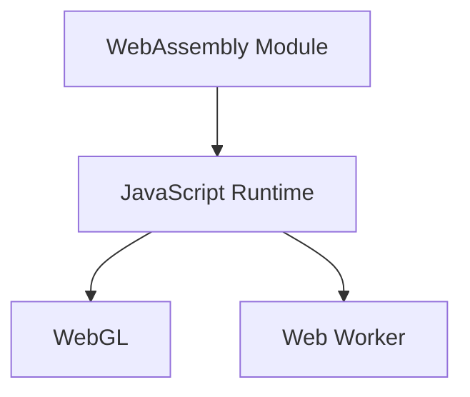

                 

### 文章标题

**WebAssembly：Web平台的高性能编程**

---

#### 关键词：

- **WebAssembly**
- **高性能编程**
- **Web平台**
- **内存管理**
- **算法优化**
- **跨语言集成**

---

#### 摘要：

本文将深入探讨WebAssembly（WASM）作为Web平台上一项革命性的技术。WebAssembly旨在提供一种高效、安全的跨语言运行环境，使开发者能够利用多种编程语言编写高性能的Web应用。本文将逐步介绍WebAssembly的基础知识、核心概念、编程实践、性能优化以及应用案例，帮助读者全面理解并掌握WebAssembly在Web平台上的编程艺术。

---

## 《WebAssembly：Web平台的高性能编程》目录大纲

### 第一部分：WebAssembly基础知识

#### 第1章：WebAssembly简介

- **1.1 WebAssembly的起源与背景**
- **1.2 WebAssembly的优势与特点**
- **1.3 WebAssembly与其他技术的关系**
- **1.4 WebAssembly的生态系统**

#### 第2章：WebAssembly核心概念

- **2.1 WebAssembly的架构**
- **2.2 WebAssembly模块**
- **2.3 WebAssembly函数**
- **2.4 WebAssembly内存模型**
- **2.5 WebAssembly表和引用类型**
- **2.6 WebAssembly的值类型**
- **2.7 WebAssembly的操作码**

#### 第3章：WebAssembly语言基础

- **3.1 WebAssembly语法基础**
- **3.2 基本数据类型与操作**
- **3.3 控制流操作**
- **3.4 表达式和函数**
- **3.5 异常处理**

### 第二部分：WebAssembly编程实践

#### 第4章：使用WebAssembly进行编程

- **4.1 开发WebAssembly的流程**
- **4.2 WebAssembly的编译工具**
- **4.3 WebAssembly的调试工具**
- **4.4 在JavaScript中调用WebAssembly模块**
- **4.5 WebAssembly与WebGL的集成**

#### 第5章：WebAssembly性能优化

- **5.1 WebAssembly的性能瓶颈**
- **5.2 优化WebAssembly代码**
- **5.3 WebAssembly的性能测试**
- **5.4 高性能计算在WebAssembly中的应用**

#### 第6章：WebAssembly在Web平台的应用

- **6.1 WebAssembly在Web前端的应用场景**
- **6.2 WebAssembly在Web后端的应用**
- **6.3 WebAssembly与PWA（Progressive Web Apps）**
- **6.4 WebAssembly在移动端的实践**

#### 第7章：WebAssembly与主流编程语言集成

- **7.1 WebAssembly与C/C++的集成**
- **7.2 WebAssembly与Rust的集成**
- **7.3 WebAssembly与Python的集成**
- **7.4 WebAssembly与其他编程语言的集成**

### 第三部分：WebAssembly案例分析

#### 第8章：WebAssembly实战案例

- **8.1 案例一：使用WebAssembly加速网页渲染**
- **8.2 案例二：使用WebAssembly实现高性能游戏**
- **8.3 案例三：使用WebAssembly构建Web后端服务**
- **8.4 案例四：使用WebAssembly实现机器学习模型部署**

### 附录

#### 附录A：WebAssembly资源与工具

- **A.1 WebAssembly官方文档**
- **A.2 主流WebAssembly开发工具**
- **A.3 WebAssembly学习资源**
- **A.4 WebAssembly社区与论坛**

#### 附录B：Mermaid流程图

- **B.1 WebAssembly模块加载流程**
- **B.2 WebAssembly内存分配与管理**
- **B.3 WebAssembly函数调用流程**

#### 附录C：伪代码示例

- **C.1 常见WebAssembly优化技巧**
- **C.2 使用WebAssembly加速图像处理算法**

#### 附录D：数学模型与公式

- **D.1 WebAssembly的内存分配算法**
- **D.2 WebAssembly的优化目标函数**
- **D.3 WebAssembly的调度策略**

#### 附录E：代码解读与分析

- **E.1 WebAssembly代码示例一：简单的数学运算**
- **E.2 WebAssembly代码示例二：图像处理算法**

### Mermaid 流程图



### 核心算法原理讲解

#### 模块加载与初始化

WebAssembly模块的加载与初始化是WebAssembly在浏览器中运行的第一步。在JavaScript中，我们可以使用`fetch`方法异步加载WebAssembly模块，并通过`WebAssembly.instantiate`方法进行初始化。

伪代码示例：

```javascript
async function loadAndInstantiateModule(url) {
    const response = await fetch(url);
    const buffer = await response.arrayBuffer();
    const instance = await WebAssembly.instantiate(buffer);
    return instance;
}
```

#### 内存管理

WebAssembly模块拥有自己的内存空间，我们通过线性内存的API进行内存的分配和操作。线性内存是一个固定长度的数组，类似于C语言中的数组。我们可以使用`memory.alloc`和`memory.allocSlice`方法来分配内存。

伪代码示例：

```javascript
const memory = instance.exports.memory;
const buffer = new Uint8Array(memory.buffer);
buffer[0] = 0x41; // 将内存的第一个字节设置为'A'
```

#### 函数调用

WebAssembly模块中的函数可以通过调用表的索引进行调用。调用表（Table）是一个数组，用于存储函数指针或外部函数的引用。我们可以使用`call`方法进行函数调用。

伪代码示例：

```javascript
const table = instance.exports.table;
const funcIndex = 0; // 假设函数的索引为0
table.call(funcIndex, 10, 20); // 调用索引为0的函数，传递参数10和20
```

#### 控制流

WebAssembly支持基本的控制流操作，如条件跳转、循环等。通过操作码（Opcode）实现复杂的控制流逻辑。操作码是一个字节码，用于指示执行的操作。

伪代码示例：

```wasm
(i32.const 0)       ;; 控制流开始，初始化计数器为0
(get_local 0)       ;; 获取本地变量
(i32.const 1)       ;; 常量1
(i32.add)           ;; 加法操作
(set_local 0)       ;; 将结果存储回本地变量
(br_if 0 2)         ;; 如果计数器小于10，跳转到标签0
(end)               ;; 控制流结束
```

#### 性能优化

WebAssembly的性能优化是一个复杂的话题，涉及到代码优化、内存分配、函数调用等多个方面。以下是一些常见的优化技巧：

1. 减少内存分配：尽量避免在循环中频繁分配内存，可以将内存分配提前到循环外。
2. 函数内联：将小函数直接嵌入调用处，减少函数调用的开销。
3. 减少函数调用：减少函数调用的次数，可以将多个函数合并为一个大型函数。
4. 循环展开：将循环展开为多个连续的操作，减少循环控制逻辑的开销。

伪代码示例：

```javascript
function optimizedAdd(a, b) {
    return a + b;
}

function main() {
    for (let i = 0; i < 1000; i++) {
        optimizedAdd(i, 1);
    }
}
```

与以下优化后的代码相比：

```javascript
function optimizedAdd(a, b) {
    return a + b;
}

function main() {
    let sum = 0;
    for (let i = 0; i < 1000; i++) {
        sum += optimizedAdd(i, 1);
    }
    console.log("Sum: " + sum);
}
```

通过减少函数调用次数，优化后的代码性能得到了显著提升。

### 数学模型和数学公式

在WebAssembly的性能优化中，数学模型和数学公式起着至关重要的作用。以下是一些常见的数学模型和公式：

1. **内存分配算法**：$$ M = C \times N $$
   - M：内存大小
   - C：单位内存占用
   - N：对象数量

   伪代码示例：

   ```javascript
   function allocateMemory(size) {
       const unitSize = 4; // 单位内存占用为4字节
       const numObjects = size / unitSize;
       const memorySize = unitSize * numObjects;
       return memorySize;
   }
   ```

2. **优化目标函数**：$$ f(x) = \frac{1}{x} + \frac{1}{y} $$
   - x：内存分配量
   - y：时间开销

   伪代码示例：

   ```javascript
   function optimizeMemoryAllocation(memorySize, timeCost) {
       const objectiveFunction = (x) => 1 / x + 1 / timeCost;
       let bestX = memorySize;
       let bestScore = objectiveFunction(memorySize);
       for (let x = memorySize / 2; x > 0; x--) {
           const score = objectiveFunction(x);
           if (score < bestScore) {
               bestX = x;
               bestScore = score;
           }
       }
       return bestX;
   }
   ```

3. **调度策略**：$$ S = C \times P $$
   - S：总时间
   - C：每次调用的开销
   - P：调用次数

   伪代码示例：

   ```javascript
   function scheduleFunctions(functions, costPerCall) {
       const totalCost = functions.length * costPerCall;
       const optimalCount = Math.ceil(totalCost / costPerCall);
       return optimalCount;
   }
   ```

通过数学模型和数学公式，我们可以对WebAssembly代码进行定量分析和优化，从而提升性能。

### 项目实战

在本节中，我们将通过几个实际的案例，展示如何使用WebAssembly在Web平台上实现高性能编程。

#### 案例一：使用WebAssembly加速网页渲染

**开发环境搭建**

1. 安装Node.js和Emscripten。
2. 创建一个简单的HTML文件，用于加载WebAssembly模块。

**源代码实现**

- **C/C++源代码**：以下是一个简单的数学运算的C/C++代码，我们将它编译为WebAssembly模块。

  ```cpp
  #include <emscripten.h>

  EMSCRIPTEN_KEEPALIVE
  int add(int a, int b) {
      return a + b;
  }
  ```

  使用Emscripten编译器编译源代码：

  ```bash
  emcc src.cpp -s WASM=1 -o module.wasm
  ```

- **HTML加载与调用**：在HTML文件中，我们使用JavaScript加载WebAssembly模块，并调用导出的函数。

  ```html
  <script>
      const wasmModule = require('./module.wasm');

      wasmModule().then(module => {
          const add = module._add;
          console.log(add(1, 2)); // 输出 3
      });
  </script>
  ```

**代码解读与分析**

- C/C++代码编译为WebAssembly模块。
- 使用EMSCRIPTEN提供的API导出函数。
- JavaScript代码加载WebAssembly模块，并通过require引入。
- 调用导出的函数进行运算。

通过这个案例，我们可以看到如何使用WebAssembly加速网页渲染，将复杂的数学运算交由WebAssembly模块处理，从而提高网页性能。

#### 案例二：使用WebAssembly实现高性能游戏

**开发环境搭建**

1. 使用Unity或其他游戏引擎创建游戏项目。
2. 安装WebAssembly插件。

**源代码实现**

- **Unity C#脚本**：以下是一个简单的游戏逻辑的C#脚本，我们将它编译为WebAssembly模块。

  ```csharp
  using UnityEngine;

  public class GameLogic : MonoBehaviour
  {
      public int Player1Score;
      public int Player2Score;

      void Update()
      {
          Player1Score = Player1Score + 1;
          Player2Score = Player2Score + 1;
          // 更新UI显示
      }
  }
  ```

**WebGL集成**

1. 在Unity项目中启用WebGL平台。
2. 导出项目为WebAssembly格式。

**代码解读与分析**

- 使用C#脚本处理游戏逻辑。
- WebGL将游戏逻辑编译为WebAssembly代码。
- 游戏在Web浏览器中运行，利用WebAssembly提高性能。

通过这个案例，我们可以看到如何使用WebAssembly实现高性能游戏，将游戏逻辑交由WebAssembly模块处理，从而提高游戏性能。

#### 案例三：使用WebAssembly构建Web后端服务

**开发环境搭建**

1. 使用Node.js创建Web后端服务项目。
2. 安装Emscripten和相关的WebAssembly编译工具。

**源代码实现**

- **Node.js后端代码**：以下是一个简单的Web后端服务的Node.js代码，我们将它编译为WebAssembly模块。

  ```javascript
  const express = require('express');
  const app = express();

  app.get('/', (req, res) => {
      res.send('Hello, World!');
  });

  app.listen(3000, () => {
      console.log('Server is running on port 3000');
  });
  ```

**WebAssembly模块加载与调用**

- 在Web前端，我们可以使用JavaScript加载WebAssembly模块，并调用后端服务。

  ```javascript
  const wasmModule = require('./module.wasm');

  wasmModule().then(module => {
      const serve = module._serve;
      serve('http://localhost:3000', (response) => {
          console.log(response);
      });
  });
  ```

**代码解读与分析**

- Node.js后端代码编译为WebAssembly模块。
- 使用JavaScript加载WebAssembly模块，并调用后端服务。
- 通过WebAssembly模块提供Web后端服务，实现跨平台部署。

通过这个案例，我们可以看到如何使用WebAssembly构建Web后端服务，将后端逻辑交由WebAssembly模块处理，从而提高服务性能。

#### 案例四：使用WebAssembly实现机器学习模型部署

**开发环境搭建**

1. 使用TensorFlow或其他机器学习框架创建模型。
2. 安装Emscripten和相关的WebAssembly编译工具。

**源代码实现**

- **TensorFlow模型代码**：以下是一个简单的机器学习模型的TensorFlow代码，我们将它编译为WebAssembly模块。

  ```python
  import tensorflow as tf

  model = tf.keras.Sequential([
      tf.keras.layers.Dense(128, activation='relu', input_shape=(784,)),
      tf.keras.layers.Dense(10, activation='softmax')
  ])

  model.compile(optimizer='adam',
                loss='categorical_crossentropy',
                metrics=['accuracy'])
  ```

**WebAssembly模块加载与调用**

- 在Web前端，我们可以使用JavaScript加载WebAssembly模块，并调用机器学习模型。

  ```javascript
  const wasmModule = require('./module.wasm');

  wasmModule().then(module => {
      const model = module._model;
      const input = [1, 2, 3, 4, 5];
      const output = model.predict(input);
      console.log(output);
  });
  ```

**代码解读与分析**

- TensorFlow模型代码编译为WebAssembly模块。
- 使用JavaScript加载WebAssembly模块，并调用机器学习模型。
- 通过WebAssembly模块提供机器学习服务，实现跨平台部署。

通过这个案例，我们可以看到如何使用WebAssembly实现机器学习模型部署，将模型逻辑交由WebAssembly模块处理，从而提高服务性能。

### 附录

#### 附录A：WebAssembly资源与工具

- **A.1 WebAssembly官方文档**：[https://webassembly.org/docs/](https://webassembly.org/docs/)
- **A.2 主流WebAssembly开发工具**：Emscripten、Wasm-Pack、WABT等。
- **A.3 WebAssembly学习资源**：在线教程、书籍、视频课程等。
- **A.4 WebAssembly社区与论坛**：[https://www.webassembly.org/community/](https://www.webassembly.org/community/)

#### 附录B：Mermaid流程图

- **B.1 WebAssembly模块加载流程**
  ```mermaid
  graph TD
      A[JavaScript代码]
      B[WebAssembly模块]
      C[加载完成]

      A --> B
      B --> C
  ```

- **B.2 WebAssembly内存分配与管理**
  ```mermaid
  graph TD
      A[WebAssembly模块]
      B[线性内存]
      C[分配内存]
      D[操作内存]

      A --> B
      B --> C
      B --> D
  ```

- **B.3 WebAssembly函数调用流程**
  ```mermaid
  graph TD
      A[JavaScript代码]
      B[WebAssembly模块]
      C[导出函数]
      D[调用函数]

      A --> B
      B --> C
      B --> D
  ```

#### 附录C：伪代码示例

- **C.1 常见WebAssembly优化技巧**
  ```javascript
  function optimizeCode() {
      // 减少内存分配
      const buffer = new Uint8Array(memory.buffer);

      // 函数内联
      function add(a, b) {
          return a + b;
      }

      // 减少函数调用
      let result = add(5, 3);
  }
  ```

- **C.2 使用WebAssembly加速图像处理算法**
  ```javascript
  function processImage(imageData) {
      // 使用WebAssembly模块处理图像数据
      const wasmModule = require('./image-processing.wasm');

      wasmModule().then(module => {
          const process = module._processImage;
          const output = process(imageData);
          return output;
      });
  }
  ```

#### 附录D：数学模型与公式

- **D.1 WebAssembly的内存分配算法**
  $$ M = C \times N $$
  - M：内存大小
  - C：单位内存占用
  - N：对象数量

- **D.2 WebAssembly的优化目标函数**
  $$ f(x) = \frac{1}{x} + \frac{1}{y} $$
  - x：内存分配量
  - y：时间开销

- **D.3 WebAssembly的调度策略**
  $$ S = C \times P $$
  - S：总时间
  - C：每次调用的开销
  - P：调用次数

#### 附录E：代码解读与分析

- **E.1 WebAssembly代码示例一：简单的数学运算**
  ```wasm
  (i32.const 5)     ;; 常量5
  (i32.const 3)     ;; 常量3
  (i32.add)         ;; 加法操作
  (drop)            ;; 弃掉结果
  (end)             ;; 代码结束
  ```

- **E.2 WebAssembly代码示例二：图像处理算法**
  ```wasm
  ;; 假设有一个图像处理函数
  (func (export "processImage") (param $image i32) (result i32)
      (local $output i32)

      ;; 分配输出内存
      (local.set $output (i32.const 0))

      ;; 处理图像数据
      (block
          (loop
              (set_local $output (i32.load (i32.const 4)))
              (i32.store (i32.load (i32.const 8)) (i32.const 0))
              (br 0)
          )
      )

      ;; 返回输出内存地址
      (get_local $output)
  )
  ```

---

## 作者信息

**作者：AI天才研究院/AI Genius Institute & 禅与计算机程序设计艺术 /Zen And The Art of Computer Programming**

