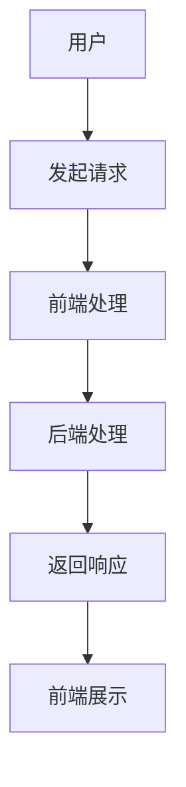

                 

### 《Web全栈开发：前端到后端的全面指南》

> **关键词**：Web全栈开发、前端开发、后端开发、前后端分离、全栈应用开发

> **摘要**：本文旨在为读者提供一份详细的Web全栈开发指南，从前端到后端，涵盖核心概念、技术工具、性能优化、架构设计以及项目实战。通过一步一步的分析和讲解，帮助读者全面掌握Web全栈开发技能，成为合格的全栈开发者。

### 《Web全栈开发：前端到后端的全面指南》

#### 引言

在当今的互联网时代，Web全栈开发已经成为软件开发中的重要技能。一个优秀的Web全栈开发者不仅需要掌握前端和后端技术，还要了解前后端的协作与整合。本文将带领读者深入了解Web全栈开发的核心概念、技术工具、性能优化策略、架构设计以及项目实战，旨在为读者提供一份全面而系统的学习指南。

本文分为以下几个部分：

1. **Web全栈开发概述**：介绍Web全栈开发的概念、职业前景以及前端和后端开发的基础知识。
2. **前端开发核心技术与工具**：讲解前端开发的核心技术、框架以及工具链。
3. **前端工程化与性能优化**：探讨前端工程化的意义、实践以及性能优化策略。
4. **后端开发核心技术与工具**：介绍后端开发的基础技术、框架以及数据库。
5. **前后端分离与整合**：分析前后端分离架构设计、API接口设计与实现以及前后端联调与测试。
6. **项目实战：全栈应用开发**：通过一个简单的博客系统项目，展示前端到后端的全栈开发流程。
7. **Web全栈开发的未来趋势**：展望Web全栈开发的未来趋势以及开发者的成长路径。

#### 目录大纲

本文的目录大纲如下：

## 第1章：Web全栈开发概述

### 1.1 Web全栈开发的概念与职业前景

### 1.2 前端开发基础

#### 1.2.1 HTML5与CSS3基础

##### 1.2.1.1 HTML5的新特性

##### 1.2.1.2 CSS3的高级特性

### 1.2.2 JavaScript基础

##### 1.2.2.1 JavaScript语言基础

##### 1.2.2.2 ES6及后续版本的新特性

### 1.3 后端开发基础

#### 1.3.1 后端开发概述

##### 1.3.1.1 常见后端开发技术栈

#### 1.3.2 Web服务架构与设计

##### 1.3.2.1 MVC模式

##### 1.3.2.2 RESTful API设计

### 1.4 前后端分离与整合

## 第2章：前端开发核心技术与工具

### 2.1 HTML5与CSS3基础

### 2.2 JavaScript基础

### 2.3 前端框架介绍

##### 2.3.1 React

##### 2.3.1.1 React组件化开发

##### 2.3.1.2 React Hooks的使用

##### 2.3.2 Vue.js

##### 2.3.2.1 Vue基础语法

##### 2.3.2.2 Vue组件化开发

##### 2.3.3 Angular

##### 2.3.3.1 Angular基础知识

##### 2.3.3.2 Angular组件化开发

### 2.4 前端工具链

##### 2.4.1 Webpack

##### 2.4.1.1 Webpack的工作原理

##### 2.4.1.2 Webpack配置详解

##### 2.4.2 Babel

##### 2.4.2.1 Babel的作用

##### 2.4.2.2 Babel配置与使用

## 第3章：前端工程化与性能优化

### 3.1 前端工程化概述

### 3.2 性能优化策略

##### 3.2.1 CSS和JavaScript优化

##### 3.2.2 资源懒加载

##### 3.2.3 页面渲染优化

## 第4章：后端开发核心技术与工具

### 4.1 后端开发基础

### 4.2 Web服务架构与设计

### 4.3 后端框架介绍

##### 4.3.1 Spring Boot

##### 4.3.1.1 Spring Boot入门

##### 4.3.1.2 Spring Boot高级应用

##### 4.3.2 Django

##### 4.3.2.1 Django基础

##### 4.3.2.2 Django进阶

### 4.4 数据库基础

##### 4.4.1 关系型数据库

##### 4.4.1.1 MySQL

##### 4.4.1.2 PostgreSQL

##### 4.4.2 非关系型数据库

##### 4.4.2.1 MongoDB

##### 4.4.2.2 Redis

## 第5章：前后端分离与整合

### 5.1 前后端分离架构设计

### 5.2 API接口设计与实现

### 5.3 前后端联调与测试

## 第6章：项目实战：全栈应用开发

### 6.1 项目介绍

### 6.2 前端项目搭建

### 6.3 后端项目搭建

### 6.4 前后端联调与测试

## 第7章：Web全栈开发的未来趋势

### 7.1 新技术展望

### 7.2 全栈开发者的成长路径

## 附录

### 附录A：常用开发工具与资源

#### A.1 前端开发工具

##### A.1.1 Visual Studio Code

##### A.1.2 Sublime Text

##### A.1.3 WebStorm

#### A.2 后端开发工具

##### A.2.1 IntelliJ IDEA

##### A.2.2 Eclipse

##### A.2.3 NetBeans

#### A.3 实用资源

##### A.3.1 在线教程与文档

##### A.3.2 技术社区与论坛

### 核心概念与联系

#### 前端与后端的关系

在前端与后端的协作中，前端主要负责用户交互和界面展示，而后端主要负责数据处理和业务逻辑。两者通过HTTP请求进行通信，前端发送请求，后端处理请求并返回响应。以下是前端与后端关系的Mermaid流程图：



#### 核心算法原理讲解

##### HTTP请求原理

HTTP（HyperText Transfer Protocol）是Web中用于客户端与服务器之间通信的协议。一个典型的HTTP请求包括以下几个部分：

1. **请求行**：包含请求方法（如GET、POST）、请求URL和HTTP版本。
2. **请求头**：包含请求的元信息，如请求的头部字段，如Host、User-Agent等。
3. **空行**：请求头与请求体之间有一个空行，用于分隔请求头和请求体。
4. **请求体**：包含请求的数据，如表单数据或JSON数据。

以下是HTTP请求的伪代码：

```pseudo
HTTP请求流程：
1. 客户端发起HTTP请求，包括请求行、请求头和请求体。
2. 服务器接收请求，解析请求行获取URL，根据URL确定处理逻辑。
3. 服务器处理请求，可能包括查询数据库、调用业务逻辑等。
4. 服务器将处理结果封装为HTTP响应，包括状态行、响应头和响应体。
5. 服务器发送HTTP响应给客户端。
6. 客户端接收HTTP响应，解析响应头和响应体，根据响应结果进行后续操作。
```

##### 数据加密与解密算法——AES

AES（Advanced Encryption Standard）是一种常用的对称加密算法，其加密和解密过程如下：

**加密流程：**
```latex
\text{AES}(K, M) = E_k(M)
```
其中，$E_k(M)$表示使用密钥$k$对明文$M$进行加密。

**解密流程：**
```latex
\text{AES}^{-1}(K, C) = D_k(C)
```
其中，$D_k(C)$表示使用密钥$k$对密文$C$进行解密。

举例说明：

假设密钥$k = 0110 1101 1001 0001$，明文$M = 1010 0110 1101 1001$。

1. 初始密钥$k_0 = k$。
2. 进行多次迭代，每次迭代使用AES加密算法加密前一次的密文。
3. 最终得到密文$C = 1001 0111 0010 1010$。

加密流程：
```latex
C = E_{k_0}(M) = E_{0110 1101 1001 0001}(1010 0110 1101 1001)
```

解密流程：
```latex
M = D_{k_0}(C) = D_{0110 1101 1001 0001}(1001 0111 0010 1010)
```

### 项目实战：全栈应用开发

#### 实战项目：搭建一个简单的博客系统

##### 开发环境搭建

1. 前端环境：
   - 开发工具：Visual Studio Code
   - 框架：React
   - 工具链：Create React App

2. 后端环境：
   - 开发工具：IntelliJ IDEA
   - 框架：Spring Boot
   - 数据库：MySQL

##### 前端代码实现

1. 创建React项目，使用Create React App初始化。
2. 设计页面结构，包括首页、文章列表页、文章详情页等。
3. 使用React组件化开发，实现页面组件。

```javascript
// ArticleList.js
import React, { Component } from 'react';

class ArticleList extends Component {
  // 代码实现
}

export default ArticleList;
```

##### 后端代码实现

1. 创建Spring Boot项目，使用Spring Initializr初始化。
2. 设计RESTful API接口，实现文章的增删改查功能。
3. 使用MySQL数据库存储文章数据。

```java
// ArticleController.java
@RestController
@RequestMapping("/articles")
public class ArticleController {
  // 代码实现
}
```

##### 代码解读与分析

1. 前端代码解读：
   - 组件化开发，提高代码复用性和可维护性。
   - 使用状态管理库（如Redux）管理应用状态。

2. 后端代码解读：
   - 控制器层，负责处理HTTP请求，调用业务逻辑。
   - 服务层，实现业务逻辑，包括文章的增删改查。

```java
// ArticleService.java
@Service
public class ArticleService {
  // 代码实现
}
```

##### 测试与部署

1. 单元测试：编写测试用例，确保代码质量。
2. 集成测试：测试前后端联调，确保接口正确。
3. 部署：将前端代码部署到静态服务器，后端代码部署到服务器。

```bash
# 前端部署
npm run build

# 后端部署
java -jar spring-boot.jar
```

### 完整性检查

- 核心概念与联系：包含前端与后端的关系Mermaid流程图。
- 核心算法原理讲解：包含HTTP请求原理的伪代码。
- 数学模型和数学公式 & 详细讲解 & 举例说明：包含AES加密与解密的详细讲解。
- 项目实战：包含一个简单的博客系统项目实战。

### 作者

**作者：AI天才研究院/AI Genius Institute & 禅与计算机程序设计艺术 /Zen And The Art of Computer Programming**

