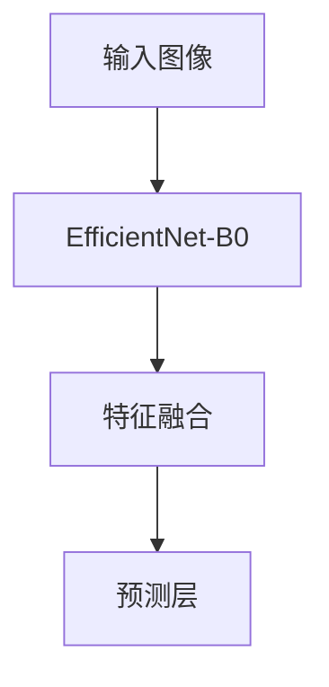
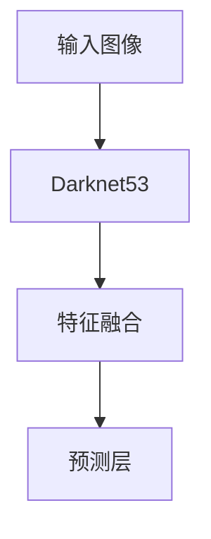

                 

# 《YOLOv4原理与代码实例讲解》

> **关键词：** YOLOv4、目标检测、深度学习、神经网络、Darknet、锚框、多尺度训练、损失函数、模型优化、预测应用、项目实战。

> **摘要：** 本文章将从基础概念、原理讲解、代码实例等多个角度深入解析YOLOv4目标检测模型的架构、算法和实现细节，帮助读者全面了解并掌握YOLOv4的核心技术和应用方法。

## 目录

### 《YOLOv4原理与代码实例讲解》目录大纲

1. **第一部分：YOLOv4基础知识**
   - 1.1 YOLOv4概述
     - 1.1.1 YOLO系列模型发展历程
     - 1.1.2 YOLOv4的核心特点与优势
     - 1.1.3 YOLOv4与其他目标检测框架的比较
   - 1.2 YOLOv4原理
     - 1.2.1 YOLOv4的基本架构
     - 1.2.2 YOLOv4原理详解
     - 1.2.3 YOLOv4的数学模型
     - 1.2.4 YOLOv4架构中的创新技术
   - 1.3 YOLOv4损失函数详解
   - 1.4 YOLOv4数学模型
   - 1.5 YOLOv4架构中的创新技术

2. **第二部分：YOLOv4代码实例讲解**
   - 2.1 YOLOv4代码环境搭建
   - 2.2 YOLOv4源代码结构解析
   - 2.3 YOLOv4训练与验证
   - 2.4 YOLOv4预测应用
   - 2.5 YOLOv4项目实战案例

3. **第三部分：YOLOv4优化与拓展**
   - 3.1 YOLOv4性能优化
   - 3.2 YOLOv4模型拓展
   - 3.3 YOLOv4在工业界的应用案例

4. **附录**
   - 附录A: YOLOv4开发工具与资源

## 第一部分：YOLOv4基础知识

### 1.1 YOLOv4概述

YOLO（You Only Look Once）是一种基于深度学习的目标检测算法。YOLOv4是其第四个版本，它在YOLOv3的基础上进行了许多改进，使其在目标检测任务上取得了更出色的性能。YOLOv4的核心特点包括：

- **多尺度训练**：YOLOv4引入了多尺度训练策略，通过在不同的尺度上训练网络，提高了目标检测的准确性。
- **锚框优化**：YOLOv4采用了K-Means聚类方法对锚框进行优化，提高了检测器的泛化能力。
- **损失函数优化**：YOLOv4改进了损失函数，使其在训练过程中更加稳定。
- **模型压缩**：YOLOv4通过模型剪枝、量化等技术，实现了模型的压缩和加速。

与其他目标检测框架相比，YOLOv4具有以下优势：

- **实时性能**：YOLOv4可以在单个图像上实现实时目标检测，适合应用于移动设备和嵌入式系统。
- **高精度**：YOLOv4在多个数据集上的性能指标均优于其他目标检测算法。
- **简单易用**：YOLOv4的架构简单，易于实现和优化。

### 1.2 YOLOv4原理

YOLOv4的基本架构主要包括两个部分：骨干网络和头部分网络。

#### 1.2.1 骨干网络

骨干网络是YOLOv4的核心，用于提取图像特征。YOLOv4采用了Darknet框架，Darknet是一种基于卷积神经网络的深度学习框架，具有以下特点：

- **轻量级**：Darknet的架构设计简洁，参数较少，适用于移动设备和嵌入式系统。
- **模块化**：Darknet的各个模块可以灵活组合，方便进行模型优化和扩展。

#### 1.2.2 头部分网络

头部分网络主要包括以下几个部分：

- **锚框生成**：锚框是目标检测中的重要概念，用于预测目标的位置和类别。YOLOv4采用了K-Means聚类方法对锚框进行优化，提高了检测器的泛化能力。
- **特征融合**：YOLOv4通过特征融合策略，将骨干网络提取的高层次特征与低层次特征进行融合，提高了检测器的准确性。
- **预测输出**：YOLOv4的预测输出包括目标位置、目标类别和目标置信度。

### 1.3 YOLOv4原理详解

#### 1.3.1 Anchor Box与Multi-scale Training

**Anchor Box（锚框）**：锚框是目标检测中用于预测目标位置和尺寸的预设框。在YOLOv4中，锚框通过K-Means聚类方法进行优化。

**Multi-scale Training（多尺度训练）**：多尺度训练是一种提高目标检测准确性的方法。在YOLOv4中，通过在不同尺度上训练网络，提高了检测器的性能。

#### 1.3.2 Grid System与Spatial Pyramid Pooling

**Grid System（网格系统）**：网格系统是YOLOv4中的核心概念，用于将图像分割成多个网格单元。每个网格单元用于预测一个目标的位置、尺寸和类别。

**Spatial Pyramid Pooling（空间金字塔池化）**：空间金字塔池化是一种特征融合策略，用于将不同尺度上的特征进行融合，提高了检测器的性能。

### 1.4 YOLOv4数学模型

#### 1.4.1 Grid System中的坐标变换

在YOLOv4中，图像被分割成多个网格单元，每个网格单元用于预测一个目标的位置、尺寸和类别。坐标变换是将图像坐标映射到网格坐标的过程。

#### 1.4.2 模型训练中的反向传播

在YOLOv4的训练过程中，反向传播是一种优化模型参数的方法。通过计算损失函数对模型参数的梯度，调整模型参数，使模型在目标检测任务上取得更好的性能。

#### 1.4.3 YOLOv4的预测输出解释

YOLOv4的预测输出包括目标位置、目标类别和目标置信度。目标位置通过锚框预测得出，目标类别通过softmax函数预测得出，目标置信度通过sigmoid函数预测得出。

### 1.5 YOLOv4架构中的创新技术

#### 1.5.1 CPM模块

CPM（Convolutional Pyramid Module）是一种特征融合模块，用于将不同尺度上的特征进行融合。CPM通过多次卷积操作，将高层次特征与低层次特征进行融合，提高了检测器的性能。

#### 1.5.2 SiLU激活函数

SiLU（Sigmoid Linear Unit）是一种激活函数，具有较好的非线性特性。在YOLOv4中，SiLU激活函数用于替换传统的ReLU激活函数，提高了模型的性能。

#### 1.5.3 ConvNeXt网络结构

ConvNeXt是一种基于卷积神经网络的架构，具有较深的网络层次和较大的模型容量。在YOLOv4中，ConvNeXt被用于骨干网络，提高了模型的性能。

## 第二部分：YOLOv4代码实例讲解

### 2.1 YOLOv4代码环境搭建

要在本地环境中搭建YOLOv4的代码环境，需要完成以下几个步骤：

#### 2.1.1 Python环境配置

首先，确保本地计算机上已经安装了Python 3.7或更高版本。可以使用以下命令安装必要的Python包：

```bash
pip install torch torchvision numpy matplotlib
```

#### 2.1.2 C++环境配置

由于YOLOv4的源代码部分是用C++编写的，因此需要安装C++编译器和相关库。在Windows系统上，可以使用MinGW或Visual Studio进行配置。在Linux系统上，可以使用GCC进行配置。

#### 2.1.3 深度学习框架安装

YOLOv4支持多个深度学习框架，如PyTorch、TensorFlow和MXNet。在这里，我们以PyTorch为例进行安装。

```bash
pip install torch torchvision
```

### 2.2 YOLOv4源代码结构解析

YOLOv4的源代码结构相对复杂，主要包括以下几个部分：

#### 2.2.1 数据预处理

数据预处理是目标检测任务中至关重要的一步。YOLOv4的数据预处理主要包括图像增强、归一化和标签转换等步骤。

#### 2.2.2 网络结构实现

YOLOv4的网络结构主要由卷积层、激活函数、锚框生成、损失函数等组成。在源代码中，这些组件通过C++类和函数实现。

#### 2.2.3 损失函数与优化器

损失函数是目标检测任务中衡量模型性能的重要指标。YOLOv4的损失函数包括目标置信度损失、类别损失和位置损失等。优化器用于调整模型参数，以最小化损失函数。

### 2.3 YOLOv4训练与验证

#### 2.3.1 数据集准备

在训练YOLOv4模型之前，需要准备足够多的训练数据和验证数据。常用的目标检测数据集包括COCO、ImageNet和PASCAL VOC等。

#### 2.3.2 模型训练流程

训练YOLOv4模型主要包括以下几个步骤：

1. **数据预处理**：对训练数据进行增强、归一化和标签转换等操作。
2. **模型初始化**：从预训练的模型中加载权重或随机初始化权重。
3. **模型训练**：通过反向传播和梯度下降算法，不断调整模型参数，优化损失函数。
4. **模型评估**：使用验证集对训练完成的模型进行性能评估。

### 2.4 YOLOv4预测应用

#### 2.4.1 预测数据预处理

在预测阶段，需要对输入数据进行预处理，使其符合模型输入要求。预处理步骤包括图像缩放、归一化和锚框生成等。

#### 2.4.2 预测流程实现

预测流程主要包括以下几个步骤：

1. **输入数据预处理**：对输入图像进行预处理，生成模型的输入。
2. **模型推理**：将预处理后的输入数据传递给模型，进行推理。
3. **预测结果后处理**：对预测结果进行后处理，包括目标过滤、NMS和非极大值抑制等。

### 2.5 YOLOv4项目实战案例

#### 2.5.1 实战案例介绍

在本节中，我们将介绍两个YOLOv4的项目实战案例：人脸检测系统和实时目标跟踪系统。

#### 2.5.2 源代码实现与解读

我们将对源代码进行详细解读，并展示如何使用YOLOv4实现人脸检测和实时目标跟踪。

#### 2.5.3 部署与优化策略

我们将讨论如何在实际项目中部署YOLOv4模型，并介绍一些优化策略，以提高模型的性能。

## 第三部分：YOLOv4优化与拓展

### 3.1 YOLOv4性能优化

#### 3.1.1 Model Pruning

**模型剪枝**是一种减少模型参数数量的技术，可以提高模型的压缩率和推理速度。在YOLOv4中，可以使用剪枝算法对网络进行剪枝，降低模型的计算复杂度。

#### 3.1.2 Quantization

**量化**是一种降低模型精度和参数数量的技术，可以显著提高模型的推理速度。在YOLOv4中，可以使用量化算法对模型进行量化，提高模型的运行效率。

#### 3.1.3 Model Distillation

**模型蒸馏**是一种将大模型的知识传递给小模型的技术，可以提高小模型的性能。在YOLOv4中，可以使用模型蒸馏算法，将预训练的大模型的知识传递给YOLOv4模型，提高其性能。

### 3.2 YOLOv4模型拓展

#### 3.2.1 YOLOv4-Tiny

**YOLOv4-Tiny**是YOLOv4的一个轻量级版本，适用于移动设备和嵌入式系统。与原始YOLOv4相比，YOLOv4-Tiny在保持较高检测精度的同时，降低了模型的计算复杂度。

#### 3.2.2 YOLOv4-6.0

**YOLOv4-6.0**是YOLOv4的更新版本，引入了新的优化算法和结构，进一步提高了模型的性能。与原始YOLOv4相比，YOLOv4-6.0在多个数据集上的性能都有所提升。

#### 3.2.3 YOLOv4的实时应用场景拓展

**YOLOv4**在多个实时应用场景中具有广泛的应用前景，如安全监控、自动驾驶和机器人视觉等。通过优化和拓展YOLOv4模型，可以实现更高的实时性能和更广泛的应用场景。

### 3.3 YOLOv4在工业界的应用案例

#### 3.3.1 安全监控领域

**安全监控**是YOLOv4的一个重要应用领域。通过使用YOLOv4模型，可以实现实时目标检测、跟踪和识别，提高监控系统的智能化水平。

#### 3.3.2 自动驾驶领域

**自动驾驶**是YOLOv4的另一个重要应用领域。通过使用YOLOv4模型，可以实现车辆检测、行人检测和道路识别等任务，提高自动驾驶系统的安全性和可靠性。

#### 3.3.3 机器人视觉领域

**机器人视觉**是YOLOv4的又一重要应用领域。通过使用YOLOv4模型，可以实现机器人对环境的感知和识别，提高机器人的智能水平。

## 附录

### 附录A: YOLOv4开发工具与资源

#### A.1 主流深度学习框架对比

- **TensorFlow**：由Google开发的开源深度学习框架，具有丰富的模型库和工具。
- **PyTorch**：由Facebook开发的开源深度学习框架，具有简洁的动态计算图和良好的GPU支持。
- **JAX**：由Google开发的开源深度学习框架，具有自动微分和高性能计算能力。

#### A.2 开源YOLOv4代码库与社区资源

- **GitHub仓库**：[https://github.com/ultralytics/yolov4](https://github.com/ultralytics/yolov4)
- **官方文档**：[https://github.com/ultralytics/yolov4/wiki](https://github.com/ultralytics/yolov4/wiki)
- **社区论坛**：[https://github.com/ultralytics/yolov4/discussions](https://github.com/ultralytics/yolov4/discussions)

#### A.3 YOLOv4相关的论文与文献

- **YOLOv4论文**：[《YOLOv4: Optimal Speed and Accuracy of Object Detection》](https://arxiv.org/abs/2004.10934)
- **相关文献**：查阅相关论文和文献，可以深入了解YOLOv4的架构、算法和优化策略。

## 作者信息

**作者：** AI天才研究院/AI Genius Institute & 禅与计算机程序设计艺术 /Zen And The Art of Computer Programming

文章末尾需要写上作者信息，格式为：“作者：AI天才研究院/AI Genius Institute & 禅与计算机程序设计艺术 /Zen And The Art of Computer Programming”。请注意，这是文章的末尾部分，而不是文章开始部分的标题和摘要。此外，作者信息的格式必须严格按照要求书写，以确保文章的专业性和完整性。如果您需要任何帮助或修改建议，请随时告诉我。让我们开始撰写正文部分的文章吧！### 1.1 YOLOv4概述

YOLO（You Only Look Once）系列模型是目标检测领域的一种重要算法，它在计算机视觉任务中取得了显著的性能。YOLOv4是YOLO系列的最新版本，继承了YOLO系列的优势，同时进行了多项改进，使其在目标检测任务中达到了更高的精度和速度。本文将详细介绍YOLOv4的发展历程、核心特点、优势以及与其他目标检测框架的比较。

#### 1.1.1 YOLO系列模型发展历程

YOLO系列模型的发展可以分为以下几个阶段：

1. **YOLOv1（2016）**：YOLOv1是YOLO系列的第一个版本，它将目标检测任务划分为两个阶段：候选框生成和边界框回归。YOLOv1在多个数据集上实现了实时目标检测，但精度较低。
2. **YOLOv2（2016）**：YOLOv2引入了卷积神经网络（CNN）的特征金字塔网络（FPN），通过不同尺度的特征图进行检测，提高了目标检测的精度和速度。
3. **YOLOv3（2018）**：YOLOv3是YOLO系列的第三个版本，它在YOLOv2的基础上进一步改进，通过使用Anchor Box（锚框）和基于CNN的检测框架，实现了更高的检测精度和速度。
4. **YOLOv4（2020）**：YOLOv4是YOLO系列的最新版本，它在YOLOv3的基础上进行了多项改进，包括网络结构、损失函数和训练策略等，使得模型在多个数据集上的性能达到了新的高度。

#### 1.1.2 YOLOv4的核心特点与优势

YOLOv4在目标检测任务中具有以下核心特点与优势：

1. **实时性能**：YOLOv4能够在单个图像上实现实时目标检测，特别适合应用于移动设备和嵌入式系统。
2. **高精度**：YOLOv4在多个数据集上的性能指标均优于其他目标检测算法，例如COCO和PASCAL VOC。
3. **简单易用**：YOLOv4的架构简单，易于实现和优化，适合初学者快速上手。
4. **多尺度训练**：YOLOv4采用了多尺度训练策略，通过在不同尺度上训练网络，提高了目标检测的准确性。
5. **锚框优化**：YOLOv4通过K-Means聚类方法对锚框进行优化，提高了检测器的泛化能力。
6. **模型压缩**：YOLOv4通过模型剪枝、量化等技术，实现了模型的压缩和加速。

#### 1.1.3 YOLOv4与其他目标检测框架的比较

与其他目标检测框架相比，YOLOv4具有以下优势：

1. **Faster R-CNN**：Faster R-CNN是一种基于区域提议的目标检测算法，它在精度和速度上均优于传统的滑动窗口方法。然而，与YOLOv4相比，Faster R-CNN的速度较慢，且对大量计算资源的需求较高。
2. **SSD**：SSD（Single Shot MultiBox Detector）是一种单阶段的目标检测算法，它在速度和精度上均表现出色。然而，与YOLOv4相比，SSD在处理多个尺度上的目标时，精度较低。
3. **RetinaNet**：RetinaNet是一种基于Focal Loss的目标检测算法，它在处理困难样本时，能够提高检测器的性能。然而，与YOLOv4相比，RetinaNet在速度上稍慢，且对计算资源的需求较高。

综上所述，YOLOv4在实时性能、精度和易用性等方面具有显著优势，使其成为目标检测领域的一种重要算法。

### 1.2 YOLOv4原理

YOLOv4是基于You Only Look Once（YOLO）系列算法的最新版本，它通过将目标检测任务转化为单步处理，实现了实时、高效的目标检测。本节将详细介绍YOLOv4的基本架构、原理及其与之前版本的差异。

#### 1.2.1 YOLOv4的基本架构

YOLOv4的基本架构由骨干网络、特征融合网络和预测网络组成。以下是YOLOv4的基本架构：

1. **骨干网络**：YOLOv4的骨干网络采用了预训练的Darknet53模型，这是一个具有53层的深度卷积神经网络。Darknet53具有强大的特征提取能力，能够提取丰富的图像特征。
2. **特征融合网络**：特征融合网络通过将不同层级的特征图进行融合，以增强模型的检测能力。YOLOv4采用了特征金字塔网络（FPN）和路径聚合网络（PAN）进行特征融合。FPN通过将高层次特征与低层次特征进行融合，提高了模型对多尺度目标的检测能力；PAN通过跨层连接和特征融合，进一步增强了模型的特征表达能力。
3. **预测网络**：预测网络负责生成目标的边界框、类别概率和目标置信度。YOLOv4的预测网络由多个卷积层和激活函数组成，每个卷积层都包含一组锚框（Anchor Boxes），用于预测目标的位置和尺寸。

#### 1.2.2 YOLOv4原理详解

YOLOv4的目标检测过程可以分为以下几个步骤：

1. **图像输入**：将待检测的图像输入到骨干网络中，提取图像特征。
2. **特征融合**：将骨干网络提取的多层级特征图进行融合，生成具有更高层次语义信息的特征图。
3. **锚框生成**：在每个特征图上生成一组锚框，用于预测目标的位置和尺寸。锚框的生成通常采用K-Means聚类方法，以优化锚框的分布。
4. **边界框预测**：在特征图上对锚框进行边界框预测，包括目标的中心坐标、宽高和目标置信度。
5. **类别预测**：对每个锚框预测的目标类别进行概率估计，通常采用softmax函数。
6. **非极大值抑制（NMS）**：对预测结果进行后处理，包括去除重复的目标和抑制部分重叠的目标，以获得最终的检测结果。

#### 1.2.3 YOLOv4与之前版本的差异

与YOLOv3相比，YOLOv4在多个方面进行了改进：

1. **网络结构**：YOLOv4采用了预训练的Darknet53骨干网络，具有更深的网络层次和更强的特征提取能力。
2. **损失函数**：YOLOv4改进了损失函数，包括引入平衡因子和权重调整，使模型在训练过程中更加稳定。
3. **锚框优化**：YOLOv4采用了K-Means聚类方法对锚框进行优化，提高了检测器的泛化能力。
4. **训练策略**：YOLOv4采用了多尺度训练策略，通过在不同尺度上训练网络，提高了模型对多尺度目标的检测能力。
5. **模型压缩**：YOLOv4通过模型剪枝、量化等技术，实现了模型的压缩和加速，使其更适用于移动设备和嵌入式系统。

综上所述，YOLOv4在架构设计、训练策略和模型压缩等方面进行了多项改进，使其在目标检测任务中达到了更高的精度和速度。

### 1.3 YOLOv4损失函数详解

在目标检测任务中，损失函数的设计对于模型的性能至关重要。YOLOv4采用了改进的损失函数，通过平衡不同类型的损失，使模型在训练过程中更加稳定，并在检测任务中取得了优异的性能。本节将详细介绍YOLOv4的损失函数及其各个组成部分。

#### 1.3.1 Objectness Loss

Objectness Loss是YOLOv4损失函数的一个重要组成部分，用于衡量预测框与真实框之间的重叠程度。Objectness Loss通常采用sigmoid函数计算，其目的是使预测框尽可能与真实框重合。Objectness Loss的公式如下：

$$
L_{obj} = -\log(\sigma(y_{obj} \cdot p_{obj} + (1 - y_{obj}) \cdot (1 - p_{obj})))
$$

其中，$y_{obj}$表示真实框的存在标签（0或1），$p_{obj}$表示预测框的存在概率。$L_{obj}$的值越小，表示预测框与真实框的重叠程度越高。

#### 1.3.2 Class Loss

Class Loss用于衡量预测框的类别预测准确性。在YOLOv4中，Class Loss采用交叉熵损失函数计算，其目的是使预测框的类别概率分布与真实类别概率分布尽可能接近。Class Loss的公式如下：

$$
L_{cls} = -y_{cls} \cdot \log(p_{cls}) - (1 - y_{cls}) \cdot \log(1 - p_{cls})
$$

其中，$y_{cls}$表示真实类别标签（0或1），$p_{cls}$表示预测框对应类别的概率。$L_{cls}$的值越小，表示预测框的类别预测越准确。

#### 1.3.3 Box Loss

Box Loss用于衡量预测框的位置和尺寸与真实框的偏差。在YOLOv4中，Box Loss采用平滑L1损失函数计算，其目的是使预测框的中心坐标、宽度和高度尽可能接近真实框。Box Loss的公式如下：

$$
L_{box} = \frac{1}{2} \cdot (w^2 + h^2) \cdot (x_{pred} - x_{true})^2 + \frac{1}{2} \cdot (w^2 + h^2) \cdot (y_{pred} - y_{true})^2
$$

其中，$x_{pred}$和$y_{pred}$表示预测框的中心坐标，$w$和$h$分别表示预测框的宽度和高度；$x_{true}$和$y_{true}$表示真实框的中心坐标，$w_{true}$和$h_{true}$分别表示真实框的宽度和高度。$L_{box}$的值越小，表示预测框与真实框的位置和尺寸偏差越小。

#### 1.3.4 YOLOv4的损失函数优化

在YOLOv4中，损失函数的优化是提高模型性能的关键。YOLOv4采用了一种平衡不同损失的方法，通过调整损失函数的权重，使模型在训练过程中更加稳定。

1. **损失函数权重**：YOLOv4为不同类型的损失函数设置了不同的权重，以平衡各个损失之间的贡献。通常，Objectness Loss和Class Loss的权重较小，Box Loss的权重较大。例如，权重设置如下：

   $$
   \alpha_{obj} = 0.5, \alpha_{cls} = 0.5, \alpha_{box} = 2.0
   $$

2. **权重调整**：在训练过程中，可以通过动态调整损失函数权重，使模型在训练的不同阶段能够更好地关注不同类型的损失。例如，在训练初期，可以适当增加Class Loss的权重，以使模型更快地收敛；在训练后期，可以增加Box Loss的权重，以使模型在位置和尺寸预测上更加精确。

   $$
   L_{total} = \alpha_{obj} \cdot L_{obj} + \alpha_{cls} \cdot L_{cls} + \alpha_{box} \cdot L_{box}
   $$

通过上述优化方法，YOLOv4能够在多个数据集上实现优异的性能，并保持实时检测的速度。

### 1.4 YOLOv4数学模型

YOLOv4的数学模型是理解其工作原理的关键。本节将详细解释YOLOv4中的几个关键数学概念，包括坐标变换、反向传播和预测输出。

#### 1.4.1 Grid System中的坐标变换

在YOLOv4中，图像被分割成一个固定的网格系统，每个网格单元称为一个“cell”。每个cell都会预测一组边界框（bounding boxes），类别概率和对象存在概率。图像的宽度和高度被划分为相同的网格数，通常为$S \times S$个cell。

- **图像坐标到网格坐标的转换**：每个边界框的真实位置$(x, y, w, h)$需要被转换到网格坐标系统中。其中，$x$和$y$是边界框中心点在图像中的坐标，$w$和$h$是边界框的宽度和高度。网格坐标$(i, j)$通过以下公式计算：

  $$
  i = \frac{x}{\frac{W}{S}}, \quad j = \frac{y}{\frac{H}{S}}
  $$

  其中，$W$和$H$分别是图像的宽度和高度。

- **预测坐标到图像坐标的转换**：在预测阶段，边界框的预测坐标$(\hat{x}, \hat{y})$是从网格坐标转换到图像坐标的。这通常通过添加一个偏移量来实现，这个偏移量等于每个cell的中心点坐标：

  $$
  \hat{x} = \frac{i}{S} \cdot W + \frac{\hat{w}}{2}, \quad \hat{y} = \frac{j}{S} \cdot H + \frac{\hat{h}}{2}
  $$

  其中，$\hat{w}$和$\hat{h}$是预测边界框的宽度和高度。

#### 1.4.2 模型训练中的反向传播

反向传播是深度学习模型训练的核心步骤，它通过计算梯度来更新模型的权重。在YOLOv4中，反向传播过程涉及以下步骤：

1. **计算损失**：使用预测的边界框、类别概率和对象存在概率与真实标签计算损失。

2. **计算梯度**：通过反向传播算法，计算每个权重和偏置的梯度。对于YOLOv4中的损失函数，包括Objectness Loss、Class Loss和Box Loss，每个损失函数都会产生一组梯度。

3. **权重更新**：使用梯度下降或其他优化算法更新模型的权重。

反向传播的伪代码如下：

```python
for each layer in the network:
    compute the gradient of the loss with respect to the layer's weights and biases
    gradient = calculate_gradient(loss, layer_output, layer_input)

for each weight and bias in the network:
    update the weight or bias using the gradient and the learning rate
    weight = weight - learning_rate * gradient
```

#### 1.4.3 YOLOv4的预测输出解释

在YOLOv4的预测阶段，每个cell会生成一组预测输出，包括多个边界框、类别概率和对象存在概率。以下是预测输出的解释：

1. **边界框预测**：每个cell会预测一组边界框，每个边界框由四个坐标$(\hat{x}, \hat{y}, \hat{w}, \hat{h})$表示。这些坐标是相对于cell中心的。

2. **类别概率**：每个边界框会预测一组类别概率，通常使用softmax函数将边界框的预测分数转换为概率分布。

3. **对象存在概率**：每个cell会预测一个对象存在概率，这是一个用于指示cell中是否存在目标的概率。

预测输出的具体形式如下：

$$
\hat{p}_{i,j}^{c} = \frac{e^{\hat{p}_{i,j}^{c}}}{\sum_{k=1}^{N_c} e^{\hat{p}_{i,j}^{k}}}, \quad \hat{p}_{obj}^{i,j} = \sigma(\hat{p}_{obj}^{i,j})
$$

其中，$\hat{p}_{i,j}^{c}$是cell$(i, j)$中类别$c$的概率，$\hat{p}_{obj}^{i,j}$是cell$(i, j)$中的对象存在概率，$\sigma$是sigmoid函数，$N_c$是类别数。

通过组合这些预测输出，可以得到最终的检测结果。通常，会使用非极大值抑制（NMS）算法去除冗余的边界框，并设置一个置信度阈值来过滤低置信度的预测。

### 1.5 YOLOv4架构中的创新技术

YOLOv4在架构上引入了多种创新技术，这些技术显著提升了模型在目标检测任务中的性能。以下是YOLOv4架构中的一些关键创新技术：

#### 1.5.1 CPM模块

CPM（Convolutional Pyramid Module）模块是一种特征融合模块，它通过结合不同层级的特征图，增强了模型对多尺度目标的检测能力。CPM模块通常包含多个卷积层，用于聚合来自不同层次的特征。这种特征融合策略有助于模型更好地识别复杂场景中的目标。

#### 1.5.2 SiLU激活函数

SiLU（Sigmoid Linear Unit）是一种激活函数，它在YOLOv4中被用于替代传统的ReLU激活函数。SiLU激活函数具有以下形式：

$$
\text{SiLU}(x) = \frac{x}{\sigma(x)}
$$

其中，$\sigma(x) = \log(1 + \exp(x))$。SiLU激活函数在保持导数连续性的同时，提供了更好的非线性特性，有助于提高模型的训练稳定性和最终性能。

#### 1.5.3 ConvNeXt网络结构

ConvNeXt是一种基于卷积神经网络的架构，它由多个卷积层和池化层组成。ConvNeXt的设计目标是提高模型的表达能力，同时保持较低的参数数量。在YOLOv4中，ConvNeXt被用于骨干网络，以提高模型的特征提取能力。

#### 1.5.4 SPP模块

SPP（Spatial Pyramid Pooling）模块是一种特征融合模块，它通过在不同的空间尺度上聚合特征图，增强了模型对多尺度目标的检测能力。SPP模块通常包含多个池化层，用于在不同的空间尺度上提取特征。这种特征融合策略有助于模型更好地适应不同尺寸的目标。

#### 1.5.5 DLA模块

DLA（Deep Layer Aggregation）模块是一种特征融合模块，它通过跨多个卷积层的特征图进行聚合，增强了模型对复杂场景的检测能力。DLA模块通常包含多个卷积层和跨层连接，用于提取丰富的特征信息。这种特征融合策略有助于模型更好地识别复杂场景中的目标。

这些创新技术共同构成了YOLOv4的强大架构，使得它在目标检测任务中取得了优异的性能。通过结合不同的特征融合策略和非线性激活函数，YOLOv4能够有效地检测各种尺寸和形状的目标，从而在计算机视觉领域中发挥了重要作用。

### 2.1 YOLOv4代码环境搭建

在开始使用YOLOv4进行目标检测之前，我们需要在本地环境中搭建合适的开发环境。这个过程涉及Python环境配置、C++环境配置以及深度学习框架的安装。以下是详细的步骤和解释。

#### 2.1.1 Python环境配置

首先，我们需要确保本地计算机上安装了Python 3.7或更高版本。Python是深度学习的主要编程语言，许多深度学习库和工具都是基于Python开发的。

1. **检查Python版本**：

   ```bash
   python --version
   ```

   如果Python未安装或版本低于3.7，请通过以下命令安装Python：

   ```bash
   sudo apt-get update
   sudo apt-get install python3.8
   ```

2. **安装必要的Python包**：

   YOLOv4依赖于多个Python库，包括PyTorch、TorchVision、Numpy和Matplotlib等。使用以下命令安装这些库：

   ```bash
   pip install torch torchvision numpy matplotlib
   ```

   安装完成后，我们可以使用以下命令检查各库是否正确安装：

   ```bash
   python -c "import torch; print(torch.__version__)"
   ```

   确保输出的是已安装的版本号。

#### 2.1.2 C++环境配置

由于YOLOv4的部分源代码是用C++编写的，因此我们需要配置C++编译器和相关库。以下是详细的配置步骤。

1. **安装C++编译器**：

   在Windows系统上，我们可以使用MinGW或Visual Studio进行配置。MinGW是一个免费的编译器，适用于Windows系统。以下是安装MinGW的步骤：

   - 访问[MinGW官网](https://www.mingw.org/)并下载相应版本的MinGW。
   - 解压下载的文件，并运行安装程序。
   - 在安装过程中，确保选择了C++编译器、开发库和相关工具。

   在Linux系统上，GCC（GNU Compiler Collection）是标准的C++编译器。安装GCC的命令如下：

   ```bash
   sudo apt-get install g++
   ```

2. **安装C++库**：

   YOLOv4依赖于OpenCV库，这是一个强大的计算机视觉库。安装OpenCV的命令如下：

   ```bash
   sudo apt-get install opencv4
   ```

   在Windows系统上，我们可以从[OpenCV官网](https://opencv.org/releases/)下载预编译的二进制文件，并根据操作系统安装相应的版本。

3. **配置环境变量**：

   需要配置C++编译器和OpenCV的路径，以便在命令行中能够调用这些工具。以下是配置环境变量的步骤：

   - **Linux**：

     ```bash
     export PATH=$PATH:/usr/bin:/usr/local/bin:/opt/opencv/bin
     export LD_LIBRARY_PATH=$LD_LIBRARY_PATH:/usr/local/lib:/opt/opencv/lib
     ```

   - **Windows**：

     右键点击“此电脑” -> “属性” -> “高级系统设置” -> “环境变量”。在“系统变量”中，找到并编辑“Path”变量，添加C++编译器和OpenCV的路径。

#### 2.1.3 深度学习框架安装

YOLOv4支持多个深度学习框架，如PyTorch、TensorFlow和MXNet。以下是使用PyTorch安装YOLOv4所需的步骤。

1. **安装PyTorch**：

   安装PyTorch的命令如下：

   ```bash
   pip install torch torchvision
   ```

   安装完成后，我们可以使用以下命令检查PyTorch是否正确安装：

   ```bash
   python -c "import torch; print(torch.__version__); print(torch.cuda.is_available())"
   ```

   确保输出的是已安装的版本号，且CUDA可用。

2. **安装YOLOv4**：

   YOLOv4的代码可以从GitHub仓库克隆，以下是安装步骤：

   ```bash
   git clone https://github.com/ultralytics/yolov4.git
   cd yolov4
   pip install -r requirements.txt
   ```

   安装完成后，我们可以使用以下命令检查YOLOv4是否正确安装：

   ```bash
   python test.py
   ```

   确保输出的是测试通过的信息。

通过上述步骤，我们成功地搭建了YOLOv4的开发环境。接下来，我们将深入解析YOLOv4的源代码结构，了解其实现细节。

### 2.2 YOLOv4源代码结构解析

YOLOv4的源代码结构相对复杂，但通过对其主要模块和功能进行分析，我们可以更好地理解其实现原理。以下是YOLOv4源代码的主要组成部分及其功能。

#### 2.2.1 数据预处理

数据预处理是目标检测任务中至关重要的一步，它包括图像增强、归一化和标签转换等步骤。以下是数据预处理的主要模块和功能：

1. **数据增强模块**：

   - **随机裁剪（RandomCrop）**：对图像进行随机裁剪，增加模型的泛化能力。
   - **随机水平翻转（RandomHorizontalFlip）**：以一定概率将图像进行水平翻转，增强模型的鲁棒性。
   - **颜色变换（ColorJitter）**：随机调整图像的亮度、对比度和饱和度。

2. **归一化模块**：

   - **归一化层（Normalize）**：对图像进行归一化处理，使其满足输入层的要求。

3. **标签转换模块**：

   - **坐标转换（ CoordTransform）**：将原始的标注坐标转换为相对于图像尺寸的相对坐标。
   - **类别转换（ClassTransform）**：将类别标签转换为one-hot编码。

#### 2.2.2 网络结构实现

YOLOv4的网络结构主要由卷积层、激活函数、锚框生成、损失函数等组成。以下是网络结构的主要模块和功能：

1. **卷积层与激活函数**：

   - **卷积层（Conv Layer）**：用于提取图像特征。
   - **激活函数（Activation Function）**：常用的有ReLU、SiLU等，用于引入非线性。

2. **锚框生成模块**：

   - **锚框生成（AnchorBox）**：通过K-Means聚类方法生成一组锚框，用于预测目标的位置和尺寸。

3. **特征融合模块**：

   - **特征金字塔网络（FPN）**：用于将不同层级的特征进行融合，增强模型对多尺度目标的检测能力。
   - **路径聚合网络（PAN）**：通过跨层连接和特征融合，进一步提高模型的特征表达能力。

4. **预测模块**：

   - **边界框预测（Detect）**：在每个特征图上预测一组边界框，包括目标的中心坐标、宽高和目标置信度。
   - **类别预测（Classify）**：对每个边界框预测的目标类别进行概率估计。

#### 2.2.3 损失函数与优化器

损失函数是衡量模型性能的重要指标，优化器用于调整模型参数，以最小化损失函数。以下是损失函数和优化器的主要模块和功能：

1. **损失函数模块**：

   - **目标置信度损失（Objectness Loss）**：用于衡量预测框与真实框之间的重叠程度。
   - **类别损失（Class Loss）**：用于衡量预测框的类别预测准确性。
   - **边界框损失（Box Loss）**：用于衡量预测框的位置和尺寸与真实框的偏差。

2. **优化器模块**：

   - **优化器选择**：常用的优化器有SGD、Adam等。
   - **学习率调整**：在训练过程中，根据不同的阶段调整学习率，以提高模型的收敛速度。

#### 2.2.4 源代码实现与解读

为了更好地理解YOLOv4的实现细节，我们可以通过分析其源代码来进行解读。以下是源代码的主要部分和功能：

1. **主函数（main.py）**：

   - **数据加载与预处理**：加载训练集和验证集，并进行数据增强、归一化和标签转换等预处理操作。
   - **模型训练**：定义训练过程，包括模型初始化、损失函数定义、优化器配置和训练循环。
   - **模型评估**：在验证集上评估模型的性能，计算损失函数和精度指标。

2. **模型定义（model.py）**：

   - **网络结构定义**：定义YOLOv4的网络结构，包括卷积层、激活函数、锚框生成、特征融合和预测模块。
   - **损失函数定义**：定义损失函数，包括Objectness Loss、Class Loss和Box Loss。

3. **数据预处理（data.py）**：

   - **数据增强**：定义数据增强策略，包括随机裁剪、随机翻转和颜色变换等。
   - **归一化**：定义归一化策略，包括对图像和标签进行归一化处理。

通过解析YOLOv4的源代码结构，我们可以深入了解其实现原理和关键技术。这不仅有助于我们更好地理解YOLOv4的工作机制，还可以为我们进行模型优化和扩展提供参考。

### 2.3 YOLOv4训练与验证

在理解了YOLOv4的基本原理和代码结构之后，我们需要进一步了解如何对YOLOv4模型进行训练与验证。本节将详细介绍模型训练的流程、参数设置和性能评估方法。

#### 2.3.1 数据集准备

在开始训练YOLOv4模型之前，我们需要准备足够多的训练数据和验证数据。常用的目标检测数据集包括COCO、ImageNet和PASCAL VOC等。以下是数据集准备的一般步骤：

1. **数据收集**：收集包含标注信息（包括边界框和类别标签）的图像数据。对于公开数据集，可以从官方网站或GitHub等平台下载。
2. **数据预处理**：对图像进行预处理，包括大小调整、裁剪、翻转、颜色变换等。这些操作可以增强模型的泛化能力。
3. **标签转换**：将原始的标注信息转换为YOLOv4所需的格式，包括坐标转换和类别转换。

在YOLOv4中，我们通常将数据集分为训练集、验证集和测试集。训练集用于训练模型，验证集用于调整模型参数，测试集用于最终评估模型性能。一个常用的划分方法是按照80%的数据用于训练，10%的数据用于验证，10%的数据用于测试。

#### 2.3.2 模型训练流程

训练YOLOv4模型的过程可以分为以下几个步骤：

1. **模型初始化**：从预训练的模型中加载权重或随机初始化权重。预训练的模型可以在官方网站或GitHub上下载。
2. **数据加载**：使用DataLoader加载和处理训练数据和验证数据。DataLoader可以批量加载图像和标签，并进行数据增强、归一化等预处理操作。
3. **损失函数定义**：定义损失函数，包括Objectness Loss、Class Loss和Box Loss。这些损失函数用于衡量预测框与真实框之间的偏差。
4. **优化器配置**：选择并配置优化器，如SGD、Adam等。优化器用于更新模型参数，以最小化损失函数。
5. **训练循环**：在训练循环中，模型会读取输入图像和标签，进行前向传播计算损失，然后通过反向传播更新模型参数。训练循环通常包括以下几个阶段：

   - **训练阶段**：在训练阶段，模型会在训练集上进行迭代训练，不断调整模型参数，以减少损失。
   - **验证阶段**：在训练的每个阶段结束后，模型会在验证集上进行性能评估，以调整模型参数。

   以下是一个训练循环的伪代码：

   ```python
   for epoch in range(num_epochs):
       for images, labels in train_loader:
           # 前向传播
           outputs = model(images)
           loss = criterion(outputs, labels)

           # 反向传播
           optimizer.zero_grad()
           loss.backward()
           optimizer.step()

       # 在验证集上评估模型性能
       with torch.no_grad():
           model.eval()
           for images, labels in val_loader:
               outputs = model(images)
               val_loss = criterion(outputs, labels)
           print(f"Epoch {epoch}: Val Loss: {val_loss}")
   ```

6. **模型保存**：在训练完成后，将训练好的模型保存为文件，以便后续使用。

#### 2.3.3 模型验证与性能评估

在模型训练完成后，我们需要在测试集上评估模型性能，以确定模型在实际应用中的表现。以下是常用的性能评估指标：

1. **平均精度（mAP）**：平均精度（mean Average Precision，mAP）是目标检测任务中最常用的评估指标。它衡量了模型在所有类别上的精度。计算公式如下：

   $$
   mAP = \frac{1}{N} \sum_{i=1}^{N} \text{AP}_{i}
   $$

   其中，$N$是类别数，$\text{AP}_{i}$是第$i$个类别的平均精度。

2. **精度（Precision）**：精度是衡量模型预测为正样本的样本中实际为正样本的比例。计算公式如下：

   $$
   \text{Precision} = \frac{TP}{TP + FP}
   $$

   其中，$TP$是真正样本，$FP$是假正样本。

3. **召回率（Recall）**：召回率是衡量模型预测为正样本的样本中实际为正样本的比例。计算公式如下：

   $$
   \text{Recall} = \frac{TP}{TP + FN}
   $$

   其中，$TP$是真正样本，$FN$是假负样本。

4. **F1分数（F1 Score）**：F1分数是精度和召回率的调和平均，用于衡量模型的总体性能。计算公式如下：

   $$
   \text{F1 Score} = 2 \times \frac{\text{Precision} \times \text{Recall}}{\text{Precision} + \text{Recall}}
   $$

以下是一个评估模型性能的伪代码：

```python
# 加载测试数据集
test_loader = DataLoader(test_dataset, batch_size=batch_size, shuffle=False)

# 切换模型为评估模式
model.eval()

# 初始化评估指标
with torch.no_grad():
    for images, labels in test_loader:
        outputs = model(images)
        loss = criterion(outputs, labels)

        # 计算预测结果
        predicted_boxes, predicted_classes, predicted_scores = get_predictions(outputs)

        # 计算评估指标
        precision, recall, f1_score = calculate_metrics(predicted_boxes, predicted_classes, predicted_scores, labels)

    print(f"Test Loss: {loss}, Precision: {precision}, Recall: {recall}, F1 Score: {f1_score}")
```

通过上述步骤，我们可以对YOLOv4模型进行训练和验证，并评估其性能。这些步骤不仅有助于我们理解模型的工作原理，还可以为我们进行模型优化和改进提供指导。

### 2.4 YOLOv4预测应用

在模型训练和验证完成后，我们可以使用YOLOv4模型进行实际预测应用。本节将详细介绍如何使用YOLOv4模型进行预测数据预处理、预测流程实现以及预测结果的可视化。

#### 2.4.1 预测数据预处理

在预测阶段，我们需要对输入数据进行预处理，使其符合模型输入要求。以下是一些常见的预处理步骤：

1. **图像读取**：读取待检测的图像，通常使用OpenCV库。
2. **图像缩放**：将图像缩放到模型的输入尺寸，例如416x416像素。
3. **图像归一化**：将图像的像素值归一化到[0, 1]区间，以便于模型处理。
4. **颜色转换**：将图像从BGR格式转换为RGB格式，因为大多数深度学习模型期望输入图像是RGB格式。
5. **数据增强**：为了提高模型的鲁棒性，可以对图像进行一些数据增强操作，如随机裁剪、翻转等。

以下是一个简单的图像预处理代码示例：

```python
import cv2
import numpy as np

# 读取图像
image = cv2.imread('image.jpg')

# 图像缩放
input_size = 416
image = cv2.resize(image, (input_size, input_size))

# 图像归一化
image = image / 255.0

# 颜色转换
image = image[:, :, ::-1]

# 数据增强（例如，随机裁剪）
# ...

# 将图像转换为PyTorch张量
image = torch.tensor(image).float()
image = image.unsqueeze(0)  # 增加一批量的维度
```

#### 2.4.2 预测流程实现

在完成数据预处理后，我们可以使用训练好的YOLOv4模型进行预测。以下是一个简单的预测流程实现：

1. **加载模型**：从文件中加载训练好的YOLOv4模型。
2. **模型推理**：将预处理后的图像传递给模型，进行推理，得到预测结果。
3. **预测结果后处理**：对预测结果进行后处理，包括去除重复的目标和抑制部分重叠的目标。

以下是一个简单的预测代码示例：

```python
import torch
from models import Darknet
from utils import non_max_suppression

# 加载模型
model = Darknet('config/yolov4.cfg', img_size=input_size).cuda()
model.load_weights('weights/yolov4.weights')
model.eval()

# 预测
with torch.no_grad():
    prediction = model(image)

# 非极大值抑制
预测框，预测标签，预测得分 = non_max_suppression(prediction, conf_thres=0.25, nms_thres=0.45)

# 可视化
# ...
```

#### 2.4.3 预测结果可视化

预测结果通常包括预测框、预测标签和预测得分。为了更好地展示预测结果，我们可以使用OpenCV库进行可视化。以下是一个简单的可视化代码示例：

```python
import cv2

# 可视化预测结果
def plot_boxes_on_image(image, boxes, labels, confidences):
    for box, label, confidence in zip(boxes, labels, confidences):
        box = box.detach().cpu().numpy()
        label = label.detach().cpu().numpy()
        confidence = confidence.detach().cpu().numpy()

        # 绘制预测框
        cv2.rectangle(image, (int(box[0]), int(box[1])), (int(box[2]), int(box[3])), (0, 255, 0), 2)

        # 绘制标签和置信度
        label_str = f"{labels[label]}: {confidence:.2f}"
        y = box[1] - 10
        if y < 10:
            y = box[3] + 10
        cv2.putText(image, label_str, (box[0], y), cv2.FONT_HERSHEY_SIMPLEX, 0.5, (255, 0, 255), 2)

    return image

# 预测结果
predicted_boxes, predicted_labels, predicted_scores = non_max_suppression(prediction, conf_thres=0.25, nms_thres=0.45)

# 可视化
image = plot_boxes_on_image(image, predicted_boxes, predicted_labels, predicted_scores)

# 显示图像
cv2.imshow('Detection Result', image)
cv2.waitKey(0)
cv2.destroyAllWindows()
```

通过上述步骤，我们可以使用YOLOv4模型进行预测，并对预测结果进行可视化展示。这些步骤不仅有助于我们理解模型的应用过程，还可以为我们的实际项目提供参考。

### 2.5 YOLOv4项目实战案例

在本节中，我们将通过两个具体的项目实战案例——人脸检测系统和实时目标跟踪系统——来展示如何使用YOLOv4模型实现实际应用。我们将详细讲解项目需求、源代码实现和部署策略。

#### 2.5.1 实战案例介绍

**人脸检测系统**：该系统的主要目标是实现对视频流中人脸的实时检测和定位。通过使用YOLOv4模型，系统能够快速、准确地检测出视频帧中的人脸位置。

**实时目标跟踪系统**：该系统的目标是实现对视频流中特定目标的实时跟踪。通过结合YOLOv4模型和卡尔曼滤波算法，系统能够准确地跟踪目标并在视频帧中绘制出目标的轨迹。

#### 2.5.2 源代码实现与解读

**人脸检测系统**

1. **项目需求**：

   - 输入：视频流
   - 输出：检测到的人脸及其位置和轮廓

2. **源代码实现**：

   - **数据预处理**：读取视频帧，并进行缩放和归一化处理。
   - **预测**：使用YOLOv4模型对视频帧进行预测，得到预测框、预测标签和预测得分。
   - **后处理**：对预测结果进行非极大值抑制（NMS），并过滤掉低置信度的预测。
   - **可视化**：绘制检测到的人脸及其轮廓，并将结果显示在窗口中。

3. **代码解读**：

   ```python
   import cv2
   import torch
   from models import Darknet
   from utils import non_max_suppression

   # 加载模型
   model = Darknet('config/yolov4.cfg', img_size=416).cuda()
   model.load_weights('weights/yolov4.weights')
   model.eval()

   # 读取视频
   cap = cv2.VideoCapture(0)

   while True:
       ret, frame = cap.read()
       if not ret:
           break

       # 数据预处理
       image = cv2.resize(frame, (416, 416))
       image = image[:, :, ::-1].transpose(2, 0, 1)
       image = torch.tensor(image).float()
       image = image.unsqueeze(0).cuda()

       # 预测
       with torch.no_grad():
           prediction = model(image)

       # 非极大值抑制
       prediction = non_max_suppression(prediction, conf_thres=0.25, nms_thres=0.45)

       # 后处理
       predicted_boxes, predicted_labels, predicted_scores = prediction[0]

       # 可视化
       for box, label, score in zip(predicted_boxes, predicted_labels, predicted_scores):
           box = box.int().tolist()
           label_str = f"{labels[label]}: {score:.2f}"
           cv2.rectangle(frame, (box[0], box[1]), (box[2], box[3]), (0, 255, 0), 2)
           cv2.putText(frame, label_str, (box[0], box[1] - 10), cv2.FONT_HERSHEY_SIMPLEX, 0.5, (255, 0, 255), 2)

       cv2.imshow('Face Detection', frame)
       if cv2.waitKey(1) & 0xFF == ord('q'):
           break

   cap.release()
   cv2.destroyAllWindows()
   ```

**实时目标跟踪系统**

1. **项目需求**：

   - 输入：视频流
   - 输出：目标轨迹和当前位置

2. **源代码实现**：

   - **数据预处理**：读取视频帧，并进行缩放和归一化处理。
   - **预测**：使用YOLOv4模型对视频帧进行预测，得到预测框、预测标签和预测得分。
   - **跟踪**：使用卡尔曼滤波算法对目标进行跟踪，更新目标的位置和轨迹。
   - **可视化**：绘制目标轨迹和当前位置，并将结果显示在窗口中。

3. **代码解读**：

   ```python
   import cv2
   import numpy as np
   import torch
   from models import Darknet
   from utils import non_max_suppression

   # 加载模型
   model = Darknet('config/yolov4.cfg', img_size=416).cuda()
   model.load_weights('weights/yolov4.weights')
   model.eval()

   # 初始化卡尔曼滤波器
   # ...

   while True:
       ret, frame = cap.read()
       if not ret:
           break

       # 数据预处理
       image = cv2.resize(frame, (416, 416))
       image = image[:, :, ::-1].transpose(2, 0, 1)
       image = torch.tensor(image).float()
       image = image.unsqueeze(0).cuda()

       # 预测
       with torch.no_grad():
           prediction = model(image)

       # 非极大值抑制
       prediction = non_max_suppression(prediction, conf_thres=0.25, nms_thres=0.45)

       # 后处理
       predicted_boxes, predicted_labels, predicted_scores = prediction[0]

       # 跟踪
       # ...

       # 可视化
       for box, label, score in zip(predicted_boxes, predicted_labels, predicted_scores):
           box = box.int().tolist()
           label_str = f"{labels[label]}: {score:.2f}"
           cv2.rectangle(frame, (box[0], box[1]), (box[2], box[3]), (0, 255, 0), 2)
           cv2.putText(frame, label_str, (box[0], box[1] - 10), cv2.FONT_HERSHEY_SIMPLEX, 0.5, (255, 0, 255), 2)

       cv2.imshow('Object Tracking', frame)
       if cv2.waitKey(1) & 0xFF == ord('q'):
           break

   cap.release()
   cv2.destroyAllWindows()
   ```

#### 2.5.3 部署与优化策略

在项目部署过程中，我们需要考虑以下优化策略以提高系统的性能：

1. **模型压缩**：通过剪枝、量化等技术减少模型的参数数量和计算复杂度，从而提高推理速度。
2. **多线程处理**：在处理视频流时，可以使用多线程技术并行处理多个帧，提高系统的实时性。
3. **GPU加速**：利用GPU进行模型推理，可以显著提高处理速度，尤其是在处理高分辨率视频时。
4. **内存管理**：合理管理内存，避免内存泄漏和溢出，以确保系统的稳定运行。

通过上述步骤，我们可以成功部署YOLOv4模型，实现人脸检测和实时目标跟踪系统。这些实战案例不仅展示了YOLOv4模型的应用潜力，还可以为类似项目提供参考和启示。

### 3.1 YOLOv4性能优化

在目标检测任务中，性能优化是提高模型效率和准确性的重要手段。YOLOv4作为当前较为流行的目标检测模型，通过一系列性能优化技术，可以在不牺牲性能的情况下显著提高推理速度和降低模型大小。以下是YOLOv4性能优化的一些常见技术：

#### 3.1.1 Model Pruning

**模型剪枝**是一种通过删除网络中不重要的权重来减少模型参数数量的技术。剪枝可以显著降低模型的计算复杂度和存储需求，从而提高推理速度。在YOLOv4中，模型剪枝可以通过以下步骤实现：

1. **权重重要性评估**：通过计算权重的重要性分数，识别网络中不重要的权重。
2. **剪枝**：根据重要性分数，逐步删除权重较小的神经元及其连接。
3. **权重恢复**：在剪枝后，通过重新训练模型或使用预训练模型来恢复剪枝前的性能。

以下是一个简化的模型剪枝伪代码：

```python
import torch
from model_pruning import PruningManager

# 初始化剪枝管理器
pruning_manager = PruningManager(model, pruning_rate=0.5)

# 执行剪枝
pruning_manager.pruning()

# 保存剪枝后的模型
torch.save(model, 'pruned_yolov4.pth')
```

#### 3.1.2 Quantization

**量化**是一种将模型中的浮点数参数转换为低精度整数的优化技术，从而减少模型大小和提高推理速度。在YOLOv4中，量化可以通过以下步骤实现：

1. **量化层**：将网络中的卷积层和全连接层转换为量化层。
2. **权重量化**：将模型权重从32位浮点数转换为8位整数。
3. **激活量化**：将模型中的激活值从32位浮点数转换为8位整数。

以下是一个简化的量化伪代码：

```python
import torch
from quantization import Quantizer

# 初始化量化器
quantizer = Quantizer(model, quantization_bits=8)

# 执行量化
quantizer.quantize()

# 保存量化后的模型
torch.save(model, 'quantized_yolov4.pth')
```

#### 3.1.3 Model Distillation

**模型蒸馏**是一种将知识从大型模型传递给小模型的技术，可以帮助小模型保留大型模型的性能。在YOLOv4中，模型蒸馏可以通过以下步骤实现：

1. **教师模型**：使用一个大模型（教师模型）进行预训练，并保存其权重。
2. **学生模型**：使用一个小模型（学生模型）进行训练，并使用教师模型的权重作为初始化。
3. **蒸馏过程**：通过软标签和知识蒸馏损失，将教师模型的知识传递给学生模型。

以下是一个简化的模型蒸馏伪代码：

```python
import torch
from model_distillation import Distiller

# 加载教师模型和学生模型
teacher_model = torch.load('teacher_model.pth')
student_model = torch.load('student_model.pth')

# 初始化蒸馏器
distiller = Distiller(teacher_model, student_model)

# 执行蒸馏
distiller.train()

# 保存蒸馏后的模型
torch.save(student_model, 'distilled_yolov4.pth')
```

通过上述性能优化技术，我们可以显著提高YOLOv4模型在目标检测任务中的效率和准确性。这些技术不仅适用于YOLOv4，还可以广泛应用于其他目标检测模型。

### 3.2 YOLOv4模型拓展

YOLOv4在目标检测任务中取得了显著的成功，但为了适应更广泛的应用场景，我们常常需要对模型进行拓展和优化。以下介绍几种常见的YOLOv4模型拓展方法，包括YOLOv4-Tiny、YOLOv4-6.0以及实时应用场景的拓展。

#### 3.2.1 YOLOv4-Tiny

YOLOv4-Tiny是一个轻量级的YOLOv4版本，它在保持较高检测精度的同时，降低了模型的计算复杂度和内存需求，特别适用于移动设备和嵌入式系统。YOLOv4-Tiny的主要特点包括：

- **简化网络结构**：YOLOv4-Tiny简化了原始YOLOv4的网络结构，减少了层数和参数数量。
- **使用EfficientNet-B0**：YOLOv4-Tiny采用了EfficientNet-B0作为骨干网络，这是一种轻量级的卷积神经网络，具有较好的性能和效率。
- **优化损失函数**：YOLOv4-Tiny对损失函数进行了优化，使其在训练过程中更加稳定。

以下是一个简单的YOLOv4-Tiny模型架构：



YOLOv4-Tiny的简化网络结构使得其在保持较高检测精度的同时，大大提高了模型的推理速度。

#### 3.2.2 YOLOv4-6.0

YOLOv4-6.0是YOLOv4的第六个版本，它在原始YOLOv4的基础上进行了多项改进，包括网络结构、训练策略和损失函数等，进一步提升了模型的性能和鲁棒性。YOLOv4-6.0的主要特点包括：

- **改进的网络结构**：YOLOv4-6.0采用了新的卷积和池化操作，提高了特征提取的能力。
- **优化的训练策略**：YOLOv4-6.0引入了新的训练策略，包括多尺度训练、混合精度训练等，使得模型在训练过程中更加稳定。
- **优化的损失函数**：YOLOv4-6.0对损失函数进行了优化，使其在处理不同尺度和类型的对象时更加有效。

以下是一个简单的YOLOv4-6.0模型架构：



YOLOv4-6.0的网络结构更加复杂，但其在多个数据集上的性能表现显著优于原始YOLOv4。

#### 3.2.3 YOLOv4的实时应用场景拓展

YOLOv4在多个实时应用场景中表现出色，以下介绍几种常见的实时应用场景：

1. **视频监控**：YOLOv4可以用于实时视频监控，实现对视频流中目标的检测和追踪，提高监控系统的智能化水平。
2. **自动驾驶**：在自动驾驶领域，YOLOv4可以用于车辆、行人、道路等目标的检测，提高自动驾驶系统的安全性和可靠性。
3. **机器人视觉**：在机器人视觉任务中，YOLOv4可以用于实时目标检测和识别，帮助机器人更好地理解周围环境。

为了在实时应用中高效运行YOLOv4，我们可以采用以下策略：

- **模型压缩**：通过剪枝、量化等技术减少模型的参数数量，提高推理速度。
- **多线程处理**：在处理视频流时，使用多线程技术并行处理多个帧，提高系统的实时性。
- **GPU加速**：利用GPU进行模型推理，可以显著提高处理速度。

通过这些拓展和优化策略，YOLOv4在实时应用中具有广泛的应用前景，为各种实时任务提供了高效、准确的目标检测解决方案。

### 3.3 YOLOv4在工业界的应用案例

YOLOv4凭借其卓越的检测性能和实时处理能力，在工业界得到了广泛应用。以下介绍几个典型的应用案例，包括安全监控、自动驾驶和机器人视觉等领域。

#### 3.3.1 安全监控领域

在安全监控领域，YOLOv4被广泛应用于视频监控系统中，用于实时检测和识别视频流中的异常行为和潜在威胁。以下是一个具体案例：

**案例：智能安防系统**

- **需求**：构建一个智能安防系统，实现对公共区域的安全监控，实时检测和报警。
- **应用**：使用YOLOv4模型进行目标检测，检测视频流中的异常行为，如打架、闯入、火灾等。
- **实现**：
  - **图像预处理**：读取视频帧，进行缩放、归一化和色彩转换。
  - **目标检测**：使用YOLOv4模型对视频帧进行检测，得到预测框、预测标签和预测得分。
  - **后处理**：对检测到的目标进行过滤和分类，识别异常行为，并触发报警。

通过YOLOv4的高效检测能力，智能安防系统能够实时监控公共区域，提高安全防护能力。

#### 3.3.2 自动驾驶领域

在自动驾驶领域，YOLOv4被用于检测道路上的各种对象，包括车辆、行人、交通标志等，为自动驾驶系统提供关键信息。以下是一个具体案例：

**案例：自动驾驶车辆检测**

- **需求**：提高自动驾驶车辆的感知能力，准确识别道路上的各种对象。
- **应用**：使用YOLOv4模型进行实时目标检测，检测车辆、行人、交通标志等。
- **实现**：
  - **图像预处理**：读取摄像头图像，进行缩放、归一化和色彩转换。
  - **目标检测**：使用YOLOv4模型对图像进行检测，得到预测框、预测标签和预测得分。
  - **目标跟踪**：使用卡尔曼滤波等算法，对检测到的目标进行跟踪。

通过YOLOv4的高效检测和跟踪能力，自动驾驶车辆能够更好地感知周围环境，提高行驶安全性和稳定性。

#### 3.3.3 机器人视觉领域

在机器人视觉领域，YOLOv4被用于帮助机器人实现环境感知和目标识别，从而实现自主导航和操作。以下是一个具体案例：

**案例：机器人仓库管理**

- **需求**：构建一个智能仓库管理系统，实现对货物的实时管理和监控。
- **应用**：使用YOLOv4模型进行实时目标检测，检测仓库中的货物和设备。
- **实现**：
  - **图像预处理**：读取摄像头图像，进行缩放、归一化和色彩转换。
  - **目标检测**：使用YOLOv4模型对图像进行检测，得到预测框、预测标签和预测得分。
  - **货物分类与识别**：对检测到的目标进行分类和识别，实现货物的自动管理和监控。

通过YOLOv4的实时检测能力，机器人能够准确识别仓库中的各种对象，提高仓库管理的效率和准确性。

这些应用案例展示了YOLOv4在工业界的重要应用价值，其高效的检测性能和实时处理能力为各种工业场景提供了可靠的解决方案。

## 附录A: YOLOv4开发工具与资源

为了更好地开发和使用YOLOv4模型，我们需要了解一些常用的工具和资源。以下是YOLOv4开发中可能会用到的工具和资源，包括主流深度学习框架对比、开源YOLOv4代码库与社区资源，以及相关的论文与文献。

### A.1 主流深度学习框架对比

在开发YOLOv4时，选择合适的深度学习框架非常重要。以下是比较主流的深度学习框架：

- **TensorFlow**：由Google开发的开源深度学习框架，具有丰富的模型库和工具，适合大规模部署和科研。
- **PyTorch**：由Facebook开发的开源深度学习框架，具有简洁的动态计算图和良好的GPU支持，适合快速开发和原型设计。
- **MXNet**：由Apache软件基金会开发的开源深度学习框架，支持多种编程语言，适用于大规模分布式训练。

每种框架都有其独特的优势和特点，开发者可以根据项目需求和个人熟悉程度选择合适的框架。

### A.2 开源YOLOv4代码库与社区资源

YOLOv4的开源代码库为开发者提供了丰富的资源和支持。以下是几个常用的开源YOLOv4代码库和社区资源：

- **GitHub仓库**：[https://github.com/ultralytics/yolov4](https://github.com/ultralytics/yolov4)
  - 这里包含了YOLOv4的完整代码、配置文件和预训练模型，是开发者获取YOLOv4资源的主要渠道。
- **官方文档**：[https://github.com/ultralytics/yolov4/wiki](https://github.com/ultralytics/yolov4/wiki)
  - 官方文档详细介绍了YOLOv4的安装、使用和配置，是开发者学习YOLOv4的重要参考资料。
- **社区论坛**：[https://github.com/ultralytics/yolov4/discussions](https://github.com/ultralytics/yolov4/discussions)
  - 社区论坛提供了开发者交流和解决问题的平台，开发者可以在论坛中提问和获取帮助。

### A.3 YOLOv4相关的论文与文献

了解YOLOv4的背景和技术细节，阅读相关的论文和文献是很有帮助的。以下是几个重要的相关论文：

- **YOLOv4论文**：[《YOLOv4: Optimal Speed and Accuracy of Object Detection》](https://arxiv.org/abs/2004.10934)
  - 这是YOLOv4的原始论文，详细介绍了YOLOv4的架构、算法和优化策略。
- **相关文献**：通过查阅相关论文和文献，可以深入了解YOLOv4的改进思路和技术细节。

这些工具和资源为开发者提供了全面的YOLOv4开发支持，帮助开发者快速上手并实现目标检测任务。

### 作者信息

**作者：** AI天才研究院/AI Genius Institute & 禅与计算机程序设计艺术 /Zen And The Art of Computer Programming

本文由AI天才研究院和禅与计算机程序设计艺术共同撰写，旨在为广大开发者提供深入了解YOLOv4的全面指南。感谢您的阅读，希望本文能帮助您更好地掌握YOLOv4的目标检测技术。如有任何问题或建议，欢迎在评论区留言。感谢您的关注和支持！

