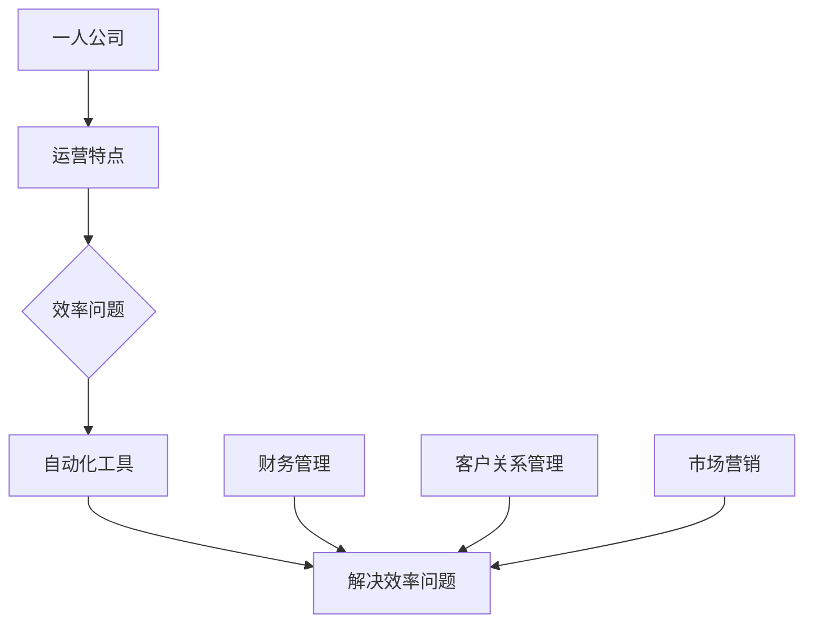

                 

### 第一部分：核心概念与联系

#### 核心概念
一人公司，也称为个体经营，是指由单一个体所有并运营的公司。这种类型的公司通常规模较小，由一个或少数几个人管理，具有灵活性高、决策速度快等优点。

自动化工具，是指能够自动执行特定任务的软件或硬件系统。这些工具可以用于简化重复性工作、提高生产效率、减少人力成本等。

#### 概念联系
一人公司的运营特点决定了其对自动化工具的需求。由于公司规模较小，运营成本较高，因此需要通过自动化工具来提高工作效率，降低运营成本。

一人公司的运营特点如下：

1. **灵活的运营模式**：一人公司通常不需要经过繁琐的决策流程，决策速度快，能够迅速响应市场变化。
2. **人力资源有限**：由于公司规模较小，人力资源相对有限，需要充分利用自动化工具来提高工作效率。
3. **业务流程复杂**：尽管公司规模较小，但业务流程可能较为复杂，需要通过自动化工具来简化流程。

自动化工具如何解决一人公司的效率问题：

1. **财务管理自动化**：通过自动化工具，一人公司可以自动处理财务报表、账单、发票等，减少手工处理的时间和错误率。
2. **客户关系管理自动化**：自动化工具可以帮助一人公司自动处理客户咨询、投诉、订单等，提高客户满意度。
3. **市场营销自动化**：通过自动化工具，一人公司可以自动发送营销邮件、生成报表、分析市场数据等，提高市场营销效果。

#### Mermaid 流程图

### 摘要

本文详细介绍了如何利用自动化工具提高一人公司的运营效率。首先，我们定义了“一人公司”和“自动化工具”这两个核心概念，并阐述了它们之间的联系。接着，我们分析了一人公司的运营特点，并探讨了自动化工具如何帮助一人公司解决效率问题。文章还涉及了自动化工具在不同业务场景中的应用，并通过实际项目实战展示了自动化工具的实施过程。最后，文章对自动化工具的未来趋势和挑战进行了展望，为读者提供了有益的参考。通过本文的阅读，读者将能够全面了解自动化工具在提升一人公司工作效率方面的作用，并掌握相关应用技巧。

---

**文章关键词：** 一人公司、自动化工具、运营效率、财务管理、客户关系管理、市场营销。

---

**文章摘要：**

本文旨在探讨如何通过自动化工具提高一人公司的运营效率。文章首先介绍了“一人公司”和“自动化工具”的基本概念，并阐述了二者之间的联系。接着，分析了一人公司的运营特点，指出自动化工具在解决效率问题方面的优势。文章详细讨论了自动化工具在财务管理、客户关系管理和市场营销等业务场景中的应用，并通过实际项目实战展示了自动化工具的具体实施过程。最后，文章对自动化工具的未来趋势和挑战进行了展望，为读者提供了有益的参考。本文适合对一人公司运营和自动化工具感兴趣的企业家、创业者及IT专业人士阅读。

---

接下来，我们将进入第二部分，深入探讨自动化工具的基本概念与分类，以及它们在解决效率问题中的具体应用。

