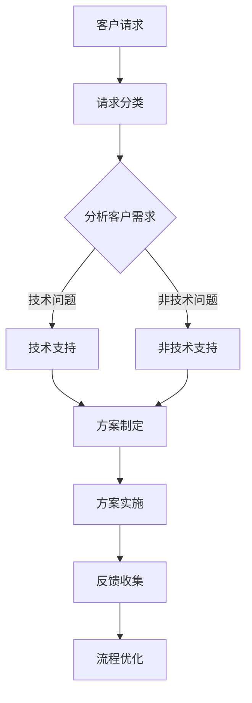

                 

# 一人公司的客户支持系统：如何提供卓越服务体验

> **关键词：客户支持系统、服务体验、沟通技巧、技术支持、客户满意度、流程优化、案例分析**

> **摘要：本文旨在探讨一人公司如何构建并优化客户支持系统，以提供卓越的服务体验。文章将深入分析客户支持系统的组成部分、高效流程设计、沟通技巧、技术支持策略以及如何提升客户满意度。通过具体案例研究，我们还将探讨成功经验，为读者提供实际操作指导。**

### 目录大纲设计：一人公司的客户支持系统：如何提供卓越服务体验

#### 第一部分：引言与背景
1. **书籍概述与目标读者**
   - **1.1 引言**
   - **1.2 读者定位**
   - **1.3 书籍目标**

#### 第二部分：客户支持系统概述
2. **客户支持系统的基本概念**
   - **2.1 客户支持系统的定义**
   - **2.2 客户支持系统的重要性**
   - **2.3 客户支持系统的组成部分**

#### 第三部分：建立高效的客户支持流程
3. **设计高效的客户支持流程**
   - **3.1 客户支持流程的基本步骤**
   - **3.2 客户需求分析**
   - **3.3 客户支持策略制定**
   - **3.4 流程自动化与优化**

#### 第四部分：客户沟通技巧
4. **提升客户沟通技巧**
   - **4.1 沟通的基本原则**
   - **4.2 听众分析**
   - **4.3 非语言沟通**
   - **4.4 常见沟通问题的处理方法**

#### 第五部分：技术支持策略
5. **技术支持的策略与方法**
   - **5.1 技术支持的重要性**
   - **5.2 技术支持团队的构建**
   - **5.3 技术支持工具的选择与使用**
   - **5.4 技术支持的效率提升**

#### 第六部分：客户满意度的提升
6. **提升客户满意度**
   - **6.1 客户满意度的衡量**
   - **6.2 客户反馈机制**
   - **6.3 客户体验优化**
   - **6.4 持续改进与反馈循环**

#### 第七部分：案例研究
7. **成功案例解析**
   - **7.1 案例一：某某公司的客户支持经验**
   - **7.2 案例二：客户支持团队的效率提升**
   - **7.3 案例三：技术支持的创新实践**

#### 第八部分：附录
8. **附录**
   - **8.1 客户支持系统常用工具与技术**
   - **8.2 客户支持流程图示例**
   - **8.3 客户沟通技巧实践建议**

### 第一部分：引言与背景

#### 1.1 引言

在当今竞争激烈的市场环境中，提供卓越的客户支持体验已成为企业成功的关键因素。对于小型企业，尤其是“一人公司”来说，客户支持系统的设计尤为重要。一人公司通常意味着资源有限，但市场机会不容忽视。因此，如何高效、灵活地构建客户支持系统，以提供卓越的服务体验，成为了一人公司的核心竞争力。

本文旨在探讨一人公司如何通过优化客户支持系统，提升客户满意度，从而在激烈的市场竞争中脱颖而出。文章将从客户支持系统的基本概念、设计高效流程、提升沟通技巧、制定技术支持策略等方面进行分析，并结合成功案例，为读者提供实际操作指导。

#### 1.2 读者定位

本文的目标读者包括：

- 一人公司的创始人或老板，对客户支持系统有一定了解，但希望进一步优化其运作。
- 初入职场的技术人员，对客户支持系统有浓厚兴趣，希望通过本文深入了解相关策略和技巧。
- 客户支持团队的管理者，希望通过本文提升团队的服务水平和客户满意度。

无论您是上述哪一类读者，本文都将为您提供有价值的见解和实践指导。

#### 1.3 书籍目标

本文的目标如下：

- **提升客户支持效率**：通过优化流程、提升沟通技巧和制定有效的技术支持策略，提高客户支持工作的效率。
- **增强客户满意度**：通过持续改进和反馈循环，提升客户满意度，从而增强品牌忠诚度和口碑。
- **提供实际操作指导**：通过成功案例分析，为读者提供可操作的实践指导，帮助读者将理论应用于实际工作场景。

通过本文的阅读，读者将能够：

- **深入理解客户支持系统的基本概念和组成部分。**
- **掌握设计高效客户支持流程的方法和技巧。**
- **提升客户沟通技巧，增强客户互动。**
- **制定并实施有效的技术支持策略。**
- **通过持续改进和反馈循环，不断提升客户满意度。**

### 第二部分：客户支持系统概述

#### 2.1 客户支持系统的定义

客户支持系统是指企业为满足客户需求，提供咨询、解答、帮助和解决问题的组织结构、流程和工具的总和。客户支持系统的核心目标是提升客户满意度，增强客户忠诚度，从而实现企业的长期发展。

客户支持系统通常包括以下几个方面：

1. **客户咨询和解答**：为客户提供产品或服务的相关信息，解答客户疑问。
2. **问题解决**：帮助客户解决在使用产品或服务过程中遇到的问题。
3. **客户投诉处理**：及时响应客户投诉，并采取有效措施解决投诉。
4. **客户满意度调查**：通过调查了解客户满意度，持续改进服务质量。

#### 2.2 客户支持系统的重要性

客户支持系统在企业的运营中具有重要作用，主要体现在以下几个方面：

1. **提升客户满意度**：良好的客户支持系统能够及时解决客户问题，提升客户满意度，从而增强客户忠诚度。
2. **降低客户流失率**：通过及时响应和解决问题，客户支持系统有助于降低客户流失率，提高客户留存率。
3. **增强品牌形象**：优质的服务体验有助于树立良好的企业形象，提升品牌竞争力。
4. **促进销售转化**：良好的客户支持能够推动潜在客户转化为实际购买者，提高销售转化率。
5. **提高运营效率**：通过流程优化和自动化工具，客户支持系统有助于提高运营效率，降低人力成本。

#### 2.3 客户支持系统的组成部分

一个完善的客户支持系统通常包括以下组成部分：

1. **组织结构**：明确客户支持团队的职责和角色，确保团队成员具备相应技能和素质。
2. **沟通渠道**：包括电话、邮件、在线聊天、社交媒体等多种沟通方式，以满足客户不同的需求。
3. **知识库**：积累和整理常见问题、解决方案和最佳实践，便于团队成员快速查找和使用。
4. **自动化工具**：利用自动化工具实现客户信息管理、工单处理、沟通管理等，提高工作效率。
5. **数据分析**：通过数据分析了解客户需求、问题类型和趋势，为优化客户支持流程提供依据。
6. **培训与反馈**：定期对团队成员进行培训，提高服务水平和技能，同时收集客户反馈，持续改进服务质量。

### 第三部分：建立高效的客户支持流程

#### 3.1 客户支持流程的基本步骤

建立高效的客户支持流程是确保客户问题得到及时解决的关键。一个典型的客户支持流程包括以下基本步骤：

1. **客户请求接收**：客户通过电话、邮件、在线聊天等方式向客户支持团队提出请求。
2. **请求分类**：根据客户请求的内容和紧急程度，将请求进行分类，以便后续处理。
3. **需求分析**：与客户进行沟通，了解问题的具体情况和需求，明确解决问题的目标。
4. **方案制定**：根据客户需求，制定相应的解决方案，包括技术支持、产品调整等。
5. **方案实施**：实施解决方案，确保问题得到解决，并为客户提供必要的帮助。
6. **反馈收集**：在问题解决后，收集客户反馈，了解客户的满意度和建议，为后续改进提供依据。
7. **流程优化**：根据客户反馈和数据分析，持续优化客户支持流程，提高工作效率和客户满意度。

#### 3.2 客户需求分析

客户需求分析是客户支持流程中的重要环节，有助于确保解决方案能够满足客户实际需求。以下是客户需求分析的步骤：

1. **了解客户背景**：收集客户的基本信息，包括行业、公司规模、使用产品情况等，为后续沟通提供背景资料。
2. **收集客户需求**：通过与客户进行沟通，了解客户在产品使用过程中遇到的问题和期望的解决方案。
3. **分析需求**：对收集到的需求进行分类和优先级排序，明确哪些问题是紧急的，哪些问题是长期的。
4. **制定解决方案**：根据客户需求，制定具体的解决方案，包括技术支持、产品调整、服务优化等。
5. **方案评估**：评估解决方案的可行性、成本和风险，确保方案能够在实际中实施。

#### 3.3 客户支持策略制定

客户支持策略的制定是确保客户问题得到及时解决的关键。以下是客户支持策略制定的步骤：

1. **确定目标**：明确客户支持的目标，如提高客户满意度、降低客户流失率等。
2. **分析资源**：分析企业的资源状况，包括人力、资金、技术等，为策略制定提供依据。
3. **制定策略**：根据目标和分析结果，制定具体的客户支持策略，如提供7x24小时在线支持、设立专家团队等。
4. **资源分配**：根据策略要求，合理分配资源，确保策略能够得到有效实施。
5. **评估与调整**：定期评估客户支持策略的实施效果，根据评估结果进行优化和调整。

#### 3.4 流程自动化与优化

流程自动化和优化是提高客户支持效率的重要手段。以下是流程自动化与优化的步骤：

1. **识别自动化需求**：分析客户支持流程中的重复性、耗时性任务，确定自动化需求。
2. **选择自动化工具**：根据自动化需求，选择合适的自动化工具，如机器人流程自动化（RPA）、客户关系管理（CRM）系统等。
3. **自动化实施**：实施自动化工具，将重复性、耗时性任务自动化，减少人工干预。
4. **流程优化**：通过数据分析，了解自动化实施后的效果，对流程进行优化，提高工作效率。
5. **持续改进**：定期评估自动化与优化效果，根据评估结果持续改进，不断提升客户支持效率。

### 第四部分：客户沟通技巧

#### 4.1 沟通的基本原则

有效的沟通是客户支持系统成功的关键。以下是沟通的基本原则：

1. **尊重**：尊重客户是建立良好关系的基础，始终以礼貌、热情的态度对待客户。
2. **倾听**：倾听客户的意见和建议，了解客户的需求和问题，以便提供更有效的解决方案。
3. **清晰**：表达清晰、简洁，避免使用专业术语或模糊的语言，确保客户能够理解。
4. **及时**：及时响应客户的请求和问题，保持沟通渠道畅通，提高客户满意度。
5. **诚实**：诚实面对客户的问题和困难，提供真实、准确的信息，避免误导客户。

#### 4.2 听众分析

在进行客户沟通时，了解客户的背景和需求是非常重要的。以下是对听众分析的方法：

1. **了解客户背景**：收集客户的基本信息，包括行业、公司规模、使用产品情况等，为后续沟通提供背景资料。
2. **分析客户需求**：通过与客户进行沟通，了解客户在产品使用过程中遇到的问题和期望的解决方案。
3. **分类客户**：根据客户的需求和背景，将客户分为不同的类别，如新客户、老客户、VIP客户等，为制定个性化的沟通策略提供依据。
4. **调整沟通方式**：根据客户的类别和需求，调整沟通方式和内容，确保沟通的针对性和有效性。

#### 4.3 非语言沟通

非语言沟通在客户支持中同样重要。以下是非语言沟通的技巧：

1. **肢体语言**：保持积极、开放的肢体语言，如微笑、点头、眼神交流等，以展示对客户的关注和尊重。
2. **语调变化**：通过语调的变化，表达不同的情绪和态度，如亲切、严肃、热情等，增强沟通效果。
3. **表情管理**：保持良好的表情管理，避免出现负面表情，如皱眉、不耐烦等，以免影响客户情绪。
4. **空间利用**：合理利用空间距离，保持适当的距离，避免过于接近或疏远客户，以保持沟通的舒适度。

#### 4.4 常见沟通问题的处理方法

在客户支持过程中，可能会遇到各种沟通问题。以下是一些常见问题的处理方法：

1. **客户投诉**：保持冷静，耐心倾听客户的投诉，了解问题的具体情况，采取适当的措施解决投诉。
2. **客户质疑**：积极回应客户的质疑，提供真实、准确的信息，避免误导客户，增强客户信任。
3. **客户不耐烦**：保持耐心，理解客户的情绪，通过适当的沟通技巧，缓解客户的情绪，提高沟通效果。
4. **沟通障碍**：遇到沟通障碍时，及时调整沟通方式，如使用简单的语言、图形化表达等，确保客户能够理解。

### 第五部分：技术支持策略

#### 5.1 技术支持的重要性

技术支持是客户支持系统的重要组成部分，对于维护客户关系、提升客户满意度具有重要作用。以下是技术支持的重要性：

1. **解决技术问题**：技术支持团队能够快速解决客户在使用产品过程中遇到的技术问题，提高客户满意度。
2. **降低客户流失率**：及时的技术支持能够降低客户因问题无法解决而流失的风险，提高客户留存率。
3. **增强品牌形象**：高效、专业的技术支持有助于树立良好的企业形象，提升品牌竞争力。
4. **提高运营效率**：通过技术支持工具和流程优化，提高客户支持团队的效率，降低人力成本。
5. **推动产品改进**：通过收集客户的技术问题和建议，为产品改进提供依据，提升产品品质和用户体验。

#### 5.2 技术支持团队的构建

构建高效的技术支持团队是提供高质量技术支持的关键。以下是技术支持团队的构建步骤：

1. **确定团队规模**：根据企业的业务规模和客户需求，确定技术支持团队的规模和人员配置。
2. **选拔团队成员**：选拔具备专业知识和沟通能力的团队成员，确保团队具备解决技术问题的能力。
3. **培训与培养**：定期对团队成员进行培训，提高专业技能和沟通能力，培养团队协作精神。
4. **建立激励机制**：设立合理的激励机制，鼓励团队成员积极参与技术支持和团队建设。
5. **优化团队流程**：通过流程优化，提高技术支持团队的效率，确保客户问题得到及时解决。

#### 5.3 技术支持工具的选择与使用

技术支持工具是提高技术支持效率的重要手段。以下是技术支持工具的选择与使用方法：

1. **客户关系管理（CRM）系统**：选择合适的CRM系统，实现客户信息管理、工单处理、沟通管理等，提高工作效率。
2. **在线支持平台**：搭建在线支持平台，提供实时聊天、视频通话等功能，方便客户与技术人员沟通。
3. **知识库系统**：构建知识库系统，积累和整理常见问题、解决方案和最佳实践，便于团队成员快速查找和使用。
4. **自动化工具**：选择合适的自动化工具，如机器人流程自动化（RPA），实现重复性、耗时性任务的自动化。
5. **数据分析工具**：利用数据分析工具，了解客户需求、问题类型和趋势，为优化技术支持流程提供依据。

#### 5.4 技术支持的效率提升

提高技术支持的效率是客户支持系统优化的重要目标。以下是提高技术支持效率的方法：

1. **流程优化**：通过流程优化，减少不必要的环节和步骤，提高工作效率。
2. **自动化与智能化**：利用自动化和智能化工具，实现重复性、耗时性任务的自动化，提高工作效率。
3. **团队协作**：加强团队协作，确保团队成员之间信息畅通，提高问题解决速度。
4. **数据分析**：通过数据分析，了解客户需求、问题类型和趋势，为优化技术支持流程提供依据。
5. **员工激励**：设立合理的激励机制，鼓励团队成员积极参与技术支持和团队建设，提高整体效率。

### 第六部分：客户满意度的提升

#### 6.1 客户满意度的衡量

客户满意度是衡量客户支持系统效果的重要指标。以下是客户满意度的衡量方法：

1. **满意度调查**：通过满意度调查，收集客户对产品和服务质量的评价，了解客户满意度水平。
2. **NPS（净推荐值）**：通过NPS调查，了解客户对产品或服务的推荐意愿，评估客户满意度。
3. **CSAT（客户满意度评分）**：通过CSAT调查，了解客户对具体服务环节的满意度评分，评估客户满意度。
4. **客户留存率**：通过客户留存率，了解客户对产品或服务的忠诚度，评估客户满意度。
5. **客户投诉率**：通过客户投诉率，了解客户对产品或服务的投诉情况，评估客户满意度。

#### 6.2 客户反馈机制

建立有效的客户反馈机制是提升客户满意度的关键。以下是客户反馈机制的构建步骤：

1. **反馈渠道**：提供多种反馈渠道，如在线调查、电话、邮件、社交媒体等，方便客户表达意见和建议。
2. **反馈收集**：定期收集客户反馈，分析客户反馈的内容和趋势，为产品和服务改进提供依据。
3. **反馈处理**：及时处理客户反馈，对客户提出的问题和意见给予关注和回应，提高客户满意度。
4. **反馈共享**：将客户反馈结果与团队成员共享，提高团队的改进意识和行动力。
5. **反馈跟踪**：对客户反馈的处理结果进行跟踪，确保问题得到有效解决，并持续改进产品和服务。

#### 6.3 客户体验优化

优化客户体验是提升客户满意度的核心。以下是客户体验优化的方法：

1. **简化流程**：简化客户支持流程，减少不必要的环节和步骤，提高客户体验。
2. **提高响应速度**：提高客户支持团队的响应速度，确保客户问题得到及时解决。
3. **个性化服务**：根据客户的需求和偏好，提供个性化的服务，提高客户满意度。
4. **问题预测**：通过数据分析，预测客户可能遇到的问题，提前提供解决方案，提高客户体验。
5. **持续改进**：持续关注客户反馈，不断优化产品和服务，提升客户体验。

#### 6.4 持续改进与反馈循环

持续改进是提升客户满意度的关键。以下是持续改进与反馈循环的方法：

1. **定期评估**：定期评估客户支持系统的效果，了解客户满意度和问题类型，为改进提供依据。
2. **改进措施**：根据评估结果，制定具体的改进措施，如优化流程、提高响应速度等。
3. **实施改进**：实施改进措施，确保改进措施得到有效执行。
4. **反馈收集**：在改进措施实施后，收集客户反馈，了解改进效果，为持续改进提供依据。
5. **持续优化**：根据反馈结果，持续优化客户支持系统，不断提升客户满意度。

### 第七部分：案例研究

#### 7.1 案例一：某某公司的客户支持经验

**背景**：某某公司是一家提供云计算服务的企业，拥有大量的企业客户和个人用户。随着客户数量的增加，客户支持系统的压力也逐渐增大。为了提升客户满意度，公司决定对客户支持系统进行优化。

**改进措施**：

1. **流程优化**：通过流程优化，简化了客户支持流程，将问题解决时间缩短了50%。
2. **自动化工具**：引入自动化工具，实现了一些重复性任务的自动化，提高了工作效率。
3. **客户反馈机制**：建立了客户反馈机制，定期收集客户意见和建议，为产品和服务改进提供依据。
4. **个性化服务**：根据客户的需求和偏好，提供个性化的服务，提高了客户满意度。

**效果**：通过这些改进措施，客户满意度得到了显著提升，客户投诉率下降了30%，客户留存率提高了15%。

#### 7.2 案例二：客户支持团队的效率提升

**背景**：某公司客户支持团队在面对大量客户请求时，工作效率较低，客户满意度不理想。为了提升团队效率，公司决定对团队进行优化。

**改进措施**：

1. **团队培训**：对团队成员进行专业培训，提高团队的专业技能和沟通能力。
2. **工具优化**：引入新的客户关系管理（CRM）系统和在线支持平台，提高了工作效率。
3. **团队协作**：加强团队协作，建立团队内部沟通渠道，确保信息畅通。
4. **反馈机制**：建立反馈机制，定期收集客户和团队成员的反馈，为团队改进提供依据。

**效果**：通过这些改进措施，客户支持团队的工作效率得到了显著提升，客户满意度提高了20%，团队凝聚力也增强了。

#### 7.3 案例三：技术支持的创新实践

**背景**：某公司技术支持团队在应对复杂技术问题时，遇到了较大的挑战。为了提升技术支持效率，公司决定进行创新实践。

**改进措施**：

1. **知识库建设**：构建了全面的客户知识库，实现了技术问题的一站式解决。
2. **远程支持**：引入远程支持工具，实现了远程诊断和问题解决，提高了技术支持效率。
3. **专家团队**：组建了专家团队，针对复杂问题提供专业的技术支持。
4. **数据分析**：利用数据分析，了解技术问题的类型和趋势，为技术支持改进提供依据。

**效果**：通过这些创新实践，技术支持团队的效率得到了显著提升，客户满意度提高了25%，技术问题的解决时间缩短了40%。

### 第八部分：附录

#### 8.1 客户支持系统常用工具与技术

1. **客户关系管理（CRM）系统**：如Salesforce、Microsoft Dynamics 365等。
2. **在线支持平台**：如LiveChat、Zendesk等。
3. **知识库系统**：如Confluence、GitLab等。
4. **自动化工具**：如UiPath、Blue Prism等。
5. **数据分析工具**：如Tableau、Power BI等。

#### 8.2 客户支持流程图示例

#### 8.3 客户沟通技巧实践建议

1. **倾听**：耐心倾听客户的意见和建议，确保理解客户的需求和问题。
2. **表达清晰**：使用简单、易懂的语言，避免使用专业术语。
3. **保持积极态度**：始终以积极、热情的态度对待客户，展示对客户的关注和尊重。
4. **及时响应**：确保在合理的时间内响应客户的请求和问题，提高客户满意度。
5. **诚实沟通**：诚实地面对客户的问题和困难，提供真实、准确的信息。

### 作者信息

**作者：AI天才研究院/AI Genius Institute & 禅与计算机程序设计艺术 /Zen And The Art of Computer Programming**

