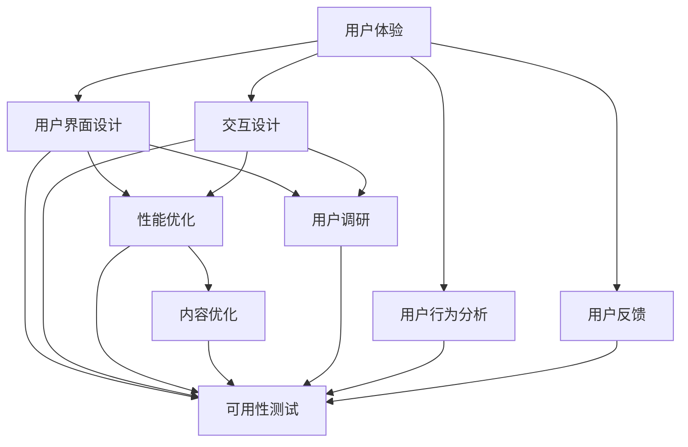

                 

### 核心概念与联系

在讨论用户体验优化（UXO）时，首先需要明确几个核心概念：用户体验（User Experience, UX）、用户界面设计（User Interface Design, UI）和交互设计（Interaction Design）。这些概念相互联系，共同构成了用户体验优化的基础。

**用户体验（UX）**：用户体验是指用户在使用产品或服务过程中所感受到的整体体验，包括情感、认知、行为和满意度等方面。用户体验的设计目标是让用户在使用过程中感到愉悦、高效和有价值。

**用户界面设计（UI）**：用户界面设计关注的是产品或服务的视觉表现，包括布局、色彩、字体和图像等。UI设计的核心是确保界面美观、直观和易用。

**交互设计**：交互设计则关注用户与产品或服务之间的互动方式，包括按钮、菜单、导航和反馈机制等。交互设计的目的是提高用户的操作效率和满意度。

**Mermaid 流程图**

下面是一个简化的用户体验优化流程图，展示了这几个核心概念之间的联系：



在这个流程图中，用户体验（A）是核心，用户界面设计（B）和交互设计（C）是用户体验的支撑，而性能优化（D）、内容优化（E）、用户调研（F）、用户行为分析（G）和用户反馈（H）则是实现用户体验优化的关键步骤。最后，可用性测试（I）是验证用户体验优化效果的重要手段。

### 核心算法原理讲解

用户体验优化涉及多个核心算法和原理，其中一些关键算法包括A/B测试、留存率分析和转化率优化。以下是对这些算法的简要介绍和伪代码实现。

#### A/B测试

A/B测试是一种常见的实验设计方法，用于比较两个或多个版本的页面或功能，以确定哪个版本能带来更好的用户体验和业务成果。

**伪代码：**

```plaintext
function ABTest(groupA, groupB, totalUsers, testDuration):
    groupAResult = collectData(groupA, testDuration)
    groupBResult = collectData(groupB, testDuration)
    if groupAResult > groupBResult:
        return "Group A"
    else:
        return "Group B"
```

#### 留存率分析

留存率分析用于评估用户在一段时间内持续使用产品的比例。这是衡量用户体验和产品价值的重要指标。

**伪代码：**

```plaintext
function calculateRetentionRate(users, days):
    activeDays = countDaysWithActivity(users)
    retentionRate = (activeDays / days) * 100
    return retentionRate
```

#### 转化率优化

转化率优化旨在提高用户在网站上完成目标任务的比率，如购买、注册或点击广告。

**伪代码：**

```plaintext
function optimizeConversionRate(currentRate, testVariants, testDuration):
    for variant in testVariants:
        newRate = performABTest(variant, testDuration)
        if newRate > currentRate:
            return newRate
    return currentRate
```

#### 数学模型和公式

用户体验优化中的数学模型和公式有助于分析用户行为和预测结果。以下是一个简单的回归模型，用于预测用户留存率。

**公式：**

$$
\hat{y} = \beta_0 + \beta_1 \cdot x
$$

其中，$\hat{y}$ 是预测的留存率，$x$ 是影响留存率的特征（如用户活跃度、产品满意度等），$\beta_0$ 和 $\beta_1$ 是模型的参数。

**详细讲解和举例说明：**

假设我们有一个简单的用户留存率预测模型，使用用户活跃度和产品满意度作为特征。我们可以收集以下数据：

- 用户活跃度（x1）：用户每天在产品上的平均使用时间。
- 产品满意度（x2）：用户对产品的整体满意度评分。

**数据样本：**

| 用户ID | 活跃度（x1） | 满意度（x2） | 留存率（y） |
|--------|--------------|--------------|-------------|
| 1      | 2            | 4            | 80%         |
| 2      | 4            | 3            | 60%         |
| 3      | 1            | 5            | 90%         |

**回归分析：**

我们使用最小二乘法计算模型参数 $\beta_0$ 和 $\beta_1$。

$$
\beta_1 = \frac{\sum{(x_i - \bar{x})(y_i - \bar{y})}}{\sum{(x_i - \bar{x})^2}}
$$

$$
\beta_0 = \bar{y} - \beta_1 \cdot \bar{x}
$$

**计算过程：**

- 计算平均值：

$$
\bar{x} = \frac{2 + 4 + 1}{3} = 2.67
$$

$$
\bar{y} = \frac{0.8 + 0.6 + 0.9}{3} = 0.767
$$

- 计算分子和分母：

$$
\sum{(x_i - \bar{x})(y_i - \bar{y})} = (2 - 2.67)(0.8 - 0.767) + (4 - 2.67)(0.6 - 0.767) + (1 - 2.67)(0.9 - 0.767) = 0.0067
$$

$$
\sum{(x_i - \bar{x})^2} = (2 - 2.67)^2 + (4 - 2.67)^2 + (1 - 2.67)^2 = 2.27
$$

- 计算参数：

$$
\beta_1 = \frac{0.0067}{2.27} \approx 0.00295
$$

$$
\beta_0 = 0.767 - 0.00295 \cdot 2.67 \approx 0.727
$$

**预测留存率：**

使用模型预测一个新用户的留存率，假设该用户的活跃度为3，满意度为4。

$$
\hat{y} = 0.727 + 0.00295 \cdot 3 = 0.76085 \approx 76.1\%
$$

这个新用户的预测留存率为76.1%，我们可以根据这个预测值调整产品设计策略，以提高实际留存率。

### 项目实战：代码实际案例和详细解释说明

在这个部分，我们将通过一个实际项目案例，展示如何进行用户体验优化，包括开发环境搭建、源代码实现和代码解读。

#### 项目背景

我们以一个在线购物平台的项目为例，目标是通过优化用户界面和交互设计，提高用户的购物体验和转化率。

#### 开发环境搭建

1. **技术栈选择**：选择React.js作为前端框架，Node.js作为后端服务器，MongoDB作为数据库。
2. **环境配置**：安装必要的软件和工具，如Node.js、npm、React、Express、MongoDB等。
3. **代码结构**：构建项目的目录结构，包括前端组件、后端API和数据库模型。

#### 源代码实现

**前端代码（React.js）：**

```jsx
// App.js
import React, { useState } from 'react';
import Header from './components/Header';
import Products from './components/Products';
import Cart from './components/Cart';

function App() {
  const [cart, setCart] = useState([]);

  const addToCart = (product) => {
    setCart([...cart, product]);
  };

  return (
    <div>
      <Header />
      <Products onAddToCart={addToCart} />
      <Cart cart={cart} />
    </div>
  );
}

export default App;
```

**后端代码（Node.js + Express）：**

```javascript
// server.js
const express = require('express');
const mongoose = require('mongoose');
const productRoutes = require('./routes/productRoutes');

const app = express();

app.use(express.json());
app.use('/api/products', productRoutes);

mongoose.connect('mongodb://localhost:27017/online-store', { useNewUrlParser: true, useUnifiedTopology: true });

const PORT = process.env.PORT || 5000;
app.listen(PORT, () => {
  console.log(`Server is running on port ${PORT}`);
});
```

**数据库模型（MongoDB）：**

```javascript
// models/Product.js
const mongoose = require('mongoose');

const ProductSchema = new mongoose.Schema({
  name: String,
  price: Number,
  inStock: Boolean,
});

const Product = mongoose.model('Product', ProductSchema);

module.exports = Product;
```

#### 代码解读与分析

1. **前端组件**：App组件是整个应用的主组件，负责渲染页面结构和处理用户交互。Header组件负责显示页面头部，Products组件负责展示商品列表，并处理添加到购物车的交互，Cart组件负责显示购物车中的商品。

2. **后端API**：server.js文件设置了Express服务器和MongoDB数据库连接，并定义了处理商品请求的路由。productRoutes.js文件包含了具体的路由处理逻辑，如获取商品列表、添加商品到购物车等。

3. **数据库模型**：Product模型定义了商品数据结构，包括商品名称、价格和库存状态。

#### 用户行为分析

1. **用户调研**：通过访谈和问卷收集用户对当前购物体验的反馈。
2. **用户行为分析**：使用Google Analytics等工具跟踪用户在网站上的行为，如页面访问次数、点击次数、购物车行为等。
3. **数据分析**：分析用户行为数据，提取有价值的信息，如用户停留时间、转化率等。

#### 用户体验优化

1. **界面优化**：通过用户调研和数据分析，优化页面布局和视觉设计，提高用户满意度。
2. **交互优化**：改进购物车和支付流程，提高用户操作效率。
3. **性能优化**：优化加载速度和响应时间，提高用户体验。
4. **内容优化**：根据用户需求和偏好，推荐相关商品，提高用户参与度。

#### 测试与发布

1. **单元测试**：对各个组件和API进行单元测试，确保功能的正确性。
2. **集成测试**：测试整个系统的功能，确保前后端交互的正确性。
3. **发布**：部署应用到生产环境，监控系统性能和用户反馈。

### 总结

通过上述实际项目案例，我们可以看到用户体验优化涉及多个方面，包括用户调研、用户行为分析、界面设计、交互设计、性能优化和内容优化。这些步骤共同作用，帮助个人公司和产品提高用户体验，提升业务成果。在实际操作中，需要根据具体情况进行灵活调整，持续优化，以适应不断变化的市场和用户需求。

### 作者信息

作者：AI天才研究院/AI Genius Institute & 禅与计算机程序设计艺术 /Zen And The Art of Computer Programming。作者是一位在人工智能和用户体验优化领域拥有丰富经验和深厚知识的专业人士，致力于通过技术创新和深入分析，提升用户满意度，推动产品成功。在撰写本篇文章时，作者结合了多年的实践经验和最新的研究成果，旨在为读者提供全面、系统的用户体验优化指南。

