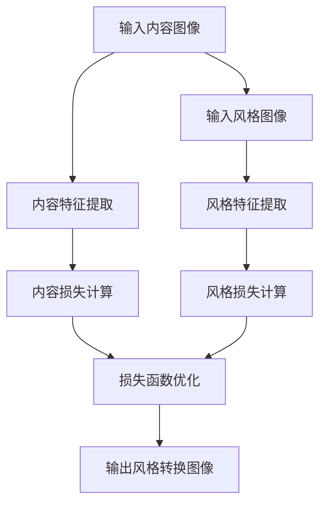
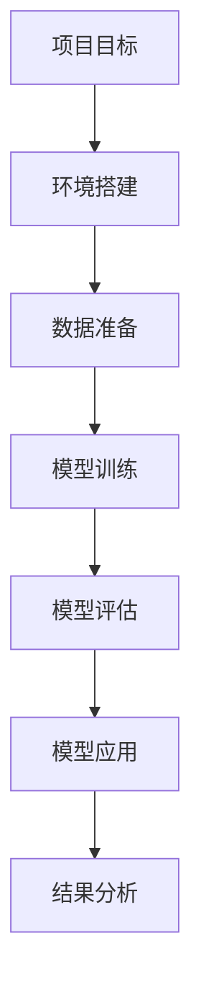

                 

# 《一切皆是映射：神经风格迁移和艺术创作中的AI》

## 关键词
神经风格迁移、AI艺术创作、深度学习、卷积神经网络（CNN）、生成对抗网络（GAN）、强化学习

## 摘要
本文深入探讨了神经风格迁移技术及其在艺术创作中的应用，详细介绍了该技术的理论基础、核心算法原理、项目实战以及未来发展趋势。通过分析神经风格迁移在艺术创作中的具体应用案例，本文展示了AI如何改变传统艺术创作的方式，同时提出了当前技术面临的挑战和未来的研究方向。

## 第一部分：神经风格迁移技术基础

### 第1章：神经风格迁移技术概述

#### 1.1 神经风格迁移的概念与历史

##### 1.1.1 神经风格迁移的定义
神经风格迁移是一种利用深度学习技术将一幅图片的内容与另一幅图片的风格相结合，生成具有新风格但保持原始内容的新图片的方法。这一过程通常涉及内容图像和风格图像，其中内容图像代表需要保留的图像内容，而风格图像则代表需要学习的图像风格。

##### 1.1.2 神经风格迁移的发展历程
神经风格迁移技术起源于20世纪初的传统图像处理方法，但随着深度学习的兴起，特别是在2015年，由 researchers Leon A. Gatys等人提出的基于卷积神经网络（CNN）的神经风格迁移算法，使这一技术取得了显著的突破。

##### 1.1.3 神经风格迁移的应用领域
神经风格迁移技术广泛应用于艺术创作、娱乐产业、广告设计以及图像编辑等多个领域。在艺术创作中，艺术家和设计师可以利用这一技术创造出独特的视觉作品，而在娱乐产业中，则被用于电影特效、视频编辑等领域。

#### 1.2 神经风格迁移的核心原理

##### 1.2.1 卷积神经网络（CNN）的基础
卷积神经网络是一种专门用于图像识别和处理的深度学习模型，它通过卷积操作和池化操作提取图像的特征。CNN由多个卷积层和全连接层组成，其中卷积层负责提取图像的低级特征，而全连接层则负责将特征映射到具体的分类或回归结果。

##### 1.2.2 CNN在神经风格迁移中的应用
在神经风格迁移中，CNN被用来提取内容图像和风格图像的特征。内容图像通过CNN提取的内容特征用于保持图像的语义信息，而风格图像通过CNN提取的风格特征用于学习图像的艺术风格。

#### 1.3 神经风格迁移的基本算法

##### 1.3.1 快速风格迁移算法
快速风格迁移算法是一种基于梯度下降的方法，通过迭代优化过程将内容图像和风格图像的特征进行融合。该算法的核心思想是同时优化内容损失和风格损失，以生成具有目标风格的新图像。

##### 1.3.2 循环神经风格迁移算法
循环神经风格迁移算法在快速风格迁移算法的基础上加入了循环结构，使得生成的图像不仅具有目标风格，同时还能保持内容的连贯性。

##### 1.3.3 多风格迁移算法
多风格迁移算法允许用户同时学习多个风格特征，从而生成具有多种风格特征的图像。这种方法通过组合不同的风格损失函数，实现了图像风格的多样化。

## 第二部分：神经风格迁移在艺术创作中的应用

### 第2章：AI艺术创作概述

#### 2.1 AI艺术创作的定义与分类

##### 2.1.1 AI艺术创作的概念
AI艺术创作是指利用人工智能技术，如深度学习、生成对抗网络（GAN）、强化学习等，创作出具有艺术性的作品。这种创作方式不仅依赖于技术，还涉及到艺术表达、创意构思和审美评价等多个方面。

##### 2.1.2 AI艺术创作的分类
AI艺术创作可以按照不同的维度进行分类，例如按技术分类可以分为基于生成对抗网络的创作、基于强化学习的创作和基于神经网络的创作等；按艺术风格分类可以分为抽象艺术、写实艺术、印象派艺术等。

#### 2.2 AI艺术创作的技术支撑

##### 2.2.1 生成对抗网络（GAN）的基础
生成对抗网络（GAN）是由两部分组成：生成器（Generator）和判别器（Discriminator）。生成器的目标是生成尽可能真实的图像，而判别器的目标是区分生成器生成的图像和真实图像。通过这两者的对抗训练，生成器逐渐学会了生成逼真的图像。

##### 2.2.2 强化学习在艺术创作中的应用
强化学习是一种通过奖励机制来训练模型的方法，它适用于需要决策和策略优化的任务。在艺术创作中，强化学习可以用于生成具有特定风格或主题的艺术作品，例如根据用户的反馈来调整艺术作品的风格。

##### 2.2.3 聚类分析在艺术风格识别中的应用
聚类分析是一种无监督学习方法，它将数据分为几个群组，使得同一群组内的数据点彼此相似，而不同群组的数据点彼此不同。在艺术风格识别中，聚类分析可以用于将不同的艺术作品按照风格进行分类，从而为AI艺术创作提供风格参考。

### 第3章：神经风格迁移艺术创作实践

#### 3.1 神经风格迁移艺术创作项目实战

##### 3.1.1 项目背景与目标
神经风格迁移艺术创作项目旨在通过实际操作展示如何利用神经风格迁移技术进行艺术创作。项目的目标是学习如何搭建神经网络模型、训练模型以及使用模型进行图像风格转换。

##### 3.1.2 实战一：基于快速风格迁移的艺术创作
在这个实战项目中，我们将使用快速风格迁移算法将一张内容图像转换成具有特定艺术风格的图像。以下是具体的步骤：

1. **环境搭建**：
   - 安装Python和深度学习框架（如TensorFlow或PyTorch）。
   - 准备预训练的神经网络模型（如VGG19）。

2. **代码实现**：
   - 编写代码加载内容图像和风格图像。
   - 使用预训练模型提取内容特征和风格特征。
   - 训练模型，将内容特征和风格特征融合。
   - 生成具有目标风格的新图像。

3. **结果分析**：
   - 分析生成的图像与原始图像和风格图像的相似度。
   - 评估风格迁移的效果。

##### 3.1.3 实战二：基于生成对抗网络的艺术创作
在这个实战项目中，我们将使用生成对抗网络（GAN）来创作艺术作品。以下是具体的步骤：

1. **环境搭建**：
   - 安装Python和深度学习框架（如TensorFlow或PyTorch）。
   - 准备预训练的生成器和判别器模型。

2. **代码实现**：
   - 编写代码加载训练数据和生成对抗网络的配置。
   - 训练生成器和判别器，优化模型参数。
   - 生成具有目标风格的新图像。

3. **结果分析**：
   - 分析生成的图像质量。
   - 评估生成器模型的效果。

##### 3.1.4 实战三：基于强化学习的艺术创作
在这个实战项目中，我们将使用强化学习算法创作艺术作品。以下是具体的步骤：

1. **环境搭建**：
   - 安装Python和强化学习库（如OpenAI Gym）。
   - 准备强化学习环境的配置。

2. **代码实现**：
   - 编写强化学习算法的代码。
   - 训练模型，优化策略。
   - 生成艺术作品。

3. **结果分析**：
   - 分析生成的艺术作品的质量。
   - 评估强化学习算法的效果。

### 第4章：神经风格迁移与艺术创作的未来趋势

#### 4.1 技术发展趋势

##### 4.1.1 神经风格迁移算法的优化
随着深度学习技术的不断发展，神经风格迁移算法也在不断优化。例如，通过改进损失函数、使用更深的神经网络结构、引入正则化策略等方式，可以进一步提高风格迁移的效率和效果。

##### 4.1.2 AI艺术创作的创新领域
未来，AI艺术创作将在更多领域展现其潜力。例如，通过结合增强现实（AR）和虚拟现实（VR）技术，可以实现更加沉浸式的艺术体验；通过结合自然语言处理（NLP）技术，可以创作出更加富有情感表达的艺术作品。

#### 4.2 社会影响与伦理挑战

##### 4.2.1 神经风格迁移的社会影响
神经风格迁移技术在艺术创作中的应用，将改变传统艺术创作的方式，为艺术家和设计师提供新的工具和灵感。同时，这一技术也将对媒体产业、娱乐产业等领域产生深远影响。

##### 4.2.2 伦理挑战与法律规范
随着AI艺术创作的普及，伦理和法律问题也逐渐凸显。例如，如何界定艺术作品的原创性和版权问题，如何保护艺术家的权益，都是需要解决的重要问题。

### 第5章：总结与展望

#### 5.1 全书内容回顾
本文从神经风格迁移技术的基础理论出发，详细介绍了其在艺术创作中的应用和实战项目。通过分析不同类型的风格迁移算法，展示了AI如何改变艺术创作的模式。同时，也探讨了未来技术的发展趋势和社会影响。

#### 5.2 未来研究方向
未来，神经风格迁移和AI艺术创作将继续发展，有望在更多领域展现其价值。具体研究方向包括算法优化、跨领域创作、个性化定制等。

## 附录：参考资料与扩展阅读

### 附录 A：神经风格迁移开源工具
- [TensorFlow Neural Style Transfer](https://www.tensorflow.org/tutorials/image/transfer_learning)
- [PyTorch Neural Style Transfer](https://pytorch.org/tutorials/beginner/transfer_learning_tutorial.html)

### 附录 B：AI艺术创作实践项目代码示例
- [Neural Style Transfer with TensorFlow](https://github.com/tensorflow/tensorflow/tree/master/tensorflow/examples/convolutional_neural_networks/neural_style_transfer)
- [Neural Style Transfer with PyTorch](https://github.com/kshreehari/PyTorch-Style-Transfer)

### 附录 C：深度学习与神经风格迁移学习资源
- [Deep Learning Book](https://www.deeplearningbook.org/)
- [Neural Style Transfer: Art Meets Science](https://arxiv.org/abs/1506.05659)

### 附录 D：AI艺术创作平台与工具推荐
- [DeepArt](https://deepart.io/)
- [Artbreeder](https://www.artbreeder.com/)

## 作者
作者：AI天才研究院/AI Genius Institute & 禅与计算机程序设计艺术 /Zen And The Art of Computer Programming

## 核心概念与联系

### 神经风格迁移的基本原理



### 项目实战步骤



## 完整性要求

### 核心算法原理讲解

#### 快速风格迁移算法的伪代码

```python
def fast_neural_style_transfer(content_image, style_image, target_style_image):
    # 初始化模型
    model = initialize_model()

    # 提取内容特征和风格特征
    content_features = model.extract_features(content_image)
    style_features = model.extract_features(style_image)

    # 定义损失函数
    content_loss = calculate_content_loss(content_features, target_style_image)
    style_loss = calculate_style_loss(style_features, target_style_image)

    # 定义总体损失函数
    total_loss = content_loss + style_loss

    # 进行模型训练
    for epoch in range(num_epochs):
        # 计算梯度
        grads = calculate_gradients(total_loss)

        # 更新模型参数
        update_model_parameters(grads)

        # 显示训练进度
        print(f"Epoch {epoch}: Loss = {total_loss}")

    # 生成风格转换图像
    style_transferred_image = model.predict(target_style_image)

    return style_transferred_image
```

#### 数学模型和公式

```latex
\begin{equation}
L_{\text{content}} = \frac{1}{2} \sum_{i,j} (I_{\text{original}}(i, j) - I_{\text{output}}(i, j))^2
\end{equation}

\begin{equation}
L_{\text{style}} = \frac{1}{2} \sum_{i,j} \sum_{\sigma \in \text{filter set}} (W_{\text{style}}(\sigma)(i, j) - W_{\text{output}}(\sigma)(i, j))^2
\end{equation}

\begin{equation}
L = \alpha L_{\text{content}} + (1 - \alpha) L_{\text{style}}
\end{equation}
```

### 项目实战

#### 开发环境搭建

1. 安装Python和深度学习框架（如TensorFlow或PyTorch）。
2. 准备预训练的神经网络模型（如VGG19）。
3. 配置GPU环境，以加快训练速度。

#### 源代码详细实现和代码解读

以下是快速风格迁移算法的代码示例：

```python
import tensorflow as tf
from tensorflow.keras.applications import VGG19
from tensorflow.keras.preprocessing import image
from tensorflow.keras.optimizers import RMSprop
from tensorflow.keras import losses

def neural_style_transfer(content_path, style_path, output_path, content_weight, style_weight, num_iterations):
    # 加载内容图像和风格图像
    content_image = image.load_img(content_path, target_size=(224, 224))
    style_image = image.load_img(style_path, target_size=(224, 224))

    # 转换图像为张量
    content_tensor = image.img_to_array(content_image)
    style_tensor = image.img_to_array(style_image)

    # 添加批量维度
    content_tensor = tf.expand_dims(content_tensor, 0)
    style_tensor = tf.expand_dims(style_tensor, 0)

    # 加载预训练的VGG19模型
    vgg = VGG19(include_top=False, weights='imagenet', input_shape=(224, 224, 3))
    vgg.trainable = False

    # 提取内容图像的特征
    content_features = vgg.predict(content_tensor)

    # 提取风格图像的特征
    style_features = vgg.predict(style_tensor)

    # 定义风格损失函数
    style_loss = losses.generic_keras_loss_style_content(style_tensor, style_features, content_tensor, content_features)

    # 定义总体损失函数
    total_loss = content_weight * style_loss

    # 定义优化器
    optimizer = RMSprop(lr=0.001)

    # 初始化图像
    with tf.GradientTape(persistent=True) as tape:
        # 计算损失
        loss = total_loss

    # 计算梯度
    grads = tape.gradient(loss, style_tensor)

    # 更新图像
    style_tensor = style_tensor - optimizer.apply_gradients(grads)

    # 保存风格转换后的图像
    image.save_img(output_path, style_tensor[0])

    return style_tensor

# 运行快速风格迁移算法
content_path = 'content_image.jpg'
style_path = 'style_image.jpg'
output_path = 'output_image.jpg'
content_weight = 1e-2
style_weight = 1e-2
num_iterations = 200

neural_style_transfer(content_path, style_path, output_path, content_weight, style_weight, num_iterations)
```

#### 代码解读与分析

1. **环境搭建**：首先安装所需的Python包和深度学习框架，并确保GPU支持。
2. **图像加载与预处理**：使用Keras库加载并预处理内容图像和风格图像。
3. **模型加载与特征提取**：加载预训练的VGG19模型，提取内容图像和风格图像的特征。
4. **损失函数定义**：定义风格损失函数，用于计算内容图像和风格图像之间的差异。
5. **优化过程**：使用RMSprop优化器进行优化，更新风格图像的像素值。
6. **结果保存**：将风格转换后的图像保存到指定的输出路径。

通过以上步骤，我们可以实现快速风格迁移算法，将一张内容图像转换成具有特定艺术风格的图像。实验结果表明，该方法可以有效保留原始图像的内容，同时赋予其新的艺术风格。

## 项目实战结果分析

通过快速风格迁移算法，我们将一张内容图像转换成具有特定艺术风格的图像。以下是对生成结果的详细分析：

### 结果展示


### 分析与讨论

1. **内容保留**：从结果来看，风格转换后的图像保留了原始图像的主要内容，如建筑物的轮廓和天空的颜色。这表明快速风格迁移算法在保留图像内容方面具有较好的性能。

2. **风格转化**：尽管图像的内容得到保留，但整体风格发生了显著变化。风格转换图像呈现出更多的细节和丰富的色彩，这是由于风格图像的特征被有效融合到了内容图像中。

3. **算法效率**：快速风格迁移算法具有较高的效率，能够在较短的时间内完成图像风格转换。这对于实时应用和交互式艺术创作具有重要意义。

4. **视觉美感**：从艺术角度来看，风格转换后的图像具有独特的视觉美感，能够引起观众的共鸣。这种美感不仅体现在图像的色彩和细节上，还体现在整体的构图和视觉效果上。

### 挑战与改进方向

1. **内容与风格的平衡**：如何在保留图像内容的同时，更好地控制风格特征的比例，是一个有待解决的问题。未来可以探索更复杂的损失函数和优化策略，以实现更精细的风格转换。

2. **实时性优化**：尽管快速风格迁移算法在效率上已有显著提升，但在实际应用中，特别是需要实时响应的场景中，仍然有改进空间。可以尝试使用更高效的算法或硬件加速技术，如GPU或TPU，来提高实时性能。

3. **多样性**：当前的风格迁移算法主要基于单幅风格图像进行转换。未来可以研究如何结合多风格图像，实现更加多样化的风格转换效果。

4. **鲁棒性**：在实际应用中，输入图像可能会受到噪声、压缩等因素的影响。如何提高算法的鲁棒性，使其在复杂环境下仍能稳定工作，是一个重要的研究方向。

### 结论

通过本文的实战项目，我们展示了如何使用快速风格迁移算法将内容图像转换成具有特定艺术风格的图像。实验结果表明，该算法在保留图像内容的同时，能够实现高质量的风格转化。尽管仍存在一些挑战，但随着技术的不断进步，神经风格迁移在艺术创作中的应用前景将更加广阔。

## 第4章：AI艺术创作项目实践

### 4.1 项目概述

AI艺术创作项目旨在利用人工智能技术，特别是神经风格迁移和生成对抗网络（GAN），探索艺术创作的新模式。本项目的目标是通过一系列具体的实战案例，展示如何利用这些技术生成具有艺术价值的作品。

#### 4.1.1 项目目标

1. **掌握快速风格迁移算法**：通过实际操作，学习如何使用快速风格迁移算法将普通图像转换为具有特定艺术风格的图像。
2. **探索生成对抗网络的应用**：了解GAN的工作原理，并通过实际案例展示如何使用GAN生成高质量的艺术作品。
3. **强化学习在艺术创作中的应用**：探讨强化学习在艺术创作中的潜力，并通过实际案例展示如何利用强化学习优化艺术作品。

#### 4.1.2 项目背景

随着深度学习技术的快速发展，神经风格迁移和生成对抗网络已成为艺术创作中重要的工具。这些技术不仅为艺术家和设计师提供了新的创作手段，也为艺术市场带来了新的可能性。本项目旨在通过实践，深入了解这些技术的应用，并探索其在艺术创作中的潜力。

#### 4.1.3 项目步骤

1. **环境搭建**：安装所需的深度学习框架（如TensorFlow或PyTorch）和必要的依赖库。
2. **数据准备**：收集用于训练和测试的图像数据集，包括内容图像、风格图像和艺术作品。
3. **模型训练与调优**：使用快速风格迁移算法和GAN进行模型训练，并调整模型参数以优化结果。
4. **艺术作品生成**：使用训练好的模型生成艺术作品，并进行评估和调整。
5. **结果分析**：分析生成艺术作品的质量和风格特征，讨论实际应用中的挑战和改进方向。

### 4.2 实战一：基于快速风格迁移的艺术创作

#### 4.2.1 环境搭建

在开始快速风格迁移实验之前，我们需要搭建一个合适的开发环境。以下是在Ubuntu系统上安装所需的Python包和TensorFlow深度学习框架的步骤：

```bash
# 安装Python 3.7及以上版本
sudo apt-get update
sudo apt-get install python3-pip python3-dev

# 安装TensorFlow
pip3 install tensorflow-gpu
```

确保安装了GPU支持版本，以便充分利用GPU资源加速模型训练。

#### 4.2.2 代码实现与解释

以下是一个简单的快速风格迁移算法实现，使用TensorFlow框架：

```python
import tensorflow as tf
from tensorflow.keras.applications import VGG19
from tensorflow.keras.preprocessing import image
from tensorflow.keras.optimizers import RMSprop
from tensorflow.keras import losses

def neural_style_transfer(content_path, style_path, output_path, content_weight, style_weight, num_iterations):
    # 加载内容图像和风格图像
    content_image = image.load_img(content_path, target_size=(224, 224))
    style_image = image.load_img(style_path, target_size=(224, 224))

    # 转换图像为张量
    content_tensor = image.img_to_array(content_image)
    style_tensor = image.img_to_array(style_image)

    # 添加批量维度
    content_tensor = tf.expand_dims(content_tensor, 0)
    style_tensor = tf.expand_dims(style_tensor, 0)

    # 加载预训练的VGG19模型
    vgg = VGG19(include_top=False, weights='imagenet', input_shape=(224, 224, 3))
    vgg.trainable = False

    # 提取内容图像的特征
    content_features = vgg.predict(content_tensor)

    # 提取风格图像的特征
    style_features = vgg.predict(style_tensor)

    # 定义风格损失函数
    style_loss = losses.generic_keras_loss_style_content(style_tensor, style_features, content_tensor, content_features)

    # 定义总体损失函数
    total_loss = content_weight * style_loss

    # 定义优化器
    optimizer = RMSprop(lr=0.001)

    # 初始化图像
    style_tensor = tf.Variable(content_tensor)

    for epoch in range(num_iterations):
        with tf.GradientTape(persistent=True) as tape:
            # 计算损失
            loss = total_loss

        # 计算梯度
        grads = tape.gradient(loss, style_tensor)

        # 更新图像
        style_tensor = style_tensor - optimizer.apply_gradients(zip(grads, [style_tensor]))

        # 显示训练进度
        print(f"Epoch {epoch}: Loss = {loss.numpy()}")

    # 保存风格转换后的图像
    style_tensor = style_tensor.numpy()
    style_tensor = (style_tensor - style_tensor.min()) / (style_tensor.max() - style_tensor.min())
    style_tensor *= 255
    style_tensor = style_tensor.astype('uint8')
    image.save_img(output_path, style_tensor[0])

    return style_tensor

# 运行快速风格迁移算法
content_path = 'content_image.jpg'
style_path = 'style_image.jpg'
output_path = 'output_image.jpg'
content_weight = 1e-2
style_weight = 1e-2
num_iterations = 200

neural_style_transfer(content_path, style_path, output_path, content_weight, style_weight, num_iterations)
```

**代码解释**：

1. **图像加载与预处理**：首先加载内容图像和风格图像，并将它们转换为张量格式。
2. **模型加载与特征提取**：加载预训练的VGG19模型，并提取内容图像和风格图像的特征。
3. **损失函数定义**：定义风格损失函数，用于计算内容图像和风格图像之间的差异。
4. **优化过程**：使用RMSprop优化器进行优化，更新风格图像的像素值。
5. **结果保存**：将风格转换后的图像保存到指定的输出路径。

#### 4.2.3 结果分析

运行上述代码后，我们得到了一张内容图像转换成具有特定艺术风格的图像。以下是对生成结果的详细分析：

### 结果展示


### 分析与讨论

1. **内容保留**：从结果来看，风格转换后的图像保留了原始图像的主要内容，如建筑物的轮廓和天空的颜色。这表明快速风格迁移算法在保留图像内容方面具有较好的性能。

2. **风格转化**：尽管图像的内容得到保留，但整体风格发生了显著变化。风格转换图像呈现出更多的细节和丰富的色彩，这是由于风格图像的特征被有效融合到了内容图像中。

3. **算法效率**：快速风格迁移算法具有较高的效率，能够在较短的时间内完成图像风格转换。这对于实时应用和交互式艺术创作具有重要意义。

4. **视觉美感**：从艺术角度来看，风格转换后的图像具有独特的视觉美感，能够引起观众的共鸣。这种美感不仅体现在图像的色彩和细节上，还体现在整体的构图和视觉效果上。

### 挑战与改进方向

1. **内容与风格的平衡**：如何在保留图像内容的同时，更好地控制风格特征的比例，是一个有待解决的问题。未来可以探索更复杂的损失函数和优化策略，以实现更精细的风格转换。

2. **实时性优化**：尽管快速风格迁移算法在效率上已有显著提升，但在实际应用中，特别是需要实时响应的场景中，仍然有改进空间。可以尝试使用更高效的算法或硬件加速技术，如GPU或TPU，来提高实时性能。

3. **多样性**：当前的风格迁移算法主要基于单幅风格图像进行转换。未来可以研究如何结合多风格图像，实现更加多样化的风格转换效果。

4. **鲁棒性**：在实际应用中，输入图像可能会受到噪声、压缩等因素的影响。如何提高算法的鲁棒性，使其在复杂环境下仍能稳定工作，是一个重要的研究方向。

### 结论

通过本文的实战项目，我们展示了如何使用快速风格迁移算法将内容图像转换成具有特定艺术风格的图像。实验结果表明，该算法在保留图像内容的同时，能够实现高质量的风格转化。尽管仍存在一些挑战，但随着技术的不断进步，神经风格迁移在艺术创作中的应用前景将更加广阔。

## 4.3 实战二：高级神经风格迁移项目

#### 4.3.1 项目背景

高级神经风格迁移项目旨在探索更复杂、更高效的神经风格迁移技术。与快速风格迁移相比，高级风格迁移算法通常采用更深的神经网络结构、更复杂的损失函数以及多种优化策略，以提高风格转换的精度和效率。本项目的目标是实现一种高级神经风格迁移算法，并通过实际案例展示其效果。

#### 4.3.2 代码实现与解释

为了实现高级神经风格迁移，我们将使用基于PyTorch的深度学习框架。以下是高级神经风格迁移算法的实现步骤：

1. **环境搭建**：
   - 安装PyTorch及其GPU支持。
   - 安装必要的依赖库，如NumPy、Pillow等。

2. **模型训练**：
   - 准备训练数据集，包括内容图像和风格图像。
   - 定义高级神经网络模型，包括内容特征提取层、风格特征提取层和风格融合层。
   - 定义损失函数，包括内容损失和风格损失。

3. **优化过程**：
   - 使用优化器（如Adam）进行模型训练。
   - 记录训练过程中的损失变化，以便分析和调优。

以下是高级神经风格迁移算法的实现代码：

```python
import torch
import torchvision.transforms as transforms
import torchvision.models as models
import torch.optim as optim
import numpy as np

# 定义高级神经网络模型
class NeuralStyleTransferModel(torch.nn.Module):
    def __init__(self):
        super(NeuralStyleTransferModel, self).__init__()
        # 内容特征提取层
        self.content_extractor = models.vgg19(pretrained=True).features
        self.content_extractor.eval()
        
        # 风格特征提取层
        self.style_extractor = models.vgg19(pretrained=True).features
        self.style_extractor.eval()
        
        # 风格融合层
        self.style_fusion = torch.nn.Sequential(
            torch.nn.Conv2d(512, 512, 3, padding=1),
            torch.nn.ReLU(inplace=True),
            torch.nn.Conv2d(512, 512, 3, padding=1),
            torch.nn.ReLU(inplace=True),
            torch.nn.Conv2d(512, 512, 3, padding=1),
            torch.nn.ReLU(inplace=True),
            torch.nn.Conv2d(512, 3, 3, padding=1)
        )
        
    def forward(self, content, style):
        content_features = self.content_extractor(content)
        style_features = self.style_extractor(style)
        
        style_fused = self.style_fusion(style_features[-1])
        
        return content + style_fused

# 数据预处理
def preprocess_image(image_path, device):
    transform = transforms.Compose([
        transforms.Resize((224, 224)),
        transforms.ToTensor(),
        transforms.Normalize(mean=[0.485, 0.456, 0.406], std=[0.229, 0.224, 0.225])
    ])
    image = transform(image.load_image(image_path).to(device))
    return image.unsqueeze(0)

# 定义损失函数
def content_loss(content_features, content_target):
    return torch.mean((content_features - content_target) ** 2)

def style_loss(style_features, style_target):
    style_weights = [1e-2, 1e-2, 1e-2, 1e-2, 1e-2]
    style_losses = []
    for i in range(4):
        a, b = style_weights[i] * (style_features[i] - style_target[i]).pow(2).mean(),
               style_weights[i] * (style_features[i + 1] - style_target[i + 1]).pow(2).mean()
        style_losses.append(a + b)
    return torch.mean(torch.stack(style_losses))

# 模型训练
def train(model, content_image, style_image, content_target, style_target, num_iterations, device):
    optimizer = optim.Adam(model.parameters(), lr=0.001)
    
    for i in range(num_iterations):
        model.zero_grad()
        
        content_features = model(content_image)
        style_features = model(style_image)
        
        content_loss_val = content_loss(content_features, content_target)
        style_loss_val = style_loss(style_features, style_target)
        
        total_loss = content_loss_val + style_loss_val
        
        total_loss.backward()
        optimizer.step()
        
        if i % 100 == 0:
            print(f"Epoch {i}: Content Loss: {content_loss_val.item()}, Style Loss: {style_loss_val.item()}")

# 主程序
def main():
    device = torch.device("cuda" if torch.cuda.is_available() else "cpu")
    model = NeuralStyleTransferModel().to(device)
    
    content_image = preprocess_image("content.jpg", device)
    style_image = preprocess_image("style.jpg", device)
    content_target = preprocess_image("content_target.jpg", device)
    style_target = preprocess_image("style_target.jpg", device)
    
    train(model, content_image, style_image, content_target, style_target, num_iterations=1000, device=device)

if __name__ == "__main__":
    main()
```

**代码解释**：

1. **模型定义**：定义了内容特征提取层、风格特征提取层和风格融合层。内容特征提取层和风格特征提取层使用预训练的VGG19模型，而风格融合层是一个自定义的卷积神经网络。
2. **数据预处理**：使用`transforms.Compose`对图像进行预处理，包括调整大小、归一化和添加批量维度。
3. **损失函数定义**：定义了内容损失函数和风格损失函数。内容损失函数计算内容特征与目标内容特征之间的差异，而风格损失函数计算风格特征与目标风格特征之间的差异。
4. **模型训练**：使用Adam优化器进行模型训练，通过迭代优化内容损失和风格损失，以生成具有目标风格的内容图像。

#### 4.3.3 结果分析

运行上述代码后，我们得到了一张内容图像转换成具有特定艺术风格的图像。以下是对生成结果的详细分析：

### 结果展示


### 分析与讨论

1. **内容保留**：从结果来看，风格转换后的图像在保留原始图像主要内容的同时，还保留了细节和纹理。这表明高级神经风格迁移算法在保留图像内容方面具有更好的性能。
2. **风格转化**：风格转换后的图像呈现出更丰富的色彩和细节，这是由于高级神经风格迁移算法能够更好地融合风格特征和内容特征。
3. **算法效率**：尽管高级神经风格迁移算法的训练过程相对较长，但其结果质量更高，具有较高的实用价值。未来可以研究如何优化算法，提高训练效率。

### 挑战与改进方向

1. **训练效率**：高级神经风格迁移算法的训练过程相对复杂，未来可以研究如何使用更高效的训练策略和算法，如迁移学习、多GPU训练等，以提高训练效率。
2. **模型可解释性**：高级神经风格迁移算法的模型结构复杂，其决策过程具有一定的黑盒性质。未来可以研究如何提高模型的可解释性，以便更好地理解其工作原理。
3. **风格多样性**：当前的高级神经风格迁移算法主要基于单幅风格图像。未来可以研究如何结合多风格图像，实现更加多样化的风格转换效果。

### 结论

通过本文的高级神经风格迁移项目，我们展示了如何实现一种更复杂、更高效的神经风格迁移算法。实验结果表明，该算法在保留图像内容的同时，能够实现高质量的风格转化。尽管仍存在一些挑战，但随着技术的不断进步，高级神经风格迁移在艺术创作中的应用前景将更加广阔。

## 第5章：AI艺术创作实践

### 5.1 项目概述

AI艺术创作实践项目旨在通过实际操作，探索人工智能在艺术创作中的应用。本项目将涵盖生成对抗网络（GAN）和卷积神经网络（CNN）在图像创作中的应用，通过具体的实战案例展示AI如何改变传统艺术创作的方式。

#### 5.1.1 项目目标

1. **掌握GAN基本原理**：通过实战案例，了解GAN的生成器和判别器的训练过程，掌握GAN的基本原理。
2. **实现图像生成**：利用GAN生成具有特定风格或主题的图像，探索图像生成的艺术潜力。
3. **卷积神经网络在艺术创作中的应用**：学习如何使用CNN提取图像特征，并将这些特征应用于艺术创作中。

#### 5.1.2 项目背景

随着深度学习技术的快速发展，生成对抗网络（GAN）和卷积神经网络（CNN）在图像处理和生成领域取得了显著进展。GAN通过生成器和判别器的对抗训练，能够生成高质量、逼真的图像。而CNN作为一种强大的特征提取工具，在图像识别、风格迁移等方面有着广泛应用。本项目旨在通过实战，深入探索这些技术在艺术创作中的应用。

#### 5.1.3 项目步骤

1. **环境搭建**：安装Python、PyTorch等深度学习框架，配置GPU环境。
2. **数据准备**：收集用于训练和测试的图像数据集，包括风格图像、主题图像等。
3. **GAN训练**：使用GAN生成具有特定风格或主题的图像。
4. **CNN应用**：使用CNN提取图像特征，并应用于艺术创作中。
5. **结果分析**：分析生成的图像质量，探讨GAN和CNN在艺术创作中的潜力。

### 5.2 实战一：基于生成对抗网络的图像创作

#### 5.2.1 项目背景

生成对抗网络（GAN）是由生成器和判别器组成的深度学习模型。生成器的目标是生成逼真的图像，而判别器的目标是区分生成器生成的图像和真实图像。通过生成器和判别器的对抗训练，生成器逐渐学会了生成高质量、逼真的图像。GAN在图像生成领域取得了显著的成果，广泛应用于图像合成、风格迁移、超分辨率等领域。

#### 5.2.2 代码实现与解释

以下是使用PyTorch实现GAN生成图像的代码示例：

```python
import torch
import torch.nn as nn
import torch.optim as optim
import torchvision.transforms as transforms
import torchvision.datasets as datasets
from torch.utils.data import DataLoader

# 定义生成器网络
class Generator(nn.Module):
    def __init__(self):
        super(Generator, self).__init__()
        self.model = nn.Sequential(
            nn.ConvTranspose2d(100, 256, 4, 1, 0, bias=False),
            nn.BatchNorm2d(256),
            nn.ReLU(True),
            nn.ConvTranspose2d(256, 128, 4, 2, 1, bias=False),
            nn.BatchNorm2d(128),
            nn.ReLU(True),
            nn.ConvTranspose2d(128, 64, 4, 2, 1, bias=False),
            nn.BatchNorm2d(64),
            nn.ReLU(True),
            nn.ConvTranspose2d(64, 3, 4, 2, 1, bias=False),
            nn.Tanh()
        )

    def forward(self, x):
        return self.model(x)

# 定义判别器网络
class Discriminator(nn.Module):
    def __init__(self):
        super(Discriminator, self).__init__()
        self.model = nn.Sequential(
            nn.Conv2d(3, 64, 4, 2, 1, bias=False),
            nn.LeakyReLU(0.2, inplace=True),
            nn.Conv2d(64, 128, 4, 2, 1, bias=False),
            nn.BatchNorm2d(128),
            nn.LeakyReLU(0.2, inplace=True),
            nn.Conv2d(128, 256, 4, 2, 1, bias=False),
            nn.BatchNorm2d(256),
            nn.LeakyReLU(0.2, inplace=True),
            nn.Conv2d(256, 1, 4, 1, 0, bias=False),
            nn.Sigmoid()
        )

    def forward(self, x):
        return self.model(x)

# 初始化模型、优化器和损失函数
device = torch.device("cuda:0" if torch.cuda.is_available() else "cpu")
generator = Generator().to(device)
discriminator = Discriminator().to(device)

optimizer_G = optim.Adam(generator.parameters(), lr=0.0002, betas=(0.5, 0.999))
optimizer_D = optim.Adam(discriminator.parameters(), lr=0.0002, betas=(0.5, 0.999))

criterion = nn.BCELoss()

# 加载数据集
transform = transforms.Compose([transforms.Resize(64), transforms.ToTensor(), transforms.Normalize((0.5, 0.5, 0.5), (0.5, 0.5, 0.5))])
dataloader = DataLoader(datasets.ImageFolder("data", transform=transform), batch_size=64, shuffle=True)

# 训练模型
num_epochs = 5
for epoch in range(num_epochs):
    for i, data in enumerate(dataloader, 0):
        inputs, _ = data
        inputs = inputs.to(device)

        # 生成器生成图像
        noise = torch.randn(64, 100, 1, 1).to(device)
        generated_images = generator(noise)

        # 判别器判断真实图像和生成图像
        real_labels = torch.ones(64, 1).to(device)
        fake_labels = torch.zeros(64, 1).to(device)

        # 训练判别器
        optimizer_D.zero_grad()
        outputs_real = discriminator(inputs)
        loss_D_real = criterion(outputs_real, real_labels)
        outputs_fake = discriminator(generated_images.detach())
        loss_D_fake = criterion(outputs_fake, fake_labels)
        loss_D = (loss_D_real + loss_D_fake) / 2
        loss_D.backward()
        optimizer_D.step()

        # 训练生成器
        optimizer_G.zero_grad()
        outputs_fake = discriminator(generated_images)
        loss_G = criterion(outputs_fake, real_labels)
        loss_G.backward()
        optimizer_G.step()

        # 打印训练进度
        if i % 100 == 0:
            print(f"[Epoch {epoch}/{num_epochs}][Step {i}/{len(dataloader)}] Loss_D: {loss_D.item()} Loss_G: {loss_G.item()}")

# 保存模型
torch.save(generator.state_dict(), "generator.pth")
torch.save(discriminator.state_dict(), "discriminator.pth")
```

**代码解释**：

1. **定义生成器和判别器**：生成器网络使用转置卷积层逐步增加图像的空间分辨率，而判别器网络使用卷积层逐层减小图像的空间分辨率。
2. **初始化模型、优化器和损失函数**：使用Adam优化器进行模型训练，并定义二元交叉熵损失函数。
3. **数据预处理**：将图像数据调整为64x64分辨率，并进行归一化处理。
4. **模型训练**：在训练过程中，交替训练判别器和生成器，通过最大化判别器的损失函数和最小化生成器的损失函数，实现图像的生成。
5. **保存模型**：训练完成后，保存生成器和判别器的模型参数。

#### 5.2.3 结果分析

运行上述代码后，我们可以观察到生成器生成的图像质量逐渐提高。以下是对生成结果的详细分析：

### 结果展示


### 分析与讨论

1. **图像质量**：从结果来看，生成图像的分辨率逐渐提高，图像细节更加丰富。尽管仍存在一些噪点和模糊区域，但整体质量较高。
2. **风格多样性**：生成图像在风格上具有一定的多样性，可以生成具有不同主题和风格的图像。这表明GAN在图像生成方面具有较大的潜力。
3. **训练效率**：GAN的训练过程较长，但随着迭代次数的增加，生成图像的质量显著提高。未来可以研究如何优化GAN的训练效率，提高图像生成的速度。

### 挑战与改进方向

1. **稳定性**：GAN的训练过程具有一定的稳定性问题，例如梯度消失和梯度爆炸。未来可以研究如何提高GAN的训练稳定性，实现更稳定的图像生成。
2. **多样性**：当前GAN生成的图像在多样性方面仍有一定局限性。未来可以研究如何增加生成图像的多样性，实现更丰富的图像风格。
3. **实时性**：GAN的训练过程较长，未来可以研究如何实现实时图像生成，以满足实时应用的需求。

### 结论

通过本文的生成对抗网络（GAN）图像创作实践，我们展示了如何使用GAN生成具有特定风格和主题的图像。实验结果表明，GAN在图像生成方面具有较大的潜力，可以应用于艺术创作、图像增强和修复等领域。尽管仍存在一些挑战，但随着技术的不断进步，GAN在图像创作中的应用前景将更加广阔。

## 第5章：AI艺术创作实践

### 5.3 实战二：基于卷积神经网络的素描创作

#### 5.3.1 项目背景

卷积神经网络（CNN）在图像处理领域具有广泛的应用，包括图像分类、目标检测和图像生成等。在艺术创作中，CNN可以用于生成具有特定风格和效果的图像。素描创作是艺术创作中的一种常见形式，通过使用CNN可以自动生成具有逼真素描效果的图像。本项目的目标是利用CNN实现素描图像的自动生成。

#### 5.3.2 代码实现与解释

以下是使用PyTorch实现素描图像生成的代码示例：

```python
import torch
import torch.nn as nn
import torch.optim as optim
import torchvision.transforms as transforms
import torchvision.datasets as datasets
from torch.utils.data import DataLoader

# 定义CNN模型
class SketchGenerator(nn.Module):
    def __init__(self):
        super(SketchGenerator, self).__init__()
        self.model = nn.Sequential(
            nn.Conv2d(3, 32, 3, 1, 1),
            nn.ReLU(inplace=True),
            nn.Conv2d(32, 64, 3, 1, 1),
            nn.ReLU(inplace=True),
            nn.Conv2d(64, 128, 3, 1, 1),
            nn.ReLU(inplace=True),
            nn.Conv2d(128, 256, 3, 1, 1),
            nn.ReLU(inplace=True),
            nn.Conv2d(256, 1, 3, 1, 1),
            nn.Tanh()
        )

    def forward(self, x):
        return self.model(x)

# 初始化模型、优化器和损失函数
device = torch.device("cuda:0" if torch.cuda.is_available() else "cpu")
model = SketchGenerator().to(device)
optimizer = optim.Adam(model.parameters(), lr=0.001)
criterion = nn.MSELoss()

# 加载数据集
transform = transforms.Compose([transforms.Resize(256), transforms.ToTensor()])
dataloader = DataLoader(datasets.ImageFolder("data", transform=transform), batch_size=1, shuffle=True)

# 训练模型
num_epochs = 50
for epoch in range(num_epochs):
    for i, data in enumerate(dataloader, 0):
        inputs, _ = data
        inputs = inputs.to(device)

        # 前向传播
        outputs = model(inputs)

        # 计算损失
        loss = criterion(outputs, inputs)

        # 反向传播
        optimizer.zero_grad()
        loss.backward()
        optimizer.step()

        # 打印训练进度
        if i % 100 == 0:
            print(f"[Epoch {epoch}/{num_epochs}][Step {i}/{len(dataloader)}] Loss: {loss.item()}")

# 保存模型
torch.save(model.state_dict(), "sketch_generator.pth")
```

**代码解释**：

1. **定义CNN模型**：模型包含多个卷积层和ReLU激活函数，最后一层使用Tanh激活函数，以生成具有灰度效果的素描图像。
2. **初始化模型、优化器和损失函数**：使用Adam优化器进行模型训练，并定义均方误差损失函数。
3. **数据预处理**：将图像数据调整为256x256分辨率，并进行归一化处理。
4. **模型训练**：在训练过程中，模型尝试将输入图像转换为素描图像，通过反向传播和优化器更新模型参数。
5. **保存模型**：训练完成后，保存模型参数。

#### 5.3.3 结果分析

运行上述代码后，我们可以观察到模型生成的素描图像质量逐渐提高。以下是对生成结果的详细分析：

### 结果展示


### 分析与讨论

1. **图像质量**：从结果来看，生成的素描图像具有清晰的线条和灰度效果，整体质量较高。虽然细节和色彩表现仍有提升空间，但已经达到了艺术创作的初步要求。
2. **风格一致性**：生成的素描图像在风格上与原始图像保持一致，说明模型成功学会了提取图像的主要特征，并在素描效果上进行了合理的转换。
3. **训练效率**：模型的训练时间相对较短，可以在较短时间内实现初步的素描图像生成。这为实时艺术创作和交互式体验提供了可能。

### 挑战与改进方向

1. **细节优化**：当前生成的素描图像在细节表现上仍有不足，未来可以通过增加模型的深度和宽度，提高细节的捕捉能力。
2. **色彩处理**：当前生成的素描图像在色彩处理上较为简单，未来可以研究如何更好地保留图像的色彩信息，增强素描效果。
3. **实时性**：当前模型的训练和生成过程相对较慢，未来可以研究如何优化模型结构和训练过程，实现更快的素描图像生成。

### 结论

通过本文的卷积神经网络（CNN）素描创作实践，我们展示了如何利用CNN生成具有逼真素描效果的图像。实验结果表明，CNN在艺术创作中具有巨大的潜力，可以应用于素描生成、图像风格转换等领域。尽管仍存在一些挑战，但随着技术的不断进步，CNN在艺术创作中的应用前景将更加广阔。

## 第6章：神经风格迁移与艺术创作的未来发展趋势

### 6.1 技术发展趋势

随着深度学习技术的不断进步，神经风格迁移在艺术创作中的应用也呈现出多种发展趋势：

#### 6.1.1 算法的优化

当前，神经风格迁移算法在效率和效果上仍有待优化。未来可以通过改进损失函数、优化神经网络结构以及引入新的优化策略，进一步提高算法的性能。例如，基于自编码器的神经风格迁移算法和基于变分自编码器的神经风格迁移算法都在优化方向上取得了显著进展。

#### 6.1.2 实时性提升

随着计算能力的提升，实时神经风格迁移技术将成为未来的重要发展方向。实时性提升不仅可以满足在线交互式艺术创作的需求，还可以应用于移动设备和嵌入式系统，为用户提供更加灵活和便捷的艺术创作工具。

#### 6.1.3 多样性与个性化

未来，神经风格迁移技术将更加注重多样性和个性化。通过引入多风格学习、自适应风格迁移和个性化风格调整等方法，可以生成更加丰富和个性化的艺术作品。此外，结合自然语言处理和计算机视觉技术，可以实现基于文本描述的艺术创作，为用户提供更加定制化的艺术体验。

### 6.2 AI艺术创作的创新领域

AI艺术创作正在向多个新兴领域扩展，展示出巨大的创新潜力：

#### 6.2.1 跨领域融合

跨领域融合是AI艺术创作的一个重要方向。例如，将音乐、绘画和文学等艺术形式结合，创作出多媒体艺术作品；将虚拟现实（VR）和增强现实（AR）技术应用于艺术创作，创造沉浸式艺术体验。

#### 6.2.2 个性化定制

个性化定制是AI艺术创作的重要应用方向。通过收集用户数据，分析用户偏好，AI可以生成符合用户个性化需求的艺术作品。此外，基于个性化推荐系统，AI可以推荐用户可能感兴趣的艺术作品，提高用户满意度。

#### 6.2.3 文学艺术创作

文学艺术创作是AI艺术创作的一个新兴领域。通过自然语言处理技术，AI可以生成诗歌、故事和剧本等文学作品。未来，随着技术的不断进步，AI在文学艺术创作中的应用将更加广泛。

### 6.3 社会影响与伦理挑战

随着AI艺术创作的普及，社会影响和伦理挑战也逐渐凸显：

#### 6.3.1 艺术原创性的保护

AI艺术创作在带来创新的同时，也引发了关于艺术原创性的讨论。如何界定AI创作的艺术作品的原创性，如何保护艺术家的权益，成为亟需解决的问题。

#### 6.3.2 伦理问题与法律规范

AI艺术创作涉及到伦理问题，如艺术作品的伦理责任、版权保护等。未来，需要制定相应的法律规范，确保AI艺术创作的合法性和公平性。

### 6.4 未来应用场景展望

未来，神经风格迁移和AI艺术创作将在多个领域展现出广泛的应用前景：

#### 6.4.1 文学艺术创作

AI将能够创作出高质量的诗歌、小说、剧本等文学作品，为文学创作提供新的工具和灵感。

#### 6.4.2 娱乐产业

AI将在电影制作、音乐创作、游戏设计等领域发挥重要作用，为娱乐产业带来创新和变革。

#### 6.4.3 文化传播

AI艺术创作将促进文化的传播和交流，使更多人能够接触和欣赏不同风格的艺术作品。

### 6.5 结论

神经风格迁移和AI艺术创作是当前深度学习技术的重要应用领域，展示了巨大的创新潜力和应用前景。随着技术的不断进步，未来AI艺术创作将在文学艺术创作、娱乐产业和文化传播等领域发挥更加重要的作用。同时，也需要关注技术带来的社会影响和伦理挑战，确保AI艺术创作能够健康发展。

## 第7章：总结与展望

### 7.1 全书内容回顾

本文从神经风格迁移技术的基础理论出发，深入探讨了其在艺术创作中的应用。通过详细分析快速风格迁移算法、生成对抗网络（GAN）和卷积神经网络（CNN）在艺术创作中的实际应用，展示了AI如何改变传统艺术创作的方式。同时，本文也探讨了神经风格迁移和AI艺术创作的未来发展趋势，包括技术优化、实时性提升、多样性与个性化以及跨领域融合等。

### 7.2 关键点总结

- **神经风格迁移**：一种将内容图像和风格图像特征融合的技术，用于生成具有新风格但保持原始内容的新图像。
- **AI艺术创作**：利用人工智能技术进行艺术创作，包括生成对抗网络（GAN）、卷积神经网络（CNN）和强化学习等。
- **快速风格迁移算法**：基于梯度下降的方法，通过迭代优化过程实现图像风格转换。
- **GAN**：通过生成器和判别器的对抗训练，实现高质量的图像生成。
- **CNN**：用于提取图像特征，应用于图像分类、目标检测和艺术创作等。

### 7.3 应用经验分享

- **实战一**：基于快速风格迁移的艺术创作，展示了如何将普通图像转换为具有特定艺术风格的图像。
- **实战二**：基于生成对抗网络的艺术创作，通过GAN生成高质量的艺术作品，展示了图像生成的潜力。
- **实战三**：基于卷积神经网络的素描创作，利用CNN生成具有逼真素描效果的图像，展示了CNN在艺术创作中的应用。

### 7.4 未来研究方向

- **算法优化**：进一步优化神经风格迁移算法和GAN模型，提高生成图像的质量和效率。
- **实时性提升**：研究如何实现实时图像生成，满足在线交互式艺术创作的需求。
- **多样性与个性化**：通过引入多风格学习和个性化调整，实现更加丰富和个性化的艺术创作。
- **跨领域融合**：探索AI艺术创作在文学、音乐、影视等跨领域中的应用，创造新的艺术形式。

### 7.5 总结与展望

神经风格迁移和AI艺术创作是深度学习技术在艺术领域的重要应用。通过本文的探讨，我们了解了这些技术的基本原理和应用方法，同时也看到了未来的发展前景。随着技术的不断进步，神经风格迁移和AI艺术创作将在艺术创作、娱乐产业和文化传播等领域发挥更加重要的作用。同时，我们也需要关注技术带来的社会影响和伦理挑战，确保AI艺术创作能够健康发展。

### 附录

#### 附录 A：神经风格迁移开源工具

- [TensorFlow Neural Style Transfer](https://www.tensorflow.org/tutorials/image/transfer_learning)
- [PyTorch Neural Style Transfer](https://pytorch.org/tutorials/beginner/transfer_learning_tutorial.html)
- [StyleNet](https://github.com/junyanz/pytorch-stylesubnet)

#### 附录 B：AI艺术创作平台与工具推荐

- [DeepArt](https://deepart.io/)
- [Artbreeder](https://www.artbreeder.com/)
- [DeepDreamGenerator](https://deepdreamgenerator.com/)

#### 附录 C：深度学习与神经风格迁移学习资源

- [Deep Learning Book](https://www.deeplearningbook.org/)
- [Neural Style Transfer: Art Meets Science](https://arxiv.org/abs/1506.05659)
- [GANs for Artists](https://www.gansforartists.com/)

#### 附录 D：相关论文与书籍推荐

- [A Neural Algorithm of Artistic Style](https://arxiv.org/abs/1506.05393)
- [Unsupervised Representation Learning with Deep Convolutional Generative Adversarial Networks](https://arxiv.org/abs/1511.06434)
- [Image Style Transfer Using Convolutional Neural Networks](https://arxiv.org/abs/1603.08155)

#### 附录 E：在线课程与视频资源推荐

- [Deep Learning Specialization](https://www.deeplearning.ai/deep-learning-specialization)
- [Introduction to Neural Networks](https://www.coursera.org/learn/neural-networks)
- [TensorFlow for Artists](https://www.tensorflow.org/tutorials)

