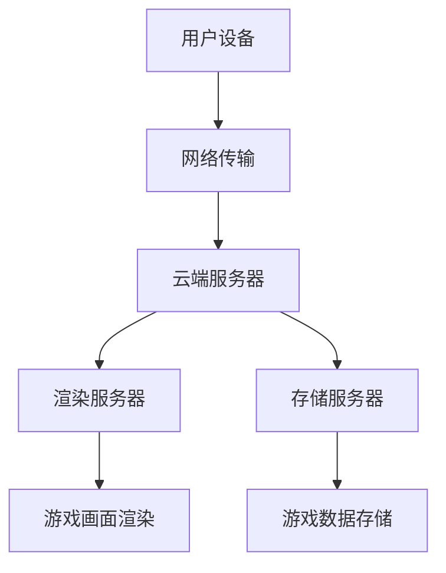

                 

# 云游戏技术：挑战与解决方案

> **关键词：** 云游戏，技术挑战，解决方案，架构，网络，图像处理，音效，用户交互，平台搭建，商业模式。

> **摘要：** 本文深入探讨了云游戏技术，包括其定义、架构、核心技术和解决方案。分析了云游戏的优势、挑战以及商业模式，并提供了详细的实践案例和技术实现。旨在为读者提供一个全面、系统的云游戏技术指南。

## 目录

### 第一部分：云游戏技术概述

1. **第1章：云游戏简介**  
   1.1.1 云游戏的定义与历史背景  
   1.1.2 云游戏与传统游戏的区别  
   1.1.3 云游戏的市场前景与现状

2. **第2章：云游戏架构**  
   2.1.1 云游戏技术框架  
   2.1.2 游戏渲染与同步技术  
   2.1.3 云端游戏存储与管理

3. **第3章：云游戏的优势与挑战**  
   3.1.1 云游戏的性能优势  
   3.1.2 云游戏的技术挑战  
   3.1.3 云游戏的安全与隐私问题  
   3.1.4 云游戏的商业模式

### 第二部分：云游戏核心技术

4. **第4章：云游戏网络技术**  
   4.1.1 云游戏网络架构  
   4.1.2 网络传输优化技术  
   4.1.3 实时性优化与延迟控制

5. **第5章：云游戏图像处理技术**  
   5.1.1 图像处理算法概述  
   5.1.2 游戏画面渲染与优化  
   5.1.3 动态图像处理技术

6. **第6章：云游戏音效技术**  
   6.1.1 云游戏音效处理原理  
   6.1.2 音频传输优化技术  
   6.1.3 实时音效处理与反馈

7. **第7章：云游戏用户交互技术**  
   7.1.1 用户交互概述  
   7.1.2 虚拟现实与增强现实技术  
   7.1.3 云游戏手柄与输入设备优化

### 第三部分：云游戏解决方案

8. **第8章：云游戏平台搭建**  
   8.1.1 云游戏平台架构设计  
   8.1.2 云游戏平台开发流程  
   8.1.3 云游戏平台性能优化

9. **第9章：云游戏业务模式与盈利策略**  
   9.1.1 云游戏商业模式概述  
   9.1.2 云游戏市场定位与目标用户  
   9.1.3 云游戏盈利模式分析

10. **第10章：云游戏市场案例分析**  
    10.1.1 国内外云游戏市场分析  
    10.1.2 云游戏成功案例分析  
    10.1.3 云游戏面临的竞争与挑战

11. **第11章：未来发展趋势与展望**  
    11.1.1 云游戏技术发展趋势  
    11.1.2 云游戏市场未来展望  
    11.1.3 云游戏社会影响与伦理问题

### 附录

12. **附录A：云游戏技术参考资源**  
   12.1.1 开源云游戏框架  
   12.1.2 云游戏相关技术文献  
   12.1.3 云游戏开发工具与平台

13. **附录B：云游戏技术架构 Mermaid 流程图**  
   13.1.1 云游戏技术架构图  
   13.1.2 游戏渲染与同步技术流程图  
   13.1.3 网络传输优化技术流程图

14. **附录C：云游戏核心算法原理讲解与伪代码**  
   14.1.1 游戏画面渲染算法原理  
   14.1.2 音频传输优化算法原理  
   14.1.3 用户交互算法原理  
   14.1.4 伪代码示例

## 引言

云游戏作为云计算与游戏产业相结合的产物，近年来吸引了众多开发者和厂商的广泛关注。其通过将游戏计算和存储资源集中在云端，为玩家提供了即点即玩、无需下载安装的便捷体验。然而，云游戏的实现并非一帆风顺，其中涉及诸多技术挑战和解决方案。本文旨在系统地介绍云游戏技术，探讨其优势与挑战，并提供可行的解决方案，为读者提供一个全面、系统的云游戏技术指南。

## 第一部分：云游戏技术概述

### 第1章：云游戏简介

#### 1.1.1 云游戏的定义与历史背景

云游戏，顾名思义，是一种基于云计算的游戏体验。它通过云计算技术将游戏的服务器部署在云端，玩家只需通过设备接入互联网即可畅玩各类游戏，无需下载和安装。这种模式为玩家提供了极大的便利性，同时也为游戏开发者降低了开发、分发和运营成本。

云游戏的历史可以追溯到20世纪90年代，当时，网络速度和计算能力有限，云游戏仅作为一种实验性技术出现。随着互联网技术的不断发展和云计算的普及，云游戏逐渐从概念走向实际应用。2010年后，随着5G网络的到来和人工智能技术的进步，云游戏迎来了快速发展期，各大科技公司和游戏厂商纷纷布局这一领域。

#### 1.1.2 云游戏与传统游戏的区别

传统游戏通常需要玩家在本地设备上安装和运行游戏程序，而云游戏则无需安装和下载，只需通过互联网接入云端游戏服务器即可进行游戏。这种模式带来了以下几个显著区别：

1. **硬件要求**：传统游戏对玩家的硬件配置有一定要求，而云游戏则无需特别高的硬件配置，玩家可以通过性能较低的设备进行游戏。

2. **存储与传输**：传统游戏需要玩家自行下载和安装游戏，而云游戏则将游戏存储在云端，玩家只需通过网络进行访问。

3. **游戏体验**：传统游戏通常具有较好的本地化体验，而云游戏则依赖于网络连接质量，需要考虑网络延迟和带宽等因素。

4. **维护与更新**：传统游戏需要玩家自行更新，而云游戏则由云端服务器进行统一更新，玩家无需进行手动操作。

#### 1.1.3 云游戏的市场前景与现状

云游戏作为一种新兴的游戏模式，具有巨大的市场前景。据市场研究机构预测，未来几年全球云游戏市场将保持高速增长，市场规模将不断扩大。以下是云游戏市场的一些现状和趋势：

1. **技术进步**：随着5G、人工智能和边缘计算等技术的不断发展，云游戏的技术水平不断提升，用户体验得到显著改善。

2. **市场布局**：国内外各大科技公司和游戏厂商纷纷布局云游戏市场，推出各自的游戏平台，如谷歌的Stadia、微软的xCloud等。

3. **商业模式**：云游戏商业模式多样，包括订阅制、一次性购买、广告支持等，为不同类型的玩家提供了多种选择。

4. **市场竞争**：云游戏市场逐渐形成竞争格局，各大厂商通过技术创新和用户服务提升竞争力，争夺市场份额。

### 第2章：云游戏架构

#### 2.1.1 云游戏技术框架

云游戏技术框架主要包括以下几个关键组成部分：

1. **游戏服务器**：游戏服务器负责处理游戏逻辑、存储游戏状态和提供游戏内容。云端服务器集群可以通过分布式架构提高性能和可靠性。

2. **渲染服务器**：渲染服务器负责将游戏画面渲染成视频流，并将其传输给玩家设备。通过高效的游戏渲染算法和优化技术，可以保证画面的流畅性。

3. **用户设备**：用户设备包括各种可以接入互联网的设备，如PC、手机、平板等。用户设备主要负责接收游戏视频流，并进行本地渲染和交互。

4. **网络传输**：网络传输是云游戏架构的关键部分，包括网络连接、数据传输和延迟控制等。通过优化网络传输技术，可以提高游戏体验的流畅性。

#### 2.1.2 游戏渲染与同步技术

游戏渲染与同步技术是云游戏的核心技术之一，其目的是确保玩家在云端服务器上的游戏状态与本地设备上的游戏体验一致。

1. **渲染技术**：游戏渲染技术主要包括图像渲染、光影效果、阴影处理等。通过高效的游戏渲染算法和图形处理技术，可以生成高质量的游戏画面。

2. **同步技术**：同步技术包括游戏状态同步、网络延迟补偿和画面渲染同步等。通过精确的时间同步和数据处理，可以确保玩家在不同设备上的游戏体验一致性。

#### 2.1.3 云端游戏存储与管理

云端游戏存储与管理是云游戏架构的重要组成部分，主要包括游戏数据存储、数据备份和游戏内容分发等。

1. **数据存储**：游戏数据包括游戏资源文件、游戏进度、玩家数据等。通过分布式存储技术，可以实现海量游戏数据的高效存储和管理。

2. **数据备份**：数据备份是确保游戏数据安全的重要手段。通过定期备份和容灾机制，可以防止数据丢失和故障。

3. **游戏内容分发**：游戏内容分发包括游戏资源的传输和分发。通过CDN等技术，可以实现游戏资源的快速传输和高效分发。

### 第3章：云游戏的优势与挑战

#### 3.1.1 云游戏的性能优势

云游戏在性能方面具有显著优势，主要体现在以下几个方面：

1. **硬件解耦**：云游戏无需依赖玩家设备的硬件配置，玩家可以通过任何设备接入云端游戏服务器，获得良好的游戏体验。

2. **资源共享**：云游戏可以将游戏资源集中存储在云端服务器上，实现资源的共享和高效利用，降低开发、分发和运营成本。

3. **动态调整**：云端服务器可以根据玩家的需求和网络状况，动态调整游戏服务器的性能和资源分配，确保游戏体验的流畅性。

#### 3.1.2 云游戏的技术挑战

云游戏在实现过程中面临诸多技术挑战，主要包括以下几个方面：

1. **网络延迟**：网络延迟是云游戏的主要瓶颈之一。由于游戏数据需要从云端传输到玩家设备，网络延迟会导致游戏体验不流畅。

2. **带宽限制**：带宽限制是影响云游戏体验的另一个关键因素。高清晰度的游戏画面需要较大的带宽支持，否则会导致画面卡顿和加载时间延长。

3. **安全性**：云游戏需要确保游戏数据的安全性和隐私性。由于游戏数据存储在云端，可能会面临数据泄露和网络攻击的风险。

#### 3.1.3 云游戏的安全与隐私问题

云游戏在安全与隐私方面存在一定的风险，主要包括以下几个方面：

1. **数据泄露**：游戏数据存储在云端，可能面临数据泄露的风险。需要采用数据加密和访问控制等技术，确保数据的安全。

2. **隐私保护**：云游戏需要收集和存储玩家的个人信息，如游戏进度、游戏时长等。需要确保个人隐私得到保护，避免滥用用户数据。

3. **网络攻击**：云游戏可能面临网络攻击的风险，如DDoS攻击、数据篡改等。需要采用网络安全技术和防御机制，确保游戏服务的稳定和安全。

#### 3.1.4 云游戏的商业模式

云游戏的商业模式多样，主要包括以下几个方面：

1. **订阅制**：玩家通过订阅服务获得云游戏服务，按月或按年支付费用。这种模式为玩家提供了长期的、持续的游戏体验。

2. **一次性购买**：玩家购买游戏后，可以在云端服务器上无限次地畅玩。这种模式为玩家提供了即点即玩的优势，同时为开发者带来了稳定的收入。

3. **广告支持**：游戏开发商可以通过在云游戏中植入广告，为玩家提供免费的游戏体验。这种模式为游戏开发者提供了额外的收入来源。

4. **平台分成**：游戏开发商可以通过云游戏平台进行游戏分发，平台按照一定的比例与开发者分成。这种模式为游戏开发者提供了更广泛的用户群体和更高的收入回报。

## 第二部分：云游戏核心技术

### 第4章：云游戏网络技术

#### 4.1.1 云游戏网络架构

云游戏网络架构是确保游戏体验流畅、稳定的关键部分。其基本架构包括以下几个关键组成部分：

1. **用户设备**：用户设备包括PC、手机、平板等，主要负责接收游戏视频流和进行本地渲染。

2. **云端服务器**：云端服务器包括游戏服务器、渲染服务器和存储服务器等。游戏服务器负责处理游戏逻辑和游戏状态，渲染服务器负责将游戏画面渲染成视频流，存储服务器负责存储游戏数据和资源。

3. **网络传输**：网络传输是连接用户设备和云端服务器的重要环节，包括互联网连接、数据传输和延迟控制等。通过优化网络传输技术，可以提高游戏体验的流畅性。

#### 4.1.2 网络传输优化技术

网络传输优化技术是云游戏技术的重要组成部分，其目的是减少网络延迟、提高数据传输速度和稳定性。以下是一些常用的网络传输优化技术：

1. **数据压缩**：通过数据压缩技术，可以减少游戏数据在网络中的传输量，从而提高数据传输速度。常用的数据压缩算法包括Huffman编码、LZ77编码等。

2. **分片传输**：将大块的游戏数据分割成小块，通过多次传输，可以提高数据传输的可靠性。在接收端，再将分块数据重新组合成完整的游戏数据。

3. **拥塞控制**：通过拥塞控制算法，可以避免网络拥塞，提高数据传输的稳定性。常用的拥塞控制算法包括TCP拥塞控制、Reno算法等。

4. **QoS保障**：通过QoS（Quality of Service）保障技术，可以确保游戏数据在网络中的优先传输，从而提高游戏体验的流畅性。QoS保障技术包括带宽保障、优先级设置等。

5. **延迟补偿**：通过延迟补偿技术，可以在一定程度上弥补网络延迟，提高游戏体验的流畅性。常用的延迟补偿技术包括预测算法、缓存技术等。

#### 4.1.3 实时性优化与延迟控制

实时性优化与延迟控制是确保游戏体验流畅性的关键部分。以下是一些常用的实时性优化与延迟控制技术：

1. **预测技术**：通过预测技术，可以提前预测玩家的操作和游戏状态，从而减少网络延迟。常用的预测技术包括机器学习算法、神经网络等。

2. **缓存技术**：通过缓存技术，可以将部分游戏数据缓存到本地，从而减少网络延迟。常用的缓存技术包括HTTP缓存、DNS缓存等。

3. **同步技术**：通过同步技术，可以确保游戏状态在云端服务器和用户设备之间的实时同步。常用的同步技术包括时间同步、状态同步等。

4. **优先级设置**：通过优先级设置，可以将游戏数据设置为高优先级，从而确保游戏数据在网络中的优先传输。常用的优先级设置技术包括TCP优先级、队列调度等。

5. **延迟阈值控制**：通过延迟阈值控制，可以设置一个合理的延迟阈值，当网络延迟超过阈值时，触发相应的优化措施，如重新传输数据、调整渲染帧率等。

### 第5章：云游戏图像处理技术

#### 5.1.1 图像处理算法概述

图像处理技术是云游戏的核心技术之一，其目的是生成高质量的游戏画面，提高游戏体验的视觉效果。以下是一些常用的图像处理算法：

1. **图像采样**：图像采样是将连续的图像信号转换为离散的像素点。常用的采样算法包括Nyquist采样、Sinc采样等。

2. **图像滤波**：图像滤波是去除图像噪声和干扰的过程。常用的滤波算法包括低通滤波、高通滤波、中值滤波等。

3. **图像增强**：图像增强是提高图像质量的过程。常用的增强算法包括对比度增强、亮度增强、锐化等。

4. **颜色处理**：颜色处理是处理图像颜色信息的过程。常用的颜色处理算法包括颜色空间转换、颜色校正、颜色融合等。

5. **纹理映射**：纹理映射是将纹理图像映射到三维模型上，提高三维模型的细节和真实感。常用的纹理映射算法包括UV映射、纹理投影等。

#### 5.1.2 游戏画面渲染与优化

游戏画面渲染与优化是云游戏图像处理技术的重要组成部分，其目的是生成高质量、流畅的游戏画面。以下是一些常用的游戏画面渲染与优化技术：

1. **光线追踪**：光线追踪是一种计算光线与场景交互的渲染技术，可以生成真实感极强的游戏画面。常用的光线追踪算法包括路径追踪、光线传播等。

2. **环境映射**：环境映射是将场景的反射和折射效果映射到物体表面上，提高场景的真实感。常用的环境映射算法包括反射映射、折射映射等。

3. **阴影处理**：阴影处理是生成场景中的阴影效果，提高场景的立体感和真实感。常用的阴影处理算法包括软阴影、硬阴影、阴影贴图等。

4. **纹理压缩**：纹理压缩是减少纹理图像的大小，提高游戏画面的传输速度和加载速度。常用的纹理压缩算法包括DXT压缩、S3TC压缩等。

5. **渲染优化**：渲染优化是通过优化渲染过程，提高游戏画面的生成速度和效率。常用的渲染优化技术包括渲染顺序优化、渲染引擎优化等。

#### 5.1.3 动态图像处理技术

动态图像处理技术是云游戏图像处理技术的重要组成部分，其目的是处理实时变化的图像数据，提高游戏画面的流畅性和交互性。以下是一些常用的动态图像处理技术：

1. **图像合成**：图像合成是将多个图像或视频流合成一个完整的画面，实现动态效果。常用的图像合成技术包括Alpha合成、图层合成等。

2. **图像追踪**：图像追踪是跟踪图像中的物体或区域，实现动态交互效果。常用的图像追踪技术包括光学追踪、深度追踪等。

3. **图像识别**：图像识别是识别图像中的物体、场景或特征，实现智能交互。常用的图像识别技术包括计算机视觉、深度学习等。

4. **实时渲染**：实时渲染是生成实时变化的图像画面，实现动态效果。常用的实时渲染技术包括实时渲染引擎、实时阴影处理等。

5. **图像增强**：图像增强是提高图像的清晰度、对比度和色彩饱和度，实现更好的视觉体验。常用的图像增强技术包括图像滤波、对比度增强等。

### 第6章：云游戏音效技术

#### 6.1.1 云游戏音效处理原理

云游戏音效处理技术是云游戏的重要组成部分，其目的是为玩家提供高质量、真实的音效体验。云游戏音效处理原理主要包括以下几个方面：

1. **声音采样**：声音采样是将连续的声音信号转换为离散的样本。常用的采样算法包括线性采样、Huffman采样等。

2. **声音编码**：声音编码是将声音样本压缩成更小的数据，以减少数据传输量。常用的声音编码算法包括PCM编码、MP3编码等。

3. **声音解码**：声音解码是将压缩的声音数据还原成原始的声音信号。常用的声音解码算法包括PCM解码、MP3解码等。

4. **声音混合**：声音混合是将多个声音信号合并成一个完整的声音信号。常用的声音混合算法包括线性混合、相加混合等。

5. **声音渲染**：声音渲染是将处理后的声音信号输出到玩家设备上的扬声器或耳机，以实现真实的声音体验。常用的声音渲染算法包括扬声器设置、耳机设置等。

#### 6.1.2 音频传输优化技术

音频传输优化技术是云游戏音效处理技术的重要组成部分，其目的是提高音频数据的传输速度和稳定性，以实现更好的音效体验。以下是一些常用的音频传输优化技术：

1. **数据压缩**：数据压缩是将音频数据压缩成更小的数据，以减少数据传输量。常用的音频压缩算法包括MP3、AAC等。

2. **编码优化**：编码优化是优化音频编码过程，以提高音频质量。常用的编码优化技术包括编码参数调整、码率控制等。

3. **传输优化**：传输优化是优化音频数据的传输过程，以提高传输速度和稳定性。常用的传输优化技术包括拥塞控制、QoS保障等。

4. **延迟控制**：延迟控制是控制音频数据的传输延迟，以实现实时音效处理。常用的延迟控制技术包括延迟补偿、缓存技术等。

5. **抖动控制**：抖动控制是控制音频数据的传输抖动，以实现稳定的音效体验。常用的抖动控制技术包括抖动缓冲、抖动补偿等。

#### 6.1.3 实时音效处理与反馈

实时音效处理与反馈是云游戏音效处理技术的重要组成部分，其目的是为玩家提供实时、准确的音效体验。以下是一些常用的实时音效处理与反馈技术：

1. **实时处理**：实时处理是将音频数据实时处理，以生成实时音效。常用的实时处理技术包括实时滤波、实时增强等。

2. **反馈控制**：反馈控制是控制音频反馈过程，以实现实时音效反馈。常用的反馈控制技术包括反馈抑制、反馈校正等。

3. **音效映射**：音效映射是将音频数据映射到特定的音效设置，以实现特定的音效体验。常用的音效映射技术包括音效预设、音效自定义等。

4. **音效增强**：音效增强是增强音频数据的音质，以实现更好的音效体验。常用的音效增强技术包括音量增强、音质增强等。

5. **音效反馈**：音效反馈是将处理后的音频数据实时反馈到玩家设备，以实现实时音效反馈。常用的音效反馈技术包括音频渲染、实时通信等。

### 第7章：云游戏用户交互技术

#### 7.1.1 用户交互概述

用户交互是云游戏的重要组成部分，其目的是为玩家提供直观、便捷的操作体验。用户交互技术主要包括以下几个方面：

1. **输入设备**：输入设备是玩家与云游戏互动的桥梁，包括键盘、鼠标、游戏手柄等。通过输入设备，玩家可以控制游戏中的角色、操作界面等。

2. **输出设备**：输出设备是游戏向玩家展示内容和反馈信息的方式，包括显示器、扬声器等。通过输出设备，玩家可以感受到游戏中的视觉和声音效果。

3. **交互界面**：交互界面是玩家与游戏互动的界面，包括游戏菜单、控制面板等。通过交互界面，玩家可以查看游戏信息、调整游戏设置等。

4. **交互逻辑**：交互逻辑是游戏中的操作逻辑和处理规则，包括角色移动、攻击、技能释放等。通过交互逻辑，游戏可以实现对玩家输入的响应和处理。

#### 7.1.2 虚拟现实与增强现实技术

虚拟现实（VR）和增强现实（AR）技术是近年来在云游戏中应用较为广泛的技术，为玩家提供了更加沉浸式、互动性的游戏体验。

1. **虚拟现实技术**：虚拟现实技术通过头戴式显示器、传感器等设备，将玩家带入一个完全虚拟的三维世界。在云游戏中，虚拟现实技术可以实现以下功能：

   - **沉浸式体验**：通过高清晰度、立体声等手段，为玩家提供逼真的游戏体验。
   - **交互操作**：通过传感器捕捉玩家的动作，实现与虚拟世界的实时交互。
   - **个性化定制**：根据玩家的喜好和习惯，提供个性化的游戏内容和交互方式。

2. **增强现实技术**：增强现实技术通过在现实世界中叠加虚拟元素，为玩家提供更加丰富的游戏体验。在云游戏中，增强现实技术可以实现以下功能：

   - **环境互动**：将虚拟元素叠加到现实环境中，实现与现实世界的互动。
   - **导航指引**：在游戏过程中，为玩家提供导航指引和提示。
   - **社交互动**：通过增强现实技术，实现玩家之间的实时互动和协作。

#### 7.1.3 云游戏手柄与输入设备优化

云游戏手柄和输入设备是玩家与游戏互动的重要工具，其性能和兼容性直接影响游戏体验。以下是一些云游戏手柄与输入设备优化的方法：

1. **手柄映射**：手柄映射是将手柄的按键和操作映射到游戏中的相应操作，以实现手柄的兼容性和灵活性。

2. **手柄优化**：手柄优化包括手柄的灵敏度、响应速度、震动效果等设置，以满足不同玩家的个性化需求。

3. **手柄兼容性**：确保手柄在不同平台和游戏中的兼容性，以实现无缝的游戏体验。

4. **手柄驱动**：提供稳定、高效的手柄驱动程序，以提升手柄的性能和稳定性。

5. **手柄更新**：定期更新手柄固件和驱动程序，以修复已知问题、提升性能和兼容性。

## 第三部分：云游戏解决方案

### 第8章：云游戏平台搭建

#### 8.1.1 云游戏平台架构设计

云游戏平台架构设计是确保云游戏服务稳定、高效运行的关键。以下是一个典型的云游戏平台架构设计：

1. **前端架构**：前端架构负责接收用户的输入和显示游戏画面。通常包括Web浏览器、移动应用等。

2. **后端架构**：后端架构负责处理游戏逻辑、渲染游戏画面和提供游戏数据。通常包括游戏服务器、渲染服务器、存储服务器等。

3. **网络架构**：网络架构负责实现用户设备与云端服务器之间的数据传输。通常包括负载均衡、CDN（内容分发网络）、防火墙等。

4. **存储架构**：存储架构负责存储游戏数据和用户数据。通常包括分布式存储系统、数据库等。

5. **安全架构**：安全架构负责保护游戏数据和用户隐私。通常包括身份认证、访问控制、数据加密等。

#### 8.1.2 云游戏平台开发流程

云游戏平台开发流程包括以下几个关键步骤：

1. **需求分析**：明确云游戏平台的目标用户、功能需求和技术需求。

2. **架构设计**：根据需求分析结果，设计云游戏平台的架构。

3. **前端开发**：开发前端界面和用户交互功能。

4. **后端开发**：开发后端服务和游戏逻辑。

5. **渲染服务开发**：开发游戏画面渲染和同步功能。

6. **测试与优化**：进行功能测试、性能测试和安全测试，对平台进行优化。

7. **部署与运维**：将平台部署到云端服务器，进行持续监控和运维。

#### 8.1.3 云游戏平台性能优化

云游戏平台性能优化是确保平台稳定、高效运行的关键。以下是一些常见的性能优化方法：

1. **负载均衡**：通过负载均衡技术，将用户请求分配到不同的服务器上，避免单点故障和高并发问题。

2. **缓存技术**：通过缓存技术，减少数据访问次数，提高数据读取速度。

3. **数据压缩**：通过数据压缩技术，减少数据传输量，提高网络传输速度。

4. **网络优化**：优化网络架构和传输协议，提高数据传输速度和稳定性。

5. **渲染优化**：优化游戏画面渲染过程，提高渲染速度和画面质量。

6. **并发控制**：通过并发控制技术，避免高并发导致的服务器性能下降。

7. **监控与预警**：建立完善的监控体系，实时监控平台性能指标，提前预警潜在问题。

### 第9章：云游戏业务模式与盈利策略

#### 9.1.1 云游戏商业模式概述

云游戏商业模式是指游戏开发商和运营商通过云游戏平台为用户提供游戏服务，并从中获取收益的运作模式。以下是一些常见的云游戏商业模式：

1. **订阅制**：用户通过订阅云游戏服务，按月或按年支付费用，享受云游戏平台的全部或部分游戏资源。

2. **一次性购买**：用户购买云游戏平台上的特定游戏，获得游戏使用权，无需额外支付费用。

3. **广告支持**：在云游戏平台中植入广告，为用户提供免费的游戏体验，通过广告收入为游戏开发商和运营商带来收益。

4. **平台分成**：游戏开发商通过云游戏平台分发游戏，平台与开发商按一定比例进行分成。

5. **增值服务**：提供额外的增值服务，如游戏下载、游戏加速、个性化定制等，为用户带来额外的价值，从而获得收益。

#### 9.1.2 云游戏市场定位与目标用户

云游戏市场定位与目标用户的选择是成功的关键。以下是一些建议：

1. **高端市场**：针对追求高质量游戏体验的高端用户，提供高性能、高质量的游戏服务。

2. **大众市场**：针对广大游戏爱好者，提供丰富多样、易于上手的游戏资源，满足大众需求。

3. **专业市场**：针对游戏开发者、测试人员等专业人士，提供专业的游戏开发和测试工具。

4. **特定领域**：针对特定领域的用户，如电竞、模拟游戏等，提供定制化的游戏资源和解决方案。

#### 9.1.3 云游戏盈利模式分析

云游戏盈利模式的选择直接影响企业的盈利能力和市场竞争力。以下是一些常见的云游戏盈利模式分析：

1. **订阅制**：通过订阅制，企业可以建立稳定的用户群体，实现持续的收入。但需要考虑订阅费用的定价策略和用户黏性问题。

2. **一次性购买**：一次性购买可以为游戏开发商带来较高的收益，但需要考虑游戏更新和维护的成本。

3. **广告支持**：广告支持可以降低用户付费门槛，扩大用户群体。但需要平衡广告数量与用户体验之间的关系。

4. **平台分成**：平台分成可以激励游戏开发商投入更多资源开发优质游戏，提升平台竞争力。但需要制定合理的分成比例，确保游戏开发商的利益。

5. **增值服务**：增值服务可以为用户提供额外的价值，提高用户满意度。但需要提供高质量、有竞争力的增值服务，以吸引用户付费。

### 第10章：云游戏市场案例分析

#### 10.1.1 国内外云游戏市场分析

国内外云游戏市场发展迅速，各具特色。以下是对国内外云游戏市场的分析：

1. **国内市场**：国内云游戏市场起步较晚，但发展迅速。主要玩家包括腾讯、华为、小米等。国内市场具有庞大的用户基础和高速增长的互联网普及率，为云游戏的发展提供了良好的土壤。

2. **国际市场**：国际市场以欧美和亚太地区为主。欧美市场以谷歌的Stadia和微软的xCloud为代表，亚太地区以腾讯的WeGame和索尼的PlayStation Now为代表。国际市场在技术、资金、用户基础等方面具有较大优势。

#### 10.1.2 云游戏成功案例分析

以下是一些云游戏成功案例的分析：

1. **谷歌Stadia**：谷歌Stadia是国际市场的一匹黑马，通过高性能、低延迟的技术优势，吸引了大量用户。其成功原因主要包括：

   - **强大技术支持**：利用谷歌云技术和谷歌搜索引擎技术，提供高性能、高质量的云游戏服务。
   - **品牌影响力**：谷歌的品牌影响力和用户基础，为Stadia吸引了大量关注和用户。
   - **创新商业模式**：通过订阅制和一次性购买等多种模式，满足不同用户的需求。

2. **腾讯WeGame**：腾讯WeGame是国内云游戏市场的领军者，凭借腾讯在游戏产业的强大实力，取得了显著的市场份额。其成功原因主要包括：

   - **庞大用户基础**：依托腾讯旗下的游戏产品，积累了大量用户，为云游戏发展提供了基础。
   - **平台整合**：将游戏平台、社交平台、直播平台等多重功能整合，提供一站式游戏体验。
   - **创新模式**：通过平台分成、广告支持等多种模式，实现多元化盈利。

#### 10.1.3 云游戏面临的竞争与挑战

云游戏在发展过程中面临诸多竞争与挑战：

1. **技术挑战**：云游戏技术尚未完全成熟，网络延迟、带宽限制等技术问题亟待解决。

2. **市场竞争**：国内外云游戏市场竞争激烈，各大厂商纷纷布局，抢占市场份额。

3. **用户习惯**：用户对本地游戏的依赖和习惯，是云游戏推广的一大难题。

4. **盈利模式**：云游戏盈利模式尚不成熟，如何实现可持续发展，是行业面临的重要问题。

5. **政策法规**：各国对云游戏的监管政策不同，需要关注政策法规的变化，确保合规运营。

### 第11章：未来发展趋势与展望

#### 11.1.1 云游戏技术发展趋势

随着技术的不断进步，云游戏技术将继续快速发展，以下是一些可能的发展趋势：

1. **5G技术**：5G技术的普及将进一步提高网络速度和稳定性，为云游戏提供更好的传输环境。

2. **边缘计算**：边缘计算可以将计算和存储资源分散到网络边缘，降低网络延迟，提高游戏体验。

3. **人工智能**：人工智能技术将应用于云游戏，实现更智能的游戏推荐、更精准的玩家画像等。

4. **虚拟现实与增强现实**：VR和AR技术的进步将使云游戏提供更加沉浸式的游戏体验。

5. **区块链技术**：区块链技术可以应用于云游戏，实现游戏资产的去中心化管理和交易。

#### 11.1.2 云游戏市场未来展望

未来，云游戏市场将呈现以下发展趋势：

1. **市场规模扩大**：随着技术的进步和用户习惯的改变，云游戏市场规模将不断扩大。

2. **商业模式创新**：云游戏商业模式将不断探索和创新，以满足不同类型用户的需求。

3. **市场竞争加剧**：国内外云游戏厂商将展开更加激烈的市场竞争，争夺市场份额。

4. **监管政策完善**：各国政府将逐步完善监管政策，为云游戏的发展提供合规的环境。

#### 11.1.3 云游戏社会影响与伦理问题

云游戏作为一种新兴的游戏模式，将对社会和伦理产生一定的影响：

1. **网络沉迷**：云游戏可能加剧网络沉迷现象，影响用户的身心健康。

2. **数据隐私**：云游戏需要收集和存储大量用户数据，如何保护用户隐私成为重要问题。

3. **版权保护**：云游戏涉及游戏版权保护问题，需要建立完善的版权保护机制。

4. **社会公平**：云游戏可能加剧社会公平问题，需要关注贫困地区和弱势群体的游戏权益。

### 附录

#### 附录A：云游戏技术参考资源

1. **开源云游戏框架**  
   - **GCloud**：一款开源的云游戏框架，支持多种平台和游戏类型。  
   - **Unreal Engine**：一款强大的游戏开发引擎，支持云游戏开发。

2. **云游戏相关技术文献**  
   - **《云计算与游戏技术》**：一本介绍云计算与游戏技术结合的书籍。  
   - **《云游戏技术指南》**：一本全面介绍云游戏技术的书籍。

3. **云游戏开发工具与平台**  
   - **Google Stadia**：谷歌推出的云游戏平台。  
   - **腾讯WeGame**：腾讯推出的云游戏平台。

### 附录B：云游戏技术架构 Mermaid 流程图



### 附录C：云游戏核心算法原理讲解与伪代码

1. **游戏画面渲染算法原理**  
   游戏画面渲染算法是将游戏状态转换为图像画面的过程。以下是一个简单的渲染算法伪代码：

   ```
   function renderGameScene(gameState):
       for each object in gameState:
           renderObject(object)
   
   function renderObject(object):
       calculateTransformMatrix(object)
       applyTransformMatrixToShader(object)
       drawObject(object)
   ```

2. **音频传输优化算法原理**  
   音频传输优化算法是减少音频数据传输量的过程。以下是一个简单的音频压缩算法伪代码：

   ```
   function compressAudio(audioData):
       for each sample in audioData:
           applyCompressionAlgorithm(sample)
   
   function applyCompressionAlgorithm(sample):
       if sample has low frequency:
           reduceSampleFrequency(sample)
       else:
           reduceSampleAmplitude(sample)
   ```

3. **用户交互算法原理**  
   用户交互算法是处理用户输入并产生相应输出的过程。以下是一个简单的用户交互算法伪代码：

   ```
   function handleUserInput(input):
       if input is valid:
           executeAction(input)
       else:
           displayError("Invalid input")
   
   function executeAction(input):
       if input is a move command:
           moveCharacter()
       else if input is a skill command:
           useSkill()
   ```

作者：AI天才研究院/AI Genius Institute & 禅与计算机程序设计艺术 /Zen And The Art of Computer Programming

