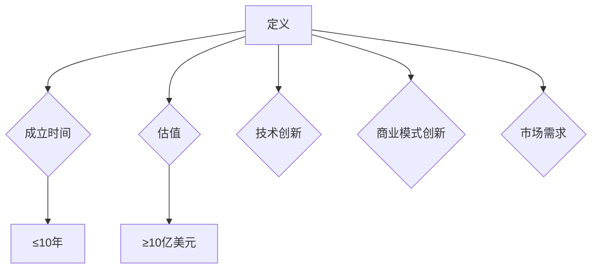
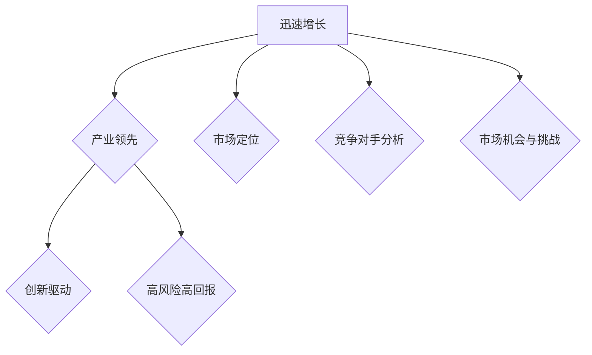

                 

# 第1章：独角兽企业的定义与特征

## 1.1 独角兽企业的定义

独角兽企业是指那些成立时间不超过10年，估值超过10亿美元的创业公司。这一概念起源于美国，并迅速在全球范围内流行。独角兽企业的形成通常伴随着技术创新、商业模式创新以及市场需求的快速增长。

### 1.1.1 从独角兽企业的定义出发

独角兽企业具有以下几个显著特征：

- **年轻性**：成立时间不超过10年
- **高估值**：估值超过10亿美元
- **快速增长**：企业价值迅速提升，通常在短时间内实现高成长
- **技术创新**：依靠技术创新获得竞争优势
- **商业模式创新**：创新的商业模式有助于企业快速占领市场
- **市场需求驱动**：市场需求推动企业快速发展

### 1.1.2 独角兽企业的分类与特征

独角兽企业可以根据其业务领域、技术特点等不同维度进行分类。以下是几种常见的独角兽企业类型及其特征：

- **科技型独角兽**：依靠技术创新获得竞争优势，如人工智能、大数据、云计算等领域的企业
- **消费型独角兽**：专注于消费市场，通过创新的商业模式实现快速增长，如电商、社交平台等领域的企业
- **传统行业独角兽**：在传统行业通过技术创新实现转型升级，如金融科技、物流等领域的企业

## 1.2 独角兽企业的特征

独角兽企业具有以下几个典型特征：

### 1.2.1 迅速增长

独角兽企业通常在短时间内实现快速增长，企业价值迅速提升。这种增长往往伴随着市场需求的激增和技术创新的成功。

### 1.2.2 领军产业

独角兽企业在其所在产业中往往具有领先地位，成为行业标杆。这得益于它们在技术创新、市场开拓等方面的卓越表现。

### 1.2.3 创新驱动

独角兽企业的成功往往依赖于技术创新。它们在研发方面投入巨大，不断推出具有颠覆性的产品或服务，引领产业发展方向。

### 1.2.4 高风险高回报

独角兽企业通常面临较高的市场风险，但也因此具备高回报潜力。它们在市场不确定性中寻找机会，通过创新和努力实现企业的持续成长。

## 1.3 独角兽企业的市场定位

### 1.3.1 市场细分与定位

独角兽企业通常在特定的市场细分领域中进行定位。这种定位有助于企业专注于某一领域，发挥自身优势，提升市场竞争力。

### 1.3.2 竞争对手分析

在市场定位过程中，独角兽企业需要了解竞争对手的情况，制定有效的竞争策略。通过对竞争对手的分析，企业可以制定有效的竞争策略，提升自身市场地位。

### 1.3.3 市场机会与挑战

独角兽企业在市场定位过程中还需要关注市场机会和挑战。市场机会包括新兴技术的应用、市场需求的增长等；市场挑战则包括竞争对手的挑战、政策法规的限制等。企业需要根据市场环境制定相应的战略，应对挑战，抓住机会。

## 1.4 核心概念与联系

### 1.4.1 独角兽企业定义的Mermaid流程图

### 1.4.2 独角兽企业特征的Mermaid流程图

## 1.5 小结

独角兽企业是创业公司中的佼佼者，它们凭借技术创新、商业模式创新以及市场需求驱动，在短时间内实现快速成长。理解独角兽企业的定义和特征，有助于我们更好地把握这一领域的发展趋势和机遇。在接下来的章节中，我们将进一步探讨人工智能产业的发展背景、独角兽企业的市场定位以及核心技术与产品。

---

作者：AI天才研究院/AI Genius Institute & 禅与计算机程序设计艺术 /Zen And The Art of Computer Programming

---

**摘要**：

本文详细探讨了独角兽企业的定义、特征及其在人工智能产业中的市场定位。首先，从独角兽企业的定义出发，阐述了其年轻性、高估值、快速增长、技术创新和商业模式创新等特征。接着，分析了独角兽企业在其所在产业中的领先地位，以及它们如何通过创新驱动和高风险高回报策略实现持续成长。最后，探讨了独角兽企业的市场细分与定位、竞争对手分析以及市场机会与挑战，为读者提供了一个全面了解独角兽企业发展的视角。文章旨在为人工智能领域的研究者、从业者和投资者提供有价值的参考。

