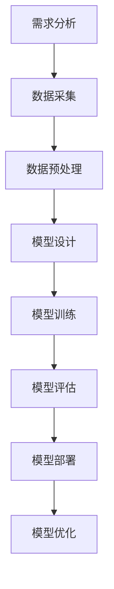

                 

# 《人工智能创业：推广策略的分析》

## 关键词
人工智能、创业、推广策略、市场分析、用户获取、品牌定位

## 摘要
本文旨在探讨人工智能创业中的推广策略，通过深入分析市场环境、用户需求以及品牌定位，为创业者提供一套系统的推广思路。文章将从人工智能创业背景与机遇、人工智能核心技术与原理、人工智能创业项目规划与实施、推广策略分析以及创业案例分享等多个方面进行论述，帮助创业者更好地把握市场动态，制定有效的推广策略，实现人工智能创业项目的成功。

---

## 《人工智能创业：推广策略的分析》目录大纲

### 第一部分：人工智能创业背景与机遇

#### 第1章：人工智能时代来临

##### 1.1 人工智能的定义与历史发展

##### 1.2 人工智能的现状与趋势

##### 1.3 人工智能创业的机遇与挑战

### 第二部分：人工智能核心技术与原理

#### 第2章：人工智能基础概念与架构

##### 2.1 人工智能的基本概念

##### 2.2 人工智能的架构与流程

### 第3章：人工智能关键算法原理

##### 3.1 神经网络算法

##### 3.2 集成学习方法

##### 3.3 深度学习优化算法

### 第三部分：人工智能创业项目规划与实施

#### 第4章：人工智能创业项目规划

##### 4.1 项目需求分析

##### 4.2 项目可行性分析

##### 4.3 项目规划与执行

#### 第5章：人工智能创业项目实施

##### 5.1 数据采集与处理

##### 5.2 模型设计与训练

##### 5.3 模型部署与应用

### 第四部分：人工智能创业推广策略分析

#### 第6章：品牌定位与宣传策略

##### 6.1 品牌定位

##### 6.2 宣传渠道选择

##### 6.3 营销策略设计

#### 第7章：用户获取与维护策略

##### 7.1 用户需求分析

##### 7.2 用户反馈收集

##### 7.3 用户维护策略

#### 第8章：创业团队管理与文化建设

##### 8.1 团队管理策略

##### 8.2 企业文化建设

##### 8.3 创业心态调整

### 第五部分：人工智能创业案例分析

#### 第9章：人工智能创业成功案例分析

##### 9.1 案例一：成功的人工智能创业项目

##### 9.2 案例二：失败的人工智能创业项目

### 第六部分：人工智能创业未来展望

#### 第10章：人工智能创业发展趋势与前景

##### 10.1 人工智能创业的发展趋势

##### 10.2 人工智能创业的前景分析

#### 第11章：人工智能创业的建议与启示

##### 11.1 创业者应具备的素质与能力

##### 11.2 创业成功的要素与关键

### 第七部分：附录

#### 附录 A：人工智能创业相关资源

#### 附录 B：人工智能创业常用术语解释

---

### 第一部分：人工智能创业背景与机遇

#### 第1章：人工智能时代来临

##### 1.1 人工智能的定义与历史发展

人工智能（Artificial Intelligence，简称AI）是指使计算机系统具备人类智能特征的技术和理论。它包括了模拟、延伸和扩展人类智能的各种方法和技术。

**人工智能的发展历史可以追溯到20世纪50年代，主要分为以下三个阶段：**

1. **初始阶段（1956-1969年）**：1956年，达特茅斯会议提出了人工智能的概念，标志着人工智能领域的诞生。这一阶段主要集中于基础理论和算法的研究。

2. **繁荣阶段（1970-1989年）**：得益于计算机性能的提升和算法的进步，人工智能应用得到了广泛的关注和推广。例如，专家系统、自然语言处理和计算机视觉等领域的突破。

3. **低谷与复苏阶段（1990-2010年）**：由于实际应用中的困难，人工智能在1990年代遭遇了低谷。然而，随着互联网和大数据的发展，人工智能在2010年后再次迎来了复兴。

**当前，人工智能已经进入了深度学习时代，深度神经网络（DNN）、卷积神经网络（CNN）和循环神经网络（RNN）等算法在图像识别、语音识别和自然语言处理等领域取得了显著成果。**

##### 1.2 人工智能的现状与趋势

**人工智能目前已经在众多领域得到了广泛应用，包括但不限于：**

- **医疗健康**：辅助诊断、个性化治疗和健康管理等
- **金融**：风险评估、自动交易和智能投顾等
- **制造业**：智能工厂、自动化生产线和机器人等
- **交通**：自动驾驶、智能交通管理和物流优化等
- **教育**：智能教学、个性化学习和在线教育等

**人工智能的发展趋势主要体现在以下几个方面：**

1. **算法创新**：强化学习、生成对抗网络（GAN）和图神经网络等新型算法不断涌现。
2. **硬件升级**：量子计算、边缘计算和5G等技术的快速发展为人工智能提供了更强大的计算能力和更广泛的部署场景。
3. **数据融合**：多源数据融合、数据挖掘和知识图谱等技术使得人工智能系统能够更好地理解和处理复杂问题。
4. **应用拓展**：人工智能在更多传统行业中的应用，如农业、能源和环境等领域，将带来新的商业机会和社会效益。

##### 1.3 人工智能创业的机遇与挑战

**人工智能创业的机遇主要表现在以下几个方面：**

- **市场需求**：随着人工智能技术的不断成熟和普及，越来越多的企业和个人开始寻求人工智能解决方案。
- **技术进步**：深度学习、自然语言处理和计算机视觉等技术的突破为创业者提供了更多的工具和方法。
- **政策支持**：各国政府对人工智能产业的重视和支持，为创业者提供了良好的发展环境。

**人工智能创业的挑战主要包括：**

- **技术门槛**：人工智能领域的技术复杂度高，需要创业者具备深厚的专业背景和技能。
- **数据隐私**：数据安全和隐私问题成为人工智能应用的一大挑战。
- **市场不确定性**：人工智能市场的竞争激烈，创业者需要面对激烈的市场竞争和不断变化的市场需求。
- **资金压力**：人工智能项目的研发和推广需要大量的资金支持，创业者需要寻找合适的融资渠道。

#### 第2章：人工智能基础概念与架构

##### 2.1 人工智能的基本概念

**人工智能的基本概念包括以下几方面：**

- **机器学习**：机器学习是人工智能的核心技术之一，它使得计算机系统能够从数据中学习并做出决策。主要分为监督学习、无监督学习和强化学习等。
- **深度学习**：深度学习是机器学习的一个重要分支，通过多层神经网络模型对数据进行自动特征提取和学习。
- **自然语言处理**：自然语言处理旨在使计算机理解和处理人类自然语言，包括文本分类、语音识别、机器翻译等。
- **计算机视觉**：计算机视觉是使计算机能够像人类一样感知和理解视觉信息，包括图像识别、目标检测、图像生成等。

**人工智能的架构通常包括以下几个层次：**

1. **数据层**：包括数据采集、数据预处理和数据存储等，是人工智能系统的数据基础。
2. **模型层**：包括模型设计、模型训练和模型评估等，是人工智能系统的核心部分。
3. **算法层**：包括算法实现、算法优化和算法评估等，是人工智能系统的技术支撑。
4. **应用层**：包括应用开发、应用部署和应用维护等，是人工智能系统的实际应用场景。

##### 2.2 人工智能的架构与流程

**人工智能的架构与流程可以概括为以下步骤：**

1. **需求分析**：明确人工智能项目的目标和需求，确定所需解决的问题和应用场景。
2. **数据采集**：收集相关数据，包括文本、图像、音频和视频等多种类型的数据。
3. **数据预处理**：对采集到的数据进行分析和清洗，去除噪声和异常值，确保数据的准确性和一致性。
4. **模型设计**：根据需求选择合适的模型结构和算法，包括神经网络、支持向量机、决策树等。
5. **模型训练**：使用训练数据对模型进行训练，通过优化算法调整模型参数，提高模型性能。
6. **模型评估**：使用测试数据对训练好的模型进行评估，确定模型的准确度、召回率、F1分数等指标。
7. **模型部署**：将训练好的模型部署到实际应用场景中，进行实时推理和预测。
8. **模型优化**：根据实际应用效果对模型进行持续优化，提高模型的性能和稳定性。

**人工智能的核心算法原理如下：**

- **神经网络算法**：神经网络是一种模拟生物神经系统的计算模型，通过多层神经元结构实现数据的输入、处理和输出。
- **集成学习方法**：集成学习方法通过组合多个基本模型，提高预测的准确性和鲁棒性，包括Boosting、Bagging和Stacking等。
- **深度学习优化算法**：深度学习优化算法用于调整神经网络模型的参数，包括梯度下降算法、Adam优化器和动量优化等。

**人工智能的架构与流程图如下：**



#### 第3章：人工智能核心算法原理

##### 3.1 神经网络算法

**神经网络算法是人工智能领域的基础，它通过模拟生物神经系统的结构和功能来实现对数据的处理和预测。神经网络算法的核心是神经元，每个神经元接收多个输入信号，通过加权求和处理后产生输出信号。**

**神经网络的基本结构包括以下几个部分：**

- **输入层**：接收外部输入信号，每个输入信号对应一个权重。
- **隐藏层**：对输入信号进行处理，通过非线性激活函数实现特征提取。
- **输出层**：对隐藏层输出的信号进行处理，产生最终输出结果。

**神经网络的工作原理如下：**

1. **前向传播**：输入信号从输入层传递到隐藏层，再传递到输出层，每个层中的神经元根据其权重和输入信号计算输出值。
2. **反向传播**：根据输出层的实际输出与期望输出的差异，通过反向传播算法调整每个神经元的权重，使得网络能够逐渐逼近正确结果。

**神经网络算法的伪代码如下：**

```python
def forward_propagation(inputs, weights):
    # 前向传播计算输出值
    hidden_layer_outputs = []
    for layer in hidden_layers:
        output = activate(sum(inputs * weights))
        hidden_layer_outputs.append(output)
    output = activate(sum(hidden_layer_outputs * output_weights))
    return output

def backward_propagation(error, weights):
    # 反向传播调整权重
    for layer in reversed(hidden_layers):
        delta = error * activate_derivative(output)
        error = delta * weights
        weights -= learning_rate * error
    return weights
```

**神经网络算法的应用包括：**

- **图像识别**：通过卷积神经网络实现图像分类和目标检测。
- **自然语言处理**：通过循环神经网络实现文本分类、机器翻译和情感分析等。
- **语音识别**：通过深度神经网络实现语音信号的自动识别和转换。

##### 3.2 集成学习方法

**集成学习方法通过组合多个基本模型，提高预测的准确性和鲁棒性。常见的集成学习方法包括Boosting、Bagging和Stacking等。**

**Boosting算法**：

Boosting算法是一种基于集成学习的方法，它通过迭代训练多个基本模型，每次训练都基于前一次训练的结果进行调整。Boosting算法的核心思想是，通过给每个基本模型赋予不同的权重，使得整体模型能够更好地拟合训练数据。

**Boosting算法的伪代码如下：**

```python
def boosting(models, data, labels):
    # 初始化基本模型权重
    weights = [1 / len(data)] * len(data)
    for iteration in range(num_iterations):
        # 训练基本模型
        for model in models:
            model.train(data, labels, weights)
        # 计算每个模型的误差
        errors = [model.evaluate(data, labels) for model in models]
        # 更新模型权重
        for model, error in zip(models, errors):
            model.weight *= (1 - error)
    return models
```

**Bagging算法**：

Bagging算法通过从训练数据集中随机抽样，构建多个基本模型，并将它们的预测结果进行平均或投票，得到最终预测结果。Bagging算法能够减少模型方差，提高预测的稳定性。

**Bagging算法的伪代码如下：**

```python
def bagging(models, data, labels, num_samples):
    # 从训练数据集中随机抽样构建基本模型
    for _ in range(num_samples):
        sample_data, sample_labels = random_sample(data, labels)
        model = Model()
        model.train(sample_data, sample_labels)
        models.append(model)
    # 计算最终预测结果
    predictions = [model.predict(data) for model in models]
    return average(predictions)
```

**Stacking算法**：

Stacking算法通过将多个基本模型作为新的训练数据，构建一个更高层次的模型。Stacking算法能够提高模型的预测性能，特别是在模型多样性较强的情况下。

**Stacking算法的伪代码如下：**

```python
def stacking(models, data, labels, meta_model):
    # 将基本模型作为新训练数据
    meta_features = [model.predict(data) for model in models]
    # 训练更高层次的模型
    meta_model.train(meta_features, labels)
    # 计算最终预测结果
    prediction = meta_model.predict(meta_features)
    return prediction
```

**集成学习方法的应用包括：**

- **图像分类**：通过集成多种模型提高图像分类的准确性。
- **文本分类**：通过集成多种模型实现文本分类任务的鲁棒性和准确性。
- **预测建模**：通过集成多种模型提高预测模型的稳定性和准确性。

##### 3.3 深度学习优化算法

**深度学习优化算法用于调整神经网络模型的参数，以实现模型的最优性能。常见的深度学习优化算法包括梯度下降算法、Adam优化器和动量优化等。**

**梯度下降算法**：

梯度下降算法是一种常用的优化算法，通过计算目标函数的梯度，逐步调整模型参数，以实现最小化目标函数。

**梯度下降算法的伪代码如下：**

```python
def gradient_descent(model, data, labels, learning_rate, num_iterations):
    for _ in range(num_iterations):
        # 计算梯度
        gradients = compute_gradients(model, data, labels)
        # 更新参数
        model.update_params(gradients, learning_rate)
    return model
```

**Adam优化器**：

Adam优化器是一种自适应梯度优化算法，它结合了AdaGrad和RMSProp的优点，能够自适应调整学习率。

**Adam优化器的伪代码如下：**

```python
def adam_optimizer(model, data, labels, learning_rate, beta1, beta2, epsilon):
    # 初始化参数
    m = [0] * len(model.params)
    v = [0] * len(model.params)
    t = 0
    for iteration in range(num_iterations):
        # 计算梯度
        gradients = compute_gradients(model, data, labels)
        # 更新m和v
        m = [beta1 * m[i] + (1 - beta1) * gradients[i] for i in range(len(m))]
        v = [beta2 * v[i] + (1 - beta2) * (gradients[i]**2) for i in range(len(v))]
        # 归一化m和v
        m_hat = [m[i] / (1 - beta1**iteration) for i in range(len(m))]
        v_hat = [v[i] / (1 - beta2**iteration) for i in range(len(v))]
        # 更新参数
        model.update_params(-learning_rate * m_hat / (np.sqrt(v_hat) + epsilon))
    return model
```

**动量优化**：

动量优化是一种基于梯度下降的改进算法，通过引入动量项，使得参数更新更加稳定和有效。

**动量优化的伪代码如下：**

```python
def momentum_optimizer(model, data, labels, learning_rate, momentum):
    velocity = [0] * len(model.params)
    for iteration in range(num_iterations):
        # 计算梯度
        gradients = compute_gradients(model, data, labels)
        # 更新速度
        velocity = [momentum * velocity[i] - learning_rate * gradients[i] for i in range(len(velocity))]
        # 更新参数
        model.update_params(velocity)
    return model
```

**深度学习优化算法的应用包括：**

- **图像识别**：通过优化算法提高图像分类的准确性。
- **自然语言处理**：通过优化算法提高文本分类和机器翻译的性能。
- **语音识别**：通过优化算法提高语音信号的识别准确率和稳定性。

### 第四部分：人工智能创业项目规划与实施

#### 第4章：人工智能创业项目规划

##### 4.1 项目需求分析

**项目需求分析是人工智能创业项目规划的首要步骤，它旨在明确项目目标、用户需求和市场定位。**

**项目需求分析主要包括以下几个方面：**

1. **用户需求分析**：通过调查问卷、用户访谈和市场调研等方式，了解目标用户的需求和痛点，为项目提供切实可行的解决方案。

2. **市场需求分析**：研究市场上类似产品的现状和竞争态势，分析市场需求和潜在用户规模，为项目的发展提供市场依据。

3. **技术需求分析**：评估项目所需的技术能力和技术储备，确保项目能够在技术层面实现预期目标。

4. **资源需求分析**：明确项目所需的资金、人力、设备和时间等资源，为项目进度和成本控制提供参考。

**项目需求分析的伪代码如下：**

```python
def analyze_requirements():
    # 用户需求分析
    user_requirements = user_survey()
    # 市场需求分析
    market_requirements = market_research()
    # 技术需求分析
    tech_requirements = tech_evaluation()
    # 资源需求分析
    resource_requirements = resource_evaluation()
    # 综合分析
    requirements_summary = combine_requirements(user_requirements, market_requirements, tech_requirements, resource_requirements)
    return requirements_summary
```

##### 4.2 项目可行性分析

**项目可行性分析是评估人工智能创业项目能否成功实施的关键步骤，它包括技术可行性、资金可行性和团队可行性等方面。**

**项目可行性分析主要包括以下几个方面：**

1. **技术可行性分析**：评估项目所需技术的成熟度、可获取性和可扩展性，确保项目在技术层面具备可行性。

2. **资金可行性分析**：评估项目所需的资金规模、融资渠道和投资回报，确保项目在资金层面具备可行性。

3. **团队可行性分析**：评估项目团队的专业能力、协作能力和执行力，确保项目在团队层面具备可行性。

**项目可行性分析的伪代码如下：**

```python
def analyze_feasibility():
    # 技术可行性分析
    tech_feasibility = tech_evaluation()
    # 资金可行性分析
    finance_feasibility = finance_evaluation()
    # 团队可行性分析
    team_feasibility = team_evaluation()
    # 综合分析
    feasibility_summary = combine_feasibility(tech_feasibility, finance_feasibility, team_feasibility)
    return feasibility_summary
```

##### 4.3 项目规划与执行

**项目规划与执行是人工智能创业项目实施的关键环节，它包括项目目标设定、项目进度安排和项目风险管理等方面。**

**项目规划与执行主要包括以下几个方面：**

1. **项目目标设定**：明确项目的发展目标和阶段性目标，确保项目能够在规定时间内实现预期目标。

2. **项目进度安排**：制定项目进度计划，明确各阶段任务的完成时间和责任人，确保项目按计划推进。

3. **项目风险管理**：评估项目面临的风险和挑战，制定相应的风险应对措施，确保项目能够顺利进行。

**项目规划与执行的伪代码如下：**

```python
def project_planning_and_execution():
    # 项目目标设定
    project_goals = set_goals()
    # 项目进度安排
    project_schedule = create_schedule()
    # 项目风险管理
    project_risk_management = identify_risks()
    # 项目执行
    execute_project(project_goals, project_schedule, project_risk_management)
```

#### 第5章：人工智能创业项目实施

##### 5.1 数据采集与处理

**数据采集与处理是人工智能创业项目实施的重要环节，它包括数据来源、数据预处理和数据可视化等方面。**

**数据采集与处理主要包括以下几个方面：**

1. **数据来源**：确定项目所需的数据类型和来源，包括公开数据集、企业内部数据和第三方数据等。

2. **数据预处理**：对采集到的数据进行清洗、去噪和归一化等处理，确保数据的准确性和一致性。

3. **数据可视化**：通过图表和可视化工具展示数据分布、趋势和关联性，为项目分析和决策提供数据支持。

**数据采集与处理的伪代码如下：**

```python
def data_collection_and_preprocessing():
    # 数据来源
    data_source = select_data_source()
    # 数据预处理
    processed_data = preprocess_data(data_source)
    # 数据可视化
    visualize_data(processed_data)
```

##### 5.2 模型设计与训练

**模型设计与训练是人工智能创业项目实施的核心环节，它包括模型选择、模型训练和模型评估等方面。**

**模型设计与训练主要包括以下几个方面：**

1. **模型选择**：根据项目需求选择合适的模型结构，包括神经网络、决策树、支持向量机等。

2. **模型训练**：使用训练数据对模型进行训练，通过优化算法调整模型参数，提高模型性能。

3. **模型评估**：使用测试数据对训练好的模型进行评估，确定模型的准确度、召回率、F1分数等指标。

**模型设计与训练的伪代码如下：**

```python
def model_design_and_training():
    # 模型选择
    model = select_model()
    # 模型训练
    trained_model = train_model(model, training_data)
    # 模型评估
    model_performance = evaluate_model(trained_model, test_data)
```

##### 5.3 模型部署与应用

**模型部署与应用是人工智能创业项目实施的最终环节，它包括模型部署、模型监控和模型优化等方面。**

**模型部署与应用主要包括以下几个方面：**

1. **模型部署**：将训练好的模型部署到实际应用场景中，实现模型的实时推理和预测。

2. **模型监控**：监控模型的运行状态和性能指标，确保模型能够稳定运行并满足预期目标。

3. **模型优化**：根据实际应用效果对模型进行持续优化，提高模型的性能和稳定性。

**模型部署与应用的伪代码如下：**

```python
def model_deployment_and_application():
    # 模型部署
    deployed_model = deploy_model(trained_model)
    # 模型监控
    monitor_model(deployed_model)
    # 模型优化
    optimized_model = optimize_model(deployed_model, application_data)
```

### 第四部分：人工智能创业推广策略分析

#### 第6章：品牌定位与宣传策略

##### 6.1 品牌定位

**品牌定位是人工智能创业推广策略的核心，它旨在确定创业项目在市场中的独特价值和竞争优势。**

**品牌定位主要包括以下几个方面：**

1. **目标市场定位**：确定目标客户群体和市场需求，明确创业项目的市场定位。

2. **产品特色定位**：突出创业项目的产品特色和优势，打造独特的品牌形象。

3. **品牌价值观定位**：传递创业项目的核心价值观，建立与目标客户的情感联系。

**品牌定位的伪代码如下：**

```python
def brand_positioning():
    # 目标市场定位
    target_market = define_target_market()
    # 产品特色定位
    product_characteristics = define_product_characteristics()
    # 品牌价值观定位
    brand_values = define_brand_values()
    # 品牌定位总结
    brand_position = combine_positioning(target_market, product_characteristics, brand_values)
```

##### 6.2 宣传渠道选择

**宣传渠道选择是人工智能创业推广策略的关键，它旨在选择合适的宣传手段和渠道，提高项目的曝光度和知名度。**

**宣传渠道选择主要包括以下几个方面：**

1. **线上渠道**：包括搜索引擎优化（SEO）、社交媒体营销、内容营销和电子邮件营销等。

2. **线下渠道**：包括广告投放、展会活动、线下讲座和用户见面会等。

3. **合作伙伴渠道**：与其他企业或机构合作，共同推广人工智能创业项目。

**宣传渠道选择的伪代码如下：**

```python
def select_promotion_channels():
    # 线上渠道
    online_channels = select_online_channels()
    # 线下渠道
    offline_channels = select_offline_channels()
    # 合作伙伴渠道
    partner_channels = select_partner_channels()
    # 宣传渠道总结
    promotion_channels = combine_channels(online_channels, offline_channels, partner_channels)
```

##### 6.3 营销策略设计

**营销策略设计是人工智能创业推广策略的具体实施，它包括营销目标设定、营销活动策划和营销效果评估等方面。**

**营销策略设计主要包括以下几个方面：**

1. **营销目标设定**：明确营销活动的目标和预期效果，确保营销策略具有明确的方向。

2. **营销活动策划**：策划系列营销活动，包括广告投放、社交媒体互动、线下活动等。

3. **营销效果评估**：评估营销活动的效果，根据评估结果调整和优化营销策略。

**营销策略设计的伪代码如下：**

```python
def marketing_strategy_design():
    # 营销目标设定
    marketing_goals = set_goals()
    # 营销活动策划
    marketing_activities = plan_activities()
    # 营销效果评估
    marketing_evaluation = evaluate_results()
    # 营销策略总结
    marketing_strategy = combine_strategy(marketing_goals, marketing_activities, marketing_evaluation)
```

#### 第7章：用户获取与维护策略

##### 7.1 用户需求分析

**用户需求分析是人工智能创业推广策略的重要环节，它旨在了解用户的需求和痛点，为产品改进和推广提供依据。**

**用户需求分析主要包括以下几个方面：**

1. **用户调研**：通过问卷调查、用户访谈和焦点小组等方式，收集用户需求和反馈。

2. **用户画像**：根据用户调研数据，构建用户画像，了解用户的特征和行为习惯。

3. **需求分类**：将用户需求进行分类，识别核心需求和次要需求，为产品设计和推广策略提供指导。

**用户需求分析的伪代码如下：**

```python
def user需求分析():
    # 用户调研
    user_surveys = conduct_user_surveys()
    # 用户画像
    user_portraits = create_user_portraits(user_surveys)
    # 需求分类
    demand_classification = classify_demands(user_portraits)
    # 需求分析总结
    demand_analysis_summary = summarize_demand_analysis(demand_classification)
```

##### 7.2 用户反馈收集

**用户反馈收集是人工智能创业推广策略的关键，它旨在了解用户对产品的使用体验和满意度，为产品改进和推广策略提供依据。**

**用户反馈收集主要包括以下几个方面：**

1. **反馈渠道**：建立多种用户反馈渠道，包括在线反馈表、社交媒体互动和用户论坛等。

2. **反馈分类**：将用户反馈进行分类，识别用户关注的重点问题和痛点。

3. **反馈分析**：对用户反馈进行分析，识别产品改进和推广策略的优先级。

**用户反馈收集的伪代码如下：**

```python
def user_feedback_collection():
    # 反馈渠道
    feedback_channels = set_feedback_channels()
    # 反馈分类
    feedback_classification = classify_feedback(feedback_channels)
    # 反馈分析
    feedback_analysis = analyze_feedback(feedback_classification)
    # 反馈收集总结
    feedback_collection_summary = summarize_feedback_collection(feedback_analysis)
```

##### 7.3 用户维护策略

**用户维护策略是人工智能创业推广策略的重要组成部分，它旨在提高用户满意度和忠诚度，促进用户持续使用产品。**

**用户维护策略主要包括以下几个方面：**

1. **用户关怀**：定期向用户发送问候邮件、祝福短信等，关心用户的使用体验和需求。

2. **用户教育**：通过线上课程、用户手册和培训视频等方式，帮助用户更好地理解和使用产品。

3. **用户激励**：通过积分系统、优惠券和会员制度等方式，激励用户积极参与产品推广和使用。

**用户维护策略的伪代码如下：**

```python
def user_maintenance_strategy():
    # 用户关怀
    user_care = implement_user_care()
    # 用户教育
    user_education = implement_user_education()
    # 用户激励
    user_incentives = implement_user_incentives()
    # 用户维护策略总结
    maintenance_strategy_summary = summarize_maintenance_strategy(user_care, user_education, user_incentives)
```

#### 第8章：创业团队管理与文化建设

##### 8.1 团队管理策略

**团队管理策略是人工智能创业成功的重要保障，它旨在激发团队成员的积极性和创造力，提高团队整体绩效。**

**团队管理策略主要包括以下几个方面：**

1. **目标管理**：明确团队目标和个人目标，确保团队成员共同努力，达成项目目标。

2. **沟通协调**：建立有效的沟通机制，确保团队成员之间的信息传递和协作顺畅。

3. **激励机制**：设计合理的激励机制，激发团队成员的工作热情和创新精神。

**团队管理策略的伪代码如下：**

```python
def team_management_strategy():
    # 目标管理
    set_team_goals()
    # 沟通协调
    implement_communication()
    # 激励机制
    design_incentive_system()
    # 团队管理策略总结
    team_management_summary = summarize_management_strategy(set_team_goals, implement_communication, design_incentive_system)
```

##### 8.2 企业文化建设

**企业文化建设是人工智能创业团队持续发展的关键，它旨在塑造团队的核心价值观和行为规范，增强团队的凝聚力和向心力。**

**企业文化建设主要包括以下几个方面：**

1. **价值观传递**：通过企业使命、愿景和价值观的传播，使团队成员认同企业的核心价值观。

2. **行为规范**：制定明确的企业行为规范，规范团队成员的行为和作风。

3. **团队活动**：组织各类团队活动，增强团队成员之间的互动和合作，提升团队凝聚力。

**企业文化建设的企业价值观：**

- **创新精神**：鼓励团队成员勇于创新，不断探索新的解决方案。
- **团队合作**：强调团队合作，鼓励团队成员互相支持和协作。
- **客户至上**：关注客户需求，提供优质的服务和产品。
- **持续学习**：鼓励团队成员不断学习新知识，提升自身能力和素质。

**企业文化建设的行为规范：**

- **尊重他人**：尊重团队成员，建立良好的人际关系。
- **诚实守信**：诚实守信，遵守企业规章制度和职业道德。
- **勇于担当**：勇于承担工作责任，积极主动解决问题。
- **追求卓越**：追求卓越，不断追求卓越的工作成果。

**企业文化建设的企业活动：**

- **团队建设活动**：定期组织团队建设活动，增强团队凝聚力和协作能力。
- **培训与发展**：组织各类培训活动，提升团队成员的专业能力和综合素质。
- **团队拓展训练**：开展团队拓展训练，提升团队成员的沟通能力和团队协作能力。
- **员工表彰活动**：定期评选优秀员工，激励团队成员的工作热情和积极性。

##### 8.3 创业心态调整

**创业心态调整是人工智能创业成功的关键，它旨在帮助创业者调整心态，应对创业过程中的压力和挑战。**

**创业心态调整主要包括以下几个方面：**

1. **积极心态**：保持积极的心态，面对困难和挑战时保持乐观和自信。

2. **抗压能力**：提高抗压能力，学会应对创业过程中的压力和挫折。

3. **目标导向**：明确创业目标，坚定信念，持续努力追求目标。

4. **不断学习**：保持学习的态度，不断提升自身的专业能力和综合素质。

**创业心态调整的方法：**

- **积极心态培养**：通过阅读、交流和自我反思等方式，培养积极的心态。
- **抗压能力训练**：通过锻炼身体、调整作息和寻求心理支持等方式，提高抗压能力。
- **目标导向实践**：制定明确的创业目标，制定实现目标的行动计划，并持续跟踪和调整。
- **不断学习**：参加各类培训和学习活动，阅读专业书籍和资料，与同行交流和学习，不断提升自身的专业能力和综合素质。

### 第五部分：人工智能创业案例分析

#### 第9章：人工智能创业成功案例分析

##### 9.1 案例一：成功的人工智能创业项目

**案例一：人工智能医疗诊断公司**

**背景**：某人工智能医疗诊断公司成立于2015年，致力于利用人工智能技术提高医疗诊断的准确性和效率。公司创始人曾在知名医疗机构工作多年，对医疗领域有着深刻的理解。

**创业历程**：

1. **需求分析**：公司创始人在与医疗机构合作过程中，发现医疗诊断存在效率低、误诊率高的问题，因此决定利用人工智能技术解决这些问题。

2. **技术研发**：公司投入大量资源进行人工智能算法的研发，特别是针对医疗影像的分析和诊断。

3. **市场拓展**：公司通过与医疗机构合作，推广其人工智能诊断系统，逐渐获得了市场份额。

4. **融资与扩张**：公司成功获得多轮融资，进一步扩大研发团队和市场销售团队。

**成功经验与启示**：

1. **明确市场需求**：创业公司需要深入了解市场需求，为用户提供切实可行的解决方案。

2. **技术创新**：持续投入研发，保持技术的领先优势，是创业成功的关键。

3. **市场拓展**：通过合作和推广，不断扩大市场份额，提升品牌知名度。

4. **团队建设**：建立高效团队，激发团队成员的创造力和执行力，是创业成功的保障。

##### 9.2 案例二：失败的人工智能创业项目

**案例二：人工智能智能家居公司**

**背景**：某人工智能智能家居公司成立于2016年，旨在通过智能家居系统提高用户的生活品质。然而，公司在发展过程中遭遇了失败。

**创业历程**：

1. **需求分析**：公司创始人在市场调研中发现智能家居市场需求旺盛，因此决定进军智能家居领域。

2. **技术研发**：公司投入大量资源研发智能家居系统，但技术进展缓慢。

3. **市场拓展**：由于技术问题，公司智能家居系统在市场上的表现不佳，用户反馈较差。

4. **融资困境**：公司在多次融资过程中遭遇困难，最终因资金链断裂而倒闭。

**失败原因与教训**：

1. **技术不成熟**：智能家居技术尚未完全成熟，公司技术团队经验不足，导致技术研发进展缓慢。

2. **市场定位不准**：公司对市场需求和用户需求的理解不准确，导致产品无法满足用户需求。

3. **融资策略不当**：公司在融资过程中没有合理规划资金使用，导致资金浪费和财务困境。

4. **团队管理不善**：公司团队管理混乱，缺乏有效的沟通和协作，导致工作效率低下。

### 第六部分：人工智能创业未来展望

#### 第10章：人工智能创业发展趋势与前景

##### 10.1 人工智能创业的发展趋势

**人工智能创业的发展趋势主要体现在以下几个方面：**

1. **技术融合**：人工智能与5G、云计算、物联网等技术的融合，将推动人工智能应用场景的拓展。

2. **跨界合作**：不同领域的企业和创业者之间的合作将更加紧密，共同推动人工智能技术的发展和应用。

3. **监管加强**：随着人工智能技术的发展，各国政府和监管机构对人工智能的监管将逐步加强，规范人工智能产业的发展。

4. **人才培养**：人工智能创业对人才的需求将不断增长，各国政府和企业将加大人工智能人才的培养力度。

##### 10.2 人工智能创业的前景分析

**人工智能创业的前景分析主要包括以下几个方面：**

1. **市场需求**：随着人工智能技术的不断成熟和应用领域的拓展，人工智能创业将迎来更广阔的市场空间。

2. **政策支持**：各国政府对人工智能产业的重视和支持将为人工智能创业提供良好的发展环境。

3. **技术突破**：人工智能技术的不断突破将为创业者提供更多的创新机会和工具。

4. **产业链整合**：人工智能创业将推动产业链的整合，促进人工智能产业链的优化和升级。

### 第七部分：人工智能创业的建议与启示

#### 第11章：人工智能创业的建议与启示

##### 11.1 创业者应具备的素质与能力

**人工智能创业者应具备以下素质与能力：**

1. **专业背景**：具备人工智能相关的专业知识和技能，能够理解和解决复杂的技术问题。

2. **创新思维**：具备创新思维，能够从不同角度思考问题，提出独特的解决方案。

3. **团队协作**：具备团队协作能力，能够与团队成员共同解决问题，推动项目进展。

4. **抗压能力**：具备较强的抗压能力，能够在面对挑战和困难时保持冷静和坚定。

5. **商业敏锐度**：具备商业敏锐度，能够准确把握市场需求，制定有效的商业策略。

##### 11.2 创业成功的要素与关键

**人工智能创业成功的要素与关键主要包括以下几个方面：**

1. **技术创新**：持续投入研发，保持技术领先优势，是创业成功的核心。

2. **市场需求**：深入了解市场需求，为用户提供切实可行的解决方案，是创业成功的基础。

3. **团队建设**：建立高效团队，激发团队成员的创造力和执行力，是创业成功的保障。

4. **营销策略**：制定有效的营销策略，提高品牌知名度和市场份额，是创业成功的关键。

5. **资本运作**：合理规划资金使用，寻找合适的融资渠道，确保项目可持续发展。

### 附录

#### 附录 A：人工智能创业相关资源

1. **开源工具与框架**：
   - TensorFlow
   - PyTorch
   - Keras
   - Scikit-learn

2. **数据集与案例**：
   - ImageNet
   - Kaggle
   - UCI Machine Learning Repository

3. **创业平台与孵化器**：
   - Techstars
   - Y Combinator
   - 36Kr

4. **相关政策与法规**：
   - GDPR（欧盟通用数据保护条例）
   - AI Act（欧盟人工智能法案）

#### 附录 B：人工智能创业常用术语解释

1. **人工智能（AI）**：指模拟、延伸和扩展人类智能的各种方法和技术。

2. **机器学习（ML）**：指使计算机系统具备从数据中学习并做出决策的能力。

3. **深度学习（DL）**：是机器学习的一个重要分支，通过多层神经网络模型对数据进行自动特征提取和学习。

4. **神经网络（NN）**：是一种模拟生物神经系统的计算模型，通过多层神经元结构实现数据的输入、处理和输出。

5. **增强学习（RL）**：是机器学习的一个分支，通过与环境交互，不断优化策略，以达到特定的目标。

6. **数据挖掘（DM）**：是从大量数据中提取出具有价值的信息和知识。

7. **自然语言处理（NLP）**：是使计算机理解和处理人类自然语言的技术。

8. **计算机视觉（CV）**：是使计算机能够像人类一样感知和理解视觉信息的技术。

9. **区块链（Blockchain）**：是一种分布式数据库技术，通过加密算法确保数据的安全性和不可篡改性。

10. **物联网（IoT）**：是指通过互联网将各种设备连接起来，实现设备的智能化和数据交换。

### 作者信息

**作者：AI天才研究院/AI Genius Institute & 禅与计算机程序设计艺术 /Zen And The Art of Computer Programming**

