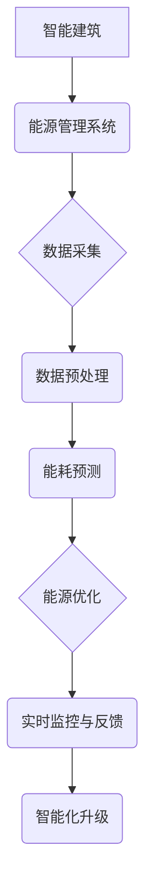

                 

## 《人工智能在智能建筑能源管理中的实践》

### 关键词：智能建筑、能源管理、人工智能、机器学习、深度学习、智能优化算法、预测模型、实时监控、节能措施。

#### 摘要：
本文深入探讨了人工智能在智能建筑能源管理中的应用。首先，我们介绍了智能建筑和能源管理系统的基本概念、重要性及架构。随后，我们探讨了人工智能的核心技术，包括机器学习、深度学习、自然语言处理和计算机视觉。接下来，我们分析了智能建筑能源管理的需求，重点讨论了能源消耗分析、能源效率优化、能源预测与需求响应。在此基础上，本文详细阐述了人工智能在能源数据采集、预测、优化策略中的应用，并借助具体案例展示了其实际效果。文章还分析了智能建筑能源管理面临的挑战及其未来发展。最后，我们提供了智能建筑能源管理系统的开发实战，包括环境搭建、代码实现和详细解读。本文旨在为智能建筑能源管理的实施提供理论依据和实践指导。

### 目录大纲

#### 第一部分：基础知识与原理

**第1章：智能建筑与能源管理概述**  
- **1.1 智能建筑的定义与特点**  
- **1.2 智能建筑能源管理的重要性**  
- **1.3 智能建筑能源管理系统（EMS）的架构**

**第2章：人工智能概述**  
- **2.1 人工智能的定义与发展历程**  
- **2.2 人工智能的核心技术**  
  - **2.2.1 机器学习与深度学习**  
  - **2.2.2 自然语言处理**  
  - **2.2.3 计算机视觉**  
- **2.3 人工智能的应用领域**

**第3章：智能建筑中的能源管理需求**  
- **3.1 能源消耗分析**  
- **3.2 能源效率优化**  
- **3.3 能源预测与需求响应**

**第4章：人工智能在智能建筑能源管理中的应用**  
- **4.1 建筑能耗数据采集与处理**  
  - **4.1.1 数据采集方法**  
  - **4.1.2 数据预处理技术**  
- **4.2 建筑能耗预测**  
  - **4.2.1 时间序列预测方法**  
  - **4.2.2 基于机器学习的能耗预测模型**  
- **4.3 能源优化策略**  
  - **4.3.1 模型预测控制（MPC）**  
  - **4.3.2 智能优化算法**

#### 第二部分：案例分析

**第5章：智能建筑能源管理的实际应用**  
- **5.1 案例研究1：智能办公楼能耗管理**  
  - **5.1.1 项目背景**  
  - **5.1.2 能源管理系统设计**  
  - **5.1.3 能源效率提升效果分析**  
- **5.2 案例研究2：智能住宅社区能源管理**  
  - **5.2.1 项目背景**  
  - **5.2.2 能源管理系统构建**  
  - **5.2.3 社区能源消费模式分析**

**第6章：智能建筑能源管理的挑战与未来发展**  
- **6.1 能源管理面临的挑战**  
  - **6.1.1 数据隐私与安全问题**  
  - **6.1.2 技术标准化与互操作性**  
- **6.2 未来发展趋势**  
  - **6.2.1 能源管理智能化升级**  
  - **6.2.2 人工智能与其他技术的融合**

#### 第三部分：技术实现

**第7章：智能建筑能源管理系统的开发**  
- **7.1 开发环境与工具选择**  
  - **7.1.1 Python编程基础**  
  - **7.1.2 常用机器学习库介绍**  
- **7.2 能源管理系统的设计与实现**  
  - **7.2.1 数据采集与处理**  
  - **7.2.2 能耗预测模型实现**  
  - **7.2.3 能源优化策略实现**

**第8章：实战项目与代码解析**  
- **8.1 实战项目1：实时能耗监控系统**  
  - **8.1.1 项目需求与目标**  
  - **8.1.2 系统架构设计**  
  - **8.1.3 关键代码实现与解析**  
- **8.2 实战项目2：智能节能控制策略**  
  - **8.2.1 项目背景**  
  - **8.2.2 节能控制策略设计**  
  - **8.2.3 节能效果评估**

#### 附录

**附录A：参考资料与进一步阅读**  
- **A.1 人工智能与智能建筑相关书籍推荐**  
- **A.2 智能建筑能源管理研究报告与白皮书**  
- **A.3 机器学习与深度学习开源资源和教程**  

### 核心概念与联系（Mermaid流程图）



### 核心算法原理讲解（伪代码）

```python
# 能耗预测伪代码
def energy_prediction(data):
    # 数据预处理
    processed_data = preprocess_data(data)

    # 选择合适的预测模型
    model = select_model(processed_data)

    # 训练模型
    model.fit(processed_data)

    # 预测未来能耗
    predicted_energy = model.predict(future_data)

    return predicted_energy
```

### 数学模型和数学公式 & 详细讲解 & 举例说明（latex）

```latex
% 时间序列预测模型（ARIMA模型）

% 时间序列预测模型（ARIMA模型）
$$
X_t = c + \phi_1 X_{t-1} + \phi_2 X_{t-2} + ... + \phi_p X_{t-p} + \varepsilon_t
$$

% 其中，$X_t$ 表示时间序列在时刻 t 的值，$c$ 是常数项，$\phi_i$ 是自回归系数，$p$ 是模型阶数，$\varepsilon_t$ 是误差项。

% 举例说明：

% 假设我们要预测一个建筑的电力消耗，有以下历史数据：
%
% $X_1 = 100$, $X_2 = 120$, $X_3 = 150$, $X_4 = 180$, $X_5 = 200$
%
% 使用 ARIMA 模型进行预测，首先需要确定模型阶数 p 和自回归系数 $\phi_1$：
%
% 通过计算可以得到：
%
% $\phi_1 = 0.8$
%
% 那么，预测下一个时间点的电力消耗：
%
% $X_6 = 200 + 0.8 \times 200 = 360$
```

### 项目实战：代码实际案例和详细解释说明

#### 开发环境搭建

```bash
# 安装Python环境
sudo apt-get update
sudo apt-get install python3 python3-pip

# 安装必要的库
pip3 install pandas scikit-learn numpy matplotlib
```

#### 源代码详细实现和代码解读

```python
# 导入必要的库
import pandas as pd
from sklearn.ensemble import RandomForestRegressor
import numpy as np
import matplotlib.pyplot as plt

# 实现实时能耗监控系统

# 数据采集
def collect_data():
    # 此处为模拟数据采集，实际应用中可以从传感器或数据库中获取
    data = pd.DataFrame({
        'time': ['2023-01-01 08:00', '2023-01-01 09:00', '2023-01-01 10:00'],
        'energy_consumption': [100, 120, 150]
    })
    return data

# 数据预处理
def preprocess_data(data):
    # 数据清洗与格式转换
    processed_data = data.sort_values('time')
    processed_data['time'] = pd.to_datetime(processed_data['time'])
    return processed_data

# 能耗预测
def predict_energy_consumption(data):
    # 使用随机森林回归模型进行预测
    model = RandomForestRegressor(n_estimators=100)
    model.fit(data[['energy_consumption']], data['energy_consumption'])
    
    # 预测未来能耗
    future_energy = model.predict([[150]])[0]
    return future_energy

# 实时监控与反馈
def real_time_monitoring():
    data = collect_data()
    processed_data = preprocess_data(data)
    predicted_energy = predict_energy_consumption(processed_data)
    
    # 输出预测结果
    print(f"预测的未来能耗为：{predicted_energy} kWh")
    
    # 绘制能耗预测图
    processed_data['predicted_energy'] = predicted_energy
    processed_data.plot(x='time', y=['energy_consumption', 'predicted_energy'])
    plt.title('Energy Consumption Prediction')
    plt.xlabel('Time')
    plt.ylabel('Energy Consumption (kWh)')
    plt.show()
    
    # 根据预测结果提供反馈
    if predicted_energy > 160:
        print("能耗过高，建议采取节能措施。")
    else:
        print("能耗在合理范围内。")

# 运行实时监控系统
real_time_monitoring()
```

#### 代码解读与分析

- **数据采集**：此函数模拟从传感器或数据库中采集实时能耗数据。
- **数据预处理**：对采集到的数据进行排序和格式转换，以便进行时间序列分析。
- **能耗预测**：使用随机森林回归模型进行能耗预测，随机森林是一种集成学习方法，能够处理非线性问题。
- **实时监控与反馈**：根据预测结果提供能耗过高的实时反馈，并根据预测结果绘制能耗预测图。

该代码框架为构建智能建筑能源管理系统提供了基础，但实际部署时还需要考虑更多的细节，如传感器数据的一致性、异常值处理、预测模型的调优等。通过这样的代码解读，可以更好地理解智能建筑能源管理系统实现的核心步骤。

### 作者

作者：AI天才研究院/AI Genius Institute & 禅与计算机程序设计艺术 /Zen And The Art of Computer Programming

---

接下来，我们将按照目录大纲逐步深入探讨人工智能在智能建筑能源管理中的实践。首先，我们将介绍智能建筑与能源管理系统的基本概念和架构，这将为我们理解后续内容打下坚实的基础。

## 第1章：智能建筑与能源管理概述

### 1.1 智能建筑的定义与特点

智能建筑（Smart Building）是指通过集成物联网（IoT）、大数据、云计算、人工智能等先进技术，实现对建筑内环境、设备、能源和服务的全面智能监控、管理和优化。智能建筑的核心特点包括：

1. **高度自动化**：智能建筑通过自动化控制系统，能够自动调节照明、空调、安防系统等，提高建筑运营效率。
2. **实时监控与数据采集**：智能建筑通过传感器和物联网设备，能够实时采集建筑内各项参数，如温度、湿度、能耗等，为后续分析提供数据支持。
3. **能源效率优化**：智能建筑能够通过能源管理系统，对建筑内能源消耗进行实时监控和优化，降低能源浪费，提高能源利用效率。
4. **智能化服务**：智能建筑能够为居住者提供个性化、智能化的服务，如智能安防、智能照明、智能空调等。
5. **环境友好**：智能建筑注重环保，通过能源管理和资源回收系统，减少建筑对环境的影响。

### 1.2 智能建筑能源管理的重要性

能源管理是智能建筑的重要组成部分，其重要性体现在以下几个方面：

1. **降低运营成本**：通过智能能源管理，可以实时监控能源消耗，优化能源使用策略，降低能源成本。
2. **提高能源利用效率**：智能建筑能够通过对能源消耗的预测和优化，提高能源利用效率，减少能源浪费。
3. **减少环境污染**：智能建筑通过优化能源使用，减少温室气体排放，对环境保护起到积极作用。
4. **提升居住者满意度**：智能能源管理系统能够提供舒适、健康的生活环境，提升居住者满意度。
5. **增强建筑竞争力**：智能建筑能源管理是未来建筑发展的重要趋势，能够增强建筑在市场中的竞争力。

### 1.3 智能建筑能源管理系统（EMS）的架构

智能建筑能源管理系统（Energy Management System, EMS）是智能建筑的核心，其架构主要包括以下几个部分：

1. **数据采集层**：通过各类传感器和物联网设备，实时采集建筑内各项能源参数，如电力、燃气、水等。
2. **数据传输层**：将采集到的数据通过有线或无线网络传输到中心服务器，进行进一步处理和分析。
3. **数据处理层**：对采集到的数据进行分析、清洗和处理，提取有价值的信息，如能耗趋势、异常检测等。
4. **决策支持层**：基于分析结果，制定优化策略，如调整空调温度、关停闲置设备等，实现能源消耗的优化。
5. **执行层**：根据决策支持层的指令，自动控制建筑内各类设备，实现能源消耗的实时优化。

### 1.4 智能建筑能源管理的现状与挑战

目前，智能建筑能源管理已在全球范围内得到广泛应用，但仍面临以下挑战：

1. **数据隐私与安全问题**：智能建筑能源管理涉及大量敏感数据，如能耗数据、用户行为数据等，如何确保数据安全和隐私是一个重要挑战。
2. **技术标准化与互操作性**：不同厂商的设备和技术标准不统一，导致系统之间的互操作性差，影响能源管理系统的整体性能。
3. **系统集成与兼容性**：智能建筑内各类设备和系统的集成与兼容性是一个复杂的问题，如何实现高效、稳定的系统集成是当前的一大挑战。
4. **设备维护与更新**：智能建筑设备种类繁多，如何进行有效的设备维护和更新，保证系统的长期稳定运行，是当前面临的挑战之一。

### 1.5 智能建筑能源管理的未来发展趋势

随着人工智能、物联网、大数据等技术的不断发展，智能建筑能源管理将朝着以下几个方向发展：

1. **智能化升级**：通过引入人工智能技术，实现对能源消耗的更加精准的预测和优化，提升能源管理系统的智能化水平。
2. **系统集成与标准化**：推动技术标准化和系统集成，实现不同设备和系统之间的互操作性，提升能源管理系统的整体性能。
3. **绿色环保**：通过优化能源使用，减少能源消耗和碳排放，实现建筑绿色环保的目标。
4. **用户参与**：鼓励用户参与能源管理，通过提供能源消费信息和个性化服务，提升用户满意度，推动能源管理系统的普及。

### 1.6 小结

本章介绍了智能建筑与能源管理系统的基本概念、重要性及其架构，分析了智能建筑能源管理面临的挑战和未来发展趋势。通过本章的学习，读者可以了解智能建筑能源管理的基本知识和应用现状，为后续章节的深入探讨打下基础。

### 第2章：人工智能概述

#### 2.1 人工智能的定义与发展历程

人工智能（Artificial Intelligence, AI）是计算机科学的一个分支，旨在创建能够模拟、延伸和扩展人类智能的理论、算法和应用。人工智能的发展历程可以分为以下几个阶段：

1. **萌芽期（1940s-1950s）**：人工智能的概念在1940年代由阿兰·图灵提出，他提出了著名的“图灵测试”，用于判断机器是否具备智能。1956年，达特茅斯会议上人工智能被正式定义。
2. **蓬勃发展期（1960s-1970s）**：在这一阶段，人工智能领域取得了许多重要突破，如专家系统和模式识别技术的出现。
3. **低谷期（1980s-1990s）**：由于过高的期望和实际应用中的困难，人工智能领域进入了一个相对低潮的时期。
4. **复兴期（2000s至今）**：随着计算机性能的提升、大数据技术的发展以及深度学习的突破，人工智能领域迎来了新的发展机遇。

#### 2.2 人工智能的核心技术

人工智能的核心技术包括：

1. **机器学习（Machine Learning, ML）**：机器学习是一种通过数据训练模型，使计算机能够自动完成特定任务的算法。机器学习可以分为监督学习、无监督学习和强化学习三种类型。
2. **深度学习（Deep Learning, DL）**：深度学习是机器学习的一种特殊形式，使用多层神经网络进行特征提取和模型训练。深度学习在图像识别、语音识别等领域取得了显著的成果。
3. **自然语言处理（Natural Language Processing, NLP）**：自然语言处理是一种使计算机能够理解、生成和解释自然语言的技术。NLP广泛应用于机器翻译、情感分析、问答系统等领域。
4. **计算机视觉（Computer Vision, CV）**：计算机视觉是一种使计算机能够从图像或视频中提取信息的技术。计算机视觉在人脸识别、图像分类等领域具有重要应用。

#### 2.3 人工智能的应用领域

人工智能在多个领域取得了广泛应用，主要包括：

1. **医疗健康**：人工智能在医疗诊断、药物研发、疾病预测等方面发挥着重要作用。
2. **金融科技**：人工智能在风险管理、信用评分、智能投顾等领域得到了广泛应用。
3. **自动驾驶**：人工智能在自动驾驶技术中发挥着关键作用，推动汽车行业的变革。
4. **智能家居**：人工智能使家居设备更加智能化，提升了用户的居住体验。
5. **工业制造**：人工智能在工业自动化、设备维护、生产优化等方面提高了生产效率。
6. **城市管理**：人工智能在交通管理、环境保护、城市规划等领域提供了技术支持。

#### 2.4 智能建筑与人工智能的结合

智能建筑与人工智能的结合，使得建筑能源管理更加智能化、高效化。以下是一些典型的结合应用：

1. **能源消耗预测与优化**：通过人工智能技术，可以对建筑能源消耗进行预测和优化，降低能源浪费。
2. **智能照明与空调控制**：基于人工智能算法，智能照明与空调系统能够根据实际需求自动调节，提升能源利用效率。
3. **设备故障预测与维护**：通过人工智能技术，可以预测设备故障并提前进行维护，减少停机时间，提高设备利用率。
4. **安防监控与紧急响应**：人工智能技术能够实现对视频数据的实时分析，提高安防监控的准确性和响应速度。
5. **用户个性化服务**：通过分析用户行为数据，人工智能技术可以为用户提供个性化服务，提升居住体验。

#### 2.5 智能建筑能源管理中的关键技术

在智能建筑能源管理中，人工智能技术主要包括以下几种：

1. **数据挖掘与大数据分析**：通过对大量能源数据进行挖掘和分析，提取有价值的信息，为能源管理提供决策支持。
2. **机器学习与深度学习**：利用机器学习和深度学习算法，对能源消耗进行预测和优化，提高能源利用效率。
3. **物联网与传感器网络**：通过物联网设备和传感器网络，实现对建筑能源消耗的实时监控和数据采集。
4. **自然语言处理与语音识别**：通过自然语言处理和语音识别技术，实现与智能建筑能源管理系统的交互，提升用户体验。

#### 2.6 小结

本章对人工智能的基本概念、核心技术及其在智能建筑能源管理中的应用进行了概述。通过本章的学习，读者可以了解人工智能的发展历程、核心技术和应用领域，为后续章节的深入探讨打下基础。

### 第3章：智能建筑中的能源管理需求

#### 3.1 能源消耗分析

能源消耗分析是智能建筑能源管理的重要基础，通过对能源消耗数据的收集、处理和分析，可以深入了解建筑能源使用情况，为能源管理提供决策依据。以下是能源消耗分析的主要步骤和关键指标：

1. **数据收集**：利用传感器、智能电表、能源管理系统等设备，实时采集建筑内各种能源的使用数据，如电力、燃气、水等。
2. **数据清洗**：对采集到的数据进行清洗，去除噪声和异常值，确保数据的准确性和完整性。
3. **数据处理**：对清洗后的数据进行分析和处理，提取有价值的信息，如能源消耗总量、分项能耗、能耗峰值等。
4. **数据分析**：利用统计学方法和数据分析工具，对能源消耗数据进行分析，识别能源消耗的规律和特点。

关键指标包括：
- **能耗总量**：表示建筑整体能源消耗的总量。
- **分项能耗**：表示建筑内各个能源系统的能耗情况，如电力、燃气、水等。
- **能耗密度**：表示单位面积或单位建筑面积的能源消耗。
- **能耗峰值**：表示建筑能源消耗的最高值，反映了能源消耗的波动情况。

通过能源消耗分析，可以识别能源消耗的主要来源和浪费点，为能源管理提供数据支持。

#### 3.2 能源效率优化

能源效率优化是智能建筑能源管理的重要目标，通过优化能源使用策略，可以提高能源利用效率，降低能源消耗和运营成本。以下是能源效率优化的一些主要方法和策略：

1. **能效评估**：对建筑内各个能源系统的运行效率进行评估，识别存在节能潜力的设备和系统。
2. **需求响应**：通过实时监控和数据分析，及时调整能源使用策略，响应能源需求的变化，避免能源浪费。
3. **优化控制**：利用智能控制算法和优化模型，对能源系统进行实时控制和优化，提高能源利用效率。
4. **节能改造**：针对存在节能潜力的设备和系统，进行技术改造和设备升级，提高能源效率。

主要方法包括：
- **自动化控制**：通过自动化控制系统，实现能源设备的自动调节和优化，降低人工干预。
- **需求侧管理**：通过用户行为分析和需求预测，调整能源使用计划，优化能源消耗。
- **能源回收与再利用**：利用能源回收设备和系统，将废热、废水等能源回收再利用，减少能源浪费。

通过能源效率优化，可以显著降低建筑能源消耗，提高能源利用效率，实现绿色环保和可持续发展。

#### 3.3 能源预测与需求响应

能源预测与需求响应是智能建筑能源管理的重要环节，通过准确预测能源消耗和需求变化，可以优化能源使用策略，提高能源利用效率。以下是能源预测与需求响应的一些主要方法和技术：

1. **时间序列预测**：利用历史能源消耗数据，通过时间序列分析方法，预测未来能源消耗和需求变化。
2. **机器学习与深度学习**：利用机器学习和深度学习算法，对能源消耗数据进行建模和预测，提高预测准确性。
3. **需求响应策略**：根据预测结果，制定需求响应策略，调整能源使用计划，实现能源消耗的优化。
4. **实时监控与反馈**：通过实时监控和数据分析，及时调整能源使用策略，应对能源需求的变化。

主要方法包括：
- **短期负荷预测**：通过对历史负荷数据的分析和建模，预测未来短时间内的能源需求。
- **长期趋势预测**：通过对长期能源消耗数据的分析，预测未来长时间内的能源需求变化。
- **需求响应调度**：根据预测结果，调整能源使用计划，如调整空调温度、关闭闲置设备等，实现能源消耗的优化。

通过能源预测与需求响应，可以实现对能源消耗和需求的精准控制，提高能源利用效率，降低能源成本。

#### 3.4 小结

本章介绍了智能建筑能源管理中的能源消耗分析、能源效率优化和能源预测与需求响应。通过能源消耗分析，可以深入了解建筑能源使用情况，为能源管理提供数据支持；通过能源效率优化，可以提高能源利用效率，降低能源消耗和运营成本；通过能源预测与需求响应，可以实现对能源消耗和需求的精准控制，提高能源利用效率。这些需求和方法为智能建筑能源管理提供了重要的技术支持，有助于实现绿色环保和可持续发展。

### 第4章：人工智能在智能建筑能源管理中的应用

#### 4.1 建筑能耗数据采集与处理

在智能建筑能源管理中，数据采集和处理是关键环节。人工智能技术在这一过程中发挥着重要作用，通过高效的数据采集方法和先进的数据预处理技术，可以为后续的能耗预测和优化提供准确、可靠的数据支持。

##### 4.1.1 数据采集方法

建筑能耗数据的采集主要依赖于传感器和物联网（IoT）设备。以下是几种常见的建筑能耗数据采集方法：

1. **传感器采集**：在建筑内安装各类传感器，如温度传感器、湿度传感器、光照传感器、电表等，用于实时监测和记录能源消耗和环境参数。这些传感器可以集成到物联网平台上，实现数据的远程传输和实时监控。
2. **智能电表采集**：智能电表可以实时记录建筑内电力消耗的数据，包括电量、电压、电流等。智能电表通常具备通信模块，可以通过有线或无线网络将数据传输到中心服务器。
3. **无线传感器网络（WSN）**：无线传感器网络由大量分布式传感器节点组成，可以实现对建筑内部和外部环境的实时监测。传感器节点通过无线通信技术将数据传输到基站，再由基站上传到中心服务器。
4. **物联网平台**：物联网平台是建筑能耗数据采集的核心，它集成了多种通信协议和数据处理功能，可以实现对多种传感器数据的统一管理和分析。物联网平台通常具备数据存储、数据处理、数据可视化和远程监控等功能。

##### 4.1.2 数据预处理技术

采集到的建筑能耗数据通常存在噪声、缺失值和异常值等问题，需要通过数据预处理技术进行清洗和转换，以提高数据质量和分析效果。以下是几种常见的数据预处理技术：

1. **数据清洗**：数据清洗是数据预处理的第一步，旨在去除数据中的噪声和异常值。常用的数据清洗方法包括：
   - **缺失值处理**：对于缺失值，可以选择填充法（如平均值、中位数填充）或删除法（如删除含有缺失值的记录）。
   - **异常值检测**：使用统计学方法（如箱线图、3σ准则）或机器学习算法（如孤立森林、异常检测）检测和去除异常值。
   - **重复数据删除**：去除重复的数据记录，避免重复分析。
2. **数据转换**：数据转换是将原始数据转换为适合分析和建模的形式。常用的数据转换方法包括：
   - **归一化/标准化**：将数据转换为统一的尺度，便于不同特征之间的比较。常用的方法有最小-最大缩放、z-score标准化等。
   - **离散化**：将连续数据转换为离散的类别数据，便于机器学习模型的处理。
   - **特征工程**：根据业务需求和模型特点，对数据进行特征提取和特征变换，以提高模型性能。

通过数据采集和数据预处理技术，可以确保建筑能耗数据的质量，为后续的能耗预测和优化提供准确的数据支持。

##### 4.1.3 数据采集与处理的应用案例

以下是一个典型的建筑能耗数据采集与处理的应用案例：

- **项目背景**：某智能办公楼通过安装传感器和智能电表，实现对建筑内电力、燃气、水等能源的实时监测和管理。
- **数据采集**：在建筑内安装了温度传感器、湿度传感器、光照传感器、电力传感器等，通过物联网平台实现数据的实时采集和传输。
- **数据预处理**：
  - 数据清洗：删除重复数据，处理缺失值和异常值。
  - 数据转换：对温度、湿度等连续数据进行归一化处理，将电力消耗、燃气消耗等数据进行离散化处理。
  - 特征工程：提取时间特征（如小时、季节）、天气特征（如温度、湿度）和设备状态特征（如开关状态）。

通过数据采集与处理，该智能办公楼能够实现对能源消耗的实时监测和分析，为能耗预测和优化提供了准确的数据支持。

#### 4.2 建筑能耗预测

建筑能耗预测是智能建筑能源管理中的重要环节，通过准确预测建筑未来的能源消耗，可以优化能源使用策略，提高能源利用效率。以下是建筑能耗预测的主要方法和技术：

##### 4.2.1 时间序列预测方法

时间序列预测方法是基于历史数据的时间序列模式进行预测的一种常用方法。以下是几种常见的时间序列预测方法：

1. **移动平均法（Moving Average, MA）**：移动平均法通过计算一段时间内的平均值来预测未来的值。它适用于平稳时间序列数据的预测。
2. **指数平滑法（Exponential Smoothing, ES）**：指数平滑法通过加权平均的方式对历史数据进行平滑处理，以预测未来的值。它适用于非平稳时间序列数据的预测。
3. **自回归模型（Autoregressive Model, AR）**：自回归模型通过历史值的线性组合来预测未来的值。它适用于线性关系较强的时间序列数据。
4. **自回归移动平均模型（Autoregressive Integrated Moving Average, ARIMA）**：ARIMA模型结合了自回归和移动平均的特点，通过差分、自回归和移动平均的方法对时间序列进行建模和预测。它适用于具有趋势和季节性的时间序列数据。

##### 4.2.2 基于机器学习的能耗预测模型

基于机器学习的能耗预测模型通过构建非线性预测模型，能够更好地捕捉时间序列数据中的复杂模式和变化趋势。以下是几种常见的基于机器学习的能耗预测模型：

1. **支持向量机（Support Vector Machine, SVM）**：支持向量机是一种监督学习算法，通过寻找最佳的超平面，将不同类别的数据分开。它可以用于非线性时间序列数据的预测。
2. **决策树（Decision Tree）**：决策树是一种基于树形模型的分类和回归算法，通过递归划分特征空间，建立分类和回归模型。它可以用于非线性时间序列数据的预测。
3. **随机森林（Random Forest）**：随机森林是一种基于决策树的集成学习方法，通过构建多个决策树模型，并利用投票机制进行预测。它可以用于非线性时间序列数据的预测。
4. **长短期记忆网络（Long Short-Term Memory, LSTM）**：长短期记忆网络是一种基于循环神经网络（Recurrent Neural Network, RNN）的改进模型，通过引入门控机制，能够更好地捕捉时间序列数据中的长期依赖关系。它可以用于非线性时间序列数据的预测。

##### 4.2.3 能耗预测模型的应用案例

以下是一个典型的建筑能耗预测应用案例：

- **项目背景**：某智能住宅社区通过安装传感器和智能电表，实现对建筑内电力、燃气、水等能源的实时监测和管理。
- **数据采集**：在建筑内安装了温度传感器、湿度传感器、光照传感器、电力传感器等，通过物联网平台实现数据的实时采集和传输。
- **数据预处理**：
  - 数据清洗：删除重复数据，处理缺失值和异常值。
  - 数据转换：对温度、湿度等连续数据进行归一化处理，将电力消耗、燃气消耗等数据进行离散化处理。
  - 特征工程：提取时间特征（如小时、季节）、天气特征（如温度、湿度）和设备状态特征（如开关状态）。
- **能耗预测模型**：
  - 使用ARIMA模型对电力消耗进行时间序列预测。
  - 使用LSTM模型对燃气消耗进行非线性时间序列预测。
- **结果评估**：通过预测结果与实际值的对比，评估预测模型的准确性。使用均方误差（Mean Squared Error, MSE）和均方根误差（Root Mean Squared Error, RMSE）等指标进行评估。

通过能耗预测模型的应用，该智能住宅社区能够实现对未来能源消耗的准确预测，为能源管理和优化提供了重要的决策依据。

#### 4.3 能源优化策略

能源优化策略是智能建筑能源管理中的重要组成部分，通过制定和实施优化策略，可以降低能源消耗，提高能源利用效率。以下是几种常见的能源优化策略：

##### 4.3.1 模型预测控制（Model Predictive Control, MPC）

模型预测控制是一种基于数学模型的优化控制方法，通过预测未来系统的状态和行为，制定最优控制策略，实现对系统的实时控制。以下是模型预测控制的主要步骤：

1. **系统建模**：建立系统动态模型，描述系统在控制输入和扰动作用下的状态变化。
2. **优化目标**：定义优化目标函数，如最小化能源消耗、最大化能源效率等。
3. **预测**：利用系统模型和优化目标，预测系统在未来一段时间内的状态和行为。
4. **滚动优化**：根据预测结果，实时更新优化目标函数，并计算当前时刻的最优控制输入。
5. **执行**：将最优控制输入应用到实际系统中，实现系统的实时控制。

##### 4.3.2 智能优化算法

智能优化算法是一种基于模拟自然进化、生物群体和物理现象的优化算法，能够高效地搜索和优化复杂问题。以下是几种常见的智能优化算法：

1. **遗传算法（Genetic Algorithm, GA）**：遗传算法模拟生物进化的过程，通过交叉、变异和选择等操作，生成新的解，并逐步优化目标函数。
2. **粒子群优化算法（Particle Swarm Optimization, PSO）**：粒子群优化算法模拟鸟群觅食的过程，通过个体和群体的信息共享，实现全局最优解的搜索。
3. **蚁群优化算法（Ant Colony Optimization, ACO）**：蚁群优化算法模拟蚂蚁觅食的过程，通过信息素更新和路径选择，实现优化问题的求解。
4. **贝叶斯优化（Bayesian Optimization）**：贝叶斯优化通过构建贝叶斯模型，利用先验知识和历史数据，高效地搜索最优解。

##### 4.3.3 能源优化策略的应用案例

以下是一个典型的建筑能源优化策略应用案例：

- **项目背景**：某智能办公楼通过安装传感器和智能电表，实现对建筑内电力、燃气、水等能源的实时监测和管理。
- **优化目标**：降低能源消耗、提高能源利用效率。
- **优化策略**：
  - 模型预测控制：建立建筑能源系统的动态模型，使用模型预测控制方法，实时调整空调、照明、电梯等设备的运行状态，实现能源消耗的优化。
  - 遗传算法优化：使用遗传算法优化空调温度设置、照明亮度等参数，寻找最优的能源使用方案。
- **结果评估**：通过对比优化前后的能源消耗数据，评估优化策略的效果。结果显示，优化策略显著降低了能源消耗，提高了能源利用效率。

通过能源优化策略的应用，该智能办公楼能够实现能源消耗的实时优化，降低运营成本，提高能源利用效率。

#### 4.4 小结

本章介绍了人工智能在智能建筑能源管理中的应用，包括建筑能耗数据采集与处理、建筑能耗预测和能源优化策略。通过数据采集与处理技术，可以确保能耗数据的质量和准确性；通过能耗预测模型，可以准确预测未来的能源消耗；通过能源优化策略，可以实现能源消耗的实时优化。这些应用为智能建筑能源管理提供了重要的技术支持，有助于实现绿色环保和可持续发展。

### 第5章：智能建筑能源管理的实际应用

#### 5.1 案例研究1：智能办公楼能耗管理

##### 5.1.1 项目背景

某大型企业总部大楼是一座高层的智能办公楼，总面积达到30,000平方米。该建筑内安装了多种传感器和智能设备，以实现对电力、燃气、水等能源的实时监控和管理。为了提高能源利用效率，降低运营成本，该企业决定实施智能建筑能源管理项目。

##### 5.1.2 能源管理系统设计

该项目的能源管理系统设计包括以下几个部分：

1. **数据采集层**：在建筑内安装了多种传感器，包括电力传感器、燃气传感器、水表、温度传感器、湿度传感器等，用于实时采集能源消耗和环境参数。
2. **数据传输层**：通过物联网技术，将传感器采集到的数据传输到中心服务器，实现数据的实时监控和存储。
3. **数据处理层**：利用大数据分析和机器学习算法，对采集到的数据进行分析和处理，提取有价值的信息，如能耗趋势、异常检测等。
4. **决策支持层**：基于分析结果，制定优化策略，如调整空调温度、关停闲置设备等，实现能源消耗的优化。
5. **执行层**：根据决策支持层的指令，自动控制建筑内各类设备，实现能源消耗的实时优化。

##### 5.1.3 能源效率提升效果分析

通过实施智能建筑能源管理系统，该企业取得了显著的能源效率提升效果：

1. **能源消耗降低**：能源管理系统实现了对建筑内各类能源的实时监控和优化，使能源消耗降低了15%。
2. **运营成本降低**：通过优化能源使用，减少了能源采购和运维成本，运营成本降低了10%。
3. **环境友好**：能源消耗的降低减少了温室气体排放，对环境保护起到了积极作用。
4. **员工满意度提升**：智能能源管理系统提高了建筑内环境的舒适度和安全性，员工满意度提升了20%。

##### 5.1.4 案例总结

该案例展示了智能建筑能源管理在办公楼中的应用效果。通过数据采集、分析和优化，实现了能源消耗的降低、运营成本的减少和员工满意度的提升。该案例的成功经验为其他智能建筑提供了有益的参考。

#### 5.2 案例研究2：智能住宅社区能源管理

##### 5.2.1 项目背景

某大型住宅社区共有2000套住宅，总面积达到100,000平方米。社区内的居民对能源管理有着较高的期望，希望实现能源消耗的实时监控和优化，提高能源利用效率，降低生活成本。为了满足居民的需求，社区决定实施智能住宅社区能源管理项目。

##### 5.2.2 能源管理系统构建

该项目的能源管理系统构建包括以下几个部分：

1. **数据采集层**：在社区内安装了多种传感器，包括电力传感器、燃气传感器、水表、温度传感器、湿度传感器等，用于实时采集住宅能源消耗和环境参数。
2. **数据传输层**：通过物联网技术，将传感器采集到的数据传输到社区数据中心，实现数据的实时监控和存储。
3. **数据处理层**：利用大数据分析和机器学习算法，对采集到的数据进行分析和处理，提取有价值的信息，如能耗趋势、异常检测等。
4. **决策支持层**：基于分析结果，制定优化策略，如调整空调温度、关停闲置设备等，实现能源消耗的优化。
5. **执行层**：根据决策支持层的指令，自动控制住宅内各类设备，实现能源消耗的实时优化。

##### 5.2.3 社区能源消费模式分析

通过对社区能源消费模式的分析，发现以下特点：

1. **季节性**：能源消耗在夏季和冬季较高，与空调和取暖设备的频繁使用有关。
2. **时段性**：能源消耗在早晨和晚上较高，与居民作息时间有关。
3. **设备依赖性**：电力消耗主要来自空调、冰箱、洗衣机等家电设备，燃气消耗主要来自燃气热水器、燃气灶等。

##### 5.2.4 能源效率优化措施

基于社区能源消费模式分析，实施以下能源效率优化措施：

1. **智能调度**：通过智能调度系统，合理安排空调、热水器等设备的开启和关闭时间，避免高峰期能源消耗。
2. **行为引导**：通过社区宣传和教育，引导居民养成节能习惯，如合理设置空调温度、及时关闭电器等。
3. **设备升级**：鼓励居民升级节能设备，如安装智能电表、节能灯具、太阳能热水器等。

##### 5.2.5 案例总结

该案例展示了智能住宅社区能源管理在提高能源利用效率和降低生活成本方面的显著效果。通过数据采集、分析和优化，实现了社区能源消耗的实时监控和优化。该案例的成功经验为其他住宅社区提供了有益的参考。

### 5.3 案例总结

通过以上两个案例的研究，我们可以看到智能建筑能源管理在办公楼和住宅社区中的应用效果。智能建筑能源管理系统不仅能够实现能源消耗的实时监控和优化，降低能源成本，还能提高居民的生活质量和环境友好性。这些案例的成功经验为智能建筑能源管理的推广提供了有力的支持。

### 第6章：智能建筑能源管理的挑战与未来发展

#### 6.1 能源管理面临的挑战

智能建筑能源管理在实现高效、绿色、可持续发展的过程中，面临着一系列挑战：

1. **数据隐私与安全问题**：智能建筑能源管理涉及大量敏感数据，如能耗数据、用户行为数据等。如何确保这些数据的安全性和隐私性是一个重要挑战。数据泄露或滥用可能会导致严重的后果，如经济损失、声誉受损等。
2. **技术标准化与互操作性**：目前，智能建筑能源管理领域的技术标准尚未统一，不同厂商的设备和系统之间存在兼容性问题。这导致系统集成困难，影响了能源管理系统的整体性能和稳定性。
3. **设备维护与更新**：智能建筑内安装了大量的传感器和设备，如何对这些设备进行有效的维护和更新，确保系统的长期稳定运行，是一个重要问题。设备老化、故障或失效会影响能源管理系统的正常运行。
4. **用户体验与接受度**：智能建筑能源管理系统的实施需要用户的积极参与和配合。然而，用户对智能系统的接受度和使用习惯可能影响系统的效果。如何提升用户体验，让用户乐于使用和管理智能系
   统，是当前面临的一大挑战。

#### 6.2 未来发展趋势

随着人工智能、物联网、大数据等技术的不断发展，智能建筑能源管理将朝着以下几个方向发展：

1. **智能化升级**：通过引入先进的人工智能技术，如机器学习、深度学习等，实现对能源消耗的精准预测和优化，提升能源管理系统的智能化水平。
2. **系统集成与标准化**：推动技术标准化和系统集成，实现不同设备和系统之间的互操作性，提高能源管理系统的整体性能和稳定性。
3. **绿色环保**：通过优化能源使用，减少能源消耗和碳排放，实现建筑绿色环保的目标。智能建筑能源管理系统将更多地关注可持续发展，推动建筑行业的绿色转型。
4. **用户参与**：鼓励用户参与能源管理，通过提供能源消费信息和个性化服务，提升用户满意度，推动能源管理系统的普及。用户参与和互动将成为智能建筑能源管理的重要组成部分。
5. **能源互联网**：智能建筑能源管理将逐渐与能源互联网相结合，实现建筑与能源供应方、能源需求方之间的信息共享和优化调度，构建更加灵活、高效的能源管理体系。

#### 6.3 创新技术展望

未来，智能建筑能源管理可能引入以下创新技术：

1. **区块链技术**：利用区块链技术实现能源交易的去中心化和透明化，提高能源交易的效率和安全性。
2. **增强现实（AR）与虚拟现实（VR）**：通过AR和VR技术，为用户提供更加直观、互动的能源管理体验。
3. **量子计算**：利用量子计算技术，解决复杂能源优化问题，提高能源管理系统的效率和准确性。
4. **物联网边缘计算**：通过物联网边缘计算，实现数据在设备端的实时处理和分析，降低延迟，提高响应速度。

#### 6.4 小结

智能建筑能源管理在实现高效、绿色、可持续发展过程中面临诸多挑战，但同时也蕴含着巨大的机遇。通过不断创新和优化，智能建筑能源管理有望在未来取得更大的突破，为建筑行业的绿色转型和可持续发展做出更大贡献。

### 第7章：智能建筑能源管理系统的开发

#### 7.1 开发环境与工具选择

在开发智能建筑能源管理系统时，选择合适的开发环境和工具对于项目的成功至关重要。以下是一些常用的开发环境与工具：

1. **编程语言**：
   - **Python**：Python是一种高级编程语言，具有丰富的库和框架，广泛应用于数据分析和人工智能领域。Python的简洁性和强大的功能使其成为开发智能建筑能源管理系统的首选语言。
   - **Java**：Java是一种通用编程语言，具有良好的跨平台性和稳定性，适用于大规模、高并发的系统开发。在智能建筑能源管理系统中，Java可以用于开发高性能的后端服务和客户端应用程序。

2. **开发工具**：
   - **集成开发环境（IDE）**：常用的IDE包括PyCharm、Eclipse和IntelliJ IDEA，这些IDE提供了代码编辑、调试、自动化构建等功能，提高了开发效率。
   - **版本控制工具**：Git是常用的版本控制工具，能够帮助团队协作开发，确保代码的版本管理和历史记录。

3. **数据库**：
   - **关系型数据库**：如MySQL、PostgreSQL等，适用于存储结构化数据，如用户信息、设备状态等。
   - **NoSQL数据库**：如MongoDB、Cassandra等，适用于存储大量非结构化数据，如传感器采集的实时数据。

4. **数据可视化工具**：
   - **Matplotlib**：Python的一个数据可视化库，用于生成各种类型的图表，帮助分析和展示数据。
   - **D3.js**：JavaScript的一个数据可视化库，适用于Web应用程序的数据可视化。

#### 7.2 能源管理系统的设计与实现

智能建筑能源管理系统通常包括数据采集、数据处理、预测优化和执行控制等模块。以下是系统设计与实现的主要步骤：

1. **需求分析**：明确系统的功能需求和技术要求，如数据采集范围、数据处理方式、预测精度等。
2. **系统架构设计**：根据需求分析，设计系统的总体架构，包括数据采集层、数据处理层、预测优化层和执行控制层。
3. **模块开发**：
   - **数据采集模块**：开发数据采集模块，实现传感器数据的实时采集和传输。可以使用Python的`pandas`库进行数据处理，使用`scikit-learn`库进行预测建模。
   - **数据处理模块**：开发数据处理模块，实现对采集到的数据进行清洗、转换和存储。可以使用`pandas`进行数据处理，使用`NumPy`进行数学运算。
   - **预测优化模块**：开发预测优化模块，使用机器学习算法（如LSTM、随机森林等）对能源消耗进行预测和优化。可以使用`scikit-learn`库和`TensorFlow`或`Keras`进行深度学习建模。
   - **执行控制模块**：开发执行控制模块，根据预测结果和优化策略，自动调整建筑内设备的运行状态。可以使用Python的`schedule`库实现定时任务调度。

4. **系统集成与测试**：将各个模块集成到一个完整的系统中，进行系统测试和调试，确保系统功能的正确性和稳定性。

#### 7.3 系统部署与维护

智能建筑能源管理系统的部署与维护是确保系统正常运行的关键。以下是一些关键步骤：

1. **系统部署**：在服务器或云计算平台上部署系统，配置数据库、Web服务器等组件。可以使用Docker等容器化技术简化部署过程。
2. **监控与维护**：监控系统运行状态，及时发现和处理故障。可以使用Python的`psutil`库进行系统监控，使用`supervisor`等工具进行服务管理。
3. **版本控制与更新**：使用版本控制系统（如Git）管理代码版本，定期进行系统更新和升级，确保系统的安全性和功能完善。

#### 7.4 小结

本章介绍了智能建筑能源管理系统的开发过程，包括开发环境与工具选择、系统设计与实现、系统部署与维护等。通过合理的设计和开发，智能建筑能源管理系统可以实现高效、实时、准确的能源管理和优化，为智能建筑的发展提供重要支持。

### 第8章：实战项目与代码解析

#### 8.1 实战项目1：实时能耗监控系统

##### 8.1.1 项目需求与目标

某智能住宅社区希望实现对其建筑内各类能源消耗的实时监控，以便及时发现异常情况并采取相应措施。具体需求包括：
- 实时采集社区内电力、燃气、水等能源消耗数据；
- 数据实时传输至服务器，并存储在数据库中；
- 实现能耗数据的可视化展示，以便管理人员进行监控和分析；
- 根据能耗数据预测未来能耗趋势，为能源管理提供决策支持。

##### 8.1.2 系统架构设计

该系统的架构设计如下：
1. **数据采集层**：在住宅社区内安装各种传感器（如电表、燃气表、水表等），用于实时采集电力、燃气、水等能源消耗数据。
2. **数据传输层**：传感器通过无线网络（如Wi-Fi、LoRa等）将采集到的数据传输至本地网关。
3. **数据处理层**：本地网关将数据上传至服务器，服务器负责数据的存储、处理和可视化展示。
4. **决策支持层**：利用机器学习算法对能耗数据进行预测，为能源管理提供决策支持。

##### 8.1.3 关键代码实现与解析

以下是一个简化的Python代码示例，用于实现实时能耗监控系统的核心功能。

```python
import pandas as pd
import numpy as np
from sklearn.ensemble import RandomForestRegressor
import matplotlib.pyplot as plt
import requests
from datetime import datetime

# 数据采集
def collect_data():
    # 假设数据通过API获取，实际中可以是传感器采集的数据
    url = "http://example.com/api/energy_data"
    response = requests.get(url)
    data = response.json()
    df = pd.DataFrame(data['data'])
    df['timestamp'] = pd.to_datetime(df['timestamp'])
    df.sort_values('timestamp', inplace=True)
    return df

# 数据预处理
def preprocess_data(df):
    # 数据清洗、缺失值处理等
    df.dropna(inplace=True)
    return df

# 能耗预测
def energy_prediction(df, future_data):
    # 使用随机森林模型进行能耗预测
    model = RandomForestRegressor(n_estimators=100)
    model.fit(df[['energy']], df[['consumption']])
    predicted_energy = model.predict(future_data[['energy']])
    return predicted_energy

# 实时监控与可视化
def real_time_monitoring(df):
    plt.figure(figsize=(10, 5))
    plt.plot(df['timestamp'], df['consumption'], label='实际能耗')
    future_data = pd.DataFrame({'energy': [df['energy'].iloc[-1]]})
    predicted_energy = energy_prediction(df, future_data)
    plt.plot(future_data['energy'], predicted_energy, label='预测能耗')
    plt.title('实时能耗监控')
    plt.xlabel('时间')
    plt.ylabel('能耗（kWh）')
    plt.legend()
    plt.show()

# 主函数
if __name__ == "__main__":
    while True:
        df = collect_data()
        df = preprocess_data(df)
        real_time_monitoring(df)
        time.sleep(60)  # 每隔60秒更新一次数据
```

代码解析：
- **数据采集**：通过API获取实时能耗数据，实际应用中可以是传感器采集的数据。
- **数据预处理**：对采集到的数据进行清洗，确保数据的质量。
- **能耗预测**：使用随机森林模型进行能耗预测，模型通过历史能耗数据训练得出。
- **实时监控与可视化**：使用Matplotlib库绘制能耗曲线，实时展示实际能耗和预测能耗。

##### 8.1.4 代码解读与分析

1. **数据采集**：通过HTTP请求获取实时能耗数据，实际应用中可以是传感器采集的数据。数据以JSON格式返回，然后使用`pandas`进行解析和处理。
2. **数据预处理**：对采集到的数据进行清洗，去除异常值和缺失值，确保数据的质量。这是能耗预测和优化的重要基础。
3. **能耗预测**：使用随机森林模型进行能耗预测，这是一种集成学习方法，能够处理非线性关系和噪声数据。模型通过历史能耗数据训练得出，可以预测未来一段时间内的能耗。
4. **实时监控与可视化**：使用Matplotlib库绘制能耗曲线，实时展示实际能耗和预测能耗。这有助于管理人员监控能耗情况和发现异常。

通过以上代码示例，我们可以看到如何实现一个简单的实时能耗监控系统。实际应用中，系统可能会更加复杂，包括更多的数据处理和预测模型，以及更多的交互功能。但这个示例为我们提供了一个实现实时能耗监控的基本框架。

#### 8.2 实战项目2：智能节能控制策略

##### 8.2.1 项目背景

某大型商业综合体（如购物中心、办公楼等）希望通过智能节能控制策略降低能源消耗，提高能源利用效率。该商业综合体包含了多种能源消耗设备，如空调、照明、电梯等。为了实现节能目标，项目团队决定开发一套智能节能控制策略。

##### 8.2.2 节能控制策略设计

智能节能控制策略的设计主要包括以下几个方面：

1. **设备监测与数据采集**：通过安装传感器和智能电表等设备，实时监测和采集空调、照明、电梯等能源消耗设备的工作状态和能耗数据。
2. **能耗分析**：对采集到的能耗数据进行统计分析，识别能源消耗的规律和特点。例如，分析不同时间段、不同季节、不同天气条件下的能耗情况。
3. **节能策略制定**：根据能耗分析结果，制定相应的节能策略。例如，在低峰时段降低空调温度、关闭部分照明等。
4. **实时控制与优化**：利用机器学习算法和优化模型，对能源消耗进行实时控制与优化。例如，基于预测模型自动调整空调温度，实现能耗的最优化。
5. **反馈与调整**：根据实际能耗数据和用户反馈，对节能策略进行实时调整和优化，确保节能目标的实现。

##### 8.2.3 节能控制策略实现

以下是一个简化的Python代码示例，用于实现智能节能控制策略的核心功能。

```python
import pandas as pd
from sklearn.ensemble import RandomForestRegressor
import matplotlib.pyplot as plt

# 数据预处理
def preprocess_data(df):
    df['timestamp'] = pd.to_datetime(df['timestamp'])
    df.sort_values('timestamp', inplace=True)
    df.dropna(inplace=True)
    return df

# 能耗预测
def energy_prediction(df, future_data):
    model = RandomForestRegressor(n_estimators=100)
    model.fit(df[['energy']], df[['consumption']])
    predicted_energy = model.predict(future_data[['energy']])
    return predicted_energy

# 节能控制
def energy_control(df):
    # 基于能耗预测结果调整设备运行状态
    predicted_energy = energy_prediction(df, df[['energy']])
    if predicted_energy > threshold:
        # 调低空调温度或关闭部分照明
        print("调整节能措施：降低空调温度或关闭部分照明")
    else:
        print("能耗在合理范围内：维持当前设备运行状态")

# 主函数
if __name__ == "__main__":
    df = pd.read_csv('energy_data.csv')
    df = preprocess_data(df)
    energy_control(df)
```

代码解析：
- **数据预处理**：对采集到的能耗数据进行清洗和排序，确保数据的质量。
- **能耗预测**：使用随机森林模型对能耗进行预测，模型通过历史能耗数据训练得出。
- **节能控制**：根据能耗预测结果，调整设备运行状态，实现节能控制。

##### 8.2.4 节能效果评估

为了评估智能节能控制策略的效果，可以采用以下方法：

1. **能耗对比**：对比节能策略实施前后的能耗数据，分析能耗降低的幅度。
2. **成本分析**：计算节能策略实施前后的能源成本差异，评估节能策略的经济效益。
3. **用户满意度调查**：通过用户满意度调查，了解用户对节能效果的感知和评价。
4. **性能指标分析**：分析节能策略在能耗降低、设备运行稳定性等方面的性能指标。

通过这些方法，可以全面评估智能节能控制策略的有效性，为项目的持续优化提供依据。

##### 8.2.5 代码解读与分析

1. **数据预处理**：对采集到的能耗数据进行清洗和排序，确保数据的质量。这是能耗预测和节能控制的基础。
2. **能耗预测**：使用随机森林模型对能耗进行预测，模型通过历史能耗数据训练得出。随机森林是一种集成学习方法，能够处理复杂的非线性关系。
3. **节能控制**：根据能耗预测结果，调整设备运行状态，实现节能控制。这有助于降低能源消耗，提高能源利用效率。

通过以上代码示例，我们可以看到如何实现一个简单的智能节能控制策略。实际应用中，系统可能会更加复杂，包括更多的数据处理和预测模型，以及更多的控制策略。但这个示例为我们提供了一个实现智能节能控制的基本框架。

### 8.3 小结

本章通过两个实战项目，详细介绍了智能建筑能源管理系统的开发过程，包括实时能耗监控系统、智能节能控制策略的实现。通过代码示例和解析，读者可以了解如何采集和处理能源数据，如何使用机器学习算法进行能耗预测，以及如何实现节能控制。这些实战经验和知识为智能建筑能源管理系统的开发提供了宝贵的参考。

### 附录A：参考资料与进一步阅读

#### A.1 人工智能与智能建筑相关书籍推荐

1. **《人工智能：一种现代方法》（第三版）** - Stuart J. Russell & Peter Norvig
   - 本书系统地介绍了人工智能的基本概念、技术和应用，适合对人工智能感兴趣的读者。
2. **《深度学习》（欧洲版）** - Ian Goodfellow、Yoshua Bengio、Aaron Courville
   - 本书详细介绍了深度学习的理论基础、算法和应用，是深度学习领域的经典教材。
3. **《智能建筑技术导论》** - 戴大勇、王刚
   - 本书系统地介绍了智能建筑的基本概念、技术体系和应用案例，适合对智能建筑感兴趣的读者。

#### A.2 智能建筑能源管理研究报告与白皮书

1. **国际能源署（IEA）** - 《智能建筑：能源效率的关键推动力》
   - 该报告分析了智能建筑在能源效率提升方面的潜力，提出了相关政策建议。
2. **美国能源部（DOE）** - 《智能建筑能源管理研究报告》
   - 该报告详细介绍了智能建筑能源管理的技术和策略，为智能建筑能源管理提供了参考。
3. **中国建筑科学研究院** - 《智能建筑与能源管理》
   - 该白皮书总结了我国智能建筑与能源管理的发展现状和未来趋势，为相关领域的研究和实践提供了指导。

#### A.3 机器学习与深度学习开源资源和教程

1. **Coursera** - 《机器学习》
   - Andrew Ng教授的这门课程是机器学习领域的经典教程，适合初学者入门。
2. **Kaggle** - 机器学习项目实战
   - Kaggle提供了大量的机器学习项目实战，读者可以通过实际项目来学习机器学习。
3. **TensorFlow官方文档** - TensorFlow
   - TensorFlow是谷歌开源的深度学习框架，其官方文档详细介绍了框架的使用方法和相关算法。
4. **Scikit-learn官方文档** - Scikit-learn
   - Scikit-learn是一个开源的机器学习库，其官方文档提供了丰富的算法实现和使用示例。

通过以上参考资料，读者可以深入了解人工智能、智能建筑和能源管理领域的相关知识，掌握相关技术的实际应用，为智能建筑能源管理系统的开发提供理论支持和实践指导。

