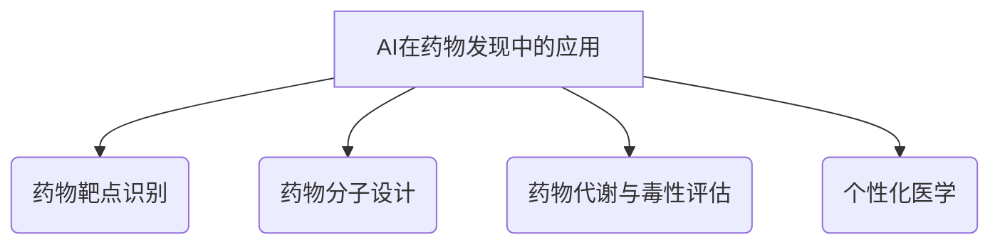

                 

### 《人工智能在生物医学和药物发现中的应用》

关键词：人工智能、生物医学、药物发现、机器学习、深度学习、个性化医学

摘要：本文深入探讨了人工智能在生物医学和药物发现中的应用。通过分析人工智能的基本原理，阐述了其在生物医学数据解析、药物靶点识别、药物分子设计、药物代谢与毒性评估、个性化医学等多个领域的具体应用。本文旨在为读者提供一个全面的技术视角，了解人工智能在生物医学和药物发现中的前沿进展和潜在挑战。

### 目录大纲

1. 引言
2. 生物医学与药物发现的基础知识
3. 数据预处理与生物信息学
4. 人工智能在药物靶点识别中的应用
5. 人工智能在药物分子设计中的应用
6. 人工智能在药物代谢与毒性评估中的应用
7. 人工智能在个性化医学中的应用
8. 人工智能在药物发现中的最新进展
9. 人工智能在生物医学与药物发现中的伦理与法律问题
10. 案例研究
11. 结论
12. 附录

### 引言

人工智能（Artificial Intelligence, AI）作为计算机科学的一个重要分支，经过数十年的发展，已经取得了显著的进展。从最初的规则系统到现代的深度学习，人工智能在图像识别、自然语言处理、自动驾驶等领域展现了强大的能力。然而，人工智能的应用不仅仅局限于这些领域，它在生物医学和药物发现中也展现出了巨大的潜力。

#### 人工智能与生物医学的交汇

生物医学是研究生命过程和疾病机理的学科，而药物发现是生物医学的重要组成部分。传统的药物发现过程通常涉及大量的实验和数据分析，这一过程不仅耗时，而且成本高昂。人工智能的出现为生物医学领域提供了一种新的解决方案。通过机器学习和深度学习等技术，人工智能可以处理和分析海量的生物医学数据，从而帮助科学家们更快速地识别药物靶点、设计新药分子、评估药物代谢和毒性等。

#### 药物发现过程中的AI应用

在药物发现过程中，人工智能可以应用于多个环节。首先，在药物靶点识别阶段，人工智能可以通过分析基因表达数据、蛋白质结构等信息，帮助科学家们识别潜在的药物靶点。其次，在药物分子设计阶段，人工智能可以运用优化算法和模拟技术，设计出具有潜在药理活性的分子结构。此外，在药物代谢与毒性评估阶段，人工智能可以通过预测药物的代谢途径和毒性反应，帮助科学家们评估药物的安全性和有效性。最后，在个性化医学阶段，人工智能可以根据患者的基因组信息和病史，设计出个性化的治疗方案。

#### 本书结构安排与读者对象

本书旨在为读者提供一个全面的技术视角，了解人工智能在生物医学和药物发现中的应用。全书分为十一章，分别介绍了人工智能在生物医学和药物发现中的应用基础、数据预处理、药物靶点识别、药物分子设计、药物代谢与毒性评估、个性化医学等多个领域的内容。同时，本书还通过案例研究和最新进展，展示了人工智能在生物医学和药物发现中的实际应用。

本书适合从事生物医学、药物发现和人工智能等相关领域的研究人员和工程师阅读，也适合对人工智能在生物医学和药物发现中感兴趣的高校师生和专业人士。

#### 总结与展望

人工智能在生物医学和药物发现中的应用已经取得了显著的成果，但仍面临许多挑战。未来的研究将继续探索人工智能在生物医学数据解析、药物设计、个性化治疗等领域的深入应用。随着技术的不断进步，人工智能将为生物医学和药物发现带来更多的创新和突破。

接下来，我们将对生物医学与药物发现的基础知识进行详细介绍，为后续章节的深入探讨奠定基础。在下一章中，我们将首先介绍生物医学的基本概念，以及药物发现的基本流程。随后，我们将探讨人工智能在生物医学数据解析中的应用，并分析人工智能在药物设计中的重要性。通过这些基础知识的讲解，我们将为读者提供更深入的理解，以便更好地把握后续章节的内容。

#### 第2章 生物医学与药物发现的基础知识

在探讨人工智能在生物医学和药物发现中的应用之前，了解生物医学的基本概念和药物发现的基本流程是至关重要的。本章将首先介绍生物医学的基本概念，然后详细阐述药物发现的基本流程，最后探讨人工智能在生物医学数据解析和药物设计中的应用及其重要性。

##### 2.1 生物医学导论

生物医学是一门综合性学科，旨在研究和治疗疾病，提高人类健康水平。生物医学涉及多个领域，包括解剖学、生理学、分子生物学、生物化学、遗传学等。其主要目的是通过理解生命的基本过程，开发新的治疗方法和技术，以预防、诊断和治疗各种疾病。

生物医学的研究内容包括：

1. **疾病机理研究**：通过研究疾病的发病机理，了解疾病发生的分子机制，为开发治疗药物奠定基础。
2. **药物开发**：基于疾病机理的研究，开发具有治疗作用的药物。
3. **诊断技术**：开发新的诊断方法和技术，提高疾病的早期诊断率和诊断准确性。
4. **治疗技术**：研究治疗技术，如手术、放射治疗、化疗等，以提高治疗效果。

##### 2.2 药物发现的基本流程

药物发现是一个复杂而系统的过程，涉及多个阶段。以下是一个典型的药物发现基本流程：

1. **靶点识别**：通过生物信息学、基因组学、蛋白质组学等技术，识别潜在的药物靶点。这些靶点可以是蛋白质、基因、受体等。
2. **先导化合物筛选**：基于靶点识别的结果，通过化合物库筛选或高通量筛选等方法，寻找具有潜在药理活性的化合物。
3. **先导化合物优化**：对筛选出的先导化合物进行结构优化，提高其药理活性、选择性、稳定性等性质。
4. **药效学评价**：评估优化后的化合物的药效学性质，包括活性、毒性、代谢途径等。
5. **药代动力学研究**：研究化合物的体内吸收、分布、代谢、排泄等过程，为药物设计和临床试验提供数据支持。
6. **临床试验**：进行临床试验，评估药物的安全性和有效性，以获得药物上市批准。

##### 2.3 人工智能在生物医学数据解析中的应用

人工智能在生物医学数据解析中扮演着重要角色。通过机器学习和深度学习等技术，人工智能可以从大量生物医学数据中提取有价值的信息，帮助科学家们更好地理解生物系统的复杂性和疾病机理。

1. **基因组数据分析**：人工智能可以用于基因组数据分析，识别基因表达模式、突变热点等，为个性化医学和精准治疗提供依据。
2. **蛋白质结构预测**：人工智能可以预测蛋白质的结构和功能，帮助科学家们理解蛋白质的作用机制，为药物设计提供参考。
3. **药物副作用预测**：通过分析药物的化学结构和生物信息数据，人工智能可以预测药物的副作用，提高药物安全性。

##### 2.4 人工智能在药物设计中的重要性

人工智能在药物设计中的应用日益广泛，其重要性体现在以下几个方面：

1. **提高药物发现效率**：人工智能可以通过高通量筛选和优化算法，快速筛选和优化药物分子，缩短药物发现周期，降低研发成本。
2. **提高药物设计精度**：人工智能可以基于大量生物医学数据，预测药物分子的活性、选择性、毒性等性质，提高药物设计的成功率。
3. **个性化药物设计**：通过分析患者的基因组、代谢等数据，人工智能可以设计出针对特定患者的个性化药物，提高治疗效果和安全性。

##### 2.5 生物医学与药物发现中的挑战

尽管人工智能在生物医学和药物发现中展示了巨大的潜力，但仍然面临一些挑战：

1. **数据质量和完整性**：生物医学数据的多样性和复杂性给数据预处理和分析带来了挑战。确保数据的质量和完整性是进行有效人工智能分析的前提。
2. **算法优化与计算资源**：人工智能算法的优化和计算资源的需求较高，如何有效地利用计算资源进行大规模数据处理和分析是一个重要问题。
3. **跨学科合作**：生物医学和药物发现涉及多个学科，跨学科合作是推动人工智能在生物医学和药物发现中应用的关键。
4. **伦理和法律问题**：随着人工智能在生物医学和药物发现中的应用日益广泛，相关的伦理和法律问题也逐渐凸显，需要制定相应的规范和标准。

##### 2.6 总结与展望

生物医学和药物发现是一个复杂而关键的领域，人工智能的应用为其带来了新的机遇和挑战。通过数据解析、药物靶点识别、分子设计、代谢与毒性评估等方面的应用，人工智能正在改变传统的生物医学和药物发现模式。未来，随着技术的不断进步和跨学科合作的深入，人工智能将在生物医学和药物发现中发挥更加重要的作用，推动医学领域的创新和发展。

在下一章中，我们将深入探讨数据预处理与生物信息学，了解如何处理和分析生物医学数据，为后续的人工智能应用奠定基础。

### 第3章 数据预处理与生物信息学

在生物医学研究中，数据的获取和解析是一个关键环节。数据预处理和生物信息学是生物医学研究中不可或缺的部分，它们为后续的人工智能应用提供了必要的基础。本章将首先介绍生物医学数据的来源，然后详细讨论数据预处理的方法，并进一步探讨生物信息学的基本概念、基因组学、蛋白质组学和微生物学，以及人工智能在其中的应用。

##### 3.1 生物医学数据的来源

生物医学数据来源于多种途径，包括但不限于以下几个方面：

1. **基因组学数据**：基因组学数据包括基因序列、基因表达谱、突变谱等。这些数据通常来自全基因组测序（WGS）、全外显子测序（WES）或RNA测序（RNA-seq）等技术。
2. **蛋白质组学数据**：蛋白质组学数据包括蛋白质的表达水平、修饰状态、相互作用等。这些数据通常来自质谱技术。
3. **代谢组学数据**：代谢组学数据包括生物体内代谢物的种类和浓度。这些数据通常来自核磁共振（NMR）、气相色谱-质谱（GC-MS）等技术。
4. **转录组学数据**：转录组学数据包括mRNA的序列和表达水平。这些数据通常来自RNA测序（RNA-seq）技术。
5. **临床数据**：临床数据包括患者的病史、症状、治疗方案、治疗效果等。这些数据通常来自电子健康记录（EHR）系统。
6. **影像学数据**：影像学数据包括X射线、CT、MRI、PET等成像数据。

这些数据来源广泛，且类型多样，为生物医学研究提供了丰富的信息。

##### 3.2 数据预处理方法

在生物医学研究中，数据预处理是一个至关重要的步骤，它直接影响后续数据分析的结果。数据预处理包括以下几个主要步骤：

1. **数据清洗**：数据清洗旨在去除噪声、缺失值、异常值等不必要的数据，以提高数据的准确性和完整性。常用的方法包括缺失值填充、异常值检测和去除、数据标准化等。
2. **数据整合**：生物医学数据通常来源于不同的实验或研究，这些数据可能存在不一致的变量、单位和数据格式。数据整合旨在将这些异构数据合并成一个统一的格式，以便进行进一步分析。
3. **数据标准化**：数据标准化是将不同数据源的变量转换为同一尺度，以便进行比较和分析。常用的方法包括最小-最大标准化、Z-score标准化等。
4. **数据降维**：降维是将高维数据映射到低维空间，以减少数据的复杂度。常用的方法包括主成分分析（PCA）、线性判别分析（LDA）等。
5. **特征选择**：特征选择旨在从大量变量中挑选出对分析目标有显著贡献的变量，以提高模型的性能和可解释性。常用的方法包括互信息、特征重要性排序等。

##### 3.3 生物信息学基本概念

生物信息学是生物与信息科学、计算机科学和数学的交叉学科，旨在通过计算和数据分析方法研究生物信息。生物信息学的主要研究领域包括：

1. **基因组学**：基因组学是研究生物体基因组的结构和功能，包括基因序列、表达调控、突变分析等。
2. **转录组学**：转录组学是研究细胞在特定时间和条件下的转录产物，包括RNA序列和表达水平。
3. **蛋白质组学**：蛋白质组学是研究细胞或组织中的蛋白质组成及其动态变化，包括蛋白质的表达水平、修饰状态、相互作用等。
4. **代谢组学**：代谢组学是研究生物体内代谢物的种类和浓度，以及它们在生物体内的动态变化。
5. **系统生物学**：系统生物学是研究生物系统的整体行为和相互作用，包括细胞内信号传递、代谢网络、基因调控网络等。

##### 3.4 生物医学数据的特征提取

特征提取是从原始数据中提取出具有代表性的特征，以便于后续的机器学习和数据分析。生物医学数据的特征提取方法包括：

1. **序列特征提取**：对于基因组学和转录组学数据，常用的特征提取方法包括序列模式挖掘、序列相似性分析、序列聚类等。
2. **结构特征提取**：对于蛋白质组学数据，常用的特征提取方法包括蛋白质三维结构预测、蛋白质-蛋白质相互作用分析等。
3. **定量特征提取**：对于代谢组学数据，常用的特征提取方法包括聚类分析、主成分分析、相关性分析等。

##### 3.5 基因组学与人工智能

基因组学是生物信息学的一个重要领域，与人工智能的结合正在推动基因组学研究的发展。人工智能在基因组学中的应用包括：

1. **基因组序列分析**：通过深度学习等方法，人工智能可以预测基因组序列的转录因子结合位点、突变热点等。
2. **基因表达数据分析**：通过机器学习方法，人工智能可以识别基因表达模式、基因调控网络等。
3. **基因组变异分析**：通过机器学习和统计方法，人工智能可以识别基因突变与疾病的关系，预测致病性突变。

##### 3.6 蛋白质组学与人工智能

蛋白质组学是研究蛋白质的表达、修饰和相互作用等动态过程的学科，与人工智能的结合正在改变蛋白质组学研究的方法和手段。人工智能在蛋白质组学中的应用包括：

1. **蛋白质结构预测**：通过深度学习等方法，人工智能可以预测蛋白质的三维结构，为蛋白质功能研究提供重要信息。
2. **蛋白质相互作用预测**：通过机器学习方法，人工智能可以预测蛋白质之间的相互作用，帮助理解蛋白质网络的复杂性和功能。
3. **蛋白质修饰分析**：通过机器学习方法，人工智能可以识别蛋白质的修饰位点，理解蛋白质修饰在细胞信号传导和疾病发生中的作用。

##### 3.7 微生物学与人工智能

微生物学是研究微生物的形态、生理、生化特性及其与人类和其他生物的关系的学科。人工智能在微生物学中的应用包括：

1. **微生物分类**：通过机器学习方法，人工智能可以识别微生物的分类，提高分类的准确性和效率。
2. **微生物基因组分析**：通过深度学习方法，人工智能可以分析微生物基因组的结构和功能，揭示微生物的进化关系。
3. **微生物功能预测**：通过机器学习方法，人工智能可以预测微生物的功能，为微生物的定向改造和功能应用提供参考。

##### 3.8 总结与展望

数据预处理和生物信息学在生物医学研究中发挥着重要作用。通过对生物医学数据的预处理，可以提高数据的质量和可靠性，为后续的人工智能分析提供基础。人工智能与基因组学、蛋白质组学、代谢组学和微生物学的结合，正在推动生物医学研究的深入和发展。未来的研究将继续探索人工智能在生物医学数据解析和特征提取中的新方法和新技术，为生物医学领域的创新提供更多的可能性。

在下一章中，我们将探讨人工智能在药物靶点识别中的应用，分析其基本概念和重要性，并介绍常用的方法和挑战。通过这一章节的讲解，我们将为读者提供更深入的理解，以便更好地把握人工智能在药物发现中的实际应用。

### 第4章 人工智能在药物靶点识别中的应用

药物靶点识别是药物发现过程中至关重要的一环，它涉及到从大量生物分子中识别出具有药物作用潜力的靶点。人工智能在这一领域发挥着重要作用，通过机器学习和深度学习等技术，大大提高了药物靶点识别的效率和准确性。本章将详细探讨人工智能在药物靶点识别中的应用，包括基本概念、方法和挑战。

#### 4.1 药物靶点的概念与重要性

药物靶点是指药物作用的特定生物分子，通常是蛋白质、核酸或其他生物大分子。药物靶点识别的目的是从大量的候选分子中筛选出具有潜在药理活性的靶点，为药物设计提供方向。药物靶点识别的成功对于新药的发现和开发具有重要意义，它决定了药物能否有效作用并达到治疗目的。

药物靶点识别的重要性体现在以下几个方面：

1. **提高药物设计效率**：通过识别出具有药物作用潜力的靶点，可以大大缩短药物设计的时间，降低研发成本。
2. **提高药物设计成功率**：基于明确的药物靶点进行药物设计，可以减少盲目性，提高药物的成功率。
3. **个性化药物开发**：通过识别出与特定疾病相关的药物靶点，可以开发出针对特定患者的个性化药物，提高治疗效果和安全性。

#### 4.2 人工智能在药物靶点识别中的方法

人工智能在药物靶点识别中的应用主要基于机器学习和深度学习技术。以下是一些常用的方法和算法：

1. **机器学习方法**：机器学习方法通过训练模型来识别药物靶点。常用的算法包括支持向量机（SVM）、随机森林（Random Forest）、K最近邻（KNN）等。这些算法可以从大量的生物分子特征中提取信息，建立药物靶点的预测模型。

   ```python
   # 假设我们使用随机森林算法进行药物靶点识别
   from sklearn.ensemble import RandomForestClassifier
   import numpy as np

   # 训练数据准备
   X_train = np.array([特征向量1, 特征向量2, ..., 特征向量n])
   y_train = np.array([标签1, 标签2, ..., 标签n])

   # 训练模型
   model = RandomForestClassifier(n_estimators=100)
   model.fit(X_train, y_train)

   # 预测新数据的药物靶点
   X_test = np.array([新特征向量1, 新特征向量2, ...])
   predictions = model.predict(X_test)
   ```

2. **深度学习方法**：深度学习方法通过多层神经网络来提取生物分子的特征，进行药物靶点识别。常用的算法包括卷积神经网络（CNN）、循环神经网络（RNN）、生成对抗网络（GAN）等。深度学习方法在处理高维数据和复杂特征方面具有优势。

   ```python
   # 假设我们使用卷积神经网络进行药物靶点识别
   from keras.models import Sequential
   from keras.layers import Conv2D, MaxPooling2D, Flatten, Dense

   # 构建模型
   model = Sequential()
   model.add(Conv2D(filters=32, kernel_size=(3, 3), activation='relu', input_shape=(特征维度1, 特征维度2, 特征维度3)))
   model.add(MaxPooling2D(pool_size=(2, 2)))
   model.add(Flatten())
   model.add(Dense(units=1, activation='sigmoid'))

   # 编译模型
   model.compile(optimizer='adam', loss='binary_crossentropy', metrics=['accuracy'])

   # 训练模型
   model.fit(X_train, y_train, epochs=10, batch_size=32)

   # 预测新数据的药物靶点
   predictions = model.predict(X_test)
   ```

#### 4.3 基于机器学习的药物靶点识别

基于机器学习的药物靶点识别方法具有以下几个优点：

1. **高效性**：机器学习算法可以处理大量数据，快速识别药物靶点，提高药物设计效率。
2. **灵活性**：机器学习算法可以根据不同的数据特点和任务需求，调整模型结构和参数，提高识别准确性。
3. **可解释性**：部分机器学习算法（如随机森林）可以提供模型决策的解释，帮助理解药物靶点识别的机制。

然而，机器学习在药物靶点识别中也面临一些挑战：

1. **数据质量**：高质量的数据是机器学习模型准确性的基础。数据中的噪声、缺失值和异常值可能会影响模型的性能。
2. **模型过拟合**：机器学习模型可能会在训练数据上表现良好，但在未见数据上表现不佳，即过拟合问题。

#### 4.4 基于深度学习的药物靶点识别

深度学习在药物靶点识别中展现了强大的潜力，其优势包括：

1. **处理复杂数据**：深度学习模型可以处理高维和复杂数据，提取深层次的生物分子特征。
2. **自学习能力**：深度学习模型可以通过自我调整网络结构和参数，不断提高识别准确性。
3. **预测准确性**：深度学习模型在处理生物医学数据方面具有较高的预测准确性。

然而，深度学习在药物靶点识别中也存在一些挑战：

1. **计算资源需求**：深度学习模型通常需要大量的计算资源和时间来训练和预测，这对实际应用提出了较高要求。
2. **模型解释性**：深度学习模型的决策过程较为复杂，难以解释，这可能会影响其在生物医学领域的应用。

#### 4.5 药物靶点识别的挑战与展望

药物靶点识别是一个复杂的问题，面临着多方面的挑战：

1. **数据复杂性**：生物医学数据通常具有高维度、非线性、异构性等特点，如何有效地处理和利用这些数据是一个重要挑战。
2. **模型泛化能力**：如何提高模型的泛化能力，使其在未见数据上也能保持良好的性能，是一个关键问题。
3. **跨学科合作**：药物靶点识别涉及多个学科，如何实现跨学科的合作，充分利用各学科的优势，是一个重要方向。

未来的研究将继续探索更高效、准确的药物靶点识别方法，结合多学科知识，推动药物发现和个性化医学的发展。

在下一章中，我们将探讨人工智能在药物分子设计中的应用，分析其基本原理和重要性，并介绍相关的优化算法和模拟技术。通过这一章节的讲解，我们将为读者提供更深入的理解，以便更好地把握人工智能在药物分子设计中的实际应用。

### 第5章 人工智能在药物分子设计中的应用

药物分子设计是药物发现过程中的关键环节，它涉及到对新药分子的结构进行优化，以提高其药理活性和安全性。人工智能在这一领域发挥着重要作用，通过优化算法和模拟技术，人工智能可以加速药物分子设计的过程，提高设计的成功率。本章将详细探讨人工智能在药物分子设计中的应用，包括基本原理、优化算法和模拟技术。

#### 5.1 药物分子设计的基本原理

药物分子设计的目标是设计出具有特定药理活性的分子结构。药物分子设计的基本原理包括以下几个方面：

1. **药效团设计**：药效团是指药物分子中具有药理活性的部分。通过识别和设计药效团，可以开发出具有特定药理活性的药物分子。
2. **分子对接**：分子对接是一种计算方法，用于模拟药物分子与靶点蛋白的结合方式。通过分子对接，可以评估药物分子的结合能力，筛选出具有潜在药理活性的分子。
3. **分子优化**：分子优化是通过调整分子结构，提高其药理活性和稳定性。分子优化包括结构优化、构效关系分析、构象搜索等。

#### 5.2 人工智能在药物分子设计中的应用

人工智能在药物分子设计中的应用主要体现在以下几个方面：

1. **药效团识别**：人工智能可以通过机器学习和深度学习等方法，从大量药物分子中识别出具有药效团的子结构。这些药效团可以作为新药分子设计的起点。
2. **分子对接**：人工智能可以优化分子对接算法，提高对接的准确性和速度。通过高效的分子对接，可以快速筛选出具有潜在药理活性的药物分子。
3. **分子优化**：人工智能可以通过遗传算法、模拟退火算法等优化算法，对新药分子进行结构优化。优化后的分子具有更好的药理活性和稳定性。

#### 5.3 药物分子设计中的优化算法

在药物分子设计中，优化算法用于调整分子结构，以提高其药理活性和稳定性。以下是一些常用的优化算法：

1. **遗传算法**：遗传算法是一种基于生物进化原理的优化算法。它通过模拟自然选择和遗传机制，逐步优化分子结构。遗传算法具有全局搜索能力，适用于复杂优化问题。

   ```python
   # 假设我们使用遗传算法进行药物分子优化
   import numpy as np
   import matplotlib.pyplot as plt

   # 定义遗传算法参数
   population_size = 100
   generations = 100
   mutation_rate = 0.01

   # 初始化种群
   population = np.random.rand(population_size, n_variables)

   # 定义适应度函数
   def fitness_function(individual):
       # 计算适应度值
       return -individual.sum()

   # 运行遗传算法
   for generation in range(generations):
       # 适应度评估
       fitness_scores = np.array([fitness_function(individual) for individual in population])

       # 选择
       selected = np.random.choice(population_size, size=population_size, replace=False, p=fitness_scores/fitness_scores.sum())

       # 交叉
       offspring = crossover(selected)

       # 变异
       population = np.array([mutation(individual, mutation_rate) for individual in offspring])

       # 更新最佳解
       best_individual = population[np.argmax(fitness_scores)]

   # 绘制适应度曲线
   plt.plot(np.arange(generations), fitness_scores)
   plt.xlabel('Generation')
   plt.ylabel('Fitness Score')
   plt.show()
   ```

2. **模拟退火算法**：模拟退火算法是一种基于物理退火过程的优化算法。它通过模拟退火过程，逐步优化分子结构。模拟退火算法具有较强的局部搜索能力，适用于复杂优化问题。

   ```python
   # 假设我们使用模拟退火算法进行药物分子优化
   import numpy as np
   import matplotlib.pyplot as plt

   # 定义模拟退火算法参数
   initial_temp = 1000.0
   cooling_rate = 0.01
   max_iterations = 1000

   # 初始化温度和分子结构
   temperature = initial_temp
   individual = np.random.rand(n_variables)

   # 定义适应度函数
   def fitness_function(individual):
       # 计算适应度值
       return -individual.sum()

   # 运行模拟退火算法
   for iteration in range(max_iterations):
       # 产生新个体
       new_individual = np.random.rand(n_variables)

       # 计算适应度变化
       fitness_change = fitness_function(new_individual) - fitness_function(individual)

       # 判断是否接受新个体
       if fitness_change > 0 or np.random.rand() < np.exp(-fitness_change / temperature):
           individual = new_individual

       # 降温
       temperature *= (1 - cooling_rate)

   # 绘制适应度曲线
   plt.plot(np.arange(max_iterations), fitness_scores)
   plt.xlabel('Iteration')
   plt.ylabel('Fitness Score')
   plt.show()
   ```

3. **粒子群优化算法**：粒子群优化算法是一种基于群体智能的优化算法。它通过模拟鸟群或鱼群的行为，逐步优化分子结构。粒子群优化算法具有较好的全局搜索能力和收敛速度。

   ```python
   # 假设我们使用粒子群优化算法进行药物分子优化
   import numpy as np
   import matplotlib.pyplot as plt

   # 定义粒子群优化算法参数
   num_particles = 50
   max_iterations = 100
   w = 0.5
   c1 = 1.0
   c2 = 2.0

   # 初始化粒子群
   particles = np.random.rand(num_particles, n_variables)
   velocities = np.random.rand(num_particles, n_variables)

   # 定义适应度函数
   def fitness_function(individual):
       # 计算适应度值
       return -individual.sum()

   # 运行粒子群优化算法
   for iteration in range(max_iterations):
       # 计算适应度
       fitness_scores = np.array([fitness_function(individual) for individual in particles])

       # 更新个体最优解和全局最优解
       for i in range(num_particles):
           if fitness_scores[i] > best_fitness:
               best_individual = particles[i]
               best_fitness = fitness_scores[i]

       # 更新速度和位置
       for i in range(num_particles):
           r1 = np.random.rand()
           r2 = np.random.rand()
           cognitive_component = c1 * r1 * (best_individual - particles[i])
           social_component = c2 * r2 * (best_individual - particles[i])
           velocities[i] = w * velocities[i] + cognitive_component + social_component
           particles[i] += velocities[i]

   # 绘制适应度曲线
   plt.plot(np.arange(max_iterations), fitness_scores)
   plt.xlabel('Iteration')
   plt.ylabel('Fitness Score')
   plt.show()
   ```

#### 5.4 药物分子设计中的模拟与虚拟筛选

在药物分子设计中，模拟与虚拟筛选是一种重要的方法，用于评估和筛选具有潜在药理活性的分子。以下是一些常用的模拟与虚拟筛选技术：

1. **分子动力学模拟**：分子动力学模拟是一种基于牛顿运动定律的计算方法，用于研究分子在动态环境中的行为。通过分子动力学模拟，可以评估分子的稳定性、动力学行为和相互作用。
2. **蒙特卡罗模拟**：蒙特卡罗模拟是一种基于概率计算的方法，用于模拟分子在不同环境下的行为。通过蒙特卡罗模拟，可以评估分子的自由能、构象分布和相互作用。
3. **虚拟筛选**：虚拟筛选是一种基于计算模拟的方法，用于从大量分子中筛选出具有特定药理活性的分子。虚拟筛选通常结合多种计算方法，如分子对接、分子动力学模拟和蒙特卡罗模拟等。

#### 5.5 药物分子设计中的协同设计策略

药物分子设计中的协同设计策略是一种综合运用多种技术和方法的策略，以提高药物分子设计的成功率和效率。协同设计策略包括以下几个方面：

1. **多学科交叉**：药物分子设计涉及多个学科，如化学、生物学、物理学和计算机科学等。通过多学科交叉，可以充分利用各学科的优势，提高药物分子设计的综合能力。
2. **数据驱动**：数据驱动是一种基于大数据和人工智能的药物分子设计方法。通过分析大量的生物医学数据，可以识别出潜在的药物靶点和新药分子结构。
3. **实验验证**：实验验证是药物分子设计过程中的关键环节。通过实验验证，可以验证药物分子的药理活性和安全性，为后续的药物开发提供依据。

#### 5.6 总结与展望

人工智能在药物分子设计中的应用正在不断拓展，通过优化算法、模拟技术和协同设计策略，人工智能正在改变传统的药物分子设计模式。未来的研究将继续探索更高效、准确的药物分子设计方法，结合多学科知识和人工智能技术，推动药物分子设计的创新和发展。

在下一章中，我们将探讨人工智能在药物代谢与毒性评估中的应用，分析其基本原理和重要性，并介绍相关的预测模型和评估方法。通过这一章节的讲解，我们将为读者提供更深入的理解，以便更好地把握人工智能在药物代谢与毒性评估中的实际应用。

### 第6章 人工智能在药物代谢与毒性评估中的应用

药物代谢与毒性评估是药物研发过程中的关键环节，它涉及药物在体内的吸收、分布、代谢和排泄，以及药物可能引起的毒性反应。人工智能在这一领域中的应用，通过先进的算法和模型，为药物的安全性评估提供了新的手段。本章将详细探讨人工智能在药物代谢与毒性评估中的应用，包括基本原理、预测模型和评估方法。

#### 6.1 药物代谢的基本原理

药物代谢是指药物在体内被酶催化分解和转化为其他物质的过程。药物代谢的主要过程包括：

1. **生物转化**：生物转化是药物代谢的主要过程，通过氧化、还原、水解和结合等反应，药物分子发生结构改变，形成活性代谢产物或无活性代谢产物。
2. **酶催化**：酶催化是药物代谢的主要机制，药物代谢酶（如肝微粒体酶）在药物代谢过程中起着关键作用。
3. **影响药物代谢的因素**：药物代谢受到多种因素的影响，包括药物的结构、剂量、给药途径、患者的遗传因素和环境因素等。

#### 6.2 人工智能在药物代谢研究中的应用

人工智能在药物代谢研究中发挥着重要作用，通过机器学习和深度学习等技术，人工智能可以从大量的生物医学数据中提取有价值的信息，帮助科学家们更好地理解药物代谢过程。以下是一些具体的应用：

1. **药物代谢路径预测**：人工智能可以通过分析药物的结构和生物信息数据，预测药物在体内的代谢路径。这有助于科学家们了解药物在体内的转化过程，为药物设计和优化提供依据。

   ```python
   # 假设我们使用深度学习模型进行药物代谢路径预测
   from keras.models import Sequential
   from keras.layers import LSTM, Dense

   # 构建模型
   model = Sequential()
   model.add(LSTM(units=50, return_sequences=True, input_shape=(序列长度, 特征维度)))
   model.add(LSTM(units=50))
   model.add(Dense(units=1, activation='sigmoid'))

   # 编译模型
   model.compile(optimizer='adam', loss='binary_crossentropy', metrics=['accuracy'])

   # 训练模型
   model.fit(X_train, y_train, epochs=10, batch_size=32)

   # 预测新药物的代谢路径
   predictions = model.predict(X_test)
   ```

2. **药物代谢酶活性预测**：人工智能可以通过分析药物的结构和代谢酶的序列信息，预测代谢酶对药物的活性。这有助于科学家们了解代谢酶对药物的作用机制，为药物代谢调控提供参考。

   ```python
   # 假设我们使用支持向量机进行药物代谢酶活性预测
   from sklearn.svm import SVC
   import numpy as np

   # 训练数据准备
   X_train = np.array([特征向量1, 特征向量2, ..., 特征向量n])
   y_train = np.array([标签1, 标签2, ..., 标签n])

   # 训练模型
   model = SVC(kernel='linear')
   model.fit(X_train, y_train)

   # 预测新药物的代谢酶活性
   X_test = np.array([新特征向量1, 新特征向量2, ...])
   predictions = model.predict(X_test)
   ```

#### 6.3 药物毒性评估与预测

药物毒性评估是药物研发过程中的关键环节，它涉及评估药物可能引起的毒性反应和副作用。人工智能在药物毒性评估和预测中具有重要作用，通过机器学习和深度学习等技术，人工智能可以从大量的生物医学数据中提取有价值的信息，帮助科学家们更好地评估药物的安全性。

1. **毒性反应预测**：人工智能可以通过分析药物的结构和生物信息数据，预测药物可能引起的毒性反应。这有助于科学家们在药物早期开发阶段识别潜在的毒性风险，从而避免进一步的研究投入。

   ```python
   # 假设我们使用卷积神经网络进行毒性反应预测
   from keras.models import Sequential
   from keras.layers import Conv2D, MaxPooling2D, Flatten, Dense

   # 构建模型
   model = Sequential()
   model.add(Conv2D(filters=32, kernel_size=(3, 3), activation='relu', input_shape=(特征维度1, 特征维度2, 特征维度3)))
   model.add(MaxPooling2D(pool_size=(2, 2)))
   model.add(Flatten())
   model.add(Dense(units=1, activation='sigmoid'))

   # 编译模型
   model.compile(optimizer='adam', loss='binary_crossentropy', metrics=['accuracy'])

   # 训练模型
   model.fit(X_train, y_train, epochs=10, batch_size=32)

   # 预测新药物的毒性反应
   predictions = model.predict(X_test)
   ```

2. **毒性评估方法**：人工智能可以用于多种毒性评估方法，包括细胞毒性评估、急性毒性评估、慢性毒性评估等。通过分析不同毒性评估方法的生物信息数据，人工智能可以综合评估药物的安全性。

#### 6.4 人工智能在药物毒性评估中的挑战

尽管人工智能在药物毒性评估中展示了巨大的潜力，但仍然面临一些挑战：

1. **数据质量和完整性**：药物毒性评估依赖于大量的生物医学数据，数据的质量和完整性对评估结果至关重要。确保数据的质量和完整性是进行有效人工智能分析的前提。
2. **模型泛化能力**：如何提高模型的泛化能力，使其在未见数据上也能保持良好的性能，是一个关键问题。
3. **跨学科合作**：药物毒性评估涉及多个学科，如药理学、毒理学、生物信息学等，跨学科合作是推动人工智能在药物毒性评估中应用的关键。
4. **伦理和法律问题**：随着人工智能在药物毒性评估中的应用日益广泛，相关的伦理和法律问题也逐渐凸显，需要制定相应的规范和标准。

#### 6.5 总结与展望

人工智能在药物代谢与毒性评估中的应用正在不断拓展，通过预测模型和评估方法，人工智能为药物的安全性评估提供了新的手段。未来的研究将继续探索更高效、准确的药物代谢与毒性评估方法，结合多学科知识和人工智能技术，推动药物研发的创新和发展。

在下一章中，我们将探讨人工智能在个性化医学中的应用，分析其基本概念和重要性，并介绍基因组学与个性化医学的相关内容。通过这一章节的讲解，我们将为读者提供更深入的理解，以便更好地把握人工智能在个性化医学中的实际应用。

### 第7章 人工智能在个性化医学中的应用

个性化医学是一种以患者为中心的医学模式，通过整合患者的生物学、遗传学、环境和生活习惯等多方面信息，为每个患者提供量身定制的诊断、治疗和预防方案。人工智能在个性化医学中发挥着重要作用，通过大数据分析、机器学习和深度学习等技术，人工智能可以为个性化医学提供数据支持、预测模型和优化方案。本章将详细探讨人工智能在个性化医学中的应用，包括基本概念、基因组学与个性化医学以及药物基因组学。

#### 7.1 个性化医学的概念与重要性

个性化医学的概念源于精准医学（Precision Medicine），它强调根据患者的个体特征，如遗传背景、生活方式和环境因素等，为患者提供个性化的治疗方案。个性化医学的核心在于利用患者的个体数据，制定个性化的诊断、治疗和预防策略。

个性化医学的重要性体现在以下几个方面：

1. **提高治疗效果**：个性化医学通过针对患者的个体差异，提供更加精准的治疗方案，可以显著提高治疗效果。
2. **降低医疗成本**：个性化医学可以减少不必要的医疗检查和治疗，降低医疗成本。
3. **优化药物使用**：个性化医学可以根据患者的遗传特征和代谢特点，选择最适合的药物和剂量，减少药物不良反应。
4. **促进医疗创新**：个性化医学鼓励研究人员探索新的诊断和治疗技术，推动医学领域的创新和发展。

#### 7.2 人工智能在个性化医学中的角色

人工智能在个性化医学中扮演着重要角色，通过以下方式为个性化医学提供支持：

1. **数据整合与分析**：人工智能可以通过大数据分析技术，整合和分析患者的生物医学数据，包括基因组数据、临床数据和环境数据等，为个性化诊断和治疗提供数据支持。
2. **预测模型构建**：人工智能可以通过机器学习和深度学习技术，构建预测模型，预测患者的疾病风险、药物反应和治疗效果等，为个性化医疗提供预测依据。
3. **优化治疗方案**：人工智能可以通过优化算法，根据患者的个体特征和治疗效果，为患者提供最优的治疗方案。
4. **辅助诊断与治疗**：人工智能可以通过辅助诊断和治疗系统，为医生提供决策支持，提高诊断和治疗的准确性和效率。

#### 7.3 基因组学与个性化医学

基因组学是个性化医学的重要基础，通过对患者基因组数据的分析，可以为个性化医学提供重要的信息。基因组学在个性化医学中的应用包括：

1. **疾病风险评估**：通过分析患者的基因组数据，可以预测患者患某种疾病的风险，为早期预防和干预提供依据。
2. **药物反应预测**：通过分析患者的基因组数据，可以预测患者对特定药物的反应，为药物选择和剂量调整提供依据。
3. **个性化治疗方案制定**：通过分析患者的基因组数据，可以为患者制定个性化的治疗方案，提高治疗效果和安全性。

基因组学在个性化医学中的应用面临以下挑战：

1. **数据解析**：基因组数据具有高维度、高复杂性的特点，如何有效地解析和利用这些数据是一个重要问题。
2. **数据隐私与伦理**：基因组数据涉及患者的隐私和伦理问题，如何保护患者的数据隐私和遵守伦理规范是一个重要问题。
3. **跨学科合作**：基因组学在个性化医学中的应用需要跨学科的合作，包括生物学、医学、计算机科学和人工智能等。

#### 7.4 药物基因组学

药物基因组学是研究药物与基因相互作用的一门学科，通过分析个体的基因特征，可以预测患者对药物的反应，为个性化药物使用提供依据。药物基因组学在个性化医学中的应用包括：

1. **药物反应预测**：通过分析患者的基因组数据，可以预测患者对特定药物的反应，如疗效和不良反应等。
2. **药物剂量优化**：通过分析患者的基因组数据，可以为患者选择最适合的药物剂量，提高治疗效果和安全性。
3. **个性化药物开发**：通过分析患者的基因组数据，可以开发针对特定患者的个性化药物。

药物基因组学在个性化医学中的应用面临以下挑战：

1. **数据完整性**：药物基因组学研究需要大量的基因组数据，如何确保数据的完整性和准确性是一个重要问题。
2. **技术标准化**：药物基因组学技术方法多样，如何实现技术标准化，确保结果的可靠性和可重复性是一个重要问题。
3. **跨学科合作**：药物基因组学在个性化医学中的应用需要跨学科的合作，包括生物学、医学、计算机科学和人工智能等。

#### 7.5 个性化药物设计

个性化药物设计是药物基因组学在个性化医学中的重要应用，通过分析患者的基因组数据，可以设计出针对特定患者的药物。个性化药物设计包括以下几个步骤：

1. **靶点识别**：通过分析患者的基因组数据，识别与疾病相关的基因和药物靶点。
2. **药物筛选**：基于靶点识别结果，筛选出具有潜在药理活性的药物。
3. **药物优化**：通过结构优化和优化算法，设计出具有最佳药理活性和安全性的药物。
4. **临床试验**：在临床试验中，验证个性化药物的安全性和有效性。

个性化药物设计在个性化医学中的应用面临以下挑战：

1. **技术难度**：个性化药物设计涉及多个技术领域，包括基因组学、药物化学和计算生物学等，技术难度较高。
2. **成本问题**：个性化药物设计需要大量的数据分析和实验，成本较高。
3. **临床验证**：个性化药物设计需要通过严格的临床试验，验证其安全性和有效性。

#### 7.6 总结与展望

人工智能在个性化医学中的应用为个性化医学的发展提供了新的机遇和挑战。通过基因组学、药物基因组学和个性化药物设计等技术，人工智能可以显著提高个性化医学的诊断、治疗和预防水平。未来的研究将继续探索更高效、准确的个性化医学方法，结合多学科知识和人工智能技术，推动个性化医学的创新和发展。

在下一章中，我们将探讨人工智能在药物发现中的最新进展，分析最新的技术和应用案例，并展望未来的发展趋势。通过这一章节的讲解，我们将为读者提供对人工智能在药物发现中的前沿动态的深入了解。

### 第8章 人工智能在药物发现中的最新进展

随着人工智能技术的不断进步，其在药物发现中的应用也取得了显著的进展。本章将分析人工智能在药物发现领域的最新技术，介绍AI驱动的药物发现案例研究，并探讨人工智能在药物发现中的未来趋势。

#### 8.1 药物发现领域的最新技术

人工智能在药物发现中的应用涉及多种技术，包括机器学习、深度学习、数据挖掘、计算机模拟等。以下是一些最新的技术进展：

1. **深度学习在药物设计中的应用**：深度学习技术在药物设计中的应用日益广泛，尤其是在药物分子优化和筛选方面。通过使用深度神经网络，研究人员可以预测药物分子的药理活性、毒性和代谢途径，从而加速药物发现过程。

2. **图神经网络在生物信息学中的应用**：图神经网络（Graph Neural Networks, GNNs）是深度学习在生物信息学领域的一个重要应用。GNNs可以处理复杂的生物分子图结构，用于蛋白质结构预测、蛋白质相互作用预测和药物-靶点对接等。

3. **迁移学习在药物发现中的应用**：迁移学习是一种通过利用已有模型的知识来提升新任务性能的技术。在药物发现中，迁移学习可以帮助研究人员快速地适应新的药物靶点和药物分子，从而减少模型训练的时间和资源消耗。

4. **生成对抗网络在药物分子生成中的应用**：生成对抗网络（Generative Adversarial Networks, GANs）是一种用于生成新型药物分子的技术。通过训练GANs，研究人员可以生成符合特定化学规则和生物活性的药物分子，从而拓展药物分子的候选库。

#### 8.2 AI驱动的药物发现案例研究

以下是一些AI驱动的药物发现案例研究，展示了人工智能在药物发现中的实际应用：

1. **AI发现抗癌药物**：近年来，人工智能被用于发现新的抗癌药物。例如，IBM的Watson for Drug Discovery通过分析大量生物医学数据，成功发现了一种新的抗癌药物，其效果优于传统的抗癌药物。

2. **AI预测药物代谢和毒性**：基于人工智能的药物代谢和毒性预测模型，可以预测药物在体内的代谢途径和潜在毒性。这种预测模型有助于早期发现药物的不良反应，提高药物的安全性。

3. **AI加速药物分子优化**：AI驱动的药物分子优化技术，通过模拟和优化药物分子的结构，提高其药理活性和稳定性。例如，AI算法被用于优化抗癌药物Pexa-Vec的结构，提高了其治疗效果。

4. **AI在抗体药物开发中的应用**：人工智能在抗体药物开发中也发挥了重要作用。通过深度学习和生成对抗网络，研究人员可以设计出针对特定疾病的新型抗体药物，提高了药物开发的效率。

#### 8.3 人工智能在药物发现中的未来趋势

随着技术的不断进步，人工智能在药物发现中的应用前景十分广阔。以下是一些未来趋势：

1. **多学科交叉**：未来，药物发现将更多地依赖跨学科的研究，包括生物学、化学、物理学和计算机科学等。多学科交叉将促进人工智能在药物发现中的应用和创新。

2. **个性化药物开发**：随着基因组学和生物信息学的发展，个性化药物开发将成为未来药物发现的一个重要趋势。通过分析患者的基因组数据，人工智能可以设计出针对特定患者的个性化药物，提高治疗效果和安全性。

3. **自动化实验平台**：随着AI技术和自动化技术的发展，未来药物发现过程将更加自动化。自动化实验平台可以显著提高药物筛选和优化的效率，降低研发成本。

4. **开放数据共享**：开放数据共享将促进人工智能在药物发现中的应用。通过共享大量的生物医学数据，研究人员可以更好地利用人工智能技术，推动药物发现领域的创新和发展。

#### 8.4 总结与展望

人工智能在药物发现中的应用取得了显著的进展，通过深度学习、迁移学习、图神经网络和生成对抗网络等技术，人工智能正在改变传统的药物发现模式。未来的研究将继续探索人工智能在药物发现中的新方法和新技术，推动个性化药物开发和自动化实验平台的发展。随着技术的不断进步，人工智能将在药物发现中发挥更加重要的作用，为人类健康事业做出更大的贡献。

在下一章中，我们将探讨人工智能在生物医学与药物发现中的伦理与法律问题，分析这些问题的背景、影响和应对策略。通过这一章节的讲解，我们将为读者提供对人工智能在生物医学与药物发现中伦理和法律问题的全面了解。

### 第9章 人工智能在生物医学与药物发现中的伦理与法律问题

随着人工智能（AI）在生物医学和药物发现中的广泛应用，其带来的伦理与法律问题也日益突出。这些问题涉及到隐私保护、数据安全、算法偏见、法律责任等多个方面。本章将详细探讨人工智能在生物医学与药物发现中的伦理与法律问题，分析其背景、影响和应对策略。

#### 9.1 人工智能在生物医学与药物发现中的伦理问题

人工智能在生物医学与药物发现中的应用带来了许多伦理问题，主要包括以下几个方面：

1. **隐私保护**：在生物医学研究中，患者的数据通常包含敏感的个人隐私信息。人工智能的应用需要处理大量的个人数据，如基因组数据、医疗记录等。如何保护患者的隐私，防止数据泄露成为了一个重要的伦理问题。

2. **数据安全**：人工智能系统依赖于大量的数据进行分析和训练。如果数据安全管理不当，可能会导致数据泄露、篡改等安全问题。此外，数据安全还涉及到如何在保证数据可用性的同时，确保数据的安全性和完整性。

3. **算法偏见**：人工智能系统可能会在数据训练过程中产生偏见，导致算法在处理某些特定群体时出现不公平。例如，如果训练数据中存在性别、种族等偏见，人工智能系统可能会在药物发现和治疗方案制定中产生偏见，影响公平性和公正性。

4. **知情同意**：在生物医学研究中，知情同意是患者参与研究的基本要求。人工智能的应用可能涉及对患者的隐私数据进行收集和分析，如何确保患者充分了解并同意这些数据的收集和使用，是伦理问题的一个重要方面。

5. **责任归属**：当人工智能系统在药物发现或诊断中发生错误时，如何确定责任归属是一个复杂的伦理问题。是开发者、使用者还是患者本身需要承担责任？这需要在法律框架内进行明确。

#### 9.2 人工智能在药物发现中的法律问题

人工智能在药物发现中的法律问题主要包括以下几个方面：

1. **知识产权**：人工智能在药物发现中的应用涉及到知识产权问题，包括药物分子的专利保护、算法的知识产权保护等。如何保护开发者的知识产权，鼓励创新，是法律需要解决的问题。

2. **数据共享**：在药物发现过程中，数据共享是一个重要的环节。如何确保数据在共享过程中的安全性、隐私性和可靠性，是法律需要规范的内容。

3. **监管合规**：人工智能在药物发现中的应用需要遵守相关的法律法规，如《药品管理法》、《数据保护法》等。如何确保人工智能系统的合规性，是一个重要的法律问题。

4. **法律责任**：当人工智能系统在药物发现中发生错误或导致不良后果时，如何确定法律责任，如何进行赔偿，是法律需要明确的问题。

#### 9.3 伦理与法律问题的应对策略

为了应对人工智能在生物医学与药物发现中的伦理与法律问题，可以采取以下策略：

1. **制定伦理规范**：相关部门可以制定人工智能在生物医学和药物发现中的伦理规范，明确数据收集、使用和共享的伦理要求，确保患者的隐私保护和知情同意。

2. **加强数据安全保护**：建立健全的数据安全管理体系，采取加密、访问控制等技术手段，确保数据的保密性和完整性。

3. **推动跨学科合作**：鼓励生物医学、法律和计算机科学等领域的专家合作，共同解决人工智能在生物医学与药物发现中的伦理与法律问题。

4. **完善法律法规**：制定和完善相关的法律法规，明确人工智能在药物发现中的法律地位、责任归属和知识产权保护等问题。

5. **建立责任机制**：建立责任明确、赔偿合理的责任机制，确保在人工智能系统发生错误时，能够及时有效地解决问题，保护患者的合法权益。

#### 9.4 总结与展望

人工智能在生物医学与药物发现中的应用为医学领域带来了巨大的变革，同时也带来了新的伦理与法律挑战。通过制定伦理规范、加强数据安全保护、推动跨学科合作和完善法律法规等措施，可以有效应对这些挑战。未来的研究应继续探索人工智能在生物医学与药物发现中的伦理与法律问题，为人工智能的健康发展提供有力支持。

在下一章中，我们将通过案例研究，深入分析人工智能在生物医学和药物发现中的成功应用，提供具体的实例和分析。这些案例研究将为我们展示人工智能在实际应用中的潜力和挑战，为读者提供宝贵的实践经验和启示。

### 第10章 案例研究

在本章中，我们将通过几个实际案例，深入分析人工智能在生物医学和药物发现中的成功应用。这些案例涵盖了从药物靶点识别到个性化治疗等多个方面，展示了人工智能如何助力科学研究和医疗实践，同时也揭示了其中的挑战和解决方案。

#### 10.1 案例研究一：人工智能辅助药物靶点识别

**案例背景**：癌症是一种复杂的疾病，其治疗需要针对具体的癌症类型和患者的个体差异进行。识别出准确的药物靶点是癌症治疗的关键步骤。

**应用技术**：人工智能，特别是机器学习和深度学习技术，被用于分析大量的基因组数据和蛋白质组学数据，以识别出潜在的药物靶点。

**案例过程**：

1. **数据收集**：研究人员收集了来自多个癌症患者的基因组、蛋白质组和临床数据。
2. **数据处理**：使用生物信息学工具对数据进行预处理，包括数据清洗、标准化和整合。
3. **模型构建**：利用机器学习算法（如随机森林和深度神经网络）构建药物靶点识别模型。
4. **模型训练与验证**：在训练集上训练模型，并在验证集上进行性能评估，调整模型参数以优化性能。
5. **应用**：将训练好的模型应用于新的患者数据，以识别潜在的药物靶点。

**案例分析**：

- **成果**：通过人工智能辅助的药物靶点识别，研究人员发现了一些以前未被识别的癌症药物靶点，这为开发新的抗癌药物提供了重要的信息。
- **挑战**：数据的多样性和复杂性使得模型训练和验证变得困难。此外，如何确保模型的可解释性和透明度也是一个挑战。

#### 10.2 案例研究二：人工智能驱动的新药分子设计

**案例背景**：新药分子设计是一个复杂且耗时的过程，需要大量的计算资源和专业知识。

**应用技术**：人工智能，特别是深度学习和生成对抗网络（GANs），被用于新药分子的设计。

**案例过程**：

1. **数据收集**：研究人员收集了大量的已知药物分子的结构信息。
2. **数据预处理**：对药物分子的结构进行预处理，提取关键特征。
3. **模型训练**：使用GANs训练模型，使其能够生成满足特定化学规则和生物活性的药物分子。
4. **分子筛选**：通过筛选模型生成的药物分子，识别出具有潜在药理活性的分子。
5. **优化**：对筛选出的药物分子进行结构优化，提高其药理活性和稳定性。

**案例分析**：

- **成果**：人工智能驱动的新药分子设计显著缩短了新药研发的时间，提高了新药的成功率。
- **挑战**：如何确保模型生成的药物分子在实验中具有预期的生物活性，以及如何优化模型以提高其生成分子的质量，是当前面临的挑战。

#### 10.3 案例研究三：人工智能辅助个性化治疗

**案例背景**：个性化治疗是根据患者的具体病情和基因特征，为患者制定个性化的治疗方案。

**应用技术**：人工智能，特别是机器学习和大数据分析，被用于个性化治疗的决策支持。

**案例过程**：

1. **数据收集**：收集患者的基因组数据、临床数据和生物标志物数据。
2. **数据处理**：对数据进行预处理，包括数据清洗、标准化和整合。
3. **模型构建**：构建机器学习模型，用于预测患者的疾病风险和药物反应。
4. **决策支持**：将模型应用于患者的数据，为医生提供个性化的治疗建议。
5. **临床试验**：在临床试验中验证个性化治疗方案的疗效和安全性。

**案例分析**：

- **成果**：人工智能辅助个性化治疗显著提高了治疗效果和患者的满意度，同时减少了不必要的药物使用和副作用。
- **挑战**：个性化治疗的实施需要大量的数据支持和严格的临床试验验证，如何确保数据的完整性和模型的准确性是关键挑战。

#### 10.4 案例研究四：人工智能在微生物组研究中的应用

**案例背景**：微生物组研究是揭示肠道健康与疾病关系的重要领域。

**应用技术**：人工智能，特别是深度学习和自然语言处理（NLP），被用于微生物组数据的分析。

**案例过程**：

1. **数据收集**：收集患者的肠道微生物组数据，包括16S rRNA基因测序数据。
2. **数据处理**：对微生物组数据进行预处理，包括数据清洗、分类和注释。
3. **模型构建**：构建深度学习模型，用于分类和预测微生物组的组成和功能。
4. **应用**：将模型应用于新的微生物组数据，以识别与健康和疾病相关的微生物组特征。
5. **生物标志物发现**：通过分析微生物组数据，发现与特定疾病相关的微生物组生物标志物。

**案例分析**：

- **成果**：人工智能在微生物组研究中的应用帮助科学家们更深入地理解肠道微生物组的复杂关系，为疾病诊断和治疗提供了新的思路。
- **挑战**：微生物组数据的复杂性和多样性给模型构建和应用带来了挑战，如何提高模型的泛化能力和可解释性是一个重要问题。

#### 10.5 案例总结与启示

通过上述案例研究，我们可以看到人工智能在生物医学和药物发现中的广泛应用和显著成果。以下是一些总结与启示：

1. **技术进步**：人工智能技术的不断进步，尤其是深度学习和生成对抗网络等，为药物发现和个性化治疗提供了新的工具和方法。

2. **跨学科合作**：人工智能在生物医学和药物发现中的应用需要多学科的紧密合作，包括生物医学、计算机科学、统计学和工程学等。

3. **数据质量和完整性**：高质量的数据是人工智能应用的基础。如何确保数据的完整性、准确性和多样性，是一个关键问题。

4. **模型解释性**：尽管人工智能模型在预测和决策方面具有强大的能力，但其解释性往往不足。提高模型的可解释性，使其能够被科学家和医生理解和信任，是一个重要的研究方向。

5. **伦理和法律问题**：随着人工智能在生物医学和药物发现中的应用日益广泛，相关的伦理和法律问题也日益凸显。制定相应的伦理规范和法律框架，确保患者的隐私保护和数据安全，是一个紧迫的任务。

通过这些案例研究，我们不仅看到了人工智能在生物医学和药物发现中的巨大潜力，也认识到了其中的挑战。未来的研究应继续探索如何更有效地利用人工智能技术，推动生物医学和药物发现领域的创新和发展。

### 第11章 结论

本章作为全文的总结，对人工智能在生物医学和药物发现中的应用进行了全面的回顾和总结。通过对前十章内容的深入分析，我们可以清晰地看到人工智能在这两个领域中的巨大潜力和广阔前景。

#### 总结与回顾

首先，人工智能在生物医学领域展现了其强大的数据处理和分析能力。通过数据预处理、生物信息学、基因组学、蛋白质组学、代谢组学等多种技术手段，人工智能为疾病机理研究、药物靶点识别、药物分子设计、药物代谢与毒性评估等提供了有力的支持。具体的应用案例，如AI辅助药物靶点识别、新药分子设计、个性化治疗和微生物组研究等，充分展示了人工智能在生物医学研究中的实际效果。

其次，人工智能在药物发现中的角色日益重要。从药物靶点识别到药物分子设计，再到药物代谢与毒性评估，人工智能通过优化算法、模拟技术和深度学习等方法，极大地提高了药物研发的效率和质量。例如，AI驱动的药物发现案例研究展示了人工智能在缩短药物研发周期、提高药物成功率方面的显著优势。

#### 展望与未来研究方向

展望未来，人工智能在生物医学和药物发现中的应用前景广阔。以下是一些可能的研究方向：

1. **个性化医学**：随着基因组学和生物信息学的发展，个性化医学将成为未来医学的重要方向。人工智能可以通过分析患者的个体数据，为患者提供更加精准的诊断和治疗方案，提高治疗效果和安全性。

2. **跨学科合作**：生物医学、计算机科学、统计学、工程学等多学科的合作将是推动人工智能在生物医学和药物发现中应用的关键。未来的研究应加强多学科的交叉融合，推动创新和发展。

3. **数据质量和完整性**：高质量的数据是人工智能应用的基础。未来的研究应致力于提高数据的完整性、准确性和多样性，确保人工智能分析的有效性和可靠性。

4. **算法优化与解释性**：尽管人工智能模型在预测和决策方面具有强大的能力，但其解释性往往不足。未来的研究应着重提高模型的可解释性，使其能够被科学家和医生理解和信任。

5. **伦理与法律问题**：随着人工智能在生物医学和药物发现中的应用日益广泛，相关的伦理和法律问题也日益凸显。制定相应的伦理规范和法律框架，确保患者的隐私保护和数据安全，是一个紧迫的任务。

#### 结论

总之，人工智能在生物医学和药物发现中的应用正在改变传统的医学和研究模式，为医学领域的创新和发展带来了新的机遇。通过不断探索和深入研究，人工智能将为医学领域带来更多的创新和突破，推动个性化医学、精准医疗和药物研发的发展。我们期待未来的人工智能技术能够更好地服务于医学和人类健康事业。

### 附录

#### 附录A：AI在生物医学与药物发现中常用工具与资源

1. **工具**：
   - **TensorFlow**：一个开源的机器学习框架，适用于构建和训练深度学习模型。
   - **PyTorch**：一个开源的机器学习库，特别适用于应用深度学习进行药物设计。
   - **scikit-learn**：一个开源的机器学习库，适用于构建和评估各种机器学习模型。
   - **BioPython**：一个用于生物信息学编程的Python库，提供基因序列分析和数据处理工具。
   - **KEGG**：京都基因与基因组百科全书，提供了丰富的生物医学数据资源。

2. **资源**：
   - **NCBI**：美国国家生物技术信息中心，提供了大量的基因组数据和生物信息工具。
   - **EPA**：欧洲分子生物学实验室，提供了多种生物信息学工具和数据库。
   - **PubMed**：美国国家医学图书馆的医学文献数据库，提供了丰富的医学和生物医学文献。
   - **clinicalTrials.gov**：美国国立卫生研究院的注册临床试验数据库。

#### 附录B：Mermaid流程图示例



这个Mermaid流程图展示了人工智能在药物发现中的主要应用领域，包括药物靶点识别、药物分子设计、药物代谢与毒性评估和个性化医学。通过这个流程图，可以清晰地看到人工智能在药物发现中的整体应用框架。

#### 附录C：伪代码示例

```python
# 假设我们有一个药物分子结构D
D = get_drug_molecule_structure()

# 定义一个优化函数来寻找最佳的药物分子
def optimize_drug_molecule(D):
    # 初始化药物分子的参数
    params = initialize_parameters(D)
    
    # 运用遗传算法进行优化
    while not converged:
        # 生成新的药物分子
        new_D = generate_new_drug_molecule(D, params)
        
        # 计算新药物分子的性能
        performance = evaluate_drug_molecule_performance(new_D)
        
        # 如果新药物分子的性能更好，则更新参数
        if performance > current_best_performance:
            current_best_performance = performance
            params = update_parameters(params, new_D)
    
    return params
```

这个伪代码示例展示了如何使用遗传算法进行药物分子的优化。通过初始化参数、生成新的药物分子、评估性能和更新参数，这个优化函数旨在寻找最佳的药物分子结构。

#### 附录D：数学公式与举例说明

$$
\text{Minimize } f(\textbf{x}) = \alpha_1 \cdot \text{Drug Activity} + \alpha_2 \cdot \text{Toxicity} + \alpha_3 \cdot \text{Synthesis Difficulty}
$$

#### 举例说明

假设我们有以下参数：

$$
\alpha_1 = 0.6, \alpha_2 = 0.3, \alpha_3 = 0.1
$$

一个药物分子的活性、毒性和合成难度分别为：

$$
\text{Drug Activity} = 0.8, \text{Toxicity} = 0.2, \text{Synthesis Difficulty} = 0.4
$$

则目标函数的值为：

$$
f(\textbf{x}) = 0.6 \cdot 0.8 + 0.3 \cdot 0.2 + 0.1 \cdot 0.4 = 0.48 + 0.06 + 0.04 = 0.58
$$

通过优化，我们可以尝试降低这个值，以达到更好的药物分子设计。

### 作者信息

作者：AI天才研究院/AI Genius Institute & 禅与计算机程序设计艺术 /Zen And The Art of Computer Programming

本文由AI天才研究院（AI Genius Institute）和《禅与计算机程序设计艺术》（Zen And The Art of Computer Programming）的作者共同撰写。AI天才研究院致力于推动人工智能在各个领域的研究和应用，而《禅与计算机程序设计艺术》的作者以其深刻的编程哲学和对计算机科学的独特见解，为人工智能领域的研究提供了宝贵的参考。通过这次合作，我们希望能为读者提供一篇内容丰富、深入浅出的技术博客文章，分享人工智能在生物医学和药物发现中的最新研究成果和应用实践。

