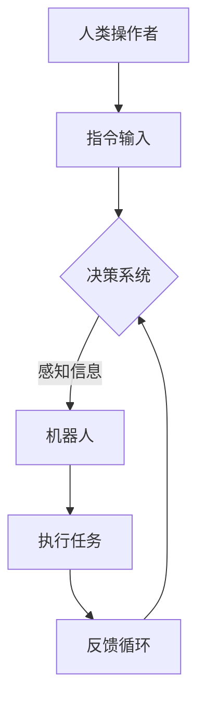
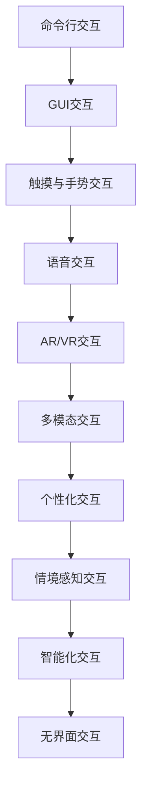
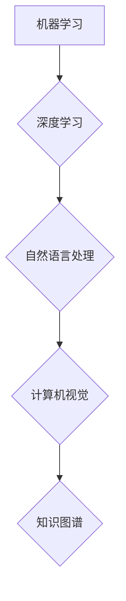
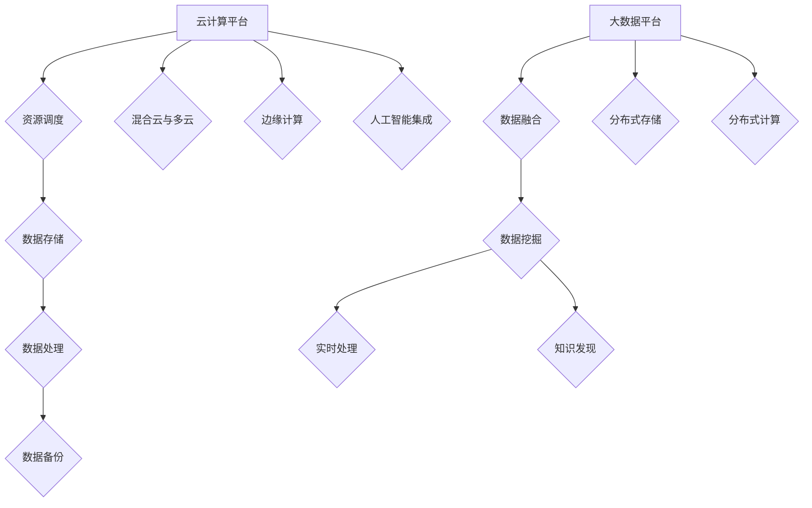
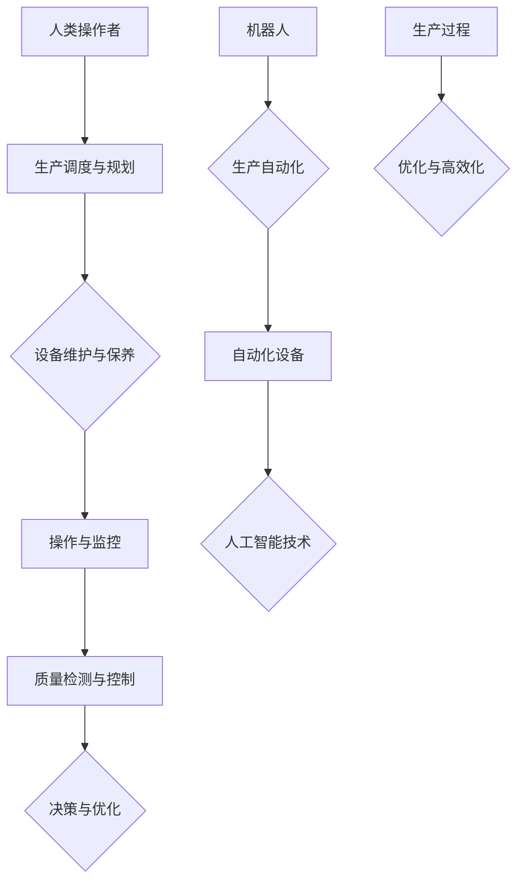
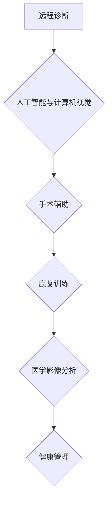
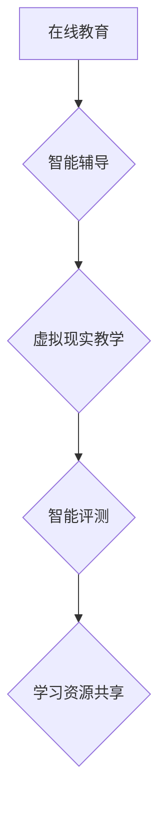
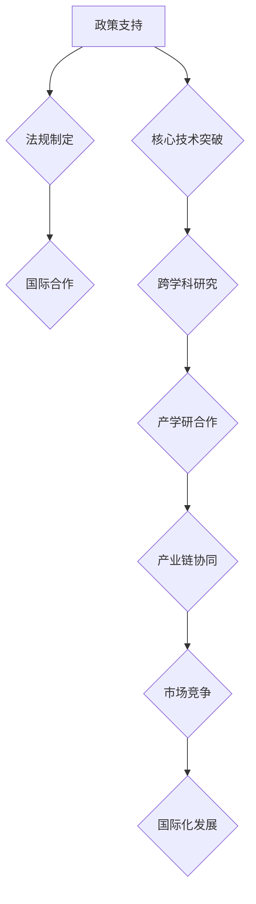
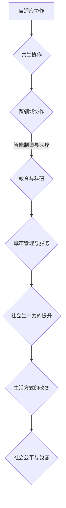
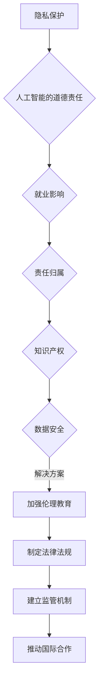

                 

### 《人机协作：通向未来的智能之路》

关键词：人机协作、人工智能、交互技术、云计算、大数据、智能制造、医疗、教育、未来趋势

摘要：
随着信息技术的飞速发展，人机协作正逐渐成为推动社会进步和产业变革的重要力量。本文从人机协作的定义与背景出发，详细探讨了人机协作面临的挑战与机遇，并深入分析了人机交互技术、人工智能应用、云计算与大数据在协作中的作用。同时，本文通过具体实例展示了人机协作在智能制造、医疗和教育等领域的应用，最后对人机协作的未来发展进行了展望，并探讨了相关伦理与法律问题。希望通过本文，能够为读者提供对人机协作的全面理解和深入思考。

# 《人机协作：通向未来的智能之路》目录大纲

## 第一部分：人机协作概述

### 第1章：人机协作的定义与背景

#### 1.1 人机协作的概念

#### 1.2 人机协作的发展历程

#### 1.3 人机协作的重要性

### 第2章：人机协作的挑战与机遇

#### 2.1 人机协作面临的挑战

#### 2.2 人机协作带来的机遇

#### 2.3 人机协作的未来趋势

## 第二部分：人机协作关键技术

### 第3章：人机交互技术

#### 3.1 人机交互的基本原理

#### 3.2 人机交互的技术发展

#### 3.3 人机交互的未来方向

### 第4章：人工智能在协作中的应用

#### 4.1 人工智能的定义与分类

#### 4.2 人工智能的关键技术

#### 4.3 人工智能在协作中的应用案例

### 第5章：云计算与大数据在协作中的应用

#### 5.1 云计算与大数据的概念

#### 5.2 云计算与大数据在协作中的应用

#### 5.3 云计算与大数据的未来发展趋势

## 第三部分：人机协作应用实例

### 第6章：智能制造领域的人机协作

#### 6.1 智能制造的概念与特点

#### 6.2 智能制造中的人机协作

#### 6.3 智能制造应用案例

### 第7章：医疗领域的人机协作

#### 7.1 医疗领域的挑战与机遇

#### 7.2 医疗中的人机协作

#### 7.3 医疗应用案例

### 第8章：教育领域的人机协作

#### 8.1 教育领域的挑战与机遇

#### 8.2 教育中的人机协作

#### 8.3 教育应用案例

## 第四部分：人机协作未来展望

### 第9章：人机协作的发展策略

#### 9.1 政策与法规的推动

#### 9.2 技术创新的驱动

#### 9.3 产业合作与竞争

### 第10章：人机协作的未来趋势

#### 10.1 新型人机协作模式

#### 10.2 跨领域人机协作

#### 10.3 人机协作与社会发展

### 第11章：人机协作的伦理与法律问题

#### 11.1 人机协作中的伦理问题

#### 11.2 人机协作中的法律问题

#### 11.3 伦理与法律的解决方案

## 附录

### 附录A：人机协作常用技术工具

#### A.1 人工智能开发框架

#### A.2 云计算平台

#### A.3 大数据工具

### 附录B：人机协作应用案例汇编

#### B.1 智能制造案例

#### B.2 医疗应用案例

#### B.3 教育应用案例

---

## 第一部分：人机协作概述

### 第1章：人机协作的定义与背景

#### 1.1 人机协作的概念

人机协作（Human-Robot Collaboration，简称HRC）是指人类与机器人通过一定的技术手段和协议，在特定的环境和工作任务中相互配合，共同完成特定目标的过程。简单来说，就是人与机器之间通过智能交互实现共同工作的模式。

人机协作的发展始于20世纪中叶，随着计算机科学和机器人技术的迅速发展，人机协作也逐渐成为人工智能领域的重要研究方向。早期的机器人主要用于重复性高、危险性强的工作，如汽车制造业中的焊接、装配等。随着人工智能技术的进步，机器人开始具备感知、决策和执行能力，人机协作的范围和深度也在不断扩大。

#### 1.2 人机协作的发展历程

人机协作的发展可以分为以下几个阶段：

- **初期阶段（1950-1970年）**：机器人主要作为生产线上的辅助设备，执行简单的重复性工作。

- **中期阶段（1970-1990年）**：随着计算机技术的发展，机器人开始具备一定的智能，能够与人类进行简单的交互，如遥控操作。

- **成熟阶段（1990-2010年）**：机器人的智能水平进一步提高，开始具备自主决策和规划能力，人机协作进入实用阶段。

- **快速发展阶段（2010年至今）**：人工智能技术的突破使得机器人能够更好地理解人类指令，实现高效的人机协作。

#### 1.3 人机协作的重要性

人机协作的重要性体现在以下几个方面：

- **提高生产效率**：人机协作能够实现人与机器的优势互补，提高生产效率，降低成本。

- **改善工作环境**：机器人可以替代人类从事危险、繁重的工作，改善劳动条件。

- **促进创新**：人机协作能够激发人类的创造力，推动新技术、新产品的发展。

- **提升生活质量**：人机协作可以帮助人类完成日常生活中的许多繁琐任务，提高生活质量。

### 人机协作的核心概念与联系

人机协作的核心概念包括机器人、人类操作者、协作环境、任务规划和决策系统等。这些概念之间相互关联，形成一个完整的协作体系。

- **机器人**：执行任务的硬件设备，具备感知、决策和执行能力。

- **人类操作者**：协作的主体，通过指令控制机器人执行任务。

- **协作环境**：机器人执行任务的环境，包括物理环境、虚拟环境等。

- **任务规划**：根据任务需求，制定机器人和人类操作者的协作计划。

- **决策系统**：机器人根据感知信息和环境数据，做出决策，调整行动。

为了更好地理解人机协作的原理，我们可以使用Mermaid流程图来表示其基本架构：

这个流程图展示了人机协作的基本过程：人类操作者输入指令，决策系统根据感知信息做出决策，机器人执行任务，并通过反馈循环不断调整行为。

---

## 第一部分：人机协作概述

### 第2章：人机协作的挑战与机遇

#### 2.1 人机协作面临的挑战

尽管人机协作具有许多优势，但在实际应用过程中仍然面临一系列挑战：

1. **安全与隐私问题**：机器人在执行任务时可能会触及人类操作者，导致安全事故。此外，人机协作过程中产生的数据也可能涉及隐私问题。

2. **人机交互体验**：当前的人机交互技术尚不足以完全满足人类的需求，用户在使用过程中可能会感到困惑或不便。

3. **协同效率**：人机协作需要建立高效的沟通机制和决策模型，以确保任务顺利完成。

4. **技术瓶颈**：机器人的感知、决策和执行能力仍有待提升，以更好地适应复杂多变的环境。

5. **伦理与法律问题**：人机协作引发了许多伦理和法律问题，如责任归属、数据所有权等。

#### 2.2 人机协作带来的机遇

尽管面临挑战，人机协作同样带来了许多机遇：

1. **提高生产效率**：人机协作可以优化生产流程，提高生产效率，降低成本。

2. **改善工作环境**：机器人可以替代人类从事危险、繁重的工作，改善劳动条件。

3. **促进创新**：人机协作能够激发人类的创造力，推动新技术、新产品的发展。

4. **提升生活质量**：人机协作可以帮助人类完成日常生活中的许多繁琐任务，提高生活质量。

5. **跨领域应用**：人机协作在智能制造、医疗、教育、农业等多个领域具有广泛的应用前景。

#### 2.3 人机协作的未来趋势

随着技术的不断进步，人机协作将呈现以下发展趋势：

1. **智能化**：人工智能技术的应用将进一步提升机器人的智能水平，使其能够更好地理解人类指令，实现高效协作。

2. **交互化**：人机交互技术将不断完善，为用户提供更自然的交互体验。

3. **协同化**：人机协作将更加注重协同效率，建立高效的沟通机制和决策模型。

4. **个性化**：人机协作将根据用户需求提供个性化的服务，满足不同场景下的协作需求。

5. **泛在化**：人机协作将逐渐融入人们的日常生活，成为无处不在的智能伙伴。

为了更好地理解人机协作的未来趋势，我们可以使用Mermaid流程图来表示其发展方向：

这个流程图展示了人机协作从智能化到泛在化的四个发展阶段，每个阶段都有其独特的特征和挑战。随着技术的不断进步，人机协作将不断走向成熟，为人类社会带来更多机遇和变革。

---

## 第二部分：人机协作关键技术

### 第3章：人机交互技术

人机交互（Human-Computer Interaction，简称HCI）是研究人类与计算机之间交互的学科，它关注如何设计更加自然、高效、愉悦的交互方式。在人机协作中，人机交互技术扮演着至关重要的角色，它不仅影响着协作的效率，还决定了协作的体验和质量。

#### 3.1 人机交互的基本原理

人机交互的基本原理包括以下几个方面：

1. **感知与反馈**：人机交互系统需要能够感知用户的操作和状态，并给予及时反馈，以建立有效的交互循环。

2. **控制与操作**：用户需要通过某种方式（如触摸、语音、手势等）来控制计算机，人机交互技术需要提供多种操作方式以满足不同用户的需求。

3. **任务与目标**：人机交互的核心目标是帮助用户更高效地完成任务，因此系统设计需要考虑用户任务的特点和目标。

4. **认知与行为**：人机交互系统还需要考虑用户的认知能力和行为模式，设计出符合用户习惯的交互界面。

#### 3.2 人机交互的技术发展

人机交互技术经历了多个发展阶段：

1. **命令行交互**：早期的计算机主要使用命令行界面进行交互，用户需要记住大量的命令和参数。

2. **图形用户界面（GUI）**：随着图形用户界面的出现，人机交互变得更加直观和用户友好。用户可以通过点击、拖拽等操作来完成任务。

3. **触摸与手势交互**：触摸屏和手势识别技术的出现，进一步提升了人机交互的自然性和便捷性。

4. **语音交互**：语音识别和自然语言处理技术的发展，使得语音交互成为可能。用户可以通过语音来与计算机进行交流，大大提高了交互效率。

5. **增强现实（AR）与虚拟现实（VR）**：AR和VR技术为人机交互带来了全新的体验，用户可以在虚拟环境中进行沉浸式交互。

#### 3.3 人机交互的未来方向

未来的人机交互将朝着更加自然、智能和高效的方向发展：

1. **多模态交互**：结合多种交互方式（如语音、手势、触摸等），提供更加灵活和自然的交互体验。

2. **个性化交互**：根据用户的偏好和行为模式，提供个性化的交互服务。

3. **情境感知交互**：根据用户所处的环境和工作任务，动态调整交互界面和交互方式。

4. **智能化交互**：利用人工智能技术，使交互系统能够更好地理解用户需求，提供智能化的建议和帮助。

5. **无界面交互**：随着技术的发展，未来的交互将不再局限于传统的屏幕和界面，而是通过更自然的方式，如脑机接口等。

为了更好地理解人机交互的技术发展，我们可以使用Mermaid流程图来表示其演变过程：

这个流程图展示了人机交互从命令行到无界面交互的演变过程，每个阶段都有其代表性的技术和应用。

---

### 第4章：人工智能在协作中的应用

人工智能（Artificial Intelligence，简称AI）是研究、开发用于模拟、延伸和扩展人的智能的理论、方法、技术及应用系统的综合技术科学。在人机协作中，人工智能扮演着核心角色，它不仅提升了机器人的智能水平，还优化了协作效率和用户体验。

#### 4.1 人工智能的定义与分类

人工智能可以定义为模拟、延伸和扩展人的智能的理论、方法、技术及应用系统。根据人工智能的智能水平，可以分为以下几类：

1. **弱人工智能（Narrow AI）**：指在特定领域具有智能的机器，如语音识别、图像识别等。弱人工智能专注于解决特定问题，不具备跨领域的通用智能。

2. **强人工智能（General AI）**：指具备人类水平智能的机器，能够在各种领域表现出智能行为。强人工智能目前仍处于理论研究阶段，尚未实现。

3. **超人工智能（Super AI）**：指比人类智能更强大的机器，能够解决人类无法解决的问题。超人工智能目前尚未出现，属于未来研究方向。

#### 4.2 人工智能的关键技术

人工智能的关键技术包括：

1. **机器学习（Machine Learning）**：通过算法和模型，使计算机能够从数据中学习并做出决策。机器学习包括监督学习、无监督学习、强化学习等。

2. **深度学习（Deep Learning）**：基于人工神经网络的一种机器学习技术，通过多层神经元的组合，实现对复杂数据的建模和分析。

3. **自然语言处理（Natural Language Processing，NLP）**：研究如何让计算机理解、生成和处理自然语言。NLP在语音识别、机器翻译、情感分析等领域有广泛应用。

4. **计算机视觉（Computer Vision）**：研究如何使计算机像人类一样感知和理解视觉信息。计算机视觉在图像识别、目标检测、人脸识别等领域有重要应用。

5. **知识图谱（Knowledge Graph）**：通过将实体、属性和关系表示为图结构，构建语义理解和知识推理的基础。知识图谱在搜索引擎、推荐系统、智能问答等领域有广泛应用。

#### 4.3 人工智能在协作中的应用案例

人工智能在协作中的应用案例包括：

1. **智能制造**：利用人工智能技术，实现生产线的自动化控制和优化，提高生产效率和产品质量。

2. **医疗诊断**：通过人工智能分析医学图像和病历数据，辅助医生进行诊断和治疗。

3. **智能家居**：利用人工智能技术，实现家庭设备的自动化控制和智能化管理，提升生活品质。

4. **金融风控**：利用人工智能技术，进行风险分析和预测，提高金融市场的稳定性和安全性。

5. **教育辅导**：利用人工智能技术，为学生提供个性化的学习建议和辅导，提升学习效果。

为了更好地理解人工智能在协作中的应用，我们可以使用Mermaid流程图来表示其关键技术：

这个流程图展示了人工智能的关键技术及其在协作中的应用领域，每个技术都有其特定的应用场景和价值。

---

### 第5章：云计算与大数据在协作中的应用

云计算和大数据技术作为现代信息技术的两大基石，正在深刻地改变着人机协作的模式和效率。它们不仅为大规模数据处理提供了基础设施，还为人工智能算法的运行提供了强大的支持。

#### 5.1 云计算与大数据的概念

**云计算**是一种通过网络提供可伸缩的、按需分配的计算资源服务。它包括基础设施即服务（IaaS）、平台即服务（PaaS）和软件即服务（SaaS）等模式。云计算的主要优势在于资源的灵活调度、成本优化和可扩展性。

**大数据**是指无法用传统数据库工具进行高效处理的海量数据。大数据的特点是“4V”：大量（Volume）、多样（Variety）、快速（Velocity）和价值（Value）。大数据技术包括数据采集、存储、处理和分析等多个环节。

#### 5.2 云计算与大数据在协作中的应用

**云计算在协作中的应用**：

1. **资源调度与优化**：云计算平台可以根据任务需求动态分配计算资源，提高资源利用率，降低成本。

2. **数据存储与备份**：云存储服务提供可靠的数据存储方案，保证数据的安全和可访问性。

3. **数据处理与分析**：云计算平台提供强大的数据处理和分析工具，支持实时数据分析和批量处理。

4. **弹性扩展**：随着业务需求的增长，云计算平台可以快速扩展资源，满足协作需求。

**大数据在协作中的应用**：

1. **数据融合与整合**：大数据技术能够整合来自不同源的数据，为协作提供全面的数据视图。

2. **数据挖掘与分析**：通过数据挖掘技术，从大量数据中发现隐藏的模式和关联，支持决策制定。

3. **实时处理与监控**：大数据处理平台能够实时处理和分析数据，提供实时监控和报警功能。

4. **知识发现与共享**：大数据技术可以帮助发现新的知识和规律，促进协作中的知识共享和创新能力。

#### 5.3 云计算与大数据的未来发展趋势

**云计算的未来发展趋势**：

1. **混合云与多云**：随着企业需求的多样化，混合云和多云架构将成为主流。

2. **边缘计算**：将计算资源扩展到网络边缘，提高数据处理速度和效率。

3. **人工智能集成**：云计算平台将集成更多人工智能技术，提供智能化的服务和解决方案。

**大数据的未来发展趋势**：

1. **数据治理与隐私保护**：随着数据量的增长，数据治理和隐私保护将变得越来越重要。

2. **实时大数据处理**：实时处理和分析将成为大数据技术的关键方向。

3. **分布式存储与计算**：分布式架构和存储技术将继续优化大数据处理效率。

为了更好地理解云计算与大数据在协作中的应用，我们可以使用Mermaid流程图来表示其基本架构：

这个流程图展示了云计算与大数据在协作中的应用场景和未来发展趋势，每个技术都有其特定的应用方向和优势。

---

## 第三部分：人机协作应用实例

### 第6章：智能制造领域的人机协作

智能制造是现代制造业的重要发展方向，它通过将信息技术与制造技术深度融合，实现制造过程的智能化、自动化和高效化。人机协作在智能制造中发挥着关键作用，通过人与机器的协同工作，提升生产效率、优化产品质量、改善工作环境。

#### 6.1 智能制造的概念与特点

**智能制造**是指通过应用先进的信息技术和制造技术，实现制造过程的智能化、自动化和高效化。智能制造的主要特点包括：

1. **数字化与网络化**：智能制造强调数据的全面收集、传递和利用，实现制造过程的数字化和智能化。

2. **自动化与智能化**：通过应用机器人、自动化设备和人工智能技术，实现生产过程的自动化和智能化。

3. **定制化与灵活化**：智能制造能够根据客户需求实现个性化定制和灵活生产，提高市场响应速度和竞争力。

4. **高效与低耗**：智能制造通过优化生产流程和资源配置，提高生产效率，降低能源消耗和环境污染。

#### 6.2 智能制造中的人机协作

在智能制造中，人机协作主要体现在以下几个方面：

1. **生产调度与规划**：通过人工智能算法，实现生产任务的优化调度和资源规划，提高生产效率。

2. **操作与监控**：人类操作者通过人机交互界面，监控机器人的运行状态和操作过程，及时进行调整和干预。

3. **设备维护与保养**：人机协作可以实现设备状态的实时监控和故障预测，提前进行维护和保养，减少停机时间。

4. **质量检测与控制**：通过机器视觉、传感器等技术，实现产品质量的实时检测和控制，确保产品质量。

5. **决策与优化**：人类专家和机器人协作进行生产过程的决策和优化，提高生产效率和产品质量。

#### 6.3 智能制造应用案例

智能制造已经在多个行业领域取得了显著的应用成果，以下是几个典型的应用案例：

1. **汽车制造业**：汽车制造业广泛采用机器人进行焊接、装配、喷涂等操作，通过人机协作实现生产自动化和智能化。如特斯拉的Gigafactory工厂，实现了高度自动化和智能化生产。

2. **电子制造业**：电子制造业通过人机协作实现高效的小批量生产。例如，富士康的自动化生产线，机器人与人类工人协作完成手机组装、检测等任务。

3. **家电制造业**：家电制造业利用人机协作实现生产过程的优化和高效化。如海尔集团的智能工厂，通过机器人和人工智能技术，实现了生产过程的自动化和智能化。

4. **食品加工业**：食品加工业通过人机协作实现生产过程的自动化和清洁化。例如，雀巢公司的智能工厂，采用自动化设备和机器人进行生产，确保食品质量和安全。

为了更好地理解智能制造中的人机协作，我们可以使用Mermaid流程图来表示其基本架构：

这个流程图展示了智能制造中的人机协作架构，包括生产调度、设备维护、操作监控、质量检测、决策优化等关键环节，以及机器人和人工智能技术的应用。

---

### 第7章：医疗领域的人机协作

医疗领域是人机协作的重要应用场景之一，它不仅提升了医疗服务的效率和质量，还推动了医疗技术的创新和发展。人机协作在医疗诊断、手术辅助、康复训练等多个方面发挥着重要作用。

#### 7.1 医疗领域的挑战与机遇

**挑战**：

1. **资源分配不均**：全球医疗资源分布不均，尤其是在贫困地区，医疗资源更加匮乏。人机协作可以在一定程度上缓解这一问题，通过远程医疗和智能化诊断系统，提高医疗服务的可及性。

2. **医疗成本高**：医疗诊断和手术等过程需要大量人力和时间，导致医疗成本高。人机协作可以通过自动化和智能化技术，降低医疗成本，提高效率。

3. **诊断准确性**：医疗诊断的准确性对于患者的治疗和康复至关重要。人机协作通过人工智能技术，可以帮助医生更准确地诊断疾病，减少误诊率。

**机遇**：

1. **技术创新**：人机协作为医疗领域带来了许多新技术，如机器学习、计算机视觉、机器人技术等，为医疗诊断和治疗提供了新的手段。

2. **个性化医疗**：人机协作可以根据患者的具体情况，提供个性化的治疗方案，提高治疗效果。

3. **远程医疗**：通过人机协作，可以实现远程医疗诊断和治疗，为偏远地区和患者提供高质量的医疗服务。

#### 7.2 医疗中的人机协作

在医疗领域，人机协作主要体现在以下几个方面：

1. **远程诊断**：通过人工智能和计算机视觉技术，医生可以远程诊断患者的病情，提供专业意见。例如，利用深度学习算法，可以实现肺癌、乳腺癌等疾病的自动检测。

2. **手术辅助**：机器人辅助手术已经成为一种趋势，通过微创手术机器人，医生可以更精准地进行手术操作，提高手术成功率。如达芬奇手术机器人，已经广泛应用于心脏手术、前列腺手术等领域。

3. **康复训练**：人机协作可以帮助患者进行康复训练，如智能康复机器人，可以根据患者的具体情况进行个性化训练，提高康复效果。

4. **医学影像分析**：通过计算机视觉和深度学习技术，可以自动分析医学影像，如CT、MRI等，辅助医生进行疾病诊断。

5. **健康管理**：人机协作可以提供个性化的健康管理和疾病预防建议，如智能手环、智能健康监测设备等，帮助用户监测健康状况，预防疾病发生。

#### 7.3 医疗应用案例

以下是几个医疗领域的应用案例：

1. **COVID-19诊断**：在COVID-19疫情期间，人工智能和计算机视觉技术被用于快速诊断。例如，通过分析CT影像，可以自动识别和检测肺部病变，帮助医生进行诊断。

2. **微创手术**：达芬奇手术机器人已经在全球范围内广泛应用，通过微创手术，医生可以更精准地进行手术操作，减少术后并发症。

3. **康复机器人**：康复机器人可以帮助患者进行康复训练，如上肢康复机器人，可以模拟出不同的康复训练场景，帮助患者进行有效的康复训练。

4. **医学影像分析**：IBM的Watson for Oncology系统，通过分析大量医学文献和病例数据，为医生提供个性化的治疗方案。

为了更好地理解医疗领域的人机协作，我们可以使用Mermaid流程图来表示其应用场景：

这个流程图展示了医疗领域的人机协作应用场景，包括远程诊断、手术辅助、康复训练、医学影像分析和健康管理等方面。

---

### 第8章：教育领域的人机协作

教育领域是人机协作的另一个重要应用场景，通过人机协作，可以推动教育方式的变革，提高教学效果，满足个性化学习需求。在人机协作的助力下，教育领域正逐步走向智能化和个性化。

#### 8.1 教育领域的挑战与机遇

**挑战**：

1. **教育资源不平衡**：不同地区和学校之间的教育资源存在显著差距，人机协作可以通过远程教育和智能化教学资源，弥补这一差距。

2. **教学质量不高**：传统教学模式下，教师难以全面关注每个学生，导致教学质量参差不齐。人机协作可以通过智能教学系统和个性化辅导，提高教学质量。

3. **学习效率低**：学生在学习过程中，难以保持持续的学习兴趣和动力。人机协作可以通过互动性和游戏化教学，激发学生的学习兴趣和积极性。

**机遇**：

1. **教育创新**：人机协作带来了许多新的教育技术和方法，如在线教育、虚拟现实教学、智能辅导等，为教育创新提供了广阔空间。

2. **个性化学习**：人机协作可以根据学生的个体差异，提供个性化的学习路径和辅导，满足学生的个性化学习需求。

3. **学习资源共享**：通过人机协作，可以共享优质的教育资源，提高教育资源的利用效率。

#### 8.2 教育中的人机协作

在教育领域，人机协作主要体现在以下几个方面：

1. **在线教育**：通过互联网和智能教学平台，实现教师和学生之间的远程教学和互动。例如，慕课（MOOC）平台，可以让全球学生在线学习世界顶尖大学课程。

2. **智能辅导**：利用人工智能技术，为学生提供个性化的学习辅导和反馈。如智能学习助手，可以根据学生的学习进度和表现，提供针对性的学习建议和资源。

3. **虚拟现实教学**：通过虚拟现实技术，创造沉浸式的学习体验，让学生身临其境地学习。例如，医学教育中，学生可以通过虚拟手术模拟系统，进行手术操作的练习。

4. **智能评测**：利用人工智能技术，自动分析和评估学生的学习成果，提供即时反馈。如智能评测系统，可以自动批改作业和考试，为学生提供详细的分析报告。

5. **学习资源共享**：通过人机协作，实现教育资源的共享和优化利用。例如，教育云平台，可以让教师和学生共享教学资源和学习资料。

#### 8.3 教育应用案例

以下是几个教育领域的应用案例：

1. **在线教育**：如慕课平台Coursera、edX等，通过互联网技术，让全球学生能够在线学习世界顶尖大学课程。

2. **智能辅导**：如智能学习助手Duolingo，通过人工智能技术，提供个性化的语言学习辅导，帮助学生提高学习效果。

3. **虚拟现实教学**：如虚拟现实（VR）实验室，学生可以通过VR设备，进行虚拟实验和操作，增强学习体验。

4. **智能评测**：如智能评测系统Kahoot，通过游戏化学习，让学生在互动中学习，并通过即时反馈，提高学习效果。

为了更好地理解教育领域的人机协作，我们可以使用Mermaid流程图来表示其应用场景：

这个流程图展示了教育领域的人机协作应用场景，包括在线教育、智能辅导、虚拟现实教学、智能评测和学习资源共享等方面。

---

## 第四部分：人机协作未来展望

### 第9章：人机协作的发展策略

人机协作作为现代信息技术的重要发展方向，其未来发展面临着诸多挑战和机遇。为了推动人机协作的健康发展，需要从以下几个方面制定相应的发展策略：

#### 9.1 政策与法规的推动

**政策支持**：政府应加大对人机协作技术研发和应用的政策支持，出台相关政策措施，鼓励企业、高校和科研机构积极参与人机协作的研究与开发。

**法规制定**：制定和完善相关法律法规，规范人机协作的应用范围和标准，保障人机协作的安全性和合法性，为产业发展提供法治保障。

**国际合作**：加强国际合作，推动全球人机协作技术的交流与合作，促进技术标准的统一和产业链的协同发展。

#### 9.2 技术创新的驱动

**核心技术突破**：加大在人机交互、人工智能、云计算和大数据等关键技术的研发投入，推动核心技术的突破和创新，为人机协作提供技术支撑。

**跨学科研究**：鼓励跨学科合作，整合多学科知识，为人机协作提供多元化的解决方案。

**产学研合作**：加强产学研合作，推动科研成果转化为实际应用，提高人机协作技术的实用性和产业化水平。

#### 9.3 产业合作与竞争

**产业链协同**：构建完善的人机协作产业链，促进上下游企业的合作与协同，实现产业链的整合和优化。

**市场竞争**：鼓励企业间的良性竞争，通过创新、技术进步和服务质量提升，推动产业整体水平的提升。

**国际化发展**：推动人机协作技术的国际化发展，扩大国际市场份额，提升国际竞争力。

### 人机协作的发展策略图解

为了更好地理解人机协作的发展策略，我们可以使用Mermaid流程图来表示其关键环节：

这个流程图展示了人机协作发展策略的各个环节，包括政策支持、法规制定、国际合作、核心技术突破、跨学科研究、产学研合作、产业链协同、市场竞争和国际化发展等。

---

### 第10章：人机协作的未来趋势

人机协作作为信息技术和智能制造的重要方向，其未来发展具有广阔的前景。以下是人机协作的几个未来趋势：

#### 10.1 新型人机协作模式

**自适应协作**：未来的协作系统将具备更强的自适应能力，能够根据任务需求和环境变化，动态调整协作模式和策略。

**共生协作**：人与机器将形成更加紧密的共生关系，共同完成任务，实现真正的协作共赢。

**跨领域协作**：人机协作将打破行业和领域的界限，实现跨领域的协同工作，推动产业融合和创新。

#### 10.2 跨领域人机协作

**智能制造与医疗**：智能制造中的机器人技术将与医疗领域中的人工智能和机器人技术相结合，实现智能制造与医疗的协同应用。

**教育与科研**：教育领域的人机协作将与科研领域的技术进步相结合，推动教育科研的智能化和个性化。

**城市管理与服务**：人机协作将应用于城市管理和公共服务，提高城市管理效率和居民生活质量。

#### 10.3 人机协作与社会发展

**社会生产力的提升**：人机协作将提高社会生产力，推动产业升级和经济增长。

**生活方式的改变**：人机协作将深刻改变人们的生活方式，提高生活质量，满足个性化需求。

**社会公平与包容**：人机协作将有助于缩小社会差距，提高社会公平与包容性。

### 人机协作的未来趋势图解

为了更好地理解人机协作的未来趋势，我们可以使用Mermaid流程图来表示：

这个流程图展示了人机协作在未来的几个关键趋势，包括自适应协作、共生协作、跨领域协作、智能制造与医疗、教育与科研、城市管理与服务、社会生产力的提升、生活方式的改变和社会公平与包容等方面。

---

### 第11章：人机协作的伦理与法律问题

随着人机协作的迅速发展，相关的伦理和法律问题也日益凸显。这些问题的合理解决对于人机协作的健康发展至关重要。

#### 11.1 人机协作中的伦理问题

**隐私保护**：在人机协作中，个人隐私的保护成为了一个关键问题。特别是在医疗和教育领域，个人的敏感信息可能会被收集和存储，如何确保这些信息的安全和隐私成为一个亟待解决的问题。

**人工智能的道德责任**：随着人工智能在协作中的广泛应用，如何确定和分配人工智能的道德责任成为一个难题。特别是在人工智能决策可能对人类产生重大影响的情况下，如何确保其决策的道德性成为了一个关键问题。

**就业影响**：人机协作的发展可能会导致一些传统职业的消失，如何确保这些行业的工作者的权益，以及如何创造新的就业机会，也是需要关注的重要伦理问题。

#### 11.2 人机协作中的法律问题

**责任归属**：在人机协作中，一旦发生意外或损害，如何确定责任归属成为一个复杂的问题。是机器人的开发者、制造商还是操作者需要承担责任，需要明确的法律规定。

**知识产权**：在人机协作中，如何保护知识产权成为一个重要问题。特别是涉及人工智能算法、软件等创新成果的知识产权保护，需要建立完善的法律法规。

**数据安全**：在人机协作中，涉及大量个人和企业的数据，如何确保这些数据的安全和保密，防止数据泄露和滥用，也是法律需要关注的重要问题。

#### 11.3 伦理与法律的解决方案

**加强伦理教育**：通过加强伦理教育，提高从业人员和公众对伦理问题的认识和理解，促进人机协作的健康发展。

**制定法律法规**：政府和相关机构应制定和完善相关的法律法规，明确人机协作中的责任归属、数据保护、知识产权保护等关键问题，为人机协作提供法治保障。

**建立监管机制**：建立独立的监管机构，对人机协作进行监督和管理，确保其合规性和安全性。

**推动国际合作**：加强国际合作，共同应对人机协作带来的伦理和法律挑战，推动全球人机协作的健康发展。

### 人机协作的伦理与法律问题图解

为了更好地理解人机协作中的伦理与法律问题，我们可以使用Mermaid流程图来表示：

这个流程图展示了人机协作中面临的伦理与法律问题及其解决方案，包括隐私保护、人工智能的道德责任、就业影响、责任归属、知识产权、数据安全、加强伦理教育、制定法律法规、建立监管机制和推动国际合作等方面。

---

## 附录

### 附录A：人机协作常用技术工具

在人机协作领域，有许多常用的技术工具和平台，这些工具和平台为人机协作的实现提供了重要的支持。以下是几个常用的人机协作技术工具：

#### A.1 人工智能开发框架

**TensorFlow**：由Google开发的开源机器学习框架，支持各种深度学习模型和算法。

**PyTorch**：由Facebook开发的开源机器学习库，以其动态计算图和易用性著称。

**Scikit-learn**：一个基于Python的开源机器学习库，提供多种经典的机器学习算法。

#### A.2 云计算平台

**Amazon Web Services (AWS)**：提供全面的云计算服务，包括计算、存储、数据库、人工智能等。

**Microsoft Azure**：提供云服务、人工智能服务、物联网服务等，支持多种编程语言和开发工具。

**Google Cloud Platform (GCP)**：提供云计算、人工智能、数据存储等服务，支持多种开发环境和工具。

#### A.3 大数据工具

**Hadoop**：一个分布式数据处理框架，用于大规模数据存储和处理。

**Apache Spark**：一个快速、通用的大数据处理引擎，支持内存计算和大数据处理。

**Apache Flink**：一个流处理框架，支持实时数据处理和分析。

### 附录B：人机协作应用案例汇编

在人机协作领域，有许多成功的应用案例，以下是几个典型的应用案例：

#### B.1 智能制造案例

**汽车制造**：特斯拉的Gigafactory工厂采用了大量的机器人自动化生产线，实现了生产过程的智能化和高效化。

**电子制造**：富士康的自动化生产线，通过机器人与人类工人的协作，实现了高效的小批量生产。

#### B.2 医疗应用案例

**远程医疗**：通过人工智能和远程诊断系统，医生可以远程诊断患者的病情，提供专业意见。

**手术辅助**：达芬奇手术机器人，通过微创手术，提高了手术的成功率和患者恢复速度。

#### B.3 教育应用案例

**在线教育**：慕课（MOOC）平台，如Coursera和edX，通过在线教育实现了全球范围内的教育资源共享。

**智能辅导**：智能学习助手，如Duolingo，通过人工智能技术，提供个性化的学习辅导和反馈。

这些应用案例展示了人机协作在不同领域的成功应用，为我们提供了宝贵的经验和启示。通过不断探索和实践，人机协作将迎来更加美好的未来。

---

### 作者信息

作者：AI天才研究院/AI Genius Institute & 禅与计算机程序设计艺术 /Zen And The Art of Computer Programming

本文由AI天才研究院（AI Genius Institute）与禅与计算机程序设计艺术（Zen And The Art of Computer Programming）联合撰写，旨在深入探讨人机协作的原理、技术与应用，为读者提供全面而详实的了解。希望通过本文，能够激发读者对人机协作的思考和研究，共同推动人工智能技术的发展和应用。

