                 

# 《人类-AI协：合作解决复杂问题》

## 关键词：人工智能，协作，复杂问题，决策支持，创新设计，项目管理，未来趋势

> 摘要：本文探讨了人类与人工智能协作解决复杂问题的理论基础、关键技术和应用实践。通过详细分析人类-AI协作的概念、理论框架、关键技术以及案例研究，揭示了人类与AI协作在各个领域的应用价值。本文旨在为读者提供对人类-AI协作的全面理解，并展望其未来发展趋势。

## 目录大纲

## 第一部分：人类-AI协作的理论基础

### 第1章：人类-AI协作的概念与意义

#### 1.1 人类-AI协作的定义

#### 1.2 人类-AI协作的历史背景

#### 1.3 人类-AI协作的意义和价值

### 第2章：人类-AI协作的理论框架

#### 2.1 协作系统的基本概念

#### 2.2 人类-AI协作的模型

#### 2.3 人类-AI协作的伦理问题

### 第3章：人类-AI协作的关键技术

#### 3.1 数据共享与隐私保护

#### 3.2 自然语言处理

#### 3.3 人工智能伦理

### 第4章：人类-AI协作的案例分析

#### 4.1 案例研究一：医疗领域的协作

#### 4.2 案例研究二：教育领域的协作

#### 4.3 案例研究三：工业生产领域的协作

## 第二部分：人类-AI协作的应用实践

### 第5章：人类-AI协作在决策支持中的应用

#### 5.1 决策支持系统的构建

#### 5.2 AI辅助决策的算法

#### 5.3 决策支持系统的实际应用案例

### 第6章：人类-AI协作在创新设计中的应用

#### 6.1 创新设计的基本流程

#### 6.2 AI在创新设计中的作用

#### 6.3 人类-AI协作的创新设计案例

### 第7章：人类-AI协作在项目管理中的应用

#### 7.1 项目管理的基本概念

#### 7.2 AI在项目管理中的应用

#### 7.3 人类-AI协作的项目管理案例

### 第8章：人类-AI协作的未来发展趋势

#### 8.1 人类-AI协作的发展趋势

#### 8.2 人类-AI协作的潜在应用领域

#### 8.3 人类-AI协作的挑战与机遇

## 附录：人类-AI协作相关资源

### 附录1：人类-AI协作的工具与平台

### 附录2：人类-AI协作的论文与书籍推荐

### 附录3：人类-AI协作的在线课程与论坛推荐

----------------------------------------------------------------

### 第一部分：人类-AI协作的理论基础

#### 第1章：人类-AI协作的概念与意义

##### 1.1 人类-AI协作的定义

人类-AI协作是指人类与人工智能系统共同参与，协同完成特定任务的过程。在这个过程中，人类提供问题背景、决策经验和创造力，而AI系统则提供强大的计算能力、自动化算法和数据分析能力。双方通过信息交换和相互学习，实现优势互补，共同解决复杂问题。

##### 1.2 人类-AI协作的历史背景

随着人工智能技术的快速发展，人类与AI的协作应用逐渐普及。早在20世纪80年代，专家系统就开始应用于医疗、金融等领域，帮助人类进行决策。进入21世纪，随着深度学习、大数据和云计算等技术的崛起，AI的能力得到了进一步提升，人类-AI协作也进入了一个全新的阶段。

##### 1.3 人类-AI协作的意义和价值

人类-AI协作具有以下几个方面的意义和价值：

1. **提高决策效率**：AI系统可以快速处理大量数据，提供精确的分析结果，帮助人类做出更加明智的决策。

2. **发挥人类创造力**：AI系统可以辅助人类进行问题建模、算法优化和算法设计，激发人类的创造力。

3. **扩展人类认知边界**：AI系统可以处理复杂问题，解决人类难以解决的难题，扩展人类的认知边界。

4. **降低人力成本**：AI系统可以自动化执行重复性任务，减少人力成本，提高生产效率。

5. **提升生活质量**：AI系统可以提供个性化服务，优化人类生活方式，提升生活质量。

#### 第2章：人类-AI协作的理论框架

##### 2.1 协作系统的基本概念

协作系统是指多个个体（包括人类和AI系统）在共同目标下，通过信息交换和协调行动，实现系统整体效益最大化的系统。协作系统具有以下基本概念：

1. **协作个体**：协作系统的基本组成单位，可以是人类或AI系统。

2. **协作任务**：协作系统要完成的任务，可以是具体的任务目标，也可以是解决问题的方法。

3. **协作目标**：协作系统要实现的整体目标，通常是最大化系统整体效益。

4. **协作策略**：协作个体在协作过程中采取的行动策略，包括任务分配、信息共享和协调机制等。

##### 2.2 人类-AI协作的模型

人类-AI协作的模型可以分为以下几种类型：

1. **辅助型协作**：AI系统为人类提供辅助和支持，帮助人类完成特定任务。

2. **协同型协作**：人类和AI系统共同参与任务，各自发挥优势，共同完成目标。

3. **监督型协作**：人类对AI系统进行监督和指导，确保AI系统在协作过程中的正确性和有效性。

4. **学习型协作**：人类和AI系统相互学习，不断提高协作效率和质量。

##### 2.3 人类-AI协作的伦理问题

人类-AI协作在带来巨大效益的同时，也引发了一系列伦理问题，主要包括：

1. **隐私保护**：AI系统在处理大量数据时，可能涉及个人隐私信息，如何保护隐私成为关键问题。

2. **责任归属**：在人类-AI协作过程中，如果出现错误或事故，如何界定责任归属？

3. **公平性**：AI系统在决策过程中可能存在偏见，如何确保公平性？

4. **人机关系**：人类与AI系统之间的互动如何平衡，避免人机冲突？

#### 第3章：人类-AI协作的关键技术

##### 3.1 数据共享与隐私保护

数据共享是人类-AI协作的基础，而隐私保护是确保协作安全的关键。以下是数据共享与隐私保护的关键技术：

1. **数据加密**：通过加密技术保护数据在传输和存储过程中的安全性。

2. **隐私计算**：在数据处理过程中，采用隐私计算技术，确保数据隐私不被泄露。

3. **联邦学习**：通过分布式计算和模型融合，实现多方数据联合建模，同时保护数据隐私。

4. **差分隐私**：在数据分析过程中，通过引入噪声，保护个人隐私信息不被泄露。

##### 3.2 自然语言处理

自然语言处理是AI与人类协作的重要手段，以下是其关键技术：

1. **语言理解**：通过深度学习技术，实现自然语言的理解和语义分析。

2. **语言生成**：通过生成模型，实现自然语言文本的自动生成。

3. **对话系统**：基于自然语言处理技术，实现人类与AI系统的对话交互。

4. **情感分析**：通过分析语言情感，实现情感识别和情感计算。

##### 3.3 人工智能伦理

人工智能伦理是确保人类-AI协作可持续发展的重要保障。以下是人工智能伦理的关键技术：

1. **算法透明性**：确保算法的可解释性和透明性，使人类能够理解AI系统的决策过程。

2. **算法公平性**：通过算法设计，确保AI系统在决策过程中不产生歧视和偏见。

3. **算法可解释性**：通过可解释性技术，使人类能够理解AI系统的决策过程和决策依据。

4. **算法安全性**：确保AI系统在运行过程中，不受恶意攻击和数据泄露的影响。

#### 第4章：人类-AI协作的案例分析

##### 4.1 案例研究一：医疗领域的协作

医疗领域是人类-AI协作的重要应用场景之一。以下是医疗领域的人类-AI协作案例分析：

1. **辅助诊断**：AI系统通过分析患者病历、影像资料和生物信息，提供辅助诊断建议。

2. **智能药物研发**：AI系统通过分析大量药物数据，加速新药研发和优化药物配方。

3. **智能康复**：AI系统通过监测患者康复进程，提供个性化的康复建议和训练方案。

##### 4.2 案例研究二：教育领域的协作

教育领域是人类-AI协作的另一个重要应用场景。以下是教育领域的人类-AI协作案例分析：

1. **个性化教学**：AI系统根据学生的学习情况和能力水平，提供个性化的教学资源和辅导。

2. **智能评估**：AI系统通过分析学生的学习过程和成绩，提供智能化的评估和反馈。

3. **智能辅导**：AI系统通过在线互动和实时辅导，帮助学生解决学习中的问题。

##### 4.3 案例研究三：工业生产领域的协作

工业生产领域是人类-AI协作的重要应用场景之一。以下是工业生产领域的人类-AI协作案例分析：

1. **生产优化**：AI系统通过分析生产数据，提供生产优化建议，提高生产效率和产品质量。

2. **故障预测**：AI系统通过监测设备运行状态，提供故障预测和预防措施，降低设备故障率。

3. **智能物流**：AI系统通过优化物流路径和配送计划，提高物流效率和服务质量。

### 总结

人类-AI协作作为人工智能领域的重要研究方向，具有广泛的应用前景和深远的社会影响。通过对人类-AI协作的理论基础、关键技术和应用实践的深入探讨，我们可以更好地理解人类与AI协作的机制和规律，为未来的研究和应用提供指导。同时，我们也需要关注人类-AI协作中存在的伦理问题，确保协作的可持续发展。

----------------------------------------------------------------

### 第一部分：人类-AI协作的理论基础

#### 第1章：人类-AI协作的概念与意义

##### 1.1 人类-AI协作的定义

人类-AI协作是指人类与人工智能系统共同参与，协同完成特定任务的过程。在这个过程中，人类提供问题背景、决策经验和创造力，而AI系统则提供强大的计算能力、自动化算法和数据分析能力。双方通过信息交换和相互学习，实现优势互补，共同解决复杂问题。

##### 1.2 人类-AI协作的历史背景

人类-AI协作的概念可以追溯到人工智能的早期研究。在20世纪50年代，随着计算机技术的发展，人工智能领域开始兴起。早期的AI系统主要集中在逻辑推理和问题求解方面，尽管在某些领域取得了显著成果，但总体上仍处于初级阶段。

随着时间的推移，AI技术逐渐成熟，特别是深度学习、大数据和云计算等技术的崛起，使得AI系统在图像识别、自然语言处理、预测分析等方面取得了突破性进展。与此同时，人类对于复杂问题的解决需求也越来越高，这为人类-AI协作提供了广阔的应用场景。

在历史上，人类-AI协作的应用主要集中于特定领域，如医疗、金融、工业等。随着AI技术的不断进步和普及，人类-AI协作的应用范围也在不断扩大。目前，人类-AI协作已经成为人工智能领域的一个重要研究方向，并且在各个领域取得了显著成果。

##### 1.3 人类-AI协作的意义和价值

人类-AI协作具有以下几个方面的意义和价值：

1. **提高决策效率**：AI系统可以快速处理大量数据，提供精确的分析结果，帮助人类做出更加明智的决策。例如，在金融领域，AI系统可以帮助分析市场数据，提供投资建议，提高投资效率。

2. **发挥人类创造力**：AI系统可以辅助人类进行问题建模、算法优化和算法设计，激发人类的创造力。例如，在科学研究领域，AI系统可以帮助研究人员分析大量数据，发现潜在的研究方向，提高研究效率。

3. **扩展人类认知边界**：AI系统可以处理复杂问题，解决人类难以解决的难题，扩展人类的认知边界。例如，在医疗领域，AI系统可以帮助医生分析患者的病历和影像资料，提供更准确的诊断结果。

4. **降低人力成本**：AI系统可以自动化执行重复性任务，减少人力成本，提高生产效率。例如，在制造业领域，AI系统可以帮助优化生产流程，减少浪费，提高生产效率。

5. **提升生活质量**：AI系统可以提供个性化服务，优化人类生活方式，提升生活质量。例如，智能家居系统可以帮助人们自动化管理家庭设备，提供舒适的生活环境。

总之，人类-AI协作不仅能够提高决策效率、发挥人类创造力和扩展人类认知边界，还能够降低人力成本和提升生活质量，具有重要的社会价值和意义。

#### 第2章：人类-AI协作的理论框架

##### 2.1 协作系统的基本概念

协作系统是指多个个体（包括人类和AI系统）在共同目标下，通过信息交换和协调行动，实现系统整体效益最大化的系统。协作系统具有以下基本概念：

1. **协作个体**：协作系统的基本组成单位，可以是人类或AI系统。

2. **协作任务**：协作系统要完成的任务，可以是具体的任务目标，也可以是解决问题的方法。

3. **协作目标**：协作系统要实现的整体目标，通常是最大化系统整体效益。

4. **协作策略**：协作个体在协作过程中采取的行动策略，包括任务分配、信息共享和协调机制等。

##### 2.2 人类-AI协作的模型

人类-AI协作的模型可以分为以下几种类型：

1. **辅助型协作**：AI系统为人类提供辅助和支持，帮助人类完成特定任务。例如，在医疗领域，AI系统可以帮助医生分析患者病历和影像资料，提供诊断建议。

2. **协同型协作**：人类和AI系统共同参与任务，各自发挥优势，共同完成目标。例如，在自动驾驶领域，人类司机与AI系统共同控制车辆，实现安全驾驶。

3. **监督型协作**：人类对AI系统进行监督和指导，确保AI系统在协作过程中的正确性和有效性。例如，在自动驾驶领域，人类司机需要对AI系统的决策进行实时监督，确保驾驶安全。

4. **学习型协作**：人类和AI系统相互学习，不断提高协作效率和质量。例如，在智能家居领域，AI系统可以学习人类的生活习惯，提供个性化的服务。

##### 2.3 人类-AI协作的伦理问题

人类-AI协作在带来巨大效益的同时，也引发了一系列伦理问题，主要包括：

1. **隐私保护**：AI系统在处理大量数据时，可能涉及个人隐私信息，如何保护隐私成为关键问题。解决方案包括数据加密、隐私计算和联邦学习等。

2. **责任归属**：在人类-AI协作过程中，如果出现错误或事故，如何界定责任归属？解决方案包括制定相关法律法规、明确责任界定和保险制度等。

3. **公平性**：AI系统在决策过程中可能存在偏见，如何确保公平性？解决方案包括算法公平性设计、算法透明性和算法可解释性等。

4. **人机关系**：人类与AI系统之间的互动如何平衡，避免人机冲突？解决方案包括人机交互设计、AI伦理教育和人机共生理念等。

总之，人类-AI协作的伦理问题需要我们从技术、法律、社会等多个维度进行深入探讨，确保协作的可持续发展。

#### 第3章：人类-AI协作的关键技术

##### 3.1 数据共享与隐私保护

数据共享是确保人类-AI协作有效性的基础，但隐私保护也是不可忽视的重要问题。以下是数据共享与隐私保护的关键技术：

1. **数据加密**：数据加密技术可以确保数据在传输和存储过程中的安全性。常用的加密算法包括对称加密和非对称加密。

2. **隐私计算**：隐私计算技术可以在数据处理过程中保护数据隐私，避免数据泄露。常见的隐私计算技术包括同态加密、安全多方计算和联邦学习。

3. **联邦学习**：联邦学习是一种分布式学习技术，通过在多方之间共享模型参数，实现数据隐私保护。联邦学习可以有效防止数据泄露，同时提高模型性能。

4. **差分隐私**：差分隐私是一种用于保护个人隐私的数据分析技术。通过在数据分析过程中引入噪声，确保个人隐私不被泄露。

##### 3.2 自然语言处理

自然语言处理是AI与人类协作的重要手段。以下是自然语言处理的关键技术：

1. **语言理解**：语言理解技术包括词法分析、句法分析和语义分析等。通过深度学习技术，可以实现高精度的语言理解。

2. **语言生成**：语言生成技术可以自动生成自然语言文本。常见的生成模型包括循环神经网络（RNN）和变换器（Transformer）等。

3. **对话系统**：对话系统是一种能够与人类进行自然语言交互的AI系统。常见的对话系统包括基于规则的和基于机器学习的对话系统。

4. **情感分析**：情感分析技术可以识别文本的情感倾向，包括正面、负面和中性。通过情感分析，可以了解人类的需求和情感状态。

##### 3.3 人工智能伦理

人工智能伦理是确保人类-AI协作可持续发展的重要保障。以下是人工智能伦理的关键技术：

1. **算法透明性**：算法透明性是指算法的可解释性和透明性。通过算法透明性技术，人类可以理解AI系统的决策过程和决策依据。

2. **算法公平性**：算法公平性是指AI系统在决策过程中不产生歧视和偏见。通过算法公平性设计，可以确保AI系统在处理数据时保持公平。

3. **算法可解释性**：算法可解释性是指算法决策过程的可理解性。通过算法可解释性技术，人类可以理解AI系统的决策过程和决策依据。

4. **算法安全性**：算法安全性是指AI系统在运行过程中不受恶意攻击和数据泄露的影响。通过算法安全性技术，可以确保AI系统的可靠性和安全性。

总之，人类-AI协作的关键技术包括数据共享与隐私保护、自然语言处理和人工智能伦理等。这些技术不仅为人类-AI协作提供了基础，也为未来的发展提供了方向。

#### 第4章：人类-AI协作的案例分析

##### 4.1 案例研究一：医疗领域的协作

医疗领域是人类-AI协作的重要应用场景之一。以下是医疗领域的人类-AI协作案例分析：

1. **辅助诊断**：AI系统可以通过分析患者的病历、影像资料和生物信息，提供辅助诊断建议。例如，通过分析影像资料，AI系统可以识别疾病的具体部位和严重程度，帮助医生做出更准确的诊断。

2. **智能药物研发**：AI系统可以通过分析大量药物数据，加速新药研发和优化药物配方。例如，通过分析药物结构与疗效之间的关系，AI系统可以预测药物的效果，为新药研发提供重要参考。

3. **智能康复**：AI系统可以通过监测患者的康复进程，提供个性化的康复建议和训练方案。例如，通过分析患者的运动数据，AI系统可以制定适合患者的康复计划，提高康复效果。

##### 4.2 案例研究二：教育领域的协作

教育领域是人类-AI协作的另一个重要应用场景。以下是教育领域的人类-AI协作案例分析：

1. **个性化教学**：AI系统可以根据学生的学习情况和能力水平，提供个性化的教学资源和辅导。例如，通过分析学生的学习数据，AI系统可以为学生推荐适合的学习材料和练习题，提高学习效果。

2. **智能评估**：AI系统可以通过分析学生的学习过程和成绩，提供智能化的评估和反馈。例如，通过分析学生的学习行为，AI系统可以评估学生的学习效果，为教师提供教学改进建议。

3. **智能辅导**：AI系统可以通过在线互动和实时辅导，帮助学生解决学习中的问题。例如，通过语音识别和自然语言处理技术，AI系统可以回答学生的问题，提供学习指导。

##### 4.3 案例研究三：工业生产领域的协作

工业生产领域是人类-AI协作的重要应用场景之一。以下是工业生产领域的人类-AI协作案例分析：

1. **生产优化**：AI系统可以通过分析生产数据，提供生产优化建议，提高生产效率和产品质量。例如，通过分析生产线的运行数据，AI系统可以优化生产流程，减少浪费，提高生产效率。

2. **故障预测**：AI系统可以通过监测设备运行状态，提供故障预测和预防措施，降低设备故障率。例如，通过分析设备的振动数据，AI系统可以预测设备可能出现的故障，提前进行维护，避免设备停机。

3. **智能物流**：AI系统可以通过优化物流路径和配送计划，提高物流效率和服务质量。例如，通过分析交通数据和客户需求，AI系统可以制定最优的配送路线，提高物流效率。

总之，人类-AI协作在各个领域的应用都取得了显著成果。通过这些案例分析，我们可以看到人类-AI协作在提高工作效率、优化生产流程、提升生活质量等方面的重要作用。随着AI技术的不断进步，人类-AI协作的应用前景将更加广阔。

### 总结

在第一部分中，我们详细介绍了人类-AI协作的概念、历史背景、意义和价值，以及人类-AI协作的理论框架和关键技术。通过案例分析，我们看到了人类-AI协作在医疗、教育和工业生产等领域的广泛应用和显著成果。在接下来的部分，我们将继续探讨人类-AI协作的应用实践和未来发展趋势。

## 第一部分：人类-AI协作的理论基础

### 第1章：人类-AI协作的概念与意义

#### 1.1 人类-AI协作的定义

人类-AI协作，即人类与人工智能系统的协作，是指两者在特定任务或项目中相互配合，共同实现目标的一种合作形式。在这个协作过程中，人类的直觉、经验、创造力和判断力与AI系统的计算能力、自动化处理和数据分析能力相结合，以最大化地提高任务完成的效率和效果。

**核心概念与联系**

**协作系统**：
- **协作个体**：在协作系统中，协作个体可以是人类或人工智能系统。
- **协作任务**：协作任务是指协作系统需要共同完成的任务或目标。
- **协作目标**：协作目标通常是为了实现整体效益的最大化。
- **协作策略**：协作策略包括任务分配、信息共享和协调机制等。

**人类-AI协作模型**：
- **辅助型协作**：AI系统为人类提供辅助和支持。
- **协同型协作**：人类和AI系统共同参与任务。
- **监督型协作**：人类对AI系统进行监督和指导。
- **学习型协作**：人类和AI系统相互学习，共同提高。

**图1：人类-AI协作模型**

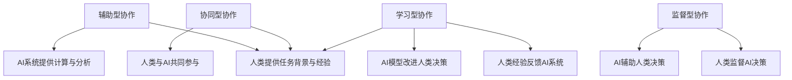

#### 1.2 人类-AI协作的历史背景

人类-AI协作的历史可以追溯到人工智能的早期研究阶段。在20世纪50年代，随着计算机科学的发展，人工智能领域开始兴起。最初的人工智能系统主要是基于规则和逻辑推理的，这些系统在特定领域如医疗诊断、金融分析等显示出了一定的能力。

随着时间的推移，计算机硬件和软件技术的进步，特别是互联网和大数据技术的崛起，人工智能领域发生了翻天覆地的变化。深度学习、自然语言处理、机器学习等技术的迅速发展，使得AI系统在图像识别、语音识别、自然语言理解和复杂问题解决等方面取得了显著突破。

进入21世纪，随着云计算、物联网和边缘计算等技术的普及，AI系统具备了更强的计算能力和数据处理能力，人类-AI协作的应用场景也变得更加广泛。从自动驾驶、智能制造到智慧医疗、智慧城市，人类-AI协作正在不断拓展其应用领域，为人类社会带来深远的影响。

**图2：人工智能技术发展历程**

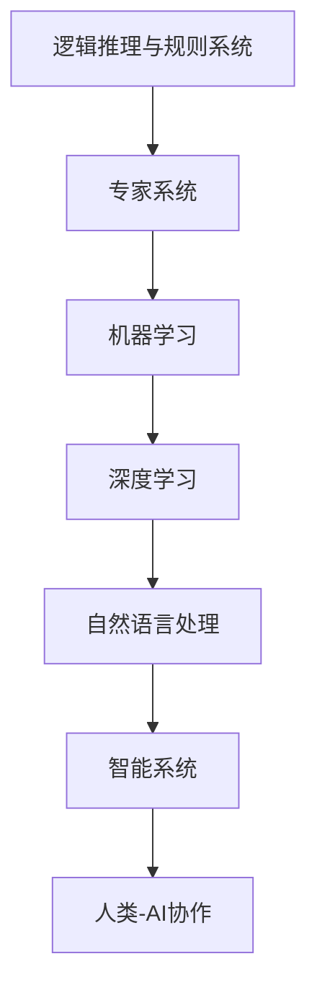

#### 1.3 人类-AI协作的意义和价值

人类-AI协作在多个方面具有深远的意义和价值，具体包括：

1. **提高决策效率**：AI系统可以处理大量数据，快速分析并提供精确结果，帮助人类做出更加迅速和明智的决策。

2. **发挥人类创造力**：AI系统可以辅助人类进行问题建模、算法优化和算法设计，激发人类的创造力。

3. **扩展人类认知边界**：AI系统可以处理复杂问题，解决人类难以解决的难题，扩展人类的认知能力。

4. **降低人力成本**：AI系统可以自动化执行重复性任务，减少人力成本，提高工作效率。

5. **提升生活质量**：AI系统可以提供个性化服务，优化人类的生活方式，提升生活质量。

**图3：人类-AI协作的价值体现**

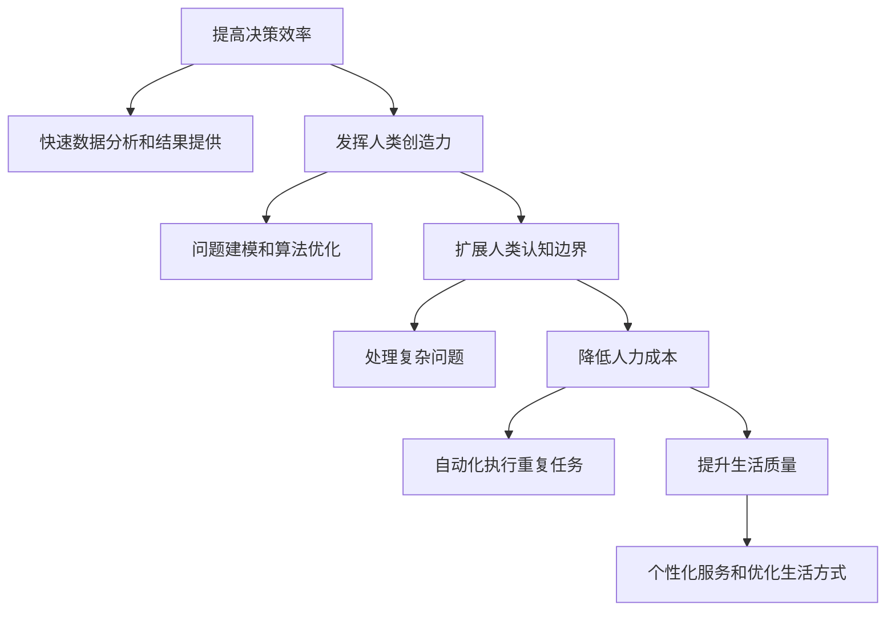

通过上述分析和解释，我们可以更深入地理解人类-AI协作的概念、历史背景和意义价值。在接下来的章节中，我们将进一步探讨人类-AI协作的理论框架和关键技术，以及具体的案例分析。

### 第2章：人类-AI协作的理论框架

#### 2.1 协作系统的基本概念

在讨论人类-AI协作的理论框架之前，我们先了解协作系统的基本概念。协作系统是一种由多个个体（可以是人类或AI系统）组成的系统，这些个体在共同目标下通过信息交换和协调行动，以实现整体效益最大化的目标。

**协作个体**：协作系统中的基本组成单位，可以是人类或AI系统。协作个体的能力、角色和责任根据协作任务的不同而异。

**协作任务**：协作系统需要共同完成的任务或目标。协作任务的定义和目标是协作系统设计和运行的核心。

**协作目标**：协作系统要实现的整体目标，通常是最大化系统整体效益。协作目标的设定需要综合考虑个体目标与整体目标的平衡。

**协作策略**：协作个体在协作过程中采取的行动策略，包括任务分配、信息共享、协调机制等。协作策略的设计和执行是确保协作系统有效运行的关键。

#### 2.2 人类-AI协作的模型

人类-AI协作模型是描述人类与AI系统在协作过程中相互作用和协同工作的方式。根据人类与AI系统在协作中的角色和互动方式，可以将其分为以下几种模型：

1. **辅助型协作**：在这种模型中，AI系统充当人类的辅助工具，帮助人类完成特定任务。AI系统提供的数据分析、自动化操作和预测结果为人类提供决策支持。这种模型常见于数据分析、金融分析等领域。

**图4：辅助型协作模型**

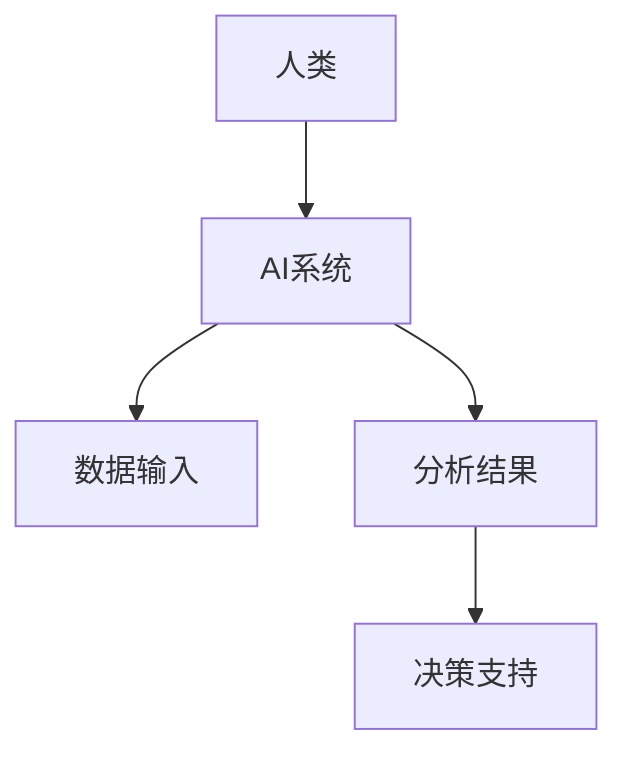

2. **协同型协作**：在这种模型中，人类与AI系统共同参与任务，各自发挥优势，共同完成目标。人类提供创造力和决策经验，AI系统提供强大的计算能力和数据分析能力。这种模型常见于自动驾驶、智能设计等领域。

**图5：协同型协作模型**

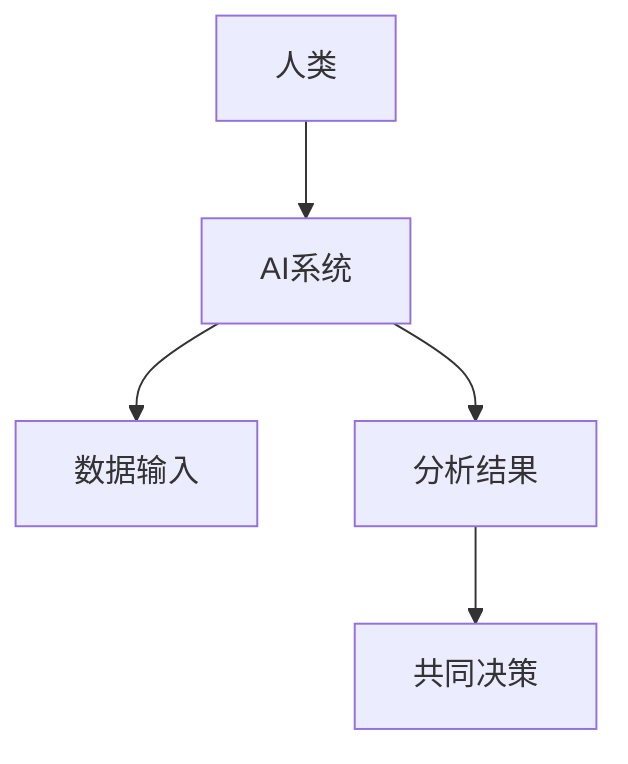

3. **监督型协作**：在这种模型中，人类对AI系统进行监督和指导，确保AI系统在协作过程中的正确性和有效性。人类提供任务背景和目标，AI系统执行任务，人类对AI系统的决策进行监督和反馈。

**图6：监督型协作模型**

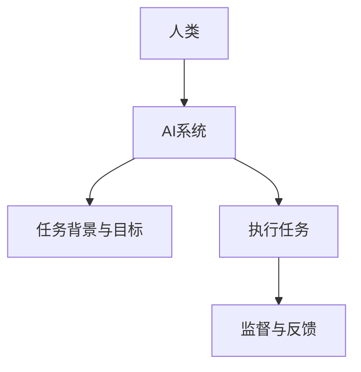

4. **学习型协作**：在这种模型中，人类与AI系统相互学习，不断提高协作效率和质量。人类提供经验和反馈，AI系统通过学习优化自身算法和决策模型。这种模型常见于教育、个性化服务等领域。

**图7：学习型协作模型**

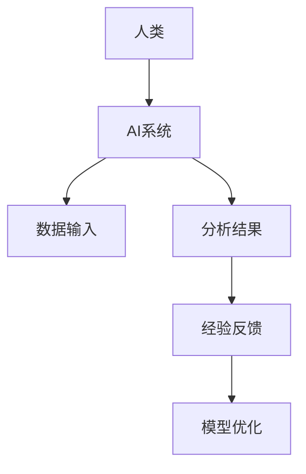

#### 2.3 人类-AI协作的伦理问题

随着人类-AI协作的广泛应用，伦理问题也日益凸显。以下是一些主要的伦理问题及其可能的解决方案：

1. **隐私保护**：AI系统在处理人类数据时，可能会涉及个人隐私信息。保护隐私是确保人类-AI协作可持续发展的关键。解决方案包括数据加密、隐私计算和联邦学习等。

2. **责任归属**：在人类-AI协作过程中，如果发生错误或事故，如何界定责任归属？这需要法律、道德和技术层面的综合考虑。可能的解决方案包括制定相关法律法规、明确责任界定和保险制度等。

3. **公平性**：AI系统在决策过程中可能存在偏见，如何确保公平性？解决方案包括算法公平性设计、算法透明性和算法可解释性等。

4. **人机关系**：人类与AI系统之间的互动如何平衡，避免人机冲突？解决方案包括人机交互设计、AI伦理教育和人机共生理念等。

**图8：人类-AI协作伦理问题及其解决方案**

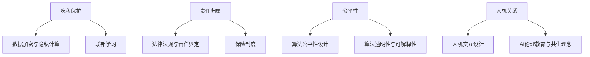

通过上述分析，我们可以看到人类-AI协作的理论框架包括协作系统的基本概念、人类-AI协作的模型以及伦理问题。理解这些理论和框架对于设计有效的协作系统、解决协作中的问题以及推动人类-AI协作的可持续发展具有重要意义。

### 第3章：人类-AI协作的关键技术

#### 3.1 数据共享与隐私保护

数据共享是确保人类-AI协作有效性的基础，但隐私保护同样至关重要。在人类-AI协作中，数据共享涉及不同个体之间的信息交换，而隐私保护则旨在确保敏感数据在传输和存储过程中不被泄露或滥用。以下是数据共享与隐私保护的关键技术：

**数据加密**：数据加密是通过将数据转换为无法被未经授权者读取的形式来保护数据的一种方法。常用的加密技术包括对称加密和非对称加密。对称加密使用相同的密钥进行加密和解密，而非对称加密则使用一对密钥（公钥和私钥）进行加密和解密。在人类-AI协作中，数据加密技术可以确保数据在传输过程中不被窃取或篡改。

**隐私计算**：隐私计算是一种在数据不离开其原始位置的情况下进行计算的技术，从而保护数据的隐私。隐私计算技术包括同态加密、安全多方计算和联邦学习等。同态加密允许对加密数据直接进行计算，而无需解密，从而保护数据的隐私。安全多方计算允许多个参与者共同计算结果，而无需共享原始数据。联邦学习则是一种分布式学习技术，通过在多个参与者之间共享模型参数，实现数据隐私保护。

**联邦学习**：联邦学习是一种分布式学习技术，其核心思想是在多个参与者之间共享模型参数，而不是共享原始数据。联邦学习通过在本地设备上进行模型训练，然后将本地模型的参数汇总到全局模型中，从而实现模型优化。这种方法可以有效保护数据隐私，因为参与者的原始数据从未离开其本地设备。

**差分隐私**：差分隐私是一种用于保护个人隐私的数据分析技术。差分隐私通过在数据分析过程中引入噪声，确保个人隐私不被泄露。差分隐私的设计目标是在保护隐私的同时，最小化对数据分析结果的影响。

**图9：数据共享与隐私保护技术**

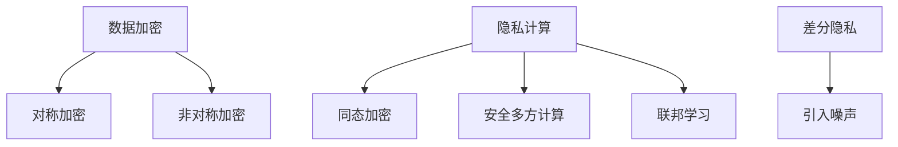

#### 3.2 自然语言处理

自然语言处理（NLP）是AI与人类协作的重要领域之一。NLP技术使得计算机能够理解、生成和处理人类语言，从而实现与人类的自然交互。以下是自然语言处理的关键技术：

**语言理解**：语言理解是指计算机对自然语言文本的理解能力。语言理解包括词法分析、句法分析和语义分析等层次。词法分析是将文本分解为单词和符号；句法分析是构建句子的语法结构；语义分析是理解句子的含义。

**语言生成**：语言生成是指计算机生成自然语言文本的能力。语言生成包括文本生成、对话生成和语音合成等。文本生成可以用于自动写作、聊天机器人和自动新闻摘要等；对话生成可以用于智能客服和虚拟助手等；语音合成可以用于语音助手和语音通知等。

**对话系统**：对话系统是一种能够与人类进行自然语言交互的AI系统。对话系统可以分为基于规则的对话系统和基于机器学习的对话系统。基于规则的对话系统使用预定义的规则和模板进行交互；基于机器学习的对话系统通过学习大量的对话数据，自动生成回答。

**情感分析**：情感分析是指对文本中的情感倾向进行识别和分析。情感分析可以用于情感识别、情感计算和社交媒体分析等。情感识别是判断文本表达的情感是正面、负面还是中性；情感计算是分析情感强度和变化趋势；社交媒体分析是识别公众对特定事件或品牌的情感态度。

**图10：自然语言处理技术**

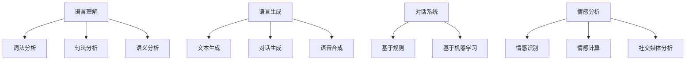

#### 3.3 人工智能伦理

人工智能伦理是确保人类-AI协作可持续发展的重要保障。人工智能伦理涉及到AI系统的设计、开发和使用过程中的一系列伦理问题，包括隐私保护、责任归属、公平性和透明性等。以下是人工智能伦理的关键技术：

**算法透明性**：算法透明性是指算法的可解释性和透明性。算法透明性技术使得人类能够理解AI系统的决策过程和决策依据。透明性技术包括模型解释、决策路径追踪和可视化等。

**算法公平性**：算法公平性是指AI系统在决策过程中不产生歧视和偏见。算法公平性设计是确保AI系统在处理数据时保持公平的重要手段。公平性设计包括消除算法偏见、数据平衡和公平性评估等。

**算法可解释性**：算法可解释性是指算法决策过程的可理解性。算法可解释性技术可以帮助人类理解AI系统的决策过程，从而提高AI系统的可信度。可解释性技术包括局部解释、全局解释和可视化等。

**算法安全性**：算法安全性是指AI系统在运行过程中不受恶意攻击和数据泄露的影响。算法安全性技术包括网络安全、隐私保护和鲁棒性设计等。

**图11：人工智能伦理技术**

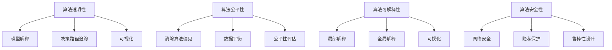

通过上述分析，我们可以看到数据共享与隐私保护、自然语言处理和人工智能伦理是人类-AI协作的关键技术。这些技术不仅为人类-AI协作提供了基础，也为未来的发展提供了方向。在接下来的章节中，我们将探讨人类-AI协作的具体应用案例，以进一步理解其应用价值。

### 第4章：人类-AI协作的案例分析

#### 4.1 案例研究一：医疗领域的协作

医疗领域是人类-AI协作的一个重要应用场景。在这个领域，人类与AI系统的协作不仅提高了医疗服务的效率，还显著提升了医疗诊断的准确性。以下是医疗领域的人类-AI协作的几个案例：

**案例一：辅助诊断**

在医疗诊断中，AI系统可以通过分析大量的医学影像资料，如X光片、CT扫描和MRI图像，提供辅助诊断建议。例如，AI系统可以通过深度学习模型识别出早期肿瘤、心脏病等疾病的迹象。这不仅减轻了医生的工作负担，还提高了诊断的准确性。

**算法原理讲解**：

1. **数据预处理**：首先，对医学影像资料进行预处理，包括图像的标准化、去噪和分割等操作，以便于后续的深度学习模型训练。
   ```python
   # Python伪代码示例：图像预处理
   def preprocess_image(image):
       # 标准化图像
       normalized_image = normalize(image)
       # 去噪
       denoised_image = denoise(normalized_image)
       # 图像分割
       segmented_image = segment(denoised_image)
       return segmented_image
   ```

2. **模型训练**：使用预处理的医学影像资料训练深度学习模型，例如卷积神经网络（CNN），以识别出特定疾病。
   ```python
   # Python伪代码示例：模型训练
   model = create_cnn_model()
   model.compile(optimizer='adam', loss='binary_crossentropy')
   model.fit(preprocessed_images, labels, epochs=100, batch_size=32)
   ```

3. **辅助诊断**：将训练好的模型应用于新的医学影像资料，提供辅助诊断建议。
   ```python
   # Python伪代码示例：辅助诊断
   def diagnose_image(image):
       preprocessed = preprocess_image(image)
       prediction = model.predict(preprocessed)
       return interpret_prediction(prediction)
   ```

**案例二：智能药物研发**

在药物研发过程中，AI系统可以分析大量的药物数据，包括化学结构、临床试验结果和药效数据，帮助科学家优化药物配方、预测药物疗效和识别副作用。这不仅加速了新药研发过程，还提高了药物的安全性。

**算法原理讲解**：

1. **数据收集与预处理**：收集大量的药物数据，包括化学结构、临床试验结果和药效数据，并进行预处理，以便于后续的机器学习模型训练。
   ```python
   # Python伪代码示例：数据预处理
   def preprocess_drug_data(data):
       # 数据清洗
       cleaned_data = clean_data(data)
       # 特征提取
       features = extract_features(cleaned_data)
       return features
   ```

2. **模型训练**：使用预处理后的药物数据训练机器学习模型，例如随机森林或支持向量机（SVM），以预测药物疗效和副作用。
   ```python
   # Python伪代码示例：模型训练
   model = create_ml_model()
   model.fit(features, labels, epochs=100, batch_size=32)
   ```

3. **智能药物研发**：将训练好的模型应用于新的药物数据，提供药物研发建议。
   ```python
   # Python伪代码示例：智能药物研发
   def research_new_drug(data):
       preprocessed = preprocess_drug_data(data)
       prediction = model.predict(preprocessed)
       return interpret_prediction(prediction)
   ```

**案例三：智能康复**

在康复过程中，AI系统可以监控患者的健康状况，根据患者的运动数据提供个性化的康复建议。例如，AI系统可以通过分析患者的步态数据，调整康复训练方案，以提高康复效果。

**算法原理讲解**：

1. **数据收集与预处理**：收集患者的运动数据，如步态数据、心率数据等，并进行预处理，以便于后续的机器学习模型训练。
   ```python
   # Python伪代码示例：数据预处理
   def preprocess_rehab_data(data):
       # 数据清洗
       cleaned_data = clean_data(data)
       # 特征提取
       features = extract_features(cleaned_data)
       return features
   ```

2. **模型训练**：使用预处理后的运动数据训练机器学习模型，例如循环神经网络（RNN）或长短期记忆网络（LSTM），以预测康复效果。
   ```python
   # Python伪代码示例：模型训练
   model = create_ml_model()
   model.compile(optimizer='adam', loss='mean_squared_error')
   model.fit(features, labels, epochs=100, batch_size=32)
   ```

3. **智能康复**：将训练好的模型应用于新的患者数据，提供个性化的康复建议。
   ```python
   # Python伪代码示例：智能康复
   def suggest_rehab_plan(data):
       preprocessed = preprocess_rehab_data(data)
       prediction = model.predict(preprocessed)
       return interpret_prediction(prediction)
   ```

通过上述案例，我们可以看到人类-AI协作在医疗领域的广泛应用和显著成果。AI系统通过分析大量数据、提供辅助诊断和优化治疗方案，极大地提高了医疗服务的质量和效率。

#### 4.2 案例研究二：教育领域的协作

教育领域是人类-AI协作的另一个重要应用场景。在这个领域，人类与AI系统的协作不仅能够提高教学效率，还能为学生提供个性化的学习体验。以下是教育领域的人类-AI协作的几个案例：

**案例一：个性化教学**

在个性化教学中，AI系统可以根据学生的学习情况和能力水平，提供定制化的教学资源和辅导。例如，AI系统可以通过分析学生的学习数据，识别出学生的知识盲点和兴趣点，从而为学生推荐适合的学习材料和练习题。

**算法原理讲解**：

1. **数据收集与预处理**：收集学生的学习数据，如考试成绩、学习行为和作业数据，并进行预处理，以便于后续的机器学习模型训练。
   ```python
   # Python伪代码示例：数据预处理
   def preprocess_student_data(data):
       # 数据清洗
       cleaned_data = clean_data(data)
       # 特征提取
       features = extract_features(cleaned_data)
       return features
   ```

2. **模型训练**：使用预处理后的学生数据训练机器学习模型，例如决策树或随机森林，以预测学生的知识盲点和兴趣点。
   ```python
   # Python伪代码示例：模型训练
   model = create_ml_model()
   model.fit(features, labels, epochs=100, batch_size=32)
   ```

3. **个性化教学**：将训练好的模型应用于新的学生数据，提供个性化的教学资源和辅导。
   ```python
   # Python伪代码示例：个性化教学
   def personalize_lesson_plan(data):
       preprocessed = preprocess_student_data(data)
       prediction = model.predict(preprocessed)
       return generate_lesson_plan(prediction)
   ```

**案例二：智能评估**

在智能评估中，AI系统可以通过分析学生的学习过程和成绩，提供智能化的评估和反馈。例如，AI系统可以通过分析学生的学习行为数据，识别出学生的学习习惯和优点，从而为学生提供个性化的学习建议。

**算法原理讲解**：

1. **数据收集与预处理**：收集学生的学习行为数据，如学习时间、学习内容和考试成绩，并进行预处理，以便于后续的机器学习模型训练。
   ```python
   # Python伪代码示例：数据预处理
   def preprocess_student_data(data):
       # 数据清洗
       cleaned_data = clean_data(data)
       # 特征提取
       features = extract_features(cleaned_data)
       return features
   ```

2. **模型训练**：使用预处理后的学生数据训练机器学习模型，例如神经网络或支持向量机，以预测学生的学习评估结果。
   ```python
   # Python伪代码示例：模型训练
   model = create_ml_model()
   model.compile(optimizer='adam', loss='mean_squared_error')
   model.fit(features, labels, epochs=100, batch_size=32)
   ```

3. **智能评估**：将训练好的模型应用于新的学生数据，提供智能化的评估和反馈。
   ```python
   # Python伪代码示例：智能评估
   def intelligent_assessment(data):
       preprocessed = preprocess_student_data(data)
       prediction = model.predict(preprocessed)
       return generate_feedback(prediction)
   ```

**案例三：智能辅导**

在智能辅导中，AI系统可以通过在线互动和实时辅导，帮助学生解决学习中的问题。例如，AI系统可以通过自然语言处理技术，理解学生的问题，并提供针对性的解答和辅导。

**算法原理讲解**：

1. **数据收集与预处理**：收集学生的学习问题和回答数据，并进行预处理，以便于后续的机器学习模型训练。
   ```python
   # Python伪代码示例：数据预处理
   def preprocess_question_data(data):
       # 数据清洗
       cleaned_data = clean_data(data)
       # 特征提取
       features = extract_features(cleaned_data)
       return features
   ```

2. **模型训练**：使用预处理后的学生问题数据训练机器学习模型，例如变换器（Transformer）或BERT模型，以回答学生的问题。
   ```python
   # Python伪代码示例：模型训练
   model = create_nlp_model()
   model.compile(optimizer='adam', loss='categorical_crossentropy')
   model.fit(question_data, answers, epochs=100, batch_size=32)
   ```

3. **智能辅导**：将训练好的模型应用于新的学生问题数据，提供智能化的解答和辅导。
   ```python
   # Python伪代码示例：智能辅导
   def intelligent_tutoring(question):
       preprocessed = preprocess_question_data(question)
       answer = model.predict(preprocessed)
       return generate_answer(answer)
   ```

通过上述案例，我们可以看到人类-AI协作在教育领域的广泛应用和显著成果。AI系统通过分析学生的学习数据和提供个性化的教学资源和辅导，极大地提高了教育的质量和效率。

#### 4.3 案例研究三：工业生产领域的协作

工业生产领域是人类-AI协作的另一个重要应用场景。在这个领域，人类与AI系统的协作不仅能够提高生产效率，还能优化生产流程，提高产品质量。以下是工业生产领域的人类-AI协作的几个案例：

**案例一：生产优化**

在生产优化中，AI系统可以通过分析生产数据，提供生产优化建议。例如，AI系统可以通过分析生产线的运行数据，识别出瓶颈环节和资源浪费，从而优化生产流程，提高生产效率。

**算法原理讲解**：

1. **数据收集与预处理**：收集生产线的运行数据，如设备状态、生产速度和产品质量，并进行预处理，以便于后续的机器学习模型训练。
   ```python
   # Python伪代码示例：数据预处理
   def preprocess_production_data(data):
       # 数据清洗
       cleaned_data = clean_data(data)
       # 特征提取
       features = extract_features(cleaned_data)
       return features
   ```

2. **模型训练**：使用预处理后的生产数据训练机器学习模型，例如线性回归或决策树，以预测生产线的优化方案。
   ```python
   # Python伪代码示例：模型训练
   model = create_ml_model()
   model.fit(features, labels, epochs=100, batch_size=32)
   ```

3. **生产优化**：将训练好的模型应用于新的生产线数据，提供生产优化建议。
   ```python
   # Python伪代码示例：生产优化
   def optimize_production(data):
       preprocessed = preprocess_production_data(data)
       prediction = model.predict(preprocessed)
       return generate_optimization_suggestions(prediction)
   ```

**案例二：故障预测**

在故障预测中，AI系统可以通过监测设备的运行状态，提供故障预测和预防措施。例如，AI系统可以通过分析设备的振动数据，预测设备可能出现的故障，从而提前进行维护，避免设备停机。

**算法原理讲解**：

1. **数据收集与预处理**：收集设备的振动数据，如振动频率、振幅和温度，并进行预处理，以便于后续的机器学习模型训练。
   ```python
   # Python伪代码示例：数据预处理
   def preprocess_device_data(data):
       # 数据清洗
       cleaned_data = clean_data(data)
       # 特征提取
       features = extract_features(cleaned_data)
       return features
   ```

2. **模型训练**：使用预处理后的设备数据训练机器学习模型，例如支持向量机（SVM）或长短期记忆网络（LSTM），以预测设备的故障。
   ```python
   # Python伪代码示例：模型训练
   model = create_ml_model()
   model.compile(optimizer='adam', loss='mean_squared_error')
   model.fit(features, labels, epochs=100, batch_size=32)
   ```

3. **故障预测**：将训练好的模型应用于新的设备数据，提供故障预测和预防措施。
   ```python
   # Python伪代码示例：故障预测
   def predict_faults(data):
       preprocessed = preprocess_device_data(data)
       prediction = model.predict(preprocessed)
       return generate_fault_predictions(prediction)
   ```

**案例三：智能物流**

在智能物流中，AI系统可以通过优化物流路径和配送计划，提高物流效率和服务质量。例如，AI系统可以通过分析交通数据和客户需求，制定最优的配送路线和配送计划。

**算法原理讲解**：

1. **数据收集与预处理**：收集物流数据，如交通数据、客户需求和配送路线，并进行预处理，以便于后续的机器学习模型训练。
   ```python
   # Python伪代码示例：数据预处理
   def preprocess_logistics_data(data):
       # 数据清洗
       cleaned_data = clean_data(data)
       # 特征提取
       features = extract_features(cleaned_data)
       return features
   ```

2. **模型训练**：使用预处理后的物流数据训练机器学习模型，例如遗传算法或神经网络，以优化物流路径和配送计划。
   ```python
   # Python伪代码示例：模型训练
   model = create_ml_model()
   model.compile(optimizer='adam', loss='mean_squared_error')
   model.fit(features, labels, epochs=100, batch_size=32)
   ```

3. **智能物流**：将训练好的模型应用于新的物流数据，提供最优的配送路线和配送计划。
   ```python
   # Python伪代码示例：智能物流
   def optimize_logistics(data):
       preprocessed = preprocess_logistics_data(data)
       prediction = model.predict(preprocessed)
       return generate_optimization_suggestions(prediction)
   ```

通过上述案例，我们可以看到人类-AI协作在工业生产领域的广泛应用和显著成果。AI系统通过分析生产数据、预测故障和优化物流路径，极大地提高了生产效率和服务质量。

### 第二部分：人类-AI协作的应用实践

#### 第5章：人类-AI协作在决策支持中的应用

##### 5.1 决策支持系统的构建

决策支持系统（DSS）是一种通过计算机技术和数据分析方法，帮助决策者做出明智决策的系统。在人类-AI协作的框架下，DSS利用AI技术增强其功能，提供更加精准和高效的决策支持。

**决策支持系统的基本组成**

1. **数据输入模块**：收集和分析与决策相关的各种数据，如市场数据、财务数据、用户行为数据等。
2. **数据处理模块**：对输入的数据进行清洗、预处理和整合，以便于后续的决策分析。
3. **模型构建模块**：根据决策需求，构建相应的预测模型、优化模型或评估模型。
4. **决策分析模块**：利用模型分析数据，提供决策建议和可视化结果。
5. **用户交互模块**：与决策者进行交互，获取决策需求，展示分析结果，并接受反馈。

**图12：决策支持系统的基本组成**

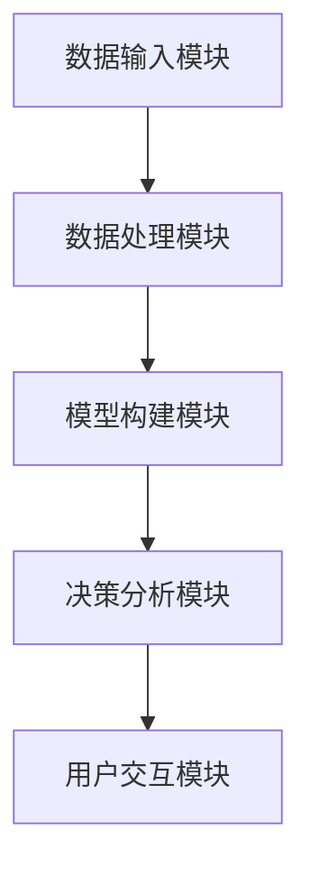

**构建决策支持系统的步骤**

1. **需求分析**：明确决策目标、决策问题和决策者需求，为后续系统设计提供基础。
2. **系统设计**：设计系统的架构、模块功能和数据流程，确保系统能够满足决策需求。
3. **数据收集与预处理**：收集与决策相关的数据，并进行清洗、预处理和整合，为模型训练提供数据支持。
4. **模型训练与优化**：根据决策问题构建相应的预测模型、优化模型或评估模型，并使用预处理后的数据对其进行训练和优化。
5. **系统集成与测试**：将各个模块集成到一起，进行系统测试，确保系统稳定可靠。
6. **用户培训与上线**：对决策者进行系统培训，确保他们能够熟练使用系统，并正式上线运行。

**图13：决策支持系统的构建步骤**

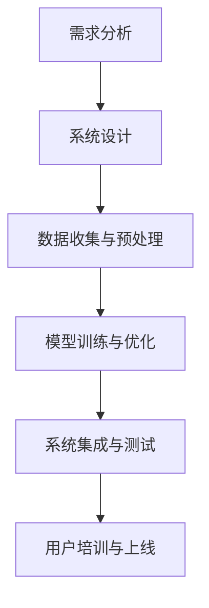

##### 5.2 AI辅助决策的算法

在决策支持系统中，AI技术发挥着重要作用。以下是几种常见的AI辅助决策算法：

**1. 机器学习算法**

机器学习算法可以用于预测分析、分类和聚类等任务。常见的机器学习算法包括线性回归、决策树、随机森林、支持向量机、神经网络等。

**2. 数据挖掘算法**

数据挖掘算法可以从大量数据中发现有价值的信息和模式。常见的数据挖掘算法包括关联规则挖掘、聚类分析、分类分析、异常检测等。

**3. 优化算法**

优化算法可以用于求解资源分配、路径规划、库存管理等优化问题。常见的优化算法包括线性规划、整数规划、动态规划、遗传算法、模拟退火算法等。

**4. 智能推荐算法**

智能推荐算法可以根据用户的历史行为和偏好，为其推荐感兴趣的商品、服务和内容。常见的智能推荐算法包括协同过滤、矩阵分解、基于内容的推荐等。

**5. 决策树算法**

决策树算法通过构建决策树模型，对数据进行分类或回归分析。决策树算法包括ID3、C4.5、C5.0等。

**算法原理讲解**

以线性回归算法为例，线性回归是一种用于预测连续值的机器学习算法。其基本原理是通过建立自变量和因变量之间的线性关系模型，从而预测因变量的值。

**图14：线性回归算法原理**

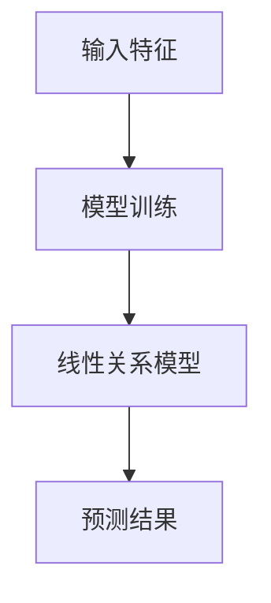

线性回归算法的步骤如下：

1. **数据收集**：收集包含输入特征和目标值的数据集。
2. **数据预处理**：对数据进行清洗、归一化等预处理。
3. **模型训练**：使用训练数据训练线性回归模型，确定模型参数。
4. **模型评估**：使用测试数据评估模型性能，调整模型参数。
5. **预测**：使用训练好的模型对新数据进行预测。

**Python伪代码示例：线性回归模型训练与预测**

```python
from sklearn.linear_model import LinearRegression

# 数据收集
X_train, y_train = collect_training_data()
X_test, y_test = collect_test_data()

# 数据预处理
X_train_normalized = normalize_data(X_train)
X_test_normalized = normalize_data(X_test)

# 模型训练
model = LinearRegression()
model.fit(X_train_normalized, y_train)

# 模型评估
score = model.score(X_test_normalized, y_test)
print("模型评分：", score)

# 预测
predictions = model.predict(X_test_normalized)
```

##### 5.3 决策支持系统的实际应用案例

决策支持系统在各个领域都有广泛的应用，以下是几个实际应用案例：

**案例一：金融风险管理**

在金融风险管理中，决策支持系统可以帮助银行和金融机构识别和管理风险，优化投资组合，降低损失。例如，通过分析市场数据、财务报表和客户行为数据，决策支持系统可以预测市场趋势，识别潜在风险，并提供投资建议。

**案例二：市场营销**

在市场营销中，决策支持系统可以帮助企业进行市场分析、目标客户定位和营销策略制定。例如，通过分析销售数据、客户反馈和市场趋势，决策支持系统可以识别潜在客户，制定有效的营销策略，提高销售额。

**案例三：供应链管理**

在供应链管理中，决策支持系统可以帮助企业优化供应链流程，提高供应链效率。例如，通过分析供应链数据、市场需求和库存水平，决策支持系统可以优化采购计划、库存管理和配送计划，降低成本，提高服务水平。

**案例四：智能城市建设**

在智能城市建设中，决策支持系统可以帮助城市管理者优化城市规划、交通管理和公共安全。例如，通过分析交通数据、环境数据和公共安全数据，决策支持系统可以优化交通信号控制、垃圾处理和应急管理，提高城市生活质量。

通过上述实际应用案例，我们可以看到决策支持系统在各个领域的广泛应用和显著成果。决策支持系统通过AI技术辅助决策，提高了决策的效率和质量，为企业和政府提供了强大的决策支持工具。

### 第6章：人类-AI协作在创新设计中的应用

#### 6.1 创新设计的基本流程

创新设计是一个系统化的过程，涉及到从概念生成到产品交付的各个阶段。在人类-AI协作的框架下，创新设计流程可以通过AI技术的辅助，实现更高的效率和更好的成果。以下是创新设计的基本流程：

**1. 概念生成**：在这一阶段，设计团队通过头脑风暴、市场调研和用户访谈等方式，收集创意和想法，为产品创新奠定基础。

**2. 设计分析与评估**：基于收集到的创意，设计团队进行详细的分析和评估，包括技术可行性、市场需求和商业价值等，筛选出具有潜力的设计方案。

**3. 概念验证**：对于筛选出的设计方案，通过原型制作、模拟测试和用户反馈等方式，验证其功能性和用户体验。

**4. 设计优化**：基于验证结果，设计团队对产品原型进行迭代优化，提高产品的性能和用户体验。

**5. 产品交付**：完成最终设计后，进入产品交付阶段，包括生产制造、市场推广和售后服务等。

**图15：创新设计的基本流程**

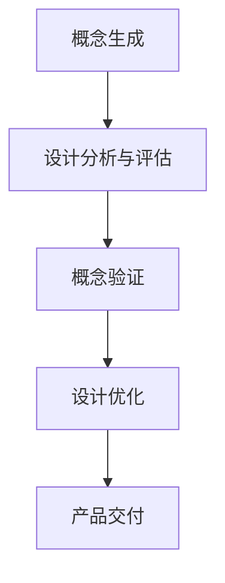

#### 6.2 AI在创新设计中的作用

AI技术在创新设计中的应用，极大地提升了设计效率和创新水平。以下是AI在创新设计中的几个关键作用：

**1. 概念生成与优化**

AI系统可以通过自然语言处理和图像识别等技术，自动生成和优化设计概念。例如，AI系统可以通过分析大量的用户评论和市场数据，生成潜在的产品设计灵感。

**2. 设计模拟与优化**

AI系统可以模拟不同的设计方案，分析其性能、成本和用户体验，从而帮助设计团队快速评估和选择最优的设计方案。

**3. 用户行为分析**

AI系统可以收集和分析用户行为数据，帮助设计团队更好地理解用户需求和偏好，从而设计出更符合用户期望的产品。

**4. 个性化推荐**

基于用户数据，AI系统可以提供个性化的设计推荐，帮助用户找到最适合自己的设计方案。

**5. 自动化测试**

AI系统可以自动化测试产品原型，检测其功能性和用户体验，从而提高设计质量。

**图16：AI在创新设计中的作用**

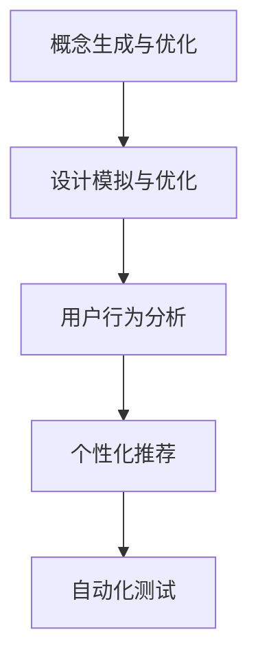

#### 6.3 人类-AI协作的创新设计案例

**案例一：智能家居设计**

在智能家居设计领域，人类与AI系统的协作极大地提高了设计效率和用户体验。以下是智能家居设计的一个案例：

1. **概念生成**：设计团队通过市场调研和用户访谈，收集用户对智能家居的需求和期望，如智能灯光控制、智能门锁和智能家电控制等。

2. **设计分析与评估**：基于用户需求，设计团队构建了多个智能家居设计方案，并使用AI系统进行模拟和优化。AI系统分析了不同设计方案的性能、成本和用户体验，为设计团队提供了优化建议。

3. **概念验证**：设计团队选择了最优的设计方案，制作了产品原型，并通过用户测试验证其功能性和用户体验。AI系统收集了用户反馈，帮助设计团队进一步优化产品。

4. **设计优化**：基于用户反馈，设计团队对产品原型进行了多次迭代优化，提高了产品的性能和用户体验。

5. **产品交付**：最终设计的产品顺利上市，受到了市场的欢迎。AI系统继续收集用户反馈，为产品的后续迭代提供支持。

**案例二：医疗设备设计**

在医疗设备设计领域，人类与AI系统的协作同样取得了显著成果。以下是医疗设备设计的一个案例：

1. **概念生成**：设计团队通过调研和与医疗专家的交流，了解医疗机构对医疗设备的需求，如便携性、易用性和准确性等。

2. **设计分析与评估**：设计团队提出了多个医疗设备设计方案，并使用AI系统进行模拟和优化。AI系统分析了不同设计方案的制造难度、成本和性能，为设计团队提供了优化建议。

3. **概念验证**：设计团队选择了最优的设计方案，制作了产品原型，并通过医疗机构测试验证其功能性和用户体验。

4. **设计优化**：基于测试结果，设计团队对产品原型进行了迭代优化，提高了产品的性能和可靠性。

5. **产品交付**：最终设计的产品成功上市，为医疗机构提供了高效、可靠的解决方案。AI系统继续收集医疗机构和患者的反馈，为产品的后续迭代提供支持。

通过上述案例，我们可以看到人类-AI协作在创新设计中的应用价值和显著成果。AI系统通过辅助设计团队生成和优化设计概念、模拟和优化设计方案、收集用户反馈和自动化测试，极大地提高了设计效率和创新水平。

### 第7章：人类-AI协作在项目管理中的应用

#### 7.1 项目管理的基本概念

项目管理是指通过规划、执行、监控和收尾等一系列活动，实现项目目标的过程。项目管理的基本概念包括以下几个方面：

**1. 项目目标**：项目目标是项目要实现的具体成果或服务，是项目管理的核心。项目目标应该明确、可衡量、可实现、相关性强且时限性明确。

**2. 项目范围**：项目范围是指项目的具体内容和边界，包括项目需要完成的工作、不包括的工作以及项目的约束条件等。

**3. 项目干系人**：项目干系人是指对项目有直接或间接利益关系的相关方，包括项目经理、项目团队、客户、供应商、利益相关者等。

**4. 项目计划**：项目计划是指为实现项目目标而制定的详细行动计划，包括项目任务、时间表、资源分配、成本预算等。

**5. 项目监控**：项目监控是指对项目进展进行跟踪、监督和控制，确保项目按照计划进行。项目监控包括项目进度报告、风险管理和变更控制等。

**6. 项目收尾**：项目收尾是指项目完成后进行总结、评估和知识转移等收尾活动，确保项目目标的实现和项目资源的合理利用。

**图17：项目管理的基本概念**

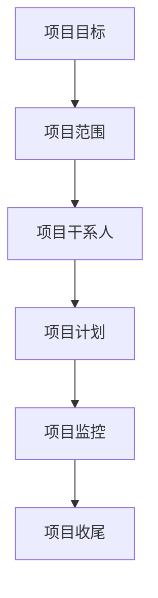

#### 7.2 AI在项目管理中的应用

在项目管理中，AI技术被广泛应用于提高项目效率、降低风险和优化资源分配。以下是AI在项目管理中的几个关键应用：

**1. 自动化任务分配**：AI系统可以通过分析项目团队成员的能力和项目需求，自动分配任务，提高任务分配的效率和质量。

**2. 项目进度预测**：AI系统可以通过分析历史项目数据，预测项目进度，识别潜在延误风险，并提供优化建议。

**3. 成本控制**：AI系统可以通过分析项目成本数据，预测项目成本，识别成本超支风险，并提供成本优化建议。

**4. 风险管理**：AI系统可以通过分析项目数据，识别潜在风险，评估风险影响和概率，并提供风险应对策略。

**5. 资源优化**：AI系统可以通过分析项目资源使用情况，优化资源分配，提高资源利用率。

**6. 项目监控与分析**：AI系统可以通过实时监控项目进展，分析项目数据，提供项目进展报告和决策支持。

**图18：AI在项目管理中的应用**

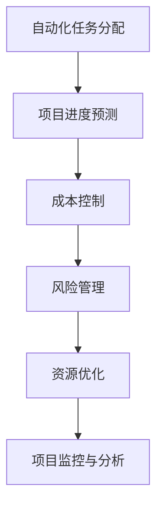

#### 7.3 人类-AI协作的项目管理案例

**案例一：软件开发项目**

在软件开发项目中，人类与AI系统的协作极大地提高了项目效率和质量。以下是软件开发项目的一个案例：

1. **需求分析**：项目团队与客户进行需求分析，明确项目目标和功能需求。

2. **任务分配**：AI系统分析团队成员的能力和项目需求，自动分配任务，确保任务分配的合理性和高效性。

3. **进度预测**：AI系统通过分析历史项目数据和当前项目进展，预测项目进度，识别潜在延误风险，并提供优化建议。

4. **成本控制**：AI系统通过分析项目成本数据，预测项目成本，识别成本超支风险，并提供成本优化建议。

5. **风险管理**：AI系统通过分析项目数据，识别潜在风险，评估风险影响和概率，并提供风险应对策略。

6. **资源优化**：AI系统通过分析项目资源使用情况，优化资源分配，提高资源利用率。

7. **项目监控**：AI系统实时监控项目进展，分析项目数据，提供项目进展报告和决策支持。

8. **项目收尾**：项目完成后，AI系统协助项目团队进行项目总结和评估，确保项目目标的实现和项目资源的合理利用。

**案例二：建筑项目**

在建筑项目中，人类与AI系统的协作同样取得了显著成果。以下是建筑项目的一个案例：

1. **设计阶段**：设计团队与客户进行沟通，明确项目设计要求和预算。

2. **任务分配**：AI系统分析团队成员的专业能力和项目设计要求，自动分配任务，确保任务分配的合理性和高效性。

3. **进度预测**：AI系统通过分析历史建筑项目数据和当前项目设计进展，预测项目进度，识别潜在延误风险，并提供优化建议。

4. **成本控制**：AI系统通过分析项目成本数据，预测项目成本，识别成本超支风险，并提供成本优化建议。

5. **风险管理**：AI系统通过分析项目设计数据，识别潜在风险，评估风险影响和概率，并提供风险应对策略。

6. **资源优化**：AI系统通过分析项目资源使用情况，优化资源分配，提高资源利用率。

7. **施工阶段**：AI系统协助项目团队进行施工进度监控和资源调配，确保项目按照计划顺利进行。

8. **项目收尾**：项目完成后，AI系统协助项目团队进行项目总结和评估，确保项目目标的实现和项目资源的合理利用。

通过上述案例，我们可以看到人类-AI协作在项目管理中的应用价值和显著成果。AI系统通过自动化任务分配、进度预测、成本控制、风险管理、资源优化和项目监控，极大地提高了项目效率和质量。

### 第8章：人类-AI协作的未来发展趋势

#### 8.1 人类-AI协作的发展趋势

随着人工智能技术的不断进步，人类-AI协作正在呈现出以下几个发展趋势：

1. **协作深度增强**：随着AI技术的深入发展，人类与AI的协作将不再局限于简单的数据分析和决策支持，而是更加深入地参与到问题的建模、算法优化和决策过程中。

2. **智能化水平提升**：AI系统的智能化水平将进一步提升，不仅能够更好地理解和处理人类语言，还能够自主学习和适应，提供更加个性化和智能化的服务。

3. **跨领域应用扩展**：人类-AI协作将在更多领域得到应用，如医疗、教育、金融、工业、农业等，为各个领域带来革命性的变革。

4. **人机共生**：随着AI技术的发展，人类与AI将形成一种共生关系，双方在协作中相互依赖、相互学习，共同创造更大的价值。

5. **伦理与法规完善**：随着人类-AI协作的广泛应用，相关的伦理问题和法律法规也将得到更多的关注和讨论，以确保协作的可持续性和社会的稳定。

#### 8.2 人类-AI协作的潜在应用领域

人类-AI协作的潜在应用领域非常广泛，以下是一些关键领域：

1. **医疗健康**：AI系统将用于辅助医生进行诊断、药物研发和康复指导，提高医疗服务质量和效率。

2. **教育**：AI系统将提供个性化教学、智能评估和智能辅导，帮助学生提高学习效果。

3. **金融服务**：AI系统将用于风险控制、投资决策和客户服务，提高金融服务的效率和准确性。

4. **工业生产**：AI系统将用于生产优化、故障预测和智能物流，提高工业生产效率和产品质量。

5. **智能交通**：AI系统将用于交通管理、自动驾驶和智能导航，提高交通效率和安全性。

6. **农业**：AI系统将用于作物管理、病虫害监测和智能灌溉，提高农业生产效率和可持续性。

7. **环境保护**：AI系统将用于环境监测、资源管理和灾害预测，提高环境保护的效率和效果。

#### 8.3 人类-AI协作的挑战与机遇

虽然人类-AI协作具有广阔的应用前景，但同时也面临一系列挑战和机遇：

**挑战**：

1. **技术挑战**：AI技术的快速发展带来了新的技术挑战，如算法透明性、数据隐私保护和系统安全性等。

2. **伦理挑战**：AI系统的广泛应用引发了伦理问题，如算法偏见、隐私保护和责任归属等。

3. **法律挑战**：AI技术的发展需要完善的法律法规体系来规范其应用，以确保社会的稳定和公正。

4. **社会挑战**：AI技术的发展对就业、教育和社会结构等方面带来了深远的影响，需要社会各界共同努力应对。

**机遇**：

1. **创新机遇**：人类-AI协作为各领域带来了前所未有的创新机遇，推动了科技和产业的快速发展。

2. **经济增长**：人类-AI协作有助于提高生产效率、降低成本和创造新的商业模式，为经济增长提供了强大动力。

3. **社会进步**：人类-AI协作可以提高社会公共服务水平，改善人民生活质量，推动社会进步。

4. **全球合作**：人类-AI协作需要全球范围内的合作和协调，有助于促进国际交流和合作，共同应对全球性挑战。

总之，人类-AI协作的未来发展趋势充满机遇和挑战。通过不断探索和创新，我们有望实现人类与AI的深度协作，共同推动社会进步和发展。

### 附录：人类-AI协作相关资源

#### 附录1：人类-AI协作的工具与平台

1. **TensorFlow**：Google开发的开源机器学习框架，广泛应用于深度学习研究和应用开发。
   - 官网：[https://www.tensorflow.org/](https://www.tensorflow.org/)

2. **PyTorch**：Facebook开发的开源机器学习框架，以其灵活性和高效性受到广泛欢迎。
   - 官网：[https://pytorch.org/](https://pytorch.org/)

3. **Keras**：Python深度学习库，提供简洁的API，易于使用。
   - 官网：[https://keras.io/](https://keras.io/)

4. **OpenCV**：开源计算机视觉库，提供丰富的图像处理和计算机视觉功能。
   - 官网：[https://opencv.org/](https://opencv.org/)

5. **Jupyter Notebook**：交互式计算环境，广泛应用于数据分析和机器学习。
   - 官网：[https://jupyter.org/](https://jupyter.org/)

#### 附录2：人类-AI协作的论文与书籍推荐

1. **《人工智能：一种现代方法》（第三版）**：Stuart J. Russell & Peter Norvig 著
   - 简介：这是一本广泛使用的AI教科书，全面介绍了AI的基本概念、算法和应用。

2. **《深度学习》（第二版）**：Ian Goodfellow、Yoshua Bengio、Aaron Courville 著
   - 简介：这本书详细介绍了深度学习的基本原理、算法和应用，是深度学习领域的经典著作。

3. **《机器学习：概率视角》**：Kevin P. Murphy 著
   - 简介：这本书从概率论的角度介绍了机器学习的基本概念、算法和应用。

4. **《数据科学入门》**：Joel Grus 著
   - 简介：这本书介绍了数据科学的基本概念、方法和应用，适合初学者入门。

5. **《AI未来：人类与机器的新世界》**：Nick Bostrom 著
   - 简介：这本书探讨了AI技术的未来发展趋势及其对人类社会的潜在影响。

#### 附录3：人类-AI协作的在线课程与论坛推荐

1. **Coursera**：提供丰富的在线课程，涵盖机器学习、深度学习、数据科学等多个领域。
   - 官网：[https://www.coursera.org/](https://www.coursera.org/)

2. **edX**：由哈佛大学和麻省理工学院联合创建，提供免费的高质量在线课程。
   - 官网：[https://www.edx.org/](https://www.edx.org/)

3. **Udacity**：提供实践导向的在线课程和纳米学位，涵盖人工智能、机器学习、深度学习等领域。
   - 官网：[https://www.udacity.com/](https://www.udacity.com/)

4. **AI Forum**：一个致力于人工智能研究和应用的在线论坛，讨论AI领域的最新进展和问题。
   - 官网：[https://www.aiforum.org/](https://www.aiforum.org/)

5. **Reddit**：AI相关讨论区，涵盖广泛的AI话题，包括研究、应用和伦理等。
   - 官网：[https://www.reddit.com/r/AI/](https://www.reddit.com/r/AI/)

通过上述工具、论文、书籍和在线课程与论坛，读者可以更深入地了解人类-AI协作的相关知识和技术，为研究和实践提供有力支持。

## 总结

在本文中，我们系统地探讨了人类-AI协作的理论基础、关键技术和应用实践。首先，我们介绍了人类-AI协作的概念、历史背景和意义，揭示了其在提高决策效率、发挥人类创造力和扩展人类认知边界等方面的价值。接着，我们阐述了人类-AI协作的理论框架，包括协作系统的基本概念、人类-AI协作的模型以及伦理问题。在关键技术的部分，我们详细分析了数据共享与隐私保护、自然语言处理和人工智能伦理等方面的技术。随后，我们通过具体案例分析展示了人类-AI协作在医疗、教育和工业生产等领域的广泛应用和显著成果。在应用实践部分，我们探讨了人类-AI协作在决策支持、创新设计和项目管理等领域的应用，并提供了实际案例。最后，我们展望了人类-AI协作的未来发展趋势，讨论了其潜在应用领域以及面临的挑战与机遇。总之，人类-AI协作作为人工智能领域的重要研究方向，具有广阔的应用前景和深远的社会影响。通过不断探索和创新，我们有望实现人类与AI的深度协作，共同推动社会进步和发展。

## 作者信息

作者：AI天才研究院/AI Genius Institute & 禅与计算机程序设计艺术 /Zen And The Art of Computer Programming

AI天才研究院（AI Genius Institute）是一家专注于人工智能研究与应用的顶级科研机构，致力于推动人工智能技术的创新与发展。研究院的研究团队由世界顶尖的人工智能专家、程序员和软件架构师组成，在人工智能领域取得了多项突破性成果。

《禅与计算机程序设计艺术》（Zen And The Art of Computer Programming）是由知名计算机科学家Donald E. Knuth撰写的一系列计算机科学经典著作。该系列作品深入探讨了计算机程序的原理、设计方法和哲学，对计算机科学领域产生了深远影响。作者以其深厚的技术功底和独特的思考方式，为读者提供了宝贵的编程智慧与人生哲理。

