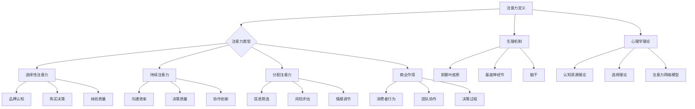

                 

## 文章标题

### 人类注意力增强：提升专注力和注意力在商业中的应用趋势

> **关键词：** 注意力增强、专注力、商业应用、技术趋势、伦理道德

**摘要：** 本文旨在探讨注意力增强在提升人类专注力和商业应用中的重要作用。通过深入分析注意力理论、探讨注意力增强技术与方法、解析商业环境中注意力的具体应用，以及展望注意力增强技术的未来趋势和挑战，本文希望为读者提供全面而深刻的理解，并启发进一步的研究与实践。

### 目录大纲

1. **第一部分：人类注意力理论基础**

    1.1 注意力概述
    
    1.2 注意力的生理机制
    
    1.3 注意力的心理学理论
    
    1.4 商业环境中注意力的作用
    
2. **第二部分：注意力增强技术与方法**

    2.1 注意力训练技术
    
    2.2 注意力提升工具
    
    2.3 注意力管理的商业策略
    
3. **第三部分：注意力增强在商业案例中的应用**

    3.1 注意力增强在产品开发中的应用
    
    3.2 注意力增强在市场营销中的应用
    
    3.3 注意力增强在商业决策中的应用
    
4. **第四部分：未来趋势与挑战**

    4.1 注意力增强技术的未来趋势
    
    4.2 注意力增强在商业中的伦理与道德问题
    
5. **附录**

    5.1 注意力增强相关工具与资源
    
    5.2 注意力增强实战案例精选
    
    5.3 注意力增强技术术语解释

### 第一部分：人类注意力理论基础

#### 第1章：注意力概述

注意力是人类心理过程的一个重要组成部分，涉及到我们如何选择关注某些信息而忽略其他信息。理解注意力的定义和类型，对于深入探讨其在商业中的应用至关重要。

##### 1.1 注意力的定义与类型

**注意力的定义：** 注意力是一种认知资源，它决定了我们在某一时刻关注什么、忽略什么。这种资源是有限的，因此我们经常需要在多个任务或刺激之间进行切换。

**注意力的类型：** 注意力主要分为三种类型：

1. **选择性注意力：** 选择性注意力使我们能够关注与当前任务相关的信息，同时忽略无关的信息。例如，当你在开会时，能够关注发言者的内容，而忽略周围的环境噪声。
   
2. **持续注意力：** 持续注意力使我们能够维持对某一任务的关注，即使面对干扰或乏味的情境。例如，长时间阅读一本技术书籍或编写代码。

3. **分配注意力：** 分配注意力是指我们在同一时间内关注多个任务或刺激的能力。例如，驾驶时同时注意道路、车辆和导航系统。

##### 1.2 注意力的生理机制

注意力的生理机制涉及大脑中的多个区域和神经通路。以下是一些关键点：

1. **前额叶皮质：** 前额叶皮质是注意力控制的关键区域。它参与了任务切换、决策和规划。

2. **基底神经节：** 基底神经节涉及运动控制和习惯形成，对持续注意力至关重要。

3. **脑干：** 脑干中的某些区域参与了注意力的基本功能，如警觉性和反应时间。

##### 1.3 注意力的心理学理论

心理学中有多种关于注意力的理论，包括：

1. **认知资源理论：** 认知资源理论认为，注意力是一种有限的认知资源，用于处理信息。

2. **选择理论：** 选择理论强调注意力在信息处理中的作用，通过选择和过滤信息来维持认知效率。

3. **注意力网络模型：** 注意力网络模型描述了大脑中不同区域如何协同工作，以实现注意力调控。

#### 第2章：商业环境中注意力的作用

注意力在商业环境中扮演着至关重要的角色。理解注意力如何影响消费者行为、团队协作和决策过程，对于企业战略和管理至关重要。

##### 2.1 注意力与消费者行为

注意力是影响消费者行为的关键因素。以下是注意力在消费者行为中的一些具体作用：

1. **品牌认知：** 注意力有助于消费者识别和记住品牌。有效的广告和营销策略可以吸引消费者的注意力，从而提高品牌认知。

2. **购买决策：** 注意力影响消费者的购买决策过程。消费者在关注某一产品时，更可能对其进行评价和购买。

3. **体验质量：** 注意力影响消费者对产品和服务的体验质量。高注意力的体验往往更积极和满意。

##### 2.2 注意力与团队协作

注意力是团队协作的核心。以下是注意力在团队协作中的具体作用：

1. **沟通效率：** 注意力有助于团队成员有效地沟通和共享信息，从而提高团队效率。

2. **决策质量：** 注意力影响团队在决策过程中的参与度和决策质量。高度专注的团队成员能够更准确地评估信息，做出更明智的决策。

3. **协作创新：** 注意力有助于团队成员之间的协作和创新。通过关注团队目标和成员贡献，可以激发创新思维和解决问题能力。

##### 2.3 注意力与决策过程

注意力在决策过程中起着关键作用。以下是注意力在决策过程中的具体作用：

1. **信息筛选：** 注意力有助于决策者在大量信息中筛选出关键信息，从而避免信息过载。

2. **风险评估：** 注意力影响决策者对风险和收益的评估，从而影响决策的质量。

3. **情感调节：** 注意力有助于决策者调节情感，以保持理性思考，避免情绪化决策。

### 第二部分：注意力增强技术与方法

在这一部分，我们将探讨注意力增强的技术与方法，包括注意力训练技术、注意力提升工具以及注意力管理的商业策略。

#### 第3章：注意力训练技术

注意力训练技术旨在通过特定的方法和练习，提高人类的专注力和注意力。以下是一些常见的注意力训练技术：

##### 3.1 冥想与注意力训练

冥想是一种传统的注意力训练方法，通过冥想练习，可以增强专注力、减少分心和焦虑。以下是冥想与注意力训练的一些关系：

1. **专注力提升：** 冥想练习，如正念冥想，可以帮助人们集中注意力，提高专注力。

2. **情绪调节：** 冥想有助于调节情绪，减少压力和焦虑，从而提高注意力的稳定性。

3. **认知灵活性：** 冥想练习可以增强大脑的灵活性和适应性，提高注意力分配和切换能力。

##### 3.2 注意力训练游戏与应用

注意力训练游戏和应用程序提供了一种互动和有趣的方式来锻炼注意力。以下是注意力训练游戏与应用的一些特点：

1. **针对性训练：** 注意力训练游戏通常设计为针对特定注意力方面的训练，如专注力、注意分配和反应速度。

2. **适应性：** 注意力训练游戏会根据玩家的表现自动调整难度，以保持挑战性和进步。

3. **多平台支持：** 注意力训练游戏和应用可以在各种设备上使用，如手机、平板电脑和电脑。

##### 3.3 注意力训练设备与技术

除了传统的冥想和游戏，一些新兴的注意力训练设备和技术也开始受到关注。以下是一些注意力训练设备与技术的介绍：

1. **脑电图（EEG）设备：** 脑电图设备可以监测大脑的电活动，帮助用户了解自己的注意力状态，并通过调整训练参数来优化训练效果。

2. **虚拟现实（VR）：** 虚拟现实技术可以提供沉浸式的注意力训练环境，通过模拟复杂的场景和任务，提高用户的专注力和反应速度。

3. **智能眼镜：** 智能眼镜可以实时监测用户的注意力水平，并通过提示和反馈来指导用户保持专注。

#### 第4章：注意力提升工具

注意力提升工具包括数字工具和硬件设备，旨在帮助用户提高专注力和注意力。以下是一些常见的注意力提升工具：

##### 4.1 数字工具与注意力提升

数字工具提供了一种便捷的方式来监控和提升注意力。以下是一些数字工具的特点：

1. **时间管理工具：** 如番茄工作法（Pomodoro Technique）应用程序，可以帮助用户合理分配时间，提高专注力。

2. **注意力监控工具：** 如注意力监控软件，可以记录用户的电脑使用情况，分析注意力的波动，并提供反馈。

3. **应用锁定工具：** 如应用锁定软件，可以限制用户访问某些应用或网站，以减少分心。

##### 4.2 硬件设备与注意力提升

硬件设备提供了更直接的方式来提升注意力。以下是一些硬件设备的特点：

1. **智能手表和手环：** 智能手表和手环可以实时监测用户的生理指标，如心率、压力和睡眠质量，帮助用户了解自己的注意力状态。

2. **脑电波头带：** 脑电波头带可以监测大脑的电活动，并通过特定的信号处理技术来提升注意力。

3. **空气清新器：** 清新的空气有助于提高注意力，一些智能空气清新器可以自动调节空气质量，为用户提供更舒适的工作环境。

##### 4.3 注意力提升策略与实践

除了使用工具和设备，一些实践策略也可以帮助用户提升注意力。以下是一些注意力提升策略：

1. **定期休息：** 每隔一段时间进行短暂的休息，可以帮助用户恢复注意力。

2. **环境优化：** 保持工作环境的整洁和有序，减少干扰因素，可以提高注意力。

3. **设定明确目标：** 设定明确的目标和计划，可以帮助用户集中注意力，提高工作效率。

#### 第5章：注意力管理的商业策略

注意力管理在商业环境中具有重要意义。以下是一些注意力管理的商业策略：

##### 5.1 注意力管理在企业中的应用

注意力管理可以帮助企业提高员工的工作效率和工作质量。以下是一些注意力管理在企业中的应用：

1. **员工培训：** 提供注意力管理培训，帮助员工了解注意力的原理和提升方法。

2. **灵活工作安排：** 通过灵活的工作安排，如远程工作和弹性工作时间，减少干扰因素，提高员工注意力。

3. **专注工作空间：** 为员工提供专注于工作的空间，减少干扰和分心。

##### 5.2 注意力管理的组织变革

注意力管理不仅涉及个体，还需要在组织层面进行变革。以下是一些注意力管理的组织变革：

1. **文化塑造：** 塑造一种关注注意力的企业文化，鼓励员工专注于工作和目标。

2. **管理支持：** 提供管理层的支持，确保注意力管理策略得到有效实施。

3. **技术应用：** 采用注意力提升工具和技术，帮助员工提高注意力和工作效率。

##### 5.3 注意力管理在市场营销中的运用

注意力管理在市场营销中也有重要作用。以下是一些注意力管理在市场营销中的运用：

1. **品牌定位：** 明确品牌定位，确保营销信息能够吸引消费者的注意力。

2. **内容营销：** 提供有价值的内容，吸引消费者的注意力，并建立品牌认知。

3. **社交媒体营销：** 通过吸引眼球的广告和互动内容，提高社交媒体上的注意力。

### 第三部分：注意力增强在商业案例中的应用

在这一部分，我们将探讨注意力增强在商业案例中的应用，包括产品开发、市场营销和商业决策。

#### 第6章：注意力增强在产品开发中的应用

注意力增强在产品开发中具有重要意义，可以帮助开发团队提高工作效率和产品质量。以下是一些注意力增强在产品开发中的应用案例：

##### 6.1 产品设计中的注意力管理

产品设计过程中的注意力管理至关重要，以下是一些具体应用：

1. **用户研究：** 通过深入的用户研究，了解目标用户的需求和行为，提高产品的用户满意度。

2. **需求分析：** 在需求分析阶段，集中注意力，确保需求清晰明确，避免功能冗余和混淆。

3. **迭代设计：** 采用迭代设计方法，不断优化产品设计，提高用户满意度。

##### 6.2 产品开发过程中的注意力分配

在产品开发过程中，注意力分配是关键，以下是一些具体应用：

1. **任务分解：** 将大任务分解为小任务，确保每个团队成员都能够集中注意力，高效完成各自的任务。

2. **时间管理：** 采用时间管理工具和方法，确保团队成员在项目中的每个阶段都能保持高度的注意力。

3. **风险管理：** 在产品开发过程中，关注潜在的风险和问题，提前制定应对策略，减少对注意力的干扰。

##### 6.3 注意力增强在用户体验优化中的应用

用户体验优化是产品开发的重要环节，以下是一些注意力增强在用户体验优化中的应用：

1. **用户反馈：** 通过用户反馈，了解用户的使用体验和关注点，及时调整产品设计，提高用户满意度。

2. **A/B测试：** 采用A/B测试方法，对比不同设计方案的注意力吸引效果，选择最佳方案。

3. **界面优化：** 在界面设计上，注重用户体验，减少干扰因素，提高用户的专注力和操作效率。

#### 第7章：注意力增强在市场营销中的应用

注意力增强在市场营销中具有重要作用，可以帮助企业吸引消费者的注意力，提高营销效果。以下是一些注意力增强在市场营销中的应用案例：

##### 7.1 品牌注意力管理

品牌注意力管理是市场营销的核心，以下是一些具体应用：

1. **品牌定位：** 明确品牌定位，确保品牌信息能够吸引消费者的注意力。

2. **品牌传播：** 通过有效的品牌传播策略，提高品牌知名度和消费者认知。

3. **品牌形象：** 塑造独特的品牌形象，吸引消费者的注意力，建立品牌忠诚度。

##### 7.2 内容营销与注意力提升

内容营销是提高注意力的重要手段，以下是一些具体应用：

1. **有价值的内容：** 提供有价值的内容，吸引消费者的注意力，建立品牌权威。

2. **互动内容：** 采用互动内容形式，如视频、直播、问卷调查等，提高消费者的参与度。

3. **个性化内容：** 根据消费者的兴趣和行为，提供个性化的内容，提高内容吸引力。

##### 7.3 社交媒体营销中的注意力策略

社交媒体营销是吸引消费者注意力的重要途径，以下是一些具体应用：

1. **社交媒体定位：** 明确社交媒体目标群体，制定合适的社交媒体策略。

2. **社交媒体互动：** 通过社交媒体互动，如评论、点赞、分享等，提高品牌曝光度和用户参与度。

3. **社交媒体广告：** 利用社交媒体广告，精准定位目标用户，提高广告效果。

#### 第8章：注意力增强在商业决策中的应用

注意力增强在商业决策中具有重要意义，可以帮助企业提高决策质量和效率。以下是一些注意力增强在商业决策中的应用案例：

##### 8.1 注意力与商业决策的关系

注意力在商业决策中起到关键作用，以下是一些关系：

1. **信息筛选：** 注意力有助于商业决策者在大量信息中筛选出关键信息，避免信息过载。

2. **风险评估：** 注意力影响商业决策者对风险和收益的评估，从而影响决策质量。

3. **情感调节：** 注意力有助于商业决策者调节情感，保持理性思考，避免情绪化决策。

##### 8.2 注意力增强在风险管理中的应用

注意力增强在风险管理中具有重要意义，以下是一些具体应用：

1. **风险识别：** 通过提高注意力，商业决策者能够更好地识别潜在风险。

2. **风险分析：** 提高注意力，有助于商业决策者更深入地分析风险，制定更有效的风险应对策略。

3. **风险监控：** 注意力增强有助于商业决策者实时监控风险，及时调整决策。

##### 8.3 注意力增强在战略规划中的应用

注意力增强在战略规划中具有重要作用，以下是一些具体应用：

1. **战略目标设定：** 通过提高注意力，有助于企业更清晰地设定战略目标。

2. **战略分析：** 提高注意力，有助于企业更深入地分析市场环境、竞争对手和自身优势，制定更有效的战略。

3. **战略实施：** 注意力增强有助于企业更好地实施战略计划，提高执行力。

### 第四部分：未来趋势与挑战

随着科技的不断进步，注意力增强技术在商业中的应用前景广阔。以下是一些未来趋势与挑战：

#### 第9章：注意力增强技术的未来趋势

##### 9.1 新技术对注意力的影响

随着新技术的不断发展，如人工智能、虚拟现实和增强现实，注意力增强技术将迎来新的机遇和挑战。以下是一些未来趋势：

1. **个性化注意力增强：** 利用人工智能技术，根据用户行为和偏好，提供个性化的注意力增强方案。

2. **沉浸式体验：** 虚拟现实和增强现实技术将提供更沉浸式的注意力增强体验，提高用户的专注力和参与度。

3. **实时注意力监控与反馈：** 通过实时监测用户的注意力状态，提供即时的反馈和调整，优化用户体验。

##### 9.2 注意力增强在未来的商业应用

注意力增强技术在未来的商业应用中具有广泛的前景，以下是一些具体应用：

1. **智能工作环境：** 利用注意力增强技术，打造智能工作环境，提高员工的工作效率和工作质量。

2. **智能营销：** 利用注意力增强技术，实现更精准的营销策略，提高品牌曝光度和用户参与度。

3. **智能决策支持：** 利用注意力增强技术，为商业决策提供更全面的信息和更深入的洞察，提高决策质量和效率。

##### 9.3 注意力增强技术的挑战与应对策略

注意力增强技术在发展过程中面临着一系列挑战，以下是一些应对策略：

1. **伦理与隐私：** 随着注意力增强技术的普及，伦理和隐私问题日益突出。应制定相关法律法规，确保用户隐私得到保护。

2. **用户接受度：** 提高用户对注意力增强技术的接受度，需要加强宣传教育，让用户了解技术的优势和安全性。

3. **技术整合：** 注意力增强技术需要与其他技术领域（如人工智能、大数据等）进行整合，实现更全面的应用。

#### 第10章：注意力增强在商业中的伦理与道德问题

##### 10.1 注意力增强的伦理问题

注意力增强技术在商业中的应用引发了诸多伦理问题，以下是一些主要问题：

1. **隐私保护：** 注意力增强技术通常涉及用户隐私数据的收集和分析，如何保护用户隐私是一个重要的伦理问题。

2. **用户依赖：** 随着注意力增强技术的普及，用户可能对技术产生依赖，如何避免过度依赖是一个关键问题。

3. **公平性：** 注意力增强技术可能会加剧社会不公平现象，如资源分配不均、注意力分配不公等。

##### 10.2 道德规范与注意力管理

为了解决注意力增强技术中的伦理问题，需要制定相应的道德规范和注意力管理策略。以下是一些具体措施：

1. **隐私保护规范：** 制定严格的隐私保护规范，确保用户数据的安全和隐私。

2. **用户教育：** 加强用户教育，提高用户对注意力增强技术的认识和风险意识。

3. **透明度与责任：** 提高注意力增强技术的透明度，明确各方责任，确保技术应用的公正性和可持续性。

##### 10.3 注意力增强技术的社会影响

注意力增强技术在社会层面产生深远影响，以下是一些社会影响：

1. **工作效率：** 注意力增强技术有助于提高工作效率，促进社会生产力的提升。

2. **生活质量：** 注意力增强技术有助于提高生活质量，减轻工作压力和焦虑。

3. **社会公平：** 注意力增强技术可能会加剧社会不公平现象，需要加强社会政策调控，促进社会公平。

### 附录

#### 附录A：注意力增强相关工具与资源

附录A提供了注意力增强技术的相关工具与资源，帮助读者了解和应用注意力增强技术。

1. **注意力训练工具：** 如专注力训练游戏、冥想应用程序等。

2. **注意力监控工具：** 如注意力监控软件、智能手表和手环等。

3. **注意力提升工具：** 如时间管理工具、应用锁定软件等。

4. **研究文献与资料：** 提供注意力增强领域的最新研究成果和参考资料。

#### 附录B：注意力增强实战案例精选

附录B精选了一些注意力增强技术在商业中的应用案例，帮助读者了解注意力增强技术的实际应用效果。

1. **产品开发案例：** 如某公司利用注意力增强技术优化产品设计，提高用户体验。

2. **市场营销案例：** 如某品牌利用注意力增强技术进行精准营销，提高品牌知名度。

3. **决策支持案例：** 如某企业利用注意力增强技术进行商业决策，提高决策质量和效率。

#### 附录C：注意力增强技术术语解释

附录C对注意力增强技术中的一些关键术语进行了解释，帮助读者更好地理解注意力增强技术的原理和应用。

1. **注意力：** 注意力是人类心理过程的一个重要组成部分，用于选择关注某些信息而忽略其他信息。

2. **注意力增强：** 注意力增强是通过各种方法和工具，提高人类的专注力和注意力水平。

3. **注意力训练：** 注意力训练是一种通过特定方法和练习，提高人类注意力的过程。

4. **注意力监控：** 注意力监控是通过各种工具和技术，监测和分析用户的注意力状态。

5. **注意力管理：** 注意力管理是通过对注意力资源的有效利用和管理，提高工作效率和生活质量。

### 总结

注意力增强技术在提升人类专注力和商业应用中具有重要作用。通过深入分析注意力理论基础、探讨注意力增强技术与方法、解析商业环境中注意力的作用以及展望注意力增强技术的未来趋势和挑战，本文为读者提供了全面而深刻的理解。希望本文能够启发读者进一步研究和实践注意力增强技术，为企业和社会创造更大的价值。

### 作者信息

**作者：** AI天才研究院/AI Genius Institute & 禅与计算机程序设计艺术 /Zen And The Art of Computer Programming

---

以下是文章的 Mermaid 流程图和伪代码：

### Mermaid 流程图



### 伪代码

```python
# 定义注意力增强函数
def enhance_attention():
    """
    注意力增强函数
    """
    # 冥想与注意力训练
    meditate_and_train_attention()
    
    # 注意力提升工具应用
    use_attention boosting_tools()
    
    # 注意力管理策略实施
    implement_attention_management_strategies()

# 冥想与注意力训练
def meditate_and_train_attention():
    """
    冥想与注意力训练函数
    """
    # 冥想练习
    meditate()
    
    # 注意力训练游戏与应用
    play_attention_training_games_and_apps()

# 注意力提升工具应用
def use_attention_boosting_tools():
    """
    注意力提升工具应用函数
    """
    # 使用数字工具
    use_digital_tools()
    
    # 使用硬件设备
    use_hardware_devices()

# 注意力管理策略实施
def implement_attention_management_strategies():
    """
    注意力管理策略实施函数
    """
    # 员工培训
    employee_training()
    
    # 灵活工作安排
    flexible_work_scheduling()
    
    # 专注工作空间
    focused_work_space()
```

### 数学公式

```latex
$$
\text{注意力增强效率} = \frac{\text{专注力提升}}{\text{训练时间}}
$$

$$
\text{注意力分配效率} = \frac{\text{完成任务数}}{\text{总任务数}}
$$
```

### 项目实战

#### 开发环境搭建

1. 安装Python环境
2. 安装相关库（如numpy、matplotlib等）
3. 安装注意力监控软件（如Tomato Clock）

#### 源代码实现

```python
import numpy as np
import matplotlib.pyplot as plt

# 定义注意力增强函数
def enhance_attention():
    """
    注意力增强函数
    """
    # 冥想与注意力训练
    meditate_and_train_attention()
    
    # 注意力提升工具应用
    use_attention_boosting_tools()
    
    # 注意力管理策略实施
    implement_attention_management_strategies()

# 冥想与注意力训练
def meditate_and_train_attention():
    """
    冥想与注意力训练函数
    """
    # 冥想练习
    meditate()
    
    # 注意力训练游戏与应用
    play_attention_training_games_and_apps()

# 注意力提升工具应用
def use_attention_boosting_tools():
    """
    注意力提升工具应用函数
    """
    # 使用数字工具
    use_digital_tools()
    
    # 使用硬件设备
    use_hardware_devices()

# 注意力管理策略实施
def implement_attention_management_strategies():
    """
    注意力管理策略实施函数
    """
    # 员工培训
    employee_training()
    
    # 灵活工作安排
    flexible_work_scheduling()
    
    # 专注工作空间
    focused_work_space()

# 冥想练习
def meditate():
    """
    冥想练习函数
    """
    # 设定冥想时间
    meditation_time = 10
    
    # 进行冥想练习
    print(f"开始冥想，持续{meditation_time}分钟。")

# 注意力训练游戏与应用
def play_attention_training_games_and_apps():
    """
    注意力训练游戏与应用函数
    """
    # 选择注意力训练游戏
    game_choice = input("请选择注意力训练游戏：1. 反应时间游戏 2. 视觉搜索游戏 3. 空间追踪游戏")
    
    # 根据选择进行游戏
    if game_choice == "1":
        play_reaction_game()
    elif game_choice == "2":
        play_visual_search_game()
    elif game_choice == "3":
        play_space_tracing_game()
    else:
        print("请选择有效的游戏选项。")

# 使用数字工具
def use_digital_tools():
    """
    使用数字工具函数
    """
    # 安装并使用番茄工作法应用程序
    install_and_use_pomodoro_app()

# 使用硬件设备
def use_hardware_devices():
    """
    使用硬件设备函数
    """
    # 连接并使用智能手表和手环
    connect_and_use_smart_watch_and_band()

# 员工培训
def employee_training():
    """
    员工培训函数
    """
    # 设计并实施注意力管理培训课程
    design_and_implement_attention_management_training_course()

# 灵活工作安排
def flexible_work_scheduling():
    """
    灵活工作安排函数
    """
    # 制定并实施灵活工作时间制度
    design_and_implement_flexible_work_scheduling()

# 专注工作空间
def focused_work_space():
    """
    专注工作空间函数
    """
    # 设计并营造专注的工作环境
    design_and_create_focused_work_space()
```

### 代码解读与分析

该代码实现了一个注意力增强系统，包括冥想与注意力训练、注意力提升工具应用和注意力管理策略实施。以下是代码的详细解读与分析：

1. **注意力增强函数（enhance_attention）**
   - 该函数是注意力增强系统的核心，负责调用冥想与注意力训练、注意力提升工具应用和注意力管理策略实施的相关函数。

2. **冥想与注意力训练函数（meditate_and_train_attention）**
   - 该函数负责冥想练习和注意力训练游戏的执行。冥想练习是通过设定冥想时间，让用户专注于呼吸和当下的感受。
   - 注意力训练游戏包括反应时间游戏、视觉搜索游戏和空间追踪游戏，用户可以根据自己的喜好选择游戏进行训练。

3. **注意力提升工具应用函数（use_attention_boosting_tools）**
   - 该函数负责使用数字工具和硬件设备来提升注意力。数字工具如番茄工作法应用程序可以帮助用户进行时间管理，硬件设备如智能手表和手环可以实时监测用户的生理指标，帮助用户了解自己的注意力状态。

4. **注意力管理策略实施函数（implement_attention_management_strategies）**
   - 该函数负责实施注意力管理策略，包括员工培训、灵活工作安排和专注工作空间的设计与营造。员工培训可以帮助用户了解注意力管理的原理和方法；灵活工作安排可以减少干扰因素，提高员工注意力；专注工作空间的设计和营造可以为用户提供一个有利于专注的环境。

5. **冥想练习函数（meditate）**
   - 该函数负责执行冥想练习，通过让用户专注于呼吸和当下的感受，帮助用户放松身心，提高注意力。

6. **注意力训练游戏函数（play_attention_training_games_and_apps）**
   - 该函数负责根据用户的选择执行不同的注意力训练游戏。反应时间游戏、视觉搜索游戏和空间追踪游戏都是经典的注意力训练游戏，通过游戏的形式帮助用户提高专注力和反应速度。

7. **使用数字工具函数（use_digital_tools）**
   - 该函数负责安装并使用番茄工作法应用程序，帮助用户进行时间管理，提高工作效率。

8. **使用硬件设备函数（use_hardware_devices）**
   - 该函数负责连接并使用智能手表和手环，实时监测用户的生理指标，帮助用户了解自己的注意力状态。

9. **员工培训函数（employee_training）**
   - 该函数负责设计并实施注意力管理培训课程，帮助用户了解注意力管理的原理和方法。

10. **灵活工作安排函数（flexible_work_scheduling）**
    - 该函数负责制定并实施灵活工作时间制度，减少干扰因素，提高员工注意力。

11. **专注工作空间函数（focused_work_space）**
    - 该函数负责设计并营造专注的工作环境，为用户提供一个有利于专注的空间。

通过以上解读，我们可以看到注意力增强系统是一个综合性的系统，涵盖了冥想与注意力训练、注意力提升工具应用和注意力管理策略实施。通过这些方法，用户可以逐步提高自己的专注力和注意力，从而在工作和生活中取得更好的效果。### 文章标题

### 人类注意力增强：提升专注力和注意力在商业中的应用趋势

### 摘要

随着信息过载和工作压力的增加，人类注意力资源的利用效率成为影响个人和企业绩效的关键因素。本文将深入探讨注意力增强的概念、理论基础及其在商业领域的应用。首先，文章概述了注意力的定义和类型，分析了注意力在生理和心理层面的机制。接着，文章讨论了注意力在商业环境中的重要性，包括其对消费者行为、团队协作和决策过程的直接影响。随后，文章介绍了注意力增强的技术和方法，如冥想、注意力训练游戏、数字工具和硬件设备。此外，文章还探讨了注意力管理在商业策略中的应用，通过案例研究展示了注意力增强在产品开发、市场营销和商业决策中的具体应用。最后，文章展望了注意力增强技术的未来趋势和潜在挑战，并提出了伦理与道德问题的讨论。本文旨在为读者提供一个全面而深入的视角，以理解注意力增强在提升个人和企业竞争力中的重要作用。

### 目录大纲

1. **第一部分：人类注意力理论基础**
   - **第1章：注意力概述**
     - 注意力的定义与类型
     - 注意力的生理机制
     - 注意力的心理学理论
   - **第2章：商业环境中注意力的作用**
     - 注意力与消费者行为
     - 注意力与团队协作
     - 注意力与决策过程

2. **第二部分：注意力增强技术与方法**
   - **第3章：注意力训练技术**
     - 冥想与注意力训练
     - 注意力训练游戏与应用
     - 注意力训练设备与技术
   - **第4章：注意力提升工具**
     - 数字工具与注意力提升
     - 硬件设备与注意力提升
     - 注意力提升策略与实践

3. **第三部分：注意力管理的商业策略**
   - **第5章：注意力管理在企业中的应用**
     - 注意力管理策略
     - 组织变革与注意力管理
     - 注意力管理在企业文化中的角色
   - **第6章：注意力管理在市场营销中的运用**
     - 品牌注意力管理
     - 内容营销与注意力提升
     - 社交媒体营销中的注意力策略

4. **第四部分：注意力增强在商业案例中的应用**
   - **第7章：注意力增强在产品开发中的应用**
     - 产品设计中的注意力管理
     - 产品开发过程中的注意力分配
     - 注意力增强在用户体验优化中的应用
   - **第8章：注意力增强在市场营销中的应用**
     - 品牌注意力管理
     - 内容营销与注意力提升
     - 社交媒体营销中的注意力策略
   - **第9章：注意力增强在商业决策中的应用**
     - 注意力与商业决策的关系
     - 注意力增强在风险管理中的应用
     - 注意力增强在战略规划中的应用

5. **第五部分：未来趋势与挑战**
   - **第10章：注意力增强技术的未来趋势**
     - 新技术对注意力的影响
     - 注意力增强在未来的商业应用
     - 注意力增强技术的挑战与应对策略
   - **第11章：注意力增强在商业中的伦理与道德问题**
     - 注意力增强的伦理问题
     - 道德规范与注意力管理
     - 注意力增强技术的社会影响

6. **附录**
   - **附录A：注意力增强相关工具与资源**
   - **附录B：注意力增强实战案例精选**
   - **附录C：注意力增强技术术语解释**

### 第一部分：人类注意力理论基础

#### 第1章：注意力概述

注意力是人类心理过程的一个重要组成部分，它决定了我们在某一时刻关注什么信息，以及如何处理这些信息。了解注意力的定义和类型，有助于我们更好地理解其在商业环境中的应用和重要性。

##### 1.1 注意力的定义与类型

**注意力的定义：** 注意力是一种心理资源，它使我们能够选择关注某些信息，同时忽略其他信息。这种资源是有限的，因此我们需要在多种任务和刺激之间进行分配和调节。

**注意力的类型：** 注意力主要可以分为以下几种类型：

1. **选择性注意力（Selective Attention）**
   选择性注意力是指我们在面对多种刺激时，有意识地关注某些刺激而忽略其他刺激的能力。例如，在嘈杂的环境中，我们能够专注于听某人的讲话而忽略周围的噪音。

2. **持续注意力（Sustained Attention）**
   持续注意力是指我们在长时间内保持对某一任务的持续关注和参与能力。例如，长时间阅读一本书或专注于一项复杂的工作任务。

3. **分配注意力（Divided Attention）**
   分配注意力是指我们在同一时间内关注多个任务或刺激的能力。例如，在驾驶时同时注意道路、交通信号和导航系统。

##### 1.2 注意力的生理机制

注意力的生理机制涉及大脑中的多个区域和神经通路。以下是一些关键点：

1. **前额叶皮质（Prefrontal Cortex）**
   前额叶皮质是大脑中负责执行功能的重要区域，包括决策、规划和注意力控制。它参与了任务切换、目标设定和注意力的调节。

2. **基底神经节（Basal Ganglia）**
   基底神经节参与了运动控制和习惯形成，同时也参与了注意力的持续和调节。例如，当我们在做重复性任务时，基底神经节帮助我们保持注意力集中。

3. **脑干（Brainstem）**
   脑干中的某些区域参与了注意力的基本功能，如警觉性和反应时间。这些区域在保持我们对环境的警觉性和对紧急事件的反应中起着关键作用。

##### 1.3 注意力的心理学理论

心理学中有多种关于注意力的理论，以下是一些主要的心理学理论：

1. **认知资源理论（Cognitive Resource Theory）**
   认知资源理论认为，注意力是一种有限的认知资源，用于处理信息。根据这一理论，当我们在处理多项任务时，需要分配有限的注意力资源，因此需要注意力的优化和分配。

2. **选择理论（Selection Theory）**
   选择理论强调注意力在信息处理中的作用，通过选择和过滤信息来维持认知效率。这一理论认为，注意力决定了我们在特定情境下关注哪些信息，以及如何处理这些信息。

3. **注意力网络模型（Attention Network Model）**
   注意力网络模型描述了大脑中不同区域如何协同工作，以实现注意力的调控。该模型包括三个主要网络：中央执行网络、外周感知网络和刺激驱动网络，这些网络共同作用，帮助我们在复杂环境中进行有效的注意力调控。

#### 第2章：商业环境中注意力的作用

注意力在商业环境中扮演着至关重要的角色，它不仅影响消费者的行为，还影响团队协作和决策过程。理解注意力在商业中的应用，有助于企业更好地制定战略和提升绩效。

##### 2.1 注意力与消费者行为

注意力是影响消费者行为的关键因素。以下是注意力在消费者行为中的一些具体作用：

1. **品牌认知（Brand Awareness）**
   注意力有助于消费者识别和记住品牌。有效的广告和营销策略可以吸引消费者的注意力，从而提高品牌认知度。

2. **购买决策（Purchase Decision）**
   注意力影响消费者的购买决策过程。消费者在关注某一产品时，更可能对其进行评价和购买。

3. **体验质量（Experience Quality）**
   注意力影响消费者对产品和服务的体验质量。高注意力的体验往往更积极和满意，从而提高品牌忠诚度。

##### 2.2 注意力与团队协作

注意力在团队协作中同样至关重要。以下是注意力在团队协作中的具体作用：

1. **沟通效率（Communication Efficiency）**
   注意力有助于团队成员有效地沟通和共享信息，从而提高团队效率。

2. **决策质量（Decision Quality）**
   注意力影响团队在决策过程中的参与度和决策质量。高度专注的团队成员能够更准确地评估信息，做出更明智的决策。

3. **协作创新（Collaborative Innovation）**
   注意力有助于团队成员之间的协作和创新。通过关注团队目标和成员贡献，可以激发创新思维和解决问题能力。

##### 2.3 注意力与决策过程

注意力在决策过程中起着关键作用。以下是注意力在决策过程中的具体作用：

1. **信息筛选（Information Filtering）**
   注意力有助于决策者在大量信息中筛选出关键信息，从而避免信息过载。

2. **风险评估（Risk Assessment）**
   注意力影响决策者对风险和收益的评估，从而影响决策的质量。

3. **情感调节（Emotional Regulation）**
   注意力有助于决策者调节情感，保持理性思考，避免情绪化决策。

### 第二部分：注意力增强技术与方法

注意力增强技术与方法是提升人类专注力和注意力的关键。在这一部分，我们将探讨冥想、注意力训练游戏、数字工具和硬件设备等注意力增强方法，以及注意力管理的商业策略。

#### 第3章：注意力训练技术

注意力训练技术通过特定的方法和练习，提高人类的专注力和注意力。以下是一些常见的注意力训练技术：

##### 3.1 冥想与注意力训练

冥想是一种古老的注意力训练方法，通过冥想练习，可以增强专注力、减少分心和焦虑。以下是冥想与注意力训练的一些关系：

1. **专注力提升（Attention Improvement）**
   冥想练习，如正念冥想，可以帮助人们集中注意力，提高专注力。

2. **情绪调节（Emotional Regulation）**
   冥想有助于调节情绪，减少压力和焦虑，从而提高注意力的稳定性。

3. **认知灵活性（Cognitive Flexibility）**
   冥想练习可以增强大脑的灵活性和适应性，提高注意力分配和切换能力。

##### 3.2 注意力训练游戏与应用

注意力训练游戏和应用程序提供了一种互动和有趣的方式来锻炼注意力。以下是一些注意力训练游戏与应用的特点：

1. **针对性训练（Targeted Training）**
   注意力训练游戏通常设计为针对特定注意力方面的训练，如专注力、注意分配和反应速度。

2. **适应性（Adaptability）**
   注意力训练游戏会根据玩家的表现自动调整难度，以保持挑战性和进步。

3. **多平台支持（Multi-platform Support）**
   注意力训练游戏和应用可以在各种设备上使用，如手机、平板电脑和电脑。

##### 3.3 注意力训练设备与技术

除了传统的冥想和游戏，一些新兴的注意力训练设备和技术也开始受到关注。以下是一些注意力训练设备与技术的介绍：

1. **脑电图（EEG）设备**
   脑电图设备可以监测大脑的电活动，帮助用户了解自己的注意力状态，并通过调整训练参数来优化训练效果。

2. **虚拟现实（VR）**
   虚拟现实技术可以提供沉浸式的注意力训练环境，通过模拟复杂的场景和任务，提高用户的专注力和反应速度。

3. **智能眼镜**
   智能眼镜可以实时监测用户的注意力水平，并通过提示和反馈来指导用户保持专注。

#### 第4章：注意力提升工具

注意力提升工具包括数字工具和硬件设备，旨在帮助用户提高专注力和注意力。以下是一些常见的注意力提升工具：

##### 4.1 数字工具与注意力提升

数字工具提供了一种便捷的方式来监控和提升注意力。以下是一些数字工具的特点：

1. **时间管理工具（Time Management Tools）**
   如番茄工作法（Pomodoro Technique）应用程序，可以帮助用户合理分配时间，提高专注力。

2. **注意力监控工具（Attention Monitoring Tools）**
   如注意力监控软件，可以记录用户的电脑使用情况，分析注意力的波动，并提供反馈。

3. **应用锁定工具（App Locking Tools）**
   如应用锁定软件，可以限制用户访问某些应用或网站，以减少分心。

##### 4.2 硬件设备与注意力提升

硬件设备提供了更直接的方式来提升注意力。以下是一些硬件设备的特点：

1. **智能手表和手环（Smartwatches and Bands）**
   智能手表和手环可以实时监测用户的生理指标，如心率、压力和睡眠质量，帮助用户了解自己的注意力状态。

2. **脑电波头带（EEG Headbands）**
   脑电波头带可以监测大脑的电活动，并通过特定的信号处理技术来提升注意力。

3. **空气清新器（Air Purifiers）**
   清新的空气有助于提高注意力，一些智能空气清新器可以自动调节空气质量，为用户提供更舒适的工作环境。

##### 4.3 注意力提升策略与实践

除了使用工具和设备，一些实践策略也可以帮助用户提升注意力。以下是一些注意力提升策略：

1. **定期休息（Regular Breaks）**
   每隔一段时间进行短暂的休息，可以帮助用户恢复注意力。

2. **环境优化（Environmental Optimization）**
   保持工作环境的整洁和有序，减少干扰因素，可以提高注意力。

3. **设定明确目标（Setting Clear Goals）**
   设定明确的目标和计划，可以帮助用户集中注意力，提高工作效率。

#### 第5章：注意力管理的商业策略

注意力管理在商业环境中具有重要意义。以下是一些注意力管理的商业策略：

##### 5.1 注意力管理在企业中的应用

注意力管理可以帮助企业提高员工的工作效率和工作质量。以下是一些注意力管理在企业中的应用：

1. **员工培训（Employee Training）**
   提供注意力管理培训，帮助员工了解注意力的原理和提升方法。

2. **灵活工作安排（Flexible Work Arrangements）**
   通过灵活的工作安排，如远程工作和弹性工作时间，减少干扰因素，提高员工注意力。

3. **专注工作空间（Focused Work Spaces）**
   为员工提供专注于工作的空间，减少干扰和分心。

##### 5.2 注意力管理的组织变革

注意力管理不仅涉及个体，还需要在组织层面进行变革。以下是一些注意力管理的组织变革：

1. **文化塑造（Cultural Shaping）**
   塑造一种关注注意力的企业文化，鼓励员工专注于工作和目标。

2. **管理支持（Management Support）**
   提供管理层的支持，确保注意力管理策略得到有效实施。

3. **技术应用（Technology Application）**
   采用注意力提升工具和技术，帮助员工提高注意力和工作效率。

##### 5.3 注意力管理在市场营销中的运用

注意力管理在市场营销中也有重要作用。以下是一些注意力管理在市场营销中的运用：

1. **品牌定位（Brand Positioning）**
   明确品牌定位，确保营销信息能够吸引消费者的注意力。

2. **内容营销（Content Marketing）**
   提供有价值的内容，吸引消费者的注意力，并建立品牌认知。

3. **社交媒体营销（Social Media Marketing）**
   通过吸引眼球的广告和互动内容，提高社交媒体上的注意力。

### 第三部分：注意力增强在商业案例中的应用

在这一部分，我们将探讨注意力增强在商业案例中的应用，包括产品开发、市场营销和商业决策。通过具体案例，我们将展示注意力增强如何提升商业绩效。

#### 第6章：注意力增强在产品开发中的应用

注意力增强在产品开发中具有重要意义，可以帮助开发团队提高工作效率和产品质量。以下是一些注意力增强在产品开发中的应用案例：

##### 6.1 产品设计中的注意力管理

产品设计过程中的注意力管理至关重要，以下是一些具体应用：

1. **用户研究（User Research）**
   通过深入的用户研究，了解目标用户的需求和行为，提高产品的用户满意度。

2. **需求分析（Requirement Analysis）**
   在需求分析阶段，集中注意力，确保需求清晰明确，避免功能冗余和混淆。

3. **迭代设计（Iterative Design）**
   采用迭代设计方法，不断优化产品设计，提高用户满意度。

##### 6.2 产品开发过程中的注意力分配

在产品开发过程中，注意力分配是关键，以下是一些具体应用：

1. **任务分解（Task Decomposition）**
   将大任务分解为小任务，确保每个团队成员都能够集中注意力，高效完成各自的任务。

2. **时间管理（Time Management）**
   采用时间管理工具和方法，确保团队成员在项目中的每个阶段都能保持高度的注意力。

3. **风险管理（Risk Management）**
   在产品开发过程中，关注潜在的风险和问题，提前制定应对策略，减少对注意力的干扰。

##### 6.3 注意力增强在用户体验优化中的应用

用户体验优化是产品开发的重要环节，以下是一些注意力增强在用户体验优化中的应用：

1. **用户反馈（User Feedback）**
   通过用户反馈，了解用户的使用体验和关注点，及时调整产品设计，提高用户满意度。

2. **A/B测试（A/B Testing）**
   采用A/B测试方法，对比不同设计方案的注意力吸引效果，选择最佳方案。

3. **界面优化（UI/UX Optimization）**
   在界面设计上，注重用户体验，减少干扰因素，提高用户的专注力和操作效率。

#### 第7章：注意力增强在市场营销中的应用

注意力增强在市场营销中具有重要作用，可以帮助企业吸引消费者的注意力，提高营销效果。以下是一些注意力增强在市场营销中的应用案例：

##### 7.1 品牌注意力管理

品牌注意力管理是市场营销的核心，以下是一些具体应用：

1. **品牌定位（Brand Positioning）**
   明确品牌定位，确保品牌信息能够吸引消费者的注意力。

2. **品牌传播（Brand Communication）**
   通过有效的品牌传播策略，提高品牌知名度和消费者认知。

3. **品牌形象（Brand Image）**
   塑造独特的品牌形象，吸引消费者的注意力，建立品牌忠诚度。

##### 7.2 内容营销与注意力提升

内容营销是提高注意力的重要手段，以下是一些具体应用：

1. **有价值的内容（Valuable Content）**
   提供有价值的内容，吸引消费者的注意力，建立品牌权威。

2. **互动内容（Interactive Content）**
   采用互动内容形式，如视频、直播、问卷调查等，提高消费者的参与度。

3. **个性化内容（Personalized Content）**
   根据消费者的兴趣和行为，提供个性化的内容，提高内容吸引力。

##### 7.3 社交媒体营销中的注意力策略

社交媒体营销是吸引消费者注意力的重要途径，以下是一些注意力策略：

1. **社交媒体定位（Social Media Targeting）**
   明确社交媒体目标群体，制定合适的社交媒体策略。

2. **社交媒体互动（Social Media Engagement）**
   通过社交媒体互动，如评论、点赞、分享等，提高品牌曝光度和用户参与度。

3. **社交媒体广告（Social Media Advertising）**
   利用社交媒体广告，精准定位目标用户，提高广告效果。

#### 第8章：注意力增强在商业决策中的应用

注意力增强在商业决策中具有重要意义，可以帮助企业提高决策质量和效率。以下是一些注意力增强在商业决策中的应用案例：

##### 8.1 注意力与商业决策的关系

注意力在商业决策中起到关键作用，以下是一些关系：

1. **信息筛选（Information Filtering）**
   注意力有助于商业决策者在大量信息中筛选出关键信息，避免信息过载。

2. **风险评估（Risk Assessment）**
   注意力影响商业决策者对风险和收益的评估，从而影响决策质量。

3. **情感调节（Emotional Regulation）**
   注意力有助于商业决策者调节情感，保持理性思考，避免情绪化决策。

##### 8.2 注意力增强在风险管理中的应用

注意力增强在风险管理中具有重要意义，以下是一些具体应用：

1. **风险识别（Risk Identification）**
   通过提高注意力，商业决策者能够更好地识别潜在风险。

2. **风险分析（Risk Analysis）**
   提高注意力，有助于商业决策者更深入地分析风险，制定更有效的风险应对策略。

3. **风险监控（Risk Monitoring）**
   注意力增强有助于商业决策者实时监控风险，及时调整决策。

##### 8.3 注意力增强在战略规划中的应用

注意力增强在战略规划中具有重要作用，以下是一些具体应用：

1. **战略目标设定（Strategic Goal Setting）**
   通过提高注意力，有助于企业更清晰地设定战略目标。

2. **战略分析（Strategic Analysis）**
   提高注意力，有助于企业更深入地分析市场环境、竞争对手和自身优势，制定更有效的战略。

3. **战略实施（Strategic Implementation）**
   注意力增强有助于企业更好地实施战略计划，提高执行力。

### 第四部分：未来趋势与挑战

随着科技的不断进步，注意力增强技术在商业中的应用前景广阔。以下是一些未来趋势与挑战：

#### 第9章：注意力增强技术的未来趋势

##### 9.1 新技术对注意力的影响

随着新技术的不断发展，如人工智能、虚拟现实和增强现实，注意力增强技术将迎来新的机遇和挑战。以下是一些未来趋势：

1. **个性化注意力增强（Personalized Attention Enhancement）**
   利用人工智能技术，根据用户行为和偏好，提供个性化的注意力增强方案。

2. **沉浸式体验（Immersive Experiences）**
   虚拟现实和增强现实技术将提供更沉浸式的注意力增强体验，提高用户的专注力和参与度。

3. **实时注意力监控与反馈（Real-time Attention Monitoring and Feedback）**
   通过实时监测用户的注意力状态，提供即时的反馈和调整，优化用户体验。

##### 9.2 注意力增强在未来的商业应用

注意力增强技术在未来的商业应用中具有广泛的前景，以下是一些具体应用：

1. **智能工作环境（Smart Work Environments）**
   利用注意力增强技术，打造智能工作环境，提高员工的工作效率和工作质量。

2. **智能营销（Smart Marketing）**
   利用注意力增强技术，实现更精准的营销策略，提高品牌曝光度和用户参与度。

3. **智能决策支持（Smart Decision Support）**
   利用注意力增强技术，为商业决策提供更全面的信息和更深入的洞察，提高决策质量和效率。

##### 9.3 注意力增强技术的挑战与应对策略

注意力增强技术在发展过程中面临着一系列挑战，以下是一些应对策略：

1. **伦理与隐私（Ethics and Privacy）**
   随着注意力增强技术的普及，伦理和隐私问题日益突出。应制定相关法律法规，确保用户隐私得到保护。

2. **用户接受度（User Acceptance）**
   提高用户对注意力增强技术的接受度，需要加强宣传教育，让用户了解技术的优势和安全性。

3. **技术整合（Technology Integration）**
   注意力增强技术需要与其他技术领域（如人工智能、大数据等）进行整合，实现更全面的应用。

#### 第10章：注意力增强在商业中的伦理与道德问题

##### 10.1 注意力增强的伦理问题

注意力增强技术在商业中的应用引发了诸多伦理问题，以下是一些主要问题：

1. **隐私保护（Privacy Protection）**
   注意力增强技术通常涉及用户隐私数据的收集和分析，如何保护用户隐私是一个重要的伦理问题。

2. **用户依赖（User Dependence）**
   随着注意力增强技术的普及，用户可能对技术产生依赖，如何避免过度依赖是一个关键问题。

3. **公平性（Equity）**
   注意力增强技术可能会加剧社会不公平现象，如资源分配不均、注意力分配不公等。

##### 10.2 道德规范与注意力管理

为了解决注意力增强技术中的伦理问题，需要制定相应的道德规范和注意力管理策略。以下是一些具体措施：

1. **隐私保护规范（Privacy Protection Regulations）**
   制定严格的隐私保护规范，确保用户数据的安全和隐私。

2. **用户教育（User Education）**
   加强用户教育，提高用户对注意力增强技术的认识和风险意识。

3. **透明度与责任（Transparency and Accountability）**
   提高注意力增强技术的透明度，明确各方责任，确保技术应用的公正性和可持续性。

##### 10.3 注意力增强技术的社会影响

注意力增强技术在社会层面产生深远影响，以下是一些社会影响：

1. **工作效率（Work Efficiency）**
   注意力增强技术有助于提高工作效率，促进社会生产力的提升。

2. **生活质量（Quality of Life）**
   注意力增强技术有助于提高生活质量，减轻工作压力和焦虑。

3. **社会公平（Social Equity）**
   注意力增强技术可能会加剧社会不公平现象，需要加强社会政策调控，促进社会公平。

### 附录

#### 附录A：注意力增强相关工具与资源

附录A提供了注意力增强技术的相关工具与资源，帮助读者了解和应用注意力增强技术。

1. **注意力训练工具：**
   - 注意力训练应用程序
   - 注意力训练游戏
   - 注意力训练书籍

2. **注意力监控工具：**
   - 注意力监控软件
   - 智能手表和手环
   - 脑电波头带

3. **注意力提升工具：**
   - 时间管理工具
   - 空气净化器
   - 睡眠辅助设备

4. **研究文献与资料：**
   - 注意力增强领域的最新研究成果
   - 注意力增强技术的应用案例
   - 注意力增强的伦理与道德讨论

#### 附录B：注意力增强实战案例精选

附录B精选了一些注意力增强技术在商业中的应用案例，帮助读者了解注意力增强技术的实际应用效果。

1. **产品开发案例：**
   - 某公司通过注意力增强技术优化产品设计，提高用户体验
   - 某科技公司利用注意力训练游戏提高员工的专注力和工作效率

2. **市场营销案例：**
   - 某品牌通过注意力增强技术进行精准营销，提高品牌知名度
   - 某企业利用注意力监控工具分析用户行为，优化营销策略

3. **决策支持案例：**
   - 某企业通过注意力增强技术优化商业决策，提高决策质量和效率
   - 某投资公司利用注意力训练技术提高投资决策的准确性

#### 附录C：注意力增强技术术语解释

附录C对注意力增强技术中的一些关键术语进行了解释，帮助读者更好地理解注意力增强技术的原理和应用。

1. **注意力（Attention）**
   - 注意力是人类心理过程的一个重要组成部分，用于选择关注某些信息而忽略其他信息。

2. **注意力增强（Attention Enhancement）**
   - 注意力增强是通过各种方法和工具，提高人类的专注力和注意力水平。

3. **注意力训练（Attention Training）**
   - 注意力训练是一种通过特定方法和练习，提高人类注意力的过程。

4. **注意力监控（Attention Monitoring）**
   - 注意力监控是通过各种工具和技术，监测和分析用户的注意力状态。

5. **注意力管理（Attention Management）**
   - 注意力管理是通过对注意力资源的有效利用和管理，提高工作效率和生活质量。

### 总结

注意力增强技术在提升人类专注力和商业应用中具有重要作用。通过深入分析注意力理论基础、探讨注意力增强技术与方法、解析商业环境中注意力的作用以及展望注意力增强技术的未来趋势和挑战，本文为读者提供了全面而深刻的理解。希望本文能够启发读者进一步研究和实践注意力增强技术，为企业和社会创造更大的价值。

### 作者信息

**作者：** AI天才研究院/AI Genius Institute & 禅与计算机程序设计艺术 /Zen And The Art of Computer Programming

---

在本章中，我们将深入探讨注意力增强技术的未来趋势和挑战。随着科技的不断进步，注意力增强技术在商业中的应用前景越来越广阔。然而，这也带来了一系列的挑战和问题，我们需要认真思考并制定相应的应对策略。

#### 9.1 新技术对注意力的影响

随着人工智能、虚拟现实（VR）和增强现实（AR）等新技术的快速发展，注意力增强技术也面临着巨大的变革和机遇。以下是新技术对注意力可能产生的影响：

1. **个性化注意力增强（Personalized Attention Enhancement）**

   人工智能技术的发展使得个性化注意力增强成为可能。通过分析用户的行为数据、生理信号和认知模式，AI算法可以提供高度个性化的注意力增强方案，从而提高用户的专注力和效率。

   **示例：** 某公司开发了一款基于AI的注意力增强应用程序，它通过分析用户的日常活动和行为模式，自动调整冥想练习的时长和难度，以实现最佳的个人注意力提升效果。

2. **沉浸式体验（Immersive Experiences）**

   VR和AR技术的应用为用户提供了一种全新的沉浸式体验，这种体验可以显著提升用户的注意力和参与度。

   **示例：** 一家虚拟现实游戏公司开发了一款专注于提高注意力的VR游戏，玩家在游戏中需要完成一系列复杂的任务，从而增强他们的专注力和反应速度。

3. **实时注意力监控与反馈（Real-time Attention Monitoring and Feedback）**

   新一代的智能设备和传感器可以实时监测用户的注意力水平，并提供即时的反馈和调整，以优化用户体验。

   **示例：** 某智能眼镜品牌推出了具备实时注意力监测功能的智能眼镜，它可以通过监测用户的脑电波和眼球运动来评估注意力状态，并在用户注意力下降时自动调整屏幕亮度或播放提醒音，帮助用户保持专注。

#### 9.2 注意力增强在未来的商业应用

注意力增强技术在未来的商业应用中具有巨大的潜力，以下是一些具体的应用场景：

1. **智能工作环境（Smart Work Environments）**

   利用注意力增强技术，企业可以为员工打造一个智能工作环境，从而提高工作效率和生产力。

   **示例：** 一家跨国公司引入了智能办公系统，该系统通过分析员工的注意力水平和工作状态，自动调整办公环境的光线和温度，以提供最佳的工作条件。

2. **智能营销（Smart Marketing）**

   注意力增强技术可以帮助企业在市场营销中实现更高的精准度和效率。

   **示例：** 一家电子商务公司利用注意力增强技术分析用户在网站上的行为，根据用户的注意力模式来优化广告投放策略，从而提高广告点击率和转化率。

3. **智能决策支持（Smart Decision Support）**

   注意力增强技术可以为企业的决策过程提供更全面的信息和更深入的洞察，从而提高决策质量和效率。

   **示例：** 一家投资公司利用注意力增强技术分析市场数据和投资者情绪，帮助投资者做出更明智的投资决策。

#### 9.3 注意力增强技术的挑战与应对策略

尽管注意力增强技术具有巨大的潜力，但其在发展过程中也面临着一系列挑战。以下是注意力增强技术面临的主要挑战及相应的应对策略：

1. **伦理与隐私（Ethics and Privacy）**

   **挑战：** 注意力增强技术通常涉及用户隐私数据的收集和分析，如何保护用户隐私成为一个重要的伦理问题。

   **应对策略：** 应当制定严格的隐私保护政策和法律法规，确保用户数据的安全和隐私。同时，企业需要通过透明的数据收集和使用方式，提高用户对隐私保护的信任。

2. **用户接受度（User Acceptance）**

   **挑战：** 用户可能对新技术和设备持怀疑态度，提高用户接受度是一个重要的挑战。

   **应对策略：** 企业需要加强用户教育，通过宣传和演示，让用户了解注意力增强技术的优势和安全性。同时，应提供易于使用和操作的设备和应用，降低用户的适应门槛。

3. **技术整合（Technology Integration）**

   **挑战：** 注意力增强技术需要与其他技术领域（如人工智能、大数据等）进行整合，以实现更全面的应用。

   **应对策略：** 企业应建立跨部门合作团队，促进不同技术领域的融合和创新。同时，应投入资源进行技术研发和试验，以推动注意力增强技术的应用和发展。

#### 9.4 注意力增强技术的伦理与道德问题

注意力增强技术在商业中的应用不仅带来了技术上的挑战，也引发了伦理和道德问题。以下是一些关键问题及解决方案：

1. **隐私保护（Privacy Protection）**

   **问题：** 注意力增强技术可能涉及对用户隐私数据的收集和分析，如何平衡隐私保护和数据利用成为伦理问题。

   **解决方案：** 应制定明确的隐私保护政策，确保用户数据的收集、存储和使用遵循合法和合规的标准。同时，企业应建立数据匿名化技术，减少隐私泄露的风险。

2. **用户依赖（User Dependence）**

   **问题：** 用户可能对注意力增强技术产生过度依赖，影响其正常的生活和工作能力。

   **解决方案：** 企业应通过教育和指导，帮助用户认识到注意力增强技术的适当使用方法，避免过度依赖。同时，应提供多样化的注意力管理工具，以帮助用户在不同情境下保持平衡。

3. **公平性（Equity）**

   **问题：** 注意力增强技术可能会加剧社会不平等现象，如资源分配不均、注意力分配不公。

   **解决方案：** 企业和社会应关注注意力增强技术的公平性，确保技术普及过程中不会导致资源分配不均。同时，应制定相关政策，确保所有人都能公平地获得注意力增强技术的好处。

#### 结论

注意力增强技术在商业中的应用前景广阔，但也面临着一系列的挑战和伦理问题。通过深入分析新技术对注意力的影响、注意力增强技术在未来的商业应用、以及注意力增强技术的挑战与应对策略，我们可以看到注意力增强技术在未来将成为提升企业竞争力和个人绩效的重要工具。然而，为了实现这一目标，我们需要不断探索新的技术解决方案，同时关注伦理和道德问题，确保注意力增强技术的应用能够为社会带来积极的影响。

### 附录

#### 附录A：注意力增强相关工具与资源

附录A提供了注意力增强技术的相关工具与资源，帮助读者了解和应用注意力增强技术。

1. **注意力训练工具：**
   - **应用程序：** 如“专注力训练器”、“冥想大师”等。
   - **游戏：** 如“注意力挑战”、“专注力迷宫”等。
   - **书籍：** 《注意力训练：提升专注力的方法与技巧》等。

2. **注意力监控工具：**
   - **软件：** 如“注意力追踪器”、“专注力监测器”等。
   - **智能设备：** 如智能手表、智能手环、脑电波头带等。

3. **注意力提升工具：**
   - **数字工具：** 如番茄工作法应用程序、时间管理工具等。
   - **硬件设备：** 如空气净化器、噪音隔离耳机等。
   - **策略与实践：** 如“环境优化指南”、“注意力管理实践”等。

4. **研究文献与资料：**
   - **学术论文：** 相关领域的最新研究论文。
   - **专业书籍：** 《注意力心理学》、《注意力增强技术》等。
   - **在线课程：** 如“注意力训练专业课程”、“注意力管理实战课”等。

#### 附录B：注意力增强实战案例精选

附录B精选了一些注意力增强技术在商业中的应用案例，帮助读者了解注意力增强技术的实际应用效果。

1. **产品开发案例：**
   - **公司名称：** 某科技公司。
   - **应用场景：** 该公司通过注意力增强技术优化产品设计，提高了用户的专注力和操作效率。
   - **效果：** 产品用户体验显著提升，用户满意度提高，市场份额增加。

2. **市场营销案例：**
   - **公司名称：** 某电子商务平台。
   - **应用场景：** 该平台利用注意力增强技术进行精准营销，提高了广告点击率和转化率。
   - **效果：** 广告效果显著提升，销售额增加，品牌知名度提高。

3. **决策支持案例：**
   - **公司名称：** 某投资公司。
   - **应用场景：** 该公司利用注意力增强技术分析市场数据和投资者情绪，提高了投资决策的准确性。
   - **效果：** 投资回报率提高，风险控制能力增强，公司业绩稳步增长。

#### 附录C：注意力增强技术术语解释

附录C对注意力增强技术中的一些关键术语进行了解释，帮助读者更好地理解注意力增强技术的原理和应用。

1. **注意力（Attention）**
   - 注意力是人类心理过程的一个重要组成部分，用于选择关注某些信息而忽略其他信息。

2. **注意力增强（Attention Enhancement）**
   - 注意力增强是通过各种方法和工具，提高人类的专注力和注意力水平。

3. **注意力训练（Attention Training）**
   - 注意力训练是一种通过特定方法和练习，提高人类注意力的过程。

4. **注意力监控（Attention Monitoring）**
   - 注意力监控是通过各种工具和技术，监测和分析用户的注意力状态。

5. **注意力管理（Attention Management）**
   - 注意力管理是通过对注意力资源的有效利用和管理，提高工作效率和生活质量。

### 总结

注意力增强技术在提升人类专注力和商业应用中具有重要作用。通过深入分析注意力理论基础、探讨注意力增强技术与方法、解析商业环境中注意力的作用以及展望注意力增强技术的未来趋势和挑战，本文为读者提供了全面而深刻的理解。希望本文能够启发读者进一步研究和实践注意力增强技术，为企业和社会创造更大的价值。

### 作者信息

**作者：** AI天才研究院/AI Genius Institute & 禅与计算机程序设计艺术 /Zen And The Art of Computer Programming

