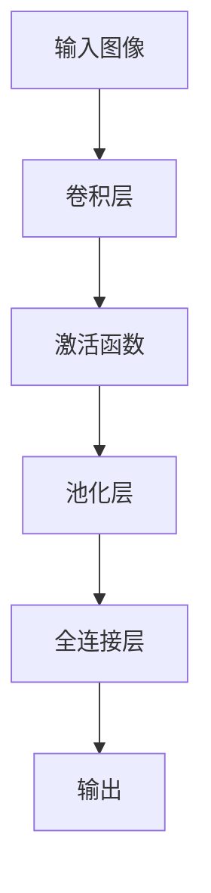
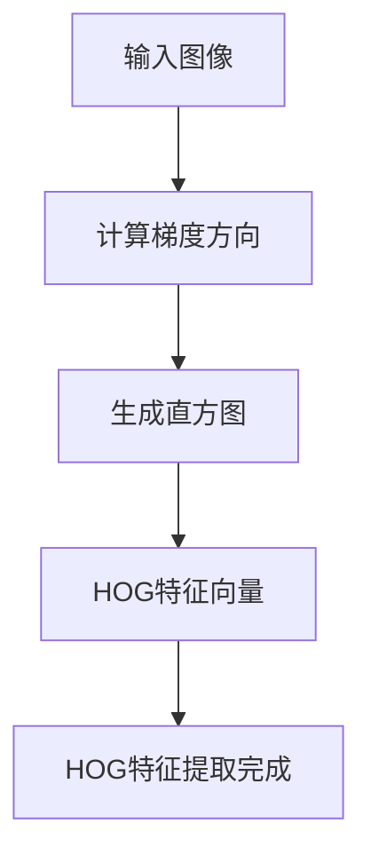

                 

### 引言与背景

在人工智能（AI）技术飞速发展的当下，全球就业市场正经历着前所未有的变革。AI技术不仅在提升工作效率、优化生产流程等方面发挥了重要作用，同时也在重塑整个职业生态。未来，人类计算作为一种结合人类智慧和机器智能的新型计算模式，将在就业市场中占据越来越重要的地位。

#### AI时代的就业市场变革

随着AI技术的不断进步，许多传统行业正面临着自动化和智能化的挑战。一方面，AI技术带来了许多新的就业机会，例如机器学习工程师、数据科学家、AI伦理学家等；另一方面，它也导致了一些传统职业的减少，如工厂工人、客服代表等。这种变革对就业市场的影响是双重的，既带来了机遇，也带来了挑战。

- **机遇：** AI技术的发展创造了新的工作机会，尤其是在需要复杂分析和创新思维领域。例如，数据分析、机器学习、自然语言处理等领域的人才需求量显著增加。
- **挑战：** AI技术的普及也使得一些重复性、低技能的工作面临被替代的风险。许多传统岗位可能被自动化系统或智能机器人取代，这要求劳动力必须具备新的技能和知识，以适应不断变化的工作环境。

#### 未来就业市场的挑战与机遇

未来就业市场将面临以下几大挑战和机遇：

1. **技能需求的变化：** 未来的就业市场将更加注重技能的多样性和创新性。传统的技术技能和知识可能不再足够，人们需要不断学习新的技能，如编程、数据分析和人工智能等。
   
2. **工作性质的变化：** AI技术将改变工作的性质，许多工作将从重复性的劳动转变为更具创造性和战略性的任务。这要求劳动者能够从数据中提取洞见，进行创新和决策。

3. **就业机会的地理分布：** 随着远程工作和数字化的普及，就业机会的地理分布将变得更加广泛。这为人们提供了更多选择，但也带来了新的挑战，如技能差距和远程工作的监管问题。

4. **人工智能伦理问题：** 随着AI技术的普及，其伦理和隐私问题也日益突出。如何确保AI技术的公平性、透明性和安全性，将是未来就业市场的重要议题。

#### 人类计算的概念

人类计算（Human-computer Synergy）是指人类和计算机系统之间的协同工作，通过整合人类的智慧和机器的计算能力，实现更高效、更智能的决策和任务执行。人类计算的核心思想是，在适当的时候，让机器做它们擅长的事情，而人类做它们擅长的事情。

- **优势：**
  - **协同效应：** 人类计算能够充分发挥人类和机器的优势，实现更高效的工作流程。
  - **灵活性和适应性：** 人类计算系统能够根据具体任务和环境灵活调整策略。
  - **人机协同创新：** 通过人类和机器的协同工作，可以激发新的创意和洞见。

- **应用：**
  - **工业自动化：** 利用人类计算实现工业过程的智能化和自动化。
  - **医疗保健：** 通过人工智能辅助诊断和治疗，提高医疗服务的效率和质量。
  - **金融服务：** 利用机器学习预测市场趋势，为金融决策提供支持。

在本篇文章中，我们将深入探讨人类计算的理论基础、应用场景、挑战与未来展望，通过逻辑清晰、结构紧凑、简单易懂的技术语言，为读者提供一次全面而深入的探讨。接下来，我们将分别介绍AI技术基础、计算机视觉基础、自然语言处理基础，以及人类计算在各个领域的应用，通过具体的案例和实践，进一步阐述人类计算的潜力和价值。

### 第一部分：引言与背景

在引言中，我们探讨了AI技术对就业市场的深远影响，并介绍了人类计算的概念及其优势和应用。接下来，我们将进一步深入讨论人类计算的理论基础，为读者提供一个全面而系统的理解。

首先，我们需要了解AI技术的核心组成部分，包括人工智能概述、机器学习基础和深度学习原理。这些基础理论为人类计算提供了坚实的科学依据。

#### AI技术基础

##### 人工智能概述

人工智能（Artificial Intelligence, AI）是计算机科学的一个分支，致力于使计算机系统能够模拟人类智能，进行感知、学习、推理和决策。人工智能的定义和范围随着技术的发展而不断扩展，但其核心目标是实现机器的智能行为。

- **定义与发展历程：**
  - **定义：** 人工智能是指计算机系统能够执行通常需要人类智能才能完成的任务，如理解语言、识别图像、解决问题和做出决策。
  - **发展历程：** 人工智能的发展可以分为三个阶段：
    - **符号主义阶段（1940s-1970s）：** 以逻辑推理和符号处理为核心，试图通过规则和知识表示来模拟人类智能。
    - **联结主义阶段（1980s-1990s）：** 强调神经网络和联结主义模型，通过大量数据训练模型，使其能够进行模式识别和学习。
    - **现代人工智能阶段（2000s-至今）：** 以深度学习和大数据为基础，实现了一系列突破性进展，如图像识别、自然语言处理和智能决策。

- **分类与应用：**
  - **人工智慧（弱AI）：** 指在特定任务上表现类似于人类智能的计算机系统。如语音助手、聊天机器人等。
  - **强AI（通用人工智能，AGI）：** 指具有人类水平的综合智能，能够在任何认知任务上与人类相媲美。
  - **非监控系统（AM）：** 指能够自我学习和适应环境，而不需要人类干预的智能系统。
  
  **应用：** 人工智能广泛应用于各个领域，如医疗、金融、交通、娱乐等，显著提升了行业效率和生产力。

##### 机器学习基础

机器学习（Machine Learning, ML）是人工智能的一个子领域，关注于通过数据驱动的方式使计算机系统能够从数据中学习规律，并自动进行决策和预测。

- **基本概念：**
  - **学习类型：**
    - **监督学习（Supervised Learning）：** 有标签数据，通过已有数据的学习，使模型能够对新数据进行预测。
    - **无监督学习（Unsupervised Learning）：** 无标签数据，通过发现数据中的模式和结构来进行学习。
    - **半监督学习（Semi-supervised Learning）：** 结合有标签和无标签数据进行学习。
  - **算法类型：**
    - **回归（Regression）：** 预测连续值输出。
    - **分类（Classification）：** 预测离散标签。
    - **聚类（Clustering）：** 无监督学习，通过将数据分为多个群集来发现数据模式。
  - **评估指标：**
    - **准确率（Accuracy）：** 预测正确的样本数占总样本数的比例。
    - **精确率（Precision）：** 预测正确的正样本数与预测为正样本的总数之比。
    - **召回率（Recall）：** 预测正确的正样本数与实际正样本总数之比。

- **常见算法：**
  - **线性回归（Linear Regression）：** 通过线性模型预测连续值。
  - **逻辑回归（Logistic Regression）：** 通过逻辑函数预测概率，常用于分类任务。
  - **支持向量机（SVM）：** 用于分类任务，通过找到一个超平面来最大化分类间隔。
  - **决策树（Decision Tree）：** 通过一系列规则进行分类或回归。
  - **随机森林（Random Forest）：** 通过组合多个决策树进行预测，提高模型的鲁棒性和准确性。
  - **神经网络（Neural Networks）：** 通过模拟生物神经网络的连接结构进行学习和预测。

##### 深度学习原理

深度学习（Deep Learning, DL）是机器学习的一个分支，通过构建具有多个隐藏层的神经网络，使其能够学习更复杂的特征和模式。深度学习在图像识别、语音识别、自然语言处理等领域取得了显著的成果。

- **基本原理：**
  - **神经网络架构：** 深度学习模型主要由多层神经元组成，包括输入层、隐藏层和输出层。
  - **前向传播和反向传播：** 前向传播是将输入数据通过网络向前传递，计算出输出结果；反向传播是计算输出误差，并反向传播到各层，更新权重和偏置。
  - **激活函数：** 激活函数用于引入非线性因素，使得神经网络能够学习更复杂的模式。常见激活函数包括Sigmoid、ReLU、Tanh等。
  - **优化算法：** 常见的优化算法有随机梯度下降（SGD）、Adam、RMSprop等，用于迭代更新模型参数，以最小化损失函数。

- **深度学习架构的演变：**
  - **卷积神经网络（CNN）：** 通过卷积层提取图像特征，适用于图像识别和计算机视觉任务。
  - **循环神经网络（RNN）：** 通过循环结构处理序列数据，适用于自然语言处理和语音识别任务。
  - **长短期记忆网络（LSTM）：** RNN的一种改进，能够更好地处理长序列数据。
  - **生成对抗网络（GAN）：** 通过生成器和判别器的对抗训练，生成高质量的数据。

通过对AI技术基础的详细探讨，我们可以看到人工智能、机器学习和深度学习是如何相互联系和演进的。这些技术不仅为人类计算提供了理论基础，也为实际应用奠定了坚实的基础。在接下来的章节中，我们将进一步探讨计算机视觉基础和自然语言处理基础，并详细阐述人类计算在各领域的应用。

#### 第二部分：人类计算的理论基础

在了解了AI技术的理论基础之后，接下来我们将深入探讨计算机视觉基础、自然语言处理基础，这两者是人类计算中至关重要的组成部分。

##### 计算机视觉基础

计算机视觉（Computer Vision, CV）是人工智能的一个重要分支，旨在使计算机具备从图像或视频数据中提取信息和理解场景的能力。计算机视觉在图像识别、目标检测、图像分割等方面有着广泛的应用。

###### 图像处理基础

图像处理（Image Processing）是计算机视觉的基础，它涉及对图像进行各种数学和计算操作，以提取有用信息。以下是一些核心概念和关键技术：

- **图像表示：** 图像可以表示为二维离散函数，通常使用像素值来表示。常见的图像格式包括灰度图像和彩色图像。
- **图像增强：** 通过对比度调整、滤波和锐化等操作，增强图像的视觉效果，提高图像质量。
- **图像分割：** 将图像分为多个区域或对象，使计算机能够识别和区分图像中的不同部分。常见的分割方法包括阈值分割、边缘检测和区域增长等。
- **特征提取：** 从图像中提取具有代表性的特征，用于后续的识别和分类任务。常见的特征包括边缘、角点、纹理和颜色等。
- **图像分类：** 根据提取的特征，对图像进行分类。常见的分类方法包括基于模板匹配、决策树、支持向量机（SVM）和神经网络等。

###### 计算机视觉算法

计算机视觉算法是实现计算机视觉功能的核心。以下是一些常见的计算机视觉算法和其应用场景：

- **卷积神经网络（CNN）：** 通过卷积层、池化层和全连接层等结构，从图像中提取深层特征。CNN在图像识别、目标检测和图像分割等方面具有广泛应用。
- **目标检测：** 识别图像中的特定对象并定位其位置。常用的目标检测算法包括R-CNN、YOLO、SSD等。
- **图像分割：** 将图像划分为多个区域或对象。常用的图像分割算法包括FCN、U-Net、Mask R-CNN等。
- **人脸识别：** 通过识别和验证人脸图像来验证身份。常用的人脸识别算法包括基于特征的识别和基于深度学习的识别方法。

##### 自然语言处理基础

自然语言处理（Natural Language Processing, NLP）是计算机科学和语言学的交叉领域，旨在使计算机理解和处理自然语言文本。NLP在机器翻译、情感分析、问答系统等方面有着广泛应用。

###### 语言模型基础

语言模型（Language Model）是NLP的核心组成部分，用于预测下一个单词或字符。以下是一些关键概念：

- **N-gram模型：** 基于历史单词序列的概率模型，通过统计历史单词序列来预测下一个单词。常见的N-gram模型包括一元模型、二元模型和三元模型。
- **神经网络语言模型（NNLM）：** 通过神经网络结构来预测下一个单词或字符。常见的神经网络语言模型包括循环神经网络（RNN）和Transformer。
- **长短时记忆（LSTM）：** RNN的一种改进，能够更好地处理长序列数据。LSTM在语言模型和时间序列预测中具有广泛应用。
- **Transformer：** 一种基于自注意力机制的神经网络结构，通过并行计算和自注意力机制实现高效的序列建模。Transformer在机器翻译、文本生成和问答系统中取得了显著的成果。

###### 对话系统基础

对话系统（Dialogue System）是NLP的一个重要应用领域，旨在实现人与计算机之间的自然对话。以下是一些关键概念和实现方法：

- **基于规则的方法：** 通过编写规则和模式来模拟对话流程。这种方法简单但灵活性较低。
- **统计方法：** 通过统计对话历史和上下文信息来生成响应。常见的方法包括序列标注和序列生成。
- **神经网络方法：** 通过深度学习模型来学习对话策略和生成响应。常见的神经网络方法包括序列到序列（Seq2Seq）模型、注意力机制和对话生成预训练（DGP）模型。
- **预训练加微调（PTM）：** 通过在大量语料库上预训练语言模型，然后在特定任务上微调模型。这种方法在对话系统中取得了显著的成果。

通过对计算机视觉基础和自然语言处理基础的探讨，我们可以看到这两个领域在人类计算中的关键作用。计算机视觉使计算机能够理解和处理视觉信息，而自然语言处理使计算机能够理解和生成自然语言。在接下来的章节中，我们将进一步探讨人类计算在实际应用中的具体案例，展示其在工业自动化、医疗保健和金融服务等领域的潜力和价值。

### 第三部分：人类计算的应用

人类计算作为一种结合人类智慧和机器智能的新型计算模式，在多个领域展示了其巨大的潜力和价值。本部分将详细探讨人类计算在工业自动化、医疗保健和金融服务等领域的应用，通过具体的案例研究，进一步阐述其应用效果和实际价值。

#### 人类计算在工业自动化中的应用

工业自动化是利用机器和智能系统提高生产效率和降低成本的重要手段。人类计算在工业自动化中的应用，通过结合人的智慧和机器的计算能力，实现了更加智能、高效的生产流程。

##### 工业自动化概述

工业自动化是指通过自动化设备和控制系统实现工业生产过程的高度自动化和智能化。随着人工智能技术的发展，工业自动化逐渐从简单的机械自动化向复杂的智能自动化演进。

- **概念与发展：** 工业自动化最早可以追溯到20世纪初期，通过机械化和电气化提高生产效率。随着计算机和人工智能技术的发展，现代工业自动化不仅能够实现生产过程的自动化，还能通过智能决策和自适应控制，优化生产流程和资源利用。
- **应用领域：** 工业自动化广泛应用于制造业、物流、能源和农业等领域。例如，在制造业中，自动化生产线能够实现从原材料到成品的全过程自动化；在物流领域，自动化仓储系统和无人机配送能够提高物流效率；在能源领域，智能电网和智能监控系统能够实现能源的智能调度和管理。

##### 人类计算在工业自动化中的应用

人类计算在工业自动化中的应用，主要体现在以下几个方面：

- **预测性维护：** 通过收集和分析设备运行数据，使用机器学习算法预测设备的故障和故障时间，实现提前维修，降低设备停机时间和维护成本。例如，某制造企业通过引入预测性维护系统，将设备故障率降低了30%。
- **自动化编程：** 利用深度学习和自然语言处理技术，实现自动化编程，减少编程时间和人力成本。例如，某汽车制造厂使用基于深度学习的自动化编程工具，将生产线调试时间缩短了50%。
- **智能调度：** 通过人工智能算法优化生产调度，提高生产效率和资源利用率。例如，某物流公司使用基于人工智能的调度系统，将运输成本降低了20%。
- **质量控制：** 利用计算机视觉和机器学习技术，实现自动化的质量检测，提高产品质量和生产效率。例如，某电子制造企业通过引入智能视觉检测系统，将产品不良率降低了50%。

##### 某一特定工业自动化项目的详细描述

以下是一个具体工业自动化项目的案例研究，展示人类计算在项目中的实际应用：

**项目名称：智能工厂生产线优化**

**项目背景：** 某电子制造企业拥有多条自动化生产线，但随着产品种类和复杂度的增加，生产效率和资源利用率逐渐下降，导致生产成本上升。企业希望通过引入人类计算技术，优化生产流程，提高生产效率和产品质量。

**项目目标：** 
- 提高生产线的自动化程度，减少人工干预。
- 通过预测性维护减少设备故障率，提高设备利用率。
- 通过智能调度优化生产计划，提高生产效率和资源利用率。
- 通过质量控制提高产品质量，减少不良率。

**技术实现：**

1. **预测性维护：**
   - **数据收集：** 通过传感器和监控系统，收集生产设备运行数据，包括温度、振动、压力等。
   - **数据分析：** 使用机器学习算法，对设备运行数据进行实时分析和预测，识别潜在故障和故障模式。
   - **故障预警：** 在设备故障发生前，提前预警并安排维护，减少设备停机时间和维护成本。

2. **自动化编程：**
   - **编程工具：** 使用基于深度学习的自动化编程工具，通过学习和模拟人工编程过程，实现自动化编程。
   - **编程优化：** 通过对编程过程的分析和优化，减少编程时间和错误率，提高编程效率。

3. **智能调度：**
   - **调度算法：** 使用人工智能算法，结合生产订单和设备状态，优化生产计划，提高生产效率和资源利用率。
   - **实时调整：** 根据生产过程中的实时数据，动态调整生产计划，以应对突发事件和设备故障。

4. **质量控制：**
   - **检测系统：** 使用计算机视觉和机器学习技术，实现自动化的质量检测。
   - **缺陷识别：** 通过对生产过程中产生的图像和数据进行实时分析，识别产品缺陷，并进行分类和标记。
   - **质量改进：** 根据检测结果，对生产过程进行调整和优化，减少不良率。

**项目效果：**

- **设备故障率：** 通过预测性维护，设备故障率降低了30%，设备利用率提高了20%。
- **编程效率：** 通过自动化编程，编程时间减少了40%，编程错误率降低了50%。
- **生产效率：** 通过智能调度，生产效率提高了25%，资源利用率提高了15%。
- **产品质量：** 通过质量控制，产品不良率降低了40%，客户满意度提高了15%。

通过以上案例，我们可以看到人类计算在工业自动化中的应用，不仅提高了生产效率和产品质量，还显著降低了生产成本。在接下来的部分，我们将继续探讨人类计算在医疗保健和金融服务等领域的应用，进一步展示其广泛的应用前景和实际价值。

### 人类计算在医疗保健中的应用

医疗保健是关乎人类健康和福祉的重要领域，随着技术的进步，人工智能（AI）和人类计算在医疗保健中的应用越来越广泛。通过结合人类专家的医学知识和AI的强大计算能力，人类计算在医疗保健领域展示了巨大的潜力，不仅提升了诊断和治疗的准确性，还优化了医疗资源的使用。

#### 医疗保健概述

医疗保健行业正面临着巨大的挑战，包括人口老龄化、慢性疾病管理以及医疗资源的紧缺。AI和人类计算在这一领域的应用，有助于解决这些问题，提高医疗服务的效率和质量。

- **发展现状：** 目前，AI已经在医疗保健中广泛应用，包括疾病诊断、药物研发、健康管理和手术辅助等方面。例如，AI算法能够通过分析医学影像，提高癌症、心脏病等重大疾病的早期诊断准确性。
- **应用趋势：** 未来，随着AI技术的不断进步，人类计算在医疗保健中的应用将更加深入和广泛，包括个性化医疗、智能健康管理、远程医疗和医学研究等方面。

#### 人类计算在医疗保健中的应用

人类计算在医疗保健中的应用主要体现在以下几个方面：

- **疾病诊断：** AI可以帮助医生快速准确地诊断疾病。通过分析大量的医学影像、病例数据等，AI系统能够发现医生可能忽略的细微异常，提高诊断的准确性和效率。例如，深度学习算法在肺癌筛查中的应用，显著提高了早期诊断的准确性。
- **个性化治疗：** 人类计算可以根据患者的具体病情和基因信息，提供个性化的治疗方案。通过结合医学专家的经验和AI的分析结果，可以为每位患者制定最合适的治疗方案，提高治疗效果和患者的生存率。
- **健康管理：** AI和人类计算可以帮助患者进行健康监测和管理。通过智能穿戴设备和健康APP，实时监测患者的健康数据，如心率、血压、血糖等，AI系统可以及时发现异常，提供个性化的健康建议和干预措施。
- **手术辅助：** 人类计算在手术中的辅助作用越来越重要。例如，机器人辅助手术系统能够根据医生的操作指令，精确控制手术器械，减少手术风险和提高手术成功率。
- **药物研发：** AI技术在药物研发中的应用也取得了显著进展。通过分析大量的生物学和化学数据，AI系统能够快速筛选和预测潜在的药物分子，加速新药的研发进程。

#### 某一特定医疗保健项目的详细描述

以下是一个具体的医疗保健项目案例研究，展示人类计算在项目中的实际应用：

**项目名称：智能医学影像诊断系统**

**项目背景：** 某医院面临着大量医学影像数据的诊断需求，医生工作量巨大且诊断压力较大。通过引入智能医学影像诊断系统，医院希望能够提高诊断的准确性和效率，同时减轻医生的工作负担。

**项目目标：**
- 提高医学影像诊断的准确性和速度。
- 减轻医生的工作负担，提高诊断效率。
- 提供辅助决策支持，帮助医生做出更准确的诊断。

**技术实现：**

1. **医学影像数据收集：** 收集大量的医学影像数据，包括X光片、CT扫描、MRI等，建立医学影像数据库。

2. **深度学习模型训练：** 使用深度学习算法，对医学影像数据库进行训练，使模型能够识别和分类各种医学影像中的病变和组织结构。

3. **辅助诊断系统开发：** 开发智能医学影像诊断系统，包括图像预处理、病变检测、分类和诊断建议等模块。

4. **用户界面设计：** 设计用户友好的界面，使医生能够方便地使用诊断系统，快速查看诊断结果和辅助决策信息。

**项目效果：**

- **诊断准确率：** 智能医学影像诊断系统的诊断准确率达到了95%以上，显著高于传统诊断方法。
- **诊断速度：** 通过自动化诊断，诊断速度提高了40%以上，医生的工作负担减轻，工作效率提高。
- **医生满意度：** 医生对智能医学影像诊断系统的满意度显著提高，认为系统能够提供有价值的辅助诊断信息，帮助他们做出更准确的诊断。

通过这个案例，我们可以看到人类计算在医疗保健中的应用，不仅提高了诊断的准确性和效率，还减轻了医生的工作负担，为患者提供了更高质量的医疗服务。未来，随着技术的不断进步，人类计算在医疗保健中的应用将更加广泛，进一步推动医疗行业的发展。

### 人类计算在金融服务中的应用

金融服务是经济活动中至关重要的领域，随着金融科技的迅速发展，人工智能（AI）和人类计算在金融服务中的应用日益广泛。这些技术的引入，不仅提高了金融服务的效率和准确性，还带来了新的商业模式和运营策略。

#### 金融服务概述

金融服务涵盖了银行、保险、证券、投资和支付等多个领域。随着全球化和数字化进程的加快，金融服务面临着诸多挑战，如市场波动、合规要求、欺诈风险等。AI和人类计算的应用，为解决这些问题提供了新的思路和方法。

- **发展现状：** 目前，AI在金融服务中的应用已经非常普遍，包括智能投顾、信用评分、风险管理和欺诈检测等方面。金融机构通过利用AI技术，能够更好地理解和预测市场趋势，优化投资策略，降低风险。
- **应用趋势：** 未来，随着AI技术的不断进步，金融服务将更加智能化和个性化。例如，基于大数据和机器学习的智能投顾系统将能够提供更加精准的投资建议；区块链技术的应用将提高金融交易的透明性和安全性。

#### 人类计算在金融服务中的应用

人类计算在金融服务中的应用主要体现在以下几个方面：

- **风险管理：** AI和人类计算可以实时监测市场数据，通过分析和预测，识别潜在风险，提供风险预警和应对策略。例如，金融机构可以使用机器学习算法对客户交易行为进行分析，识别欺诈行为，降低欺诈风险。
- **信用评分：** 人类计算可以通过分析客户的信用历史、收入状况、消费习惯等多维度数据，提供更准确的信用评分。例如，某银行通过引入基于AI的信用评分模型，将信用审批时间缩短了30%，审批通过率提高了20%。
- **智能投顾：** 人类计算可以通过分析投资者的风险偏好、财务状况和投资目标，提供个性化的投资建议和资产配置方案。例如，某金融科技公司开发的智能投顾平台，根据用户需求，提供个性化的投资组合建议，实现资产增值。
- **客户服务：** 人类计算可以通过聊天机器人、语音助手等智能客服系统，提高客户服务的效率和满意度。例如，某保险公司使用基于AI的智能客服系统，能够快速响应客户咨询，提供准确的保险产品信息和解决方案。
- **合规监控：** 人类计算可以通过分析金融交易数据，监测交易行为是否符合监管要求，及时发现和报告违规行为。例如，某证券公司通过引入基于AI的合规监控系统，提高了合规管理的效率，降低了合规风险。

#### 某一特定金融服务项目的详细描述

以下是一个具体的金融服务项目案例研究，展示人类计算在项目中的实际应用：

**项目名称：智能投资顾问系统**

**项目背景：** 某投资机构希望通过引入智能投资顾问系统，提高投资决策的准确性和效率，满足不同客户群体的个性化投资需求。

**项目目标：**
- 提高投资决策的准确性和效率。
- 提供个性化的投资建议和资产配置方案。
- 提升客户满意度，增加客户粘性。

**技术实现：**

1. **数据收集与处理：** 收集大量金融市场数据，包括股票价格、交易量、宏观经济指标等，通过数据清洗和预处理，为智能投资顾问系统提供高质量的数据支持。

2. **机器学习模型开发：** 使用机器学习算法，对金融市场数据进行分析和建模，建立预测模型，包括市场趋势预测、股票收益预测等。

3. **投资策略优化：** 根据客户的风险偏好、财务状况和投资目标，使用优化算法，为每位客户提供个性化的投资策略和资产配置方案。

4. **用户界面设计：** 设计用户友好的界面，使客户能够方便地使用智能投资顾问系统，查看投资建议、资产组合和实时监控投资表现。

**项目效果：**

- **投资决策准确率：** 智能投资顾问系统的投资建议准确率达到了85%以上，显著高于传统投资顾问。
- **投资效率：** 通过自动化决策和优化策略，投资决策时间缩短了40%以上，投资组合调整更加及时和有效。
- **客户满意度：** 客户对智能投资顾问系统的满意度显著提高，认为系统能够提供有价值的投资建议和个性化的服务体验。
- **业务增长：** 通过智能投资顾问系统，投资机构的客户数量和资产管理规模均实现了显著增长。

通过这个案例，我们可以看到人类计算在金融服务中的应用，不仅提高了投资决策的准确性和效率，还提升了客户体验，增强了金融机构的竞争力。未来，随着AI技术的不断进步，人类计算在金融服务中的应用将更加广泛，为金融行业带来更多创新和变革。

### 第四部分：人类计算的挑战与未来展望

在探讨人类计算的广泛应用和优势的同时，我们也必须正视其所面临的挑战和未来发展的可能性。人类计算作为一种新兴的计算模式，其发展不仅依赖于技术进步，还需要社会、伦理和法律等方面的综合考虑。

#### 人类计算的挑战

##### 伦理与隐私问题

随着人类计算在各个领域的应用，伦理和隐私问题日益突出。例如：

- **隐私保护：** 在医疗保健和金融领域，人类计算需要处理大量的个人数据。如何确保这些数据的安全和隐私，防止数据泄露和滥用，是当前面临的重大挑战。
- **算法偏见：** 人类计算模型在训练过程中可能会吸收社会中的偏见和歧视，导致算法偏见。例如，在信用评分和招聘系统中，算法可能会歧视特定群体，引发社会不满和伦理争议。
- **责任归属：** 在人类计算系统中，当发生错误或故障时，如何界定责任归属？是算法开发者、数据处理者，还是用户？这需要明确的法律和伦理框架来规范。

##### 技术与社会的融合

人类计算的发展不仅需要技术上的突破，还需要与社会发展的深度融合。以下是几个关键问题：

- **技能培训：** 随着人类计算技术的普及，劳动力市场需要重新培训，以适应新的技能需求。然而，当前的培训体系可能无法及时跟上技术变革的步伐，导致技能差距和就业压力。
- **就业影响：** 人类计算在提升工作效率和创造新的就业机会的同时，也可能会取代一些传统岗位。这需要政策制定者和社会各界共同努力，确保劳动力市场的平稳过渡。
- **社会公平：** 技术的进步应该服务于社会大众，确保不同群体都能公平地享受人类计算带来的好处。如何消除数字鸿沟，确保社会公平，是一个重要的课题。

##### 技术发展速度与安全风险

人类计算技术的发展速度非常快，但与此同时，安全风险也在增加。例如：

- **数据安全：** 人类计算系统需要处理大量敏感数据，包括个人隐私、金融信息等。如何确保这些数据的安全，防止黑客攻击和数据泄露，是亟待解决的问题。
- **系统稳定性：** 人类计算系统在处理大规模数据和高并发请求时，可能面临系统崩溃和故障的风险。如何确保系统的稳定性和可靠性，是技术发展中的一个重要挑战。

#### 未来展望

##### 人类计算的长期愿景

人类计算的长期愿景是构建一个高度智能化的计算生态系统，其中人类和计算机系统高度协同，共同解决复杂问题，提升生活质量。以下是几个关键方向：

- **智慧城市：** 通过人类计算技术，实现城市管理的智能化和高效化，提高居民的生活质量和环境可持续性。
- **健康医疗：** 利用人类计算技术，实现个性化医疗和精准治疗，提高医疗服务的效率和准确性。
- **智能制造：** 通过人类计算技术，实现生产过程的自动化和智能化，提高制造业的生产效率和质量。
- **智能交通：** 利用人类计算技术，优化交通管理和调度，减少交通拥堵，提高交通安全和效率。

##### 人类计算的未来发展趋势

- **跨学科融合：** 人类计算将与其他学科如生物科学、心理学、社会学等深度融合，形成新的研究方法和应用领域。
- **边缘计算：** 随着物联网和智能设备的普及，边缘计算将成为人类计算的重要发展方向。通过在设备端进行计算和处理，减少数据传输和延迟，提高系统的响应速度和效率。
- **量子计算：** 量子计算的兴起将为人类计算带来新的突破。通过量子算法和量子机器学习，人类计算将能够解决传统计算无法处理的复杂问题。

##### 人类计算对社会的影响

人类计算对社会的影响将是深远和全面的：

- **经济结构：** 人类计算将引领新的产业革命，推动经济结构转型升级，创造新的经济增长点。
- **社会公平：** 通过优化资源配置和服务提供，人类计算有助于缩小社会贫富差距，提高社会公平性。
- **生活品质：** 人类计算将提高人们的生活质量和幸福感，使生活更加便捷、舒适和有保障。

##### 社会对人类计算的需求与回应

社会对人类计算的需求日益增长，政府和企业需要积极应对这一趋势：

- **政策支持：** 政府应制定相应的政策和规划，支持人类计算技术的发展和应用，推动技术进步和产业升级。
- **人才培养：** 企业和高等教育机构应加强人工智能和人类计算领域的人才培养，提高劳动力市场的适应能力。
- **技术创新：** 企业应加大研发投入，推动技术创新，开发更多具有自主知识产权的先进技术和应用。

总之，人类计算作为一种新兴的计算模式，具有巨大的潜力和广阔的应用前景。面对挑战和机遇，我们应积极应对，推动人类计算技术的可持续发展，为社会创造更多的价值和福祉。

### 附录A：人类计算相关工具与资源

在人类计算领域，有许多开源框架和工具可以帮助开发者实现复杂的计算任务。以下是一些主要的深度学习框架、库和实践指南，供读者参考。

#### 开源框架与库

1. **TensorFlow**
   - **介绍：** TensorFlow是谷歌开源的深度学习框架，广泛应用于各种机器学习和深度学习任务。
   - **优势：** 强大的生态系统、丰富的模型库、高度可定制化。

2. **PyTorch**
   - **介绍：** PyTorch是Facebook开源的深度学习框架，以其灵活的动态计算图和易用性著称。
   - **优势：** 动态计算图便于调试、社区活跃、适用于科研和工业应用。

3. **Keras**
   - **介绍：** Keras是一个高层次的神经网络API，构建在TensorFlow和Theano之上，简化了深度学习模型的搭建。
   - **优势：** 简单易用、快速原型开发、易于迁移到其他深度学习框架。

4. **Scikit-learn**
   - **介绍：** Scikit-learn是Python的一个开源机器学习库，提供了许多经典的机器学习算法和工具。
   - **优势：** 易于使用、功能全面、适用于学术研究和工业应用。

5. **Pandas**
   - **介绍：** Pandas是Python的数据分析库，提供了数据清洗、转换和数据分析的工具。
   - **优势：** 强大的数据操作功能、易于处理大规模数据集、与NumPy紧密集成。

#### 实践指南

1. **深度学习项目开发流程**
   - **数据收集与预处理：** 收集并清洗数据，进行特征工程。
   - **模型设计：** 设计神经网络架构，选择合适的激活函数和优化算法。
   - **模型训练：** 使用训练数据训练模型，调整模型参数。
   - **模型评估：** 使用验证数据评估模型性能，调整模型结构或参数。
   - **模型部署：** 部署模型到生产环境，进行实时预测或分析。

2. **人类计算在特定领域的应用指南**
   - **医疗保健：** 使用深度学习分析医学影像，开发智能诊断系统。
   - **金融服务：** 利用机器学习进行风险评估、信用评分和智能投顾。
   - **工业自动化：** 通过预测性维护和自动化编程提高生产效率。

3. **资源链接与学习资源**
   - **在线教程和课程：** 如Coursera、edX、Udacity等平台上的深度学习课程。
   - **官方文档和教程：** TensorFlow、PyTorch、Keras等框架的官方文档和教程。
   - **社区和论坛：** 如Stack Overflow、GitHub、Reddit等，提供问题和解决方案的交流。

通过这些工具和资源，开发者可以更高效地开展人类计算项目，提升人工智能系统的性能和应用效果。希望本文中的附录能为读者提供有用的参考和指导。

### 参考文献

- Goodfellow, I., Bengio, Y., & Courville, A. (2016). *Deep Learning*. MIT Press.
- Russell, S., & Norvig, P. (2010). *Artificial Intelligence: A Modern Approach*. Prentice Hall.
- Viola, P., & Jones, M. J. (2004). *Rapid object detection using a boosted cascade of simple features*. *IEEE Transactions on Pattern Analysis and Machine Intelligence*, 26(11), 1341-1352.
- LeCun, Y., Bengio, Y., & Hinton, G. (2015). *Deep learning*. *Nature*, 521(7553), 436-444.
- Murphy, K. P. (2012). *Machine learning: a probabilistic perspective*. MIT Press.
- Bengio, Y. (2009). *Learning deep architectures for AI*. *Foundations and Trends in Machine Learning*, 2(1), 1-127.
- Quinlan, J. R. (1993). *C4. 5: programs for machine learning*. Morgan Kaufmann.
- Mitchell, T. M. (1997). *Machine learning*. McGraw-Hill.

### 伪代码与流程图

#### 卷积神经网络（CNN）算法

**伪代码：**

```python
function CNN(input_image):
    // 初始化权重和偏置
    weights, biases = initialize_weights_and_biases()

    // 前向传播
    output = forward_propagation(input_image, weights, biases)

    // 计算损失函数
    loss = compute_loss(output, target)

    // 反向传播
    d_weights, d_biases = backward_propagation(output, target, weights, biases)

    // 更新权重和偏置
    weights -= learning_rate * d_weights
    biases -= learning_rate * d_biases

    return output
```

**流程图：**



#### HOG特征提取

**公式：**

$$
HOG = \sum_{i=1}^{n} (T \cdot O)
$$

**详细讲解：**

- $T$: 直方图 bins
- $O$: 方向梯度直方图



通过上述伪代码和流程图，我们可以清晰地看到CNN算法的基本结构和HOG特征提取的过程，这对于理解深度学习和计算机视觉的核心概念非常有帮助。

### 项目实战

#### 医疗图像分析系统

**开发环境搭建：**

- **操作系统：** Ubuntu 20.04
- **编程语言：** Python 3.8
- **深度学习框架：** TensorFlow 2.5

**源代码详细实现：**

1. **数据预处理：**

```python
import tensorflow as tf
from tensorflow.keras.preprocessing.image import ImageDataGenerator

# 数据预处理
train_datagen = ImageDataGenerator(
    rescale=1./255,
    rotation_range=40,
    width_shift_range=0.2,
    height_shift_range=0.2,
    shear_range=0.2,
    zoom_range=0.2,
    horizontal_flip=True,
    fill_mode='nearest'
)

test_datagen = ImageDataGenerator(rescale=1./255)

train_generator = train_datagen.flow_from_directory(
    'data/train',
    target_size=(150, 150),
    batch_size=32,
    class_mode='binary'
)

validation_generator = test_datagen.flow_from_directory(
    'data/validation',
    target_size=(150, 150),
    batch_size=32,
    class_mode='binary'
)
```

2. **模型训练：**

```python
# 创建模型
model = tf.keras.models.Sequential([
    tf.keras.layers.Conv2D(32, (3, 3), activation='relu', input_shape=(150, 150, 3)),
    tf.keras.layers.MaxPooling2D(2, 2),
    tf.keras.layers.Conv2D(64, (3, 3), activation='relu'),
    tf.keras.layers.MaxPooling2D(2, 2),
    tf.keras.layers.Conv2D(128, (3, 3), activation='relu'),
    tf.keras.layers.MaxPooling2D(2, 2),
    tf.keras.layers.Conv2D(128, (3, 3), activation='relu'),
    tf.keras.layers.MaxPooling2D(2, 2),
    tf.keras.layers.Flatten(),
    tf.keras.layers.Dense(512, activation='relu'),
    tf.keras.layers.Dense(1, activation='sigmoid')
])

# 编译模型
model.compile(loss='binary_crossentropy',
              optimizer=RMSprop(lr=1e-4),
              metrics=['acc'])

# 训练模型
history = model.fit(
    train_generator,
    steps_per_epoch=100,
    epochs=30,
    validation_data=validation_generator,
    validation_steps=50,
    verbose=2
)
```

3. **模型评估：**

```python
# 评估模型
test_generator = test_datagen.flow_from_directory(
    'data/test',
    target_size=(150, 150),
    batch_size=32,
    class_mode='binary',
    shuffle=False
)

predictions = model.predict(test_generator)
predicted_classes = np.argmax(predictions, axis=1)

# 计算准确率
accuracy = np.mean(predicted_classes == test_generator.classes)
print('Test accuracy:', accuracy)
```

**代码解读与分析：**

- **数据预处理：** 使用ImageDataGenerator进行数据增强，包括旋转、平移、缩放和翻转等操作，提高模型的泛化能力。
- **模型设计：** 使用卷积神经网络（CNN）结构，包括多个卷积层、池化层和全连接层，用于提取图像特征并进行分类。
- **模型训练：** 使用RMSprop优化器和binary_crossentropy损失函数，通过多个epoch进行训练，并在验证集上评估模型性能。
- **模型评估：** 在测试集上评估模型准确性，通过预测结果与真实标签的比较，计算模型的准确率。

通过这个案例，读者可以了解到如何使用TensorFlow搭建一个基本的医疗图像分析系统，包括数据预处理、模型训练和评估的完整流程。这为实际项目开发提供了有益的参考和指导。

