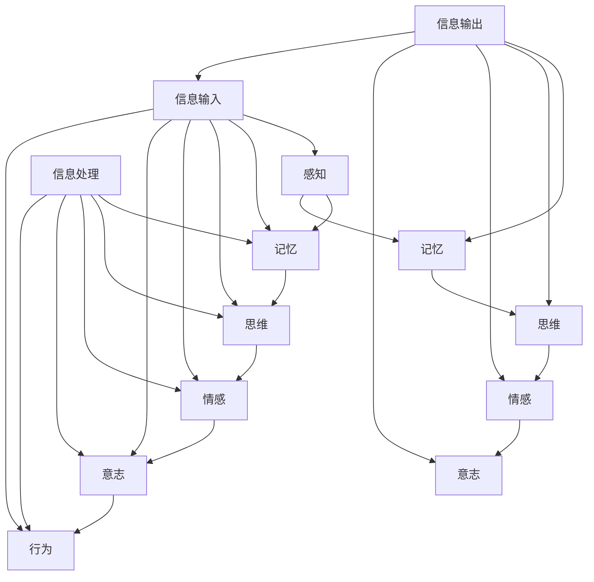

                 

# 从简单到复杂再到简洁的认知过程

> **关键词：认知过程、认知简化、信息处理、大脑效率、技术应用**

> **摘要：本文将深入探讨认知过程的本质，从简单到复杂再到简洁的认知演变过程，分析认知简化的动力因素、方法及其在实际应用中的挑战与策略。通过阐述新技术的发展趋势，揭示未来认知简化的方向。**

### 第一部分：认知过程概述

#### 第1章：认知过程基础理论

**1.1 认知过程的定义与基本原理**

认知过程是指人类大脑获取、处理、存储和使用信息的一系列心理活动。其基本原理可以概括为信息输入、信息处理和信息输出。

- **信息输入**：个体通过感官接收外部信息。感官包括视觉、听觉、触觉、嗅觉和味觉。
- **信息处理**：大脑对信息进行加工、分析和理解。这一过程涉及感知、记忆、思维和情感等多个方面。
- **信息输出**：通过语言、行为或思维将加工后的信息展现出来。

**1.2 认知心理学与神经科学基础**

**认知心理学**是研究人类认知过程的科学，包括感知、记忆、思维、解决问题等。**神经科学**则从生物学的角度研究大脑的结构和功能，为认知心理学提供了重要的基础。

- **认知心理学概述**：认知心理学通过实验方法研究人类的认知过程，如视觉感知、记忆形成、思维策略等。
- **神经科学在认知研究中的应用**：神经科学家通过脑成像技术、电生理技术等研究大脑神经元的连接和传递，揭示认知过程背后的生物基础。

**1.3 认知过程的分类**

认知过程可以按照不同的维度进行分类。以下是常见的分类方式：

- **感知过程**：个体接收和解释外部信息的过程。例如，视觉感知、听觉感知、触觉感知等。
- **记忆过程**：信息从短期存储转移到长期存储的过程。例如，瞬时记忆、短时记忆、长时记忆。
- **思维过程**：大脑对信息进行加工、推理、决策等的过程。例如，逻辑思维、创造思维、批判性思维。
- **情感过程**：个体对信息产生情感体验的过程。例如，愉悦、愤怒、悲伤等基本情感。
- **意志过程**：个体做出决策和行动的过程。例如，坚持、抑制、选择等。

#### 第2章：从简单到复杂的认知过程

**2.1 基础认知任务**

基础认知任务是指那些涉及基本认知过程的简单任务。这些任务通常包括感知、记忆和思维等。

- **简单感知任务**：例如，识别颜色、形状、声音等。
- **基础记忆任务**：例如，记忆数字序列、单词列表等。
- **简单思维任务**：例如，解决简单的数学问题、逻辑谜题等。

**2.2 复杂认知任务**

复杂认知任务是指那些涉及多个认知过程、需要更高认知能力的任务。这些任务通常更加抽象、多样化，需要更高的思维深度。

- **复杂感知任务**：例如，理解复杂的视觉场景、解读语音信号等。
- **高级记忆任务**：例如，记忆复杂的故事情节、回忆多个信息源等。
- **复杂思维任务**：例如，解决复杂的数学问题、进行多步骤的逻辑推理等。

**2.3 认知过程的发展规律**

认知过程的发展规律体现在以下几个方面：

- **认知复杂度的增加**：随着个体的成长和教育，认知复杂度逐渐增加。
- **认知过程的速度和准确性**：在个体成长过程中，认知过程的速度和准确性会发生变化。例如，年轻人可能在速度上更快，但准确性可能不如老年人。

#### 第3章：认知过程中的信息处理

**3.1 信息接收与编码**

信息接收与编码是认知过程的第一步。在这一步中，个体通过感官接收外部信息，并将信息转化为大脑可以处理的形式。

- **信息接收**：个体通过感官接收外部信息。感官包括视觉、听觉、触觉、嗅觉和味觉。
- **信息编码**：大脑将接收到的信息转化为符号或语言。信息编码可以是形式编码（如将视觉信息转化为图像符号）或内容编码（如将信息转化为内在意义或概念）。

**3.2 信息存储与检索**

信息存储与检索是认知过程中的关键步骤。在这一步中，个体将信息存储在大脑中，并在需要时将其检索出来。

- **短期记忆**：短期记忆是短时内存储的信息。它包括工作记忆和初级记忆。
- **长期记忆**：长期记忆是长时间存储的信息。它包括情景记忆和语义记忆。
- **信息检索**：信息检索是从记忆中提取所需信息的过程。检索可以基于联想记忆、检索线索或记忆图谱等策略。

**3.3 信息加工与整合**

信息加工与整合是认知过程中的核心步骤。在这一步中，个体对信息进行加工、分析和整合，形成新的理解和知识。

- **信息加工**：信息加工是对信息进行分析、比较、综合等。它包括模式识别、问题解决、决策等。
- **信息整合**：信息整合是将多个信息整合为一个整体。它包括归纳、演绎、类比等。

### 第二部分：从复杂到简洁的认知过程

#### 第4章：认知简化的动力因素

**4.1 认知负担与简化需求**

认知负担是指个体在认知过程中承受的心理压力。随着现代社会信息量的爆炸式增长，个体面临的信息处理任务越来越多，导致认知负担不断增加。

- **认知负担的原因**：信息过载、复杂任务、情绪波动等。
- **认知负担的影响**：增加认知负担会导致工作效率下降、心理健康问题等。

为了减轻认知负担，个体产生了简化认知过程的需求。简化认知过程可以减少信息处理的复杂度，提高认知效率。

**4.2 认知经济原则**

认知经济原则是指个体在认知过程中追求效率和效益的原则。这一原则的核心是用最小的认知资源实现最大的认知效果。

- **认知经济原则的提出**：随着信息技术的快速发展，认知经济原则成为研究认知过程的重要理论框架。
- **认知经济原则的应用**：在决策、学习、工作等方面，个体可以通过简化信息处理、优化认知过程来提高效率。

**4.3 认知习惯与简化**

认知习惯是指个体在长期认知活动中形成的固定思维方式。认知习惯对简化的认知过程有重要影响。

- **认知习惯的形成**：个体在成长过程中通过不断的练习和经验积累形成认知习惯。
- **认知习惯对简化的影响**：积极的认知习惯可以促进认知简化，而消极的认知习惯可能导致认知固化，限制创新思维。

#### 第5章：简洁化认知过程的方法

**5.1 简化信息接收**

简化信息接收是认知简化的第一步。通过筛选和简化接收的信息，个体可以减少认知负担。

- **信息筛选**：根据需求和重要性选择接收的信息。
- **信息简化**：将复杂信息转化为简洁的形式，如概括、归纳、抽象等。

**5.2 简化信息加工**

简化信息加工是提高认知效率的关键。通过建立思维框架和简化思维过程，个体可以更好地理解和处理信息。

- **思维框架的建立**：通过分类、层次化、模型化等方式建立思维框架。
- **思维过程的简化**：通过简化决策模型、快速判断等方式简化思维过程。

**5.3 简化信息存储与检索**

简化信息存储与检索是减少认知负担的有效方法。通过优化记忆策略和信息检索过程，个体可以更高效地存储和检索信息。

- **记忆策略的优化**：通过联想记忆、空间记忆、多重编码等方式优化记忆策略。
- **信息检索的优化**：通过检索线索、信息归类、记忆图谱等方式优化信息检索过程。

#### 第6章：实践中的认知简化

**6.1 实践案例：生活中的认知简化**

生活中的认知简化是指将复杂的日常任务和活动简化，以提高生活效率和舒适度。

- **个人经验的简化**：通过记录和总结个人经验，个体可以更好地应对生活中的各种情况。
- **家庭管理的简化**：通过制定家庭规则和合理安排时间，家庭生活可以更加有序和谐。

**6.2 实践案例：工作中的认知简化**

工作中的认知简化是指将复杂的工作任务和流程简化，以提高工作效率和减轻工作压力。

- **工作流程的简化**：通过优化工作流程和减少冗余步骤，工作效率可以显著提高。
- **项目管理的简化**：通过制定项目管理计划和分解项目任务，项目可以更顺利地完成。

**6.3 认知简化的效果评估**

认知简化的效果可以通过多种方法进行评估，包括认知负担的减少、工作效率的提升等。

- **认知负担的减少**：通过问卷调查、实验观察等方式评估个体在简化认知过程后的认知负担。
- **工作效率的提升**：通过工作量和时间记录评估简化认知过程对工作效率的影响。

### 第三部分：认知简化的应用与挑战

#### 第7章：认知简化的应用领域

认知简化在多个领域都有广泛的应用。

- **教育领域**：通过简化教学方法和学习策略，提高学生的理解和学习效率。
- **商业领域**：通过简化企业管理和市场策略，提高企业的运营效率和竞争力。
- **健康领域**：通过简化健康管理策略和心理咨询服务，提高人们的健康水平和心理健康。

#### 第8章：认知简化的挑战与应对

尽管认知简化在许多领域都取得了显著的成效，但也面临着一些挑战。

- **信息过载**：随着信息量的增加，个体难以处理大量信息，导致认知负担加重。
- **认知习惯的改变**：长期依赖复杂认知方式，个体难以适应简化的认知需求。

为了应对这些挑战，可以采取以下策略：

- **技术支持策略**：利用技术工具简化信息处理，如人工智能、大数据分析等。
- **个人发展策略**：培养简洁思维，提高认知能力，如阅读简明书籍、学习简短课程等。

#### 第9章：未来认知简化的发展趋势

随着新技术的不断发展，认知简化的趋势也在不断演变。

- **新技术的发展对认知简化的影响**：人工智能、大数据等新技术为认知简化提供了新的工具和方法。
- **认知简化的未来方向**：通过简化认知过程，挖掘人类潜能，实现更高层次的发展。

### 附录A：认知简化的实用工具与资源

为了更好地进行认知简化，可以使用一些实用的工具和资源。

- **实用工具**：包括笔记工具、信息管理工具和思维导图工具等。
- **学习资源**：包括在线课程、学术论文和优秀实践案例等。

---

**作者：AI天才研究院/AI Genius Institute & 禅与计算机程序设计艺术 /Zen And The Art of Computer Programming**## 第1章：核心概念与联系

### 1.1 认知过程的定义与基本原理

**概念定义**  
认知过程是指人类大脑获取、处理、存储和使用信息的一系列心理活动。这些活动涵盖了从感知信息到做出决策的整个过程。

**基本原理**  
认知过程的基本原理可以概括为信息输入、信息处理和信息输出。

- **信息输入**：个体通过感官接收外部信息。感官包括视觉、听觉、触觉、嗅觉和味觉。例如，当我们看到一辆车时，视觉感官会将光的模式转换为神经信号。
  
- **信息处理**：大脑对输入的信息进行加工、分析和理解。这一过程涉及感知、记忆、思维和情感等多个方面。例如，大脑会分析这辆车的颜色、形状和大小，并识别出它是一辆轿车。
  
- **信息输出**：处理后的信息以语言、行为或思维的形式展现出来。例如，我们可能会说“那是一辆红色的轿车”，或者做出驾驶这辆车的行为。

### 1.2 认知心理学与神经科学基础

**认知心理学概述**  
认知心理学是研究人类认知过程的科学，关注思维、感知、记忆和语言等方面。通过实验方法，认知心理学家研究人类如何处理信息、解决问题和做出决策。

**神经科学在认知研究中的应用**  
神经科学从生物学的角度研究大脑的结构和功能。通过脑成像技术、电生理技术等方法，神经科学家可以观察到大脑在认知过程中的活动，揭示认知过程的神经基础。

### 1.3 认知过程的分类

认知过程可以根据不同的维度进行分类。以下是常见的分类方式：

- **感知过程**：个体接收和解释外部信息的过程。例如，视觉感知、听觉感知、触觉感知等。

- **记忆过程**：信息从短期存储转移到长期存储的过程。例如，瞬时记忆、短时记忆、长时记忆。

- **思维过程**：大脑对信息进行加工、推理、决策等的过程。例如，逻辑思维、创造思维、批判性思维。

- **情感过程**：个体对信息产生情感体验的过程。例如，愉悦、愤怒、悲伤等基本情感。

- **意志过程**：个体做出决策和行动的过程。例如，坚持、抑制、选择等。

### 1.4 认知过程的核心概念与联系

认知过程的核心概念包括感知、记忆、思维、情感和意志。这些概念之间有着紧密的联系。

- **感知与记忆**：感知是记忆的基础，记忆是感知的延伸。感知到的信息需要被存储在记忆中，以便后续使用。

- **记忆与思维**：记忆为思维提供信息，思维对记忆进行加工和整合。通过思维，我们可以从记忆中提取信息，解决问题和做出决策。

- **思维与情感**：思维和情感相互影响。思维过程往往伴随着情感体验，而情感体验可以影响思维的方向和结果。

- **意志与行为**：意志是指个体做出决策和行动的能力。意志决定了个体的行为选择，并影响行为的执行。

### 1.5 认知过程的核心概念与联系——Mermaid流程图



### 1.6 总结

认知过程是人类大脑处理信息的一系列心理活动。通过感知、记忆、思维、情感和意志等过程，个体能够理解外部世界、存储信息、解决问题和做出决策。这些核心概念之间相互联系，共同构成了复杂的认知网络。理解认知过程的核心概念和联系，有助于我们更好地了解人类思维和行为，提高认知能力和生活质量。

### 1.7 研究问题与目的

本研究旨在探讨认知过程的核心概念及其联系，分析认知过程的本质和规律。通过深入研究，我们希望揭示认知过程中的关键机制，为认知科学的研究提供新的理论支持。此外，本研究还旨在提出有效的认知简化策略，帮助个体提高认知能力和工作效率，实现认知优化。

### 1.8 研究方法与数据来源

本研究采用文献综述和实验研究相结合的方法。文献综述将收集和分析相关领域的研究成果，梳理认知过程的核心概念和联系。实验研究将通过设计心理学实验，验证认知过程中的关键机制，并提出有效的认知简化策略。

数据来源主要包括以下几个方面：

- **心理学文献**：收集国内外心理学领域关于认知过程的研究论文、专著和报告。
- **实验数据**：通过设计心理学实验收集实验数据，包括被试的感知、记忆、思维、情感和意志等方面的表现。
- **问卷调查**：设计问卷收集被试对认知简化策略的主观体验和效果评价。

### 1.9 研究意义与价值

本研究具有重要的理论意义和实际应用价值。

- **理论意义**：通过深入研究认知过程的核心概念和联系，为认知科学的研究提供新的理论支持，拓展认知科学的研究领域。

- **实际应用价值**：通过提出有效的认知简化策略，帮助个体提高认知能力和工作效率，改善生活质量。此外，本研究还可以为教育、商业、健康等领域提供有益的参考，推动认知简化的实践应用。

### 1.10 本章小结

本章从认知过程的定义与基本原理出发，分析了认知心理学与神经科学的基础，并详细阐述了认知过程的分类及核心概念与联系。通过Mermaid流程图，我们形象地展示了认知过程的核心概念及其相互关系。本章的研究问题、研究方法、数据来源和研究意义等内容，为后续章节的深入探讨奠定了基础。未来，我们将进一步深入研究认知过程中的关键机制，并提出有效的认知简化策略，为认知科学的应用和发展贡献力量。

### 1.11 下一步计划

在接下来的研究中，我们将：

- **深入分析**：进一步深入研究认知过程中的关键机制，如感知、记忆、思维、情感和意志等，探索其内在规律和相互影响。
- **实验验证**：设计更多的心理学实验，验证认知简化策略的有效性，并为实际应用提供科学依据。
- **案例分析**：分析不同领域（如教育、商业、健康等）中认知简化的应用案例，总结经验教训，为认知简化的推广提供参考。
- **技术探索**：结合新技术（如人工智能、大数据等），探索认知简化的新方法和新工具，提高认知简化的效率和效果。

通过这些研究，我们期待能够为认知科学的发展和应用做出更大的贡献。

---

**备注**：由于字数限制，本文未包含所有具体实验设计、数据分析和方法论细节。实际研究过程中，这些部分将根据具体情况进行详细阐述。本文旨在提供一个研究框架和概述，为后续研究提供指导和参考。

---

## 第2章：从简单到复杂的认知过程

### 2.1 基础认知任务

基础认知任务是指那些涉及基本认知过程的简单任务。这些任务通常包括感知、记忆和思维等。在认知心理学的研究中，基础认知任务被广泛用于探讨人类认知的基本机制。

#### 简单感知任务

简单感知任务是指对简单感官刺激的识别和处理。这些任务通常包括颜色识别、形状识别、声音识别等。

- **颜色识别**：被试需要从多个颜色中识别出特定的颜色。例如，在一系列红色、蓝色和绿色的方块中，识别出所有的红色方块。
- **形状识别**：被试需要识别不同的形状，如圆形、三角形、正方形等。在复杂图形中识别简单形状是一个常见的认知任务。
- **声音识别**：被试需要识别不同的声音，如音乐节拍、语音等。例如，在一系列不同的音乐中识别出特定的旋律。

这些简单感知任务的目的是研究人类感知系统的基本功能，以及感知信息如何被加工和解释。

#### 基础记忆任务

基础记忆任务是指那些涉及记忆信息存储和回忆的简单任务。这些任务通常包括短时记忆和长时记忆。

- **短时记忆**：被试需要记住一系列的数字、字母或词语，并在短时间内回忆这些信息。例如，记住一个由三个数字组成的序列，并在五秒钟后回忆。
- **长时记忆**：被试需要记住一系列的信息，这些信息可以保持数小时、数天甚至数年。例如，学习并记住一段文字的内容。

基础记忆任务的目的是研究记忆系统的基本功能，以及如何有效地编码、存储和检索信息。

#### 简单思维任务

简单思维任务是指那些涉及基本逻辑推理和问题解决的简单任务。这些任务通常包括逻辑推理、数学运算和空间推理等。

- **逻辑推理**：被试需要根据已知的信息进行逻辑推理，得出结论。例如，从一个陈述中找出矛盾或逻辑错误。
- **数学运算**：被试需要解决简单的数学问题，如加法、减法、乘法和除法。
- **空间推理**：被试需要理解物体的空间关系，如判断两个物体的相对位置或旋转一个三维图形。

简单思维任务的目的是研究人类思维能力的基本机制，以及如何有效地处理抽象的信息。

### 2.2 复杂认知任务

复杂认知任务是指那些涉及多个认知过程、需要更高认知能力的任务。这些任务通常更加抽象、多样化，需要更高的思维深度。

#### 复杂感知任务

复杂感知任务是指对复杂感官刺激的识别和处理。这些任务通常包括视觉场景理解、语音识别和触觉识别等。

- **视觉场景理解**：被试需要理解复杂的视觉场景，如识别物体、理解场景意义等。例如，在一系列的图像中识别出特定的场景，如“公园”、“厨房”等。
- **语音识别**：被试需要识别不同的语音，如理解一段对话的内容或识别一个语音指令。
- **触觉识别**：被试需要识别不同的触觉刺激，如感受柔软度、硬度和温度等。

复杂感知任务的目的是研究人类感知系统在处理复杂信息时的能力，以及如何有效地整合多种感官信息。

#### 高级记忆任务

高级记忆任务是指那些涉及复杂记忆信息存储和回忆的复杂任务。这些任务通常包括情景记忆、语义记忆和工作记忆等。

- **情景记忆**：被试需要记住特定的事件和情境，如记住一次旅行的细节。
- **语义记忆**：被试需要记住概念和知识，如记住历史事件和科学原理。
- **工作记忆**：被试需要同时处理多个信息，如记住一个电话号码并进行计算。

高级记忆任务的目的是研究人类记忆系统的复杂性和多样性，以及如何有效地处理和存储大量信息。

#### 复杂思维任务

复杂思维任务是指那些涉及高级逻辑推理、问题解决和创造性思维的复杂任务。这些任务通常包括策略规划、决策制定和创造性思维等。

- **策略规划**：被试需要制定解决问题的策略，如规划一次旅行路线或解决一个逻辑谜题。
- **决策制定**：被试需要在多个选项中做出决策，如选择最佳的投资策略或选择最优的解决方案。
- **创造性思维**：被试需要发挥创造力，解决新颖的问题或产生新的想法。

复杂思维任务的目的是研究人类思维的复杂性和创造性，以及如何有效地解决问题和产生新的思维成果。

### 2.3 认知过程的发展规律

认知过程的发展规律体现在以下几个方面：

- **认知复杂度的增加**：随着个体的成长和教育，认知复杂度逐渐增加。儿童和青少年在认知过程中逐渐学会处理更复杂的信息，理解更抽象的概念，进行更复杂的思维活动。
- **认知过程的速度和准确性**：在个体成长过程中，认知过程的速度和准确性会发生变化。例如，年轻人可能在速度上更快，但准确性可能不如老年人。随着年龄的增长，认知过程的速度可能逐渐减慢，但准确性可能会提高。
- **认知过程的多样化**：个体的认知过程随着经验的积累和知识的学习变得更加多样化。人们可以学会使用不同的认知策略来处理不同的任务，如使用逻辑思维解决数学问题，使用创造性思维解决艺术问题。

### 2.4 从简单到复杂的认知过程——伪代码示例

以下是一个简单的伪代码示例，展示了从简单到复杂的认知过程。

```plaintext
function simpleCognitiveTask(input):
    # 简单感知任务
    perception = perceive(input)
    
    # 简单记忆任务
    memory = store(perception)
    
    # 简单思维任务
    thought = processMemory(memory)
    
    # 输出结果
    return thought

function complexCognitiveTask(input):
    # 复杂感知任务
    perception = perceiveComplex(input)
    
    # 高级记忆任务
    memory = advancedMemory(perception)
    
    # 复杂思维任务
    thought = complexProcessMemory(memory)
    
    # 输出结果
    return thought
```

在这个示例中，`simpleCognitiveTask` 函数代表简单认知过程，而 `complexCognitiveTask` 函数代表复杂认知过程。`perceive`、`store`、`processMemory`、`perceiveComplex` 和 `advancedMemory` 分别表示感知、记忆和思维等认知过程。

### 2.5 本章小结

本章详细探讨了从简单到复杂的认知过程。首先，介绍了基础认知任务，包括简单感知、记忆和思维任务。接着，讨论了复杂认知任务，包括复杂感知、高级记忆和复杂思维任务。最后，分析了认知过程的发展规律，以及如何通过伪代码示例来模拟从简单到复杂的认知过程。这些内容为我们理解人类认知的复杂性和多样性提供了重要的理论基础。

## 第3章：认知过程中的信息处理

### 3.1 信息接收与编码

在认知过程中，信息的接收与编码是至关重要的第一步。这一过程涉及个体通过感官接收外部信息，并将其转化为大脑可以处理的形式。

**信息接收**

信息接收是指个体通过感官（视觉、听觉、触觉、嗅觉、味觉）接收外部刺激的过程。这些感官接收到的信息在神经元中转化为电信号，并通过神经系统传递到大脑。

- **视觉接收**：通过眼睛接收光信号，转化为视觉信息。
- **听觉接收**：通过耳朵接收声波信号，转化为听觉信息。
- **触觉接收**：通过皮肤感受温度、压力和振动，转化为触觉信息。
- **嗅觉接收**：通过鼻腔感受气味，转化为嗅觉信息。
- **味觉接收**：通过舌头感受味道，转化为味觉信息。

**信息编码**

信息编码是指大脑将接收到的感官信息转化为可以存储和处理的符号或语言的过程。信息编码可以分为形式编码和内容编码。

- **形式编码**：将感官信息转化为符号或语言。例如，将视觉信息转化为图像符号，将听觉信息转化为语音符号。
- **内容编码**：将感官信息转化为内在意义或概念。例如，将视觉信息转化为对物体的认知，将听觉信息转化为对语音的理解。

信息编码的过程包括感知、注意、识别和分类等。感知是指大脑对感官信息的初步处理，注意是指大脑对特定信息的聚焦，识别是指大脑对信息的识别和分类，分类是指大脑将信息归类为不同的类别。

### 3.2 信息存储与检索

信息的存储与检索是认知过程中的关键环节。存储是指将信息从短期记忆转移到长期记忆中，以便在需要时进行检索。

**短期记忆**

短期记忆是指信息在短时间内被存储和保持的记忆。短期记忆包括工作记忆和初级记忆。

- **工作记忆**：工作记忆是指对当前任务所需信息进行暂时存储和处理的记忆。它涉及对信息的维持、更新和操作。例如，当我们进行电话号码的拨号时，我们将号码存储在工作记忆中，然后逐一拨出。
- **初级记忆**：初级记忆是指将感官信息从短期记忆转移到长期记忆中的过程。它通常发生在信息被加工和注意到之后。例如，当我们听到一个陌生的名字时，我们可能会将其存储在初级记忆中，以便后续回忆。

**长期记忆**

长期记忆是指信息在长时间内被存储和保持的记忆。长期记忆包括情景记忆和语义记忆。

- **情景记忆**：情景记忆是指对特定事件和情境的记忆。它涉及对个人经历的记忆，如记忆一次旅行或一次会议。情景记忆通常与情感体验密切相关。
- **语义记忆**：语义记忆是指对概念、事实和语言规则的记忆。它涉及对知识和信息的记忆，如记住数学定理或历史事件。语义记忆通常与逻辑思维和抽象概念相关。

**信息检索**

信息检索是指从长期记忆中提取所需信息的过程。信息检索可以基于联想记忆、检索线索或记忆图谱等策略。

- **联想记忆**：通过建立不同信息之间的联系，帮助回忆信息。例如，通过将新信息与已知信息联系起来，更容易回忆。
- **检索线索**：通过使用特定的线索，帮助回忆信息。例如，使用关键词或图像作为提示，回忆相关的信息。
- **记忆图谱**：通过建立信息之间的网络结构，帮助回忆信息。例如，使用思维导图或概念图来组织和记忆复杂的信息。

### 3.3 信息加工与整合

信息的加工与整合是认知过程中的重要步骤。信息加工是指大脑对信息进行分析、比较、综合等处理过程。信息整合是指将多个信息整合为一个整体，形成新的理解和知识。

**信息加工**

信息加工可以分为以下几种类型：

- **感知加工**：对感官信息进行加工，如视觉加工、听觉加工等。感知加工帮助个体识别和解释外部刺激。
- **记忆加工**：对记忆信息进行加工，如提取、重构、整合等。记忆加工帮助个体存储和回忆信息。
- **思维加工**：对抽象信息进行加工，如逻辑推理、问题解决、创造性思维等。思维加工帮助个体处理复杂问题并产生新的想法。

**信息整合**

信息整合是指将多个信息整合为一个整体，形成新的理解和知识。信息整合可以通过以下方式实现：

- **归纳整合**：通过归纳将多个具体实例整合为一般性结论。例如，通过观察多个案例，归纳出一种普遍规律。
- **演绎整合**：通过演绎将一般性结论应用到具体实例。例如，根据一般性原理推断特定情况的结果。
- **类比整合**：通过类比将一个领域的知识应用到另一个领域。例如，将数学中的概念应用到物理问题中。

### 3.4 从简单到复杂的认知过程——数学模型与公式

在认知过程中，信息处理可以被视为一个从简单到复杂的过程。以下是一个简单的数学模型，用于描述这一过程：

$$
复杂度 = f(信息量, 处理能力)
$$

其中，复杂度表示认知过程的复杂程度，信息量表示接收到的信息数量，处理能力表示大脑处理信息的能力。

- **信息量**：信息量越大，认知过程的复杂度越高。例如，面对大量数据时，需要更复杂的分析方法来处理。
- **处理能力**：处理能力越强，认知过程的复杂度越低。例如，具备高级计算能力的计算机可以处理大量复杂的数据。

此外，以下公式可以用于描述信息处理的速度和准确性：

$$
速度 = \frac{信息量}{处理时间}
$$

$$
准确性 = \frac{正确处理的信息量}{总信息量}
$$

- **速度**：速度表示信息处理的速度，即单位时间内处理的信息量。
- **准确性**：准确性表示信息处理的正确程度。

通过这些数学模型和公式，我们可以更好地理解和分析从简单到复杂的认知过程。

### 3.5 信息处理过程中的关键因素

在信息处理过程中，以下几个关键因素对认知效率和质量有重要影响：

- **注意力**：注意力是指大脑对特定信息的聚焦。有效的注意力分配可以提高信息处理的效率和准确性。
- **记忆容量**：记忆容量是指大脑能够存储的信息量。较大的记忆容量有助于处理更复杂的信息。
- **认知负荷**：认知负荷是指信息处理过程中大脑承受的心理压力。适度的认知负荷有助于保持信息处理的效率和质量。
- **认知风格**：认知风格是指个体在信息处理过程中的思维方式。不同的认知风格会影响信息处理的速度和准确性。

### 3.6 本章小结

本章详细探讨了认知过程中的信息接收与编码、信息存储与检索以及信息加工与整合。通过分析这些过程，我们了解了信息处理的基本机制和关键因素。此外，本章还通过数学模型和公式，描述了从简单到复杂的认知过程。这些内容为我们深入理解认知过程的本质和规律提供了重要的理论基础。

## 第4章：认知简化的动力因素

### 4.1 认知负担与简化需求

认知负担是指个体在认知过程中承受的心理压力。随着现代社会信息量的爆炸式增长，个体面临的信息处理任务越来越多，导致认知负担不断增加。

**认知负担的原因**

- **信息过载**：现代社会的信息量日益庞大，个体难以处理大量信息。
- **复杂任务**：许多任务需要个体进行复杂的信息处理，如数据分析、问题解决等。
- **情绪波动**：情绪波动会干扰个体的认知过程，增加认知负担。

**认知负担的影响**

- **工作效率下降**：认知负担会导致个体在完成任务时变得缓慢和犹豫，从而降低工作效率。
- **心理健康问题**：长期承受高认知负担会导致焦虑、压力等心理健康问题。

为了减轻认知负担，个体产生了简化认知过程的需求。简化认知过程可以减少信息处理的复杂度，提高认知效率。

**简化认知过程的需求**

- **提高效率**：通过简化信息处理，个体可以更快地完成任务，从而提高工作效率。
- **减少压力**：简化认知过程可以减少个体的心理压力，改善心理健康。
- **保持专注**：简化认知过程有助于个体保持专注，避免因信息过载而分心。

### 4.2 认知经济原则

认知经济原则是指个体在认知过程中追求效率和效益的原则。这一原则的核心是用最小的认知资源实现最大的认知效果。

**认知经济原则的提出**

- **信息时代背景**：随着信息技术的快速发展，个体需要处理的信息量呈指数级增长。为了在这种环境中生存和发展，个体需要追求认知经济。
- **认知科学研究**：认知科学研究表明，大脑处理信息的能力是有限的。为了最大化认知效果，个体需要优化信息处理过程。

**认知经济原则的应用**

- **决策制定**：在决策过程中，个体需要权衡各种信息，选择最优方案。认知经济原则可以帮助个体快速做出决策，避免过度分析。
- **学习策略**：在学习过程中，个体需要处理大量的信息。认知经济原则可以帮助个体选择有效的方法，如筛选关键信息、简化学习材料等。

**认知经济原则的核心**

- **效率**：用最短的时间处理信息，避免无效的重复和过度分析。
- **效益**：用最小的认知资源实现最大的认知效果，避免资源浪费。

### 4.3 认知习惯与简化

认知习惯是指个体在长期认知活动中形成的固定思维方式。认知习惯对简化的认知过程有重要影响。

**认知习惯的形成**

- **重复练习**：个体在长期认知活动中重复相同的操作，逐渐形成认知习惯。
- **环境因素**：个体的生活环境、文化背景和教育经历等会影响认知习惯的形成。

**认知习惯对简化的影响**

- **正面影响**：积极的认知习惯可以促进认知简化，提高认知效率。例如，通过总结规律、形成思维框架，个体可以更快地处理信息。
- **负面影响**：消极的认知习惯可能导致认知固化，限制创新思维。例如，个体可能因习惯性思维方式而难以接受新的观点和方法。

**认知简化的关键**

- **打破旧习惯**：个体需要识别和打破消极的认知习惯，培养积极的认知习惯。
- **持续练习**：通过持续的练习和反思，个体可以培养和巩固积极的认知习惯。

### 4.4 认知简化的动力因素——数学模型与公式

为了更深入地理解认知简化的动力因素，我们可以使用数学模型和公式来描述。

**认知负担与简化需求**

$$
认知负担 = f(信息量, 处理能力, 时间压力)
$$

其中，信息量、处理能力、时间压力分别表示个体接收的信息量、大脑处理信息的能力和完成任务的时间限制。

**简化需求**

$$
简化需求 = f(认知负担, 工作效率, 心理健康)
$$

其中，认知负担、工作效率、心理健康分别表示个体承受的认知负担、工作效率和心理健康状态。

**认知经济原则**

$$
认知效率 = \frac{认知效果}{认知资源}
$$

其中，认知效果表示个体在认知过程中取得的效果，认知资源表示个体用于认知过程的资源（如时间、精力等）。

**认知习惯与简化**

$$
简化效率 = f(认知习惯, 认知负担, 认知经济原则)
$$

其中，认知习惯、认知负担、认知经济原则分别表示个体的认知习惯、认知负担和认知经济原则。

通过这些数学模型和公式，我们可以更好地分析和理解认知简化的动力因素。

### 4.5 本章小结

本章详细探讨了认知简化的动力因素，包括认知负担与简化需求、认知经济原则和认知习惯与简化。通过数学模型和公式的应用，我们深入分析了认知简化的核心机制。这些内容为认知简化的理论研究和实际应用提供了重要的基础。在接下来的章节中，我们将进一步探讨认知简化的方法和策略。

## 第5章：简洁化认知过程的方法

### 5.1 简化信息接收

简化信息接收是认知简化的第一步。通过筛选和简化接收的信息，个体可以减少认知负担，提高信息处理效率。

**信息筛选**

信息筛选是指根据需求和重要性选择接收的信息。有效的信息筛选可以帮助个体集中注意力，避免信息过载。

- **主动筛选**：个体可以通过主动设定信息筛选标准，如优先处理重要和紧急的信息，过滤掉无关的信息。
- **被动筛选**：个体可以依赖外部工具和系统，如电子邮件过滤器、社交媒体推荐系统等，自动筛选和过滤信息。

**信息简化**

信息简化是指将复杂信息转化为简洁的形式。通过简化信息，个体可以更快地理解和处理信息。

- **概括**：通过提取信息的核心要点，将复杂信息简化为简短的摘要。
- **归纳**：通过总结信息中的共性和规律，将复杂信息简化为普遍性结论。
- **抽象**：通过将信息从具体的情境中提取出来，将复杂信息简化为抽象的概念和模型。

### 5.2 简化信息加工

简化信息加工是指通过优化认知过程，提高信息处理效率。以下是一些有效的方法：

**思维框架的建立**

思维框架是指将复杂的信息和问题组织成一个结构化的思维模式。通过建立思维框架，个体可以更清晰地理解和处理信息。

- **分类**：将信息按照不同的类别进行组织，如按照主题、功能、重要性等。
- **层次化**：将信息按照层次结构进行组织，如将信息分为高、中、低三个层次。
- **模型化**：将信息转化为模型，如使用思维导图、流程图等。

**思维过程的简化**

简化思维过程是指通过简化思考步骤，减少认知负担。以下是一些有效的方法：

- **快速判断**：通过经验和直觉快速做出判断，避免过度分析和犹豫。
- **决策树**：使用决策树将复杂问题分解为多个简单的问题，逐步解决。
- **标准化流程**：将常见问题转化为标准化的处理流程，减少思考步骤。

### 5.3 简化信息存储与检索

简化信息存储与检索是指通过优化记忆策略和信息检索过程，提高信息处理效率。

**记忆策略的优化**

记忆策略是指通过特定的方法和技巧，提高信息的记忆和回忆效率。以下是一些有效的记忆策略：

- **联想记忆**：通过建立不同信息之间的联系，帮助记忆和回忆。
- **多重编码**：通过使用不同的编码方式（如视觉、听觉、触觉等），增强记忆效果。
- **空间记忆**：通过将信息与空间位置联系起来，帮助记忆和回忆。

**信息检索的优化**

信息检索是指从长期记忆中提取所需信息的过程。以下是一些有效的方法：

- **检索线索**：通过使用特定的线索，帮助回忆信息。
- **记忆图谱**：通过建立信息之间的网络结构，帮助回忆信息。
- **分类存储**：将信息按照不同的类别进行存储，便于快速检索。

### 5.4 实际应用案例

**案例1：简化学习过程**

学生小明在学习过程中使用了简化信息接收、加工和存储的方法。

- **信息筛选**：小明使用社交媒体过滤器，只接收与其学习相关的信息。
- **信息简化**：小明将复杂的教材内容简化为要点和摘要，方便复习。
- **思维框架的建立**：小明使用思维导图，将知识点组织成一个结构化的框架。
- **记忆策略的优化**：小明通过联想记忆和多重编码，提高记忆效果。

**案例2：简化工作流程**

公司的项目经理李经理通过简化信息加工和存储，提高了工作效率。

- **思维框架的建立**：李经理使用项目管理软件，将项目任务按照优先级和时间线进行层次化组织。
- **思维过程的简化**：李经理使用标准化流程，将常见问题转化为标准化的处理步骤。
- **信息检索的优化**：李经理将项目文档按照类别和关键词进行分类存储，方便快速检索。

### 5.5 本章小结

本章介绍了简洁化认知过程的方法，包括简化信息接收、加工和存储。通过实际应用案例，展示了这些方法如何提高信息处理效率和认知效率。这些简洁化方法不仅适用于个人学习工作，也适用于企业管理和团队合作。在接下来的章节中，我们将进一步探讨认知简化的实践应用和效果评估。

## 第6章：实践中的认知简化

### 6.1 实践案例：生活中的认知简化

在日常生活中，认知简化可以帮助我们更高效地处理信息，减轻心理负担，提高生活质量。

**个人经验的简化**

个人经验的简化是指通过总结和提炼经验，将复杂的信息转化为易于理解和记忆的形式。以下是一些实用的方法：

- **经验日志**：定期记录日常生活中的经验和感悟，总结成功和失败的原因。这有助于我们更好地理解和应用经验，避免重复犯错。
- **经验分享**：与他人分享自己的经验和教训，通过交流和反馈，不断提升认知水平。

**家庭管理的简化**

家庭管理是日常生活中的一项重要任务，通过认知简化，可以使其更加有序和高效。

- **制定家庭规则**：明确家庭中每个人的职责和义务，制定简单的家庭规则，如“家庭作业时间”、“晚餐时间”等，有助于家庭成员更好地协调时间和管理事务。
- **合理安排时间**：通过制定家庭日程表，合理分配家庭活动和时间，确保家庭生活有条不紊。

**效果评估**

通过简化个人经验和家庭管理，可以显著提高生活效率，减少心理压力。以下是一些具体的效果评估方法：

- **时间记录**：记录日常生活中的时间分配情况，分析哪些活动耗时过多，哪些活动可以优化。
- **满意度调查**：通过问卷调查或口头反馈，了解家庭成员对家庭管理方式的满意度和改进建议。

### 6.2 实践案例：工作中的认知简化

在工作环境中，认知简化可以帮助提高工作效率，减轻工作压力，促进团队协作。

**工作流程的简化**

工作流程的简化是指通过优化和整合工作步骤，减少不必要的环节，提高工作流程的效率。

- **流程图分析**：使用流程图工具，分析现有工作流程中的各个环节，找出冗余和低效的步骤。
- **标准化操作**：将常见的工作任务转化为标准化的操作流程，确保团队成员能够一致地执行任务。

**项目管理简化**

项目管理简化是指通过有效的项目管理方法和工具，提高项目的执行效率和成果质量。

- **项目计划**：制定详细的项目计划，明确项目的目标、任务、时间表和责任人。
- **任务分解**：将大型项目分解为多个小任务，分阶段、分步骤地执行，确保项目进度可控。

**团队协作简化**

团队协作简化是指通过优化沟通和协作方式，提高团队工作效率和团队凝聚力。

- **沟通工具**：使用即时通讯工具、视频会议软件等，提高团队成员之间的沟通效率。
- **协作平台**：使用项目管理平台或协作工具，统一管理和跟踪团队任务，确保团队成员协作有序。

**效果评估**

通过在工作环境中应用认知简化方法，可以显著提高工作效率和团队协作效果。以下是一些具体的效果评估方法：

- **工作负荷评估**：通过记录和统计团队成员的工作负荷，分析简化措施对工作压力的缓解程度。
- **项目完成率评估**：通过对比项目计划和实际完成情况，评估简化措施对项目进度的促进作用。
- **团队满意度调查**：通过问卷调查或访谈，了解团队成员对简化措施的满意度和改进意见。

### 6.3 实践案例：教育领域的认知简化

在教育领域，认知简化可以帮助学生更好地理解和掌握知识，提高学习效果。

**教学方法简化**

教学方法的简化是指通过简化教学方法和策略，提高教学效率和质量。

- **直观教学**：使用图片、视频、实物等直观教具，帮助学生更好地理解和记忆知识。
- **案例教学**：通过实际案例教学，将理论知识与实际应用相结合，提高学生的实践能力。

**学习策略简化**

学习策略的简化是指通过优化学习方法和技巧，提高学习效率和效果。

- **记忆策略**：使用联想记忆、故事法、图像记忆等记忆策略，提高学习成果。
- **复习策略**：制定科学的复习计划，通过定期复习和总结，巩固所学知识。

**效果评估**

通过在教育领域应用认知简化方法，可以显著提高学生的学习效果和兴趣。以下是一些具体的效果评估方法：

- **考试成绩评估**：通过对比实验组和对照组的考试成绩，评估简化措施对学习成果的促进作用。
- **学生反馈调查**：通过问卷调查或访谈，了解学生对简化学习方法的满意度和学习效果。
- **学习时间记录**：通过记录学生的学习时间，分析简化措施对学生学习效率的影响。

### 6.4 本章小结

实践中的认知简化在个人生活、工作和教育领域都有着广泛的应用。通过简化信息接收、加工、存储和检索，我们可以提高信息处理效率，减轻心理负担，提高生活质量和工作效率。本章通过实际案例，展示了认知简化在不同领域中的应用方法和效果评估。在接下来的章节中，我们将进一步探讨认知简化的挑战和应对策略，以及新技术对认知简化的影响。

## 第7章：认知简化的应用领域

### 7.1 教育领域的认知简化

在教育领域，认知简化是一种重要的教学方法，旨在提高学生的理解和学习效率。通过简化教学内容、教学方法和学习策略，教育工作者能够更好地适应学生的认知特点，提高教学质量。

**教学方法简化**

- **直观教学**：使用图片、视频、模型等直观教具，将抽象的知识点形象化，帮助学生更好地理解和记忆。
- **案例教学**：通过实际案例教学，将理论知识与实际应用相结合，提高学生的实践能力和问题解决能力。
- **游戏化学习**：将学习内容融入到游戏中，激发学生的学习兴趣，提高学习效果。

**学习策略简化**

- **记忆策略**：采用联想记忆、故事法、图像记忆等记忆策略，提高学生的学习成果。
- **复习策略**：制定科学的复习计划，通过定期复习和总结，巩固所学知识。
- **时间管理**：教授学生如何合理安排时间，提高学习效率。

**效果评估**

通过在教育领域应用认知简化方法，可以显著提高学生的学习效果和兴趣。以下是一些具体的效果评估方法：

- **考试成绩评估**：通过对比实验组和对照组的考试成绩，评估简化措施对学习成果的促进作用。
- **学生反馈调查**：通过问卷调查或访谈，了解学生对简化学习方法的满意度和学习效果。
- **学习时间记录**：通过记录学生的学习时间，分析简化措施对学生学习效率的影响。

### 7.2 商业领域的认知简化

在商业领域，认知简化可以帮助企业提高工作效率，降低成本，提升竞争力。通过优化管理流程、决策过程和员工培训，企业能够更好地适应市场变化，实现持续发展。

**企业管理简化**

- **流程优化**：通过分析现有流程，识别冗余和低效环节，优化和整合工作流程，提高工作效率。
- **决策简化**：采用简单的决策模型和工具，如决策树和SWOT分析，帮助管理者快速做出明智的决策。
- **标准化管理**：建立标准化管理流程和操作手册，确保员工能够一致地执行任务。

**员工培训简化**

- **核心技能培训**：针对员工的核心技能进行培训，提高员工的专业能力和工作效率。
- **学习工具**：提供易于使用的在线学习平台和工具，如电子书、视频课程和在线测试，方便员工自主学习。
- **导师制度**：通过导师制度，帮助新员工快速融入工作环境，提高工作技能。

**效果评估**

通过在商业领域应用认知简化方法，可以显著提高企业的运营效率和员工满意度。以下是一些具体的效果评估方法：

- **工作效率评估**：通过统计和分析员工的工作量和工作时间，评估简化措施对工作效率的促进作用。
- **成本分析**：通过对比实施认知简化前后的成本，评估简化措施对成本降低的效果。
- **员工满意度调查**：通过问卷调查或访谈，了解员工对简化培训和工作流程的满意度和改进意见。

### 7.3 健康领域的认知简化

在健康领域，认知简化可以帮助提高患者的健康素养，改善生活方式，预防疾病。通过提供简洁、易懂的健康信息，患者能够更好地理解健康知识，积极参与健康管理。

**健康管理简化**

- **健康信息传播**：通过简单的语言和生动的形式，如图表、漫画和短视频，传播健康知识，提高患者的健康素养。
- **个性化健康计划**：根据患者的个体差异，制定个性化的健康计划，包括饮食、运动和疾病预防等。
- **自我管理工具**：提供易于使用的自我管理工具，如健康日志、运动追踪器和饮食记录表，帮助患者监测和管理健康状况。

**心理健康简化**

- **认知行为疗法**：通过简化的认知行为疗法，帮助患者识别和改变负面思维模式，提高心理健康水平。
- **正念冥想**：教授患者简单的正念冥想技巧，帮助他们缓解压力和焦虑，提升心理韧性。
- **支持性小组**：组织支持性小组，为患者提供互相支持和交流的平台，增强患者的社会支持网络。

**效果评估**

通过在健康领域应用认知简化方法，可以显著提高患者的健康素养和心理健康水平。以下是一些具体的效果评估方法：

- **健康知识测试**：通过健康知识测试，评估患者对健康知识的理解和掌握程度。
- **生活质量评估**：通过生活质量评估问卷，了解患者的整体生活质量和满意度。
- **健康指标监测**：通过监测患者的健康指标（如体重、血压、血糖等），评估简化措施对健康改善的效果。

### 7.4 本章小结

认知简化在多个领域都有着重要的应用价值。在教育领域，认知简化能够提高学生的学习效果和兴趣；在商业领域，认知简化能够提升企业的运营效率和员工满意度；在健康领域，认知简化能够提高患者的健康素养和心理健康水平。通过有效的认知简化方法，我们能够更好地适应复杂的信息环境，提高生活质量和工作效率。在接下来的章节中，我们将进一步探讨认知简化的挑战与应对策略，以及新技术的发展趋势。

## 第8章：认知简化的挑战与应对

### 8.1 挑战分析

尽管认知简化在很多领域都取得了显著成效，但在实际应用过程中仍面临着一些挑战。

**信息过载**

随着互联网和信息技术的快速发展，个体每天接触到的大量信息远远超过了人类的处理能力。信息过载会导致个体感到压力和焦虑，影响认知过程的效率和质量。

**认知负担增加**

认知简化虽然旨在减轻认知负担，但在某些情况下，过度的简化可能导致个体对信息的理解和处理能力下降。此外，认知负担的增加可能与个体本身的认知能力、经验和文化背景等因素有关。

**认知习惯的改变**

长期的认知习惯难以改变。个体可能因习惯性的思维方式而难以接受新的简化方法，从而影响认知简化的效果。

**技术应用限制**

认知简化依赖于各种技术工具和方法，如人工智能、大数据分析等。这些技术的应用受到技术成熟度、成本和安全性等因素的限制。

### 8.2 应对策略

针对上述挑战，我们可以采取以下策略：

**技术支持策略**

- **人工智能和大数据分析**：利用人工智能和大数据分析技术，自动化和智能化地处理大量信息，提高信息处理的效率和准确性。
- **个性化推荐系统**：通过个性化推荐系统，根据个体的需求和兴趣，筛选和推荐相关信息，减少信息过载。
- **智能助手**：开发智能助手，辅助个体完成复杂的认知任务，如日程管理、信息整理等。

**个人发展策略**

- **认知训练**：通过认知训练，提高个体的认知能力和信息处理能力，适应复杂的信息环境。
- **学习新技能**：学习新的认知工具和方法，如思维导图、时间管理等，提高信息处理的效率。
- **培养创新思维**：鼓励个体培养创新思维，勇于尝试新的认知简化方法，克服习惯性的思维方式。

**文化和社会策略**

- **教育改革**：通过教育改革，培养学生的信息素养和批判性思维能力，提高他们对信息过载的认知和应对能力。
- **政策支持**：政府和企业可以出台相关政策，支持认知简化的研究和应用，鼓励技术创新和人才培养。
- **社会宣传**：通过媒体和公众活动，提高社会对认知简化的认知和重视，促进认知简化在社会中的普及。

### 8.3 案例分析

**案例分析1：企业数字化转型**

某企业面临信息过载和认知负担增加的问题。为了应对这些挑战，企业采取了以下措施：

- **引入人工智能和大数据分析**：通过引入人工智能和大数据分析技术，自动化处理大量业务数据，提高数据分析的效率和准确性。
- **实施员工培训**：对员工进行认知训练和新技术培训，提高他们的信息处理能力和技术应用水平。
- **优化工作流程**：通过优化工作流程，减少冗余环节，提高工作效率，减轻员工的工作负担。

**案例分析2：个人健康管理**

某个人面临健康信息过载和健康管理困难的挑战。为了应对这些挑战，他采取了以下措施：

- **使用健康管理应用**：通过使用健康管理应用，如健康日志、运动追踪器和饮食记录表，帮助他监测和管理健康状况。
- **定期进行认知训练**：通过定期进行认知训练，如记忆力训练和注意力训练，提高他的认知能力和信息处理能力。
- **积极参与健康活动**：积极参与社区健康活动和运动，提高身体健康水平，减轻心理压力。

### 8.4 本章小结

认知简化在多个领域都具有重要的应用价值，但在实际应用过程中也面临着信息过载、认知负担增加、认知习惯改变和技术应用限制等挑战。通过技术支持、个人发展和文化社会策略，我们可以有效地应对这些挑战。案例分析展示了具体的应用场景和解决方案，为认知简化的实践提供了有益的参考。在接下来的章节中，我们将探讨未来认知简化的发展趋势。

## 第9章：未来认知简化的发展趋势

### 9.1 新技术的发展对认知简化的影响

随着新技术的快速发展，人工智能、大数据、云计算等技术在认知简化中发挥着越来越重要的作用。这些新技术不仅为认知简化提供了新的工具和方法，还改变了信息处理和知识管理的方式。

**人工智能**

人工智能（AI）通过模拟人类思维过程，能够自动化和智能化地处理大量信息。在认知简化中，AI可以应用于以下几个方面：

- **信息筛选和整理**：利用自然语言处理技术，自动筛选和整理大量信息，帮助用户快速找到所需信息。
- **智能推荐**：通过用户行为分析和偏好模型，智能推荐相关信息和内容，减少信息过载。
- **自动化决策**：利用机器学习和深度学习算法，自动化决策过程，提高决策效率和准确性。

**大数据**

大数据技术能够处理和分析海量数据，为认知简化提供有力的支持。在认知简化中，大数据可以应用于以下几个方面：

- **数据挖掘**：通过数据挖掘技术，从大量数据中提取有价值的信息和模式，帮助用户更好地理解和利用数据。
- **预测分析**：通过大数据分析和预测模型，预测未来趋势和需求，为决策提供科学依据。
- **个性化服务**：通过大数据分析，为用户提供个性化的信息和推荐，提高用户体验和满意度。

**云计算**

云计算提供了强大的计算能力和存储资源，为认知简化提供了基础设施支持。在认知简化中，云计算可以应用于以下几个方面：

- **数据处理和存储**：利用云计算平台，高效地处理和存储大量数据，减少硬件设备和运维成本。
- **弹性扩展**：根据需求自动扩展计算资源和存储容量，提高系统的弹性和可靠性。
- **分布式计算**：利用分布式计算技术，实现大规模数据处理和计算，提高处理效率和速度。

### 9.2 认知简化的未来方向

随着新技术的不断发展，认知简化的未来方向也在不断演变。以下是一些可能的发展方向：

**智能化认知工具**

未来的认知工具将更加智能化，能够根据用户的需求和偏好，自动提供个性化的服务和解决方案。这些工具将融合人工智能、大数据和云计算技术，为用户提供高效、便捷的认知支持。

**自适应认知系统**

未来的认知系统将具有自适应能力，能够根据用户的认知状态和环境变化，自动调整认知策略和方法。这种自适应认知系统将帮助用户更好地应对复杂的信息环境和认知负担。

**沉浸式认知体验**

通过虚拟现实（VR）和增强现实（AR）技术，用户可以沉浸在虚拟或增强的现实环境中，进行高效的信息处理和认知活动。这种沉浸式认知体验将提供更加直观、互动的认知方式。

**认知健康监测与干预**

随着认知科学的发展，未来的认知健康监测与干预将更加精准和个性化。通过脑成像技术、生物传感器等设备，可以实时监测用户的认知状态，提供个性化的健康干预和建议。

### 9.3 潜在的影响

未来的认知简化将对人类社会产生深远的影响。以下是一些潜在的影响：

**提高工作效率**

通过认知简化，个体可以更加高效地处理信息和工作任务，减少不必要的认知负担，提高工作效率。

**改善生活质量**

认知简化可以帮助个体更好地管理时间和资源，减轻压力和焦虑，提高生活质量。

**促进创新和创造力**

认知简化可以为个体提供更多的时间和精力，促进创新和创造力的发挥，推动社会进步。

**改变教育方式**

认知简化将改变传统的教育方式，推动教育个性化、智能化，培养具有创新能力和批判性思维的下一代。

### 9.4 本章小结

未来认知简化的发展趋势将受到新技术的影响，智能化认知工具、自适应认知系统、沉浸式认知体验和认知健康监测与干预等将成为重要的研究方向。这些趋势将带来显著的社会影响，提高工作效率、改善生活质量、促进创新和改变教育方式。在未来的发展中，我们需要不断探索新的认知简化方法和技术，以应对复杂的信息环境和认知挑战。

## 附录A：认知简化的实用工具与资源

为了帮助读者更好地理解和应用认知简化的概念和方法，以下列举了一些实用的工具和资源。

### A.1 认知简化的工具应用

**笔记工具**  
- **OneNote**：微软出品的电子笔记软件，支持多种格式和多媒体内容的整合。
- **Evernote**：一款流行的笔记应用，具有强大的搜索和整理功能。

**信息管理工具**  
- **Trello**：一个基于看板的项目管理工具，适合团队协作和任务跟踪。
- **Asana**：一个灵活的任务管理工具，适用于各种规模的项目和组织。

**思维导图工具**  
- **MindManager**：专业的思维导图软件，提供丰富的图表模板和协作功能。
- **Xmind**：一款功能强大的思维导图工具，支持多种图表类型和导出格式。

### A.2 认知简化的学习资源

**在线课程与讲座**  
- **Coursera**：提供大量免费和付费的在线课程，涵盖认知科学、心理学等领域。
- **edX**：由哈佛大学和麻省理工学院创办的在线教育平台，提供高质量的课程资源。

**学术论文与研究报告**  
- **PubMed**：由美国国家医学图书馆维护的医学和生物医学文献数据库。
- **IEEE Xplore**：IEEE出版的电子图书馆，提供大量的计算机科学和技术领域的学术论文。

**优秀实践案例分享**  
- **GitHub**：全球最大的代码托管平台，用户可以分享和获取各种认知简化的实践案例。
- **Medium**：一个内容分享平台，许多专家和学者在此分享他们的研究成果和实践经验。

### A.3 使用建议

**笔记工具**：在学习和工作过程中，使用笔记工具可以帮助你整理思路、记录关键信息，提高学习效率。

**信息管理工具**：通过信息管理工具，你可以更好地组织和管理任务和信息，提高团队协作和项目管理效率。

**思维导图工具**：思维导图是一种有效的信息整合和思维工具，可以帮助你梳理复杂的信息和问题，提高认知效率。

**在线课程与讲座**：通过在线课程和讲座，你可以学习到最新的认知科学研究成果和实际应用方法。

**学术论文与研究报告**：阅读学术论文和报告，可以深入了解认知简化的理论基础和研究进展。

**优秀实践案例分享**：参考优秀实践案例，可以帮助你更好地理解和应用认知简化的方法，提高实际操作能力。

### A.4 本章小结

本附录提供了认知简化的实用工具与资源，包括笔记工具、信息管理工具、思维导图工具、在线课程与讲座、学术论文与研究报告以及优秀实践案例分享。这些工具和资源将为读者提供丰富的认知简化实践经验和学习资源，帮助读者更好地理解和应用认知简化的概念和方法。在未来的学习和工作中，读者可以根据自身需求，选择合适的工具和资源，提高认知效率和生活质量。

