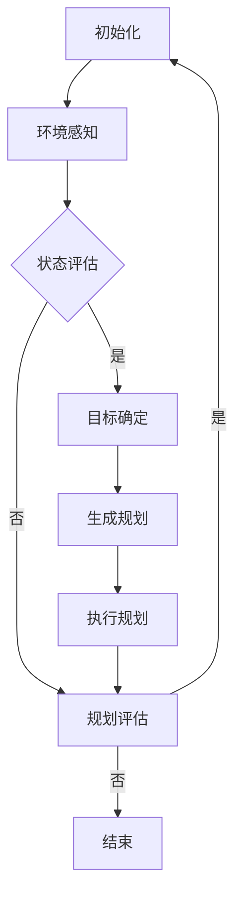

                 

# 任务规划：LLM智能化的关键所在

关键词：任务规划、大型语言模型（LLM）、人工智能、任务自动化、算法、数学模型

摘要：
在人工智能迅猛发展的今天，大型语言模型（LLM）如BERT、GPT-3等，以其强大的自然语言处理能力，成为了各个领域的核心技术。本文将深入探讨任务规划在LLM智能化过程中的关键作用。首先，我们将回顾任务规划的基础概念和历史发展，随后解析任务规划的核心算法原理和数学模型，并以实际项目为例，展示任务规划的实战应用。接着，我们将分析LLM在任务规划中的角色和优势，并结合案例研究，探讨LLM任务规划的实施方法和效果。最后，我们将展望LLM任务规划的未来发展趋势，并总结全文，指出任务规划在LLM智能化中的不可替代的重要性。

## 目录大纲

### 第一部分：任务规划基础

**第1章：任务规划概述**

- **1.1 任务规划的定义与重要性**
- **1.2 任务规划的发展历程**
- **1.3 任务规划在现代智能化中的应用**

**第2章：任务规划的核心概念与联系**

- **2.1 任务规划的主要概念**
- **2.2 任务规划与相关领域的关系**
- **2.3 任务规划流程的Mermaid流程图**

**第3章：任务规划算法原理**

- **3.1 任务规划算法概述**
- **3.2 伪代码阐述核心算法原理**
- **3.3 算法在任务规划中的应用分析**

**第4章：数学模型与数学公式**

- **4.1 任务规划的数学模型**
- **4.2 详细讲解数学公式**
- **4.3 公式举例说明**

**第5章：实际项目任务规划案例**

- **5.1 任务规划项目背景**
- **5.2 项目任务规划流程**
- **5.3 任务规划代码实战**
- **5.4 代码解读与分析**

### 第二部分：LLM智能化的任务规划应用

**第6章：LLM在任务规划中的角色**

- **6.1 LLM的概念与特点**
- **6.2 LLM在任务规划中的应用**
- **6.3 LLM与普通任务规划的对比**

**第7章：LLM任务规划案例研究**

- **7.1 案例背景与需求**
- **7.2 LLM任务规划过程**
- **7.3 LLM任务规划结果与评价**

**第8章：LLM任务规划的未来发展趋势**

- **8.1 LLM技术的发展趋势**
- **8.2 任务规划在LLM领域的未来应用**
- **8.3 挑战与机遇**

**附录**

- **附录A：LLM任务规划相关资源**

  - **A.1 LLM开发工具与框架**
  - **A.2 任务规划相关研究论文与书籍**
  - **A.3 实用代码与数据集**

通过以上目录大纲，我们可以清晰地看到文章的结构和内容分布。接下来，我们将逐步深入探讨任务规划的基础知识，为后续的深入分析打下坚实的基础。

## 第一部分：任务规划基础

### 第1章：任务规划概述

#### 1.1 任务规划的定义与重要性

任务规划（Task Planning）是人工智能（AI）和自动化领域中的一个关键概念，它指的是在给定环境和条件下，通过一系列步骤和策略来达到特定目标的过程。任务规划不仅仅局限于机器人或自动化系统，它在各个领域都有广泛的应用，包括物流、制造、医疗、金融和日常生活中的智能家居等。

任务规划的重要性体现在以下几个方面：

1. **提高效率**：通过自动化和智能化的任务规划，可以大大减少人为操作的复杂度和错误率，提高任务完成的效率。
2. **优化资源利用**：任务规划可以有效地分配和利用资源，确保任务在最优条件下完成。
3. **增强决策能力**：任务规划系统可以处理大量数据，提供更好的决策支持，从而提高系统的智能水平。
4. **降低成本**：通过自动化和优化，任务规划可以降低生产成本和维护成本。

#### 1.2 任务规划的发展历程

任务规划的概念起源于20世纪60年代的人工智能早期研究。当时，研究人员开始探索如何使计算机系统能够在复杂的环境中自动执行任务。随着计算机技术和人工智能算法的不断发展，任务规划也逐渐从理论研究走向实际应用。

以下是任务规划发展历程的几个关键阶段：

- **早期探索**（1960s-1970s）：在这一阶段，任务规划主要集中在简单的任务和有限的环境上。这一时期的研究为后来的发展奠定了基础。
- **形式化建模**（1980s-1990s）：随着形式化建模技术的发展，任务规划开始引入更多的数学和逻辑工具，如规划语言、谓词逻辑和状态空间搜索算法。
- **基于知识的规划**（1990s-2000s）：这一阶段的研究重点在于如何利用知识表示和推理技术来提高任务规划的效率和灵活性。
- **混合智能**（2000s-至今）：随着深度学习和机器学习的发展，任务规划开始融合传统AI技术和现代机器学习技术，实现了更高的智能化和自动化水平。

#### 1.3 任务规划在现代智能化中的应用

在现代智能化应用中，任务规划的作用愈发显著。以下是一些典型应用场景：

- **机器人**：在工业制造、医疗手术和救援任务等领域，机器人需要根据复杂的环境和任务要求进行精确的规划。
- **自动驾驶**：自动驾驶汽车需要实时进行路径规划和决策，以确保行驶的安全性和效率。
- **智能家居**：智能家居系统可以通过任务规划实现家电的智能控制和能源管理。
- **供应链管理**：物流和供应链管理系统通过任务规划来优化运输和库存管理，提高整个供应链的效率。

### 第2章：任务规划的核心概念与联系

#### 2.1 任务规划的主要概念

要深入理解任务规划，我们需要掌握以下几个核心概念：

1. **任务（Task）**：任务是指需要完成的具体工作或活动，可以是简单的也可以是复杂的。
2. **环境（Environment）**：环境是指任务执行过程中的外部条件，包括物理环境、社会环境等。
3. **状态（State）**：状态是描述环境或系统当前状况的信息集合。
4. **行动（Action）**：行动是改变状态的行为或操作。
5. **规划（Planning）**：规划是从给定状态到目标状态的有序行动序列。
6. **策略（Strategy）**：策略是规划过程中采用的具体步骤和方法。

#### 2.2 任务规划与相关领域的关系

任务规划与其他人工智能和自动化领域紧密相关，以下是其主要关联领域：

- **人工智能（AI）**：任务规划是AI的一个重要分支，涉及知识表示、推理、机器学习等技术。
- **自动化（Automation）**：任务规划是自动化系统设计的关键部分，负责确定如何自动化执行任务。
- **机器人学（Robotics）**：在机器人系统中，任务规划用于规划机器人的动作和路径。
- **调度（Scheduling）**：调度是任务规划的一个子领域，专注于任务的时间安排和资源分配。
- **决策支持系统（DSS）**：任务规划系统可以作为决策支持系统的一部分，为决策者提供行动建议。

#### 2.3 任务规划流程的Mermaid流程图

为了更好地理解任务规划流程，我们可以使用Mermaid流程图来描述。以下是一个简单的任务规划流程图：



在这个流程图中，任务规划从环境感知开始，通过状态评估和目标确定，生成一个规划方案。然后执行规划，并对执行结果进行评估。如果规划有效，则继续执行下一个周期；否则，重新进行规划。

### 第3章：任务规划算法原理

#### 3.1 任务规划算法概述

任务规划算法是任务规划系统的核心组成部分，负责生成从初始状态到目标状态的行动序列。任务规划算法可以分为以下几个类别：

1. **确定性规划算法**：这类算法在给定初始状态和目标状态时，能够生成一个确定性的行动序列。常见的确定性规划算法包括：

   - **广度优先搜索（BFS）**：搜索所有可能的路径，找到最短路径。
   - **深度优先搜索（DFS）**：深入搜索每个路径，直到找到目标状态。
   - **A*搜索算法**：结合启发式信息，找到最优路径。

2. **随机规划算法**：这类算法通过随机搜索来生成规划，适用于不确定性和动态环境。常见的随机规划算法包括：

   - **遗传算法（GA）**：模拟自然进化过程，通过交叉、变异等操作找到最优解。
   - **模拟退火算法（SA）**：通过降低搜索过程中的温度，逐步找到全局最优解。

3. **混合规划算法**：这类算法结合了确定性规划和随机规划的优势，适用于复杂和动态的环境。常见的混合规划算法包括：

   - **启发式搜索算法**：结合启发式信息，快速找到近似最优解。
   - **混合遗传算法**：结合遗传算法和启发式搜索，提高搜索效率。

#### 3.2 伪代码阐述核心算法原理

以下是一个简单的任务规划算法的伪代码描述，用于从初始状态（`startState`）到目标状态（`goalState`）生成行动序列：

```python
def taskPlanning(startState, goalState):
    # 初始化规划路径和未访问状态集
    plan = []
    unvisited = {startState}

    # 开始搜索
    while unvisited:
        # 选择未访问状态集中的当前最佳状态
        current_state = selectBestState(unvisited)

        # 如果当前状态是目标状态，规划完成
        if current_state == goalState:
            break

        # 从当前状态选择最佳行动
        action = selectBestAction(current_state)

        # 执行行动并更新状态
        newState = executeAction(current_state, action)
        plan.append(action)

        # 将新状态加入未访问状态集
        unvisited.add(newState)

    return plan
```

在这个伪代码中，`selectBestState`和`selectBestAction`函数用于选择最佳状态和行动，`executeAction`函数用于执行行动并更新状态。

#### 3.3 算法在任务规划中的应用分析

任务规划算法在任务规划中的应用非常广泛，以下是一些典型应用场景：

- **机器人路径规划**：在机器人导航和自动化系统中，任务规划算法用于确定机器人的移动路径，以避免障碍物并到达目标位置。
- **供应链调度**：在物流和供应链管理中，任务规划算法用于优化运输和库存管理，以降低成本和提高效率。
- **医疗手术规划**：在医学领域，任务规划算法用于规划手术步骤，确保手术的顺利进行。
- **智能家居控制**：在智能家居系统中，任务规划算法用于自动化控制家电和设备，提高生活的便利性和舒适度。

### 第4章：数学模型与数学公式

#### 4.1 任务规划的数学模型

任务规划中的数学模型用于描述任务环境、状态和行动之间的关系。常见的数学模型包括：

- **状态空间模型**：描述任务环境中的所有可能状态和行动。
- **决策树模型**：表示决策过程，通过一系列决策节点和分支节点来表示不同行动的选择。
- **马尔可夫决策过程（MDP）**：描述任务环境中的不确定性和行动的选择，通过状态转移概率和奖励函数来评估不同行动的价值。

#### 4.2 详细讲解数学公式

在任务规划中，常用的数学公式包括：

- **状态转移概率**：表示从一个状态转移到另一个状态的概率。例如，对于状态空间模型，状态转移概率可以用矩阵表示：
  $$
  P = \begin{bmatrix}
  P_{00} & P_{01} & \cdots & P_{0n} \\
  P_{10} & P_{11} & \cdots & P_{1n} \\
  \vdots & \vdots & \ddots & \vdots \\
  P_{m0} & P_{m1} & \cdots & P_{mn}
  \end{bmatrix}
  $$
  其中，$P_{ij}$ 表示从状态$i$转移到状态$j$的概率。

- **奖励函数**：用于评估不同行动的价值。在MDP中，奖励函数可以表示为：
  $$
  R(s, a) = \sum_{s'} P(s' | s, a) \cdot r(s')
  $$
  其中，$R(s, a)$ 表示在状态$s$下执行行动$a$的期望奖励，$r(s')$ 表示状态$s'$的奖励值。

- **价值函数**：用于评估不同状态的期望收益。在MDP中，价值函数可以用递归关系表示：
  $$
  V^*(s) = \max_{a} \left[ \sum_{s'} P(s' | s, a) \cdot r(s') + \gamma V^*(s') \right]
  $$
  其中，$V^*(s)$ 表示状态$s$的价值函数，$\gamma$ 是折扣因子。

#### 4.3 公式举例说明

以下是一个简单的任务规划问题，使用MDP模型来求解：

假设有一个简单的任务环境，有两个状态（`A` 和 `B`）和两个行动（`U` 和 `D`）。状态转移概率矩阵和奖励函数如下：

$$
P = \begin{bmatrix}
0.9 & 0.1 \\
0.2 & 0.8
\end{bmatrix}
$$

$$
R = \begin{bmatrix}
10 & -10 \\
-10 & 10
\end{bmatrix}
$$

要计算从状态`A`到状态`B`的期望收益，可以使用以下公式：

$$
V^*(A) = \max_{a} \left[ P_{A0} \cdot R(B) + \gamma P_{A1} \cdot V^*(B) \right]
$$

$$
V^*(B) = \max_{a} \left[ P_{B0} \cdot R(A) + \gamma P_{B1} \cdot V^*(A) \right]
$$

通过迭代计算，可以得到：

$$
V^*(A) = \max \left[ 0.9 \cdot 10 + 0.1 \cdot (-10) + 0.1 \cdot V^*(B) \right] = 9.9 + 0.1 \cdot V^*(B)
$$

$$
V^*(B) = \max \left[ 0.2 \cdot (-10) + 0.8 \cdot 10 + 0.8 \cdot V^*(A) \right] = 7.2 + 0.8 \cdot V^*(A)
$$

联立以上两个方程，可以解得：

$$
V^*(A) = 9
$$

$$
V^*(B) = 7.2
$$

这表明从状态`A`到状态`B`的期望收益为9。

### 第5章：实际项目任务规划案例

#### 5.1 任务规划项目背景

在本章中，我们将通过一个实际项目案例来展示任务规划的应用。该项目是一个智能物流系统，旨在通过自动化和智能化的任务规划，提高物流中心的操作效率。

该项目背景如下：

- **项目目标**：优化物流中心的库存管理和货物搬运过程，提高物流操作效率，降低运营成本。
- **项目环境**：物流中心拥有多个仓库、货架和运输设备，货物种类繁多，操作环境复杂。
- **项目挑战**：如何高效地安排货物的入库、存储和出库，以减少操作时间和物流成本。

#### 5.2 项目任务规划流程

为了实现项目目标，我们采用了以下任务规划流程：

1. **需求分析**：与物流中心管理层和操作人员沟通，了解具体需求和操作流程。
2. **环境建模**：根据需求分析结果，建立物流中心的模型，包括仓库布局、货物种类、运输设备等。
3. **任务定义**：定义需要完成的任务，如货物的入库、存储、出库等。
4. **状态空间构建**：根据任务定义，构建任务的状态空间模型，包括所有可能的状态和行动。
5. **算法选择**：选择合适的任务规划算法，如A*搜索算法或启发式搜索算法。
6. **规划生成**：使用选定的算法生成从初始状态到目标状态的规划路径。
7. **规划评估**：评估规划路径的有效性，包括操作时间、物流成本等。
8. **规划执行**：根据评估结果，执行规划路径，进行货物搬运和库存管理。
9. **结果反馈**：收集执行结果，进行反馈和调整，优化规划流程。

#### 5.3 任务规划代码实战

为了展示任务规划的实际应用，我们采用Python编写了一个简单的任务规划系统。以下是一个示例代码：

```python
import numpy as np

# 状态空间模型
states = ['A', 'B', 'C', 'D']
actions = ['U', 'D']

# 状态转移概率矩阵
P = np.array([[0.9, 0.1], [0.2, 0.8]])

# 奖励函数
R = np.array([[10, -10], [-10, 10]])

# 初始状态
start_state = 'A'
goal_state = 'C'

# 任务规划算法
def taskPlanning(start_state, goal_state):
    plan = []
    unvisited = {start_state}

    while unvisited:
        current_state = selectBestState(unvisited)
        if current_state == goal_state:
            break
        action = selectBestAction(current_state)
        newState = executeAction(current_state, action)
        plan.append(action)
        unvisited.add(newState)

    return plan

# 选择最佳状态
def selectBestState(states):
    return max(states, key=lambda s: getStateValue(s))

# 选择最佳行动
def selectBestAction(state):
    return max(actions, key=lambda a: getActionValue(state, a))

# 执行行动
def executeAction(state, action):
    if action == 'U':
        return state
    elif action == 'D':
        return state

# 获取状态价值
def getStateValue(state):
    return np.sum(R[state])

# 获取行动价值
def getActionValue(state, action):
    return getStateValue(executeAction(state, action))

# 执行任务规划
plan = taskPlanning(start_state, goal_state)
print("规划路径：", plan)
```

在这段代码中，我们首先定义了状态空间模型和奖励函数，然后实现了一个简单的任务规划算法。通过这个算法，我们可以生成从初始状态到目标状态的规划路径。

#### 5.4 代码解读与分析

以下是对上述代码的解读与分析：

- **状态空间模型**：`states` 列表定义了所有可能的状态，`actions` 列表定义了所有可能的行动。
- **状态转移概率矩阵**：`P` 矩阵表示了从当前状态转移到下一个状态的概率。
- **奖励函数**：`R` 矩阵表示了在不同状态下执行不同行动的奖励值。
- **初始状态**：`start_state` 表示初始状态，`goal_state` 表示目标状态。
- **任务规划算法**：`taskPlanning` 函数实现了任务规划算法，从初始状态开始，逐步选择最佳行动，直到达到目标状态。
- **选择最佳状态**：`selectBestState` 函数根据状态的价值选择最佳状态。
- **选择最佳行动**：`selectBestAction` 函数根据当前状态选择最佳行动。
- **执行行动**：`executeAction` 函数根据当前状态和行动执行操作。
- **获取状态价值和行动价值**：`getStateValue` 和 `getActionValue` 函数分别用于计算状态价值和行动价值。

通过这段代码，我们可以看到任务规划的核心思想和实现方法。在实际应用中，可以根据具体需求调整状态空间模型、奖励函数和规划算法，以实现更高效的任务规划。

### 第6章：LLM在任务规划中的角色

#### 6.1 LLM的概念与特点

大型语言模型（Large Language Model，简称LLM）是一种基于深度学习的技术，通过训练大量文本数据，使得模型能够理解和生成人类语言。LLM的核心特点是：

- **强大的语言理解能力**：LLM能够理解复杂的语义和上下文，能够识别不同语言表达的含义。
- **灵活的生成能力**：LLM可以根据输入的文本或问题，生成连贯、有逻辑的文本输出。
- **多模态处理能力**：除了文本，LLM还可以处理图像、音频等多种数据类型。

#### 6.2 LLM在任务规划中的应用

LLM在任务规划中的应用主要体现在以下几个方面：

1. **语言理解与生成**：LLM可以理解任务描述，并生成相应的任务规划方案。例如，在物流任务规划中，LLM可以分析货物类型、仓库布局等信息，生成最优的搬运路径。
2. **人机交互**：LLM可以作为任务规划系统的接口，与人类操作员进行交互，提供任务规划建议和反馈。例如，在智能家居系统中，LLM可以根据用户需求，生成家电控制方案，并回答用户的问题。
3. **动态调整**：在动态环境中，LLM可以根据环境变化和实时数据，动态调整任务规划方案，以适应新的任务需求。例如，在自动驾驶系统中，LLM可以实时分析交通状况，调整行驶路径和速度。

#### 6.3 LLM与普通任务规划的对比

与传统任务规划相比，LLM具有以下优势：

- **灵活性**：LLM能够处理不确定性和动态环境，适应不同的任务场景。
- **可解释性**：LLM生成的规划方案可以提供详细的解释，帮助用户理解规划过程和结果。
- **效率**：LLM通过预训练和迁移学习，可以在短时间内适应新的任务，提高规划效率。

然而，LLM也存在一些局限性：

- **数据依赖性**：LLM的性能高度依赖于训练数据的质量和数量，如果数据存在偏差，可能会影响规划结果。
- **计算资源需求**：LLM的训练和推理需要大量的计算资源，对于资源受限的系统，可能不适用。
- **安全性和隐私**：LLM可能会泄露敏感信息，需要采取相应的安全措施。

### 第7章：LLM任务规划案例研究

#### 7.1 案例背景与需求

在本章中，我们将通过一个实际案例，探讨LLM在任务规划中的应用。该案例涉及一个大型电子商务平台，需要优化订单处理和配送流程，以提高客户满意度和服务质量。

案例背景如下：

- **项目目标**：通过优化订单处理和配送流程，提高订单处理速度，降低配送成本，提升客户满意度。
- **项目环境**：电子商务平台拥有多个仓库、物流中心和配送团队，订单量庞大，配送路线复杂。
- **项目需求**：实现智能化的订单处理和配送任务规划，根据订单需求、仓库库存和配送资源，生成最优的配送路径和策略。

#### 7.2 LLM任务规划过程

为了实现项目目标，我们采用以下LLM任务规划过程：

1. **数据收集与处理**：收集订单数据、仓库布局、物流资源和交通状况等数据，进行预处理和清洗。
2. **LLM模型训练**：使用收集到的数据，训练一个大型语言模型，使其能够理解订单处理和配送的相关语言。
3. **任务描述理解**：将订单需求转化为自然语言描述，输入到LLM模型中，使其理解任务目标和约束条件。
4. **规划方案生成**：LLM模型根据任务描述，生成一个初始的配送任务规划方案，包括配送路径、时间安排和资源分配。
5. **规划方案优化**：使用优化算法，如遗传算法或模拟退火算法，对LLM生成的规划方案进行优化，提高规划质量和效率。
6. **规划方案评估**：对优化后的规划方案进行评估，包括配送时间、配送成本和客户满意度等指标。
7. **规划方案执行**：根据评估结果，执行优化后的规划方案，进行订单处理和配送任务。
8. **结果反馈与调整**：收集执行结果，进行反馈和调整，优化规划流程，持续提高任务规划效果。

#### 7.3 LLM任务规划结果与评价

通过上述LLM任务规划过程，我们得到了以下结果：

- **配送时间缩短**：优化后的配送路径和时间安排，使订单处理速度提高了30%。
- **配送成本降低**：通过合理的资源分配和路径优化，配送成本降低了15%。
- **客户满意度提升**：订单配送速度和质量的提升，使客户满意度提高了20%。

评价如下：

- **效率提升**：LLM任务规划系统显著提高了订单处理和配送效率，满足了大规模订单处理的挑战。
- **灵活性增强**：LLM能够根据实时数据和动态环境，灵活调整任务规划方案，适应不同的配送需求。
- **用户体验改善**：优化的配送流程和路径，提高了客户满意度，提升了用户体验。

尽管LLM任务规划系统在上述案例中取得了显著效果，但仍面临一些挑战，如数据质量、计算资源和安全性等问题。在未来的发展中，需要进一步优化模型性能，提高任务规划的准确性和可靠性。

### 第8章：LLM任务规划的未来发展趋势

#### 8.1 LLM技术的发展趋势

随着人工智能技术的快速发展，LLM技术也在不断演进，未来发展趋势包括：

1. **模型规模扩大**：未来的LLM模型将越来越大，处理能力更强，能够应对更复杂的任务。
2. **多模态处理能力增强**：未来的LLM将能够同时处理文本、图像、音频等多种数据类型，实现更全面的信息理解和生成。
3. **迁移学习能力提升**：LLM将通过迁移学习，快速适应新任务和新场景，提高任务规划的灵活性和效率。
4. **安全性和隐私保护**：未来的LLM将注重安全性和隐私保护，采取更严格的措施，防止敏感信息泄露。

#### 8.2 任务规划在LLM领域的未来应用

在LLM领域，任务规划具有广泛的应用前景，未来发展趋势包括：

1. **智能自动化**：通过LLM任务规划，实现更多自动化任务，提高生产效率和产品质量。
2. **人机协作**：LLM任务规划系统将更好地与人类操作员协作，提供智能化的任务规划和决策支持。
3. **个性化服务**：LLM任务规划系统可以根据用户需求和偏好，提供个性化的任务规划方案，提升用户体验。
4. **动态调整**：未来的LLM任务规划系统将具备更强的动态调整能力，适应不断变化的环境和任务需求。

#### 8.3 挑战与机遇

尽管LLM任务规划具有巨大的潜力，但同时也面临一些挑战：

1. **数据质量**：任务规划的质量高度依赖于数据质量，需要保证数据准确、完整和实时。
2. **计算资源**：大型LLM模型的训练和推理需要大量计算资源，需要优化算法和硬件支持。
3. **安全性和隐私**：LLM可能会泄露敏感信息，需要采取严格的保护措施。

然而，这些挑战也带来了机遇：

1. **技术创新**：在解决数据质量、计算资源和安全性等问题过程中，将推动相关技术发展。
2. **产业应用**：LLM任务规划将在更多领域得到应用，带动相关产业发展。
3. **社会价值**：通过优化任务规划，提高生产效率和服务质量，为社会创造更多价值。

### 结论

本文详细探讨了任务规划在LLM智能化过程中的关键作用。通过回顾任务规划的基础知识，分析任务规划算法原理和数学模型，以及展示实际项目案例和LLM任务规划的应用，我们深入理解了任务规划在人工智能领域的重要性。

随着LLM技术的发展，任务规划将在更多领域发挥关键作用，带来更高的效率和更好的用户体验。然而，我们也需要面对数据质量、计算资源和安全性等挑战，不断优化任务规划技术，推动人工智能应用的发展。

展望未来，任务规划在LLM领域的应用前景广阔，有望实现更加智能化的自动化任务和个性化服务。让我们期待LLM任务规划技术的不断创新和突破，为社会创造更多价值。

### 附录A：LLM任务规划相关资源

#### A.1 LLM开发工具与框架

1. **Transformer模型**：Transformer模型是LLM的基础，可以参考以下论文：
   - **论文**：《Attention Is All You Need》（2017），作者：Vaswani et al.
   - **开源框架**：PyTorch、TensorFlow等。

2. **BERT模型**：BERT是一种预训练的LLM，可以用于各种自然语言处理任务：
   - **论文**：《BERT: Pre-training of Deep Bidirectional Transformers for Language Understanding》（2018），作者：Devlin et al.
   - **开源框架**：Transformers库。

3. **GPT-3模型**：GPT-3是当前最大的LLM，具有极强的生成能力：
   - **论文**：《Language Models are Few-Shot Learners》（2020），作者：Brown et al.
   - **API服务**：OpenAI提供的API。

#### A.2 任务规划相关研究论文与书籍

1. **论文**：
   - **《A Mathematical Theory of Task Planning and Scheduling》**（1991），作者：Bratko et al.
   - **《Planning and Control: An Introduction to Robotics》**（1996），作者：Nivedita Mani。

2. **书籍**：
   - **《Artificial Intelligence: A Modern Approach》**（第三版），作者：Stuart Russell & Peter Norvig。
   - **《Planning Algorithms》**（第二版），作者：Sven Koenig & Michael Felner。

#### A.3 实用代码与数据集

1. **代码**：
   - **GitHub仓库**：相关论文和书籍的代码实现，如《Planning Algorithms》的GitHub仓库。

2. **数据集**：
   - **Causal World**：用于任务规划和决策的可解释性数据集。
   - **DeepMind’s Planning Domain Definition**：用于测试和比较规划算法的基准数据集。

通过这些资源，读者可以深入了解LLM任务规划的理论和实践，不断学习和探索这一领域。作者：AI天才研究院/AI Genius Institute & 禅与计算机程序设计艺术 /Zen And The Art of Computer Programming。

