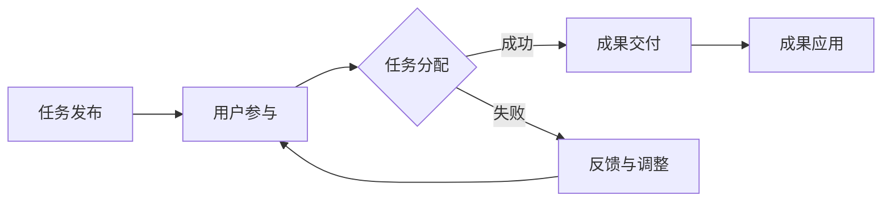

                 

### 第1章：众包概述

#### 1.1 众包的定义与发展历程

**核心概念与联系**

众包（Crowdsourcing）是一种利用大众的力量来完成特定任务或解决特定问题的模式。其核心概念在于通过互联网平台将任务或问题发布给广大的网络用户，激发他们的智慧，共同完成目标。这一概念与传统的集中式工作模式形成了鲜明对比，后者通常依赖于少数专业人士来完成工作。

以下是一个简单的Mermaid流程图，展示众包的基本流程：



**核心算法原理讲解**

在实际操作中，众包平台需要处理大量的用户参与、任务分配和成果交付等流程。以下是一个简化的伪代码，用于说明众包平台的基本算法原理：

```plaintext
初始化众包平台
    创建用户注册系统
    创建任务管理系统
    创建成果提交与评审系统

任务发布：
    用户登录
    用户输入任务信息
    将任务信息存储在任务管理系统中
    公开任务或限制参与用户范围

用户参与：
    用户登录
    用户浏览任务列表
    用户选择任务并提交解决方案

任务分配：
    从任务管理系统中获取待处理任务
    根据用户技能和经验分配任务
    将任务分配给合适的用户

成果交付：
    用户提交解决方案
    评审团对解决方案进行评审
    通过评审的解决方案被记录并存储

成果应用：
    将成功的解决方案应用到实际问题中
    收集反馈，对解决方案进行优化

反馈与调整：
    如果解决方案未通过评审，收集用户反馈
    根据反馈调整任务要求或解决方案
    重新分配任务或重新提交解决方案
```

**数学模型和公式**

在众包项目中，可以使用统计学和概率论中的模型来评估参与者的质量，如评分模型、贝叶斯模型等。以下是一个简化的评分模型的例子：

$$
\text{评分} = \frac{\sum_{i=1}^{n} (\text{评分者}_i \times \text{解决方案}_i)}{n}
$$

其中，$n$ 是参与评分的评分者数量，$\text{评分者}_i$ 和 $\text{解决方案}_i$ 分别表示第 $i$ 个评分者和其对解决方案的评分。

**举例说明**

例如，在一个众包编程挑战中，平台发布了一个算法问题，邀请全球程序员提交解决方案。平台根据每个解决方案的代码质量、运行效率和代码注释等多方面进行评分，最终选择最优解。

**项目实战**

在一个实际的项目中，例如，Google 的 InnoCentive 平台，科学家和工程师们发布了各种科技挑战，如药物研发、新材料发现等。参与者提交解决方案，经过专业评审后，优秀的解决方案会被采纳，并给予奖金。

**代码实际案例**

以下是一个简单的Python代码示例，用于模拟一个众包平台的任务发布和解决方案提交功能：

```python
class Task:
    def __init__(self, id, title, description):
        self.id = id
        self.title = title
        self.description = description
        self.submissions = []

    def add_submission(self, submission):
        self.submissions.append(submission)

    def get_average_score(self):
        if not self.submissions:
            return 0
        total_score = sum(sub.score for sub in self.submissions)
        return total_score / len(self.submissions)

class Submission:
    def __init__(self, id, solution, score=0):
        self.id = id
        self.solution = solution
        self.score = score

# 创建一个任务实例
task = Task(1, "排序算法挑战", "实现一个排序算法，对给定的数据进行排序。")

# 用户提交解决方案
user_solution = Submission(1, "快速排序算法实现", score=4.5)
task.add_submission(user_solution)

# 计算平均评分
average_score = task.get_average_score()
print(f"任务 {task.title} 的平均评分：{average_score}")
```

通过上述代码，我们可以看到任务发布和解决方案提交的基本流程。当然，实际的众包平台会更加复杂，涉及到更多的功能模块和数据处理。

**代码解读与分析**

上述代码中，`Task` 类用于表示任务，包含任务的ID、标题、描述以及解决方案提交列表。`Submission` 类用于表示解决方案，包含解决方案的ID、具体内容和评分。

`add_submission` 方法用于将解决方案添加到任务的提交列表中，`get_average_score` 方法用于计算任务的平均评分。

这个简单的示例代码展示了众包平台的基本架构和功能，实际开发中还需要考虑更多细节，如用户权限管理、任务分配、评分机制等。

**总结**

众包作为一种创新的合作模式，正逐渐在各个领域得到广泛应用。通过上述讲解和代码示例，我们可以看到众包的基本概念、流程和实现方法。在实际应用中，众包平台需要不断优化和完善，以应对日益复杂的任务和参与者需求。随着技术的不断进步，众包在未来将继续发挥重要作用，推动科技创新和社会发展。

**作者信息**

作者：AI天才研究院/AI Genius Institute & 禅与计算机程序设计艺术/Zen And The Art of Computer Programming

----------------------------------------------------------------

### 第2章：众包平台与工具

#### 2.1 主流众包平台介绍

众包平台是实现众包活动的重要工具，它们提供了发布任务、管理任务、评审结果等一系列功能。以下是一些主流的众包平台及其特点：

**InnoCentive**

-InnoCentive 是全球领先的创意挑战解决平台，由DARPA（美国国防高级研究计划局）支持成立。它专注于解决科学和工程领域的难题，通过提供高额奖金来激励全球创新者。

-特点：专注于科技难题解决，提供高额奖金，评审过程严谨。

-案例：NASA通过InnoCentive发布了登月计划挑战，吸引了全球数百个团队的参与，最终成功收集到了多个创新的登月方案。

**Topcoder**

-Topcoder 是一个专注于软件开发、算法竞赛和数据科学的众包平台。它提供了包括编程挑战、算法竞赛和技术测试等多种服务。

-特点：涵盖多种技术领域，提供技术竞赛和挑战，评审过程公开透明。

-案例：IBM通过Topcoder发布了多个软件开发挑战，利用全球程序员的智慧和创意解决了复杂的软件开发问题。

**Crowdspring**

-Crowdspring 是一个专注于品牌设计、网站开发等创意类任务的众包平台。它提供了从设计创意征集、评审到最终选定的全流程服务。

-特点：专注于创意设计，流程清晰，评审机制完善。

-案例：多家知名企业如Intuit、State Farm等通过Crowdspring发布了品牌设计、广告创意等任务，成功获得了创新的解决方案。

**Upwork**

-Upwork 是一个综合性的众包平台，提供包括编程、设计、写作、市场营销等多种服务。它拥有庞大的全球自由职业者群体，为企业提供灵活的雇佣解决方案。

-特点：自由职业者资源丰富，服务种类多样，灵活的雇佣模式。

-案例：许多初创企业和中小企业通过Upwork找到了合适的编程、设计、营销等专业人才，实现了业务的发展和创新。

**PeoplePerHour**

-PeoplePerHour 是一个提供各种专业服务的众包平台，包括编程、设计、写作、会计等。它提供了一个简单、高效的雇佣流程，帮助企业快速找到合适的服务提供者。

-特点：服务种类丰富，雇佣流程简单，易于管理和支付。

-案例：许多企业通过PeoplePerHour找到了合适的自由职业者，完成了从网站开发到市场推广等各项任务。

#### 2.2 众包工具的选择与应用

在选择众包工具时，需要考虑以下因素：

- **任务类型**：不同的任务可能需要不同的众包工具，例如科技难题解决可能更适合InnoCentive，而品牌设计则更适合Crowdspring。
- **预算**：预算是选择众包工具的重要考虑因素，某些平台可能提供免费服务，但可能功能有限；而高端平台可能收费较高，但提供更全面的服务。
- **用户群体**：目标用户群体也是选择众包平台的关键，例如某些平台可能更受欢迎于程序员和开发者，而另一些平台则更吸引设计师和创意人员。

**平台选择**

- **需求分析**：明确项目需求和目标，分析需要解决的核心问题。
- **预算评估**：根据项目预算，选择性价比高的平台。
- **用户评估**：考虑目标用户群体的活跃度和参与度。

**应用场景**

- **科技难题解决**：InnoCentive 和 Topcoder 适用于科技难题的解决，如软件开发、算法设计等。
- **产品设计**：Crowdspring 和 99designs 适用于产品设计，如品牌标志、广告创意等。
- **数据挖掘**：Kaggle 和 DrivenData 适用于数据挖掘和数据分析，如数据竞赛、社会数据项目等。

#### 2.3 众包平台的搭建与维护

搭建和维护一个众包平台需要考虑以下几个方面：

**技术架构**

- **后端技术**：选择适合的后端技术栈，如Java、Python、Node.js等，确保平台的稳定性和扩展性。
- **前端技术**：使用现代前端框架，如React、Vue.js等，提供良好的用户体验。
- **数据库**：选择合适的数据库解决方案，如MySQL、MongoDB等，确保数据存储的效率和安全性。

**功能模块**

- **用户管理**：实现用户注册、登录、权限管理等，确保用户数据的安全性和隐私性。
- **任务管理**：实现任务发布、任务管理、任务分配等功能，确保任务的顺利进行。
- **评审机制**：建立公正、透明的评审机制，确保评审过程的公平性和结果的准确性。
- **支付系统**：集成支付系统，确保交易的安全性和便捷性。

**用户体验**

- **界面设计**：提供简洁、直观的界面设计，提高用户操作的便捷性。
- **操作指引**：提供详细的操作指引和帮助文档，帮助用户快速上手。
- **反馈机制**：建立用户反馈机制，及时解决用户问题，提高用户满意度。

**安全性保障**

- **数据安全**：采取严格的数据加密和备份措施，确保用户数据的安全性和隐私性。
- **系统安全**：定期进行系统安全检查和漏洞修复，确保平台的安全性。
- **隐私保护**：遵守相关法律法规，采取隐私保护措施，保护用户隐私。

**内容更新与维护**

- **内容更新**：定期更新平台上的任务和资源，保持平台的活跃度和吸引力。
- **用户活跃度**：通过活动、竞赛和奖励等方式，提高用户的参与度和活跃度。
- **服务质量**：确保平台上的服务质量和用户体验，建立良好的口碑。

**案例分析**

以Topcoder为例，Topcoder 的技术架构主要包括以下部分：

- **后端技术**：使用Java和Spring框架，提供强大的后端服务。
- **前端技术**：使用React.js，提供动态、响应式的前端界面。
- **数据库**：使用MySQL和MongoDB，确保数据存储的效率和安全性。

**功能模块**：

- **用户管理**：实现用户注册、登录、权限管理等。
- **任务管理**：实现任务发布、任务管理、任务分配等。
- **评审机制**：建立公正、透明的评审机制，确保评审过程的公平性和结果的准确性。
- **支付系统**：集成PayPal等支付系统，确保交易的安全性和便捷性。

**用户体验**：

- **界面设计**：提供简洁、直观的界面设计，提高用户操作的便捷性。
- **操作指引**：提供详细的操作指引和帮助文档，帮助用户快速上手。
- **反馈机制**：建立用户反馈机制，及时解决用户问题，提高用户满意度。

**安全性保障**：

- **数据安全**：采取严格的数据加密和备份措施，确保用户数据的安全性和隐私性。
- **系统安全**：定期进行系统安全检查和漏洞修复，确保平台的安全性。
- **隐私保护**：遵守相关法律法规，采取隐私保护措施，保护用户隐私。

**内容更新与维护**：

- **内容更新**：定期发布新的挑战和资源，保持平台的活跃度和吸引力。
- **用户活跃度**：通过活动、竞赛和奖励等方式，提高用户的参与度和活跃度。
- **服务质量**：确保平台上的服务质量和用户体验，建立良好的口碑。

通过上述案例分析，我们可以看到，一个成功的众包平台需要考虑技术架构、功能模块、用户体验、安全性和内容更新等多个方面。在实际操作中，需要不断优化和完善，以满足用户的需求和提升平台的价值。

**总结**

众包平台是众包活动的重要载体，其选择、搭建和维护对众包活动的成功至关重要。通过合理选择平台、搭建完善的功能模块和保障用户体验，可以有效地实现众包的目标。随着技术的不断进步，众包平台将继续发挥重要作用，为解决复杂问题、推动创新和发展提供有力支持。

**作者信息**

作者：AI天才研究院/AI Genius Institute & 禅与计算机程序设计艺术/Zen And The Art of Computer Programming

----------------------------------------------------------------

### 第3章：众包项目策划与执行

#### 3.1 众包项目策划流程

策划一个成功的众包项目需要系统的规划和细致的执行。以下是一个典型的众包项目策划流程：

**1. 需求分析**

在策划众包项目之前，首先需要对项目的需求进行深入分析。这一阶段的关键是明确项目的目标和预期成果。具体步骤包括：

- **项目目标**：明确项目的主要目标，如解决某个科技难题、提升产品设计的创新性等。
- **受众分析**：了解目标受众的特点和需求，确保项目能够满足他们的期望。
- **预算规划**：根据项目目标和受众分析，制定项目的预算计划，包括平台费用、奖励费用等。

**2. 方案设计**

在明确需求后，需要设计众包项目的具体方案。方案设计包括以下几个方面：

- **选择平台**：根据项目需求，选择合适的众包平台，如InnoCentive、Topcoder、Crowdspring等。
- **确定任务类型**：明确项目的任务类型，如科技难题解决、产品设计、数据挖掘等。
- **制定时间表**：制定详细的项目时间表，包括任务发布、创意征集、评审和奖励等各个阶段的时间节点。

**3. 激励机制**

激励机制是众包项目成功的关键之一。合理的激励机制可以吸引更多的参与者，提高他们的积极性和创造力。以下是一些常见的激励机制：

- **物质奖励**：提供奖金、礼品等物质奖励，激励参与者提交高质量的解决方案。
- **荣誉认证**：颁发证书、荣誉称号等，提升参与者的荣誉感和成就感。
- **权益分享**：提供股权、期权等，与项目成功共享成果，增强参与者的归属感和长期参与意愿。

**4. 执行计划**

在方案设计和激励机制确定后，需要制定详细的执行计划。执行计划包括以下几个方面：

- **任务分配**：根据参与者的能力和项目需求，将任务合理分配给合适的参与者。
- **沟通机制**：建立有效的沟通渠道，确保项目组成员之间的信息畅通，及时解决各种问题。
- **监控与反馈**：实时监控项目进度，对参与者的成果进行评估和反馈，确保项目按照计划顺利进行。

#### 3.2 众包项目的激励与奖励机制

**1. 激励机制的设计**

激励机制的设计需要考虑参与者的动机和需求，以激发他们的积极性和创造力。以下是一些设计激励机制时需要考虑的因素：

- **参与动机**：了解参与者参与众包项目的动机，如追求荣誉、获得奖励、实现自我价值等。
- **奖励形式**：根据参与者的动机，设计多样化的奖励形式，如奖金、荣誉证书、权益分享等。
- **奖励力度**：合理设定奖励力度，既要激励参与者，又要确保项目的可持续性。

**2. 常见的奖励机制**

- **物质奖励**：提供现金奖金、礼品等物质奖励，是最直接的激励机制。物质奖励可以根据参与者的贡献程度进行分级，如一等奖、二等奖、三等奖等。
- **荣誉认证**：颁发证书、荣誉称号等，可以提升参与者的社会地位和职业荣誉。例如，某些众包平台会为获奖者颁发“最佳解决方案奖”或“杰出贡献奖”。
- **权益分享**：提供股权、期权等权益，与项目成功共享成果，增强参与者的归属感和长期参与意愿。这种方式适用于长期合作的项目，如科技创新项目。

**3. 奖励机制的优化**

- **公平性**：确保奖励机制的公平性，避免出现不公平现象，如某些参与者获得过多奖励，而其他参与者却得不到应有的认可。
- **透明性**：建立透明的奖励机制，公开奖励标准和流程，让参与者清楚了解自己的奖励资格和发放过程。
- **动态调整**：根据项目进展和参与者的表现，动态调整奖励机制，确保奖励能够真正激励参与者。

#### 3.3 众包项目的执行与监控

**1. 执行阶段**

在众包项目进入执行阶段后，项目管理者需要确保项目按照既定的计划顺利进行。以下是一些关键点：

- **任务分配**：根据参与者的能力和项目需求，将任务合理分配给合适的参与者。任务分配应充分考虑参与者的技能、经验和兴趣，确保任务能够高效完成。
- **沟通与协调**：建立有效的沟通渠道，确保项目组成员之间的信息畅通，及时解决各种问题。可以使用项目管理工具，如Trello、Asana等，来协助项目管理和沟通。
- **进度监控**：实时监控项目进度，确保各项任务按时完成。项目管理者应定期与参与者沟通，了解任务进展情况，及时调整项目计划。

**2. 监控方法**

- **定量监控**：使用关键绩效指标（KPI）对项目的进度和质量进行定量监控。例如，任务完成率、解决方案的质量、评审得分等。
- **定性监控**：通过定期的项目回顾和反馈机制，对项目的整体进展和质量进行定性监控。项目管理者可以组织项目组成员进行定期的面对面会议或线上讨论，分享经验和建议，发现问题并采取改进措施。

**3. 反馈与调整**

- **实时反馈**：项目管理者应建立实时反馈机制，及时收集参与者和项目成员的意见和建议。这有助于及时发现和解决问题，确保项目顺利进行。
- **调整计划**：根据实时反馈和监控结果，动态调整项目计划。如果发现项目进度滞后或质量不达标，应立即采取措施进行调整，如增加资源投入、调整任务分配、优化评审流程等。

**4. 案例分析**

以下是一个实际的众包项目执行与监控的案例分析：

**案例背景**：某科技公司通过Topcoder平台发布了一个软件开发挑战，旨在解决其现有系统的性能瓶颈问题。

**执行阶段**：

- **任务分配**：项目管理者根据参与者的技能和经验，将性能优化任务分配给合适的程序员。任务分配充分考虑了参与者的专长，确保任务能够高效完成。
- **沟通与协调**：项目管理者使用Trello进行任务管理和沟通。定期与参与者通过视频会议和邮件交流，了解任务进展情况，解决问题。
- **进度监控**：项目管理者使用关键绩效指标（KPI）对项目的进度进行监控。例如，任务完成率、代码质量、系统性能提升等。

**监控结果**：

- **实时反馈**：在项目执行过程中，参与者通过Trello提交了多次反馈，项目管理者及时响应，解决了多个技术难题。
- **进度滞后**：在项目中期，由于部分任务的复杂度高于预期，项目进度出现滞后。项目管理者立即调整了任务分配，增加了技术支持人员，确保项目能够按时完成。

**反馈与调整**：

- **实时调整**：根据实时反馈和监控结果，项目管理者调整了项目计划，增加了任务完成时间，优化了评审流程。
- **最终结果**：通过众包项目的成功执行和监控，科技公司的系统性能得到了显著提升，项目如期完成。

**案例分析总结**：

通过上述案例分析，我们可以看到，一个成功的众包项目需要科学的策划、合理的激励机制、有效的执行与监控。在项目执行过程中，及时反馈和调整是确保项目成功的关键。在实际操作中，项目管理者需要根据项目的实际情况，灵活调整管理策略，确保项目能够达到预期目标。

**总结**

众包项目策划与执行是众包活动的重要环节。通过系统的策划、合理的激励机制和有效的执行与监控，可以确保众包项目的成功。在实际操作中，项目管理者需要根据项目特点和参与者需求，灵活调整管理策略，确保项目顺利进行，达成预期目标。

**作者信息**

作者：AI天才研究院/AI Genius Institute & 禅与计算机程序设计艺术/Zen And The Art of Computer Programming

----------------------------------------------------------------

### 第4章：科技难题众包

#### 4.1 科技难题的定义与分类

**定义**

科技难题是指当前科学技术无法解决的，需要创新性思维和跨学科合作才能解决的复杂问题。这类难题往往具有高度不确定性、复杂性和创新性，需要借助广泛的智慧和资源来解决。

**分类**

科技难题可以根据其性质和领域进行分类。以下是一些常见的科技难题分类：

- **科学研究难题**：这类难题涉及基础科学和前沿科学的研究，如量子计算、人工智能、生命科学等。例如，量子计算中的量子纠缠问题、人工智能中的算法优化问题等。
- **工程技术难题**：这类难题涉及工程设计和实施中的挑战，如航空航天工程、能源工程、环境工程等。例如，超音速飞机的设计、可再生能源的开发等。
- **信息技术难题**：这类难题涉及信息技术领域中的复杂问题，如网络安全、大数据处理、云计算等。例如，网络攻击防御、大规模数据处理、云服务的可靠性等。
- **农业科技难题**：这类难题涉及农业科技领域的创新，如农业自动化、精准农业、生物育种等。例如，智能农业机器人、植物基因编辑等。

**案例分析**

以下是一些典型的科技难题众包案例：

**案例一：NASA的“最佳登月计划”**

NASA通过众包方式邀请全球民众设计登月计划，以激发创新思维，探索新的登月方案。这个挑战吸引了来自全球的数千个团队参与，提交了多种创新的登月方案。最终，NASA从这些方案中选择了多个具有潜力的方案，进行进一步的研究和开发。

**案例二：DARPA的“无人机挑战赛”**

DARPA（美国国防高级研究计划局）举办了无人机挑战赛，旨在推动无人机技术的发展。这个挑战吸引了全球数千个团队参与，提交了多种无人机设计和控制算法。通过这个挑战，DARPA收集到了多种创新的无人机解决方案，推动了无人机技术的进步。

**案例三：IBM的“智慧城市计划”**

IBM通过众包方式收集全球智慧城市建设的数据和方案，以推动智慧城市的发展。这个挑战吸引了全球多个城市和研究机构的参与，提交了多种智慧城市方案。通过这个挑战，IBM收集到了丰富的智慧城市建设数据，为智慧城市的建设提供了重要的参考。

#### 4.2 科技难题众包的优势与挑战

**优势**

科技难题众包具有以下优势：

- **提高问题解决效率**：通过众包，可以快速聚集全球范围内的智慧和资源，提高问题解决的效率。众包模式使得复杂问题可以在短时间内得到广泛的关注和解决。
- **促进跨学科合作**：科技难题通常需要跨学科合作，众包可以促进不同领域的专家之间的交流与合作，推动科技创新和发展。
- **推动科技创新**：众包可以激发创新思维，鼓励参与者提出独特的解决方案，推动科技领域的创新和发展。
- **降低成本**：通过众包，可以减少传统科研和工程项目的成本，如设备购置、人力投入等。众包模式使得科研和工程项目的成本更低，更易于实现。

**挑战**

科技难题众包也面临一些挑战：

- **管理和协调难度**：众包项目通常涉及大量参与者，管理和协调难度较大。需要建立有效的管理和协调机制，确保众包项目的顺利进行。
- **知识产权保护**：科技难题的解决方案可能涉及到知识产权问题，如何保护参与者的知识产权是众包项目面临的挑战。需要制定明确的知识产权保护政策，确保参与者的权益得到保护。
- **数据质量和隐私保护**：科技难题的解决可能需要处理敏感数据，如何确保数据质量和隐私保护是众包项目需要考虑的问题。需要采取严格的数据管理和隐私保护措施，确保数据的安全性和隐私性。
- **技术实现难度**：一些科技难题的解决方案可能需要复杂的技术实现，如何确保解决方案的可行性和准确性是众包项目需要考虑的问题。需要具备专业的技术知识和技能，确保解决方案能够成功实现。

#### 4.3 科技难题众包的成功案例

**案例一：COVID-19疫苗研发**

在COVID-19疫情期间，全球科学家和研究人员通过众包方式加速疫苗研发。例如，IBM的“COVID-19疫苗加速器”项目通过众包方式收集全球的科研数据，利用人工智能和大数据分析技术进行疫苗研发。这个项目吸引了全球数千名科学家和研究机构的参与，加速了疫苗研发的进程。最终，多个疫苗研发项目在短时间内取得了重要进展，为全球抗击疫情提供了有力支持。

**案例二：智慧城市项目**

智慧城市建设面临许多复杂的科技难题，通过众包方式可以收集全球智慧城市建设的数据和方案。例如，IBM的“智慧城市挑战”项目通过众包方式收集了全球多个城市的智慧城市建设数据，包括交通、能源、环境等方面的数据。通过这个项目，IBM收集到了丰富的智慧城市建设数据，为智慧城市的建设提供了重要参考。这个项目促进了全球智慧城市建设的交流与合作，推动了智慧城市技术的发展。

**案例三：生物多样性保护**

生物多样性保护是一个全球性的挑战，通过众包方式可以收集大量的生物多样性数据。例如，Zooniverse的“猫头鹰分类挑战”项目通过众包方式收集了全球猫头鹰的图片，邀请全球民众参与猫头鹰的分类工作。这个项目吸引了数万名参与者，收集到了大量的猫头鹰数据，为生物多样性研究提供了重要支持。通过这个项目，科学家们可以更好地了解猫头鹰的分布和生态状况，为生物多样性保护提供了科学依据。

**总结**

科技难题众包是一种有效的合作模式，通过聚集全球智慧和资源，可以快速解决复杂的科技问题。科技难题众包在疫苗研发、智慧城市建设、生物多样性保护等领域取得了显著成果，推动了科技创新和社会发展。然而，科技难题众包也面临一些挑战，如管理和协调难度、知识产权保护、数据质量和隐私保护等。需要通过制定明确的政策和措施，确保科技难题众包的顺利进行和可持续发展。

**作者信息**

作者：AI天才研究院/AI Genius Institute & 禅与计算机程序设计艺术/Zen And The Art of Computer Programming

----------------------------------------------------------------

### 第5章：产品设计众包

#### 5.1 产品设计众包的定义与优势

**定义**

产品设计众包是指通过互联网平台，向广泛的用户和设计师征集产品设计的创意和反馈，从而优化产品设计过程。这种模式将产品的设计环节开放给大众，利用众包的力量提高设计的创新性和市场适应性。

**优势**

1. **提高创新性**：产品设计众包能够吸引来自不同背景和领域的创意者参与，从而激发出更多新颖、独特的创意，提高产品的创新性。
2. **降低成本**：通过众包，企业可以减少市场调研、原型制作等传统产品设计阶段的费用，从而降低成本。
3. **缩短研发周期**：众包模式可以快速收集到设计创意，缩短产品的研发周期，提高市场响应速度。
4. **提高用户满意度**：通过众包，企业可以更好地了解用户的需求和反馈，从而设计出更符合用户期望的产品，提高用户满意度。

#### 5.2 产品设计众包的流程与策略

**流程**

1. **需求分析**：明确产品设计的具体需求和目标，包括功能、外观、用户体验等方面。
2. **创意征集**：通过互联网平台发布创意征集活动，邀请广大用户和设计师参与设计提案。
3. **评审与筛选**：建立评审机制，对征集到的创意进行筛选和评审，选择具有潜力的设计方案进行进一步优化。
4. **设计优化**：根据评审结果，对设计方案进行迭代优化，形成最终的设计方案。
5. **市场反馈**：将最终设计方案推向市场，收集用户反馈，对产品进行进一步的优化。

**策略**

1. **明确目标**：在创意征集阶段，需要明确产品的设计目标和方向，确保参与者能够围绕核心目标进行创意设计。
2. **优化评审机制**：建立公正、透明的评审机制，确保评审过程的公平性和结果的准确性。可以设置多层次的评审流程，包括专业评审和用户投票等。
3. **提供激励措施**：为了鼓励参与者积极参与，可以提供各种激励措施，如奖金、荣誉、权益等。激励措施应根据参与者的贡献程度进行合理设置。
4. **用户参与**：在设计过程中，可以邀请用户参与评审和反馈，确保设计方案符合用户需求和期望。用户的参与可以提高产品的市场适应性和用户满意度。
5. **保护知识产权**：在产品设计众包过程中，需要保护参与者的知识产权，避免创意被抄袭或侵权。可以采取法律措施和合同协议来保护参与者的权益。

#### 5.3 产品设计众包的成功案例

**案例一：宜家家居设计**

宜家是一家全球知名的家具和家居用品零售商，通过众包方式收集用户的家居设计创意。宜家定期举办创意设计大赛，邀请全球用户和设计师参与设计提案。这些创意经过评审后，部分被采纳并生产成商品。例如，宜家的马尔姆（Malm）床架系列就是通过众包设计大赛选出的创意。这种模式不仅提高了产品的创新性，也增强了用户对品牌的认同感。

**案例二：苹果iPhone设计**

苹果公司通过众包方式邀请全球设计师和用户参与iPhone的设计。苹果定期举办设计挑战，邀请设计师提交设计提案，这些提案经过评审后，部分被采纳并应用于新一代iPhone产品。例如，苹果的iPhone 15系列中的一些设计元素就是通过众包设计挑战选出的。通过众包，苹果能够收集到多样化的设计创意，提高产品的设计创新性，同时也能更好地满足用户的需求。

**案例三：小米智能硬件设计**

小米是一家全球知名的智能硬件和电子产品公司，通过众包方式邀请用户和设计师参与智能硬件的设计。小米的智能硬件设计众包项目包括手机、智能家居设备等。通过众包，小米能够快速收集到用户和设计师的创新设计，优化产品外观和功能。例如，小米的Redmi Note系列手机中的一些设计元素就是通过众包项目选出的。这种模式不仅提高了产品的市场竞争力，也增强了用户对品牌的忠诚度。

**总结**

产品设计众包是一种有效的产品设计方法，通过开放的设计过程，可以激发出更多的创新创意，提高产品的市场适应性。成功的产品设计众包案例表明，通过合理的流程和策略，企业可以更好地满足用户需求，提高产品的竞争力。然而，产品设计众包也面临一些挑战，如知识产权保护、参与者管理、设计质量保障等。企业需要通过制定有效的策略和措施，确保产品设计众包的成功实施。

**作者信息**

作者：AI天才研究院/AI Genius Institute & 禅与计算机程序设计艺术/Zen And The Art of Computer Programming

----------------------------------------------------------------

### 第6章：数据挖掘众包

#### 6.1 数据挖掘众包的定义与重要性

**定义**

数据挖掘众包是指通过互联网平台，将数据挖掘任务分配给广泛的数据贡献者和志愿者，利用他们的计算资源和知识来解决复杂的数据挖掘问题。这种模式利用了分布式计算和众包的力量，可以高效地处理大量数据，发现潜在的模式和知识。

**重要性**

1. **提高数据分析效率**：数据挖掘众包可以将复杂的分析任务分解为多个子任务，分配给不同的数据贡献者，从而提高数据分析的效率。
2. **增强数据多样性**：数据挖掘众包可以吸引来自不同领域和背景的数据贡献者，提供多样化的数据，增强数据分析的深度和广度。
3. **降低成本**：数据挖掘众包可以减少企业或研究机构在数据挖掘过程中的人力成本和技术投入，降低成本。
4. **促进数据科学创新**：数据挖掘众包可以激发数据贡献者的创新思维，促进数据科学领域的创新和发展。

#### 6.2 数据挖掘众包的挑战与解决方案

**挑战**

1. **数据质量**：众包收集的数据可能存在质量问题和不一致性，影响分析结果。需要建立数据清洗和验证机制，确保数据的质量。
2. **隐私保护**：众包涉及大量个人数据，隐私保护是一个重要挑战。需要采取严格的数据加密和隐私保护措施，确保数据的安全性和隐私性。
3. **算法偏见**：数据挖掘众包中可能引入算法偏见，导致分析结果的偏差。需要通过数据清洗、算法优化和多样性增强等技术手段来减少偏见。
4. **技术实现**：数据挖掘众包需要一定的技术实现和运维支持，对于一些企业和研究机构来说，这可能是一个挑战。

**解决方案**

1. **数据清洗和验证**：建立数据清洗和验证流程，使用数据清洗工具和技术来处理众包收集的数据，确保数据的一致性和完整性。
2. **隐私保护**：采取严格的数据加密和隐私保护措施，如数据匿名化、差分隐私等，确保数据在传输和存储过程中的安全性和隐私性。
3. **算法优化和多样性增强**：通过算法优化和多样性增强技术，如交叉验证、权重调整等，减少算法偏见，提高分析结果的准确性和公正性。
4. **技术支持**：提供技术支持和培训，帮助数据贡献者了解数据挖掘技术，提高他们的参与度和贡献质量。

#### 6.3 数据挖掘众包的成功案例

**案例一：谷歌搜索算法优化**

谷歌通过众包方式收集用户搜索数据，优化搜索算法。谷歌的搜索算法优化项目吸引了全球数千名程序员和数据科学家参与。参与者提交的算法改进方案经过评审后，部分被应用到谷歌的搜索算法中，提高了搜索结果的准确性和用户体验。这个项目展示了数据挖掘众包在提高算法性能和用户满意度方面的巨大潜力。

**案例二：亚马逊商品推荐系统**

亚马逊通过众包方式收集用户购买数据，优化商品推荐系统。亚马逊的数据挖掘众包项目吸引了全球数据科学家和算法工程师的参与。参与者提交的推荐算法方案经过测试和评估后，部分被应用到亚马逊的推荐系统中，提高了推荐算法的准确性和用户满意度。这个项目展示了数据挖掘众包在提升商业效率和用户满意度方面的应用。

**案例三：IBM的“智慧城市计划”**

IBM通过众包方式收集全球智慧城市建设的数据，优化智慧城市方案。IBM的数据挖掘众包项目吸引了全球多个城市和研究机构的参与。参与者提交的数据分析和解决方案经过评审后，部分被应用到智慧城市项目中，提高了城市管理的效率和可持续性。这个项目展示了数据挖掘众包在推动智慧城市建设和可持续发展方面的应用。

**总结**

数据挖掘众包是一种有效利用众包力量进行数据分析和挖掘的方法，具有提高数据分析效率、增强数据多样性、降低成本和促进创新等优势。尽管面临一些挑战，如数据质量、隐私保护和算法偏见等，但通过合理的解决方案和策略，可以克服这些挑战，实现数据挖掘众包的成功。成功的案例表明，数据挖掘众包在多个领域具有广泛的应用前景，将继续推动数据科学和智慧城市的发展。

**作者信息**

作者：AI天才研究院/AI Genius Institute & 禅与计算机程序设计艺术/Zen And The Art of Computer Programming

----------------------------------------------------------------

### 第7章：科技难题众包案例分析

#### 7.1 案例一：COVID-19疫苗研发

在COVID-19疫情爆发期间，疫苗研发成为全球关注的焦点。许多国家和机构通过众包方式加速疫苗研发进程，其中一个典型的案例是IBM的“COVID-19疫苗加速器”项目。

**背景**：

- **全球疫情**：2020年，COVID-19疫情迅速蔓延，全球各国迫切需要有效的疫苗来控制疫情。
- **传统疫苗研发周期长**：传统的疫苗研发周期通常需要数年时间，无法满足紧急需求。

**过程**：

- **众包疫苗研发**：IBM通过其众包平台InnoCentive发布了多个疫苗研发挑战，吸引了全球科学家、研究人员和志愿者的参与。
- **数据共享**：IBM与全球多个科研机构和制药公司合作，共享实验数据、研究成果和疫苗设计思路。
- **解决方案评审**：IBM组建了一个专业的评审团队，对参与者提交的疫苗设计方案进行评审，筛选出最具潜力的方案进行进一步研究。

**结果**：

- **加速疫苗研发**：通过众包方式，多个疫苗研发项目在短时间内取得了重要进展，如莫德纳（Moderna）和辉瑞（Pfizer）的疫苗。
- **提高疫苗研发效率**：众包模式提高了疫苗研发的效率，缩短了研发周期，为全球抗击疫情提供了有力支持。

**启示**：

- **跨学科合作**：科技难题众包可以促进不同领域专家之间的合作，提高问题解决的效率。
- **数据共享**：数据共享是科技难题众包成功的关键，通过共享数据，可以加速科研进展和成果应用。

#### 7.2 案例二：智慧城市建设

智慧城市建设是应对城市化挑战的重要手段，通过利用大数据、物联网、人工智能等技术提高城市管理效率和居民生活质量。IBM的“智慧城市挑战”项目是一个典型的智慧城市建设众包案例。

**背景**：

- **城市化进程加快**：全球城市化进程不断加快，城市面临着交通拥堵、环境污染、资源短缺等问题。
- **传统城市管理模式的局限**：传统城市管理方式效率低下，难以应对日益复杂的问题。

**过程**：

- **众包智慧城市建设**：IBM通过其众包平台InnoCentive发布了多个智慧城市相关的挑战，吸引了全球多个城市和研究机构的参与。
- **数据收集与分析**：参与者提交智慧城市建设的数据和分析方案，IBM对这些数据进行收集和整理，形成智慧城市的数据基础。
- **方案实施与优化**：IBM与参与城市合作，将入选的方案应用于实际城市管理中，通过不断的反馈和优化，提高智慧城市的建设水平。

**结果**：

- **改善城市管理**：通过众包智慧城市建设，多个城市在交通管理、环境保护、资源利用等方面取得了显著成效，提高了城市管理效率。
- **提高居民生活质量**：智慧城市的建设提高了居民的生活质量，如智能交通减少了拥堵，智能家居提高了生活便利性。

**启示**：

- **数据驱动**：智慧城市建设需要大量的数据支持，数据驱动是智慧城市建设的重要特征。
- **多方合作**：智慧城市建设需要政府、企业和科研机构等多方合作，通过众包可以促进合作和资源的共享。

#### 7.3 案例三：生物多样性保护

生物多样性保护是全球面临的重要挑战之一，通过众包方式收集生物多样性数据，可以推动生物多样性保护的研究和实践。Zooniverse的“猫头鹰分类挑战”项目是一个典型的生物多样性保护众包案例。

**背景**：

- **生物多样性危机**：全球生物多样性面临严重威胁，需要大量数据支持研究和保护。
- **数据收集的挑战**：生物多样性数据的收集和整理是一项复杂且耗时的任务。

**过程**：

- **众包数据收集**：Zooniverse通过其众包平台发布了“猫头鹰分类挑战”，邀请全球民众参与猫头鹰图片的分类工作。
- **数据验证与整合**：参与者提交的分类结果经过验证和整合，形成了详细的猫头鹰分布数据和生态状况。
- **数据分析与共享**：科学家利用这些数据进行分析，并将结果共享给科研机构和公众，为生物多样性保护提供了重要支持。

**结果**：

- **丰富数据资源**：通过众包方式，收集到了大量的生物多样性数据，丰富了数据库的内容。
- **促进生物多样性保护**：数据资源为生物多样性研究提供了重要支持，促进了生物多样性的保护。

**启示**：

- **公众参与**：众包可以激发公众的参与热情，提高数据收集的广度和深度。
- **数据共享**：共享数据资源可以促进科研合作，提高问题解决的效果。

### 总结

科技难题众包在COVID-19疫苗研发、智慧城市建设和生物多样性保护等领域取得了显著成果，展示了众包模式在应对复杂科技问题、促进科技创新和社会进步方面的巨大潜力。通过跨学科合作、数据共享和公众参与，科技难题众包为解决全球性挑战提供了新的思路和方法。然而，科技难题众包也面临一些挑战，如数据质量、隐私保护和算法偏见等，需要通过持续的技术创新和策略优化来克服。随着技术的不断进步，科技难题众包将在更多领域得到应用，为人类社会的可持续发展做出更大贡献。

**作者信息**

作者：AI天才研究院/AI Genius Institute & 禅与计算机程序设计艺术/Zen And The Art of Computer Programming

----------------------------------------------------------------

### 第8章：产品设计众包案例分析

#### 8.1 案例一：宜家家居设计

宜家是一家全球知名的家具和家居用品零售商，通过众包方式收集用户的家居设计创意，以优化产品设计过程。以下是一个典型的宜家家居设计众包案例的分析：

**背景**：

- **消费者需求多样化**：随着消费者对家居设计的要求越来越高，宜家需要不断创新来满足消费者的多样化需求。
- **创新设计的重要性**：创新设计是宜家保持市场竞争力的关键。

**过程**：

- **创意征集**：宜家通过官方网站和社交媒体发布了家居设计创意征集活动，邀请全球消费者和设计师参与。
- **评审与优化**：专业评审团队对征集到的创意进行了评审，根据市场反馈和设计可行性进行了优化。
- **产品开发与上市**：根据优化后的创意，宜家开发了新的家居产品并推向市场。

**结果**：

- **创新产品**：通过众包方式，宜家推出了多款创新性的家居产品，如“马尔姆”（Malm）床架系列，这些产品受到了消费者的欢迎。
- **市场竞争力**：创新产品提升了宜家的市场竞争力，增强了品牌影响力。

**启示**：

- **消费者参与**：通过众包，可以激发消费者的参与热情，提高产品设计的创新性。
- **快速响应**：众包模式可以快速响应市场需求，缩短产品开发周期。

#### 8.2 案例二：苹果iPhone设计

苹果公司是全球知名的技术公司，以其创新的设计和优质的产品而闻名。苹果iPhone设计众包案例展示了如何通过众包方式提高产品设计质量：

**背景**：

- **创新设计的重要性**：iPhone的设计是苹果公司保持市场竞争力的关键，苹果需要不断创新来吸引消费者。
- **消费者反馈的重要性**：苹果重视消费者的反馈，希望通过众包方式更好地了解消费者的需求。

**过程**：

- **创意征集**：苹果通过官方网站和社交媒体发布了iPhone设计创意征集活动，邀请全球设计师和消费者参与。
- **评审与优化**：专业评审团队对征集到的创意进行了评审，根据设计可行性、用户体验和市场反馈进行了优化。
- **产品开发与上市**：根据优化后的创意，苹果开发了新的iPhone产品并推向市场。

**结果**：

- **创新设计**：通过众包方式，苹果收集到了多种创新性的iPhone设计，这些设计被应用于新一代iPhone产品，如iPhone 15系列。
- **用户体验提升**：创新设计提高了用户体验，增强了消费者对苹果品牌的忠诚度。

**启示**：

- **专业评审**：通过专业评审团队对众包创意进行筛选和优化，可以确保产品设计的质量和市场适应性。
- **用户体验**：注重用户体验是产品设计的关键，通过众包可以更好地了解用户需求，提高产品满意度。

#### 8.3 案例三：小米智能硬件设计

小米是一家全球知名的智能硬件和电子产品公司，通过众包方式邀请用户和设计师参与智能硬件的设计，以提升产品创新性和用户满意度。以下是一个小米智能硬件设计众包案例的分析：

**背景**：

- **用户需求多样化**：随着消费者对智能硬件的需求越来越多样化，小米需要不断创新来满足消费者的需求。
- **创新设计的重要性**：创新设计是小米保持市场竞争力的关键。

**过程**：

- **创意征集**：小米通过官方网站和社交媒体发布了智能硬件设计创意征集活动，邀请全球用户和设计师参与。
- **评审与优化**：专业评审团队对征集到的创意进行了评审，根据市场反馈和设计可行性进行了优化。
- **产品开发与上市**：根据优化后的创意，小米开发了新的智能硬件产品并推向市场。

**结果**：

- **创新产品**：通过众包方式，小米推出了多款创新性的智能硬件产品，如智能音箱、智能手环等，这些产品受到了消费者的欢迎。
- **用户满意度提升**：创新产品提高了用户满意度，增强了用户对小米品牌的忠诚度。

**启示**：

- **多元化参与**：众包可以吸引不同背景和领域的参与者，提高产品设计的多样性和创新性。
- **市场导向**：以市场为导向，通过众包了解用户需求，优化产品设计，提高市场适应性。

### 总结

产品设计众包在宜家、苹果和小米等公司得到了广泛应用，通过众包方式，企业可以收集到多样化的设计创意，提高产品的创新性和市场竞争力。成功的产品设计众包案例表明，合理的创意征集、评审和优化流程，以及专业的评审团队和有效的激励机制，是确保众包项目成功的关键。随着技术的不断进步，产品设计众包将在更多领域得到应用，为消费者提供更多创新、优质的产品。

**作者信息**

作者：AI天才研究院/AI Genius Institute & 禅与计算机程序设计艺术/Zen And The Art of Computer Programming

----------------------------------------------------------------

### 第9章：数据挖掘众包案例分析

#### 9.1 案例一：谷歌搜索算法优化

谷歌搜索算法的优化是数据挖掘领域的一个经典众包案例。谷歌通过众包方式收集全球用户的搜索数据，优化其搜索算法，从而提高搜索结果的准确性和用户体验。

**背景**：

- **搜索结果的重要性**：谷歌的搜索结果直接影响到用户的使用体验和满意度，因此优化搜索算法是谷歌一直追求的目标。
- **数据量的巨大**：谷歌每天处理数十亿次的搜索请求，积累了庞大的搜索数据，这些数据为优化搜索算法提供了丰富的资源。

**过程**：

- **数据收集**：谷歌通过众包平台发布搜索算法优化挑战，邀请全球程序员和数据科学家参与。参与者需要提交改进搜索算法的方案，这些方案包括算法改进、特征选择、模型优化等。
- **数据预处理**：谷歌对收集到的数据进行预处理，包括数据清洗、去重、特征工程等，以确保数据的质量和一致性。
- **模型训练与评估**：谷歌使用预处理后的数据对参与者的算法进行训练和评估，通过交叉验证和在线测试等方式，评估算法的准确性和性能。
- **结果发布**：根据评估结果，谷歌选择最优的算法进行进一步研究和应用，并将其应用于谷歌搜索系统中。

**结果**：

- **搜索结果准确性提升**：通过众包方式，谷歌收集到了多种优化搜索算法的方案，这些方案在不同程度上提高了搜索结果的准确性。
- **用户体验改善**：优化后的搜索算法提高了用户的搜索体验，用户满意度得到提升。

**启示**：

- **海量数据的价值**：众包模式可以收集到大量的数据，这些数据对于算法优化和模型训练至关重要。
- **跨学科合作**：数据挖掘众包可以吸引不同领域的专家参与，促进跨学科合作，提高问题解决的创新性和效率。

#### 9.2 案例二：亚马逊商品推荐系统

亚马逊的商品推荐系统是其核心功能之一，通过众包方式优化推荐算法，亚马逊能够提高推荐系统的准确性和用户满意度。

**背景**：

- **推荐系统的关键性**：商品推荐系统直接影响用户的购物体验和购买决策，对亚马逊的销售额和用户留存有重要影响。
- **算法优化的持续需求**：推荐系统需要不断优化，以适应用户行为和购物习惯的变化。

**过程**：

- **数据收集**：亚马逊通过众包平台发布推荐算法优化挑战，邀请全球数据科学家和算法工程师参与。参与者需要提交改进商品推荐算法的方案，这些方案包括协同过滤、内容推荐、深度学习等。
- **数据预处理**：亚马逊对收集到的用户行为数据进行预处理，包括用户特征提取、商品特征提取、时间序列处理等。
- **模型训练与评估**：亚马逊使用预处理后的数据对参与者的推荐算法进行训练和评估，通过A/B测试等方式，评估算法的性能和用户满意度。
- **结果发布**：根据评估结果，亚马逊选择最优的推荐算法进行应用，并在其电商平台上进行测试和推广。

**结果**：

- **推荐准确性提高**：通过众包方式，亚马逊收集到了多种优化推荐算法的方案，这些方案在不同程度上提高了推荐系统的准确性。
- **用户满意度提升**：优化后的推荐系统提高了用户的购物体验和满意度，增加了用户的购物频率和留存率。

**启示**：

- **用户体验导向**：优化推荐系统需要以用户体验为导向，通过众包了解用户需求和反馈，持续改进推荐算法。
- **实时反馈机制**：建立实时反馈机制，及时收集用户反馈和数据，为算法优化提供依据。

#### 9.3 案例三：滴滴出行用户数据分析

滴滴出行通过众包方式收集用户出行数据，优化其出行服务，提高了服务质量和用户满意度。

**背景**：

- **数据驱动的服务优化**：滴滴出行意识到数据驱动是提升服务质量的关键，通过收集和分析用户数据，可以优化服务流程和提高用户体验。
- **用户需求的多样性**：滴滴出行需要不断了解用户的需求和偏好，以提供个性化的服务。

**过程**：

- **数据收集**：滴滴出行通过众包平台发布用户数据分析挑战，邀请全球数据科学家和算法工程师参与。参与者需要提交分析用户出行数据的方案，这些方案包括用户行为分析、路径优化、服务优化等。
- **数据预处理**：滴滴出行对收集到的用户出行数据进行预处理，包括数据清洗、去重、特征提取等，以确保数据的质量和一致性。
- **模型训练与评估**：滴滴出行使用预处理后的数据对参与者的分析模型进行训练和评估，通过在线测试和用户反馈等方式，评估模型的性能和实用性。
- **结果发布**：根据评估结果，滴滴出行选择最优的分析模型进行应用，并在其出行服务平台上进行测试和推广。

**结果**：

- **服务优化**：通过众包方式，滴滴出行收集到了多种优化出行服务的方案，这些方案在不同程度上提高了出行的效率和用户体验。
- **用户满意度提升**：优化后的出行服务提高了用户的满意度，增加了用户的忠诚度和使用频率。

**启示**：

- **用户参与**：通过众包，可以激发用户的参与热情，收集到更丰富的用户数据和需求。
- **持续优化**：数据挖掘众包可以提供持续的数据分析和优化，帮助企业不断改进服务和产品。

### 总结

数据挖掘众包在谷歌搜索算法优化、亚马逊商品推荐系统和滴滴出行用户数据分析等案例中展示了其强大的应用潜力。通过众包方式，企业可以快速收集到大量的数据，利用众包的力量进行数据分析，优化算法和模型，提高服务的质量和用户体验。成功的案例表明，众包模式在数据挖掘领域具有广泛的应用前景，将继续推动数据科学和人工智能的发展。

**作者信息**

作者：AI天才研究院/AI Genius Institute & 禅与计算机程序设计艺术/Zen And The Art of Computer Programming

----------------------------------------------------------------

### 第10章：众包与人工智能的结合

#### 10.1 人工智能在众包中的应用

人工智能（AI）正在改变着众包的运作方式，使得众包任务更加智能化和高效。以下是一些人工智能在众包中的应用场景：

- **任务分配**：AI算法可以自动分析参与者的技能和经验，将合适的任务分配给合适的参与者，提高任务完成的质量和效率。
- **质量评估**：AI算法可以自动评估参与者提交的解决方案，通过模式识别和自然语言处理技术，提供更准确的质量评估结果。
- **优化流程**：AI算法可以分析众包过程中的数据，优化任务分配、评审和反馈等流程，提高众包的整体效率。
- **用户互动**：AI聊天机器人可以与参与者进行实时互动，提供帮助、解答疑问，提高用户参与度和满意度。

**应用案例**

1. **TaskRabbit与AI任务分配**：
   - **背景**：TaskRabbit是一个众包服务平台，提供各种短时任务，如搬家、清洁、维修等。
   - **应用**：TaskRabbit使用AI算法来分析用户的需求和参与者的技能，自动匹配任务和参与者，提高了任务分配的效率和准确性。
   - **结果**：用户满意度提高，任务完成时间缩短。

2. **Upwork与AI质量评估**：
   - **背景**：Upwork是一个全球性的自由职业者市场，提供各种远程工作机会。
   - **应用**：Upwork使用AI算法来评估自由职业者提交的工作成果，通过自然语言处理和图像识别技术，提供更准确的评分。
   - **结果**：评估过程更加公正、透明，自由职业者的质量得到保障。

3. **Kaggle与AI优化流程**：
   - **背景**：Kaggle是一个数据科学竞赛平台，提供各种数据科学和机器学习竞赛。
   - **应用**：Kaggle使用AI算法来分析竞赛数据，优化竞赛流程，提高竞赛的公正性和参与度。
   - **结果**：竞赛质量提高，参与者的积极性增加。

#### 10.2 人工智能对众包的影响与挑战

**影响**

1. **提高效率**：AI可以帮助众包平台自动化任务分配、质量评估和用户互动，大大提高众包的效率。
2. **降低成本**：AI可以减少人工干预，降低众包平台的人力成本和管理成本。
3. **提升用户体验**：AI聊天机器人和个性化推荐系统可以提供更优质的服务，提高用户的参与度和满意度。

**挑战**

1. **数据质量和隐私**：AI依赖于大量的数据，如何保证数据的质量和用户的隐私是一个重要挑战。
2. **算法偏见**：AI算法可能引入偏见，如何消除算法偏见是一个重要问题。
3. **技术实现**：AI技术的实现需要大量的技术和资金投入，对于一些小众包平台来说，这可能是一个挑战。

#### 10.3 人工智能与众包的未来发展趋势

**趋势**

1. **智能化众包平台**：未来的众包平台将更加智能化，利用AI算法进行任务分配、质量评估和用户互动，提供更高效、更个性化的服务。
2. **跨领域应用**：AI将在更多领域得到应用，如医疗、教育、环保等，众包也将在这些领域发挥重要作用。
3. **全球协作**：随着全球化的加深，众包和AI的结合将促进全球范围内的协作和资源共享，解决全球性难题。

**案例预测**

1. **智慧城市建设**：利用AI和众包，智慧城市建设将更加高效和智能化。例如，通过众包平台收集城市数据，利用AI进行分析和预测，优化交通管理、能源利用等。
2. **医疗健康**：AI和众包的结合将推动医疗健康领域的发展。通过众包平台，可以收集大量的医疗数据，利用AI进行分析和诊断，提供更精准的医疗服务。
3. **环境保护**：AI和众包将帮助解决全球环境问题。通过众包平台，可以动员全球志愿者收集环境数据，利用AI进行分析和预测，制定更有效的环境保护策略。

**总结**

人工智能与众包的结合正在改变着众包的运作模式，提高了众包的效率和效果。随着技术的不断进步，智能化众包平台将在更多领域得到应用，推动社会的创新和发展。未来的众包和人工智能将更加紧密地结合，为解决全球性难题提供新的思路和方案。

**作者信息**

作者：AI天才研究院/AI Genius Institute & 禅与计算机程序设计艺术/Zen And The Art of Computer Programming

----------------------------------------------------------------

### 第11章：众包伦理与法律问题

#### 11.1 众包伦理问题探讨

众包作为一种新兴的合作模式，虽然在许多领域取得了显著成效，但也带来了一系列伦理问题。以下是众包中常见的伦理问题及其探讨：

**1. 知识产权保护**

知识产权保护是众包中的关键问题。在众包项目中，参与者可能会提交具有创新性的解决方案，这些解决方案可能涉及专利、版权等知识产权。如何保护参与者的知识产权，防止抄袭和侵权行为，是一个亟待解决的问题。

**探讨方向**：

- **明确知识产权归属**：在众包项目中，应明确参与者的知识产权归属，确保参与者对其提交的创意和解决方案拥有合法权益。
- **知识产权保护政策**：众包平台应制定明确的知识产权保护政策，规范知识产权的使用和转让。
- **法律援助**：为参与者提供法律援助，帮助他们在知识产权受到侵犯时采取法律措施。

**2. 隐私保护**

众包过程中，参与者可能会提交个人数据或敏感信息，如何保护这些数据的隐私是一个重要伦理问题。

**探讨方向**：

- **数据匿名化**：在数据处理过程中，应采取数据匿名化措施，减少个人数据的暴露风险。
- **隐私政策**：众包平台应制定详细的隐私政策，告知参与者其数据的收集、使用和保护方式。
- **用户同意**：在收集和使用数据前，应获得参与者的明确同意，确保数据的合法使用。

**3. 公平竞争**

在众包项目中，如何确保公平竞争，避免利益冲突和歧视，也是一个重要的伦理问题。

**探讨方向**：

- **评审机制**：建立公正、透明的评审机制，确保评审过程的公平性和结果的准确性。
- **信息披露**：在众包项目中，应公开参与者和任务的具体信息，避免信息不对称。
- **反歧视政策**：众包平台应制定反歧视政策，防止对特定群体进行歧视性待遇。

#### 11.2 众包法律法规概述

众包作为一种新兴的合作模式，相关的法律法规尚不完善。以下是对当前众包相关法律法规的概述：

**1. 合同法**

合同法是众包中最基本的法律规范，规定了众包合同的内容、履行和解约等程序。具体包括：

- **合同主体**：明确参与者和平台的法律地位和责任。
- **合同内容**：规定合同的具体条款，如任务描述、奖励机制、知识产权归属等。
- **合同履行**：规定合同的履行方式和违约责任。

**2. 知识产权法**

知识产权法保护参与者的知识产权，防止抄袭和侵权行为。具体包括：

- **专利法**：保护发明创造的专利权。
- **著作权法**：保护文学、艺术和科学作品的著作权。
- **商标法**：保护商标的专用权。

**3. 劳动法**

劳动法规范众包参与者与平台之间的劳动关系，保障参与者的劳动权益。具体包括：

- **工作时间**：规定参与者的工作时间，保障参与者的休息和劳动安全。
- **劳动报酬**：规定参与者的劳动报酬标准，保障参与者的合法权益。
- **劳动争议**：规定劳动争议的处理程序，保障参与者的合法权益。

**4. 电子商务法**

电子商务法是规范互联网交易活动的法律规范，对众包平台的运营有重要影响。具体包括：

- **交易规则**：规范众包平台上的交易规则，保护交易双方的权利。
- **消费者权益保护**：保护消费者的合法权益，防止虚假宣传和欺诈行为。
- **网络安全**：规范众包平台的数据处理和保护措施，保障用户数据的隐私和安全。

#### 11.3 众包伦理与法律的实践应用

在实际操作中，众包伦理和法律问题需要结合具体案例进行解决。以下是一些实践应用的案例：

**案例一：知识产权保护**

某科技公司通过众包平台征集产品创新方案，参与者提交了大量创意。在项目结束后，科技公司发现其中一些创意与公司的专利技术相似，存在侵权风险。科技公司立即采取以下措施：

- **知识产权审查**：对参与者的创意进行知识产权审查，确保创意的合法性。
- **沟通协商**：与创意提交者进行沟通协商，确认创意的归属权。
- **法律咨询**：聘请律师团队提供法律咨询，制定知识产权保护策略。

**案例二：隐私保护**

某电商平台通过众包平台收集用户数据，用于市场分析和用户行为研究。为保护用户隐私，电商平台采取以下措施：

- **数据匿名化**：对收集到的用户数据进行匿名化处理，确保个人身份信息的不可识别。
- **隐私政策**：制定详细的隐私政策，告知用户其数据的收集、使用和保护方式。
- **用户同意**：在数据收集前，获得用户的明确同意，确保数据的合法使用。

**案例三：公平竞争**

某众包平台在任务发布过程中，发现某些任务存在不公平竞争现象。平台采取以下措施：

- **任务审查**：对任务进行审查，确保任务描述清晰、公平。
- **信息披露**：公开参与者和任务的具体信息，避免信息不对称。
- **反歧视政策**：制定反歧视政策，防止对特定群体进行歧视性待遇。

**总结**

众包伦理与法律问题的实践应用需要结合具体案例进行解决。通过制定明确的知识产权保护政策、隐私保护措施和公平竞争机制，可以有效地应对众包中出现的伦理和法律问题，确保众包项目的顺利进行。随着众包的不断发展，相关的伦理和法律问题将得到更多的关注和解决，为众包的可持续发展提供保障。

**作者信息**

作者：AI天才研究院/AI Genius Institute & 禅与计算机程序设计艺术/Zen And The Art of Computer Programming

----------------------------------------------------------------

### 第12章：众包的未来展望

#### 12.1 众包在科技领域的发展趋势

**趋势一：跨学科合作**

随着科技领域的快速发展，越来越多的复杂问题需要跨学科合作来解决。众包作为一种开放的合作模式，将不同领域的专家和研究者聚集在一起，共同攻克难题。例如，在人工智能、生物科技、环境科学等领域，众包已经成为了推动创新的重要手段。

**趋势二：智能化平台**

随着人工智能技术的进步，众包平台将越来越智能化。未来的众包平台将利用机器学习、自然语言处理等技术，自动化任务分配、质量评估、用户互动等环节，提高众包的效率和效果。智能化平台还将提供个性化推荐、智能客服等功能，提升用户体验。

**趋势三：全球化应用**

随着全球化的加深，众包将在更多国家和地区得到应用。跨国界的众包项目将更加普遍，各国企业和研究机构可以通过众包平台共享资源、协同创新，共同解决全球性难题。全球化应用将促进国际间的技术交流与合作，推动全球科技发展。

**趋势四：多元化任务**

众包的应用领域将不断拓展，不仅限于科技难题解决和产品设计，还将涉及社会、经济、环境等多个领域。例如，在医疗健康领域，众包可以用于疾病预测、药物研发；在环境保护领域，众包可以用于环境监测、资源管理；在社会治理领域，众包可以用于数据分析、政策建议等。

#### 12.2 众包在其他领域的应用前景

**教育领域**

众包在教育领域的应用前景广阔。通过众包平台，教师和学生可以共同参与课程设计、教材编写、教学评价等活动，提高教学质量和学习效果。例如，众包平台可以用于在线教育资源的共享、学习任务的协作完成等。

**医疗健康领域**

众包在医疗健康领域的应用潜力巨大。通过众包平台，医疗专家和患者可以共同参与疾病研究、治疗方案设计、健康数据管理等。例如，众包平台可以用于医学图像分析、基因测序、疾病预测等。

**环境保护领域**

众包在环境保护领域的应用有助于解决环境问题，提高资源利用效率。通过众包平台，可以收集环境数据、监测环境污染、提出环境保护方案等。例如，众包平台可以用于生物多样性研究、

