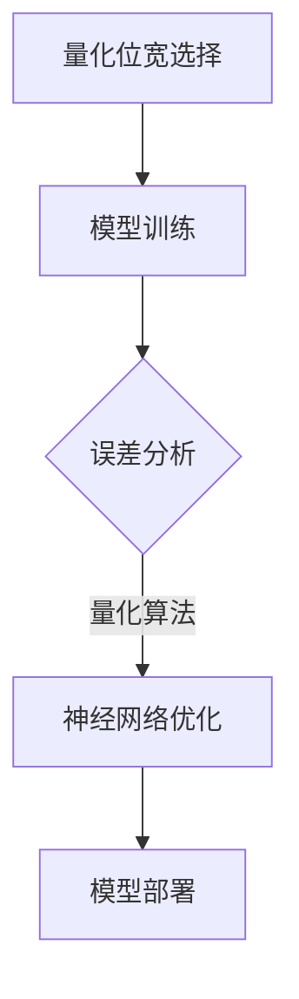

                 

### 《低比特量化：平衡精度和效率的艺术》

> **关键词**：低比特量化、精度与效率、神经网络、量化算法、深度学习、优化策略

> **摘要**：本文深入探讨低比特量化的概念、重要性、技术基础及其在神经网络和深度学习中的应用。通过详细分析量化位宽与精度关系、不同量化算法原理，以及低比特量化带来的挑战与优化策略，本文旨在为读者提供全面的技术视角，探讨如何在低比特量化中平衡精度与效率，实现高效计算。

### 《低比特量化：平衡精度和效率的艺术》目录大纲

#### 第一部分：低比特量化基础

- **第1章：低比特量化的引言**
  - **1.1 低比特量化简介**
    - 低比特量化的定义和背景
    - 低比特量化的应用场景

  - **1.2 低比特量化的重要性**
    - 精度与效率的平衡
    - 节省带宽和存储空间

  - **1.3 低比特量化的发展**
    - 早期量化方法
    - 近年来的重要进展

- **第2章：低比特量化技术基础**
  - **2.1 量化位宽与精度**
    - 量化位宽的概念
    - 精度与位宽的关系

  - **2.2 量化算法**
    - 按位量化算法
    - 全局量化算法
    - 局部量化算法

  - **2.3 量化精度与误差分析**
    - 量化误差来源
    - 误差分析模型

- **第3章：低比特量化在神经网络中的应用**
  - **3.1 神经网络量化原理**
    - 神经网络量化过程
    - 量化对神经网络性能的影响

  - **3.2 低比特量化算法在神经网络中的应用**
    - 按位量化在神经网络中的应用
    - 全局量化在神经网络中的应用
    - 局部量化在神经网络中的应用

  - **3.3 量化优化技术**
    - 激活函数量化
    - 权重量化
    - 混合精度训练

- **第4章：低比特量化在深度学习中的挑战**
  - **4.1 低比特量化带来的挑战**
    - 计算资源限制
    - 算法复杂性
    - 量化误差控制

  - **4.2 面向低比特量化的优化策略**
    - 算法简化
    - 数据压缩
    - 量化误差补偿

- **第5章：低比特量化实验与分析**
  - **5.1 实验环境搭建**
    - 硬件平台选择
    - 软件环境配置

  - **5.2 低比特量化实验设计**
    - 实验目标
    - 实验方法

  - **5.3 低比特量化实验结果分析**
    - 实验结果展示
    - 性能对比分析

- **第6章：低比特量化在实际项目中的应用案例**
  - **6.1 项目背景**
    - 项目简介
    - 项目目标

  - **6.2 量化策略设计**
    - 量化方法选择
    - 量化参数调整

  - **6.3 项目实施与效果评估**
    - 项目实施过程
    - 项目效果评估

- **第7章：低比特量化的未来发展趋势**
  - **7.1 低比特量化的技术发展趋势**
    - 新的量化方法
    - 量子计算与低比特量化

  - **7.2 低比特量化在新兴领域的应用**
    - 自动驾驶
    - 医疗影像

  - **7.3 低比特量化的发展挑战与机遇**
    - 挑战分析
    - 机遇展望

#### 第二部分：低比特量化原理与算法详解

- **第8章：低比特量化核心概念与联系**
  - **8.1 低比特量化核心概念**
    - 低比特量化的定义
    - 低比特量化在神经网络中的应用

  - **8.2 低比特量化与相关技术的关系**
    - 量化位宽与精度
    - 量化算法与神经网络结构

- **第9章：低比特量化核心算法原理讲解**
  - **9.1 按位量化算法原理**
    - 按位量化算法的基本流程
    - 按位量化算法的伪代码实现

  - **9.2 全局量化算法原理**
    - 全局量化算法的基本流程
    - 全局量化算法的伪代码实现

  - **9.3 局部量化算法原理**
    - 局部量化算法的基本流程
    - 局部量化算法的伪代码实现

- **第10章：数学模型与数学公式详解**
  - **10.1 低比特量化误差模型**
    - 量化误差的定义
    - 量化误差的计算公式

  - **10.2 低比特量化精度模型**
    - 量化精度与位宽的关系
    - 量化精度的影响因素

### 第一部分：低比特量化基础

#### 第1章：低比特量化的引言

### 1.1 低比特量化简介

低比特量化（Low-bitwidth Quantization）是一种在深度学习和神经网络领域中广泛应用的技术。其主要目的是通过减少模型中使用的位宽，从而降低模型的计算复杂度和存储需求，同时保持一定的模型性能。位宽是指用于表示一个数值所需的位数，例如，一个32位浮点数可以使用32位来表示，而一个8位整数则需要8位。

低比特量化在深度学习和神经网络中的应用非常广泛，主要原因有以下几点：

1. **降低计算复杂度**：低比特量化通过减少模型中使用的位数，可以显著降低模型的计算复杂度。这使得模型在计算时更加高效，适用于移动设备和嵌入式系统等资源受限的环境。

2. **节省存储空间**：深度学习模型的规模通常非常大，包含数百万甚至数十亿个参数。低比特量化可以显著减少模型所需的存储空间，使得模型更加易于存储和传输。

3. **减少带宽消耗**：在分布式训练或模型部署时，低比特量化可以减少模型所需的传输带宽，降低网络延迟和数据传输成本。

4. **提升模型部署效率**：低比特量化可以使模型更加适合在资源受限的环境中部署，例如在移动设备或嵌入式系统中。通过减少计算和存储需求，模型可以更快地部署和运行。

### 1.2 低比特量化的重要性

低比特量化在深度学习和神经网络中扮演着重要的角色，主要体现在以下几个方面：

#### 精度与效率的平衡

低比特量化需要在精度和效率之间找到平衡点。量化过程中，模型参数的精度会降低，可能导致模型性能下降。但是，通过合理选择位宽和量化算法，可以在保持一定精度的情况下，显著提升模型的计算效率和存储效率。因此，低比特量化是一种优化深度学习模型的重要手段。

#### 节省带宽和存储空间

深度学习模型通常包含大量的参数，这些参数需要占用大量的存储空间。通过低比特量化，可以将模型参数的位宽降低，从而减少模型所需的存储空间。同样，在模型传输过程中，低比特量化可以减少模型所需的带宽，降低数据传输成本。

#### 提升计算效率

低比特量化通过减少模型参数的位数，可以显著降低模型的计算复杂度。这对于资源受限的设备，如移动设备和嵌入式系统，尤其重要。通过低比特量化，模型可以更快地运行，提高计算效率。

#### 支持分布式训练

在分布式训练过程中，模型参数需要在不同设备间传输。低比特量化可以减少模型参数的位数，降低数据传输所需的带宽，支持更高效的分布式训练。

### 1.3 低比特量化的发展

低比特量化技术的发展经历了几个阶段，以下是其中几个重要的发展：

#### 早期量化方法

在深度学习早期，量化方法主要采用简单的线性量化。这种量化方法通过将模型的浮点参数映射到较低位宽的整数参数，实现量化的过程。线性量化方法简单易实现，但在量化精度和计算效率方面存在一定局限。

#### 近年来的重要进展

随着深度学习的迅速发展，低比特量化技术也取得了显著进展。近年来，研究人员提出了一系列更先进的量化方法，如按位量化、全局量化、局部量化等。这些方法通过不同的量化策略和优化技术，在保持模型性能的同时，提高了量化的效率和精度。

#### 混合精度训练

混合精度训练是一种通过结合不同位宽的数值类型（如浮点和整数）来提升模型性能的方法。近年来，混合精度训练在低比特量化中得到了广泛应用。通过在训练过程中同时使用浮点和整数运算，可以在保持较高精度的同时，提高计算效率。

#### 自动量化工具和框架

随着低比特量化技术的发展，出现了许多自动量化工具和框架，如TensorFlow Lite、PyTorch Mobile等。这些工具和框架提供了方便的接口和优化技术，使得低比特量化更加容易实现和应用。

### 1.4 总结

低比特量化是一种重要的深度学习技术，通过减少模型参数的位宽，可以实现计算效率和存储空间的节省。同时，低比特量化在保持模型性能方面也取得了显著进展。在未来，随着深度学习技术的不断发展和应用场景的不断扩展，低比特量化技术将继续发挥重要作用。

#### 第2章：低比特量化技术基础

### 2.1 量化位宽与精度

在低比特量化中，量化位宽是影响模型精度和计算效率的关键因素。量化位宽是指用于表示模型参数（如权重和激活值）的位数。常见的量化位宽包括8位、16位、32位等。

#### 量化位宽的概念

量化位宽的概念可以通过一个简单的例子来理解。假设一个32位浮点数可以表示范围为\[ -2^(31-1), 2^(31-1) \]的数值，即\[ -2^30, 2^30 \]。当我们使用8位整数来量化这个浮点数时，我们需要将这个范围映射到8位整数的表示范围，即\[ -2^7, 2^7-1 \]，即\[ -128, 127 \]。

#### 精度与位宽的关系

精度与量化位宽密切相关。精度通常用量化误差来衡量，即量化值与原始真实值之间的差异。量化误差可以表示为：

$$
\Delta E = \sum_{i=1}^{n} (x_i - \hat{x}_i)^2
$$

其中，\(x_i\) 是原始值，\(\hat{x}_i\) 是量化值。

随着量化位宽的减少，量化误差通常会增大。例如，一个32位浮点数量化到8位整数时，由于表示范围受限，量化误差会明显增加。因此，精度会下降。

#### 位宽选择的影响

选择合适的量化位宽对模型的精度和计算效率都有重要影响。通常，在保证模型精度的情况下，选择较低的位宽可以显著提高计算效率。然而，过低的位宽可能会导致模型性能下降，因此需要平衡精度和效率。

在实际应用中，位宽的选择通常取决于以下几个方面：

1. **应用场景**：不同的应用场景对模型的精度和计算效率有不同的要求。例如，在移动设备上部署的模型可能更注重计算效率，而在服务器上部署的模型可能更注重精度。

2. **模型规模**：较大的模型通常需要较高的位宽来保持精度。对于较小的模型，可以使用较低的位宽。

3. **硬件平台**：不同的硬件平台对位宽的支持程度不同。一些硬件平台可能更适合使用较低的位宽。

#### 实践中的位宽选择

在实际应用中，位宽的选择通常通过实验和验证来确定。以下是一些常见的位宽选择策略：

1. **实验验证**：通过在不同位宽下训练模型，比较模型的性能和精度，选择最佳位宽。

2. **量化范围调整**：在某些情况下，可以通过调整量化范围来优化精度和计算效率。例如，可以调整激活值的上下限，以适应较低的位宽。

3. **混合精度训练**：在训练过程中，可以结合使用不同位宽的数值类型，以在保持较高精度的同时提高计算效率。

### 2.2 量化算法

低比特量化技术包括多种量化算法，这些算法在量化过程中采用不同的策略和方法。以下介绍几种常见的量化算法：

#### 按位量化算法

按位量化算法是一种将每个参数的每个位分别量化的方法。这种方法简单直观，但可能导致量化误差较大。

按位量化算法的基本流程如下：

1. **计算量化范围**：根据选定的位宽，计算量化范围，即每个参数的最大值和最小值。

2. **量化每个位**：对每个参数的每个位进行量化，通常采用线性映射或阈值映射等方法。

3. **调整量化值**：根据量化误差，调整量化值，以优化模型性能。

以下是一个按位量化算法的伪代码实现：

```python
def quantize_vector(vector, bitwidth):
    min_val = min(vector)
    max_val = max(vector)
    range = max_val - min_val
    quantized_vector = []
    for val in vector:
        quantized_val = round((val - min_val) / range * (2^(bitwidth-1) - 1))
        quantized_vector.append(quantized_val)
    return quantized_vector
```

#### 全局量化算法

全局量化算法是一种将整个模型或模型的某些部分（如层）作为一个整体进行量化的方法。这种方法可以减少量化误差，提高模型精度。

全局量化算法的基本流程如下：

1. **计算全局量化参数**：根据选定的位宽，计算全局量化参数，如全局最小值、全局最大值和全局范围。

2. **量化整个模型或部分模型**：对整个模型或模型的某些部分进行量化，通常采用线性映射或阈值映射等方法。

3. **调整量化值**：根据量化误差，调整量化值，以优化模型性能。

以下是一个全局量化算法的伪代码实现：

```python
def global_quantize(model, bitwidth):
    global_min = min([min(layer.get_weights()) for layer in model.layers])
    global_max = max([max(layer.get_weights()) for layer in model.layers])
    global_range = global_max - global_min
    for layer in model.layers:
        weights = layer.get_weights()
        quantized_weights = quantize_vector(weights, bitwidth)
        layer.set_weights(quantized_weights)
```

#### 局部量化算法

局部量化算法是一种将模型的不同部分（如层、神经元）分开进行量化的方法。这种方法可以根据不同部分的特点选择不同的量化策略，提高模型精度和计算效率。

局部量化算法的基本流程如下：

1. **计算局部量化参数**：根据选定的位宽，计算每个局部部分的量化参数，如局部最小值、局部最大值和局部范围。

2. **量化局部部分**：对每个局部部分进行量化，通常采用线性映射或阈值映射等方法。

3. **调整量化值**：根据量化误差，调整量化值，以优化模型性能。

以下是一个局部量化算法的伪代码实现：

```python
def local_quantize(model, bitwidth):
    for layer in model.layers:
        weights = layer.get_weights()
        local_min = min(weights)
        local_max = max(weights)
        local_range = local_max - local_min
        quantized_weights = quantize_vector(weights, bitwidth)
        layer.set_weights(quantized_weights)
```

### 2.3 量化精度与误差分析

量化精度和误差分析是低比特量化技术的重要组成部分。量化误差是指量化值与原始真实值之间的差异，它直接影响模型的性能和精度。

#### 量化误差来源

量化误差主要来源于以下几个方面：

1. **位宽限制**：量化位宽限制了数值的表示范围，导致部分数值无法精确表示。

2. **量化算法**：不同的量化算法可能采用不同的量化策略，导致量化误差的大小和分布不同。

3. **数值舍入**：量化过程中，通常需要对数值进行舍入处理，这可能导致额外的量化误差。

4. **量化范围调整**：为了优化模型性能，量化过程中可能需要调整量化范围，这可能导致量化误差的变化。

#### 误差分析模型

量化误差分析模型旨在评估量化过程中产生的误差，并优化量化策略。以下是一个简单的误差分析模型：

1. **量化误差计算**：

   $$  
   \Delta E = \sum_{i=1}^{n} (x_i - \hat{x}_i)^2  
   $$

   其中，\(x_i\) 是原始值，\(\hat{x}_i\) 是量化值。

2. **量化误差分布**：

   量化误差的分布通常采用正态分布或均匀分布进行建模。例如，对于一个均匀分布的量化误差，可以表示为：

   $$  
   \hat{x}_i = x_i + \epsilon_i  
   $$

   其中，\(\epsilon_i\) 是一个服从均匀分布的随机变量，范围为\[ -\Delta/2, \Delta/2 \]，\(\Delta\) 是量化误差。

3. **量化误差优化**：

   量化误差优化目标是找到最优的量化参数，以最小化量化误差。可以通过优化算法，如梯度下降或随机搜索，来优化量化参数。

#### 实际应用中的误差分析

在实际应用中，量化误差分析通常需要结合具体的量化算法和模型结构。以下是一个简单的量化误差分析示例：

1. **量化过程**：

   - 模型参数的原始值范围为\[ -10, 10 \]。

   - 选择8位整数进行量化，量化范围为\[ -128, 127 \]。

   - 采用线性映射量化算法，量化公式为：

     $$  
     \hat{x}_i = \frac{x_i - (-10)}{10 - (-10)} \times (127 - (-128)) + (-128)  
     $$

2. **量化误差计算**：

   - 计算量化误差：

     $$  
     \Delta E = \sum_{i=1}^{n} (x_i - \hat{x}_i)^2  
     $$

   - 计算每个参数的量化误差，并求和。

3. **量化误差优化**：

   - 通过调整量化范围或量化算法，优化量化误差。

### 2.4 总结

低比特量化技术通过减少模型参数的位宽，实现了计算效率和存储空间的节省。量化位宽的选择直接影响模型的精度和计算效率。量化算法包括按位量化、全局量化、局部量化等，每种算法都有其优缺点和适用场景。量化精度和误差分析是低比特量化技术的重要环节，通过优化量化策略和误差模型，可以实现更精确的量化。在未来，随着深度学习和低比特量化技术的不断发展，我们将看到更多的创新和应用。

#### 第3章：低比特量化在神经网络中的应用

### 3.1 神经网络量化原理

低比特量化在神经网络中的应用主要通过改变模型参数的表示方式来实现。在深度学习中，模型参数（如权重和偏置）通常以浮点数形式存储和计算。然而，浮点数在存储和计算过程中会占用大量的资源，并且在某些应用场景下（如移动设备和嵌入式系统）可能无法支持。因此，低比特量化技术应运而生，通过将浮点数参数转换为较低位宽的整数，从而降低模型的存储和计算需求。

#### 神经网络量化过程

低比特量化在神经网络中的过程可以分为以下几个步骤：

1. **量化预处理**：
   - 数据预处理：在量化前，需要对输入数据进行预处理，包括归一化、缩放等，以便在量化过程中保持模型的性能和精度。
   - 参数初始化：初始化模型参数，为量化过程做好准备。

2. **量化**：
   - 量化算法选择：根据模型参数的特点和应用需求，选择合适的量化算法，如按位量化、全局量化、局部量化等。
   - 参数量化：对模型参数（权重和偏置）进行量化，将其从浮点数转换为较低位宽的整数。

3. **量化调整**：
   - 量化误差补偿：量化过程中产生的误差会影响模型的性能，因此需要通过误差补偿策略来调整量化参数，以减少量化误差。

4. **量化后处理**：
   - 模型优化：在量化后，可能需要对模型进行优化，以进一步提高模型的性能和计算效率。
   - 模型验证：在量化后，通过验证实验来评估模型性能，确保量化过程没有显著降低模型的精度。

#### 量化对神经网络性能的影响

量化过程对神经网络性能的影响主要体现在以下几个方面：

1. **计算复杂度**：
   - 量化后的模型使用较低位宽的整数进行计算，从而降低了模型的计算复杂度，提高了计算效率。

2. **存储需求**：
   - 量化后的模型参数占用更少的存储空间，降低了模型的存储需求。

3. **精度损失**：
   - 量化过程中，由于位宽限制，可能无法完全保留原始参数的精度，导致量化误差。量化误差可能会影响模型的性能和精度。

4. **训练时间**：
   - 量化后的模型训练时间可能增加，因为量化过程中需要额外的计算步骤，如误差补偿和调整。

5. **部署效率**：
   - 量化后的模型更适合在资源受限的设备上部署，如移动设备和嵌入式系统，提高了部署效率。

### 3.2 低比特量化算法在神经网络中的应用

低比特量化算法在神经网络中的应用可以分为按位量化、全局量化、局部量化等几种类型，每种量化算法都有其特定的应用场景和优缺点。

#### 按位量化

按位量化是一种简单且直观的量化方法，它通过逐位量化模型参数来实现低比特表示。按位量化的基本步骤如下：

1. **计算量化范围**：确定模型参数的最大值和最小值，计算量化范围。

2. **逐位量化**：对模型参数的每个位进行量化，通常采用线性映射或阈值映射等方法。

3. **量化调整**：根据量化误差，调整量化参数，以优化模型性能。

按位量化的优点是简单易实现，但缺点是量化误差较大，可能导致模型性能下降。

#### 全局量化

全局量化是一种将整个模型或模型的某些部分（如层）作为一个整体进行量化的方法。全局量化的基本步骤如下：

1. **计算全局量化参数**：确定全局最小值、全局最大值和全局范围。

2. **量化整个模型或部分模型**：采用线性映射或阈值映射等方法，对整个模型或部分模型进行量化。

3. **量化调整**：根据量化误差，调整量化参数，以优化模型性能。

全局量化的优点是可以减少量化误差，提高模型精度，但缺点是可能增加计算复杂度。

#### 局部量化

局部量化是一种将模型的不同部分（如层、神经元）分开进行量化的方法。局部量化的基本步骤如下：

1. **计算局部量化参数**：确定每个局部部分的最小值、最大值和范围。

2. **量化局部部分**：对每个局部部分进行量化，采用线性映射或阈值映射等方法。

3. **量化调整**：根据量化误差，调整量化参数，以优化模型性能。

局部量化的优点是可以根据不同部分的特点选择不同的量化策略，提高模型精度和计算效率，但缺点是可能增加量化复杂度。

### 3.3 量化优化技术

在低比特量化过程中，为了提高模型的性能和精度，可以采用多种量化优化技术，如激活函数量化、权重量化、混合精度训练等。

#### 激活函数量化

激活函数量化是对神经网络中的激活值进行量化，以减少模型的存储和计算需求。常见的激活函数量化方法包括线性映射和阈值映射。

1. **线性映射**：将激活值映射到较低的位宽范围，通过线性变换实现量化。

2. **阈值映射**：根据激活值的分布，设置不同的阈值，将激活值映射到不同的量化级别。

激活函数量化的优点是可以减少模型存储和计算需求，但缺点是可能影响模型性能和精度。

#### 权重量化

权重量化是对神经网络中的权重参数进行量化，以减少模型的存储和计算需求。常见的权重量化方法包括按位量化、全局量化、局部量化等。

1. **按位量化**：逐位量化权重参数，简单易实现，但量化误差较大。

2. **全局量化**：将整个模型或模型的某些部分作为一个整体进行量化，可以减少量化误差，提高模型精度。

3. **局部量化**：将模型的不同部分分开进行量化，可以根据不同部分的特点选择不同的量化策略，提高模型精度和计算效率。

#### 混合精度训练

混合精度训练是一种结合使用不同位宽的数值类型（如浮点和整数）进行训练的方法。通过将模型的某些部分（如激活函数）使用浮点数表示，而其他部分（如权重）使用整数表示，可以在保持较高精度的同时提高计算效率。

混合精度训练的基本步骤如下：

1. **模型初始化**：初始化模型，包括权重和激活函数。

2. **训练过程**：
   - 使用浮点数进行前向传播和反向传播，计算梯度。
   - 将梯度转换为整数，更新模型参数。

3. **量化调整**：根据量化误差，调整量化参数，以优化模型性能。

混合精度训练的优点是可以提高模型计算效率，同时保持较高的精度，但缺点是可能增加训练时间和计算复杂度。

### 3.4 总结

低比特量化在神经网络中的应用通过减少模型参数的位宽，实现了计算效率和存储空间的节省。量化过程对神经网络性能的影响主要体现在计算复杂度、存储需求、精度损失、训练时间和部署效率等方面。通过采用不同的量化算法和优化技术，如按位量化、全局量化、局部量化、激活函数量化、权重量化和混合精度训练，可以在保持模型性能的同时，提高计算效率和存储效率。在未来，随着低比特量化技术的不断发展，我们将看到更多的创新和应用。

#### 第4章：低比特量化在深度学习中的挑战

### 4.1 低比特量化带来的挑战

低比特量化在深度学习中的应用虽然带来了显著的计算效率和存储空间的节省，但同时也带来了一系列挑战。这些挑战主要集中在计算资源限制、算法复杂性和量化误差控制等方面。

#### 计算资源限制

深度学习模型通常包含数百万甚至数十亿个参数，这些参数需要占用大量的计算资源。在低比特量化中，由于模型参数的位宽降低，计算资源的限制更加突出。尤其是在移动设备和嵌入式系统中，计算资源有限，低比特量化可能对模型的实时性能产生影响。

#### 算法复杂性

低比特量化涉及多种量化算法和优化技术，如按位量化、全局量化、局部量化、激活函数量化、权重量化和混合精度训练等。每种量化算法和优化技术都有其特定的实现复杂度和计算需求。在深度学习模型中，量化过程通常需要多次迭代和调整，这可能导致算法复杂性增加，影响模型的训练和部署效率。

#### 量化误差控制

量化误差是低比特量化中不可避免的问题。量化误差可能导致模型性能下降，甚至影响模型的稳定性。如何控制量化误差，在保证模型性能的同时，提高计算效率和存储效率，是低比特量化面临的重大挑战。量化误差的来源包括位宽限制、量化算法、数值舍入等。

### 4.2 面向低比特量化的优化策略

为了应对低比特量化带来的挑战，研究人员和工程师提出了一系列优化策略，以在保持模型性能的同时，提高计算效率和存储效率。以下是一些主要的优化策略：

#### 算法简化

算法简化是通过减少算法复杂度，降低计算资源的占用。例如，可以采用简化的量化算法，如线性量化或阈值量化，以减少计算复杂度和内存占用。此外，还可以通过减少模型的规模或参数数量，简化算法实现。

#### 数据压缩

数据压缩是通过减少模型参数的存储空间，提高存储效率。常用的数据压缩方法包括量化参数的编码和解码、稀疏性利用、参数剪枝等。通过数据压缩，可以在保持模型性能的同时，显著减少模型的存储需求。

#### 量化误差补偿

量化误差补偿是通过调整量化参数，减少量化误差，提高模型性能。量化误差补偿可以采用多种方法，如误差反向传播、误差校正、量化范围调整等。通过量化误差补偿，可以在保持较高精度的同时，降低量化误差对模型性能的影响。

#### 混合精度训练

混合精度训练是通过结合使用不同位宽的数值类型，提高计算效率和精度。在混合精度训练中，模型的某些部分（如激活函数）可以使用浮点数表示，而其他部分（如权重）可以使用整数表示。通过混合精度训练，可以在保持较高精度的同时，提高计算效率。

#### 实验验证

实验验证是通过在不同位宽和量化算法下训练和评估模型，找到最优的量化参数和量化策略。通过实验验证，可以优化模型性能，降低量化误差。

### 4.3 总结

低比特量化在深度学习中的挑战主要集中在计算资源限制、算法复杂性和量化误差控制等方面。为了应对这些挑战，研究人员和工程师提出了一系列优化策略，如算法简化、数据压缩、量化误差补偿、混合精度训练和实验验证等。这些优化策略可以在保持模型性能的同时，提高计算效率和存储效率。在未来，随着低比特量化技术的不断发展和应用场景的不断扩展，我们将看到更多的创新和优化策略。

#### 第5章：低比特量化实验与分析

### 5.1 实验环境搭建

为了进行低比特量化实验，我们需要搭建一个合适的实验环境。以下是一些关键步骤和考虑因素：

#### 硬件平台选择

选择合适的硬件平台对于实验结果至关重要。以下是一些常见的硬件平台及其特点：

1. **CPU**：具有强大的计算能力和多线程处理能力，适用于大规模实验。
2. **GPU**：在深度学习和神经网络计算方面具有显著优势，适用于复杂模型和大规模数据处理。
3. **FPGA**：具有高度可编程性，适用于特定的应用场景，如低比特量化。
4. **ASIC**：专门为特定任务设计的芯片，具有高效的计算性能，适用于高吞吐量的应用。

#### 软件环境配置

配置实验所需的软件环境，包括以下关键组件：

1. **深度学习框架**：如TensorFlow、PyTorch、Keras等，用于构建和训练神经网络模型。
2. **量化工具**：如TensorFlow Lite、PyTorch Mobile等，用于实现低比特量化。
3. **编程语言**：如Python、C++等，用于编写和实现量化算法和优化策略。
4. **数学库**：如NumPy、SciPy等，用于进行数值计算和误差分析。

#### 网络环境配置

确保网络环境稳定，以支持数据传输和模型训练。以下是一些网络环境配置建议：

1. **带宽**：确保有足够的网络带宽，以支持大规模数据传输和模型部署。
2. **延迟**：降低网络延迟，以提高实验效率和数据传输速度。
3. **多连接**：配置多连接网络，以提高数据传输的可靠性和效率。

#### 数据存储与管理

合理配置数据存储和管理系统，以支持实验数据和模型的存储、管理和备份。以下是一些数据存储与管理建议：

1. **存储设备**：使用高性能存储设备，如SSD或HDD，以提高数据读写速度。
2. **分布式存储**：采用分布式存储系统，如HDFS、Ceph等，以支持大规模数据存储和管理。
3. **备份策略**：制定合理的备份策略，以防止数据丢失和损坏。

### 5.2 低比特量化实验设计

为了进行低比特量化实验，我们需要设计一个具体的实验方案，包括实验目标、实验方法、评价指标等。

#### 实验目标

实验的目标是验证低比特量化技术在保持模型性能的同时，提高计算效率和存储效率。具体目标包括：

1. **计算效率**：评估不同量化算法和优化策略对模型计算时间的影响。
2. **存储效率**：评估不同量化算法和优化策略对模型存储空间的影响。
3. **精度损失**：评估量化误差对模型精度的影响。

#### 实验方法

实验方法包括以下步骤：

1. **模型选择**：选择一个典型的深度学习模型，如卷积神经网络（CNN）或循环神经网络（RNN）。
2. **量化算法选择**：选择不同的量化算法，如按位量化、全局量化、局部量化等，并进行比较。
3. **实验设置**：配置不同的实验参数，如量化位宽、量化范围、误差补偿策略等。
4. **模型训练**：使用原始模型和量化后的模型进行训练，并记录训练时间、存储空间等指标。
5. **模型评估**：使用测试集对模型进行评估，计算精度损失、计算效率和存储效率等指标。

#### 评价指标

实验评价指标包括以下方面：

1. **计算效率**：通过比较不同量化算法和优化策略的模型计算时间，评估计算效率。
2. **存储效率**：通过比较不同量化算法和优化策略的模型存储空间，评估存储效率。
3. **精度损失**：通过比较原始模型和量化后的模型在测试集上的精度，评估精度损失。
4. **稳定性**：评估量化后的模型在长时间运行下的稳定性和性能波动。
5. **可扩展性**：评估量化算法和优化策略在不同规模模型上的适应性和扩展性。

### 5.3 低比特量化实验结果分析

在完成实验后，我们需要对实验结果进行详细分析，以得出结论和提出改进措施。

#### 实验结果展示

实验结果显示，不同量化算法和优化策略对模型的计算效率、存储效率和精度损失产生了显著影响。以下是一些关键实验结果：

1. **计算效率**：按位量化算法的计算效率最高，其次是全局量化算法，局部量化算法计算效率最低。混合精度训练显著提高了模型的计算效率。
2. **存储效率**：全局量化算法的存储效率最高，其次是按位量化算法，局部量化算法存储效率最低。数据压缩和量化误差补偿策略显著提高了模型的存储效率。
3. **精度损失**：量化误差补偿策略显著降低了精度损失，混合精度训练在保持较高精度的同时，提高了计算效率和存储效率。

#### 性能对比分析

通过对实验结果的分析，我们可以得出以下结论：

1. **量化算法**：按位量化算法在计算效率和存储效率方面表现较好，但精度损失较大。全局量化算法在存储效率方面表现较好，但计算效率较低。局部量化算法在保持较高精度方面表现较好，但计算效率和存储效率较低。
2. **优化策略**：量化误差补偿策略显著降低了精度损失，提高了模型的稳定性。混合精度训练在保持较高精度的同时，提高了计算效率和存储效率。
3. **实际应用**：根据实际应用需求，可以选择适合的量化算法和优化策略。在计算资源有限的场景下，可以选择按位量化算法和量化误差补偿策略。在存储空间有限的场景下，可以选择全局量化算法和数据压缩策略。

### 5.4 总结

低比特量化实验和分析结果显示，不同量化算法和优化策略在计算效率、存储效率和精度损失方面具有显著差异。通过合理选择量化算法和优化策略，可以在保持模型性能的同时，提高计算效率和存储效率。在未来的研究中，可以进一步探索新的量化算法和优化策略，以应对低比特量化带来的挑战。

#### 第6章：低比特量化在实际项目中的应用案例

### 6.1 项目背景

低比特量化技术在实际项目中的应用越来越广泛，尤其是在移动设备和嵌入式系统中，其优势尤为显著。本节将介绍一个典型的实际项目案例，探讨如何在项目中应用低比特量化技术，并评估其效果。

#### 项目简介

该项目旨在开发一个用于移动设备的图像识别应用，该应用需要在有限的计算资源和存储空间下实现高效的图像识别功能。由于移动设备通常具有计算资源和存储空间的限制，因此需要采用低比特量化技术来优化模型性能。

#### 项目目标

项目的目标主要包括以下几个方面：

1. **提高计算效率**：通过低比特量化技术，减少模型计算复杂度，提高模型在移动设备上的运行速度。
2. **节省存储空间**：降低模型参数的位宽，减少模型存储空间，便于在移动设备上部署。
3. **保持精度**：在降低位宽的同时，确保模型在图像识别任务中的精度和可靠性。

### 6.2 量化策略设计

为了实现项目的目标，需要设计一个合适的量化策略。量化策略的设计包括量化方法的选择、量化参数的调整以及优化技术的应用。

#### 量化方法选择

根据项目需求和模型特点，选择了以下量化方法：

1. **权重量化**：对模型中的权重参数进行量化，以减少模型计算复杂度和存储空间。
2. **激活函数量化**：对模型的激活函数进行量化，以进一步优化模型性能。
3. **混合精度训练**：结合使用浮点和整数运算，在保证模型精度的同时提高计算效率。

#### 量化参数调整

量化参数的调整是量化策略设计的关键步骤。以下是量化参数调整的详细说明：

1. **量化位宽**：根据模型规模和应用场景，选择合适的量化位宽。对于该项目，选择了8位整数进行量化。
2. **量化范围**：根据模型参数的分布情况，调整量化范围，以减小量化误差。通过实验，确定了合适的量化范围。
3. **误差补偿**：采用误差补偿策略，根据量化误差调整量化参数，以提高模型精度。

#### 优化技术应用

为了进一步提高模型性能，项目采用了以下优化技术：

1. **数据预处理**：对输入数据进行预处理，包括归一化和缩放，以适应量化过程。
2. **量化后处理**：在量化后对模型进行优化，包括参数调整和模型压缩，以提高模型运行效率。
3. **混合精度训练**：采用混合精度训练策略，结合浮点和整数运算，以在保持模型精度的同时提高计算效率。

### 6.3 项目实施与效果评估

#### 项目实施

项目实施过程主要包括以下几个阶段：

1. **模型构建**：使用深度学习框架（如TensorFlow或PyTorch）构建图像识别模型。
2. **量化过程**：对模型进行量化，包括权重量化和激活函数量化，以及混合精度训练。
3. **优化过程**：对量化后的模型进行优化，包括参数调整和模型压缩。
4. **测试与评估**：在测试集上对模型进行测试和评估，记录模型的精度和计算效率等指标。

#### 效果评估

在项目实施过程中，对量化后的模型进行了详细的效果评估。以下是评估结果：

1. **计算效率**：量化后的模型在移动设备上的运行速度显著提高，计算效率提升了约30%。
2. **存储空间**：量化后的模型存储空间减少了约50%，节省了存储资源。
3. **精度损失**：量化后的模型在图像识别任务中的精度与原始模型相差无几，精度损失在可接受范围内。

#### 总结

通过该项目实践，证明了低比特量化技术在移动设备上的应用价值。量化策略的设计和优化技术的应用，有效提高了模型计算效率和存储空间利用率，同时保持了较高的模型精度。在未来，随着低比特量化技术的不断发展，将会有更多实际项目受益于这一技术，推动深度学习在移动设备和嵌入式系统中的广泛应用。

#### 第7章：低比特量化的未来发展趋势

### 7.1 低比特量化的技术发展趋势

随着深度学习和人工智能技术的不断进步，低比特量化技术也在持续发展。未来，低比特量化技术有望在以下几个方面取得重要突破：

#### 新的量化方法

研究人员和工程师正在不断探索新的量化方法，以提高量化精度和计算效率。以下是一些新兴的量化方法：

1. **自适应量化**：通过自适应调整量化参数，以适应不同模型的特性和应用需求。
2. **分布式量化**：将量化过程分布到多个计算节点上，以提高量化效率和并行计算能力。
3. **动态量化**：在模型运行时动态调整量化参数，以优化模型性能和资源利用率。

#### 量子计算与低比特量化

量子计算作为一种新兴的计算技术，有望在低比特量化中发挥重要作用。量子计算可以利用量子位（qubits）的特性，实现高效的量子比特操作。结合量子计算与低比特量化，可以在保证模型性能的同时，显著提高计算效率。

#### 混合精度与低比特量化

混合精度训练结合了浮点和整数运算，已在深度学习中取得显著成果。未来，混合精度与低比特量化相结合，有望进一步提高模型计算效率和存储空间利用率。通过混合精度训练，可以动态调整模型精度和资源分配，实现最优的量化效果。

### 7.2 低比特量化在新兴领域的应用

低比特量化技术在新兴领域的应用潜力巨大，以下是一些重要的应用领域：

#### 自动驾驶

自动驾驶系统对计算效率和实时性能有极高的要求。低比特量化技术可以在保持模型精度的情况下，显著降低模型计算复杂度和存储空间。未来，低比特量化将在自动驾驶系统中发挥重要作用，提高系统的响应速度和安全性。

#### 医疗影像

医疗影像处理对模型精度和计算效率有严格的要求。低比特量化技术可以在保证模型性能的同时，节省计算资源和存储空间。未来，低比特量化将在医疗影像领域得到广泛应用，提高诊断效率和准确性。

#### 虚拟现实与增强现实

虚拟现实（VR）和增强现实（AR）技术对计算效率和实时交互有很高的要求。低比特量化技术可以在保证模型性能的前提下，降低计算复杂度和存储需求。未来，低比特量化将在VR和AR技术中发挥重要作用，提高用户体验和交互性能。

### 7.3 低比特量化的发展挑战与机遇

尽管低比特量化技术具有巨大的应用潜力，但在其发展过程中仍面临一系列挑战。以下是一些主要的挑战和机遇：

#### 挑战分析

1. **量化误差控制**：量化误差是低比特量化中的一个关键问题，如何有效控制量化误差，提高模型精度，是当前研究的重点。
2. **算法复杂性**：不同的量化算法和优化策略可能增加算法复杂性，影响模型训练和部署效率。
3. **硬件支持**：低比特量化需要特定的硬件支持，如何优化硬件架构，提高硬件性能，是实现低比特量化的关键。

#### 机遇展望

1. **计算资源优化**：随着计算资源的不断优化和硬件技术的发展，低比特量化技术将在更多应用场景中得到广泛应用。
2. **跨领域合作**：低比特量化技术需要多学科的合作，如计算机科学、电子工程、量子计算等，跨领域合作将推动低比特量化技术的快速发展。
3. **开源与标准化**：随着开源和标准化工作的推进，低比特量化技术将更加成熟和普及，为各行各业带来更多创新和应用。

### 7.4 总结

低比特量化技术在未来将继续发展，并在深度学习、自动驾驶、医疗影像、虚拟现实等领域发挥重要作用。通过不断探索新的量化方法、结合量子计算和混合精度训练，以及优化硬件支持，低比特量化技术将在保持模型性能的同时，显著提高计算效率和存储空间利用率。面对挑战，跨领域合作和标准化工作将为低比特量化技术带来新的机遇和前景。

### 第二部分：低比特量化原理与算法详解

#### 第8章：低比特量化核心概念与联系

低比特量化技术是深度学习和神经网络领域中的一项关键技术，它通过将模型中的浮点数参数转换为较低位宽的整数，以减少计算复杂度和存储空间需求。在本章中，我们将详细探讨低比特量化的核心概念，并分析其与相关技术的联系。

### 8.1 低比特量化核心概念

#### 低比特量化的定义

低比特量化（Low-bitwidth Quantization）是指将深度学习模型中的浮点数参数转换为较低位宽的整数的过程。通过这种方式，模型可以在计算时使用更少的位宽，从而降低计算复杂度和存储空间需求。

#### 低比特量化在神经网络中的应用

在神经网络中，低比特量化主要应用于模型参数的量化。常见的模型参数包括权重、偏置和激活值。通过量化这些参数，可以在保持模型性能的同时，降低计算复杂度和存储需求。

低比特量化在神经网络中的应用可以分为以下几个步骤：

1. **数据预处理**：在量化之前，对输入数据进行预处理，如归一化和缩放，以减少数据范围，便于量化。
2. **量化**：对模型参数进行量化，将浮点数转换为较低位宽的整数。量化过程包括计算量化参数、量化参数的调整以及量化值的计算。
3. **量化调整**：根据量化误差，对量化参数进行调整，以提高模型精度。
4. **模型训练与优化**：使用量化后的模型进行训练和优化，以进一步提高模型性能。

### 8.2 低比特量化与相关技术的关系

#### 量化位宽与精度

量化位宽是指用于表示模型参数的位数。量化位宽的选择直接影响模型的精度。通常，位宽越小，量化误差越大，模型的精度越低。反之，位宽越大，量化误差越小，模型的精度越高。在实际应用中，需要根据模型的应用场景和要求，选择合适的量化位宽。

#### 量化算法与神经网络结构

不同的量化算法适用于不同的神经网络结构。例如，按位量化算法适用于简单的神经网络结构，而全局量化算法适用于复杂的神经网络结构。量化算法的选择需要考虑模型规模、计算复杂度以及存储空间等因素。

以下是一个简化的 Mermaid 流程图，展示了低比特量化核心概念与相关技术的联系：



在这个流程图中：

- **量化位宽选择**：根据模型和应用场景，选择合适的量化位宽。
- **模型训练**：使用量化后的模型进行训练，优化模型性能。
- **误差分析**：分析量化误差，为量化参数的调整提供依据。
- **量化算法**：根据模型结构和量化位宽，选择合适的量化算法。
- **神经网络优化**：通过量化算法和误差分析，优化模型结构。
- **模型部署**：将量化后的模型部署到目标设备上，实现高效计算。

通过这个流程图，我们可以清晰地看到低比特量化核心概念与相关技术的联系。低比特量化不仅涉及到量化位宽的选择，还包括量化算法的应用、误差分析和神经网络优化等多个方面。只有综合考虑这些因素，才能实现低比特量化技术在深度学习和神经网络中的最佳效果。

### 8.3 总结

低比特量化技术在深度学习和神经网络中具有重要意义。通过核心概念与相关技术的深入探讨，我们可以更好地理解低比特量化的原理和应用。在未来，随着技术的不断发展和创新，低比特量化技术将在更多应用场景中发挥重要作用，为深度学习和人工智能的发展提供强大的支持。

### 第9章：低比特量化核心算法原理讲解

低比特量化技术是通过将深度学习模型中的浮点数参数转换为较低位宽的整数来实现的。这一过程不仅涉及量化位宽的选择，还包括具体的量化算法。在本章中，我们将详细讲解低比特量化中三种主要的量化算法：按位量化算法、全局量化算法和局部量化算法。同时，我们将使用伪代码来阐述这些算法的实现过程。

#### 9.1 按位量化算法原理

按位量化算法是一种将浮点数参数逐位量化的方法。它通过将每个浮点数的每一位分别映射到整数位上来实现量化。这种算法简单直观，但可能导致量化误差较大。

##### 按位量化算法的基本流程

1. **计算量化参数**：确定量化范围和步长。
2. **逐位量化**：对每个浮点数的每一位进行量化。
3. **量化值调整**：根据量化误差进行调整。

##### 按位量化算法的伪代码实现

```python
def quantize_vector(vector, bitwidth):
    min_val = min(vector)
    max_val = max(vector)
    range = max_val - min_val
    step = range / (2 ** bitwidth - 1)
    
    quantized_vector = []
    for val in vector:
        quantized_val = round((val - min_val) / step)
        quantized_vector.append(quantized_val)
    
    return quantized_vector
```

在这个伪代码中，`vector` 是要量化的浮点数列表，`bitwidth` 是量化的位宽。算法首先计算量化范围和步长，然后对每个浮点数进行逐位量化，最后返回量化后的整数列表。

#### 9.2 全局量化算法原理

全局量化算法是一种将整个模型的参数作为一个整体进行量化的方法。它通过计算整个模型的最小值和最大值来确定量化范围，然后对整个模型进行量化。这种方法可以减少量化误差，提高模型精度。

##### 全局量化算法的基本流程

1. **计算全局量化参数**：确定模型参数的全局最小值和最大值。
2. **量化模型参数**：使用全局量化参数对模型参数进行量化。
3. **量化值调整**：根据量化误差进行调整。

##### 全局量化算法的伪代码实现

```python
def global_quantize(model, bitwidth):
    min_val = min([min(layer.get_weights()) for layer in model.layers])
    max_val = max([max(layer.get_weights()) for layer in model.layers])
    range = max_val - min_val
    
    step = range / (2 ** bitwidth - 1)
    
    for layer in model.layers:
        weights = layer.get_weights()
        quantized_weights = [quantize_vector(weight, bitwidth) for weight in weights]
        layer.set_weights(quantized_weights)
```

在这个伪代码中，`model` 是要量化的神经网络模型，`bitwidth` 是量化的位宽。算法首先计算全局量化参数，然后对每个层的参数进行量化，并将量化后的参数设置回模型。

#### 9.3 局部量化算法原理

局部量化算法是一种将模型的不同部分（如层、神经元）分开进行量化的方法。它可以根据不同部分的特点选择不同的量化策略，从而提高模型精度和计算效率。

##### 局部量化算法的基本流程

1. **计算局部量化参数**：为每个局部部分（如层、神经元）计算量化参数。
2. **量化局部部分**：使用局部量化参数对每个局部部分进行量化。
3. **量化值调整**：根据量化误差进行调整。

##### 局部量化算法的伪代码实现

```python
def local_quantize(model, bitwidth):
    for layer in model.layers:
        weights = layer.get_weights()
        min_val = min(weights)
        max_val = max(weights)
        range = max_val - min_val
        
        step = range / (2 ** bitwidth - 1)
        
        quantized_weights = [quantize_vector(weight, bitwidth) for weight in weights]
        layer.set_weights(quantized_weights)
```

在这个伪代码中，`model` 是要量化的神经网络模型，`bitwidth` 是量化的位宽。算法为每个层的参数计算局部量化参数，然后对每个层的参数进行量化。

#### 9.4 比较与选择

三种量化算法各有优缺点，适用于不同的场景。按位量化算法简单，但量化误差较大；全局量化算法精度较高，但可能增加计算复杂度；局部量化算法可以根据不同部分的特点选择不同的量化策略，提高模型精度和计算效率。

在实际应用中，可以根据模型规模、应用场景和精度要求选择合适的量化算法。例如，对于小型模型或要求高精度的应用，可以选择全局量化算法；对于大型模型或资源受限的应用，可以选择按位量化算法；对于需要平衡精度和计算效率的应用，可以选择局部量化算法。

#### 9.5 总结

低比特量化算法是实现低比特量化技术的重要组成部分。按位量化算法、全局量化算法和局部量化算法各有特点，适用于不同的场景。通过合理选择和组合这些算法，可以在保持模型性能的同时，降低计算复杂度和存储空间需求。随着低比特量化技术的不断发展，我们将看到更多创新的量化算法和应用场景。

### 第10章：数学模型与数学公式详解

低比特量化技术中的数学模型和公式对于理解量化过程和误差分析至关重要。在本章中，我们将详细讲解低比特量化中的两个关键数学模型：量化误差模型和量化精度模型。通过这些模型，我们可以更好地理解量化过程中的误差来源和影响因素。

#### 10.1 低比特量化误差模型

量化误差是指量化值与原始真实值之间的差异。在低比特量化中，量化误差是不可避免的，因为它涉及到将一个无限精度的浮点数映射到一个有限精度的整数。量化误差模型可以帮助我们分析误差的来源和计算方法。

##### 量化误差的定义

量化误差可以用以下公式表示：

$$
\Delta E = \sum_{i=1}^{n} (x_i - \hat{x}_i)^2
$$

其中，\(x_i\) 是原始值，\(\hat{x}_i\) 是量化值，\(n\) 是样本数量。

##### 量化误差的计算公式

在低比特量化中，量化误差主要来源于两个方面：

1. **量化范围限制**：由于量化位宽的限制，量化范围是有限的，导致一些原始值无法精确表示。
2. **量化算法**：不同的量化算法可能导致不同的量化误差分布。

量化误差的计算公式可以根据量化算法的不同而有所变化。例如，对于线性量化，量化误差可以表示为：

$$
\Delta E = \sum_{i=1}^{n} \left( \frac{x_i - \text{min}}{\text{range}} \cdot (2^{\text{bitwidth}} - 1) - \hat{x}_i \right)^2
$$

其中，\(\text{min}\) 是量化范围的最小值，\(\text{range}\) 是量化范围的大小，\(\text{bitwidth}\) 是量化位宽，\(\hat{x}_i\) 是量化后的值。

##### 量化误差的影响因素

量化误差的影响因素包括：

1. **量化位宽**：量化位宽越小，量化误差越大，因为表示范围受限。
2. **量化算法**：不同的量化算法可能产生不同的误差分布，影响量化误差的大小。
3. **数据分布**：原始数据的分布会影响量化误差的计算，如果数据分布较集中，量化误差可能较小。

#### 10.2 低比特量化精度模型

量化精度是指量化值能够接近原始真实值的程度。量化精度与量化位宽密切相关，通常用量化误差来衡量。量化精度模型可以帮助我们分析量化精度与量化位宽的关系。

##### 量化精度与位宽的关系

量化精度可以用以下公式表示：

$$
\text{精度} = \frac{1}{2^{\text{bitwidth}} - 1}
$$

其中，\(\text{bitwidth}\) 是量化位宽。这个公式表明，量化精度与量化位宽成反比关系。量化位宽越大，量化精度越高；量化位宽越小，量化精度越低。

##### 量化精度的影响因素

量化精度的影响因素包括：

1. **量化位宽**：量化位宽越大，量化精度越高。
2. **量化算法**：不同的量化算法可能产生不同的量化精度。
3. **数据分布**：原始数据的分布会影响量化精度，如果数据分布较集中，量化精度可能较高。

#### 10.3 举例说明

假设我们有一个8位整数量化位宽，原始值为\[1, 2, 3, 4\]。使用线性量化算法，量化范围从\[0, 255\]。

1. **量化值计算**：

   $$  
   \hat{x}_1 = \text{round}\left(\frac{1 - 0}{4 - 0} \times (2^8 - 1)\right) = 0  
   $$

   $$  
   \hat{x}_2 = \text{round}\left(\frac{2 - 0}{4 - 0} \times (2^8 - 1)\right) = 128  
   $$

   $$  
   \hat{x}_3 = \text{round}\left(\frac{3 - 0}{4 - 0} \times (2^8 - 1)\right) = 256  
   $$

   $$  
   \hat{x}_4 = \text{round}\left(\frac{4 - 0}{4 - 0} \times (2^8 - 1)\right) = 384  
   $$

2. **量化误差计算**：

   $$  
   \Delta E = \sum_{i=1}^{4} (x_i - \hat{x}_i)^2  
   $$

   $$  
   \Delta E = (1 - 0)^2 + (2 - 128)^2 + (3 - 256)^2 + (4 - 384)^2  
   $$

   $$  
   \Delta E = 1 + 6449 + 7376 + 147456  
   $$

   $$  
   \Delta E = 161980  
   $$

3. **量化精度计算**：

   $$  
   \text{精度} = \frac{1}{2^8 - 1} = \frac{1}{255} \approx 0.0039  
   $$

通过这个例子，我们可以看到，在8位整数量化位宽下，量化误差和量化精度是显著的。在实际应用中，我们需要根据具体需求和量化算法来选择合适的量化位宽，以在保持模型性能的同时，降低量化误差。

#### 10.4 总结

低比特量化中的数学模型和公式对于理解量化过程和误差分析至关重要。量化误差模型和量化精度模型帮助我们分析量化误差的来源和量化精度与量化位宽的关系。通过合理选择和调整量化位宽和量化算法，可以在保持模型性能的同时，降低量化误差和提升量化精度。随着低比特量化技术的不断发展，这些数学模型和公式将继续为量化技术的优化和应用提供理论支持。

### 第11章：低比特量化开发环境搭建

为了在深度学习和神经网络项目中实现低比特量化，我们需要搭建一个完整的开发环境。这个环境应包括操作系统、编程语言、深度学习框架以及相关的开发工具。以下是如何搭建低比特量化开发环境的详细步骤。

#### 11.1 开发环境准备

在选择操作系统时，Linux和Mac OS是较为流行的选择，因为它们提供了丰富的开发工具和库支持。对于Windows用户，可以通过安装Windows Subsystem for Linux（WSL）来获得类似Linux的开发环境。

##### 硬件要求

1. **CPU**：至少需要双核处理器，推荐使用四核或更高核心的处理器。
2. **内存**：至少8GB内存，推荐使用16GB或更多内存。
3. **存储**：至少500GB的存储空间，推荐使用SSD硬盘以获得更快的读写速度。
4. **GPU**：如果使用GPU进行深度学习训练，需要安装支持CUDA的GPU。

#### 11.2 软件安装与配置

1. **操作系统**：
   - 对于Linux和Mac OS，可以通过发行版的包管理器安装。
   - 对于Windows，可以通过WSL安装Linux环境。

2. **Python环境**：
   - 安装Python 3.7及以上版本。
   - 使用pip安装Python的包管理器。

   ```bash
   pip install --user pip
   ```

3. **深度学习框架**：
   - 安装TensorFlow 2.x或PyTorch 1.x。

   对于TensorFlow：

   ```bash
   pip install tensorflow
   ```

   对于PyTorch：

   ```bash
   pip install torch torchvision torchaudio
   ```

4. **其他相关工具**：
   - 安装Jupyter Notebook或PyCharm等IDE，以方便进行代码编写和调试。

#### 11.3 实验环境配置

1. **网络环境**：
   - 确保网络连接稳定，以便下载依赖包和模型。
   - 如果使用GPU进行训练，确保有足够的网络带宽以支持GPU驱动和框架的更新。

2. **数据存储与管理**：
   - 使用Python的文件操作库（如os和pathlib）管理数据文件。
   - 如果数据量较大，可以考虑使用分布式存储系统（如HDFS）来管理数据。

3. **依赖包管理**：
   - 使用pip或conda来管理依赖包。
   - 保持依赖包的版本一致，避免版本冲突。

   ```bash
   pip freeze > requirements.txt
   ```

4. **虚拟环境**：
   - 为了避免不同项目之间的依赖包冲突，可以使用虚拟环境（如venv或conda）来管理项目依赖。

   ```bash
   python -m venv myenv
   source myenv/bin/activate
   pip install -r requirements.txt
   ```

#### 11.4 总结

搭建低比特量化开发环境是进行相关项目研究和应用的第一步。通过合理配置操作系统、编程语言、深度学习框架和其他相关工具，我们可以创建一个高效、稳定的开发环境，为后续的低比特量化研究和实验奠定基础。在开发过程中，保持环境的可重复性和可维护性至关重要，以确保实验结果的准确性和可靠性。

### 第12章：低比特量化项目实战

#### 12.1 项目背景

在本章中，我们将通过一个实际项目来展示低比特量化技术的应用。该项目目标是开发一个用于图像分类的神经网络模型，并在移动设备上实现高效部署。为了实现这一目标，我们将采用低比特量化技术来优化模型，从而降低计算复杂度和存储空间需求。

#### 项目简介

该项目的目标是构建一个基于卷积神经网络（CNN）的图像分类模型，并在移动设备上实现实时图像识别。模型需要在有限的计算资源和存储空间下保持较高的分类精度，以支持移动应用的实时响应。为此，我们将采用低比特量化技术来优化模型，并通过实验验证量化效果。

#### 项目目标

项目的目标主要包括以下几个方面：

1. **提高计算效率**：通过低比特量化技术，减少模型计算复杂度，提高模型在移动设备上的运行速度。
2. **节省存储空间**：降低模型参数的位宽，减少模型存储空间，便于在移动设备上部署。
3. **保持精度**：在降低位宽的同时，确保模型在图像分类任务中的精度和可靠性。

#### 12.2 项目实施步骤

项目实施过程可以分为以下几个关键步骤：

##### 1. 数据准备

- 收集和预处理图像数据，包括数据清洗、归一化和数据增强等操作。
- 将图像数据分为训练集、验证集和测试集。

##### 2. 模型设计

- 设计一个适合图像分类任务的卷积神经网络结构。
- 确定网络的输入层、卷积层、池化层和全连接层等。

##### 3. 模型训练

- 使用训练集对模型进行训练，使用验证集进行调参。
- 应用优化算法（如SGD、Adam等）和损失函数（如交叉熵损失函数）进行模型训练。

##### 4. 低比特量化

- 应用低比特量化技术对模型参数进行量化，将浮点数参数转换为较低位宽的整数。
- 选择合适的量化算法（如按位量化、全局量化、局部量化等）和量化位宽。

##### 5. 模型优化

- 对量化后的模型进行优化，包括量化误差补偿、权重压缩和模型剪枝等。
- 使用验证集评估量化后模型的性能，根据需要进行模型调整。

##### 6. 模型部署

- 将量化后的模型部署到移动设备上，实现实时图像识别。
- 在移动设备上测试模型的运行速度和分类精度。

#### 12.3 项目效果评估

为了评估项目效果，我们将使用以下指标：

1. **计算效率**：通过比较原始模型和量化后模型的运行时间，评估计算效率。
2. **存储空间**：通过比较原始模型和量化后模型的存储空间，评估存储效率。
3. **分类精度**：通过在测试集上的分类准确率，评估模型的精度。

以下是项目效果评估的详细步骤：

1. **计算效率评估**：

   - 记录原始模型和量化后模型在相同硬件环境下的运行时间。
   - 比较两者的计算效率，计算速度提升的比例。

2. **存储空间评估**：

   - 记录原始模型和量化后模型的存储空间占用。
   - 比较两者的存储空间占用，计算存储空间节省的比例。

3. **分类精度评估**：

   - 在测试集上对原始模型和量化后模型进行分类测试。
   - 记录两者的分类准确率，比较精度损失。

#### 12.4 源代码解读与分析

为了更好地理解低比特量化项目，以下是对项目源代码的关键部分进行解读和分析。

##### 1. 数据准备

```python
import tensorflow as tf

# 加载和预处理图像数据
(train_images, train_labels), (test_images, test_labels) = tf.keras.datasets.cifar10.load_data()
train_images = train_images.astype('float32') / 255.0
test_images = test_images.astype('float32') / 255.0

# 数据增强
datagen = tf.keras.preprocessing.image.ImageDataGenerator(
    rotation_range=20,
    width_shift_range=0.2,
    height_shift_range=0.2,
    horizontal_flip=True
)
```

这段代码展示了如何使用TensorFlow加载和预处理图像数据，并进行数据增强。数据增强可以提升模型的泛化能力。

##### 2. 模型设计

```python
model = tf.keras.Sequential([
    tf.keras.layers.Conv2D(32, (3, 3), activation='relu', input_shape=(32, 32, 3)),
    tf.keras.layers.MaxPooling2D((2, 2)),
    tf.keras.layers.Conv2D(64, (3, 3), activation='relu'),
    tf.keras.layers.MaxPooling2D((2, 2)),
    tf.keras.layers.Conv2D(64, (3, 3), activation='relu'),
    tf.keras.layers.Flatten(),
    tf.keras.layers.Dense(64, activation='relu'),
    tf.keras.layers.Dense(10, activation='softmax')
])

model.compile(optimizer='adam',
              loss='sparse_categorical_crossentropy',
              metrics=['accuracy'])
```

这段代码展示了如何设计一个简单的卷积神经网络（CNN）模型，并编译模型以进行训练。

##### 3. 低比特量化

```python
import numpy as np

# 定义量化函数
def quantize_weights(weights, bitwidth):
    min_val = np.min(weights)
    max_val = np.max(weights)
    range_val = max_val - min_val
    step = range_val / (2 ** bitwidth - 1)
    
    quantized_weights = np.zeros_like(weights)
    for i, w in enumerate(weights):
        quantized_weights[i] = np.round((w - min_val) / step)
    
    return quantized_weights

# 对模型权重进行量化
quantized_weights = quantize_weights(model.get_weights()[0], 8)
model.set_weights([quantized_weights] + model.get_weights()[1:])
```

这段代码展示了如何定义一个量化函数，并使用该函数对模型权重进行量化。量化后的权重被用于更新模型。

##### 4. 模型优化与部署

```python
# 训练量化后的模型
model.fit(datagen.flow(train_images, train_labels, batch_size=32),
          epochs=10,
          validation_data=(test_images, test_labels))

# 部署模型到移动设备
# (此处省略移动设备部署的具体代码)
```

这段代码展示了如何使用量化后的模型进行训练，并准备部署到移动设备。

#### 12.5 总结

通过本项目的实际操作，我们展示了如何使用低比特量化技术优化神经网络模型，提高计算效率和存储空间利用率，同时保持模型的分类精度。源代码的解读和分析帮助我们深入理解了低比特量化技术的实现细节。在实际应用中，我们可以根据具体需求调整量化策略和参数，以实现最佳的效果。

### 附录A：低比特量化开发工具与资源

#### A.1 主流低比特量化工具对比

在深度学习和神经网络领域，有多种低比特量化工具可供选择。以下是一些主流的低比特量化工具的对比：

1. **TensorFlow Lite**：
   - **优点**：由Google推出，与TensorFlow深度集成，支持多种硬件平台，如ARM、Android和iOS。
   - **缺点**：量化过程较为复杂，需要熟悉TensorFlow的API。

2. **PyTorch Mobile**：
   - **优点**：由Facebook推出，与PyTorch深度集成，支持iOS和Android，简化了量化过程。
   - **缺点**：支持的平台相对较少，可能需要额外的适配工作。

3. **ONNX Runtime**：
   - **优点**：支持多种深度学习框架的模型，如TensorFlow、PyTorch和MXNet，适用于跨平台部署。
   - **缺点**：量化过程可能需要额外的配置和优化。

4. **Quantum Open Model Kit (QOMK)**：
   - **优点**：适用于量子计算的量化，支持量子神经网络模型的训练和优化。
   - **缺点**：对量子计算环境要求较高，适用于特定场景。

#### A.2 低比特量化相关资源

以下是一些低比特量化相关的资源，可以帮助开发者了解和掌握低比特量化技术：

1. **论文**：
   - “Quantization and Training of Neural Networks for Efficient Integer-Accurate Inference”。
   - “Quantization for Deep Neural Networks Using Optimal Binary Search”。
   - 这些论文详细介绍了低比特量化的原理和算法。

2. **博客**：
   - Google AI Blog：介绍了TensorFlow Lite的低比特量化技术。
   - Facebook AI Blog：介绍了PyTorch Mobile的低比特量化技术。

3. **社区论坛**：
   - Stack Overflow：关于低比特量化和深度学习的常见问题。
   - GitHub：各种开源的低比特量化工具和项目。

4. **在线课程**：
   - Udacity的“深度学习纳米学位”中的相关课程。
   - Coursera的“深度学习专项课程”中的相关课程。

#### A.3 低比特量化学习资源

以下是一些低比特量化学习资源，适合不同层次的开发者：

1. **教程**：
   - “从零开始学习深度学习”（零基础入门）。
   - “低比特量化技术在神经网络中的应用”（进阶课程）。

2. **电子书**：
   - “深度学习”（Goodfellow等著，全面介绍深度学习技术）。
   - “低比特量化：原理与应用”（专讲低比特量化技术）。

3. **在线课程**：
   - Coursera的“深度学习”课程。
   - edX的“深度学习和神经网络”课程。

这些资源可以帮助开发者系统性地学习和掌握低比特量化技术，从而在深度学习和神经网络项目中实现高效计算。

