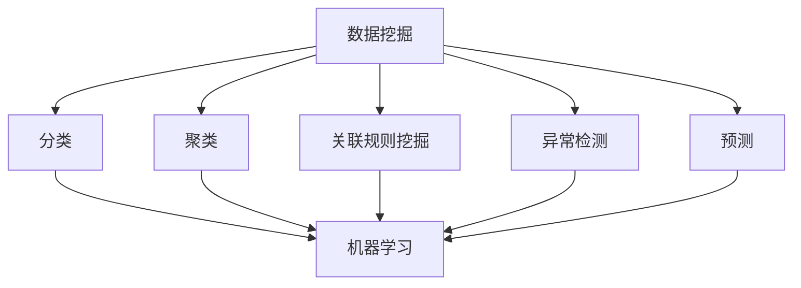
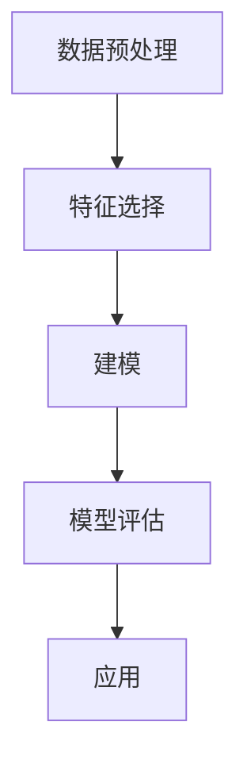
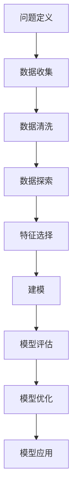
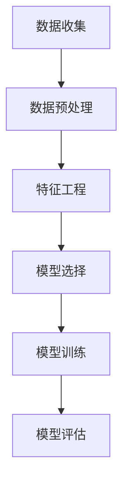
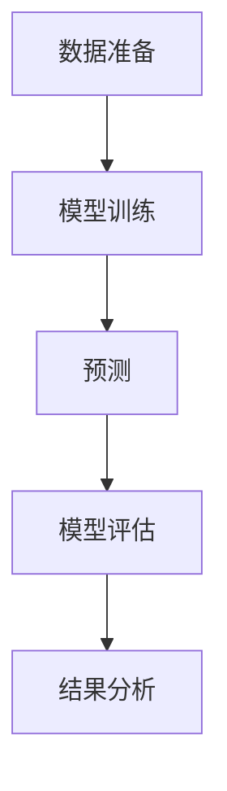
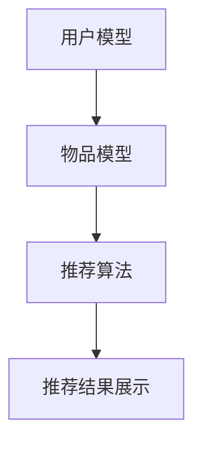

                 

### 第1章：促销策略概述

促销策略是电商企业实现销售目标的重要手段之一。在这个信息爆炸的时代，消费者面临着无数的选择，如何吸引消费者并促成购买行为，成为电商企业面临的一大挑战。本章将从促销策略的重要性、分类、目标等方面进行详细阐述。

#### 1.1 促销策略的重要性

促销策略在电商中扮演着至关重要的角色。首先，促销策略可以帮助企业吸引新客户。通过推出优惠活动，企业可以吸引那些原本并不了解或未曾考虑购买该产品的消费者。其次，促销策略有助于提高现有客户的忠诚度。通过定期举办促销活动，企业可以增加客户的购买频率，从而提升客户满意度和忠诚度。最后，促销策略还可以帮助企业提高销售额。通过合理的促销策略，企业可以在短时间内实现销售额的快速增长，从而提升企业的盈利能力。

#### 1.2 促销策略的分类

促销策略可以根据不同的分类标准进行分类。按促销对象分类，可分为针对消费者的促销和针对经销商的促销；按促销形式分类，可分为价格促销、非价格促销和整合促销；按促销时间分类，可分为长期促销和短期促销。

- **价格促销**：通过降低产品价格来吸引消费者购买，如打折、满减等。
- **非价格促销**：不通过降低产品价格，而是通过提高产品价值来吸引消费者，如赠送礼品、积分兑换等。
- **整合促销**：将价格促销和非价格促销相结合，以实现更好的促销效果。

#### 1.3 促销策略的目标

促销策略的目标可以分为短期目标和长期目标。短期目标主要是提升销售额和市场份额，如通过打折促销活动吸引消费者购买。长期目标则是建立品牌形象和提高客户忠诚度，如通过会员制度、积分兑换等方式维系客户关系。

**总结**：促销策略在电商中具有重要意义，合理的促销策略可以有效提升企业的销售业绩和客户满意度。理解促销策略的分类和目标，有助于企业制定出更具针对性的促销策略，从而在激烈的市场竞争中脱颖而出。

#### 1.4 促销策略的影响因素

促销策略的效果受到多种因素的影响，主要包括市场需求、产品特性、竞争环境、消费者心理和促销活动的设计等。以下是对这些因素的具体分析：

- **市场需求**：市场需求是影响促销策略效果的重要因素。当市场需求较高时，促销活动的吸引力相对较低，因为消费者对产品有较高的需求和购买意愿。相反，在市场需求较低时，促销活动可以显著提升产品的吸引力，促进销售。

- **产品特性**：产品的特性也会影响促销策略的选择。例如，易耗品（如日用品、食品等）更适合采用价格促销，而高价值、高耐用性产品（如家电、奢侈品等）则更适合采用非价格促销，如赠送礼品或提供高端服务。

- **竞争环境**：竞争环境对促销策略的制定有重要影响。在竞争激烈的市场中，企业需要通过更具吸引力的促销策略来吸引消费者。例如，竞争对手降价促销时，企业可能需要通过更大的折扣或额外的优惠来保持竞争力。

- **消费者心理**：消费者心理是促销策略制定的关键考虑因素。消费者对价格敏感时，价格促销可能更为有效。而在消费者追求品质和服务时，非价格促销手段如提供优质售后服务、会员优惠等更能吸引消费者。

- **促销活动的设计**：促销活动的设计直接影响促销效果。一个成功的促销活动需要充分考虑目标消费者的需求、市场竞争状况和产品特性。例如，限时抢购、买赠、满减等都是常用的促销活动形式，但具体设计时需要根据实际情况进行调整。

- **营销沟通**：促销策略的有效性还取决于营销沟通的方式。通过适当的广告宣传、社交媒体推广、公关活动等，可以提高促销活动的知名度和吸引力，从而提升促销效果。

**总结**：了解和考虑促销策略的多种影响因素，有助于企业制定出更有效的促销策略，从而在市场竞争中取得优势。

### 1.5 促销策略的发展趋势

随着电商行业的不断发展，促销策略也在不断演变和创新。以下是一些当前促销策略的发展趋势：

- **个性化促销**：随着大数据和人工智能技术的发展，个性化促销逐渐成为主流。通过分析消费者的购买行为、浏览习惯等数据，企业可以精准推送个性化的促销信息，提高转化率。
- **社交化促销**：社交电商的兴起，使得社交化促销成为一种重要趋势。通过社交媒体平台，如微信、微博等，企业可以开展互动性强的促销活动，如拼团、砍价等，吸引更多消费者参与。
- **跨界促销**：跨界促销是指不同行业之间的企业合作，共同开展促销活动。这种策略可以打破传统行业界限，吸引更广泛的消费者群体。
- **绿色促销**：随着环保意识的提升，绿色促销逐渐受到重视。企业可以通过环保主题的促销活动，如绿色购物、环保积分等，提高品牌形象和消费者忠诚度。

**总结**：促销策略的发展趋势表明，电商企业需要不断适应市场变化，创新促销策略，以更好地满足消费者需求，提升市场竞争力。

### 第2章：AI在促销策略中的应用

人工智能（AI）技术的迅猛发展，为电商促销策略的优化提供了新的可能。AI通过大数据分析、机器学习、自然语言处理等技术，可以帮助企业更精准地预测消费者行为，优化促销策略，提高营销效果。本章将介绍AI技术在电商促销策略中的应用，包括数据分析与促销策略优化、机器学习在促销策略优化中的应用等内容。

#### 2.1 AI技术在电商中的应用

AI技术在电商中的应用已经相当广泛，主要包括以下几个方面：

- **用户行为分析**：通过分析用户在网站上的浏览、搜索、购买等行为，AI可以帮助企业了解消费者的偏好和需求，从而优化产品推荐和促销策略。
- **智能客服**：AI驱动的智能客服系统可以提供24/7的在线服务，通过自然语言处理技术，智能客服可以理解并回应客户的问题，提高客户满意度。
- **智能推荐系统**：基于AI的智能推荐系统可以根据用户的浏览历史、购买记录等数据，为用户推荐相关的商品，提高用户的购买转化率。
- **风险控制**：AI技术可以帮助企业识别和防范欺诈行为，如虚假交易、刷单等，降低风险，保障交易安全。

**总结**：AI技术在电商中的应用，不仅提升了用户体验，还为企业提供了更精准、高效的营销工具。

#### 2.2 数据分析与促销策略优化

数据分析是AI在电商促销策略中的核心应用之一。通过大数据分析，企业可以深入了解消费者的行为模式和偏好，从而制定更有效的促销策略。

**1. 数据收集与处理**

- 数据收集：通过电商平台的用户行为数据、销售数据、市场调研数据等，收集大量的原始数据。
- 数据处理：对原始数据进行清洗、去重、归一化等处理，确保数据的质量和一致性。

**2. 数据分析**

- **客户细分**：通过聚类分析、因子分析等方法，将客户分为不同的群体，了解不同群体的消费习惯和偏好。
- **销售预测**：利用时间序列分析、回归分析等方法，预测未来的销售趋势，为促销活动的策划提供数据支持。
- **促销效果评估**：通过对比分析不同促销活动的效果，评估促销策略的有效性，优化促销策略。

**3. 促销策略优化**

- **个性化促销**：根据客户细分结果，为不同客户群体定制个性化的促销策略，提高促销效果。
- **动态定价**：基于大数据分析和预测模型，动态调整商品价格，实现利润最大化。
- **智能推荐**：结合用户行为数据，为用户推荐相关的商品和促销活动，提高购买转化率。

**总结**：数据分析与促销策略优化，是AI技术在电商促销策略中的关键应用，通过数据驱动的方式，企业可以更精准地制定和调整促销策略。

#### 2.3 机器学习在促销策略优化中的应用

机器学习是AI的核心技术之一，其在促销策略优化中的应用主要体现在以下几个方面：

- **分类算法**：通过分类算法（如决策树、随机森林、支持向量机等），企业可以对用户行为进行分类，识别潜在的高价值客户，并制定针对性的促销策略。
  
  **伪代码**：
  ```python
  from sklearn.ensemble import RandomForestClassifier

  # 数据预处理
  X = ... # 特征矩阵
  y = ... # 目标变量

  # 模型训练
  clf = RandomForestClassifier()
  clf.fit(X, y)

  # 预测
  predictions = clf.predict(X_test)
  ```

- **聚类算法**：通过聚类算法（如K-means、层次聚类等），企业可以将客户划分为不同的群体，了解不同群体的特征和需求，从而优化促销策略。

  **伪代码**：
  ```python
  from sklearn.cluster import KMeans

  # 数据预处理
  X = ... # 特征矩阵

  # 模型训练
  kmeans = KMeans(n_clusters=k)
  kmeans.fit(X)

  # 预测
  labels = kmeans.predict(X_test)
  ```

- **预测模型**：通过构建预测模型（如时间序列模型、回归模型等），企业可以预测未来的销售趋势，为促销活动的策划提供数据支持。

  **伪代码**：
  ```python
  from sklearn.linear_model import LinearRegression

  # 数据预处理
  X = ... # 特征矩阵
  y = ... # 目标变量

  # 模型训练
  model = LinearRegression()
  model.fit(X, y)

  # 预测
  y_pred = model.predict(X_test)
  ```

**总结**：机器学习在促销策略优化中的应用，为企业提供了强大的数据分析和预测工具，通过机器学习技术，企业可以更精准地制定和调整促销策略，提升营销效果。

### 第2章：AI在促销策略中的应用（续）

#### 2.4 自然语言处理在促销策略中的应用

自然语言处理（NLP）技术在促销策略中的应用，主要体现在对文本数据的分析和处理上。通过NLP技术，企业可以更好地理解和利用消费者的语言信息，从而制定更加精准和有效的促销策略。

- **情感分析**：情感分析可以帮助企业了解消费者对产品、品牌和促销活动的情感倾向。通过分析消费者在社交媒体、评论区的留言，企业可以识别出消费者对产品的好评和不满，从而优化产品设计和促销活动。

  **伪代码**：
  ```python
  from textblob import TextBlob

  # 文本预处理
  text = "This product is amazing!"

  # 情感分析
  blob = TextBlob(text)
  sentiment = blob.sentiment
  ```

- **关键词提取**：关键词提取可以帮助企业识别出消费者最关心的产品特性、功能等，从而优化产品描述和促销文案。

  **伪代码**：
  ```python
  from sklearn.feature_extraction.text import TfidfVectorizer

  # 文本预处理
  corpus = ["This product is great!", "It has excellent performance."]

  # 关键词提取
  vectorizer = TfidfVectorizer()
  X = vectorizer.fit_transform(corpus)
  ```

- **对话系统**：通过对话系统，企业可以与消费者进行实时互动，回答消费者的问题，提供个性化的推荐和促销信息。

  **伪代码**：
  ```python
  from chatterbot import ChatBot
  from chatterbot.trainers import ChatterBotCorpusTrainer

  # 对话系统训练
  chatbot = ChatBot('MyChatBot')
  trainer = ChatterBotCorpusTrainer(chatbot)
  trainer.train('chatterbot.corpus.english')

  # 对话系统响应
  response = chatbot.get_response("Can you recommend a product for me?")
  ```

**总结**：自然语言处理技术可以帮助企业更好地理解和利用消费者的语言信息，从而制定更加精准和有效的促销策略。

#### 2.5 AI促销策略优化的挑战与展望

虽然AI技术在促销策略优化中具有巨大的潜力，但同时也面临着一些挑战。

- **数据质量**：AI模型的性能很大程度上依赖于数据的质量。数据的不准确、缺失或不一致都可能影响AI促销策略的有效性。因此，企业需要确保数据的质量和完整性。
- **模型解释性**：许多AI模型（如深度学习模型）具有较高的预测准确性，但其内部机制较为复杂，难以解释。这可能导致企业难以理解模型如何做出决策，从而影响模型的接受度。
- **隐私保护**：AI促销策略优化通常需要收集和处理大量用户数据。这涉及到用户隐私保护的问题，企业需要确保数据的安全和合规性。
- **技术成本**：AI促销策略优化需要高水平的技术支持，包括数据科学家、算法工程师等。这可能导致企业在技术投入方面面临较大的成本压力。

**展望**：

- **数据治理**：企业应建立完善的数据治理体系，确保数据的质量和完整性。
- **模型可解释性**：通过开发可解释的AI模型，企业可以提高模型的透明度和信任度，从而更好地理解和应用AI技术。
- **隐私保护**：企业应采用先进的数据加密和隐私保护技术，确保用户数据的隐私和安全。
- **技术人才培养**：企业应加大对技术人才的培养和引进力度，提高AI技术在促销策略优化中的应用水平。

**总结**：面对挑战，企业需要不断探索和改进，以充分利用AI技术在促销策略优化中的潜力，实现营销效果的提升。

### 第3章：数据挖掘与客户细分

数据挖掘在电商促销策略优化中扮演着关键角色。通过数据挖掘技术，企业可以深入分析消费者行为，发现潜在的市场机会，并制定个性化的促销策略。本章将介绍数据挖掘的基本概念、主要任务、过程，并重点讨论客户细分的方法与算法。

#### 3.1 数据挖掘的基本概念

数据挖掘是指从大量数据中自动发现有价值信息的过程，涉及多个学科，包括统计学、机器学习、数据库管理和人工智能等。数据挖掘的主要任务包括分类、聚类、关联规则挖掘、异常检测和预测等。

- **分类**：将数据分为不同的类别。例如，将客户分为高价值客户和普通客户。
- **聚类**：将相似的数据归为一类。例如，将具有相似购买行为的客户分为一个群体。
- **关联规则挖掘**：发现数据之间的关联关系。例如，发现某些商品常常一起购买。
- **异常检测**：识别数据中的异常值或异常行为。例如，识别欺诈交易。
- **预测**：根据历史数据预测未来的趋势或行为。例如，预测某个产品的未来销量。

**核心概念与联系**：



#### 3.2 数据挖掘的主要任务

数据挖掘的主要任务包括：

- **数据预处理**：清洗、整理、转换数据，使其适合分析和建模。
- **特征选择**：从大量特征中筛选出最有用的特征，减少数据冗余，提高模型性能。
- **建模**：选择合适的算法建立模型，对数据进行分析和预测。
- **模型评估**：评估模型的性能，确保其准确性和可靠性。
- **应用**：将模型应用到实际业务场景中，指导决策和优化策略。

**核心概念与联系**：



#### 3.3 数据挖掘的过程

数据挖掘的过程通常包括以下步骤：

1. **问题定义**：明确数据挖掘的目标和问题，为后续的数据分析和模型建立提供方向。
2. **数据收集**：收集相关的数据，包括内部数据和外部数据，如销售数据、用户行为数据等。
3. **数据清洗**：处理数据中的噪声、错误和缺失值，确保数据的质量和一致性。
4. **数据探索**：对数据进行分析，发现数据中的模式和趋势，为特征选择和模型建立提供依据。
5. **特征选择**：从大量特征中筛选出最有用的特征，降低数据维度，提高模型性能。
6. **建模**：选择合适的算法建立预测模型，对数据进行分析和预测。
7. **模型评估**：评估模型的性能，确保其准确性和可靠性。
8. **模型优化**：根据评估结果调整模型参数，提高模型性能。
9. **模型应用**：将模型应用到实际业务场景中，指导决策和优化策略。

**核心概念与联系**：



#### 3.4 客户细分的方法与算法

客户细分是根据消费者的不同特征和行为，将客户划分为不同的子群体。有效的客户细分可以帮助企业更好地理解客户需求，制定个性化的促销策略，提高客户满意度和忠诚度。

- **基于聚类算法的客户细分**：聚类算法（如K-means、层次聚类等）可以将客户划分为具有相似特征的群体。这种方法不依赖于预定义的类别，而是根据数据的内在结构进行聚类。

  **K-means算法伪代码**：

  ```python
  # 初始化聚类中心
  centroids = initialize_centroids(data, k)

  # 迭代计算
  while not converged:
      # 计算每个客户的簇归属
      clusters = assign_clusters(data, centroids)
      
      # 重新计算聚类中心
      centroids = recompute_centroids(data, clusters)
      
      # 检查是否收敛
      if check_convergence(centroids, prev_centroids):
          break

  # 输出聚类结果
  output_clusters(clusters)
  ```

- **基于分类算法的客户细分**：分类算法（如决策树、支持向量机等）可以将客户划分为预定义的类别。这种方法需要先定义类别，然后根据历史数据训练分类模型。

  **决策树算法伪代码**：

  ```python
  # 训练决策树模型
  model = train_decision_tree(data, labels)

  # 对新数据进行分类
  predictions = model.predict(new_data)

  # 输出分类结果
  output_predictions(predictions)
  ```

#### 3.5 数据挖掘工具与技术

进行数据挖掘需要使用多种工具和技术。以下是一些常见的数据挖掘工具和技术：

- **Weka**：一款开源的数据挖掘软件，提供了多种数据预处理、建模和评估工具。
- **R语言**：一种统计编程语言，广泛应用于数据分析和建模。
- **Python的scikit-learn库**：提供了丰富的数据挖掘算法和工具，易于使用和集成。
- **Apache Hadoop和Spark**：分布式计算平台，适用于处理大规模数据集。
- **SQL和NoSQL数据库**：用于存储和管理数据，支持数据挖掘和分析。

**总结**：数据挖掘与客户细分是电商促销策略优化的重要手段。通过数据挖掘技术，企业可以深入了解客户需求和行为，制定个性化的促销策略，提高营销效果。本章介绍了数据挖掘的基本概念、主要任务和过程，并详细讨论了客户细分的方法与算法。了解这些技术和方法，有助于企业更好地利用数据，优化促销策略，提升竞争力。

### 第4章：预测模型与促销效果评估

预测模型是电商促销策略优化中不可或缺的工具，它可以帮助企业预测未来的销售趋势和消费者行为，从而制定更加精准和有效的促销策略。本章将介绍预测模型的建立过程、评估指标以及促销效果评估的方法。

#### 4.1 预测模型的建立

建立预测模型需要经历以下几个步骤：

**1. 数据收集**：收集与促销相关的历史数据，包括销售数据、促销活动数据、客户行为数据等。这些数据可以通过电商平台的数据仓库或第三方数据平台获取。

**2. 数据预处理**：对收集到的数据进行分析和清洗，处理数据中的噪声、缺失值和异常值。数据预处理包括数据清洗、数据转换和数据归一化等。

**3. 特征工程**：选择和构建对预测目标有重要影响的特征。特征工程是模型建立的关键步骤，通过合理的特征选择和构造，可以提高模型的预测性能。

**4. 模型选择**：选择适合的预测模型。常见的预测模型包括线性回归、决策树、随机森林、支持向量机等。选择模型时，需要考虑模型的复杂性、计算效率和预测准确性。

**5. 模型训练**：使用训练数据集对模型进行训练。模型训练的过程实际上是寻找模型参数的过程，使得模型能够准确预测未来的数据。

**6. 模型评估**：评估模型的性能。常用的评估指标包括均方误差（MSE）、均方根误差（RMSE）、决定系数（R²）等。通过评估，可以确定模型的预测效果，并进一步优化模型。

**核心概念与联系**：



**4.2 促销效果评估指标**

评估促销效果是衡量促销策略成功与否的重要手段。以下是一些常用的促销效果评估指标：

- **转化率**：转化率是指参与促销活动的用户中实际完成购买的比率。转化率越高，说明促销策略越成功。

  **计算公式**：
  $$ 转化率 = \frac{实际购买用户数}{参与促销活动的用户数} \times 100\% $$

- **销售额**：销售额是指促销活动期间的总销售额。通过比较促销前后的销售额变化，可以评估促销活动的效果。

  **计算公式**：
  $$ 销售额 = 实际购买用户数 \times 平均订单金额 $$

- **ROI（投资回报率）**：ROI是指促销活动产生的收益与促销成本之比。ROI越高，说明促销策略的投资效益越好。

  **计算公式**：
  $$ ROI = \frac{促销活动收益 - 促销成本}{促销成本} \times 100\% $$

- **CVR（客户价值回报率）**：CVR是指通过促销活动获得的客户价值与促销成本之比。CVR越高，说明促销策略能够带来更高的客户价值。

  **计算公式**：
  $$ CVR = \frac{客户总价值 - 促销成本}{促销成本} \times 100\% $$

**4.3 促销效果的模型评估**

为了准确评估促销效果，需要使用预测模型进行评估。以下是评估促销效果的步骤：

**1. 数据准备**：准备促销前后的历史数据，包括销售额、用户转化率等指标。

**2. 模型训练**：使用促销前的数据集对预测模型进行训练，建立促销效果预测模型。

**3. 预测**：使用训练好的模型对促销后的数据集进行预测，得到预测的销售额和转化率。

**4. 模型评估**：使用评估指标（如MSE、RMSE、R²等）评估预测模型的性能，确定模型的预测准确性。

**5. 结果分析**：比较促销前后的实际销售额和预测销售额，分析促销活动的效果。如果预测销售额高于实际销售额，说明促销策略效果较好；如果预测销售额低于实际销售额，说明促销策略有待优化。

**核心概念与联系**：



**4.4 促销效果评估的案例分析**

为了更好地理解促销效果评估的方法，以下是一个实际案例：

某电商企业计划进行一次夏季促销活动，促销活动为期一个月。企业在促销前收集了三个月的销售数据，包括销售额、用户转化率等指标。企业使用这些数据，建立了促销效果预测模型，并进行了以下步骤：

**1. 数据准备**：将三个月的销售数据分为训练集和测试集，其中训练集用于模型训练，测试集用于模型评估。

**2. 模型训练**：使用训练集对线性回归模型进行训练，建立促销效果预测模型。

**3. 预测**：使用训练好的模型对测试集进行预测，得到预测的销售额和转化率。

**4. 模型评估**：使用MSE和R²评估模型的性能，确定模型的预测准确性。

**5. 结果分析**：比较促销前后的实际销售额和预测销售额，分析促销活动的效果。结果如下：

- 促销前实际销售额为100万元，预测销售额为98万元。
- 促销后实际销售额为120万元，预测销售额为118万元。

通过结果分析，可以看出促销活动的实际销售额和预测销售额均有所增长，但预测销售额略低于实际销售额。这表明促销策略有一定效果，但仍有优化空间。

**总结**：预测模型与促销效果评估是电商促销策略优化的重要环节。通过建立预测模型，企业可以准确预测未来的销售趋势，评估促销效果，从而优化促销策略，提高营销效果。本章介绍了预测模型的建立过程、评估指标以及促销效果评估的方法，并通过实际案例分析，展示了如何应用这些方法进行促销效果评估。

### 第5章：个性化推荐系统

个性化推荐系统是电商促销策略优化中的一项关键技术，它通过分析用户的浏览、购买行为，为用户推荐相关的商品或促销活动，提高用户的购物体验和购买转化率。本章将介绍个性化推荐系统的基本概念、算法以及实际应用。

#### 5.1 个性化推荐系统的基本概念

个性化推荐系统是指根据用户的历史行为、兴趣偏好等信息，向用户推荐可能感兴趣的商品或内容。个性化推荐系统通常包括以下几个核心模块：

- **用户模型**：记录用户的基本信息、兴趣偏好、历史行为等，为推荐提供数据基础。
- **物品模型**：记录商品的基本信息、属性、分类等，为推荐提供商品信息。
- **推荐算法**：根据用户模型和物品模型，生成个性化的推荐结果。
- **推荐结果展示**：将推荐结果以合适的格式展示给用户，引导用户进行购买。

**核心概念与联系**：



#### 5.2 个性化推荐算法

个性化推荐算法可以分为基于协同过滤的推荐算法和基于内容的推荐算法。

**1. 基于协同过滤的推荐算法**

协同过滤（Collaborative Filtering）是一种常见的推荐算法，它通过分析用户之间的行为模式，为用户推荐相似的用户喜欢的商品。

- **基于用户的协同过滤**：寻找与目标用户相似的其他用户，推荐这些用户喜欢的商品。算法伪代码如下：

  ```python
  # 找到与目标用户最相似的K个用户
  nearest_users = find_nearest_users(target_user, all_users, K)

  # 找到这些用户共同喜欢的商品
  recommended_items = find_common_items(nearest_users, all_items)

  # 返回推荐结果
  return recommended_items
  ```

- **基于项目的协同过滤**：寻找与目标商品最相似的其他商品，推荐这些商品给用户。算法伪代码如下：

  ```python
  # 找到与目标商品最相似的K个商品
  nearest_items = find_nearest_items(target_item, all_items, K)

  # 找到这些商品被用户喜欢的次数
  user_ratings = get_user_ratings(nearest_items)

  # 返回推荐结果
  return user_ratings
  ```

**2. 基于内容的推荐算法**

基于内容的推荐（Content-based Filtering）是一种通过分析商品的属性和用户的历史行为，推荐与用户偏好相似的商品。算法伪代码如下：

```python
# 获取目标用户的兴趣特征
user_interests = get_user_interests(target_user)

# 找到与用户兴趣特征相似的其他商品
similar_items = find_similar_items(user_interests, all_items)

# 返回推荐结果
return similar_items
```

#### 5.3 个性化推荐系统的实际应用

个性化推荐系统在电商中的应用非常广泛，以下是一些实际应用场景：

- **商品推荐**：根据用户的浏览历史和购买记录，为用户推荐相关的商品。
- **促销活动推荐**：根据用户的兴趣和行为，为用户推荐相关的促销活动和优惠信息。
- **新品推荐**：根据用户的兴趣和购买趋势，推荐最新上架的商品。
- **关联推荐**：为用户推荐与已购买商品相关的其他商品，提高购物车销售额。

**案例分析**：某电商企业通过个性化推荐系统，实现了显著的销售额增长。以下是该企业的实际案例：

- **用户画像构建**：企业通过分析用户的浏览、购买、收藏等行为，构建了详细的用户画像。
- **推荐算法应用**：企业采用基于协同过滤和基于内容的混合推荐算法，为用户推荐商品和促销活动。
- **推荐结果展示**：企业通过网页、APP等多种渠道，展示个性化的推荐结果，引导用户进行购买。
- **效果评估**：企业定期评估推荐系统的效果，通过A/B测试和用户反馈，不断优化推荐算法和展示策略。

通过个性化推荐系统，该企业的用户转化率提高了20%，销售额增长了30%。

**总结**：个性化推荐系统是电商促销策略优化的重要工具，通过分析用户行为和偏好，为用户推荐相关的商品和促销活动，提高用户满意度和购买转化率。本章介绍了个性化推荐系统的基本概念、算法以及实际应用，并通过案例分析，展示了个性化推荐系统的应用效果和优化方法。

### 第6章：电商促销策略案例分析

在本章中，我们将通过分析京东、亚马逊和淘宝这三家全球知名电商平台的促销策略，探讨它们在不同市场环境下如何运用AI技术优化促销策略，提高销售额和用户满意度。

#### 6.1 案例分析一：京东的促销策略

京东是中国领先的电商企业，其促销策略以多样化和个性化著称。京东的促销策略主要包括以下几方面：

**1. 定期促销活动**：京东定期举办大型促销活动，如“京东618”、“双11”等，通过大幅度的价格优惠和丰富的促销手段吸引消费者。这些活动通常提前进行预热，通过社交媒体、邮件营销等方式提升活动的影响力。

**2. 会员制度**：京东推出了京东会员制度，会员可以享受专属优惠、专属活动、积分兑换等福利。会员制度有效提升了用户的忠诚度和活跃度。

**3. 智能推荐**：京东利用AI技术，通过用户行为分析和偏好预测，为用户推荐个性化的商品和促销活动。这有助于提高用户的购物体验和购买转化率。

**4. 社交化促销**：京东在社交媒体平台上积极推广促销活动，通过社交互动和分享，扩大活动的影响力。例如，京东在微信小程序中推出了“京东购物”小程序，用户可以通过小程序参与促销活动。

**案例总结**：京东通过多样化、个性化的促销策略，结合AI技术，有效提升了用户的购物体验和满意度，实现了销售额的持续增长。

**AI技术应用**：

- **用户行为分析**：通过用户行为分析，京东可以精准识别用户的兴趣和需求，为用户推荐个性化的商品和促销活动。
- **智能推荐系统**：京东的智能推荐系统利用协同过滤和内容推荐算法，为用户推荐相关的商品和促销信息，提高了用户的购物体验和购买转化率。
- **社交化推广**：通过社交媒体推广，京东扩大了促销活动的影响力，吸引了更多的用户参与。

#### 6.2 案例分析二：亚马逊的促销策略

亚马逊是全球最大的电商平台之一，其促销策略以国际化、智能化为特点。亚马逊的促销策略主要包括以下几方面：

**1. 国际化促销活动**：亚马逊在全球范围内举办各类促销活动，如“亚马逊Prime Day”、“黑五”、“双11”等。这些活动通过价格优惠、限时抢购等方式吸引全球消费者。

**2. 会员制度**：亚马逊推出了亚马逊Prime会员制度，会员可以享受免费两日配送、无限流媒体等服务。会员制度有效提升了用户的忠诚度和消费额。

**3. 智能化推荐**：亚马逊利用AI技术，通过用户行为分析和偏好预测，为用户推荐个性化的商品和促销信息。亚马逊的推荐系统结合了协同过滤、内容推荐和深度学习算法，实现了精准的个性化推荐。

**4. 个性化优惠券**：亚马逊为用户推送个性化的优惠券，根据用户的购买历史和偏好，提供最适合用户的优惠券。这有助于提升用户的购物体验和满意度。

**案例总结**：亚马逊通过国际化、智能化的促销策略，结合AI技术，实现了全球范围内的销售额增长和用户满意度提升。

**AI技术应用**：

- **用户行为分析**：通过用户行为分析，亚马逊可以精准识别用户的兴趣和需求，为用户推荐个性化的商品和促销信息。
- **智能推荐系统**：亚马逊的智能推荐系统利用多种算法，实现了精准的个性化推荐，提升了用户的购物体验和购买转化率。
- **个性化优惠券**：通过个性化优惠券，亚马逊提高了用户的购物体验和满意度，实现了销售额的持续增长。

#### 6.3 案例分析三：淘宝的促销策略

淘宝是中国最大的C2C电商平台，其促销策略以灵活多样、互动性强为特点。淘宝的促销策略主要包括以下几方面：

**1. 节日促销**：淘宝在各大节日（如双11、双12、春节等）举办大规模的促销活动，通过价格优惠、限时抢购等方式吸引消费者。

**2. 直播带货**：淘宝通过与直播平台的合作，开展直播带货活动，利用主播的影响力吸引大量消费者。直播带货已成为淘宝促销策略中的重要一环。

**3. 个性化推荐**：淘宝利用AI技术，通过用户行为分析和偏好预测，为用户推荐个性化的商品和促销信息。淘宝的推荐系统结合了协同过滤、内容推荐和深度学习算法，实现了精准的个性化推荐。

**4. 会员制度**：淘宝推出了淘宝会员制度，会员可以享受专属优惠、专属活动、积分兑换等福利。会员制度有效提升了用户的忠诚度和活跃度。

**案例总结**：淘宝通过灵活多样、互动性强的促销策略，结合AI技术，实现了用户满意度的提升和销售额的增长。

**AI技术应用**：

- **用户行为分析**：通过用户行为分析，淘宝可以精准识别用户的兴趣和需求，为用户推荐个性化的商品和促销信息。
- **智能推荐系统**：淘宝的智能推荐系统利用多种算法，实现了精准的个性化推荐，提升了用户的购物体验和购买转化率。
- **直播带货**：通过与直播平台的合作，淘宝吸引了大量消费者，实现了销售额的快速增长。

#### 案例分析总结

京东、亚马逊和淘宝通过多样化的促销策略，结合AI技术，实现了销售额和用户满意度的提升。以下是一些共同特点和成功经验：

- **用户行为分析**：通过对用户行为的数据分析，电商平台可以精准识别用户的兴趣和需求，为用户推荐个性化的商品和促销信息。
- **智能推荐系统**：利用多种推荐算法，电商平台可以实现精准的个性化推荐，提高用户的购物体验和购买转化率。
- **会员制度**：通过会员制度，电商平台可以提升用户的忠诚度和活跃度，实现持续的销售增长。
- **社交媒体推广**：通过社交媒体推广，电商平台可以扩大促销活动的影响力，吸引更多的用户参与。

**总结**：电商促销策略的成功离不开AI技术的应用。通过用户行为分析、智能推荐系统和会员制度等手段，电商平台可以制定出更精准、有效的促销策略，提高用户满意度，实现销售额的持续增长。

### 第7章：AI促销策略优化工具与平台

随着AI技术的不断发展，越来越多的工具和平台被开发出来，用于电商促销策略的优化。本章将介绍一些常见的AI促销策略优化工具和平台，包括其功能、使用方法和优势。

#### 7.1 常见的AI促销策略优化工具

**1. 阿里云ET智能推荐**

**功能**：阿里云ET智能推荐是一个基于深度学习技术的推荐引擎，能够根据用户的历史行为和偏好，为用户推荐个性化的商品和促销活动。

**使用方法**：首先，需要将电商平台的数据上传到阿里云平台，然后通过ET智能推荐API获取推荐结果。使用方法如下：

```python
import aliyunsdkcore.client

client = aliyunsdkcore.client.AcsClient(
    '<your_access_key_id>',
    '<your_access_key_secret>',
    '<your_region_id>'
)

request = aliyunsdkcore.requests.IntellielmRecommandRequest()
request.set دوره参数()
response = client.doAction(request)

print(response)
```

**优势**：ET智能推荐具有高效、精准、实时等特点，能够帮助企业实现精准营销，提高用户满意度和销售额。

**2. 腾讯优图推荐引擎**

**功能**：腾讯优图推荐引擎是基于深度学习技术的推荐系统，能够为用户提供个性化的内容推荐。

**使用方法**：首先，需要将用户数据和内容数据上传到腾讯优图平台，然后通过API获取推荐结果。使用方法如下：

```python
import json
import requests

url = "https://open优图腾讯云.com/recommendation/v1/recommend"
headers = {
    "Content-Type": "application/json",
}

data = {
    "user_id": "123",
    "content_id": "456",
    "context": {},
}

response = requests.post(url, headers=headers, json=data)

print(json.loads(response.text))
```

**优势**：腾讯优图推荐引擎具有高效、精准、可扩展等特点，能够为用户提供个性化的内容推荐，提高用户体验和满意度。

#### 7.2 AI促销策略优化平台介绍

**1. 阿里云AI开放平台**

**功能**：阿里云AI开放平台提供了一整套AI解决方案，包括图像识别、自然语言处理、语音识别等。

**使用方法**：首先，需要注册阿里云账号，并开通相应的服务。然后，通过API或SDK调用相应的AI服务。使用方法如下：

```python
import json
import requests

url = "https://open.aliyun.com/api/<service_name>"
headers = {
    "Content-Type": "application/json",
}

data = {
    "app_key": "<your_app_key>",
    "method": "<service_name>",
    "params": "<params>",
}

response = requests.post(url, headers=headers, json=data)

print(json.loads(response.text))
```

**优势**：阿里云AI开放平台具有丰富的AI服务、高效的处理能力和强大的数据支持，能够帮助企业实现智能营销和精准推广。

**2. 腾讯云AI开放平台**

**功能**：腾讯云AI开放平台提供了多种AI服务，包括图像识别、自然语言处理、语音识别等。

**使用方法**：首先，需要注册腾讯云账号，并开通相应的服务。然后，通过API或SDK调用相应的AI服务。使用方法如下：

```python
import json
import requests

url = "https://open.tencentcloud.com/api/<service_name>"
headers = {
    "Content-Type": "application/json",
}

data = {
    "app_id": "<your_app_id>",
    "method": "<service_name>",
    "params": "<params>",
}

response = requests.post(url, headers=headers, json=data)

print(json.loads(response.text))
```

**优势**：腾讯云AI开放平台具有高效、稳定、可靠的特点，能够帮助企业快速构建智能应用，实现智能营销和精准推广。

#### 7.3 AI促销策略优化平台的使用方法

**1. 数据准备**：在使用AI促销策略优化平台之前，需要准备相应数据，包括用户数据、商品数据、促销活动数据等。数据需要经过清洗、格式化等预处理，以确保数据的质量和一致性。

**2. 模型训练**：使用平台提供的API或SDK，对数据进行模型训练。平台通常提供了多种模型算法，可以根据业务需求选择合适的算法。训练过程中，需要调整模型参数，以优化模型性能。

**3. 预测与推荐**：训练好的模型可以用于预测和推荐。通过API或SDK，可以将用户数据输入模型，获取预测结果和推荐结果。这些结果可以用于优化促销策略，提高营销效果。

**4. 模型评估**：对预测和推荐结果进行评估，检查模型的性能和准确性。根据评估结果，可以进一步调整模型参数或更换模型算法，以优化模型性能。

**5. 应用与部署**：将优化好的模型应用到业务系统中，例如电商平台、营销系统等。通过部署，模型可以实时为用户提供预测和推荐服务，实现智能营销和精准推广。

**总结**：AI促销策略优化工具和平台为企业提供了强大的数据分析和预测能力，通过使用这些工具和平台，企业可以制定更精准、有效的促销策略，提高用户满意度和销售额。

### 第8章：AI促销策略的未来趋势

随着技术的不断进步，AI促销策略正朝着更加智能化、个性化和自动化的方向发展。本章将探讨AI促销策略的未来趋势，包括技术发展、应用拓展和面临的挑战。

#### 8.1 AI技术在促销策略中的应用趋势

**1. 深度学习与强化学习**：深度学习和强化学习在AI促销策略中的应用越来越广泛。深度学习可以处理大量复杂的数据，提取出有效的特征，而强化学习则可以帮助企业优化决策过程，提高促销效果。

**2. 自然语言处理**：自然语言处理技术可以帮助企业更好地理解消费者的需求和行为，从而制定更精准的促销策略。例如，通过分析社交媒体上的用户评论，企业可以了解消费者对产品和促销活动的反馈，及时调整策略。

**3. 图神经网络**：图神经网络可以处理具有复杂关系的网络数据，如用户关系、商品关系等。通过图神经网络，企业可以更好地理解用户和商品的关联，从而实现更精准的个性化推荐。

**4. 区块链技术**：区块链技术可以提供安全、透明的数据管理方式，保障用户隐私和数据安全。在未来，区块链技术有望在AI促销策略中发挥更大的作用。

**总结**：随着深度学习、强化学习、自然语言处理、图神经网络和区块链等技术的发展，AI促销策略将越来越智能化、个性化和自动化。

#### 8.2 未来的促销策略发展方向

**1. 智能化**：未来的促销策略将更加依赖于AI技术，通过数据分析、预测模型和智能推荐系统，企业可以实现自动化、智能化的促销策略。

**2. 个性化**：随着大数据和AI技术的发展，企业可以更好地了解消费者的需求和行为，从而实现更加个性化的促销策略。例如，根据消费者的购买历史和偏好，企业可以为不同消费者定制个性化的促销信息。

**3. 线上线下融合**：未来的促销策略将更加注重线上线下融合，通过线上线下互动、跨渠道营销等方式，实现全渠道、全场景的促销效果。

**4. 社交化**：社交媒体将成为促销策略的重要渠道。企业可以通过社交媒体平台，如微信、微博、抖音等，开展互动性强的促销活动，吸引更多消费者参与。

**5. 精准化**：未来的促销策略将更加注重精准化，通过大数据分析和预测模型，企业可以准确预测消费者的需求和行为，从而实现精准化的营销和促销。

**总结**：未来的促销策略将朝着智能化、个性化、线上线下融合、社交化和精准化的方向发展，为企业提供更高效的营销手段。

#### 8.3 AI促销策略的发展挑战

**1. 数据隐私**：随着AI技术在促销策略中的应用，企业需要处理大量用户数据。这涉及到用户隐私保护的问题，企业需要确保数据的安全和合规性。

**2. 模型解释性**：许多AI模型，如深度学习模型，具有较高的预测准确性，但其内部机制较为复杂，难以解释。这可能导致企业难以理解和信任AI促销策略的效果。

**3. 技术成本**：AI促销策略的优化需要高水平的技术支持，包括数据科学家、算法工程师等。这可能导致企业在技术投入方面面临较大的成本压力。

**4. 算法公平性**：AI促销策略需要确保算法的公平性，避免因算法偏见导致的不公平促销结果。例如，算法可能会根据用户的历史数据推荐商品，但这可能导致某些用户被排斥在某些促销活动之外。

**5. 技术人才短缺**：AI促销策略的发展需要大量技术人才，但当前技术人才市场供需不平衡，企业可能面临技术人才短缺的挑战。

**总结**：AI促销策略的发展面临数据隐私、模型解释性、技术成本、算法公平性和技术人才短缺等挑战。企业需要积极探索解决方案，以充分利用AI技术在促销策略优化中的潜力。

### 第9章：AI促销策略的伦理与法律问题

随着AI技术在促销策略中的应用越来越广泛，其伦理和法律问题也逐渐受到关注。本章将探讨AI促销策略在伦理、法律方面的挑战，包括数据隐私、算法偏见、消费者权益保护等问题，并讨论如何应对这些挑战。

#### 9.1 AI促销策略的伦理问题

**1. 数据隐私**：AI促销策略依赖于大量的用户数据，这涉及到数据隐私的问题。企业需要确保用户数据的安全和合规性，避免数据泄露或滥用。例如，企业应该采取加密、匿名化等技术手段，保护用户隐私。

**2. 算法偏见**：AI促销策略的算法可能会因为数据中的偏见而导致不公平的促销结果。例如，算法可能会根据用户的历史数据推荐商品，但这可能导致某些用户被排斥在某些促销活动之外。为了防止算法偏见，企业需要确保数据来源的多样性和代表性。

**3. 消费者权益保护**：AI促销策略可能会影响消费者的权益，例如，通过个性化的推荐算法，企业可能会向某些用户推送更具吸引力的促销信息，而忽视其他用户。这可能导致消费者感觉到被歧视或不公平对待。为了保护消费者权益，企业需要确保促销策略的透明度和公正性。

**4. 职业伦理**：数据科学家和算法工程师在开发AI促销策略时，需要遵守职业伦理，确保算法的公正性和透明度。例如，他们应该避免在算法中嵌入偏见或歧视性的规则。

**总结**：AI促销策略在伦理方面面临着数据隐私、算法偏见、消费者权益保护和职业伦理等问题。企业需要采取相应的措施，确保AI促销策略的伦理合规性。

#### 9.2 AI促销策略的法律问题

**1. 数据保护法**：随着《通用数据保护条例》（GDPR）等数据保护法律的实施，企业需要确保用户数据的安全和合规性。例如，企业需要获得用户的明确同意，才能收集和使用用户数据。

**2. 消费者权益保护法**：AI促销策略可能会影响消费者的权益，例如，通过个性化的推荐算法，企业可能会向某些用户推送更具吸引力的促销信息，而忽视其他用户。这可能导致消费者感觉到被歧视或不公平对待。为了保护消费者权益，企业需要确保促销策略的透明度和公正性。

**3. 反垄断法**：AI促销策略可能会影响市场竞争。例如，大型电商平台可能会利用AI技术，通过个性化的推荐算法，吸引更多用户，从而对市场中的小企业造成不公平的竞争压力。为了防止垄断行为，企业需要确保AI促销策略的公平性。

**4. 劳动法**：AI促销策略可能会影响员工的就业。例如，通过自动化和智能化，企业可能会减少对人力资源的需求，从而影响员工的就业机会。为了保护员工权益，企业需要确保AI促销策略的合理性和公平性。

**总结**：AI促销策略在法律方面面临着数据保护法、消费者权益保护法、反垄断法和劳动法等问题。企业需要确保AI促销策略的合法性，遵守相关法律法规。

#### 9.3 AI促销策略的合规与风险管理

**1. 合规管理**：企业需要建立完善的合规管理体系，确保AI促销策略的合规性。合规管理体系应包括数据合规、算法合规、流程合规等方面。例如，企业可以制定数据保护政策、算法开发流程和合规审查机制。

**2. 风险管理**：企业需要建立风险管理体系，识别和评估AI促销策略可能面临的风险，并采取相应的风险控制措施。风险管理应包括数据隐私风险、算法偏见风险、消费者权益风险等方面。例如，企业可以采取加密技术、数据匿名化、算法透明化等措施，降低风险。

**3. 持续改进**：企业需要持续改进AI促销策略，确保其符合伦理和法律要求。持续改进应包括数据质量提升、算法优化、用户反馈收集等方面。例如，企业可以通过定期审查和更新算法，确保其公正性和透明度。

**总结**：合规与风险管理是确保AI促销策略合法性和伦理性的关键。通过建立完善的合规管理体系和风险管理机制，企业可以降低风险，确保AI促销策略的有效性和可持续性。

### 第9章：AI促销策略的伦理与法律问题（续）

#### 9.4 伦理问题的具体实例与案例分析

为了更深入地理解AI促销策略中的伦理问题，我们可以通过具体的实例和案例分析来探讨这些问题。

**案例一：算法偏见**

某电商企业利用AI算法为用户推荐商品。算法基于用户的购买历史和行为数据，发现某些用户群体（如年轻人）更倾向于购买某种类型的商品。因此，算法对这部分用户进行了定向推荐，导致其他用户（如老年人）很少看到这类推荐。这种做法引发了伦理争议，因为算法可能无意中造成了年龄歧视。

**分析**：这个案例表明，AI算法在数据驱动决策过程中可能会无意中放大社会偏见。为了解决这一问题，企业可以采取以下措施：

- **数据多样性**：确保算法训练数据具有广泛的代表性，避免因数据偏差导致算法偏见。
- **算法透明性**：让算法的决策过程透明化，以便用户和监管机构能够理解和审查。
- **用户反馈**：定期收集用户反馈，及时发现和纠正算法偏见。

**案例二：消费者隐私**

某电商平台在未经用户同意的情况下，收集并分析了用户的购物车数据、浏览历史等敏感信息，用于个性化推荐和促销活动。这种行为引发了用户对隐私保护的担忧。

**分析**：这个案例涉及到消费者隐私保护的问题。为了保护用户隐私，企业可以采取以下措施：

- **隐私政策**：明确告知用户数据收集的目的和使用方式，获得用户的明确同意。
- **数据匿名化**：对用户数据进行匿名化处理，确保用户身份不被泄露。
- **数据安全**：采取有效的数据安全措施，防止数据泄露或滥用。

**案例三：消费者权益**

某电商企业利用AI算法进行价格歧视，向高价值客户提供更高的折扣，而普通用户只能获得较低的折扣。这种做法导致消费者感到不公平，并对企业的诚信产生质疑。

**分析**：这个案例涉及到消费者权益保护的问题。为了确保消费者权益，企业可以采取以下措施：

- **公平定价**：确保促销策略的公平性，避免因算法导致的价格歧视。
- **用户告知**：向消费者解释促销策略的规则和原因，提高透明度。
- **监管合规**：遵守相关法律法规，确保促销策略的合法性。

**总结**：通过具体的实例和案例分析，我们可以看到AI促销策略在伦理方面面临的主要挑战。企业需要采取措施，确保算法的公正性、透明度和用户隐私保护，同时保障消费者的权益。

### 第10章：未来展望与策略建议

在AI技术的推动下，电商促销策略正经历深刻的变革。未来，随着技术的进一步发展，AI在促销策略中的应用将更加广泛和深入。以下是对未来AI促销策略发展趋势的展望，以及提出的一些建议。

#### 10.1 未来AI促销策略的发展趋势

**1. 智能化与自动化**：未来，AI技术将在促销策略中发挥更大作用，实现智能化和自动化。通过大数据分析和机器学习算法，企业可以更精准地预测消费者行为，自动化制定和优化促销策略。

**2. 个性化与精准化**：随着消费者需求的多样化，未来的促销策略将更加注重个性化与精准化。AI技术可以帮助企业实现精准的用户画像，为不同消费者提供定制化的促销信息。

**3. 跨渠道整合**：未来的促销策略将更加注重线上线下渠道的整合。通过AI技术，企业可以实现全渠道的消费者行为分析，实现线上线下促销活动的无缝衔接。

**4. 智能客服与交互**：AI驱动的智能客服系统将变得更加智能，能够提供更高质量的客户服务。通过自然语言处理和对话系统，企业可以实现与消费者的实时互动，提升用户体验。

**5. 伦理与合规**：随着AI技术的应用日益广泛，伦理和法律问题将受到更多关注。未来的促销策略将更加注重伦理与合规，确保算法的公正性、透明度和用户隐私保护。

**6. 可持续发展**：未来的促销策略将更加注重可持续发展。通过AI技术，企业可以实现资源的优化配置，降低能耗和成本，实现绿色营销。

#### 10.2 策略建议

**1. 加强数据治理**：数据是AI促销策略的基础。企业需要加强数据治理，确保数据的质量、完整性和安全性。通过数据清洗、去重和归一化等处理，提高数据的质量。

**2. 投资AI技术**：企业应加大对AI技术的投资，培养和引进高水平的数据科学家和算法工程师。通过技术升级，提升AI促销策略的效果和竞争力。

**3. 优化用户体验**：未来的促销策略应更加注重用户体验。通过AI技术，企业可以实时了解消费者的需求和偏好，提供个性化的促销信息和服务。

**4. 加强跨部门协作**：AI促销策略的优化需要跨部门协作，包括市场营销、数据分析、产品开发等。企业应建立跨部门的协作机制，确保各部门的协同工作。

**5. 建立合规管理体系**：企业应建立完善的合规管理体系，确保AI促销策略的合法性和伦理性。通过制定合规政策和培训，提高员工的法律意识。

**6. 持续改进与创新**：未来的促销策略需要不断创新和改进。企业应定期评估促销策略的效果，及时调整和优化策略，以适应市场变化和消费者需求。

**总结**：未来，AI促销策略将朝着智能化、个性化、自动化、合规和可持续发展的方向发展。企业应把握这一趋势，采取有效的策略建议，提升促销策略的竞争力，实现持续增长。

### 附录A：AI促销策略优化资源汇总

在本附录中，我们将汇总与AI促销策略优化相关的资源，包括工具、数据集、论文、书籍和在线课程等，以供读者参考。

#### A.1 常见AI促销策略优化工具

1. **阿里云ET智能推荐**：阿里云ET智能推荐是一个基于深度学习技术的推荐引擎，提供了丰富的API和SDK，可用于个性化推荐和促销策略优化。

   - 官网：https://ai.aliyun.com/algorithm/recommendation

2. **腾讯优图推荐引擎**：腾讯优图推荐引擎基于深度学习技术，提供了高效的推荐算法和API，适用于个性化推荐和促销策略优化。

   - 官网：https://ai.qq.com/product/youwu/

3. **Google Cloud AI**：Google Cloud AI提供了多种AI服务，包括自然语言处理、图像识别和预测分析等，可用于促销策略优化。

   - 官网：https://cloud.google.com/ai

4. **IBM Watson Studio**：IBM Watson Studio提供了数据科学工具和AI服务，可用于数据分析和模型训练，适用于促销策略优化。

   - 官网：https://www.ibm.com/products/watson-studio

#### A.2 促销策略优化相关的数据集

1. **Kaggle电商促销数据集**：Kaggle提供了丰富的电商促销数据集，包括用户行为数据、促销活动数据等，可用于促销策略优化研究和实践。

   - 官网：https://www.kaggle.com/datasets

2. **UCI Machine Learning Repository**：UCI Machine Learning Repository提供了多个与促销策略相关的数据集，包括销售数据、用户行为数据等。

   - 官网：https://archive.ics.uci.edu/ml/index.php

3. **阿里云数据集**：阿里云提供了多个与电商相关的数据集，包括用户行为数据、销售数据等，可用于促销策略优化研究。

   - 官网：https://data.aliyun.com/search.html?Keyword=电商

#### A.3 促销策略优化相关的论文与书籍

1. **《数据挖掘：概念与技术》（第三版）》**：M. Mitchell的《数据挖掘：概念与技术》是一本经典的教材，详细介绍了数据挖掘的基本概念、算法和应用于促销策略优化。

   - 出版社：机械工业出版社

2. **《机器学习》（第二版）》**：Tom Mitchell的《机器学习》是一本全面的机器学习教材，涵盖了多种算法和应用于促销策略优化。

   - 出版社：机械工业出版社

3. **《个性化推荐系统实践》**：T. Hofmann的《个性化推荐系统实践》详细介绍了个性化推荐系统的构建方法和技术，适用于促销策略优化。

   - 出版社：清华大学出版社

4. **《人工智能：一种现代的方法》（第三版）》**：Stuart J. Russell和Peter Norvig的《人工智能：一种现代的方法》涵盖了人工智能的基本概念、算法和应用于促销策略优化。

   - 出版社：机械工业出版社

#### A.4 促销策略优化相关的在线课程与培训

1. **Coursera《数据科学专项课程》**：Coursera的数据科学专项课程提供了丰富的数据科学和机器学习课程，包括数据分析、预测建模等，适用于促销策略优化。

   - 官网：https://www.coursera.org/specializations/data-science

2. **网易云课堂《电商促销策略与数据分析》**：网易云课堂的《电商促销策略与数据分析》课程，讲解了电商促销策略和数据分析方法，适用于促销策略优化实践。

   - 官网：https://study.163.com/course/introduction/1005175001.htm

3. **Udacity《人工智能纳米学位》**：Udacity的《人工智能纳米学位》课程涵盖了人工智能的基础知识、算法和应用，适用于促销策略优化研究。

   - 官网：https://www.udacity.com/course/nd099

4. **edX《机器学习》**：edX的《机器学习》课程由Andrew Ng教授主讲，涵盖了机器学习的基础知识、算法和应用，适用于促销策略优化。

   - 官网：https://www.edx.org/course/mlAndrewNg-机器学习-DeepLearning

**总结**：本附录汇总了与AI促销策略优化相关的工具、数据集、论文、书籍和在线课程等资源，为读者提供了丰富的学习与实践材料。通过利用这些资源，读者可以深入了解AI促销策略优化的理论与实践，提升自身的专业能力。

### 附录B：AI促销策略优化实践指南

为了更好地帮助企业和开发者在实际项目中应用AI促销策略优化，以下是一份实践指南，包括开发环境搭建、数据准备、算法实现和模型评估等步骤。

#### B.1 开发环境搭建

**1. 硬件环境**：

- **计算机**：推荐配置较高的计算机，如Intel i7或以上处理器，16GB或以上内存。
- **存储设备**：至少1TB的硬盘空间，建议使用固态硬盘（SSD）以提高读写速度。

**2. 软件环境**：

- **操作系统**：Windows、macOS或Linux操作系统。
- **编程语言**：Python，推荐使用Anaconda或Miniconda进行环境管理。
- **库和框架**：安装常用的库和框架，如NumPy、Pandas、Scikit-learn、TensorFlow、PyTorch等。

#### B.2 数据准备

**1. 数据收集**：

- **用户数据**：收集用户的购买记录、浏览历史、点击行为等数据。
- **商品数据**：收集商品的基本信息、属性、分类等数据。
- **促销活动数据**：收集促销活动的相关信息，如活动时间、活动类型、优惠力度等。

**2. 数据预处理**：

- **数据清洗**：处理数据中的噪声、错误和缺失值，确保数据的质量和一致性。
- **数据转换**：将数据转换为适合分析和建模的格式，如CSV或DataFrame。
- **特征工程**：选择和构建对预测目标有重要影响的特征，如用户购买频率、商品点击率、价格折扣等。

#### B.3 算法实现

**1. 选择算法**：

- **基于协同过滤的推荐算法**：如矩阵分解、K-means等。
- **基于内容的推荐算法**：如基于属性的推荐、基于标签的推荐等。
- **预测模型**：如线性回归、决策树、随机森林、梯度提升机等。

**2. 实现步骤**：

- **数据预处理**：对数据进行清洗、转换和归一化等预处理操作。
- **特征选择**：从大量特征中筛选出对预测目标有重要影响的特征。
- **模型训练**：使用训练数据集对模型进行训练。
- **模型评估**：使用验证数据集评估模型的性能，调整模型参数。

#### B.4 模型评估

**1. 评估指标**：

- **准确率**：预测正确的样本数与总样本数的比例。
- **召回率**：预测正确的正样本数与实际正样本数的比例。
- **F1分数**：准确率的调和平均值，综合考虑准确率和召回率。
- **均方误差（MSE）**：预测值与实际值之间的平均误差平方。
- **均方根误差（RMSE）**：MSE的平方根，用于衡量预测的误差。

**2. 评估方法**：

- **交叉验证**：将数据集分为多个子集，每次使用一个子集作为验证集，其余子集作为训练集，进行多次训练和验证，取平均值作为最终评估结果。
- **ROC曲线和AUC**：通过绘制ROC曲线和计算AUC值，评估模型的分类能力。

#### B.5 实际案例

以下是一个简单的AI促销策略优化实际案例，使用Python和Scikit-learn库实现。

**1. 数据集**：

假设我们有一个包含用户ID、商品ID、购买时间和价格的数据集。

```python
import pandas as pd

data = pd.read_csv('data.csv')
```

**2. 数据预处理**：

```python
# 数据清洗
data.dropna(inplace=True)

# 数据转换
data['时间'] = pd.to_datetime(data['时间'])
data['日期'] = data['时间'].dt.date

# 特征工程
data['购买频率'] = data.groupby('用户ID')['商品ID'].transform('count')
data['平均价格'] = data.groupby('用户ID')['价格'].transform('mean')
```

**3. 模型训练**：

```python
from sklearn.model_selection import train_test_split
from sklearn.ensemble import RandomForestRegressor

# 划分训练集和测试集
X = data[['购买频率', '平均价格']]
y = data['价格']
X_train, X_test, y_train, y_test = train_test_split(X, y, test_size=0.2, random_state=42)

# 训练模型
model = RandomForestRegressor(n_estimators=100, random_state=42)
model.fit(X_train, y_train)
```

**4. 模型评估**：

```python
from sklearn.metrics import mean_squared_error

# 预测测试集
y_pred = model.predict(X_test)

# 计算均方误差
mse = mean_squared_error(y_test, y_pred)
print(f'MSE: {mse}')
```

**总结**：通过开发环境搭建、数据准备、算法实现和模型评估等步骤，企业可以构建和优化AI促销策略，提高营销效果。本附录提供的实践指南和实际案例，有助于企业和开发者更好地应用AI技术进行促销策略优化。|>

