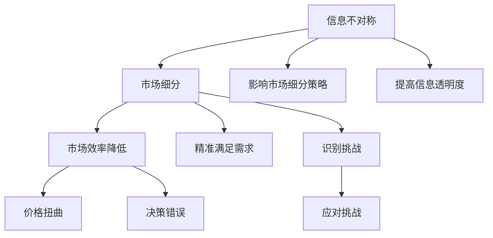

                 

### 文章标题

“信息差：信息不对称与市场细分”

### 关键词

- 信息不对称
- 市场细分
- 数据分析
- 竞争策略
- 风险管理

### 摘要

本文深入探讨了信息不对称与市场细分之间的关系及其在商业决策中的应用。首先，文章定义了信息不对称的基本概念和类型，并阐述了其在市场效率、价格扭曲和决策错误方面的负面影响。接着，文章详细介绍了市场细分的概念和分类，探讨了信息不对称对市场细分策略的影响以及市场细分如何缓解信息不对称。文章还重点分析了信息不对称在市场细分中的实际应用，包括消费者行为分析、差异化营销策略、市场进入策略和供应链管理。此外，文章通过具体案例研究和伪代码，展示了如何利用信息不对称来优化市场细分策略。最后，文章总结了信息不对称与市场细分中的风险管理策略，并讨论了其在实际操作中的应用。通过本文，读者可以全面了解信息不对称与市场细分的重要性和实践方法，从而在商业决策中更有效地利用信息优势。

### 第一部分：信息不对称与市场细分的基本概念

在商业世界中，信息不对称是一个普遍存在的现象，它对市场的运作和企业的决策产生了深远的影响。本部分将首先定义信息不对称的概念，然后详细介绍市场细分的基本概念，最后分析信息不对称与市场细分之间的关系。

#### 1.1 信息不对称的概念与影响

**定义信息不对称**：信息不对称是指在市场交易中，某些参与者（通常是卖方）拥有而其他参与者（通常是买方）缺乏的信息差异。这种信息差异可能导致市场机制失灵，影响市场的有效运作。

**信息不对称的类型**：

1. **隐藏信息**：这种情况下，卖方可能隐瞒某些对买方不利的信息，例如产品的真实质量、潜在的风险等。例如，二手市场上的卖家可能会隐瞒车辆的真实状况，从而使买家面临更高的购买风险。
   
2. **隐藏行动**：卖方可能采取某些行动，但买方无法观察到或验证。例如，保险市场上的投保人可能隐瞒自己的健康状况，从而影响保险公司对风险的评估。

**信息不对称的影响**：

- **市场效率降低**：由于信息不对称，买方可能无法获得足够的信息来做出最优决策，导致市场资源无法有效配置。例如，投资者可能因信息不对称而做出次优的投资决策，导致市场波动。

- **价格扭曲**：信息不对称可能导致价格机制失灵，价格不能准确反映商品的真实价值。例如，如果消费者不了解产品的真实成本，他们可能愿意支付更高的价格，从而导致价格虚高。

- **决策错误**：买方因缺乏信息而可能做出次优决策。例如，消费者可能因为不了解产品的真实性能而购买价格较高的产品，导致资源浪费。

#### 1.2 市场细分的概念与分类

**市场细分的定义**：市场细分是指将一个整体市场划分为若干个子市场，每个子市场具有相似的需求特征。通过市场细分，企业可以更精准地满足不同子市场的需求，从而提高市场竞争力。

**市场细分的类型**：

1. **地理细分**：根据地理位置划分市场，如城市市场、农村市场等。例如，电商企业可能会针对一线城市和农村地区制定不同的营销策略。

2. **人口细分**：根据人口统计特征划分市场，如年龄、性别、收入等。例如，化妆品公司可能会针对年轻女性和中年女性分别推出不同的产品线。

3. **心理细分**：根据消费者的心理特征和生活方式划分市场。例如，企业可能会针对追求环保的消费者推出环保产品。

4. **行为细分**：根据消费者的行为特征划分市场，如购买习惯、消费频率等。例如，电商企业可能会根据消费者的购物频率和购买历史进行精准营销。

#### 1.3 信息不对称与市场细分的关系

**信息不对称影响市场细分**：

- 信息不对称可能导致市场效率降低，影响企业对市场的细分策略。例如，如果消费者不了解产品的真实性能，企业可能需要增加营销成本来获取消费者的信任。

- 企业在市场细分过程中需要应对信息不对称带来的挑战，如提高信息透明度。例如，电商平台可以通过用户评价和产品测评来减少信息不对称。

**市场细分缓解信息不对称**：

- 通过市场细分，企业可以更精准地满足不同细分市场的需求，降低信息不对称。例如，企业可以针对特定人群开发定制化产品，从而更好地满足他们的需求。

- 市场细分有助于企业识别和应对不同市场的独特挑战。例如，企业可以针对不同地区的消费者行为和偏好制定差异化的营销策略。

#### Mermaid 流程图：信息不对称与市场细分的关系

#### 1.4 本章小结

本部分介绍了信息不对称和市场细分的基本概念，以及它们之间的相互关系。信息不对称可能对市场运作产生负面影响，而市场细分则可以帮助企业应对这些挑战，通过更精准的市场定位和策略，降低信息不对称的影响。理解这两个概念之间的关系对于企业在竞争激烈的市场中取得成功至关重要。

### 第一部分：信息不对称与市场细分的基本概念

#### 第1章：信息不对称与市场细分概述

##### 1.1 信息不对称的概念与影响

**定义信息不对称**：在市场中，某些参与者（通常是卖方）拥有而其他参与者（通常是买方）缺乏的信息差异。这种信息差异可能导致市场机制失灵，影响市场的有效运作。

**信息不对称的类型**：

1. **隐藏信息**：这种情况下，卖方可能隐瞒某些对买方不利的信息，例如产品的真实质量、潜在的风险等。例如，二手市场上的卖家可能会隐瞒车辆的真实状况，从而使买家面临更高的购买风险。

2. **隐藏行动**：卖方可能采取某些行动，但买方无法观察到或验证。例如，保险市场上的投保人可能隐瞒自己的健康状况，从而影响保险公司对风险的评估。

**信息不对称的影响**：

- **市场效率降低**：由于信息不对称，买方可能无法获得足够的信息来做出最优决策，导致市场资源无法有效配置。例如，投资者可能因信息不对称而做出次优的投资决策，导致市场波动。

- **价格扭曲**：信息不对称可能导致价格机制失灵，价格不能准确反映商品的真实价值。例如，如果消费者不了解产品的真实成本，他们可能愿意支付更高的价格，从而导致价格虚高。

- **决策错误**：买方因缺乏信息而可能做出次优决策。例如，消费者可能因为不了解产品的真实性能而购买价格较高的产品，导致资源浪费。

##### 1.2 市场细分的概念与分类

**市场细分的定义**：市场细分是指将一个整体市场划分为若干个子市场，每个子市场具有相似的需求特征。通过市场细分，企业可以更精准地满足不同子市场的需求，从而提高市场竞争力。

**市场细分的类型**：

1. **地理细分**：根据地理位置划分市场，如城市市场、农村市场等。例如，电商企业可能会针对一线城市和农村地区制定不同的营销策略。

2. **人口细分**：根据人口统计特征划分市场，如年龄、性别、收入等。例如，化妆品公司可能会针对年轻女性和中年女性分别推出不同的产品线。

3. **心理细分**：根据消费者的心理特征和生活方式划分市场。例如，企业可能会针对追求环保的消费者推出环保产品。

4. **行为细分**：根据消费者的行为特征划分市场，如购买习惯、消费频率等。例如，电商企业可能会根据消费者的购物频率和购买历史进行精准营销。

##### 1.3 信息不对称与市场细分的关系

**信息不对称影响市场细分**：

- **市场效率降低**：由于信息不对称，市场机制可能无法有效运作，导致资源分配不当。例如，在信息不对称的情况下，企业可能无法准确了解消费者的真实需求，从而制定不准确的市场细分策略。

- **价格扭曲**：信息不对称可能导致价格机制失灵，价格不能准确反映商品的真实

