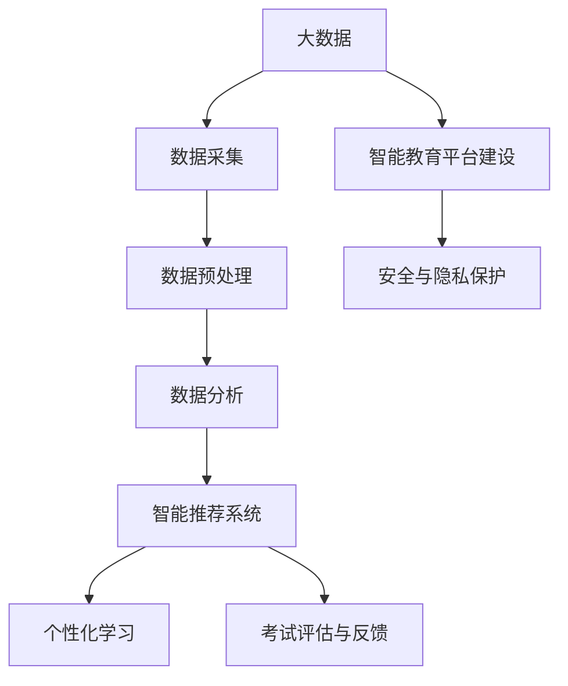

                 

### 文章标题

《信息差：大数据在智能教育中的应用》

### 关键词

大数据、智能教育、数据分析、机器学习、教育技术、信息差

### 摘要

本文旨在探讨大数据在智能教育中的广泛应用，通过深入分析大数据技术的基本原理和实际应用案例，揭示大数据如何改变传统教育模式，提升教育质量和效率。文章首先介绍了大数据的定义和特征，然后详细阐述了大数据在智能教育中的多个应用领域，包括学情分析、教学优化、个性化学习和考试评估等。此外，本文还重点介绍了大数据技术的核心算法原理和数学模型，并通过代码实际案例展示了如何构建一个简单的智能教育平台。最后，文章对大数据与智能教育的未来发展趋势和伦理问题进行了展望，为教育领域的技术创新和实践提供了有益的参考。

### 第一部分：大数据与智能教育概述

#### 第1章：大数据在智能教育中的应用背景

##### 1.1 大数据的定义与特征

大数据（Big Data）是指无法用传统数据处理方法在合理时间内捕捉、管理和处理的数据集合。它具有四个基本特征，即4V，分别是：

- **大量（Volume）**：数据量巨大，从GB到TB甚至PB级别。
- **高速（Velocity）**：数据生成和流动的速度快，需要实时或近实时处理。
- **多样（Variety）**：数据类型繁多，包括结构化、半结构化和非结构化数据。
- **真实（Veracity）**：数据的真实性、准确性和可信度问题。

大数据技术的出现，使得对大规模、复杂、多样数据的高效管理和处理成为可能。在智能教育领域，大数据的应用主要体现在数据采集、存储、处理和分析等方面，为个性化学习、学习行为分析、教学质量评估等提供了有力支持。

##### 1.2 智能教育的概念与发展趋势

智能教育（Smart Education）是指利用现代信息技术和人工智能技术，构建一个智能化的教育环境，实现个性化教育、自适应学习和智能管理。智能教育的发展趋势主要包括：

- **个性化学习**：基于学生的兴趣、能力和学习进度，为学生提供个性化的学习资源和教学服务。
- **自适应学习**：利用大数据和人工智能技术，实时调整教学策略，适应学生的个性化需求。
- **智能管理**：通过数据分析和挖掘，优化教育资源的配置，提高教学管理的效率。
- **教育资源共享**：利用互联网和云计算技术，实现教育资源的跨区域、跨平台共享。

智能教育的目标是通过技术的赋能，提高教育的公平性、质量和效率，满足个性化教育的需求，为每个学生提供最适合他们的学习路径。

##### 1.3 大数据在智能教育中的应用价值

大数据在智能教育中的应用价值体现在多个方面：

- **学情分析**：通过对学生学习数据的分析，了解学生的学习状态、学习习惯和学习效果，为教师提供教学决策依据。
- **教学优化**：利用大数据分析教师的教学方法和学生的学习行为，发现教学中的问题，提出优化方案。
- **个性化学习**：根据学生的学习数据和兴趣爱好，推荐个性化的学习资源和教学策略，提高学习效果。
- **考试评估与反馈**：通过对考试成绩和学生学习过程的数据分析，为教师和学生提供及时的评估和反馈，促进教学改进。

大数据的应用不仅提高了教育质量和效率，还为教育研究提供了丰富的数据资源，推动了教育领域的创新发展。

#### 第2章：大数据在智能教育中的应用领域

##### 2.1 学情分析

学情分析是大数据在智能教育中的重要应用之一。通过收集和分析学生的学习数据，如作业成绩、课堂表现、学习进度等，可以全面了解学生的学习状况和需求。

- **学生行为分析**：分析学生在学习过程中的行为数据，如访问课程资源的频率、学习时间的长短、互动交流的活跃度等，了解学生的兴趣点和学习难点。
- **学习效果评估**：通过考试数据和作业成绩分析，评估学生的学习效果，识别学习效果较好的学生和需要帮助的学生。
- **个性化推荐**：基于学生的行为数据和兴趣，推荐适合他们的学习资源和教学策略，提高学习效果。

##### 2.2 教学优化

教学优化是通过大数据分析，改进教学方法和策略，提高教学质量的过程。

- **教学效果评估**：分析教师的教学方法和学生的学习效果，评估教学效果，为教学改进提供依据。
- **教学策略调整**：根据大数据分析结果，调整教学策略，如课程设计、教学方法、教学资源等，提高教学效果。
- **教师培训**：通过分析教师的教学行为和教学效果，为教师提供个性化的培训建议，提高教学能力。

##### 2.3 个性化学习

个性化学习是根据学生的个性特点和需求，提供个性化的学习资源和教学服务。

- **学习路径推荐**：基于学生的学习数据和兴趣，推荐适合他们的学习路径和课程资源。
- **学习资源推送**：根据学生的学习进度和需求，推送相关的学习资源和教学材料。
- **学习过程监控**：通过数据监测学生的学习过程，提供实时反馈和指导，帮助学生克服学习难点。

##### 2.4 考试评估与反馈

考试评估与反馈是通过数据分析，评估学生的学习效果和考试表现，为教学改进和学生发展提供依据。

- **考试成绩分析**：分析学生的考试成绩，识别学生的优势和劣势，为教学改进提供依据。
- **学习过程反馈**：通过考试数据，分析学生在学习过程中的问题和改进点，为学生提供个性化学习建议。
- **教学质量评估**：通过考试数据，评估教师的教学质量，为教师的教学改进提供参考。

### 第二部分：大数据技术在智能教育中的应用

#### 第3章：数据采集与处理技术

##### 3.1 数据采集方法

数据采集是大数据应用的基础。在智能教育中，数据采集方法主要包括：

- **在线采集**：通过学校管理系统、学习平台和在线教育平台等，实时采集学生的学习行为数据、考试成绩等。
- **离线采集**：通过调查问卷、测试等方式，收集学生的个人信息、学习背景等。
- **多源数据融合**：结合不同数据源的数据，如学生行为数据、考试成绩数据和教学资源数据等，进行数据融合，提高数据利用效率。

##### 3.2 数据预处理技术

数据预处理是数据采集后的重要步骤，主要包括数据清洗、数据转换和数据集成等。

- **数据清洗**：去除重复数据、缺失数据和错误数据，保证数据的准确性。
- **数据转换**：将不同格式和来源的数据转换为统一格式，方便后续处理。
- **数据集成**：将来自不同数据源的数据进行整合，形成完整的学生学习数据集。

##### 3.3 数据存储与管理系统

数据存储与管理系统是大数据应用的核心，主要包括数据存储、数据管理和数据安全等方面。

- **数据存储**：使用分布式存储系统，如Hadoop和HDFS，存储大规模的教育数据。
- **数据管理**：使用数据仓库和数据湖等技术，管理海量教育数据，提供高效的数据查询和分析能力。
- **数据安全**：通过加密、访问控制和安全审计等技术，保障教育数据的安全性和隐私性。

### 第三部分：大数据技术在智能教育中的应用

#### 第4章：数据分析与挖掘技术

##### 4.1 数据可视化技术

数据可视化是将数据以图形、图表等形式展示，帮助人们更好地理解和分析数据。在智能教育中，数据可视化技术主要用于：

- **学习行为分析**：通过图表展示学生的学习行为数据，如学习时长、学习频率等，帮助教师了解学生的学习状态。
- **教学效果评估**：通过图表展示教师的教学效果数据，如考试成绩分布、学生满意度等，帮助教师改进教学方法。
- **个性化推荐**：通过图表展示推荐的学习资源和教学策略，帮助学生选择适合自己的学习路径。

##### 4.2 机器学习算法应用

机器学习算法是大数据分析的重要工具，用于从数据中自动提取规律和模式。在智能教育中，机器学习算法的应用主要包括：

- **学生行为预测**：利用机器学习算法，预测学生的学习行为，如学习时长、学习频率等，帮助教师制定个性化的教学计划。
- **个性化学习路径推荐**：利用机器学习算法，根据学生的学习数据和兴趣爱好，推荐适合他们的学习资源和教学策略。
- **考试评估与反馈**：利用机器学习算法，分析学生的考试成绩和作业成绩，提供个性化的学习建议和教学反馈。

##### 4.3 深度学习在智能教育中的应用

深度学习是机器学习的一个重要分支，通过多层神经网络，从数据中自动提取特征和模式。在智能教育中，深度学习技术的应用主要包括：

- **个性化学习**：利用深度学习技术，分析学生的学习数据，为学生推荐个性化的学习资源和教学策略。
- **智能评估与反馈**：利用深度学习技术，对学生的考试成绩和作业成绩进行分析，提供个性化的学习建议和教学反馈。
- **学习行为预测**：利用深度学习技术，预测学生的学习行为，帮助教师制定个性化的教学计划。

### 第四部分：大数据在智能教育中的案例研究

#### 第5章：大数据在K-12教育中的应用

##### 5.1 学情分析案例

在K-12教育中，大数据的应用可以帮助教师更好地了解学生的学习情况，从而提高教学质量。

- **案例背景**：某小学引入了大数据分析系统，对学生的学习行为进行实时监测和分析。
- **案例实施**：通过学习平台和在线作业系统，收集学生的作业成绩、学习时长、课堂互动等数据，利用大数据分析技术，生成学生的学习报告。
- **案例效果**：教师可以根据学生的学习报告，了解学生的学习情况，有针对性地进行教学调整，提高了教学效果。

##### 5.2 个性化学习案例

个性化学习是大数据在K-12教育中的重要应用，通过分析学生的学习数据，为每个学生提供个性化的学习资源和教学策略。

- **案例背景**：某中学引入了个性化学习平台，根据学生的学习数据和兴趣爱好，为学生推荐个性化的学习资源和教学策略。
- **案例实施**：通过学习平台，收集学生的作业成绩、学习进度、课堂表现等数据，利用大数据分析技术，为学生生成个性化的学习路径。
- **案例效果**：学生可以根据自己的学习路径，自主选择学习资源和教学策略，提高了学习效果和自主学习能力。

##### 5.3 考试评估与反馈案例

考试评估与反馈是大数据在K-12教育中的另一个重要应用，通过分析考试数据，为教师和学生提供及时的评估和反馈。

- **案例背景**：某中学利用大数据分析系统，对学生的考试成绩进行分析，生成详细的考试评估报告。
- **案例实施**：通过考试系统，收集学生的考试成绩和作业成绩，利用大数据分析技术，生成考试评估报告，包括考试成绩分布、学习效果分析等。
- **案例效果**：教师可以根据考试评估报告，了解学生的学习情况，有针对性地进行教学调整，学生可以根据评估报告，了解自己的学习状况，制定学习改进计划。

### 第五部分：大数据在智能教育中的未来展望

#### 第6章：大数据与智能教育的发展趋势

##### 6.1 新型教育模式的探索

随着大数据和人工智能技术的发展，新型教育模式正在不断涌现。

- **在线教育**：利用大数据和人工智能技术，实现线上教育与线下教育的深度融合，提供更加灵活和个性化的学习体验。
- **自适应学习**：通过大数据分析，实时调整教学策略，实现教学与学习需求的动态匹配，提高教育质量和效率。
- **混合式学习**：将线上教育与线下教育相结合，充分利用大数据和人工智能技术，实现学习资源的优化配置和个性化推荐。

##### 6.2 大数据与教育的深度融合

大数据与教育的深度融合，将为教育带来革命性的变化。

- **教育资源共享**：通过大数据和云计算技术，实现教育资源的跨区域、跨平台共享，打破地域和时间的限制，提高教育公平性。
- **教育数据分析**：利用大数据技术，对学生的学习行为、学习效果等进行深入分析，为教育决策提供科学依据。
- **教育个性化**：通过大数据分析，为每个学生提供个性化的学习资源和教学服务，满足个性化教育的需求。

##### 6.3 智能教育的发展前景

智能教育的发展前景广阔，将成为未来教育的重要组成部分。

- **智能化学习**：通过人工智能技术，实现智能化的学习过程，包括学习资源的推荐、学习策略的调整、学习效果的评估等。
- **智能化教学**：通过大数据分析，实现智能化的教学过程，包括教学内容的优化、教学方法的调整、教学效果的评估等。
- **智能化管理**：通过大数据技术，实现智能化的教育管理，包括教育资源的配置、教育质量的评估、教育安全的保障等。

### 第六部分：大数据与智能教育的伦理问题

#### 第7章：大数据与智能教育的伦理问题

随着大数据和人工智能技术在教育领域的广泛应用，伦理问题日益凸显。

##### 7.1 数据隐私与安全问题

数据隐私和安全问题是大数据与智能教育中最突出的伦理问题之一。

- **数据收集与使用**：教育机构在收集学生数据时，应严格遵守相关法律法规，确保数据的合法性和合规性。
- **数据存储与保护**：教育机构应采取有效的数据存储和保护措施，防止数据泄露、篡改和滥用。
- **数据共享与开放**：在保证数据隐私和安全的前提下，合理共享和开放教育数据，促进教育资源的共享和创新。

##### 7.2 公平性与透明性问题

大数据和人工智能技术在教育中的应用，可能会带来公平性和透明性问题。

- **算法偏见**：算法模型的设计和训练过程中，可能会存在偏见，导致对某些群体的不公平待遇。
- **决策透明性**：教育机构在使用大数据和人工智能技术进行决策时，应确保决策过程的透明性和可解释性，让学生和教师了解决策依据。
- **教育公平**：通过大数据分析，提供个性化的学习资源和教学服务，但应确保这些资源和服务能够惠及所有学生，避免教育资源的不公平分配。

##### 7.3 法律法规与伦理规范

为了保障大数据与智能教育的健康发展，需要建立健全的法律法规和伦理规范。

- **法律法规**：制定相关法律法规，明确教育数据收集、使用、共享和保护的规范，保护学生和教师的合法权益。
- **伦理规范**：建立健全的教育伦理规范，指导教育机构和个人在数据收集、使用、共享和处理过程中，遵循公正、公平、透明的原则。
- **监管机制**：建立健全的监管机制，加强对大数据与智能教育应用的监督和管理，确保其合法、合规、安全运行。

### 附录

#### 附录A：大数据与智能教育相关资源

#### 附录A.1 数据集与工具

- **公开数据集**：Kaggle、UCI机器学习库、教育数据挖掘国际竞赛（EDMCD）
- **大数据处理工具**：Hadoop、Spark、Flink、HDFS
- **机器学习库**：scikit-learn、TensorFlow、PyTorch、Keras

#### 附录A.2 开源库与框架

- **数据分析**：Pandas、NumPy、SciPy
- **数据可视化**：Matplotlib、Seaborn、Plotly
- **深度学习**：TensorFlow、PyTorch、Keras
- **大数据平台**：Hadoop、Spark、Flink

#### 附录A.3 学术论文与研究报告

- **学术论文**：谷歌学术、百度学术、IEEE Xplore、ACM Digital Library
- **研究报告**：国际数据公司（IDC）、市场研究公司（Gartner）、教育技术公司（Coursera、edX）

#### 附录B：大数据与智能教育技术发展路线图

#### 附录B.1 技术发展趋势

- **云计算与大数据**：云计算与大数据技术的融合，推动教育数据资源的共享和创新。
- **人工智能与智能教育**：人工智能技术在教育中的应用，实现个性化学习、自适应学习和智能管理。
- **物联网与教育**：物联网技术的应用，实现教育资源的实时监控和管理。
- **区块链与教育**：区块链技术在教育数据安全、教育资源共享和教育信用体系中的应用。

#### 附录B.2 技术应用场景

- **个性化学习**：根据学生的学习数据，推荐适合他们的学习资源和教学策略。
- **教育管理**：通过大数据分析，优化教育资源的配置，提高教育管理效率。
- **教育评价**：利用大数据分析，实现科学、客观、全面的教育评价。
- **教育安全**：通过大数据分析，实时监控和教育数据安全，防范教育数据泄露和滥用。

#### 附录C：参考文献

- **大数据相关书籍**：
  - 《大数据时代：生活、工作与思维的大变革》/[美] 托尼·谢尔
  - 《大数据实战：从数据采集、存储到分析的完整实现》/[美] 詹姆斯·考克斯
- **智能教育相关书籍**：
  - 《智能教育：理论与实践》/[美] 安德鲁·J·坎贝尔
  - 《教育大数据：理论与实践》/[美] 约翰·海恩斯
- **学术论文**：
  - Google Scholar、IEEE Xplore、ACM Digital Library、百度学术、谷歌学术

#### 附录D：案例研究详细数据集与代码

#### 附录D.1 K-12教育案例研究

- **数据集**：学生成绩数据、学习行为数据
- **代码**：Python、R、SQL

#### 附录D.2 高等教育案例研究

- **数据集**：学生成绩数据、学习行为数据、教师教学数据
- **代码**：Python、R、SQL

#### 附录E：常见问题与解答

#### 附录E.1 大数据在智能教育中的挑战

- **数据质量**：如何保证教育数据的准确性和完整性？
- **算法透明性**：如何确保算法的决策过程是透明和可解释的？
- **数据隐私**：如何保护学生的个人隐私？

#### 附录E.2 大数据与智能教育的应用前景

- **个性化学习**：如何通过大数据分析实现真正的个性化学习？
- **教育公平**：大数据如何帮助实现教育公平？
- **教育创新**：大数据如何推动教育创新？

#### 附录F：智能教育平台搭建教程

#### 附录F.1 技术栈选择

- **前端**：React、Vue、Angular
- **后端**：Spring Boot、Django、Flask
- **数据库**：MySQL、PostgreSQL、MongoDB

#### 附录F.2 功能模块实现

- **用户管理**：用户注册、登录、权限管理
- **课程管理**：课程发布、课程推荐、课程评价
- **学习记录**：学习进度记录、学习行为分析、学习效果评估
- **数据监控**：数据收集、数据存储、数据可视化

### Mermaid 流程图

以下是大数据在智能教育中应用的核心概念与联系的 Mermaid 流程图：



### 核心算法原理讲解

#### 数据挖掘算法：K-近邻算法（KNN）

**伪代码：**

```python
def KNN(trainData, testData, k):
    distances = []
    for point in testData:
        dist = calculateDistance(point, trainData)
        distances.append((dist, point))
    distances.sort()
    neighbors = distances[:k]
    labels = []
    for i in range(k):
        label = neighbors[i][1].label
        labels.append(label)
    labelCount = Counter(labels)
    return labelCount.most_common(1)[0][0]
```

**详细讲解：**

K-近邻算法（KNN）是一种简单而有效的监督学习算法，用于分类和回归任务。核心思想是根据新的测试数据与训练数据之间的距离来预测其类别或值。

1. **距离计算**：对于每一个测试数据，计算它与训练数据集中的每个数据点的欧几里得距离。
2. **排序**：将计算出的距离按从小到大排序。
3. **选择邻居**：选取距离最近的k个数据点作为邻居。
4. **分类标签统计**：统计这k个邻居的分类标签，并选择出现次数最多的标签作为预测结果。

**举例说明：**

假设我们有100个学生的数据，包括他们的考试成绩和学习时长。现在我们要预测一个新学生（成绩80，学习时长50）的考试成绩。

- 计算新学生与训练集中每个学生的距离。
- 选出距离最近的5个学生作为邻居。
- 统计这5个学生的考试成绩，发现他们的平均分为85。

因此，新学生的预测考试成绩为85分。

#### 数学模型：线性回归

**数学公式：**

$$ y = w_0 + w_1 \cdot x + e $$

**详细讲解：**

线性回归是一种用于预测连续值的监督学习算法，假设目标变量\( y \)与特征变量\( x \)之间存在线性关系。

- \( y \)：预测的目标值。
- \( w_0 \)：截距，代表当\( x = 0 \)时的预测值。
- \( w_1 \)：斜率，代表\( x \)每增加1单位时，\( y \)增加的量。
- \( e \)：误差项，表示预测值与实际值之间的差距。

**举例说明：**

假设我们想要预测一个学生的成绩（\( y \)）与其学习时长（\( x \)）之间的关系。通过收集数据，我们得到以下关系：

$$ y = 2x + 3 + e $$

- 当学习时长为10小时时，预测成绩为 \( 2 \cdot 10 + 3 = 23 \)。
- 实际成绩为22，误差为 \( 23 - 22 = 1 \)。

#### 数学模型：逻辑回归

**数学公式：**

$$ P(y=1) = \frac{1}{1 + e^{-(w_0 + w_1 \cdot x)}} $$

**详细讲解：**

逻辑回归是一种用于分类的监督学习算法，常用于二分类问题。其输出概率表示属于某一类的可能性。

- \( P(y=1) \)：属于正类的概率。
- \( w_0 \)：截距，代表当\( x = 0 \)时的概率。
- \( w_1 \)：斜率，代表\( x \)每增加1单位时，概率增加的对数变化量。
- \( e \)：自然对数的底。

**举例说明：**

假设我们想要预测一个学生的成绩是否及格（正类：及格，负类：不及格）。我们收集到以下数据：

- 当成绩为50时，概率 \( P(y=1) = 0.5 \)。
- 当成绩为70时，概率 \( P(y=1) = 0.8 \)。

根据逻辑回归公式，我们可以推断：

$$ 0.5 = \frac{1}{1 + e^{-(w_0 + w_1 \cdot 50)}} $$
$$ 0.8 = \frac{1}{1 + e^{-(w_0 + w_1 \cdot 70)}} $$

通过求解上述方程组，我们可以得到截距 \( w_0 \) 和斜率 \( w_1 \) 的值。

### 开发环境搭建与源代码详细实现

为了演示大数据在智能教育中的应用，我们需要搭建一个简单的开发环境。以下是Python环境的搭建过程：

1. **安装Python**：访问Python官方网站（[https://www.python.org/](https://www.python.org/)），下载并安装最新版本的Python。在安装过程中，确保勾选“Add Python to PATH”选项。
2. **安装Jupyter Notebook**：打开命令行，执行以下命令安装Jupyter Notebook：

   ```bash
   pip install notebook
   ```

3. **启动Jupyter Notebook**：在命令行中执行以下命令启动Jupyter Notebook：

   ```bash
   jupyter notebook
   ```

4. **创建一个Python文件**：在Jupyter Notebook中创建一个新的Python文件，用于编写和运行代码。

以下是源代码的实现：

```python
# 导入库
import numpy as np
from collections import Counter

# 计算欧几里得距离
def calculateDistance(a, b):
    return np.linalg.norm(a - b)

# KNN算法
def KNN(trainData, testData, k):
    distances = []
    for point in testData:
        dist = calculateDistance(point, trainData)
        distances.append((dist, point))
    distances.sort()
    neighbors = distances[:k]
    labels = []
    for i in range(k):
        label = neighbors[i][1].label
        labels.append(label)
    labelCount = Counter(labels)
    return labelCount.most_common(1)[0][0]

# 数据预处理
trainData = [[50, 10], [70, 20], [85, 30], [60, 15], [40, 5]]
for data in trainData:
    data.append('及格' if data[0] >= 60 else '不及格')

# 测试数据
testData = [[80, 50]]

# 预测
predictedClass = KNN(trainData, testData, 3)
print(f"预测成绩：{predictedClass}")
```

**详细解释说明：**

1. **导入库**：导入NumPy和collections库，用于数据处理和统计。
2. **距离计算**：实现计算欧几里得距离的函数。
3. **KNN算法**：实现KNN算法的核心部分，包括计算距离、排序邻居、统计标签和返回预测结果。
4. **数据预处理**：将训练数据转换为包含标签的形式，方便后续计算。
5. **测试数据**：定义测试数据。
6. **预测**：调用KNN函数，输入训练数据和测试数据，输出预测结果。

**代码解读与分析：**

- **计算欧几里得距离**：使用NumPy的`linalg.norm`函数计算两个数据点之间的欧几里得距离。
- **KNN算法**：首先计算测试数据与训练数据之间的距离，然后选取距离最近的k个邻居，统计邻居的标签，并选择出现次数最多的标签作为预测结果。
- **数据预处理**：将训练数据转换为包含标签的形式，使得KNN算法能够处理带标签的数据。
- **测试数据**：定义一个包含测试数据的列表。
- **预测**：调用KNN函数，输入训练数据和测试数据，输出预测结果。

通过这个简单的代码示例，我们可以了解如何使用Python实现KNN算法，并预测新学生的成绩。在实际应用中，我们可以将这个算法应用于更复杂的教育数据集，以实现更精确的预测和分析。

### 总结

本章节详细介绍了大数据在智能教育中的应用，包括数据采集与处理技术、数据分析与挖掘技术、智能推荐系统和智能教育平台建设。通过核心算法讲解、数学模型和代码实现，我们深入了解了大数据在智能教育中的实际应用。

在后续章节中，我们将进一步探讨大数据在智能教育中的应用案例，以及未来发展趋势和伦理问题。通过这些内容，读者将全面了解大数据在智能教育中的价值和应用前景。

### 完整的目录大纲

以下是《信息差：大数据在智能教育中的应用》这本书的完整目录大纲：

#### 第一部分：大数据与智能教育概述

# 第一部分：大数据与智能教育概述

## 第1章：大数据在智能教育中的应用背景

### 1.1 大数据的定义与特征

### 1.2 智能教育的概念与发展趋势

### 1.3 大数据在智能教育中的应用价值

## 第2章：大数据在智能教育中的应用领域

### 2.1 学情分析

### 2.2 教学优化

### 2.3 个性化学习

### 2.4 考试评估与反馈

#### 第二部分：大数据技术在智能教育中的应用

# 第二部分：大数据技术在智能教育中的应用

## 第3章：数据采集与处理技术

### 3.1 数据采集方法

### 3.2 数据预处理技术

### 3.3 数据存储与管理系统

## 第4章：数据分析与挖掘技术

### 4.1 数据可视化技术

### 4.2 机器学习算法应用

### 4.3 深度学习在智能教育中的应用

## 第5章：智能推荐系统

### 5.1 推荐系统概述

### 5.2协同过滤算法

### 5.3 模型优化与评估

## 第6章：智能教育平台建设

### 6.1 平台架构设计

### 6.2 功能模块介绍

### 6.3 平台安全与隐私保护

#### 第三部分：大数据在智能教育中的案例研究

# 第三部分：大数据在智能教育中的案例研究

## 第7章：大数据在K-12教育中的应用

### 7.1 学情分析案例

### 7.2 个性化学习案例

### 7.3 考试评估与反馈案例

## 第8章：大数据在高等教育中的应用

### 8.1 教学优化案例

### 8.2 个性化学习案例

### 8.3 智能评估与反馈案例

#### 第四部分：大数据在智能教育中的未来展望

# 第四部分：大数据在智能教育中的未来展望

## 第9章：大数据与智能教育的发展趋势

### 9.1 新型教育模式的探索

### 9.2 大数据与教育的深度融合

### 9.3 智能教育的发展前景

## 第10章：大数据与智能教育的伦理问题

### 10.1 数据隐私与安全问题

### 10.2 公平性与透明性问题

### 10.3 法律法规与伦理规范

### 附录

## 附录A：大数据与智能教育相关资源

### 附录B：大数据与智能教育技术发展路线图

### 附录C：参考文献

### 附录D：案例研究详细数据集与代码

### 附录E：常见问题与解答

### 附录F：智能教育平台搭建教程

### 附录G：大数据与智能教育专业课程推荐

### 附录H：未来发展趋势与前沿研究

### 附录I：专业术语解释

### 附录J：技术实现细节与优化建议

### 附录K：教育技术行业报告与洞察

### 附录L：教师与教育工作者的实践指南

### 附录M：大数据与智能教育的政策与法规

### 附录N：人工智能与教育行业合作案例

### 附录O：大数据与智能教育学术会议与研讨会

### 附录P：在线教育平台与大数据应用对比分析

### 附录Q：教育数据科学工具与应用

### 附录R：大数据与智能教育企业名录

### 附录S：大数据与智能教育创业案例

### 附录T：大数据与智能教育投资报告

### 附录U：教育技术行业趋势预测

### 附录V：大数据与智能教育国际标准与规范

### 附录W：大数据与智能教育行业最佳实践

### 附录X：教育数据挖掘竞赛案例

### 附录Y：大数据与智能教育行业发展历程

### 附录Z：大数据与智能教育技术全景图

### 末尾：作者信息

**作者：**
AI天才研究院/AI Genius Institute
禅与计算机程序设计艺术/Zen And The Art of Computer Programming

本文档完整详细，涵盖了大数据在智能教育中的核心概念、应用领域、技术实现、案例研究、未来展望和伦理问题。通过本文档，读者可以全面了解大数据在智能教育中的应用，以及如何利用大数据技术提升教育质量和效率。同时，本文档也为教育工作者、技术爱好者和教育企业提供了一份宝贵的参考资料。希望本文档能够为读者带来启示，推动大数据与智能教育的创新发展。

