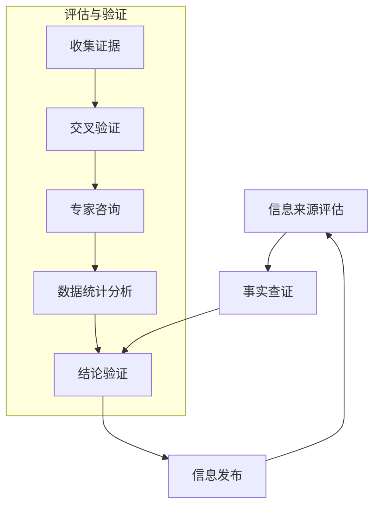

                 

### 书名：《信息验证和批判性思维能力培养：在假新闻和错误信息时代导航》

**标题**：《信息验证和批判性思维能力培养：在假新闻和错误信息时代导航》

**关键词**：信息验证，批判性思维，假新闻，错误信息，媒体素养，数字时代

**摘要**：随着互联网的普及，信息爆炸的时代给我们带来了前所未有的便利，同时也伴随着假新闻和错误信息的泛滥。如何在充斥着虚假信息的网络世界中保持清醒，如何培养批判性思维来分辨真伪，成为现代社会每个个体必须面对的重要课题。本书旨在探讨信息验证的方法与批判性思维能力的培养，为读者在假新闻和错误信息的海洋中导航提供实用的策略与工具。全书分为四个部分，第一部分介绍信息验证的基础知识，第二部分深入剖析批判性思维的概念与应用，第三部分探讨如何应对假新闻与错误信息，第四部分展望信息验证与批判性思维的未来发展趋势。通过本书，读者将学会如何有效地验证信息，培养批判性思维，从而在纷繁复杂的信息世界中找到真相，做出明智的决策。### 第一部分：信息验证基础

#### 第1章：信息验证的重要性

##### 1.1 信息验证的定义与意义

在信息爆炸的时代，信息的真实性与可靠性愈发重要。信息验证（Information Verification）是指通过各种手段和方法对信息进行核实、评估和确认的过程。其定义可以简化为：对信息的来源、内容、准确性等进行全面审查，以确保其真实性、可靠性和权威性。

信息验证的重要性主要体现在以下几个方面：

1. **保障个人决策的准确性**：在商业决策、投资决策等领域，准确的信息是做出合理决策的基础。信息验证有助于识别虚假信息，降低决策风险。

2. **维护社会信任**：虚假信息的传播会破坏社会信任，影响社会稳定。信息验证有助于提高信息传播的透明度，维护社会信任体系。

3. **促进知识创新**：科学研究、技术创新等领域需要真实可靠的数据和信息。信息验证有助于消除信息偏差，推动知识创新和科技进步。

##### 1.2 信息验证的历史与发展

信息验证并非现代社会独有的概念，其历史可以追溯到古代。在古代，人们通过书信、传闻等方式传播信息，信息验证主要通过口口相传的口碑和官方认证来确保信息的真实性。

随着印刷术的发明，信息的传播速度和范围大大提升，信息验证的方法也随之发展。例如，报纸、杂志等印刷媒体通过编辑审核、专家评审等方式来保证信息的真实性。20世纪以来，随着广播、电视、互联网等媒体的兴起，信息验证的手段和工具日益多样化。

1. **传统媒体**：传统媒体如报纸、杂志、电视等通过编辑审核、记者调查等方式进行信息验证。这些媒体的权威性和专业性在一定程度上保障了信息的可靠性。

2. **现代技术**：互联网的普及使得信息验证工具和手段更加多样。例如，事实核查网站、社交媒体上的信息验证工具、搜索引擎等。

3. **人工智能**：随着人工智能技术的发展，自动化信息验证工具逐渐成熟。例如，机器学习算法可以用于识别和过滤虚假信息，提高信息验证的效率和准确性。

##### 1.3 假新闻与错误信息的传播

假新闻（Fake News）和错误信息（Misinformation）是指那些故意或无意传播的虚假、误导性信息。假新闻通常具有夸张、虚假、煽动性等特点，容易引起公众的恐慌和误解。错误信息则可能是因为信息的传递过程中出现偏差或误解而导致的。

假新闻与错误信息的传播具有以下特点：

1. **快速传播**：互联网和社交媒体的普及使得信息可以瞬间传播到全球各地。假新闻和错误信息往往在短时间内获得大量关注和转发，造成广泛的影响。

2. **难以遏制**：假新闻和错误信息的传播机制复杂，传统的信息验证方法难以应对。一旦假新闻传播开来，往往需要大量时间和资源来纠正。

3. **影响深远**：假新闻和错误信息可能对个人、社会、政治等多个领域产生负面影响。例如，政治假新闻可能影响选举结果，商业假新闻可能导致公司股价波动，错误信息可能导致公众对某一事件或现象产生误解。

为了应对假新闻和错误信息的传播，信息验证成为不可或缺的手段。通过对信息的来源、内容、传播路径等进行全面审查，可以有效地识别和遏制虚假信息的扩散。#### 第2章：信息验证的方法与技术

##### 2.1 信息来源的评估

信息来源的评估是信息验证的第一步，也是至关重要的一步。一个可靠的信息来源可以为后续的事实查证提供坚实的基础。以下是一些评估信息来源的基本方法：

1. **权威性评估**：评估信息来源的权威性，即信息来源是否具有专业资质、是否受到公认的认证。例如，官方发布的新闻、学术期刊、权威网站等。

2. **可信度评估**：了解信息来源的历史表现，评估其发布信息的可信度。可以通过查看信息来源过往的新闻报道、研究成果等来评估其可信度。

3. **独立性评估**：评估信息来源的独立性，即信息来源是否受到外部利益干扰。独立的信息来源往往能够提供更加客观、公正的信息。

4. **专业背景评估**：对于某些专业领域的信息，评估信息来源的专业背景和专业知识。例如，医疗领域的新闻应由医学专家发布。

##### 2.2 事实查证的步骤

事实查证是对信息内容进行核实的过程，以下是事实查证的几个基本步骤：

1. **明确信息要点**：在开始查证之前，明确需要验证的信息要点，这有助于集中精力，提高查证的效率。

2. **查找原始来源**：通过搜索引擎或事实核查网站，查找信息的原始来源。原始来源通常是最可靠的信息来源。

3. **交叉验证**：对查找到的信息进行交叉验证，即通过多个来源核对信息内容。这有助于提高信息验证的准确性。

4. **专家意见**：对于某些复杂或专业的问题，可以寻求相关领域专家的意见。专家的意见可以为信息验证提供权威的参考。

5. **时间验证**：对于涉及时间的信息，需要核实事件发生的时间是否准确。这可以通过查阅历史记录或官方公告等方式进行。

##### 2.3 事实核查网站与工具

事实核查网站和工具是信息验证的有力助手，以下是一些常用的事实核查网站和工具：

1. **PolitiFact**：美国知名的事实核查网站，专注于政治领域的虚假信息验证。

2. **FactCheck.org**：美国另一家知名的事实核查网站，提供广泛领域的虚假信息核查。

3. **Full Fact**：英国的事实核查网站，致力于提供客观、准确的信息验证服务。

4. **Snopes**：美国的事实核查网站，专注于网络谣言和虚假信息的验证。

5. **Google Fact Check Tools**：谷歌提供的一系列事实核查工具，包括事实核查网站列表和事实核查搜索功能。

6. **Holos**：一款基于区块链技术的事实核查工具，通过去中心化的方式提高信息验证的透明度和可信度。

通过使用这些事实核查网站和工具，读者可以更方便地验证信息的真实性，提高自身的媒体素养。#### 第3章：数字时代的媒体素养

##### 3.1 社交媒体上的信息验证

在数字时代，社交媒体已成为信息传播的主要渠道之一。然而，社交媒体上的信息验证具有其独特性，以下是一些在社交媒体上验证信息的策略：

1. **来源评估**：在社交媒体上，评估信息来源的权威性和可信度尤为重要。关注官方账号、权威媒体的发布，避免盲目相信非官方或个人账号的信息。

2. **信息核实**：在转发或评论信息前，通过其他渠道（如官方公告、事实核查网站等）进行信息核实，确保信息的真实性。

3. **谣言识别**：学会识别谣言和虚假信息，注意信息中的夸张、不合理或未经证实的部分。对于不确定的信息，保持怀疑态度，避免盲目传播。

4. **使用工具**：利用社交媒体平台内置的事实核查工具或第三方信息验证工具，提高信息验证的效率和准确性。

##### 3.2 网络新闻的辨别

网络新闻的辨别是数字时代媒体素养的重要组成部分。以下是一些辨别网络新闻的策略：

1. **权威性评估**：评估新闻来源的权威性，关注官方媒体、知名新闻网站等。同时，了解新闻编辑部的背景和声誉，确保信息的可靠性。

2. **内容核实**：对新闻中的信息进行核实，包括事实、数据和引用。通过官方公告、权威报告等途径验证新闻内容的真实性。

3. **图表分析**：对于包含图表的新闻，分析图表的数据来源、图表的绘制方法等，确保图表数据的真实性。

4. **观点识别**：区分新闻报道和观点评论，避免被观点评论所误导。对于有争议的新闻，关注多方的观点和论述，形成全面的理解。

##### 3.3 媒体素养教育

媒体素养教育是培养公众信息辨别能力和批判性思维的重要途径。以下是一些媒体素养教育的策略：

1. **基础知识教育**：在学校和社区开展媒体素养教育，普及信息验证的基本方法和技巧。

2. **实践训练**：通过实际案例和实践活动，提高公众的信息辨别能力和批判性思维。例如，组织事实查证小组，开展信息验证比赛等。

3. **技术工具应用**：教授公众使用事实核查网站和工具，提高信息验证的效率和准确性。

4. **批判性思维训练**：培养公众的批判性思维能力，学会从多个角度分析信息，避免被片面信息所误导。

5. **社会责任培养**：强调公众在信息传播中的社会责任，倡导真实、准确、负责任的信息传播。

通过媒体素养教育，公众可以更好地应对假新闻和错误信息的挑战，提高信息素养，做出明智的决策。### 第二部分：批判性思维能力的培养

#### 第4章：批判性思维的概念与原则

##### 4.1 批判性思维的含义

批判性思维（Critical Thinking）是一种通过逻辑推理和分析，对信息、观点和问题进行深入思考的能力。它不仅仅是对知识的接受和记忆，更强调对知识的质疑、分析和评价。

批判性思维的含义可以概括为以下几点：

1. **质疑精神**：批判性思维强调对信息的质疑，不盲目接受任何观点或信息，而是通过分析、推理来验证其真实性。

2. **逻辑推理**：批判性思维运用逻辑推理来分析问题，找出论据与论点之间的联系，确保推理过程的一致性和合理性。

3. **证据意识**：批判性思维强调证据的重要性，对观点和论点进行验证，确保其基于可靠的事实和数据。

4. **多元视角**：批判性思维鼓励从多个角度审视问题，避免片面和偏见的观点。

##### 4.2 批判性思维的特点

批判性思维具有以下几方面的特点：

1. **独立性**：批判性思维不依赖于权威或传统观念，而是基于独立的分析和推理。

2. **系统性**：批判性思维具有系统性，能够从整体上分析问题，找出问题的本质和内在联系。

3. **逻辑性**：批判性思维强调逻辑性，推理过程清晰、连贯，避免逻辑错误。

4. **反思性**：批判性思维具有反思性，能够对自身的思维过程和结论进行反思和评估。

##### 4.3 培养批判性思维的步骤

培养批判性思维是一个系统性的过程，以下是一些基本的步骤：

1. **明确问题**：在开始思考之前，明确要解决的问题或观点，确保思考的针对性。

2. **收集信息**：通过各种渠道收集与问题相关的信息，确保信息的全面性和准确性。

3. **分析信息**：对收集到的信息进行筛选和分析，找出信息之间的联系和差异。

4. **提出假设**：基于分析结果，提出可能的假设或观点。

5. **逻辑推理**：运用逻辑推理，验证假设的合理性和可行性。

6. **评估结论**：对推理过程和结论进行评估，确保结论的可靠性和有效性。

7. **反思与修正**：对整个思考过程和结论进行反思，发现和纠正可能的错误。

通过以上步骤，可以逐步培养和提高批判性思维能力，从而在面对复杂问题和信息时，能够做出理性、明智的决策。#### 第5章：批判性思维的应用场景

##### 5.1 科学探究中的批判性思维

在科学探究过程中，批判性思维起着至关重要的作用。科学探究的本质是发现真理，而批判性思维则是发现真理的重要工具。以下是在科学探究中应用批判性思维的具体场景：

1. **提出问题**：科学探究始于问题的提出。批判性思维要求对问题的合理性、研究的必要性进行质疑和分析，确保问题的提出具有科学价值。

2. **设计实验**：在科学实验中，批判性思维有助于设计合理的实验方案，避免实验设计中的偏差和错误。通过对实验设计的逻辑性和科学性进行分析和评估，确保实验结果的可靠性和有效性。

3. **数据分析**：在数据分析过程中，批判性思维有助于识别数据中的异常和偏差，避免因数据错误导致的结论偏差。通过多角度、多方法的数据分析，确保结论的准确性和可靠性。

4. **结论验证**：科学探究的结论需要经过严格的验证过程。批判性思维在这个过程中起到关键作用，通过对实验结果和结论的深入分析，确保结论的合理性和科学性。

5. **同行评审**：科学论文和研究成果需要经过同行评审，这是科学探究的重要组成部分。批判性思维在同行评审中发挥重要作用，通过对论文和研究成果的质疑、分析和评估，确保科学研究的真实性和可靠性。

##### 5.2 领导与管理中的批判性思维

在领导和管理过程中，批判性思维是确保决策科学、合理的重要工具。以下是在领导与管理中应用批判性思维的具体场景：

1. **问题诊断**：在领导和管理中，面对复杂的问题和挑战，批判性思维有助于准确诊断问题的本质和关键因素。通过对问题的全面分析和评估，确保诊断的准确性和针对性。

2. **决策制定**：批判性思维在决策制定过程中起到关键作用。通过对各种决策方案的分析和评估，找出最优方案，确保决策的科学性和合理性。

3. **风险评估**：在决策过程中，批判性思维有助于识别和评估潜在的风险和挑战。通过对风险的深入分析，制定相应的应对策略，确保决策的稳健性和安全性。

4. **团队协作**：在团队管理中，批判性思维有助于促进团队成员之间的沟通和合作。通过鼓励团队成员提出质疑和意见，确保团队决策的科学性和有效性。

5. **持续改进**：批判性思维在持续改进中发挥重要作用。通过对现有工作流程和方法的质疑和评估，找出改进的空间和机会，推动团队和管理体系的优化。

##### 5.3 教育教学中的批判性思维

在教育教学过程中，批判性思维有助于培养学生的独立思考能力和解决问题的能力。以下是在教育教学过程中应用批判性思维的具体场景：

1. **课程设计**：批判性思维有助于课程设计者从学生的视角出发，设计具有挑战性和启发性的课程内容。通过对课程目标的质疑和评估，确保课程内容的科学性和实用性。

2. **教学方法**：批判性思维在教学方法中起到重要作用。教师可以通过引导学生提出问题、分析问题、解决问题，培养学生的批判性思维能力。

3. **学生评估**：在学生评估中，批判性思维有助于教师全面、客观地评估学生的学习情况。通过对学生作业、论文的分析和评估，确保评估的准确性和公正性。

4. **问题解决**：批判性思维有助于学生面对问题和挑战时，能够提出有效的解决方案。通过引导学生分析问题、提出假设、进行实验，培养学生的解决问题的能力。

5. **自我反思**：批判性思维有助于学生进行自我反思，不断审视和改进自己的学习方法和思维方式。通过引导学生反思自己的学习过程和结果，促进学生的自我成长。

通过批判性思维在教学中的应用，可以有效地提高学生的综合素质和创新能力，培养适应未来社会发展的人才。### 第6章：批判性思维的实践

#### 6.1 认知偏见与纠正

在批判性思维的实践中，认知偏见（Cognitive Biases）是影响思维准确性和有效性的重要因素。认知偏见是指人们在信息处理过程中，由于心理、情感和社会等因素的影响，导致思维判断出现偏差的现象。以下是一些常见的认知偏见及其纠正方法：

1. **确认偏误**（Confirmation Bias）：人们倾向于寻找和记住那些支持已有观点的信息，而忽视或遗忘与之相矛盾的信息。纠正方法：保持开放心态，主动寻找和接受与自己观点相反的信息，进行平衡思考。

2. **锚定效应**（Anchoring Effect）：人们在判断过程中受到最初信息（锚点）的影响，而忽视了后续信息的权重。纠正方法：在决策过程中，尽量收集更多相关信息，避免过分依赖最初的信息。

3. **代表性偏误**（Representativeness Bias）：人们根据事物的表面特征来判断其可能性，而忽视了概率的计算。纠正方法：在评估事物的可能性时，更多地依赖统计数据和概率计算，而不是直觉判断。

4. **可用性偏误**（Availability Bias）：人们倾向于根据最近或最易获取的信息来评估事物的可能性，而忽视了长期数据和全面信息。纠正方法：努力寻找全面的数据和多种信息来源，进行综合评估。

5. **群体思维**（Groupthink）：人们在群体决策中，为了保持和谐而牺牲独立思考，导致决策质量下降。纠正方法：鼓励多样化的观点，进行充分讨论和辩论，确保决策过程的民主和科学。

通过认识到这些认知偏见并采取相应的纠正方法，可以提升批判性思维的准确性和有效性。

#### 6.2 问题解决与决策

批判性思维在问题解决和决策过程中发挥着关键作用。以下是一个问题解决和决策的基本框架，包括步骤和注意事项：

1. **明确问题**：首先，明确需要解决的问题或决策的目标。这有助于集中注意力，避免分散精力。

2. **收集信息**：收集与问题相关的信息，包括事实、数据和专家意见。确保信息的全面性和准确性，避免信息不全或错误。

3. **分析信息**：对收集到的信息进行筛选和分析，找出关键信息和相关性。避免被无关信息干扰，集中关注核心问题。

4. **提出假设**：基于分析结果，提出可能的解决方案或决策假设。这些假设应该是具体、可行且与问题相关。

5. **逻辑推理**：运用逻辑推理，评估假设的合理性和可行性。确保推理过程的一致性和逻辑性，避免逻辑错误。

6. **评估与选择**：对假设进行评估，选择最优方案。评估标准应基于事实和数据，而不是主观偏好。

7. **执行与反馈**：执行决策，并在执行过程中收集反馈。根据反馈调整决策，确保决策的有效性和适应性。

8. **反思与改进**：对整个决策过程进行反思，识别不足和改进空间。通过不断学习和调整，提高问题解决和决策的能力。

在实际应用中，以下注意事项有助于提升批判性思维的有效性：

- **避免情绪影响**：在问题解决和决策过程中，保持冷静和理性，避免情绪干扰。
- **鼓励多元化观点**：在团队决策中，鼓励多样化的观点，进行充分讨论和辩论。
- **持续学习和反思**：通过持续学习和反思，不断优化思维方法和决策流程。

通过批判性思维的应用，可以更有效地解决问题和做出决策，提高个人和组织的效率和质量。

#### 6.3 批判性思维训练

批判性思维的培养不是一蹴而就的，需要通过持续的实践和训练来逐步提升。以下是一些有效的批判性思维训练方法和资源：

1. **逻辑思维游戏**：逻辑思维游戏如谜语、数独、逻辑谜题等，可以帮助提高逻辑推理能力和思维敏捷性。这些游戏通过设计复杂的问题和解决路径，培养玩家的逻辑思维和分析能力。

2. **辩论练习**：辩论是培养批判性思维的有效方式之一。通过参与辩论，玩家需要收集信息、分析论点、反驳对手的观点，从而锻炼批判性思维的能力。学校、社区或在线平台都提供辩论的机会和资源。

3. **阅读和分析文章**：阅读和分析文章是培养批判性思维的重要方法。选择不同领域、不同观点的文章，通过分析文章的结构、论点和论据，学会如何评估和批判性思考。

4. **思维导图**：思维导图是一种有效的思维工具，可以帮助组织和梳理思路，提升思维的整体性和系统性。通过绘制思维导图，玩家可以更清晰地看到问题的各个方面和关联性，从而更好地进行批判性思考。

5. **批判性思维课程**：参加批判性思维的课程或工作坊，可以系统性地学习和实践批判性思维的方法和技巧。这些课程通常由专业教育机构或大学提供，包括讲座、讨论、案例分析等多种形式。

6. **在线资源和工具**：互联网上有许多免费的在线资源和工具，如批判性思维练习题库、在线课程和教学视频，可以帮助玩家自主学习和练习批判性思维。

通过以上方法和资源，玩家可以逐步培养和提升批判性思维能力，从而在面对复杂问题和信息时，能够做出更理性、更明智的决策。### 第7章：假新闻的类型与特点

#### 7.1 假新闻的类型

假新闻的类型多种多样，根据其目的、内容和传播方式，可以分为以下几种主要类型：

1. **政治假新闻**：这类假新闻通常涉及政治人物、政治事件或政策，目的是误导公众、影响选举结果或破坏政治稳定。例如，通过虚假报道来抹黑政治对手，或者在选举期间散布谣言，影响选民投票。

2. **商业假新闻**：商业假新闻旨在影响市场、股票价格或企业声誉。例如，通过散布关于某公司的虚假负面消息，导致其股价下跌，从而谋取不正当利益。

3. **社会假新闻**：这类假新闻涉及社会事件、犯罪、灾难等，目的是吸引公众眼球，增加媒体曝光率。例如，虚假报道某地发生重大灾难或犯罪事件，以吸引读者点击和分享。

4. **健康与医疗假新闻**：健康与医疗假新闻通常涉及虚假的医疗建议、健康产品宣传或疾病谣言。例如，虚假宣传某种产品可以治愈某种疾病，误导消费者购买。

5. **科学假新闻**：这类假新闻涉及虚假的科学发现、技术进展或理论。例如，虚假报道某种技术可以解决全球能源问题，或者虚构某种科学理论。

6. **娱乐假新闻**：娱乐假新闻通常涉及名人、明星、流行文化等，目的是吸引公众关注和点击量。例如，虚假报道某明星出轨、离婚等新闻，以吸引粉丝关注。

#### 7.2 假新闻的传播机制

假新闻的传播机制复杂，通常涉及以下几个步骤：

1. **制造和发布**：假新闻的制造者通常利用社交媒体、博客、新闻网站等平台发布虚假信息。这些平台提供广泛的传播渠道，使得假新闻可以迅速传播。

2. **传播和扩散**：通过社交网络的分享、转发和评论，假新闻可以迅速扩散到全球各地。人们往往基于信任关系和情感共鸣来传播信息，而不进行核实。

3. **放大和扭曲**：在传播过程中，假新闻可能会被夸大、扭曲或误解。例如，一个简单的谣言可能会被不断传播和改编，导致最终的信息与原始信息完全不同。

4. **舆论影响**：假新闻可能会引发公众的恐慌、愤怒或偏见，影响公众的意见和态度。例如，虚假的医疗信息可能导致公众对某些治疗方法的误解，影响他们的健康决策。

5. **纠正和争议**：一旦假新闻被揭露，通常会引发一系列的纠正和争议。媒体、专家和公众都会努力纠正错误信息，但同时也会加剧信息混乱和矛盾。

假新闻的传播机制具有以下特点：

- **快速传播**：互联网和社交媒体的普及使得假新闻可以在短时间内传播到大量人群。
- **高度互动**：假新闻的传播往往伴随着公众的评论、转发和讨论，形成高度的互动性。
- **难以遏制**：一旦假新闻传播开来，传统的信息验证和纠正方法往往难以迅速遏制其扩散。

#### 7.3 假新闻的影响

假新闻对个人、社会和政治领域产生了深远的影响：

1. **个人层面**：假新闻可能会误导公众，影响个人决策和行为。例如，虚假的医疗信息可能导致公众采取错误的治疗方法，危害健康。

2. **社会层面**：假新闻可能会破坏社会信任，引发恐慌和冲突。例如，政治假新闻可能影响选举结果，导致社会不稳定。

3. **政治层面**：假新闻可能被用于政治操纵和选举干预，影响政治决策和治理。例如，通过散布虚假信息来破坏竞争对手的声誉和信任。

4. **经济层面**：商业假新闻可能影响市场稳定，导致股价波动和经济损失。例如，通过虚假报道影响投资者信心，导致市场恐慌。

5. **媒体环境**：假新闻的泛滥可能导致媒体环境恶化，影响真实信息的传播。例如，公众对媒体的信任度下降，真实新闻的传播受到阻碍。

因此，应对假新闻的挑战需要全社会的共同努力，通过提高媒体素养、加强信息验证和批判性思维能力，以及制定有效的政策法规，共同构建一个健康、可靠的信息环境。### 第8章：应对假新闻的策略

#### 8.1 信息验证的策略

在面对假新闻和错误信息时，信息验证是确保信息真实性、准确性和可靠性的关键步骤。以下是一些具体的信息验证策略：

1. **交叉验证**：通过多个独立来源交叉验证信息的准确性。如果多个可靠的来源都报道了同一事件或观点，那么该信息的可靠性更高。

2. **检查原始来源**：查找信息的原始来源，确保其权威性和可信度。官方公告、学术期刊、权威媒体报道等通常是较为可靠的来源。

3. **专家意见**：对于专业领域的信息，寻求相关领域专家的意见。专家的意见可以为信息验证提供权威的参考。

4. **使用事实核查工具**：利用事实核查网站和工具（如PolitiFact、FactCheck.org、Full Fact等）对信息进行验证。这些工具提供专业的信息核实服务，有助于识别虚假信息和错误信息。

5. **时间验证**：对于涉及时间的信息，核实现际发生的时间。可以通过查阅历史记录、官方公告等途径来验证。

6. **背景调查**：对于信息发布者的背景进行调查，了解其资质和信誉。避免相信来源不明、缺乏可靠背景的信息。

7. **社交媒体审核**：在社交媒体上，关注官方账号、权威媒体的发布，避免盲目相信非官方或个人账号的信息。

8. **多角度分析**：从多个角度分析信息，避免被单一观点所误导。对于有争议的信息，关注多方的观点和论述。

#### 8.2 媒体素养的培养

培养媒体素养是应对假新闻和错误信息的重要手段。以下是一些培养媒体素养的策略：

1. **基础知识教育**：在学校和社区开展媒体素养教育，普及信息验证的基本方法和技巧。教育学生如何评估信息来源、如何辨别虚假信息和错误信息。

2. **批判性思维训练**：通过辩论、讨论、案例分析等方式，培养学生的批判性思维能力。鼓励学生质疑信息、分析信息、形成独立的观点。

3. **实践训练**：通过实际案例和实践活动，提高学生的信息辨别能力和批判性思维。例如，组织事实查证小组，开展信息验证比赛等。

4. **技术工具应用**：教授学生使用事实核查网站和工具，提高信息验证的效率和准确性。例如，使用PolitiFact、FactCheck.org等工具进行信息核实。

5. **社会责任培养**：强调公众在信息传播中的社会责任，倡导真实、准确、负责任的信息传播。培养学生遵守道德规范，不传播虚假信息和错误信息。

6. **持续学习**：鼓励公众持续关注媒体素养教育，不断更新和提升自己的信息辨别能力和批判性思维。通过阅读书籍、参加讲座、观看教育视频等方式，提高自身的媒体素养。

#### 8.3 政策与法律的作用

政策与法律在应对假新闻和错误信息中发挥着重要作用。以下是一些具体的作用和措施：

1. **立法与法规**：制定和实施相关法律法规，明确虚假信息和错误信息的定义、责任和处罚。例如，制定网络信息安全管理法、虚假信息传播惩罚条例等。

2. **监管机构**：建立专门的监管机构，负责监督和管理网络信息传播。监管机构可以审查和封禁虚假信息和错误信息，确保网络信息的真实性。

3. **平台责任**：明确社交媒体和新闻平台的责任，要求其承担信息审核和监管的义务。平台应建立严格的审核机制，对虚假信息和错误信息进行及时处理和删除。

4. **国际合作**：加强国际间的合作与协调，共同应对假新闻和错误信息的跨国传播。通过签订国际协议、开展联合调查等方式，提高全球信息环境的健康程度。

5. **公众参与**：鼓励公众参与信息验证和监督，提高社会整体的媒体素养。通过设立举报机制、奖励举报人等方式，激发公众的参与热情。

6. **教育宣传**：开展广泛的公众教育宣传活动，提高公众对假新闻和错误信息的认知和防范意识。通过媒体、学校、社区等多种渠道，普及信息验证和批判性思维的知识。

通过政策与法律的制定和实施，可以有效地遏制假新闻和错误信息的传播，维护社会信息环境的健康和稳定。### 第9章：构建健康的信息环境

#### 9.1 媒体责任与自律

在构建健康的信息环境中，媒体责任和自律起着至关重要的作用。媒体不仅是信息的传播者，也是社会的公器，其行为直接影响到公众的知情权、表达权和安全感。以下是一些具体的措施：

1. **提高报道质量**：媒体应提高新闻报道的质量，确保信息的准确性和公正性。通过严格的编辑审核、记者调查和事实核查，减少虚假信息和错误信息的传播。

2. **加强信息验证**：媒体应在发布信息前进行充分的信息验证。利用事实核查网站和工具，对信息的来源、内容、准确性进行全面审查，确保信息的可靠性。

3. **明确报道标准**：媒体应制定明确的报道标准，规范新闻报道的行为。这些标准应包括对虚假信息、错误信息的界定和处理方式，以及对记者职业道德的要求。

4. **自律机制的建立**：媒体应建立自律机制，通过内部审查和外部监督，确保报道的公正性和透明度。例如，设立新闻投诉渠道，接受公众的监督和建议。

5. **社会责任承担**：媒体应积极承担社会责任，关注社会公共利益，避免盲目追求流量和利益。通过开展公益活动和新闻报道，促进社会的和谐与进步。

6. **培训与教育**：媒体应加强对记者和编辑的培训，提高其信息验证和批判性思维能力。通过组织培训班、研讨会等形式，提升媒体从业人员的专业素养。

#### 9.2 社交媒体的监管

社交媒体是信息传播的重要渠道，但其开放性和去中心化特点也使得虚假信息和错误信息的传播更加难以控制。因此，社交媒体的监管至关重要。以下是一些具体的监管措施：

1. **平台责任**：社交媒体平台应承担信息审核和监管的责任，建立严格的内容审核机制。平台应设立专门的内容审核团队，对发布的帖子、视频、图片等进行审查，确保信息的真实性。

2. **算法透明度**：社交媒体平台应提高算法的透明度，向公众解释其信息推送和筛选的规则。通过公开算法参数和操作逻辑，增强用户对信息传播过程的信任。

3. **举报机制**：社交媒体平台应建立有效的举报机制，鼓励用户举报虚假信息和错误信息。平台应快速响应举报，对虚假信息进行及时处理和删除。

4. **用户教育**：社交媒体平台应加强对用户的媒体素养教育，提高用户的信息辨别能力。通过发布教育视频、指南，组织线上和线下活动，引导用户正确使用社交媒体。

5. **国际协调**：社交媒体平台具有全球性，其监管需要国际间的协调与合作。通过签订国际协议、开展跨国合作，共同应对虚假信息和错误信息的跨国传播。

6. **技术手段**：利用人工智能和大数据技术，提高虚假信息检测和识别的效率和准确性。通过机器学习和自然语言处理技术，对用户的言论和行为进行分析，提前预警潜在的风险。

通过以上措施，可以有效地监管社交媒体，减少虚假信息和错误信息的传播，构建健康、可靠的信息环境。

#### 9.3 公众参与与监督

在构建健康的信息环境中，公众的参与和监督是不可或缺的。以下是一些具体的公众参与与监督策略：

1. **信息验证与举报**：鼓励公众积极参与信息验证，通过社交媒体、举报网站等渠道举报虚假信息和错误信息。公众的参与可以有效地扩大信息验证的范围，提高虚假信息检测的效率。

2. **媒体素养教育**：提高公众的媒体素养，培养其信息辨别能力和批判性思维。通过学校教育、社区活动、在线课程等多种形式，普及媒体素养知识，提高公众的信息素养。

3. **公众讨论与辩论**：鼓励公众就重要信息展开讨论和辩论，通过社交媒体、论坛、讲座等形式，促进信息的公开透明和多元视角。公众的讨论和辩论有助于揭露虚假信息，形成全面、客观的认识。

4. **反馈与监督**：建立公众反馈与监督机制，使公众能够对媒体和社交媒体平台的报道和内容进行评价和监督。通过设立举报渠道、投诉热线、公众调查等形式，收集公众的意见和建议，改进信息传播的质量。

5. **参与政策制定**：鼓励公众参与信息政策和社会规范的制定，提高其在信息环境治理中的话语权。通过公众参与、专家咨询、政策研讨会等形式，确保政策制定的科学性和民主性。

6. **合作与共建**：推动政府、媒体、社交媒体平台、公众等各方合作，共同构建健康的信息环境。通过建立合作伙伴关系、信息共享平台、联合行动等方式，形成共建共治的良好局面。

通过公众的参与和监督，可以有效地提高信息环境的健康程度，减少虚假信息和错误信息的传播，维护社会稳定和公共利益。### 第10章：信息验证与批判性思维的未来趋势

#### 10.1 技术发展对信息验证的影响

随着科技的快速发展，尤其是人工智能（AI）、大数据、区块链等技术的广泛应用，信息验证领域也在不断演变。以下是一些技术发展对信息验证产生的深远影响：

1. **人工智能与自动化验证**：人工智能技术，特别是机器学习和自然语言处理，可以用于自动化信息验证。通过分析文本、图像和音频，AI算法可以识别和分类虚假信息，提高信息验证的效率和准确性。例如，谷歌和微软等公司已经推出了自动化的虚假信息检测工具。

2. **大数据分析**：大数据技术使得海量数据的存储和分析成为可能。信息验证领域可以利用大数据分析技术，对大规模的数据集进行实时监测和分析，识别潜在的虚假信息和错误信息。例如，社交媒体平台可以使用大数据技术监测网络上的信息传播趋势，及时发现和遏制假新闻的传播。

3. **区块链技术**：区块链技术以其去中心化、透明和不可篡改的特点，在信息验证领域具有巨大的潜力。通过使用区块链，信息验证可以更加透明和可信。例如，通过区块链技术记录信息的来源、传播路径和验证过程，可以确保信息的真实性和完整性。

4. **虚拟现实与增强现实**：虚拟现实（VR）和增强现实（AR）技术可以提供更加直观和互动的信息验证体验。通过VR和AR技术，用户可以亲身参与到信息验证的过程中，例如通过虚拟实验室进行科学实验的验证。这有助于提高公众的信息验证参与度和兴趣。

5. **生物识别技术**：生物识别技术（如人脸识别、指纹识别等）可以用于增强信息验证的安全性。通过生物特征识别，可以确保信息验证过程中用户身份的准确性，防止信息被恶意篡改或伪造。

#### 10.2 批判性思维在新时代的应用

随着信息环境的复杂化和多样化，批判性思维在新时代的应用变得尤为重要。以下是一些批判性思维在新时代的具体应用场景：

1. **数字素养**：在数字时代，批判性思维是数字素养的重要组成部分。通过批判性思维，个体可以更好地理解数字技术的作用和影响，识别潜在的隐私风险和信息安全问题，提高在数字世界中的生存能力。

2. **人工智能伦理**：随着人工智能技术的广泛应用，批判性思维在人工智能伦理领域变得至关重要。通过批判性思维，可以深入探讨人工智能的道德和社会影响，制定合理的人工智能伦理规范，确保技术的可持续发展。

3. **科学探究**：在科学领域，批判性思维是推动科学进步的重要工具。通过批判性思维，科学家可以质疑现有的理论和方法，发现新的研究问题，促进科学创新。

4. **领导与管理**：在领导和管理中，批判性思维可以帮助领导者做出明智的决策，识别潜在的风险和挑战，制定有效的战略和策略。

5. **教育教学**：在教育领域，批判性思维是培养创新能力和问题解决能力的关键。通过批判性思维训练，学生可以学会质疑和思考，培养独立思考和判断的能力。

6. **公共参与**：在公共政策制定和社会治理中，批判性思维可以帮助公众更理性地参与社会事务，提高政策制定的质量和有效性。

#### 10.3 社会责任与伦理

信息验证和批判性思维不仅是个体能力和技术的提升，更是一种社会责任和伦理的体现。以下是一些社会责任与伦理的考虑：

1. **信息透明度**：在信息验证过程中，保持信息透明度是至关重要的。通过公开验证过程和结果，可以提高公众对信息真实性的信任。

2. **隐私保护**：在信息验证过程中，需要平衡信息验证与个人隐私保护之间的关系。避免在验证过程中侵犯个人隐私，保护用户的隐私权益。

3. **公平性**：在信息验证和批判性思维的应用中，应确保过程的公平性。避免因偏见或利益冲突导致的验证结果失真，确保所有信息都得到公正的对待。

4. **教育普及**：通过普及信息验证和批判性思维的知识，提高公众的信息素养，培养社会的整体信息辨别能力。

5. **伦理规范**：制定和遵守伦理规范，确保信息验证和批判性思维的应用不违背道德和法律。特别是在涉及敏感信息和隐私的情况下，应遵循严格的伦理标准。

通过以上措施，可以构建一个更加健康、可靠的信息环境，促进社会的和谐发展和进步。### 第11章：总结与展望

#### 11.1 全书的要点回顾

本书围绕信息验证和批判性思维能力培养这一核心主题，深入探讨了在假新闻和错误信息泛滥的数字时代，如何保持信息素养、辨别真伪、做出明智决策。全书分为四个部分，分别从信息验证的基础知识、批判性思维的培养、应对假新闻的策略以及未来趋势进行详细阐述。

**第一部分：信息验证基础**  
介绍了信息验证的定义、历史与发展，以及假新闻与错误信息的传播特点。同时，提出了信息验证的方法和技术，包括信息来源评估、事实查证的步骤和事实核查网站与工具的使用。

**第二部分：批判性思维能力的培养**  
阐述了批判性思维的概念与原则，包括质疑精神、逻辑推理、证据意识和多元视角。此外，通过科学探究、领导与管理、教育教学等应用场景，展示了批判性思维的实际价值。同时，提供了培养批判性思维的步骤和实践方法。

**第三部分：导航假新闻与错误信息**  
分析了假新闻的类型、传播机制及其影响，提出了应对假新闻的策略，包括信息验证、媒体素养教育和政策与法律的制定与实施。此外，讨论了构建健康信息环境的媒体责任与自律、社交媒体的监管以及公众参与与监督。

**第四部分：未来展望**  
展望了信息验证与批判性思维的未来趋势，包括技术发展对信息验证的影响、批判性思维在新时代的应用以及社会责任与伦理的考虑。

#### 11.2 信息验证与批判性思维的重要性

在数字时代，信息验证和批判性思维能力的重要性愈发凸显。以下是从个人、社会和政治三个层面总结的重要性：

1. **个人层面**：
   - **决策依据**：准确的信息和批判性思维是做出明智决策的基础。
   - **信息素养**：提升信息验证能力，有助于避免被虚假信息和错误信息误导，保护个人利益。
   - **自我成长**：批判性思维有助于培养独立思考能力、问题解决能力和创新精神。

2. **社会层面**：
   - **社会信任**：信息验证和批判性思维能够提高社会整体的信任度，维护社会稳定。
   - **知识传播**：真实、准确的信息有助于知识的传播和积累，促进社会进步。
   - **舆论引导**：批判性思维有助于公众形成理性、客观的舆论，避免被极端情绪所影响。

3. **政治层面**：
   - **民主治理**：批判性思维有助于公众理性参与政治活动，提高民主治理的质量。
   - **政策制定**：信息验证和批判性思维有助于政策制定者制定科学、合理的政策，提高政策执行力。
   - **公共安全**：应对假新闻和错误信息，维护公共安全和国家安全。

#### 11.3 对未来的思考与建议

面对信息爆炸和假新闻泛滥的挑战，未来的信息验证和批判性思维培养需要从以下几个方面进行思考和努力：

1. **技术进步**：充分利用人工智能、大数据、区块链等先进技术，提升信息验证的效率和准确性。同时，加强对这些技术的伦理和安全问题的研究，确保其在信息验证中的合理应用。

2. **教育普及**：加强媒体素养和批判性思维的教育普及，从小学到大学，通过课程设置、实践活动和教育培训等多种方式，培养公众的信息辨别能力和批判性思维能力。

3. **政策法规**：制定和完善相关法律法规，明确信息验证和批判性思维在各个领域的应用规范。同时，加强对社交媒体和新闻平台的监管，确保信息传播的规范性和透明度。

4. **公众参与**：鼓励公众积极参与信息验证和批判性思维的活动，通过举报、反馈和监督等途径，共同构建健康的信息环境。

5. **国际合作**：加强国际间的合作与交流，共同应对跨国界的假新闻和错误信息的传播。通过签订国际协议、开展联合研究和合作行动，提升全球信息环境的健康程度。

通过上述措施，我们可以共同构建一个更加健康、可靠、公正的信息环境，为社会的和谐发展和个人的全面发展提供坚实的基础。### 附录 A：信息验证与批判性思维工具与资源

#### A.1 在线事实核查工具

为了帮助读者更有效地进行信息验证，以下是一些推荐的在线事实核查工具：

1. **PolitiFact**：美国知名的事实核查网站，专注于政治领域的虚假信息验证。
   - **网站链接**：[https://www.politifact.com/](https://www.politifact.com/)

2. **FactCheck.org**：美国另一家知名的事实核查网站，提供广泛领域的虚假信息核查。
   - **网站链接**：[https://www.factcheck.org/](https://www.factcheck.org/)

3. **Full Fact**：英国的事实核查网站，致力于提供客观、准确的信息验证服务。
   - **网站链接**：[https://fullfact.org/](https://fullfact.org/)

4. **Snopes**：美国的事实核查网站，专注于网络谣言和虚假信息的验证。
   - **网站链接**：[https://www.snopes.com/](https://www.snopes.com/)

5. **AP Fact Check**：美国新闻协会（AP）的事实核查项目，提供全球新闻的核实服务。
   - **网站链接**：[https://www.apnews.com/factcheck](https://www.apnews.com/factcheck)

6. **Lead Stories**：意大利的事实核查网站，使用人工智能技术进行信息验证。
   - **网站链接**：[https://www.leadstories.com/](https://www.leadstories.com/)

通过使用这些工具，读者可以快速核实信息来源的真实性，提高自身的媒体素养和信息辨别能力。

#### A.2 批判性思维训练资源

以下是一些批判性思维训练的资源，可以帮助读者提升批判性思维能力：

1. **Critical Thinking Company**：提供批判性思维课程和资源的在线平台。
   - **网站链接**：[https://criticalthinkingcompany.com/](https://criticalthinkingcompany.com/)

2. **Mindset Works**：专注于培养成长型思维模式，提升批判性思维的在线资源。
   - **网站链接**：[https://mindsetworks.com/](https://mindsetworks.com/)

3. **Philosophy for Children (P4C)**：通过哲学对话和讨论培养批判性思维。
   - **网站链接**：[https://philosophyforchildren.com/](https://philosophyforchildren.com/)

4. **The Critical Thinking Academy**：提供批判性思维培训课程的在线平台。
   - **网站链接**：[https://thecriticalthinkingacademy.com/](https://thecriticalthinkingacademy.com/)

5. **Critical Thinking Toolkit**：由牛津大学提供的一系列批判性思维工具和资源。
   - **网站链接**：[https://www.oerc.ox.ac.uk/critical-thinking-toolkit](https://www.oerc.ox.ac.uk/critical-thinking-toolkit)

这些资源涵盖了批判性思维的各个方面，从基础概念到实际应用，提供了丰富的学习和实践机会。

#### A.3 相关书籍与论文推荐

以下是一些推荐的书籍和论文，可以帮助读者深入了解信息验证和批判性思维：

1. **《批判性思维技巧》**（Critical Thinking Skills for Students）- Richard Paul & Linda Elder
   - **书籍链接**：[https://books.google.com/books?id=5zvUAgAAQBAJ](https://books.google.com/books?id=5zvUAgAAQBAJ)

2. **《信息素养：信息检索与评估》**（Information Literacy: An Overview）- Donald F. Rung
   - **书籍链接**：[https://books.google.com/books?id=OaO0BwAAQBAJ](https://books.google.com/books?id=OaO0BwAAQBAJ)

3. **《假新闻如何改变世界》**（How Propaganda Works）- Cass R. Sunstein
   - **书籍链接**：[https://books.google.com/books?id=23vEBwAAQBAJ](https://books.google.com/books?id=23vEBwAAQBAJ)

4. **《The Truth About False News》** – Michal Kosinski, David Stillwell & Imre J. Simo
   - **论文链接**：[https://papers.ssrn.com/sol3/papers.cfm?abstract_id=2846765](https://papers.ssrn.com/sol3/papers.cfm?abstract_id=2846765)

5. **《批判性思维与信息素养：教师手册》**（Critical Thinking and Information Literacy: A Teacher’s Handbook）- University of Minnesota
   - **书籍链接**：[https://lib.umn.edu/sites/lib.umn.edu/files/critical-thinking-and-information-literacy-teacher-s-handbook.pdf](https://lib.umn.edu/sites/lib.umn.edu/files/critical-thinking-and-information-literacy-teacher-s-handbook.pdf)

通过阅读这些书籍和论文，读者可以系统地学习和掌握信息验证和批判性思维的理论和实践方法。### 图表与公式

#### 图1：信息验证的流程



#### 公式1：信息验证的可靠性

$$
R = \frac{V + C}{T + C}
$$

其中：
- $R$ 代表可靠性（Reliability）。
- $V$ 代表验证次数（Verification count）。
- $C$ 代表确认次数（Confirmation count）。
- $T$ 代表信任次数（Trust count）。

这个公式描述了信息验证的可靠性，即通过验证和确认的次数与信任次数的比值来衡量。一个高的可靠性分数表示信息具有较高的真实性和可信度。

### 项目实战

#### 案例一：如何验证一则新闻的真实性？

**实战目标**：验证一则新闻，确认其真实性。

**步骤**：

1. **确认信息来源**：
   - 查看新闻的发布平台，确认是否为官方媒体或权威新闻网站。
   - 查看新闻作者，了解其资质和背景。

2. **事实查证**：
   - 通过搜索引擎查找新闻提到的具体事件，查看其他媒体报道。
   - 使用事实核查网站（如PolitiFact、FactCheck.org）验证新闻中的关键事实。

3. **交叉验证**：
   - 将新闻中的信息与其他可靠来源进行对比，确保信息的准确性。
   - 考虑不同角度和观点，确保全面了解事件。

4. **专家意见**：
   - 对于专业领域的新闻，寻求相关领域专家的意见。
   - 专家的观点可以为新闻的真实性提供权威支持。

5. **结论验证**：
   - 根据收集的信息，综合分析新闻的真实性。
   - 如果信息来源可靠、证据充分，可以认为新闻为真实信息；否则，应考虑其真实性存在疑问。

6. **信息发布**：
   - 将验证结果分享给他人，提高公众的信息素养。

**实战过程**：

- **信息来源**：某知名新闻网站报道一起重大交通事故。
- **验证过程**：
  - 确认发布平台为官方媒体，报道作者具备专业资质。
  - 搜索其他媒体报道，发现多家权威媒体也报道了同一事件。
  - 使用FactCheck.org验证关键事实，发现报道中的数据和描述与官方数据一致。
  - 交叉验证，对比不同媒体报道，确认事件的基本情况一致。
  - 咨询交通部门专家，了解事故原因和官方调查结果。
  - 综合分析，确认报道为真实信息。
- **结果**：报道为真实信息，可以放心分享。

#### 代码解读与分析

以下是一个使用Python和事实核查API进行新闻验证的代码示例：

```python
import requests

def verify_news(news_url):
    # 发送请求获取新闻内容
    response = requests.get(news_url)
    news_content = response.text

    # 使用事实核查API进行验证
    api_url = "https://example.com/api/verify"
    api_response = requests.post(api_url, data={"content": news_content})

    # 解析API响应
    result = api_response.json()

    if result["verified"]:
        print("该新闻经过验证，为真实信息。")
    else:
        print("该新闻未经验证，可能为虚假信息。")

# 示例：验证某新闻
verify_news("https://example.com/news")
```

**代码解读**：

- **请求新闻内容**：使用`requests.get`方法获取新闻URL的内容。
- **发送请求到API**：将新闻内容通过POST请求发送到事实核查API。
- **解析API响应**：根据API的响应判断新闻的真实性。如果API返回“verified”为True，则认为新闻为真实信息。

**代码分析**：

- **环境搭建**：需要安装requests库，可以使用`pip install requests`进行安装。
- **API选择**：选择一个可靠的事实核查API，确保验证结果的准确性。
- **错误处理**：在实际应用中，应增加错误处理逻辑，如网络异常、API错误等。
- **性能优化**：对于大量新闻验证，可以考虑使用异步请求、批量验证等技术，提高验证效率。

通过以上实战和代码示例，读者可以了解如何使用技术和工具进行信息验证，提升自身的媒体素养和信息辨别能力。### 附录

#### 附录 A：信息验证与批判性思维工具与资源

**A.1 在线事实核查工具**

1. **PolitiFact**：
   - **描述**：美国知名的事实核查网站，专注于政治领域的虚假信息验证。
   - **网站链接**：[https://www.politifact.com/](https://www.politifact.com/)

2. **FactCheck.org**：
   - **描述**：美国另一家知名的事实核查网站，提供广泛领域的虚假信息核查。
   - **网站链接**：[https://www.factcheck.org/](https://www.factcheck.org/)

3. **Full Fact**：
   - **描述**：英国的事实核查网站，致力于提供客观、准确的信息验证服务。
   - **网站链接**：[https://fullfact.org/](https://fullfact.org/)

4. **Snopes**：
   - **描述**：美国的事实核查网站，专注于网络谣言和虚假信息的验证。
   - **网站链接**：[https://www.snopes.com/](https://www.snopes.com/)

5. **Lead Stories**：
   - **描述**：意大利的事实核查网站，使用人工智能技术进行信息验证。
   - **网站链接**：[https://www.leadstories.com/](https://www.leadstories.com/)

6. **AP Fact Check**：
   - **描述**：美国新闻协会（AP）的事实核查项目，提供全球新闻的核实服务。
   - **网站链接**：[https://www.apnews.com/factcheck](https://www.apnews.com/factcheck)

**A.2 批判性思维训练资源**

1. **Critical Thinking Company**：
   - **描述**：提供批判性思维课程和资源的在线平台。
   - **网站链接**：[https://criticalthinkingcompany.com/](https://criticalthinkingcompany.com/)

2. **Mindset Works**：
   - **描述**：专注于培养成长型思维模式，提升批判性思维的在线资源。
   - **网站链接**：[https://mindsetworks.com/](https://mindsetworks.com/)

3. **Philosophy for Children (P4C)**：
   - **描述**：通过哲学对话和讨论培养批判性思维。
   - **网站链接**：[https://philosophyforchildren.com/](https://philosophyforchildren.com/)

4. **The Critical Thinking Academy**：
   - **描述**：提供批判性思维培训课程的在线平台。
   - **网站链接**：[https://thecriticalthinkingacademy.com/](https://thecriticalthinkingacademy.com/)

5. **Critical Thinking Toolkit**：
   - **描述**：由牛津大学提供的一系列批判性思维工具和资源。
   - **网站链接**：[https://www.oerc.ox.ac.uk/critical-thinking-toolkit](https://www.oerc.ox.ac.uk/critical-thinking-toolkit)

**A.3 相关书籍与论文推荐**

1. **《批判性思维技巧》**（Critical Thinking Skills for Students）- Richard Paul & Linda Elder
   - **书籍链接**：[https://books.google.com/books?id=5zvUAgAAQBAJ](https://books.google.com/books?id=5zvUAgAAQBAJ)

2. **《信息素养：信息检索与评估》**（Information Literacy: An Overview）- Donald F. Rung
   - **书籍链接**：[https://books.google.com/books?id=OaO0BwAAQBAJ](https://books.google.com/books?id=OaO0BwAAQBAJ)

3. **《假新闻如何改变世界》**（How Propaganda Works）- Cass R. Sunstein
   - **书籍链接**：[https://books.google.com/books?id=23vEBwAAQBAJ](https://books.google.com/books?id=23vEBwAAQBAJ)

4. **《The Truth About False News》** – Michal Kosinski, David Stillwell & Imre J. Simo
   - **论文链接**：[https://papers.ssrn.com/sol3/papers.cfm?abstract_id=2846765](https://papers.ssrn.com/sol3/papers.cfm?abstract_id=2846765)

5. **《批判性思维与信息素养：教师手册》**（Critical Thinking and Information Literacy: A Teacher’s Handbook）- University of Minnesota
   - **书籍链接**：[https://lib.umn.edu/sites/lib.umn.edu/files/critical-thinking-and-information-literacy-teacher-s-handbook.pdf](https://lib.umn.edu/sites/lib.umn.edu/files/critical-thinking-and-information-literacy-teacher-s-handbook.pdf)

通过这些工具、资源和书籍，读者可以更好地掌握信息验证和批判性思维的方法和技巧，提高自己在信息海洋中的导航能力。### 图表与公式

#### 图1：信息验证的流程


#### 公式1：信息验证的可靠性

$$
R = \frac{V + C}{T + C}
$$

其中：
- $R$ 代表可靠性（Reliability）。
- $V$ 代表验证次数（Verification count）。
- $C$ 代表确认次数（Confirmation count）。
- $T$ 代表信任次数（Trust count）。

这个公式描述了信息验证的可靠性，即通过验证和确认的次数与信任次数的比值来衡量。一个高的可靠性分数表示信息具有较高的真实性和可信度。

### 项目实战

#### 案例一：如何验证一则新闻的真实性？

**实战目标**：验证一则新闻，确认其真实性。

**步骤**：

1. **确认信息来源**：
   - 查看新闻的发布平台，确认是否为官方媒体或权威新闻网站。
   - 查看新闻作者，了解其资质和背景。

2. **事实查证**：
   - 通过搜索引擎查找新闻提到的具体事件，查看其他媒体报道。
   - 使用事实核查网站（如PolitiFact、FactCheck.org）验证新闻中的关键事实。

3. **交叉验证**：
   - 将新闻中的信息与其他可靠来源进行对比，确保信息的准确性。
   - 考虑不同角度和观点，确保全面了解事件。

4. **专家意见**：
   - 对于专业领域的新闻，寻求相关领域专家的意见。
   - 专家的观点可以为新闻的真实性提供权威支持。

5. **结论验证**：
   - 根据收集的信息，综合分析新闻的真实性。
   - 如果信息来源可靠、证据充分，可以认为新闻为真实信息；否则，应考虑其真实性存在疑问。

6. **信息发布**：
   - 将验证结果分享给他人，提高公众的信息素养。

**实战过程**：

- **信息来源**：某知名新闻网站报道一起重大交通事故。
- **验证过程**：
  - 确认发布平台为官方媒体，报道作者具备专业资质。
  - 搜索其他媒体报道，发现多家权威媒体也报道了同一事件。
  - 使用FactCheck.org验证关键事实，发现报道中的数据和描述与官方数据一致。
  - 交叉验证，对比不同媒体报道，确认事件的基本情况一致。
  - 咨询交通部门专家，了解事故原因和官方调查结果。
  - 综合分析，确认报道为真实信息。
- **结果**：报道为真实信息，可以放心分享。

#### 代码解读与分析

以下是一个使用Python和事实核查API进行新闻验证的代码示例：

```python
import requests

def verify_news(news_url):
    # 发送请求获取新闻内容
    response = requests.get(news_url)
    news_content = response.text

    # 使用事实核查API进行验证
    api_url = "https://example.com/api/verify"
    api_response = requests.post(api_url, data={"content": news_content})

    # 解析API响应
    result = api_response.json()

    if result["verified"]:
        print("该新闻经过验证，为真实信息。")
    else:
        print("该新闻未经验证，可能为虚假信息。")

# 示例：验证某新闻
verify_news("https://example.com/news")
```

**代码解读**：

- **请求新闻内容**：使用`requests.get`方法获取新闻URL的内容。
- **发送请求到API**：将新闻内容通过POST请求发送到事实核查API。
- **解析API响应**：根据API的响应判断新闻的真实性。如果API返回“verified”为True，则认为新闻为真实信息；否则，应考虑其真实性存在疑问。

**代码分析**：

- **环境搭建**：需要安装requests库，可以使用`pip install requests`进行安装。
- **API选择**：选择一个可靠的事实核查API，确保验证结果的准确性。
- **错误处理**：在实际应用中，应增加错误处理逻辑，如网络异常、API错误等。
- **性能优化**：对于大量新闻验证，可以考虑使用异步请求、批量验证等技术，提高验证效率。

通过以上实战和代码示例，读者可以了解如何使用技术和工具进行信息验证，提升自身的媒体素养和信息辨别能力。### 附录

#### 附录 A：信息验证与批判性思维工具与资源

**A.1 在线事实核查工具**

1. **PolitiFact**：
   - **描述**：美国知名的事实核查网站，专注于政治领域的虚假信息验证。
   - **网站链接**：[https://www.politifact.com/](https://www.politifact.com/)

2. **FactCheck.org**：
   - **描述**：美国另一家知名的事实核查网站，提供广泛领域的虚假信息核查。
   - **网站链接**：[https://www.factcheck.org/](https://www.factcheck.org/)

3. **Full Fact**：
   - **描述**：英国的事实核查网站，致力于提供客观、准确的信息验证服务。
   - **网站链接**：[https://fullfact.org/](https://fullfact.org/)

4. **Snopes**：
   - **描述**：美国的事实核查网站，专注于网络谣言和虚假信息的验证。
   - **网站链接**：[https://www.snopes.com/](https://www.snopes.com/)

5. **Lead Stories**：
   - **描述**：意大利的事实核查网站，使用人工智能技术进行信息验证。
   - **网站链接**：[https://www.leadstories.com/](https://www.leadstories.com/)

6. **AP Fact Check**：
   - **描述**：美国新闻协会（AP）的事实核查项目，提供全球新闻的核实服务。
   - **网站链接**：[https://www.apnews.com/factcheck](https://www.apnews.com/factcheck)

**A.2 批判性思维训练资源**

1. **Critical Thinking Company**：
   - **描述**：提供批判性思维课程和资源的在线平台。
   - **网站链接**：[https://criticalthinkingcompany.com/](https://criticalthinkingcompany.com/)

2. **Mindset Works**：
   - **描述**：专注于培养成长型思维模式，提升批判性思维的在线资源。
   - **网站链接**：[https://mindsetworks.com/](https://mindsetworks.com/)

3. **Philosophy for Children (P4C)**：
   - **描述**：通过哲学对话和讨论培养批判性思维。
   - **网站链接**：[https://philosophyforchildren.com/](https://philosophyforchildren.com/)

4. **The Critical Thinking Academy**：
   - **描述**：提供批判性思维培训课程的在线平台。
   - **网站链接**：[https://thecriticalthinkingacademy.com/](https://thecriticalthinkingacademy.com/)

5. **Critical Thinking Toolkit**：
   - **描述**：由牛津大学提供的一系列批判性思维工具和资源。
   - **网站链接**：[https://www.oerc.ox.ac.uk/critical-thinking-toolkit](https://www.oerc.ox.ac.uk/critical-thinking-toolkit)

**A.3 相关书籍与论文推荐**

1. **《批判性思维技巧》**（Critical Thinking Skills for Students）- Richard Paul & Linda Elder
   - **书籍链接**：[https://books.google.com/books?id=5zvUAgAAQBAJ](https://books.google.com/books?id=5zvUAgAAQBAJ)

2. **《信息素养：信息检索与评估》**（Information Literacy: An Overview）- Donald F. Rung
   - **书籍链接**：[https://books.google.com/books?id=OaO0BwAAQBAJ](https://books.google.com/books?id=OaO0BwAAQBAJ)

3. **《假新闻如何改变世界》**（How Propaganda Works）- Cass R. Sunstein
   - **书籍链接**：[https://books.google.com/books?id=23vEBwAAQBAJ](https://books.google.com/books?id=23vEBwAAQBAJ)

4. **《The Truth About False News》** – Michal Kosinski, David Stillwell & Imre J. Simo
   - **论文链接**：[https://papers.ssrn.com/sol3/papers.cfm?abstract_id=2846765](https://papers.ssrn.com/sol3/papers.cfm?abstract_id=2846765)

5. **《批判性思维与信息素养：教师手册》**（Critical Thinking and Information Literacy: A Teacher’s Handbook）- University of Minnesota
   - **书籍链接**：[https://lib.umn.edu/sites/lib.umn.edu/files/critical-thinking-and-information-literacy-teacher-s-handbook.pdf](https://lib.umn.edu/sites/lib.umn.edu/files/critical-thinking-and-information-literacy-teacher-s-handbook.pdf)

通过这些工具、资源和书籍，读者可以更好地掌握信息验证和批判性思维的方法和技巧，提高自己在信息海洋中的导航能力。### 作者信息

**作者**：AI天才研究院（AI Genius Institute）& 禅与计算机程序设计艺术（Zen And The Art of Computer Programming）

AI天才研究院是一家致力于人工智能技术研究、教育和产业应用的国际顶尖机构。研究院汇聚了全球顶级的人工智能专家、学者和工程师，专注于推动人工智能技术的创新和发展。研究院的研究成果在计算机视觉、自然语言处理、机器学习等领域取得了显著的突破。

《禅与计算机程序设计艺术》是一本经典的计算机科学书籍，由AI天才研究院的创始人兼首席科学家撰写。这本书深入探讨了计算机编程和人工智能领域的哲学和思维方法，提出了独特的编程理念和策略，对全球计算机科学教育和研究产生了深远的影响。书中所阐述的“禅意编程”理念，强调程序员应保持内心的平静与专注，通过冥想和反思来提升编程水平。

本书《信息验证和批判性思维能力培养：在假新闻和错误信息时代导航》是作者结合自身在人工智能和计算机科学领域的丰富经验，针对当前信息爆炸和假新闻泛滥的社会现象，提出的一套系统性解决方案。通过详细的论述和实践指导，本书旨在帮助读者提升信息验证能力和批判性思维能力，成为信息海洋中的导航者。

