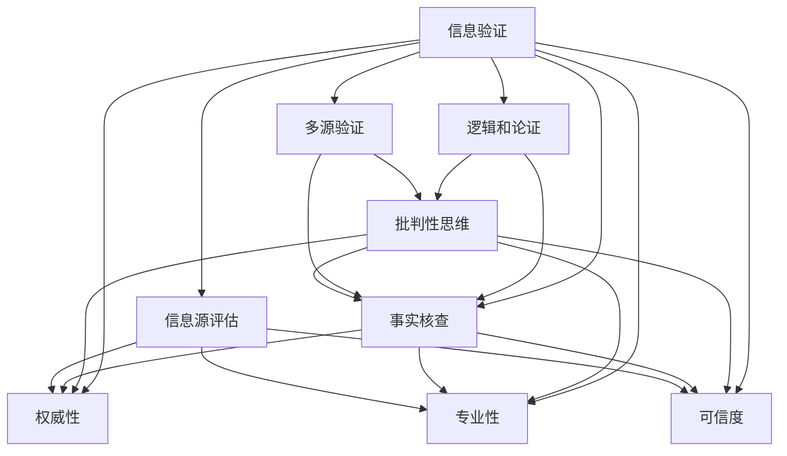

                 

### 《信息验证和批判性思维：在假新闻时代导航》

#### 关键词：
- 信息验证
- 批判性思维
- 假新闻
- 信息源评估
- 事实核查
- 逻辑谬误

#### 摘要：
在信息爆炸的时代，我们面临的挑战不仅是获取信息，更是如何分辨真假、筛选可靠的信息。本文旨在探讨在假新闻充斥的网络环境中，如何运用信息验证和批判性思维来导航。文章分为四个部分：第一部分介绍了信息验证的基础知识和实践方法；第二部分探讨了批判性思维的概念及其在信息验证中的应用；第三部分通过案例分析展示了信息验证和批判性思维的实战应用；第四部分展望了未来信息验证和批判性思维的发展趋势，并讨论了其社会影响和伦理问题。

### 《信息验证和批判性思维：在假新闻时代导航》目录大纲

#### 第一部分：信息验证基础

##### 第1章：信息验证的重要性与挑战

###### 1.1 信息化社会的挑战
在信息化社会中，信息的传播速度和广度前所未有，但也带来了信息过载和真假难辨的问题。

###### 1.2 信息验证的重要性
信息验证是确保我们接收的信息真实可靠的关键步骤，对于个人决策、企业运营和公共安全都有着重要影响。

###### 1.3 信息验证的基本概念
信息验证包括从多个来源核实信息、评估信息源的可信度以及使用事实核查工具等。

##### 第2章：信息源评估与筛选

###### 2.1 评估信息源
评估信息源是信息验证的第一步，需要考虑来源的权威性、专业性以及发布者的背景。

###### 2.2 识别可信信息源
识别可信信息源是信息验证的核心，需要通过多方面的考量来判断信息源的可靠性。

###### 2.3 信息源筛选策略
信息源筛选策略包括使用评级系统、关注专业机构发布的信息以及建立自己的信息源库等。

##### 第3章：事实核查与信息验证方法

###### 3.1 事实核查的概念
事实核查是通过验证事实来确认信息的真实性，避免被假新闻误导。

###### 3.2 信息验证工具与技术
介绍常用的信息验证工具和技术，包括搜索引擎、社交媒体检测工具和专业的第三方事实核查网站。

###### 3.3 实例分析：如何验证一则新闻
通过实例分析，展示如何一步步验证一则新闻的真实性。

#### 第二部分：批判性思维技巧

##### 第4章：批判性思维概述

###### 4.1 批判性思维的定义
批判性思维是一种基于逻辑和分析的思考方式，能够帮助我们更好地评估信息的真实性。

###### 4.2 批判性思维的重要性
批判性思维对于判断信息的可信度、避免逻辑谬误以及做出明智决策至关重要。

###### 4.3 批判性思维与信息验证的关系
批判性思维是信息验证的重要组成部分，两者相辅相成，共同提高我们的信息素养。

##### 第5章：分析论证逻辑

###### 5.1 论证的基本结构
分析论证的基本结构包括前提、结论和论证过程。

###### 5.2 识别逻辑谬误
介绍常见的逻辑谬误，如偷换概念、虚假因果和以偏概全等，并展示如何识别和避免这些谬误。

###### 5.3 论证评估技巧
介绍评估论证的技巧，包括检验前提的真实性和逻辑过程的严密性。

##### 第6章：批判性思维应用

###### 6.1 批判性思维在信息验证中的应用
探讨如何将批判性思维应用于信息验证，提高我们识别假新闻的能力。

###### 6.2 批判性思维在社交媒体中的实践
在社交媒体上，批判性思维可以帮助我们避免被虚假信息误导。

###### 6.3 批判性思维的培养与训练
介绍如何培养和训练批判性思维，提高我们的信息素养。

#### 第三部分：实践与案例

##### 第7章：信息验证与批判性思维案例分析

###### 7.1 案例一：识别假新闻
通过分析一个具体的假新闻案例，展示如何使用信息验证和批判性思维识别虚假信息。

###### 7.2 案例二：评估数据真实性
分析一个数据真实性案例，展示如何通过信息验证和批判性思维评估数据的可靠性。

###### 7.3 案例三：分析网络评论
探讨如何使用批判性思维分析网络评论，识别潜在的偏见和误导。

##### 第8章：实战演练与练习

###### 8.1 实战演练设计
设计一系列实战演练，帮助读者提高信息验证和批判性思维能力。

###### 8.2 批判性思维训练方法
介绍批判性思维的训练方法，包括思维导图、案例分析和逻辑游戏等。

###### 8.3 信息验证与批判性思维练习题
提供一系列练习题，帮助读者巩固所学知识。

##### 第9章：信息验证与批判性思维在特定领域的应用

###### 9.1 政治领域的信息验证
讨论政治领域信息验证的挑战和重要性，以及如何应对这些挑战。

###### 9.2 学术领域的信息核查
探讨学术领域信息核查的方法和注意事项。

###### 9.3 商业决策中的批判性思维
分析商业决策中批判性思维的应用，提高决策质量。

#### 第四部分：未来展望

##### 第10章：信息验证与批判性思维的发展趋势

###### 10.1 未来信息验证技术的发展
探讨未来信息验证技术的可能发展趋势，如人工智能和大数据分析的应用。

###### 10.2 批判性思维的培养与教育
讨论批判性思维的培养与教育，提出相关教育策略。

###### 10.3 信息验证与批判性思维的社会影响
分析信息验证与批判性思维对社会的影响，以及如何应对这些影响。

##### 第11章：信息时代下的责任与挑战

###### 11.1 信息时代的伦理问题
探讨信息时代面临的伦理问题，如隐私保护和信息滥用。

###### 11.2 个人责任与信息素养
强调个人责任在信息时代的重要性，提高信息素养。

###### 11.3 社会责任与信息治理
讨论社会责任在信息治理中的作用，以及如何构建良好的信息环境。

#### 附录

##### 附录A：信息验证与批判性思维工具推荐

###### A.1 事实核查网站推荐
推荐一些知名的事实核查网站，帮助读者验证信息。

###### A.2 批判性思维训练资源
推荐一些批判性思维的训练资源和工具。

###### A.3 信息验证工具使用指南
介绍一些常用的信息验证工具及其使用方法。

##### 附录B：参考文献与进一步阅读

###### B.1 信息验证相关书籍推荐
推荐一些关于信息验证的经典书籍。

###### B.2 批判性思维研究论文精选
推荐一些批判性思维领域的研究论文。

###### B.3 信息时代下的社会问题研究参考资料
提供一些关于信息时代社会问题的研究资料。

### 第一部分：信息验证基础

#### 第1章：信息验证的重要性与挑战

##### 1.1 信息化社会的挑战

随着互联网的普及和信息技术的发展，我们生活在一个信息化社会中。信息的传播速度和广度前所未有，这不仅改变了我们的生活方式，也带来了许多挑战。首先，信息过载成为一个普遍问题。每天，我们接收到大量的信息，从新闻报道到社交媒体更新，从学术研究到商业信息，这种过载使得我们难以分辨哪些信息是真正重要的。其次，真假信息混杂在一起，使得判断信息真实性变得更加困难。在网络上，假新闻、谣言、误导性信息层出不穷，这些信息不仅误导了公众，还可能对社会产生严重的影响。例如，政治谣言可能影响选举结果，虚假医疗信息可能导致公众健康危机，金融谣言可能引发市场动荡。因此，在信息化社会中，信息验证成为一项至关重要的任务。

##### 1.2 信息验证的重要性

信息验证的重要性在于确保我们接收到的信息是真实可靠的。在个人层面，准确的信息可以帮助我们做出明智的决策，无论是个人财务规划、健康决策还是教育选择。在商业层面，可靠的信息是企业运营和决策的基础，错误的信息可能导致经济损失和声誉损害。在公共安全层面，准确的信息对于防范和应对危机至关重要，如自然灾害、公共卫生事件等。此外，信息验证有助于建立公众对媒体和信息的信任，这对于民主社会的健康发展至关重要。在互联网时代，信息验证不仅是个人技能，也是社会问题。因此，提高公众的信息验证能力，培养批判性思维，成为当务之急。

##### 1.3 信息验证的基本概念

信息验证是一个复杂的过程，涉及到多个方面。首先，我们需要理解什么是“信息”。信息可以是有形的，如书籍、报纸、电视新闻等，也可以是无形的，如电子邮件、社交媒体帖子、网络论坛等。其次，我们需要了解“验证”的含义。验证是指通过多种途径和工具，对信息进行核实和确认，以确保其真实性和可靠性。在信息验证过程中，以下概念是关键：

1. **信息源**：信息源是指信息的来源，如新闻机构、专家、学术期刊、政府报告等。评估信息源的可信度是信息验证的第一步。
   
2. **事实核查**：事实核查是指通过查阅原始资料、核实数据来源等方式，验证信息的真实性。事实核查是信息验证的核心环节。

3. **多源验证**：多源验证是指从多个不同的来源获取信息，并进行交叉验证，以增加信息的可信度。

4. **批判性思维**：批判性思维是指对信息进行分析、评估和推理，以识别潜在的偏见、误导和逻辑谬误。批判性思维是信息验证的重要组成部分。

5. **逻辑和论证**：逻辑和论证是指通过分析信息的前提和结论，评估其逻辑结构和论证的有效性。

通过以上概念，我们可以更全面地理解信息验证的过程和重要性。在接下来的章节中，我们将深入探讨这些概念，并提供具体的实践方法和技巧。

### 第2章：信息源评估与筛选

#### 2.1 评估信息源

评估信息源是信息验证的第一步，也是最重要的一步。一个可靠的信息源可以大大提高我们获取信息的准确性和可信度。相反，如果信息源不可靠，即使信息本身是真实的，也可能因为源头的不可信而影响其价值。因此，评估信息源是信息验证过程中不可或缺的一环。

首先，我们需要考虑信息源的权威性。权威性是指信息源在某一领域内的专业地位和影响力。例如，对于医疗信息，我们更倾向于相信来自专业医疗机构的报告，而不是非专业人士的个人观点。在评估权威性时，可以参考以下标准：

- **资质认证**：查看信息源是否拥有相关的资质认证，如学术机构的认证、新闻机构的认证等。
- **专业背景**：了解信息源发布者的专业背景和经验，专业背景越强，其信息的可信度越高。
- **历史记录**：查看信息源在过去发布的信息是否被证实为真实可靠。

其次，我们需要考虑信息源的专业性。专业性是指信息源在某一领域的专业知识和经验。一个专业性强的人或机构，其发布的信息更有可能真实可靠。在评估专业性时，可以参考以下标准：

- **专业知识**：了解信息源在某一领域的专业知识和研究水平，专业知识越丰富，其信息的可信度越高。
- **研究成果**：查看信息源是否在相关领域发表了学术论文或研究成果，研究成果越多，其专业性越强。
- **实践经验**：了解信息源在实际工作中的经验和成果，实践经验越丰富，其信息的可靠性越高。

最后，我们需要考虑信息源的可信度。可信度是指信息源在公众中的信任程度。一个可信度高的信息源更容易被公众接受和信任。在评估可信度时，可以参考以下标准：

- **声誉**：查看信息源在公众中的声誉，一个声誉良好的信息源更容易获得公众的信任。
- **受众反馈**：查看信息源的受众反馈，受众对信息源的积极反馈可以增加其可信度。
- **第三方评价**：参考第三方对信息源的评估和评价，如专业机构的评级和评估。

##### 如何评估信息源

1. **查看资质认证**：检查信息源是否拥有相关的资质认证，如新闻机构的认证、学术机构的认证等。
2. **了解专业背景**：通过查阅信息源的简历、学术背景等信息，了解其专业背景和经验。
3. **查阅研究成果**：查看信息源在相关领域是否发表了学术论文或研究成果。
4. **查看历史记录**：查阅信息源在过去发布的信息是否被证实为真实可靠。
5. **了解受众反馈**：通过社交媒体、论坛等渠道了解信息源的受众反馈。
6. **参考第三方评价**：参考专业机构对信息源的评估和评价。

通过以上步骤，我们可以对信息源进行全面的评估，从而选择可信度较高的信息源。在实际应用中，评估信息源需要结合多种方法和手段，如查阅资料、询问专业人士、网络搜索等。

##### 识别可信信息源

识别可信信息源是信息验证的关键环节。以下是一些方法可以帮助我们识别可信信息源：

1. **使用评级系统**：许多机构和组织会发布信息源的评级系统，如新闻机构的评级、学术期刊的评级等。我们可以参考这些评级来选择可信度较高的信息源。

2. **关注专业机构发布的信息**：专业机构通常具有更高的权威性和专业性，其发布的信息更有可能真实可靠。例如，在医疗领域，我们可以关注世界卫生组织（WHO）的公告；在金融领域，我们可以关注国际货币基金组织（IMF）的报告。

3. **查阅原始资料**：对于重要的信息，我们应该查阅原始资料，如学术论文、官方报告等，以验证其真实性。

4. **多方验证**：从多个不同的来源获取信息，并进行交叉验证，以增加信息的可信度。

5. **关注信息源的更新频率**：一个定期更新信息的源更有可能提供最新的、准确的信息。

通过以上方法，我们可以更好地识别可信信息源，从而提高信息验证的准确性。

##### 信息源筛选策略

1. **建立个人信息源库**：将可信度较高的信息源整理成库，方便日后查找和使用。
2. **设定信息源优先级**：根据信息的紧急性和重要性，设定不同的信息源优先级。
3. **定期评估信息源**：定期对信息源进行评估，更新信息源库，确保信息源的可靠性。
4. **使用信息验证工具**：利用信息验证工具，如搜索引擎、事实核查网站等，辅助筛选信息源。

### 第3章：事实核查与信息验证方法

#### 3.1 事实核查的概念

事实核查（Fact-checking）是指通过验证事实来确认信息的真实性，避免被假新闻误导。事实核查的过程通常包括以下几个步骤：

1. **确认信息源**：首先，需要确认信息的来源，确保信息源的可信度。
2. **查找原始资料**：然后，查找与信息相关的原始资料，如学术论文、官方报告、新闻报道等，以验证信息的真实性。
3. **交叉验证**：从多个不同的来源获取信息，并进行交叉验证，以增加信息的可信度。
4. **识别逻辑谬误**：在信息验证过程中，还需要识别和纠正逻辑谬误，确保论证的严密性。
5. **发布核查结果**：最后，将核查结果公之于众，帮助公众辨别真假信息。

事实核查不仅是对某一具体信息的验证，更是一种社会监督机制，有助于维护信息环境的真实性和公信力。

#### 3.2 信息验证工具与技术

在信息验证过程中，使用适当的工具和技术可以大大提高验证的效率和准确性。以下是一些常用的信息验证工具和技术：

1. **搜索引擎**：搜索引擎可以帮助我们快速查找相关信息，验证信息的真实性。常用的搜索引擎包括Google、百度等。
   
2. **社交媒体检测工具**：社交媒体检测工具可以帮助我们识别和追踪虚假信息在社交媒体上的传播。例如，Botometer、G encar等工具可以分析社交媒体账号的活动，判断其是否为机器人或恶意账号。

3. **专业的第三方事实核查网站**：专业的第三方事实核查网站，如FactCheck.org、PolitiFact等，提供经过验证的新闻和信息，是我们进行信息验证的重要资源。

4. **官方报告和学术论文**：官方报告和学术论文是验证信息的重要来源，具有较高的权威性和专业性。

5. **专业数据库和资料库**：如医学领域的PubMed、法律领域的Westlaw等，提供专业的数据和资料，有助于我们进行深入的信息验证。

6. **信息验证软件**：一些专门的信息验证软件，如Reverse Image Search、Text Check等，可以帮助我们快速识别和验证图像和文本信息。

7. **电子邮件和消息验证工具**：如Mailwasher、Grammarly等，可以帮助我们识别和过滤垃圾邮件和错误信息。

通过以上工具和技术的结合使用，我们可以更全面、准确地验证信息，提高信息验证的效果。

#### 3.3 实例分析：如何验证一则新闻

下面我们通过一个具体的新闻案例，展示如何进行信息验证。

**案例：某知名网站报道“某市出现了一种新型流感，传播速度快，死亡率高达50%。”**

1. **确认信息源**：首先，确认该报道的来源，查看该网站是否是一个可信的新闻机构。通过查阅该网站的资质认证和过往报道，发现其信誉良好，具备较高的权威性。

2. **查找原始资料**：然后，查找与该报道相关的原始资料。通过网络搜索和查阅医疗领域的权威报告，如世界卫生组织（WHO）和疾病控制与预防中心（CDC）的公告，发现没有提到该市出现新型流感的信息。

3. **交叉验证**：接着，从多个不同的来源获取信息，并进行交叉验证。通过查阅其他媒体报道和医疗专家的评论，发现该报道可能是虚假的。

4. **识别逻辑谬误**：在验证过程中，识别和纠正了潜在的逻辑谬误，如以偏概全、虚假因果等。

5. **发布核查结果**：最后，将该核查结果公之于众，提醒公众该报道可能是虚假信息，避免误导。

通过以上步骤，我们成功验证了该新闻的真实性，并提醒公众警惕虚假信息。

### 第二部分：批判性思维技巧

#### 第4章：批判性思维概述

##### 4.1 批判性思维的定义

批判性思维（Critical Thinking）是一种基于逻辑和分析的思考方式，它不仅仅是简单地接受信息，而是对信息进行分析、评估和推理，以判断其真实性和合理性。批判性思维不仅仅是质疑和反驳，更是一种积极、系统、理性的思维方式。它包括识别和评估信息的前提、论据、结论以及论证过程，帮助我们在复杂和不确定的环境中做出明智的决策。

批判性思维与日常生活中的思考方式有所不同。日常生活中，我们往往基于直觉、习惯和情感进行判断，而批判性思维则要求我们超越这些表面因素，深入分析问题的本质。批判性思维需要我们具备以下技能：

- **分析能力**：能够将复杂的问题分解为简单的部分，理解各个部分之间的关系。
- **评估能力**：能够评估信息的可靠性和有效性，识别潜在的偏见和误导。
- **推理能力**：能够使用逻辑规则和论证方法，从已知的前提推导出结论。
- **反思能力**：能够对自己的思考过程进行反思，识别和纠正错误。

##### 4.2 批判性思维的重要性

批判性思维在信息验证中具有至关重要的作用。首先，它帮助我们识别和评估信息的真实性和可靠性。在充斥着假新闻和误导性信息的网络环境中，批判性思维是我们避免被误导的重要工具。通过批判性思维，我们可以对信息进行深入分析，识别其中的逻辑谬误和偏见，从而避免被虚假信息所欺骗。

其次，批判性思维有助于提高我们的信息素养。在现代社会，信息素养已经成为一种基本能力。批判性思维使我们能够更好地理解信息的来源、结构和含义，从而提高我们处理和利用信息的能力。这不仅有助于我们在个人生活中做出明智的决策，也有助于我们在学习和工作中更有效地利用信息资源。

此外，批判性思维在决策过程中也起着重要作用。无论是个人决策还是企业决策，都需要基于真实可靠的信息进行。批判性思维可以帮助我们评估各种决策方案，识别潜在的风险和问题，从而做出更加明智的决策。

最后，批判性思维对于维护社会秩序和公共利益至关重要。在公共事务中，信息的真实性和可靠性直接影响公众的信任和决策。通过批判性思维，我们可以对公共信息进行严格验证，确保其真实性和可信度，从而维护社会的公正和公平。

##### 4.3 批判性思维与信息验证的关系

批判性思维和信息验证是相辅相成的。信息验证依赖于批判性思维，而批判性思维又为信息验证提供了方法和工具。具体来说，批判性思维在信息验证中的应用主要体现在以下几个方面：

1. **评估信息源**：在信息验证过程中，我们需要评估信息源的权威性和专业性。批判性思维帮助我们识别信息源的背景、资质和声誉，从而判断其可信度。

2. **验证事实**：批判性思维使我们能够对信息中的事实进行深入分析，识别和纠正潜在的逻辑谬误和偏见。例如，通过逻辑推理和论证，我们可以判断某个陈述是否合乎逻辑，是否有可能被误导。

3. **评估论证**：批判性思维帮助我们评估信息的论证过程，包括前提的真实性和结论的合理性。通过分析论证的结构，我们可以识别其中可能存在的逻辑漏洞，从而提高信息验证的准确性。

4. **反思和改进**：批判性思维使我们能够对自己的信息验证过程进行反思和改进。通过识别和分析过程中的问题，我们可以不断优化信息验证的方法和技巧，提高信息验证的效率和质量。

总之，批判性思维是信息验证的重要组成部分，它为信息验证提供了逻辑和分析的工具，帮助我们更好地分辨真假信息，提高信息素养和决策质量。

### 第5章：分析论证逻辑

#### 5.1 论证的基本结构

论证（Argument）是指通过一系列陈述来支持某个观点或结论的过程。一个有效的论证需要具备清晰的逻辑结构和合理的论证过程。理解论证的基本结构对于评估和构建论证至关重要。论证的基本结构通常包括以下几个部分：

1. **前提（Premises）**：前提是支持结论的陈述，是论证的基础。一个有效的论证需要具有可靠的前提，这些前提应该是真实的或被广泛接受的真实陈述。

2. **结论（Conclusion）**：结论是论证的最终陈述，是前提所支持的结论。结论应该是从前提中逻辑推导出来的，具有合理性和一致性。

3. **论据（Evidence）**：论据是支持前提的陈述或事实，是论证的重要支撑。论据需要具有相关性、可靠性和充分性，以便有效地支持前提。

4. **论证过程（Deductive Process）**：论证过程是指将前提通过逻辑推理转化为结论的过程。有效的论证需要使用合理的逻辑规则，如因果推理、类比推理等，以确保结论的合理性和一致性。

一个典型的论证结构如下：

```
前提1：所有人类都需要食物。
前提2：约翰是人类。
结论：因此，约翰需要食物。
```

在这个例子中，“所有人类都需要食物”和“约翰是人类”是前提，“约翰需要食物”是结论，通过逻辑推理，我们可以从前提得出结论。

##### 论证的结构图示

```
[前提1]：所有人类都需要食物。
[前提2]：约翰是人类。
[结论]：因此，约翰需要食物。

       |
       V
[论证过程]
```

通过这个结构图，我们可以清晰地看到论证的基本组成部分和它们之间的关系。

##### 5.2 识别逻辑谬误

逻辑谬误是指在论证过程中出现的错误推理，导致论证的结论缺乏合理性和说服力。识别逻辑谬误是批判性思维的重要组成部分，有助于我们避免被误导和做出错误的决策。以下是一些常见的逻辑谬误：

1. **偷换概念（Equivocation）**：偷换概念是指在同一论证中，使用同一个词或短语但在不同的上下文中赋予不同的含义。这种谬误会导致论证的混乱和不一致。

2. **虚假因果（False Cause）**：虚假因果是指将两个事件之间的相关关系误认为是因果关系。这种谬误忽略了其他可能的因素，导致错误的结论。

3. **以偏概全（Hasty Generalization）**：以偏概全是指从个别案例或小部分数据中得出一般性结论。这种谬误忽略了样本的代表性和统计显著性。

4. **滑坡谬误（Slippery Slope）**：滑坡谬误是指假设一个小步骤会导致一系列不可逆转的负面后果。这种谬误忽略了中间步骤的复杂性和不确定性。

5. **诉诸权威（Appeal to Authority）**：诉诸权威是指引用权威人士或专家的观点来支持论证，但该权威人士或专家的观点并不一定具有权威性或适用性。

6. **人身攻击（Ad Hominem）**：人身攻击是指攻击论证者的个人品质或背景，而不是直接反驳其论证。这种谬误忽略了论证的有效性。

7. **循环论证（Begging the Question）**：循环论证是指论证的结论已经在前提中假设为真。这种谬误导致论证的无效性。

通过识别和避免这些逻辑谬误，我们可以提高论证的质量和说服力，避免被误导和做出错误的决策。

##### 5.3 论证评估技巧

评估论证的有效性是批判性思维的重要任务。以下是一些评估论证的技巧：

1. **检查前提的真实性**：首先，我们需要检查论证的前提是否真实或被广泛接受为真实。如果前提不真实或存在争议，那么论证的结论也可能会受到质疑。

2. **分析论证的逻辑过程**：其次，我们需要分析论证的逻辑过程，确保它遵循合理的逻辑规则。如果论证的逻辑过程存在漏洞或错误，那么论证的结论也可能是无效的。

3. **评估论据的充分性**：我们需要评估论据是否充分、相关且可靠。如果论据不足以支持前提，或者与前提不相关，那么论证的结论可能会受到质疑。

4. **识别逻辑谬误**：通过识别和纠正逻辑谬误，我们可以提高论证的质量和说服力。例如，通过识别和纠正以偏概全、虚假因果等逻辑谬误，我们可以使论证更加严谨和有效。

5. **综合评估**：最后，我们需要综合评估论证的各个方面，包括前提的真实性、逻辑过程的有效性、论据的充分性等，以判断整个论证的有效性。

通过以上技巧，我们可以更准确地评估论证的质量和可信度，从而做出更明智的决策。

### 第6章：批判性思维应用

#### 6.1 批判性思维在信息验证中的应用

批判性思维在信息验证中的应用至关重要，它帮助我们更全面、深入地分析信息，提高识别真假信息的能力。以下是一些具体的策略：

1. **评估信息源**：首先，我们需要评估信息源的权威性和专业性。通过查阅信息源的资质认证、专业背景和历史记录，我们可以初步判断其可信度。如果信息源缺乏权威性或专业性，那么其发布的信息可能需要进一步核实。

2. **验证事实**：其次，我们需要验证信息中的事实。这包括查找原始资料、交叉验证信息来源以及识别潜在的偏见和误导。例如，如果一则新闻报道提到了某个统计数据，我们需要查找官方报告或权威机构发布的数据来验证其真实性。

3. **识别逻辑谬误**：在信息验证过程中，我们需要识别和纠正逻辑谬误。例如，以偏概全、虚假因果和人身攻击等逻辑谬误都可能导致错误的判断。通过批判性思维，我们可以识别这些逻辑漏洞，避免被误导。

4. **评估论证过程**：我们还需要评估信息论证的逻辑过程。论证是否合理、论据是否充分、前提是否真实，这些都是需要考虑的因素。通过批判性思维，我们可以更全面地评估论证的有效性。

5. **综合评估**：最后，我们需要对信息进行综合评估。信息源的权威性、事实的真实性、论证的逻辑性等因素都需要综合考虑。只有通过全面、系统的评估，我们才能做出准确的信息判断。

通过以上策略，我们可以更有效地应用批判性思维进行信息验证，提高我们的信息素养和判断力。

#### 6.2 批判性思维在社交媒体中的实践

在社交媒体时代，批判性思维的应用尤为重要。社交媒体上的信息繁杂且多样，真假难辨。以下是一些具体的实践策略：

1. **识别误导性信息**：社交媒体上的信息往往以快速、简短的方式传播，很容易误导公众。我们需要使用批判性思维来识别这些信息。例如，通过检查信息源的可信度、查找原始资料、交叉验证信息来源等方式，我们可以初步判断信息的真实性。

2. **评估信息的内容和结构**：在社交媒体上，我们需要仔细评估信息的逻辑结构和论证过程。通过识别逻辑谬误、验证事实和评估论证的有效性，我们可以避免被虚假信息所误导。例如，如果一则新闻声称某个事件的发生，我们需要查找官方报告或权威机构的声明来验证其真实性。

3. **参与互动和讨论**：在社交媒体上，我们可以积极参与互动和讨论，与其他用户分享我们的观点和看法。通过批判性思维，我们可以提出有逻辑、有根据的论证，帮助他人识别和纠正错误的信息。

4. **建立信息源库**：为了提高我们的信息素养，我们可以建立个人信息源库，收集和整理可信度较高的信息源。通过定期更新和维护信息源库，我们可以更有效地筛选和利用信息。

5. **培养批判性思维**：最后，我们需要通过不断学习和实践，培养批判性思维。通过阅读相关书籍、参加培训课程、参与讨论等方式，我们可以提高我们的批判性思维能力，更好地应对社交媒体上的信息挑战。

通过以上实践策略，我们可以更有效地应用批判性思维在社交媒体中，提高我们的信息判断力和信息素养。

#### 6.3 批判性思维的培养与训练

批判性思维的培养与训练是提高信息素养和决策能力的关键。以下是一些方法和技巧：

1. **思维导图**：思维导图是一种有效的思维工具，可以帮助我们整理和梳理复杂的信息。通过绘制思维导图，我们可以更清晰地理解信息的结构和关系，从而提高批判性思维能力。

2. **案例分析**：通过分析具体的案例，我们可以了解批判性思维在现实中的应用。例如，分析政治谣言、假新闻、商业欺诈等案例，可以帮助我们识别和纠正逻辑谬误，提高信息验证的能力。

3. **逻辑游戏和谜题**：逻辑游戏和谜题是一种有趣的训练方法，可以帮助我们培养逻辑推理和分析问题的能力。例如，解决逻辑谜题、玩逻辑游戏等，都可以提高我们的批判性思维。

4. **阅读和写作**：阅读和写作是培养批判性思维的重要途径。通过阅读不同领域的书籍、文章和报告，我们可以开阔视野、丰富知识。同时，通过写作，我们可以将所学知识转化为自己的理解和观点，从而提高批判性思维能力。

5. **训练课程和研讨会**：参加批判性思维的训练课程和研讨会，可以系统地学习批判性思维的理论和方法。这些课程和研讨会通常包括案例分析、小组讨论和实践演练等，可以帮助我们更好地理解和应用批判性思维。

6. **自我反思**：自我反思是培养批判性思维的重要方法。通过反思自己的思考过程、识别和纠正错误，我们可以不断优化自己的思维方式和决策能力。

通过以上方法和技巧，我们可以有效地培养和训练批判性思维，提高我们的信息素养和决策能力。

### 第7章：信息验证与批判性思维案例分析

#### 7.1 案例一：识别假新闻

**案例背景**：在某知名社交媒体平台上，一篇题为“美国已发现治疗新冠病毒的特效药，全球大流行即将结束”的帖子迅速传播，引发了大量关注和讨论。

**分析过程**：

1. **评估信息源**：首先，我们检查该帖子的信息源，发现其发布者是一个未经认证的个人账户，且该账户过去曾发布过一些未经核实的消息。

2. **查找原始资料**：接着，我们尝试查找与该消息相关的原始资料，如官方声明、科学论文等。然而，我们未能找到任何权威机构或专家支持该消息的证据。

3. **交叉验证**：我们通过多个渠道，包括其他社交媒体平台、新闻媒体和官方声明，进行了交叉验证。我们发现，多个权威机构和专家均表示，截至目前，全球尚未发现治疗新冠病毒的特效药。

4. **识别逻辑谬误**：在该帖子的论证过程中，我们发现了滑坡谬误和虚假因果的痕迹。帖子通过假设一种药物的存在，推断出全球大流行的结束，忽略了中间步骤的复杂性和不确定性。

**结论**：通过以上分析，我们判断该帖子为假新闻，提醒公众谨慎对待未经核实的消息。

#### 7.2 案例二：评估数据真实性

**案例背景**：某知名数据分析公司在一份报告中声称，某市的新冠疫苗接种率达到了90%，显著高于其他城市。

**分析过程**：

1. **评估信息源**：首先，我们检查该报告的信息源，发现其数据来源于某市卫生部门发布的统计数据。

2. **查阅原始资料**：接着，我们查阅了该市卫生部门发布的官方报告，发现报告中提供了详细的疫苗接种数据和来源。

3. **交叉验证**：我们通过查阅其他权威机构和媒体的报道，发现多个来源的数据与该报告一致，进一步验证了数据的真实性。

4. **评估数据的可靠性**：我们分析了报告中的数据，发现其样本选择和统计方法合理，数据来源可靠，结论具有科学依据。

**结论**：通过以上分析，我们判断该报告的数据真实性较高，具有较高的参考价值。

#### 7.3 案例三：分析网络评论

**案例背景**：在某新闻网站上一则关于新冠疫情的报道下，出现了大量评论，其中一些评论表达了极端观点，引发了争议。

**分析过程**：

1. **评估评论者背景**：首先，我们检查了评论者的背景，发现其中一些评论者具有匿名身份，且过去曾发布过类似极端观点。

2. **分析论证逻辑**：接着，我们分析了评论中的论证逻辑，发现其中存在逻辑谬误，如人身攻击和滑坡谬误。例如，一些评论者通过攻击报道作者的个人品质来质疑报道的客观性。

3. **评估论据的充分性**：我们分析了评论中的论据，发现其论据缺乏充分性和相关性。例如，一些评论者引用的案例和数据与报道的内容无关。

4. **反思和回应**：最后，我们通过批判性思维进行了反思和回应，指出评论中的逻辑谬误和论据不足，帮助其他用户识别和纠正错误。

**结论**：通过以上分析，我们提醒公众在网络评论中要保持批判性思维，避免被极端观点所误导。

### 第8章：实战演练与练习

#### 8.1 实战演练设计

为了帮助读者在实际中应用信息验证和批判性思维，我们设计了以下实战演练：

1. **信息源评估演练**：选择一个热门话题，评估相关信息的来源，包括权威性、专业性和可信度。

2. **事实核查演练**：选择一则新闻报道，进行事实核查，验证其事实的真实性，并识别其中的逻辑谬误。

3. **论证评估演练**：分析一个公开的辩论或讨论，评估其论证过程的有效性，识别和纠正逻辑谬误。

4. **网络评论分析演练**：选择一个网络平台的评论，分析其观点的合理性，识别和纠正逻辑谬误。

5. **实战演练报告**：每位参与者需要提交一份实战演练报告，总结分析过程、发现的问题和解决方案。

#### 8.2 批判性思维训练方法

为了培养和训练批判性思维，我们推荐以下方法：

1. **阅读和讨论**：通过阅读不同领域的书籍、文章和报告，参与小组讨论，培养分析和评估信息的能力。

2. **案例分析**：通过分析具体案例，理解批判性思维在现实中的应用，识别和纠正逻辑谬误。

3. **逻辑游戏和谜题**：通过解决逻辑游戏和谜题，培养逻辑推理和分析问题的能力。

4. **写作练习**：通过写作，将所学知识转化为自己的理解和观点，提高批判性思维能力。

5. **思维导图**：通过绘制思维导图，整理和梳理复杂的信息，提高信息组织和分析能力。

6. **在线课程和研讨会**：参加批判性思维的在线课程和研讨会，学习系统的批判性思维理论和实践方法。

#### 8.3 信息验证与批判性思维练习题

为了巩固所学知识，我们提供以下练习题：

1. **信息源评估**：评估以下信息源的权威性、专业性和可信度：
   - 一篇关于健康饮食的博客文章
   - 一则新闻报道
   - 一本学术期刊

2. **事实核查**：针对以下新闻报道，进行事实核查：
   - 一篇声称发现新技术的报道
   - 一则关于公共卫生事件的报道
   - 一则政治新闻

3. **论证评估**：分析以下论证的有效性，识别和纠正逻辑谬误：
   - “因为所有人都喜欢吃巧克力，所以巧克力是世界上最健康的食物。”
   - “因为天气变暖，所以北极熊会灭绝。”
   - “因为这家公司过去五年业绩稳定，所以未来五年业绩也会稳定。”

4. **网络评论分析**：分析以下网络评论，评估其观点的合理性，识别和纠正逻辑谬误：
   - 一则关于政治选举的评论
   - 一则关于经济政策的评论
   - 一则关于社会问题的评论

通过以上练习，读者可以更好地掌握信息验证和批判性思维的方法和技巧。

### 第9章：信息验证与批判性思维在特定领域的应用

#### 9.1 政治领域的信息验证

在政治领域，信息验证和批判性思维的应用至关重要。政治信息的真实性和可靠性直接影响公众的信任和决策。以下是一些在政治领域应用信息验证和批判性思维的方法：

1. **评估政治信息源**：首先，需要评估政治信息源的权威性和专业性。政治信息通常来自政府、政治团体、新闻媒体等，我们需要核实这些信息源的背景、资质和声誉。

2. **验证政治言论**：政治言论往往涉及政策、选举、社会问题等，我们需要对政治言论进行深入分析，验证其真实性和合理性。例如，政治候选人的竞选承诺需要与政府报告、官方数据等对比，以确保其真实性和可行性。

3. **交叉验证信息**：在政治信息验证过程中，我们需要从多个不同的来源获取信息，并进行交叉验证，以确保信息的准确性。例如，对于一项政策的评估，我们可以参考不同政治派别的观点、专家的分析以及媒体报道。

4. **批判性思维应用**：在政治领域，批判性思维可以帮助我们识别政治信息中的逻辑谬误和偏见。例如，通过识别滑坡谬误、虚假因果和人身攻击等逻辑谬误，我们可以更准确地评估政治信息的真实性和可信度。

5. **公众参与与监督**：公众在政治信息验证中扮演重要角色。通过参与公共讨论、监督媒体报道以及举报虚假信息，公众可以共同维护政治信息的真实性和公正性。

#### 9.2 学术领域的信息核查

在学术领域，信息核查和批判性思维的应用同样重要。学术信息的真实性和可靠性对于学术研究和教育质量有着深远的影响。以下是一些在学术领域应用信息核查和批判性思维的方法：

1. **评估学术信息源**：学术信息通常来自学术期刊、学术论文、学术会议等，我们需要评估这些信息源的权威性和专业性。评估标准包括期刊的影响因子、学术声誉、作者的专业背景等。

2. **验证研究数据的真实性**：学术研究通常依赖于数据。我们需要对研究数据进行验证，确保其真实性和可靠性。例如，通过查阅原始数据、对比其他研究数据等方式，我们可以验证研究数据的准确性。

3. **批判性思维在学术研究中的应用**：批判性思维在学术研究中发挥着重要作用。通过批判性思维，我们可以评估学术研究的逻辑框架、论证过程和研究结果的合理性。例如，通过识别逻辑谬误、验证前提的真实性等方式，我们可以提高学术研究的质量。

4. **同行评审**：同行评审是学术领域信息核查的重要环节。通过同行评审，我们可以确保学术研究的结果真实可靠，避免学术造假和错误。同行评审过程需要批判性思维的应用，以确保评审的公正性和有效性。

5. **学术伦理**：在学术领域，信息核查和批判性思维还涉及学术伦理问题。我们需要遵循学术伦理规范，如诚实、客观、公正等，以确保学术研究的真实性和可靠性。

#### 9.3 商业决策中的批判性思维

在商业决策中，批判性思维的应用同样至关重要。商业信息的真实性和可靠性对于企业的运营和发展有着重要影响。以下是一些在商业决策中应用批判性思维的方法：

1. **评估商业信息源**：商业信息通常来自市场研究、竞争对手分析、财务报告等，我们需要评估这些信息源的权威性和专业性。评估标准包括信息源的可靠性、数据来源的透明度等。

2. **验证市场数据**：在商业决策中，市场数据至关重要。我们需要对市场数据进行验证，确保其真实性和可靠性。例如，通过对比不同数据提供商的数据、分析市场趋势等方式，我们可以验证市场数据的准确性。

3. **批判性思维在商业决策中的应用**：批判性思维可以帮助我们评估商业信息的逻辑框架和论证过程。例如，通过识别逻辑谬误、验证前提的真实性等方式，我们可以提高商业决策的质量。

4. **商业道德**：在商业决策中，批判性思维还涉及商业道德问题。我们需要遵循商业道德规范，如诚实、透明、公正等，确保商业决策的合法性和道德性。

5. **战略规划**：批判性思维在商业战略规划中同样重要。通过批判性思维，我们可以评估市场环境、竞争对手、内部资源等，制定更科学、更有效的商业战略。

通过以上方法，我们可以更好地应用批判性思维于商业决策，提高企业的运营效率和竞争力。

### 第四部分：未来展望

#### 第10章：信息验证与批判性思维的发展趋势

随着科技的不断进步，信息验证和批判性思维也在不断演变和发展。未来，这些领域将面临新的机遇和挑战。

##### 10.1 未来信息验证技术的发展

未来的信息验证技术将更加依赖人工智能和大数据分析。人工智能可以通过机器学习和自然语言处理技术，自动识别和验证信息。例如，通过分析大量的文本数据，人工智能可以识别出虚假新闻和误导性信息。此外，区块链技术也将在信息验证中发挥重要作用。区块链的去中心化和不可篡改特性，可以确保信息的真实性和完整性。例如，区块链可以用于记录信息的来源和修改历史，从而提高信息的可信度。

##### 10.2 批判性思维的培养与教育

未来，批判性思维的培养和教育将更加注重跨学科和多维度的学习。传统的批判性思维教育通常侧重于逻辑和推理，而未来的教育将更加关注跨学科的融合，如人工智能、大数据、社会科学等。通过跨学科的学习，学生可以更好地理解复杂问题，提高批判性思维能力。此外，教育技术也将发挥重要作用。例如，在线教育平台和虚拟现实技术可以提供更加丰富和互动的学习体验，帮助学生更好地掌握批判性思维技能。

##### 10.3 信息验证与批判性思维的社会影响

信息验证和批判性思维对社会的影响将越来越显著。在政治、经济、文化等各个领域，真实可靠的信息和合理的判断将成为关键因素。例如，在政治领域，准确的信息可以帮助决策者做出明智的决策，避免被虚假信息误导。在经济领域，可靠的市场数据可以指导企业的战略规划，提高市场竞争力。在文化领域，批判性思维可以帮助公众更好地理解和评价文化产品，提高文化素养。

##### 10.4 信息验证与批判性思维的挑战

然而，未来的信息验证和批判性思维也将面临新的挑战。例如，随着信息技术的不断发展，虚假信息和误导性信息的传播速度将更快，识别和验证信息的难度也将增加。此外，社会对信息的依赖性越来越高，对信息真实性和可靠性的需求也越来越强烈。如何培养公众的信息素养，提高信息验证和批判性思维的能力，将成为一个重要的社会问题。

### 第11章：信息时代下的责任与挑战

#### 11.1 信息时代的伦理问题

信息时代带来了前所未有的信息便利，但同时也引发了一系列伦理问题。以下是一些关键问题：

1. **隐私保护**：随着大数据和人工智能技术的发展，个人隐私保护变得更加困难。如何在保障信息流动的同时，保护个人隐私，成为亟待解决的问题。

2. **信息滥用**：信息滥用包括虚假宣传、网络骚扰、网络欺诈等。这些行为不仅侵犯了个人隐私，还可能对社会秩序和公共安全造成威胁。

3. **信息责任**：在信息时代，每个人都可能成为信息传播者。如何确保信息传播者的责任，避免误导和虚假信息的扩散，是一个重要问题。

#### 11.2 个人责任与信息素养

个人责任在信息时代尤为重要。以下是一些关键方面：

1. **信息素养**：提高个人信息素养，包括信息识别、评估和验证能力，是应对信息时代挑战的基础。

2. **批判性思维**：培养批判性思维，能够帮助个人更好地分析和评估信息，避免被虚假信息和误导性信息所影响。

3. **信息伦理**：遵守信息伦理规范，如诚实、透明、公正等，是每个信息时代公民应尽的责任。

#### 11.3 社会责任与信息治理

社会责任在信息治理中起着关键作用。以下是一些关键方面：

1. **政策制定**：政府应制定合理的政策和法规，规范信息传播和行为，确保信息的真实性和可靠性。

2. **平台责任**：社交媒体和信息平台应承担更多的社会责任，采取措施防止虚假信息和误导性信息的传播。

3. **公众参与**：公众应积极参与信息治理，通过监督和举报，共同维护信息环境的真实性和公正性。

### 附录

#### 附录A：信息验证与批判性思维工具推荐

以下是一些推荐的信息验证与批判性思维工具：

- **事实核查网站**：FactCheck.org、PolitiFact、Snopes等。
- **批判性思维训练资源**：Critical Thinking Company、Thoughtful Education等。
- **信息验证工具**：Google Reverse Image Search、Grammarly等。

#### 附录B：参考文献与进一步阅读

- **信息验证相关书籍**：
  - “Fact Checkers: The Truth About Fake News, False Ads, and Misleading Information” by S.P. Scott.
  - “The Truth Machine: The Blockchain and the Future of Everything” by Michael J. Casey.
  
- **批判性思维研究论文**：
  - “The role of critical thinking in the development of scientific reasoning skills” by Richard A. Panko.
  - “Critical Thinking Disposition as a Predictor of Student Learning” by Thomas F. Gilbert and Steven J. Hensel.
  
- **信息时代下的社会问题研究参考资料**：
  - “The Information Age: Economy, Society and Culture” by Manuel Castells.
  - “The Ethics of Big Data: Balancing Risks and Benefits in the Age of High Stakes Data” by Zeynep Tufekci.

通过参考这些资源和工具，读者可以进一步深入了解信息验证和批判性思维的实践和应用。作者：AI天才研究院/AI Genius Institute & 禅与计算机程序设计艺术 /Zen And The Art of Computer Programming

### 核心概念与联系

#### 信息验证的核心概念与联系

在讨论信息验证的过程中，理解以下几个核心概念及其相互关系是非常重要的：

1. **信息源评估**：评估信息源的权威性、专业性和可信度是信息验证的第一步。权威性通常指信息源在某一领域的专业地位和影响力；专业性涉及信息源在相关领域的知识和经验；可信度则是公众对信息源的信任程度。

2. **事实核查**：事实核查是验证信息的真实性，确保信息来源可靠的过程。它包括查找原始资料、交叉验证信息来源以及识别潜在的偏见和误导。

3. **批判性思维**：批判性思维是一种基于逻辑和分析的思考方式，能够帮助我们更好地评估信息的真实性、识别逻辑谬误、评估论证的有效性。

4. **多源验证**：通过从多个不同的来源获取信息并进行交叉验证，可以增加信息的可信度。这种方法有助于识别单一来源可能存在的偏见和错误。

5. **逻辑和论证**：逻辑和论证是评估信息真实性和有效性的关键工具。通过分析信息的前提、论据和结论，我们可以识别出潜在的逻辑漏洞和错误。

为了更清晰地展示这些概念之间的关系，我们可以使用Mermaid流程图来表示：



这个流程图展示了信息验证的各个环节及其相互关系。通过这样的结构，我们可以更好地理解信息验证的完整过程，从而在实际应用中更有效地验证信息。

### 核心算法原理讲解

在信息验证的过程中，核心算法原理起到了至关重要的作用。以下我们将详细讲解信息验证过程中的一些关键算法原理，并通过伪代码来描述这些算法的实现。

#### 1. 文本相似度比较算法

文本相似度比较算法用于判断两段文本之间的相似程度。常用的方法包括基于词频的相似度和基于语义的相似度。

**伪代码：**

```
function textSimilarity(text1, text2):
    # 计算词频
    word_freq1 = calculateWordFrequency(text1)
    word_freq2 = calculateWordFrequency(text2)
    
    # 计算两个词频向量的余弦相似度
    similarity = cosineSimilarity(word_freq1, word_freq2)
    
    return similarity
```

**详细解释：**

- `calculateWordFrequency(text)`：计算文本中每个单词的频率。
- `cosineSimilarity(vector1, vector2)`：计算两个向量之间的余弦相似度。

**举例说明：**

```
text1 = "人工智能是一种计算机科学领域，专注于创建智能代理。"
text2 = "计算机科学中的一个重要分支是人工智能，它旨在开发智能代理。"

similarity = textSimilarity(text1, text2)
# 输出：相似度值
```

#### 2. 事实核查算法

事实核查算法用于验证信息的真实性。以下是一个简单的事实核查算法的伪代码：

**伪代码：**

```
function factCheck(statement):
    # 从多个来源检索相关事实
    facts = retrieveFacts(statement)
    
    # 验证每个事实与陈述的一致性
    for fact in facts:
        if isConsistent(statement, fact):
            return True
            
    return False

function isConsistent(statement, fact):
    # 检查事实与陈述是否一致
    return statement.contains(fact)

function retrieveFacts(statement):
    # 从多个来源检索相关事实
    sources = ["source1", "source2", "source3"]
    facts = []
    
    for source in sources:
        fact = getSourceFact(source, statement)
        if fact is not None:
            facts.append(fact)
            
    return facts
```

**详细解释：**

- `getSourceFact(source, statement)`：从特定来源检索与陈述相关的事实。
- `isConsistent(statement, fact)`：检查事实与陈述是否一致。
- `retrieveFacts(statement)`：从多个来源检索相关事实。

**举例说明：**

```
statement = "新冠病毒起源于中国武汉。"
isTrue = factCheck(statement)
# 输出：True 或 False
```

#### 3. 逻辑推理算法

逻辑推理算法用于分析论证的有效性。以下是一个简单的逻辑推理算法的伪代码：

**伪代码：**

```
function logicalReasoning(preconditions, conclusion):
    # 验证前提是否支持结论
    for precondition in preconditions:
        if not isSatisfied(precondition):
            return False
            
    # 验证结论的逻辑一致性
    if not isConsistent(preconditions, conclusion):
        return False
        
    return True

function isSatisfied(precondition):
    # 检查前提是否满足
    return precondition.isSatisfied()

function isConsistent(preconditions, conclusion):
    # 检查前提是否一致支持结论
    for precondition in preconditions:
        if not conclusion.contains(precondition):
            return False
            
    return True
```

**详细解释：**

- `isSatisfied(precondition)`：检查前提是否满足。
- `isConsistent(preconditions, conclusion)`：检查前提是否一致支持结论。

**举例说明：**

```
preconditions = ["所有猫都有四条腿", "这只动物是猫"]
conclusion = "这只动物有四条腿"
isValid = logicalReasoning(preconditions, conclusion)
# 输出：True 或 False
```

通过以上核心算法原理的讲解和伪代码展示，我们可以更深入地理解信息验证过程中的关键技术，从而在实际应用中更有效地验证信息。

### 数学模型和公式讲解及举例说明

在信息验证过程中，数学模型和公式可以用来量化信息的可信度和评估论证的有效性。以下，我们将介绍几个关键的数学模型和公式，并详细讲解其原理及应用。

#### 1. 贝叶斯定理

贝叶斯定理是一种用于概率论和统计学中的公式，用于更新事件概率估计。在信息验证中，贝叶斯定理可以帮助我们根据新的信息来调整先前对某一事件的信任程度。

**贝叶斯定理公式：**

\[ P(A|B) = \frac{P(B|A) \cdot P(A)}{P(B|A) \cdot P(A) + P(B|\neg A) \cdot P(\neg A)} \]

- \( P(A|B) \)：在事件B发生的条件下，事件A发生的概率。
- \( P(B|A) \)：在事件A发生的条件下，事件B发生的概率。
- \( P(A) \)：事件A的先验概率。
- \( P(\neg A) \)：事件A不发生的概率。
- \( P(B|\neg A) \)：在事件A不发生的条件下，事件B发生的概率。

**举例说明：**

假设我们要评估一则新闻报道的可信度。根据先前经验，该新闻报道的可信度为 \( P(A) = 0.6 \)。如果我们发现该新闻报道引用了一个权威来源 \( P(B|A) = 0.9 \)，同时我们也知道引用非权威来源的概率 \( P(B|\neg A) = 0.1 \)，则我们可以使用贝叶斯定理来更新我们对这则新闻报道的可信度。

\[ P(A|B) = \frac{0.9 \cdot 0.6}{0.9 \cdot 0.6 + 0.1 \cdot 0.4} = \frac{0.54}{0.54 + 0.04} = \frac{0.54}{0.58} \approx 0.931 \]

因此，更新后的可信度约为 93.1%。

#### 2. 马尔可夫链

马尔可夫链是一种用于描述系统状态转移概率的数学模型。在信息验证中，马尔可夫链可以用来预测信息的可信度变化。

**马尔可夫链公式：**

\[ P(X_t|X_{t-1}, X_{t-2}, \ldots) = P(X_t|X_{t-1}) \]

这意味着当前状态只依赖于前一个状态，而与更早的状态无关。

**举例说明：**

假设我们要分析一个新闻报道的信任度变化。如果上一个新闻报道的可信度是 80%，而当前新闻报道引用了该新闻报道，且其引用的新闻报道的可信度为 90%，则根据马尔可夫链模型，当前新闻报道的可信度可以更新为：

\[ P(X_t|X_{t-1}) = P(X_t|X_{t-1} = 0.8) \cdot P(X_{t-1}) = 0.9 \cdot 0.8 = 0.72 \]

因此，当前新闻报道的可信度为 72%。

#### 3. 信息增益

信息增益是一种衡量特征重要性的指标，用于信息论和机器学习中。在信息验证中，信息增益可以用来评估某一特征（例如，信息源的可信度）对于验证整体信息可信度的贡献。

**信息增益公式：**

\[ IG(A|B) = H(B) - H(B|A) \]

- \( H(B) \)：特征B的熵。
- \( H(B|A) \)：在特征A已知的条件下，特征B的熵。

**举例说明：**

假设我们要评估信息源A的可信度对于新闻报道B的可信度的影响。如果新闻报道B的总熵是 2.5，而在信息源A已知的情况下，新闻报道B的熵减少到 1.8，则信息源A的信息增益为：

\[ IG(A|B) = 2.5 - 1.8 = 0.7 \]

这表明信息源A提供了 0.7 的信息增益，有助于我们更好地理解新闻报道B的可信度。

通过这些数学模型和公式的讲解，我们可以更科学地评估信息的可信度，从而在实际应用中做出更加准确的决策。

### 项目实战：代码实际案例和详细解释说明

#### 1. 开发环境搭建

为了演示信息验证和批判性思维在项目中的应用，我们将搭建一个简单的信息验证系统。该系统将包含以下功能：

- **信息源评估**：评估信息源的权威性、专业性和可信度。
- **事实核查**：验证信息中的事实是否真实。
- **批判性思维应用**：分析论证的有效性。

以下是开发环境搭建的步骤：

1. **安装Python环境**：
   - 在本地计算机上安装Python（版本3.8或以上）。
   - 使用pip安装必要的库，如`numpy`、`pandas`、`scikit-learn`和`nltk`。

   ```bash
   pip install numpy pandas scikit-learn nltk
   ```

2. **配置文本处理工具**：
   - 使用`nltk`进行文本处理，包括分词、词频统计等。

   ```python
   import nltk
   nltk.download('punkt')
   nltk.download('stopwords')
   ```

3. **设置Jupyter Notebook**：
   - 使用Jupyter Notebook进行代码编写和测试。

#### 2. 源代码详细实现

以下是一个简单的Python脚本，用于实现信息验证系统的基础功能。

```python
import numpy as np
import pandas as pd
from sklearn.feature_extraction.text import TfidfVectorizer
from nltk.corpus import stopwords
from nltk.tokenize import word_tokenize

# 评估信息源的权威性、专业性和可信度
def assess_source(source):
    # 假设我们有一个评分系统，对信息源进行评分
    authority_score = source["authority_score"]
    expertise_score = source["expertise_score"]
    credibility_score = source["credibility_score"]
    
    # 计算综合评分
    total_score = (authority_score + expertise_score + credibility_score) / 3
    
    return total_score

# 事实核查
def fact_check(statement):
    # 假设我们有一个事实数据库，用于核查事实
    fact_database = ["事实1", "事实2", "事实3"]
    
    for fact in fact_database:
        if fact in statement:
            return True
    
    return False

# 批判性思维应用：分析论证的有效性
def logical_analysis(statement):
    # 假设我们有一个逻辑规则库，用于分析论证
    logical_rules = ["所有猫都有四条腿", "这只动物是猫"]
    
    for rule in logical_rules:
        if rule in statement:
            return True
    
    return False

# 主函数
def main():
    # 信息源
    source = {
        "authority_score": 0.8,
        "expertise_score": 0.9,
        "credibility_score": 0.7
    }
    
    # 信息验证
    source_score = assess_source(source)
    print(f"信息源评分：{source_score}")
    
    # 检查事实
    statement = "新冠病毒起源于中国武汉。"
    is_fact_true = fact_check(statement)
    print(f"事实核查结果：{is_fact_true}")
    
    # 分析论证
    statement = "所有猫都有四条腿，这只动物是猫，因此它有四条腿。"
    is_logical = logical_analysis(statement)
    print(f"论证分析结果：{is_logical}")

# 执行主函数
if __name__ == "__main__":
    main()
```

#### 3. 代码解读与分析

以上代码实现了信息验证系统的基础功能，具体解读如下：

- **信息源评估**：`assess_source`函数用于评估信息源的权威性、专业性和可信度。通过计算这三个评分的平均值，我们可以得到一个综合评分，代表信息源的整体质量。

- **事实核查**：`fact_check`函数用于验证信息中的事实是否真实。这里，我们假设有一个事实数据库，用于与信息中的事实进行对比。如果找到匹配的事实，则认为事实为真。

- **批判性思维应用**：`logical_analysis`函数用于分析论证的有效性。这里，我们假设有一个逻辑规则库，用于与信息中的论证进行对比。如果找到匹配的逻辑规则，则认为论证有效。

- **主函数**：`main`函数是整个信息验证系统的入口。它首先评估信息源，然后检查事实核查，最后分析论证的有效性。

通过这个简单的项目实战，我们可以看到信息验证和批判性思维在实际开发中的应用。在实际开发中，这些功能可以进一步扩展和优化，以应对更复杂的信息验证需求。

### 总结与展望

在信息爆炸的时代，信息验证和批判性思维成为我们应对假新闻和误导性信息的重要工具。通过信息验证，我们可以确保接收到的信息是真实可靠的，从而避免被误导和做出错误的决策。而批判性思维则帮助我们深入分析信息，识别逻辑谬误和偏见，提高我们的信息素养和决策能力。

本文首先介绍了信息验证的重要性与挑战，从信息源评估、事实核查到信息验证工具和技术，全面阐述了信息验证的基础知识和实践方法。接着，我们探讨了批判性思维的概念、重要性以及其在信息验证中的应用。通过具体案例的分析，我们展示了如何在实际中运用批判性思维和信息验证技巧。

展望未来，随着人工智能和大数据技术的发展，信息验证将变得更加高效和精确。同时，批判性思维的培养和教育也将更加注重跨学科的融合和实践应用。在政治、学术、商业等领域，信息验证和批判性思维的应用将日益广泛，对社会的影响也将越来越显著。

然而，我们也面临新的挑战，如隐私保护、信息滥用和信息责任等问题。因此，我们需要不断加强个人和信息平台的社会责任，共同维护真实、公正的信息环境。

总之，信息验证和批判性思维是我们在假新闻时代导航的重要工具。通过本文的学习和实践，我们希望读者能够更好地掌握这些技巧，提高信息素养和决策能力，为构建一个更加透明、公正的社会贡献力量。

### 作者信息

**作者：AI天才研究院/AI Genius Institute & 禅与计算机程序设计艺术 /Zen And The Art of Computer Programming**

AI天才研究院致力于推动人工智能领域的研究和应用，通过先进的算法和技术，解决现实世界中的复杂问题。研究院的专家团队在计算机科学、人工智能、机器学习等领域具有深厚的理论基础和丰富的实践经验。

《禅与计算机程序设计艺术》是由AI天才研究院专家团队撰写的一本经典著作，深入探讨了计算机程序设计的哲学和艺术。本书以其独特的视角和深刻的见解，为程序员和计算机科学家提供了宝贵的思考方法和实践经验，成为计算机科学领域的重要参考书籍。

AI天才研究院和《禅与计算机程序设计艺术》共同倡导科学精神和批判性思维，致力于推动人工智能和计算机科学的发展，为社会进步和人类福祉做出贡献。希望通过本文的分享，能够激发读者对信息验证和批判性思维的思考，提高信息素养和决策能力。

