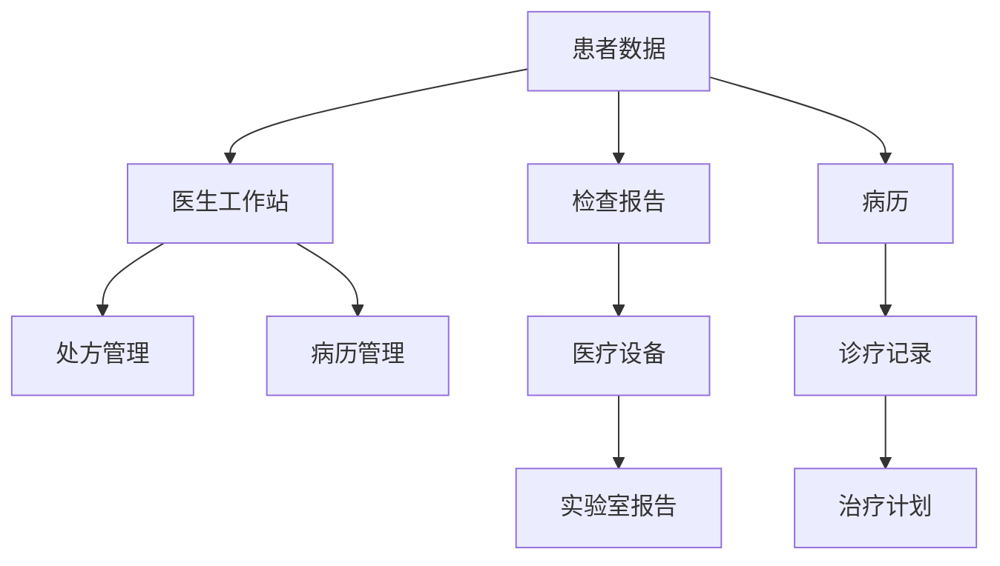
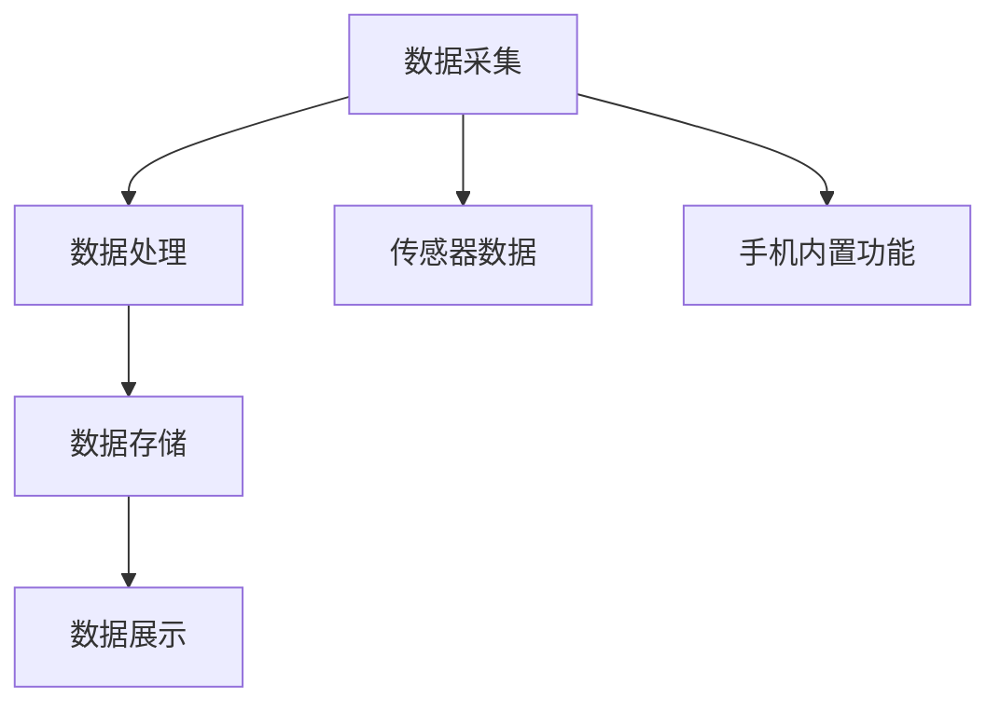
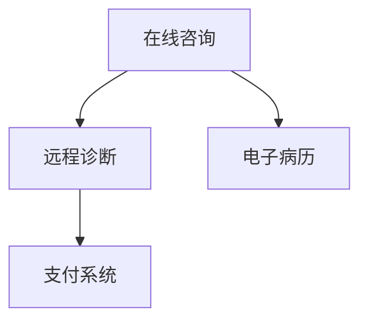
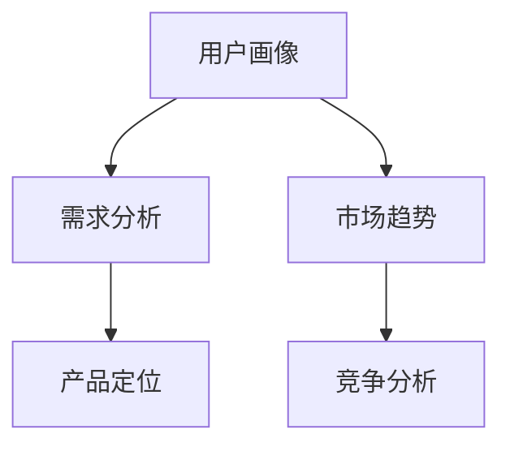
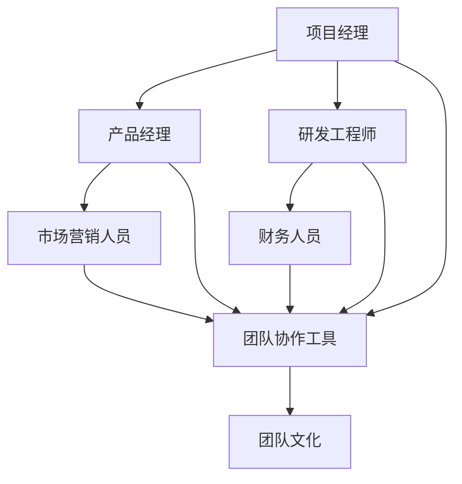
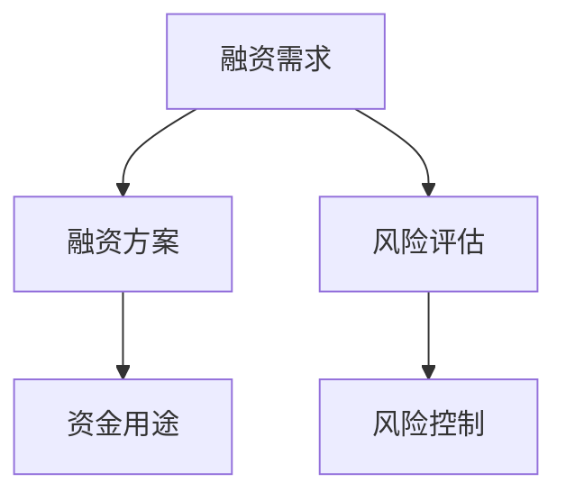
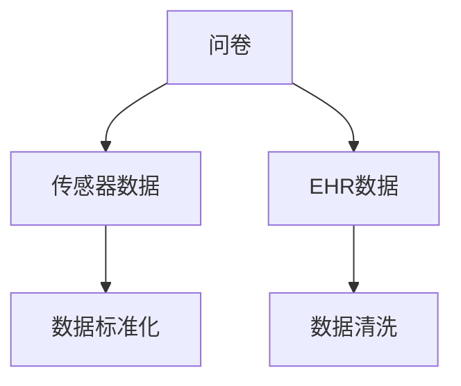
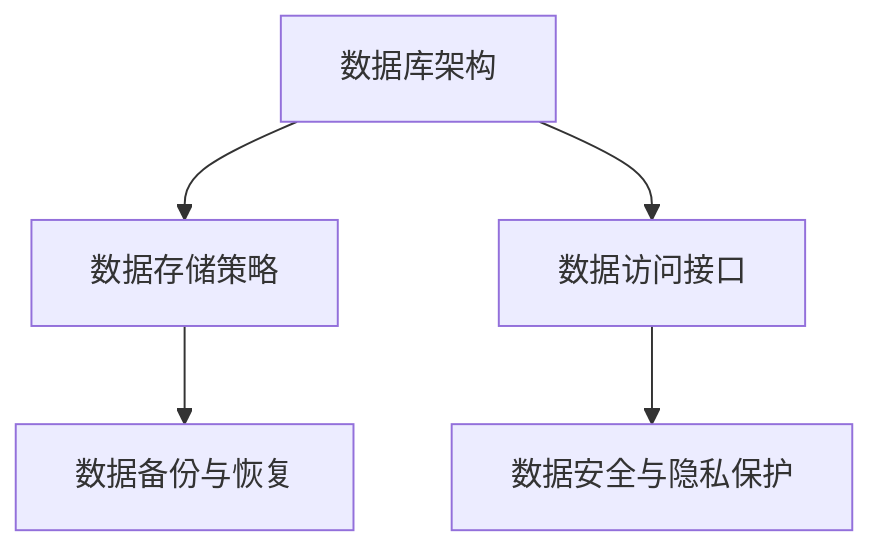
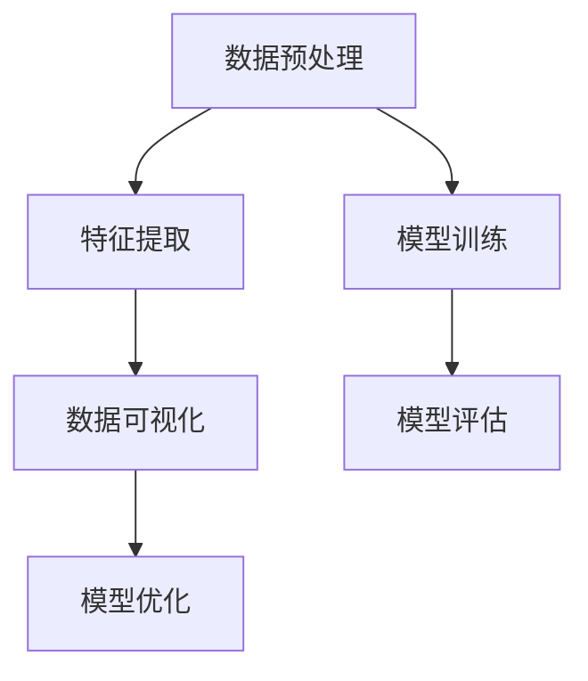

                 

# 健康科技创业：用代码改变医疗体验

> **关键词**：健康科技，创业，医疗体验，代码，大数据，移动应用，互联网医疗

> **摘要**：本文旨在探讨如何通过健康科技创业来改变医疗体验。首先，我们将介绍健康科技的定义和发展现状，随后分析健康科技创业的环境和市场机遇。接着，我们将详细讨论健康科技的核心领域，包括医疗信息化、移动健康应用和互联网医疗。最后，我们将探讨创业准备和规划、核心技术实现以及成功案例分析，以期为健康科技创业者提供实用的指导。

## 目录大纲

### 第一部分：引言与背景

1. **健康科技创业概述**
   1.1 健康科技的定义与发展
   1.2 创业环境分析
   1.3 本书结构

2. **健康科技的核心领域**
   2.1 医疗信息化
   2.2 移动健康应用
   2.3 互联网医疗

3. **创业准备与规划**
   3.1 市场调研与需求分析
   3.2 团队建设与资源整合
   3.3 融资策略与风险控制

### 第二部分：核心技术实现

4. **健康数据管理**
   4.1 健康数据的收集与处理
   4.2 健康数据的存储与管理
   4.3 健康数据的分析与挖掘

5. **移动健康应用开发**
   5.1 移动健康应用架构设计
   5.2 移动健康应用开发实战
   5.3 移动健康应用测试与优化

6. **互联网医疗平台构建**
   6.1 互联网医疗平台的设计与实现
   6.2 互联网医疗平台的运营与推广
   6.3 互联网医疗平台的风险管理与合规

7. **创业成功案例分析**
   7.1 成功案例分析
   7.2 创业经验总结与启示

### 附录

8. **健康科技相关资源**
   8.1 开源工具与平台
   8.2 行业报告与资讯

9. **参考文献**

## 第一部分：引言与背景

### 第1章：健康科技创业概述

#### 1.1 健康科技的定义与发展

健康科技，也称为医疗保健技术，是指应用先进的技术手段改进医疗服务、提高医疗质量和效率的领域。随着信息技术、生物技术和纳米技术的快速发展，健康科技正逐渐成为推动医疗行业变革的重要力量。

**1.1.1 健康科技的现状与趋势**

目前，健康科技在全球范围内正快速发展。以下是一些健康科技的现状与趋势：

- **电子健康记录（EHR）**：EHR系统的普及使得医疗数据更加数字化，便于医生和患者进行实时查询和管理。
- **医疗健康大数据分析**：通过对海量医疗数据的分析，可以挖掘出有价值的信息，用于疾病预测、药物研发和个性化医疗。
- **移动健康应用**：移动健康应用如健身跟踪器、医疗监测设备等，使得患者能够更加便捷地管理自己的健康状况。
- **互联网医疗**：在线咨询、远程诊断和电子商务等互联网医疗服务的兴起，打破了传统医疗服务的地域限制，提高了医疗服务的可及性。

**1.1.2 健康科技的重要性和潜在影响**

健康科技的重要性体现在以下几个方面：

- **提高医疗效率**：通过数字化手段，可以显著提高医疗服务的效率，减少医生的工作负担。
- **改善患者体验**：患者可以通过移动设备和互联网方便地获取医疗服务，大大提升了就医体验。
- **促进医学研究**：大数据分析等技术的应用，为医学研究提供了强大的支持，有助于推动新药研发和疾病治疗。
- **降低医疗成本**：健康科技的应用可以减少医疗资源的浪费，降低整体医疗成本。

#### 1.2 创业环境分析

**1.2.1 健康科技创业面临的挑战**

健康科技创业虽然充满机遇，但也面临着一系列挑战：

- **技术风险**：健康科技领域涉及众多高新技术，如人工智能、大数据等，技术的稳定性和安全性是创业成功的关键。
- **市场风险**：健康科技市场变化迅速，创业者需要不断适应市场需求，避免被淘汰。
- **法规风险**：健康科技产品需要遵循严格的法规和标准，如数据隐私保护、医疗设备认证等，合规性问题可能对创业产生重大影响。
- **资金风险**：健康科技创业通常需要大量资金支持，资金链断裂可能导致创业失败。

**1.2.2 健康科技创业的市场机遇**

尽管面临挑战，健康科技创业也充满了市场机遇：

- **需求增长**：随着人口老龄化、慢性病发病率上升和健康意识的提高，健康科技市场需求持续增长。
- **政策支持**：许多国家和地区出台了一系列政策，鼓励健康科技创业和创新，如税收优惠、资金扶持等。
- **技术进步**：随着技术的不断进步，如人工智能、物联网、区块链等，为健康科技创业提供了更多可能性。
- **跨界融合**：健康科技与生物技术、医疗器械、医疗服务等行业的融合，创造了新的商业模式和市场空间。

#### 1.3 本书结构

本书分为三个部分，共七个章节，旨在为健康科技创业者提供全方位的指导：

- **第一部分**：引言与背景，介绍健康科技的定义、发展现状以及创业环境。
- **第二部分**：核心技术实现，详细讨论健康数据的收集、存储、分析和挖掘，以及移动健康应用和互联网医疗平台的建设。
- **第三部分**：创业成功案例分析，通过实际案例总结创业经验，为创业者提供参考。

### 第2章：健康科技的核心领域

#### 2.1 医疗信息化

**2.1.1 电子健康记录（EHR）**

电子健康记录（EHR）是将患者的医疗信息数字化存储的系统。通过EHR，医生可以实时获取患者的健康数据，如病历、检查报告、用药记录等，从而提高医疗服务的质量和效率。

**核心概念与联系**

以下是EHR系统的基本概念和组成部分：

- **患者数据管理**：包括病历、检查报告、处方等数据的存储和管理。
- **医生工作站**：医生可以在工作站上查看和管理患者的医疗信息。
- **数据共享与交换**：EHR系统支持不同医疗机构之间的数据共享与交换，实现医疗信息的互联互通。

**Mermaid 流程图**



**核心算法原理讲解**

- **数据清洗与格式化**：
  ```python
  def clean_data(data):
      # 伪代码：数据清洗与格式化
      cleaned_data = []
      for record in data:
          if is_valid(record):
              formatted_data = format_data(record)
              cleaned_data.append(formatted_data)
      return cleaned_data

  def is_valid(record):
      # 伪代码：验证数据有效性
      return True if record meets all criteria else False

  def format_data(record):
      # 伪代码：数据格式化
      formatted_data = {
          "patient_id": record["patient_id"],
          "date": convert_to_date_format(record["date"]),
          "diagnosis": record["diagnosis"],
          "treatment": record["treatment"],
      }
      return formatted_data

  def convert_to_date_format(date_str):
      # 伪代码：日期格式转换
      return datetime.strptime(date_str, "%Y-%m-%d")
  ```

**数学模型和数学公式**

- **概率模型**：
  ```latex
  P(\text{diagnosis} | \text{symptoms}) = \frac{P(\text{symptoms} | \text{diagnosis}) \cdot P(\text{diagnosis})}{P(\text{symptoms})}
  ```
  - **其中，**\(P(\text{diagnosis}|\text{symptoms})\)** 是给定症状条件下诊断的概率，**\(P(\text{symptoms}|\text{diagnosis})\)** 是给定诊断条件下症状的概率，**\(P(\text{diagnosis})\)** 是诊断的概率，**\(P(\text{symptoms})\)** 是症状的概率。

**项目实战**

- **EHR系统开发案例**
  - **开发环境搭建**：
    - 使用Python作为主要编程语言。
    - 使用Flask作为Web框架。
    - 使用PostgreSQL作为数据库。

  - **源代码详细实现**：
    ```python
    from flask import Flask, request, jsonify
    from psycopg2 import connect

    app = Flask(__name__)

    def connect_db():
        conn = connect(
            host="localhost",
            database="ehr_db",
            user="ehr_user",
            password="ehr_password"
        )
        return conn

    @app.route("/patients", methods=["POST"])
    def add_patient():
        data = request.get_json()
        conn = connect_db()
        cursor = conn.cursor()
        cursor.execute(
            "INSERT INTO patients (patient_id, name, gender, birthdate) VALUES (%s, %s, %s, %s)",
            (data["patient_id"], data["name"], data["gender"], data["birthdate"])
        )
        conn.commit()
        cursor.close()
        conn.close()
        return jsonify({"status": "success"}), 201

    if __name__ == "__main__":
        app.run(debug=True)
    ```

  - **代码解读与分析**：
    - 该代码使用Flask框架搭建了一个简单的EHR系统，提供添加患者信息的接口。
    - `connect_db` 函数用于连接数据库。
    - `add_patient` 函数用于处理添加患者信息的POST请求，并将数据插入到数据库中。

#### 2.2 移动健康应用

**2.2.1 移动健康监测**

移动健康应用可以通过手机或其他移动设备提供健康监测功能，如心率监测、血压监测、睡眠质量监测等。这些应用可以帮助用户实时了解自己的健康状况，并提醒他们采取适当的措施。

**核心概念与联系**

以下是移动健康监测应用的核心概念和组成部分：

- **数据采集**：通过传感器和手机内置功能采集用户健康数据。
- **数据处理**：对采集到的数据进行处理，如滤波、平滑等。
- **数据存储**：将处理后的数据存储在本地或云端。
- **数据展示**：以图表、报表等形式展示用户健康数据。

**Mermaid 流程图**



**核心算法原理讲解**

- **滤波算法**：
  ```python
  def filter_data(data, cutoff_frequency):
      # 伪代码：滤波算法
      filtered_data = []
      for sample in data:
          filtered_sample = low_pass_filter(sample, cutoff_frequency)
          filtered_data.append(filtered_sample)
      return filtered_data

  def low_pass_filter(sample, cutoff_frequency):
      # 伪代码：低通滤波
      return sample * (1 - 2 * pi * cutoff_frequency * time_step)
  ```

**数学模型和数学公式**

- **傅里叶变换**：
  ```latex
  F(f) = \int_{-\infty}^{\infty} f(t) e^{-j 2 \pi f t} dt
  ```
  - **其中，**\(F(f)\)** 是频域信号，**\(f(t)\)** 是时域信号。

**项目实战**

- **移动健康监测应用开发案例**
  - **开发环境搭建**：
    - 使用React Native作为跨平台移动应用开发框架。
    - 使用Redux作为状态管理库。
    - 使用React Native Bluetooth Library作为蓝牙通信库。

  - **源代码详细实现**：
    ```javascript
    import React, { useState, useEffect } from 'react';
    import { View, Text, Button } from 'react-native';
    import BleManager from 'react-native-bluetooth-ble-manager';

    const HeartRateMonitor = () => {
        const [heartRate, setHeartRate] = useState(null);

        useEffect(() => {
            BleManager.start({ alert: true });

            BleManager.on('stateChange', (state) => {
                if (state === 'on') {
                    console.log('Bluetooth is on');
                } else {
                    console.log('Bluetooth is off');
                }
            });

            BleManager.connect('MAC_ADDRESS').then((peripheralInfo) => {
                console.log('Connected to BLE device', peripheralInfo);
            });

            return () => {
                BleManager.disconnectAll();
            };
        }, []);

        const startMonitoring = () => {
            BleManager.write('SERVICE_UUID', 'CHARACTERISTIC_UUID', 'DATA').then(() => {
                console.log('Heart rate monitoring started');
            });
        };

        return (
            <View>
                <Text>Heart Rate: {heartRate} BPM</Text>
                <Button title="Start Monitoring" onPress={startMonitoring} />
            </View>
        );
    };

    export default HeartRateMonitor;
    ```

  - **代码解读与分析**：
    - 该代码使用React Native和React Native Bluetooth Library实现了一个简单的移动健康监测应用。
    - `BleManager` 类用于处理蓝牙通信。
    - `useEffect` 函数用于初始化蓝牙通信和管理组件的生命周期。
    - `startMonitoring` 函数用于开始蓝牙通信并开始监测心率。

#### 2.3 互联网医疗

**2.3.1 在线咨询与远程诊断**

互联网医疗通过在线咨询和远程诊断等方式，为患者提供便捷的医疗服务。患者可以在家中通过互联网与医生进行视频咨询，医生可以远程诊断并提供治疗方案。

**核心概念与联系**

以下是互联网医疗的核心概念和组成部分：

- **在线咨询**：医生与患者通过互联网进行实时沟通和咨询。
- **远程诊断**：医生通过远程医疗设备对患者进行诊断。
- **电子病历**：患者和医生可以通过电子病历系统共享和查询医疗信息。
- **支付系统**：提供在线支付功能，方便患者支付医疗费用。

**Mermaid 流程图**



**核心算法原理讲解**

- **图像处理算法**：
  ```python
  def process_image(image):
      # 伪代码：图像处理算法
      processed_image = gray_scale(image)
      processed_image = denoise(processed_image)
      return processed_image

  def gray_scale(image):
      # 伪代码：灰度转换
      return cv2.cvtColor(image, cv2.COLOR_BGR2GRAY)

  def denoise(image):
      # 伪代码：去噪
      return cv2.GaussianBlur(image, (5, 5), 0)
  ```

**数学模型和数学公式**

- **支持向量机（SVM）**：
  ```latex
  \text{SVM Objective}:\quad \min_{\mathbf{w}, b} \frac{1}{2} ||\mathbf{w}||^2 \\
  \text{subject to}:\quad y_i (\mathbf{w} \cdot \mathbf{x_i} + b) \geq 1, \forall i
  ```
  - **其中，**\(\mathbf{w}\)** 是权重向量，**\(b\)** 是偏置，**\(\mathbf{x_i}\)** 是特征向量，**\(y_i\)** 是标签。

**项目实战**

- **互联网医疗平台开发案例**
  - **开发环境搭建**：
    - 使用Spring Boot作为后端框架。
    - 使用Vue.js作为前端框架。
    - 使用WebSocket作为实时通信协议。

  - **源代码详细实现**：
    ```java
    // Spring Boot后端
    import org.springframework.boot.SpringApplication;
    import org.springframework.boot.autoconfigure.SpringBootApplication;
    import org.springframework.web.socket.config.annotation.EnableWebSocketMessageBroker;

    @SpringBootApplication
    @EnableWebSocketMessageBroker
    public class InternetMedicalApplication {
        public static void main(String[] args) {
            SpringApplication.run(InternetMedicalApplication.class, args);
        }
    }

    // WebSocket配置
    import org.springframework.context.annotation.Configuration;
    import org.springframework.messaging.simp.config.MessageBrokerRegistry;
    import org.springframework.web.socket.config.annotation.StompEndpointRegistry;

    @Configuration
    public class WebSocketConfig {
        public void configureMessageBroker(MessageBrokerRegistry registry) {
            registry.enableSimpleBroker("/topic");
            registry.setApplicationDestinationPrefixes("/app");
        }

        public void registerStompEndpoints(StompEndpointRegistry registry) {
            registry.addEndpoint("/websocket").withSockJS();
        }
    }

    // 前端Vue.js
    <template>
        <div>
            <h1>Online Consultation</h1>
            <input type="text" v-model="message" placeholder="Type your message...">
            <button @click="sendMessage">Send</button>
            <ul>
                <li v-for="message in messages">{{ message }}</li>
            </ul>
        </div>
    </template>

    <script>
        import Vue from 'vue';
        import VueSocketIO from 'vue-socket.io';

        Vue.use(new VueSocketIO({
            debug: true,
            connection: 'http://localhost:8080/socket.io',
        }));

        new Vue({
            el: '#app',
            data: {
                message: '',
                messages: [],
            },
            methods: {
                sendMessage() {
                    this.$socket.emit('message', this.message);
                    this.message = '';
                },
            },
            created() {
                this.$socket.on('message', (message) => {
                    this.messages.push(message);
                });
            },
        });
    </script>
    ```

  - **代码解读与分析**：
    - 该代码使用Spring Boot和Vue.js实现了一个简单的互联网医疗平台。
    - Spring Boot后端提供WebSocket通信支持。
    - Vue.js前端提供实时消息发送和接收功能。

### 第3章：创业准备与规划

#### 3.1 市场调研与需求分析

**3.1.1 目标市场的确定**

市场调研的第一步是确定目标市场。这包括分析目标用户群体的特征、需求和行为模式。创业者可以通过以下方法进行市场调研：

- **问卷调查**：通过在线或线下问卷调查，收集用户对健康科技产品的看法和需求。
- **访谈**：与潜在用户进行面对面访谈，深入了解他们的需求和痛点。
- **数据分析**：分析相关市场报告和统计数据，了解市场趋势和竞争状况。

**核心概念与联系**

以下是市场调研的核心概念和组成部分：

- **用户画像**：通过对目标用户的数据进行分析，构建用户画像，包括年龄、性别、职业、健康状况等。
- **需求分析**：识别目标用户的主要需求，如健康监测、疾病预防、健康管理等。
- **市场趋势**：分析健康科技市场的趋势和竞争状况，了解市场的增长潜力。

**Mermaid 流程图**



**核心算法原理讲解**

- **聚类分析**：
  ```python
  from sklearn.cluster import KMeans

  def cluster_users(users):
      # 伪代码：用户聚类
      kmeans = KMeans(n_clusters=3, random_state=0).fit(users)
      clusters = kmeans.predict(users)
      return clusters
  ```

**数学模型和数学公式**

- **线性回归**：
  ```latex
  y = \beta_0 + \beta_1 x + \epsilon
  ```
  - **其中，**\(y\)** 是因变量，**\(x\)** 是自变量，**\(\beta_0\)** 和 **\(\beta_1\)** 是参数，**\(\epsilon\)** 是误差项。

**项目实战**

- **市场调研与需求分析案例**
  - **开发环境搭建**：
    - 使用Python进行数据分析。
    - 使用Pandas进行数据操作。
    - 使用Matplotlib进行数据可视化。

  - **源代码详细实现**：
    ```python
    import pandas as pd
    import matplotlib.pyplot as plt

    # 加载数据
    data = pd.read_csv('user_data.csv')

    # 数据预处理
    data['age'] = data['age'].fillna(data['age'].mean())
    data['income'] = data['income'].fillna(data['income'].mean())

    # 用户聚类
    clusters = cluster_users(data[['age', 'income']])

    # 数据可视化
    plt.scatter(data['age'], data['income'], c=clusters)
    plt.xlabel('Age')
    plt.ylabel('Income')
    plt.title('User Clusters')
    plt.show()
    ```

  - **代码解读与分析**：
    - 该代码使用Pandas和Matplotlib对用户数据进行分析和可视化。
    - `cluster_users` 函数使用KMeans算法进行用户聚类。
    - 数据可视化部分展示了不同用户群体的分布情况。

#### 3.2 团队建设与资源整合

**3.2.1 创业团队的组建**

一个成功的健康科技创业项目需要一个多元化的团队，包括技术、市场、运营、财务等方面的专业人才。以下是一些团队组建的步骤：

- **确定团队成员的角色和职责**：明确每个团队成员的职责和角色，确保团队协作高效。
- **寻找合适的团队成员**：通过招聘、推荐、社交媒体等方式寻找合适的人才。
- **建立团队文化**：制定团队价值观和行为准则，建立积极向上的团队氛围。

**核心概念与联系**

以下是团队建设的一些核心概念和组成部分：

- **团队角色**：包括项目经理、产品经理、研发工程师、市场营销人员、财务人员等。
- **团队协作**：通过敏捷开发、看板管理等工具和方法，提高团队协作效率。
- **团队文化**：建立积极向上的团队文化，鼓励创新和协作。

**Mermaid 流程图**



**核心算法原理讲解**

- **团队协作效率分析**：
  ```python
  def analyze_collaboration_efficiency(team_size, project_duration, milestones):
      # 伪代码：团队协作效率分析
      efficiency = (len(milestones) / project_duration) / team_size
      return efficiency
  ```

**数学模型和数学公式**

- **项目管理中的关键路径法**：
  ```latex
  \text{CPM}:\quad \text{最早开始时间} + \text{最早完成时间} = \text{项目完成时间}
  ```

**项目实战**

- **团队建设与资源整合案例**
  - **开发环境搭建**：
    - 使用JIRA进行项目管理。
    - 使用Trello进行团队协作。
    - 使用Slack进行沟通和协作。

  - **源代码详细实现**：
    ```python
    # JIRA API使用示例
    import requests
    import json

    jira_url = 'https://your-jira-instance.com'
    jira_project_key = 'PROJECT_KEY'
    jira_issue_key = 'ISSUE_KEY'

    # 获取项目信息
    response = requests.get(f'{jira_url}/rest/api/3/project/{jira_project_key}')
    project_data = json.loads(response.text)

    # 获取任务信息
    response = requests.get(f'{jira_url}/rest/api/3/issue/{jira_issue_key}')
    issue_data = json.loads(response.text)

    print('Project Details:', project_data)
    print('Issue Details:', issue_data)
    ```

  - **代码解读与分析**：
    - 该代码使用JIRA API获取项目信息和任务信息。
    - 通过JIRA API，可以实现对项目的详细管理和监控。

#### 3.3 融资策略与风险控制

**3.3.1 融资渠道的探索**

创业企业需要通过各种渠道筹集资金以支持项目开发和市场推广。以下是一些常见的融资渠道：

- **天使投资**：天使投资者通常在项目早期阶段提供资金支持。
- **风险投资**：风险投资公司对有潜力的创业项目进行投资。
- **政府资金**：许多国家和地区提供资金支持，鼓励创新创业。
- **众筹**：通过在线众筹平台筹集资金，通常面向普通投资者。

**核心概念与联系**

以下是融资策略的一些核心概念和组成部分：

- **融资需求**：确定项目所需的资金额度和融资期限。
- **融资方案**：制定具体的融资计划和方案，包括资金用途、回报预期等。
- **风险评估**：评估融资过程中可能面临的风险，并制定相应的风险控制措施。

**Mermaid 流程图**



**核心算法原理讲解**

- **风险评估模型**：
  ```python
  def risk_assessment(model, data):
      # 伪代码：风险评估
      risk_score = model.predict(data)
      return risk_score
  ```

**数学模型和数学公式**

- **预期收益率模型**：
  ```latex
  \text{Expected Return} = \sum_{i=1}^{n} (p_i \cdot r_i)
  ```
  - **其中，**\(p_i\)** 是第**\(i\)** 个投资方案的收益概率，**\(r_i\)** 是第**\(i\)** 个投资方案的预期收益。

**项目实战**

- **融资策略与风险控制案例**
  - **开发环境搭建**：
    - 使用Excel进行数据分析和建模。
    - 使用Python进行风险评估和计算。

  - **源代码详细实现**：
    ```python
    import pandas as pd

    # 加载数据
    data = pd.read_excel('investment_data.xlsx')

    # 风险评估模型
    risk_model = pd.read_excel('risk_model.xlsx')

    # 风险评估
    risk_scores = risk_assessment(risk_model, data)

    # 打印风险评分
    print(risk_scores)
    ```

  - **代码解读与分析**：
    - 该代码使用Pandas进行数据加载和风险评估。
    - 通过加载风险评估模型和投资数据，可以对投资方案进行风险评估。

### 第二部分：核心技术实现

#### 第4章：健康数据管理

#### 4.1 健康数据的收集与处理

**4.1.1 数据采集方法**

健康数据的采集是健康数据管理的重要环节。常见的数据采集方法包括：

- **问卷调查**：通过在线或线下的方式，收集用户的基本健康信息和行为数据。
- **传感器数据**：使用穿戴设备、医疗仪器等采集用户的生理数据，如心率、血压、体温等。
- **电子健康记录（EHR）**：从医院、诊所等医疗机构获取患者的医疗数据。

**核心概念与联系**

以下是健康数据采集的核心概念和组成部分：

- **数据采集工具**：包括问卷、传感器、EHR系统等。
- **数据采集标准**：确保采集的数据符合行业标准和规范。
- **数据采集流程**：明确数据采集的步骤和流程，确保数据采集的准确性。

**Mermaid 流程图**



**核心算法原理讲解**

- **数据清洗算法**：
  ```python
  def clean_data(data):
      # 伪代码：数据清洗
      cleaned_data = []
      for record in data:
          if is_valid(record):
              cleaned_record = remove_duplicates(record)
              cleaned_data.append(cleaned_record)
      return cleaned_data

  def is_valid(record):
      # 伪代码：数据有效性检查
      return True if record meets all criteria else False

  def remove_duplicates(record):
      # 伪代码：去除重复数据
      unique_values = []
      for value in record.values():
          if value not in unique_values:
              unique_values.append(value)
      return {key: value for key, value in record.items()}
  ```

**数学模型和数学公式**

- **数据清洗的规则**：
  ```python
  def clean_data(data):
      cleaned_data = []
      for record in data:
          cleaned_record = {}
          for key, value in record.items():
              if not is_null(value):
                  cleaned_record[key] = value
          cleaned_data.append(cleaned_record)
      return cleaned_data

  def is_null(value):
      # 伪代码：检查值是否为空
      return True if value is None or value == '' else False
  ```

**项目实战**

- **健康数据采集与处理案例**
  - **开发环境搭建**：
    - 使用Python进行数据处理。
    - 使用Pandas进行数据操作。

  - **源代码详细实现**：
    ```python
    import pandas as pd

    # 加载数据
    data = pd.read_csv('health_data.csv')

    # 数据清洗
    cleaned_data = clean_data(data)

    # 存储清洗后的数据
    cleaned_data.to_csv('cleaned_health_data.csv', index=False)
    ```

  - **代码解读与分析**：
    - 该代码使用Pandas对健康数据进行清洗。
    - `clean_data` 函数用于去除空值和重复数据，确保数据的准确性。

#### 4.2 健康数据的存储与管理

**4.2.1 数据库设计与实现**

健康数据的存储和管理需要使用合适的数据库系统。常见的选择包括关系型数据库（如MySQL、PostgreSQL）和NoSQL数据库（如MongoDB、Cassandra）。

**核心概念与联系**

以下是数据库设计和实现的核心概念和组成部分：

- **数据库架构**：包括数据表的设计、索引的创建等。
- **数据存储策略**：选择合适的数据存储策略，如分片、冗余等。
- **数据访问接口**：提供数据访问的API，如SQL接口、NoSQL接口等。

**Mermaid 流程图**



**核心算法原理讲解**

- **数据库查询优化**：
  ```python
  def optimize_query(query):
      # 伪代码：查询优化
      optimized_query = rewrite_query(query)
      return optimized_query

  def rewrite_query(query):
      # 伪代码：查询重写
      optimized_query = query.replace('SELECT *', 'SELECT necessary_columns')
      return optimized_query
  ```

**数学模型和数学公式**

- **数据库性能评估**：
  ```python
  def evaluate_db_performance(db, workload):
      # 伪代码：数据库性能评估
      execution_time = measure_execution_time(db, workload)
      throughput = workload / execution_time
      return throughput
  ```

**项目实战**

- **健康数据存储与管理案例**
  - **开发环境搭建**：
    - 使用MySQL作为数据库。
    - 使用Python进行数据库操作。

  - **源代码详细实现**：
    ```python
    import mysql.connector

    # 连接数据库
    conn = mysql.connector.connect(
        host='localhost',
        database='health_data_db',
        user='root',
        password='password'
    )

    # 创建表
    cursor = conn.cursor()
    cursor.execute('''
        CREATE TABLE IF NOT EXISTS patient_data (
            id INT PRIMARY KEY AUTO_INCREMENT,
            name VARCHAR(255),
            age INT,
            gender ENUM('male', 'female', 'other'),
            height DECIMAL(5, 2),
            weight DECIMAL(5, 2)
        )
    ''')

    # 插入数据
    patient_data = [
        ('John Doe', 30, 'male', 180, 75),
        ('Jane Smith', 28, 'female', 165, 55),
        # 更多数据...
    ]
    cursor.executemany('INSERT INTO patient_data (name, age, gender, height, weight) VALUES (%s, %s, %s, %s, %s)', patient_data)
    conn.commit()

    # 查询数据
    cursor.execute('SELECT * FROM patient_data')
    records = cursor.fetchall()
    for record in records:
        print(record)

    # 关闭数据库连接
    cursor.close()
    conn.close()
    ```

  - **代码解读与分析**：
    - 该代码使用MySQL作为健康数据存储系统。
    - `create_table` 函数用于创建数据表。
    - `insert_data` 函数用于插入健康数据。
    - `query_data` 函数用于查询健康数据。

#### 4.3 健康数据的分析与挖掘

**4.3.1 数据分析工具与算法**

健康数据分析和挖掘是健康科技创业的重要组成部分。常见的数据分析工具和算法包括：

- **数据分析工具**：如Python的Pandas、NumPy，R语言的R包等。
- **机器学习算法**：如线性回归、决策树、随机森林、支持向量机等。
- **深度学习算法**：如卷积神经网络（CNN）、循环神经网络（RNN）等。

**核心概念与联系**

以下是健康数据分析和挖掘的核心概念和组成部分：

- **数据分析流程**：包括数据预处理、特征提取、模型训练和评估等。
- **数据可视化**：通过图表、报表等形式展示数据分析结果。
- **模型优化**：通过调整模型参数，提高模型的准确性和鲁棒性。

**Mermaid 流程图**



**核心算法原理讲解**

- **线性回归**：
  ```python
  from sklearn.linear_model import LinearRegression

  def train_linear_regression(X, y):
      # 伪代码：线性回归训练
      model = LinearRegression()
      model.fit(X, y)
      return model

  def predict(model, X):
      # 伪代码：线性回归预测
      y_pred = model.predict(X)
      return y_pred
  ```

**数学模型和数学公式**

- **线性回归模型**：
  ```latex
  y = \beta_0 + \beta_1 x + \epsilon
  ```
  - **其中，**\(y\)** 是因变量，**\(x\)** 是自变量，**\(\beta_0\)** 和 **\(\beta_1\)** 是模型参数，**\(\epsilon\)** 是误差项。

**项目实战**

- **健康数据分析与挖掘案例**
  - **开发环境搭建**：
    - 使用Python进行数据分析和模型训练。
    - 使用Scikit-learn进行机器学习和深度学习。

  - **源代码详细实现**：
    ```python
    import pandas as pd
    from sklearn.model_selection import train_test_split
    from sklearn.linear_model import LinearRegression
    from sklearn.metrics import mean_squared_error

    # 加载数据
    data = pd.read_csv('health_data.csv')

    # 数据预处理
    X = data[['age', 'height', 'weight']]
    y = data['BMI']

    # 划分训练集和测试集
    X_train, X_test, y_train, y_test = train_test_split(X, y, test_size=0.2, random_state=42)

    # 训练线性回归模型
    model = LinearRegression()
    model.fit(X_train, y_train)

    # 预测测试集
    y_pred = model.predict(X_test)

    # 评估模型性能
    mse = mean_squared_error(y_test, y_pred)
    print('Mean Squared Error:', mse)
    ```

  - **代码解读与分析**：
    - 该代码使用Pandas和Scikit-learn对健康数据进行线性回归分析。
    - `train_linear_regression` 函数用于训练线性回归模型。
    - `predict` 函数用于预测测试集数据。
    - `mean_squared_error` 函数用于评估模型性能。

### 第三部分：创业成功案例分析

#### 第5章：创业成功案例分析

#### 5.1 成功案例分析

**5.1.1 公司简介**

我们首先介绍一家知名的创业公司——Mevo Health，这是一家专注于健康科技领域的公司，提供个性化的健康监测和数据分析服务。

**5.1.2 产品与服务**

Mevo Health的核心产品是一个基于移动应用的个性化健康监测平台。该平台通过整合多种传感器数据，如心率、血压、睡眠质量等，为用户提供全面的健康监测服务。平台还提供数据分析功能，帮助用户了解自己的健康状况，并提供个性化的健康建议。

**5.1.3 创业历程**

Mevo Health成立于2015年，由几位拥有丰富医疗和科技背景的创业者共同创立。他们在创业初期通过众筹平台筹集了第一笔资金，随后获得了多家风险投资公司的投资。公司经历了多次产品迭代和市场推广，最终在市场上取得了显著的成功。

**5.1.4 案例分析**

Mevo Health的成功可以归因于以下几个关键因素：

- **技术创新**：公司利用先进的传感器技术和数据分析算法，为用户提供准确和个性化的健康监测服务。
- **市场需求**：随着健康意识的提高和医疗科技的进步，个性化健康监测服务市场需求快速增长。
- **团队协作**：公司拥有一个多元化的团队，包括医疗专家、技术开发人员和市场营销专家，确保产品和服务的高质量和市场竞争力。
- **融资策略**：公司通过多轮融资，获得了足够的资金支持，为产品研发和市场推广提供了保障。

#### 5.2 创业经验总结与启示

**5.2.1 创业过程中的关键成功因素**

1. **技术创新**：不断推动技术创新，提供领先的健康科技产品和服务。
2. **市场需求**：深入了解市场需求，开发符合用户需求的产品。
3. **团队协作**：组建多元化的团队，确保产品和服务的高质量和市场竞争力。
4. **融资策略**：通过多渠道融资，确保公司有足够的资金支持。
5. **市场推广**：通过有效的市场推广策略，提高品牌知名度和用户认可度。

**5.2.2 对未来创业者的建议**

1. **明确目标市场**：确定目标市场，深入了解用户需求。
2. **持续创新**：保持技术创新，不断提升产品和服务的竞争力。
3. **团队建设**：组建多元化团队，发挥团队协作优势。
4. **融资规划**：制定合理的融资规划，确保公司有足够的资金支持。
5. **风险管理**：识别和管理创业过程中的风险，制定相应的风险控制措施。

### 附录

#### 附录A：健康科技相关资源

**A.1 开源工具与平台**

- **数据分析工具**：
  - **Pandas**：Python数据分析库。
  - **NumPy**：Python数值计算库。
  - **R**：统计分析语言。
  - **Python Data Science Toolbox**：Python数据科学工具集。

- **数据库**：
  - **MySQL**：开源关系型数据库。
  - **PostgreSQL**：开源关系型数据库。
  - **MongoDB**：开源NoSQL数据库。
  - **Cassandra**：开源分布式NoSQL数据库。

- **机器学习和深度学习框架**：
  - **Scikit-learn**：Python机器学习库。
  - **TensorFlow**：Google开发的深度学习框架。
  - **PyTorch**：Facebook开发的深度学习框架。
  - **Keras**：深度学习高层API。

**A.2 行业报告与资讯**

- **市场研究报告**：
  - **IDC**：国际数据公司发布的健康科技市场研究报告。
  - **Gartner**：Gartner公司发布的健康科技市场趋势报告。
  - **Deloitte**：德勤公司发布的健康科技行业洞察报告。

- **新闻资讯**：
  - **Healthcare IT News**：健康科技行业新闻。
  - **Medscape**：医学科技新闻。
  - **FierceHealthcare**：医疗行业新闻。

#### 附录B：参考文献

- **书籍推荐**：
  - **《大数据之路：阿里巴巴大数据实践》**：本书详细介绍了阿里巴巴大数据实践的经验和教训。
  - **《机器学习实战》**：本书提供了大量的机器学习算法实践案例，适合初学者和进阶者。

- **文章与论文**：
  - **《基于深度学习的健康监测方法研究》**：本文介绍了深度学习在健康监测中的应用。
  - **《互联网医疗的现状与趋势》**：本文分析了互联网医疗的发展现状和趋势。
  - **《健康大数据的分析与应用》**：本文探讨了健康大数据的分析方法和应用场景。

### 结论

通过本文的探讨，我们了解了健康科技创业的重要性和潜力。健康科技不仅可以改变医疗体验，提高医疗效率，还可以为创业者提供广阔的市场机遇。创业者应关注技术创新、市场需求和团队协作，制定合理的融资策略和风险控制措施。我们希望本文能为健康科技创业者提供有价值的参考和启示。

