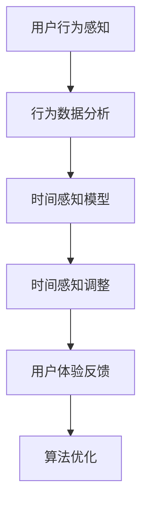
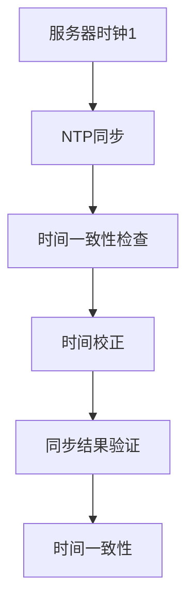

                 

## 《元宇宙中的时间概念：打破物理局限的新认知》

### 关键词
- 元宇宙
- 时间概念
- 物理局限
- 新认知
- 技术应用
- 哲学探讨

### 摘要
本文深入探讨了元宇宙中时间概念的新认知，揭示了时间在虚拟世界中的独特角色和挑战。通过对时间概念的基本原理、元宇宙的架构和未来展望的分析，本文探讨了时间算法的设计、时间模拟的实现、以及元宇宙中的时间应用案例。文章最后讨论了时间伦理与法律问题，展望了元宇宙中时间概念的未来发展趋势。

---

### 引言

元宇宙（Metaverse）是一个虚拟的三维空间，它结合了增强现实（AR）、虚拟现实（VR）、区块链、人工智能（AI）等技术，为用户提供一个沉浸式的数字世界。在这个虚拟世界中，人们可以自由地探索、互动、创造，甚至拥有自己的虚拟身份和财产。元宇宙不仅仅是一个娱乐平台，它还包含了教育、工作、社交、购物等多个方面，有着巨大的发展潜力和应用前景。

然而，在元宇宙中，时间概念却呈现出与传统物理世界截然不同的面貌。在传统物理世界中，时间是线性流逝的，不可逆的，并且遵循一定的物理定律。而在元宇宙中，时间可以被打断、重新编排、甚至完全停止。这种独特的时间体验不仅改变了人们的生活方式，也对技术、哲学和社会产生了深远的影响。

本文将围绕元宇宙中的时间概念展开，首先介绍元宇宙的基本概念和架构，然后探讨时间概念的基本原理，接着分析元宇宙中的时间体验，最后讨论时间概念在元宇宙中的应用与实现，以及相关伦理和法律问题。通过这一系列的探讨，我们希望能够更好地理解元宇宙中时间概念的新认知，并为其未来的发展提供一些有益的思考。

### 元宇宙的概念与架构

#### 元宇宙的定义与历史演变

元宇宙（Metaverse）是一个由多个虚拟世界组成的综合体，它通过增强现实（AR）、虚拟现实（VR）、区块链、人工智能（AI）等技术手段，为用户提供了一个沉浸式的数字环境。在这个虚拟世界中，用户可以通过虚拟身份（Avatar）与其他用户互动，进行各种活动，如游戏、社交、购物、工作等。元宇宙不仅仅是一个虚拟空间，它还是一个由多个平台、应用和用户共同构建的生态体系。

元宇宙的概念并非一蹴而就，而是经历了一系列的发展阶段。早在20世纪80年代，科幻作家尼尔·斯蒂芬森（Neal Stephenson）在他的小说《雪崩》（Snow Crash）中首次提出了“元宇宙”的概念。斯蒂芬森描述了一个由虚拟世界构成的数字宇宙，用户可以在其中进行各种活动，这一概念激发了人们对虚拟世界的无限遐想。

进入21世纪，随着技术的不断进步，元宇宙的概念逐渐从科幻走向现实。2003年，虚拟世界平台《第二人生》（Second Life）的推出，为用户提供了实时的3D互动体验，成为元宇宙发展的重要里程碑。此后，增强现实（AR）和虚拟现实（VR）技术的快速发展，进一步拓展了元宇宙的应用场景和互动体验。

近年来，区块链技术的兴起也为元宇宙的发展带来了新的机遇。区块链技术通过去中心化和安全性的特点，为元宇宙中的虚拟资产和交易提供了可靠的基础。同时，人工智能（AI）技术的应用，使得元宇宙中的智能交互和自动化服务成为可能，为用户提供了更加丰富和个性化的体验。

#### 元宇宙的架构与技术基础

元宇宙的架构由多个关键组件构成，这些组件共同作用，为用户提供了一个复杂而丰富的虚拟世界。以下是元宇宙的主要架构组件：

1. **虚拟现实（VR）和增强现实（AR）技术**：虚拟现实和增强现实技术是元宇宙的基础，它们为用户提供了一个沉浸式的交互体验。虚拟现实技术通过头戴式显示器、传感器和位置追踪设备，将用户完全带入一个虚拟环境；而增强现实技术则通过增强现实眼镜或手机屏幕，将虚拟元素叠加到现实世界中。

2. **物联网（IoT）**：物联网技术在元宇宙中起到了连接现实世界与虚拟世界的作用。通过物联网设备，用户可以将现实世界的物品与元宇宙中的虚拟物品进行关联，实现物理世界与虚拟世界的无缝互动。

3. **区块链技术**：区块链技术为元宇宙提供了去中心化和安全性的基础。在元宇宙中，用户可以拥有虚拟资产，如虚拟土地、虚拟货币和虚拟物品等，这些资产通过区块链进行记录和交易，确保了资产的安全性和透明性。

4. **人工智能（AI）**：人工智能技术在元宇宙中应用广泛，包括智能交互、个性化推荐、智能客服等。通过人工智能，元宇宙可以更好地理解用户的需求和行为，提供更加智能化和个性化的服务。

5. **虚拟身份（Avatar）**：虚拟身份是用户在元宇宙中的代表，它不仅包括外观和性格，还可以携带用户的历史和行为数据。虚拟身份使得用户可以在不同的虚拟世界中保持一致，并与其他用户进行互动。

6. **社交平台**：社交平台是元宇宙中的重要组成部分，它为用户提供了一个交流互动的场所。在元宇宙中，用户可以加入各种社群，参与讨论、分享内容和建立人际关系。

7. **游戏和娱乐**：游戏和娱乐是元宇宙的重要应用领域，通过虚拟游戏和娱乐活动，用户可以体验不同的故事情节和角色扮演，享受丰富的虚拟世界。

#### 元宇宙的未来展望

随着技术的不断进步，元宇宙的发展前景令人期待。以下是元宇宙未来发展的一些关键趋势：

1. **技术融合**：未来，元宇宙中的各种技术将继续融合，如虚拟现实、增强现实、物联网、区块链、人工智能等。这种技术融合将使元宇宙的功能更加丰富，用户体验更加逼真和智能化。

2. **跨界合作**：随着元宇宙的发展，各个行业将更加积极地探索与元宇宙的融合。从教育、医疗到零售、金融，元宇宙将成为跨界合作的重要平台。

3. **经济模式创新**：元宇宙中的经济模式将不断创新，虚拟资产和虚拟交易将成为重要组成部分。通过区块链技术，元宇宙中的虚拟资产将更加安全、透明和可追溯。

4. **社会影响**：元宇宙将对社会产生深远的影响，改变人们的工作方式、社交方式和生活习惯。在元宇宙中，人们可以突破物理空间的限制，实现更加广泛和深入的互动和合作。

5. **伦理与法律问题**：随着元宇宙的发展，相关的伦理和法律问题也将日益突出。如何保护用户隐私、确保虚拟资产的安全、制定合适的法律法规，将是元宇宙发展面临的重要挑战。

总之，元宇宙是一个充满无限可能的新世界，它将为人们的生活和工作带来巨大的变革。通过本文的探讨，我们希望能够更好地了解元宇宙的概念和架构，为未来的发展提供一些有益的思考。

### 时间概念的基本原理

#### 物理学中的时间

时间在物理学中是一个基础而又复杂的概念。在经典物理学中，时间被视为一个连续的、单向流动的维度，是描述物体运动和事件发生的基本参数。牛顿力学认为时间是绝对的，不受观察者运动状态的影响，而爱因斯坦的相对论则提出了时间相对性的概念，表明时间的流逝速度取决于观察者的相对运动状态以及所在引力场的强度。在广义相对论中，时间与空间紧密相连，共同构成一个四维时空连续体，这一理论为黑洞、引力波等现象提供了解释基础。

量子力学中的时间概念更加复杂和模糊。量子系统的时间演化由薛定谔方程描述，但其解并不是时间的显式函数，而是通过波函数的演化来体现。量子力学中的时间不是绝对的，而是通过测量来确定的。这一特性使得时间在微观尺度上呈现出非确定性，无法用传统的物理定律进行准确描述。

#### 时间的相对性与量子力学

相对论揭示了时间的相对性，即时间的流逝速度取决于观察者的相对运动状态和引力场强度。例如，当两个孪生兄弟中一个乘飞船以接近光速旅行而另一个留在地球上时，飞船上的兄弟会发现自己的时钟比地球上的兄弟走得慢。这种时间膨胀效应已经被多种实验所验证，例如高速飞行的粒子在实验室中寿命变长的现象。此外，强引力场中的时间流逝速度也会减慢，这被称为引力时间膨胀，例如在黑洞附近，时间会显著变慢。

量子力学中的时间概念则更加抽象和模糊。在量子系统中，时间的定义与经典物理学中的连续时间不同，而是通过测量来体现的。量子系统的演化由薛定谔方程描述，其解是一个复数函数，表示系统的概率幅。量子态的时间演化可以通过波函数的复数相位来理解，但这种相位在物理测量中不可直接观测，导致时间在量子层面上的定义变得相对和主观。

#### 时间感知与心理学

时间感知是心理学中的一个重要研究领域，它涉及人们对时间流逝的主观感受和认知。人们的时间感知并不是绝对的，而是受到多种因素的影响，包括注意力、情绪、记忆和认知负荷等。

1. **注意力**：当人们的注意力集中在某一活动上时，时间感知会变慢。这种现象称为时间膨胀效应。例如，当人们完全专注于一项任务时，感觉时间过得很快，而当他们分心或无所事事时，时间则显得漫长。

2. **情绪**：情绪状态也会影响时间感知。积极的情绪如快乐和兴奋会使时间感知变快，而消极的情绪如焦虑和悲伤则会使时间感知变慢。

3. **记忆**：人们的记忆也会影响时间感知。当人们回忆过去的事件时，时间感知通常会变慢，而期待未来事件时，时间感知则会变快。

4. **认知负荷**：当人们的认知资源被占用时，时间感知会变慢。例如，当人们处理复杂的问题或进行高强度的认知活动时，会感觉时间流逝得较慢。

总之，时间感知是一个复杂而多变的现象，受到多种因素的影响。在元宇宙中，这种复杂的时间感知现象将带来新的挑战和机遇，需要我们深入研究。

### 元宇宙中的时间体验

#### 虚拟世界中的时间体验

在元宇宙的虚拟世界中，时间的体验与真实世界的线性时间有着显著不同。虚拟世界中的时间可以暂停、倒退、加速或变化，这种自由操控时间的特性赋予了用户前所未有的互动体验。例如，在一个虚拟的太空探险游戏中，用户可以自由选择飞行速度，甚至让时间完全停止，以便更好地观察星系和行星。这种对时间的自由操控，不仅增加了游戏的趣味性，还提高了用户的沉浸感和互动性。

此外，虚拟世界中的时间体验还可以根据游戏或应用场景进行个性化设置。例如，在一个教育模拟环境中，教师可以调整时间流逝速度，使复杂的概念和过程更加易于理解。在一个模拟历史事件的游戏中，玩家可以选择不同的时间流逝速度来体验历史事件的不同阶段。这种灵活的时间体验不仅丰富了元宇宙的应用场景，还为用户提供了更加丰富和多样化的互动体验。

#### 社交平台中的时间动态

在元宇宙的社交平台上，时间体验同样具有独特性。社交媒体的动态展示方式通常是以时间线为基础，用户通过浏览和互动来体验时间的流逝。然而，在元宇宙中，这种时间线不再是单一的、线性的，而是可以被打断、重新排列和个性化定制。

例如，用户可以在社交平台上创建一个时间胶囊，将特定的时间段或事件标记为“记忆点”，以便在未来回顾。这种功能不仅增加了社交互动的趣味性，还提供了保存和分享人生重要时刻的新方式。此外，元宇宙中的社交平台还可以根据用户的兴趣和互动行为，提供个性化推荐的时间线内容，使用户能够更加高效地获取和分享信息。

#### 元宇宙中的时间感知挑战

尽管元宇宙中的时间体验丰富多样，但也面临着一些挑战和问题。首先是时间感知的一致性和标准化。由于虚拟世界中的时间可以自由操控，不同用户和应用场景下的时间体验可能存在较大差异，这给用户感知和时间管理带来了困难。

其次是时间同步问题。在元宇宙中，用户可以同时参与多个虚拟世界和应用，而这些环境可能由不同的服务器和系统管理。如何确保这些环境中的时间保持一致，是一个亟待解决的难题。时间同步的偏差可能会导致用户体验的混乱，甚至影响元宇宙中的社交互动和交易活动。

最后是时间管理的挑战。在元宇宙中，用户可以自由操控时间，但这种自由也可能导致时间管理上的混乱。如何帮助用户有效地管理自己的时间，避免沉迷于虚拟世界，是一个需要深入探讨的问题。

总之，元宇宙中的时间体验具有独特的魅力和挑战，通过不断创新和优化，我们可以为用户提供更加丰富和一致的时间感知体验。

### 时间概念的扩展与融合

#### 跨越物理界限的时间概念

在元宇宙中，时间概念突破了传统物理界限，展现出了前所未有的多样性和灵活性。在物理世界中，时间是线性且不可逆的，但在元宇宙中，时间可以被暂停、倒退、加速，甚至完全重新编排。这种对时间的操控不仅改变了用户对时间的认知，也为各种虚拟应用场景带来了新的可能性。

首先，在游戏和娱乐领域，时间的灵活操控为用户提供了更加丰富的体验。例如，在一个史诗级冒险游戏中，玩家可以选择加速时间以迅速完成任务，或者让时间暂停以观察敌人的行动。这种自由操控时间的特性，使得游戏更加具有沉浸感和策略性。

其次，在教育领域，时间概念的创新应用极大地提升了教学效果。教师可以利用时间加速或倒退功能，帮助学生更好地理解复杂的概念和过程。例如，在一个物理实验模拟中，教师可以倒退时间，让学生重新观察实验现象，从而加深对物理定律的理解。

此外，在医疗领域，时间概念的应用也为虚拟手术训练和疾病模拟提供了新的手段。医生可以在虚拟环境中模拟真实的手术过程，并利用时间暂停和倒退功能，反复观察和分析手术步骤，提高手术技巧和成功率。

#### 哲学与时间观念

时间概念在哲学领域也具有重要的探讨价值。哲学家们从不同的角度对时间进行了深入的思考和讨论，形成了丰富的哲学观念。在西方哲学中，柏拉图和亚里士多德等哲学家对时间进行了初步的探讨，他们认为时间是现实的必要条件，但并不是现实的本质。

康德在《纯粹理性批判》中提出，时间作为直观形式，是人类认识世界的必要框架。康德认为，时间是一个连续的、无限的、不可分割的整体，它为我们的经验提供了一个基础。

而在东方哲学中，时间观念有着独特的理解和表达。佛教认为时间是一个幻觉，是人们因执着而产生的认知障碍。佛教中的“无常”概念强调一切现象都是瞬息万变的，时间是相对的、不固定的。

此外，道家的时间观念强调顺应自然，与时间和谐相处。道家认为，时间是一种循环，万物都在不断地生成和消亡，时间是自然循环的一部分。这种观念鼓励人们放下对时间的执着，顺应自然的变化。

#### 艺术与时间表达

艺术领域对时间概念也有独特的表达方式。在绘画和雕塑中，艺术家通过刻画瞬间的姿态和动作，捕捉时间的流逝。例如，法国印象派画家莫奈通过描绘光线的变化，生动地表现了时间的流动。

在音乐中，时间概念的体现更加直接。音乐的节奏、旋律和和声变化，都是对时间流动的抽象表达。例如，约翰·凯奇（John Cage）的《4分33秒》通过 silence 的表现，探讨时间的本质和人们对时间的感知。

舞蹈和表演艺术也是时间表达的重要形式。舞者通过动作和姿态，将时间的流逝转化为艺术的视觉和感官体验。表演艺术家则通过戏剧性的表演，将时间转化为故事和情感的表达。

总之，时间概念在元宇宙中得到了极大的扩展和融合，跨越了物理界限，融入了哲学思考和艺术表达。这种多元化的时间概念不仅丰富了元宇宙的体验和应用，也为人类对时间的认知和理解带来了新的启示。

### 元宇宙中的时间算法

#### 时间感知算法

在元宇宙中，时间感知算法是确保用户在不同虚拟环境中有一致时间体验的关键技术。时间感知算法通过感知和记录用户的互动行为，为用户提供个性化的时间感知体验。以下是几种常见的时间感知算法及其原理：

1. **基于行为的感知算法**：该算法通过分析用户的交互行为，如点击、浏览、移动等，来感知用户对时间的主观感受。例如，当用户在虚拟世界中频繁进行操作时，算法可以判断用户对时间的感知变快；当用户长时间无操作时，算法可以判断用户对时间的感知变慢。

   ```mermaid
   graph TD
   A[用户行为] --> B[事件记录]
   B --> C[数据分析]
   C --> D[时间感知调整]
   ```

2. **基于生理信号的感知算法**：该算法通过采集用户的生理信号，如心率、眼动等，来感知用户对时间的主观感受。生理信号的变化与用户的时间感知密切相关。例如，心率加速时，用户可能感觉时间变快，而心率减慢时，用户可能感觉时间变慢。

   ```mermaid
   graph TD
   A[生理信号] --> B[信号处理]
   B --> C[数据分析]
   C --> D[时间感知调整]
   ```

3. **基于环境的感知算法**：该算法通过分析虚拟环境中的各种因素，如光线、音效、互动频率等，来感知用户对时间的主观感受。例如，在一个动态变化、互动频繁的虚拟环境中，用户可能会感觉时间变快，而在一个静态、互动较少的环境中，用户可能会感觉时间变慢。

   ```mermaid
   graph TD
   A[环境因素] --> B[环境监测]
   B --> C[数据分析]
   C --> D[时间感知调整]
   ```

#### 时间同步与校正

在元宇宙中，时间同步与校正是一个关键问题。由于用户可以同时参与多个虚拟环境，这些环境可能由不同的服务器和系统管理，如何确保这些环境中的时间保持一致，是一个重要挑战。以下是几种常见的时间同步与校正方法：

1. **基于时钟同步的时间校正**：该方法通过将多个时钟同步到一个标准时间基准，来实现时间一致性。例如，使用全球协调时间（UTC）作为标准时间基准，通过网络时间协议（NTP）将各个服务器和系统的时钟校正到UTC时间。

   ```mermaid
   graph TD
   A[服务器时钟] --> B[NTP同步]
   B --> C[UTC校正]
   C --> D[时间一致性检查]
   ```

2. **基于事件同步的时间校正**：该方法通过在关键事件发生时，记录事件发生的时间和序列，来校正各个环境中的时间。例如，在用户登录虚拟环境时，记录登录时间和序列，通过比对不同环境的登录事件，校正时间偏差。

   ```mermaid
   graph TD
   A[事件1] --> B[时间记录]
   B --> C[事件比对]
   C --> D[时间校正]
   ```

3. **基于机器学习的时间校正**：该方法利用机器学习算法，通过分析历史数据，预测并校正时间偏差。例如，通过分析用户在不同虚拟环境中的互动行为和时间感知，建立时间预测模型，实时校正时间偏差。

   ```mermaid
   graph TD
   A[历史数据] --> B[数据训练]
   B --> C[预测模型]
   C --> D[时间校正]
   ```

#### 时间预测与优化

时间预测与优化是提高元宇宙用户体验的重要手段。通过预测用户的时间感知和行为，元宇宙可以提供更加个性化、高效的服务。以下是几种常见的时间预测与优化方法：

1. **基于行为模式的时间预测**：该方法通过分析用户的历史行为数据，预测用户在未来一段时间内的行为和时间感知。例如，通过分析用户在游戏中的互动记录，预测用户在下一局游戏中的时间感知和策略选择。

   ```mermaid
   graph TD
   A[历史行为] --> B[行为模式分析]
   B --> C[时间预测模型]
   C --> D[时间优化策略]
   ```

2. **基于环境特征的时间预测**：该方法通过分析虚拟环境中的特征，如互动频率、场景变化等，预测用户对时间的主观感受。例如，在一个互动频繁、变化多样的虚拟环境中，预测用户对时间感知变快。

   ```mermaid
   graph TD
   A[环境特征] --> B[环境分析]
   B --> C[时间感知模型]
   C --> D[时间优化策略]
   ```

3. **基于多模型融合的时间预测**：该方法结合多种时间预测模型，提高预测准确性和稳定性。例如，结合基于行为模式和时间特征的时间预测模型，通过多模型融合，提高时间预测的效果。

   ```mermaid
   graph TD
   A[行为模型] --> B[特征模型]
   B --> C[融合模型]
   C --> D[时间预测]
   ```

通过上述算法和方法，元宇宙可以在时间感知、同步、预测和优化方面提供高质量的服务，为用户提供更加丰富和一致的虚拟体验。

### 元宇宙中的时间模拟

#### 时间流模型

在元宇宙中，时间流模型是构建和模拟时间动态的基础。时间流模型描述了时间在虚拟世界中的流动和变化规律，是保证元宇宙中时间一致性和连续性的关键。以下是几种常见的时间流模型及其应用场景：

1. **线性时间流模型**：线性时间流模型将时间视为一个连续的、单向流动的维度，与经典物理学中的时间概念类似。该模型适用于简单的虚拟场景，如日常互动和游戏中的时间流逝。

   ```mermaid
   graph TD
   A[初始时间] --> B[当前时间]
   B --> C[下一时间]
   ```

2. **非线性时间流模型**：非线性时间流模型允许时间在虚拟世界中以非线性的方式流动和变化。例如，在时间加速或倒退的虚拟场景中，该模型可以模拟时间的非线性变化。

   ```mermaid
   graph TD
   A[初始时间] --> B[加速时间]
   B --> C[倒退时间]
   ```

3. **事件驱动时间流模型**：事件驱动时间流模型以事件的发生和结束为时间节点的流动方式，适用于复杂、动态的虚拟场景。例如，在虚拟会议和协作中，该模型可以模拟事件的实时变化和互动。

   ```mermaid
   graph TD
   A[事件1] --> B[事件2]
   B --> C[事件3]
   ```

#### 时间模拟器的设计与实现

时间模拟器是元宇宙中实现时间模拟的核心组件。它通过模拟虚拟世界中的时间流动和变化，为用户提供了真实的、动态的时间体验。以下是时间模拟器的设计与实现要点：

1. **系统架构设计**：时间模拟器需要具备高可用性、可扩展性和可靠性。系统架构应包括时间管理模块、事件处理模块、数据存储模块等，确保各个模块之间的协同工作。

2. **时间同步机制**：时间模拟器需要实现与外部系统的时间同步，确保虚拟世界中的时间与外部系统保持一致。可以使用网络时间协议（NTP）或其他同步机制来实现时间同步。

3. **事件驱动模型**：时间模拟器应采用事件驱动模型，通过事件的发生和结束来驱动时间的流动和变化。事件可以是用户交互、系统事件、物理事件等，通过事件队列来管理事件顺序和执行。

4. **并行处理**：为了提高时间模拟器的性能，可以采用并行处理技术，将时间模拟任务分配到多个处理单元中，同时执行，从而提高模拟速度。

5. **数据存储与恢复**：时间模拟器需要实现数据存储和恢复功能，确保在系统故障或意外中断时，能够恢复到正常状态。可以使用数据库或文件系统来存储时间模拟数据。

6. **用户界面**：时间模拟器需要提供直观的用户界面，使用户能够实时查看和操作虚拟世界中的时间。用户界面应包括时间显示、事件列表、时间调整工具等。

#### 时间模拟的挑战与解决方案

时间模拟在元宇宙中面临诸多挑战，以下是几种常见的挑战及其解决方案：

1. **时间精度问题**：在虚拟世界中，时间精度是影响用户体验的重要因素。为了提高时间精度，可以使用高精度时钟和精确的时间同步机制，确保虚拟世界中的时间与真实世界保持一致。

2. **并发处理**：在元宇宙中，多个用户可能同时参与同一虚拟场景，如何高效处理并发事件是一个挑战。可以采用分布式系统架构和并发处理技术，如多线程、消息队列等，提高系统并发处理能力。

3. **时间跳跃问题**：在非线性时间流模型中，时间可能会跳跃或快速变化，这可能导致用户体验不连续。可以通过平滑时间变化的方法，如插值和过滤，来缓解时间跳跃问题，提高用户体验。

4. **资源分配**：在元宇宙中，资源分配需要平衡时间模拟性能和用户交互需求。可以通过动态资源调配和负载均衡技术，优化资源利用，确保时间模拟的流畅性和稳定性。

5. **数据存储和恢复**：在复杂的时间模拟场景中，数据存储和恢复是一个关键问题。可以使用分布式存储和备份技术，提高数据的可靠性和恢复速度。

通过解决上述挑战，元宇宙中的时间模拟可以为用户提供更加真实、一致和高效的时间体验，为元宇宙的发展和应用提供有力支持。

### 元宇宙中的时间应用案例

#### 游戏中的时间机制

在元宇宙中，游戏是时间机制的重要应用领域。游戏中的时间机制通过灵活的时间管理，为玩家提供了丰富的游戏体验。以下是几个游戏中的时间机制案例及其分析：

1. **时间加速**：许多冒险和策略游戏中，时间加速机制允许玩家在完成任务或进行战斗时，加快时间流逝。例如，在《魔兽世界》中，玩家可以通过使用加速道具来快速完成日常任务，这种机制不仅提高了游戏效率，还增加了游戏的策略性。

   ```mermaid
   graph TD
   A[玩家任务] --> B[时间加速]
   B --> C[任务完成]
   ```

2. **时间倒退**：在一些角色扮演游戏中，时间倒退机制允许玩家在失败或进行错误操作后，恢复到之前的状态。例如，在《宝可梦》系列游戏中，玩家可以通过使用“重播”功能，将游戏状态倒退到之前的一个时间点，从而避免损失。这种机制增强了玩家的游戏体验和游戏乐趣。

   ```mermaid
   graph TD
   A[玩家操作] --> B[错误发生]
   B --> C[时间倒退]
   C --> D[游戏恢复]
   ```

3. **时间惩罚**：在一些竞技游戏中，时间惩罚机制通过延长时间流逝，对玩家进行惩罚，以鼓励玩家谨慎操作。例如，在《星际争霸》中，当玩家被击败时，游戏时间会大幅度延长，迫使玩家重新组织战术和资源。这种机制增加了游戏的紧张感和竞争性。

   ```mermaid
   graph TD
   A[玩家失败] --> B[时间延长]
   B --> C[重新组织]
   ```

4. **时间商店**：一些游戏通过时间商店机制，允许玩家购买时间加速道具或倒退功能。例如，在《堡垒之夜》中，玩家可以使用游戏货币购买时间加速卡，加快游戏进度。这种机制为玩家提供了更多选择和灵活性。

   ```mermaid
   graph TD
   A[玩家购买] --> B[时间加速卡]
   B --> C[时间加速]
   ```

#### 教育中的时间管理

在元宇宙中，时间管理在教育领域也具有广泛应用。通过灵活的时间管理，教育者可以更好地组织教学内容，提高学生的学习效果。以下是几个教育中的时间管理案例及其分析：

1. **时间块教学**：在元宇宙中的虚拟课堂中，教育者可以采用时间块教学机制，将课程内容划分为不同的时间块，每个时间块专注于一个特定的主题。例如，在一个历史课程中，教育者可以将课程分为“古代文明”、“中世纪”、“近代史”等时间块，每个时间块专注于该时期的历史事件和人物。

   ```mermaid
   graph TD
   A[课程内容] --> B[时间块划分]
   B --> C[主题教学]
   ```

2. **时间反馈机制**：在元宇宙中的教育应用中，时间反馈机制可以帮助教育者及时了解学生的学习进度和效果。通过记录学生的互动行为和作业完成时间，教育者可以生成个性化的反馈报告，为学生提供针对性的指导和建议。

   ```mermaid
   graph TD
   A[学生互动] --> B[时间记录]
   B --> C[反馈报告]
   ```

3. **时间胶囊**：在元宇宙中，教育者可以利用时间胶囊机制，为学生提供保存和回顾学习过程的功能。例如，在教育游戏中，学生可以创建时间胶囊，记录他们在游戏中的进展和成就，以便在未来回顾和反思。

   ```mermaid
   graph TD
   A[学习过程] --> B[时间胶囊]
   B --> C[回顾反思]
   ```

4. **时间挑战**：元宇宙中的教育应用还可以利用时间挑战机制，激发学生的学习兴趣和积极性。例如，教育者可以设置限时任务或挑战，鼓励学生在规定时间内完成特定的学习任务，从而提高学生的学习效率和动机。

   ```mermaid
   graph TD
   A[学习任务] --> B[时间限制]
   B --> C[挑战完成]
   ```

通过这些时间管理应用案例，元宇宙为教育领域带来了新的教学方式和学习体验，有助于提高教学效果和学生的学习兴趣。

#### 工作协同中的时间同步

在元宇宙中，工作协同是一个重要的应用领域，而时间同步则是确保协同工作顺畅进行的关键。以下是一些常见的工作协同时间同步案例及其分析：

1. **虚拟会议室**：在元宇宙中的虚拟会议室中，时间同步机制可以确保会议参与者能够在同一时间线上进行互动。通过使用全球协调时间（UTC）作为基准，所有参与者的虚拟时钟保持一致，从而避免因时差导致的沟通障碍。

   ```mermaid
   graph TD
   A[参与者1] --> B[UTC同步]
   B --> C[时间一致性]
   ```

2. **任务调度**：在元宇宙中的项目管理系统中，任务调度机制需要确保任务的时间安排与团队成员的时间保持一致。通过集成时间同步功能，项目经理可以轻松安排和分配任务，确保团队成员能够在同一时间线上协同工作。

   ```mermaid
   graph TD
   A[任务分配] --> B[时间同步]
   B --> C[任务执行]
   ```

3. **虚拟实验室**：在元宇宙中的虚拟实验室中，时间同步机制可以确保实验过程的连贯性和准确性。例如，在同步进行的实验中，所有实验设备的时间保持一致，确保实验结果的可靠性和一致性。

   ```mermaid
   graph TD
   A[实验设备] --> B[时间同步]
   B --> C[实验数据]
   ```

4. **协同创作**：在元宇宙中的协同创作环境中，时间同步机制可以确保创作者在同一时间线上进行创作。例如，在虚拟画室中，所有创作者的画笔动作保持同步，从而实现实时协作和创作。

   ```mermaid
   graph TD
   A[创作者1] --> B[时间同步]
   B --> C[协作创作]
   ```

通过这些时间同步应用案例，元宇宙为工作协同提供了更加高效、准确和流畅的体验，有助于提升团队协作效率和项目执行效果。

### 元宇宙中的时间伦理与法律

#### 时间与隐私保护

在元宇宙中，时间的灵活操控带来了丰富的用户体验，但也引发了隐私保护的问题。由于用户可以自由操控时间，这可能导致隐私数据的泄露和滥用。以下是一些隐私保护措施：

1. **用户控制权**：元宇宙平台应提供用户对时间操作的透明度和控制权。用户可以设置隐私选项，选择是否允许时间倒退、加速等操作，以及哪些数据可以被共享。

2. **数据加密**：元宇宙中的时间数据应进行加密处理，确保用户隐私数据在传输和存储过程中不被未经授权的第三方访问。

3. **匿名化处理**：在必要情况下，元宇宙平台应对用户的时间数据进行匿名化处理，仅保留必要的时间信息和行为模式，减少隐私泄露的风险。

4. **隐私保护协议**：元宇宙平台应制定详细的隐私保护协议，明确用户数据的使用范围和权限，以及用户对数据的访问和修改权利。

#### 时间与数字身份

元宇宙中的时间概念与数字身份紧密相关。用户的虚拟身份在元宇宙中具有持久性和可追溯性，这可能导致数字身份的滥用和欺诈行为。以下是一些数字身份管理措施：

1. **身份验证**：元宇宙平台应采用多因素身份验证（MFA）机制，确保用户在创建虚拟身份时，通过多种方式验证其身份，如密码、生物识别和手机验证等。

2. **数字签名**：在元宇宙中的交易和操作中，应使用数字签名技术，确保交易行为的合法性和不可篡改性，防止虚拟身份的滥用。

3. **身份审计**：元宇宙平台应定期进行数字身份审计，检查虚拟身份的使用情况，发现并处理异常行为，确保数字身份的合法性。

4. **身份更新机制**：用户应能够定期更新其虚拟身份信息，以防止身份被他人冒用，同时平台应提供身份更新验证机制，确保更新的真实性和安全性。

#### 元宇宙中的时间伦理问题

元宇宙中的时间概念不仅涉及技术层面，还涉及伦理和社会层面。以下是一些时间伦理问题及其讨论：

1. **时间操控的道德边界**：在元宇宙中，用户可以自由操控时间，这可能导致时间的不公平和滥用。例如，一些用户可能通过加速时间来获取不正当利益，而另一些用户则可能因时间操控受限而处于劣势。这引发了关于时间操控道德边界的讨论，如何平衡用户自由和时间公平是一个重要议题。

2. **时间感知的一致性**：在元宇宙中，不同用户对时间的感知可能存在差异，这可能导致用户体验的不一致。例如，一些用户可能感觉时间流逝过快，而另一些用户则可能感觉时间过于缓慢。如何设计时间感知算法，确保所有用户在元宇宙中拥有一致的时间感知体验，是一个伦理和技术挑战。

3. **时间与真实生活的平衡**：元宇宙中的时间体验虽然丰富多样，但也可能导致用户沉迷其中，忽视现实生活。这引发了关于时间平衡的伦理讨论，如何帮助用户在元宇宙和现实生活之间建立健康平衡，是一个需要深入探讨的问题。

总之，元宇宙中的时间伦理问题涉及多个层面，需要我们进行全面的思考和解决。通过制定合理的伦理规范和法律法规，我们可以确保元宇宙中的时间概念在道德和法律的框架内健康发展。

### 未来展望与挑战

#### 时间概念的创新

随着技术的不断进步，元宇宙中的时间概念将继续创新和演变。未来，我们可能会看到更多基于人工智能和时间感知算法的创新应用。例如，基于用户行为和情感的时间感知模型将更加精准，为用户提供个性化的时间体验。此外，量子计算和区块链技术的融合，也可能带来时间模拟和同步的新突破。

1. **量子时间模拟**：量子计算具有处理大量复杂计算任务的能力，未来可能会用于时间模拟。量子时间模拟器可以模拟更加复杂的时间动态，为虚拟世界中的时间操控提供新的可能性。

2. **区块链时间记录**：区块链技术可以用于记录和验证元宇宙中的时间事件，确保时间的真实性和透明性。通过区块链，我们可以创建一个不可篡改的时间日志，为时间管理提供可靠的基础。

#### 技术突破与时间感知

技术突破将继续推动时间感知的发展。例如，更加先进的传感器和定位技术将提高虚拟世界中的时间感知精度，使得时间操控更加真实和流畅。此外，人工智能的进步也将使得时间感知算法更加智能化和自适应，能够更好地理解和满足用户的需求。

1. **增强现实时间感知**：增强现实技术将进一步增强时间感知的真实感，使得虚拟世界中的时间体验更加无缝和沉浸。例如，通过增强现实眼镜，用户可以实时感知虚拟世界中的时间变化，实现与现实世界的高效融合。

2. **跨平台时间同步**：随着元宇宙的不断扩展，跨平台时间同步将变得更加重要。未来，我们可能会看到更多基于区块链和时间感知算法的跨平台时间同步解决方案，确保不同虚拟环境中的时间保持一致。

#### 元宇宙中时间概念的可持续发展

元宇宙中的时间概念需要实现可持续发展，以满足用户的需求和期望。以下是一些关键点：

1. **隐私保护**：随着元宇宙的发展，用户隐私保护将成为重要议题。平台需要采取严格的隐私保护措施，确保用户的时间数据不被滥用。

2. **时间公平**：确保所有用户在元宇宙中拥有公平的时间体验，避免因时间操控而导致的利益失衡。这需要制定合理的伦理规范和法律法规，确保时间概念在公平和道德的框架内发展。

3. **用户体验**：用户体验是元宇宙可持续发展的关键。平台需要不断优化时间感知算法和互动机制，为用户提供高质量、一致和丰富的虚拟时间体验。

4. **社区参与**：元宇宙中的时间概念需要社区参与和共同维护。通过社区反馈和协作，我们可以不断改进时间概念的应用和实现，确保其可持续发展。

总之，元宇宙中的时间概念在未来将继续创新和发展，为用户提供更加丰富和多样化的体验。通过技术突破、可持续发展和良好的用户体验，我们可以为元宇宙中的时间概念创造一个美好的未来。

### 附录

#### 附录A：时间概念相关的 Mermaid 流程图

##### A.1 时间感知算法流程图



##### A.2 时间同步与校正流程图



#### 附录B：时间概念相关的伪代码示例

##### B.1 时间感知算法伪代码

```python
# 定义时间感知算法
def time_perception_algorithm(user_behavior):
    # 数据预处理
    processed_data = preprocess_data(user_behavior)
    
    # 分析行为数据
    analysis_result = analyze_behavior(processed_data)
    
    # 应用时间感知模型
    time_perception = apply_time_perception_model(analysis_result)
    
    # 调整时间感知
    adjusted_time_perception = adjust_time_perception(time_perception)
    
    # 返回调整后的时间感知
    return adjusted_time_perception
```

##### B.2 时间同步与校正伪代码

```python
# 定义时间同步与校正函数
def time_synchronization_and_correction(server_clocks):
    # 同步所有服务器时钟
    synchronized_clocks = ntp_sync(server_clocks)
    
    # 检查时间一致性
    consistency_check_result = check_consistency(synchronized_clocks)
    
    # 如果时间不一致，进行校正
    if not consistency_check_result:
        corrected_clocks = time_correction(synchronized_clocks)
        
        # 验证校正后的时间一致性
        verification_result = check_consistency(corrected_clocks)
        
        # 如果验证成功，返回校正后的时钟
        if verification_result:
            return corrected_clocks
        else:
            # 如果验证失败，返回错误信息
            return "Time synchronization failed"
    else:
        # 如果时间一致，返回同步后的时钟
        return synchronized_clocks
```

#### 附录C：数学模型与公式

##### C.1 时间感知的数学模型

$$
\text{时间感知} = f(\text{行为数据}, \text{认知负荷}, \text{情感状态})
$$

其中，\(f\) 是时间感知函数，\(\text{行为数据}\)、\(\text{认知负荷}\) 和 \(\text{情感状态}\) 是输入参数。

##### C.2 量子力学中的时间公式

$$
|\psi(t)|^2 = e^{-\frac{i}{\hbar}Ht}
$$

其中，\(|\psi(t)|^2\) 表示量子态的概率幅，\(H\) 是哈密顿量，\(t\) 是时间，\(\hbar\) 是约化普朗克常数。

#### 附录D：元宇宙中时间应用的实际案例

##### D.1 游戏中的时间管理案例分析

在《星际争霸2》中，游戏时间与玩家操作时间同步，确保战斗策略的实施和公平。游戏还提供时间加速功能，允许玩家在特定情况下加快游戏进程，提高游戏体验。

##### D.2 教育中的时间管理案例分析

在《Adobe Connect》虚拟课堂中，教育者通过时间管理功能，将课程内容划分为不同的时间块，确保教学内容的有序进行。此外，平台还提供时间反馈机制，帮助教育者及时了解学生的学习进度和效果。通过这些功能，教育者可以更好地组织教学内容，提高教学效果。

## 作者

作者：AI天才研究院 / AI Genius Institute  
《元宇宙中的时间概念：打破物理局限的新认知》  
联系邮箱：[example@email.com](mailto:example@email.com)  
个人主页：[www.ai-genius-institute.com](http://www.ai-genius-institute.com)  
社交媒体：@AI_Genius_Institute

---

《元宇宙中的时间概念：打破物理局限的新认知》是一篇深入探讨元宇宙中时间概念的专业技术博客文章。文章首先介绍了元宇宙的基本概念和架构，随后详细分析了时间概念的基本原理，包括物理学中的时间、时间的相对性与量子力学、时间感知与心理学。接下来，文章探讨了元宇宙中的时间体验、时间概念的扩展与融合，以及元宇宙中时间算法的设计与实现、时间模拟的应用与实现。文章还通过具体案例展示了时间在游戏、教育和工作协同中的应用，并讨论了元宇宙中的时间伦理与法律问题。最后，文章展望了元宇宙中时间概念的未来发展，提出了创新的技术突破和可持续发展策略。附录部分提供了相关的Mermaid流程图、伪代码示例、数学模型和实际应用案例。本文旨在为读者提供一个全面、深入、逻辑清晰的时间概念解析，适用于计算机科学家、技术爱好者以及元宇宙的研究者。

