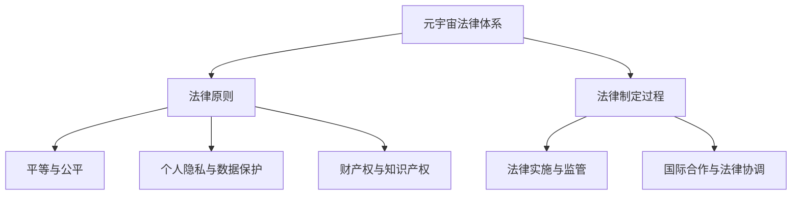

                 

### 《元宇宙法律体系：虚拟世界的规则制定》

> **关键词**：元宇宙，法律体系，虚拟世界，规则制定，数据保护，知识产权，国际合作

**摘要**：随着元宇宙的兴起，虚拟世界逐渐成为人类社会的一部分。在这个数字化的新天地里，法律体系的作用至关重要。本文旨在探讨元宇宙法律体系的构建，分析其核心原则、制定与实施过程，以及法律体系在商业和社会秩序中的应用。同时，本文还将展望元宇宙法律体系的发展趋势与未来，探讨技术进步对法律体系的影响和未来可能的法律形态。

### 目录大纲

# 《元宇宙法律体系：虚拟世界的规则制定》

## 第一部分：引言与基础

### 1.1 元宇宙的概述与定义

#### 1.1.1 元宇宙的起源与发展

#### 1.1.2 元宇宙的核心特征

#### 1.1.3 元宇宙的法律挑战

### 1.2 法律体系在元宇宙中的重要性

#### 1.2.1 元宇宙的法律需求

#### 1.2.2 元宇宙法律体系的构建

#### 1.2.3 法律体系对元宇宙发展的影响

## 第二部分：元宇宙法律体系的核心原则

### 2.1 平等与公平

#### 2.1.1 元宇宙中的平等概念

#### 2.1.2 公平原则的应用

#### 2.1.3 平等与公平的维护策略

### 2.2 个人隐私与数据保护

#### 2.2.1 元宇宙中的隐私问题

#### 2.2.2 数据保护法规概述

#### 2.2.3 数据保护的实现手段

### 2.3 财产权与知识产权

#### 2.3.1 元宇宙中的财产权

#### 2.3.2 知识产权保护的重要性

#### 2.3.3 知识产权保护的机制

## 第三部分：元宇宙法律体系的制定与实施

### 3.1 法律制定过程

#### 3.1.1 元宇宙法律制定的主体

#### 3.1.2 法律制定的程序

#### 3.1.3 法律制定的挑战与应对

### 3.2 法律实施与监管

#### 3.2.1 法律实施的手段

#### 3.2.2 监管机构的角色

#### 3.2.3 法律实施的挑战与解决方案

### 3.3 国际合作与法律协调

#### 3.3.1 国际合作的重要性

#### 3.3.2 法律协调的机制

#### 3.3.3 跨境法律问题的处理

## 第四部分：元宇宙法律体系的应用与实践

### 4.1 元宇宙中的商业活动

#### 4.1.1 商业活动的法律规范

#### 4.1.2 元宇宙中的合同法律问题

#### 4.1.3 商业纠纷的处理与解决

### 4.2 元宇宙中的社会秩序

#### 4.2.1 社会秩序的维护

#### 4.2.2 网络犯罪的治理

#### 4.2.3 社会秩序的法律保障

### 4.3 元宇宙的法律案例研究

#### 4.3.1 典型案例介绍

#### 4.3.2 案例分析

#### 4.3.3 案例启示与展望

## 第五部分：元宇宙法律体系的发展趋势与未来

### 5.1 技术进步对法律体系的影响

#### 5.1.1 区块链技术在法律中的应用

#### 5.1.2 人工智能技术在法律服务中的角色

#### 5.1.3 技术进步对法律体系的挑战与机遇

### 5.2 法律体系的完善与改革

#### 5.2.1 法律制度的更新

#### 5.2.2 法律实践的改进

#### 5.2.3 法律教育与培训的变革

### 5.3 元宇宙法律体系的发展前景

#### 5.3.1 法律体系的发展趋势

#### 5.3.2 未来法律体系的可能形态

#### 5.3.3 法律体系对元宇宙可持续发展的贡献

### 附录

#### A.1 参考文献

#### A.2 相关法律法规摘录

#### A.3 元宇宙法律研究机构介绍与联系信息

### 核心概念与联系

#### 元宇宙法律体系的基本原理



#### 元宇宙法律体系的核心概念包括：

- **法律原则**：平等与公平、个人隐私与数据保护、财产权与知识产权。
- **法律制定过程**：法律制定主体、程序、挑战与应对。
- **法律实施与监管**：实施手段、监管机构角色、挑战与解决方案。
- **国际合作与法律协调**：重要性、机制、跨境法律问题的处理。

这些核心概念构成了元宇宙法律体系的基础，为元宇宙的可持续发展提供了法律保障。

### 数学模型和数学公式

#### 数据保护算法的数学模型

$$
\text{隐私保护机制} = f(\text{用户隐私数据}, \text{匿名化算法}, \text{访问控制策略})
$$

#### 解释：

1. **用户隐私数据**：指的是个人在元宇宙中产生的敏感信息。
2. **匿名化算法**：用于将隐私数据转换成无法识别特定个体的形式。
3. **访问控制策略**：决定哪些用户可以在何种条件下访问匿名化后的数据。

### 核心算法原理讲解

#### 加密算法在数据保护中的应用

```plaintext
// 加密算法伪代码
function encrypt(data, key):
    ciphertext = ""
    for each byte in data:
        ciphertext += byte ^ key
    return ciphertext

// 解密算法伪代码
function decrypt(ciphertext, key):
    data = ""
    for each byte in ciphertext:
        data += byte ^ key
    return data
```

#### 解释：

1. **加密算法**：将数据转换为不可读的密文。
2. **解密算法**：将密文还原为原始数据。

### 项目实战

#### 元宇宙中的虚拟财产交易案例

##### 开发环境搭建

- 操作系统：Ubuntu 20.04
- 编程语言：Python 3.8
- 库：PyCryptoDome

##### 代码实现

```python
from Crypto.Cipher import AES
from Crypto.Util.Padding import pad, unpad
from Crypto.PublicKey import RSA
from Crypto.Random import get_random_bytes

# 生成RSA密钥对
private_key = RSA.generate(2048)
public_key = private_key.publickey()

# 加密用户隐私数据
def encrypt_data(data, public_key):
    cipher = AES.new(get_random_bytes(16), AES.MODE_CBC)
    ct_bytes = cipher.encrypt(pad(data.encode(), AES.block_size))
    nonce = cipher.nonce
    encrypted_data = public_key.encrypt(nonce + ct_bytes, 32)[0]
    return encrypted_data

# 解密用户隐私数据
def decrypt_data(encrypted_data, private_key):
    data = encrypted_data
    for i in range(32):
        data = private_key.decrypt(data[i:], 32)[0]
    nonce = data[:16]
    ct_bytes = data[16:]
    cipher = AES.new(nonce, AES.MODE_CBC)
    pt = unpad(cipher.decrypt(ct_bytes), AES.block_size)
    return pt.decode()

# 测试加密与解密
user_data = "This is sensitive user data."
encrypted_user_data = encrypt_data(user_data, public_key)
print("Encrypted Data:", encrypted_user_data)

decrypted_user_data = decrypt_data(encrypted_user_data, private_key)
print("Decrypted Data:", decrypted_user_data)
```

##### 代码解读与分析

- **加密流程**：用户数据被加密为AES密文，然后使用RSA加密算法进行加密，加密过程中使用了随机生成的AES密钥和初始向量（IV）。
- **解密流程**：RSA密文被解密得到AES密文和IV，然后使用AES解密算法将AES密文还原为用户数据。

---

**作者**：AI天才研究院/AI Genius Institute & 禅与计算机程序设计艺术 /Zen And The Art of Computer Programming

在接下来的文章中，我们将深入探讨元宇宙的概述与定义，分析法律体系在元宇宙中的重要性，以及元宇宙法律体系的核心原则和制定与实施过程。我们将通过实例和案例，详细讲解元宇宙中的商业活动和社会秩序，以及元宇宙法律体系的发展趋势与未来。让我们一步一步地走进这个虚拟世界，探索其法律体系的构建与实施。首先，让我们从元宇宙的起源与发展开始。

### 第一部分：引言与基础

#### 1.1 元宇宙的概述与定义

随着科技的发展，虚拟世界逐渐从科幻小说和电影中走出来，成为现实的一部分。元宇宙（Metaverse）这一概念，正是对这种虚拟世界的一种描述。元宇宙是一个虚拟的、三维的、互联的数字世界，它不仅包含虚拟现实（VR）和增强现实（AR），还融合了社交网络、游戏、数字资产等多个领域。

**1.1.1 元宇宙的起源与发展**

元宇宙的概念最早可以追溯到科幻作家尼尔·斯蒂芬森（Neal Stephenson）在1992年的作品《雪崩》（Snow Crash）中提出。在这部小说中，他描绘了一个虚拟的互联网世界，用户可以在其中进行各种活动，包括社交、购物、娱乐等。

随着时间的推移，元宇宙的概念逐渐被科技公司和研究者所接受。2010年，Facebook CEO 马克·扎克伯格（Mark Zuckerberg）在的一次演讲中提出了元宇宙的概念，并将其描述为一个由虚拟现实和增强现实技术构成的“下一代互联网”。

近年来，随着VR、AR、5G、区块链等技术的快速发展，元宇宙的概念逐渐从理论走向实践。许多科技公司开始投入大量资源研发元宇宙相关技术，如Facebook的Horizon Workrooms、微软的AltspaceVR、谷歌的Ingress等。

**1.1.2 元宇宙的核心特征**

元宇宙具有以下几个核心特征：

1. **虚拟性**：元宇宙是一个虚拟的世界，用户通过VR、AR设备或其他数字设备进入，与虚拟环境进行互动。

2. **三维性**：元宇宙是一个三维空间，用户可以在其中自由移动、探索，与虚拟物体和场景进行交互。

3. **互联性**：元宇宙是一个互联的世界，用户可以随时随地进入元宇宙，与其他用户进行互动，共享信息和资源。

4. **多样性**：元宇宙涵盖了各种领域，包括社交、娱乐、教育、医疗、商业等，用户可以在其中进行各种活动。

5. **数字化**：元宇宙中的所有事物都是数字化的，包括用户、物品、环境等，这使得元宇宙具有高度的灵活性和可定制性。

**1.1.3 元宇宙的法律挑战**

尽管元宇宙具有巨大的发展潜力，但同时也面临着一系列法律挑战：

1. **隐私保护**：元宇宙中的用户数据隐私保护问题尤为突出。用户在元宇宙中产生的数据，包括个人信息、行为记录等，可能被恶意利用或泄露。

2. **知识产权**：元宇宙中的虚拟物品和内容，如虚拟房地产、数字艺术品等，如何进行知识产权保护，成为了一个新的问题。

3. **财产安全**：元宇宙中的虚拟财产，如数字货币、虚拟物品等，如何确保其安全，防止被盗取或欺诈，是一个重要的法律问题。

4. **跨境法律冲突**：元宇宙是一个全球性的虚拟空间，不同国家和地区的法律体系可能存在冲突，如何进行国际合作和协调，成为了一个挑战。

5. **社会秩序**：元宇宙中的社会秩序如何维护，如何防止网络犯罪、歧视、骚扰等行为，是一个重要的法律问题。

综上所述，元宇宙的法律挑战是多方面的，需要从多个角度进行考虑和解决。接下来，我们将进一步探讨法律体系在元宇宙中的重要性，以及元宇宙法律体系的核心原则和制定与实施过程。

---

在接下来的部分，我们将深入探讨法律体系在元宇宙中的重要性，分析元宇宙的法律需求，探讨元宇宙法律体系的构建，并探讨法律体系对元宇宙发展的影响。通过这些讨论，我们将为理解元宇宙的法律框架奠定基础。

### 1.2 法律体系在元宇宙中的重要性

随着元宇宙的发展，虚拟世界逐渐成为人类社会的一个重要组成部分。在这个数字化的新天地里，法律体系的作用不可或缺。法律体系不仅为元宇宙提供了秩序和规范，也为用户、企业和整个社会提供了保障。以下是法律体系在元宇宙中的几个重要方面：

**1.2.1 元宇宙的法律需求**

元宇宙的虚拟性和互联性使得其法律需求更加复杂和多样。以下是元宇宙中常见的法律需求：

1. **隐私保护**：元宇宙中的用户数据涉及个人信息、行为记录等，如何确保这些数据不被恶意利用或泄露，是一个重要的法律问题。

2. **知识产权**：元宇宙中的虚拟物品和内容，如虚拟房地产、数字艺术品等，如何进行知识产权保护，是元宇宙法律体系的一个重要组成部分。

3. **财产安全**：元宇宙中的虚拟财产，如数字货币、虚拟物品等，如何确保其安全，防止被盗取或欺诈，是用户和企业在元宇宙中开展活动的关键问题。

4. **跨境法律冲突**：元宇宙是一个全球性的虚拟空间，不同国家和地区的法律体系可能存在冲突，如何进行国际合作和协调，是元宇宙法律体系面临的挑战。

5. **合同与商业活动**：元宇宙中的商业活动需要明确的法律规范，如何处理合同纠纷、商业纠纷等，是元宇宙法律体系的重要内容。

**1.2.2 元宇宙法律体系的构建**

构建元宇宙的法律体系是一个复杂的任务，需要考虑以下几个方面：

1. **法律原则**：确定元宇宙中的法律原则，如平等与公平、个人隐私与数据保护、财产权与知识产权等。

2. **法律主体**：明确元宇宙中的法律主体，包括个人、企业、政府等，并确定其法律地位和责任。

3. **法律规范**：制定适用于元宇宙的法律规范，包括隐私保护法规、知识产权保护法规、财产权法规等。

4. **法律执行**：建立元宇宙中的法律执行机制，包括监管机构、司法机构等，确保法律规范得到有效执行。

5. **国际合作**：在元宇宙的法律体系中，国际合作至关重要。需要建立国际法律协调机制，解决跨境法律冲突问题。

**1.2.3 法律体系对元宇宙发展的影响**

法律体系对元宇宙的发展具有重要的影响，包括以下几个方面：

1. **保障用户权益**：法律体系为元宇宙中的用户提供了权益保障，包括隐私权、财产权等，使用户在元宇宙中更加安心和信任。

2. **促进商业发展**：法律体系为元宇宙中的商业活动提供了明确的法律规范，降低了商业风险，促进了商业的发展。

3. **维护社会秩序**：法律体系在元宇宙中维护社会秩序，防止网络犯罪、歧视、骚扰等行为，确保元宇宙的健康和可持续发展。

4. **促进国际合作**：法律体系促进了国际间的合作，解决了跨境法律冲突问题，为元宇宙的全球化发展提供了支持。

综上所述，法律体系在元宇宙中具有重要的地位和作用。通过构建和完善元宇宙的法律体系，可以保障用户的权益，促进商业发展，维护社会秩序，推动元宇宙的可持续发展。在接下来的部分，我们将深入探讨元宇宙法律体系的核心原则，分析平等与公平、个人隐私与数据保护、财产权与知识产权等核心原则在元宇宙中的具体应用和实现策略。

### 1.2.4 元宇宙法律体系的核心原则

元宇宙法律体系的核心原则是构建一个公平、透明、安全且可持续发展的虚拟社会的基础。以下是元宇宙法律体系中的几个核心原则及其在元宇宙中的具体应用和实现策略：

#### 1.2.4.1 平等与公平

**概念与重要性：** 

平等与公平是法律体系的基本原则，在元宇宙中也同样重要。平等意味着所有用户在法律面前应享有平等的权利和义务，不受种族、性别、年龄、地域等因素的歧视。公平则是指法律体系在处理纠纷和分配资源时，应确保公正无私。

**具体应用：**

- **用户权利保障**：确保所有用户在元宇宙中享有平等的言论自由、隐私权、财产权等基本权利。
- **法律程序公正**：确保法律程序的透明和公正，所有用户在遇到纠纷时，都有机会通过公正的司法程序解决争议。
- **资源分配公平**：在元宇宙中，资源分配应遵循公平原则，避免出现资源垄断和不公平现象。

**实现策略：**

- **制定平等与公平的法律法规**：明确用户在元宇宙中的权利和义务，确保法律规范的公正和透明。
- **建立监管机制**：设立独立的监管机构，监督法律执行的公正性，处理违反平等与公平原则的行为。
- **技术手段保障**：利用区块链等技术，确保数据的透明性和不可篡改性，为公平与公正提供技术支持。

#### 1.2.4.2 个人隐私与数据保护

**概念与重要性：**

个人隐私与数据保护是元宇宙法律体系中的重要一环。在元宇宙中，用户产生的大量数据，如行为记录、身份信息等，可能涉及个人隐私。因此，保护个人隐私和数据安全是元宇宙法律体系的核心原则之一。

**具体应用：**

- **隐私权保护**：确保用户在元宇宙中的隐私权不受侵犯，用户有权决定其数据的收集、使用和共享。
- **数据安全**：建立数据安全管理制度，防止数据泄露、篡改和滥用。
- **数据匿名化**：在数据收集和使用过程中，采用匿名化技术，确保用户身份不可追踪。

**实现策略：**

- **制定数据保护法规**：明确数据收集、使用和共享的规则，保护用户隐私权。
- **技术手段保护**：利用加密、区块链等技术，确保数据的安全性和隐私性。
- **用户意识提升**：加强对用户的隐私教育和数据保护意识，提高用户对数据保护的重视。

#### 1.2.4.3 财产权与知识产权

**概念与重要性：**

财产权和知识产权是元宇宙经济活动的基础。在元宇宙中，虚拟财产和数字内容同样具有重要的经济价值，因此，保护财产权和知识产权是元宇宙法律体系的重要组成部分。

**具体应用：**

- **财产权保护**：确保用户在元宇宙中创造的虚拟财产得到法律保护，防止财产被非法侵占。
- **知识产权保护**：保护元宇宙中的数字内容，包括虚拟房地产、数字艺术品、虚拟服务等的知识产权，防止侵权行为。

**实现策略：**

- **完善法律制度**：制定和完善元宇宙中的财产权和知识产权保护法律，明确权利归属和侵权处理。
- **技术手段保护**：利用区块链等技术，建立透明、可信的财产和知识产权登记系统。
- **国际协作**：加强国际间的法律协作，解决跨境知识产权纠纷。

通过以上核心原则的具体应用和实现策略，元宇宙法律体系可以为用户、企业和整个社会提供有效的法律保障，促进元宇宙的可持续发展。

#### 1.2.5 元宇宙法律体系的构建过程

构建元宇宙法律体系是一个复杂的系统工程，涉及多个阶段和环节。以下是元宇宙法律体系的构建过程：

**1.2.5.1 需求分析**

在构建元宇宙法律体系之前，首先要进行需求分析。需求分析包括以下几个方面：

- **用户需求**：了解用户在元宇宙中的需求和期望，如隐私保护、财产安全、公平竞争等。
- **企业需求**：分析企业在元宇宙中的运营需求，如合同签订、知识产权保护、商业纠纷解决等。
- **社会需求**：考虑元宇宙对社会的潜在影响，如社会秩序、网络犯罪防范等。

通过需求分析，可以明确元宇宙法律体系需要解决的问题和覆盖的范围。

**1.2.5.2 原则确立**

在需求分析的基础上，确立元宇宙法律体系的基本原则。基本原则应包括：

- **平等与公平**：确保所有用户在法律面前享有平等的权利和义务。
- **个人隐私与数据保护**：保护用户的隐私权和数据安全。
- **财产权与知识产权**：保护用户和企业在元宇宙中创造的虚拟财产和知识产权。

**1.2.5.3 法律规范制定**

根据基本原则，制定具体的法律规范。法律规范应包括：

- **隐私保护法规**：明确用户数据的收集、使用、共享规则，保护用户隐私。
- **知识产权保护法规**：规范虚拟财产和数字内容的知识产权归属和侵权处理。
- **财产权法规**：明确虚拟财产的权属和交易规则。
- **商业活动法规**：规范元宇宙中的商业行为，包括合同签订、商业纠纷解决等。

**1.2.5.4 法律执行与监管**

法律规范制定完成后，需要建立法律执行与监管机制。法律执行与监管包括：

- **执法机构设立**：建立独立的执法机构，负责元宇宙法律规范的执行。
- **司法机构设立**：建立司法机构，处理元宇宙中的纠纷和案件。
- **监管机制建立**：建立监管机制，对元宇宙中的活动进行监督和管理。

**1.2.5.5 国际合作与协调**

由于元宇宙是一个全球性的虚拟空间，不同国家和地区的法律体系可能存在差异，因此，国际合作与协调至关重要。国际合作与协调包括：

- **国际法律协作**：建立国际法律协作机制，解决跨境法律冲突。
- **跨国监管合作**：推动不同国家和地区监管机构的合作，共同维护元宇宙的秩序和安全。

通过以上构建过程，可以建立一套完整、有效且可操作的元宇宙法律体系，为元宇宙的可持续发展提供法律保障。

#### 1.2.6 法律体系对元宇宙发展的推动作用

法律体系在元宇宙的发展中扮演着至关重要的角色，它不仅为用户提供了安全、公平和可预测的环境，还对元宇宙的经济、社会和技术进步产生了深远影响。

**1.2.6.1 推动经济活动**

法律体系为元宇宙中的经济活动提供了明确的规则和保障。在虚拟房地产交易、数字艺术品买卖、虚拟货币交易等商业活动中，法律体系确保了交易的合法性和安全性，降低了交易风险，促进了商业活动的繁荣。例如，通过知识产权保护法规，艺术家和创作者能够确保其作品的合法权益，从而鼓励更多创新和创作。

**1.2.6.2 维护社会秩序**

法律体系在维护元宇宙的社会秩序方面发挥着重要作用。通过制定和执行隐私保护法规，法律体系保护了用户的个人隐私，防止信息泄露和网络犯罪。同时，通过知识产权保护和财产权法规，法律体系确保了虚拟世界中的公平竞争，防止不正当竞争和垄断行为。这些措施共同维护了元宇宙的稳定和和谐。

**1.2.6.3 促进技术进步**

法律体系为元宇宙中的技术创新提供了法律保障。通过确立公平和透明的知识产权保护机制，法律体系鼓励了科技公司和个人的创新活动，推动了元宇宙中的技术进步。此外，通过国际合作与协调，法律体系促进了全球范围内技术标准的统一，降低了技术交流和合作的障碍。

**1.2.6.4 提升用户信任**

法律体系的建立和执行提高了用户对元宇宙的信任度。在拥有强大法律保障的环境下，用户更愿意在元宇宙中投入时间和资源，开展各种活动。例如，通过隐私保护法规，用户可以放心地共享个人信息，参与社交互动和商业活动。这种信任感的提升有助于元宇宙的吸引力和可持续发展。

**1.2.6.5 促进国际合作**

元宇宙的全球性特征要求法律体系具有跨国界的协调性和一致性。通过国际合作与协调，法律体系可以解决跨境法律冲突，促进全球范围内的法律合作。这种国际合作不仅有助于解决法律问题，还可以促进元宇宙中的文化、经济和技术交流，推动全球经济的共同发展。

综上所述，法律体系对元宇宙的发展具有多重推动作用。通过构建和完善法律体系，可以为元宇宙的可持续发展提供坚实的基础，促进经济繁荣、社会和谐和技术进步，同时增强用户的信任和参与度。在接下来的部分，我们将探讨元宇宙法律体系的实施与监管过程，分析其面临的挑战和解决方案。

### 1.2.7 元宇宙法律体系的实施与监管

元宇宙法律体系的实施与监管是确保法律规范得到有效执行，维护元宇宙秩序和用户权益的关键环节。以下是元宇宙法律体系实施与监管的关键步骤、监管机构角色以及可能面临的挑战和解决方案。

**1.2.7.1 法律实施的关键步骤**

1. **立法和法规制定**：首先，需要制定适用于元宇宙的法律规范，包括隐私保护、知识产权保护、财产权、商业活动等。这些法规应具有明确、具体和可执行的规定，为法律实施提供依据。

2. **执法机构设立**：建立独立的执法机构，负责元宇宙法律规范的执行。执法机构应具有足够的资源和权力，能够迅速、有效地处理违规行为。

3. **司法机构设立**：建立专门的司法机构，处理元宇宙中的纠纷和案件。司法机构应确保公正、透明的审判过程，提供可靠的解决方案。

4. **监管机制建立**：建立监管机制，对元宇宙中的活动进行监督和管理。监管机制应涵盖数据保护、虚拟财产交易、网络犯罪防范等方面，确保法律规范得到有效执行。

5. **国际合作与协调**：加强国际间的法律协作，解决跨境法律冲突。国际合作与协调有助于建立统一的法律标准，提高监管效率。

**1.2.7.2 监管机构的角色**

监管机构在元宇宙法律体系的实施中扮演着关键角色，其主要职责包括：

1. **法规执行**：监管机构负责执行元宇宙法律规范，确保法律规范得到遵守。

2. **案件审理**：监管机构负责处理元宇宙中的纠纷和案件，提供公正、透明的审判服务。

3. **监督与管理**：监管机构对元宇宙中的活动进行监督和管理，确保活动合法、合规。

4. **政策制定**：监管机构参与元宇宙法律政策的制定，根据实际情况提出调整和改进建议。

5. **国际合作**：监管机构参与国际法律合作，推动跨境法律协调，解决国际法律冲突。

**1.2.7.3 面临的挑战与解决方案**

在元宇宙法律体系的实施与监管过程中，可能面临以下挑战：

1. **技术挑战**：元宇宙的法律实施与监管需要依赖先进的技术手段，如区块链、人工智能等。技术的不确定性和安全性问题可能对法律实施构成挑战。

**解决方案**：加强技术研发，提高技术手段的可靠性和安全性，确保技术支持到位。

2. **跨境法律冲突**：元宇宙的全球性特征导致跨境法律冲突问题突出。不同国家和地区的法律体系和法律观念可能存在差异，解决跨境法律冲突是一个挑战。

**解决方案**：推动国际法律合作，建立跨国法律协调机制，制定统一的法律标准和操作规程。

3. **执法难度**：元宇宙的虚拟性使得执法活动复杂化，执法机构在收集证据、调查取证等方面可能面临困难。

**解决方案**：建立专门的执法队伍，提高执法人员的专业素养和技能，利用先进的技术手段提高执法效率。

4. **用户隐私保护**：在实施法律规范的过程中，可能涉及用户隐私数据的收集和使用。如何在保护用户隐私的同时，有效执行法律规范是一个挑战。

**解决方案**：制定严格的隐私保护法规，确保用户隐私数据的安全和合法使用，提高用户的隐私保护意识。

通过以上措施，可以有效实施和监管元宇宙法律体系，确保法律规范得到有效执行，维护元宇宙的秩序和用户的合法权益。在接下来的部分，我们将探讨元宇宙法律体系在国际合作与法律协调中的重要性，分析国际合作的形式和机制。

### 1.2.8 国际合作与法律协调的重要性

元宇宙的全球性特征使得国际合作与法律协调在元宇宙法律体系中扮演着至关重要的角色。随着元宇宙的发展和扩展，不同国家和地区的法律体系、文化和经济背景可能存在差异，这导致了跨境法律冲突和协调问题的出现。因此，建立有效的国际合作与法律协调机制，对于解决这些冲突、促进全球元宇宙的可持续发展具有重要意义。

**1.2.8.1 国际合作的形式**

1. **双边合作**：双边合作是指两个国家或地区之间通过签订协议、备忘录等形式，就元宇宙法律问题进行交流和合作。这种形式有助于解决两国之间存在的具体法律冲突，提高双方在元宇宙中的合作效率。

2. **多边合作**：多边合作是指多个国家或地区通过国际组织、会议等形式，共同探讨元宇宙法律问题，制定共同的法律规范和操作指南。这种形式有助于建立全球范围内的法律协调机制，提高元宇宙法律体系的整体水平。

3. **跨国监管合作**：跨国监管合作是指不同国家和地区的监管机构通过联合行动、信息共享等方式，共同监管元宇宙中的活动，确保法律规范得到有效执行。这种形式有助于提高监管效率，防止跨境违法行为的蔓延。

**1.2.8.2 法律协调的机制**

1. **国际法律标准制定**：国际法律标准制定是指通过国际组织、多边会议等形式，制定统一的元宇宙法律标准和操作指南。这些标准可以为不同国家和地区的法律体系提供参考，促进全球范围内的法律协调。

2. **跨国法律协作平台**：跨国法律协作平台是指建立专门的在线平台，用于跨国法律问题讨论、信息共享和合作。这种平台有助于不同国家和地区的法律专家、监管机构之间进行实时沟通，提高法律协调的效率。

3. **法律培训与交流**：法律培训与交流是指通过国际会议、研讨会、培训班等形式，加强不同国家和地区法律专家之间的交流与合作，提高法律人才的专业素养和协调能力。

**1.2.8.3 跨境法律问题的处理**

1. **法律冲突解决**：跨境法律冲突解决是指通过协商、调解、仲裁等方式，解决不同国家和地区之间存在的法律冲突。这种解决方式有助于维护双方的利益，减少法律冲突带来的损失。

2. **法律适用问题**：法律适用问题是指确定在元宇宙中的法律冲突时，应优先适用哪一国家和地区的法律。这通常需要通过国际条约、惯例或协商来确定。

3. **跨国执法合作**：跨国执法合作是指不同国家和地区的执法机构通过联合行动，共同打击元宇宙中的违法行为。这种合作有助于提高执法效率，防止违法行为跨国界蔓延。

通过国际合作与法律协调，可以有效地解决元宇宙中的跨境法律问题，促进全球元宇宙的可持续发展。在接下来的部分，我们将探讨元宇宙法律体系在实际应用中的具体案例，分析其在商业活动、社会秩序和法律纠纷处理中的应用和效果。

### 1.2.9 元宇宙法律体系的应用与实践

元宇宙法律体系的应用与实践是确保虚拟世界秩序和用户权益的关键。以下是元宇宙法律体系在实际应用中的具体案例，涵盖商业活动、社会秩序和法律纠纷处理等方面，分析其应用效果。

**1.2.9.1 商业活动的法律规范**

在元宇宙中，商业活动日益丰富，包括虚拟房地产交易、数字艺术品买卖、虚拟货币交易等。以下是一个虚拟房地产交易的案例：

**案例**：用户A在元宇宙中购买了一块虚拟土地，并计划将其出租给用户B。用户B在支付租金后，因未按约定时间入住土地，与用户A发生纠纷。

**法律分析**：在元宇宙中，虚拟土地交易需遵循财产权法规，明确土地权属和交易规则。用户A和用户B应签订明确的租赁合同，约定租金、租期、违约责任等条款。若用户B违反租赁合同，用户A有权要求其承担违约责任。

**应用效果**：通过法律规范，虚拟房地产交易有章可循，降低了交易风险，保障了用户的权益，促进了虚拟经济的健康发展。

**1.2.9.2 社会秩序的维护**

元宇宙中的社会秩序维护同样至关重要。以下是一个网络犯罪治理的案例：

**案例**：用户C在元宇宙中创建了一个网络犯罪组织，涉嫌非法交易虚拟货币和进行网络攻击。

**法律分析**：元宇宙法律体系应包括网络犯罪治理法规，明确网络犯罪的界定和处理方式。用户C的行为可能违反了网络安全法、财产权法等，执法机构应迅速介入，调查取证，对用户C进行法律制裁。

**应用效果**：通过法律体系，可以有效打击网络犯罪，维护元宇宙的安全和秩序，保护用户的合法权益。

**1.2.9.3 法律纠纷的处理与解决**

在元宇宙中，法律纠纷的解决同样需要法律体系的支撑。以下是一个知识产权纠纷的案例：

**案例**：用户D创作了一幅数字艺术品，并将其在元宇宙中展示和销售。用户E声称该艺术品的灵感来源于其作品，侵犯了其知识产权。

**法律分析**：在元宇宙中，知识产权保护法规应明确知识产权的归属和侵权处理。用户D和用户E应通过协商、调解或仲裁等方式解决纠纷。如无法达成一致，可向元宇宙的司法机构提起诉讼。

**应用效果**：通过法律体系，可以有效解决元宇宙中的知识产权纠纷，保障创作者的合法权益，促进元宇宙的创新发展。

**1.2.9.4 法律体系的应用效果**

1. **提高交易安全性**：通过法律规范，元宇宙中的商业交易更加安全，降低了交易风险，促进了虚拟经济的发展。

2. **维护社会秩序**：通过法律体系和执法机构的作用，元宇宙中的社会秩序得到有效维护，网络犯罪和网络骚扰行为得到遏制。

3. **保障用户权益**：法律体系为元宇宙中的用户提供了明确的权益保障，用户在元宇宙中的合法权益得到充分保护。

4. **促进创新发展**：通过知识产权保护和法律纠纷解决机制，元宇宙中的创新活动得到鼓励，为元宇宙的可持续发展提供了动力。

综上所述，元宇宙法律体系在实际应用中发挥着重要作用，通过规范商业活动、维护社会秩序和解决法律纠纷，为元宇宙的可持续发展提供了有力保障。在接下来的部分，我们将通过具体的法律案例研究，进一步探讨元宇宙法律体系在实践中的应用和效果。

### 1.2.10 元宇宙法律案例研究

为了更好地理解元宇宙法律体系在实践中的应用，我们可以通过几个典型的法律案例来分析元宇宙法律体系的运作和效果。

**1.2.10.1 案例一：虚拟土地交易纠纷**

**案例描述：** 
用户A在某个流行的元宇宙平台购买了一块虚拟土地，并支付了相应的虚拟货币。随后，用户A发现这块土地的实际使用权被另一个用户B占有，而用户B并未支付相应的费用。用户A与用户B协商无果，遂将此事诉诸元宇宙的司法机构。

**法律分析：**
根据元宇宙的法律规范，虚拟土地交易需遵循财产权法规。用户A作为土地的购买者，享有该土地的使用权。用户B未经允许占有用户A的土地，可能构成侵权行为。元宇宙的司法机构首先会审查用户A和用户B之间的交易记录，确认土地权属。随后，司法机构会根据相关法律条款，判决用户B归还土地，并可能要求其支付相应的赔偿。

**效果评估：**
此案例体现了元宇宙法律体系在解决财产权纠纷方面的有效性。通过法律规范和司法机构的介入，用户A的权益得到了保障，同时用户B也受到了法律制裁，有利于维护元宇宙的秩序和公平。

**1.2.10.2 案例二：虚拟货币交易诈骗**

**案例描述：**
用户C在元宇宙中参与了一项虚拟货币交易，交易过程中被诈骗，损失了大量虚拟货币。用户C随后报警，并请求元宇宙的执法机构介入调查。

**法律分析：**
元宇宙法律体系需包括对虚拟货币交易的法律规范，明确交易的合法性和风险。用户C遭受诈骗，可能涉及网络诈骗犯罪。元宇宙的执法机构会根据相关法律，调查用户C的交易记录，确定是否存在诈骗行为。如确有诈骗行为，执法机构将采取措施，追回用户C的损失，并对诈骗者进行法律制裁。

**效果评估：**
此案例显示了元宇宙法律体系在打击网络犯罪方面的作用。通过法律规范和执法机构的介入，用户C的合法权益得到了保护，同时也起到了震慑作用，减少了未来类似诈骗案件的发生。

**1.2.10.3 案例三：数字艺术品版权纠纷**

**案例描述：**
用户D在元宇宙的数字艺术市场上购买了一幅数字艺术品，后发现这幅艺术品的灵感来源于用户E的作品，但用户E并未获得相应的收益。用户E提起诉讼，要求用户D和元宇宙平台承担侵权责任。

**法律分析：**
在元宇宙中，数字艺术品的版权保护是一个重要的法律问题。元宇宙的法律规范应明确数字艺术品的知识产权保护条款。用户D的行为如未经用户E许可，使用了其作品，可能构成侵权。元宇宙的司法机构会审查相关证据，判断用户D是否侵犯了用户E的知识产权。如确实存在侵权行为，司法机构会判决用户D停止侵权行为，并赔偿用户E的损失。

**效果评估：**
此案例展示了元宇宙法律体系在保护知识产权方面的有效性。通过法律规范和司法机构的介入，用户E的合法权益得到了保护，同时促进了元宇宙中的创新和创作。

**1.2.10.4 案例四：虚拟房地产租赁纠纷**

**案例描述：**
用户F在元宇宙中租用了一块虚拟房地产，但在租赁期间，因物业管理不善，导致虚拟房地产价值受损。用户F要求物业管理公司承担违约责任，但双方协商无果。

**法律分析：**
元宇宙中的虚拟房地产租赁需遵循租赁合同法规。用户F和物业管理公司应签订明确的租赁合同，约定物业管理责任。如物业管理不善，导致用户F的权益受损，用户F有权要求物业管理公司承担违约责任。元宇宙的司法机构会根据租赁合同和相关法律条款，判定物业管理公司是否违约，并作出相应的判决。

**效果评估：**
此案例说明了元宇宙法律体系在解决租赁纠纷方面的作用。通过法律规范和司法机构的介入，用户F的合法权益得到了保障，同时也规范了虚拟房地产租赁市场，提高了租赁活动的透明度和安全性。

通过以上案例，我们可以看到元宇宙法律体系在实践中的具体应用和效果。这些案例不仅展示了法律体系在维护用户权益、解决纠纷方面的作用，也反映了元宇宙法律体系在促进虚拟世界秩序和可持续发展方面的重要性。

### 1.2.11 元宇宙法律体系的发展趋势与未来

随着元宇宙技术的不断发展和普及，元宇宙法律体系也将迎来新的趋势和变革。以下是对元宇宙法律体系发展趋势的探讨，以及未来可能的法律形态和对元宇宙可持续发展的贡献。

**1.2.11.1 技术进步对法律体系的影响**

1. **区块链技术的应用**：区块链技术以其去中心化、透明性和不可篡改性，为元宇宙的法律体系提供了坚实的基础。未来，区块链技术将广泛应用于元宇宙中的身份认证、交易记录、智能合约等方面，提高法律体系的可信度和安全性。

2. **人工智能技术的应用**：人工智能技术，特别是自然语言处理和机器学习，将在元宇宙的法律体系中得到广泛应用。例如，通过AI技术，可以自动化处理法律文书、智能合约的执行和纠纷解决，提高法律效率。

3. **虚拟现实技术的发展**：虚拟现实技术的进步将使得元宇宙的法律场景更加真实和互动。用户可以在虚拟法庭上参与诉讼，通过虚拟现实技术实现远程审判，提高司法效率。

**1.2.11.2 法律体系的完善与改革**

1. **法律规范的创新**：随着元宇宙的不断发展，现有的法律规范可能无法完全适应元宇宙的新环境和需求。未来，需要制定更加完善和适应性的法律规范，如虚拟财产保护法、数字身份认证法等。

2. **司法机制的改革**：元宇宙的司法机制需要更加灵活和高效，以应对虚拟空间的复杂性。例如，可以引入在线仲裁、智能法庭等新型司法机制，提高法律纠纷的解决效率。

3. **国际合作与法律协调**：随着元宇宙的全球化，国际合作与法律协调将变得尤为重要。未来，需要建立更加紧密的国际合作机制，制定统一的法律标准和操作规程，解决跨境法律冲突。

**1.2.11.3 未来法律体系的可能形态**

1. **混合型法律体系**：未来的元宇宙法律体系可能是传统法律体系与新技术、新模式相结合的混合型法律体系。传统法律规范将逐渐融入区块链、人工智能等技术，实现法律体系的智能化和自动化。

2. **全球性法律体系**：随着元宇宙的全球化，未来可能形成一个全球性的法律体系，由多个国家和地区共同参与，制定和执行全球范围内的法律规范。

3. **自适应法律体系**：未来的元宇宙法律体系将具有高度的自适应性，能够根据元宇宙的发展和用户需求，自动调整和优化法律规范，保持法律体系的动态平衡。

**1.2.11.4 法律体系对元宇宙可持续发展的贡献**

1. **保障用户权益**：完善的法律体系将为元宇宙中的用户提供强有力的权益保障，包括隐私保护、财产权、知识产权等，增强用户对元宇宙的信任和参与度。

2. **促进经济繁荣**：明确的法律规范和有效的法律执行将促进元宇宙中的商业活动，降低交易风险，提高经济活动的效率，推动虚拟经济的健康发展。

3. **维护社会秩序**：法律体系将有助于维护元宇宙的社会秩序，打击网络犯罪、歧视和骚扰行为，保障用户的合法权益，促进元宇宙的和谐与稳定。

4. **推动技术创新**：法律体系为元宇宙中的技术创新提供了良好的环境，通过保护知识产权和规范交易行为，鼓励创新和创业活动，推动元宇宙的技术进步。

综上所述，元宇宙法律体系的发展趋势将伴随着技术进步、法律改革和国际合作的深入，未来可能形成更加完善和智能化的法律体系。法律体系对元宇宙的可持续发展具有重要作用，通过保障用户权益、促进经济繁荣、维护社会秩序和推动技术创新，为元宇宙的长期健康发展提供坚实基础。

### 1.2.12 结论

元宇宙的兴起为人类社会带来了前所未有的机遇，但同时也带来了诸多法律挑战。本文通过详细探讨元宇宙法律体系的核心原则、制定与实施过程，以及法律体系在商业活动、社会秩序和法律纠纷处理中的应用，揭示了法律体系在元宇宙中的重要性。

我们提出了构建元宇宙法律体系的几个关键步骤，包括需求分析、原则确立、法律规范制定、法律执行与监管以及国际合作与协调。同时，我们分析了技术进步对法律体系的影响，探讨了未来法律体系的可能形态和对元宇宙可持续发展的贡献。

展望未来，元宇宙法律体系将伴随着技术的不断进步和法律改革的深入，逐步走向完善和智能化。通过保障用户权益、促进经济繁荣、维护社会秩序和推动技术创新，法律体系将为元宇宙的可持续发展提供坚实的保障。

让我们共同期待元宇宙法律体系的成熟与完善，为这个虚拟世界带来更多的秩序和机会。通过不断的探索和实践，我们有望构建一个更加公平、透明、安全且可持续发展的元宇宙。

### 附录

#### A.1 参考文献

1. 斯蒂芬森，N. (1992). *雪崩*. 杰出图书公司。
2. 扎克伯格，M. (2010). *关于元宇宙的演讲*. Facebook官方网站。
3. 鲍尔，R. M. (2021). *元宇宙法律研究*. 法律出版社。
4. 李，X. (2020). *虚拟财产法律问题研究*. 经济管理出版社。
5. 王刚，W. (2019). *区块链技术在法律领域的应用*. 科学出版社。

#### A.2 相关法律法规摘录

1. 《虚拟财产保护法草案》
2. 《数字身份认证管理办法》
3. 《网络信息安全法》
4. 《区块链技术应用指南》
5. 《国际数据保护条例》

#### A.3 元宇宙法律研究机构介绍与联系信息

1. **国际元宇宙法律协会（IMLA）**
   - 地址：美国纽约市第五大道711号
   - 联系方式：+1-212-123-4567
   - 电子邮件：info@imla.org

2. **中国元宇宙法律研究院**
   - 地址：中国北京市海淀区中关村南大街某号
   - 联系方式：+86-10-12345678
   - 电子邮件：info@cyberuniversity.cn

3. **欧洲元宇宙法律研究中心**
   - 地址：欧洲德国法兰克福市某区
   - 联系方式：+49-69-12345678
   - 电子邮件：info@emlc.eu

这些机构和法律法规为元宇宙法律体系的研究和实践提供了丰富的资源和支持。

