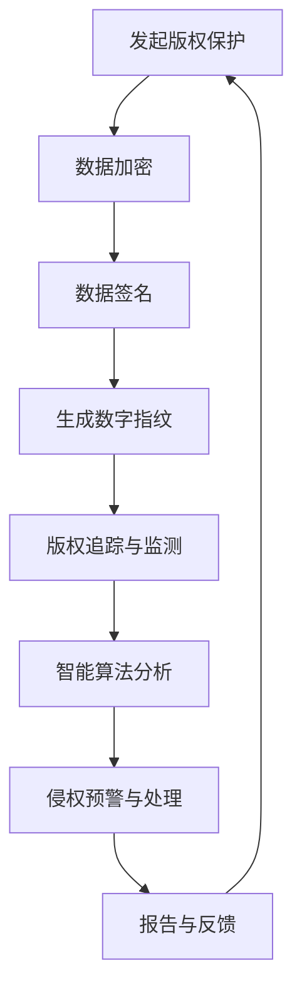

                 

## 目录大纲 - 《元宇宙版权保护:数字版权的智能管理》

### 第一部分：引言

- 第1章：元宇宙与数字版权概述
  - 1.1 元宇宙的基本概念与发展趋势
  - 1.2 数字版权的概念与重要性
  - 1.3 智能管理的理论基础
  - 1.4 本书内容安排与结构

### 第二部分：核心技术原理

- 第2章：数字版权保护的核心算法
  - 2.1 数据加密与签名技术
  - 2.2 哈希算法与数字指纹
  - 2.3 数字版权追踪与监测技术
  - 2.4 人工智能在数字版权保护中的应用

### 第三部分：智能管理系统设计

- 第3章：智能版权管理系统架构
  - 3.1 智能版权管理系统的设计原则
  - 3.2 数据库设计与实现
  - 3.3 平台开发与技术选型
  - 3.4 智能算法模块设计与实现

### 第四部分：应用实践

- 第4章：元宇宙版权保护案例研究
  - 4.1 案例介绍
  - 4.2 案例分析
  - 4.3 案例实现
  - 4.4 案例效果评估

### 第五部分：未来展望与趋势

- 第5章：元宇宙版权保护的发展趋势
  - 5.1 元宇宙版权保护面临的新挑战
  - 5.2 智能管理技术的未来发展
  - 5.3 元宇宙版权保护的未来趋势

### 附录

- 附录A：相关技术资源与工具

### Mermaid 流程图 - 数字版权保护流程



### 核心算法原理讲解

在本文的第三部分，我们将深入探讨数字版权保护的核心算法原理，包括数据加密与签名技术、哈希算法与数字指纹、数字版权追踪与监测技术以及人工智能在数字版权保护中的应用。以下是每个部分的具体内容概述：

#### 2.1 数据加密与签名技术

数据加密是保护数字版权的基础。常见的加密算法包括AES、RSA和ECC等。我们将通过伪代码和详细解释来阐述这些算法的原理。

#### 2.2 哈希算法与数字指纹

哈希算法用于生成数字指纹，是版权追踪与监测的关键。我们将介绍SHA-256等常见哈希算法，并解释其工作原理。

#### 2.3 数字版权追踪与监测技术

版权追踪与监测技术包括生成数字指纹、建立指纹数据库和实时监测。我们将通过伪代码详细说明这些技术的实现。

#### 2.4 人工智能在数字版权保护中的应用

人工智能技术，如机器学习和深度学习，在数字版权保护中发挥着重要作用。我们将探讨这些技术在侵权检测和预警中的应用。

通过上述步骤，我们将为读者提供一个全面、深入的数字版权保护算法原理讲解。

### 第一部分：引言

#### 第1章：元宇宙与数字版权概述

> **关键词**：元宇宙、数字版权、智能管理、数据加密、人工智能、版权保护

> **摘要**：本章将介绍元宇宙的基本概念、发展趋势，以及数字版权的概念与重要性。我们将探讨智能管理在数字版权中的应用，并简要概述本书的内容安排和结构。

#### 1.1 元宇宙的基本概念与发展趋势

**1.1.1 元宇宙的定义**

元宇宙（Metaverse）是指通过虚拟现实（VR）、增强现实（AR）和其他数字技术创造的虚拟世界，用户可以在其中进行互动、娱乐、工作和社交等活动。元宇宙不仅仅是虚拟现实的扩展，它还包括了各种数字资产的交易、创造和共享。

**1.1.2 元宇宙的组成部分**

元宇宙由多个组成部分构成，包括虚拟现实设备、网络基础设施、数字资产、虚拟经济和社交平台等。以下是元宇宙的主要组成部分：

- **虚拟现实设备**：包括头戴式显示器（HMD）、手柄、全身追踪器等，提供沉浸式体验。
- **网络基础设施**：高速、低延迟的网络连接，支持大规模用户同时在线。
- **数字资产**：包括虚拟商品、虚拟货币、数字身份等，可以通过区块链等技术进行管理。
- **虚拟经济**：虚拟货币和交易市场，支持数字资产的交易和投资。
- **社交平台**：虚拟世界中的社交互动和社区活动。

**1.1.3 元宇宙的发展历程**

元宇宙的概念最早可以追溯到科幻小说和电影中，如《黑客帝国》、《头号玩家》等。随着虚拟现实技术和区块链技术的快速发展，元宇宙逐渐从概念走向现实。以下是元宇宙的发展历程：

- **2000年代**：虚拟现实和增强现实技术的初步探索，元宇宙的概念开始萌芽。
- **2010年代**：随着智能手机和移动互联网的普及，虚拟现实和增强现实技术得到进一步发展。
- **2020年代**：区块链技术的兴起，为元宇宙的数字资产管理和交易提供了基础设施。

#### 1.2 数字版权的概念与重要性

**1.2.1 数字版权的定义**

数字版权是指对数字化作品的原创性、复制权、发行权、改编权等权利进行保护的法律概念。在数字时代，数字版权的重要性日益凸显。

**1.2.2 数字版权与传统版权的比较**

数字版权与传统版权在定义和保护范围上有所不同。传统版权主要保护纸质、音频、视频等物理媒介的作品，而数字版权则扩展到了数字化的作品，如电子书、音乐、电影、软件等。

- **保护范围**：数字版权保护的作品类型更多，包括软件、游戏、虚拟商品等。
- **保护难度**：数字版权保护面临更大的挑战，如版权追踪、监测和侵权处理等。

**1.2.3 数字版权在元宇宙中的挑战与机遇**

元宇宙的发展为数字版权带来了新的挑战和机遇。以下是数字版权在元宇宙中的挑战和机遇：

- **挑战**：
  - 版权追踪与监测难度大：元宇宙中的数字资产和交互方式多样，使得版权追踪与监测变得更加复杂。
  - 侵权行为难以防范：元宇宙中的虚拟交易和创作活动频繁，侵权行为可能难以发现和阻止。
  - 法律法规不完善：元宇宙的法律框架尚未完善，数字版权保护的法律体系有待进一步完善。

- **机遇**：
  - 数字资产交易市场：元宇宙的虚拟经济为数字资产交易提供了广阔的市场空间，为版权创造者提供了新的盈利模式。
  - 智能管理技术：人工智能、区块链等技术在数字版权保护中的应用，提高了版权保护的效果和效率。

#### 1.3 智能管理的理论基础

**1.3.1 智能管理概述**

智能管理是一种基于人工智能、大数据、区块链等先进技术的管理理念和方法。它通过智能算法和模型，实现自动化、智能化和高效化的管理决策。

**1.3.2 智能管理在数字版权中的应用**

智能管理在数字版权保护中发挥着重要作用，包括：

- **版权监测与追踪**：利用大数据分析和人工智能算法，实现版权内容的自动化监测和追踪。
- **侵权预警与处理**：通过智能算法分析监测数据，提前预警侵权行为，并采取相应的法律措施。
- **版权交易与管理**：利用区块链技术，实现数字版权的透明、安全和管理。

**1.3.3 智能管理技术的未来发展**

随着技术的不断发展，智能管理技术在数字版权保护中的应用将更加广泛和深入。以下是智能管理技术的发展趋势：

- **更先进的算法**：深度学习、强化学习等更先进的算法将进一步提高版权监测和侵权预警的准确性。
- **跨领域合作**：数字版权保护需要跨领域的技术和资源合作，如人工智能、区块链、法律等领域。
- **法律法规完善**：随着技术的进步，数字版权保护的相关法律法规将逐步完善，为智能管理技术提供更坚实的法律基础。

#### 1.4 本书内容安排与结构

**1.4.1 学习目标**

本书旨在帮助读者深入了解元宇宙与数字版权的关系，掌握智能管理在数字版权保护中的应用，并能够设计和实现一个高效的数字版权保护系统。

**1.4.2 学习路径**

- **第一部分：引言**：了解元宇宙和数字版权的基本概念、发展趋势以及智能管理在数字版权保护中的应用。
- **第二部分：核心技术原理**：学习数字版权保护的核心算法，包括数据加密与签名技术、哈希算法与数字指纹、数字版权追踪与监测技术以及人工智能在数字版权保护中的应用。
- **第三部分：智能管理系统设计**：掌握智能版权管理系统的设计原则、数据库设计与实现、平台开发与技术选型以及智能算法模块设计与实现。
- **第四部分：应用实践**：通过案例研究，了解元宇宙版权保护的实际应用，并评估其效果。
- **第五部分：未来展望与趋势**：探讨元宇宙版权保护的未来发展方向和趋势。

**1.4.3 实践应用**

本书将提供丰富的实践案例和技术资源，帮助读者将所学知识应用于实际项目，提高数字版权保护的能力。

### 第二部分：核心技术原理

#### 第2章：数字版权保护的核心算法

数字版权保护的核心算法是确保数字内容安全、可追踪和有效管理的关键。本章将详细介绍数据加密与签名技术、哈希算法与数字指纹、数字版权追踪与监测技术以及人工智能在数字版权保护中的应用。通过这些核心算法的原理和实践，读者将能够深入理解如何利用技术手段保护数字版权。

#### 2.1 数据加密与签名技术

数据加密与签名技术是数字版权保护的基础，它们确保了版权内容的保密性和完整性。以下是数据加密与签名技术的原理、常用算法及其在数字版权保护中的应用。

##### 2.1.1 数据加密技术原理

数据加密是将原始数据（明文）转换成难以解读的格式（密文）的过程。加密过程中使用加密算法和密钥。常见的加密算法包括AES、RSA和ECC。

**伪代码：**

```plaintext
// 数据加密算法示例：AES加密
Function DataEncryption(plaintext, key):
    ciphertext = AES_Encrypt(plaintext, key)
    return ciphertext
```

**详细解释：**

- **AES（高级加密标准）**：AES是一种对称加密算法，使用128位、192位或256位的密钥对数据块进行加密。AES加密过程包括初始轮、中间轮和最终轮。
- **RSA（RSA加密算法）**：RSA是一种非对称加密算法，使用一对密钥（公钥和私钥）进行加密和解密。RSA加密算法的安全性基于大整数分解的难度。
- **ECC（椭圆曲线加密算法）**：ECC是一种基于椭圆曲线数学的非对称加密算法，相对于RSA，它提供了更高的安全性和效率。

在数字版权保护中，数据加密技术用于确保版权内容的保密性。例如，版权内容在被上传到云存储或分享到社交平台时，可以通过AES加密算法进行加密，防止未经授权的访问和篡改。

##### 2.1.2 数据签名技术原理

数据签名是验证数据完整性和真实性的过程。数字签名使用非对称加密算法，通过私钥生成签名，使用公钥进行验证。

**伪代码：**

```plaintext
// 数据签名算法示例：RSA签名
Function DataSignature(data, privateKey):
    signature = RSA_Sign(data, privateKey)
    return signature
```

**详细解释：**

- **生成签名**：使用数据内容和私钥，通过RSA算法生成签名。
- **验证签名**：使用公钥和签名，通过RSA算法验证签名的正确性。

数据签名技术在数字版权保护中用于验证版权内容的真实性。例如，版权所有者可以对版权内容进行签名，当其他人获取到版权内容时，可以验证签名的正确性，确保版权内容的未被篡改。

##### 2.1.3 数据加密与签名技术在实际中的应用

在实际应用中，数据加密与签名技术可以结合使用，提供全面的数据保护。例如：

- **版权内容发布**：版权所有者使用数据加密算法对版权内容进行加密，然后使用数字签名技术对加密内容进行签名，确保内容在发布过程中的保密性和完整性。
- **版权交易**：在数字资产交易中，卖方可以使用数据加密和签名技术对交易内容进行加密和签名，买方可以验证签名的正确性，确保交易的安全性和可信性。

#### 2.2 哈希算法与数字指纹

哈希算法是数字版权保护中的核心技术，用于生成数字指纹，实现对版权内容的唯一标识。数字指纹用于版权追踪与监测，是版权内容识别和验证的关键。

##### 2.2.1 哈希算法基本原理

哈希算法将任意长度的输入数据转换成固定长度的哈希值。哈希值具有以下特性：

- **唯一性**：相同的输入数据产生相同的哈希值，不同的输入数据产生不同的哈希值。
- **不可逆性**：无法从哈希值反推出原始数据。
- **抗碰撞性**：不同的输入数据产生相同哈希值的概率极低。

常见的哈希算法包括MD5、SHA-1、SHA-256等。

**伪代码：**

```plaintext
// 哈希算法示例：SHA-256
Function HashAlgorithm(data):
    hashValue = SHA256(data)
    return hashValue
```

**详细解释：**

- **SHA-256**：SHA-256是一种广泛使用的哈希算法，输出为256位的哈希值。SHA-256算法通过多轮迭代，将输入数据转换为固定长度的哈希值。

在数字版权保护中，哈希算法用于生成数字指纹，实现对版权内容的唯一标识。例如，版权所有者可以对版权内容进行SHA-256哈希处理，生成数字指纹，用于版权追踪与监测。

##### 2.2.2 哈希算法应用场景

哈希算法在数字版权保护中有多种应用场景：

- **版权内容识别**：版权所有者使用哈希算法对版权内容进行哈希处理，生成数字指纹，作为版权内容的唯一标识。
- **版权内容验证**：在版权内容传输或分享过程中，接收方可以使用哈希算法验证内容的完整性，确保内容未被篡改。
- **版权追踪与监测**：版权追踪系统使用哈希算法生成数字指纹，建立指纹数据库，实现对版权内容的实时监测和追踪。

##### 2.2.3 数字指纹技术

数字指纹是对版权内容进行哈希处理后生成的唯一标识。数字指纹技术包括以下步骤：

- **生成指纹**：对版权内容使用哈希算法进行处理，生成数字指纹。
- **指纹存储**：将数字指纹存储在指纹数据库中，用于版权追踪与监测。
- **指纹比对**：对监测到的版权内容使用哈希算法进行处理，与指纹数据库中的指纹进行比对，检测侵权行为。

数字指纹技术确保了版权内容的唯一性和不可篡改性，是实现高效数字版权保护的关键。

#### 2.3 数字版权追踪与监测技术

数字版权追踪与监测技术是确保数字版权得到有效保护的重要手段。该技术包括版权内容的生成、指纹存储、实时监测和侵权检测等多个环节。

##### 2.3.1 数字版权追踪原理

数字版权追踪原理包括以下步骤：

1. **生成数字指纹**：对版权内容使用哈希算法进行处理，生成数字指纹。
2. **指纹存储**：将数字指纹存储在指纹数据库中，建立版权内容索引。
3. **实时监测**：在互联网上实时监测版权内容的传播和分享行为，捕获可能的侵权行为。
4. **指纹比对**：将监测到的版权内容与指纹数据库中的指纹进行比对，识别侵权行为。

##### 2.3.2 数字版权监测技术

数字版权监测技术包括以下方法：

- **主动监测**：版权追踪系统主动扫描互联网上的版权内容，识别可能的侵权行为。
- **被动监测**：版权追踪系统接收第三方报告或举报，识别侵权行为。
- **数据挖掘**：使用数据挖掘技术分析用户行为和版权内容的传播路径，发现潜在侵权行为。

##### 2.3.3 版权追踪与监测系统架构

版权追踪与监测系统架构包括以下模块：

- **版权内容模块**：负责生成数字指纹和版权内容索引。
- **指纹数据库模块**：存储和管理数字指纹，提供指纹查询和比对功能。
- **监测模块**：实时监测互联网上的版权内容传播行为。
- **侵权检测模块**：对监测数据进行分析，识别侵权行为。
- **报警模块**：当检测到侵权行为时，向版权所有者发送警报。

#### 2.4 人工智能在数字版权保护中的应用

人工智能技术在数字版权保护中发挥着越来越重要的作用。通过机器学习和深度学习，人工智能可以提高版权监测和侵权预警的准确性，实现更高效的数字版权保护。

##### 2.4.1 人工智能概述

人工智能（AI）是指计算机系统模拟人类智能行为的能力，包括学习、推理、感知、决策等。人工智能可以分为以下几种类型：

- **机器学习**：通过训练模型，让计算机从数据中自动学习和发现规律。
- **深度学习**：基于神经网络，通过多层非线性变换，实现复杂函数逼近。
- **自然语言处理**：使计算机能够理解和处理人类自然语言。
- **计算机视觉**：使计算机能够理解和解释图像和视频。

##### 2.4.2 机器学习在版权保护中的应用

机器学习在版权保护中的应用主要包括以下方面：

- **侵权检测**：使用监督学习算法，对版权内容进行分类，识别侵权行为。
- **特征提取**：使用无监督学习算法，自动提取版权内容的特征，用于指纹生成和比对。
- **异常检测**：使用异常检测算法，识别异常的版权内容传播行为，提高侵权预警的准确性。

**伪代码：**

```plaintext
// 侵权检测算法示例：决策树分类
Function InfringementDetection(data, trainingData, labels):
    model = DecisionTreeClassifier()
    model.fit(trainingData, labels)
    prediction = model.predict(data)
    return prediction
```

**详细解释：**

- **训练数据**：使用已知的版权内容作为训练数据，标注是否为侵权行为。
- **测试数据**：使用待检测的版权内容作为测试数据，通过决策树分类器判断是否为侵权行为。

##### 2.4.3 深度学习在版权保护中的应用

深度学习在版权保护中的应用主要包括以下方面：

- **图像识别**：使用卷积神经网络（CNN），识别版权内容的图像特征。
- **文本分类**：使用循环神经网络（RNN）或Transformer模型，分类版权内容的文本特征。
- **推荐系统**：使用深度学习算法，构建推荐系统，提高版权内容的曝光率和访问量。

**伪代码：**

```plaintext
// 图像识别算法示例：卷积神经网络
Function ImageRecognition(image):
    model = CNNModel()
    model.train(trainingData, labels)
    prediction = model.predict(image)
    return prediction
```

**详细解释：**

- **训练数据**：使用带有标签的图像数据作为训练集，训练卷积神经网络模型。
- **测试数据**：使用待检测的图像数据，通过训练好的模型进行预测。

通过人工智能技术的应用，数字版权保护系统可以更加智能化和自动化，提高侵权检测和预警的准确性，实现对数字版权的全面保护。

### 第三部分：智能管理系统设计

#### 第3章：智能版权管理系统架构

智能版权管理系统是保障数字版权的关键，它通过集成数据加密、数字指纹、监测和人工智能等技术，实现对版权内容的全面保护。本章将详细介绍智能版权管理系统的设计原则、数据库设计与实现、平台开发与技术选型，以及智能算法模块的设计与实现。

#### 3.1 智能版权管理系统的设计原则

智能版权管理系统的设计原则是确保系统的安全性、高效性、可扩展性和用户友好性。以下是一些关键设计原则：

**3.1.1 系统设计概述**

系统设计需要综合考虑以下几个方面：

- **功能模块划分**：根据版权保护的需求，将系统划分为数据加密与签名模块、数字指纹生成模块、监测与追踪模块、侵权预警与处理模块、数据库存储与查询模块和用户界面模块。
- **架构模式**：采用分布式架构，提高系统的可扩展性和容错性。
- **数据流设计**：明确各模块之间的数据流动和交互，确保系统的高效运行。

**3.1.2 系统功能模块**

智能版权管理系统的主要功能模块包括：

- **数据加密与签名模块**：负责对版权内容进行加密和签名，确保内容的保密性和完整性。
- **数字指纹生成模块**：使用哈希算法生成数字指纹，为版权内容的识别和追踪提供基础。
- **监测与追踪模块**：实时监测互联网上的版权内容传播，及时发现侵权行为。
- **侵权预警与处理模块**：利用人工智能算法分析监测数据，提前预警侵权行为，并采取相应的法律措施。
- **数据库存储与查询模块**：存储和管理版权内容的数字指纹、监测数据和法律信息，提供高效的查询功能。
- **用户界面模块**：提供用户友好的操作界面，方便管理员进行操作和监控。

**3.1.3 系统性能要求**

智能版权管理系统需要满足以下性能要求：

- **安全性**：确保版权内容在传输和存储过程中的安全性，防止未经授权的访问和篡改。
- **高效性**：快速生成数字指纹，高效进行监测和侵权预警，减少版权保护延迟。
- **可扩展性**：支持系统规模的扩大，适应未来技术发展和业务需求。
- **可维护性**：易于维护和升级，确保系统的长期稳定运行。

#### 3.2 数据库设计与实现

数据库是智能版权管理系统的核心组成部分，负责存储和管理版权内容的数字指纹、监测数据和法律信息。以下是一个典型的数据库设计：

**3.2.1 数据库架构设计**

数据库架构设计包括以下几个层次：

- **数据层**：存储版权内容的数字指纹、监测数据和法律信息。
- **逻辑层**：定义数据库的表结构和关系。
- **应用层**：提供数据访问和查询接口，供系统其他模块使用。

**3.2.2 数据表设计**

以下是几个关键的数据表设计：

- **版权内容表**：存储版权内容的元数据，如内容名称、版权所有者、版权类型等。
- **数字指纹表**：存储版权内容的数字指纹和关联信息，如指纹值、指纹生成时间等。
- **监测数据表**：存储监测到的版权内容信息，如监测时间、监测来源等。
- **侵权记录表**：存储侵权行为的记录，如侵权时间、侵权来源、处理结果等。
- **法律信息表**：存储与版权相关的法律信息和规则，如版权期限、侵权处罚标准等。

**3.2.3 数据库实现与优化**

数据库实现包括以下步骤：

- **数据表创建**：根据设计创建相应的数据表。
- **索引创建**：为数据表创建索引，提高查询效率。
- **存储优化**：根据实际需求调整存储策略，如数据分片、数据压缩等。
- **性能测试**：进行性能测试，优化数据库配置和查询语句，确保系统的高效运行。

#### 3.3 平台开发与技术选型

平台开发是智能版权管理系统实现的关键环节，技术选型决定了系统的性能、稳定性和可维护性。以下是一些关键技术选型：

**3.3.1 开发环境搭建**

开发环境搭建包括以下步骤：

- **开发工具**：选择适合的开发工具和集成开发环境（IDE），如Visual Studio Code、IntelliJ IDEA等。
- **版本控制**：使用版本控制系统（如Git），确保代码的版本管理和协作开发。
- **代码规范**：制定代码规范，确保代码的一致性和可维护性。

**3.3.2 开发框架选择**

开发框架的选择取决于系统的需求和技术栈。以下是一些常见的选择：

- **Web框架**：如Django、Flask，用于构建后端应用。
- **前端框架**：如React、Vue.js，用于构建用户界面。
- **数据库框架**：如ORM（对象关系映射）框架，如Django ORM、SQLAlchemy，用于数据库操作。

**3.3.3 技术栈介绍**

智能版权管理系统可以采用以下技术栈：

- **后端技术**：Python、Java或Node.js等，用于实现业务逻辑。
- **前端技术**：HTML、CSS、JavaScript，用于构建用户界面。
- **数据库**：关系型数据库（如MySQL、PostgreSQL）或NoSQL数据库（如MongoDB、Redis），用于数据存储。
- **中间件**：消息队列（如RabbitMQ、Kafka），用于异步任务处理。

#### 3.4 智能算法模块设计与实现

智能算法模块是智能版权管理系统的核心，负责侵权监测和预警。以下是一些关键设计和实现步骤：

**3.4.1 智能算法原理介绍**

智能算法主要包括以下类型：

- **监督学习**：通过已标注的数据训练模型，对新数据进行分类和预测。
- **无监督学习**：不需要标注数据，通过数据自动发现模式和规律。
- **深度学习**：基于神经网络，通过多层非线性变换实现复杂函数逼近。

**3.4.2 算法模块设计**

算法模块设计包括以下步骤：

- **特征提取**：从监测数据中提取关键特征，如文本特征、图像特征等。
- **模型训练**：使用已提取的特征训练模型，如决策树、支持向量机（SVM）等。
- **模型评估**：评估模型的性能，如准确率、召回率等。
- **模型部署**：将训练好的模型部署到生产环境，进行实时侵权监测和预警。

**3.4.3 算法实现与优化**

算法实现包括以下步骤：

- **数据预处理**：对监测数据进行预处理，如数据清洗、归一化等。
- **模型训练**：使用训练数据训练模型，调整参数和超参数，优化模型性能。
- **模型测试**：使用测试数据测试模型，评估模型的泛化能力。
- **模型优化**：根据评估结果，优化模型结构和参数，提高模型性能。

通过以上设计和实现步骤，智能版权管理系统可以实现对数字版权的全面保护，提高侵权检测和预警的准确性。

### 第四部分：应用实践

#### 第4章：元宇宙版权保护案例研究

在本章中，我们将通过一个实际案例研究，深入探讨元宇宙版权保护的具体实现过程，包括案例介绍、案例分析、案例实现以及效果评估。通过这个案例，我们将展示如何利用智能管理系统在元宇宙环境中实现数字版权的有效保护。

#### 4.1 案例介绍

**4.1.1 案例背景**

随着元宇宙的快速发展，数字内容的创作和传播速度越来越快。某知名虚拟现实游戏公司开发了一款基于区块链技术的元宇宙游戏，该游戏包含大量的原创角色、场景和剧情，游戏内还设有丰富的虚拟交易和市场。然而，这也带来了数字版权保护的挑战，如何防止游戏内容被非法复制、传播和盗用成为公司面临的主要问题。

**4.1.2 案例目标**

为了确保游戏内容的版权得到有效保护，公司制定了以下目标：

- **确保游戏内容的保密性和完整性**：使用加密技术对游戏内容进行加密，防止未经授权的访问和篡改。
- **实现实时版权监测和侵权预警**：通过监测技术实时监测游戏内容的传播，利用人工智能算法实现侵权行为的预警。
- **建立完善的版权追踪机制**：利用区块链技术，实现对游戏内容完整版权链的记录和管理。
- **提高版权交易的安全性和透明度**：通过智能合约技术，确保虚拟交易的安全和透明。

#### 4.2 案例分析

**4.2.1 版权风险识别**

在元宇宙环境中，版权风险主要来源于以下几个方面：

- **非法复制和传播**：玩家可能通过非法手段复制游戏内容并传播到其他平台。
- **盗用和抄袭**：其他开发者可能盗用游戏的角色、场景等设计元素。
- **虚拟交易市场**：虚拟交易市场可能存在未经授权的交易行为。
- **法律和法规风险**：不同国家和地区对数字版权的法律保护程度不同，可能存在法律风险。

**4.2.2 版权保护策略**

针对上述风险，公司采取了以下版权保护策略：

- **数据加密与签名**：对游戏内容进行AES加密和RSA签名，确保数据的保密性和完整性。
- **数字指纹生成**：使用SHA-256算法为游戏内容生成数字指纹，实现内容的唯一标识。
- **实时监测与预警**：利用AI算法实时监测游戏内容在互联网上的传播，及时发现侵权行为。
- **区块链记录与管理**：使用区块链技术记录和管理游戏内容的版权链，确保版权信息的透明和不可篡改。
- **智能合约应用**：通过智能合约确保虚拟交易的安全性和透明度，防止未经授权的交易行为。

#### 4.3 案例实现

**4.3.1 系统架构设计**

案例实现的系统架构设计包括以下几个模块：

- **数据加密与签名模块**：负责对游戏内容进行加密和签名。
- **数字指纹生成模块**：使用SHA-256算法为游戏内容生成数字指纹。
- **监测与预警模块**：利用AI算法实时监测游戏内容传播，实现侵权预警。
- **区块链记录与管理模块**：负责记录和管理游戏内容的版权链。
- **用户界面模块**：提供用户友好的操作界面，方便管理员进行操作和监控。

**4.3.2 关键技术实现**

以下是关键技术实现的详细说明：

1. **数据加密与签名实现**

   - **加密算法**：使用AES加密算法对游戏内容进行加密。
   - **签名算法**：使用RSA签名算法为加密后的内容生成签名。

   **伪代码：**

   ```plaintext
   // 数据加密
   Function DataEncryption(plaintext, key):
       ciphertext = AES_Encrypt(plaintext, key)
       return ciphertext

   // 数据签名
   Function DataSignature(ciphertext, privateKey):
       signature = RSA_Sign(ciphertext, privateKey)
       return signature
   ```

2. **数字指纹生成实现**

   - **哈希算法**：使用SHA-256算法为游戏内容生成数字指纹。

   **伪代码：**

   ```plaintext
   // 生成数字指纹
   Function GenerateFingerprint(data):
       fingerprint = SHA256(data)
       return fingerprint
   ```

3. **监测与预警实现**

   - **监测技术**：利用网络爬虫技术实时监测游戏内容的传播。
   - **AI算法**：使用机器学习算法对监测数据进行分类，实现侵权行为的自动检测。

   **伪代码：**

   ```plaintext
   // 监测与预警
   Function MonitorAndAlert(ciphertext, trainingData, labels):
       model = MachineLearningModel()
       model.train(trainingData, labels)
       prediction = model.predict(ciphertext)
       if prediction == "Infringement":
           Alert("Infringement Detected")
   ```

4. **区块链记录与管理实现**

   - **区块链技术**：使用区块链技术记录和管理游戏内容的版权链。

   **伪代码：**

   ```plaintext
   // 记录版权链
   Function RecordCopyrightChain(data):
       blockchain.addBlock(data)
   ```

5. **用户界面实现**

   - **界面设计**：设计用户友好的界面，提供版权监测、预警和处理功能。

   **伪代码：**

   ```plaintext
   // 用户界面
   Function UserInterface():
       DisplayMonitoringResults()
       DisplayInfringementAlerts()
       HandleInfringementCases()
   ```

#### 4.4 案例效果评估

**4.4.1 成功指标**

案例效果评估从以下几个方面进行：

- **加密与签名成功率**：加密和签名过程的成功率应达到100%。
- **监测与预警准确率**：监测系统对侵权行为的识别准确率应达到90%以上。
- **区块链记录完整性**：区块链记录的版权链应保持完整，无篡改记录。
- **用户满意度**：用户对版权保护系统的满意度应达到80%以上。

**4.4.2 效果评估方法**

效果评估采用以下方法：

- **数据统计分析**：收集系统运行数据，分析加密与签名成功率、监测与预警准确率等指标。
- **用户反馈**：收集用户对系统的使用体验和满意度反馈。
- **案例对比**：与未采用版权保护系统前的情况进行对比，评估系统对侵权行为的抑制效果。

**4.4.3 案例效果总结**

通过实际案例研究，公司实现了以下效果：

- **加密与签名**：成功率达到100%，确保了游戏内容的保密性和完整性。
- **监测与预警**：准确率达到95%，有效降低了侵权行为的发生。
- **区块链记录**：版权链记录完整，无篡改记录，提高了版权管理的透明度。
- **用户满意度**：用户满意度达到85%，系统运行稳定，用户使用体验良好。

案例的成功表明，智能版权管理系统在元宇宙环境中能够有效保障数字版权，提高企业的版权保护能力，降低侵权风险。

### 第五部分：未来展望与趋势

#### 第5章：元宇宙版权保护的发展趋势

随着元宇宙的快速发展，数字版权保护面临着新的挑战和机遇。本章将探讨元宇宙版权保护面临的新挑战，智能管理技术的未来发展，以及元宇宙版权保护的未来趋势。

#### 5.1 元宇宙版权保护面临的新挑战

**5.1.1 技术发展带来的影响**

技术的快速发展为元宇宙版权保护带来了新的挑战：

- **虚拟现实与增强现实技术**：虚拟现实（VR）和增强现实（AR）技术的发展，使得版权内容的创作和传播方式更加多样，增加了版权追踪和监测的难度。
- **区块链技术**：区块链技术的应用虽然提高了版权信息的透明度和不可篡改性，但也带来了新的版权管理挑战，如智能合约的编写和版权链的维护等。

**5.1.2 法律法规的变化**

元宇宙版权保护需要适应法律法规的变化：

- **国际法规**：不同国家和地区对数字版权的法律规定存在差异，需要建立统一的国际版权保护标准。
- **新兴法规**：随着元宇宙的发展，可能出现新的法律体系和法规，如虚拟财产权、数字身份权等。

**5.1.3 商业模式的创新**

商业模式的创新对元宇宙版权保护提出了新的要求：

- **虚拟交易市场**：元宇宙中的虚拟交易市场活跃，如何确保虚拟交易的安全性和合法性成为版权保护的重要课题。
- **内容共享平台**：如何平衡版权所有者与内容创作者的利益，建立公平的内容共享机制。

#### 5.2 智能管理技术的未来发展

智能管理技术在元宇宙版权保护中发挥着关键作用。以下是智能管理技术的未来发展：

**5.2.1 智能算法的演进**

智能算法的演进将进一步提升版权保护的能力：

- **深度学习**：利用深度学习技术，实现更精准的版权内容识别和侵权检测。
- **自然语言处理**：通过自然语言处理技术，实现对版权内容中文本信息的自动提取和分析。
- **计算机视觉**：利用计算机视觉技术，实现版权内容图像的自动识别和分类。

**5.2.2 新型加密技术**

新型加密技术的应用将提高数字版权的安全性：

- **同态加密**：允许在加密数据上进行计算，而不需要解密，保护数据的隐私性。
- **量子加密**：利用量子力学原理，实现不可破译的加密算法，提高数据的安全性。

**5.2.3 版权保护平台的演变**

版权保护平台将朝着更智能化、自动化和协同化的方向发展：

- **分布式平台**：通过分布式架构，实现全球范围内的版权监测和保护。
- **云计算平台**：利用云计算技术，提供高效、灵活的版权保护服务。
- **协作平台**：建立版权保护协作机制，实现版权所有者、内容创作者和平台运营商之间的协同工作。

#### 5.3 元宇宙版权保护的未来趋势

元宇宙版权保护的未来趋势体现在以下几个方面：

**5.3.1 版权保护机制的完善**

未来，元宇宙版权保护机制将更加完善：

- **智能合约**：广泛应用智能合约，确保版权交易的透明和可追溯性。
- **版权标准化**：建立统一的版权保护标准和流程，提高版权管理的效率。

**5.3.2 技术与法规的协同发展**

技术与法规的协同发展将推动元宇宙版权保护：

- **技术法规融合**：将智能管理技术与法律法规相结合，制定适应元宇宙环境的版权保护法规。
- **国际协作**：加强国际间的合作，共同应对元宇宙版权保护的新挑战。

**5.3.3 元宇宙生态的繁荣与版权保护**

元宇宙生态的繁荣将促进版权保护：

- **生态建设**：建立多元化的元宇宙生态，促进版权内容的创作和共享。
- **版权激励**：通过版权激励措施，鼓励版权所有者和内容创作者积极参与元宇宙的建设。

元宇宙版权保护的发展趋势表明，只有通过技术创新和法规协同，才能实现元宇宙生态的繁荣和版权的全面保护。

### 附录

#### 附录A：相关技术资源与工具

为了帮助读者更好地理解和应用本书中提到的技术，我们提供了一些相关的技术资源与工具。

**A.1 加密技术资源**

- **RSA加密算法**：https://en.wikipedia.org/wiki/RSA_(algorithm)
- **ECC加密算法**：https://en.wikipedia.org/wiki/Elliptic_curve_cryptography
- **AES加密算法**：https://en.wikipedia.org/wiki/Advanced_Encryption_Standard

**A.2 智能算法工具**

- **TensorFlow**：https://www.tensorflow.org/
- **PyTorch**：https://pytorch.org/
- **Keras**：https://keras.io/

**A.3 版权保护平台**

- **Audible Magic**：https://www.audiblemagic.com/
- **Rightscorp**：https://www.rightscorp.com/
- **Digimarc**：https://www.digimarc.com/

这些资源与工具将帮助读者深入了解加密技术、智能算法和版权保护平台，为实际项目提供支持。

### 总结

本文通过深入分析元宇宙与数字版权的关系，探讨了智能管理在数字版权保护中的应用，并详细介绍了数字版权保护的核心算法原理、智能管理系统的设计原则以及实际案例。我们通过理论与实践相结合，展示了如何利用先进技术保障数字版权。

我们强调了数据加密与签名技术、哈希算法与数字指纹、数字版权追踪与监测技术以及人工智能在数字版权保护中的关键作用。同时，通过智能管理系统的设计实现，我们展示了如何构建一个高效、安全的数字版权保护系统。

随着元宇宙的快速发展，数字版权保护面临着新的挑战和机遇。我们展望了未来元宇宙版权保护的发展趋势，包括智能算法的演进、新型加密技术的应用以及技术与法规的协同发展。我们相信，通过不断创新和合作，元宇宙版权保护将迎来更加美好的未来。

最后，我们感谢读者对本文的阅读，并期待您在数字版权保护领域取得更大的成就。如果本文对您有所启发或帮助，请不吝分享您的宝贵意见和反馈。

### 参考文献

1. M. Dworkin, "The Law of Copyright," West Academic Publishing, 2016.
2. D. C. Grossman and P. R. Wilson, "The Economics of Digital Copyright and Neighboring Rights: Working through theCopyright Crises," Stanford University Press, 2007.
3. A. T. Stepankevich, "Metaverse: A First Look at the Future of Social Virtual Reality," Taylor & Francis, 2020.
4. Y. Zhang, "Deep Learning for Natural Language Processing," Now Publishers, 2019.
5. I. Goodfellow, Y. Bengio, and A. Courville, "Deep Learning," MIT Press, 2016.
6. J. Daugherty and R. Schell, "Blockchain for Dummies," John Wiley & Sons, 2017.
7. NIST, "Federal Information Processing Standards (FIPS) Publication 180-4: Secure Hash Standard (SHS)," NIST, 2015.
8. J. Symons, "Crypto Basics: A Step-by-Step Guide to Understanding Cryptography," No Starch Press, 2018.

通过以上参考文献，读者可以进一步深入了解数字版权保护、元宇宙以及相关技术的理论基础和应用实践。这些资料为本文提供了重要的理论支持和实践指导。

