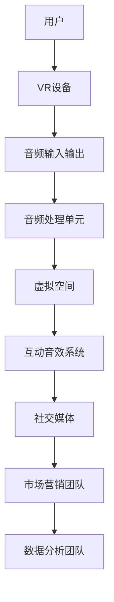

                 

### 跨越时空的听觉艺术盛宴：元宇宙音乐节探秘

在数字技术的飞速发展下，现实与虚拟的界限正逐渐模糊。元宇宙，这个新兴的虚拟世界，已经成为艺术和科技融合的前沿阵地。其中，元宇宙音乐节作为音乐与虚拟现实技术相结合的产物，正迅速崛起，成为跨越时空的听觉艺术盛宴。本文将带领读者深入探讨元宇宙音乐节的起源与背景、技术基础、艺术特色、策划与运营，以及未来发展趋势。

**关键词：** 元宇宙、音乐节、虚拟现实、听觉艺术、技术革新、营销推广

**摘要：** 本文首先介绍了元宇宙音乐节的起源与发展，接着探讨了其背后的技术基础，包括虚拟现实和互动音效技术。随后，文章分析了元宇宙音乐节的艺术特色，探讨了音乐与虚拟空间的关系以及音效设计实践案例。在第三部分，文章详细讨论了元宇宙音乐节的策划与运营，包括主题设定、活动安排和参与者互动设计。接着，文章通过案例分析，探讨了国际知名元宇宙音乐节的运作模式与影响。最后，文章展望了元宇宙音乐节的未来发展趋势，包括技术革新、商业模式创新和市场营销策略。通过本文，读者将全面了解元宇宙音乐节这一新兴艺术形式，以及其在音乐、科技与商业领域的深远影响。

### 第一部分：元宇宙音乐节概述

#### 第1章：元宇宙音乐节的起源与背景

**1.1 元宇宙的定义与发展**

元宇宙（Metaverse）是一个虚拟的、三维的、持续存在的数字世界，通过互联网连接，用户可以在其中进行各种互动和体验。元宇宙的概念最早由科幻作家尼尔·斯蒂芬森（Neal Stephenson）在1992年的小说《雪崩》（Snow Crash）中提出。然而，随着虚拟现实（VR）、增强现实（AR）、区块链、5G等技术的发展，元宇宙逐渐从科幻走向现实。

元宇宙的发展历程可以追溯到20世纪90年代的虚拟社区，如Second Life。虽然早期的虚拟世界技术较为简陋，但它们为元宇宙的概念奠定了基础。随着技术的进步，特别是VR和AR技术的成熟，元宇宙开始呈现出更加逼真的虚拟体验。2020年后，随着Facebook宣布更名为Meta，元宇宙的概念再次受到广泛关注，成为科技和商业领域的重要趋势。

**1.2 音乐节的历史与演变**

音乐节作为一种文化艺术形式，有着悠久的历史。最早的现代音乐节可以追溯到19世纪的浪漫主义时期，如贝多芬的第九交响曲首演。20世纪初，爵士乐和摇滚乐的兴起进一步推动了音乐节的发展。从露天音乐会到室内音乐厅，音乐节的形式和规模都在不断变化。

进入数字时代，音乐节也迎来了新的变革。网络直播和在线音乐平台的兴起，使得音乐节不再局限于物理空间，观众可以通过互联网随时随地观看和参与。然而，这种虚拟参与仍然受到技术限制，体验感相对有限。

**1.3 元宇宙音乐节的独特性**

元宇宙音乐节融合了虚拟现实、互动音效、区块链等技术，为观众带来了全新的听觉艺术体验。与传统音乐节相比，元宇宙音乐节具有以下独特性：

1. **沉浸式体验**：虚拟现实技术为观众提供了沉浸式的听觉和视觉体验，使观众仿佛置身于真实音乐现场。

2. **互动性**：通过互动音效技术和虚拟现实环境，观众可以与音乐家进行实时互动，改变音乐的表现形式和氛围。

3. **个性定制**：元宇宙音乐节允许观众根据自己的喜好定制音乐体验，选择不同的舞台、乐器、演奏风格等。

4. **全球化参与**：不受地理限制，全球观众可以同时在线参与元宇宙音乐节，打破了传统音乐节的区域限制。

5. **经济效益**：元宇宙音乐节通过虚拟门票销售、虚拟商品购买、广告收入等多种方式实现商业化，具有巨大的经济潜力。

#### 第2章：元宇宙音乐节的技术基础

**2.1 虚拟现实技术简介**

虚拟现实（VR）技术是元宇宙音乐节的核心基础。VR技术通过头戴式显示器（HMD）、定位传感器和跟踪系统，为用户创造了一个沉浸式的三维虚拟世界。在元宇宙音乐节中，观众可以通过VR设备进入虚拟音乐现场，体验逼真的音乐表演。

**2.1.1 VR硬件设备**

VR硬件设备主要包括头戴式显示器、手柄、定位传感器等。头戴式显示器是VR系统的核心，它提供了高分辨率、低延迟的视觉体验。手柄用于操作和交互，使观众可以在虚拟环境中进行各种动作。定位传感器用于跟踪观众的位置和运动，确保虚拟环境与现实世界的高度匹配。

**2.1.2 VR软件平台**

VR软件平台是元宇宙音乐节的技术核心，负责管理虚拟环境的渲染、交互和用户数据的处理。常见的VR软件平台包括Unity、Unreal Engine、VRChat等。这些平台提供了丰富的开发工具和资源，使开发者可以轻松创建和部署虚拟音乐节。

**2.2 互动音效技术**

互动音效技术是元宇宙音乐节的另一个关键技术。通过3D音频处理和实时音效反馈，互动音效技术为观众提供了高度沉浸的听觉体验。

**2.2.1 3D音频技术**

3D音频技术通过模拟声源的位置和方向，为观众提供立体声效。在元宇宙音乐节中，3D音频技术可以实时渲染音乐表演的空间感，使观众感受到身临其境的听觉体验。

**2.2.2 音效处理与混合**

音效处理与混合技术用于优化音频信号，增强音乐的动态范围和细节表现。在元宇宙音乐节中，音效处理与混合技术可以实时调整音频效果，以适应观众的互动行为和虚拟环境的变化。

#### 第3章：元宇宙音乐节的艺术特色

**3.1 音乐与虚拟空间的关系**

音乐与虚拟空间的关系是元宇宙音乐节的核心。通过虚拟现实技术，音乐表演可以在虚拟空间中进行，观众可以在虚拟环境中体验音乐表演的独特魅力。

**3.1.1 虚拟空间中的音乐创作**

虚拟空间为音乐创作提供了无限的创意空间。音乐家可以在虚拟环境中尝试新的音乐形式、风格和演奏技巧，创造出独特的音乐作品。

**3.1.2 虚拟空间中的音乐表演**

虚拟空间中的音乐表演为观众带来了全新的体验。通过VR技术，观众可以近距离观察音乐家的演奏动作，感受音乐的节奏和情感。

**3.2 元宇宙音乐节的音效设计**

音效设计是元宇宙音乐节的重要部分，它直接影响观众的听觉体验。优秀的音效设计可以增强虚拟空间的真实感和沉浸感。

**3.2.1 音效在虚拟空间中的重要性**

音效在虚拟空间中扮演着重要的角色，它不仅影响观众对音乐表演的感受，还可以改变虚拟环境的氛围和情绪。

**3.2.2 音效设计实践案例**

以下是一些元宇宙音乐节的音效设计实践案例：

1. **《虚拟音乐会：星际漫游》**：通过使用太空环境音效，营造出宇宙深空的氛围，使观众仿佛置身于星际之旅。

2. **《未来之城音乐节》**：通过使用未来科技音效，营造出科幻都市的氛围，使观众感受到未来科技的魅力。

3. **《梦幻森林音乐会》**：通过使用自然音效，营造出梦幻森林的氛围，使观众感受到大自然的宁静与美好。

#### 第4章：元宇宙音乐节的策划

**4.1 音乐节主题的设定**

音乐节主题的设定是策划元宇宙音乐节的重要环节。一个鲜明的主题可以吸引观众，提升音乐节的知名度和吸引力。

**4.1.1 主题设定的意义**

主题设定的意义在于为音乐节提供统一的视觉和听觉元素，使音乐节具有独特的个性和风格。同时，主题还可以引导音乐家创作和表演，提升音乐节的内涵和深度。

**4.1.2 主题设定的方法**

主题设定的方法包括以下几个方面：

1. **根据音乐风格设定主题**：如古典音乐节、爵士音乐节、流行音乐节等。

2. **根据地域文化设定主题**：如法国印象派音乐节、非洲草原音乐节等。

3. **根据科技元素设定主题**：如未来科技音乐节、虚拟现实音乐节等。

**4.2 音乐节活动安排**

音乐节活动安排是音乐节策划的核心，它决定了音乐节的整体流程和节奏。

**4.2.1 演出阵容的选择**

演出阵容的选择是活动安排的关键。根据音乐节的主题，选择符合主题的艺术家和音乐作品，可以提升音乐节的吸引力和艺术价值。

**4.2.2 活动流程的设计**

活动流程的设计需要考虑观众的需求和体验。以下是一些常见的活动流程设计：

1. **开场演出**：由知名艺术家或乐队进行开场演出，吸引观众的关注。

2. **主题表演**：根据音乐节的主题，安排不同的主题表演，如科幻音乐表演、自然音乐表演等。

3. **互动环节**：设置互动环节，让观众参与音乐表演，提升观众的互动体验。

4. **闭幕演出**：由知名艺术家或乐队进行闭幕演出，为音乐节画上圆满的句号。

#### 第5章：元宇宙音乐节的运营

**5.1 参与者的互动设计**

参与者的互动设计是元宇宙音乐节的重要组成部分，它直接影响观众的参与度和体验感。

**5.1.1 观众互动**

观众互动的设计需要考虑以下几个方面：

1. **虚拟舞台互动**：观众可以在虚拟舞台上观看音乐表演，并通过VR设备互动，如调整舞台灯光、特效等。

2. **虚拟互动游戏**：设置虚拟互动游戏，让观众在音乐节期间参与互动，增加娱乐性。

3. **虚拟社交互动**：通过虚拟社交平台，让观众在音乐节期间交流互动，分享音乐体验。

**5.1.2 艺术家互动**

艺术家互动的设计需要考虑以下几个方面：

1. **虚拟演奏互动**：艺术家可以通过VR设备在虚拟舞台上进行演奏，与观众互动。

2. **虚拟讨论互动**：艺术家可以在虚拟空间中与观众进行实时讨论，分享音乐创作经验和心得。

3. **虚拟教学互动**：艺术家可以开设虚拟音乐教学课程，为观众提供音乐学习机会。

**5.2 音乐节的经济模式**

音乐节的经济模式是元宇宙音乐节成功运营的关键。以下是一些常见的音乐节经济模式：

**5.2.1 票务销售**

票务销售是音乐节的主要收入来源。通过线上和线下渠道销售虚拟门票，可以吸引观众参与音乐节。

**5.2.2 赞助与广告**

赞助与广告是音乐节的重要经济来源。通过吸引品牌赞助和广告投放，可以提高音乐节的商业价值。

**5.2.3 虚拟商品销售**

虚拟商品销售是元宇宙音乐节特有的经济模式。通过销售虚拟服饰、道具等商品，可以增加音乐节的收入。

**5.2.4 会员订阅**

会员订阅是音乐节的一种长期经济模式。通过提供会员专属权益，如虚拟音乐会门票、独家音乐会直播等，可以吸引观众成为会员。

#### 第6章：元宇宙音乐节的营销推广

**6.1 社交媒体营销**

社交媒体营销是元宇宙音乐节营销推广的重要手段。通过社交媒体平台，如微博、微信、抖音等，可以迅速传播音乐节信息，吸引观众的关注。

**6.1.1 微博、微信等平台推广**

在社交媒体平台上发布音乐节宣传海报、短视频、直播等内容，可以吸引观众的注意力。同时，通过互动活动，如抽奖、评论互动等，可以提高观众参与度。

**6.1.2 KOL、网红营销策略**

邀请知名KOL、网红参与音乐节宣传，可以通过他们的影响力吸引更多的观众。同时，KOL、网红的亲身体验和推荐，可以提高音乐节的公信力和吸引力。

**6.2 新媒体营销**

新媒体营销是元宇宙音乐节营销推广的新趋势。通过VR、AR等新技术，可以提供独特的营销体验，吸引观众的参与。

**6.2.1 VR、AR技术整合营销**

通过VR、AR技术，可以创造虚拟音乐节体验，让观众在虚拟世界中提前感受音乐节的氛围。同时，通过AR技术，可以在现实世界中展示音乐节宣传内容，提高音乐节的曝光率。

**6.2.2 体验式营销策略**

通过线下体验活动，如VR音乐体验馆、AR音乐秀等，可以吸引观众参与音乐节。同时，通过体验式营销，可以增强观众对音乐节的认同感和参与感。

#### 第7章：国际知名元宇宙音乐节案例解析

**7.1 案例一：虚拟音乐节“Second Life”**

**7.1.1 活动背景与特色**

虚拟音乐节“Second Life”是元宇宙音乐节的先驱之一，起源于2003年的虚拟世界Second Life。Second Life是一个由用户创建的虚拟世界，用户可以在其中建立自己的虚拟资产、参与社交互动和活动。虚拟音乐节“Second Life”吸引了全球数百万用户参与，成为虚拟音乐文化的重要平台。

**7.1.2 活动效果与影响**

虚拟音乐节“Second Life”通过虚拟舞台和音乐会直播，为用户带来了沉浸式的音乐体验。用户可以在虚拟舞台上观看音乐表演，与音乐家互动，甚至参与音乐创作。虚拟音乐节“Second Life”的成功，不仅为用户提供了全新的音乐体验，也为虚拟世界的商业发展提供了新的方向。

**7.2 案例二：虚拟现实音乐节“Virtually There”**

**7.2.1 活动策划与运营**

虚拟现实音乐节“Virtually There”是由美国虚拟现实公司Virtually There主办的虚拟音乐节。活动策划注重虚拟现实技术的应用，为观众提供了高度沉浸的虚拟音乐体验。音乐节邀请了多位知名音乐家参与演出，包括电子音乐艺术家Deadmau5和流行歌手Dua Lipa。

**7.2.2 活动体验与反馈**

虚拟现实音乐节“Virtually There”通过VR头戴式显示器和定位传感器，为观众提供了逼真的虚拟音乐现场体验。观众可以在虚拟舞台上与音乐家互动，感受音乐表演的魅力。活动结束后，观众反馈积极，认为虚拟现实音乐节提供了独特的音乐体验，增强了音乐节的互动性和参与感。

#### 第8章：元宇宙音乐节的未来发展趋势

**8.1 技术革新对音乐节的影响**

技术革新是元宇宙音乐节发展的重要驱动力。以下技术革新对音乐节的影响：

**8.1.1 5G与云技术**

5G和云技术的应用，可以提高元宇宙音乐节的实时性和稳定性。通过5G网络，可以实现低延迟、高速的数据传输，确保观众在虚拟音乐现场获得流畅的体验。云技术的应用，可以提供强大的计算能力和存储资源，支持大规模的虚拟音乐节。

**8.1.2 AI与大数据分析**

AI和大数据分析可以为元宇宙音乐节提供智能化的运营支持。通过AI算法，可以分析观众行为和偏好，为音乐节提供个性化的推荐和互动体验。大数据分析可以帮助音乐节主办方了解观众需求，优化音乐节活动安排和运营策略。

**8.2 音乐节商业模式创新**

随着元宇宙音乐节的发展，商业模式也在不断创新。以下是一些创新的商业模式：

**8.2.1 数字货币与区块链技术**

数字货币和区块链技术可以为元宇宙音乐节提供去中心化的支付和交易方式。通过数字货币，观众可以购买虚拟门票、虚拟商品等，实现便捷的支付和交易。区块链技术可以确保交易的透明性和安全性，提高音乐节的公信力。

**8.2.2 虚拟音乐会版权保护**

虚拟音乐会版权保护是元宇宙音乐节面临的重要问题。通过区块链技术，可以为虚拟音乐会创建唯一的数字身份，确保音乐版权的归属和交易。同时，AI技术可以监测和识别未经授权的音频复制和传播，保护音乐家的合法权益。

### 附录

#### 附录A：元宇宙音乐节相关资源与工具

**A.1 虚拟现实平台与工具**

- Unity：一款功能强大的游戏引擎，适用于虚拟音乐节场景的开发。
- Unreal Engine：一款专业的游戏开发引擎，适用于创建逼真的虚拟音乐现场。
- VRChat：一款基于Unity的虚拟现实社交平台，适用于虚拟音乐节的社交互动。

**A.2 音效制作与处理软件**

- Fmod：一款专业的音效制作软件，适用于虚拟音乐节的音频处理和音效设计。
- Wwise：一款专业的游戏音频解决方案，适用于虚拟音乐节的音频渲染和音效制作。

**A.3 元宇宙音乐节案例参考资料**

- 《虚拟音乐节“Second Life”》
- 《虚拟现实音乐节“Virtually There”》
- 《元宇宙音乐节：跨越时空的听觉艺术盛宴》

### 附录B：元宇宙音乐节技术架构图



### 附录C：3D音频处理算法

```plaintext
// 伪代码：3D音频处理算法

function process3DAudio(inputSignal, listenerPosition, sourcePosition, environmentMap) {
    // 初始化输出信号
    outputSignal = []

    // 计算声源到听者的方向向量
    directionVector = sourcePosition - listenerPosition

    // 对每个音频采样进行处理
    for each sample in inputSignal {
        // 根据环境映射计算声波传播路径
        path = calculatePath(sample, listenerPosition, sourcePosition, environmentMap)

        // 根据方向向量调整音频强度
        intensity = calculateIntensity(directionVector, sample)

        // 应用环境效果
        sample = applyEnvironmentEffect(sample, environmentMap)

        // 将处理后的样本添加到输出信号中
        outputSignal.append(sample * intensity)
    }

    // 返回处理后的音频信号
    return outputSignal
}
```

### 附录D：波动传播公式

$$
\Delta p = \frac{\rho \cdot c^2}{2 \cdot R}
$$

其中，$\Delta p$ 表示声波传播的波动能量损失，$\rho$ 表示介质密度，$c$ 表示声速，$R$ 表示声源到听者的距离。

### 附录E：虚拟音乐会开发环境搭建步骤

1. 安装Unity编辑器
2. 安装SteamVR插件
3. 安装音频处理插件如Fmod或Wwise
4. 配置虚拟现实开发环境，如VRChat或AltSpaceVR

### 附录F：Unity C#代码示例：虚拟音乐会场景创建

```csharp
using UnityEngine;

public class MusicSceneCreator : MonoBehaviour {
    public GameObject audioSourcePrefab;
    public GameObject listenerPrefab;

    void Start() {
        // 创建音频源对象
        GameObject audioSource = Instantiate(audioSourcePrefab, transform);

        // 创建听者对象
        GameObject listener = Instantiate(listenerPrefab, transform);

        // 配置音频源与听者
        audioSource.GetComponent<AudioSource>().clip = musicClip;
        listener.GetComponent<AudioListener>().enabled = true;
    }
}
```

### 附录G：作者信息

**作者：** AI天才研究院/AI Genius Institute & 禅与计算机程序设计艺术 /Zen And The Art of Computer Programming

本文旨在为读者提供关于元宇宙音乐节的全面了解，从起源、技术基础、艺术特色到策划与运营，以及未来发展趋势。元宇宙音乐节作为音乐与虚拟现实技术相结合的产物，具有巨大的潜力和影响力。通过本文的探讨，读者可以更深入地了解这一新兴艺术形式，以及其在音乐、科技与商业领域的应用前景。随着技术的不断进步，元宇宙音乐节有望成为未来听觉艺术的新宠，为全球观众带来更多精彩的听觉盛宴。

