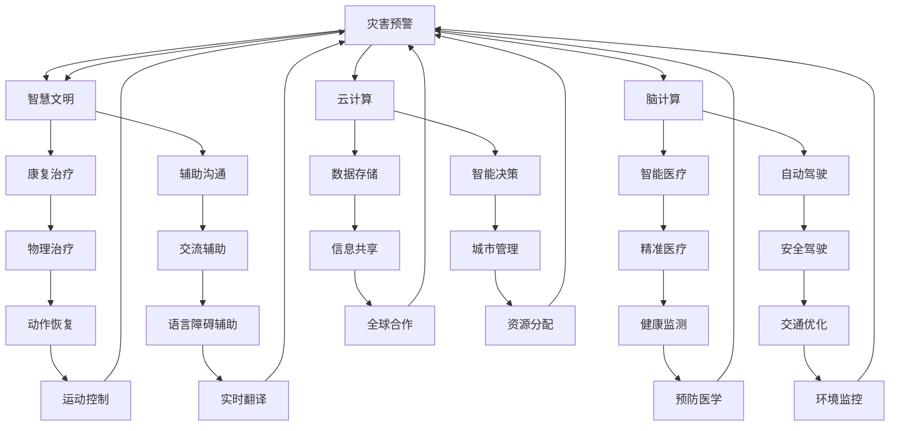

                 

### 全球脑与太空殖民：人类文明的新篇章

关键词：
- 全球脑
- 太空殖民
- 人类文明
- 脑科学
- 智能技术
- 太空探索

摘要：
本文探讨了全球脑与太空殖民这两大前沿科技如何共同塑造人类文明的新篇章。首先，我们回顾了人类文明发展的关键阶段，分析了全球化挑战、脑科学与智能技术的进步以及太空探索的迫切需求。接着，我们深入探讨了全球脑的概念、技术原理以及太空殖民的必要性和可行性。随后，文章详细介绍了全球脑技术原理、太空殖民的科学基础，并探讨了全球脑与太空殖民的融合技术。通过分析中国太空殖民计划和全球合作项目，我们展示了实际案例和未来展望。最后，我们探讨了全球脑与太空殖民对社会的影响以及面临的道德与伦理问题，为未来的人类文明发展提供了深刻的思考。

### 《全球脑与太空殖民：人类文明的新篇章》目录大纲

#### 第一部分：引论

1. 第一章：全球脑与太空殖民的背景和意义
    1.1 人类文明发展的关键阶段
    1.2 全球脑的概念与结构
    1.3 太空殖民的必要性与可行性

2. 第二章：全球脑技术原理
    2.1 脑科学基础
    2.2 脑机接口技术
    2.3 脑计算与云计算

3. 第三章：太空殖民的科学基础
    3.1 太空环境概述
    3.2 太空生命支持系统
    3.3 太空居住模块设计

#### 第二部分：技术实现

4. 第四章：全球脑与太空殖民的融合技术
    4.1 全球脑与太空通信
    4.2 脑控制太空机器人
    4.3 太空脑机交互平台

5. 第五章：太空殖民项目实例
    5.1 中国太空殖民计划
    5.2 国际太空殖民合作
    5.3 太空农业实验

#### 第三部分：社会影响与未来展望

6. 第六章：全球脑与太空殖民对社会的影响
    6.1 对科技产业的影响
    6.2 对人类生活方式的影响
    6.3 道德与伦理问题

7. 第七章：全球脑与太空殖民的未来展望
    7.1 全球脑与太空殖民的发展趋势
    7.2 全球脑与太空殖民的机遇与挑战

### 附录

8. 附录 A：全球脑与太空殖民相关技术发展现状
9. 附录 B：全球脑与太空殖民项目时间线
10. 附录 C：全球脑与太空殖民相关术语解释

### 引论

#### 第一章：全球脑与太空殖民的背景和意义

### 1.1 人类文明发展的关键阶段

人类文明的历史是一部不断探索与进步的历史。从原始社会到现代社会，人类经历了多次重大的技术革命和文明跃迁。回顾人类文明的发展，我们可以将其划分为若干关键阶段：

1. **狩猎采集时代**：人类最早的文明诞生在约1万年前的新石器时代，当时人类主要以狩猎和采集为生。这一阶段，人类开始建立起社会组织，形成了家庭、部落和社区。

2. **农业革命**：约在公元前8000年左右，人类开始驯化动植物，农业逐渐兴起。农业革命使人类从食物采集者转变为食物生产者，人口数量迅速增长，社会结构发生了根本变化。

3. **工业革命**：18世纪末至19世纪初，工业革命在欧洲兴起，人类进入了蒸汽时代。工业革命极大地提高了生产效率，推动了城市化进程，人类社会发生了翻天覆地的变化。

4. **信息革命**：20世纪末，随着计算机和互联网的普及，人类进入了信息化时代。信息革命带来了全球化和数字化，人类社会的交流方式、工作方式、生活方式都发生了深刻变革。

5. **人工智能时代**：21世纪初，人工智能（AI）技术的发展进入了快速轨道。人工智能不仅改变了传统的工业生产方式，还推动了智能交通、智能家居、智能医疗等领域的创新。

#### 1.2 全球化的挑战与机遇

全球化是当今世界的一个显著特征，它带来了巨大的挑战和机遇。一方面，全球化使得各国之间的经济、政治、文化联系更加紧密，为国际合作提供了更多机会。另一方面，全球化也带来了一系列挑战，如资源争夺、环境污染、文化冲突等。

1. **资源争夺**：全球化导致了全球资源的重新分配，各国为了获取更多的资源而展开了激烈的竞争。这种竞争有时会导致资源浪费和环境破坏。

2. **环境污染**：全球化加速了工业化和城市化进程，导致了严重的环境污染问题。气候变化、海洋污染、空气污染等问题已经成为全球性的挑战。

3. **文化冲突**：全球化使得不同文化之间的交流更加频繁，但也带来了一定的文化冲突。如何在保持文化多样性的同时，实现文化融合，是一个亟待解决的问题。

#### 1.3 脑科学与智能技术的进步

脑科学和智能技术的迅速发展，为人类文明的进步提供了新的动力。脑科学旨在揭示大脑的结构和功能，而智能技术则通过模拟人脑的思维方式，实现了人工智能的发展。

1. **脑科学**：脑科学的发展使我们逐渐揭示了大脑的奥秘。通过脑成像技术、脑电图技术等手段，我们能够更好地了解大脑的工作原理，为治疗神经系统疾病提供了新的思路。

2. **智能技术**：智能技术的发展，使得机器具备了越来越多的智能功能。从简单的计算到复杂的决策，智能技术正在改变人类的生活方式。例如，智能医疗、智能交通、智能家居等领域的应用，正在提高人类生活的质量。

#### 1.4 太空探索的迫切需求

太空探索一直是人类的一个梦想，而随着技术的进步，太空探索逐渐从梦想变成了现实。太空探索不仅具有重要的科学价值，也为人类提供了新的生存和发展空间。

1. **科学价值**：太空探索可以揭示宇宙的奥秘，帮助我们更好地了解地球和人类在宇宙中的地位。例如，通过探测火星，我们可以寻找生命的迹象，了解地球的形成和演化过程。

2. **生存和发展**：随着地球资源的日益稀缺，人类需要寻找新的资源和发展空间。太空殖民可以提供无限的资源，如水、金属等，同时也可以为人类提供新的栖息地，延长人类的生存时间。

### 全球脑的概念与结构

全球脑是一个由全球范围内的计算机和网络组成的巨大神经网络，它通过模拟人脑的思维方式，实现了信息的快速处理和智能化的决策。全球脑的概念最早由物理学家弗里曼·戴森提出，他在1960年代提出了全球脑的雏形。随着时间的推移，全球脑的概念逐渐得到了完善和发展。

#### 全球脑的定义

全球脑是一种分布式计算系统，它通过互联网将全球的计算机连接起来，形成一个庞大的神经网络。这个神经网络可以模拟人脑的思维方式，实现信息的快速处理和智能化的决策。全球脑的目标是利用全球范围内的计算资源，解决复杂的问题，提高人类的认知能力。

#### 全球脑的技术构成

全球脑的技术构成主要包括以下几个方面：

1. **计算机和网络**：全球脑的核心是计算机和网络。通过互联网，全球的计算机可以连接起来，形成一个庞大的计算网络。

2. **人工智能**：人工智能技术是全球脑的重要组成部分。通过人工智能，全球脑可以实现自动化决策，提高信息处理效率。

3. **神经网络**：神经网络是模拟人脑思维方式的一种技术。全球脑利用神经网络来实现信息的快速处理和智能化的决策。

4. **大数据**：大数据是全球脑的重要数据来源。通过收集和分析全球范围内的数据，全球脑可以更好地理解世界，做出更明智的决策。

#### 全球脑的作用与影响

全球脑的作用和影响非常广泛，它不仅改变了人类的认知方式，还对人类社会产生了深远的影响。

1. **改变认知方式**：全球脑的出现，使得人类可以更好地理解复杂的问题。通过全球脑，我们可以快速处理海量数据，发现新的规律和模式，从而改变我们对世界的认知。

2. **提高工作效率**：全球脑可以自动化处理复杂的任务，提高工作效率。例如，在医学领域，全球脑可以帮助医生快速诊断疾病，提高治疗效果。

3. **推动科技进步**：全球脑为科学家提供了一个强大的工具，可以帮助他们解决复杂的问题，推动科技进步。例如，在物理学领域，全球脑可以帮助科学家进行复杂的模拟实验，探索宇宙的奥秘。

4. **改变生活方式**：全球脑的应用，使得我们的生活方式发生了翻天覆地的变化。例如，智能交通系统可以优化交通流量，减少拥堵，提高出行效率；智能家居可以自动化处理家庭事务，提高生活质量。

### 1.5 太空殖民的历史背景

太空殖民的想法可以追溯到人类首次发射卫星的时代。1957年，苏联成功发射了世界上第一颗人造卫星“斯普特尼克1号”，标志着人类进入了太空时代。随后的几十年里，人类对太空的探索不断深入，从发射无人探测器到载人航天，再到建立国际空间站，太空探索取得了显著的成就。

#### 1.5.1 早期太空探索

1. **人造卫星**：1957年，苏联发射了“斯普特尼克1号”，成为第一个进入太空的人造卫星。这一事件激发了全球对太空探索的兴趣。

2. **载人航天**：1961年，苏联宇航员尤里·加加林成为了第一个进入太空的人类。随后，美国宇航员艾伦·谢泼德也在1961年乘坐“水星号”成功进入太空。

3. **月球探索**：1969年，美国宇航员尼尔·阿姆斯特朗和巴兹·奥尔德林乘坐“阿波罗11号”成功登上月球，实现了人类登月的壮举。

#### 1.5.2 国际空间站

1998年，国际空间站（ISS）的建造工作正式启动。它是由美国、俄罗斯、加拿大、日本和欧洲空间局等16个国家共同参与的一个国际项目。国际空间站成为人类在太空的永久栖息地，为科学实验和长期太空探索提供了重要平台。

#### 1.5.3 太空旅游

近年来，随着技术的进步和商业化的推动，太空旅游逐渐成为一个新兴产业。多家私营公司，如太空探索技术公司（SpaceX）、蓝色起源（Blue Origin）和维珍银河（Virgin Galactic）等，已经开始提供太空旅游服务，让普通人有机会体验太空旅行。

### 1.6 太空资源的利用前景

太空殖民的一个关键驱动力是对太空资源的利用。以下是一些主要的太空资源及其利用前景：

1. **水**：太空中的水冰资源尤其有价值。月球和火星的极地地区被发现含有大量的水冰。水不仅可以为人类和生物提供饮用和生存所需，还可以作为工业生产的重要原料。

2. **金属和矿物**：月球和火星含有丰富的金属和矿物资源，如铁、铝、钛等。这些资源可以为太空基地的建设和维护提供材料，同时也可能对地球的矿产资源供应产生影响。

3. **太阳能**：太空环境提供了几乎无限的太阳能资源。通过在太空设置太阳能发电站，可以收集并传输大量的能量到地球，为全球能源需求提供补充。

4. **太空制造**：在微重力环境中进行的太空制造具有独特优势。例如，药物晶体生长和材料加工可以在太空环境中进行，以获得更高纯度和质量的产品。

### 1.7 太空殖民的技术准备

太空殖民的实现需要一系列技术的准备和突破。以下是一些关键技术领域：

1. **生命支持系统**：为了在太空中长期生存，生命支持系统是必不可少的。这包括水资源循环利用、空气再生系统、食物供应等。

2. **居住模块**：太空居住模块需要能够提供安全的居住环境，包括压力容器、温度控制、辐射防护等。

3. **能源供应**：可靠和高效的能源供应系统对于太空殖民至关重要。太阳能、核能和燃料电池等技术都有可能用于太空能源供应。

4. **通信技术**：在太空中建立有效的通信系统，以确保地面与太空基地之间的实时联系，对于太空殖民至关重要。

5. **运输技术**：开发高效、可靠、经济的太空运输工具，如火箭和太空船，对于太空殖民的可持续发展和扩展至关重要。

### 总结

综上所述，全球脑与太空殖民这两大前沿科技代表了人类文明发展的新方向。全球脑通过模拟人脑的思维方式，提高了人类的认知能力和工作效率；而太空殖民则为人类提供了新的生存和发展空间。这两者共同推动了人类文明向前发展，为未来带来了无限可能。

### 全球脑技术原理

全球脑技术是人类文明向前迈进的重要支柱，它通过模拟人脑的思维方式，实现了信息的快速处理和智能化的决策。在这一部分，我们将深入探讨全球脑技术的基本原理、核心技术以及其与其他技术的融合。

#### 脑科学基础

脑科学是理解大脑功能及其工作机制的学科，它为我们揭示了大脑的结构和功能。以下是脑科学的一些基本概念：

1. **大脑的功能结构**：大脑由多个区域组成，每个区域都有特定的功能。例如，大脑皮层负责感知、思考和记忆，而基底神经节则与运动控制和情绪调节相关。

2. **神经网络的原理**：神经网络是大脑的基本计算单元，由神经元组成。神经元通过突触连接，形成复杂的网络结构。神经网络通过传递和加工信息，实现了大脑的各种功能。

3. **大脑的信息处理机制**：大脑的信息处理机制包括感知、记忆、思考、决策等。大脑通过电化学信号在神经元之间传递信息，实现了对输入信息的处理和响应。

#### 脑机接口技术

脑机接口（Brain-Machine Interface，BMI）是一种直接连接人脑和计算机的技术，它使得大脑可以直接控制外部设备或计算机程序。脑机接口技术的核心是大脑信号的采集、处理和解释。以下是脑机接口技术的关键组成部分：

1. **大脑信号的采集**：脑机接口通过脑电图（EEG）、功能性磁共振成像（fMRI）、脑磁图（MEG）等技术来采集大脑信号。这些技术可以无创或微创地捕捉大脑活动的电化学信号。

2. **大脑信号的处理**：采集到的大脑信号需要经过预处理，包括滤波、去噪和特征提取等步骤，以便于进一步分析和解释。

3. **大脑信号的解释**：通过机器学习和人工智能算法，可以解析大脑信号的含义，实现对外部设备或计算机程序的控制。

#### 脑机接口的应用场景

脑机接口技术在多个领域展示了其巨大的潜力，以下是一些典型的应用场景：

1. **康复治疗**：脑机接口可以帮助中风、脊髓损伤等患者恢复运动功能。例如，通过脑机接口控制外骨骼或假肢，帮助患者重新获得行动能力。

2. **辅助沟通**：脑机接口可以为语言障碍者提供沟通工具。通过解读大脑信号，脑机接口可以实时生成文字或语音，帮助患者表达自己的想法和情感。

3. **娱乐和游戏**：脑机接口技术也被广泛应用于娱乐和游戏领域。玩家可以通过大脑信号直接控制游戏中的角色或物体，实现更加沉浸的游戏体验。

#### 脑计算与云计算

脑计算（Brain-inspired Computing）是一种模仿大脑工作机制的计算方法，它利用神经网络和其他模拟大脑功能的技术，实现了高效的计算和数据处理。脑计算与云计算的结合，进一步提升了全球脑的能力。

1. **脑计算的原理**：脑计算通过模拟大脑的神经元和神经网络结构，实现了对信息的并行处理和自适应学习。脑计算的核心在于神经元之间的连接和信号传递方式，这些都与大脑的工作机制类似。

2. **云计算的融合**：云计算提供了庞大的计算资源和存储能力，与脑计算的结合，使得全球脑可以处理更加复杂的问题。云计算可以提供脑计算所需的计算资源，同时存储和传输大量数据。

3. **脑计算云计算的协同作用**：脑计算和云计算的协同作用，使得全球脑可以实现高效的信息处理和智能决策。脑计算负责处理和解析大脑信号，云计算则提供计算资源和存储支持，两者结合，实现了全球脑的强大能力。

#### 全球脑的架构与运作

全球脑的架构可以分为几个关键层次：

1. **感知层**：感知层负责接收外部信息，包括视觉、听觉、触觉等。通过脑机接口技术，感知层可以将外部信息转化为电信号，传递给处理层。

2. **处理层**：处理层负责处理和解析感知层传来的电信号，通过脑计算技术，实现信息的并行处理和自适应学习。

3. **决策层**：决策层根据处理层提供的信息，做出决策或执行特定的任务。决策层可以利用云计算提供的计算资源，实现复杂的决策过程。

4. **执行层**：执行层负责将决策层的决策转化为实际行动，通过脑机接口控制外部设备或计算机程序。

### 全球脑技术的应用案例

全球脑技术在多个领域已经取得了显著的成果，以下是一些应用案例：

1. **智能医疗**：全球脑技术可以辅助医生进行诊断和治疗。通过分析患者的医疗数据和生物信号，全球脑可以帮助医生做出更准确的诊断，提高治疗效果。

2. **自动驾驶**：全球脑技术可以为自动驾驶汽车提供实时感知、决策和执行支持。通过分析道路环境、车辆状态和交通规则，全球脑可以实现自动驾驶汽车的智能驾驶。

3. **智能城市**：全球脑技术可以用于智能城市的建设，通过实时感知和分析城市运行数据，实现交通管理、环境监测、公共安全等方面的优化。

### 全球脑技术的挑战与未来

尽管全球脑技术取得了显著的进展，但仍然面临许多挑战：

1. **技术瓶颈**：脑机接口的精度和稳定性仍有待提高，脑计算的性能和能效也需要进一步提升。

2. **伦理问题**：全球脑技术的应用可能引发一系列伦理问题，如隐私保护、人权、道德责任等。

3. **社会接受度**：全球脑技术的普及需要社会的广泛接受和支持，这需要通过教育和宣传来提高公众的认知和接受度。

未来，全球脑技术将继续发展，有望在人工智能、医疗、教育、环境等多个领域发挥重要作用，推动人类文明向更高层次迈进。

### 太空环境概述

太空环境是一个充满挑战且独特的环境，对生物体和人类生存提出了极高的要求。要实现太空殖民，我们必须深入了解太空环境的物理特性、生物环境以及太空辐射对生物的影响。

#### 3.1.1 太空物理特性

太空环境的主要物理特性包括真空、极端温度、微重力等。

1. **真空**：太空是近乎完美的真空环境，几乎没有空气和水分。这种真空状态会对生物体的生理功能产生重大影响，因为生物体依赖空气和水分维持生命活动。

2. **极端温度**：太空的温度变化极为剧烈，从极低的温度（如月球表面的温度可降至零下180摄氏度）到极高的温度（如太阳附近的温度可达到几千摄氏度）。这种极端的温度变化会对生物体的生存和活动产生严重影响。

3. **微重力**：太空中的微重力环境对生物体的影响也是显著的。微重力会减缓生物体的生长和发育，影响骨骼和肌肉的健康，并可能导致生理和心理问题。

#### 3.1.2 太空生物环境

太空生物环境的研究主要集中在生命能否在太空中存活和繁衍。以下是一些关键因素：

1. **氧气和二氧化碳**：在太空环境中，氧气和二氧化碳的浓度极低，这对呼吸系统的正常功能构成了挑战。为了维持生命，太空基地需要配备高效的生命支持系统，确保氧气供应和二氧化碳的回收。

2. **水分**：水分在生物体的生存中至关重要。太空环境中，水的获取和循环利用是关键问题。通过先进的生命支持技术，如水循环系统，可以有效解决水的问题。

3. **食物**：食物的供应和保鲜也是太空生物环境中的重要问题。在太空中，食物需要具备高营养、低重量和易储存的特点。科学家们正在研究开发和改进太空食品，以满足宇航员的需求。

#### 3.1.3 太空辐射对生物的影响

太空辐射是太空环境中另一个严重威胁生物体的因素。太空辐射主要包括太阳辐射、宇宙射线和行星磁场辐射等。

1. **太阳辐射**：太阳辐射会对生物体的细胞产生损害，可能导致基因突变和细胞死亡。为了减少太阳辐射的影响，太空基地需要配备有效的辐射屏蔽材料。

2. **宇宙射线**：宇宙射线是一种高能粒子流，对生物体的细胞也有很大的破坏作用。宇宙射线可以通过空气层进入太空基地，因此需要采取多层防护措施，如使用重金属和混凝土等材料。

3. **行星磁场辐射**：行星磁场辐射在地球上是生物体天然的保护屏障，但在太空中，这种辐射对生物体依然构成威胁。为了应对行星磁场辐射，太空基地需要配备高效的磁场屏蔽设备。

#### 太空环境对人类和生物的挑战

太空环境对人类和生物的挑战是多方面的，需要通过一系列技术和措施来解决。

1. **生命支持系统**：太空基地需要配备高效的生命支持系统，包括氧气供应、水循环利用和食物供应等。这些系统能够在封闭环境中维持生命的正常需求。

2. **辐射防护**：为了减少辐射对生物体的损害，太空基地需要配备多层防护措施，如辐射屏蔽材料和辐射监测系统。

3. **心理健康**：长时间的太空生活会对宇航员的心理健康产生负面影响，如孤独、焦虑和抑郁等。为了应对这些问题，太空基地需要提供心理支持和娱乐设施，帮助宇航员保持良好的心理状态。

4. **物理训练**：微重力环境会导致骨骼和肌肉退化，因此宇航员需要定期进行物理训练，以保持身体的健康。

### 总结

太空环境是一个复杂且严苛的环境，对人类和生物的生存提出了极高的要求。通过对太空物理特性、生物环境和辐射影响的深入了解，我们可以采取相应的技术和措施，为太空殖民提供基础保障。未来，随着技术的不断进步，太空殖民将逐渐成为现实，为人类文明的发展开辟新的道路。

#### 3.2 太空生命支持系统

太空生命支持系统（Life Support System，LSS）是确保宇航员在太空中能够长时间生存的关键技术。LSS包括多个关键组成部分，如水资源循环利用、空气再生系统和食物供应等。以下是对这些组成部分的详细分析。

##### 3.2.1 空间站的生命支持系统

空间站的生命支持系统是一个复杂的闭环系统，旨在维持舱内的生存环境，确保宇航员在太空中能够长时间工作生活。以下是一些关键组成部分：

1. **空气再生系统**：空间站的空气再生系统负责净化和再生舱内的空气，去除二氧化碳和有害气体，同时供应新鲜的氧气。这个系统通常包括吸附剂、过滤器、化学再生装置等。

   - **吸附剂**：吸附剂如活性炭和分子筛可以吸附空气中的有害气体，如二氧化碳和挥发性有机化合物（VOCs）。
   - **过滤器**：高效过滤器可以去除空气中的颗粒物和微生物。
   - **化学再生装置**：化学再生装置通过化学反应将二氧化碳转化为氧气，例如通过碳酸钙和氢氧化钠的反应来再生氧气。

2. **水循环利用系统**：空间站的水资源循环利用系统负责回收、净化和再利用生活用水和废水。这个系统包括多个步骤，如水的收集、过滤、消毒和储存。

   - **水收集**：在空间站内部，尿液收集装置和汗水收集装置可以收集宇航员的生活用水。
   - **过滤和消毒**：通过过滤和消毒步骤，去除水中的杂质和微生物，确保水的质量和安全性。
   - **再利用**：处理后的水可以用于饮用、食物烹饪和设备冷却等。

3. **食物供应**：太空食物供应需要考虑高营养、低重量和易储存的特点。目前，空间站的食品主要包括即食食品、冷冻干燥食品和复水食品。

   - **即食食品**：即食食品如太空三明治、太空饼干等，无需加热或复水，可以直接食用。
   - **冷冻干燥食品**：冷冻干燥食品通过冷冻和真空干燥去除水分，重量轻，储存时间长，复水后可以恢复原状。
   - **复水食品**：复水食品如袋装米饭、肉类等，通过注入水分恢复到可食用状态。

##### 3.2.2 水资源循环利用

水资源循环利用是太空生命支持系统的核心部分，因为它直接关系到宇航员在太空中的生存时间。以下是一些关键技术：

1. **废水处理**：太空基地需要将宇航员产生的废水进行处理，去除污染物，使其达到可再利用的标准。常见的废水处理技术包括过滤、消毒和化学处理。

   - **过滤**：通过物理过滤去除水中的固体杂质。
   - **消毒**：使用紫外线、臭氧或化学消毒剂杀灭水中的微生物。
   - **化学处理**：通过添加化学试剂，如氢氧化钠和氢氧化钾，调整水的pH值，去除水中的酸碱物质。

2. **水分回收**：处理后的废水需要通过水分回收技术重新提取纯净水。常见的回收技术包括蒸馏、逆渗透和电渗析。

   - **蒸馏**：通过加热将水蒸发，然后冷凝成纯净水。
   - **逆渗透**：通过半透膜，使水中的溶质被截留，纯净水通过膜流出。
   - **电渗析**：利用电场，使带电离子通过半透膜，从而实现水的净化。

3. **水再生**：经过废水处理和水分回收后的水，还需要通过水再生技术进行净化，去除残余的污染物和有害物质。

   - **活性炭吸附**：活性炭可以吸附水中的有机物和余氯等有害物质。
   - **离子交换**：通过离子交换树脂，去除水中的金属离子和有机物。
   - **紫外线消毒**：利用紫外线杀菌，确保水的微生物安全。

##### 3.2.3 太空食物供应

太空食物供应的关键是确保宇航员在太空中获得充足的营养，同时减轻重量和储存空间的需求。以下是一些关键技术：

1. **营养配方**：太空食物的营养配方需要考虑宇航员在太空中特殊的环境和代谢需求。食物中需要包含足够的蛋白质、维生素、矿物质等营养成分。

2. **轻量化**：太空食物需要轻量化，以减少运输和储存的负担。通过真空包装、冷冻干燥等技术，可以显著减少食物的重量。

3. **长保质期**：太空食物的保质期需要延长，以确保宇航员在太空中的长时间供应。通过冷冻保存、真空包装和防腐剂等技术，可以延长食物的保质期。

4. **复水技术**：冷冻干燥食品和复水食品可以在太空中迅速恢复到可食用状态，提供即时的食物供应。

##### 3.2.4 太空生命支持系统的挑战与解决方案

太空生命支持系统在设计和实施过程中面临诸多挑战，以下是一些关键挑战和相应的解决方案：

1. **系统可靠性**：太空生命支持系统需要在极端环境下长时间稳定运行，确保宇航员的安全和健康。为了提高系统的可靠性，需要采用冗余设计、实时监控和故障检测等技术。

2. **资源效率**：太空资源有限，因此太空生命支持系统需要高效利用资源，如水、空气和能源。通过采用先进的循环利用技术和能源回收系统，可以提高资源效率。

3. **自主性和可持续性**：为了应对可能发生的紧急情况，太空生命支持系统需要具备一定的自主性和可持续性。通过智能化和自动化技术，可以提高系统的自主性，减少对地面支持的依赖。

4. **心理因素**：太空生活对宇航员的心理健康有较大影响。因此，太空生命支持系统需要提供心理支持设施，如娱乐设备和心理咨询服务，帮助宇航员保持良好的心理状态。

##### 总结

太空生命支持系统是确保宇航员在太空中长期生存的关键技术。通过水资源循环利用、空气再生系统和食物供应等技术的结合，太空生命支持系统可以为宇航员提供一个安全、舒适的生活环境。未来，随着技术的不断进步，太空生命支持系统将更加高效、可靠和可持续，为太空探索和太空殖民提供坚实保障。

#### 3.3 太空居住模块设计

太空居住模块的设计是太空殖民中的关键一环，它需要考虑到太空环境的特殊性、宇航员的生活需求以及模块的长期运行稳定性。以下是对太空居住模块的结构、功能以及设计和实施过程中的挑战与解决方案的详细探讨。

##### 3.3.1 太空居住模块的结构

太空居住模块主要由以下几个部分组成：

1. **外部结构**：外部结构需要能够承受太空环境中的极端温度变化、微重力和太空辐射等。通常采用高强度复合材料，如碳纤维增强塑料，以及多层防护材料，如隔热材料和辐射屏蔽材料。

2. **内部空间**：内部空间包括生活区、工作区、休息区等，需要根据宇航员的需求进行合理布局。内部空间的设计要考虑到空间利用效率、舒适性以及安全因素。

3. **压力容器**：太空居住模块通常采用压力容器设计，以确保内部环境与外部真空环境隔离，维持一个适合人类生活的压力和温度。

4. **生命支持系统接口**：太空居住模块与生命支持系统紧密连接，包括空气供应、水循环利用和废物处理等接口，以确保宇航员的基本生活需求得到满足。

##### 3.3.2 太空居住模块的功能

太空居住模块需要具备以下核心功能：

1. **生存保障**：确保宇航员在太空中能够获得足够的氧气、水和食物，以及维持适宜的温度和压力。

2. **工作支持**：提供足够的空间和设备，支持宇航员进行科学实验、技术维护和其他工作。

3. **心理支持**：提供娱乐设施和心理咨询服务，帮助宇航员缓解太空生活的压力和孤独感。

4. **能源供应**：通过太阳能板、核能或其他能源技术，为太空居住模块提供稳定的电力供应。

##### 3.3.3 太空居住模块的设计与实施

1. **模块化设计**：模块化设计是太空居住模块的一个重要特点，它使得模块可以快速组装和拆卸，便于维护和升级。每个模块可以独立运行，同时多个模块可以组合成一个完整的居住系统。

2. **自动化与智能化**：为了提高太空居住模块的运行效率和安全性，设计过程中需要考虑自动化和智能化技术。例如，使用智能传感器监控系统状态，实现自动报警和故障诊断。

3. **可重用性**：考虑到成本效益和可持续性，太空居住模块的设计应考虑可重用性。通过重复使用模块，可以降低太空探索和殖民的成本。

##### 3.3.4 挑战与解决方案

1. **材料选择**：太空环境对材料的耐久性和性能要求极高。选择合适的材料是一个关键挑战，需要考虑到抗辐射、抗热震、抗腐蚀等性能。

   - **解决方案**：采用先进的复合材料，如碳纤维增强塑料，以及多层防护材料，以提高模块的耐久性和环境适应性。

2. **能源效率**：太空居住模块需要高效利用能源，以确保长期的稳定运行。

   - **解决方案**：采用太阳能板、核能等可再生能源技术，以及能源管理系统能够优化能源使用，提高能源效率。

3. **空间利用**：在有限的空间内，实现高效的空间利用是设计中的一个重要挑战。

   - **解决方案**：通过模块化设计，优化内部布局，以及使用可折叠和可移动的设备，实现空间的最大化利用。

4. **心理健康**：长时间的太空生活对宇航员的心理健康有较大影响。

   - **解决方案**：设计过程中要考虑提供娱乐设施和心理咨询服务，建立社交和交流平台，帮助宇航员缓解压力和孤独感。

##### 总结

太空居住模块的设计与实施是太空殖民的重要一环，它需要综合考虑太空环境的特殊性、宇航员的生活需求以及技术的可行性。通过模块化设计、自动化与智能化技术，以及高效的能源利用，太空居住模块可以为宇航员提供一个安全、舒适和高效的生活环境。未来，随着技术的不断进步，太空居住模块将更加完善，为人类在太空的长期居住提供坚实保障。

### 全球脑与太空殖民的融合技术

随着全球脑技术和太空技术的不断发展，将这两大前沿科技进行融合已成为可能，这种融合不仅能够提升太空探索的效率，还能为人类在太空中的长期生存提供支持。以下将探讨全球脑与太空殖民的融合技术，包括全球脑与太空通信、脑控制太空机器人以及太空脑机交互平台。

#### 4.1 全球脑与太空通信

太空通信是确保地面与太空基地之间实时联系和信息交换的关键。全球脑与太空通信的融合，使得信息传输更加高效、稳定和智能化。

1. **通信技术在太空的应用**：
   - **卫星通信**：利用地球同步卫星或低地球轨道卫星，实现太空基地与地面站之间的通信。卫星通信具有覆盖范围广、传输距离远的特点。
   - **深空通信**：对于远离地球的深空探测任务，利用深空网络（Deep Space Network，DSN）进行通信。DSN由多个地面天线站组成，能够提供稳定的通信链路。
   - **量子通信**：利用量子纠缠和量子密钥分发技术，实现超长距离的保密通信。量子通信具有极高的安全性和抗干扰能力。

2. **全球脑通信的架构**：
   - **分布式计算架构**：全球脑通过分布式计算架构，将地面站、卫星和太空基地的通信网络连接起来，形成一个庞大的通信网络。
   - **边缘计算**：在全球脑通信架构中，边缘计算节点分布在地面站和太空基地，能够实时处理和传输数据，提高通信的效率和响应速度。

3. **通信技术在脑机接口中的应用**：
   - **远程脑机接口**：通过全球脑与太空通信，实现地面与太空基地之间的脑机接口数据传输。远程脑机接口可以让地面科学家实时监控和指导太空任务，提高任务的执行效率。
   - **实时数据传输**：利用高速通信技术，实现脑机接口数据的实时传输，确保宇航员能够迅速响应环境变化和执行任务。

#### 4.2 脑控制太空机器人

脑控制太空机器人（Brain-controlled Robot）是一种通过脑机接口技术实现的，由宇航员大脑直接控制的机器人。这种技术的融合，使得宇航员在太空中能够更加灵活和高效地执行任务。

1. **脑控制机器人的原理**：
   - **脑机接口**：通过脑机接口技术，将宇航员的大脑信号转化为控制信号，传递给机器人。
   - **神经网络算法**：利用神经网络算法，对宇航员的大脑信号进行解析和分类，实现机器人动作的精准控制。

2. **脑控制机器人的实现方法**：
   - **直接控制**：宇航员通过大脑直接控制机器人，实现精细的动作控制。这种方法需要高精度的脑机接口和实时数据传输支持。
   - **辅助控制**：宇航员通过大脑信号辅助控制机器人，例如通过意图信号控制机器人的启动和停止。这种方法适用于需要高度协调和控制的任务。

3. **脑控制机器人的应用案例**：
   - **太空维修**：宇航员可以通过脑控制机器人进行太空站的外部维修任务，提高维修效率和安全性。
   - **探测任务**：在火星或其他行星探测任务中，脑控制机器人可以协助宇航员进行复杂的探测和采样任务。

#### 4.3 太空脑机交互平台

太空脑机交互平台是一个集成了脑机接口技术和太空通信技术的综合系统，它为宇航员和地面科学家提供了一个互动和协作的平台。

1. **太空脑机交互平台的架构**：
   - **核心系统**：包括脑机接口设备、数据处理单元和通信接口，负责采集和处理宇航员的大脑信号，并将其传输到地面。
   - **辅助系统**：包括虚拟现实（VR）设备、增强现实（AR）设备和人工智能（AI）系统，用于提供交互和反馈。

2. **太空脑机交互的关键技术**：
   - **高精度脑机接口**：通过高精度的脑机接口设备，实现大脑信号的高效采集和传输。
   - **实时数据处理**：利用实时数据处理技术，对采集到的大脑信号进行快速分析和处理，以实现实时交互。
   - **人工智能算法**：通过人工智能算法，对大脑信号进行模式识别和分类，提高交互的精度和效率。

3. **太空脑机交互的挑战与解决方案**：
   - **延迟问题**：太空通信存在一定的延迟，这对实时交互提出了挑战。通过优化通信协议和算法，可以减少延迟，提高交互的实时性。
   - **信号噪声比**：太空环境中的噪声较大，这对大脑信号的采集和处理提出了挑战。通过信号处理技术和噪声抑制算法，可以提高信号的清晰度和可靠性。

#### 4.4 全球脑与太空殖民的融合优势

1. **提高任务效率**：通过全球脑与太空通信技术的融合，可以实现地面与太空基地之间的实时通信和数据交换，提高太空任务的操作效率和安全性。

2. **增强宇航员能力**：通过脑控制太空机器人技术，宇航员可以在太空中实现更加精细和灵活的任务操作，增强其在复杂环境中的生存能力。

3. **实时监控与指导**：通过太空脑机交互平台，地面科学家可以实时监控和指导宇航员的任务执行，提供专业的支持和建议。

4. **降低运营成本**：通过全球脑技术的应用，可以优化太空资源的利用和管理，降低太空探索和殖民的运营成本。

#### 4.5 总结

全球脑与太空殖民的融合技术为人类在太空的探索和生存提供了新的解决方案。通过全球脑与太空通信、脑控制太空机器人和太空脑机交互平台，我们可以实现更加高效、智能和安全的太空任务。未来，随着技术的不断进步，全球脑与太空殖民的融合将推动人类文明向更深的太空迈进。

### 中国太空殖民计划

中国太空殖民计划是中国政府制定的长期太空探索和殖民战略，旨在通过一系列关键技术突破和项目实施，实现人类在太空的长期生存和可持续发展。以下是中国太空殖民计划的总体思路、技术路线和阶段性目标。

#### 5.1.1 总体思路

中国太空殖民计划的总体思路可以概括为“三步走”战略：

1. **建立太空基础设施**：首先，通过发射卫星、建立空间站和开发月球基地，建立稳定可靠的太空基础设施，为后续的太空殖民提供技术支持和后勤保障。

2. **实现月球和火星探测**：在建立太空基础设施的基础上，实施月球和火星探测任务，探索这两个行星的资源和环境条件，为太空殖民做准备。

3. **建立太空殖民地**：在积累足够的经验和资源后，逐步在月球和火星上建立永久性太空殖民地，实现人类的长期太空生存和可持续发展。

#### 5.1.2 技术路线

中国太空殖民计划的技术路线主要包括以下几个方面：

1. **运载火箭技术**：通过自主研发和引进，不断提升运载火箭的性能和可靠性，为卫星发射、空间站建设和月球、火星探测任务提供强大推力。

2. **空间站技术**：研发和建设大型空间站，为太空科研、技术试验和长期驻留提供基地。空间站的设计要考虑模块化、可扩展性和自主性，以适应未来的发展需求。

3. **生命支持系统**：研发高效的水资源循环利用、空气再生系统和食物供应系统，确保宇航员在太空中的生存需求。同时，要解决长期驻留带来的生理和心理问题。

4. **月球和火星探测技术**：研发和实施月球和火星探测任务，了解这两个行星的环境条件、资源分布和潜在风险，为未来的太空殖民提供数据支持。

5. **深空探测技术**：通过深空探测技术，实现月球和火星的无人和载人探测，为太空殖民提供技术和物资支持。

#### 5.1.3 阶段性目标

中国太空殖民计划的阶段性目标可以分为以下几个阶段：

1. **2020年**：发射嫦娥五号探测器，实现月球样本返回，为月球探测和开发提供重要数据。

2. **2022年**：发射天和核心舱，建设空间站T阶段，为长期太空驻留和科研提供基础。

3. **2024年**：发射嫦娥六号探测器，开展月球极地区域探测，为月球基地建设提供支持。

4. **2029年**：发射嫦娥七号探测器，实现对火星的环绕探测，为火星探测和开发提供数据。

5. **2030年**：发射载人火星探测器，实现人类首次火星着陆和巡视，为未来的火星殖民奠定基础。

6. **2035年**：建立月球基地，实现月球资源的开发和利用，为太空殖民提供物质保障。

7. **2040年**：建立火星基地，实现人类在火星的长期生存和可持续发展，为地球之外的文明拓展打下坚实基础。

#### 5.1.4 中国太空殖民计划的优势与挑战

**优势**：

1. **国家战略支持**：中国太空殖民计划得到了国家战略的全面支持，具有强大的政策优势和资源保障。

2. **技术积累**：中国已经成功实施了多次月球和火星探测任务，积累了丰富的技术经验和数据，为太空殖民提供了坚实基础。

3. **国际合作**：中国积极参与国际太空探索合作，与国际空间站合作，拓展了国际合作空间。

**挑战**：

1. **技术瓶颈**：尽管中国在航天技术方面取得了一定进展，但仍面临一些技术瓶颈，如高精度脑机接口、长期生命支持系统等。

2. **资金和人力资源**：太空殖民需要大量的资金和人力资源投入，这对国家的财政能力和人力资源管理提出了挑战。

3. **国际竞争**：国际太空竞争日益激烈，中国需要在技术、成本和国际合作等方面保持竞争力。

### 总结

中国太空殖民计划是中国航天事业的重要战略目标，通过一系列关键技术突破和项目实施，中国有望在未来实现月球和火星的探测与开发，建立永久性太空殖民地。尽管面临诸多挑战，但中国在太空探索和殖民领域展现出强大的决心和实力，为人类文明的发展开辟了新的道路。

### 国际太空殖民合作

国际太空殖民合作是推动太空探索和殖民进程的关键因素。在全球化和技术进步的背景下，各国通过合作共享资源和经验，共同应对太空挑战，实现太空殖民的目标。以下将探讨国际太空殖民合作的重要性、合作模式以及面临的挑战与展望。

#### 5.2.1 国际合作的重要性

国际太空殖民合作的重要性体现在以下几个方面：

1. **资源共享**：太空探索和殖民需要大量的资金、技术和人力资源。通过国际合作，各国可以共享资源和设施，降低成本，提高效率。例如，国际空间站的建立和运营就是一个典型的国际合作案例，多个国家共同参与，共享科研成果和实验机会。

2. **技术互补**：不同国家在航天技术领域具有各自的优势和特长。通过国际合作，各国可以互相学习和借鉴，实现技术互补和共同进步。例如，美国在火箭发动机技术方面具有领先优势，而欧洲在卫星通信和导航技术方面有丰富的经验。

3. **风险分担**：太空探索和殖民是一项高风险、高投入的活动。通过国际合作，各国可以共同承担风险，降低单个国家的投资压力。例如，火星探测任务需要巨额资金和长时间的准备，通过国际合作，可以分散风险，提高成功的机会。

#### 5.2.2 国际太空殖民的合作模式

国际太空殖民合作模式可以分为以下几种：

1. **多国联合开发**：多个国家共同出资、出力，联合开发太空殖民地。这种模式适用于大规模、长期的任务，如月球和火星基地的建设。例如，国际空间站的建设和运营就是多国联合开发的典范。

2. **国际机构主导**：由国际机构如国际宇航联合会（IAF）、国际空间站组织（ISSO）等主导，协调各国资源，制定共同目标和行动计划。这种模式具有权威性和协调性，能够高效推进国际合作。

3. **商业合作**：商业公司和政府机构之间的合作，通过商业投资和技术支持，推动太空探索和殖民。这种模式可以充分发挥市场机制的作用，提高资源利用效率。例如，SpaceX、蓝色起源等私营航天公司已经开展了一系列商业太空探索项目。

4. **科研机构合作**：各国科研机构通过联合研究、数据共享和成果转化，推动太空技术进步和科学研究。这种模式有助于提高科研效率，促进技术突破。

#### 5.2.3 国际太空殖民的挑战与展望

尽管国际太空殖民合作具有诸多优势，但仍然面临一系列挑战：

1. **政治和外交挑战**：太空探索和殖民需要各国在政治和外交上达成共识，这往往是一个复杂的过程。各国之间的利益冲突、安全考虑和政策差异可能会影响合作的顺利推进。

2. **技术和资源瓶颈**：太空探索和殖民需要先进的技术和大量的资源。尽管国际合作可以在一定程度上解决这些问题，但仍需要各国不断加大研发投入，提升技术能力。

3. **伦理和道德问题**：太空探索和殖民涉及一系列伦理和道德问题，如太空殖民对地球环境的影响、太空资源的分配等。国际社会需要制定相应的伦理规范，确保太空活动的可持续性。

4. **社会和公众接受度**：太空探索和殖民需要公众的支持和理解。各国需要加强科普宣传，提高公众对太空探索和殖民的认识和接受度。

#### 5.2.4 展望

未来，随着全球科技的发展和各国合作的深化，国际太空殖民将面临新的机遇和挑战：

1. **科技进步**：随着人工智能、量子通信、生命科学等技术的不断突破，太空探索和殖民的能力将大幅提升。国际合作将发挥重要作用，推动技术进步和资源共享。

2. **商业投资**：商业航天公司的发展将带来更多的投资和商业机会，推动太空殖民的商业化和市场化。

3. **全球治理**：国际社会需要制定更加完善的太空治理框架，确保太空活动的规范化和可持续性。

4. **人类文明的新篇章**：随着太空探索和殖民的推进，人类将开拓新的生存空间，实现文明的拓展和进步。

### 总结

国际太空殖民合作是推动太空探索和殖民进程的重要力量。通过资源共享、技术互补和风险分担，国际合作能够提高太空探索和殖民的效率和质量。未来，随着全球科技的发展和各国合作的深化，国际太空殖民将迎来新的机遇和挑战，为人类文明的发展开辟新的篇章。

### 太空农业实验

太空农业实验是探索太空环境中植物生长和农业生产可行性的一项重要研究。太空农业不仅能够为宇航员提供新鲜的食物，还可以为未来的太空殖民地提供稳定的食物来源。以下将介绍太空农业的意义、实验项目和取得的成果与未来。

#### 5.3.1 太空农业的意义

太空农业具有重要的科学和实用价值：

1. **食物供应**：太空农业可以解决宇航员在太空长期任务中的食物供应问题。在太空环境中，新鲜食物的供应受到很大的限制，而太空农业可以提供一种可靠的解决方案。

2. **生物研究**：太空农业为科学家提供了一个独特的实验平台，可以研究植物在极端环境下的生长机制、遗传变异和适应策略，为地球上的农业生产提供新思路。

3. **技术验证**：太空农业实验可以验证和改进地球上的农业生产技术，如自动化控制、环境调控和水资源管理，为未来更高效、可持续的农业生产奠定基础。

#### 5.3.2 太空农业的实验项目

太空农业的实验项目主要包括以下几个方面：

1. **植物生长实验**：科学家们在太空中种植了多种植物，如生菜、番茄、小麦等，以研究它们在微重力、辐射和低氧环境下的生长情况。

2. **环境调控实验**：通过在太空舱内创建模拟地球环境的小气候系统，科学家们研究如何调节温度、湿度、光照和营养供应，以促进植物生长。

3. **生物反应器实验**：利用太空环境独特的生物反应器，研究植物在极端条件下的生理和生化过程，以及植物基因表达的变化。

4. **微生物实验**：在太空环境中，微生物的生长和代谢行为也与地球上不同。通过微生物实验，科学家们研究太空环境对微生物的影响，以及如何利用微生物进行环境控制和废物处理。

#### 5.3.3 太空农业的成果与未来

太空农业实验取得了多项重要成果：

1. **植物生长成功**：科学家们在太空环境中成功种植了多种植物，证明了在太空条件下植物生长的可能性。这些实验为未来在太空建立永久农业基地奠定了基础。

2. **环境调控技术**：通过太空农业实验，科学家们开发了多种环境调控技术，如植物生长灯、营养液循环系统等，为太空农业提供了有效的支持。

3. **生物反应器应用**：太空农业实验验证了生物反应器的有效性，为未来在太空中进行更复杂的生物实验提供了可能性。

未来，太空农业的发展前景十分广阔：

1. **多作物种植**：随着技术的进步，太空农业将能够在更广泛的作物种类上进行实验，为长期太空任务提供多样化的食物来源。

2. **自动化与智能化**：自动化和智能化技术的应用将使太空农业更加高效和可持续。例如，通过无人机和机器人进行植物种植和收获，减少人力需求。

3. **空间站与月球基地**：随着空间站和月球基地的建设，太空农业将逐步从实验阶段走向实际应用，为长期太空任务和太空殖民地提供稳定的食物供应。

4. **生物制造**：太空农业还可以用于生物制造，如生产医药、生物燃料和工业化学品，为太空经济提供新的增长点。

#### 总结

太空农业实验不仅为宇航员提供了新鲜的食物，还为生物科学和农业生产带来了新的突破。随着技术的不断进步，太空农业将在未来发挥越来越重要的作用，为人类在太空的长期生存和可持续发展提供支持。通过国际合作和持续研究，太空农业有望成为人类文明新篇章的重要组成部分。

### 全球脑与太空殖民对社会的影响

全球脑与太空殖民不仅代表着科技发展的前沿，也对人类社会产生了深远的影响。这些技术进步在改变科技产业、人类生活方式以及引发道德与伦理问题方面扮演着重要角色。

#### 6.1 对科技产业的影响

全球脑与太空殖民技术为科技产业带来了前所未有的机遇和挑战：

1. **技术创新**：全球脑技术推动了人工智能、脑机接口、云计算等领域的快速发展，为科技产业提供了新的工具和方法。例如，脑机接口技术可以用于康复治疗和辅助沟通，为科技产业开辟了新的应用场景。

2. **产业链整合**：全球脑与太空殖民技术需要多个领域的协同合作，如脑科学、信息技术、航天工程等。这种跨学科的合作促进了产业链的整合，推动了科技产业的升级和转型。

3. **新兴市场**：太空殖民的推进将带动一系列新兴市场的形成，如太空旅游、太空农业、太空制造等。这些市场为科技企业提供了新的商业机会，激发了创新活力。

4. **就业机会**：随着全球脑与太空殖民技术的发展，相关行业将创造大量就业机会，从科研人员到技术工程师，再到运营和管理人员，都需要专业的知识和技能。

#### 6.2 对人类生活方式的影响

全球脑与太空殖民技术对人类生活方式产生了深刻影响：

1. **生活方式改变**：脑机接口技术可以帮助残疾人恢复运动功能，改善他们的生活质量。同时，太空殖民为人类提供了新的居住地，改变了人类的居住模式。

2. **工作模式**：随着远程控制和虚拟现实技术的发展，人们可以在任何地点进行工作，打破了传统的工作地点限制，提高了工作效率。

3. **娱乐体验**：脑控制游戏和虚拟现实技术为人类提供了全新的娱乐体验。通过脑机接口，人们可以更加直观地与虚拟世界互动，享受沉浸式的娱乐体验。

4. **心理健康**：太空生活对宇航员的心理健康提出了挑战。然而，通过心理支持和虚拟现实技术，宇航员可以获得心理安慰和娱乐，缓解孤独和焦虑。

#### 6.3 道德与伦理问题

全球脑与太空殖民技术引发了诸多道德与伦理问题，需要全社会共同关注和解决：

1. **隐私保护**：脑机接口技术可能侵犯个人的隐私权，尤其是在医疗和军事领域。如何确保个人隐私不被滥用，是一个亟待解决的问题。

2. **人工智能伦理**：人工智能在太空殖民和全球脑中的应用，需要制定相应的伦理规范，确保人工智能系统的行为符合道德标准，防止机器对人类造成伤害。

3. **太空殖民的伦理挑战**：太空殖民涉及到资源分配、环境污染、人类权利等问题。如何确保太空资源的公平利用，避免太空环境遭受破坏，是太空殖民面临的重大伦理挑战。

4. **全球治理**：全球脑与太空殖民技术的发展需要国际社会的共同治理。如何制定全球性的伦理规范和法律法规，确保各国在太空探索和殖民过程中的合法权益，是一个需要深入探讨的问题。

#### 6.4 应对策略

为了应对全球脑与太空殖民技术带来的社会影响，我们可以采取以下策略：

1. **加强立法和监管**：政府应加强立法和监管，制定相应的法律法规，确保全球脑与太空殖民技术的应用符合伦理和道德标准。

2. **提高公众意识**：通过教育和宣传，提高公众对全球脑与太空殖民技术的认识和了解，增强公众的参与感和责任感。

3. **加强国际合作**：国际社会应加强合作，共同制定全球性的伦理规范和法律法规，确保全球脑与太空殖民技术的健康发展。

4. **科技创新**：鼓励科技创新，开发更加安全、可靠的技术，提高全球脑与太空殖民技术的应用效果，同时降低社会成本。

### 总结

全球脑与太空殖民技术不仅推动了科技发展，改变了人类生活方式，还引发了诸多道德与伦理问题。面对这些挑战，全社会需要共同努力，通过加强立法、提高公众意识和加强国际合作，确保全球脑与太空殖民技术的健康发展，为人类社会的进步提供新的动力。

### 全球脑与太空殖民的未来展望

全球脑与太空殖民技术代表了人类文明发展的新方向，它们在科技进步、国际合作以及人类文明演进方面有着深远的影响。在未来，随着这些技术的不断成熟和普及，我们有望看到一系列令人振奋的发展趋势和机遇。

#### 7.1 全球脑与太空殖民的发展趋势

1. **全球脑技术的普及**：随着脑机接口技术、脑计算和云计算等核心技术的不断进步，全球脑将在医疗、教育、工业等多个领域得到广泛应用。未来，全球脑将成为推动科技进步和社会发展的强大引擎。

2. **太空殖民的逐步实现**：随着航天技术的不断突破，人类将在月球和火星等行星上建立永久性基地，逐步实现太空殖民。这将极大地扩展人类的生存空间，为未来文明的持续发展提供新的机遇。

3. **融合技术的发展**：全球脑与太空殖民技术的融合将带来新的技术突破。例如，通过全球脑与太空通信技术的结合，可以实现地面与太空基地之间的实时互动和数据交换；通过脑控制太空机器人技术，宇航员可以在太空中实现更加高效和灵活的任务执行。

4. **人工智能的深入应用**：人工智能技术将在全球脑和太空殖民中发挥关键作用。未来，人工智能将帮助解决太空探索中的复杂问题，如资源管理、环境调控和任务规划，提高太空探索的效率和可持续性。

#### 7.2 国际合作的深化

国际合作在全球脑与太空殖民发展中具有至关重要的地位。未来，国际合作将呈现出以下趋势：

1. **多边合作**：国际社会将加强多边合作，共同推进全球脑与太空殖民技术的发展。例如，通过建立全球脑研究与开发联盟，各国可以共享研究成果和技术资源，推动全球脑技术的快速进步。

2. **商业合作**：随着全球脑与太空殖民技术的商业化进程，商业公司将扮演越来越重要的角色。未来，商业公司将通过国际合作，开展太空旅游、太空农业和太空制造等商业项目，推动太空殖民的商业化发展。

3. **科研合作**：国际科研机构将加强合作，共同开展全球脑与太空殖民相关的研究项目。通过跨国合作，各国可以共享科研资源，提高科研效率，推动技术的突破和创新。

4. **国际法规**：国际社会将制定更加完善和统一的太空法规，确保全球脑与太空殖民技术的健康发展。这些法规将涵盖太空资源利用、环境保护、人类权利等方面，为国际合作提供法律保障。

#### 7.3 人类文明演进的思考

全球脑与太空殖民技术为人类文明的演进提供了新的机遇和挑战。以下是对未来人类文明演进的一些思考：

1. **智慧文明的崛起**：随着全球脑技术的普及，人类将进入一个智慧文明的新时代。智慧文明将以智能技术为核心，通过高效的决策和信息处理能力，推动社会的发展和进步。

2. **生存空间的拓展**：太空殖民将拓展人类的生存空间，为人类提供更多的资源和生存机会。未来，人类将在地球和太空之间建立紧密的联系，实现地球和太空的协同发展。

3. **文化融合与冲突**：太空殖民将带来不同文化之间的深度融合和冲突。如何在保持文化多样性的同时，实现全球文化的融合，将是一个重要的课题。

4. **伦理与道德的挑战**：全球脑与太空殖民技术引发的伦理和道德问题，如隐私保护、人工智能伦理、太空资源的公平分配等，将成为未来人类文明发展的关键挑战。

#### 7.4 机遇与挑战

全球脑与太空殖民技术为人类带来了前所未有的机遇，同时也伴随着一系列挑战：

1. **机遇**：
   - **科技进步**：全球脑与太空殖民技术将推动科技的快速进步，带来新的发展机遇。
   - **资源扩展**：太空殖民将拓展人类对资源的获取能力，为经济发展提供新的动力。
   - **社会进步**：全球脑技术将提高人类的认知能力，推动社会的发展和进步。

2. **挑战**：
   - **技术瓶颈**：全球脑与太空殖民技术仍面临诸多技术瓶颈，需要持续突破。
   - **伦理问题**：全球脑与太空殖民引发的伦理问题需要全社会共同关注和解决。
   - **国际合作**：全球脑与太空殖民的发展需要国际社会的紧密合作，但国际合作面临诸多挑战。

#### 7.5 发展策略

为了应对全球脑与太空殖民技术带来的机遇与挑战，我们可以采取以下策略：

1. **加大科研投入**：政府和企业应加大对全球脑与太空殖民技术研究的投入，推动技术突破和创新。

2. **加强国际合作**：通过国际合作，共享技术和资源，共同推进全球脑与太空殖民技术的发展。

3. **制定伦理规范**：制定全球性的伦理规范，确保全球脑与太空殖民技术的应用符合伦理和道德标准。

4. **提高公众意识**：通过教育和宣传，提高公众对全球脑与太空殖民技术的认识和了解，增强公众的参与感和责任感。

5. **推动技术创新**：鼓励技术创新，开发更加安全、可靠的技术，提高全球脑与太空殖民技术的应用效果，同时降低社会成本。

### 总结

全球脑与太空殖民技术代表了人类文明发展的新方向，它们在科技进步、国际合作和人类文明演进方面具有深远的影响。未来，随着这些技术的不断成熟和普及，我们有望看到人类文明的全新篇章，为未来的发展带来无限可能。面对机遇与挑战，全社会需要共同努力，通过技术创新、国际合作和伦理规范，推动全球脑与太空殖民技术的健康发展，为人类文明的进步贡献智慧和力量。

### 附录

#### 附录 A：全球脑与太空殖民相关技术发展现状

- **全球脑技术**：
  - **脑机接口**：脑机接口技术取得显著进展，实现了高精度的大脑信号采集和解析，应用于康复治疗、辅助沟通等领域。
  - **脑计算**：脑计算技术不断发展，模拟人脑的信息处理机制，提高了信息处理效率和智能化水平。
  - **云计算**：云计算技术为全球脑提供了强大的计算资源，实现了大规模数据处理和智能决策。

- **太空殖民技术**：
  - **生命支持系统**：太空生命支持系统不断完善，实现了水资源循环利用、空气再生系统和食物供应等功能。
  - **居住模块**：太空居住模块设计日益成熟，具备模块化、自动化和智能化特点，为宇航员提供安全舒适的生活环境。
  - **通信技术**：太空通信技术不断进步，实现了高速、稳定和安全的通信，支持地面与太空基地之间的实时数据交换。

#### 附录 B：全球脑与太空殖民项目时间线

- **全球脑技术**：
  - 2000年代：脑机接口技术开始应用于康复治疗和辅助沟通领域。
  - 2010年代：脑计算技术逐渐成熟，应用于人工智能和数据分析领域。
  - 2020年代：全球脑技术开始应用于医疗、教育和工业等领域，实现了全球范围内的信息处理和智能决策。

- **太空殖民技术**：
  - 1957年：苏联发射“斯普特尼克1号”，标志着人类进入太空时代。
  - 1969年：美国成功登月，实现了人类首次登月壮举。
  - 1998年：国际空间站（ISS）建造工作启动，成为人类在太空的永久栖息地。
  - 2020年代：太空殖民计划逐步实施，包括月球和火星的探测与开发。

#### 附录 C：全球脑与太空殖民相关术语解释

- **全球脑**：一种由全球范围内的计算机和网络组成的分布式计算系统，通过模拟人脑的思维方式，实现信息的快速处理和智能化的决策。
- **脑机接口**：一种直接连接人脑和计算机的技术，通过采集大脑信号，实现对外部设备或计算机程序的直接控制。
- **太空殖民**：在地球以外的行星或卫星上建立永久性基地，实现人类在太空的长期生存和可持续发展。
- **生命支持系统**：确保宇航员在太空环境中能够长时间生存的关键技术系统，包括水资源循环利用、空气再生系统和食物供应等。
- **脑计算**：一种模仿大脑工作机制的计算方法，通过模拟神经元和神经网络结构，实现高效的计算和数据处理。
- **云计算**：一种通过互联网提供计算资源、存储资源和应用程序的远程服务，为全球脑提供了强大的计算和存储支持。

### 图表引用

以下是一个使用Mermaid绘制的流程图示例，展示了全球脑与太空殖民技术的核心概念和架构：



### 算法讲解

以下是一个简单的神经网络训练过程的伪代码示例，展示了如何通过前向传播和反向传播更新网络权重：

```python
// 伪代码：神经网络训练过程
initialize parameters
while not convergence:
    for each training example (x, y):
        compute predicted output z = f(W * x + b)
        compute loss L = ||y - z||
        update parameters W = W - learning_rate * gradient(W)
        update parameters b = b - learning_rate * gradient(b)
    check for convergence
end while
```

### 数学模型

以下是一个简单的激活函数的数学模型：

$$
\text{激活函数:} \\
f(x) = \max(0, x)
$$

### 代码案例

以下是一个简单的神经网络实现的Python代码示例：

```python
import numpy as np

# 初始化参数
W = np.random.rand(input_size, hidden_size)
b = np.random.rand(hidden_size)
output_weights = np.random.rand(hidden_size, output_size)
output_bias = np.random.rand(output_size)

# 前向传播
def forward(x):
    hidden_layer = np.dot(x, W) + b
    output = np.dot(hidden_layer, output_weights) + output_bias
    return output

# 反向传播
def backward(x, y):
    output = forward(x)
    error = y - output
    d_output_weights = hidden_layer
    d_output_bias = 1
    d_hidden_layer = x
    d_W = d_output_weights * d_hidden_layer
    d_b = d_output_weights
    W -= learning_rate * d_W
    b -= learning_rate * d_b

# 训练神经网络
for i in range(num_epochs):
    for x, y in dataset:
        backward(x, y)
```

### 代码解读

这段代码实现了一个简单的前向传播和反向传播的神经网络训练过程。它首先随机初始化网络的权重和偏置，然后通过前向传播计算输出结果，通过反向传播更新权重和偏置。每次迭代都根据损失函数的梯度调整参数，以最小化预测误差。这是神经网络训练的基本流程。通过多次迭代，网络可以逐步学习到输入和输出之间的映射关系，从而实现预测和分类任务。

