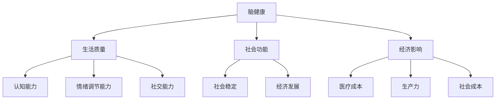

                 

### 第1章：脑健康的全球视野

> **关键词**：脑健康、全球视野、社会经济影响、预防医学

> **摘要**：本章将探讨脑健康在全球范围内的意义和现状，分析其社会经济影响，为后续章节的讨论奠定基础。

在当今社会，脑健康已成为全球关注的热点话题。随着人口老龄化趋势的加剧和生活方式的改变，脑部疾病如阿尔茨海默病、脑卒中等的发病率逐年上升。脑健康不仅关乎个体的生活质量，还对社会经济产生深远的影响。因此，对脑健康的全球视野进行审视，显得尤为重要。

#### 1.1 脑健康的重要性

脑健康是指大脑功能处于良好状态，能够有效应对日常生活的各种挑战。脑健康的重要性主要体现在以下几个方面：

1. **生活质量**：良好的脑健康能够提升个体的认知能力、情绪调节能力和社交能力，从而提高生活质量。

2. **社会功能**：健康的脑功能有助于个体在社会中发挥作用，促进社会稳定和经济发展。

3. **经济影响**：脑部疾病如阿尔茨海默病、脑卒中等的治疗费用高昂，给家庭和社会带来巨大的经济负担。

#### 1.2 全球脑健康状况概述

全球范围内，脑健康的状况呈现出显著的地域差异。发达国家和发展中国家的脑健康状况有所不同，主要原因包括：

1. **人口结构**：发达国家老龄化问题更为严重，脑部疾病发病率较高。

2. **生活方式**：不健康的生活方式如吸烟、饮酒、缺乏运动等，在全球范围内普遍存在，对脑健康产生负面影响。

3. **医疗资源**：发达国家的医疗资源更为丰富，脑健康问题的诊断和治疗水平较高。

#### 1.3 脑健康的社会经济影响

脑健康对社会经济的影响主要体现在以下几个方面：

1. **医疗成本**：脑部疾病的诊断和治疗费用高昂，给医疗保险系统带来巨大压力。

2. **生产力**：脑部疾病导致的失能和早逝，直接影响国家的生产力。

3. **社会成本**：脑部疾病不仅影响患者本人，还对其家庭成员和社会产生深远影响，增加社会负担。

在下一章中，我们将进一步探讨集体预防医学的定义、核心原则及其与传统医学的差异。这将为理解全球脑健康网络的构建提供理论基础。

---

**核心概念与联系：**

---

在接下来的章节中，我们将深入探讨集体预防医学的历史、核心原则及其在脑健康领域的应用，以期为全球脑健康网络的构建提供坚实的理论和实践基础。

