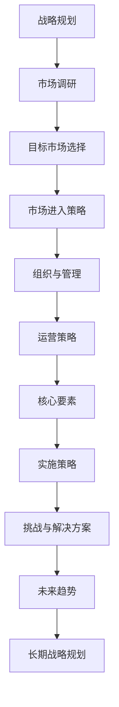

                 

## 引言

在当今全球化的商业环境中，国际化扩张已成为许多创业公司寻求增长和拓展市场的重要战略。国际化不仅能为创业公司带来新的客户群和市场份额，还能提升品牌知名度和增加营收。然而，国际化扩张并非易事，创业公司需要面对诸多挑战和不确定性，同时也需抓住潜在的机遇。

### 国际化扩张的重要性

国际化扩张的重要性体现在多个方面。首先，国际化能帮助企业突破地域限制，获取更广泛的市场资源，实现规模效应。其次，国际化有助于企业多元化经营，降低市场波动带来的风险。此外，国际化还能推动技术创新和知识共享，促进企业的持续发展。

### 创业公司国际化面临的挑战与机遇

创业公司在国际化过程中面临诸多挑战，如文化差异、法律风险、市场不确定性等。然而，机遇同样存在。例如，新兴市场的快速发展和数字化技术的广泛应用为创业公司提供了新的市场机会。此外，国际合作和技术创新也为创业公司提供了强大的支持。

总的来说，国际化扩张对创业公司既是挑战也是机遇。为了实现国际化战略的成功，创业公司需要制定合理的国际化扩张策略，全面分析市场，规划组织管理，并灵活应对各种挑战。

### 《创业公司的国际化扩张策略》

本文将深入探讨创业公司国际化扩张的策略，包括战略规划、市场进入策略、国际化组织与管理、国际化运营策略等。通过详细的分析和案例研究，本文旨在为创业公司提供一套系统、实用的国际化扩张指南。

首先，我们将从国际化扩张的战略规划入手，阐述国际化扩张的核心目标和驱动因素。随后，我们将探讨市场调研与分析的方法，以及如何选择目标市场和国际化扩张模式。接着，我们将讨论国际化组织与管理的策略，包括跨文化管理和领导力建设。此外，本文还将详细分析国际化运营策略，涵盖营销、供应链管理、财务和法律等方面。随后，我们将探讨国际化扩张的核心要素，包括技术创新与国际合作、市场拓展与客户关系管理等。最后，本文将总结国际化扩张的挑战与解决方案，并展望国际化扩张的未来趋势。

通过本文的阅读，创业公司能够获得关于国际化扩张的全面理解和实用策略，从而更好地应对全球化竞争，实现持续增长。

## 第一部分：国际化基础

国际化基础是创业公司成功实施国际化战略的关键。在这个部分，我们将详细讨论国际化扩张的战略规划、市场进入策略、国际化组织与管理、以及国际化运营策略。这些策略的制定和实施将直接影响创业公司国际化扩张的成功与否。

### 第1章：国际化扩张的战略规划

国际化扩张的战略规划是创业公司国际化过程中的首要步骤。一个明确的战略规划能够帮助公司确定国际化扩张的核心目标、驱动因素和路径选择。

#### 1.1 国际化扩张的核心目标

国际化扩张的核心目标通常包括以下几个方面：

1. **市场拓展**：通过进入新的市场，获取更多的市场份额和客户资源。
2. **品牌提升**：通过国际化，提升品牌知名度和全球影响力。
3. **资源整合**：通过国际化，获取新的技术和资源，促进企业的多元化发展。
4. **风险管理**：通过国际化，分散市场风险，降低单一市场波动对公司的影响。
5. **长期增长**：国际化是创业公司实现长期增长和持续发展的关键。

#### 1.2 国际化扩张的驱动因素

国际化扩张的驱动因素多种多样，主要包括：

1. **市场需求**：新市场的需求增长是推动企业国际化的主要动力。
2. **竞争优势**：企业通过国际化，利用自身优势，如技术创新、品牌影响力等，获取更大的市场空间。
3. **政策支持**：政府政策支持，如税收优惠、出口补贴等，也会促使企业进行国际化扩张。
4. **全球化趋势**：全球化背景下，企业需要通过国际化来适应全球市场的变化和竞争。
5. **技术创新**：技术创新是企业国际化的核心动力，通过技术创新，企业能够开发出适合国际市场的产品和服务。

#### 1.3 国际化扩张的路径选择

国际化扩张的路径选择是战略规划中的关键环节。常见的国际化扩张路径包括：

1. **出口模式**：直接向国际市场出口产品或服务，是最常见的国际化路径之一。
2. **设立分支机构**：在目标市场设立分支机构，如子公司、分公司或办事处，以便更好地了解市场并开展业务。
3. **合资企业**：与目标市场的企业合作，共同投资设立合资企业，以分享资源和风险。
4. **ODM/OEM合作**：通过ODM（原始设计制造商）或OEM（原始设备制造商）模式，将产品或技术授权给国际市场上的合作伙伴生产。
5. **外包与供应链合作**：通过与国际上的合作伙伴建立外包或供应链合作关系，实现生产和服务的外包。

在选择国际化扩张路径时，创业公司需要综合考虑市场环境、自身资源、竞争优势等因素。例如，对于资源有限的小型创业公司，出口模式和外包合作可能是更为适合的选择。而对于具备较强技术实力和品牌影响力的公司，设立分支机构或合资企业可能是更好的策略。

#### 1.4 战略规划步骤

国际化扩张的战略规划通常包括以下步骤：

1. **初步市场调研**：通过对目标市场的调研，了解市场环境、竞争状况、消费者需求等信息。
2. **市场机会与风险分析**：评估市场机会，识别潜在的风险，并制定相应的应对策略。
3. **制定国际化战略**：根据市场调研结果和公司资源，制定具体的国际化战略和目标。
4. **制定国际化扩张计划**：详细规划国际化扩张的步骤、时间表和资源配置。
5. **执行与监控**：实施国际化扩张计划，并对整个过程进行监控和评估，确保目标的实现。

通过上述步骤，创业公司可以系统性地进行国际化扩张，从而提高成功的可能性。

### 第2章：市场进入策略

市场进入策略是创业公司国际化扩张的重要组成部分。合理的市场进入策略能够帮助公司有效进入目标市场，减少风险，提高市场占有率。

#### 2.1 市场进入模式

市场进入模式主要分为以下几种：

1. **直接进入模式**：通过在目标市场设立分支机构或子公司，直接开展业务。这种模式的优势在于公司能够快速响应市场变化，积累市场经验，但初始投资较大，风险较高。
2. **间接进入模式**：通过代理商、经销商或合作伙伴在目标市场销售产品或服务。这种模式的优势在于投资相对较小，风险较低，但公司对市场的控制力较弱。
3. **混合进入模式**：结合直接进入和间接进入两种模式，以实现市场进入的灵活性和高效性。例如，在目标市场设立分支机构，同时通过代理商进行销售。

#### 2.2 外部因素分析（PESTEL）

外部因素分析是市场进入策略制定的重要环节，PESTEL分析包括以下五个方面：

1. **政治因素**：包括目标市场的政治稳定性、政策环境、贸易政策等。政治因素对企业的运营有重要影响，如政策变动可能导致市场环境的不确定性。
2. **经济因素**：包括目标市场的经济增长率、通货膨胀率、汇率波动等。经济因素直接影响市场需求和消费者购买力。
3. **社会文化因素**：包括目标市场的文化背景、消费习惯、人口结构等。社会文化因素影响产品需求和市场推广策略。
4. **技术因素**：包括目标市场的技术发展水平、创新能力、技术法规等。技术因素影响产品的适应性和市场竞争力。
5. **环境因素**：包括目标市场的环境保护法规、资源可持续性等。环境因素影响企业的社会责任和可持续发展。
6. **法律因素**：包括目标市场的法律法规、合同法律环境等。法律因素影响企业的合规运营和法律风险。

#### 2.3 竞争对手分析

竞争对手分析是市场进入策略制定的关键步骤。通过分析竞争对手的产品、市场份额、竞争策略等，创业公司可以制定有效的市场定位和营销策略。

1. **竞争对手定位**：了解竞争对手的产品定位和市场定位，确定自身的市场地位。
2. **竞争策略分析**：分析竞争对手的定价策略、渠道策略、品牌建设等，找出自身的竞争优势和劣势。
3. **竞争优势与劣势分析**：通过对比分析，确定自身的竞争优势和劣势，并制定相应的策略。

#### 2.4 市场定位与品牌建设

市场定位是市场进入策略的核心内容之一。通过明确市场定位，创业公司可以更好地满足目标客户的需求，提高市场竞争力。

1. **市场定位的重要性**：市场定位有助于企业确定产品或服务的目标客户群体，从而制定有效的营销策略。
2. **品牌建设的策略**：通过品牌定位、品牌形象塑造、品牌推广等策略，提升品牌知名度和美誉度。
3. **品牌差异化策略**：通过差异化产品、差异化服务或差异化营销，使品牌在竞争激烈的市场中脱颖而出。

#### 2.5 风险评估与管理

在市场进入策略制定过程中，风险评估与管理至关重要。通过识别和分析潜在风险，创业公司可以制定相应的应对策略，降低风险影响。

1. **国际化扩张的风险类型**：包括市场风险、法律风险、政治风险、运营风险等。
2. **风险评估的方法与工具**：采用定性和定量方法进行风险评估，如SWOT分析、PESTEL分析、蒙特卡罗模拟等。
3. **风险管理策略**：包括风险规避、风险转移、风险减轻和风险接受等策略。

通过以上分析，创业公司可以制定科学合理的市场进入策略，为国际化扩张奠定坚实基础。

### 第3章：国际化组织与管理

国际化组织与管理是创业公司国际化成功的关键因素之一。一个有效的国际化组织结构和管理体系能够确保公司在全球市场上的高效运作和持续发展。在这一章中，我们将探讨国际化组织结构、跨文化管理、领导力与团队建设以及跨国团队沟通与协作。

#### 3.1 国际化组织结构

国际化组织结构的设计直接影响到公司在全球市场上的运营效率和业务发展。常见的国际化组织结构包括以下几种：

1. **全球总部模式**：在全球设立总部，负责整体战略规划和资源分配，下属各国或地区设立分支机构，各自负责本地市场的运营。
2. **多国中心模式**：在全球设立多个区域中心，每个区域中心负责特定区域的市场运营，区域中心之间相互协作。
3. **矩阵式组织结构**：将地区和功能部门结合起来，形成矩阵式组织结构。在这种结构下，员工同时受到地区和功能部门的管理，能够更好地协调全球业务和职能。

#### 3.2 跨文化管理

跨文化管理是国际化组织面临的重大挑战之一。不同国家和地区的文化差异可能引发员工之间的误解和冲突，影响团队协作和业务发展。有效的跨文化管理策略包括：

1. **文化差异分析**：通过文化差异分析工具，如Hofstede的文化维度模型，了解不同国家和地区的文化特征，制定相应的管理策略。
2. **文化适应策略**：鼓励员工学习目标市场的文化，提高跨文化适应能力。同时，公司应建立包容性的企业文化，尊重多元文化。
3. **跨文化沟通策略**：采用适当的沟通方式和技巧，如非言语沟通、文化敏感的沟通等，提高跨文化沟通效率。

#### 3.3 领导力与团队建设

领导力在国际化扩张中扮演着关键角色。有效的领导力能够激励员工、提升团队绩效，并推动公司实现国际化目标。团队建设也是国际化组织管理的重要方面，包括：

1. **领导风格与团队管理**：领导风格直接影响团队氛围和员工士气。民主式、参与式和权威式的领导风格在不同情境下各有优劣，需要根据具体情况灵活运用。
2. **团队建设策略**：通过团队建设活动、团队培训和发展项目，增强团队成员之间的信任和协作。有效的团队建设有助于提升团队整体绩效和公司国际化能力。
3. **跨国团队的有效协作**：跨国团队的协作效率是国际化成功的关键。通过建立清晰的协作目标和流程、利用信息技术工具、定期开展团队会议和培训，可以提高跨国团队的协作效率。

#### 3.4 跨国团队沟通与协作

跨国团队的沟通与协作是国际化组织管理中的另一大挑战。有效的沟通和协作能够确保跨国团队高效运作，实现公司国际化战略目标。以下策略有助于提升跨国团队的沟通与协作效率：

1. **沟通策略与工具**：采用多种沟通策略和工具，如电子邮件、电话会议、视频会议、即时通讯工具等，确保信息传递的及时性和准确性。
2. **协作流程与机制**：建立清晰的协作流程和机制，明确各团队和个人的职责和任务，确保工作的高效开展。
3. **跨文化沟通**：在跨国团队沟通中，注重文化差异，采用文化敏感的沟通方式，避免误解和冲突。
4. **信息技术支持**：利用信息技术工具，如项目管理软件、协作平台等，提高跨国团队的信息共享和协作效率。

通过以上策略，创业公司可以构建一个高效、协同的国际化组织结构，确保国际化扩张的顺利实施。

### 第4章：国际化运营策略

国际化运营策略是创业公司实现全球化目标的关键环节，涵盖了市场拓展、供应链管理、财务管理、法律与合规、人力资源管理等多个方面。一个全面而科学的国际化运营策略不仅有助于企业有效应对海外市场的挑战，还能充分利用国际化带来的机遇，实现持续增长和竞争优势。

#### 4.1 市场拓展策略

市场拓展是国际化运营的核心任务之一，直接关系到企业在国际市场中的影响力和市场份额。以下是市场拓展策略的几个关键方面：

1. **目标市场选择**：选择具有增长潜力、符合企业资源和竞争优势的目标市场。通过市场调研和分析，评估不同市场的潜力，并选择最适合的市场进入。
2. **市场定位**：明确企业在目标市场中的定位，制定差异化策略，以区分于竞争对手，吸引目标客户群体。市场定位需要考虑产品特性、客户需求和市场趋势。
3. **营销策略**：制定适合国际市场的营销策略，包括产品推广、品牌建设、广告宣传等。利用多渠道营销，如线上广告、社交媒体、展会等，提高市场知名度和客户关注度。
4. **本地化策略**：根据目标市场的文化、语言和消费习惯，对产品和服务进行本地化调整，确保其能够被当地客户接受。本地化策略包括产品包装、宣传材料、用户界面等。

#### 4.2 供应链管理策略

国际化运营要求企业具备高效的供应链管理能力，以应对跨国采购、物流和库存管理等复杂问题。以下是供应链管理策略的几个关键方面：

1. **供应链网络设计**：根据市场分布和企业需求，设计全球化的供应链网络。考虑供应商选择、物流通道、库存策略等因素，确保供应链的稳定性和灵活性。
2. **国际采购策略**：建立多元化的供应商网络，选择具备竞争力、质量可靠、交付及时的供应商。通过优化采购流程和谈判策略，降低采购成本，提高供应链效率。
3. **物流与配送策略**：优化物流和配送网络，确保产品能够快速、安全地送达客户手中。利用现代化的物流技术和工具，如物联网、人工智能等，提高物流管理的智能化和自动化水平。
4. **库存管理策略**：实施有效的库存管理策略，平衡库存水平，避免过剩或缺货。通过需求预测、库存监控和优化库存结构，提高库存周转率和资金利用率。

#### 4.3 财务管理策略

财务管理是国际化运营中不可或缺的一环，涉及到资金流动、财务风险控制、汇率管理等多个方面。以下是财务管理策略的几个关键方面：

1. **国际财务管理**：建立全球化的财务管理体系，确保资金流动的透明性和高效性。通过跨国资金调度、外汇风险控制等手段，优化企业财务结构。
2. **国际税收策略**：制定合理的国际税收策略，利用税收优惠政策，降低企业税负。同时，遵循各国税法，确保合规经营。
3. **跨国公司税务筹划**：在国际化运营过程中，充分利用国际税收协定和税法差异，进行税务筹划，降低税务风险和成本。
4. **财务报告与审计**：遵循国际财务报告准则（IFRS），编制符合国际标准的财务报告，提高财务透明度和公信力。定期进行外部审计，确保财务报告的准确性和合规性。

#### 4.4 法律与合规管理策略

国际化运营要求企业严格遵守各国法律法规，确保合规经营。以下是法律与合规管理策略的几个关键方面：

1. **国际法律环境**：了解和熟悉目标市场的法律环境，包括商业法规、劳动法、知识产权法等，确保企业的运营符合法律要求。
2. **合规管理策略**：建立合规管理体系，制定合规政策和流程，确保企业的运营活动符合相关法律法规和国际标准。
3. **法律风险防控**：通过法律风险评估、法律咨询和合规培训等手段，识别和防范潜在的法律风险，确保企业的长期稳健发展。
4. **争议处理**：建立争议解决机制，如调解、仲裁等，及时处理和解决纠纷，维护企业的合法权益。

#### 4.5 人力资源管理策略

国际化运营对人力资源管理提出了新的要求，需要建立多元化、包容性的团队，并确保员工能够适应跨国工作环境。以下是人力资源管理策略的几个关键方面：

1. **国际人力资源管理**：建立全球人力资源管理框架，包括招聘、培训、绩效评估、薪酬福利等，确保员工在全球范围内的统一管理。
2. **跨国人才招聘与选拔**：通过国际招聘渠道，吸引和选拔具有国际化视野和专业技能的人才。在招聘过程中，注重候选人的跨文化适应能力和语言能力。
3. **跨文化团队建设**：通过跨文化培训、团队建设活动和员工交流计划，增强团队成员之间的信任和协作，提高团队的执行力和创新能力。
4. **薪酬与激励策略**：建立具有竞争力的薪酬体系和激励政策，包括基本工资、绩效奖金、股票期权等，激励员工的积极性和创造力。

通过制定和实施科学、系统的国际化运营策略，创业公司能够更好地应对国际市场的挑战，实现全球化目标。

### 第5章：国际化扩张的核心要素

国际化扩张的成功不仅依赖于战略规划和运营策略，还需要关注一系列核心要素，这些要素是创业公司在国际市场上站稳脚跟、持续发展的关键。在本章中，我们将探讨技术创新与国际合作、市场拓展与客户关系管理、产品本地化策略、品牌国际化与品牌保护，以及知识产权保护策略。

#### 5.1 技术创新与国际合作

技术创新是国际化扩张的重要推动力。通过持续的技术创新，企业可以提高产品竞争力，满足不同市场的需求。国际合作则有助于企业获取先进技术，拓展全球市场。

1. **技术创新的重要性**：技术创新能够帮助企业开发出更具竞争力的产品和服务，满足客户多样化需求，提升市场份额。
2. **国际合作策略**：通过国际合作，企业可以引进外部技术，促进技术转移和知识共享。常见的国际合作模式包括合资企业、技术许可和研发合作。
3. **技术创新案例**：例如，华为通过与全球知名高校和科研机构合作，不断提升其5G技术和通信设备的研发能力，在国际市场上取得了显著的成功。

#### 5.2 市场拓展与客户关系管理

市场拓展是国际化扩张的重要目标，而客户关系管理则是实现市场拓展的关键。通过有效的市场拓展和客户关系管理，企业可以建立稳定的客户基础，实现持续增长。

1. **市场拓展策略**：市场拓展包括进入新市场、扩大市场份额和提升品牌知名度。企业可以通过市场调研、竞争分析等手段，选择最适合的市场进入策略。
2. **客户关系管理**：客户关系管理包括客户获取、客户维护和客户升级。企业应建立客户数据库，实施个性化营销，提供优质的客户服务，提高客户满意度和忠诚度。
3. **客户关系管理工具**：企业可以利用CRM系统（客户关系管理系统）来跟踪和管理客户信息，优化销售和客户服务流程。

#### 5.3 产品本地化策略

产品本地化是国际化扩张的重要环节，涉及产品设计和营销策略的本地化调整。通过产品本地化，企业可以更好地适应目标市场的文化、语言和消费者习惯。

1. **产品本地化的概念与意义**：产品本地化是指根据目标市场的需求和文化，对产品进行适应性调整。这包括产品功能、设计、包装、语言等方面的调整。
2. **产品本地化的关键要素**：产品本地化的关键要素包括市场调研、文化差异分析、消费者需求研究等。通过深入了解目标市场的文化背景和消费者偏好，企业可以制定合适的产品本地化策略。
3. **产品本地化的实施步骤**：产品本地化的实施步骤包括市场调研、产品设计调整、市场测试和反馈优化。通过这些步骤，企业可以确保产品在本地市场中的成功。

#### 5.4 品牌国际化与品牌保护

品牌国际化是企业在全球市场上建立声誉和影响力的关键。品牌保护则是确保品牌不受侵犯和损害的重要措施。

1. **品牌国际化的策略**：品牌国际化包括品牌定位、品牌形象塑造和品牌推广。企业需要根据目标市场的文化背景和消费者行为，制定合适的品牌国际化策略。
2. **品牌保护策略**：品牌保护策略包括注册商标、监测品牌侵权行为和维权等。企业应积极申请国际商标注册，并通过法律手段保护自身品牌权益。
3. **跨国品牌管理的挑战与机遇**：跨国品牌管理面临语言、文化差异和竞争压力等挑战，但同时也提供了提升品牌知名度和市场影响力的机遇。

#### 5.5 知识产权保护策略

知识产权保护是国际化扩张的重要保障。通过有效的知识产权保护策略，企业可以防止技术泄露、竞争者模仿和侵权行为，保护自身技术创新成果。

1. **知识产权保护的重要性**：知识产权保护能够鼓励企业持续进行技术创新，提高企业的核心竞争力。
2. **国际知识产权保护策略**：国际知识产权保护策略包括专利申请、版权登记和商标注册等。企业应积极参与国际知识产权保护，确保自身技术创新成果在全球范围内的合法保护。
3. **知识产权争议处理**：企业应建立知识产权争议处理机制，及时应对和解决知识产权纠纷，维护自身合法权益。

通过关注和实施以上核心要素，创业公司可以更好地应对国际化扩张中的挑战，实现全球市场中的长期发展。

### 第6章：国际化扩张实施策略

国际化扩张的实施策略是企业成功实现全球市场布局的关键环节。本章将重点探讨资源整合与战略协同、风险评估与应对策略、灵活调整与持续优化，并通过成功案例分析和国际化扩张的里程碑，提供实用的实施策略。

#### 6.1 资源整合与战略协同

资源整合与战略协同是企业国际化扩张过程中必不可少的环节。通过有效的资源整合和战略协同，企业可以实现资源最大化利用，提高国际化扩张的成功率。

1. **资源整合策略**：资源整合包括内部资源和外部资源的整合。内部资源整合涉及企业内部不同部门之间的协作，如研发、生产和销售部门，以实现资源的高效利用。外部资源整合则涉及合作伙伴、供应商和客户的资源整合，通过建立战略联盟和合作伙伴关系，实现资源的互补和协同效应。

2. **战略协同机制**：战略协同机制是指企业内部各部门和外部合作伙伴之间建立的战略协作机制。通过明确的战略目标、协作流程和沟通机制，确保各部门和合作伙伴之间的协调和合作，提高资源利用效率。

3. **跨部门协作与沟通**：跨部门协作与沟通是战略协同的关键。企业应建立高效的沟通渠道，如定期会议、信息共享平台和协作工具，确保各部门之间的信息畅通，减少误解和冲突，提高协作效率。

#### 6.2 风险评估与应对策略

国际化扩张面临诸多风险，如市场风险、政治风险、法律风险等。有效的风险评估与应对策略能够帮助企业识别和应对潜在风险，降低风险对国际化扩张的影响。

1. **风险评估框架**：建立风险评估框架，包括风险识别、风险评估和风险应对策略。风险识别是通过多种方法，如SWOT分析、PESTEL分析等，识别企业可能面临的风险。风险评估则是对识别出的风险进行评估，确定风险的影响程度和发生概率。风险应对策略则包括风险规避、风险转移、风险减轻和风险接受等。

2. **风险识别与评估**：通过定期进行风险评估，识别和评估企业在国际化扩张过程中可能面临的风险。风险识别和评估的方法包括问卷调查、访谈、数据分析等。通过系统化的风险识别和评估，企业可以更好地了解潜在风险，制定相应的应对策略。

3. **应对策略与措施**：针对识别出的风险，制定相应的应对策略和措施。例如，对于市场风险，可以通过多元化市场策略、市场调研和竞争对手分析等手段进行应对。对于政治风险，可以通过了解目标市场的政治环境、建立本地化团队等方式进行应对。

#### 6.3 灵活调整与持续优化

国际化扩张是一个动态的过程，企业需要具备灵活调整和持续优化的能力，以适应不断变化的市场环境和竞争态势。

1. **灵活调整的重要性**：国际化扩张过程中，市场环境和企业内部情况都可能发生变化。灵活调整能够帮助企业及时应对变化，保持竞争优势。灵活调整包括战略调整、组织结构调整、营销策略调整等。

2. **持续优化策略**：持续优化是指企业通过不断改进和优化运营策略，提高国际化扩张的成功率。持续优化策略包括定期评估和反馈、持续改进、创新驱动等。

3. **适应性管理**：适应性管理是指企业通过建立灵活的管理机制，快速响应市场变化，保持竞争优势。适应性管理包括灵活的决策机制、快速的市场反应能力、持续的创新机制等。

#### 6.4 成功案例分析

通过成功案例分析，可以了解其他创业公司在国际化扩张过程中采取的有效策略和应对措施。

1. **案例分析**：选择一些具有代表性的创业公司国际化扩张案例，如阿里巴巴、小米等，分析其国际化扩张的策略和成功因素。

2. **案例启示**：通过案例分析，总结成功经验，为企业提供借鉴和启示。例如，阿里巴巴的成功在于其强大的品牌影响力和创新驱动的国际化战略；小米的成功在于其灵活的市场进入策略和客户关系管理。

#### 6.5 国际化扩张的里程碑

国际化扩张的里程碑是企业在国际化过程中取得的重要阶段性成果，标志着企业在全球化道路上迈出的坚实步伐。

1. **关键节点**：国际化扩张的关键节点包括市场进入、业务拓展、品牌建立等。企业应明确关键节点，确保每个节点上的目标和任务都得到有效实施。

2. **评估指标**：建立国际化扩张的评估指标，如市场份额、品牌知名度、营收增长率等。通过定期评估，了解国际化扩张的进展情况，调整和优化策略。

3. **阶段性目标**：设定阶段性目标，如短期内实现市场进入，中期内实现市场份额提升，长期内实现品牌国际化等。阶段性目标有助于企业明确发展方向，制定具体实施计划。

通过以上国际化扩张实施策略，企业可以更好地应对国际化过程中的挑战，实现全球化目标。

### 第7章：国际化扩张的挑战与解决方案

国际化扩张虽然带来了新的机遇，但也伴随着一系列的挑战。这些挑战包括国际市场不确定性、跨文化冲突、资源配置与优化问题、技术创新与国际合作难度以及持续竞争优势的建立等。在这一章节中，我们将深入探讨这些挑战，并提出相应的解决方案。

#### 7.1 国际市场不确定性

国际市场不确定性是创业公司在国际化扩张过程中面临的一个主要挑战。这种不确定性可能来源于政治、经济、社会和技术等多个方面。

1. **不确定性分析**：国际市场的政治稳定性、经济形势、法律法规以及消费者需求等因素都可能带来不确定性。例如，政策变动可能导致市场环境的不利变化，经济衰退可能影响消费者的购买力，技术变革可能改变市场格局。

2. **应对不确定性策略**：为了应对国际市场不确定性，企业可以采取以下策略：
   - 多元化市场策略：通过进入多个市场，分散风险，避免单一市场波动的影响。
   - 市场调研与预测：定期进行市场调研，预测市场趋势和变化，及时调整战略。
   - 灵活调整战略：保持战略的灵活性，根据市场变化快速调整业务策略。

#### 7.2 跨文化冲突与解决

跨文化冲突是国际化扩张过程中不可避免的挑战。不同文化背景的员工和管理层之间的沟通和协作可能会引发冲突。

1. **跨文化冲突类型**：跨文化冲突包括语言障碍、价值观差异、行为规范冲突等。这些冲突可能影响团队的效率和合作。

2. **解决策略**：
   - 文化培训：通过文化培训，提高员工对目标市场的文化认知和适应能力。
   - 沟通机制：建立有效的跨文化沟通机制，如使用共同语言、定期交流会议等，减少误解和冲突。
   - 建立包容性文化：倡导多元文化，鼓励员工尊重和理解不同文化，增强团队的凝聚力。

#### 7.3 资源配置与优化

国际化扩张需要企业投入大量资源，包括财务资源、人力资源和技术资源等。如何有效配置和优化这些资源是企业在国际化过程中面临的另一个重要挑战。

1. **资源配置策略**：
   - 明确资源需求：根据国际化扩张的计划和目标，明确所需的资源类型和数量。
   - 资源优先级排序：根据资源的重要性和紧迫性，对资源进行优先级排序，确保关键资源的优先配置。
   - 资源共享与协作：通过建立内部资源共享机制，提高资源利用效率，减少资源浪费。

2. **优化措施**：
   - 定期资源评估：定期评估资源的使用效果，优化资源配置策略。
   - 引入先进技术：利用先进的技术和工具，提高资源利用效率，如自动化系统、数据分析工具等。

#### 7.4 技术创新与国际合作

技术创新是国际化扩张的重要驱动力，而国际合作则为技术创新提供了更广阔的舞台。然而，技术创新与国际合作也面临一系列挑战。

1. **技术创新的重要性**：技术创新能够提高企业的竞争力，满足不同市场的需求，推动国际化扩张。

2. **国际合作模式**：企业可以通过合资企业、研发合作、技术许可等模式进行国际合作，获取外部技术和资源。

3. **挑战与应对**：
   - 技术转移困难：技术转移过程中可能面临知识产权保护、技术标准和语言障碍等问题。企业应加强知识产权保护，建立技术标准，提高语言沟通能力。
   - 合作伙伴选择：选择合适的合作伙伴是国际合作成功的关键。企业应进行充分的市场调研和合作评估，确保合作伙伴的技术实力和合作意愿。

#### 7.5 持续竞争优势的建立

持续竞争优势是国际化扩张的重要目标。建立持续竞争优势不仅能够帮助企业保持市场地位，还能推动企业的长期发展。

1. **持续竞争优势的概念**：持续竞争优势是指企业在长期竞争中保持优势的能力，通常来源于企业的独特资源、核心能力和市场定位。

2. **建立策略**：
   - 独特资源：通过独特的产品和服务、品牌价值、技术创新等，形成企业的独特资源优势。
   - 核心能力：通过持续的研发投入、人才培养、管理体系建设等，提升企业的核心竞争力。
   - 市场定位：通过市场细分和定位，找到企业的目标市场，提供差异化的产品和服务。

3. **保持与提升策略**：通过持续的市场调研、竞争对手分析、技术创新等手段，保持和提升竞争优势。同时，建立敏捷的响应机制，快速应对市场变化，保持竞争优势。

通过有效应对国际化扩张中的挑战，创业公司可以建立持续竞争优势，实现全球化目标。

### 第8章：全球数字化趋势下的国际化扩张

在当今全球数字化浪潮中，企业国际化扩张面临着前所未有的机遇和挑战。数字化技术不仅改变了市场环境，还为企业提供了新的发展路径。本章将探讨数字化技术对国际化扩张的影响、新兴市场的数字化机遇、数字化营销策略、以及数据隐私和网络安全等问题。

#### 8.1 数字化技术对国际化扩张的影响

数字化技术的快速发展对国际化扩张产生了深远影响。首先，数字化技术提高了企业的运营效率，通过自动化、大数据分析和人工智能等手段，企业可以更快速、更准确地响应市场需求。其次，数字化技术拓宽了企业的市场渠道，通过互联网和社交媒体，企业可以轻松触达全球客户。此外，数字化技术还为企业提供了丰富的数据资源，这些数据可以帮助企业更好地了解市场趋势和消费者行为，从而制定更精准的市场策略。

#### 8.2 新兴市场与数字化机遇

新兴市场是国际化扩张的重要目标，而数字化技术为进入这些市场提供了新的机遇。首先，许多新兴市场国家的互联网普及率和移动设备使用率迅速增长，这为企业提供了庞大的潜在客户群体。其次，数字化技术的普及使得这些市场的消费者更加注重在线购物和数字化服务，为企业提供了新的市场空间。此外，数字化技术还为企业在新兴市场中的本地化运营提供了支持，通过云计算、物联网和大数据等技术，企业可以更高效地管理业务和供应链。

#### 8.3 数字化营销与客户体验

数字化营销是国际化扩张中不可或缺的一部分。通过数字化技术，企业可以实现个性化营销、精准营销和全渠道营销，从而提升客户体验和市场竞争力。以下是数字化营销的几个关键策略：

1. **数据分析**：通过大数据分析，企业可以深入了解客户行为和偏好，从而制定更精准的营销策略。
2. **个性化营销**：基于客户数据，企业可以提供个性化的产品推荐和营销信息，提高客户满意度和忠诚度。
3. **全渠道营销**：通过整合线上和线下渠道，企业可以提供无缝的客户体验，提高市场覆盖率和销售额。
4. **社交媒体营销**：利用社交媒体平台，企业可以与客户进行实时互动，提高品牌知名度和影响力。

#### 8.4 数据隐私与网络安全

随着数字化技术的发展，数据隐私和网络安全问题日益凸显。在国际化扩张过程中，企业需要特别关注这些问题，以确保客户数据的安全和合规。以下是数据隐私和网络安全的一些关键策略：

1. **数据保护法规**：了解和遵守目标市场的数据保护法规，如欧盟的GDPR和美国的CCPA等。
2. **数据加密**：采用高级加密技术，保护客户数据在传输和存储过程中的安全。
3. **网络安全措施**：建立完善的网络安全防护体系，包括防火墙、入侵检测系统和安全审计等。
4. **员工培训**：定期对员工进行数据隐私和网络安全培训，提高员工的意识和技能。

通过充分利用数字化技术，企业可以更好地应对国际化扩张中的挑战，抓住新兴市场的机遇，实现全球市场的持续增长。

### 第9章：国际化扩张的未来挑战与策略

在全球化进程中，国际化扩张面临着一系列新的挑战。这些挑战包括全球经济不确定性、技术创新与国际合作的日益重要、绿色可持续发展的要求、社会责任和国际法规的日益严格，以及如何制定长期的国际化战略。在本章中，我们将深入探讨这些挑战，并提出相应的应对策略。

#### 9.1 全球经济不确定性

全球经济不确定性是国际化扩张过程中无法回避的问题。经济波动、货币汇率变化、贸易政策变动等因素都可能对企业的国际化战略产生重大影响。

1. **全球经济形势分析**：企业需要密切关注全球经济的动态，包括GDP增长率、通货膨胀率、利率变化等，以预测未来市场的走势。
2. **应对不确定性策略**：
   - 多元化市场：通过进入多个市场，分散风险，避免单一市场波动的影响。
   - 货币风险管理：通过外汇衍生工具，如远期合约和期权，对冲汇率波动风险。
   - 灵活调整策略：保持战略的灵活性，根据市场变化快速调整业务策略。

#### 9.2 技术创新与国际合作

技术创新是国际化扩张的重要驱动力，而国际合作则为技术创新提供了更广阔的舞台。随着全球科技的快速发展，企业需要不断进行技术创新，以保持竞争力。

1. **技术创新趋势**：人工智能、物联网、区块链等新兴技术正迅速发展，企业需要紧跟技术趋势，进行相应的研发和创新。
2. **国际合作策略**：
   - 技术共享与开放创新：通过建立技术共享平台，与合作伙伴共同研发新产品和技术。
   - 国际研发合作：与国际科研机构、高校和行业领先企业建立合作关系，共享研发资源。
   - 技术转移：通过技术许可、合资企业等方式，将技术创新应用到全球市场。

#### 9.3 绿色可持续发展的国际化扩张

随着全球环境问题的日益严重，绿色可持续发展成为企业国际化扩张的重要方向。企业需要在国际化过程中遵循环保原则，减少对环境的影响。

1. **绿色可持续发展的重要性**：绿色可持续发展不仅有助于企业履行社会责任，还能提高品牌形象和市场竞争力。
2. **绿色可持续发展策略**：
   - 环保技术投资：研发和应用环保技术，减少生产过程中的能源消耗和废弃物排放。
   - 环保产品开发：开发符合环保标准的产品，满足消费者对环保的需求。
   - 环保供应链管理：优化供应链管理，提高资源利用效率，减少碳排放。

#### 9.4 社会责任与国际法规

随着社会责任意识的增强和国际法规的日益严格，企业需要在国际市场上履行社会责任，遵守相关法规。

1. **社会责任的概念**：社会责任是指企业在追求经济利益的同时，对环境、员工、客户和社会的义务和责任。
2. **国际法规对国际化扩张的影响**：不同国家和地区的法律法规对企业运营有不同的要求，企业需要了解并遵守这些法规，以避免法律风险。
3. **社会责任与法规策略**：
   - 社会责任报告：定期发布社会责任报告，展示企业在社会责任方面的努力和成果。
   - 法规遵循：建立合规管理体系，确保企业运营符合国际法规要求。
   - 社区参与：积极参与目标市场的社区活动，增强与当地社区的互动和合作。

#### 9.5 国际化扩张的长期战略规划

国际化扩张是一个长期的过程，需要企业制定明确的长期战略规划，以确保国际化目标的实现。

1. **长期战略规划的重要性**：长期战略规划能够帮助企业明确国际化方向，优化资源配置，提高国际化效率。
2. **长期战略规划步骤**：
   - 战略目标设定：明确企业的国际化目标，如市场拓展、品牌建设、技术创新等。
   - 市场分析：分析目标市场的潜力、竞争态势和消费者需求。
   - 资源配置：根据战略目标，制定资源配置计划，包括财务、人力资源和技术资源。
   - 执行与监控：实施国际化战略，并建立监控机制，确保战略目标的实现。

通过应对国际化扩张的未来挑战，企业可以制定科学、系统的长期战略规划，实现全球市场的持续增长。

### 结论

国际化扩张是创业公司拓展市场和实现全球增长的关键战略。通过科学、系统的国际化战略规划，创业公司可以克服国际化过程中面临的挑战，抓住市场机遇，实现持续发展。本文从国际化基础、国际化扩张实施策略、国际化扩张的挑战与解决方案以及国际化扩张的未来趋势等多个方面，探讨了创业公司国际化扩张的全面策略。

首先，国际化基础部分包括战略规划、市场进入策略、国际化组织与管理、国际化运营策略等，为创业公司提供了国际化扩张的基础理论框架。其次，国际化扩张实施策略详细讨论了资源整合、风险评估、灵活调整等关键要素，为企业提供了实用的操作指南。然后，针对国际化扩张的挑战，如市场不确定性、跨文化冲突、资源配置与优化等，提出了有效的应对策略。最后，探讨了全球数字化趋势下的国际化扩张、全球经济不确定性、技术创新与国际合作等未来挑战，为创业公司提供了前瞻性的战略建议。

为了提升国际化扩张的成功率，企业应重点关注以下几个核心要素：

1. **战略规划与市场调研**：制定明确的国际化战略，进行全面的市场调研，选择合适的目标市场和进入模式。
2. **技术创新与国际合作**：通过持续的技术创新，提升产品竞争力，同时积极寻求国际合作，获取外部资源和技术支持。
3. **客户关系管理**：建立有效的客户关系管理系统，提升客户满意度和忠诚度，为市场拓展提供坚实的支持。
4. **风险管理**：建立全面的风险评估与应对机制，确保国际化扩张过程中的稳定性和可持续性。
5. **品牌建设**：注重品牌国际化，通过有效的品牌管理和保护策略，提升品牌在全球市场中的影响力。

展望未来，国际化扩张将继续受到全球经济、技术变革、环境和社会责任等多方面因素的影响。创业公司应保持敏锐的市场洞察力，积极应对变化，抓住新的市场机遇。同时，企业需要注重长期战略规划，不断优化国际化战略，以实现全球市场的持续增长。

总之，国际化扩张不仅是创业公司寻求全球发展的必经之路，也是提升企业竞争力、实现持续增长的关键策略。通过科学、系统的国际化战略规划，创业公司可以克服挑战，抓住机遇，实现全球市场的成功布局。未来，随着全球化和数字化进程的加速，国际化扩张将为创业公司带来更广阔的发展空间和无限可能。

### 附录

#### 附录 A：国际化扩张常用工具与资源

在国际化扩张过程中，企业需要借助一系列工具和资源来支持其战略规划和实施。以下是一些常用的工具和资源：

1. **市场调研工具**：
   - **SurveyMonkey**：在线调查和问卷设计工具。
   - **Google表单**：免费的网络调查问卷工具。
   - **Qualtrics**：专业的市场调研和数据分析平台。

2. **数据分析工具**：
   - **Python**：编程语言，适用于数据处理和分析。
   - **R**：统计分析语言，特别适合复杂数据分析。
   - **Tableau**：数据可视化工具，用于创建交互式图表和仪表盘。

3. **国际贸易数据库**：
   - **联合国贸易统计数据库（UN Comtrade）**：提供全球贸易统计数据。
   - **国际贸易中心（ITC）**：提供市场研究和国际贸易工具。
   - **IBISWorld**：行业市场研究报告数据库。

4. **社交媒体分析工具**：
   - **Hootsuite**：社交媒体管理工具。
   - **SproutSocial**：社交媒体分析和客户关系管理工具。

5. **法律和合规资源**：
   - **世界贸易组织（WTO）**：国际贸易法规和协议。
   - **美国国际贸易委员会（USITC）**：提供国际贸易法律和政策信息。

#### 附录 B：国际化扩张案例分析

1. **阿里巴巴的国际化扩张**：
   - **国际化战略**：阿里巴巴通过收购、合资和自建平台等多种方式，进入全球市场。
   - **市场进入策略**：阿里巴巴在北美、欧洲和东南亚等地设立分支机构，同时通过电商平台连接全球买家和卖家。
   - **跨文化管理**：阿里巴巴重视本地化，通过收购和合作，整合本地资源和人才。
   - **技术创新与国际合作**：阿里巴巴积极推进云计算和电子商务技术的研发，与国际合作伙伴共同开发新技术。

2. **华为的国际化扩张**：
   - **国际化战略**：华为以技术领先为基础，通过全球研发中心和合作伙伴网络，拓展国际市场。
   - **市场进入策略**：华为在多个国家和地区建立研发中心和生产基地，同时通过并购和合作，提升市场竞争力。
   - **法律与合规**：华为注重遵守当地法律法规，建立全球合规管理体系。
   - **知识产权保护**：华为积极申请国际专利，保护自身技术创新成果。

3. **小米的国际化扩张**：
   - **国际化战略**：小米通过快速反应和本地化策略，迅速进入海外市场。
   - **市场进入策略**：小米通过设立海外子公司、与当地企业合作等方式，进入欧洲、印度等市场。
   - **营销策略**：小米注重在线营销和社交媒体推广，提高品牌知名度。
   - **客户关系管理**：小米通过线上和线下活动，与客户建立紧密联系，提高客户忠诚度。

#### 附录 C：国际市场调研报告模板

一个典型的国际市场调研报告通常包括以下部分：

1. **封面**：
   - 报告名称、报告日期、编制单位。

2. **摘要**：
   - 报告概述、研究目的、研究方法、主要发现和建议。

3. **引言**：
   - 国际市场背景、研究背景和重要性。

4. **市场调研结果**：
   - 市场规模、市场趋势、市场细分。

5. **竞争分析**：
   - 竞争对手分析、市场定位、竞争策略。

6. **市场进入策略**：
   - 市场进入模式、市场进入步骤、风险评估。

7. **营销策略**：
   - 营销组合、营销渠道、营销活动。

8. **人力资源策略**：
   - 招聘与选拔、培训与发展、薪酬与激励。

9. **财务策略**：
   - 资金筹集、成本控制、税务筹划。

10. **结论与建议**：
    - 国际市场机会、风险与挑战、建议与对策。

11. **参考文献**：
    - 引用文献列表。

12. **附录**：
    - 数据来源、调查问卷、数据分析图表。

通过上述模板，企业可以系统地撰写国际市场调研报告，为国际化扩张提供数据支持和战略依据。

### Mermaid 流程图：国际化扩张的步骤流程



### 核心算法原理讲解：市场调研数据分析的伪代码

```python
# 数据预处理
def preprocess_data(data):
    # 清洗数据
    cleaned_data = clean_data(data)
    # 数据转换
    transformed_data = transform_data(cleaned_data)
    return transformed_data

# 数据分析
def analyze_data(data):
    # 数据聚类
    clusters = cluster_data(data)
    # 数据分类
    categories = classify_data(data)
    # 数据关联分析
    associations = find_associations(data)
    return clusters, categories, associations

# 数据可视化
def visualize_data(clusters, categories, associations):
    # 可视化聚类结果
    visualize_clusters(clusters)
    # 可视化分类结果
    visualize_categories(categories)
    # 可视化关联分析结果
    visualize_associations(associations)

# 主程序
if __name__ == '__main__':
    data = preprocess_data(data)
    clusters, categories, associations = analyze_data(data)
    visualize_data(clusters, categories, associations)
```

### 数学模型和数学公式：市场调研数据的回归分析

$$
y = \beta_0 + \beta_1x_1 + \beta_2x_2 + ... + \beta_nx_n + \epsilon
$$

其中，$y$ 是因变量，$x_1, x_2, ..., x_n$ 是自变量，$\beta_0, \beta_1, \beta_2, ..., \beta_n$ 是回归系数，$\epsilon$ 是误差项。

### 项目实战：国际化市场调研数据分析和报告

#### 1. 环境搭建

- 安装Python环境
- 安装数据分析相关库（如pandas、numpy、scikit-learn等）

#### 2. 数据收集

- 使用调查问卷收集市场调研数据
- 收集竞争对手信息
- 收集目标市场的经济、社会、文化数据

#### 3. 数据处理

- 数据清洗与预处理
- 数据转换与归一化
- 数据分析

#### 4. 数据可视化

- 使用matplotlib、seaborn等库进行数据可视化

#### 5. 数据报告撰写

- 撰写市场调研报告
- 撰写数据分析报告

### 代码解读与分析：国际化市场调研数据预处理代码

```python
import pandas as pd
from sklearn.preprocessing import StandardScaler
from sklearn.cluster import KMeans
from sklearn.model_selection import train_test_split

# 读取数据
data = pd.read_csv('market_research_data.csv')

# 数据清洗
def clean_data(data):
    # 填充缺失值
    data = data.fillna(method='ffill')
    # 删除重复数据
    data = data.drop_duplicates()
    # 删除无关列
    data = data.drop(['unnecessary_column'], axis=1)
    return data

# 数据转换
def transform_data(data):
    # 转换数据类型
    data = data.astype({'numeric_column': 'float64', 'categorical_column': 'category'})
    # 数据归一化
    scaler = StandardScaler()
    numeric_data = scaler.fit_transform(data[['numeric_column']])
    data[['numeric_column']] = numeric_data
    return data

# 数据分析
def analyze_data(data):
    # 数据聚类
    kmeans = KMeans(n_clusters=3, random_state=42)
    clusters = kmeans.fit_predict(data[['numeric_column']])
    data['cluster'] = clusters
    
    # 数据分类
    X = data[['numeric_column']]
    y = data['target']
    X_train, X_test, y_train, y_test = train_test_split(X, y, test_size=0.2, random_state=42)
    classifier = KMeans(n_clusters=3, random_state=42)
    classifier.fit(X_train)
    y_pred = classifier.predict(X_test)
    
    # 数据关联分析
    associations = data.groupby('cluster')['numeric_column'].mean().reset_index()
    return data, clusters, y_pred, associations

# 数据可视化
def visualize_data(data, clusters, y_pred, associations):
    import matplotlib.pyplot as plt
    import seaborn as sns
    
    # 可视化聚类结果
    sns.scatterplot(data=data, x='numeric_column', y='cluster', hue='cluster', palette='viridis')
    plt.title('Clustering by Numeric Feature')
    plt.show()
    
    # 可视化分类结果
    confusion_matrix = pd.crosstab(y_test, y_pred)
    sns.heatmap(confusion_matrix, annot=True, fmt='.2f', cmap='Blues')
    plt.title('Confusion Matrix')
    plt.show()
    
    # 可视化关联分析结果
    sns.barplot(data=associations, x='cluster', y='numeric_column')
    plt.title('Cluster-wise Numeric Feature Distribution')
    plt.show()

# 主程序
if __name__ == '__main__':
    data = clean_data(data)
    data = transform_data(data)
    data, clusters, y_pred, associations = analyze_data(data)
    visualize_data(data, clusters, y_pred, associations)
```

通过上述代码，我们可以看到数据预处理、数据分析以及数据可视化的一系列步骤。这些步骤包括数据清洗、数据转换、聚类分析、分类分析和关联分析。代码首先通过`pandas`库读取市场调研数据，然后定义了数据清洗和转换函数，以确保数据的质量和一致性。接着，通过`scikit-learn`库中的`KMeans`算法进行聚类分析，以及通过训练测试数据集进行分类分析。最后，通过`matplotlib`和`seaborn`库进行数据可视化，以便直观地展示分析结果。

这些代码和数据处理流程为市场调研提供了坚实的基础，帮助企业更好地理解和利用市场数据，从而为国际化扩张提供数据支持和决策依据。

### 附录 A：国际化扩张常用工具与资源

在国际化扩张过程中，企业需要依赖多种工具和资源来支持其战略规划和实施。以下是一些常用工具与资源的详细介绍：

1. **市场调研工具**：
   - **SurveyMonkey**：这是一个广泛使用的在线调查平台，提供丰富的问卷设计和分析功能。通过SurveyMonkey，企业可以轻松创建、分发和收集市场调研问卷，并进行数据分析和报告生成。
   - **Google表单**：Google表单是Google提供的免费问卷调查工具，用户可以创建自定义的在线问卷，收集大量用户反馈。其界面简洁直观，易于使用。
   - **Qualtrics**：Qualtrics是一个专业的市场调研平台，提供高级的问卷设计、数据分析和管理工具。其功能强大，特别适合进行复杂的市场调研和用户行为分析。

2. **数据分析工具**：
   - **Python**：Python是一种功能强大的编程语言，广泛应用于数据科学和数据分析领域。其丰富的库和框架，如pandas、numpy和scikit-learn等，为企业提供了强大的数据处理和分析能力。
   - **R**：R是一种专门为统计分析而设计的语言，拥有丰富的统计和图形库。在数据分析领域，R被广泛应用于数据清洗、数据可视化、统计分析和机器学习。
   - **Tableau**：Tableau是一个领先的数据可视化工具，可以帮助用户轻松地将数据转化为直观的图表和仪表盘。Tableau支持多种数据源，并提供了丰富的可视化选项，帮助企业更好地理解和展示数据分析结果。

3. **国际贸易数据库**：
   - **联合国贸易统计数据库（UN Comtrade）**：这是联合国提供的一个国际贸易数据库，包含全球大多数国家和地区的贸易统计数据。用户可以通过UN Comtrade查询特定国家或地区的进出口数据、贸易伙伴关系等信息。
   - **国际贸易中心（ITC）**：国际贸易中心是联合国机构之一，提供全球贸易和市场信息。ITC的市场调研工具和数据库可以帮助企业了解国际市场趋势和机会。
   - **IBISWorld**：IBISWorld提供行业市场研究报告，涵盖全球多个行业。这些报告详细分析了各个行业的市场规模、增长趋势、主要竞争者以及市场前景，对企业进行市场调研和战略规划非常有用。

4. **社交媒体分析工具**：
   - **Hootsuite**：Hootsuite是一个社交媒体管理工具，可以帮助企业监控和管理多个社交媒体账户。其提供了内容规划、分析报告和客户互动功能，帮助企业提高社交媒体营销效果。
   - **SproutSocial**：SproutSocial是一个全面的社交媒体管理平台，提供社交媒体分析、客户关系管理和内容策划功能。通过SproutSocial，企业可以深入了解社交媒体用户行为，制定更有效的社交媒体策略。

5. **法律和合规资源**：
   - **世界贸易组织（WTO）**：WTO是国际贸易的主要组织，提供全球贸易规则和协议的详细信息。企业可以通过WTO了解国际贸易法规和政策，确保合规运营。
   - **美国国际贸易委员会（USITC）**：USITC是美国政府的一个独立机构，负责调查国际贸易中的不公平贸易行为。USITC提供国际贸易法律和政策信息，帮助企业了解国际法规和风险。
   - **欧盟委员会**：欧盟委员会是欧盟的执行机构，负责制定和实施欧盟法律和政策。企业可以通过欧盟委员会的网站了解欧盟的法律法规，确保合规经营。

通过上述工具和资源，企业可以更有效地进行市场调研、数据分析、社交媒体管理和法律合规等工作，从而为国际化扩张提供强有力的支持。

### 附录 B：国际化扩张案例分析

在国际化扩张过程中，许多创业公司通过成功的案例展示了其战略的可行性和实施效果。以下是几个具有代表性的国际化扩张案例分析。

#### 案例一：阿里巴巴的国际化扩张

阿里巴巴是一家全球领先的电子商务公司，其国际化扩张战略具有典型性和示范性。以下是阿里巴巴国际化扩张的关键步骤和成功要素：

1. **国际化战略**：阿里巴巴的国际化战略主要集中在拓展海外市场，建立全球化的电子商务平台。通过收购、合作和自建平台等多种方式，阿里巴巴迅速进入欧美、东南亚和拉美等市场。

2. **市场进入策略**：阿里巴巴采用了市场渗透和品牌提升相结合的策略。首先，通过在全球主要城市建立数据中心，提升服务质量和速度。其次，通过收购和合作，如收购速卖通（AliExpress）、合作建立Lazada等，迅速进入目标市场。

3. **跨文化管理**：阿里巴巴注重本地化管理，通过在全球各地建立本地化团队，尊重并融入当地文化，提升品牌接受度和市场竞争力。

4. **技术创新与国际合作**：阿里巴巴持续投入技术研发，如云计算、人工智能和区块链等，提升平台的性能和用户体验。同时，阿里巴巴积极与国际合作伙伴，如微软、IBM等，进行技术创新合作。

#### 案例二：华为的国际化扩张

华为作为全球领先的通信技术解决方案提供商，其国际化扩张战略具有高度的战略性和前瞻性。以下是华为国际化扩张的主要特点和成功因素：

1. **国际化战略**：华为的国际化战略围绕技术创新和市场拓展展开。通过在海外设立研发中心、建立全球销售和服务网络，华为不断提升其全球市场份额和技术领导力。

2. **市场进入策略**：华为采用了多种市场进入策略，包括直接投资、设立合资企业和并购等。例如，华为在欧洲和北美市场通过设立合资企业，快速进入当地市场。此外，通过并购，如收购3Com、Motorola等，提升技术实力和市场地位。

3. **法律与合规**：华为高度重视法律合规，在国际化过程中严格遵守当地法律法规，建立了全球合规管理体系，确保企业运营的合法性和合规性。

4. **知识产权保护**：华为积极申请国际专利，保护自身技术创新成果。同时，通过专利授权和合作，华为与其他企业共同推动通信技术发展。

#### 案例三：小米的国际化扩张

小米是一家快速崛起的科技企业，其国际化扩张战略以市场拓展和品牌建设为核心。以下是小米国际化扩张的主要步骤和成功因素：

1. **国际化战略**：小米的国际化战略主要聚焦在新兴市场和发达国家市场。通过在印度、东南亚等市场快速扩张，小米成功进入了多个新兴市场。同时，通过在欧洲和美国等发达国家市场设立分公司，小米逐步提升品牌影响力。

2. **市场进入策略**：小米采用了本地化市场策略，针对不同市场的消费习惯和文化特点，推出符合当地需求的产品。例如，在印度市场，小米推出适合印度消费者需求的红米系列手机。

3. **客户关系管理**：小米通过线上和线下渠道，建立紧密的客户关系。在线上，小米通过社交媒体和电商平台与客户互动，提供优质的客户服务。在线下，小米开设体验店和服务中心，提升客户体验和满意度。

4. **技术创新与国际合作**：小米持续投入技术研发，推出具有竞争力的产品。同时，小米通过与国际知名企业和研发机构的合作，推动技术创新和产品升级。

通过以上案例分析，可以看出，创业公司在国际化扩张过程中需要制定明确的市场进入策略，注重技术创新和国际合作，同时重视法律合规和客户关系管理。这些成功因素共同构成了创业公司国际化扩张的成功要素。

### 附录 C：国际市场调研报告模板

国际市场调研报告是企业制定国际化战略和决策的重要依据。以下是一个典型的国际市场调研报告模板，包括各个关键部分及其内容概述：

1. **封面**：
   - 报告名称
   - 报告日期
   - 报告编制单位

2. **摘要**：
   - 报告概述
   - 研究目的
   - 研究方法
   - 主要发现和建议

3. **引言**：
   - 国际市场背景
   - 行业现状与趋势
   - 研究意义和重要性

4. **市场调研结果**：
   - 市场规模和增长趋势
   - 市场结构和竞争格局
   - 消费者行为和需求分析
   - 行业痛点与机会分析

5. **目标市场分析**：
   - 目标市场的选择依据
   - 目标市场的经济环境
   - 目标市场的社会文化背景
   - 目标市场的政策法规

6. **竞争分析**：
   - 竞争对手分析
   - 竞争策略分析
   - 竞争优势与劣势分析
   - 市场定位与品牌建设策略

7. **市场进入策略**：
   - 市场进入模式选择
   - 市场进入步骤和时间表
   - 风险评估与应对策略

8. **营销策略**：
   - 产品定位与品牌推广
   - 营销渠道选择
   - 市场推广活动
   - 客户关系管理策略

9. **人力资源策略**：
   - 招聘与选拔策略
   - 培训与发展策略
   - 薪酬与激励策略
   - 跨文化团队管理

10. **财务策略**：
    - 投资预算和资金筹集
    - 成本控制和收益分析
    - 国际税收策略
    - 财务风险管理和监控

11. **法律与合规**：
    - 国际法律环境分析
    - 合规管理策略
    - 法律风险防控措施
    - 知识产权保护策略

12. **结论与建议**：
    - 国际市场机会
    - 风险与挑战
    - 建议与对策

13. **参考文献**：
    - 引用文献列表

14. **附录**：
    - 数据来源
    - 调查问卷
    - 数据分析图表

通过上述模板，企业可以系统地撰写国际市场调研报告，为国际化扩张提供全面的数据分析和战略建议。

