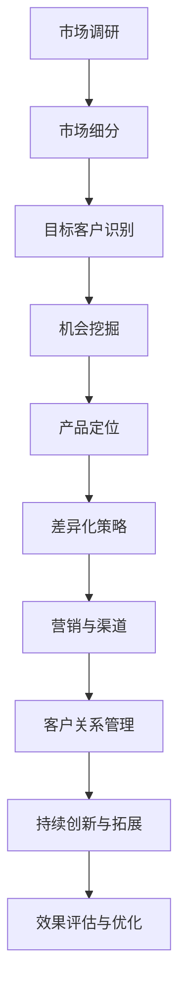
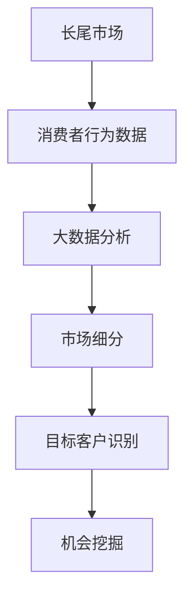

                 

### 《创业公司的长尾市场开发策略》

> **关键词：** 长尾市场、创业公司、市场细分、数据分析、差异化策略

**摘要：**
本文深入探讨了创业公司如何通过长尾市场开发策略实现增长。我们首先介绍了长尾市场的概念和重要性，然后分析了如何通过市场细分、大数据分析、差异化策略等手段进入长尾市场。文章还详细讲解了长尾市场分析的核心算法和数学模型，以及提供了实际项目开发的实战案例。最后，总结了长尾市场开发策略的成功经验和对创业公司的建议。

### 目录大纲

1. **长尾市场概述**
    - 第1章：长尾市场的概念与价值
    - 第2章：长尾市场的兴起原因
    - 第3章：长尾市场与传统市场的比较
    - 第4章：长尾市场对企业战略的重要性
    - 第5章：长尾市场的发展趋势

2. **长尾市场分析**
    - 第6章：市场细分与目标客户识别
    - 第7章：长尾市场机会挖掘
    - 第8章：竞争对手分析

3. **长尾市场进入策略**
    - 第9章：产品定位与差异化策略
    - 第10章：营销与渠道策略
    - 第11章：运营与客户关系管理

4. **长期发展**
    - 第12章：持续创新与市场拓展
    - 第13章：竞争环境分析
    - 第14章：技术与产品创新

5. **成功案例分析**
    - 第15章：成功案例解析
    - 第16章：面临的挑战与应对策略

6. **结论与展望**
    - 第17章：长尾市场开发策略总结
    - 第18章：未来发展趋势与机遇
    - 第19章：对创业公司的建议

7. **附录**
    - 第20章：长尾市场开发工具与资源
    - 第21章：长尾市场开发流程图
    - 第22章：参考文献

---

**接下来，我们将逐一深入探讨上述章节的内容。**

### 第一部分：长尾市场概述

**第1章：长尾市场的概念与价值**

**1.1 长尾市场的定义**

长尾市场（Long Tail Market）这一概念由美国作家Chris Anderson在其2004年的文章《长尾理论》中提出。长尾市场指的是在传统市场中那些销售量较少但累加起来可以占据相当大市场份额的商品或服务。在传统零售模式中，市场资源往往集中在少数热门产品上，而长尾市场则代表着那些未被传统商业模式充分发掘的潜在市场。

长尾市场的特点可以总结为以下几点：

- **多样性**：长尾市场包含大量多样化的商品或服务，这些产品在传统市场中往往因为销量低而被忽视。
- **累积效应**：尽管单个商品或服务的销量不高，但通过大量累积，长尾市场可以占据与热门产品相当的市场份额。
- **低边际成本**：由于数字化和网络技术的发展，长尾市场产品的生产、存储和分销成本相对较低，使得企业能够以较低的成本进入这些市场。
- **消费者需求多样**：长尾市场的消费者具有多样化的需求，他们愿意为特定、小众的产品支付更高的价格。

**1.2 长尾市场的兴起原因**

长尾市场的兴起主要归因于以下几个因素：

- **互联网的发展**：互联网使得企业能够以低成本接触到全球消费者，传统地域和渠道限制被打破，长尾市场得以形成和扩大。
- **数字化技术的普及**：数字技术使得大量个性化产品和服务能够被生产和分销，满足了消费者多样化的需求。
- **大数据和数据分析**：企业可以通过大数据分析精确识别和定位长尾市场的消费者，优化市场策略。
- **电子商务的兴起**：电子商务平台为长尾市场提供了广泛的销售渠道，使得小众商品也能够被广泛推广。

**1.3 长尾市场与传统市场的比较**

传统市场通常以热门产品和大规模生产为主要特征，而长尾市场则更加注重小众和个性化。两者之间的比较可以总结为以下几点：

- **产品类型**：传统市场以大众消费品为主，长尾市场则以小众、个性化产品为主。
- **市场份额**：传统市场集中于少数热门产品，长尾市场则通过大量小众产品累积市场份额。
- **盈利模式**：传统市场依赖于规模经济，长尾市场则依赖于大量小订单的积累。
- **营销策略**：传统市场注重大规模广告和推广，长尾市场则更注重精准营销和社区运营。

**1.4 长尾市场对企业战略的重要性**

长尾市场对企业战略的重要性体现在以下几个方面：

- **拓展市场份额**：通过进入长尾市场，企业可以开拓新的市场空间，增加市场份额。
- **增加收入来源**：长尾市场的低边际成本使得企业能够通过销售小众产品获得额外收入。
- **提升品牌价值**：长尾市场产品通常具有较高的差异化，有助于提升企业的品牌形象。
- **增强竞争力**：通过长尾市场策略，企业可以灵活应对市场变化，增强竞争力。

**1.5 长尾市场的发展趋势**

随着科技的进步和消费者需求的多样化，长尾市场将继续发展。以下是长尾市场的发展趋势：

- **市场细分更加细化**：消费者需求更加多样化，长尾市场的细分将更加精细。
- **个性化服务增加**：企业将通过个性化服务满足消费者的多样化需求。
- **数字化与智能化**：数字化和智能化技术的应用将进一步提升长尾市场的效率。
- **全球市场扩展**：长尾市场将不仅限于本土，还将扩展到全球市场。

**总结：**

长尾市场作为一种新兴市场模式，为企业提供了广阔的发展空间。通过深入了解长尾市场的概念和特点，企业可以制定有效的长尾市场开发策略，实现持续增长。

---

**接下来，我们将进一步探讨长尾市场的兴起原因和长尾市场与传统市场的比较，为创业公司进入长尾市场提供更为深入的策略指导。**

### 第二部分：长尾市场分析

#### 第2章：市场细分与目标客户识别

市场细分与目标客户识别是长尾市场开发的关键步骤。通过精准的市场细分，企业可以更好地理解不同客户群体的需求，从而制定有针对性的营销策略。

**2.1 市场细分的方法**

市场细分是营销战略的重要组成部分，旨在将广泛的市场划分为更小、更易管理的部分。以下是几种常见的市场细分方法：

- **地理细分**：根据地理位置将市场划分为不同的区域，如国家、地区、城市等。地理细分有助于企业针对特定地区的消费者需求制定营销策略。

- **人口细分**：基于人口统计特征进行市场细分，如年龄、性别、收入、职业、教育水平等。人口细分有助于企业识别不同消费群体的特征和需求。

- **心理细分**：根据消费者的心理特征和生活方式进行细分，如价值观、兴趣爱好、消费习惯等。心理细分有助于企业理解消费者的内心需求，提供更个性化的产品和服务。

- **行为细分**：基于消费者的购买行为、使用习惯、忠诚度等进行细分。行为细分有助于企业识别高价值客户，制定针对性的忠诚度计划。

**2.2 利用大数据分析识别目标客户**

大数据分析在市场细分和目标客户识别中发挥着重要作用。通过大数据技术，企业可以从海量数据中提取有价值的信息，从而更精准地定位目标客户。以下是大数据分析在目标客户识别中的应用：

- **消费者行为分析**：通过分析消费者在社交媒体、电商平台、搜索引擎等渠道的行为数据，企业可以了解消费者的兴趣、偏好和购买习惯，从而识别潜在的目标客户。

- **市场趋势预测**：大数据分析可以揭示市场趋势和变化，帮助企业预测未来市场需求，提前布局。

- **客户细分**：基于消费者的数据特征，大数据分析可以将市场划分为不同的细分群体，为每个群体提供定制化的营销策略。

**2.3 消费者行为分析**

消费者行为分析是市场细分的核心环节，通过分析消费者行为数据，企业可以深入了解消费者的需求和行为模式。以下是消费者行为分析的主要内容：

- **购买行为**：分析消费者的购买频率、购买金额、购买渠道等，了解消费者的购买习惯和偏好。

- **使用行为**：分析消费者在使用产品或服务时的行为，如使用频率、使用时长、使用场景等，了解产品的用户体验。

- **互动行为**：分析消费者与品牌互动的行为，如评论、反馈、社交媒体互动等，了解消费者对品牌的满意度和忠诚度。

**2.4 潜在市场规模评估**

在市场细分和目标客户识别过程中，评估潜在市场规模至关重要。以下是几种常用的市场规模评估方法：

- **市场渗透率**：评估当前市场占有率，通过比较目标市场与总市场的比例，估算潜在市场规模。

- **市场份额**：分析竞争对手在目标市场的占有率，结合自身产品特点和市场定位，估算潜在市场规模。

- **增长潜力**：通过分析市场趋势、消费者需求变化等，评估市场未来的增长潜力。

**2.5 竞争对手分析**

了解竞争对手是市场细分和目标客户识别的重要环节。以下是竞争对手分析的主要内容：

- **竞争对手的产品和服务**：分析竞争对手的产品组合、服务特点、价格策略等，了解竞争对手的优势和劣势。

- **竞争对手的市场策略**：分析竞争对手的市场定位、营销策略、客户关系管理等，了解竞争对手的营销策略和运营模式。

- **竞争优势分析**：评估自身产品或服务的竞争优势，如产品质量、品牌影响力、客户服务等，制定针对性的市场策略。

**总结：**

通过市场细分和目标客户识别，企业可以更精准地定位消费者需求，制定有针对性的营销策略。利用大数据分析技术，企业可以深入了解消费者行为，评估潜在市场规模，并有效应对竞争对手。这些策略将有助于企业在长尾市场中取得成功。

---

**在下一章节中，我们将探讨长尾市场机会的挖掘，帮助创业公司发现并利用长尾市场的潜在机会。**

### 第三部分：长尾市场机会挖掘

**第3章：长尾市场机会挖掘**

在长尾市场中，机会无处不在，但发现和挖掘这些机会是创业公司成功的关键。本章将详细介绍如何通过市场研究、基于需求的创新和专业化市场策略来挖掘长尾市场机会。

**3.1 长尾市场机会的类型**

长尾市场机会可以大致分为以下几种类型：

- **需求多样化**：随着消费者需求的多样化，那些未被满足的个性化需求成为长尾市场的主要机会。例如，定制化服饰、个性化礼品等。
- **市场空白点**：某些市场细分领域可能尚未被充分开发，存在空白点，这为创业公司提供了机会。例如，某些小语种学习资源、特定行业的专业工具等。
- **技术创新**：新技术的发展和应用可以创造出新的长尾市场机会。例如，智能家居设备、可穿戴设备等。
- **消费升级**：随着消费者收入水平的提高，他们对品质和体验的要求也在提升，这为高品质、高附加值的产品和服务提供了机会。

**3.2 基于需求的创新**

基于需求的创新是挖掘长尾市场机会的重要策略。以下是一些具体方法：

- **用户调研**：通过问卷调查、访谈等方式，深入了解用户的需求和痛点，从而发现潜在的市场机会。
- **痛点分析**：分析用户在使用现有产品或服务时遇到的问题，提出解决方案，创造新的市场需求。
- **趋势预测**：通过大数据分析、市场研究等手段，预测未来市场趋势，提前布局。
- **用户共创**：与用户共同参与产品研发，根据用户反馈不断优化产品，实现需求与供给的精准匹配。

**3.3 市场空白点的发现**

市场空白点的发现是挖掘长尾市场机会的重要途径。以下是一些方法：

- **竞争分析**：通过分析竞争对手的产品和服务，识别市场上的空白点。例如，某些细分市场可能尚未被充分开发，存在产品和服务上的空白。
- **用户需求调研**：了解用户对现有产品和服务的满意度，识别未被满足的需求，从而发现市场空白点。
- **行业报告**：通过阅读行业报告，了解市场趋势和变化，发现潜在的市场机会。
- **社交媒体**：在社交媒体平台上观察用户讨论和需求，发现市场空白点。

**3.4 专业化市场策略**

专业化市场策略是指针对特定细分市场制定有针对性的市场策略。以下是一些具体策略：

- **垂直化运营**：专注于某一细分市场，提供专业化的产品和服务，建立行业领导地位。
- **差异化定位**：通过差异化产品和服务，满足特定客户群体的特殊需求，形成竞争优势。
- **品牌建设**：通过品牌建设和推广，提高品牌知名度和美誉度，吸引目标客户。
- **精准营销**：通过大数据分析和精准营销手段，将产品和服务推送到目标客户，提高转化率。

**3.5 案例分析：成功挖掘长尾市场机会**

**案例：个性化定制礼品市场**

某创业公司发现，市场上的礼品大多为标准化产品，消费者对个性化和定制化的需求日益增加。该公司决定进入个性化定制礼品市场，通过以下策略成功挖掘长尾市场机会：

- **用户调研**：通过问卷调查和用户访谈，深入了解消费者对个性化定制礼品的需求。
- **产品创新**：推出各种个性化定制服务，如定制印字、图案设计等，满足消费者的个性化需求。
- **精准营销**：通过社交媒体和电商平台，精准推送个性化定制礼品广告，吸引目标客户。
- **品牌建设**：通过高质量的产品和服务，建立良好的品牌形象，提高客户忠诚度。

通过上述策略，该公司在个性化定制礼品市场中取得了显著成功，市场份额不断增长。

**总结：**

长尾市场机会挖掘需要从多个角度进行分析和策略制定。基于需求的创新、市场空白点的发现和专业化市场策略是成功挖掘长尾市场机会的关键。通过精准的市场细分和有针对性的策略，创业公司可以在长尾市场中找到属于自己的机会，实现持续增长。

---

**在下一章节中，我们将探讨创业公司如何通过产品定位和差异化策略进入长尾市场。**

### 第四部分：长尾市场进入策略

**第4章：产品定位与差异化策略**

在长尾市场中，创业公司需要通过产品定位和差异化策略来吸引目标客户，建立竞争优势。以下是详细的策略和步骤：

**4.1 产品定位的原则**

产品定位是长尾市场开发的核心环节，以下是一些关键原则：

- **精准定位**：明确目标客户群体，根据客户需求和偏好制定产品定位。
- **差异化**：在产品特性、功能、设计等方面与竞争对手形成差异化，以吸引特定客户。
- **高附加值**：提供高附加值的产品和服务，以满足目标客户对品质和体验的追求。
- **可持续性**：确保产品定位具有长期可持续性，能够应对市场变化和竞争压力。

**4.2 差异化策略的实施**

差异化策略是长尾市场成功的关键。以下是几种常见的差异化策略：

- **技术创新**：通过技术创新，提供独特的产品功能或技术优势，如智能家居设备中的智能传感器、可穿戴设备中的健康监测功能等。
- **个性化定制**：提供个性化定制服务，满足消费者对独特性和个性化的需求，如定制服饰、定制家居等。
- **服务质量**：提供高质量的服务，包括售后服务、客户支持、用户体验等，以提升客户满意度和忠诚度。
- **品牌形象**：通过品牌形象塑造，传达产品价值和品牌理念，建立品牌认知度和美誉度。

**4.3 价值主张与品牌建设**

价值主张是产品或服务的核心价值，是吸引客户的重要因素。以下是构建价值主张和品牌建设的步骤：

- **明确价值主张**：确定产品或服务的独特价值，回答“为什么客户会选择我们的产品？”这个问题。
- **品牌定位**：根据价值主张，确定品牌在市场中的定位，如高端、专业、个性等。
- **品牌传播**：通过品牌传播，将价值主张传递给目标客户，如通过广告、公关活动、社交媒体等渠道。
- **品牌维护**：持续维护品牌形象，通过高质量的产品和服务、积极的客户互动等，提升品牌价值。

**4.4 定价策略与营销组合**

定价策略和营销组合是长尾市场成功的重要保障。以下是具体的策略：

- **定价策略**：根据产品特性、市场需求和竞争情况，选择合适的定价策略，如成本定价、价值定价、竞争定价等。
- **营销组合**：制定包括产品、价格、促销、渠道在内的全面营销策略，如通过线上广告、社交媒体推广、会员营销等手段。
- **跨渠道整合**：实现线上和线下渠道的整合，提供一致性的购物体验，提高客户满意度。
- **客户关系管理**：通过客户关系管理，建立和维护长期客户关系，提高客户忠诚度和口碑传播。

**4.5 案例分析：成功实施产品定位和差异化策略**

**案例：一家定制化家具公司的成功经验**

某定制化家具公司通过以下策略成功进入长尾市场：

- **产品定位**：专注于高端定制家具市场，满足消费者对个性化、高品质家具的需求。
- **差异化策略**：提供个性化设计服务，根据客户需求定制家具，同时采用高质量材料和精湛工艺，确保家具的耐用性和美观性。
- **价值主张**：强调家具的独特性和个性化，提供优质售后服务，确保客户满意度。
- **品牌建设**：通过精美的品牌设计和推广活动，提高品牌知名度和美誉度。
- **定价策略**：采用成本定价策略，以合理的价格提供高品质定制家具。

通过上述策略，该公司在定制化家具市场中取得了显著成功，市场份额不断增长。

**总结：**

产品定位和差异化策略是创业公司进入长尾市场的重要手段。通过精准定位、差异化策略、价值主张和品牌建设，企业可以吸引目标客户，建立竞争优势，实现长期增长。

---

**在下一章节中，我们将探讨创业公司在长尾市场中的营销与渠道策略，帮助公司扩大市场影响力。**

### 第五部分：营销与渠道策略

**第5章：营销与渠道策略**

在长尾市场中，有效的营销与渠道策略是创业公司成功拓展市场、提升品牌知名度和销售额的关键。以下将详细探讨营销渠道的选择、社交媒体与在线营销、营销活动规划与执行、渠道合作与分销网络，以及成功实施营销与渠道策略的案例分析。

**5.1 营销渠道的选择**

选择合适的营销渠道是长尾市场成功的关键步骤。以下是一些常见的营销渠道：

- **电子商务平台**：如淘宝、京东、亚马逊等，这些平台具有广泛的用户基础和成熟的物流体系，适合中小企业快速进入市场。
- **社交媒体**：如微信、微博、Facebook、Instagram等，这些平台可以提供低成本、高互动的营销渠道，帮助企业建立品牌形象和与消费者的直接联系。
- **内容营销**：通过撰写高质量的文章、博客、视频等，吸引用户关注，提升品牌知名度和权威性。
- **线下渠道**：如专卖店、连锁店、展览会等，这些渠道可以提供真实的产品体验，增强消费者的信任感。
- **线下活动**：如发布会、研讨会、展会等，这些活动可以吸引目标客户，提高品牌曝光率。

**5.2 社交媒体与在线营销**

社交媒体与在线营销在长尾市场中具有重要作用。以下是一些策略：

- **社交媒体运营**：通过定期发布有价值的内容、互动与粉丝建立良好关系，提高品牌知名度。同时，利用社交媒体广告精准推送目标客户，提升营销效果。
- **内容营销**：通过撰写高质量的内容，如博客、视频、案例分析等，吸引用户关注，提高网站流量和转化率。
- **搜索引擎优化（SEO）**：通过优化网站内容和结构，提高在搜索引擎中的排名，吸引更多目标客户。
- **搜索引擎营销（SEM）**：通过购买关键词广告，提高在搜索引擎中的广告曝光率，吸引潜在客户。
- **电子邮件营销**：通过定期发送有价值的信息和优惠活动，提高客户忠诚度和复购率。

**5.3 营销活动的规划与执行**

成功的营销活动需要周密的规划和有效的执行。以下是一些关键步骤：

- **目标设定**：明确营销活动的目标，如提高品牌知名度、提升销售额、吸引新客户等。
- **目标客户分析**：了解目标客户的需求和偏好，制定有针对性的营销策略。
- **活动策划**：设计活动形式、内容、时间和地点，确保活动能够吸引目标客户参与。
- **资源准备**：包括人力、资金、物料等，确保活动能够顺利进行。
- **活动推广**：通过线上线下多种渠道推广活动，提高活动曝光率。
- **活动执行**：严格按照活动策划执行，确保活动顺利进行。
- **效果评估**：通过收集数据、客户反馈等，评估活动效果，为未来营销活动提供参考。

**5.4 渠道合作与分销网络**

渠道合作与分销网络是拓展市场的有效手段。以下是一些策略：

- **合作伙伴选择**：选择与公司品牌形象和目标市场相匹配的合作伙伴，确保渠道资源的互补性。
- **合作模式**：根据合作伙伴的能力和资源，选择合适的合作模式，如独家代理、分销合作、联合营销等。
- **渠道管理**：建立有效的渠道管理体系，确保渠道资源的合理分配和管理。
- **分销网络**：通过建立线下分销网络，提供真实的产品体验，提高品牌知名度和消费者信任度。
- **供应链管理**：优化供应链管理，确保产品快速、准确地到达终端消费者。

**5.5 案例分析：成功实施营销与渠道策略**

**案例：一家定制化珠宝品牌的成功经验**

某定制化珠宝品牌通过以下策略成功实施营销与渠道策略：

- **渠道选择**：同时利用线上电商平台和线下专卖店，提供多元化购物体验。
- **社交媒体运营**：通过微信、Instagram等社交媒体平台，发布高质量内容，与粉丝建立良好关系。
- **内容营销**：撰写专业珠宝知识博客、发布精美珠宝摄影作品，提升品牌专业形象。
- **营销活动**：定期举办线上优惠活动、线下珠宝展览，吸引目标客户参与。
- **渠道合作**：与高端酒店、奢侈品店等合作，提高品牌曝光率和消费者信任度。
- **分销网络**：通过建立线下专卖店和加盟店，拓展市场覆盖范围。

通过上述策略，该品牌在定制化珠宝市场中取得了显著成功，销售额和品牌知名度持续提升。

**总结：**

营销与渠道策略在长尾市场中至关重要。通过选择合适的营销渠道、实施有效的社交媒体与在线营销、规划与执行成功的营销活动、建立渠道合作与分销网络，创业公司可以扩大市场影响力，提升品牌知名度，实现持续增长。

---

**在下一章节中，我们将探讨创业公司在长尾市场中的运营与客户关系管理策略，帮助公司建立稳定的客户群体和良好的口碑。**

### 第六部分：运营与客户关系管理

**第6章：运营与客户关系管理**

在长尾市场中，运营与客户关系管理（CRM）是创业公司保持竞争优势、提升客户满意度和忠诚度的关键。以下是关于客户关系管理的重要性、客户生命周期管理、客户反馈与改进、客户忠诚度与口碑营销，以及成功实施客户关系管理的案例分析。

**6.1 客户关系管理的重要性**

客户关系管理是现代企业成功运营的核心环节，其重要性体现在以下几个方面：

- **提升客户满意度**：通过有效的客户关系管理，企业可以更好地理解客户需求，提供个性化的服务，从而提升客户满意度。
- **增强客户忠诚度**：良好的客户关系管理可以培养客户忠诚度，减少客户流失，提高客户生命周期价值。
- **优化运营效率**：通过客户关系管理，企业可以优化业务流程，提高运营效率，降低成本。
- **提高市场份额**：稳定的客户关系有助于企业扩大市场份额，提高品牌知名度。

**6.2 客户生命周期管理**

客户生命周期管理是客户关系管理的核心概念，它将客户生命周期划分为多个阶段，并针对每个阶段实施不同的管理策略。以下是客户生命周期的各个阶段及其管理策略：

- **获取阶段**：企业通过各种营销手段吸引新客户，如广告、促销、网络营销等。此阶段的关键是提高客户转化率。
- **成长阶段**：在新客户转化为忠实客户的过程中，企业需要提供优质的产品和服务，建立良好的客户体验，以提高客户满意度。
- **成熟阶段**：客户关系稳定，企业可以通过交叉销售和升级销售，挖掘客户潜力，提高客户生命周期价值。
- **衰退阶段**：面对潜在流失的客户，企业可以通过忠诚度计划、个性化优惠等手段，努力挽回客户，延长客户生命周期。

**6.3 客户反馈与改进**

客户反馈是优化产品和服务的重要依据。以下是处理客户反馈和持续改进的方法：

- **建立反馈渠道**：通过在线客服、调查问卷、社交媒体等渠道，收集客户的反馈和建议。
- **及时响应**：对客户的反馈进行快速响应，解决客户问题，提高客户满意度。
- **数据分析**：对收集到的客户反馈进行数据分析，识别常见问题和高频需求，优化产品和服务。
- **持续改进**：根据客户反馈，不断优化产品和服务，提高客户体验。

**6.4 客户忠诚度与口碑营销**

客户忠诚度和口碑营销是长尾市场成功的重要因素。以下是提升客户忠诚度和口碑营销的策略：

- **忠诚度计划**：通过积分、会员优惠、专属活动等方式，培养客户忠诚度，提高客户重复购买率。
- **个性化服务**：根据客户需求和偏好，提供个性化的产品和服务，提高客户满意度和忠诚度。
- **口碑营销**：鼓励满意的客户分享他们的体验，通过口碑传播提高品牌知名度和信誉度。
- **客户推荐**：实施推荐奖励计划，激励现有客户推荐新客户，实现客户增长。

**6.5 案例分析：成功实施客户关系管理**

**案例：一家个性化定制运动鞋品牌的成功经验**

某个性化定制运动鞋品牌通过以下策略成功实施客户关系管理：

- **获取阶段**：通过社交媒体广告和线上促销活动，吸引新客户。
- **成长阶段**：提供个性化定制服务，确保客户满意度，建立良好的客户体验。
- **成熟阶段**：实施会员计划，提供专属优惠和活动，提高客户忠诚度。
- **衰退阶段**：定期发送客户满意度调查，及时响应客户问题，努力挽回潜在流失客户。

此外，该品牌还注重客户反馈与改进，通过数据分析优化产品和服务，提高客户体验。通过一系列客户关系管理策略，该品牌在个性化定制运动鞋市场中取得了显著成功。

**总结：**

运营与客户关系管理在长尾市场中至关重要。通过实施有效的客户关系管理策略，创业公司可以提升客户满意度、增强客户忠诚度、优化运营效率，从而在竞争激烈的市场中脱颖而出。成功的客户关系管理不仅有助于企业实现短期增长，更为长期可持续发展奠定坚实基础。

---

**在下一章节中，我们将探讨创业公司的长期发展策略，包括持续创新与市场拓展，帮助公司保持市场竞争力并实现持续增长。**

### 第七部分：长期发展

**第7章：持续创新与市场拓展**

在长尾市场中，创业公司要想保持竞争力并实现持续增长，必须注重持续创新和市场拓展。以下将详细探讨创新思维与方法、市场拓展策略、竞争环境分析、技术与产品创新，以及成功实施长期发展策略的案例分析。

**7.1 创新思维与方法**

创新思维和方法是创业公司持续发展的动力。以下是一些有效的创新思维与方法：

- **用户参与**：通过与用户互动，了解用户需求，将用户需求转化为创新点子。
- **头脑风暴**：组织团队成员进行头脑风暴，鼓励自由表达和创意碰撞。
- **跨界合作**：与其他领域的企业或专家合作，引入新的思维和方法。
- **快速迭代**：采用敏捷开发方法，快速迭代产品，不断优化和改进。
- **科技驱动**：紧跟科技发展趋势，利用新兴技术（如人工智能、区块链等）推动产品创新。

**7.2 市场拓展策略**

市场拓展是创业公司长期发展的关键。以下是一些市场拓展策略：

- **全球化布局**：通过进入国际市场，拓展海外业务，实现业务规模和影响力的提升。
- **区域扩张**：在国内市场中选择具有潜力的区域，逐步扩大市场份额。
- **多元化产品线**：通过开发新的产品线，满足不同客户群体的需求，实现业务多元化。
- **战略合作**：与行业内的领先企业建立战略合作关系，共同开拓市场。
- **渠道拓展**：通过建立新的销售渠道，如电商平台、线下连锁店等，扩大市场覆盖范围。

**7.3 竞争环境分析**

了解竞争环境是制定有效市场拓展策略的重要前提。以下是一些竞争环境分析的方法：

- **竞争对手分析**：分析竞争对手的产品、市场份额、市场策略等，了解竞争对手的优势和劣势。
- **市场趋势分析**：通过分析市场趋势，了解行业的未来发展方向，把握市场机遇。
- **客户需求分析**：了解目标客户的需求变化和偏好，制定针对性的产品和服务策略。
- **政策法规分析**：了解相关政策法规，确保企业在市场中合规经营。

**7.4 技术与产品创新**

技术与产品创新是创业公司保持竞争力的关键。以下是一些技术与产品创新的策略：

- **技术研发**：加大技术研发投入，开发具有自主知识产权的核心技术和产品。
- **产品迭代**：不断优化现有产品，提高产品质量和用户体验。
- **产品差异化**：通过差异化产品，满足特定客户群体的需求，形成竞争优势。
- **跨界融合**：将不同领域的先进技术融合到产品中，创造新的商业模式和市场机会。

**7.5 案例分析：成功实施长期发展策略**

**案例：一家智能健身设备的创业公司**

某智能健身设备创业公司通过以下策略成功实施长期发展：

- **创新思维**：通过与健身教练和用户合作，了解用户需求，开发符合市场需求的产品。
- **市场拓展**：在国内市场成功后，逐步进入国际市场，通过战略合作和渠道拓展，扩大市场份额。
- **技术与产品创新**：采用人工智能技术，开发智能健身设备，提供个性化健身方案，提高用户体验。
- **竞争环境分析**：通过分析竞争对手和市场趋势，制定有针对性的市场策略，确保在竞争激烈的市场中脱颖而出。

通过一系列长期发展策略，该公司在智能健身设备市场中取得了显著成功，成为行业领先者。

**总结：**

长期发展是创业公司保持市场竞争力和实现持续增长的关键。通过创新思维与方法、市场拓展策略、竞争环境分析、技术与产品创新，创业公司可以不断开拓新的市场机会，提升自身竞争力。成功的长期发展策略将帮助创业公司在激烈的市场竞争中脱颖而出，实现持续增长。

---

**在下一章节中，我们将通过成功案例的详细分析，探讨创业公司在长尾市场开发策略中的经验与挑战。**

### 第八部分：成功案例分析

**第8章：成功案例分析**

在长尾市场开发中，有许多创业公司通过实施有效的策略取得了显著成功。以下将详细介绍几个典型的成功案例，分析其长尾市场开发策略、成功经验、面临的挑战及应对策略。

**8.1 案例选择与介绍**

为了更好地理解长尾市场开发策略的实践应用，我们选择了以下三个成功案例：

1. **个性化定制礼品品牌**
   - **简介**：一家提供个性化定制礼品服务的创业公司，通过满足消费者对个性化、定制化礼品的需求，成功进入长尾市场。
   - **成功原因**：利用大数据分析进行市场细分，提供多样化的定制服务，通过社交媒体和电商平台进行精准营销。
   - **挑战**：如何在保证产品品质的同时，提高生产效率，满足大量个性化订单的需求。
   - **应对策略**：采用自动化生产技术和定制化管理系统，提高生产效率和订单处理速度。

2. **智能健身设备创业公司**
   - **简介**：一家专注于智能健身设备的创业公司，通过人工智能技术和个性化健身方案，吸引了大量用户。
   - **成功原因**：紧跟科技发展趋势，创新产品功能，提供优质的用户体验，通过跨界合作拓展市场。
   - **挑战**：如何在激烈的市场竞争中保持技术创新和产品竞争力。
   - **应对策略**：持续加大研发投入，与高校和科研机构合作，推动技术创新。

3. **个性化定制服饰品牌**
   - **简介**：一家提供个性化定制服饰的创业公司，通过在线平台和社交媒体，将产品推向全球市场。
   - **成功原因**：利用大数据分析进行市场细分，提供个性化的设计和生产服务，通过社交媒体进行品牌推广。
   - **挑战**：如何在全球化运营中确保产品品质和服务的一致性。
   - **应对策略**：建立全球化的供应链体系，通过标准化流程确保产品品质和服务水平。

**8.2 长尾市场开发策略解析**

以下是上述案例中创业公司所采用的长尾市场开发策略：

1. **个性化定制礼品品牌**
   - **市场细分**：通过大数据分析，了解消费者对不同类型定制礼品的需求，如生日礼品、节日礼品等。
   - **差异化策略**：提供多样化的定制服务，包括个性化设计、定制印字等，满足消费者的个性化需求。
   - **营销与渠道**：通过社交媒体和电商平台进行精准营销，提高品牌曝光率和销售额。
   - **运营与客户关系管理**：建立完善的客户关系管理系统，确保快速响应客户需求，提高客户满意度。

2. **智能健身设备创业公司**
   - **市场细分**：通过大数据分析，识别健身爱好者的需求和偏好，如瑜伽、跑步、健身等。
   - **差异化策略**：采用人工智能技术，提供个性化健身方案，提升用户体验。
   - **营销与渠道**：通过跨界合作，与健身教练和健身APP合作，拓展市场渠道。
   - **技术与产品创新**：持续研发新技术，提高产品性能和用户体验。

3. **个性化定制服饰品牌**
   - **市场细分**：通过大数据分析，了解不同地区和消费者的时尚偏好，提供个性化的设计和生产服务。
   - **差异化策略**：提供多样化的个性化定制服务，如定制图案、材质选择等，满足消费者的个性化需求。
   - **营销与渠道**：通过社交媒体和电商平台进行品牌推广，提高品牌知名度和销售渠道。
   - **全球化运营**：建立全球化的供应链体系，确保产品品质和服务水平的一致性。

**8.3 成功经验与启示**

从上述案例中，我们可以总结出以下成功经验和启示：

- **市场细分与精准定位**：通过大数据分析进行市场细分，精准定位目标客户，提供个性化的产品和服务。
- **差异化策略**：在产品和服务方面与竞争对手形成差异化，提供独特的价值主张。
- **营销与渠道**：利用多种营销渠道和策略，提高品牌曝光率和销售额。
- **持续创新**：持续进行技术创新和产品优化，保持市场竞争力。
- **全球化运营**：建立全球化的运营体系，拓展国际市场，提高市场占有率。

**8.4 面临的挑战与应对策略**

尽管长尾市场开发策略能够带来显著成功，但创业公司仍将面临一系列挑战。以下是一些常见挑战及应对策略：

- **生产效率**：在个性化定制业务中，如何提高生产效率，满足大量个性化订单的需求。
  - **应对策略**：采用自动化生产技术和定制化管理系统，提高生产效率和订单处理速度。

- **技术创新**：在激烈的市场竞争中，如何保持技术创新和产品竞争力。
  - **应对策略**：持续加大研发投入，与高校和科研机构合作，推动技术创新。

- **客户满意度**：在全球化运营中，如何确保产品品质和服务的一致性，提高客户满意度。
  - **应对策略**：建立全球化的供应链体系，通过标准化流程确保产品品质和服务水平。

- **市场竞争**：在竞争激烈的市场中，如何保持市场地位和增长。
  - **应对策略**：通过市场细分、差异化策略和精准营销，提高品牌知名度和市场份额。

**总结：**

通过成功案例的分析，我们可以看到，创业公司通过有效的长尾市场开发策略，在个性化定制、智能设备、服饰等领域取得了显著成功。这些案例为我们提供了宝贵的经验和启示，帮助我们更好地理解长尾市场开发策略的实践应用。面对挑战，创业公司需要灵活应对，持续创新，以保持市场竞争力并实现长期发展。

---

**在下一章节中，我们将总结长尾市场开发策略的核心要点，并探讨长尾市场发展的未来趋势。**

### 第九部分：结论与展望

**第9章：结论与展望**

通过对长尾市场开发策略的深入探讨，我们可以得出以下结论：

**核心要点总结：**

1. **长尾市场的定义与价值**：长尾市场是指销售量较少但累加起来占据相当大市场份额的商品或服务。它为创业公司提供了广阔的发展空间，通过低边际成本和高多样化需求，企业可以有效地进入和占领这些市场。

2. **市场细分与目标客户识别**：精准的市场细分和目标客户识别是长尾市场开发的基础。通过大数据分析和消费者行为分析，企业可以更好地理解客户需求，从而制定有针对性的营销策略。

3. **差异化策略**：差异化策略是长尾市场成功的关键。通过技术创新、个性化定制、高附加值服务等手段，企业可以在激烈的市场竞争中脱颖而出。

4. **营销与渠道策略**：有效的营销与渠道策略能够帮助企业扩大市场影响力，提高品牌知名度和销售额。通过多元化的营销渠道和策略，企业可以更好地触及目标客户。

5. **客户关系管理**：良好的客户关系管理有助于提升客户满意度和忠诚度，从而延长客户生命周期，提高客户生命周期价值。

6. **持续创新与市场拓展**：持续创新和市场拓展是创业公司保持市场竞争力和实现持续增长的关键。通过技术创新、市场细分和全球化布局，企业可以不断开拓新的市场机会。

**未来发展趋势与机遇：**

随着科技的不断进步和消费者需求的多样化，长尾市场将继续发展。以下是一些未来发展趋势与机遇：

1. **个性化与定制化**：随着消费者对个性化、定制化需求的增加，个性化与定制化将成为长尾市场的重要趋势。

2. **数字化转型**：数字化转型将为长尾市场带来更多机会，通过大数据、人工智能等技术，企业可以更加精准地定位客户，提高运营效率。

3. **全球化**：全球市场的扩大为长尾市场提供了更广阔的发展空间。通过全球化布局，企业可以更好地进入国际市场，实现业务增长。

4. **新零售**：新零售模式的兴起将重新定义长尾市场的销售渠道和消费者体验，为创业公司提供更多创新机会。

**对创业公司的建议：**

1. **精准市场细分**：深入了解目标客户需求，进行精细化的市场细分，以便更好地制定营销策略。

2. **差异化策略**：通过技术创新、个性化定制等手段，打造独特的核心竞争力，提高品牌知名度。

3. **数字化转型**：利用大数据、人工智能等技术，提高运营效率，优化客户体验。

4. **持续创新**：持续进行产品和服务创新，保持市场竞争力。

5. **全球布局**：积极拓展国际市场，提高全球市场份额。

通过遵循上述建议，创业公司可以更好地把握长尾市场的发展机遇，实现持续增长。

**总结：**

长尾市场开发策略为创业公司提供了实现增长和成功的途径。通过精准的市场细分、差异化策略、有效的营销与渠道策略，以及良好的客户关系管理，创业公司可以把握长尾市场的机遇，实现持续创新与市场拓展。面对未来的发展，创业公司需要不断调整策略，灵活应对市场变化，以在激烈的市场竞争中脱颖而出。

---

**附录部分将提供长尾市场开发的相关工具与资源，帮助读者深入了解和实施长尾市场开发策略。**

### 第十部分：附录

**第10章：长尾市场开发工具与资源**

为了更好地帮助读者深入了解和实施长尾市场开发策略，以下将介绍一些常用的长尾市场开发工具与资源，包括分析工具、数据库与数据来源、营销渠道资源、客户关系管理软件等。

**10.1 分析工具**

- **Python数据分析库**：Python 是一种广泛用于数据分析的编程语言，其中一些常用的库包括 Pandas、NumPy、Scikit-learn 等，可用于数据预处理、特征工程和机器学习。
- **Tableau**：Tableau 是一款数据可视化工具，可用于创建交互式的图表和仪表盘，帮助理解数据趋势和洞察。
- **Google Analytics**：Google Analytics 是一款免费的数据分析工具，可用于分析网站流量、用户行为等，帮助企业优化营销策略。

**10.2 数据库与数据来源**

- **AWS S3**：Amazon S3 是一个对象存储服务，可用于存储和检索大量数据，适合进行大数据分析和处理。
- **Google BigQuery**：Google BigQuery 是一款高性能的云数据仓库，适用于大规模数据处理和分析。
- **MongoDB**：MongoDB 是一款文档数据库，适用于存储和管理非结构化和半结构化数据，适合进行市场细分和消费者行为分析。

**10.3 营销渠道资源**

- **Facebook Ads Manager**：Facebook Ads Manager 是一款广告管理工具，可用于创建和优化社交媒体广告。
- **Google Ads**：Google Ads 是一款广告平台，可用于搜索引擎营销（SEM）和展示广告。
- **LinkedIn Ads**：LinkedIn Ads 是一款面向商业和专业人士的广告平台，适合进行B2B营销。

**10.4 客户关系管理软件**

- **Salesforce**：Salesforce 是一款功能全面的客户关系管理（CRM）软件，适用于销售、营销和客户服务。
- **HubSpot**：HubSpot 是一款面向小型企业和创业公司的CRM软件，提供免费版本和付费版本，适合进行营销和客户管理。
- **Zoho CRM**：Zoho CRM 是一款面向全球市场的CRM软件，提供多种功能模块，适用于不同规模的企业。

**10.5 长尾市场开发流程图**

以下是长尾市场开发流程图的 Mermaid 表示：



通过上述工具与资源的合理运用，创业公司可以更加高效地实施长尾市场开发策略，实现业务的持续增长。

### 第十一部分：核心概念联系

为了更好地理解长尾市场开发策略，以下将探讨几个核心概念之间的联系。

**长尾市场与大数据分析**

大数据分析在长尾市场开发中起着至关重要的作用。通过大数据技术，企业可以从海量数据中提取有价值的信息，帮助市场细分、目标客户识别和机会挖掘。以下是一个简化的 Mermaid 流程图：



通过大数据分析，企业可以深入了解消费者行为，识别潜在的市场机会，从而制定更有效的长尾市场开发策略。

**核心算法原理讲解**

在长尾市场开发中，数据分析算法（如聚类分析、回归分析等）是关键工具。以下是一个简化的伪代码示例，用于市场细分：

```plaintext
# 数据收集与预处理
data = read_data()
cleaned_data = preprocess_data(data)

# 特征工程
features = extract_features(cleaned_data)

# 模型训练
model = train_model(features)

# 预测与评估
predictions = model.predict(new_data)
evaluate_model(predictions)
```

通过这些算法，企业可以识别出具有相似特征的消费者群体，从而进行精准的市场细分。

**数学模型和数学公式**

在长尾市场开发中，费用效益分析（CBA）是一个常用的数学模型。以下是一个简化的公式：

$$
CBA = \frac{B}{C}
$$

其中，B 是预期收益，C 是总成本。通过计算 CBA，企业可以评估投资回报率，从而决定是否进入某个长尾市场。

**项目实战**

以下是一个简化的长尾市场产品开发实战流程：

1. **开发环境搭建**：选择合适的操作系统、开发工具和数据库。
2. **数据收集与预处理**：从不同渠道收集数据，并进行清洗和标准化。
3. **数据分析和模型训练**：使用数据分析工具和算法对数据进行处理，训练预测模型。
4. **预测与评估**：对新数据进行预测，并评估模型性能。
5. **迭代优化**：根据预测结果和客户反馈，不断优化产品和服务。

通过上述流程，企业可以开发出满足长尾市场需求的创新产品，实现业务增长。

这些核心概念的联系构成了长尾市场开发策略的理论基础，通过具体的应用和实战案例，企业可以更好地理解和实施这些策略。

---

通过上述内容，我们系统地介绍了长尾市场开发策略的核心概念、算法原理、数学模型、实战案例以及未来的发展趋势。希望这些内容能够为创业公司提供有价值的参考和指导，帮助他们在长尾市场中取得成功。

