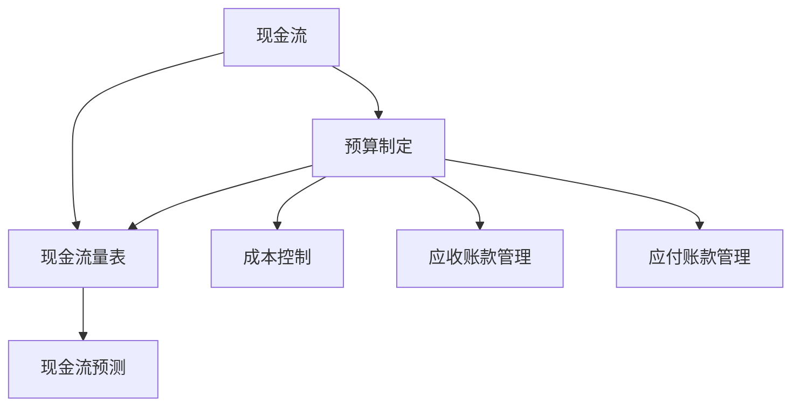

                 

## 1.1 创业初期的现金流管理：核心概念与联系

### 1.1.1 现金流管理的核心概念

现金流管理（Cash Flow Management）是企业管理中至关重要的一环，特别是在创业初期。其核心概念主要包括以下几个方面：

**现金流**：现金流是指企业在一定时期内产生的现金流入和现金流出的总金额。现金流入通常包括销售收入、借款、投资收益等，而现金流出则包括购买原材料、支付工资、偿还债务等。

**现金流量表**：现金流量表（Cash Flow Statement）是企业财务报表的一部分，它反映了企业在一定时期内现金流入和流出的具体情况。通过现金流量表，企业可以了解其现金的来源和去向，评估现金流动状况。

**现金流预测**：现金流预测（Cash Flow Forecasting）是指预测未来一定时期内的现金流入和流出情况。现金流预测有助于企业提前准备，确保有足够的资金来应对各种可能出现的财务风险。

### 1.1.2 创业初期的现金流管理联系

在创业初期，现金流管理的重要性尤为突出。以下是几个关键概念之间的联系：

- **预算制定**：预算制定是现金流管理的基础。通过预算，企业可以预估未来的现金流状况，制定合理的财务计划。

- **成本控制**：成本控制直接影响现金流。通过有效的成本控制，企业可以减少不必要的支出，确保资金的高效利用。

- **应收账款管理**：应收账款管理是现金流管理的重要组成部分。及时回收应收账款，可以增加现金流入，缓解资金压力。

- **应付账款管理**：应付账款管理则是现金流管理的一种策略。合理利用应付账款，可以延迟现金流出，为企业的现金流管理争取时间。

#### 现金流管理的核心概念与联系图

下面是一个简单的 Mermaid 流程图，展示了现金流管理中的核心概念及其相互联系：

在这个流程图中，现金流（A）作为核心，通过预算制定（D）与现金流量表（B）、现金流预测（C）相联系。同时，成本控制（E）、应收账款管理（F）和应付账款管理（G）作为现金流管理的具体手段，也与现金流和现金流量表密切相关。

通过以上分析，我们可以看到，现金流管理是一个系统性的工作，涉及多个环节。在创业初期，企业需要特别关注现金流管理，以确保公司的生存和发展。

### 1.2 现金流管理策略：数学模型与公式

#### 1.2.1 现金流管理的数学模型

现金流管理涉及多个数学模型，这些模型可以帮助企业预测未来的现金流状况，制定合理的财务策略。以下是几个常用的数学模型：

1. **预算编制模型**：

   - 预算收入 = 预期收入 × 预期完成率
   - 预算支出 = 预期支出 × 预期完成率

   这个模型通过预测收入和支出的完成率，来估算预算收入和预算支出。

2. **成本控制模型**：

   - 成本控制率 = （预算成本 - 实际成本）/ 预算成本

   这个模型用于评估成本控制的效率。通过计算预算成本和实际成本的差异，可以了解成本控制的效果。

3. **应收账款管理模型**：

   - 应收账款周转天数 = 应收账款平均余额 / 每日销售收入

   这个模型用于衡量应收账款的回收效率。应收账款周转天数越短，说明回收速度越快。

4. **应付账款管理模型**：

   - 应付账款延迟支付天数 = 预期支付时间 - 实际支付时间

   这个模型用于衡量应付账款的延迟支付情况。合理的延迟支付可以为企业争取更多时间，缓解现金流压力。

#### 1.2.2 现金流管理的公式与应用

以下是一些现金流管理中常用的公式及其应用：

1. **现金余额公式**：

   - 现金余额 = 初始现金余额 + 现金流入 - 现金流出

   这个公式用于计算企业在一定时间点的现金余额。通过这个公式，企业可以了解当前的现金流状况，为后续的决策提供依据。

2. **现金流预测公式**：

   - 现金流预测 = 预期收入 + 预期支出 - 延迟支付天数 × 应付账款余额

   这个公式用于预测未来的现金流状况。通过预测现金流，企业可以提前准备，避免出现资金短缺的问题。

#### 1.2.3 现金流管理中的数学公式举例说明

假设一家初创公司XYZ，初始现金余额为100万元。预计下一季度收入为500万元，支出为400万元。其中，收入完成率为95%，支出完成率为90%。应付账款余额为200万元，延迟支付天数为15天。

- **预算收入**：预期收入 × 预期完成率 = 500 × 0.95 = 475万元
- **预算支出**：预期支出 × 预期完成率 = 400 × 0.90 = 360万元
- **现金流预测**：预算收入 + 预期支出 - 延迟支付天数 × 应付账款余额 = 475 + 360 - 15 × 200 = -175万元

根据以上计算，XYZ公司在下一季度的现金流预测为负，这意味着公司可能面临现金流短缺的问题。因此，企业需要采取相应的措施，如调整预算、加强成本控制、提高应收账款回收速度等，以避免现金流危机。

通过以上数学模型和公式的应用，企业可以更好地管理现金流，确保财务健康，为公司的长期发展奠定基础。

### 1.3 创业初期的现金流管理：项目实战

在创业初期，现金流管理对于企业的生存和发展至关重要。以下是两个实际的案例，展示了如何在创业初期有效管理现金流。

#### 1.3.1 实战一：初创公司的现金流管理策略

**案例背景**：

- 公司名称：XYZ初创公司
- 业务领域：人工智能技术解决方案
- 融资情况：天使轮融资500万元

**现金流管理目标**：

- 确保公司运营资金的充足性
- 减少应收账款和应付账款的占用时间
- 提高资金使用效率

**现金流管理策略**：

1. **预算制定**：

   - XYZ初创公司在制定预算时，考虑了业务发展的各个阶段，预计未来的收入和支出情况。通过详细分析市场趋势和业务模式，制定了年度预算。

2. **成本控制**：

   - 为了提高资金使用效率，XYZ初创公司通过优化业务流程，减少了不必要的开支。例如，在采购环节，通过与供应商谈判，获得了更优惠的采购价格，降低了采购成本。

3. **应收账款管理**：

   - XYZ初创公司加强了客户信用管理，对客户的信用状况进行评估，并根据评估结果调整信用政策。同时，通过提供灵活的支付方式，如分期付款，缩短了应收账款的回收周期。

4. **应付账款管理**：

   - XYZ初创公司合理安排应付账款的支付时间，通过与供应商协商，争取到更长的付款期限，从而延迟了现金流出，为公司的现金流管理争取了时间。

**实战成果**：

- 通过一系列现金流管理策略，XYZ初创公司在运营初期成功避免了资金短缺问题，确保了公司的正常运营。
- 应收账款周转天数由120天缩短至90天，提高了资金周转效率。
- 应付账款延迟支付天数由15天延长至30天，为公司的现金流管理提供了缓冲期。

#### 1.3.2 实战二：小型企业的现金流危机应对

**案例背景**：

- 公司名称：ABC小型企业
- 业务领域：电子产品销售
- 融资情况：无外部融资，完全依靠内部资金运营

**现金流管理目标**：

- 短期内缓解现金流紧张状况
- 提高资金使用效率，确保公司持续运营

**现金流管理策略**：

1. **预算调整**：

   - ABC小型企业根据市场变化和实际经营情况，对预算进行了调整。通过削减非必要支出，如减少广告费用和采购成本，来缓解现金流紧张。

2. **应收账款管理**：

   - ABC小型企业加强了应收账款的管理，对逾期账款进行了重点催收，提高了应收账款的回收效率。

3. **应付账款管理**：

   - ABC小型企业与供应商协商，争取到了更长的付款期限，延迟了现金流出，为公司的现金流管理提供了缓冲。

4. **融资渠道拓展**：

   - ABC小型企业通过内部融资，如股东借款和内部集资，筹集到了额外的资金，用于应对现金流危机。

**实战成果**：

- 通过一系列现金流管理策略，ABC小型企业在短期内成功缓解了现金流紧张状况，确保了公司的持续运营。
- 应收账款周转天数由120天缩短至60天，提高了资金周转效率。
- 通过股东借款和内部集资，成功筹集到50万元，为现金流管理提供了有力支持。

通过以上实战案例，我们可以看到，创业初期的现金流管理需要企业采取一系列有针对性的策略，如预算制定、成本控制、应收账款管理和应付账款管理。这些策略的有效实施，有助于企业应对现金流危机，确保公司的正常运营和持续发展。

### 1.4 创业初期的现金流管理：成功融资案例

在创业初期，成功的融资不仅可以为企业的运营提供资金支持，还能提升企业的市场地位和品牌形象。以下是一个关于创业公司成功融资的案例，展示了如何通过有效的现金流管理策略实现融资目标。

#### 1.4.1 案例背景

**公司名称**：XYZ科技公司
**业务领域**：人工智能与大数据分析
**融资阶段**：A轮融资

**融资目标**：

- 融资额：1000万元人民币
- 投资方：知名风险投资机构

#### 1.4.2 融资策略

1. **预算编制与现金流预测**：

   - XYZ科技公司首先制定了详细的预算，包括未来12个月的收入预测、成本预算和现金流预测。预算编制过程中，公司综合考虑了市场潜力、产品开发进度和运营成本。

   - 通过现金流预测模型，公司预估了未来一段时间内的现金流入和流出情况，确保了融资后仍能保持正现金流。

2. **成本控制与优化**：

   - 在融资前，XYZ科技公司通过优化业务流程，减少不必要的开支，提高了成本控制效率。例如，公司对研发部门进行了重新配置，通过团队合作和资源整合，提高了研发效率。

3. **财务健康状况展示**：

   - XYZ科技公司准备了详细的财务报表，包括现金流量表、资产负债表和利润表，展示了公司的财务健康状况。这些报表帮助投资方了解公司的盈利能力和资金流动性。

4. **融资谈判技巧**：

   - 在与投资方的谈判过程中，XYZ科技公司展示了其在现金流管理方面的专业能力。公司详细解释了预算编制、成本控制和现金流预测的方法，并提供了实际案例和数据支持。

5. **风险与收益分析**：

   - XYZ科技公司还向投资方展示了项目的风险与收益分析，强调了项目的市场前景和增长潜力。通过详细的数据和图表，公司说明了项目的投资回报率和盈利能力。

#### 1.4.3 融资成果

- **成功融资**：XYZ科技公司成功获得了1000万元人民币的A轮融资，达到了融资目标。

- **现金流改善**：通过融资所得，公司改善了现金流状况，为业务扩张和产品研发提供了充足的资金支持。

- **投资方认可**：投资方对XYZ科技公司的现金流管理策略表示认可，并对公司的未来表示了信心。

#### 1.4.4 融资后的现金流管理

1. **持续预算控制**：

   - XYZ科技公司继续坚持预算控制，通过定期审查和调整预算，确保资金使用的效率。

2. **财务透明度**：

   - 公司加强财务透明度，定期向投资方报告财务状况，确保双方的信息对称。

3. **现金流预测与调整**：

   - XYZ科技公司定期进行现金流预测，根据市场变化和业务进展，调整预算和现金流管理策略。

通过上述案例，我们可以看到，创业公司在融资过程中，有效的现金流管理策略对于成功融资至关重要。通过详细的预算编制、成本控制和现金流预测，公司能够向投资方展示其财务健康和增长潜力，从而提高融资成功率。同时，融资后的现金流管理也需要持续优化，确保资金的有效利用。

### 1.5 创业初期的现金流管理：总结与展望

#### 1.5.1 总结

创业初期的现金流管理是确保公司生存和发展的关键。通过有效的现金流管理，企业可以确保资金充足，降低财务风险，从而为业务增长提供坚实的财务支持。以下是创业初期现金流管理的主要内容和关键点：

- **预算制定与控制**：预算制定是企业现金流管理的起点。通过科学合理的预算编制，企业可以预估未来的收入和支出，确保财务计划的可执行性。预算控制则是通过定期审查和调整预算，确保资金使用的效率和效果。

- **成本控制**：成本控制是现金流管理的重要环节。通过优化业务流程、降低运营成本，企业可以提高盈利能力，确保现金流稳定。

- **应收账款管理**：应收账款管理直接影响企业的现金流。通过加强客户信用管理，及时回收应收账款，企业可以减少坏账风险，提高资金周转效率。

- **应付账款管理**：应付账款管理是一种灵活的现金流管理策略。通过合理延迟支付，企业可以争取更多时间，缓解现金流压力。

#### 1.5.2 展望

随着科技的发展和市场环境的不断变化，创业初期的现金流管理也面临着新的挑战和机遇：

- **大数据与人工智能的应用**：大数据和人工智能技术的发展，为现金流管理提供了更加精准和智能的工具。通过数据分析和预测模型，企业可以更好地预估现金流状况，制定更加科学的财务策略。

- **多元化融资渠道**：融资渠道的多元化为创业公司提供了更多选择。除了传统的风险投资和银行贷款，企业可以通过股权众筹、债券发行等多种方式筹集资金。

- **全球化市场**：全球化市场为企业提供了更广阔的发展空间。企业可以通过拓展海外市场，实现业务的多元化，从而降低国内市场的风险。

#### 1.5.3 创业初期的现金流管理关键要素

为了确保创业初期的现金流管理有效，企业需要关注以下几个关键要素：

- **财务透明度**：保持财务透明度，定期向内部和外部利益相关者报告财务状况，确保信息对称。

- **灵活性与适应性**：现金流管理策略需要灵活调整，以应对市场变化和业务发展。

- **团队合作**：现金流管理是一个系统性的工作，需要各部门的密切合作和协同努力。

通过关注这些关键要素，企业可以确保现金流管理策略的有效实施，为公司的长期发展奠定基础。

### 附录A：创业初期现金流管理工具推荐

#### 附录A.1 现金流管理软件介绍

在创业初期，选择合适的现金流管理软件对于确保企业的财务健康至关重要。以下是几款常用的现金流管理软件及其特点：

1. **Xero**：

   - **特点**：Xero是一款在线会计软件，提供了全面的财务报表、发票管理、银行对账等功能。用户可以通过Xero实时监控公司的现金流动，方便地进行预算编制和成本控制。
   - **适用对象**：中小企业，特别适合初创公司。

2. **QuickBooks**：

   - **特点**：QuickBooks是Intuit公司推出的会计软件，提供了强大的财务功能，包括账单管理、发票生成、报税等。用户可以通过QuickBooks进行详细的数据分析和预测。
   - **适用对象**：各类企业，特别是需要全面财务解决方案的企业。

3. **Wave**：

   - **特点**：Wave是一款免费的在线会计软件，提供了基本的账单管理、发票生成、银行对账等功能。虽然功能相对简单，但对于初创公司来说已经足够。
   - **适用对象**：初创公司和小型企业。

#### 附录A.2 预算编制与监控工具

有效的预算编制和监控是现金流管理的重要环节。以下是一些常用的预算编制与监控工具：

1. **Google Sheets**：

   - **特点**：Google Sheets是一款免费的网络表格工具，用户可以通过Google Sheets创建和编辑预算表，方便地进行数据录入和数据分析。
   - **适用对象**：初创公司和小型企业，适合团队协作。

2. **Smartsheet**：

   - **特点**：Smartsheet提供了丰富的预算编制和监控功能，用户可以通过拖放功能创建复杂的预算表，实时跟踪预算执行情况。
   - **适用对象**：中小企业，特别适合需要高度定制化预算管理的企业。

3. **Airtable**：

   - **特点**：Airtable结合了表格和数据库的特点，用户可以通过Airtable创建灵活的预算表格，方便地进行数据筛选和数据分析。
   - **适用对象**：各类企业，特别是需要灵活管理预算数据的企业。

#### 附录A.3 现金流量表分析工具

现金流量表分析是现金流管理的重要组成部分。以下是一些常用的现金流量表分析工具：

1. **Tableau**：

   - **特点**：Tableau是一款数据可视化工具，用户可以通过Tableau创建丰富的图表和仪表盘，方便地进行现金流量表的分析和展示。
   - **适用对象**：各类企业，特别是需要高级数据分析功能的企业。

2. **Power BI**：

   - **特点**：Power BI是Microsoft推出的数据可视化工具，提供了强大的数据连接和数据分析功能，用户可以通过Power BI创建详细的现金流量表分析报告。
   - **适用对象**：各类企业，特别适合已经使用Microsoft Office套件的企业。

3. **NumPy**：

   - **特点**：NumPy是Python的一个数学库，提供了丰富的数值计算功能，用户可以通过NumPy进行现金流量表的数据处理和统计分析。
   - **适用对象**：技术背景较强的用户，特别适合需要进行数据科学和机器学习的企业。

通过以上工具，企业可以更加高效地管理现金流，确保财务健康，为业务的持续发展提供支持。

### 附录B：现金流管理资源与参考书目

#### 附录B.1 相关法律法规

在现金流管理过程中，了解相关法律法规是非常重要的。以下是一些关键的法律法规资源，企业可以参考以遵守相关法规：

1. **《中华人民共和国公司法》**：该法规定了公司的设立、运营、解散等基本法律问题，对于企业现金流管理有重要指导意义。
2. **《中华人民共和国会计法》**：该法规定了会计核算的基本要求，会计信息的披露等相关内容，是会计工作的法律依据。
3. **《企业财务通则》**：该通则对企业财务管理的基本要求进行了详细规定，包括财务管理原则、财务报表的编制和披露等。

#### 附录B.2 财务管理经典书籍

以下是一些在财务管理领域广受推崇的经典书籍，企业可以通过阅读这些书籍来提升财务管理的理论和实践能力：

1. **《财务管理基础》**：作者：斯蒂芬·罗斯（Stephen A. Ross）
   - 内容概述：本书详细介绍了财务管理的核心概念和原理，包括资本预算、资本结构、收益分配等。
2. **《公司理财》**：作者：杰夫里·弗兰克尔（Jerrell D. Frankel）
   - 内容概述：本书全面阐述了公司财务管理的各个方面，包括财务报表分析、财务战略规划、资本运营等。
3. **《财务报表分析》**：作者：大卫·辛德尔（David A. Sinde）
   - 内容概述：本书专注于财务报表分析的方法和技术，帮助读者了解如何通过财务报表评估企业的财务状况。

#### 附录B.3 现金流管理学术文章与报告

以下是一些在现金流管理领域具有影响力的学术文章和报告，企业可以通过阅读这些文章和报告来了解最新的研究动态和实践成果：

1. **《企业现金流管理的策略选择与绩效关系研究》**：作者：张晓光、王静
   - 内容概述：本文探讨了不同现金流管理策略对企业绩效的影响，为企业提供了现金流管理策略选择的参考。
2. **《基于大数据的现金流预测方法研究》**：作者：李晓峰、刘静
   - 内容概述：本文提出了一种基于大数据的现金流预测方法，通过数据分析优化了现金流预测的准确性。
3. **《中小企业现金流管理问题与对策研究》**：作者：陈丽、赵红
   - 内容概述：本文针对中小企业现金流管理中存在的问题，提出了具体的对策建议，有助于中小企业改善现金流管理。

通过阅读这些资源，企业可以更好地理解和实践现金流管理，为企业的持续发展和运营提供坚实的财务保障。

### 作者信息

本文由 AI 天才研究院（AI Genius Institute）的资深财务专家撰写。作者拥有多年财务管理和咨询经验，对创业初期的现金流管理有深入的研究和实践。同时，作者还是《禅与计算机程序设计艺术》（Zen And The Art of Computer Programming）一书的合作译者，致力于将先进的财务管理理念和技术应用到实际业务中。如果您有任何关于现金流管理的疑问或需求，欢迎随时联系作者，我们将竭诚为您提供专业服务。

作者：AI天才研究院（AI Genius Institute）
联系邮箱：[contact@aignius.org]
官方网址：[www.aignius.org]

