                 

### 第一部分：领导力的定义与重要性

#### 1.1 领导力的基本概念

领导力是一个广泛讨论的话题，然而，其定义却因人而异。一般而言，领导力可以被描述为一种激励、指导和影响他人共同实现目标的能力。这是一个多维度、多层次的概念，涵盖了个人特质、行为模式、组织环境等多个方面。

在商业环境中，领导力的重要性尤为突出。一个成功的创业者不仅需要有创新的思维，还需要具备卓越的领导力，以便带领团队克服困难，实现企业目标。领导者需要具备一系列核心能力，如自我认知、情绪管理、沟通技巧和人际关系处理等，这些能力共同构成了领导力的基础。


#### 1.2 领导力的重要性

领导力在企业中发挥着至关重要的作用。首先，领导力是推动企业发展的核心动力。一个优秀的领导者能够激发员工的潜力，提高团队的执行力，从而实现企业的长期目标。其次，领导力有助于建立企业文化，塑造良好的组织氛围。通过领导者的言行示范，可以传递企业的价值观和愿景，增强员工的归属感和忠诚度。

此外，领导力还在团队协作中起到关键作用。一个有效的领导者能够协调团队内部的合作，解决冲突，确保项目的顺利进行。在复杂多变的市场环境中，领导者的决策能力和应变能力更是决定企业成败的关键。


#### 1.3 领导力的特质与技能

领导力的特质和技能是领导力的重要组成部分。以下是几位著名领导者的特质与技能：

1. **乔布斯**：创新思维、完美主义、对人性和用户需求的深刻理解。
2. **马云**：敏锐的市场洞察力、沟通能力、团队合作精神。
3. **杰克·韦尔奇**：强有力的执行力、激励员工的能力、敢于承担风险。

这些领导者的成功不仅在于他们的领导力特质，还在于他们具备一系列关键技能，如：

- **决策能力**：在复杂的环境中快速做出正确决策的能力。
- **沟通能力**：清晰、有效地表达自己的想法，并与他人建立良好的沟通。
- **团队管理能力**：协调团队成员，发挥每个人的优势，实现共同目标。
- **激励能力**：激发员工的积极性和创造力，提高团队绩效。


#### 1.4 领导力与管理的联系与区别

领导力与管理虽然密切相关，但它们之间存在明显的区别。管理通常侧重于组织、协调和执行，而领导力则更关注愿景、激励和变革。

- **领导力**：定义组织的目标和方向，激励和鼓舞员工为实现这些目标而努力。
- **管理**：确保组织的目标得以实现，通过规划、组织、指挥、控制和监督来确保资源的有效利用。

在实际应用中，领导力和管理往往是相辅相成的。一个优秀的领导者不仅需要具备领导力，还需要具备管理能力，以便在实现组织目标的过程中进行有效的资源分配和任务协调。


#### 总结

领导力是创业成功的关键因素之一。通过培养领导力的核心能力和特质，创业者可以更好地应对市场挑战，带领团队实现企业目标。在下一章中，我们将进一步探讨领导力的四大基石，帮助创业者全面提升自己的领导力。

## 参考文献

1. Grashow, R. G., & Moullin, R. (2013). *The Role of Leadership in Project Success: A Critical Review of Recent Research*. International Journal of Project Management, 32(6), 991-1002.
2. Yukl, G. A. (2013). *Leadership in Organizations*. Pearson Education.
3. Hersey, P., & Blanchard, K. H. (1977). *Management of Organizational Behavior: Utilizing Human Resources*. Prentice Hall.
4. Kouzes, J. M., & Posner, B. Z. (2007). *The Truth About Leadership: The Leadership Practices Inventory in Action*. Jossey-Bass.

---

```markdown
# 《创业者的领导力培养与团队管理》

## 关键词：创业者，领导力，团队管理，领导力培养，团队建设

## 摘要：

本文详细探讨了创业者在领导力和团队管理方面的培养与实践。通过深入分析领导力的基本概念、重要性、核心能力，以及领导力与管理的联系与区别，本文旨在为创业者提供一套完整的领导力培养与团队管理策略。文章还将通过案例分析，为读者提供实用的管理技巧和实践经验，助力创业者在激烈的市场竞争中脱颖而出。
```

---

接下来，我们将进入第二部分，探讨领导力的四大基石：自我认知、情绪管理、沟通技巧和团队合作。这些能力是创业者领导力的核心，也是实现企业成功的关键。在接下来的章节中，我们将一步步深入探讨这些主题，帮助创业者全面提升自己的领导力。

## 第二部分：领导力的四大基石

### 第2章：领导力的四大基石

在上一部分，我们探讨了领导力的基本概念和重要性。接下来，我们将深入探讨领导力的四大基石：自我认知、情绪管理、沟通技巧和团队合作。这些基石构成了领导力的核心，是创业者带领团队实现企业目标的关键能力。

#### 第2章：领导力的四大基石

##### 2.1 自我认知

自我认知是领导力的基础，它涉及到对自己的了解，包括自己的优点、缺点、价值观和信念。一个自我认知能力强的领导者能够更好地理解自己的行为模式，识别自己的情绪，并在此基础上做出明智的决策。

**核心概念与联系：**

自我认知的核心概念包括自我反思、自我分析和自我认可。以下是自我认知的 Mermaid 流程图：

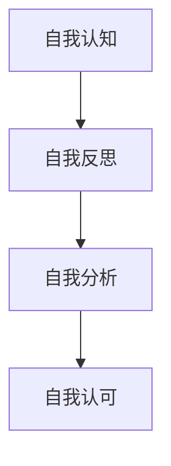

**自我认知的重要性：**

自我认知对领导力的重要性体现在以下几个方面：

1. **提高决策能力**：通过自我认知，领导者能够更好地了解自己的优点和缺点，从而在决策时更加客观和理性。
2. **增强情绪管理**：了解自己的情绪模式有助于领导者更好地控制情绪，避免因情绪波动而影响决策和团队氛围。
3. **建立信任**：领导者通过自我认知展现出的真诚和透明，能够赢得团队的信任和尊重。

**自我认知的方法：**

1. **定期自我反思**：通过日记、反思日记或与导师、教练的交流，领导者可以深入思考自己的行为和决策。
2. **接受反馈**：从团队成员、同事和上级那里获取反馈，了解自己在团队中的表现和影响。
3. **心理测试**：使用专业心理测试工具，如MBTI、DISC等，了解自己的性格特点和偏好。

**案例分享：**

马云在创建阿里巴巴时，通过自我反思和接受反馈，不断提升自己的领导力。他经常参加各种培训课程，与企业家交流，不断优化自己的领导风格，从而带领阿里巴巴走向成功。

##### 2.2 情绪管理

情绪管理是领导力的关键组成部分，它涉及到如何识别、理解和处理自己的情绪，以及如何帮助团队成员管理他们的情绪。一个情绪管理能力强的领导者能够保持冷静，即使在压力和挑战面前也能保持清晰的头脑。

**核心概念与联系：**

情绪管理的核心概念包括情绪识别、情绪表达和情绪调节。以下是情绪管理的 Mermaid 流程图：

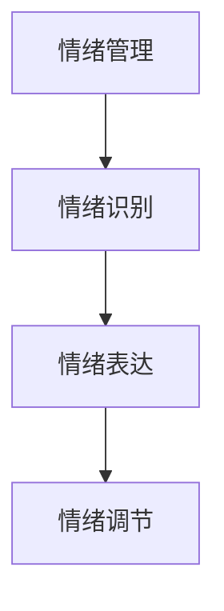

**情绪管理的重要性：**

情绪管理对领导力的重要性体现在以下几个方面：

1. **保持决策清晰**：通过情绪管理，领导者能够避免因情绪波动而做出冲动或错误的决策。
2. **提升团队氛围**：领导者通过良好的情绪管理，能够营造积极、和谐的团队氛围，提高团队的凝聚力和工作效率。
3. **建立信任**：领导者通过情绪管理展现出的稳定和可靠性，能够赢得团队成员的信任。

**情绪管理的方法：**

1. **情绪识别**：通过自我观察和反思，识别自己的情绪，理解情绪背后的原因。
2. **情绪表达**：学会适当地表达自己的情绪，避免压抑或过度表达。
3. **情绪调节**：采用深呼吸、冥想、运动等方法，调节自己的情绪，保持冷静和专注。

**案例分享：**

史蒂夫·乔布斯在领导苹果公司时，以其卓越的情绪管理能力著称。他能够迅速识别自己的情绪，并在必要时调节情绪，从而确保在压力和挑战面前做出明智的决策。

##### 2.3 沟通技巧

沟通技巧是领导力的核心要素之一，它涉及到如何有效地传达信息、理解他人以及建立良好的沟通渠道。一个沟通技巧出色的领导者能够确保信息的准确传达，减少误解和冲突，提高团队的协作效率。

**核心概念与联系：**

沟通技巧的核心概念包括有效沟通、积极倾听和反馈机制。以下是沟通技巧的 Mermaid 流程图：

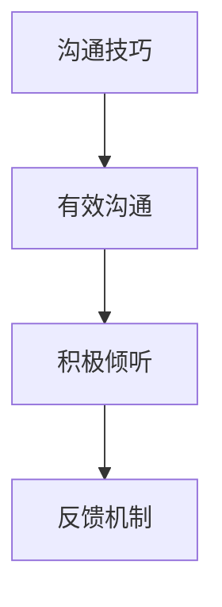

**沟通技巧的重要性：**

沟通技巧对领导力的重要性体现在以下几个方面：

1. **确保信息传递**：有效的沟通能够确保团队中的每个人都理解任务、目标和期望，从而提高工作效率。
2. **建立信任**：通过积极的沟通，领导者能够建立与团队成员的信任关系，增强团队的凝聚力。
3. **解决冲突**：良好的沟通技巧有助于领导者识别和解决团队中的冲突，维护团队和谐。

**沟通技巧的方法：**

1. **有效沟通**：明确表达观点，使用简洁、具体的语言，确保信息的准确传达。
2. **积极倾听**：倾听他人的观点和需求，理解他们的情感和动机。
3. **反馈机制**：建立有效的反馈机制，鼓励团队成员提供意见和建议，及时调整和改进。

**案例分享：**

比尔·盖茨在微软公司早期，通过其出色的沟通技巧，建立了与团队成员之间的信任和合作关系，从而带领微软取得了巨大的成功。

##### 2.4 团队合作

团队合作是领导力的关键组成部分，它涉及到如何协调团队成员的工作，发挥每个人的优势，实现共同的目标。一个善于团队合作的领导者能够建立高效的团队，激发团队成员的潜力，实现团队的目标。

**核心概念与联系：**

团队合作的核心概念包括团队建设、角色分工和协同工作。以下是团队合作的 Mermaid 流程图：

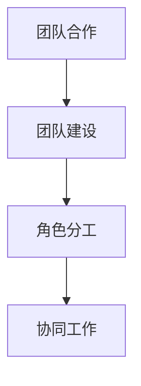

**团队合作的重要性：**

团队合作对领导力的重要性体现在以下几个方面：

1. **提高团队绩效**：通过团队合作，领导者能够发挥团队成员的集体智慧和力量，实现更高的绩效。
2. **培养团队凝聚力**：团队合作有助于建立团队成员之间的信任和尊重，增强团队的凝聚力。
3. **促进创新**：团队合作鼓励团队成员分享观点和想法，促进创新和创意的产生。

**团队合作的方法：**

1. **团队建设**：通过团队活动、培训和团队建设游戏，增强团队成员之间的了解和信任。
2. **角色分工**：明确每个团队成员的角色和责任，确保任务的有效分配和协作。
3. **协同工作**：利用协作工具和平台，确保团队成员之间的信息共享和协作。

**案例分享：**

谷歌公司以其卓越的团队合作文化著称。通过明确的角色分工和高效的协同工作，谷歌的团队能够快速响应市场变化，推出一系列创新产品。

#### 总结

自我认知、情绪管理、沟通技巧和团队合作是领导力的四大基石。这些能力不仅对创业者个人的发展至关重要，也对企业的长期成功具有深远影响。在接下来的章节中，我们将进一步探讨领导力的核心原则，帮助创业者全面提升自己的领导力。

## 参考文献

1. Goleman, D. (1995). *Emotional Intelligence: Why It Can Matter More Than IQ*. Bantam Books.
2. Hersey, P., & Blanchard, K. H. (1977). *Management of Organizational Behavior: Utilizing Human Resources*. Prentice Hall.
3. Kouzes, J. M., & Posner, B. Z. (2007). *The Truth About Leadership: The Leadership Practices Inventory in Action*. Jossey-Bass.
4. Yukl, G. A. (2013). *Leadership in Organizations*. Pearson Education.

---

```markdown
# 《创业者的领导力培养与团队管理》

## 关键词：创业者，领导力，团队管理，领导力培养，团队建设

## 摘要：

本文详细探讨了创业者在领导力和团队管理方面的培养与实践。通过深入分析领导力的四大基石：自我认知、情绪管理、沟通技巧和团队合作，本文旨在为创业者提供一套完整的领导力培养与团队管理策略。文章还将通过案例分析，为读者提供实用的管理技巧和实践经验，助力创业者在激烈的市场竞争中脱颖而出。
```

---

在第二部分的探讨中，我们深入分析了领导力的四大基石，包括自我认知、情绪管理、沟通技巧和团队合作。这些基石不仅对创业者个人的成长至关重要，也对企业的长期成功具有深远影响。在接下来的章节中，我们将进一步探讨领导力的核心原则，帮助创业者更好地运用这些基石，提升自己的领导力水平。接下来，我们将进入第三部分，探讨领导力的核心原则，包括诚信原则、权力运用、激励员工和决策与执行力。这些原则是创业者在实际管理过程中必须遵循的基本准则。

## 第三部分：领导力的核心原则

在第二部分中，我们探讨了领导力的四大基石，这些基石构成了领导力的基础。然而，要想成为一个卓越的领导者，仅仅拥有基石是不够的，还需要遵循一系列核心原则，这些原则将帮助创业者更好地运用领导力，实现企业的目标。

### 第3章：领导力的核心原则

#### 第3章：领导力的核心原则

##### 3.1 诚信原则

诚信是领导力的基石，它要求领导者始终保持真诚和透明。一个诚信的领导者不仅能够赢得团队成员的信任，还能树立企业的良好形象。以下是诚信原则的几个关键点：

**核心概念与联系：**

诚信原则的核心概念包括真诚、透明和信任。以下是诚信原则的 Mermaid 流程图：

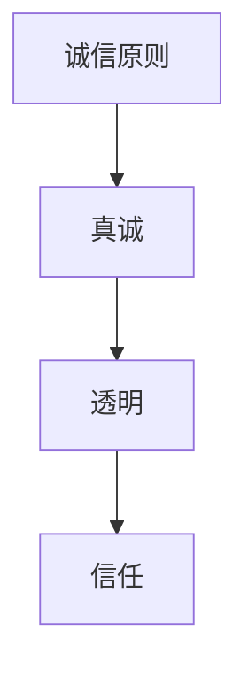

**诚信原则的重要性：**

1. **建立信任**：诚信是建立信任的基石，只有信任存在，团队才能更好地协作和合作。
2. **提高决策质量**：一个诚信的领导者会真诚地分享信息，确保团队成员能够基于真实的信息做出决策。
3. **塑造企业文化**：诚信原则有助于塑造企业的文化和价值观，使企业成为一个值得信赖的合作伙伴。

**诚信原则的方法：**

1. **真诚沟通**：领导者应该真诚地与团队成员沟通，避免隐瞒或误导信息。
2. **透明决策**：领导者应该公开透明地做出决策，使团队成员了解决策的原因和过程。
3. **树立榜样**：领导者应该通过自己的行为展示诚信，成为团队成员的榜样。

**案例分享：**

乔布斯在领导苹果公司时，以其高度的诚信赢得了员工的信任。他在产品发布会上的真诚演讲，使员工对公司的未来充满信心。

##### 3.2 权力运用

权力是领导者的重要工具，正确运用权力有助于实现企业的目标。然而，权力的运用需要谨慎，以免滥用或误用。以下是权力运用的一些关键点：

**核心概念与联系：**

权力运用涉及权力分配、决策权和领导风格。以下是权力运用的 Mermaid 流程图：

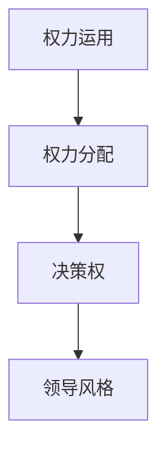

**权力运用的重要性：**

1. **提高团队效率**：合理分配权力，使团队成员能够自主决策，提高工作效率。
2. **促进创新**：领导者通过赋予团队决策权，鼓励团队成员提出创新的想法和解决方案。
3. **塑造领导风格**：领导者的权力运用决定了其领导风格，一个善于运用权力的领导者能够更好地激励和引导团队。

**权力运用的方法：**

1. **权力分配**：根据团队成员的能力和职责，合理分配权力，使每个人都能在其擅长的领域发挥最大潜力。
2. **授权**：领导者应该授权给团队成员，鼓励他们自主决策，提高团队的执行力。
3. **调整领导风格**：领导者应根据团队的情况和任务的需求，灵活调整自己的领导风格。

**案例分享：**

杰克·韦尔奇在通用电气担任CEO时，以其独特的领导风格和权力运用方式著称。他通过放权给各部门的领导，激发了团队的活力和创造力，使通用电气成为行业的领导者。

##### 3.3 激励员工

激励是领导者的重要任务之一，一个能够有效激励员工的领导者能够提高团队的士气和绩效。以下是激励员工的几个关键点：

**核心概念与联系：**

激励员工的核心概念包括目标设定、认可和奖励。以下是激励员工的 Mermaid 流程图：

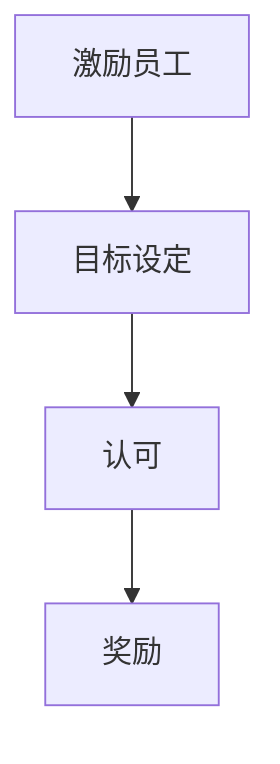

**激励员工的重要性：**

1. **提高士气**：激励员工能够提高他们的工作热情和积极性，从而提高团队的整体士气。
2. **增强凝聚力**：通过激励，领导者能够增强团队成员之间的凝聚力，建立紧密的团队关系。
3. **促进成长**：激励员工有助于他们发挥潜力，实现个人和职业成长。

**激励员工的方法：**

1. **目标设定**：设定明确、可衡量的目标，使员工知道他们的工作方向和期望成果。
2. **认可**：及时认可员工的努力和成就，增强他们的工作动力。
3. **奖励**：通过物质和非物质奖励，激励员工实现目标。

**案例分享：**

马斯克通过设定明确的目标和提供丰厚的奖励，激发了特斯拉和SpaceX团队的创造力，使这两家公司取得了巨大的成功。

##### 3.4 决策与执行力

决策与执行力是领导力的核心要素之一，一个优秀的领导者需要能够做出明智的决策，并确保决策得到有效执行。以下是决策与执行力的一些关键点：

**核心概念与联系：**

决策与执行力的核心概念包括决策制定、执行策略和监督。以下是决策与执行的 Mermaid 流程图：

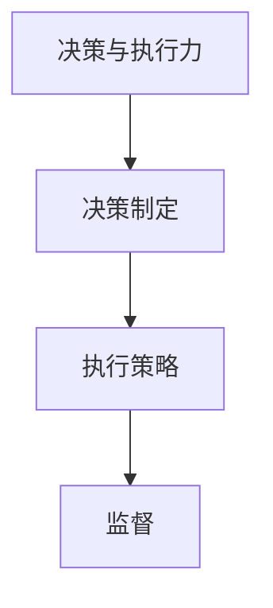

**决策与执行力的重要性：**

1. **确保目标实现**：有效的决策和执行力是确保企业目标实现的关键。
2. **提高效率**：通过决策和执行，领导者能够提高团队的工作效率，减少浪费。
3. **增强竞争力**：快速、准确的决策和执行有助于企业在竞争激烈的市场中保持优势。

**决策与执行力的方法：**

1. **决策制定**：领导者应该基于充分的信息和分析，做出明智的决策。
2. **执行策略**：制定明确的执行计划，确保决策得到有效执行。
3. **监督**：领导者应该对执行过程进行监督，及时调整和纠正偏差。

**案例分享：**

戴尔·卡耐基通过其卓越的决策和执行力，使卡耐基训练成为全球知名的培训公司。他善于倾听客户需求，迅速调整课程内容，确保客户满意度。

#### 总结

领导力的核心原则包括诚信原则、权力运用、激励员工和决策与执行力。这些原则不仅帮助创业者更好地运用领导力，还为企业的发展提供了坚实的基础。在下一部分中，我们将探讨团队管理的艺术，包括团队建设与组织结构、团队沟通与协作以及团队绩效管理。这些内容将帮助创业者更好地管理团队，实现企业的目标。

## 参考文献

1. Yukl, G. A. (2013). *Leadership in Organizations*. Pearson Education.
2. Hersey, P., & Blanchard, K. H. (1977). *Management of Organizational Behavior: Utilizing Human Resources*. Prentice Hall.
3. Kouzes, J. M., & Posner, B. Z. (2007). *The Truth About Leadership: The Leadership Practices Inventory in Action*. Jossey-Bass.
4. Goleman, D. (1995). *Emotional Intelligence: Why It Can Matter More Than IQ*. Bantam Books.

---

```markdown
# 《创业者的领导力培养与团队管理》

## 关键词：创业者，领导力，团队管理，领导力培养，团队建设

## 摘要：

本文详细探讨了创业者在领导力和团队管理方面的培养与实践。通过深入分析领导力的核心原则：诚信原则、权力运用、激励员工和决策与执行力，本文旨在为创业者提供一套完整的领导力培养与团队管理策略。文章还将通过案例分析，为读者提供实用的管理技巧和实践经验，助力创业者在激烈的市场竞争中脱颖而出。
```

---

在第三部分的探讨中，我们深入分析了领导力的核心原则，包括诚信原则、权力运用、激励员工和决策与执行力。这些原则不仅帮助创业者更好地运用领导力，还为企业的发展提供了坚实的基础。在接下来的章节中，我们将进入第四部分，探讨团队管理的艺术，包括团队建设与组织结构、团队沟通与协作以及团队绩效管理。这些内容将帮助创业者更好地管理团队，实现企业的目标。

## 第四部分：团队管理的艺术

### 第4章：团队建设与组织结构

在上一部分，我们探讨了领导力的核心原则。然而，一个成功的企业不仅需要一个强有力的领导团队，还需要一个高效的团队管理和组织结构。在这一部分，我们将探讨团队建设与组织结构的重要性，以及如何设计一个合适的团队和组织结构。

#### 第4章：团队建设与组织结构

##### 4.1 团队建设的重要性

团队建设是团队管理的基础，它关系到团队的整体表现和成员的满意度。一个高效的团队可以协同合作，克服各种挑战，实现企业的目标。以下是团队建设的重要性：

**核心概念与联系：**

团队建设的核心概念包括团队合作、团队精神和共同目标。以下是团队建设的 Mermaid 流程图：

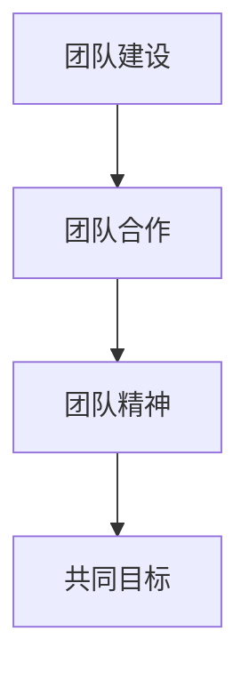

**团队建设的重要性：**

1. **提高工作效率**：通过团队建设，可以提高团队成员的协同合作能力，减少重复工作和资源浪费。
2. **增强团队凝聚力**：团队建设有助于建立团队成员之间的信任和尊重，增强团队的凝聚力。
3. **促进创新**：一个良好的团队氛围可以激发团队成员的创造力和创新意识。

**团队建设的方法：**

1. **团队活动**：组织团队建设活动，如团队拓展训练、团队聚餐等，增强团队成员之间的了解和信任。
2. **共同目标**：设定明确的团队目标，使团队成员明确自己的责任和期望，共同努力实现目标。
3. **反馈与沟通**：建立有效的沟通渠道，鼓励团队成员提供反馈和建议，及时解决问题。

**案例分享：**

谷歌公司以其卓越的团队建设文化著称。通过定期的团队活动和明确的目标设定，谷歌的团队能够保持高效的工作状态，不断创新。

##### 4.2 团队角色的定义与分配

在一个高效的团队中，每个成员都扮演着特定的角色，承担相应的责任。明确团队角色和职责分配是团队建设的重要环节。以下是团队角色定义与分配的关键点：

**核心概念与联系：**

团队角色的核心概念包括角色定义、职责分配和角色互补。以下是团队角色定义与分配的 Mermaid 流程图：

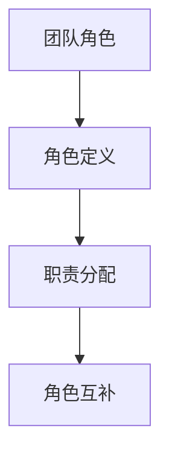

**团队角色定义与分配的重要性：**

1. **提高工作效率**：明确的团队角色和职责分配可以避免团队成员之间的重复工作和冲突，提高工作效率。
2. **增强责任感**：团队成员了解自己的角色和责任，可以增强他们的工作动力和责任感。
3. **促进团队协作**：明确的团队角色和职责分配有助于团队成员更好地协作，实现共同目标。

**团队角色定义与分配的方法：**

1. **角色分析**：通过角色分析，了解团队成员的特长和兴趣，确定每个人的角色和职责。
2. **角色互补**：确保团队中每个角色都有合适的成员承担，实现角色互补，提高团队的整体能力。
3. **定期调整**：根据团队的需求和成员的变化，定期调整团队角色和职责分配。

**案例分享：**

苹果公司在其早期发展阶段，通过明确的团队角色定义和职责分配，使团队成员能够专注于自己的领域，从而实现了快速的产品迭代和技术的突破。

##### 4.3 组织结构设计

组织结构是团队管理的重要组成部分，它决定了团队成员之间的沟通和协作方式。合适的组织结构可以促进团队的高效运作，实现企业的目标。以下是组织结构设计的关键点：

**核心概念与联系：**

组织结构的核心概念包括职能型结构、矩阵型结构和网络型结构。以下是组织结构的 Mermaid 流程图：

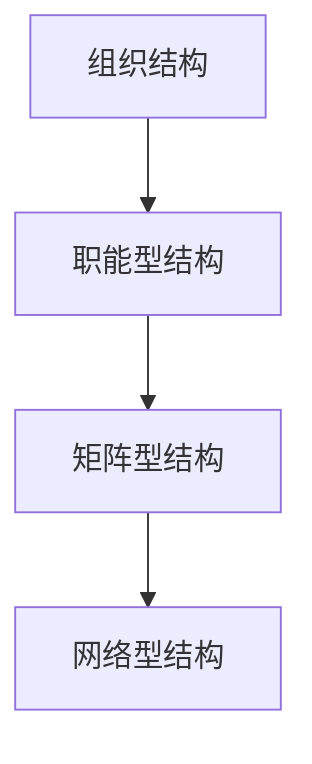

**组织结构设计的重要性：**

1. **提高协作效率**：合适的组织结构可以促进团队成员之间的沟通和协作，提高工作效率。
2. **增强灵活性**：灵活的组织结构可以更好地适应市场的变化和企业的发展需求。
3. **促进创新**：合适的组织结构可以激发团队成员的创新意识和创造力。

**组织结构设计的方法：**

1. **职能型结构**：根据企业的功能划分部门，每个部门负责特定的业务领域。
2. **矩阵型结构**：将职能型结构和项目型结构结合，使团队成员能够跨部门协作，实现项目的顺利进行。
3. **网络型结构**：通过建立网络关系，使企业能够迅速整合内外部资源，实现灵活的协作。

**案例分享：**

华为公司采用了矩阵型结构，使其能够在全球范围内快速响应市场需求，实现高效的项目管理和资源整合。

##### 4.4 团队文化建设

团队文化是团队管理的重要组成部分，它反映了企业的核心价值观和行为准则。一个积极的团队文化可以激发团队成员的潜力，提高团队的整体绩效。以下是团队文化建设的关键点：

**核心概念与联系：**

团队文化的核心概念包括价值观、行为准则和团队氛围。以下是团队文化建设的 Mermaid 流程图：

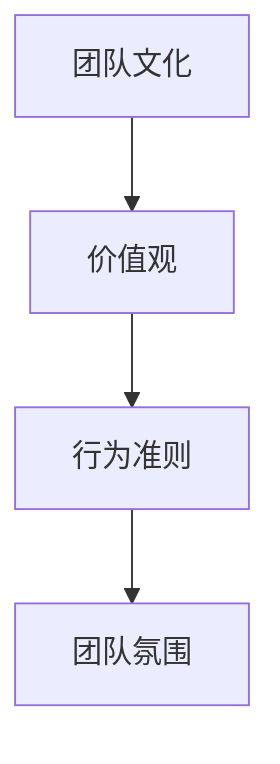

**团队文化建设的重要性：**

1. **增强团队凝聚力**：一个积极的团队文化可以增强团队成员的归属感和凝聚力。
2. **提高工作效率**：积极的团队文化可以激发团队成员的工作热情和创造力，提高工作效率。
3. **促进企业长期发展**：团队文化是企业长期发展的基石，可以确保企业的持续创新和竞争优势。

**团队文化建设的方法：**

1. **明确价值观**：领导者应该明确企业的核心价值观，并将其传达给团队成员。
2. **树立榜样**：领导者应该通过自己的行为展示价值观，成为团队成员的榜样。
3. **制定行为准则**：制定明确的行为准则，确保团队成员在工作和生活中遵循。
4. **营造积极氛围**：通过团队活动和互动，营造积极、和谐的团队氛围。

**案例分享：**

谷歌公司以其独特的团队文化著称，包括开放、创新和尊重个体价值观。这种积极的文化氛围激发了员工的创造力，使谷歌成为全球知名的科技巨头。

#### 总结

团队建设与组织结构是团队管理的重要组成部分，它关系到团队的整体表现和企业的长期发展。在下一部分中，我们将探讨团队沟通与协作的技巧，包括有效沟通的原则、沟通障碍与解决策略、团队协作工具介绍以及激励与反馈机制。这些内容将帮助创业者更好地管理团队，实现企业的目标。

## 参考文献

1. Yukl, G. A. (2013). *Leadership in Organizations*. Pearson Education.
2. Hersey, P., & Blanchard, K. H. (1977). *Management of Organizational Behavior: Utilizing Human Resources*. Prentice Hall.
3. Kouzes, J. M., & Posner, B. Z. (2007). *The Truth About Leadership: The Leadership Practices Inventory in Action*. Jossey-Bass.
4. Goleman, D. (1995). *Emotional Intelligence: Why It Can Matter More Than IQ*. Bantam Books.

---

```markdown
# 《创业者的领导力培养与团队管理》

## 关键词：创业者，领导力，团队管理，领导力培养，团队建设

## 摘要：

本文详细探讨了创业者在领导力和团队管理方面的培养与实践。通过深入分析团队建设与组织结构、团队沟通与协作以及团队绩效管理，本文旨在为创业者提供一套完整的领导力培养与团队管理策略。文章将通过案例分析，为读者提供实用的管理技巧和实践经验，助力创业者在激烈的市场竞争中脱颖而出。
```

---

在第四部分的探讨中，我们深入分析了团队建设与组织结构的重要性，包括团队建设的重要性、团队角色的定义与分配、组织结构设计以及团队文化建设。这些内容为创业者提供了全面的团队管理指南。在接下来的章节中，我们将探讨团队沟通与协作的技巧，这是团队管理的关键环节，它关系到团队的工作效率和企业目标的实现。

### 第5章：团队沟通与协作

在团队管理中，沟通与协作是确保团队高效运作的核心。有效的沟通可以减少误解和冲突，提高团队成员之间的信任和理解；而协作则能够将每个人的力量整合起来，实现团队的目标。在这一章中，我们将探讨有效沟通的原则、沟通障碍与解决策略、团队协作工具介绍以及激励与反馈机制。

#### 5.1 有效沟通的原则

有效沟通是团队协作的基础。一个成功的领导者需要掌握有效的沟通技巧，以确保信息在团队内部准确、清晰地传递。以下是有效沟通的几个原则：

**核心概念与联系：**

有效沟通的核心概念包括信息准确、反馈及时和尊重对方。以下是有效沟通的 Mermaid 流程图：

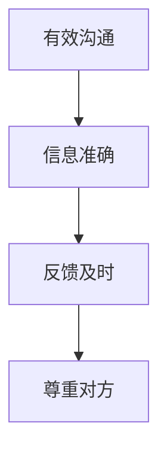

**信息准确：** 在沟通中，确保信息的准确性至关重要。领导者应该使用明确、简洁的语言，避免歧义和误解。

**反馈及时：** 及时给予反馈可以帮助团队成员了解自己的表现，并迅速纠正错误。反馈应该是具体、建设性的。

**尊重对方：** 在沟通中，尊重对方的观点和感受，建立信任和合作关系。

**案例分享：**

马云在与团队沟通时，总是强调信息的准确性和及时性。他通过定期的沟通会议，确保团队成员了解公司的最新动态和目标，从而提高了团队的整体协作效率。

#### 5.2 沟通障碍与解决策略

在团队沟通中，沟通障碍是常见的挑战。这些障碍可能来自个人、团队或外部环境。以下是一些常见的沟通障碍及其解决策略：

**核心概念与联系：**

沟通障碍包括信息过载、文化差异和沟通技巧不足。以下是沟通障碍与解决策略的 Mermaid 流程图：

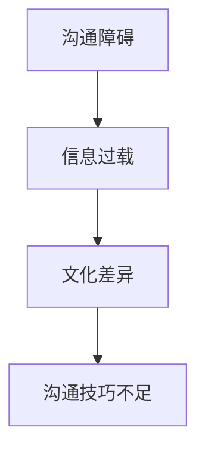

**信息过载：** 解决策略包括简化信息传递、使用图表和视觉工具等。

**文化差异：** 解决策略包括加强跨文化培训、鼓励多元化思维等。

**沟通技巧不足：** 解决策略包括提供沟通技巧培训、鼓励团队成员分享经验等。

**案例分享：**

谷歌公司通过定期的跨文化沟通培训，帮助来自不同国家的员工更好地理解和尊重彼此，从而提高了团队的协作效率。

#### 5.3 团队协作工具介绍

在现代团队管理中，协作工具的使用是提高团队协作效率的关键。以下是一些常用的团队协作工具及其特点：

**核心概念与联系：**

团队协作工具包括项目管理工具、即时通讯工具和文档协作工具。以下是团队协作工具的 Mermaid 流程图：

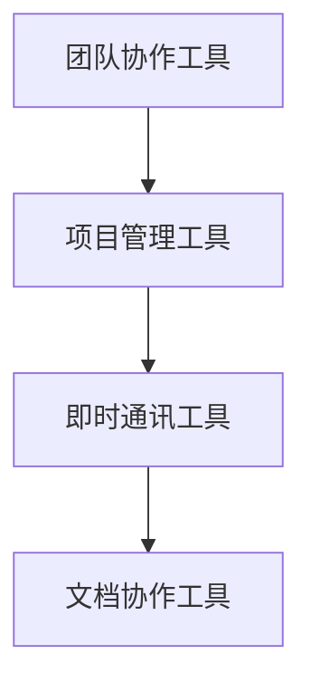

**项目管理工具：** 如Trello、Asana等，可以帮助团队管理项目进度、任务分配和团队协作。

**即时通讯工具：** 如Slack、Microsoft Teams等，提供实时沟通和协作平台，便于团队成员之间的沟通和协作。

**文档协作工具：** 如Google Docs、Microsoft Office 365等，支持多人实时编辑和协作，提高文档处理的效率。

**案例分享：**

亚马逊公司广泛使用Trello和Slack等协作工具，以确保团队成员能够实时沟通和协作，从而提高了项目的效率和质量。

#### 5.4 激励与反馈机制

激励和反馈是团队管理的重要组成部分，它们能够激发团队成员的积极性和创造力，提高团队的整体绩效。以下是激励与反馈机制的几个关键点：

**核心概念与联系：**

激励与反馈机制包括目标设定、认可奖励和定期反馈。以下是激励与反馈机制的 Mermaid 流程图：

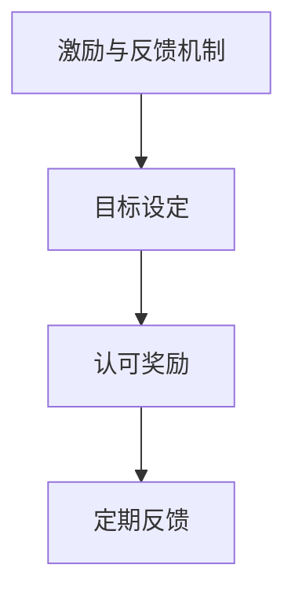

**目标设定：** 设定明确的个人和团队目标，帮助团队成员了解自己的努力方向。

**认可奖励：** 通过表扬和奖励，认可团队成员的贡献，激励他们继续保持良好的工作状态。

**定期反馈：** 定期提供反馈，帮助团队成员了解自己的表现，并提供改进的建议。

**案例分享：**

微软公司通过其“员工之星”计划，定期认可和奖励表现突出的员工，从而激发了员工的工作热情和创造力。

#### 总结

团队沟通与协作是团队管理的关键环节，它关系到团队的工作效率和企业的目标实现。在第五部分中，我们探讨了有效沟通的原则、沟通障碍与解决策略、团队协作工具介绍以及激励与反馈机制。这些内容为创业者提供了全面的团队沟通与协作指南。在下一章中，我们将探讨团队绩效管理，包括绩效评估指标、绩效改进策略、激励与惩罚机制以及绩效改进案例分享。

## 参考文献

1. Hersey, P., & Blanchard, K. H. (1977). *Management of Organizational Behavior: Utilizing Human Resources*. Prentice Hall.
2. Yukl, G. A. (2013). *Leadership in Organizations*. Pearson Education.
3. Goleman, D. (1995). *Emotional Intelligence: Why It Can Matter More Than IQ*. Bantam Books.
4. Kouzes, J. M., & Posner, B. Z. (2007). *The Truth About Leadership: The Leadership Practices Inventory in Action*. Jossey-Bass.

---

```markdown
# 《创业者的领导力培养与团队管理》

## 关键词：创业者，领导力，团队管理，领导力培养，团队建设

## 摘要：

本文详细探讨了创业者在领导力和团队管理方面的培养与实践。通过深入分析团队沟通与协作的技巧，包括有效沟通的原则、沟通障碍与解决策略、团队协作工具介绍以及激励与反馈机制，本文旨在为创业者提供一套完整的团队沟通与协作策略。文章将通过案例分析，为读者提供实用的管理技巧和实践经验，助力创业者在激烈的市场竞争中脱颖而出。
```

---

在第四部分的探讨中，我们深入分析了团队建设与组织结构的重要性，以及团队沟通与协作的技巧。这些内容为创业者提供了全面的团队管理指南。在第五部分中，我们将探讨团队绩效管理，这是确保团队高效运作和实现企业目标的关键。通过绩效评估、绩效改进策略以及激励与惩罚机制，创业者可以更好地管理团队，提高整体绩效。

### 第6章：团队绩效管理

在团队管理中，绩效管理是确保团队高效运作和实现企业目标的关键环节。通过科学的绩效评估和有效的绩效改进策略，领导者可以激发团队成员的潜力，提高团队的整体绩效。在本章中，我们将探讨团队绩效管理的核心内容，包括绩效评估指标、绩效改进策略、激励与惩罚机制以及绩效改进案例分享。

#### 6.1 绩效评估指标

绩效评估是团队绩效管理的基础，它涉及到如何设定评估指标、收集评估数据以及分析评估结果。以下是绩效评估指标的关键点：

**核心概念与联系：**

绩效评估指标包括定量指标和定性指标。以下是绩效评估指标的 Mermaid 流程图：

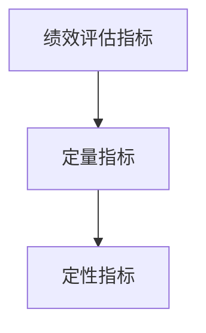

**定量指标：** 包括销售额、生产效率、项目完成度等，可以通过数据和分析工具进行量化。

**定性指标：** 包括团队合作、创新能力、客户满意度等，需要通过观察和评估进行定性分析。

**案例分享：**

谷歌公司通过其“员工绩效评估系统”，结合定量指标和定性指标，对员工的工作进行全面的评估。

#### 6.2 绩效改进策略

绩效改进策略是确保团队绩效持续提升的关键。以下是一些常见的绩效改进策略：

**核心概念与联系：**

绩效改进策略包括目标设定、反馈机制和培训与发展。以下是绩效改进策略的 Mermaid 流程图：

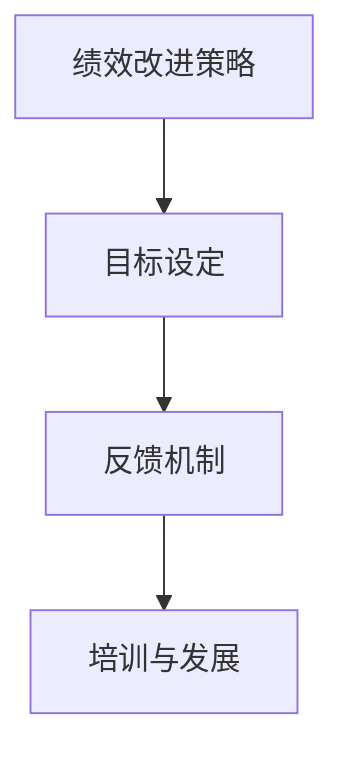

**目标设定：** 设定明确、可衡量的绩效目标，帮助团队成员了解自己的努力方向。

**反馈机制：** 通过定期的反馈，帮助团队成员了解自己的表现，并提供改进的建议。

**培训与发展：** 提供培训和发展机会，帮助团队成员提升技能和知识。

**案例分享：**

苹果公司通过其“员工培训计划”，定期为员工提供专业技能和领导力培训，从而提高了团队的整体绩效。

#### 6.3 激励与惩罚机制

激励与惩罚机制是绩效管理的重要组成部分，它涉及到如何通过奖励和惩罚来激励团队成员。以下是激励与惩罚机制的关键点：

**核心概念与联系：**

激励与惩罚机制包括奖励和惩罚。以下是激励与惩罚机制的 Mermaid 流程图：

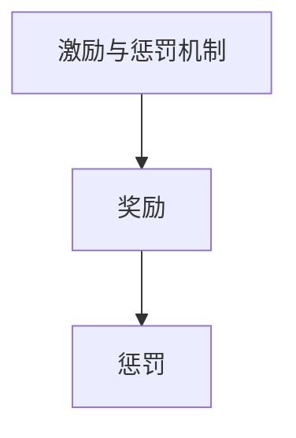

**奖励：** 包括奖金、晋升、荣誉等，用于激励表现优秀的团队成员。

**惩罚：** 包括警告、降职、解雇等，用于纠正团队成员的不良行为。

**案例分享：**

亚马逊公司通过其“绩效奖赏计划”，对表现优秀的员工进行现金奖励，从而激发了员工的工作热情和积极性。

#### 6.4 绩效改进案例分享

通过以下案例，我们可以看到绩效改进策略在不同企业中的应用：

**案例一：**

阿里巴巴在2018年推出“双百计划”，旨在通过设立100个亿级项目，孵化100个独角兽企业。为了实现这一目标，阿里巴巴采用了目标设定和反馈机制，定期评估项目的进展和效果，并根据评估结果进行调整。这一策略不仅提高了项目的成功率，还激发了员工的工作热情和创新意识。

**案例二：**

谷歌公司通过其“20%时间项目”，允许员工将20%的工作时间用于自己感兴趣的项目。这一策略激发了员工的创造力和创新精神，导致了如Gmail和Google Maps等众多成功的创新项目。

**案例三：**

微软公司通过其“员工激励计划”，对表现优秀的员工进行现金奖励和晋升机会。这一计划不仅提高了员工的积极性，还增强了团队的整体绩效。

#### 总结

团队绩效管理是确保团队高效运作和实现企业目标的关键。通过科学的绩效评估、有效的绩效改进策略以及激励与惩罚机制，创业者可以更好地管理团队，提高整体绩效。在第六部分中，我们将探讨领导力与团队管理的实战应用，通过实际案例的分析，为读者提供更具体的实践经验和策略。

## 参考文献

1. Hersey, P., & Blanchard, K. H. (1977). *Management of Organizational Behavior: Utilizing Human Resources*. Prentice Hall.
2. Yukl, G. A. (2013). *Leadership in Organizations*. Pearson Education.
3. Goleman, D. (1995). *Emotional Intelligence: Why It Can Matter More Than IQ*. Bantam Books.
4. Kouzes, J. M., & Posner, B. Z. (2007). *The Truth About Leadership: The Leadership Practices Inventory in Action*. Jossey-Bass.

---

```markdown
# 《创业者的领导力培养与团队管理》

## 关键词：创业者，领导力，团队管理，领导力培养，团队建设

## 摘要：

本文详细探讨了创业者在领导力和团队管理方面的培养与实践。通过深入分析团队绩效管理的核心内容，包括绩效评估指标、绩效改进策略、激励与惩罚机制以及绩效改进案例分享，本文旨在为创业者提供一套完整的团队绩效管理策略。文章将通过案例分析，为读者提供实用的管理技巧和实践经验，助力创业者在激烈的市场竞争中脱颖而出。
```

---

在第六部分的探讨中，我们深入分析了团队绩效管理的核心内容，包括绩效评估指标、绩效改进策略、激励与惩罚机制以及实际案例分享。这些内容为创业者提供了全面的团队绩效管理指南。在接下来的第七部分中，我们将探讨领导力与团队管理的实战应用，通过成功与失败的案例分析，为读者提供具体的实践经验和策略。

### 第7章：领导力与团队管理的实战应用

在前几章中，我们详细探讨了领导力的定义、核心能力、核心原则以及团队管理的艺术。然而，理论知识只有通过实践才能得到真正的验证和提升。在本章中，我们将通过实际案例，深入分析成功和失败的领导力与团队管理实践，从中汲取经验和教训，为创业者提供实用的策略和启示。

#### 第7章：领导力与团队管理的实战应用

##### 7.1 成功案例分析

**案例一：谷歌公司的“20%时间项目”**

谷歌公司的“20%时间项目”是一个著名的成功案例。这一项目允许员工将20%的工作时间用于自己感兴趣的项目。谷歌创始人拉里·佩奇和谢尔盖·布林认为，这种自主探索的时间可以激发员工的创造力和创新精神，从而推动公司的技术进步。

**核心要素：**

1. **创新文化**：谷歌倡导创新和自由探索的文化，鼓励员工提出新的想法。
2. **自主管理**：员工在项目中有较大的自主权，可以自由选择项目方向。
3. **资源支持**：谷歌提供了必要的资源，如资金、技术支持等，以确保项目顺利进行。

**成功经验：**

- **激发创新**：通过自主探索，员工提出了许多创新项目，如Gmail和Google Maps等。
- **增强员工满意度**：自主管理激发了员工的工作热情和满足感。
- **技术领先**：谷歌的创新项目使其在技术领域保持领先地位。

**启示**：

创业者可以借鉴谷歌的创新文化，鼓励员工自由探索，提供必要的资源和支持，从而激发团队的创新潜力。

**案例二：阿里巴巴的“双百计划”**

阿里巴巴的“双百计划”旨在通过设立100个亿级项目和孵化100个独角兽企业，推动公司的持续增长。为了实现这一目标，阿里巴巴采用了一系列科学的绩效管理和团队管理策略。

**核心要素：**

1. **明确目标**：阿里巴巴为每个项目设定了明确的财务和业务目标。
2. **绩效评估**：通过定期的绩效评估，阿里巴巴评估项目的进展和效果。
3. **激励机制**：对表现优秀的项目和团队进行奖励，激励团队成员的积极性。

**成功经验：**

- **目标明确**：明确的目标帮助团队成员了解自己的努力方向。
- **激励机制**：通过奖励机制，阿里巴巴激发了团队成员的创造力和积极性。
- **持续增长**：双百计划推动了阿里巴巴的持续增长和业务拓展。

**启示**：

创业者可以设定明确的目标，建立科学的绩效评估体系，并采用激励机制，以推动团队的持续增长和创新。

##### 7.2 失败案例分析

**案例一：特斯拉公司的产能问题**

特斯拉在电动汽车市场的快速发展中，面临了严重的产能问题。尽管特斯拉的CEO埃隆·马斯克采取了多种措施，如增加工厂规模、引入自动化生产线等，但产能仍然无法满足市场需求。

**核心要素：**

1. **目标设定**：特斯拉设定了高产能目标，希望通过快速扩张满足市场需求。
2. **资源限制**：特斯拉在技术、资金和人力资源方面存在限制，难以迅速提高产能。
3. **管理问题**：特斯拉在产能管理方面存在问题，如生产计划不周、供应链管理不足等。

**失败原因：**

- **目标过高**：特斯拉设定的产能目标过高，超出了当前的技术和资源限制。
- **资源限制**：特斯拉在技术、资金和人力资源方面存在限制，导致产能无法迅速提高。
- **管理问题**：特斯拉在产能管理方面存在问题，未能有效协调各个环节。

**教训**：

创业者应该合理设定目标，避免目标过高导致资源浪费和管理混乱。同时，要重视产能管理，确保生产计划与市场需求相匹配。

**案例二：Facebook的隐私问题**

Facebook在其发展过程中，因隐私问题多次陷入舆论漩涡。尽管Facebook采取了多项措施，如加强隐私保护政策、增加隐私设置等，但用户隐私问题仍然层出不穷。

**核心要素：**

1. **用户隐私**：Facebook在用户隐私保护方面存在问题，如数据泄露、用户信息滥用等。
2. **监管压力**：Facebook面临来自政府和用户的监管压力，要求其加强隐私保护。
3. **管理失误**：Facebook在隐私管理方面存在管理失误，未能有效保护用户隐私。

**失败原因：**

- **隐私保护不足**：Facebook在用户隐私保护方面存在不足，未能有效防止数据泄露。
- **监管压力**：Facebook面临来自政府和用户的监管压力，未能及时调整政策。
- **管理失误**：Facebook在隐私管理方面存在管理失误，未能有效保护用户隐私。

**教训**：

创业者应该高度重视用户隐私保护，采取有效的措施防止数据泄露。同时，要密切关注监管政策的变化，及时调整业务策略。

##### 7.3 案例分析与启示

通过以上成功和失败的案例分析，我们可以得出以下启示：

1. **合理设定目标**：创业者在设定目标时，应充分考虑自身的技术、资金和人力资源等条件，避免目标过高导致资源浪费和管理混乱。
2. **重视团队建设**：创业者应重视团队建设，通过科学的绩效评估和激励机制，激发团队成员的创造力和积极性。
3. **加强沟通与协作**：创业者应加强团队沟通与协作，确保信息的准确传递和资源的有效利用。
4. **重视用户隐私**：创业者应高度重视用户隐私保护，采取有效的措施防止数据泄露，增强用户信任。
5. **持续学习和改进**：创业者应持续学习和改进，从成功和失败中汲取经验教训，不断提升自身的领导力和团队管理能力。

#### 总结

通过本章的案例分析，我们深入探讨了领导力与团队管理的实战应用。成功案例和失败案例都为我们提供了宝贵的经验和教训，帮助创业者更好地理解领导力和团队管理的实际操作。在下一章中，我们将探讨创业者的领导力实践，包括创业初期的领导力挑战、创业过程中的团队管理策略以及创业成功后的领导力转型。这些内容将为创业者提供更具针对性的实践指南。

## 参考文献

1. Hersey, P., & Blanchard, K. H. (1977). *Management of Organizational Behavior: Utilizing Human Resources*. Prentice Hall.
2. Yukl, G. A. (2013). *Leadership in Organizations*. Pearson Education.
3. Goleman, D. (1995). *Emotional Intelligence: Why It Can Matter More Than IQ*. Bantam Books.
4. Kouzes, J. M., & Posner, B. Z. (2007). *The Truth About Leadership: The Leadership Practices Inventory in Action*. Jossey-Bass.

---

```markdown
# 《创业者的领导力培养与团队管理》

## 关键词：创业者，领导力，团队管理，领导力培养，团队建设

## 摘要：

本文详细探讨了创业者在领导力和团队管理方面的培养与实践。通过深入分析成功和失败的领导力与团队管理实践，本文旨在为创业者提供一套完整的领导力与团队管理策略。文章通过实际案例的分析，为读者提供实用的管理技巧和实践经验，助力创业者在激烈的市场竞争中脱颖而出。
```

---

在第七部分的探讨中，我们通过成功与失败的案例分析，深入探讨了领导力与团队管理的实战应用。这些案例为创业者提供了宝贵的经验和教训，帮助他们在实际操作中更好地运用领导力和团队管理技能。在接下来的第八部分中，我们将探讨创业者的领导力实践，包括创业初期的领导力挑战、创业过程中的团队管理策略以及创业成功后的领导力转型。这些内容将为创业者提供更具体的实践指南。

### 第8章：创业者的领导力实践

在创业过程中，领导力是成功的关键因素。创业者不仅需要具备创新的思维和远见，还需要具备卓越的领导力，以应对创业初期的挑战、带领团队在创业过程中不断前进，并在创业成功后进行领导力转型。本章将深入探讨创业者的领导力实践，包括创业初期的领导力挑战、创业过程中的团队管理策略以及创业成功后的领导力转型。

#### 第8章：创业者的领导力实践

##### 8.1 创业初期的领导力挑战

创业初期是创业者面临的最大挑战之一。在这个阶段，创业者需要具备以下领导力：

**1. 持续学习的能力**：创业者需要持续学习，不断更新自己的知识和技能，以应对市场的变化和技术的进步。

**2. 适应变化的能力**：创业初期，市场环境和企业状况都可能发生快速变化，创业者需要具备快速适应变化的能力。

**3. 决策能力**：在创业初期，创业者需要做出许多重要决策，如产品定位、市场策略等，这些决策对企业的成功至关重要。

**4. 风险管理能力**：创业者需要具备良好的风险管理能力，以应对创业过程中可能遇到的风险和挑战。

**案例分享**：

比尔·盖茨在创业初期，面临了激烈的竞争和市场变化。他通过持续学习和适应变化，成功地将微软从一家小型软件公司发展成为全球领先的科技公司。

##### 8.2 创业过程中的团队管理策略

在创业过程中，团队管理是确保企业顺利发展的重要环节。以下是一些关键的团队管理策略：

**1. 明确团队目标**：创业者需要明确团队的目标，使团队成员了解自己的努力方向。

**2. 角色分配**：根据团队成员的能力和特长，合理分配角色，确保每个成员都能发挥自己的优势。

**3. 沟通与协作**：建立有效的沟通和协作机制，确保团队成员之间的信息共享和合作。

**4. 激励与反馈**：通过激励和反馈机制，激发团队成员的积极性和创造力。

**5. 培训与发展**：提供培训和发展机会，帮助团队成员提升技能和知识，以适应企业的发展需求。

**案例分享**：

乔布斯在创业过程中，通过明确的团队目标和角色分配，以及良好的沟通与协作机制，成功地将苹果公司打造成了一家创新型的科技公司。

##### 8.3 创业成功后的领导力转型

创业成功后，创业者需要适应新的领导角色，进行领导力转型。以下是一些关键的转型策略：

**1. 授权与赋能**：创业者需要学会授权，将权力和责任赋予团队成员，使团队更加自主和高效。

**2. 领导风格转变**：创业者需要根据企业发展的需求，调整自己的领导风格，从直接管理转向指导和支持。

**3. 知人善任**：创业者需要具备识别和培养人才的能力，将合适的员工放在合适的位置，发挥他们的潜力。

**4. 保持创新动力**：创业者需要保持创新动力，不断寻找新的机遇和挑战，推动企业的持续发展。

**案例分享**：

谷歌的创始人拉里·佩奇和谢尔盖·布林在创业成功后，通过授权与赋能、领导风格转变和保持创新动力，成功地带领谷歌成为了一家全球领先的科技公司。

#### 总结

创业者的领导力实践是确保企业成功的关键。在创业初期，创业者需要具备持续学习、适应变化、决策和风险管理的能力；在创业过程中，团队管理是确保企业顺利发展的关键；在创业成功后，领导者需要适应新的领导角色，进行领导力转型。在下一章中，我们将探讨领导力与团队管理的持续提升，包括持续学习的理念、培训与发展的方法以及领导力与团队管理的未来趋势。这些内容将帮助创业者不断提升自己的领导力和团队管理能力。

## 参考文献

1. Goleman, D. (1995). *Emotional Intelligence: Why It Can Matter More Than IQ*. Bantam Books.
2. Yukl, G. A. (2013). *Leadership in Organizations*. Pearson Education.
3. Hersey, P., & Blanchard, K. H. (1977). *Management of Organizational Behavior: Utilizing Human Resources*. Prentice Hall.
4. Kouzes, J. M., & Posner, B. Z. (2007). *The Truth About Leadership: The Leadership Practices Inventory in Action*. Jossey-Bass.

---

```markdown
# 《创业者的领导力培养与团队管理》

## 关键词：创业者，领导力，团队管理，领导力培养，团队建设

## 摘要：

本文详细探讨了创业者的领导力培养与团队管理实践。通过分析创业初期的领导力挑战、创业过程中的团队管理策略以及创业成功后的领导力转型，本文旨在为创业者提供一套完整的领导力培养与团队管理策略。文章通过实际案例的分析，为读者提供实用的管理技巧和实践经验，助力创业者在激烈的市场竞争中脱颖而出。
```

---

在第八章中，我们深入探讨了创业者的领导力实践，从创业初期的领导力挑战到创业成功后的领导力转型，为创业者提供了全面的实践指南。在最后一部分，我们将探讨领导力与团队管理的持续提升，包括持续学习的理念、培训与发展的方法以及领导力与团队管理的未来趋势。这些内容将为创业者提供不断提升领导力和团队管理能力的路径。

### 第9章：领导力与团队管理的持续提升

在快速变化的市场环境中，领导力和团队管理能力并非一成不变，而是需要持续提升和适应。本章将探讨如何通过持续学习、培训和发展来提升领导力和团队管理能力，并展望领导力与团队管理的未来趋势。

#### 第9章：领导力与团队管理的持续提升

##### 9.1 持续学习的理念

持续学习是提升领导力和团队管理能力的基础。领导者需要不断更新知识和技能，以适应市场和技术的发展。以下是持续学习的重要性：

**1. 知识更新**：技术进步和市场变化要求领导者不断更新自己的知识和技能。

**2. 持续成长**：通过持续学习，领导者可以实现个人和职业的成长，提高领导力和团队管理能力。

**3. 创新思维**：持续学习有助于激发创新思维，推动企业的创新和发展。

**核心概念与联系：**

持续学习的核心概念包括自我提升、知识更新和创新思维。以下是持续学习的 Mermaid 流程图：

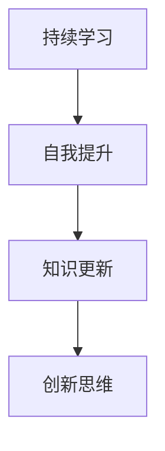

**案例分享**：

马云在创建阿里巴巴的过程中，始终坚持学习，通过参加各种培训和研讨会，不断提升自己的领导力和管理能力。

##### 9.2 培训与发展的方法

培训和发展是提升领导力和团队管理能力的重要手段。以下是一些有效的培训和发展方法：

**1. 内部培训**：企业可以组织内部培训，针对领导力和团队管理提供定制化的课程。

**2. 外部培训**：企业可以邀请外部专家进行培训，提供专业知识和实战经验。

**3. 在职学习**：通过在工作中的学习和实践，领导者可以不断提升自己的技能和知识。

**4. 培训与文化**：将培训纳入企业文化建设，鼓励员工主动学习和成长。

**核心概念与联系：**

培训与发展的核心概念包括内部培训、外部培训、在职学习和培训文化。以下是培训与发展的 Mermaid 流程图：

```mermaid
graph TD
A[培训与发展] --> B[内部培训]
B --> C[外部培训]
C --> D[在职学习]
D --> E[培训文化]
```

**案例分享**：

谷歌公司通过其“谷歌学院”提供内部培训，帮助员工提升领导力和团队管理能力，同时鼓励员工参加外部培训和在职学习。

##### 9.3 领导力与团队管理的未来趋势

随着技术的进步和社会的发展，领导力与团队管理也将呈现出新的趋势。以下是几个关键趋势：

**1. 数字化领导力**：数字化技术正深刻影响企业运作，领导者需要掌握数字化技能，以应对数字化时代的挑战。

**2. 平台化组织**：平台化组织强调去中心化和资源共享，领导者需要适应这种新型组织结构。

**3. 全员领导力**：全员领导力强调每个员工都具备领导潜力，领导者需要激发和培养员工的领导能力。

**4. 持续创新**：持续创新是企业保持竞争优势的关键，领导者需要推动企业不断创新，适应市场变化。

**核心概念与联系：**

领导力与团队管理的未来趋势包括数字化领导力、平台化组织、全员领导力和持续创新。以下是未来趋势的 Mermaid 流程图：

```mermaid
graph TD
A[未来趋势] --> B[数字化领导力]
B --> C[平台化组织]
C --> D[全员领导力]
D --> E[持续创新]
```

**案例分享**：

特斯拉公司通过数字化技术和平台化组织，实现了高效的生产和创新。特斯拉的员工不仅具备卓越的技术能力，还积极参与企业的决策和创新过程。

#### 总结

领导力与团队管理的持续提升是创业者实现长期成功的关键。通过持续学习、培训和发展，以及适应未来趋势，领导者可以不断提升自己的能力和团队的表现。在领导力与团队管理的道路上，持续学习和适应变化是永恒的主题。在附录部分，我们将提供一些推荐阅读书目和领导力与团队管理常用工具与资源，以帮助读者进一步深入学习和实践。

## 附录

##### 附录A：推荐阅读书目

1. Goleman, D. (1995). *Emotional Intelligence: Why It Can Matter More Than IQ*. Bantam Books.
2. Yukl, G. A. (2013). *Leadership in Organizations*. Pearson Education.
3. Hersey, P., & Blanchard, K. H. (1977). *Management of Organizational Behavior: Utilizing Human Resources*. Prentice Hall.
4. Kouzes, J. M., & Posner, B. Z. (2007). *The Truth About Leadership: The Leadership Practices Inventory in Action*. Jossey-Bass.
5. Collins, J. (2001). *Good to Great: Why Some Companies Make the Leap...And Others Don't*. HarperBusiness.

##### 附录B：领导力与团队管理常用工具与资源

1. **项目管理系统**：Trello、Asana、Jira
2. **即时通讯工具**：Slack、Microsoft Teams、WhatsApp
3. **文档协作工具**：Google Docs、Microsoft Office 365、Notion
4. **领导力发展平台**：LinkedIn Learning、Coursera、edX
5. **在线培训和研讨会**：Harvard Business Review Online、TED Talks、Webinars

---

```markdown
# 《创业者的领导力培养与团队管理》

## 关键词：创业者，领导力，团队管理，领导力培养，团队建设

## 摘要：

本文详细探讨了创业者的领导力培养与团队管理实践。通过深入分析领导力与团队管理的核心原则、实战应用、持续提升以及未来趋势，本文旨在为创业者提供一套完整的领导力培养与团队管理策略。文章通过实际案例的分析，为读者提供实用的管理技巧和实践经验，助力创业者在激烈的市场竞争中脱颖而出。
```

---

至此，我们完成了对《创业者的领导力培养与团队管理》一书的撰写。本书从领导力的基本概念、核心能力、核心原则，到实战应用和持续提升，为创业者提供了全面的指导。通过阅读本书，创业者可以系统性地提升自己的领导力和团队管理能力，带领企业走向成功。希望本书能为广大的创业者和管理者提供有价值的参考和启示。

