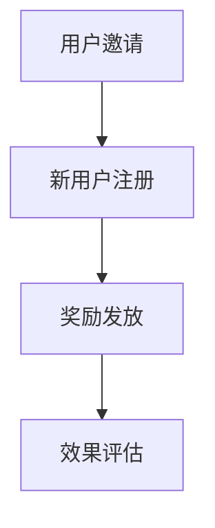

                 

### 第一部分：referral计划的基本概念

#### 1.1 referral计划概述

**核心概念**：
referral计划，也称为推荐计划或引荐计划，是企业通过激励现有用户推荐新用户来增加用户数量的策略。这种策略的核心在于利用现有用户的社交网络和信任关系，以低成本高效能地吸引新用户。

**基本原理**：
referral计划通常包含以下几个环节：用户邀请、新用户注册、奖励发放和效果评估。具体流程如下：

1. **用户邀请**：现有用户受到激励，通过分享推荐链接或邀请码，邀请新用户注册。
2. **新用户注册**：新用户通过邀请链接或邀请码完成注册，成为企业的新用户。
3. **奖励发放**：根据新用户的注册情况，企业向现有用户发放奖励，以鼓励其继续推荐新用户。
4. **效果评估**：企业对referral计划的效果进行跟踪和评估，以优化计划。

**Mermaid流程图**：

#### 1.2 referral计划的优势与局限

**优势分析**：

1. **低成本**：referral计划利用现有用户的社交网络，节省了广告投放和市场推广的成本。
2. **高转化率**：新用户往往通过信任关系加入，具有较高的转化率和留存率。
3. **用户参与度高**：用户因为获得了奖励，更愿意参与推广活动，提高用户的活跃度和忠诚度。

**局限考量**：

1. **用户疲劳**：长期使用referral计划可能导致用户疲劳，降低推荐效果。
2. **欺诈风险**：可能出现用户作弊、虚假注册等行为，影响referral计划的真实性和有效性。
3. **竞争压力**：在市场竞争激烈的情况下，单纯的奖励机制可能不足以吸引新用户。

**解决方案**：

1. **多样化奖励**：设计多样化的奖励形式，如虚拟货币、积分等，以减少用户疲劳。
2. **防作弊机制**：引入验证机制，如邀请验证、身份验证等，降低欺诈风险。
3. **持续优化**：根据市场变化和用户反馈，不断优化referral计划，提高其竞争力和吸引力。

#### 1.3 referral计划的市场趋势

**行业案例**：

- **Airbnb**：通过referral计划，Airbnb在短时间内吸引了大量用户，迅速扩张市场。
- **Dropbox**：通过奖励免费存储空间，Dropbox成功吸引了大量新用户。

**趋势预测**：

1. **个性化推荐**：未来referral计划将更加注重个性化推荐，提高推荐的精准度和效率。
2. **社交网络融合**：referral计划将与社交网络更加紧密融合，利用社交关系网扩大用户基础。
3. **数据驱动**：referral计划将更加依赖数据分析，以优化奖励机制和推广策略。

**总结**：

referral计划作为一种低成本高效的用户增长策略，具有显著的优势。然而，企业在实施过程中也需关注其局限性和市场趋势，以制定出更有效的referral计划。在下一部分，我们将深入探讨如何设计有效的referral计划策略。

#### 1.4 referral计划的实施步骤

**步骤一：确定目标用户群体**
- **分析现有用户**：根据现有用户的行为数据、偏好和使用习惯，确定哪些用户最有可能参与referral计划。
- **选择目标用户**：选择对产品或服务有较高忠诚度和活跃度的用户作为目标推荐者。

**步骤二：设计奖励机制**
- **设定奖励形式**：根据产品类型和市场情况，设计合理的奖励形式，如现金奖励、积分、优惠券等。
- **制定奖励规则**：明确奖励的标准、发放时间和条件，确保奖励机制公平合理。

**步骤三：制定宣传策略**
- **内容策划**：制定吸引人的宣传内容，强调推荐计划的好处和奖励，鼓励用户参与。
- **渠道选择**：选择合适的推广渠道，如社交媒体、电子邮件、短信等，确保宣传效果最大化。

**步骤四：实施和跟踪**
- **实施计划**：按照制定好的方案，启动referral计划，并跟踪进度和效果。
- **数据监控**：收集和分析用户行为数据，评估referral计划的效果，及时调整策略。

**步骤五：持续优化**
- **用户反馈**：收集用户反馈，了解用户的意见和建议，优化奖励机制和宣传内容。
- **数据分析**：利用数据分析工具，深入了解用户参与情况，找出改进空间。

**总结**：

referral计划的实施需要精心设计和持续优化。通过明确目标用户、设计有效的奖励机制、制定有效的宣传策略和不断的数据分析优化，企业可以制定出高效的referral计划，实现用户增长目标。

#### 1.5 referral计划的实施案例

**案例一：Airbnb的referral计划**

**背景**：Airbnb作为一家住宿分享平台，在用户增长初期采用了referral计划，通过激励现有用户邀请新用户来迅速扩大市场。

**具体实施**：

1. **用户邀请**：现有用户通过分享邀请链接，邀请新用户注册。
2. **奖励机制**：新用户完成注册后，邀请者和被邀请者都可以获得一定的折扣或积分。
3. **效果评估**：Airbnb通过数据分析，优化奖励机制，提高用户参与度。

**效果**：通过referral计划，Airbnb在短时间内吸引了大量新用户，用户增长迅速。

**经验借鉴**：Airbnb的referral计划成功在于其简单明了的邀请流程和有吸引力的奖励机制，为企业实施referral计划提供了有益的借鉴。

**案例二：Dropbox的referral计划**

**背景**：Dropbox作为一家云存储服务提供商，在用户增长初期，通过referral计划吸引了大量新用户。

**具体实施**：

1. **用户邀请**：现有用户通过分享邀请链接，邀请新用户注册。
2. **奖励机制**：新用户完成注册并存储一定量的数据后，邀请者和被邀请者都可以获得额外的存储空间。
3. **效果评估**：Dropbox通过定期分析用户数据，调整奖励机制，提高用户留存率。

**效果**：通过referral计划，Dropbox实现了用户数量的快速增长，并保持了较高的用户留存率。

**经验借鉴**：Dropbox的referral计划成功在于其灵活的奖励机制和持续的数据分析优化，为企业提供了有效的用户增长策略。

#### 1.6 referral计划的未来发展趋势

**个性化推荐**：

随着大数据和人工智能技术的发展，未来的referral计划将更加注重个性化推荐。通过分析用户的兴趣、行为和社交关系，精准定位推荐目标用户，提高推荐的有效性。

**社交网络融合**：

referral计划将与社交网络更加紧密融合，利用社交网络的力量扩大用户基础。通过在社交媒体上发布推荐内容，鼓励用户分享，实现病毒式传播。

**数据驱动**：

未来的referral计划将更加依赖数据分析，以优化奖励机制和推广策略。通过实时监控用户行为数据，快速调整计划，提高用户参与度和转化率。

**可定制化**：

企业将根据不同的市场环境和用户需求，定制化设计referral计划，使其更具针对性和吸引力。

**总结**：

referral计划作为一种低成本高效的用户增长策略，具有广阔的发展前景。通过个性化推荐、社交网络融合和数据驱动，referral计划将不断进化，为企业带来更多的用户增长机会。

### 第一部分总结

referral计划作为一种用户增长策略，具有低成本、高转化率和用户参与度高的显著优势。然而，其局限性和实施过程中的风险也需要企业充分考虑。在下一部分中，我们将深入探讨referral计划的策略设计，帮助企业在用户增长方面取得更好的效果。希望读者能够通过本文，对referral计划有一个全面而深入的了解。

---

**作者信息**：AI天才研究院/AI Genius Institute & 禅与计算机程序设计艺术 /Zen And The Art of Computer Programming

---

**关键词**：referral计划、用户增长、奖励机制、市场趋势、个性化推荐、社交网络融合、数据分析、案例研究。

**摘要**：本文深入探讨了referral计划的基本概念、优势与局限、市场趋势以及具体的实施策略。通过分析成功案例，总结了referral计划的设计原则和优化方法。文章旨在为企业和开发者提供实用的referral计划指南，帮助他们在用户增长方面取得成功。

