                 

# 利用技术优势进行社交媒体变现

> **关键词**：社交媒体变现、社交媒体广告、内容付费、社交电商、KOL变现、数据分析、用户画像、内容营销、广告投放策略、电商运营策略

> **摘要**：本文将深入探讨如何利用技术优势进行社交媒体变现。通过分析社交媒体变现的概念、趋势和策略，以及技术工具和成功案例分析，为企业和个人提供社交媒体变现的实践指南和未来趋势展望。

## 目录大纲

### 第一部分：社交媒体变现概述

1. **第1章**：社交媒体变现的概念与趋势
   1.1 **社交媒体的定义与发展历程**
   1.2 **社交媒体变现的原理与类型**
   1.3 **社交媒体变现的全球趋势**

2. **第2章**：社交媒体平台变现策略
   2.1 **各大社交媒体平台的变现模式**
   2.2 **社交媒体广告变现**
   2.3 **内容付费变现**
   2.4 **社交电商变现**
   2.5 **KOL（关键意见领袖）变现**

### 第二部分：社交媒体变现技术与工具

3. **第3章**：社交媒体数据分析与用户画像
   3.1 **社交媒体数据分析工具**
   3.2 **用户画像构建方法**
   3.3 **数据分析与用户行为分析**

4. **第4章**：内容营销与社交媒体变现
   4.1 **内容营销策略**
   4.2 **创意内容制作技巧**
   4.3 **内容分发与推广**
   4.4 **用户互动与反馈**

5. **第5章**：社交媒体广告投放策略
   5.1 **广告投放目标设定**
   5.2 **广告创意设计**
   5.3 **广告投放平台选择**
   5.4 **广告投放效果评估**

6. **第6章**：社交媒体电商运营
   6.1 **社交电商模式解析**
   6.2 **商品选品与供应链管理**
   6.3 **电商平台搭建与运营**
   6.4 **用户转化与留存策略**

7. **第7章**：社交媒体变现成功案例分析
   7.1 **国内社交媒体变现成功案例分析**
   7.2 **国际社交媒体变现成功案例分析**
   7.3 **案例分析与启示**

### 第三部分：社交媒体变现策略优化与实践

8. **第8章**：社交媒体变现策略优化方法
   8.1 **数据驱动的策略调整**
   8.2 **A/B测试与实验设计**
   8.3 **竞争对手分析**
   8.4 **用户反馈与改进**

9. **第9章**：社交媒体变现实战案例
   9.1 **内容付费变现实战案例**
   9.2 **社交电商变现实战案例**
   9.3 **KOL变现实战案例**
   9.4 **广告投放优化实战案例**

10. **第10章**：社交媒体变现未来趋势
    10.1 **技术创新与变现模式的拓展**
    10.2 **社交媒体变现的挑战与机遇**
    10.3 **未来社交媒体变现趋势预测**

## 附录

11. **附录A**：社交媒体变现相关资源与工具

12. **附录B**：社交媒体变现常见问题解答

13. **附录C**：社交媒体变现实用模板与案例库

---

### 社交媒体变现概述

社交媒体已经深入到我们的日常生活中，成为人们获取信息、交流互动的重要平台。随着社交媒体用户数量的急剧增长，如何利用社交媒体进行变现成为企业和个人关注的重要问题。本章节将介绍社交媒体变现的概念、趋势和主要策略，为后续章节的深入讨论打下基础。

#### 第1章：社交媒体变现的概念与趋势

##### 1.1 社交媒体的定义与发展历程

社交媒体是指基于互联网的技术平台，允许用户创建、分享、交换和消费信息的一种媒介。早期的社交媒体起源于论坛和即时通讯工具，如Facebook、Twitter、Instagram等平台的崛起标志着社交媒体进入了新时代。

社交媒体的发展历程可以分为以下几个阶段：

1. **早期阶段**：以论坛和聊天室为代表的早期社交媒体平台，如Usenet和IRC。
2. **Web 2.0阶段**：博客和社交网络的兴起，如Blogger、MySpace和Facebook。
3. **移动阶段**：移动互联网的普及使得社交媒体更加便捷，如微信、微博和Instagram。
4. **多样化阶段**：社交媒体功能不断丰富，包括视频、直播、电商等，如抖音、TikTok和淘宝直播。

##### 1.2 社交媒体变现的原理与类型

社交媒体变现是指通过社交媒体平台实现商业价值的过程。其原理主要包括以下几个方面：

1. **广告变现**：通过展示广告来获取收入，包括展示广告、点击广告、付费点击广告等。
2. **内容付费**：通过提供有价值的内容，吸引用户付费订阅或购买。
3. **社交电商**：通过社交媒体平台直接销售商品或服务，实现交易。
4. **KOL变现**：通过关键意见领袖（如网红、大V）的影响力进行品牌推广和商品销售。

社交媒体变现的类型主要包括以下几种：

1. **直接变现**：通过社交媒体平台直接实现销售或提供服务。
2. **间接变现**：通过社交媒体平台引导用户到其他平台进行交易或服务。
3. **增值变现**：通过社交媒体平台提供增值服务，如付费会员、增值功能等。

##### 1.3 社交媒体变现的全球趋势

随着社交媒体的普及，全球社交媒体变现市场呈现出快速增长的趋势。以下是社交媒体变现的一些全球趋势：

1. **广告投入持续增长**：随着广告主对社交媒体的重视，广告投入持续增加。
2. **内容付费逐渐普及**：优质内容的付费模式逐渐被用户接受，内容付费市场规模不断扩大。
3. **社交电商蓬勃发展**：社交媒体与电商的结合越来越紧密，社交电商成为新的增长点。
4. **KOL影响力增强**：关键意见领袖的影响力日益增强，成为品牌推广和商品销售的重要渠道。

#### 第2章：社交媒体平台变现策略

##### 2.1 各大社交媒体平台的变现模式

不同的社交媒体平台具有不同的用户群体和功能特点，因此变现模式也有所不同。以下是几个主要社交媒体平台的变现模式：

1. **Facebook**：通过广告变现、内容付费和社交电商等多种方式实现变现。Facebook的广告投放系统非常成熟，包括展示广告、原生广告、视频广告等。
2. **Instagram**：主要通过广告变现和社交电商实现变现。Instagram的视觉化内容吸引了大量广告主，同时与电商平台的合作也越来越紧密。
3. **微信**：通过公众号广告、小程序电商和微信支付等功能实现变现。微信的用户基础非常庞大，为广告主提供了丰富的流量资源。
4. **微博**：通过广告变现、内容付费和KOL变现等多种方式实现变现。微博的实时信息传播特点吸引了大量品牌和广告主。

##### 2.2 社交媒体广告变现

社交媒体广告变现是最常见的变现方式之一。广告主通过在社交媒体平台投放广告，吸引用户点击、关注或购买，从而实现商业价值。以下是社交媒体广告变现的主要策略：

1. **目标受众定位**：通过分析用户数据和行为，精准定位目标受众，提高广告投放的精准度。
2. **广告创意设计**：制作吸引人的广告内容，提高广告的点击率和转化率。
3. **广告投放优化**：根据广告投放效果，不断调整投放策略，提高广告投放的回报率。
4. **跨平台投放**：利用社交媒体平台的合作渠道，实现广告的跨平台投放，扩大广告覆盖范围。

##### 2.3 内容付费变现

内容付费是指通过提供有价值的内容，吸引用户付费订阅或购买，从而实现变现。以下是内容付费变现的主要策略：

1. **内容定位**：明确内容的价值和受众群体，确保内容具有吸引力。
2. **付费模式**：根据内容的特性和用户需求，设计合适的付费模式，如订阅、付费文章、课程等。
3. **用户体验**：提供良好的用户体验，包括内容更新频率、内容质量、用户互动等。
4. **用户转化**：通过营销推广、互动反馈等方式，提高用户的付费转化率。

##### 2.4 社交电商变现

社交电商是指通过社交媒体平台直接销售商品或服务，实现交易。以下是社交电商变现的主要策略：

1. **商品选品**：根据用户需求和平台特点，选择适合销售的商品。
2. **供应链管理**：建立高效的供应链体系，确保商品供应和物流的稳定性。
3. **电商平台搭建**：利用社交媒体平台提供的电商平台功能，搭建便捷的购物体验。
4. **用户互动**：通过用户互动和营销活动，提高用户参与度和购买意愿。

##### 2.5 KOL（关键意见领袖）变现

KOL变现是指通过关键意见领袖的影响力进行品牌推广和商品销售，实现变现。以下是KOL变现的主要策略：

1. **选品与品牌合作**：选择与KOL品牌定位相符合的商品，建立良好的合作关系。
2. **内容创作**：制定内容策略，通过高质量的内容创作提高KOL的影响力。
3. **用户互动**：积极与用户互动，提高用户的参与度和忠诚度。
4. **数据监测**：通过数据分析，不断优化KOL变现策略，提高变现效率。

### 总结

通过本章节的介绍，我们可以了解到社交媒体变现的概念、趋势和主要策略。在后续章节中，我们将进一步探讨社交媒体变现的技术和工具，以及成功案例和实践经验，帮助读者更好地掌握社交媒体变现的实践方法。

---

通过本章节的概述，我们为后续的内容提供了坚实的基础。在接下来的章节中，我们将详细分析社交媒体变现的技术和工具，提供实用的策略和实战案例，帮助企业和个人实现社交媒体变现的目标。让我们继续深入探讨，揭示社交媒体变现背后的技术奥秘。

---

### 社交媒体数据分析与用户画像

社交媒体数据分析和用户画像是实现有效社交媒体变现的关键环节。通过对用户数据的深入挖掘和分析，企业可以更好地理解用户需求和行为，从而制定精准的营销策略和内容创作方向。本章节将介绍社交媒体数据分析工具、用户画像构建方法以及数据分析和用户行为分析的应用。

#### 第3章：社交媒体数据分析与用户画像

##### 3.1 社交媒体数据分析工具

社交媒体数据分析工具是进行有效数据分析的重要手段。以下是一些常用的社交媒体数据分析工具：

1. **Google Analytics**：Google Analytics 是一款功能强大的数据分析工具，可帮助企业追踪和分析网站流量、用户行为等数据，从而优化社交媒体营销策略。
   
   **核心功能**：
   - 网站流量分析
   - 用户行为分析
   - 目标群体分析
   - 转化率优化

2. **Facebook Insights**：Facebook Insights 是 Facebook 提供的官方数据分析工具，可帮助用户追踪和分析 Facebook 页面的性能。

   **核心功能**：
   - 页面访问量分析
   - 用户参与度分析
   - 广告效果分析
   - 内容分析

3. **Instagram Insights**：Instagram Insights 是 Instagram 提供的数据分析工具，可帮助用户了解 Instagram 帐户的表现。

   **核心功能**：
   - 账户概述
   - 故事表现分析
   - 贴文表现分析
   - 用户互动分析

4. **Twitter Analytics**：Twitter Analytics 是 Twitter 提供的数据分析工具，可帮助用户了解 Twitter 帐户的表现。

   **核心功能**：
   - 推文分析
   - 引用分析
   - 用户互动分析
   - 目标群体分析

##### 3.2 用户画像构建方法

用户画像是指通过对用户数据的收集和分析，构建出一个包含用户基本属性、兴趣、行为等信息的虚拟形象。以下是构建用户画像的方法：

1. **用户数据收集**：
   - **基本属性**：年龄、性别、地理位置、职业等。
   - **兴趣标签**：通过用户互动内容、搜索历史、点击行为等收集兴趣标签。
   - **行为数据**：浏览行为、购买行为、评论行为、分享行为等。

2. **数据分析与处理**：
   - **数据清洗**：对收集到的数据进行清洗，去除重复和无效数据。
   - **数据建模**：使用数据挖掘和机器学习技术对数据进行建模，提取用户特征。

3. **用户画像构建**：
   - **特征提取**：根据数据建模结果提取用户特征。
   - **画像组合**：将提取的用户特征组合成一个完整的用户画像。

##### 3.3 数据分析与用户行为分析

数据分析与用户行为分析是社交媒体变现的重要环节，通过这些分析，企业可以更好地了解用户需求和偏好，从而优化营销策略和内容创作。以下是数据分析与用户行为分析的主要应用：

1. **用户需求分析**：
   - 通过分析用户互动数据，了解用户对哪些内容感兴趣，从而制定更符合用户需求的内容策略。

2. **用户偏好分析**：
   - 通过分析用户行为数据，了解用户的偏好，如购物偏好、娱乐偏好等，从而优化产品和服务。

3. **用户转化分析**：
   - 通过分析用户转化数据，了解用户在购买过程中的行为和决策因素，从而优化用户体验和转化流程。

4. **用户留存分析**：
   - 通过分析用户留存数据，了解用户留存的原因和流失的原因，从而优化用户留存策略。

#### 实践案例

以下是一个实际案例，展示如何通过数据分析与用户画像构建实现社交媒体变现：

1. **案例背景**：
   - 一家电商企业希望通过社交媒体平台进行产品推广，提高销售额。

2. **数据分析与用户画像构建**：
   - 收集用户的基本属性、兴趣标签和行为数据。
   - 通过数据建模提取用户特征，构建用户画像。
   - 分析用户需求和行为，了解用户对哪些产品感兴趣。

3. **营销策略优化**：
   - 根据用户画像和需求分析，制定针对性的营销策略，如定制化的产品推荐、精准的推广广告等。

4. **内容创作优化**：
   - 根据用户偏好和需求，优化内容创作方向，如制作用户感兴趣的视频、文章等。

5. **效果评估与调整**：
   - 通过分析用户行为数据和销售数据，评估营销策略和内容创作的效果。
   - 根据效果评估结果，调整营销策略和内容创作方向，以提高用户转化率和留存率。

通过本章节的介绍，我们了解到社交媒体数据分析和用户画像是实现社交媒体变现的重要手段。通过有效的数据分析与用户画像构建，企业可以更好地了解用户需求和行为，制定针对性的营销策略和内容创作方向，从而提高社交媒体变现的效率和效果。

---

通过本章节的详细讲解，我们掌握了社交媒体数据分析与用户画像构建的核心技术和方法。在下一章节中，我们将探讨如何通过内容营销与社交媒体变现相结合，创造价值并实现商业目标。敬请期待！

---

### 内容营销与社交媒体变现

内容营销是社交媒体变现的核心策略之一。通过高质量的内容创作和有效的推广，企业可以吸引潜在客户，提高品牌知名度，并最终实现商业变现。本章节将详细介绍内容营销的策略、创意内容制作技巧、内容分发与推广以及用户互动与反馈。

#### 第4章：内容营销与社交媒体变现

##### 4.1 内容营销策略

内容营销策略是指通过策划和制作与目标受众相关的内容，以吸引、转化和留住有价值的客户。以下是几个关键的内容营销策略：

1. **目标受众分析**：
   - 确定目标受众的特征、需求和痛点，以便制作符合他们兴趣的内容。
   - 利用数据分析工具，如Google Analytics和社交媒体平台内置的分析工具，收集和分析目标受众的数据。

2. **内容主题规划**：
   - 根据目标受众的需求，制定内容主题，确保内容与受众相关。
   - 选择具有高搜索量和用户关注度的主题，以提高内容曝光率。

3. **内容形式多样化**：
   - 采用多种内容形式，如文章、视频、图片、直播等，以满足不同受众的偏好。
   - 结合文字、图像和视频等多媒体元素，提高内容吸引力。

4. **内容创作与发布**：
   - 定期发布高质量的内容，保持内容的更新频率。
   - 采用内容日历，规划内容发布的时间、频率和主题。

##### 4.2 创意内容制作技巧

创意内容制作是内容营销成功的关键。以下是一些创意内容制作的技巧：

1. **故事化内容**：
   - 将产品或服务融入到有趣的故事中，以吸引受众的注意力。
   - 通过情节、角色和冲突，讲述与品牌相关的故事，使内容更具吸引力。

2. **视觉效果**：
   - 使用高质量的图像和视频，提高内容的视觉吸引力。
   - 采用图表、动画和图形，使复杂的信息更易于理解。

3. **互动性内容**：
   - 设计互动式内容，如问答、投票、小游戏等，提高用户参与度。
   - 通过互动，收集用户反馈，深入了解用户需求。

4. **个性化内容**：
   - 根据用户画像和兴趣，提供个性化的内容推荐。
   - 使用用户的名字和个性化标签，增强用户的归属感。

##### 4.3 内容分发与推广

内容分发与推广是将高质量内容传达给目标受众的关键步骤。以下是一些内容分发与推广的策略：

1. **社交媒体平台**：
   - 利用各大社交媒体平台，如Facebook、Instagram、Twitter、LinkedIn等，发布内容。
   - 根据平台特性，采用适合的发布时间和内容形式，提高内容曝光率。

2. **搜索引擎优化（SEO）**：
   - 优化内容的关键词，提高在搜索引擎中的排名。
   - 使用长尾关键词，吸引更多潜在客户。

3. **合作与推广**：
   - 与行业内的意见领袖、合作伙伴等进行内容合作和推广。
   - 利用社交媒体广告、电子邮件营销等手段，扩大内容传播范围。

4. **内部链接**：
   - 在企业网站内，建立内部链接，提高内容的关联性和访问深度。

##### 4.4 用户互动与反馈

用户互动与反馈是内容营销的重要组成部分。以下是一些促进用户互动和收集反馈的策略：

1. **互动式内容**：
   - 设计互动式内容，如问答、投票、评论等，鼓励用户参与。
   - 回应用户的评论和私信，建立良好的用户关系。

2. **用户调研**：
   - 定期进行用户调研，了解用户对产品和服务的看法。
   - 通过问卷调查、访谈等方式，收集用户反馈。

3. **用户社区**：
   - 建立用户社区，为用户提供交流和分享的平台。
   - 管理社区，鼓励用户参与，提高社区活跃度。

4. **数据分析**：
   - 利用数据分析工具，分析用户互动数据，了解用户行为和偏好。
   - 根据数据分析结果，调整内容策略和推广方式。

#### 实践案例

以下是一个实际案例，展示如何通过内容营销实现社交媒体变现：

1. **案例背景**：
   - 一家在线教育平台希望通过内容营销吸引更多学生报名学习。

2. **内容创作**：
   - 制作一系列关于在线学习优势和成功案例的视频，展示学员的学习成果。
   - 发布关于学习方法和技巧的文章，帮助用户解决学习中的问题。

3. **内容推广**：
   - 在Facebook、YouTube等平台发布内容，利用广告推广视频。
   - 与教育领域的大V和KOL合作，通过他们的影响力扩大内容传播。

4. **用户互动与反馈**：
   - 鼓励用户在评论区留言，分享他们的学习经历。
   - 定期举办在线问答活动，回答用户的问题，增加用户互动。

5. **效果评估**：
   - 通过分析网站流量和报名数据，评估内容营销的效果。
   - 根据反馈和数据分析结果，优化内容策略和推广方式。

通过本章节的介绍，我们了解到内容营销在社交媒体变现中的重要性。通过制定有效的策略、创作高质量的创意内容、推广内容以及与用户互动，企业可以实现社交媒体变现的目标。

---

在掌握了内容营销的策略和技巧后，我们继续探讨社交媒体广告投放策略。在下一章节中，我们将深入分析广告投放的目标设定、创意设计、平台选择和效果评估，帮助您优化广告投放策略，实现更高的ROI。敬请期待！

---

### 社交媒体广告投放策略

社交媒体广告投放策略是社交媒体变现的重要组成部分。通过精准的广告投放，企业可以吸引潜在客户，提高品牌知名度，并实现商业目标。本章节将详细讨论广告投放的目标设定、广告创意设计、广告投放平台选择以及广告投放效果评估。

#### 第5章：社交媒体广告投放策略

##### 5.1 广告投放目标设定

广告投放目标的设定是广告投放策略的关键步骤。明确的目标有助于优化广告投放策略，提高广告投放的效果。以下是广告投放目标设定的几个关键点：

1. **明确目标受众**：
   - 确定目标受众的年龄、性别、地理位置、兴趣爱好等特征。
   - 利用社交媒体平台的数据分析工具，如Facebook Insights和Google Analytics，获取目标受众的数据。

2. **设定具体指标**：
   - 根据业务需求，设定可量化的指标，如点击率（CTR）、转化率（CVR）、成本效益比（CPI）等。
   - 使用不同的指标，衡量广告投放的效果和ROI。

3. **设定时间范围**：
   - 确定广告投放的时间范围，如短期（1-3个月）、中期（6-12个月）或长期（1年以上）。
   - 根据时间范围，制定相应的广告投放策略和预算。

##### 5.2 广告创意设计

广告创意设计是吸引目标受众、提高广告点击率和转化率的关键。以下是广告创意设计的几个关键点：

1. **吸引人的标题**：
   - 使用简短、直接、具有吸引力的标题，激发用户的兴趣。
   - 标题应明确传达广告的核心信息，避免模糊不清。

2. **高质量的图像或视频**：
   - 使用高质量的图像或视频，提高广告的视觉吸引力。
   - 选择与广告内容和目标受众相关的图像或视频，增强用户体验。

3. **明确的呼叫行动（CTA）**：
   - 设计清晰的呼叫行动，引导用户进行下一步操作，如点击链接、关注账号、购买产品等。
   - CTA应简洁明了，使用激励性的语言，激发用户行动。

4. **创意形式多样化**：
   - 尝试不同的广告形式，如横幅广告、视频广告、动态广告等，提高广告的多样性和吸引力。

##### 5.3 广告投放平台选择

选择合适的广告投放平台是广告投放成功的关键。不同的社交媒体平台具有不同的用户群体和广告形式，企业应根据目标受众和广告目标选择合适的平台。以下是几个主要的社交媒体广告投放平台：

1. **Facebook广告**：
   - 适合目标广泛的受众，具有丰富的广告形式和定位选项。
   - 可针对用户兴趣、行为、地理位置等进行精准投放。

2. **Instagram广告**：
   - 针对年轻用户，具有视觉化、互动性强的特点。
   - 可通过图片、视频、故事等多种形式进行广告投放。

3. **Twitter广告**：
   - 适合实时传播和快速触达目标受众。
   - 可通过推文广告、品牌提升广告等吸引关注。

4. **LinkedIn广告**：
   - 针对职业用户，适合企业推广和专业品牌建设。
   - 可通过文本广告、展示广告、互动广告等多种形式进行投放。

##### 5.4 广告投放效果评估

广告投放效果评估是优化广告投放策略的重要环节。以下是一些常见的广告投放效果评估指标：

1. **点击率（CTR）**：
   - 反映广告吸引用户点击的能力，计算公式为（点击次数 / 展现次数）× 100%。

2. **转化率（CVR）**：
   - 反映广告促成用户转化的效果，计算公式为（转化次数 / 点击次数）× 100%。

3. **成本效益比（CPI）**：
   - 反映广告投入与收益的关系，计算公式为（广告花费 / 转化次数）。

4. **投资回报率（ROI）**：
   - 反映广告的整体效益，计算公式为（净利润 / 广告投入）× 100%。

通过定期评估广告投放效果，企业可以发现广告投放中的问题，并及时进行调整，提高广告投放的效果。

#### 实践案例

以下是一个实际案例，展示如何通过社交媒体广告投放实现变现：

1. **案例背景**：
   - 一家在线教育平台希望通过广告投放吸引更多用户注册。

2. **广告目标设定**：
   - 目标受众：年龄在18-35岁，对在线学习感兴趣的用户。
   - 目标指标：点击率（CTR）≥ 2%，转化率（CVR）≥ 5%。

3. **广告创意设计**：
   - 标题：“免费试听顶级名师课程，开启您的学习之旅！”
   - 图像：展示一位学生在课堂上认真听讲的场景。
   - CTA：“立即免费试听”。

4. **广告投放平台选择**：
   - 选择Facebook和Instagram进行广告投放，因为这两个平台用户年轻，对在线学习有较高的关注度。

5. **广告投放效果评估**：
   - 通过分析广告投放数据，点击率（CTR）为3.5%，转化率（CVR）为8%，成本效益比（CPI）为1.5。
   - 根据评估结果，优化广告创意和投放策略，进一步提高广告效果。

通过本章节的介绍，我们掌握了社交媒体广告投放策略的关键要素，包括目标设定、广告创意设计、平台选择和效果评估。在下一章节中，我们将深入探讨社交媒体电商运营，帮助您实现社交电商的变现策略。敬请期待！

---

### 社交媒体电商运营

社交媒体电商运营是近年来迅速发展的新兴模式，通过社交媒体平台的强大影响力，商家可以直接与消费者互动，促进商品销售。本章节将详细解析社交媒体电商的运营模式、商品选品与供应链管理、电商平台搭建与运营以及用户转化与留存策略。

#### 第6章：社交媒体电商运营

##### 6.1 社交电商模式解析

社交电商模式是指通过社交媒体平台进行商品推广、销售和服务的电商模式。与传统电商相比，社交电商具有以下几个特点：

1. **去中心化**：社交电商依托于社交媒体平台，通过用户之间的分享和推荐实现商品传播和销售，去除了传统的电商平台中间环节。

2. **互动性强**：社交电商通过与用户的互动，如评论、点赞、分享等，建立良好的用户关系，增强用户粘性。

3. **个性化推荐**：通过分析用户行为和兴趣，社交电商平台可以提供个性化的商品推荐，提高用户购物体验。

4. **社交传播**：社交媒体的病毒式传播特点，使得优质商品可以快速扩散，吸引更多潜在客户。

##### 6.2 商品选品与供应链管理

商品选品与供应链管理是社交电商运营的关键环节。以下是商品选品与供应链管理的关键要点：

1. **市场调研**：通过市场调研，了解用户需求和市场趋势，确定选品方向。

2. **商品定位**：根据用户需求和竞争情况，明确商品的定位，如高性价比、高端品质等。

3. **供应链管理**：
   - **供应商选择**：选择稳定、可靠的供应商，确保商品质量和供应稳定性。
   - **库存管理**：建立合理的库存管理机制，避免库存过剩或不足，提高供应链效率。

4. **物流管理**：建立高效的物流体系，确保商品快速、安全地送达用户。

##### 6.3 电商平台搭建与运营

电商平台搭建与运营是社交电商成功的基础。以下是电商平台搭建与运营的关键要点：

1. **平台选择**：选择适合的社交电商平台，如微信小程序、抖音电商等，搭建电商平台。

2. **界面设计**：设计简洁、美观的界面，提高用户购物体验。

3. **商品展示**：通过高质量的图片、视频和详细的商品描述，展示商品特点和价值。

4. **促销活动**：定期举办促销活动，如限时抢购、满减优惠等，提高用户购买意愿。

5. **售后服务**：提供优质的售后服务，解决用户在购物过程中的问题，提高用户满意度。

##### 6.4 用户转化与留存策略

用户转化与留存策略是社交电商运营的重要目标。以下是用户转化与留存策略的关键要点：

1. **用户画像分析**：通过数据分析工具，构建用户画像，了解用户需求和偏好。

2. **个性化推荐**：根据用户画像，提供个性化的商品推荐，提高用户购物体验。

3. **互动营销**：通过互动活动，如抽奖、评论送礼物等，增强用户参与度。

4. **会员制度**：建立会员制度，为会员提供专属优惠和福利，提高用户忠诚度。

5. **用户反馈与改进**：收集用户反馈，及时改进产品和服务，提高用户满意度。

#### 实践案例

以下是一个实际案例，展示如何通过社交电商运营实现变现：

1. **案例背景**：
   - 一家服装品牌希望通过社交电商吸引更多年轻用户。

2. **商品选品与供应链管理**：
   - 通过市场调研，确定以时尚、个性为主题的服装选品方向。
   - 选择有经验的供应商，确保商品质量和供应稳定性。

3. **电商平台搭建与运营**：
   - 在微信小程序和抖音电商搭建电商平台，设计简洁、美观的界面。
   - 发布高质量的图片、视频和详细的商品描述，提高用户购物体验。

4. **用户转化与留存策略**：
   - 通过用户画像分析，了解用户需求和偏好。
   - 定期举办限时抢购、满减优惠等促销活动，提高用户购买意愿。
   - 建立会员制度，为会员提供专属优惠和福利，提高用户忠诚度。

5. **效果评估**：
   - 通过分析销售数据和用户反馈，评估社交电商运营的效果。
   - 根据评估结果，优化商品选品、供应链管理和用户转化与留存策略。

通过本章节的介绍，我们了解了社交媒体电商运营的核心策略和实践方法。在下一章节中，我们将通过成功案例分析，深入了解国内外社交媒体变现的成功经验。敬请期待！

---

### 社交媒体变现成功案例分析

通过分析国内外社交媒体变现的成功案例，我们可以了解到不同企业和个人如何利用社交媒体平台实现商业变现。以下是几个具有代表性的案例，它们展示了社交媒体变现的多样性和创新性。

#### 7.1 国内社交媒体变现成功案例分析

**案例1：淘宝直播**

淘宝直播是阿里巴巴集团旗下淘宝平台推出的直播电商服务。通过直播的形式，主播与观众实时互动，展示商品、解答疑问，从而促进商品销售。淘宝直播的成功在于：

- **直播内容多样化**：淘宝直播涵盖了美妆、时尚、美食、数码等多个领域，满足不同用户的消费需求。
- **社交互动性**：直播过程中的弹幕互动、抽奖活动等增加了观众的参与感，提高了转化率。
- **平台支持**：淘宝提供了完善的直播工具和数据分析工具，帮助主播优化直播效果。

**案例2：罗永浩直播带货**

罗永浩是中国知名企业家和科技达人，他在2020年开始通过抖音平台进行直播带货。罗永浩的成功经验包括：

- **品牌效应**：罗永浩凭借其在科技领域的知名度和影响力，吸引了大量粉丝和观众。
- **内容真实性**：罗永浩在直播中亲自试用产品，展示产品的真实效果，提高了观众的信任度。
- **互动性强**：罗永浩与观众进行实时互动，解答疑问，增加了直播的趣味性和互动性。

#### 7.2 国际社交媒体变现成功案例分析

**案例1：Instagram美妆博主案例分析**

Instagram上的美妆博主通过发布高质量的美妆教程、产品评测等内容，吸引了大量粉丝，并通过以下方式实现变现：

- **品牌合作**：与美妆品牌合作，推广产品，获得品牌赞助费。
- **广告收入**：通过在Instagram上发布广告，获得广告收入。
- **电商销售**：通过自己的电商平台销售美妆产品，实现商品销售。

**案例2：TikTok网红案例分析**

TikTok（抖音海外版）上的网红通过创作有趣、创意的视频内容，吸引了大量粉丝，并通过以下方式实现变现：

- **广告收入**：与品牌合作，进行广告植入，获得广告收入。
- **直播带货**：通过直播销售商品，实现商品销售。
- **会员订阅**：开通会员订阅服务，提供独家内容和福利，获得会员费。

#### 7.3 案例分析与启示

通过以上案例分析，我们可以得出以下启示：

1. **内容质量是关键**：无论是国内还是国际，高质量的内容都是吸引粉丝和实现变现的基础。

2. **互动性至关重要**：通过互动增加用户参与感，提高用户粘性和转化率。

3. **多元化变现方式**：结合广告、品牌合作、电商销售等多种变现方式，提高收入来源。

4. **利用平台工具**：充分利用社交媒体平台提供的工具和资源，优化内容创作和推广效果。

5. **持续优化与调整**：根据用户反馈和市场变化，不断优化变现策略，提高变现效率。

通过分析这些成功案例，我们可以看到社交媒体变现的多样性和潜力。在下一章节中，我们将探讨社交媒体变现策略的优化方法，帮助企业和个人更好地实现社交媒体变现的目标。敬请期待！

---

### 社交媒体变现策略优化方法

在社交媒体变现的过程中，策略的优化至关重要。通过数据驱动的策略调整、A/B测试与实验设计、竞争对手分析和用户反馈与改进，企业可以不断优化变现策略，提高变现效率和效果。以下是一些具体的优化方法。

#### 8.1 数据驱动的策略调整

数据驱动的策略调整是基于数据分析结果，对社交媒体变现策略进行优化。以下是几个关键步骤：

1. **数据收集**：收集社交媒体平台的数据，包括用户行为数据、广告数据、销售数据等。

2. **数据分析**：使用数据分析工具，如Google Analytics、Facebook Insights等，对收集的数据进行深入分析。

3. **指标设定**：根据业务目标，设定可量化的指标，如点击率（CTR）、转化率（CVR）、成本效益比（CPI）等。

4. **策略调整**：根据数据分析结果，对变现策略进行调整。例如，如果广告点击率较低，可以优化广告创意和投放平台；如果用户转化率较低，可以改进用户互动和推广策略。

5. **持续监测**：定期监测数据变化，评估策略调整的效果，并根据实际情况进行进一步的优化。

#### 8.2 A/B测试与实验设计

A/B测试与实验设计是一种通过对比不同策略的效果，优化社交媒体变现策略的方法。以下是A/B测试的几个关键步骤：

1. **确定测试目标**：明确要测试的具体目标，如提高点击率、增加用户转化率等。

2. **设计测试方案**：设计两个或多个不同的方案，如不同的广告创意、不同的推广平台、不同的促销活动等。

3. **实施测试**：在不同用户群体或不同时间段，实施不同的测试方案。

4. **数据收集与比较**：收集测试数据，比较不同方案的绩效，确定哪种方案更有效。

5. **结果应用**：根据测试结果，选择最优方案，并将其应用到实际的社交媒体变现策略中。

#### 8.3 竞争对手分析

竞争对手分析是了解市场动态和优化自身策略的重要手段。以下是竞争对手分析的几个关键步骤：

1. **确定竞争对手**：确定与自己在市场中竞争的企业或个人。

2. **数据收集**：收集竞争对手的社交媒体数据，包括粉丝数量、互动数据、广告投放情况等。

3. **数据分析**：分析竞争对手的数据，了解他们的策略、优势和劣势。

4. **策略借鉴**：根据竞争对手的数据分析结果，借鉴他们的成功经验，优化自己的策略。

5. **差异化竞争**：在了解竞争对手的基础上，寻找差异化策略，以避免直接竞争，实现错位竞争。

#### 8.4 用户反馈与改进

用户反馈与改进是基于用户反馈，不断优化社交媒体变现策略的方法。以下是用户反馈与改进的几个关键步骤：

1. **用户反馈收集**：通过问卷调查、评论、私信等方式，收集用户的意见和建议。

2. **数据分析**：对用户反馈进行分类和整理，分析用户的主要需求和痛点。

3. **策略调整**：根据用户反馈，对社交媒体变现策略进行调整。例如，改进用户体验、优化广告内容、提高售后服务等。

4. **测试与验证**：对调整后的策略进行测试，验证其效果。

5. **持续改进**：根据测试结果，继续优化策略，不断改进用户体验，提高用户满意度。

通过以上策略优化方法，企业可以不断调整和优化社交媒体变现策略，提高变现效率和效果。在下一章节中，我们将通过实际案例，展示如何将这些策略应用到具体的社交媒体变现实践中。敬请期待！

---

### 社交媒体变现实战案例

在社交媒体变现的实践中，许多企业和个人通过创新和努力，取得了显著的成果。以下是几个具有代表性的实战案例，展示了如何通过内容付费、社交电商、KOL变现和广告投放优化实现社交媒体变现。

#### 9.1 内容付费变现实战案例

**案例背景**：
一家专注于科技领域的内容平台，通过提供高质量的技术文章、教程和视频，吸引了大量专业用户。

**解决方案**：
- **内容定位**：针对科技爱好者和专业人士，提供深入的技术分析和行业洞察。
- **付费模式**：推出会员制，会员可以免费阅读所有付费内容，并获得额外的福利，如线上研讨会、专家问答等。
- **推广策略**：通过社交媒体平台，如LinkedIn和Facebook，发布内容摘要和推广信息，吸引潜在会员。

**效果评估**：
- **会员增长**：通过会员制，平台月收入增加了30%。
- **用户满意度**：会员对平台内容的满意度达到90%。

#### 9.2 社交电商变现实战案例

**案例背景**：
一家时尚品牌通过抖音直播带货，实现了销售额的快速增长。

**解决方案**：
- **直播策划**：定期举办直播活动，邀请网红和KOL进行直播带货。
- **商品选品**：根据用户反馈和数据分析，选择热门、优质的商品进行推广。
- **互动环节**：在直播过程中，通过弹幕互动、抽奖活动等方式，提高用户参与度。

**效果评估**：
- **销售额**：直播期间的销售额达到平时平均销售额的3倍。
- **用户留存**：直播后的7天内，用户复购率提高了20%。

#### 9.3 KOL变现实战案例

**案例背景**：
一位知名美妆博主通过Instagram，与美妆品牌合作，实现了品牌推广和商品销售的共赢。

**解决方案**：
- **品牌合作**：与多个美妆品牌建立合作，通过发布品牌推广内容，获取广告收入。
- **内容创作**：发布高质量的美妆教程和产品评测，吸引粉丝和品牌关注。
- **电商链接**：在Instagram故事和帖子中添加电商链接，引导粉丝直接购买商品。

**效果评估**：
- **广告收入**：通过品牌合作，月广告收入增加了50%。
- **商品销售**：合作品牌的销售额显著提升，部分产品销量增加了200%。

#### 9.4 广告投放优化实战案例

**案例背景**：
一家在线教育平台通过精准的广告投放，实现了用户转化率的提升。

**解决方案**：
- **目标受众定位**：通过数据分析，确定目标受众的年龄、性别、兴趣爱好等特征。
- **广告创意设计**：设计具有吸引力的广告创意，提高点击率。
- **广告投放优化**：通过A/B测试，不断优化广告投放策略，提高转化率。

**效果评估**：
- **点击率**：通过优化广告创意和投放平台，点击率提高了20%。
- **转化率**：通过优化用户互动和转化流程，转化率提高了15%。

#### 总结

以上实战案例展示了通过内容付费、社交电商、KOL变现和广告投放优化实现社交媒体变现的具体方法和成效。这些案例表明，成功的社交媒体变现不仅依赖于优质的内容和创新性的营销策略，还需要不断的数据分析和优化，以实现最佳的变现效果。在下一章节中，我们将探讨社交媒体变现的未来趋势，为读者提供更广阔的视野。敬请期待！

---

### 社交媒体变现未来趋势

随着科技的不断进步和社交媒体生态的不断发展，社交媒体变现的未来趋势也日益显现。以下是我们对社交媒体变现未来趋势的分析和预测。

#### 10.1 技术创新与变现模式的拓展

1. **人工智能与大数据分析**：人工智能（AI）和大数据分析将在社交媒体变现中发挥越来越重要的作用。通过AI技术，企业可以更精准地分析用户行为和需求，从而制定更有效的变现策略。大数据分析可以帮助企业了解市场趋势和竞争态势，优化广告投放和内容创作。

2. **区块链技术**：区块链技术为社交媒体变现提供了新的可能性。通过区块链，可以建立去中心化的交易平台，降低交易成本，提高交易透明度和安全性。此外，区块链技术还可以用于数字身份验证，确保用户数据和隐私的安全。

3. **虚拟现实（VR）与增强现实（AR）**：VR和AR技术的应用将使社交媒体内容更加丰富和互动。通过VR和AR技术，用户可以沉浸式体验产品和服务，提高购买意愿。这将为社交媒体变现带来新的机会和模式。

#### 10.2 社交媒体变现的挑战与机遇

1. **隐私保护**：随着数据隐私保护法规的加强，社交媒体平台和企业需要更加重视用户隐私保护。如何在保障用户隐私的前提下进行数据分析和变现，将成为一个重要的挑战。

2. **广告疲劳**：随着广告数量的增加，用户对广告的疲劳感也在增加。如何创新广告形式和内容，提高广告的吸引力和转化率，是社交媒体变现面临的一个挑战。

3. **内容质量**：高质量的内容是社交媒体变现的基础。如何在内容创作中保持创新和质量，避免同质化和低俗化，是内容创作者和平台需要解决的问题。

然而，这些挑战也伴随着机遇：

1. **多样化变现模式**：随着技术的进步，社交媒体变现模式将更加多样，如虚拟商品销售、会员制、知识付费等，为企业提供了更多变现选择。

2. **细分市场与垂直领域**：随着社交媒体平台的细分和垂直领域的兴起，企业可以更精准地定位目标受众，提供定制化的产品和服务，提高变现效率。

3. **全球市场**：随着全球化的深入，社交媒体变现的机会也在扩大。企业可以通过国际化策略，进入新的市场和领域，实现全球化变现。

#### 10.3 未来社交媒体变现趋势预测

1. **智能化与个性化**：社交媒体变现将更加智能化和个性化。通过AI技术和大数据分析，企业可以提供个性化的内容和服务，提高用户满意度和转化率。

2. **社交电商的整合**：社交媒体与电商的整合将进一步加深。社交媒体平台将提供更加便捷的购物体验，用户可以直接在社交媒体上完成购物流程。

3. **多元化变现渠道**：随着新技术的应用，社交媒体变现的渠道将更加多元化。除了广告、内容付费和电商销售，企业还可以通过虚拟货币、直播打赏、游戏等多种方式进行变现。

4. **社区经济的兴起**：社交媒体平台上的社区经济将逐渐兴起。通过建立用户社区，企业可以增强用户粘性，提高用户参与度和忠诚度，从而实现更高效的变现。

总之，未来社交媒体变现将更加智能化、个性化和多元化。企业需要不断适应技术变化和市场趋势，创新变现模式，实现可持续的商业增长。

---

### 附录

#### 附录A：社交媒体变现相关资源与工具

以下是一些社交媒体变现相关的资源与工具，可以帮助企业和个人更好地进行社交媒体变现：

1. **数据分析工具**：
   - **Google Analytics**：用于网站流量和用户行为分析。
   - **Facebook Insights**：用于Facebook页面的数据分析。
   - **Instagram Insights**：用于Instagram帐户的分析。
   - **Twitter Analytics**：用于Twitter帐户的分析。

2. **内容营销工具**：
   - **Canva**：用于设计海报、名片等视觉内容。
   - **Hootsuite**：用于社交媒体管理，包括内容发布和监测。
   - **BuzzSumo**：用于分析热门内容和趋势。

3. **广告投放平台**：
   - **Facebook Ads Manager**：用于Facebook广告投放。
   - **Instagram Ads Manager**：用于Instagram广告投放。
   - **Google Ads**：用于Google广告投放。

4. **电商工具**：
   - **Shopify**：用于建立和管理在线商店。
   - **WooCommerce**：WordPress插件，用于建立电商网站。
   - **TikTok Shop**：用于在TikTok上开设电商店铺。

5. **KOL与合作工具**：
   - **KOL管理系统**：用于管理KOL合作关系和数据。
   - **Brandwatch**：用于监测和分析KOL影响力。

#### 附录B：社交媒体变现常见问题解答

以下是一些关于社交媒体变现的常见问题及解答：

**Q1**：如何提高社交媒体广告的点击率（CTR）？
- **A1**：优化广告创意，确保广告内容与目标受众相关。使用吸引人的标题和高质量的图像或视频。定期测试不同的广告版本，找出最佳广告效果。

**Q2**：内容付费模式如何设计？
- **A2**：根据内容价值和受众需求，设计合适的付费模式。例如，可以提供免费试读、付费完整内容、会员制等。确保内容质量高，吸引用户愿意付费。

**Q3**：如何进行有效的用户画像构建？
- **A3**：收集用户的基本信息、行为数据和历史交易数据。使用数据分析工具，如Google Analytics和Facebook Insights，提取用户特征，构建用户画像。

**Q4**：如何进行社交媒体电商运营？
- **A4**：选择适合的电商平台，如微信小程序、淘宝、Instagram等。优化商品展示，提供优质的购物体验。通过促销活动和用户互动提高用户购买意愿。

**Q5**：如何评估社交媒体变现效果？
- **A5**：设定可量化的指标，如点击率、转化率、ROI等。定期分析数据，评估不同策略的效果。根据评估结果，调整策略，优化变现过程。

#### 附录C：社交媒体变现实用模板与案例库

以下是一些社交媒体变现实用的模板与案例库，供读者参考：

1. **用户画像模板**：包括用户基本信息、兴趣标签、行为数据等。

2. **内容营销模板**：包括内容主题、内容形式、发布计划等。

3. **广告投放模板**：包括广告目标、广告创意、投放平台等。

4. **KOL合作模板**：包括KOL选择标准、合作方案、评估指标等。

5. **社交电商运营模板**：包括商品选品、供应链管理、用户转化策略等。

6. **案例库**：收集国内外社交媒体变现的成功案例，包括内容营销、社交电商、广告投放等多个领域。

通过以上附录，读者可以更好地了解社交媒体变现的相关资源与工具，解答常见问题，并借鉴实用模板和成功案例，提高社交媒体变现的效率。

---

通过本章节的详细解析，我们为读者提供了全面的社交媒体变现指南。从核心概念到实战案例，再到未来趋势和实用资源，本文为读者呈现了一个完整的社交媒体变现图谱。希望本文能帮助读者在社交媒体变现的道路上取得成功。

---

### 作者

**作者：AI天才研究院/AI Genius Institute & 禅与计算机程序设计艺术 /Zen And The Art of Computer Programming**

AI天才研究院（AI Genius Institute）是一家致力于人工智能领域研究和教育的权威机构。我们的团队成员拥有丰富的实践经验，涵盖了从机器学习到自然语言处理、计算机视觉等多个方向。我们致力于推动人工智能技术的发展，并通过教育和培训，帮助更多人掌握先进的人工智能技术。

《禅与计算机程序设计艺术》（Zen And The Art of Computer Programming）是作者的代表作之一。这本书以深入浅出的方式，讲解了计算机程序设计的哲学和艺术，深受编程爱好者和专业人士的喜爱。作者通过这本书，希望传递一种思考方式，即通过深入理解问题的本质，找到最优雅、最高效的解决方案。

在社交媒体变现这个充满机遇和挑战的领域，我们相信，通过技术优势和正确的策略，每个人都可以实现自己的商业目标。感谢您对本文的关注，希望本文能为您在社交媒体变现的道路上提供一些启示和帮助。如果您有任何问题或建议，欢迎在评论区留言，我们将会及时回复。

---

**完整文章**

# 利用技术优势进行社交媒体变现

> **关键词**：社交媒体变现、社交媒体广告、内容付费、社交电商、KOL变现、数据分析、用户画像、内容营销、广告投放策略、电商运营策略

> **摘要**：本文将深入探讨如何利用技术优势进行社交媒体变现。通过分析社交媒体变现的概念、趋势和策略，以及技术工具和成功案例分析，为企业和个人提供社交媒体变现的实践指南和未来趋势展望。

## 目录大纲

### 第一部分：社交媒体变现概述

1. **第1章**：社交媒体变现的概念与趋势
   1.1 **社交媒体的定义与发展历程**
   1.2 **社交媒体变现的原理与类型**
   1.3 **社交媒体变现的全球趋势**

2. **第2章**：社交媒体平台变现策略
   2.1 **各大社交媒体平台的变现模式**
   2.2 **社交媒体广告变现**
   2.3 **内容付费变现**
   2.4 **社交电商变现**
   2.5 **KOL（关键意见领袖）变现**

### 第二部分：社交媒体变现技术与工具

3. **第3章**：社交媒体数据分析与用户画像
   3.1 **社交媒体数据分析工具**
   3.2 **用户画像构建方法**
   3.3 **数据分析与用户行为分析**

4. **第4章**：内容营销与社交媒体变现
   4.1 **内容营销策略**
   4.2 **创意内容制作技巧**
   4.3 **内容分发与推广**
   4.4 **用户互动与反馈**

5. **第5章**：社交媒体广告投放策略
   5.1 **广告投放目标设定**
   5.2 **广告创意设计**
   5.3 **广告投放平台选择**
   5.4 **广告投放效果评估**

6. **第6章**：社交媒体电商运营
   6.1 **社交电商模式解析**
   6.2 **商品选品与供应链管理**
   6.3 **电商平台搭建与运营**
   6.4 **用户转化与留存策略**

7. **第7章**：社交媒体变现成功案例分析
   7.1 **国内社交媒体变现成功案例分析**
   7.2 **国际社交媒体变现成功案例分析**
   7.3 **案例分析与启示**

### 第三部分：社交媒体变现策略优化与实践

8. **第8章**：社交媒体变现策略优化方法
   8.1 **数据驱动的策略调整**
   8.2 **A/B测试与实验设计**
   8.3 **竞争对手分析**
   8.4 **用户反馈与改进**

9. **第9章**：社交媒体变现实战案例
   9.1 **内容付费变现实战案例**
   9.2 **社交电商变现实战案例**
   9.3 **KOL变现实战案例**
   9.4 **广告投放优化实战案例**

10. **第10章**：社交媒体变现未来趋势
    10.1 **技术创新与变现模式的拓展**
    10.2 **社交媒体变现的挑战与机遇**
    10.3 **未来社交媒体变现趋势预测**

## 附录

11. **附录A**：社交媒体变现相关资源与工具

12. **附录B**：社交媒体变现常见问题解答

13. **附录C**：社交媒体变现实用模板与案例库

---

### 社交媒体变现概述

社交媒体已经深入到我们的日常生活中，成为人们获取信息、交流互动的重要平台。随着社交媒体用户数量的急剧增长，如何利用社交媒体进行变现成为企业和个人关注的重要问题。本章节将介绍社交媒体变现的概念、趋势和主要策略，为后续章节的深入讨论打下基础。

#### 第1章：社交媒体变现的概念与趋势

##### 1.1 社交媒体的定义与发展历程

社交媒体是指基于互联网的技术平台，允许用户创建、分享、交换和消费信息的一种媒介。早期的社交媒体起源于论坛和即时通讯工具，如Usenet和IRC。然而，随着Web 2.0时代的到来，社交媒体开始呈现出爆炸式增长。

1. **早期阶段**：以论坛和聊天室为代表的早期社交媒体平台，如Usenet和IRC。
2. **Web 2.0阶段**：博客和社交网络的兴起，如Blogger、MySpace和Facebook。
3. **移动阶段**：移动互联网的普及使得社交媒体更加便捷，如微信、微博和Instagram。
4. **多样化阶段**：社交媒体功能不断丰富，包括视频、直播、电商等，如抖音、TikTok和淘宝直播。

##### 1.2 社交媒体变现的原理与类型

社交媒体变现是指通过社交媒体平台实现商业价值的过程。其原理主要包括以下几个方面：

1. **广告变现**：通过展示广告来获取收入，包括展示广告、点击广告、付费点击广告等。
2. **内容付费**：通过提供有价值的内容，吸引用户付费订阅或购买，从而实现变现。
3. **社交电商**：通过社交媒体平台直接销售商品或服务，实现交易。
4. **KOL变现**：通过关键意见领袖（如网红、大V）的影响力进行品牌推广和商品销售。

社交媒体变现的类型主要包括以下几种：

1. **直接变现**：通过社交媒体平台直接实现销售或提供服务。
2. **间接变现**：通过社交媒体平台引导用户到其他平台进行交易或服务。
3. **增值变现**：通过社交媒体平台提供增值服务，如付费会员、增值功能等。

##### 1.3 社交媒体变现的全球趋势

随着社交媒体的普及，全球社交媒体变现市场呈现出快速增长的趋势。以下是社交媒体变现的一些全球趋势：

1. **广告投入持续增长**：随着广告主对社交媒体的重视，广告投入持续增加。
2. **内容付费逐渐普及**：优质内容的付费模式逐渐被用户接受，内容付费市场规模不断扩大。
3. **社交电商蓬勃发展**：社交媒体与电商的结合越来越紧密，社交电商成为新的增长点。
4. **KOL影响力增强**：关键意见领袖的影响力日益增强，成为品牌推广和商品销售的重要渠道。

#### 第2章：社交媒体平台变现策略

##### 2.1 各大社交媒体平台的变现模式

不同的社交媒体平台具有不同的用户群体和功能特点，因此变现模式也有所不同。以下是几个主要社交媒体平台的变现模式：

1. **Facebook**：通过广告变现、内容付费和社交电商等多种方式实现变现。Facebook的广告投放系统非常成熟，包括展示广告、原生广告、视频广告等。

2. **Instagram**：主要通过广告变现和社交电商实现变现。Instagram的视觉化内容吸引了大量广告主，同时与电商平台的合作也越来越紧密。

3. **微信**：通过公众号广告、小程序电商和微信支付等功能实现变现。微信的用户基础非常庞大，为广告主提供了丰富的流量资源。

4. **微博**：通过广告变现、内容付费和KOL变现等多种方式实现变现。微博的实时信息传播特点吸引了大量品牌和广告主。

##### 2.2 社交媒体广告变现

社交媒体广告变现是最常见的变现方式之一。广告主通过在社交媒体平台投放广告，吸引用户点击、关注或购买，从而实现商业价值。以下是社交媒体广告变现的主要策略：

1. **目标受众定位**：通过分析用户数据和行为，精准定位目标受众，提高广告投放的精准度。
2. **广告创意设计**：制作吸引人的广告内容，提高广告的点击率和转化率。
3. **广告投放优化**：根据广告投放效果，不断调整投放策略，提高广告投放的回报率。
4. **跨平台投放**：利用社交媒体平台的合作渠道，实现广告的跨平台投放，扩大广告覆盖范围。

##### 2.3 内容付费变现

内容付费是指通过提供有价值的内容，吸引用户付费订阅或购买，从而实现变现。以下是内容付费变现的主要策略：

1. **内容定位**：明确内容的价值和受众群体，确保内容具有吸引力。
2. **付费模式**：根据内容的特性和用户需求，设计合适的付费模式，如订阅、付费文章、课程等。
3. **用户体验**：提供良好的用户体验，包括内容更新频率、内容质量、用户互动等。
4. **用户转化**：通过营销推广、互动反馈等方式，提高用户的付费转化率。

##### 2.4 社交电商变现

社交电商是指通过社交媒体平台直接销售商品或服务，实现交易。以下是社交电商变现的主要策略：

1. **商品选品**：根据用户需求和平台特点，选择适合销售的商品。
2. **供应链管理**：建立高效的供应链体系，确保商品供应和物流的稳定性。
3. **电商平台搭建**：利用社交媒体平台提供的电商平台功能，搭建便捷的购物体验。
4. **用户互动**：通过用户互动和营销活动，提高用户参与度和购买意愿。

##### 2.5 KOL（关键意见领袖）变现

KOL变现是指通过关键意见领袖的影响力进行品牌推广和商品销售，实现变现。以下是KOL变现的主要策略：

1. **选品与品牌合作**：选择与KOL品牌定位相符合的商品，建立良好的合作关系。
2. **内容创作**：制定内容策略，通过高质量的内容创作提高KOL的影响力。
3. **用户互动**：积极与用户互动，提高用户的参与度和忠诚度。
4. **数据监测**：通过数据分析，不断优化KOL变现策略，提高变现效率。

### 总结

通过本章节的介绍，我们可以了解到社交媒体变现的概念、趋势和主要策略。在后续章节中，我们将进一步探讨社交媒体变现的技术和工具，提供实用的策略和实战案例，帮助读者更好地掌握社交媒体变现的实践方法。

---

### 核心概念与联系

在本文中，我们讨论了多个核心概念，并探讨了它们之间的联系。以下是这些核心概念的Mermaid流程图，以及它们之间的关联。

```mermaid
graph TD
    A[社交媒体变现] --> B[广告变现]
    A --> C[内容付费变现]
    A --> D[社交电商变现]
    A --> E[KOL变现]
    A --> F[数据分析]
    A --> G[用户画像]
    A --> H[内容营销]
    A --> I[广告投放策略]
    A --> J[电商运营策略]

    B --> B1[广告展示]
    B --> B2[点击广告]
    B --> B3[付费点击广告]

    C --> C1[内容订阅]
    C --> C2[付费文章]
    C --> C3[课程销售]

    D --> D1[商品销售]
    D --> D2[供应链管理]
    D --> D3[电商平台搭建]

    E --> E1[品牌推广]
    E --> E2[商品销售]
    E --> E3[用户互动]

    F --> F1[数据分析工具]
    F --> F2[用户行为分析]
    F --> F3[市场调研]

    G --> G1[用户特征]
    G --> G2[用户偏好]
    G --> G3[用户行为]

    H --> H1[内容创作]
    H --> H2[内容分发]
    H --> H3[用户互动]

    I --> I1[广告目标设定]
    I --> I2[广告创意设计]
    I --> I3[广告投放平台选择]
    I --> I4[广告效果评估]

    J --> J1[商品选品]
    J --> J2[供应链管理]
    J --> J3[电商平台搭建]
    J --> J4[用户转化与留存策略]
```

在以上流程图中：

- **社交媒体变现** 是整个流程的核心，它涵盖了广告变现、内容付费变现、社交电商变现和KOL变现等多种方式。
- **广告变现** 包括广告展示、点击广告和付费点击广告。
- **内容付费变现** 包括内容订阅、付费文章和课程销售。
- **社交电商变现** 包括商品销售、供应链管理和电商平台搭建。
- **KOL变现** 包括品牌推广、商品销售和用户互动。
- **数据分析** 包括数据分析工具、用户行为分析和市场调研。
- **用户画像** 包括用户特征、用户偏好和用户行为。
- **内容营销** 包括内容创作、内容分

