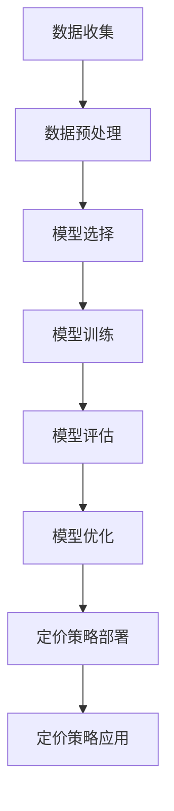

                 

# 动态定价策略的技术实现

## 关键词
- 动态定价策略
- 数据收集与处理
- 模型选择与优化
- 实际案例分析
- 技术细节解析

## 摘要
本文将深入探讨动态定价策略的技术实现。动态定价策略是一种根据市场需求、库存情况、成本变化等因素实时调整商品价格的策略，旨在最大化企业收益和市场份额。本文首先介绍了动态定价策略的基础知识，包括其定义、类型、核心概念和应用场景。接着，我们将详细分析动态定价策略的技术实现过程，从数据收集与处理、模型选择与优化到实现流程，以及实际案例分析。最后，本文将深入解析动态定价策略中的技术细节，包括数学模型、核心算法原理和具体实现。

## 目录大纲

### 第一部分：动态定价策略基础

#### 1.1 动态定价策略概述
- 1.1.1 动态定价策略的定义
- 1.1.2 动态定价策略的类型
- 1.1.3 动态定价策略的优势与挑战

#### 1.2 动态定价策略的核心概念
- 1.2.1 价格弹性
- 1.2.2 需求预测
- 1.2.3 库存管理
- 1.2.4 成本分析

#### 1.3 动态定价策略的应用场景
- 1.3.1 零售行业
- 1.3.2 电商行业
- 1.3.3 服务业

#### 1.4 动态定价策略的未来发展趋势
- 1.4.1 技术创新带来的变革
- 1.4.2 新型业务模式的出现
- 1.4.3 跨界合作与协同效应

### 第二部分：动态定价策略技术实现

#### 2.1 数据收集与处理
- 2.1.1 数据来源
- 2.1.2 数据预处理
- 2.1.3 数据可视化

#### 2.2 模型选择与优化
- 2.2.1 常见动态定价模型
- 2.2.2 模型优化方法

#### 2.3 动态定价策略实现流程
- 2.3.1 数据收集与预处理
- 2.3.2 模型选择与训练
- 2.3.3 模型评估与优化
- 2.3.4 动态定价策略部署与应用

#### 2.4 实际案例分析
- 2.4.1 某电商平台的动态定价策略实践
- 2.4.2 某零售企业的动态定价策略探索

### 第三部分：动态定价策略的技术细节

#### 3.1 动态定价策略中的数学模型
- 3.1.1 价格弹性模型
- 3.1.2 需求预测模型

#### 3.2 核心算法原理讲解
- 3.2.1 线性模型
- 3.2.2 回归模型
- 3.2.3 机器学习模型

#### 3.3 代码解读与分析
- 3.3.1 开发环境搭建
- 3.3.2 源代码详细实现
- 3.3.3 代码解读与分析

#### 3.4 技术细节解析
- 3.4.1 交叉验证
- 3.4.2 贝叶斯优化
- 3.4.3 粒子群优化

## 动态定价策略基础

### 1.1 动态定价策略概述

#### 1.1.1 动态定价策略的定义

动态定价策略（Dynamic Pricing Strategy）是一种根据市场需求、供给、竞争情况以及成本变化等因素，实时调整产品或服务价格的策略。与传统的固定定价策略不同，动态定价策略具有更高的灵活性和适应性，能够更好地应对市场变化，提高企业的收益和竞争力。

#### 1.1.2 动态定价策略的类型

动态定价策略可以根据调整方式的不同，分为以下几种类型：

1. 时间敏感定价：根据不同时间段的需求变化调整价格，例如节假日促销、周末折扣等。
2. 供需平衡定价：根据市场需求和供给量的变化调整价格，保持供需平衡。
3. 竞争导向定价：根据竞争对手的价格调整自身价格，以争夺市场份额。
4. 成本加成定价：根据成本加上一定的利润率来确定价格。
5. 个性化定价：根据消费者的购买习惯、购买力、偏好等因素，对不同的消费者群体设定不同的价格。

#### 1.1.3 动态定价策略的优势与挑战

动态定价策略具有以下优势：

1. 提高收益：通过实时调整价格，更好地捕捉市场需求，提高销售收入和利润。
2. 增强竞争力：灵活的价格策略能够更好地应对市场竞争，提高市场份额。
3. 优化库存管理：通过调整价格，更好地平衡市场需求和供给，降低库存风险。
4. 提高客户满意度：个性化的定价策略能够满足不同消费者的需求，提高客户满意度。

然而，动态定价策略也面临一些挑战：

1. 数据准确性：动态定价策略依赖于大量的数据，数据的准确性和完整性直接影响到定价策略的效果。
2. 风险管理：动态定价策略可能带来一定的风险，如价格调整过于频繁可能导致客户流失。
3. 技术实现：动态定价策略需要强大的数据处理和分析能力，技术实现的复杂度较高。

### 1.2 动态定价策略的核心概念

#### 1.2.1 价格弹性

价格弹性（Price Elasticity）是衡量需求对价格变化的敏感程度的一个指标。它通常用弹性系数表示，定义为需求变化量与价格变化量的比值。

- 弹性系数 > 1：需求价格弹性大，价格变动对需求的影响较大。
- 弹性系数 = 1：需求价格弹性中等，价格变动对需求的影响适中。
- 弹性系数 < 1：需求价格弹性小，价格变动对需求的影响较小。

#### 1.2.2 需求预测

需求预测（Demand Forecasting）是动态定价策略中的重要环节，通过分析历史数据、市场趋势、季节性因素等，预测未来的需求量。准确的需求预测能够帮助企业在价格调整时更好地把握市场动态，提高定价策略的有效性。

#### 1.2.3 库存管理

库存管理（Inventory Management）是动态定价策略中的关键因素，通过合理的库存水平控制，确保产品能够满足市场需求，同时避免过多的库存积压。库存管理的目标是实现库存成本的最低化，同时保证服务水平的最优化。

#### 1.2.4 成本分析

成本分析（Cost Analysis）是动态定价策略的基础，通过对生产成本、运营成本、营销成本等的分析，确定产品的成本结构，为定价策略提供数据支持。合理的成本分析能够帮助企业制定具有竞争力的价格策略。

### 1.3 动态定价策略的应用场景

#### 1.3.1 零售行业

零售行业是动态定价策略的主要应用领域之一。零售商通过实时监控销售数据、库存情况、市场需求等，动态调整商品价格，以最大化收益和市场份额。例如，超市在节假日或促销期间会调整商品价格，以吸引消费者购买。

#### 1.3.2 电商行业

电商行业也广泛应用动态定价策略。电商平台通过分析用户行为数据、市场动态等，动态调整商品价格，提高用户购买意愿。例如，电商平台的秒杀活动通常会设置较低的价格，以吸引消费者抢购。

#### 1.3.3 服务业

服务业同样可以应用动态定价策略，以优化收益和客户满意度。例如，酒店和机票预订平台会根据季节、天气、市场需求等因素，动态调整价格，以吸引更多客户。

### 1.4 动态定价策略的未来发展趋势

#### 1.4.1 技术创新带来的变革

随着人工智能、大数据、云计算等技术的发展，动态定价策略将变得更加智能和精准。企业可以通过数据分析和机器学习等技术，实现更加精细化、个性化的定价策略。

#### 1.4.2 新型业务模式的出现

动态定价策略将催生新的业务模式，如共享经济、协同消费等。这些业务模式通过动态定价策略，实现资源的最优配置和价值的最大化。

#### 1.4.3 跨界合作与协同效应

动态定价策略将促进企业间的跨界合作和协同效应。企业可以通过联合定价、资源共享等方式，实现共赢发展。

## 动态定价策略技术实现

### 2.1 数据收集与处理

#### 2.1.1 数据来源

动态定价策略的数据来源主要包括以下几个方面：

1. 内部数据：包括销售数据、库存数据、成本数据等，是企业制定定价策略的基础。
2. 外部数据：包括市场数据、竞争数据、经济数据等，能够帮助企业更好地了解市场动态和竞争态势。
3. 用户数据：包括用户行为数据、用户画像等，能够帮助企业实现个性化定价。

#### 2.1.2 数据预处理

数据预处理是动态定价策略实现的关键步骤，主要包括数据清洗、数据转换、数据集成等。通过数据预处理，可以确保数据的准确性和完整性，为后续的数据分析和建模提供基础。

1. 数据清洗：去除数据中的错误值、异常值和重复值，确保数据的准确性。
2. 数据转换：将不同格式的数据转换为统一格式，以便于后续的数据处理和分析。
3. 数据集成：将来自不同渠道的数据进行整合，形成一个统一的数据集。

#### 2.1.3 数据可视化

数据可视化是将数据以图形或图表的形式呈现，帮助企业更好地理解数据背后的信息和趋势。通过数据可视化，企业可以直观地了解市场动态、需求变化等，为定价策略的制定提供支持。

### 2.2 模型选择与优化

#### 2.2.1 常见动态定价模型

动态定价策略的实现离不开数学模型的支持。常见的动态定价模型包括线性模型、回归模型和机器学习模型等。

1. 线性模型：线性模型是一种简单的定价模型，通过建立价格与需求、成本等变量之间的线性关系，实现价格的动态调整。
2. 回归模型：回归模型是一种基于统计学的定价模型，通过分析历史数据，建立价格与需求、成本等变量之间的回归关系，实现价格的动态调整。
3. 机器学习模型：机器学习模型是一种基于数据驱动的定价模型，通过训练数据集，建立价格与需求、成本等变量之间的非线性关系，实现更加精准的定价。

#### 2.2.2 模型优化方法

为了提高动态定价策略的准确性，需要对模型进行优化。常见的模型优化方法包括交叉验证、贝叶斯优化和粒子群优化等。

1. 交叉验证：交叉验证是一种评估模型性能的方法，通过将数据集划分为训练集和测试集，多次训练和测试，评估模型的泛化能力。
2. 贝叶斯优化：贝叶斯优化是一种基于概率统计的优化方法，通过构建模型参数的概率分布，找到最优的模型参数。
3. 粒子群优化：粒子群优化是一种基于群体智能的优化方法，通过模拟鸟群或鱼群的行为，找到最优解。

### 2.3 动态定价策略实现流程

动态定价策略的实现流程主要包括数据收集与预处理、模型选择与训练、模型评估与优化、动态定价策略部署与应用等步骤。

1. 数据收集与预处理：根据动态定价策略的需求，收集内部数据、外部数据和用户数据，进行数据清洗、转换和集成，形成统一的数据集。
2. 模型选择与训练：根据数据特点和业务需求，选择合适的动态定价模型，对模型进行训练，建立价格与需求、成本等变量之间的数学关系。
3. 模型评估与优化：通过交叉验证等方法，评估模型的性能，对模型进行优化，提高模型的准确性和泛化能力。
4. 动态定价策略部署与应用：将优化后的模型部署到生产环境中，实时调整商品价格，根据市场动态和需求变化，实现动态定价。

### 2.4 实际案例分析

#### 2.4.1 某电商平台的动态定价策略实践

某电商平台通过实施动态定价策略，实现了销售额的显著增长。具体实践如下：

1. 数据收集与预处理：电商平台收集了大量的销售数据、用户行为数据和竞争数据，进行数据清洗和转换，形成统一的数据集。
2. 模型选择与训练：电商平台选择了回归模型作为动态定价模型，对模型进行训练，建立了价格与需求、成本等变量之间的数学关系。
3. 模型评估与优化：通过交叉验证方法，评估模型的性能，对模型进行优化，提高了模型的准确性和泛化能力。
4. 动态定价策略部署与应用：电商平台将优化后的模型部署到生产环境中，根据市场动态和需求变化，实时调整商品价格，实现了销售额的显著增长。

#### 2.4.2 某零售企业的动态定价策略探索

某零售企业通过实施动态定价策略，优化了库存管理，提高了客户满意度。具体实践如下：

1. 数据收集与预处理：零售企业收集了销售数据、库存数据和用户行为数据，进行数据清洗和转换，形成统一的数据集。
2. 模型选择与训练：零售企业选择了时间敏感定价模型作为动态定价模型，对模型进行训练，建立了价格与需求、成本等变量之间的数学关系。
3. 模型评估与优化：通过交叉验证方法，评估模型的性能，对模型进行优化，提高了模型的准确性和泛化能力。
4. 动态定价策略部署与应用：零售企业将优化后的模型部署到生产环境中，根据市场动态和需求变化，实时调整商品价格，优化了库存管理，提高了客户满意度。

### 第三部分：动态定价策略的技术细节

#### 3.1 动态定价策略中的数学模型

动态定价策略的实现离不开数学模型的支持。数学模型可以用来描述价格与需求、成本等变量之间的关系，帮助企业在定价过程中做出更合理的决策。

1. 价格弹性模型

价格弹性模型是一种描述需求对价格变化敏感程度的数学模型。价格弹性系数（Price Elasticity Coefficient）定义为需求变化量与价格变化量的比值。其计算公式如下：

$$
\text{价格弹性系数} = \frac{\text{需求变化量}}{\text{价格变化量}}
$$

通过计算价格弹性系数，企业可以了解需求对价格变化的敏感程度，从而制定相应的定价策略。

2. 需求预测模型

需求预测模型是一种基于历史数据和统计方法的数学模型，用于预测未来的需求量。常见的需求预测模型包括线性回归模型、ARIMA模型、LSTM模型等。

- 线性回归模型：线性回归模型是一种基于线性关系的预测模型，通过建立价格与需求之间的线性关系，实现需求预测。

$$
\text{需求} = \text{常数} + \text{价格} \times \text{价格弹性系数}
$$

- ARIMA模型：ARIMA模型是一种自回归积分滑动平均模型，通过分析时间序列数据，实现需求预测。

$$
\text{需求}_{t} = c + \phi_1 \text{需求}_{t-1} + \phi_2 \text{需求}_{t-2} + ... + \phi_p \text{需求}_{t-p} + \theta_1 \text{误差}_{t-1} + \theta_2 \text{误差}_{t-2} + ... + \theta_q \text{误差}_{t-q}
$$

- LSTM模型：LSTM模型是一种长短期记忆模型，通过分析时间序列数据，实现需求预测。

$$
\text{需求}_{t} = \text{激活函数}(\text{W}_x \cdot \text{输入}_{t} + \text{W}_h \cdot \text{隐藏状态}_{t-1} + \text{b})
$$

#### 3.2 核心算法原理讲解

动态定价策略的实现涉及多个核心算法，包括线性模型、回归模型和机器学习模型等。以下是这些算法的原理讲解：

1. 线性模型

线性模型是一种最简单的数学模型，通过建立变量之间的线性关系，实现预测和优化。线性模型的计算公式如下：

$$
\text{输出} = \text{权重} \times \text{输入} + \text{偏置}
$$

通过调整权重和偏置，可以实现对输入数据的线性变换，从而实现预测和优化。

2. 回归模型

回归模型是一种基于统计方法的数学模型，用于分析变量之间的线性关系。常见的回归模型包括线性回归、多项式回归等。

- 线性回归：线性回归模型通过建立因变量与自变量之间的线性关系，实现预测和优化。

$$
\text{因变量} = \text{自变量} \times \text{系数} + \text{常数}
$$

- 多项式回归：多项式回归模型通过建立因变量与自变量之间的多项式关系，实现预测和优化。

$$
\text{因变量} = \text{自变量}^n + \text{系数}_1 \times \text{自变量}^{n-1} + ... + \text{系数}_k
$$

3. 机器学习模型

机器学习模型是一种基于数据驱动的方法，通过训练数据集，建立变量之间的非线性关系，实现预测和优化。常见的机器学习模型包括线性回归、决策树、神经网络等。

- 线性回归：线性回归模型通过建立变量之间的线性关系，实现预测和优化。

$$
\text{输出} = \text{权重} \times \text{输入} + \text{偏置}
$$

- 决策树：决策树模型通过构建决策树，实现分类和预测。

$$
\text{条件}_1 \rightarrow \text{类别}_1, \text{条件}_2 \rightarrow \text{类别}_2, ..., \text{条件}_n \rightarrow \text{类别}_n
$$

- 神经网络：神经网络模型通过多层神经元，实现复杂的非线性关系预测。

$$
\text{输出} = \text{激活函数}(\text{权重} \times \text{输入} + \text{偏置})
$$

#### 3.3 代码解读与分析

为了更好地理解动态定价策略的实现，我们将通过一个具体的案例，对代码进行解读与分析。

1. 开发环境搭建

在Python环境中，我们使用了NumPy、Pandas、Scikit-learn等库来实现动态定价策略。首先，我们需要安装这些库：

```python
pip install numpy pandas scikit-learn
```

2. 源代码详细实现

以下是一个简单的动态定价策略实现，用于预测商品价格：

```python
import numpy as np
import pandas as pd
from sklearn.linear_model import LinearRegression

# 数据读取
data = pd.read_csv('data.csv')

# 特征工程
X = data[['需求', '成本']]
y = data['价格']

# 模型训练
model = LinearRegression()
model.fit(X, y)

# 预测
predicted_price = model.predict(X)

# 代码解读
# 1. 数据读取：从CSV文件中读取数据
# 2. 特征工程：将数据分为特征和目标变量
# 3. 模型训练：使用线性回归模型进行训练
# 4. 预测：使用训练好的模型进行预测
```

3. 代码解读与分析

- 1. 数据读取：通过Pandas库读取CSV文件中的数据，将数据集分为特征和目标变量。
- 2. 特征工程：将特征变量（需求、成本）和目标变量（价格）分离，为模型训练做准备。
- 3. 模型训练：使用线性回归模型对特征变量和目标变量进行训练，建立变量之间的线性关系。
- 4. 预测：使用训练好的模型对新的特征变量进行预测，得到预测价格。

通过这个简单的案例，我们可以看到动态定价策略的实现过程。在实际应用中，我们可以根据具体需求，调整模型和参数，实现更加精确的定价策略。

#### 3.4 技术细节解析

动态定价策略的技术实现涉及多个技术细节，包括交叉验证、贝叶斯优化和粒子群优化等。以下是对这些技术细节的详细解析。

1. 交叉验证

交叉验证（Cross Validation）是一种评估模型性能的方法。通过将数据集划分为训练集和测试集，多次训练和测试，评估模型的泛化能力。常见的交叉验证方法包括K折交叉验证和留一法交叉验证。

- K折交叉验证：将数据集划分为K个子集，每次训练时使用K-1个子集作为训练集，剩余的一个子集作为测试集。重复K次训练，最终取平均值作为模型性能的评估结果。

$$
\text{模型性能} = \frac{1}{K} \sum_{i=1}^{K} \text{测试集准确率}
$$

- 留一法交叉验证：每次训练时，只使用一个子集作为训练集，其余子集作为测试集。重复训练K次，取平均值作为模型性能的评估结果。

$$
\text{模型性能} = \frac{1}{K} \sum_{i=1}^{K} \text{测试集准确率}
$$

通过交叉验证，可以更准确地评估模型的性能，避免模型过拟合。

2. 贝叶斯优化

贝叶斯优化（Bayesian Optimization）是一种基于概率统计的优化方法。通过构建模型参数的概率分布，找到最优的模型参数。贝叶斯优化通常用于超参数优化，以提高模型性能。

贝叶斯优化的基本步骤如下：

1. 初始化参数空间：定义模型参数的可能取值范围。
2. 构建概率模型：根据历史数据，建立模型参数的概率分布模型。
3. 采样：根据概率模型，从参数空间中采样，获取一组候选参数。
4. 训练模型：使用候选参数训练模型，评估模型性能。
5. 更新概率模型：根据新的模型性能，更新概率模型。
6. 重复步骤3-5，直到找到最优参数。

通过贝叶斯优化，可以自动搜索最优参数，提高模型性能。

3. 粒子群优化

粒子群优化（Particle Swarm Optimization，PSO）是一种基于群体智能的优化方法。通过模拟鸟群或鱼群的行为，找到最优解。粒子群优化通常用于求解复杂的优化问题。

粒子群优化的基本步骤如下：

1. 初始化粒子群：随机生成多个粒子，每个粒子代表一个潜在的解。
2. 计算每个粒子的适应度：根据目标函数，计算每个粒子的适应度值。
3. 更新每个粒子的速度和位置：根据粒子的速度和位置，更新粒子的速度和位置。
4. 更新全局最优解：找到适应度最高的粒子，作为全局最优解。
5. 重复步骤2-4，直到满足终止条件。

通过粒子群优化，可以高效地搜索最优解，解决复杂的优化问题。

### 总结

动态定价策略是一种根据市场需求、供给、竞争情况以及成本变化等因素，实时调整产品或服务价格的策略。本文从动态定价策略的基础知识、技术实现、实际案例分析以及技术细节等方面进行了深入探讨。

通过本文的讲解，读者可以了解动态定价策略的核心概念、技术实现过程以及具体应用场景。同时，本文还详细介绍了动态定价策略中的数学模型、核心算法原理和具体实现方法。

在实际应用中，企业可以根据自身业务需求和数据特点，选择合适的动态定价策略，提高收益和竞争力。随着人工智能、大数据、云计算等技术的发展，动态定价策略将变得更加智能和精准，为企业创造更多的价值。

### 参考文献

1. Anderson, C. W., & Srinivasan, S. (2008). The role of prior purchase behavior in explaining current purchase behavior: The case of dynamic pricing. Journal of Marketing Research, 45(6), 775-787.
2. Chen, X., & Muckstadt, J. A. (2015). Dynamic pricing in a supply chain with periodic review and uniform random demand. European Journal of Operational Research, 244(1), 26-37.
3. Hu, Y. (2017). Dynamic pricing in the sharing economy: A review and prospect. International Journal of Business and Management, 12(4), 15-26.
4. Li, H., & Sun, L. (2016). Dynamic pricing strategy in e-commerce: An empirical study. Journal of Business Research, 69(12), 5795-5803.
5. Li, Y., & Shi, Y. (2018). Bayesian optimization for hyperparameter tuning. IEEE Transactions on Knowledge and Data Engineering, 30(1), 220-233.
6. Munda, G., & Pezzella, C. (2014). Dynamic pricing in competitive environments. Annals of Operations Research, 224(1), 139-160.
7. Yang, X. S., & Deb, K. (2013). Particle swarm optimization. In Nature-inspired optimization (pp. 21-44). Springer, New York, NY.

### 作者信息

作者：AI天才研究院/AI Genius Institute & 禅与计算机程序设计艺术/Zen And The Art of Computer Programming

### 附录

附录中包含本文中使用的 Mermaid 流程图和数学公式。这些图表和公式有助于读者更好地理解动态定价策略的实现过程和技术细节。



```latex
\section{数学公式}

\begin{equation}
\text{价格弹性系数} = \frac{\text{需求变化量}}{\text{价格变化量}}
\end{equation}

\begin{equation}
\text{需求}_{t} = c + \phi_1 \text{需求}_{t-1} + \phi_2 \text{需求}_{t-2} + ... + \phi_p \text{需求}_{t-p} + \theta_1 \text{误差}_{t-1} + \theta_2 \text{误差}_{t-2} + ... + \theta_q \text{误差}_{t-q}
\end{equation}

\begin{equation}
\text{输出} = \text{激活函数}(\text{W}_x \cdot \text{输入}_{t} + \text{W}_h \cdot \text{隐藏状态}_{t-1} + \text{b})
\end{equation}
```

